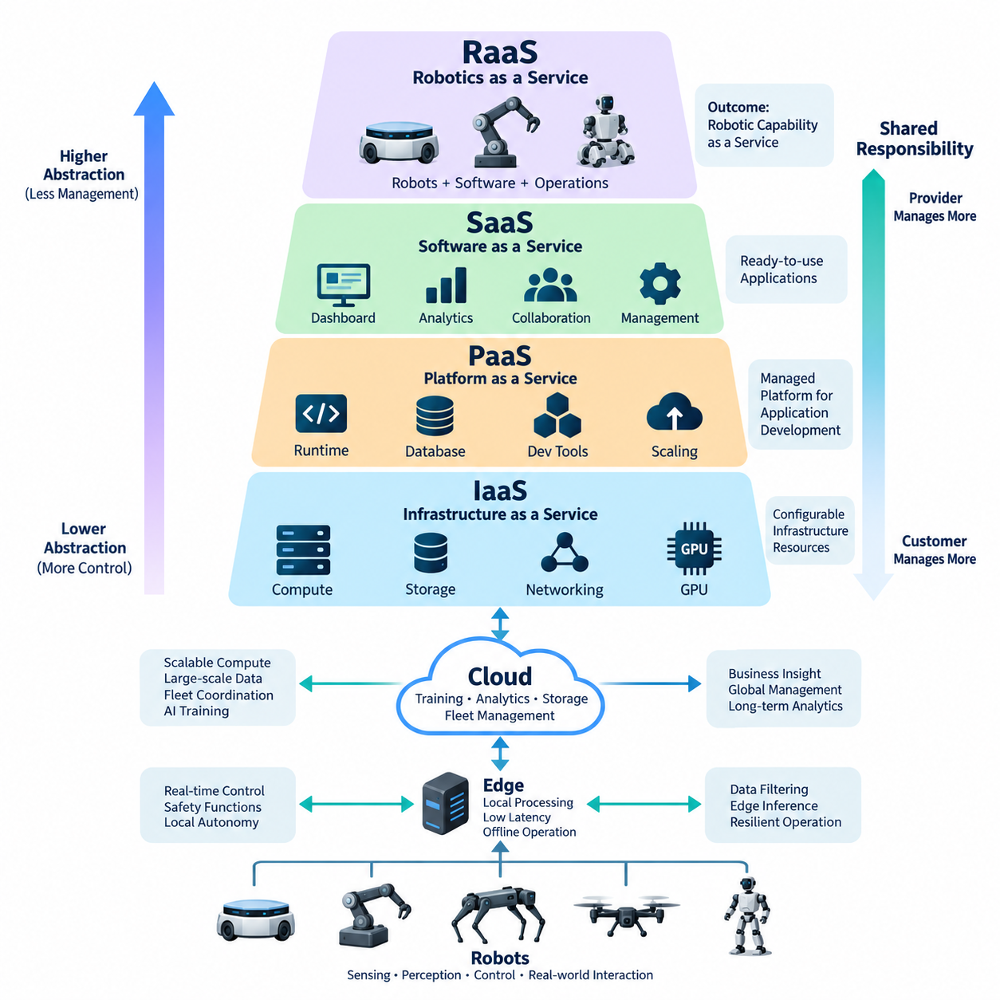
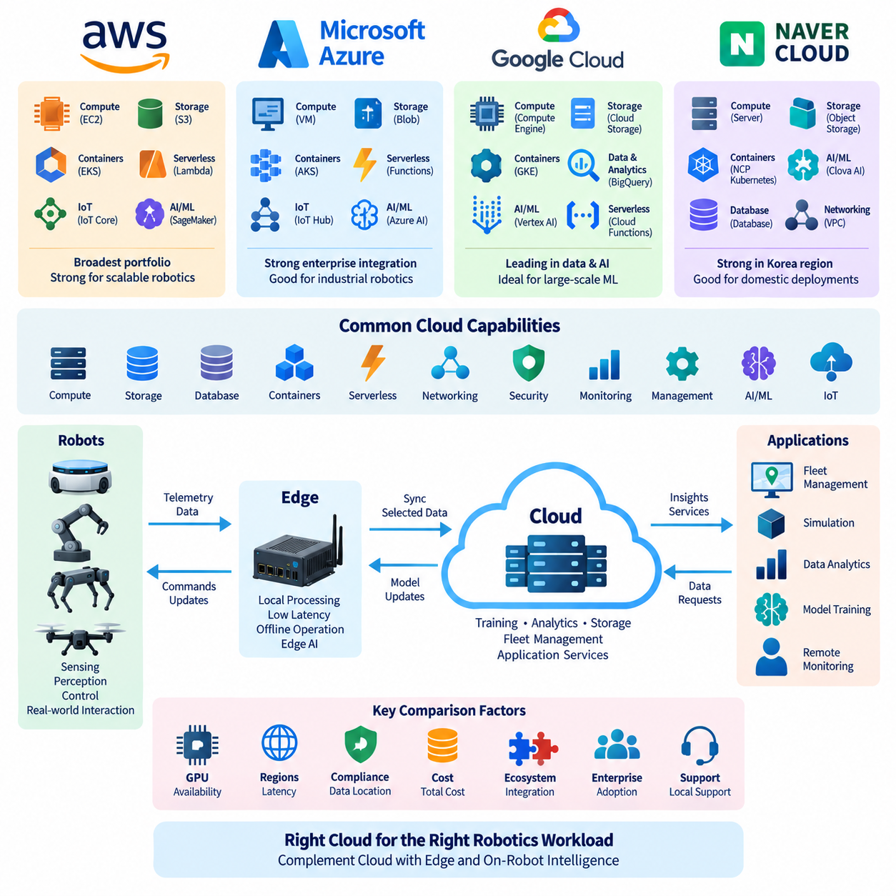
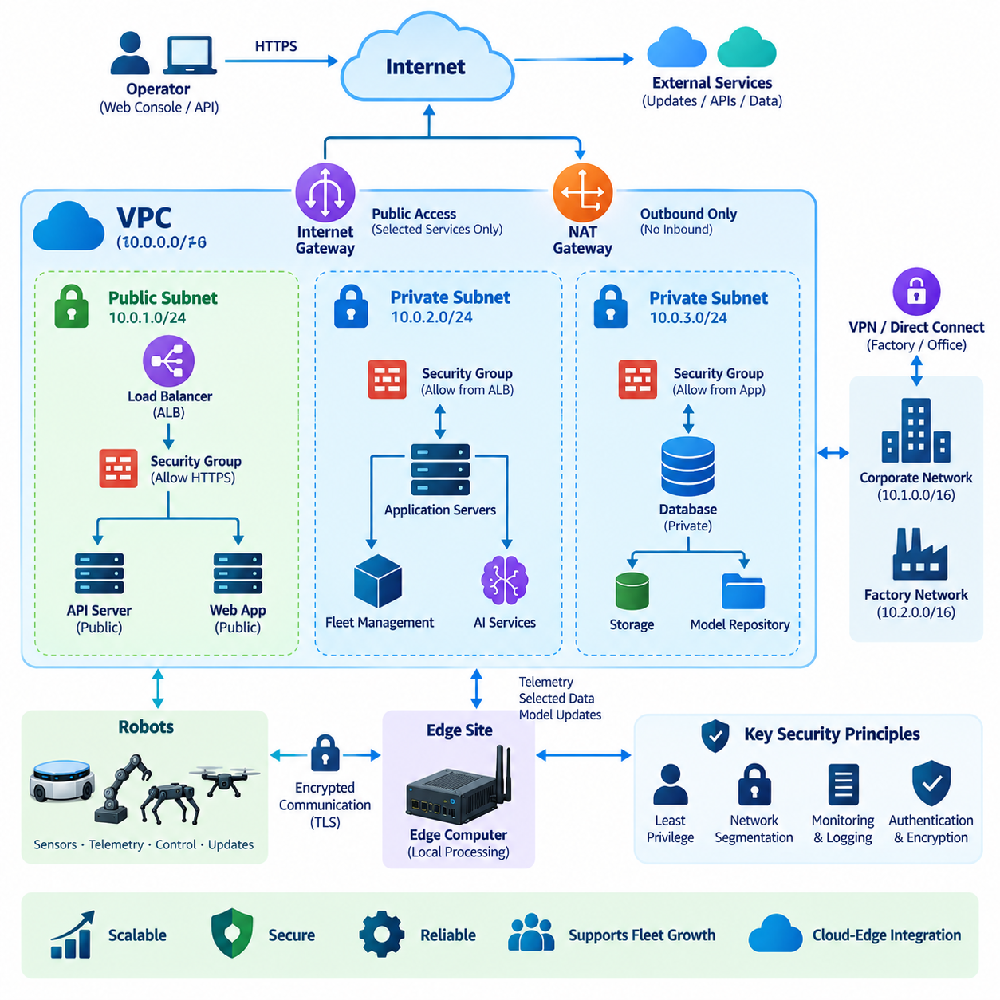
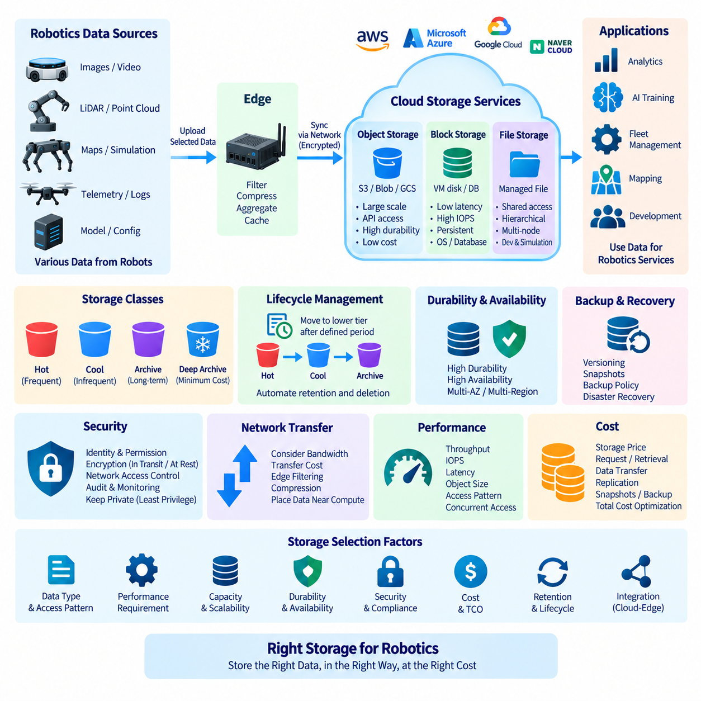
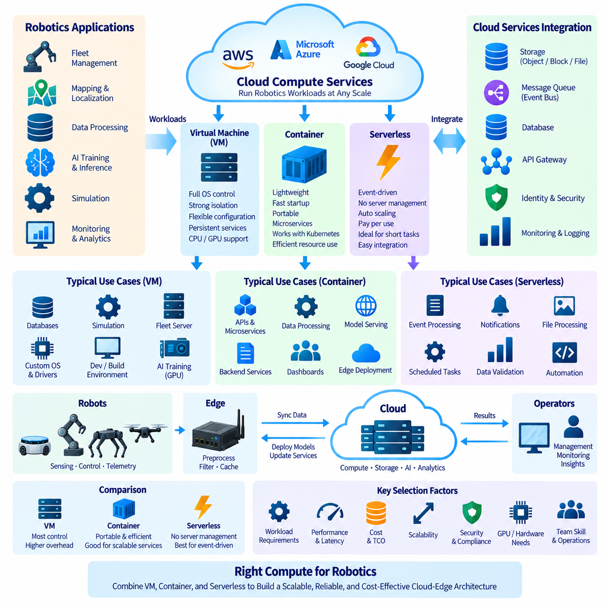
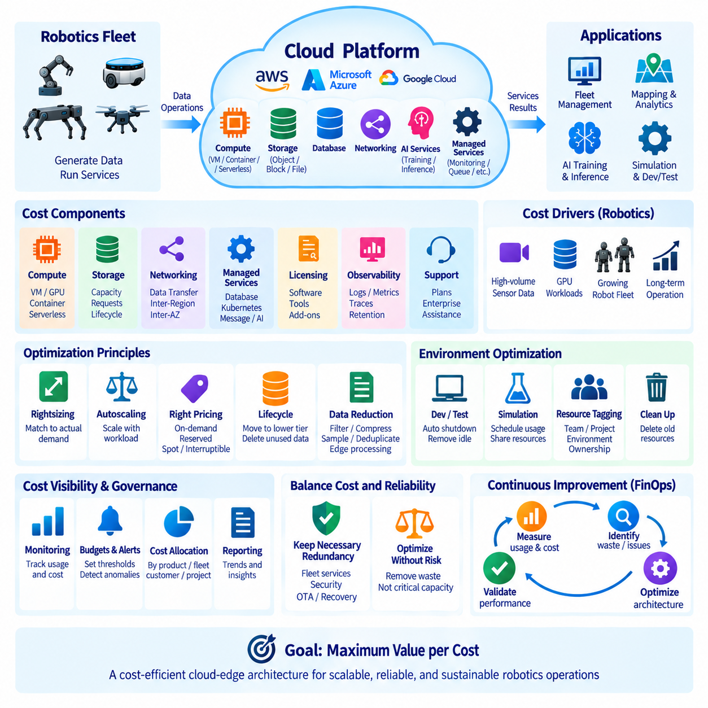
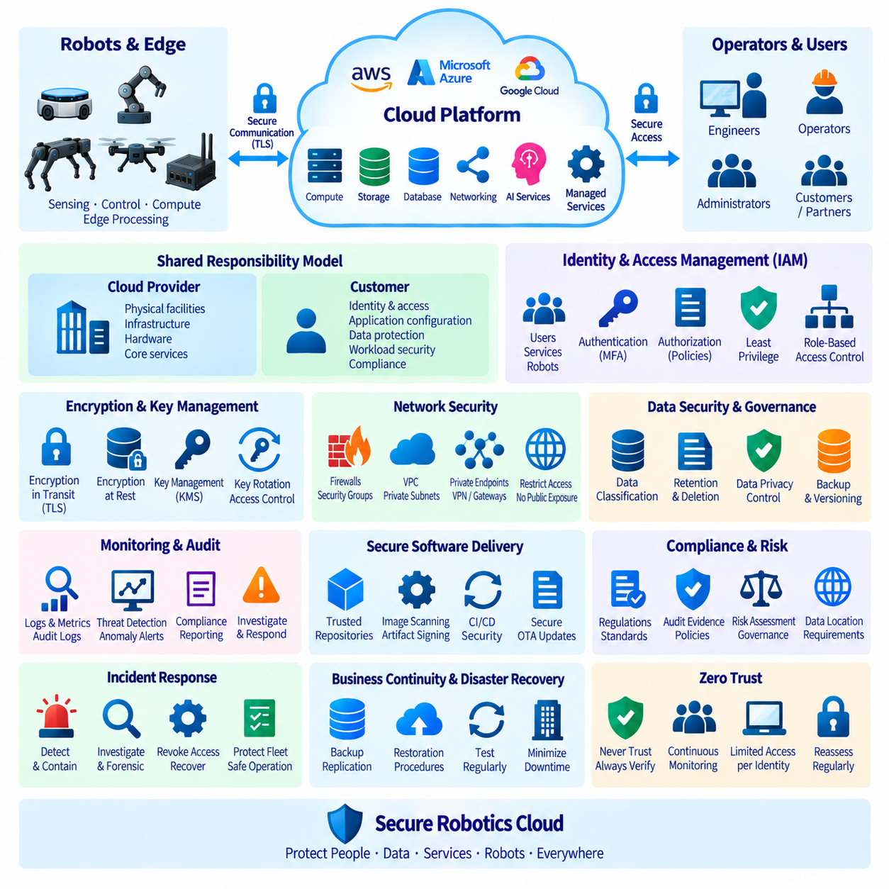
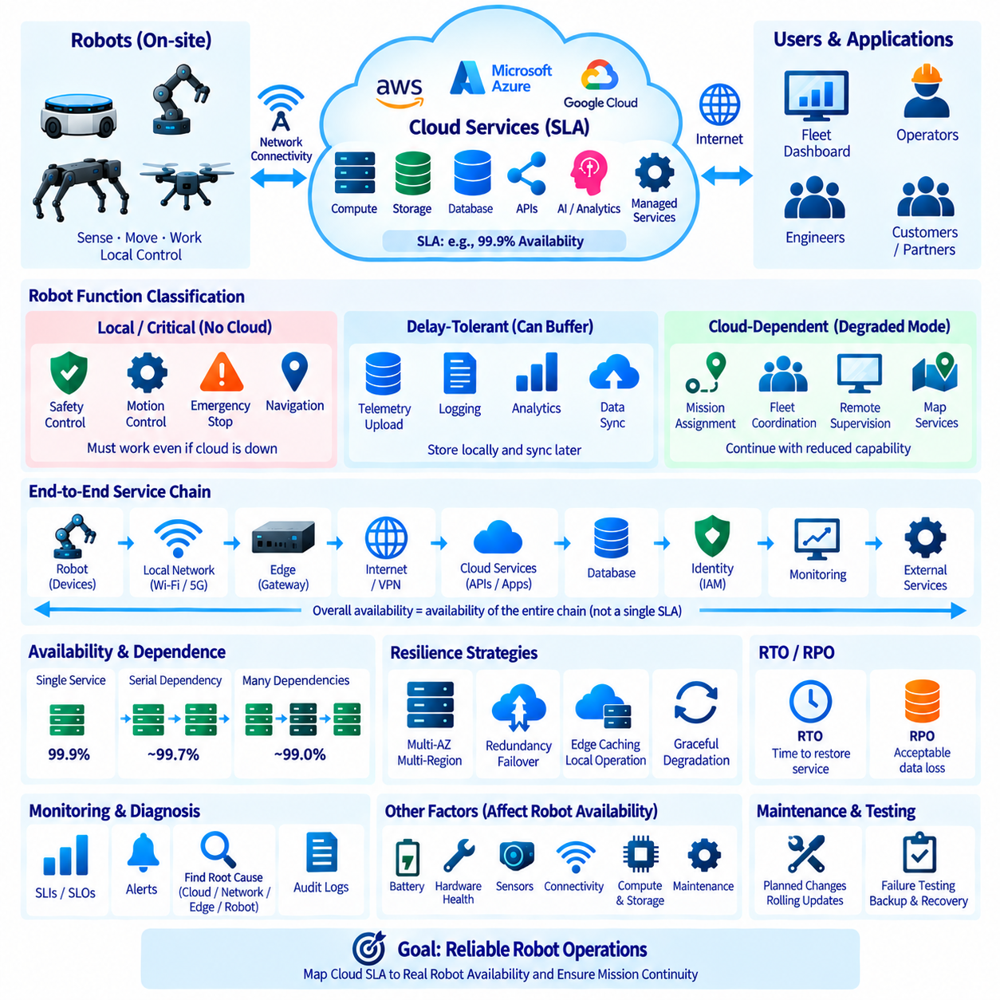
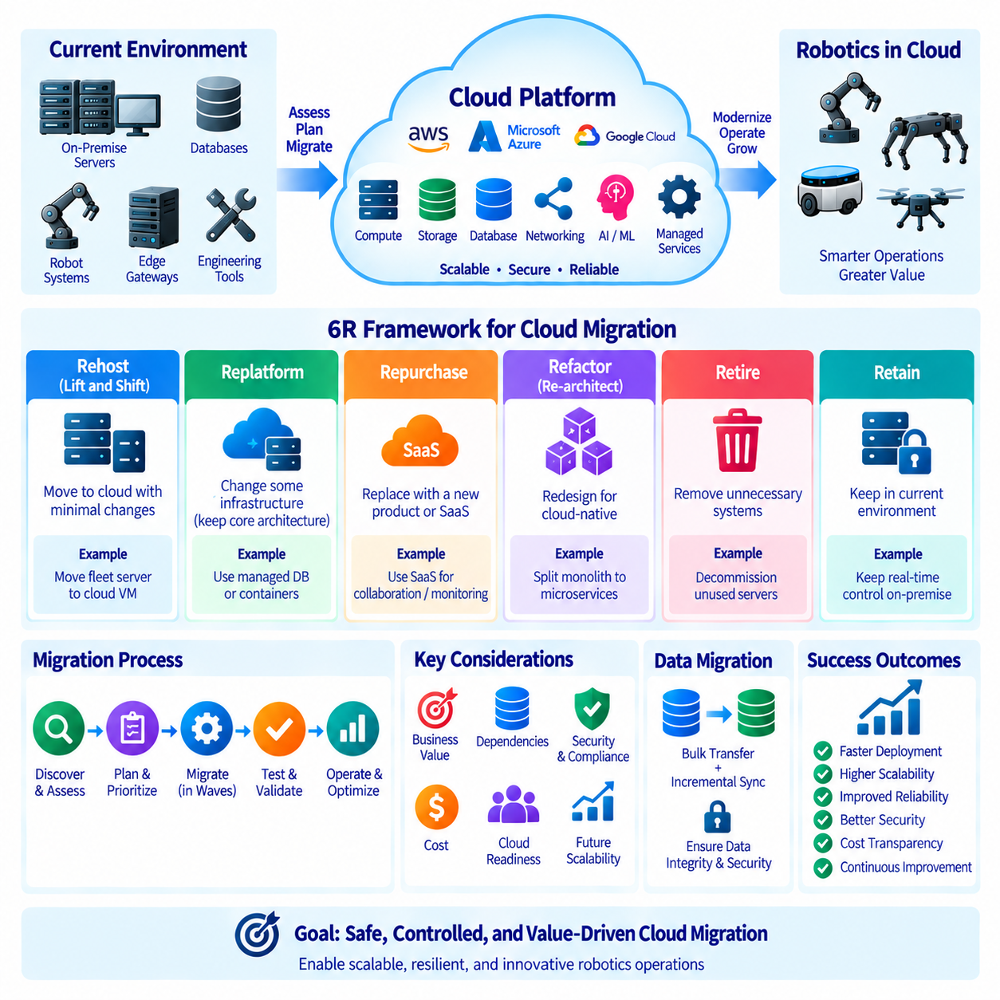
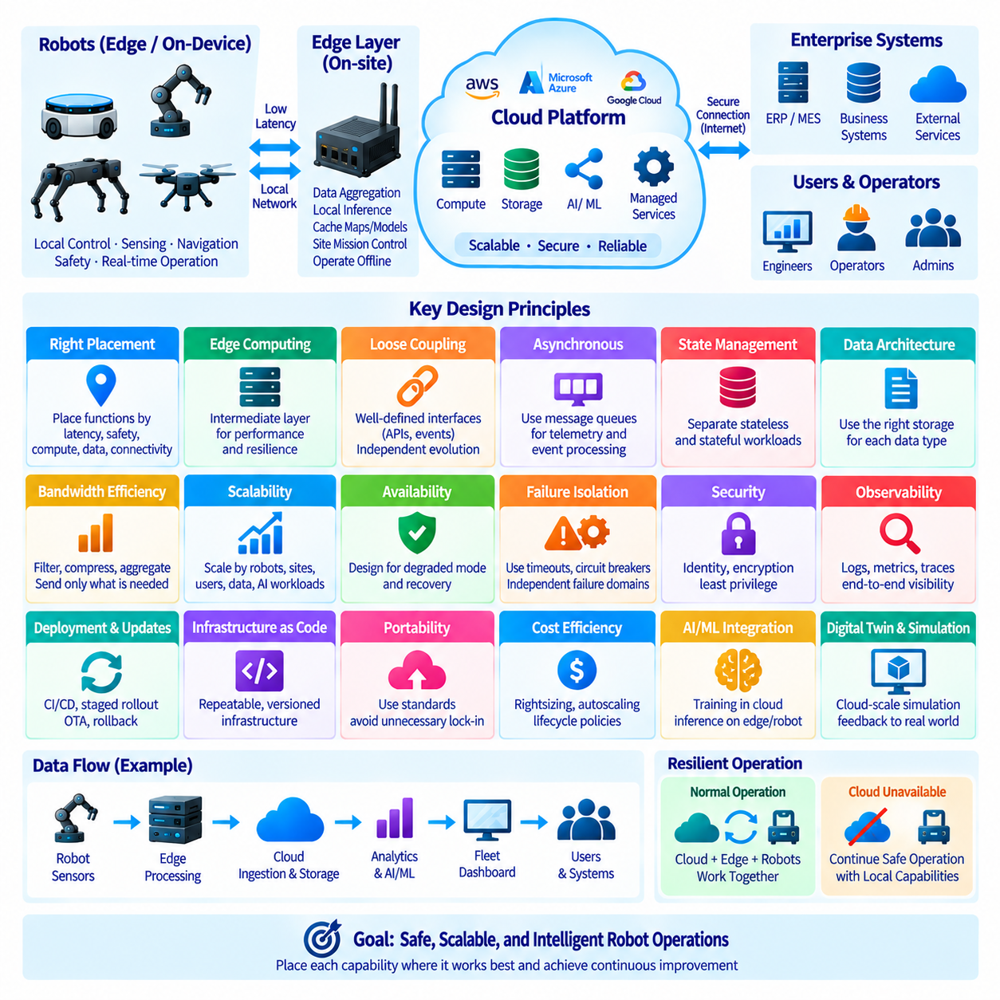

**Volume 09 Cloud and Edge Robotics**

# 01. Cloud Computing Fundamentals

## 01.01 Cloud Service Models: IaaS, PaaS, SaaS, RaaS

{width="7.268055555555556in" height="7.268055555555556in"}

클라우드 컴퓨팅(Cloud Computing)은 공급자(Provider)와 고객(Customer) 사이에서 책임이 어떻게 분담되는지를 정의하는 서비스 모델(Service Model)에 따라 컴퓨팅 자원을 구성한다. 로보틱스(Robotics)에서는 실제 환경에서 동작하는 물리적 기계와 원격 컴퓨팅 인프라가 결합되므로 이러한 구분이 특히 중요하다. 서비스 모델은 서버, 운영체제(Operating System), 런타임 환경(Runtime Environment), 애플리케이션(Application), 데이터(Data), 보안 제어(Security Control), 운영 가용성(Operational Availability)을 누가 관리할 것인지를 결정한다.

서비스형 인프라(Infrastructure as a Service, IaaS)는 가상 머신(Virtual Machine), 네트워크(Network), 스토리지(Storage), 로드 밸런서(Load Balancer), 가속기(Accelerator)가 탑재된 인스턴스(Instance)와 같은 기본적인 컴퓨팅 자원을 제공한다. 클라우드 공급자는 물리적 데이터센터(Data Center)와 가상화 인프라(Virtualization Infrastructure)를 운영하며, 로보틱스 개발자는 일반적으로 할당된 자원에서 운영체제, 미들웨어(Middleware), 데이터베이스(Database), 컨테이너(Container), AI 프레임워크(AI Framework), 애플리케이션 소프트웨어(Application Software)를 관리한다.

서비스형 인프라(IaaS)는 로보틱스 개발팀이 소프트웨어 환경에 대한 광범위한 제어 권한을 필요로 할 때 유용하다. 플릿 관리 백엔드(Fleet Management Backend), 시뮬레이션 서버(Simulation Server), 지도 처리 클러스터(Map Processing Cluster), AI 학습 시스템(AI Training System) 등을 특정 CPU, GPU, 메모리(Memory), 스토리지, 네트워크 특성을 가진 가상 머신에 배포할 수 있다. 이러한 유연성은 기반 데이터센터 하드웨어를 직접 구매하고 유지관리하지 않으면서 기존 서버를 운영하는 것과 유사한 환경을 제공한다.

서비스형 인프라(IaaS)의 유연성에는 그에 상응하는 운영 책임이 따른다. 개발팀은 운영체제 업데이트, 접근 제어(Access Control), 네트워크 보안(Network Security), 모니터링(Monitoring), 백업 정책(Backup Policy), 애플리케이션 배포(Application Deployment), 용량 관리(Capacity Management)를 구성해야 한다. 따라서 인프라 자동화 도구(Infrastructure Automation Tool)와 컨테이너 플랫폼(Container Platform)이 IaaS와 함께 사용되는 경우가 많다. 로보틱스 워크로드(Robotics Workload)가 시간에 따라 크게 변화한다면 집중적인 시뮬레이션이나 학습 기간에는 인프라를 확장하고 수요가 감소하면 다시 축소할 수 있다.

서비스형 플랫폼(Platform as a Service, PaaS)은 더 많은 인프라 관리 책임을 클라우드 공급자에게 이전한다. 개발자가 개별 운영체제와 런타임 환경을 직접 유지하는 대신 관리형 플랫폼(Managed Platform)에 애플리케이션을 배포한다. 공급자는 일반적으로 서버 프로비저닝(Server Provisioning), 운영체제 유지관리, 런타임 가용성(Runtime Availability), 확장 메커니즘(Scaling Mechanism), 일부 모니터링을 담당하므로 개발팀은 로봇과 관련된 애플리케이션 로직(Application Logic)에 더욱 집중할 수 있다.

로보틱스 분야의 서비스형 플랫폼(PaaS) 워크로드에는 텔레메트리 처리(Telemetry Processing), 플릿 API(Fleet API), 장치 등록 서비스(Device Registration Service), 임무 데이터베이스(Mission Database), 대시보드(Dashboard), AI 애플리케이션 백엔드(AI Application Backend) 등이 포함될 수 있다. 개발자는 각각의 기반 서버를 직접 구성하지 않고도 로봇 상태 메시지를 수신하고, 운영 이벤트를 처리하고, 구조화된 정보를 저장하며, 그 결과를 플릿 관리 애플리케이션에 제공하는 서비스를 구축할 수 있다. 이는 인프라 관리 부담을 줄여 주지만 IaaS와 비교하면 저수준 제어(Low-Level Control)는 제한된다.

서비스형 소프트웨어(Software as a Service, SaaS)는 사용자가 웹 인터페이스(Web Interface), API 또는 클라이언트 소프트웨어(Client Software)를 통해 접근할 수 있는 완성된 애플리케이션을 제공한다. 공급자는 인프라, 운영체제, 런타임 환경, 애플리케이션 배포, 업데이트 및 대부분의 플랫폼 유지관리를 담당한다. 고객은 전체 소프트웨어 스택(Software Stack)을 직접 개발하고 운영하기보다 서비스를 설정하고 사용자와 데이터를 관리하며 해당 애플리케이션을 운영 프로세스(Operational Process)에 통합하는 데 집중한다.

로보틱스 조직에서 서비스형 소프트웨어(SaaS)는 협업(Collaboration), 모니터링, 분석(Analytics), 프로젝트 관리(Project Management), 시각화(Visualization) 및 기타 운영 기능을 지원할 수 있다. 예를 들어 클라우드 기반 플릿 대시보드(Cloud-Hosted Fleet Dashboard)는 관리형 애플리케이션을 통해 로봇 위치, 배터리 상태, 경보(Alarm), 임무 이력(Mission History), 유지보수 정보를 제공할 수 있다. SaaS는 조직이 동일한 플랫폼을 내부적으로 직접 구축할 필요가 없기 때문에 빠른 도입이 가능하지만, 사용자 정의(Customization)와 인프라 제어에는 일반적으로 더 많은 제약이 존재한다.

서비스형 로보틱스(Robotics as a Service, RaaS)는 서비스 개념을 소프트웨어와 컴퓨팅 인프라에서 실제 로봇 운영 역량(Robotic Operational Capability)까지 확장한다. 고객이 로봇을 구매하고 모든 지원 시스템을 독립적으로 구축하는 대신 정의된 로봇 기능을 지속적인 서비스 형태로 이용한다. 이 서비스에는 로봇, 소프트웨어, 플릿 관리, 클라우드 인프라, 유지보수, 모니터링, 업데이트, 기술 지원(Technical Support), 운영 분석(Operational Analytics)이 하나의 통합된 상업적·기술적 모델에 포함될 수 있다.

서비스형 로보틱스(RaaS)는 서비스 경계(Service Boundary)에 실제 세계와 상호작용하는 물리적 자산(Physical Asset)이 포함된다는 점에서 일반적인 SaaS와 근본적으로 다르다. 예를 들어 창고 자율이동로봇(Autonomous Mobile Robot, AMR) 서비스는 소프트웨어 가용성뿐만 아니라 로봇 충전, 내비게이션 신뢰성(Navigation Reliability), 기계적 유지보수(Mechanical Maintenance), 센서 상태(Sensor Health), 현장 연결성(Site Connectivity), 교체 절차(Replacement Procedure), 안전 운용(Safe Operation)까지 관리해야 한다. 따라서 서비스 품질은 물리적 로봇, 엣지 컴퓨팅(Edge Computing), 네트워크, 클라우드 서비스의 통합 관리에 의해 결정된다.

네 가지 서비스 모델은 기술적 책임의 소유 주체가 단계적으로 변화하는 구조로 이해할 수 있다. IaaS는 구성 가능한 인프라(Configurable Infrastructure)를 제공하고, PaaS는 관리형 애플리케이션 플랫폼(Managed Application Platform)을 제공하며, SaaS는 완성된 소프트웨어 기능을 제공하고, RaaS는 실제 로봇 운영 역량을 제공한다. 이러한 모델은 서로 배타적이지 않다. 하나의 RaaS 플랫폼은 내부적으로 SaaS 애플리케이션, PaaS 데이터베이스, 컨테이너 서비스(Container Service), IaaS GPU 자원을 활용하면서 고객에게는 하나의 통합된 로보틱스 서비스로 제공될 수 있다.

이러한 계층적 관계(Layered Relationship)는 클라우드 및 엣지 로보틱스(Cloud and Edge Robotics)에서 특히 중요하다. 로봇의 모든 워크로드를 원격 데이터센터로 단순히 이전할 수 없기 때문이다. 모션 제어(Motion Control), 비상 대응(Emergency Handling), 장애물 회피(Obstacle Avoidance)와 같이 지연시간에 민감하거나 안전과 관련된 기능은 일반적으로 로컬 실행(Local Execution)이 필요하다. 반면 클라우드 자원은 플릿 전체의 협업, 이력 분석(Historical Analytics), 대규모 데이터 저장, AI 학습, 보고 및 네트워크 지연이나 일시적인 연결 단절을 허용할 수 있는 계산 작업에 더욱 적합하다.

따라서 서비스 모델을 선택할 때는 단순히 클라우드 사용의 편리성만 고려해서는 안 되며, 지연시간(Latency), 대역폭(Bandwidth), 연결성(Connectivity), 데이터 민감도(Data Sensitivity), 확장성(Scalability), 운영 제어(Operational Control), 엔지니어링 자원(Engineering Resources), 생애주기 비용(Lifecycle Cost)을 함께 고려해야 한다. IaaS는 높은 유연성을 제공하지만 더 많은 운영 전문성이 필요하며, PaaS는 인프라 관리 부담을 줄이고, SaaS는 애플리케이션 소유 및 관리 부담을 최소화하며, RaaS는 기술 및 운영 책임의 훨씬 더 큰 부분을 로보틱스 서비스 공급자에게 이전할 수 있다.

보안 책임(Security Responsibility) 역시 서비스가 관리형으로 전환된다고 해서 사라지는 것이 아니라 모델에 따라 분담 방식이 달라진다. IaaS에서는 고객이 운영체제와 애플리케이션에 대한 상당한 책임을 유지한다. PaaS에서는 플랫폼 관리의 더 많은 부분이 공급자에게 이전되지만 고객은 여전히 애플리케이션 동작, 아이덴티티(Identity), 구성(Configuration), 데이터에 대한 책임을 가진다. SaaS는 인프라 책임을 더욱 줄이지만 조직은 계정(Account), 권한(Permission), 통합(Integration), 정보 거버넌스(Information Governance), 적절한 서비스 사용을 계속 관리해야 한다.

서비스형 로보틱스(RaaS)는 사이버보안(Cybersecurity)을 물리적 안전(Physical Safety) 및 운영 연속성(Operational Continuity)과 함께 관리해야 하므로 더욱 광범위한 공동 책임 경계(Shared-Responsibility Boundary)를 형성한다. 인증정보(Credential) 침해, 네트워크 연결 불가, 잘못된 소프트웨어 업데이트 또는 클라우드 서비스 장애는 플릿 운영에 영향을 줄 수 있다. 따라서 견고한 RaaS 아키텍처는 클라우드 권한(Cloud Authority)과 로컬 로봇 권한(Local Robot Authority) 사이의 경계를 명확하게 정의하여 원격 서비스가 중단되더라도 필수적인 로컬 안전 기능과 운영 기능이 자동으로 상실되지 않도록 해야 한다.

비용 구조(Cost Structure) 역시 각 모델에 따라 달라진다. IaaS 비용은 사용한 컴퓨팅 자원, 스토리지, 네트워크 트래픽(Network Traffic), 가속기, 운영 시간과 밀접하게 연관된다. PaaS와 SaaS는 관리형 서비스 비용 또는 구독 기반 가격(Subscription Pricing)의 비중이 증가하며, RaaS는 로봇 수, 운영 시간, 완료된 작업, 처리량(Throughput), 가용성 또는 서비스 수준(Service Level)에 따라 비용이 책정될 수 있다. 따라서 이러한 모델을 평가할 때는 공급자 이용료뿐만 아니라 엔지니어링 인력, 유지보수, 지원, 인프라 활용률(Infrastructure Utilization), 운영 위험(Operational Risk)까지 함께 고려해야 한다.

따라서 로보틱스 아키텍트(Robotics Architect)의 실질적인 목표는 하나의 보편적인 서비스 모델을 선택하는 것이 아니라 각각의 책임을 적절한 계층에 배치하는 것이다. 저수준 로봇 제어는 로봇 내부에 유지하고, 현장 전체의 처리는 엣지(Edge)에서 수행하며, 확장 가능한 컴퓨팅과 스토리지는 IaaS 또는 PaaS를 활용하고, 비즈니스 애플리케이션은 SaaS를 사용할 수 있다. 궁극적으로 고객에게는 이러한 요소가 결합된 전체 로봇 역량을 RaaS 형태로 제공할 수 있으며, 이러한 계층적 접근 방식은 이후의 클라우드-엣지 아키텍처(Cloud-Edge Architecture) 설계를 위한 기반을 형성한다.

## 01.02 Cloud Provider Comparison: AWS, Azure, GCP, Naver

{width="7.268055555555556in" height="7.268055555555556in"}

아마존 웹 서비스(Amazon Web Services, AWS), 마이크로소프트 애저(Microsoft Azure), 구글 클라우드 플랫폼(Google Cloud Platform, GCP), 네이버 클라우드(Naver Cloud)는 인프라 호스팅(Infrastructure Hosting)부터 AI 학습(AI Training), 데이터 관리(Data Management), 플릿 서비스(Fleet Service), 엣지 통합(Edge Integration)에 이르기까지 로보틱스 애플리케이션을 지원할 수 있는 서로 다른 클라우드 생태계(Cloud Ecosystem)를 제공한다. 기본 기능은 상당 부분 중복되지만 서비스 포트폴리오, 생태계 통합, 지역 가용성, 운영 도구, 기업 환경 적용 측면의 차이가 아키텍처 결정에 영향을 줄 수 있다.

아마존 웹 서비스(AWS)는 컴퓨팅, 스토리지(Storage), 네트워킹(Networking), 데이터베이스(Database), 분석(Analytics), 컨테이너(Container), 서버리스 컴퓨팅(Serverless Computing), 사물인터넷(Internet of Things, IoT), 보안(Security), 머신러닝(Machine Learning)을 포괄하는 광범위한 클라우드 포트폴리오를 제공한다. 이러한 인프라 서비스는 로봇 플릿 백엔드(Robot Fleet Backend), 텔레메트리 파이프라인(Telemetry Pipeline), 시뮬레이션 워크로드(Simulation Workload), 대규모 데이터셋 저장, AI 학습을 지원할 수 있다. EC2는 구성 가능한 가상 머신(Virtual Machine)을 제공하며, S3는 센서 로그, 지도, 이미지, 모델, 학습 데이터셋에 적합한 객체 스토리지(Object Storage)를 제공한다.

컨테이너화된 로보틱스 백엔드(Containerized Robotics Backend)를 위해 AWS는 엘라스틱 컨테이너 서비스(Elastic Container Service, ECS)와 엘라스틱 쿠버네티스 서비스(Elastic Kubernetes Service, EKS) 등의 서비스를 제공하여 마이크로서비스(Microservice)와 플릿 관리 구성요소를 관리형 컨테이너 인프라에서 운영할 수 있도록 한다. AWS Lambda는 이벤트 기반 서버리스 처리(Event-Driven Serverless Processing)를 지원하며, 메시징(Messaging)과 IoT 서비스는 분산 장치를 클라우드 애플리케이션과 연결할 수 있다. 이를 통해 로봇, 엣지 컴퓨터, 중앙 클라우드 서비스가 운영 정보를 교환하는 아키텍처를 구성할 수 있다.

마이크로소프트 애저(Microsoft Azure)는 이와 유사하게 광범위한 클라우드 환경을 제공하지만 특히 마이크로소프트 기업용 기술(Microsoft Enterprise Technology)과의 통합에 강한 연관성을 가진다. 애저 가상 머신(Azure Virtual Machines), 블롭 스토리지(Blob Storage), 관리형 데이터베이스, 애저 쿠버네티스 서비스(Azure Kubernetes Service, AKS), 서버리스 함수(Serverless Function), 모니터링 서비스(Monitoring Service), 아이덴티티 관리(Identity Management), AI 플랫폼을 결합하여 로보틱스 백엔드를 구축할 수 있다. 따라서 기존에 마이크로소프트 기반 IT 환경과 개발 생태계를 폭넓게 사용하는 조직에 적용할 수 있다.

애저의 IoT 지향 아키텍처(IoT-Oriented Architecture)는 장치 연결(Device Connectivity), 프로비저닝(Provisioning), 텔레메트리 수집(Telemetry Ingestion), 엣지 실행(Edge Execution), 클라우드 측 관리(Cloud-Side Management)를 지원한다. 이러한 기능은 독립적으로 배치된 다수의 로봇이 장치 아이덴티티(Device Identity)를 유지하고, 상태 정보를 보고하고, 구성 업데이트를 수신하며, 운영 데이터를 교환해야 하는 로보틱스 플릿에 적합하다. 따라서 애저 서비스는 공장 설비, 이동 로봇, 센서, 엣지 컴퓨터와 기업 시스템을 공통 클라우드 아키텍처를 통해 연결할 수 있다.

구글 클라우드 플랫폼(Google Cloud Platform, GCP)은 범용 클라우드 인프라와 함께 데이터 처리(Data Processing), 분석, 쿠버네티스(Kubernetes), 머신러닝 분야의 강력한 기능을 결합한다. 컴퓨트 엔진(Compute Engine)은 가상 머신을 제공하고, 클라우드 스토리지(Cloud Storage)는 객체 데이터를 관리하며, 구글 쿠버네티스 엔진(Google Kubernetes Engine, GKE)은 관리형 쿠버네티스 환경을 제공한다. 이러한 서비스는 직접적인 인프라 관리 부담을 줄이면서 로봇 API, 플릿 애플리케이션, 시뮬레이션 파이프라인, 데이터 처리 시스템, 확장 가능한 백엔드 구성요소를 운영할 수 있게 한다.

GCP는 특히 대규모 데이터셋과 AI 개발을 포함하는 로보틱스 워크로드에 적합하게 활용될 수 있다. 로봇 센서 로그를 클라우드 스토리지로 전송하고, 데이터 처리 파이프라인을 통해 변환하며, 관리형 분석 서비스를 이용해 분석한 후 머신러닝 환경과 연결할 수 있다. 또한 쿠버네티스 기반 배포(Kubernetes-Based Deployment)는 개발 시스템, 클라우드 클러스터(Cloud Cluster), 적절하게 구성된 엣지 환경 사이에서 컨테이너화된 소프트웨어를 이동시키기 위한 일관된 운영 모델을 제공한다.

네이버 클라우드 플랫폼(Naver Cloud Platform)은 특히 한국 시장에서 운영되는 조직과 관련성이 높은 클라우드 인프라 및 관리형 서비스를 제공한다. 서비스 포트폴리오에는 컴퓨팅, 스토리지, 네트워킹, 데이터베이스, 컨테이너, AI 관련 서비스, 보안, 관리 기능 등이 포함된다. 국내 로보틱스 배포에서는 순수한 컴퓨팅 성능뿐만 아니라 국내 인프라 가용성(Local Infrastructure Availability)과 한국 기업 환경과의 통합이 중요한 고려사항이 될 수 있다.

네이버 클라우드(Naver Cloud)는 플릿 백엔드 서버, 운영 데이터베이스, 객체 스토리지, 모니터링 시스템, API 서비스, AI 처리 등 일반적인 로보틱스 클라우드 워크로드를 지원할 수 있다. 한국의 공장, 병원, 물류시설 또는 공공 분야 환경에 서비스를 제공하는 로보틱스 기업은 국내 서비스 지원, 네트워크 연결성, 데이터 위치 요구사항(Data-Location Requirement), 조달 절차(Procurement Process), 국내에서 사용되는 플랫폼과의 통합 등이 배포 아키텍처에 영향을 주는 경우 이를 검토할 수 있다.

네 개의 공급자는 개별 제품 이름만을 기준으로 비교하기보다 공통적인 인프라 계층(Infrastructure Layer)을 기준으로 비교할 수 있다. 컴퓨팅 계층에서는 각각 가상화된 컴퓨팅 자원을 제공하고, 스토리지 계층에서는 확장 가능한 객체 및 블록 스토리지(Block Storage)를 제공한다. 관리형 데이터베이스, 컨테이너 오케스트레이션(Container Orchestration), 모니터링, 아이덴티티 관리, 네트워킹, 보안, AI 서비스도 서로 다른 형태로 제공된다. 따라서 아키텍처상의 차이는 이러한 구성요소들이 하나의 생태계로 어떻게 통합되는가에 있는 경우가 많다.

로보틱스에서는 클라우드 워크로드에 인지 모델 학습(Perception Model Training), 강화학습(Reinforcement Learning), 파운데이션 모델 적응(Foundation Model Adaptation), 시뮬레이션(Simulation), 합성 데이터 생성(Synthetic Data Generation), 대규모 추론(Large-Scale Inference)이 포함될 수 있기 때문에 GPU 가용성과 AI 인프라가 특히 중요하다. 클라우드 GPU 자원은 로컬에 설치된 하드웨어의 한계를 넘어 일시적으로 컴퓨팅 능력을 확장할 수 있지만, 아키텍트는 가속기 가용성, 지역별 용량, 스토리지 처리량(Storage Throughput), 네트워크 전송 비용, 분산 학습 지원, 예상 연산 작업 시간을 고려해야 한다.

IoT 및 엣지 통합은 또 다른 중요한 비교 요소이다. 로봇은 지속적으로 텔레메트리, 센서 정보, 진단 데이터(Diagnostic Data), 이벤트, 임무 데이터를 생성하지만 많은 제어 기능은 영구적인 클라우드 연결에 의존할 수 없다. 따라서 적합한 공급자는 네트워크가 단절된 상황에서도 엣지 시스템이 로컬 운영을 지속하고, 선택된 데이터는 플릿 협업, 분석, 모델 관리(Model Management), 장기 저장(Long-Term Storage)을 위해 클라우드 서비스와 동기화할 수 있는 아키텍처를 지원해야 한다.

지역 아키텍처(Regional Architecture) 또한 공급자 선정에 영향을 미친다. 클라우드 지연시간은 로봇, 엣지 사이트(Edge Site), 네트워크 인프라, 클라우드 리전(Cloud Region) 사이의 물리적 관계에 부분적으로 좌우된다. 또한 데이터 거버넌스(Data Governance) 요구사항에 따라 운영 데이터나 고객 정보를 저장하고 처리할 수 있는 위치가 제한될 수 있다. 따라서 기술적으로 유사한 서비스를 제공하더라도 리전 가용성, 연결성, 규제 준수 요구사항(Compliance Requirement), 조직 정책에 따라 특정 공급자가 특정 배포 환경에 더 적합할 수 있다.

보안은 개별 클라우드 기능의 목록이 아니라 하나의 아키텍처 시스템(Architectural System)으로 평가해야 한다. 아이덴티티 및 접근 관리(Identity and Access Management), 암호화(Encryption), 키 관리(Key Management), 네트워크 분할(Network Segmentation), 감사 로깅(Audit Logging), 비밀정보 관리(Secrets Management), 장치 인증(Device Authentication), 보안 모니터링(Security Monitoring)은 클라우드 애플리케이션에서 엣지 컴퓨터와 로봇까지 확장되어야 한다. 선택한 클라우드 환경은 이러한 메커니즘을 플릿 프로비저닝, 운영, 유지보수, 소프트웨어 배포 과정에 일관되게 적용할 수 있어야 한다.

비용 비교 역시 로보틱스 데이터의 전체 생애주기(Complete Robotics Data Lifecycle)를 고려해야 한다. 컴퓨팅 인스턴스 가격은 전체 비용을 구성하는 하나의 요소일 뿐이다. 객체 스토리지, 데이터베이스 용량, GPU 사용량, API 요청, 로깅(Logging), 모니터링, 백업, 리전 간 통신(Inter-Region Communication), 외부 네트워크 트래픽(Outbound Network Traffic)도 모두 운영 비용에 영향을 줄 수 있다. 센서가 많은 로봇은 대규모 데이터를 생성할 수 있으므로 데이터 보존 정책(Data Retention Policy)과 클라우드 전송 전략이 주요 컴퓨팅 자원의 가격만큼 중요해질 수 있다.

멀티클라우드 아키텍처(Multi-Cloud Architecture)는 단일 생태계에 대한 의존성을 줄일 수 있지만 아이덴티티, 네트워킹, 관측성(Observability), 배포 자동화(Deployment Automation), 데이터 동기화(Data Synchronization), 엔지니어링 역량 측면에서 추가적인 복잡성을 발생시킨다. 따라서 로보틱스 조직은 단순히 유사한 서비스가 여러 공급자에게 존재한다는 이유만으로 멀티클라우드를 도입해서는 안 된다. 멀티클라우드 전략은 비즈니스, 지역, 고객, 규제, 복원력(Resilience), 기술적 요구사항 등 워크로드를 분산해야 할 명확한 이유가 존재할 때 가장 유용하다.

로보틱스를 위한 클라우드 공급자 선정은 궁극적으로 공급자의 브랜드가 아니라 워크로드 요구사항(Workload Requirement)에서 시작해야 한다. AWS, Azure, GCP, 네이버 클라우드는 모두 클라우드-엣지 로보틱스 아키텍처(Cloud-Edge Robotics Architecture)에 활용될 수 있지만 적절한 선택은 애플리케이션 지연시간, AI 워크로드 규모, 데이터 용량, 기업 시스템 통합, 지역 배포, 보안 정책, 운영 전문성, 비용 구조에 따라 달라진다. 클라우드는 결정론적 실행(Deterministic Execution)이나 자율적인 로컬 실행이 필요한 기능을 대체하는 것이 아니라 로봇과 엣지의 로컬 지능(Local Intelligence)을 보완해야 한다.

## 01.03 Cloud Network Basics: VPC, Subnet, Security Group

{width="7.268055555555556in" height="7.268055555555556in"}

클라우드 네트워킹(Cloud Networking)은 클라우드 애플리케이션, 데이터베이스(Database), 스토리지(Storage), 엣지 컴퓨터(Edge Computer), 운영자, 로봇을 연결하는 통신 기반을 제공한다. 주로 스위치(Switch)와 라우터(Router)로 구성되는 전통적인 물리 네트워크와 달리 클라우드 네트워크는 대부분 소프트웨어 정의 방식(Software-Defined)으로 구성된다. 자원은 설정, API 또는 인프라 자동화(Infrastructure Automation)를 통해 생성, 분할, 연결, 보호 및 변경할 수 있으므로 로봇 서비스의 변화에 맞추어 네트워크 아키텍처도 함께 발전시킬 수 있다.

가상 사설 클라우드(Virtual Private Cloud, VPC)는 클라우드 공급자의 인프라 내부에 생성되는 논리적으로 격리된 네트워크 환경이다. 조직은 기반 물리 네트워크를 직접 소유하지 않고도 주소 범위(Address Range), 서브넷(Subnet), 라우팅(Routing), 연결성(Connectivity), 보안 경계(Security Boundary)를 제어할 수 있다. 따라서 로보틱스 백엔드 서버(Robotics Backend Server), 데이터베이스, 모니터링 시스템, 플릿 관리 서비스(Fleet Management Service), AI 애플리케이션을 다른 클라우드 고객과 분리된 통제된 가상 네트워크 내부에서 운영할 수 있다.

VPC 설계는 일반적으로 클래스리스 도메인 간 라우팅(Classless Inter-Domain Routing, CIDR)을 이용하여 사설 IP 주소 범위(Private IP Address Range)를 할당하는 것에서 시작한다. 선택된 주소 공간은 이후 더 작은 서브넷 범위로 분할된다. 주소 계획(Address Planning)에서는 현재 자원뿐만 아니라 예상되는 플릿 확장, 추가 사이트, 개발 환경, 기업 또는 공장 네트워크와의 연결 가능성까지 고려해야 한다. 잘못된 주소 계획은 주소 범위 중복을 발생시켜 VPN, 라우팅 및 향후 하이브리드 클라우드(Hybrid Cloud) 통합을 복잡하게 만들 수 있다.

서브넷(Subnet)은 VPC 주소 공간을 논리적으로 세분화한 영역이다. 서브넷을 사용하면 서로 다른 역할과 외부 노출 요구사항을 가진 자원을 동일한 전체 네트워크 아키텍처 내부에서 분리할 수 있다. 로보틱스 시스템에서는 인터넷에 노출되는 API 게이트웨이(API Gateway)나 로드 밸런서(Load Balancer)를 외부에서 접근 가능한 서브넷에 배치하고, 애플리케이션 서버, 플릿 데이터베이스, 모델 저장소(Model Repository), 내부 관리 구성요소는 접근이 더욱 제한된 서브넷에 배치할 수 있다.

퍼블릭 서브넷(Public Subnet)과 프라이빗 서브넷(Private Subnet)이라는 용어는 근본적으로 서로 다른 네트워크 기술을 의미하기보다 연결 특성(Connectivity Characteristics)을 설명한다. 퍼블릭 서브넷은 일반적으로 지정된 자원이 적절한 게이트웨이(Gateway)를 통해 인터넷과 통신할 수 있는 라우팅을 가지며, 프라이빗 서브넷은 인터넷으로부터 직접적인 인바운드(Inbound) 노출을 방지한다. 백엔드 데이터베이스와 내부 로봇 관리 서비스는 일반적으로 프라이빗 네트워크 영역에 배치하고 통제된 애플리케이션 또는 관리 경로를 통해 접근한다.

라우팅(Routing)은 네트워크 패킷(Network Packet)이 서브넷, 게이트웨이, 외부 네트워크 및 다른 클라우드 환경 사이에서 어디로 전달되는지를 결정한다. 라우트 테이블(Route Table)은 목적지 주소 범위와 적절한 다음 홉(Next Hop)을 연결한다. 로보틱스 배포 환경에서는 라우팅을 통해 플릿 서비스를 인터넷 게이트웨이(Internet Gateway), 네트워크 주소 변환(Network Address Translation), 가상 사설망(Virtual Private Network), 기업 시스템, 공장 네트워크 또는 다른 VPC와 연결하면서 서로 다른 트래픽 유형 사이에 의도된 경계를 유지할 수 있다.

인터넷 게이트웨이(Internet Gateway)는 적절한 VPC 자원과 공용 인터넷(Public Internet) 사이의 연결을 제공한다. 고객용 API나 웹 애플리케이션과 같은 일부 인터페이스에는 공용 연결이 유용하지만 모든 클라우드 자원을 인터넷에 직접 노출하면 공격 표면(Attack Surface)이 증가한다. 따라서 로보틱스 아키텍처에서는 퍼블릭 엔드포인트(Public Endpoint)를 최소화하고 데이터베이스, 내부 서비스, 관리 시스템, 민감한 처리 구성요소를 가능한 한 통제된 네트워크 경계 내부에 배치해야 한다.

네트워크 주소 변환(Network Address Translation, NAT)은 프라이빗 네트워크 영역의 시스템이 인터넷으로부터 요청되지 않은 인바운드 연결을 직접 허용하지 않으면서 외부 서비스로 통신을 시작할 수 있도록 한다. 예를 들어 프라이빗 애플리케이션 서버는 공용 서버로 노출되지 않은 상태에서도 소프트웨어 패키지를 다운로드하거나 외부 API에 접속하거나 컨테이너 아티팩트(Container Artifact)를 가져와야 할 수 있다. 이러한 패턴은 아웃바운드 연결(Outbound Connectivity) 요구사항과 인바운드 노출(Inbound Exposure)을 분리한다.

보안 그룹(Security Group)은 클라우드 자원 또는 네트워크 인터페이스(Network Interface)에 연결되는 가상 방화벽(Virtual Firewall) 제어 기능을 제공한다. 규칙은 일반적으로 허용되는 프로토콜(Protocol), 포트(Port), 트래픽 출발지 또는 목적지를 지정한다. 광범위한 네트워크 접근을 허용하는 대신 실제 서비스 관계에 따라 통신을 정의해야 한다. 예를 들어 애플리케이션 서비스는 로드 밸런서로부터 HTTPS 트래픽만 허용하고 데이터베이스는 승인된 애플리케이션 계층(Application Layer)에서 들어오는 데이터베이스 포트만 허용하도록 구성할 수 있다.

보안 그룹(Security Group) 설계는 최소 권한 원칙(Principle of Least Privilege)을 따라야 한다. 모든 인터넷 주소로부터 모든 트래픽을 허용하는 규칙은 초기 테스트를 단순화할 수 있지만 불필요한 외부 노출을 발생시킨다. 운영 로보틱스 시스템에서는 어떤 구성요소가 서로 통신하는지, 어떤 프로토콜을 사용하는지, 통신이 어느 방향으로 이루어지는지를 식별해야 한다. 이를 통해 더욱 작고 이해하기 쉬운 신뢰 경계(Trust Boundary)를 형성하고 특정 서비스가 침해되었을 때 발생할 수 있는 영향을 줄일 수 있다.

클라우드 플랫폼은 자원 수준의 보안 그룹뿐만 아니라 서브넷 수준의 네트워크 접근 제어(Network Access Control)를 제공할 수도 있다. 이러한 메커니즘은 서로 다른 계층에서 동작하며 신중하게 설계하면 심층 방어(Defense in Depth)를 구현할 수 있다. 그러나 지나치게 중복된 규칙은 문제 해결(Troubleshooting)을 어렵게 만들 수 있다. 따라서 네트워크 보안 아키텍처는 이해하기 쉽고 문서화되어야 하며 로봇, 엣지 시스템, 백엔드 서비스, 관리자 사이의 실제 데이터 흐름과 일관성을 유지해야 한다.

로보틱스 클라우드는 일반적으로 지리적으로 분산된 로봇 또는 엣지 게이트웨이(Edge Gateway)로부터 연결을 수신한다. 이러한 장치가 동일한 플릿에 속한다는 이유만으로 자동으로 신뢰해서는 안 된다. 장치 아이덴티티(Device Identity), 암호화 통신(Encrypted Communication), 인증(Authentication), 권한 부여(Authorization)는 네트워크 분할(Network Segmentation)과 함께 적용되어야 한다. 하나의 로봇이 침해되더라도 데이터베이스, 관리 인터페이스, 모델 저장소 또는 플랫폼에 연결된 다른 로봇에 무제한으로 접근할 수 없어야 한다.

가상 사설망(Virtual Private Network, VPN)은 공용 네트워크 인프라를 통해 클라우드 VPC와 공장, 사무실, 연구실 또는 다른 사설 네트워크를 안전하게 연결할 수 있다. 이는 로봇 플릿 서비스가 창고 관리 시스템(Warehouse Management System), 제조 실행 시스템(Manufacturing Execution System), 엔지니어링 서버 또는 온프레미스 데이터베이스(On-Premise Database)와 정보를 교환해야 할 때 유용하다. 예측 가능한 대역폭(Bandwidth), 지연시간(Latency), 보안 또는 기업 네트워크 요구사항이 필요한 경우 전용 사설 연결(Dedicated Private Connectivity)도 고려할 수 있다.

로보틱스 네트워크 트래픽(Robotics Network Traffic)은 서로 다른 운영 특성을 가진다. 작은 크기의 텔레메트리 메시지(Telemetry Message)는 지속적으로 전송될 수 있지만 카메라와 라이다(LiDAR) 센서는 매우 큰 데이터 스트림(Data Stream)을 생성할 수 있다. 소프트웨어 업데이트와 AI 모델 역시 수백 메가바이트에서 수 기가바이트에 이르는 데이터를 포함할 수 있다. 따라서 모든 원시 센서 정보(Raw Sensor Information)를 클라우드로 직접 전송하는 것은 비효율적일 수 있으며 엣지 필터링(Edge Filtering), 압축(Compression), 집계(Aggregation), 선택적 동기화(Selective Synchronization)가 네트워크 아키텍처의 중요한 요소가 된다.

실시간 로봇 제어(Real-Time Robot Control)는 클라우드 네트워크의 지연시간과 가용성을 일반적으로 결정론적(Deterministic)이라고 간주할 수 없기 때문에 추가적인 주의가 필요하다. 안전 기능(Safety Function), 모터 제어(Motor Control), 즉각적인 장애물 회피(Immediate Obstacle Avoidance), 필수 자율 기능(Essential Autonomy)은 필요한 경우 로컬에서 실행할 수 있어야 한다. 클라우드 네트워크는 플릿 협업, 구성 관리, 모니터링, 이력 데이터, 모델 배포(Model Distribution), 분석 등 네트워크 변동이나 일시적인 연결 단절을 허용할 수 있는 기능에 더욱 적합하다.

고가용성(High Availability)은 클라우드 공급자가 지원하는 경우 자원을 서로 격리된 여러 인프라 위치에 분산하여 향상시킬 수 있다. 애플리케이션 서버와 로드 밸런서를 분산하면 하나의 위치에 장애가 발생하더라도 전체 플릿 백엔드가 반드시 중단되는 것은 아니다. 그러나 이러한 이중화(Redundancy)에는 네트워크 설계가 함께 이루어져야 한다. 라우팅, 데이터베이스 연결, 서비스 디스커버리(Service Discovery), 모니터링, 장애 조치 경로(Failover Path)가 복제된 자원이 실제로 서비스 연속성(Service Continuity)을 유지할 수 있는지를 결정하기 때문이다.

네트워크 관측성(Network Observability)은 분산 로보틱스 시스템을 운영하는 데 필수적이다. 플로우 기록(Flow Record), 방화벽 로그(Firewall Log), 지연시간 측정, 연결 오류, 대역폭 통계, 애플리케이션 텔레메트리는 클라우드 장애와 현장 네트워크 문제 또는 로봇 측 장애를 구분하는 데 도움을 줄 수 있다. 이러한 가시성이 없다면 운영자는 로봇의 연결이 끊어졌다는 사실은 알 수 있지만 원인이 무선 통신 범위, 엣지 게이트웨이, VPN 연결, 라우팅, 보안 정책 또는 백엔드 애플리케이션 중 어디에 있는지 판단하기 어렵다.

따라서 실용적인 로보틱스 클라우드 네트워크(Robotics Cloud Network)는 VPC 격리(VPC Isolation), 체계적인 서브넷 설계(Structured Subnet Design), 통제된 라우팅(Controlled Routing), 제한된 인터넷 노출, 보안 그룹, 암호화된 사이트 연결(Encrypted Site Connectivity), 지속적인 모니터링을 결합한다. 이러한 메커니즘은 클라우드 서비스와 물리적 로봇 사이의 통신 경계를 형성한다. 잘 설계된 네트워크는 단순히 자원을 연결하는 것을 넘어 어떤 구성요소가 서로 통신할 수 있는지, 장애가 어떻게 격리되는지, 그리고 플릿이 확장될 때 클라우드-엣지 로봇 운영(Cloud-Edge Robotic Operations)을 어떻게 안전하고 관리 가능한 상태로 유지할 것인지를 정의한다.

## 01.04 Cloud Storage Service Comparison and Selection

{width="7.268055555555556in" height="7.268055555555556in"}

클라우드 스토리지(Cloud Storage)는 로보틱스 인프라(Robotics Infrastructure)의 핵심 구성요소이다. 로봇은 성능, 용량, 내구성, 접근 요구사항이 서로 다른 다양한 데이터를 생성하기 때문이다. 이미지, 비디오, 라이다 포인트 클라우드(LiDAR Point Cloud), 지도(Map), 텔레메트리(Telemetry), 로그(Log), AI 데이터셋(AI Dataset), 모델 체크포인트(Model Checkpoint), 구성 파일(Configuration File), 데이터베이스 볼륨(Database Volume)은 동일한 스토리지 기술을 자동으로 사용해서는 안 된다. 따라서 스토리지 선택은 각각의 데이터가 어떻게 생성되고, 접근되고, 보존되고, 전송되며, 복구되는지를 이해하는 것에서 시작한다.

객체 스토리지(Object Storage)는 기존의 디스크 블록이나 계층적 파일 시스템 구조 대신 데이터를 독립적인 객체(Object)로 구성한다. 각각의 객체에는 일반적으로 데이터, 메타데이터(Metadata), 고유 식별자(Unique Identifier)가 포함되며 API를 통해 접근한다. Amazon S3, Azure Blob Storage, Google Cloud Storage와 같은 객체 스토리지 플랫폼은 매우 많은 수의 객체와 개별 스토리지 장치를 직접 관리하지 않고도 확장할 수 있는 대규모 용량을 지원하도록 설계되어 있다.

로보틱스에서 객체 스토리지는 센서 아카이브(Sensor Archive), 카메라 이미지, 녹화 비디오, 라이다 데이터, 시뮬레이션 결과, AI 데이터셋, 학습된 모델, 소프트웨어 패키지, 장기 운영 로그에 특히 적합하다. 로봇이나 엣지 게이트웨이(Edge Gateway)는 로컬 전처리(Local Preprocessing) 후 선택된 데이터를 업로드할 수 있으며, 클라우드 애플리케이션은 이후 이를 분석이나 학습을 위해 가져올 수 있다. 이러한 방식은 데이터 용량을 개별 컴퓨팅 서버와 분리하고 대규모 플릿 데이터 수집을 지원한다.

블록 스토리지(Block Storage)는 운영체제가 로컬에 연결된 디스크와 유사한 방식으로 사용할 수 있는 스토리지 볼륨(Storage Volume)을 제공한다. 클라우드 가상 머신(Virtual Machine)은 일반적으로 부팅 볼륨(Boot Volume), 애플리케이션 데이터, 데이터베이스 파일, 예측 가능한 저수준 디스크 접근이 필요한 워크로드에 블록 스토리지를 사용한다. 객체 스토리지와 달리 애플리케이션은 블록 장치 위에 일반적인 파일 시스템(File System)을 사용할 수 있으므로 기존 디스크 의미론(Disk Semantics)을 요구하는 경우에 적합하다.

로보틱스 백엔드 데이터베이스(Robotics Backend Database)와 상태 저장 애플리케이션(Stateful Application)은 블록 스토리지에 의존하는 경우가 많다. 플릿 관리 데이터베이스, 지도 서버(Map Server), 가상 머신에서 실행되는 애플리케이션은 인스턴스가 재시작되거나 교체되더라도 유지되는 영구 스토리지(Persistent Storage)를 필요로 할 수 있다. 성능은 용량, 처리량(Throughput), 초당 입출력 연산 수(Input/Output Operations Per Second, IOPS), 지연시간(Latency)을 기준으로 평가해야 한다. 스토리지 동작이 데이터베이스 트랜잭션, 지도 로딩, 이벤트 처리, 서비스 응답시간에 직접적인 영향을 줄 수 있기 때문이다.

파일 스토리지(File Storage)는 여러 시스템이 마운트(Mount)할 수 있는 공유 계층형 디렉터리(Shared Hierarchical Directory)와 파일을 제공한다. 관리형 네트워크 파일 시스템(Managed Network File System)은 애플리케이션이 익숙한 파일 의미론을 필요로 하거나 여러 컴퓨팅 노드가 공통 파일에 접근해야 할 때 유용하다. 로보틱스 개발팀은 공유 시뮬레이션 자산, 지도, 엔지니어링 파일, 머신러닝 데이터셋, 실험 결과, 기존 도구가 표준 디렉터리를 통해 접근하는 소프트웨어 자원 등에 파일 스토리지를 사용할 수 있다.

객체, 블록, 파일 스토리지 사이의 선택은 단순한 용량 비교가 아니라 애플리케이션 접근 패턴(Application Access Pattern)에 따라 이루어져야 한다. 객체 스토리지는 일반적으로 대규모의 내구성 있는 데이터셋과 API 기반 접근에 적합하고, 블록 스토리지는 운영체제와 성능에 민감한 상태 저장 워크로드에 적합하며, 파일 스토리지는 공유 계층형 접근에 적합하다. 실제 로보틱스 아키텍처에서는 세 가지를 모두 사용하는 경우가 많다. 센서 아카이브, 데이터베이스, 공유 엔지니어링 자산은 본질적으로 서로 다른 요구사항을 가지기 때문이다.

스토리지 클래스(Storage Class)는 자주 접근하는 데이터와 주로 과거 기록 또는 복구 목적으로 보존되는 정보를 추가로 구분한다. 핫 스토리지(Hot Storage)는 즉각적인 접근을 우선하는 반면, 저빈도 접근 또는 아카이브 계층(Archival Tier)은 스토리지 비용을 낮추는 대신 추가적인 검색 지연시간이나 접근 비용과 같은 조건이 발생할 수 있다. 현재 주간에 수집된 로봇 텔레메트리는 빈번한 분석이 필요할 수 있지만, 완료된 운영에서 생성된 원시 센서 기록은 운영 가치가 감소한 후 저비용 계층으로 이동할 수 있다.

수명주기 관리(Lifecycle Management)는 이러한 전환을 자동화한다. 스토리지 정책은 일정 기간이 지나면 객체를 자주 접근하는 스토리지 클래스에서 저빈도 접근 계층으로 이동시키고, 최종적으로 보존 요구사항에 따라 정보를 삭제할 수 있다. 이는 대규모 로봇 플릿에서 특히 중요하다. 카메라, 라이다 및 기타 센서는 엄청난 양의 데이터를 지속적으로 축적할 수 있기 때문이다. 수명주기 규칙이 없다면 저장된 정보 대부분이 거의 사용되지 않더라도 클라우드 스토리지의 용량은 계속 증가할 수 있다.

내구성(Durability)과 가용성(Availability)은 서로 다른 속성이므로 혼동해서는 안 된다. 내구성은 저장된 정보가 장기간 손상되지 않고 유지될 가능성과 관련되고, 가용성은 필요할 때 스토리지 서비스에 접근할 수 있는지를 의미한다. 로보틱스 아키텍트는 데이터가 주로 장기 보존을 필요로 하는지, 지속적인 운영 접근을 필요로 하는지, 또는 두 가지 모두를 필요로 하는지를 판단해야 한다. 중요한 구성 정보, 지도, 모델, 플릿 기록은 임시 중간 처리 파일보다 더 강력한 보호가 필요할 수 있다.

복제(Replication)는 선택한 서비스와 구성에 따라 여러 인프라 위치 또는 지리적으로 다른 리전에 데이터를 유지함으로써 복원력(Resilience)을 향상시킨다. 동일 리전 내부의 복제는 특정 위치의 장애를 보호할 수 있으며, 리전 간 전략은 재해 복구(Disaster Recovery)를 지원할 수 있다. 그러나 추가 복제본은 비용을 증가시키고 동기화, 일관성(Consistency), 규제, 데이터 위치와 관련된 고려사항을 발생시킬 수 있다. 따라서 복제 정책은 각 데이터셋의 비즈니스 중요도와 복구 요구사항을 반영해야 한다.

백업(Backup)은 복제와 동일하지 않다. 복제는 여러 복사본에 걸쳐 우발적인 삭제, 손상 또는 원치 않는 변경을 재현할 수도 있지만, 적절하게 구성된 백업은 과거의 복구 가능한 상태를 보존한다. 버전 관리(Versioning), 스냅샷(Snapshot), 변경 불가능한 보존(Immutable Retention), 백업 정책은 운영 실수, 소프트웨어 결함, 랜섬웨어(Ransomware), 실패한 업데이트로부터 중요한 로보틱스 정보를 보호할 수 있다. 또한 백업이 실제로 사용할 수 있다고 가정하지 말고 복구 절차(Recovery Procedure)를 정기적으로 테스트해야 한다.

클라우드 스토리지 보안(Cloud Storage Security)은 아이덴티티(Identity), 권한(Permission), 암호화(Encryption), 네트워크 접근(Network Access), 감사 가능성(Auditability)을 제어해야 한다. 특별한 요구사항이 없는 한 스토리지 버킷(Bucket), 파일 시스템, 볼륨을 공개적으로 노출해서는 안 된다. 접근은 최소 권한 원칙(Least-Privilege Principle)을 따라야 하며, 로봇, 애플리케이션, 개발자, 관리자는 자신의 역할에 필요한 권한만 부여받아야 한다. 암호화는 전송 중인 데이터와 저장된 데이터를 모두 보호해야 한다.

로보틱스 데이터는 센서 기록이 공장 배치, 장비, 작업자의 활동, 고객 시설 또는 운영 프로세스를 노출할 수 있기 때문에 추가적인 보안 문제를 발생시킨다. 지도와 구성 파일 역시 인프라 세부사항을 노출할 수 있으며, 학습된 모델과 데이터셋은 중요한 지적재산권(Intellectual Property)이 될 수 있다. 따라서 스토리지 분류(Storage Classification)는 공개(Public), 내부(Internal), 기밀(Confidential), 운영 중요(Operationally Critical), 규제 대상(Regulated) 정보 등을 구분하여 실제 데이터 민감도에 맞는 보안 제어를 적용해야 한다.

성능 요구사항은 데이터 형식과 워크플로에 크게 좌우된다. 수천 개의 작은 텔레메트리 객체를 업로드하는 것은 수 기가바이트 규모의 센서 기록을 스트리밍하거나 분산 AI 학습을 위해 대규모 데이터셋을 읽는 것과 완전히 다른 접근 패턴을 가진다. 아키텍트는 객체 크기, 요청 빈도, 순차 접근(Sequential Access)과 무작위 접근(Random Access), 동시성(Concurrency), 처리량, 지연시간, 메타데이터 작업을 고려해야 한다. 스토리지 서비스의 명목상 용량만으로는 애플리케이션 수준의 성능을 충분히 설명할 수 없다.

네트워크 전송(Network Transfer)은 스토리지 아키텍처와 밀접하게 연결된다. 로봇에서 클라우드로 원시 카메라 및 라이다 데이터를 이동하면 상당한 대역폭을 사용할 수 있으며, 리전 또는 환경 사이에서 대규모 AI 데이터셋을 반복적으로 전송하면 지연시간과 비용이 모두 증가할 수 있다. 엣지 시스템은 데이터를 동기화하기 전에 필터링, 압축, 집계 또는 임시 캐싱(Temporary Caching)을 수행하여 불필요한 트래픽을 줄일 수 있다. 자주 사용하는 데이터셋은 이를 처리하는 컴퓨팅 자원에 더 가까운 위치에 배치할 수도 있다.

AI 학습은 GPU가 데이터를 충분히 빠르게 공급받지 못하면 GPU가 유휴 상태가 될 수 있기 때문에 특수한 스토리지 요구사항을 발생시킨다. 대규모 로보틱스 데이터셋에는 수백만 개의 이미지, 비디오 세그먼트, 포인트 클라우드, 궤적(Trajectory), 메타데이터 레코드가 포함될 수 있다. 따라서 학습 인프라는 스토리지 처리량, 캐싱(Caching), 병렬 데이터 로딩(Parallel Data Loading), 데이터셋 구성, 컴퓨팅 자원 배치를 통합하여 설계해야 한다. GPU 용량만 증가시키고 데이터 파이프라인(Data Pipeline)을 개선하지 않으면 성능 병목이 단순히 스토리지 계층으로 이동할 수 있다.

비용 평가는 저장 용량 단위당 가격 이상의 요소를 포함해야 한다. 요청, 데이터 검색 작업, 데이터 전송, 복제, 스냅샷, 백업, 최소 보존 기간, 고성능 스토리지 옵션 등이 전체 비용에 영향을 줄 수 있다. 낮은 스토리지 가격도 데이터에 빈번하게 접근하거나 대량의 데이터를 전송하면 상대적으로 덜 매력적일 수 있다. 따라서 비용 최적화(Cost Optimization)는 전체 데이터 생애주기(Data Lifecycle)와 예상 접근 패턴을 이해하는 것을 필요로 한다.

견고한 로보틱스 스토리지 아키텍처(Robotics Storage Architecture)는 일반적으로 로봇 로컬 스토리지, 엣지 스토리지, 클라우드 스토리지를 결합한다. 로봇은 즉각적인 운영에 필요한 정보를 보존하고, 엣지 계층은 현장 수준의 데이터를 버퍼링하고 처리하며, 클라우드 스토리지는 플릿 분석, AI 학습, 장기 이력, 백업, 협업을 위해 선택된 정보를 보존한다. 데이터는 무조건적으로 업로드하기보다 지연시간, 대역폭, 가치, 개인정보 및 보안, 보존, 복구 요구사항에 따라 각 계층 사이에서 이동해야 한다.

따라서 클라우드 스토리지 선택은 모든 상황에서 우수한 하나의 서비스를 찾는 것이 아니라 워크로드에 적합한 스토리지를 매칭하는 문제이다. 객체, 블록, 파일, 핫, 아카이브, 복제, 백업 스토리지는 각각 서로 다른 문제를 해결한다. 로보틱스 데이터를 접근 패턴, 성능, 내구성, 보안, 보존, 복구, 비용 요구사항에 따라 분류함으로써 아키텍트는 개별 로봇에서 대규모 플릿까지 확장하면서 클라우드-엣지 운영(Cloud-Edge Operations)을 효율적으로 지원하는 스토리지 계층(Storage Hierarchy)을 구축할 수 있다.

## 01.05 Cloud Compute Services: VM, Container, Serverless

{width="7.268055555555556in" height="7.268055555555556in"}

클라우드 컴퓨팅 서비스(Cloud Compute Services)는 로보틱스 백엔드 애플리케이션(Robotics Backend Application), 플릿 관리 시스템(Fleet Management System), 시뮬레이션 워크로드(Simulation Workload), AI 파이프라인(AI Pipeline), 데이터베이스(Database), API, 운영 서비스가 실행되는 환경을 제공한다. 주요 실행 모델에는 가상 머신(Virtual Machine, VM), 컨테이너(Container), 서버리스 컴퓨팅(Serverless Computing)이 있다. 이들은 인프라 제어, 격리, 이식성, 확장성, 시작 속도, 운영 책임 수준이 서로 다르므로 로보틱스 아키텍처에서는 하나만 선택하기보다 여러 모델을 조합하여 사용하는 경우가 많다.

가상 머신(Virtual Machine, VM)은 물리적 클라우드 인프라 위에서 완전한 컴퓨터 환경을 에뮬레이션(Emulation)한다. 각각의 VM은 일반적으로 자체 운영체제(Operating System), 라이브러리(Library), 런타임(Runtime), 애플리케이션, 할당된 CPU, 메모리, 스토리지(Storage), 네트워크 자원을 포함한다. 클라우드 공급자는 기반 서버와 가상화 계층(Virtualization Layer)을 관리하며, 사용자는 게스트 운영체제(Guest Operating System)와 그 내부에 설치되는 소프트웨어에 대해 상당한 수준의 제어 권한을 유지한다.

VM은 로보틱스 소프트웨어가 특정 운영체제, 사용자 정의 드라이버(Custom Driver), 특수한 네트워킹, 지속적으로 실행되는 서비스 또는 광범위한 관리 권한을 요구할 때 적합하다. 플릿 관리 서버, 시뮬레이션 환경, 개발 시스템, 데이터베이스, 빌드 서버(Build Server), AI 워크로드 등을 적절하게 구성된 인스턴스(Instance)에서 실행할 수 있다. 특히 GPU가 장착된 VM은 인지 모델 학습(Perception Training), 시뮬레이션, 모델 최적화(Model Optimization) 및 기타 계산 집약적인 로보틱스 워크로드에 유용하다.

VM의 주요 장점은 유연성(Flexibility)이다. 엔지니어는 물리 서버를 사용하는 것과 거의 동일한 방식으로 운영체제 패키지, 미들웨어(Middleware), 보안 도구, 스토리지 구성, 런타임 라이브러리, 애플리케이션 의존성(Application Dependency)을 설정할 수 있다. 그러나 이러한 유연성은 관리 부담도 발생시킨다. 운영체제 패치, 소프트웨어 구성, 모니터링, 보안 강화(Security Hardening), 용량 계획(Capacity Planning), 장애 복구(Failure Recovery)가 여전히 중요한 운영 책임으로 남는다.

컨테이너(Container)는 애플리케이션과 해당 라이브러리 및 의존성을 하나의 패키지로 구성하면서 호스트 운영체제 커널(Host Operating System Kernel)을 공유하는 보다 가벼운 실행 모델을 제공한다. 컨테이너 이미지(Container Image)는 호환되는 컨테이너 런타임(Container Runtime)에서 실행할 수 있는 재현 가능한 소프트웨어 환경을 정의한다. 각 애플리케이션 인스턴스마다 완전한 게스트 운영체제를 필요로 하지 않기 때문에 많은 VM 기반 배포보다 빠르게 시작하고 인프라 자원을 효율적으로 사용할 수 있다.

컨테이너화(Containerization)는 로보틱스 소프트웨어 시스템이 서로 상호작용하는 다수의 구성요소로 이루어져 있기 때문에 특히 유용하다. 플릿 API, 텔레메트리 처리기(Telemetry Processor), 지도 서비스(Map Service), 인증 서비스(Authentication Service), 대시보드(Dashboard), 모델 서버(Model Server), 알림 서비스(Notification Service), 데이터 처리 워커(Data-Processing Worker)를 각각 독립적으로 패키징할 수 있다. 각 구성요소는 정의된 인터페이스를 통해 통신하면서 자체 의존성과 릴리스 주기(Release Cycle)를 가질 수 있어 소프트웨어 환경 사이의 충돌을 줄이고 배포 자동화를 단순화할 수 있다.

컨테이너 이미지는 개발 컴퓨터, 온프레미스 서버(On-Premise Server), 클라우드 환경, 적절하게 구성된 엣지 컴퓨터(Edge Computer) 사이의 이식성(Portability)도 향상시킨다. 동일한 애플리케이션 패키지를 개발, 테스트, 스테이징(Staging), 운영 환경으로 이동시키면서 환경 차이를 줄일 수 있다. 그러나 CPU 아키텍처, GPU 런타임, 장치 드라이버, 커널 기능, 네트워킹, 스토리지, 하드웨어 인터페이스가 클라우드 서버와 로봇 엣지 플랫폼 사이에서 다를 수 있으므로 이식성이 절대적인 것은 아니다.

컨테이너 수가 증가하면 오케스트레이션(Orchestration)이 필요해진다. 쿠버네티스(Kubernetes)와 같은 플랫폼은 여러 컴퓨팅 노드에 컨테이너를 스케줄링하고, 장애가 발생한 워크로드를 재시작하며, 트래픽을 분산하고, 구성을 관리하고, 서비스를 외부에 제공하며, 애플리케이션 복제본(Application Replica)을 확장할 수 있다. 관리형 쿠버네티스(Managed Kubernetes) 서비스는 일부 컨트롤 플레인(Control Plane) 관리 부담을 줄여 주므로 지속적으로 동작하는 다수의 백엔드 마이크로서비스(Microservice)로 구성된 확장 가능한 플릿 클라우드 플랫폼에 적합하다.

컨테이너가 인프라 관리를 완전히 제거하는 것은 아니다. 워커 노드(Worker Node), 네트워킹, 스토리지, 보안 정책, 이미지 레지스트리(Image Registry), 관측성(Observability), 자원 제한(Resource Limit), 소프트웨어 공급망(Software Supply Chain)은 여전히 관리해야 한다. 쿠버네티스 또한 상당한 아키텍처 복잡성을 추가할 수 있다. 따라서 소규모 로보틱스 배포에서는 널리 사용된다는 이유만으로 오케스트레이션을 도입하기보다 워크로드 규모, 가용성, 배포 빈도, 팀의 역량이 이를 정당화하는지 평가해야 한다.

서버리스 컴퓨팅(Serverless Computing)은 인프라 책임의 더 많은 부분을 클라우드 공급자에게 이전한다. 개발자는 지속적으로 운영되는 서버를 직접 관리하지 않고 함수(Function) 또는 애플리케이션 구성요소를 배포한다. 플랫폼은 이벤트나 요청이 발생하면 실행 자원을 할당하고 동시 실행 수를 자동으로 확장할 수 있다. 과금은 일반적으로 지속적으로 실행되는 전용 서버보다 요청 수, 실행 시간, 할당된 자원 또는 관련 관리형 서비스 사용량을 기준으로 이루어진다.

서버리스 함수(Serverless Function)는 짧은 시간 동안 실행되는 이벤트 기반(Event-Driven) 로보틱스 워크로드에 적합하다. 로봇 텔레메트리 이벤트가 검증과 저장을 시작하거나, 경보가 알림 워크플로(Notification Workflow)를 실행하거나, 업로드된 로그가 데이터 처리를 시작하거나, 임무 완료 이벤트가 보고서를 생성하도록 할 수 있다. 서버리스 실행을 이용하면 빈도가 낮은 이벤트를 처리하기 위해 애플리케이션 서버를 지속적으로 실행할 필요 없이 필요한 시점에만 해당 작업을 수행할 수 있다.

서버리스 컴퓨팅의 이벤트 기반 특성은 메시지 큐(Message Queue), 객체 스토리지(Object Storage), 데이터베이스, API 게이트웨이(API Gateway), 이벤트 버스(Event Bus)와 자연스럽게 통합된다. 예를 들어 로봇이 진단 파일(Diagnostic File)을 클라우드 스토리지에 업로드하면 이벤트가 생성되고, 이 이벤트가 함수를 호출하여 메타데이터(Metadata)를 검사하고 데이터베이스를 업데이트한 후 운영자에게 알림을 전달할 수 있다. 이러한 느슨하게 결합된 워크플로(Loosely Coupled Workflow)는 자동화를 단순화하고 각각의 처리 단계를 수신되는 이벤트 양에 따라 독립적으로 확장할 수 있게 한다.

서버리스 컴퓨팅에도 한계가 존재한다. 함수에는 실행 시간, 메모리, 로컬 스토리지, 네트워킹, 런타임 환경, 가속기(Accelerator) 접근 등에 제한이 있을 수 있다. 일반적으로 콜드 스타트 지연시간(Cold-Start Latency)이라고 불리는 시작 지연은 즉각적인 응답을 요구하는 애플리케이션에 영향을 줄 수 있다. 이러한 특성 때문에 서버리스는 지속적으로 실행되거나 시간에 민감한 많은 로보틱스 기능, 특히 저수준 제어(Low-Level Control)와 안전 중요 처리(Safety-Critical Processing)에는 적합하지 않다.

실시간 로봇 제어(Real-Time Robot Control)는 일반적으로 원격 VM, 컨테이너 또는 서버리스 실행에 의존하기보다 로봇 자체 또는 적절한 엣지 시스템에서 수행되어야 한다. 조향(Steering), 모터 제어(Motor Control), 비상 정지(Emergency Stopping), 즉각적인 장애물 회피(Immediate Obstacle Avoidance), 필수 자율 기능(Essential Autonomy)은 클라우드 연결 단절과 변동하는 네트워크 지연시간을 견딜 수 있어야 한다. 클라우드 컴퓨팅은 플릿 협업, 분석, AI 학습, 이력 처리, 원격 관리 및 기타 비결정론적 워크로드(Non-Deterministic Workload)에 더욱 적합하다.

확장 방식(Scaling Behavior)은 세 가지 모델에서 크게 다르다. VM 확장은 일반적으로 완전한 머신 인스턴스를 생성하거나 제거하기 때문에 상당한 시작 시간이 필요할 수 있다. 컨테이너는 더 가벼우며 컴퓨팅 노드가 준비되어 있다면 애플리케이션 복제본을 더욱 빠르게 확장할 수 있다. 서버리스 플랫폼은 이벤트에 대응하여 많은 동시 실행을 자동으로 생성할 수 있지만 서비스 할당량(Service Quota), 초기화 지연, 후단 시스템 용량(Downstream Capacity), 비용 역시 고려해야 한다.

상태 관리(State Management) 역시 중요한 차이점이다. VM은 로컬 상태(Local State)를 유지할 수 있지만 인스턴스 내부 데이터에 의존하면 교체와 복구가 복잡해질 수 있다. 컨테이너는 일반적으로 교체 가능한 형태로 설계하고 영구 정보는 외부 데이터베이스나 스토리지 시스템에 저장한다. 서버리스 함수는 일반적으로 호출 사이에서 일시적이고 상태가 없는 형태(Ephemeral and Stateless)로 취급된다. 컴퓨팅과 영구 상태(Persistent State)를 분리하면 세 모델 모두에서 확장성과 장애 복구 능력을 향상시킬 수 있다.

비용은 워크로드 동작 특성에 크게 좌우된다. 지속적으로 높은 사용률을 유지하는 서비스는 적절한 크기의 VM이나 컨테이너 클러스터(Container Cluster)에서 효율적으로 운영될 수 있는 반면, 변동성이 크거나 빈도가 낮은 이벤트 워크로드는 서버리스 실행의 이점을 얻을 수 있다. 대안을 비교할 때는 컴퓨팅 가격만 고려하기보다 유휴 자원(Idle Resource), 자동 확장(Auto Scaling), GPU 활용률, 라이선스(Licensing), 스토리지, 네트워킹, 오케스트레이션 관리 부담, 엔지니어링 작업까지 모두 포함해야 한다.

AI 워크로드는 추가적인 선택 기준을 필요로 한다. 대규모 학습은 일반적으로 메모리, 고속 스토리지, 인터커넥트(Interconnect)에 대한 예측 가능한 접근이 가능한 GPU 또는 가속기 인스턴스를 요구하므로 VM 또는 컨테이너 기반 인프라가 적합한 경우가 많다. 모델 추론(Model Inference)은 확장 가능한 서비스를 위해 컨테이너에서 실행할 수 있으며, 가벼운 이벤트 기반 AI 처리는 경우에 따라 관리형 또는 서버리스 추론(Serverless Inference) 서비스를 사용할 수 있다. 따라서 컴퓨팅 모델은 모델 크기, 지연시간, 처리량(Throughput), 가속기, 동시성(Concurrency) 요구사항에 맞추어야 한다.

하나의 로보틱스 클라우드 아키텍처(Robotics Cloud Architecture)는 세 가지 접근 방식을 모두 결합할 수 있다. GPU VM은 모델 학습과 시뮬레이션을 수행하고, 쿠버네티스 컨테이너는 플릿 API와 지속적으로 실행되는 백엔드 서비스를 운영하며, 서버리스 함수는 경보, 보고서, 파일 이벤트 또는 비동기 워크플로(Asynchronous Workflow)를 처리할 수 있다. 또한 엣지 컨테이너(Edge Container)는 선택된 소프트웨어를 로봇에 더 가까운 위치에 배포하기 위해 사용할 수 있으며, 로컬 제어 프로세스는 클라우드 가용성과 독립적으로 유지할 수 있다.

따라서 VM, 컨테이너, 서버리스 컴퓨팅 중에서 선택하는 것은 기술 간의 경쟁이 아니라 워크로드 배치(Workload Placement)의 문제이다. VM은 실행 환경에 대한 제어를 극대화하고, 컨테이너는 이식성과 서비스 지향 배포(Service-Oriented Deployment)를 강조하며, 서버리스 컴퓨팅은 인프라 관리 부담을 줄이면서 이벤트 기반 실행을 제공한다. 각각의 로보틱스 워크로드를 지연시간, 실행 시간, 상태, 확장성, 하드웨어, 보안, 가용성, 비용 요구사항에 맞게 배치함으로써 더욱 효율적인 클라우드-엣지 아키텍처(Cloud-Edge Architecture)를 구축할 수 있다.

## 01.06 Cloud Cost Structure and Optimization Principles

{width="7.268055555555556in" height="7.268055555555556in"}

클라우드 비용 관리(Cloud Cost Management)는 단순한 회계 활동이 아니라 아키텍처 차원의 관리 분야(Architectural Discipline)이다. 로보틱스 클라우드 플랫폼(Robotics Cloud Platform)은 컴퓨팅, GPU 자원, 스토리지(Storage), 데이터베이스(Database), 네트워킹(Networking), 모니터링(Monitoring), AI 서비스, 플릿 운영(Fleet Operations)을 결합하며 각각 서로 다른 과금 체계를 가진다. 로봇 플릿은 지속적으로 데이터를 생성하고 수년 동안 운영될 수 있으므로 작은 비효율도 로봇, 사이트, 모델, 서비스 수가 증가하면서 상당한 운영 비용으로 누적될 수 있다.

클라우드 지출(Cloud Expenditure)은 일반적으로 컴퓨팅 사용량, 스토리지 용량과 작업, 네트워크 전송, 관리형 서비스(Managed Service), 소프트웨어 라이선스(Software Licensing), 관측성(Observability), 기술 지원 등 서로 연관된 여러 범주를 통해 이해할 수 있다. 로보틱스 시스템에서는 플릿 서버, GPU 학습 인스턴스, 객체 스토리지(Object Storage), 데이터베이스 트랜잭션(Database Transaction), 텔레메트리 수집(Telemetry Ingestion), 로그 보존, 모델 배포, 백업, 외부 전송 트래픽 비용이 동시에 발생할 수 있다. 따라서 총비용은 하나의 서비스 가격이 아니라 전체 아키텍처의 구조를 반영한다.

컴퓨팅 비용(Compute Cost)은 자원 유형, 용량, 운영 시간, 활용률(Utilization)에 따라 달라진다. 가상 머신(Virtual Machine)은 할당된 CPU, 메모리, GPU 및 실행 시간을 기준으로 비용이 발생할 수 있으며, 컨테이너(Container)는 궁극적으로 기반 컴퓨팅 자원을 소비한다. 서버리스(Serverless) 워크로드는 일반적으로 요청 수와 실행 자원 사용량에 따라 비용이 결정된다. 핵심 최적화 원칙은 운영 요구사항을 충족할 충분한 용량을 유지하면서 실제 유용한 작업을 거의 수행하지 않는 자원에 지속적으로 비용을 지불하지 않는 것이다.

적정 크기 조정(Rightsizing)은 할당된 자원을 실제 워크로드 수요에 맞추는 것이다. 지나치게 큰 플릿 서버는 대부분 사용되지 않는 CPU와 메모리를 확보할 수 있는 반면, 지나치게 작은 시스템은 지연시간과 신뢰성 문제를 발생시킬 수 있다. 대표적인 운영 기간 동안 활용률을 모니터링하면 엔지니어가 인스턴스 크기, 컨테이너 요청량(Container Request), 메모리 제한, 데이터베이스 용량을 조정할 수 있다. 로봇 수, 트래픽 패턴, 소프트웨어 동작은 시간에 따라 변화하므로 적정 크기 조정은 지속적으로 수행되어야 한다.

자동 확장(Autoscaling)은 워크로드 조건에 따라 컴퓨팅 용량을 조절한다. 다수의 로봇이 동시에 다시 연결되거나 텔레메트리 양이 증가하거나 운영자가 피크 시간대에 대시보드에 접속하면 플릿 서비스에 추가 인스턴스가 필요할 수 있다. 수요가 감소하면 이후 용량을 다시 축소할 수 있다. 효과적인 자동 확장을 위해서는 의미 있는 지표와 안전한 제한값이 필요하다. 지나치게 공격적인 확장은 시스템 불안정을 발생시킬 수 있고, 지나치게 보수적인 정책은 불필요한 자원을 유지하여 잠재적인 비용 절감 효과를 감소시키기 때문이다.

가격 정책(Pricing Model)도 비용에 영향을 줄 수 있다. 온디맨드 자원(On-Demand Resource)은 장기간의 약정 없이 유연성을 제공하는 반면, 약정 기반 또는 예약 용량(Reserved Capacity)은 예측 가능한 워크로드의 단위 비용을 줄일 수 있다. 중단 가능한 자원(Interruptible Resource)이나 잉여 용량(Spare Capacity) 인스턴스는 더 낮은 가격을 제공할 수 있지만 공급자에 의해 종료될 수 있다. 따라서 로보틱스 아키텍트는 가격 정책을 워크로드의 장애 허용 수준과 맞추어야 한다. 지속적인 운영 서비스에는 안정성이 필요하지만 장애 허용형 시뮬레이션, 배치 분석(Batch Analytics), 일부 AI 학습 작업은 유연한 용량을 활용할 수 있다.

GPU 인프라는 가속기(Accelerator)가 범용 CPU 자원보다 상당히 비싸고 데이터 파이프라인(Data Pipeline), 전처리(Preprocessing), 스케줄링(Scheduling)이 비효율적인 경우 유휴 상태로 남을 수 있기 때문에 특별한 주의가 필요하다. GPU 활용률은 인스턴스 실행 시간으로 추정하기보다 실제로 측정해야 한다. 학습 작업은 스케줄링, 대기열 관리(Queuing), 통합 또는 완료 후 자동 종료할 수 있으며, 데이터셋과 체크포인트(Checkpoint)를 적절히 배치하여 고가의 가속기가 스토리지나 네트워크 전송을 기다리는 상황을 방지해야 한다.

스토리지 비용(Storage Cost)은 용량뿐만 아니라 접근 방식에 따라서도 증가한다. 자주 접근하는 운영 데이터에는 고성능 스토리지가 필요할 수 있지만 과거 센서 기록은 저비용 스토리지 클래스(Storage Class)로 이동할 수 있다. 수명주기 정책(Lifecycle Policy)은 데이터의 운영 가치가 감소함에 따라 객체를 자동으로 저비용 계층으로 전환할 수 있다. 또한 보존 정책(Retention Rule)을 적용하여 더 이상 기술적, 계약적, 규제적 또는 비즈니스 가치가 없는 데이터를 무제한으로 보존하지 않고 삭제해야 한다.

로보틱스 데이터셋(Robotics Dataset)은 카메라, 라이다(LiDAR), 시뮬레이션 시스템, 멀티모달 센서(Multimodal Sensor)가 일반적인 기업용 애플리케이션보다 훨씬 빠른 속도로 데이터를 생성할 수 있기 때문에 스토리지 최적화가 특히 중요하다. 모든 데이터를 무기한 업로드하는 것은 경제적인 경우가 드물다. 엣지 필터링(Edge Filtering), 이벤트 기반 기록(Event-Based Recording), 중복 제거(Deduplication), 압축(Compression), 대표 샘플링(Representative Sampling), 메타데이터 기반 선택(Metadata-Driven Selection)을 이용하면 디버깅, 분석, 검증, AI 학습에 유용한 정보를 보존하면서 클라우드 스토리지 요구량을 줄일 수 있다.

네트워크 비용(Network Cost)은 자주 과소평가된다. 클라우드 플랫폼으로 들어오는 데이터와 외부로 전송되는 데이터는 서로 다른 가격 체계를 가질 수 있으며, 리전 간(Inter-Region) 또는 가용 영역 간(Cross-Zone) 통신에서도 비용이 발생할 수 있다. 대규모 로봇 플릿에서 모델, 소프트웨어 패키지, 지도, 비디오, 센서 데이터셋을 배포하면 상당한 네트워크 비용이 누적될 수 있다. 따라서 아키텍처는 불필요한 데이터 이동을 최소화하고 가능한 경우 자주 접근하는 데이터 가까이에 컴퓨팅 자원을 배치해야 한다.

엣지 컴퓨팅(Edge Computing)은 대역폭 사용량과 클라우드 처리 비용을 모두 줄일 수 있다. 모든 센서 프레임을 전송하는 대신 엣지 컴퓨터에서 필터링, 압축, 집계(Aggregation), 추론(Inference), 이상 탐지(Anomaly Detection)를 로컬로 수행할 수 있다. 선택된 이벤트, 요약 정보, 메타데이터 또는 학습 샘플만 클라우드로 전송하면 된다. 그러나 이러한 경제적 이점은 엣지 인프라의 구매, 전력 공급, 유지보수, 원격 관리 비용과 함께 균형 있게 평가해야 한다.

관리형 서비스(Managed Service)는 엔지니어링 및 운영 작업을 줄여 주지만 자체 관리형 인프라(Self-Managed Infrastructure)보다 단위 비용이 높을 수 있다. 관리형 데이터베이스, 쿠버네티스 컨트롤 플레인(Kubernetes Control Plane), 메시지 서비스(Message Service), 모니터링 플랫폼, AI 서비스는 상당한 유지보수 작업을 제거할 수 있다. 따라서 비용 평가에는 직접적인 클라우드 공급자 요금뿐만 아니라 엔지니어링 인력, 운영 위험, 가용성 요구사항, 패치, 백업, 보안, 장애 대응(Incident Response) 비용까지 포함해야 한다.

관측성(Observability) 자체도 주요 비용 항목이 될 수 있다. 로봇과 분산 서비스는 방대한 양의 로그(Log), 메트릭(Metric), 트레이스(Trace), 진단 이벤트(Diagnostic Event)를 생성할 수 있다. 모든 메시지를 최대 해상도로 무기한 수집하면 불필요한 수집 및 보존 비용이 발생할 수 있다. 장애 및 안전 관련 이벤트를 조사하는 데 충분한 정보를 보존하면서 운영 가치에 따라 로깅 수준, 메트릭 주기, 트레이스 샘플링(Trace Sampling), 보존 기간, 진단 세부 수준을 설계해야 한다.

개발, 테스트, 시뮬레이션 환경은 항상 지속적으로 운영할 필요가 없기 때문에 상당한 최적화 기회를 제공한다. 자동 종료 일정(Automatic Shutdown Schedule)을 이용하여 필요하지 않은 시간에는 사용하지 않는 가상 머신, GPU 인스턴스, 개발 클러스터, 테스트 데이터베이스를 중지할 수 있다. 임시 환경 역시 프로젝트나 실험이 종료되면 제거해야 한다. 자원 태깅(Resource Tagging)과 소유권 정보(Ownership Information)는 방치되어 계속 비용을 발생시키는 인프라를 식별하는 데 도움을 준다.

로보틱스 플랫폼이 확장될수록 비용 할당(Cost Allocation)이 중요해진다. 자원은 제품, 플릿, 고객, 사이트, 개발팀, 환경 또는 프로젝트와 같은 의미 있는 기준과 연결되어야 한다. 태그(Tag), 계정(Account), 구독(Subscription), 프로젝트(Project), 과금 그룹(Billing Group)을 이용하여 이러한 구분을 제공할 수 있다. 비용 할당이 없다면 기업은 전체 클라우드 지출 규모는 알 수 있지만 어떤 로봇 서비스, 고객 배포, AI 실험 또는 엔지니어링 활동이 비용 증가의 원인인지 판단하기 어렵다.

예산(Budget)과 비용 알림(Cost Alert)은 예상하지 못한 지출이 심각한 문제가 되기 전에 조기에 가시성을 제공한다. 프로젝트, 서비스, 환경 또는 팀별로 임계값(Threshold)을 설정할 수 있으며 비정상적인 변화가 발생하면 조사를 시작하도록 할 수 있다. 비용 이상 탐지(Cost Anomaly Detection)는 자동화가 적용된 환경에서 특히 유용하다. 설정 오류로 인해 사람이 즉시 인식하지 못하는 상황에서 자원이 빠르게 생성되거나 로깅 양이 증가하거나 네트워크 트래픽이 발생하거나 서비스가 예상 수준을 크게 초과하여 확장될 수 있기 때문이다.

신뢰성(Reliability)과 비용 최적화는 균형을 이루어야 한다. 이중화(Redundancy)를 제거하거나 데이터베이스 용량을 줄이거나 자원을 지나치게 공격적으로 종료하면 비용은 감소할 수 있지만 운영 위험은 증가한다. 플릿 관리, 인증(Authentication), 안전 관련 데이터 서비스, 무선 업데이트(Over-the-Air, OTA) 인프라는 자원이 낮은 활용률을 보이더라도 이중화와 복구 기능이 필요할 수 있다. 최적화는 정당한 복원력(Resilience) 또는 복구 요구사항을 위해 존재하는 용량을 제거하는 것이 아니라 낭비를 제거해야 한다.

아키텍처 결정은 개별적인 가격 인하보다 장기적으로 더 큰 영향을 미친다. 원시 센서 데이터를 리전 사이에서 반복적으로 전송하거나 중복 데이터셋을 무기한 저장하거나 과도하게 큰 GPU 서버를 항상 실행하는 시스템은 일부 가격 할인을 적용하더라도 계속 높은 비용을 발생시킨다. 데이터 지역성(Data Locality), 수명주기 정책, 워크로드 스케줄링, 자동 확장, 캐싱(Caching), 엣지 처리, 적절한 컴퓨팅 모델을 아키텍처에 포함하여 설계하면 일시적인 절감이 아니라 구조적인 비용 절감 효과를 만들 수 있다.

따라서 비용 최적화(Cost Optimization)는 지속적인 피드백 루프(Continuous Feedback Loop)로 운영되어야 한다. 팀은 활용률과 지출을 측정하고, 비용을 워크로드에 할당하고, 낭비 또는 비정상적인 동작을 식별하고, 아키텍처나 자원 구성을 수정한 후 성능과 신뢰성에 미치는 결과를 검증해야 한다. 플릿 규모가 증가하면 이러한 과정은 엔지니어링과 통합된 재무 운영(Financial Operations)으로 발전하며, 일반적으로 핀옵스(FinOps) 원칙과 연결된다. 여기에서는 기술팀과 비즈니스팀이 클라우드 자원 사용에 대한 가시성을 공유한다.

로보틱스에서 목표는 단순히 클라우드 비용을 최소화하는 것이 아니라 지출 단위당 유용한 운영 및 엔지니어링 가치(Operational and Engineering Value)를 최대화하는 것이다. 컴퓨팅, 스토리지, 네트워킹, 엣지 처리, 관리형 서비스, 신뢰성 메커니즘은 워크로드 요구사항에 따라 선택해야 한다. 비용 효율적인 클라우드-엣지 아키텍처(Cloud-Edge Architecture)는 성능이나 복원력이 실질적인 가치를 제공하는 부분에는 적극적으로 투자하면서 유휴 용량, 불필요한 데이터, 과도한 데이터 전송, 관리되지 않는 자원 증가를 체계적으로 제거한다.

## 01.07 Cloud Security Basics: IAM, Encryption, Compliance

{width="7.268055555555556in" height="7.268055555555556in"}

클라우드 보안(Cloud Security)은 분산된 클라우드-엣지 환경(Cloud-Edge Environment)에서 로보틱스 애플리케이션, 데이터, 인프라, 사용자, 연결된 기계를 보호하기 위해 필요한 제어 체계를 구축한다. 로보틱스 플랫폼은 물리적 로봇, 엣지 컴퓨터(Edge Computer), 운영자 인터페이스(Operator Interface), API, 외부 네트워크가 동일한 운영 시스템에 참여하므로 기존 클라우드 서버의 범위를 넘어선다. 따라서 보안은 디지털 정보뿐만 아니라 물리적 로봇의 동작에 영향을 줄 수 있는 서비스까지 보호해야 한다.

클라우드 보안은 클라우드 공급자가 기반 시설, 물리적 인프라, 일부 관리형 서비스 계층(Managed-Service Layer)을 보호하고 고객은 아이덴티티(Identity), 권한(Permission), 애플리케이션 구성, 데이터, 워크로드 보안 등에 대한 책임을 유지하는 공동 책임 모델(Shared Responsibility Model)을 따른다. 정확한 책임 경계는 IaaS, PaaS, SaaS 및 관리형 서비스에 따라 달라지므로 엔지니어링팀은 어떤 보안 제어가 자신의 책임으로 남아 있는지 이해해야 한다.

아이덴티티 및 접근 관리(Identity and Access Management, IAM)는 누가 또는 무엇이 클라우드 자원에 접근할 수 있으며 어떤 작업을 수행할 수 있는지를 결정한다. 아이덴티티는 사용자, 애플리케이션, 서비스, 자동화 파이프라인(Automated Pipeline), 로봇 또는 엣지 게이트웨이(Edge Gateway)를 나타낼 수 있다. 인증(Authentication)은 아이덴티티를 확인하고, 권한 부여(Authorization)는 허용되는 작업을 결정한다. 효과적인 IAM은 광범위하게 공유되는 계정이나 인증정보에 의존하지 않고 아이덴티티, 역할(Role), 자원, 정책(Policy) 사이의 명시적인 관계를 구성한다.

최소 권한 원칙(Principle of Least Privilege)은 IAM 설계의 핵심이다. 각각의 아이덴티티에는 할당된 기능을 수행하는 데 필요한 권한만 필요한 자원에 한정하여 부여해야 한다. 예를 들어 텔레메트리 서비스(Telemetry Service)는 로봇 이벤트를 기록할 권한이 필요할 수 있지만 IAM 정책을 변경하거나 모델 저장소(Model Repository)를 삭제할 권한까지 자동으로 부여받아서는 안 된다. 권한을 제한하면 실수, 인증정보 침해, 취약한 애플리케이션으로 인한 잠재적 영향을 줄일 수 있다.

역할 기반 접근 제어(Role-Based Access Control, RBAC)는 각 사용자에게 개별적으로 권한을 설정하는 대신 정의된 운영 역할에 권한을 할당함으로써 권한 관리를 단순화할 수 있다. 개발자, 운영자, 보안 관리자, 데이터 엔지니어, 자동화 서비스는 서로 다른 접근 패턴을 필요로 할 수 있다. 또한 로보틱스 조직은 실험 활동이 운영 중인 플릿 자원을 의도하지 않게 변경하지 않도록 개발, 테스트, 운영 환경의 권한을 분리해야 한다.

강력한 인증(Strong Authentication)은 탈취된 비밀번호로 인한 위험을 줄인다. 다중요소 인증(Multi-Factor Authentication, MFA)을 통해 권한이 높은 사용자 계정을 보호해야 하며, 애플리케이션과 기계는 장기간 유지되는 비밀정보를 소스 코드에 포함하는 대신 적절한 서비스 아이덴티티(Service Identity), 임시 인증정보(Temporary Credential), 인증서(Certificate), 워크로드 아이덴티티(Workload Identity) 메커니즘을 사용해야 한다. 인증정보 순환(Credential Rotation)과 중앙 집중식 비밀정보 관리(Secrets Management)는 비밀번호, 토큰(Token), API 키 또는 인증서를 관리해야 할 때 노출 위험을 더욱 줄인다.

로봇과 엣지 장치에는 네트워크 위치만으로 신뢰성을 충분히 증명할 수 없기 때문에 기계 아이덴티티(Machine Identity)가 필요하다. 배포된 각각의 장치는 플릿 서비스에 접근하기 전에 개별적으로 식별되고 인증되어야 한다. 장치 인증서(Device Certificate) 또는 이에 상응하는 인증정보를 통해 이러한 관계를 구축할 수 있으며, 권한 부여 정책은 각 장치가 접근할 수 있는 서비스와 데이터를 제한한다. 하나의 로봇이 침해되더라도 전체 플릿에 자동으로 접근할 수 있어서는 안 된다.

암호화(Encryption)는 승인되지 않은 정보 노출로부터 데이터를 보호한다. 전송 중 암호화(Encryption in Transit)는 TLS와 같은 보안 통신 프로토콜을 사용하여 로봇, 엣지 시스템, 운영자, API, 클라우드 서비스 사이에서 이동하는 데이터를 보호한다. 텔레메트리, 명령(Command), 인증정보, 소프트웨어 업데이트, 모델 배포(Model Distribution), 센서 정보는 로보틱스 조직이 완전히 통제하지 못하는 네트워크를 통과할 수 있으므로 이러한 보호가 중요하다.

저장 데이터 암호화(Encryption at Rest)는 데이터베이스, 객체 스토리지(Object Storage), 블록 볼륨(Block Volume), 파일 시스템, 스냅샷(Snapshot), 백업(Backup), 로그에 저장된 정보를 보호한다. 클라우드 플랫폼은 일반적으로 관리형 스토리지 서비스와 통합된 암호화 기능을 제공한다. 그러나 암호화는 암호화 키(Cryptographic Key)가 적절하게 관리될 때만 효과적이다. 키 관리(Key Management)에서는 누가 키를 사용할 수 있는지, 키를 어떻게 순환하는지, 어디에 저장하는지, 키 작업에 대한 접근을 어떻게 감사하는지를 정의해야 한다.

키 관리 서비스(Key Management Service, KMS)는 암호화 키의 생성, 보호, 순환, 접근 제어를 중앙 집중화한다. 매우 민감한 워크로드에서는 전용 또는 하드웨어 기반 키 메커니즘(Hardware-Backed Key Mechanism)을 통해 추가적인 제어가 필요할 수 있다. 키 관리 권한과 일반적인 데이터 접근 권한을 분리하면 보안을 강화할 수 있다. 암호화된 스토리지에 접근할 수 있는 아이덴티티가 해당 데이터를 보호하는 암호화 키에 대해서도 무제한 권한을 자동으로 가져서는 안 된다.

네트워크 보안(Network Security)은 IAM과 암호화를 보완한다. VPC 분할(VPC Segmentation), 프라이빗 서브넷(Private Subnet), 보안 그룹(Security Group), 방화벽(Firewall), 프라이빗 엔드포인트(Private Endpoint), VPN, 통제된 게이트웨이(Controlled Gateway)를 사용하여 클라우드 서비스와 외부 시스템 사이의 통신 경로를 제한할 수 있다. 사설 연결로 충분한 경우 데이터베이스와 내부 관리 인터페이스는 일반적으로 공개적으로 노출하지 않아야 한다. 네트워크 제어는 공격 경로를 줄이지만 애플리케이션 수준의 인증과 권한 부여를 대체해서는 안 된다.

보안 모니터링(Security Monitoring)은 인증 시도, 권한 변경, API 호출, 네트워크 활동, 구성 변경, 의심스러운 동작에 대한 가시성을 제공한다. 중앙 집중식 감사 로그(Audit Log)를 통해 보안팀은 이벤트를 재구성하고 사고를 조사할 수 있다. 로보틱스 환경에서는 가능하면 클라우드 로그와 엣지 및 로봇 이벤트를 연계해야 한다. 하나의 운영 이상 현상이 장치 아이덴티티와 연결성에서 백엔드 서비스와 운영자의 작업에 이르기까지 여러 계층에 걸쳐 발생할 수 있기 때문이다.

구성 관리(Configuration Management)는 잘못된 권한이나 의도하지 않은 외부 노출로 인해 클라우드 보안 사고가 발생할 수 있으므로 중요한 보안 요소이다. 코드형 인프라(Infrastructure as Code, IaC)를 사용하면 네트워크, IAM, 암호화, 자원 구성을 재현 가능하고 검토 가능한 형태로 관리할 수 있다. 자동화된 정책 검사(Automated Policy Check)는 구성이 운영 환경에 배포되기 전에 공개 스토리지, 과도한 권한, 암호화되지 않은 자원, 안전하지 않은 네트워크 규칙 등을 식별할 수 있다.

소프트웨어 공급망 보안(Software Supply-Chain Security) 역시 로보틱스 클라우드 시스템에서 중요하다. 컨테이너 이미지(Container Image), 라이브러리, 운영체제 패키지, 펌웨어(Firmware), AI 모델, 배포 아티팩트(Deployment Artifact)는 여러 빌드 및 배포 단계를 통과할 수 있다. 신뢰할 수 있는 저장소(Trusted Repository), 의존성 관리(Dependency Management), 이미지 스캐닝(Image Scanning), 아티팩트 서명(Artifact Signing), 통제된 CI/CD 파이프라인, 출처 기록(Provenance Record)은 승인되지 않았거나 취약한 소프트웨어가 클라우드 서비스, 엣지 컴퓨터 또는 로봇에 도달할 가능성을 줄이는 데 도움을 준다.

무선 소프트웨어 및 펌웨어 업데이트(Over-the-Air, OTA Update)는 배포된 물리적 기계를 변경할 수 있는 메커니즘이므로 특히 강력한 보호가 필요하다. 업데이트 패키지는 인증되고 무결성(Integrity)이 보호되어야 하며 배포 권한은 엄격하게 통제해야 한다. 단계적 배포(Staged Rollout), 롤백(Rollback) 기능, 버전 추적(Version Tracking), 감사 기록을 통해 새로운 로봇 소프트웨어나 AI 모델을 플릿 전체에 배포할 때 발생하는 운영 위험을 줄일 수 있다.

데이터 보안(Data Security)은 데이터 분류(Data Classification)에서 시작한다. 로보틱스 데이터에는 일반 텔레메트리, 고객 정보, 시설 지도, 비디오, 오디오, 생산 정보, 유지보수 기록, AI 데이터셋, 독점 모델(Proprietary Model)이 포함될 수 있다. 이러한 데이터 유형에 반드시 동일한 보안 제어를 적용해야 하는 것은 아니다. 데이터 분류는 적절한 권한, 암호화, 보존 기간, 백업 정책, 지리적 저장 위치, 모니터링 요구사항, 삭제 절차를 결정하는 데 도움을 준다.

규정 준수(Compliance)는 법률, 계약, 산업 및 조직의 요구사항을 기술적·운영적 제어로 변환하는 과정이다. 배포 환경에 따라 로보틱스 클라우드 시스템은 개인정보 보호 요구사항(Privacy Requirement), 보안 프레임워크(Security Framework), 고객 정책, 데이터 위치 제한(Data-Location Restriction), 감사 의무(Audit Obligation), 산업별 규정 등을 고려해야 할 수 있다. 구성, 애플리케이션, 데이터 흐름, 공급자, 규제 요구사항은 시간에 따라 변화할 수 있으므로 규정 준수를 일회성 인증 작업으로 취급해서는 안 된다.

규정 준수와 보안은 서로 관련되어 있지만 동일한 개념은 아니다. 시스템이 요구되는 점검 항목을 충족하더라도 불필요한 권한, 취약한 운영 관행 또는 제대로 보호되지 않은 인터페이스가 남아 있을 수 있다. 반대로 강력한 기술적 보안 제어도 규정 준수를 입증해야 한다면 문서와 증거가 필요하다. 따라서 효과적인 거버넌스(Governance)는 아키텍처, 정책, 구현, 모니터링, 감사 증거(Audit Evidence), 위험 평가(Risk Assessment), 지속적인 개선을 결합해야 한다.

사고 대응(Incident Response)은 의심스러운 활동, 인증정보 침해, 데이터 노출, 악성코드(Malware), 승인되지 않은 접근이 탐지되었을 때 조직이 어떻게 대응할 것인지를 정의한다. 클라우드 환경은 신속한 인증정보 폐기, 계정 격리(Account Isolation), 로그 보존, 워크로드 격리(Workload Containment), 백업 복구, 포렌식 조사(Forensic Investigation)를 지원해야 한다. 로보틱스 사고 대응 절차에서는 영향을 받은 클라우드 서비스가 배포된 기계에 영향을 줄 수 있는지와 로봇이 제한된 운영 모드 또는 로컬 자율 운영 모드(Local Autonomous Operating Mode)로 전환해야 하는지도 고려해야 한다.

비즈니스 연속성(Business Continuity)과 재해 복구(Disaster Recovery)는 파괴적인 사고 또는 대규모 장애 이후 필수 서비스를 복구할 수 있도록 함으로써 보안을 보완한다. 백업, 버전 관리(Versioning), 복제(Replication), 변경 불가능한 복구 복사본(Immutable Recovery Copy), 인프라 자동화, 문서화된 복원 절차(Restoration Procedure)는 다운타임을 줄일 수 있다. 백업 데이터가 존재한다는 사실만으로 플릿 서비스, 아이덴티티, 구성, 데이터베이스, 애플리케이션 의존성을 성공적으로 재구축할 수 있다는 것이 보장되지는 않으므로 복구 절차를 실제로 테스트해야 한다.

제로 트러스트(Zero Trust) 원칙은 분산 로보틱스 아키텍처에 유용한 방향성을 제공한다. 사용자, 서비스, 로봇, 엣지 장치 또는 네트워크 위치가 명목상 조직 경계 내부에 존재한다는 이유만으로 무제한 신뢰를 부여해서는 안 된다. 접근은 명시적으로 인증되고, 권한이 부여되고, 제한되고, 모니터링되며, 주기적으로 재평가되어야 한다. 이러한 접근 방식은 플릿이 공장, 창고, 병원, 공공 공간, 연구실, 원격 사이트 등 다양한 환경에서 운영될수록 더욱 중요해진다.

따라서 안전한 로보틱스 클라우드(Secure Robotics Cloud)는 IAM, 최소 권한, 강력한 인증, 기계 아이덴티티, 암호화, 키 관리, 네트워크 분할, 모니터링, 안전한 소프트웨어 배포, 데이터 거버넌스(Data Governance), 규정 준수, 사고 대응, 복구 계획을 통합한다. 보안은 시스템 배포 이후 별도로 추가하는 계층이 아니라 클라우드 인프라에서 엣지 시스템을 거쳐 물리적 로봇까지 전체 시스템 생애주기(System Lifecycle)에 걸쳐 지속적으로 유지되어야 하는 아키텍처 속성이다.

## 01.08 Cloud SLA and Robot Availability Mapping

{width="7.268055555555556in" height="7.268055555555556in"}

서비스 수준 협약(Service Level Agreement, SLA)은 지정된 기간 동안 클라우드 서비스의 가용성(Availability) 또는 성능에 대한 측정 가능한 약속을 정의한다. 그러나 로보틱스에서는 클라우드 SLA를 로봇 가용성과 직접 동일시할 수 없다. 로봇은 온보드 컴퓨팅(Onboard Computing), 센서, 액추에이터(Actuator), 무선 네트워크, 엣지 시스템(Edge System), 클라우드 서비스, 데이터베이스, API, 운영 프로세스 등 여러 계층에 의존한다. 따라서 종단간 가용성(End-to-End Availability)을 확보하려면 클라우드의 가용성 약속을 전체 로봇 서비스 체인(Robotic Service Chain)에 매핑해야 한다.

클라우드 가용성(Cloud Availability)은 일반적으로 특정 측정 기간 동안의 서비스 가동시간(Service Uptime)을 백분율로 표현한다. 가용성 백분율의 작은 차이도 실제로는 잠재적인 중단 시간(Downtime)에서 상당한 차이를 의미할 수 있다. 따라서 아키텍트는 백분율을 단순한 추상적 숫자로 취급하지 말고 실제 운영상의 의미로 변환해야 한다. 중요한 것은 클라우드 서비스 중단이 임무(Mission), 플릿 협업(Fleet Coordination), 모니터링, 업데이트, 데이터 접근, 물리적 로봇 운영에 어떤 영향을 주는지를 파악하는 것이다.

로봇 가용성(Robot Availability)은 로봇 또는 로봇 서비스가 요청되었을 때 요구되는 운영 기능을 수행할 수 있는지를 의미한다. 이는 단순히 클라우드 엔드포인트(Cloud Endpoint)가 정상적으로 응답하는지보다 더 광범위한 개념이다. 클라우드 분석 서비스가 중단되더라도 로봇은 로컬 내비게이션(Local Navigation)을 계속 수행할 수 있으며, 반대로 클라우드가 정상적으로 동작하더라도 배터리 방전, 센서 고장, 기계적 손상, 무선 연결 상실 또는 로컬 소프트웨어 장애로 인해 로봇이 운영 불가능한 상태가 될 수 있다.

따라서 첫 번째 아키텍처 작업은 로봇 기능을 클라우드 연결 의존성(Cloud Connectivity Dependency)에 따라 분류하는 것이다. 안전 제어(Safety Control), 모터 제어(Motor Control), 비상 정지(Emergency Stopping), 즉각적인 장애물 회피(Immediate Obstacle Avoidance), 필수 내비게이션(Essential Navigation)은 일반적으로 로컬에서 실행 가능하도록 유지해야 한다. 이러한 기능은 결정론적(Deterministic) 또는 높은 수준으로 예측 가능한 동작을 요구하며, 원격 클라우드 서비스나 광역 네트워크(Wide-Area Network) 연결 장애만으로 사용할 수 없는 상태가 되어서는 안 된다.

다른 기능들은 일시적인 클라우드 연결 상실을 허용할 수 있다. 텔레메트리 업로드(Telemetry Upload), 이력 로그(Historical Logging), 분석(Analytics), 보고서 생성, 장기 데이터 동기화, 일부 모델 관리(Model Management) 작업은 연결이 복구된 후 지연 실행하거나 재개할 수 있다. 엣지 버퍼링(Edge Buffering)을 사용하면 장애 동안 데이터를 로컬에 축적하고 이후 다시 동기화할 수 있다. 이러한 기능을 지연 허용형(Delay-Tolerant)으로 설계하면 짧은 클라우드 장애로 인해 물리적 로봇 운영이 불필요하게 중단되는 것을 방지할 수 있다.

세 번째 범주에는 일시적인 중단이 로컬 안전을 즉시 위협하지는 않지만 플릿 운영 성능을 저하시킬 수 있는 클라우드 의존 기능이 포함된다. 중앙 임무 할당(Central Mission Assignment), 로봇 간 협업(Cross-Robot Coordination), 원격 감독(Remote Supervision), 기업 시스템 통합(Enterprise-System Integration), 클라우드 기반 지도 서비스(Cloud-Hosted Map Service) 등이 아키텍처에 따라 이 범주에 포함될 수 있다. 로봇은 이러한 서비스가 중단되었을 때 어떤 임무를 계속 수행할 수 있고 어떤 기능을 중단해야 하는지를 정의하는 명확한 성능 저하 모드(Degraded Mode)를 가져야 한다.

가용성 매핑(Availability Mapping)은 각각의 로봇 기능을 해당 기능 제공에 필요한 인프라 구성요소와 연결한다. 플릿 대시보드(Fleet Dashboard)는 API 게이트웨이(API Gateway), 애플리케이션 서비스, 데이터베이스, 아이덴티티 시스템(Identity System), 네트워크 경로, 모니터링 플랫폼에 의존할 수 있다. 임무 배정(Mission Dispatch)은 추가로 현장 연결성과 엣지 게이트웨이에 의존할 수 있다. 이러한 의존성을 매핑하면 종단간 기능의 가용성이 하나의 클라우드 SLA가 아니라 전체 서비스 체인에 의해 결정된다는 것을 확인할 수 있다.

직렬 의존성(Serial Dependency)은 완전한 기능이 정상적으로 동작하기 위해 모든 필수 구성요소가 함께 동작해야 하므로 전체 서비스 가용성을 감소시킬 수 있다. 각각의 서비스가 높은 가용성을 제공하더라도 여러 필수 의존성을 결합하면 종단간 가용성이 더 낮아질 수 있다. 따라서 아키텍트는 중요 경로(Critical Path)의 불필요한 의존성을 최소화하고 기본적인 로봇 운영에 필수적이지 않은 클라우드 서비스를 요구하지 않도록 설계해야 한다.

이중화(Redundancy)는 중복 구성요소가 동일한 장애 모드(Failure Mode)를 공유하지 않는 경우 가용성을 향상시킬 수 있다. 애플리케이션 인스턴스를 서로 다른 인프라 영역에 배치하고, 데이터베이스에 복제(Replication) 또는 장애 조치(Failover)를 적용하며, 여러 네트워크 경로를 통해 현장 연결을 보호할 수 있다. 그러나 이중화는 장애 조치 메커니즘이 올바르게 설계되고 검증된 경우에만 효과적이다. 두 구성요소가 동일한 네트워크, 인증정보, 구성 또는 리전에 의존하면 여전히 동시에 장애가 발생할 수 있다.

가용 영역(Availability Zone)과 지리적 리전(Geographic Region)은 클라우드 아키텍처에서 서로 다른 수준의 장애 격리(Fault Isolation)를 제공한다. 다중 가용 영역 배포(Multi-Zone Deployment)는 일부 국지적 인프라 장애에 대응할 수 있으며, 다중 리전 설계(Multi-Region Design)는 더 광범위한 지역 장애를 고려할 수 있다. 그러나 다중 리전 운영은 데이터 복제, 일관성(Consistency), 라우팅(Routing), 아이덴티티, 배포, 테스트, 비용과 관련된 추가적인 복잡성을 발생시킨다. 따라서 이를 자동적인 설계 원칙으로 적용하기보다 복구 요구사항에 따라 적용해야 한다.

로보틱스 시스템은 물리적 현장과 클라우드 인프라 사이의 통신 가용성(Communication Availability)도 필요로 한다. 공장 와이파이(Wi-Fi), 셀룰러 연결(Cellular Connectivity), 인터넷 서비스 공급자(Internet Service Provider, ISP), VPN 게이트웨이, 엣지 라우터가 장애를 일으킨다면 높은 가용성을 가진 클라우드 백엔드도 제한적인 운영 가치만 제공한다. 따라서 종단간 가용성 분석에는 로컬 무선 네트워크, 현장 게이트웨이, 외부 통신 링크, DNS, 인증 및 클라우드 공급자의 직접적인 SLA 범위 밖에 위치하는 기타 서비스까지 포함해야 한다.

엣지 컴퓨팅(Edge Computing)은 로봇과 클라우드 서비스 사이에 중요한 가용성 경계(Availability Boundary)를 제공한다. 엣지 서버는 광역 네트워크 연결이 불가능한 동안에도 현장 수준의 임무 대기열(Mission Queue)을 유지하고, 지도와 모델을 캐싱(Caching)하고, 텔레메트리를 버퍼링하고, 로컬 API를 제공하며, 로봇 간 협업을 수행할 수 있다. 이는 클라우드 의존성을 제거하는 것이 아니라 클라우드 장애가 운영에 미치는 영향을 변화시키는 것이다. 시스템은 필수 로컬 기능을 계속 수행하고 연결이 복구된 이후 클라우드와 다시 동기화할 수 있다.

안전 및 임무 요구사항이 허용하는 경우 이진적인 운영 방식보다 점진적 성능 저하(Graceful Degradation)가 바람직하다. 클라우드를 단순히 사용 가능 또는 사용 불가능 상태로 취급하는 대신 로봇 시스템은 정상(Normal), 성능 저하(Degraded), 연결 단절(Disconnected), 복구(Recovery), 유지보수(Maintenance) 상태 사이를 전환할 수 있다. 각 상태에서는 허용되는 기능, 데이터 처리 방식, 운영자 알림, 임무 제한, 복구 조건을 정의하여 장애 발생 시 예측 가능한 운영 동작을 보장해야 한다.

복구 시간 목표(Recovery Time Objective, RTO)는 장애 발생 이후 서비스를 복구해야 하는 목표 시간을 정의하며, 복구 시점 목표(Recovery Point Objective, RPO)는 시간 기준으로 허용 가능한 데이터 손실량을 정의한다. 이러한 개념은 가용성 SLA를 보완한다. 플릿 분석 서비스는 상대적으로 긴 RTO를 허용할 수 있지만 임무 데이터베이스(Mission Database)나 운영 구성 정보는 실제 로봇 운영에서의 역할에 따라 더 빠른 복구와 더 작은 RPO를 요구할 수 있다.

로봇 가용성은 클라우드 SLA가 보장할 수 없는 로컬 신뢰성(Local Reliability) 요소에도 의존한다. 배터리 상태, 충전 인프라, 휠 및 액추에이터 상태, 센서 오염, 컴퓨팅 장치 온도, 스토리지 장애, 위치추정 품질(Localization Quality), 유지보수 준비 상태(Maintenance Readiness)는 모두 로봇이 운영 가능한지를 결정할 수 있다. 따라서 가용성 매핑에서는 클라우드 가용성, 통신 가용성, 엣지 가용성, 로봇 하드웨어 가용성, 소프트웨어 가용성, 임무 수준 가용성(Mission-Level Availability)을 구분해야 한다.

운영 모니터링(Operational Monitoring)은 이러한 계층을 각각 분리하여 관찰해야 한다. 플릿 플랫폼은 서비스 중단의 원인이 클라우드 애플리케이션, 데이터베이스, 아이덴티티 서비스, 네트워크 연결, 엣지 게이트웨이, 로봇 컴퓨터, 센서 서브시스템(Sensor Subsystem), 물리적 기구 중 어디에서 발생했는지를 식별할 수 있어야 한다. 단순한 전체적인 '오프라인(Offline)' 상태만으로는 충분한 진단 정보를 제공할 수 없다. 계층별 상태 지표(Layered Health Indicator)를 사용하면 운영자가 장애를 더욱 빠르게 격리하고 적절한 복구 조치를 선택할 수 있다.

서비스 수준 지표(Service Level Indicator, SLI)는 요청 성공률, API 지연시간, 임무 배정 성공률, 로봇 연결성, 텔레메트리 전달률, 복구 시간과 같은 측정 가능한 관측값을 제공한다. 서비스 수준 목표(Service Level Objective, SLO)는 이러한 지표에 대한 목표값을 정의하며, SLA는 계약상의 약속을 설정할 수 있다. 따라서 로보틱스팀은 클라우드 공급자의 SLA가 서로 다른 측정 방법이나 책임 경계를 사용하더라도 실제 운영 요구사항을 반영하는 내부 SLO를 정의할 수 있다.

유지보수 시간(Maintenance Window)과 계획된 변경도 가용성 엔지니어링(Availability Engineering)에 포함해야 한다. 소프트웨어 배포, 데이터베이스 마이그레이션(Database Migration), 인증서 순환(Certificate Rotation), 네트워크 변경, 로봇 펌웨어 업데이트, 인프라 유지보수는 예상하지 못한 장애가 발생하지 않더라도 서비스를 중단시킬 수 있다. 롤링 업데이트(Rolling Update), 단계적 배포(Staged Deployment), 하위 호환 인터페이스(Backward-Compatible Interface), 이중화된 인스턴스, 롤백 절차(Rollback Procedure)를 통해 플랫폼을 지속적으로 발전시키면서 서비스 중단을 줄일 수 있다.

아키텍처 다이어그램에 이중화와 복구 메커니즘이 존재한다는 사실만으로 실제 가용성이 보장되는 것은 아니므로 테스트가 필수적이다. 팀은 클라우드 연결 상실, 데이터베이스 장애 조치, 엣지 재시작, 네트워크 중단, 만료된 인증정보, 서비스 과부하, 백업으로부터의 복구 등을 테스트해야 한다. 통제된 장애 테스트(Controlled Failure Testing)는 숨겨진 의존성을 발견하고 로봇이 예측할 수 없이 정지하는 대신 의도된 성능 저하 모드로 실제 전환되는지를 검증할 수 있다.

가용성 요구사항은 비즈니스 및 임무 영향(Business and Mission Impact)에 따라 할당해야 한다. 과거 데이터를 분석하는 대시보드는 활성 임무 배정, 인증 또는 OTA 복구 서비스와 반드시 동일한 가용성을 요구하지 않는다. 높은 가용성은 일반적으로 추가적인 인프라, 엔지니어링 작업, 테스트, 모니터링, 비용을 요구한다. 따라서 모든 서비스에 최대 가용성을 일률적으로 적용하기보다 서비스 중단이 실질적인 운영 결과를 발생시키는 영역에 이중화와 복구 자원을 집중해야 한다.

결국 클라우드 SLA와 로봇 가용성 매핑(Cloud SLA and Robot Availability Mapping)은 공급자 인프라와 물리적 임무 연속성(Physical Mission Continuity) 사이에 추적 가능한 관계를 구축한다. 각각의 로봇 기능을 중요도(Criticality)에 따라 분류하고 클라우드, 엣지, 네트워크, 로컬 의존성과 연결하며 성능 저하 및 복구 동작을 정의하고 의미 있는 지표를 통해 모니터링한다. 이러한 접근 방식은 물리적 로봇의 가용성을 원격 인프라에 불필요하게 의존시키지 않으면서 클라우드 서비스를 통해 플릿의 기능과 운영 역량을 향상시킬 수 있게 한다.

## 01.09 Cloud Migration Strategy: 6R Framework

{width="7.268055555555556in" height="7.268055555555556in"}

클라우드 마이그레이션(Cloud Migration)은 기존 환경의 애플리케이션, 데이터, 인프라, 운영 기능을 클라우드 기반 플랫폼(Cloud-Based Platform)으로 이전하는 과정이다. 로보틱스 조직에서 마이그레이션은 플릿 관리 서버(Fleet-Management Server), 텔레메트리 파이프라인(Telemetry Pipeline), 데이터베이스, 시뮬레이션 환경, AI 개발 시스템, 모니터링 서비스, 엔지니어링 도구 등을 포함할 수 있다. 따라서 마이그레이션은 기존 서버를 단순히 클라우드 데이터센터로 복사하는 작업이 아니라 아키텍처 전환(Architectural Transformation)으로 접근해야 한다.

6R 프레임워크(6R Framework)는 마이그레이션 과정에서 개별 애플리케이션과 워크로드(Workload)를 어떻게 처리할 것인지 결정하기 위한 구조화된 방법을 제공한다. 모든 시스템에 하나의 마이그레이션 방식을 적용하는 대신 각 워크로드의 기술 아키텍처, 비즈니스 가치, 운영 위험, 의존성, 클라우드 준비도(Cloud Readiness), 비용, 미래 요구사항을 평가한다. 일반적으로 사용되는 여섯 가지 전략은 재호스팅(Rehost), 재플랫폼화(Replatform), 재구매(Repurchase), 리팩터링(Refactor), 폐기(Retire), 유지(Retain)이다.

재호스팅(Rehost)은 흔히 리프트 앤 시프트(Lift-and-Shift)라고 하며 기존 애플리케이션의 아키텍처를 최소한으로 변경하면서 클라우드 인프라로 이전하는 방식이다. 로보틱스 백엔드 애플리케이션을 실행하는 물리 서버 또는 가상 서버를 클라우드 가상 머신(Cloud Virtual Machine)으로 이전하면서 운영체제, 미들웨어(Middleware), 애플리케이션 구성을 대부분 유지할 수 있다. 이 방식은 마이그레이션 복잡성을 줄이고 기존 데이터센터 인프라에서 비교적 직접적으로 이전할 수 있는 경로를 제공한다.

재호스팅은 즉각적인 아키텍처 최적화보다 마이그레이션 속도가 더 중요한 경우 유용하다. 레거시 플릿 관리 서비스(Legacy Fleet-Management Service), 엔지니어링 도구, 내부 애플리케이션 또는 데이터베이스를 소프트웨어 변경을 최소화한 상태로 먼저 클라우드 VM에서 운영할 수 있다. 그러나 비효율적인 시스템을 단순히 클라우드로 이전한다고 해서 자동으로 확장성, 복원력(Resilience), 보안성 또는 비용 효율성이 향상되는 것은 아니다. 재호스팅된 워크로드는 운영 안정성을 확보한 이후 추가적인 최적화가 필요한 경우가 많다.

재플랫폼화(Replatform)는 애플리케이션의 기본적인 아키텍처를 유지하면서 일부 인프라 구성요소를 변경한다. 조직은 애플리케이션을 온프레미스 서버(On-Premise Server)에서 클라우드 VM으로 이전하면서 자체 관리 데이터베이스(Self-Managed Database)를 관리형 데이터베이스 서비스(Managed Database Service)로 교체하거나 일부 애플리케이션 구성요소를 컨테이너(Container)로 패키징할 수 있다. 이 접근 방식은 대규모 애플리케이션 리팩터링 없이도 유용한 클라우드 기능을 도입할 수 있다.

로보틱스 플랫폼에서 재플랫폼화는 마이그레이션 노력과 현대화(Modernization) 사이에 실용적인 균형을 제공할 수 있다. 플릿 API는 기존 로직을 유지하면서 관리형 로드 밸런싱(Managed Load Balancing), 데이터베이스 서비스, 객체 스토리지(Object Storage), 모니터링 또는 컨테이너 플랫폼을 도입할 수 있다. 애플리케이션 구조는 엔지니어링팀에 익숙한 상태로 유지하면서 관리형 클라우드 서비스를 통해 데이터베이스 유지보수, 백업, 확장 또는 인프라 관리와 같은 운영 책임을 줄일 수 있다.

재구매(Repurchase)는 기존 애플리케이션을 다른 상용 제품 또는 서비스형 소프트웨어(Software as a Service, SaaS) 솔루션으로 대체하는 전략이다. 기존 소프트웨어 자체를 마이그레이션하는 대신 사용자, 워크플로(Workflow), 구성, 데이터를 새로운 서비스로 이전한다. 협업, 이슈 추적(Issue Tracking), 고객 관리, 모니터링 또는 기업용 애플리케이션과 같은 일반적인 비즈니스 기능은 전문적인 로봇 제어 또는 자율주행 소프트웨어보다 재구매에 더 적합한 후보가 될 수 있다.

재구매는 인프라 및 소프트웨어 유지보수 책임을 줄일 수 있지만 선택한 서비스 공급자에 대한 의존성을 발생시킨다. 마이그레이션 계획에서는 데이터 이동성(Data Portability), 통합 인터페이스(Integration Interface), 보안, 구독 비용, 사용자 정의 제한, 공급자 종속성(Vendor Dependency)을 평가해야 한다. 또한 로보틱스 조직은 대체 서비스가 플릿 플랫폼, 엔지니어링 시스템, 아이덴티티 서비스(Identity Service), 운영 데이터 흐름과 안정적으로 통합될 수 있는지도 확인해야 한다.

리팩터링(Refactor)은 재설계(Re-Architect)라고도 하며 클라우드 네이티브 아키텍처(Cloud-Native Architecture)의 장점을 더욱 적극적으로 활용할 수 있도록 애플리케이션을 재설계하는 방식이다. 모놀리식 로보틱스 백엔드(Monolithic Robotics Backend)를 독립적으로 배포 가능한 서비스, 이벤트 기반 처리(Event-Driven Processing), 관리형 데이터베이스, 메시지 큐(Message Queue), 컨테이너 또는 서버리스 함수(Serverless Function)로 분해할 수 있다. 리팩터링은 확장성, 복원력, 배포 유연성, 운영 자동화를 향상시킬 수 있지만 일반적으로 재호스팅이나 재플랫폼화보다 훨씬 많은 엔지니어링 노력을 요구한다.

리팩터링은 기존 아키텍처가 중요한 비즈니스 또는 기술적 목표를 제한하는 경우 가장 큰 가치를 제공한다. 수십 대의 로봇을 기준으로 설계된 플릿 플랫폼은 지리적으로 분산된 수천 대의 장치를 지원하기 전에 재설계가 필요할 수 있다. 텔레메트리 처리는 강하게 결합된 애플리케이션 로직에서 비동기 이벤트 파이프라인(Asynchronous Event Pipeline)으로 전환할 수 있으며, 모델 배포와 데이터 수집(Data Ingestion)은 독립적으로 확장 가능한 서비스가 될 수 있다. 이 경우 마이그레이션은 기존 아키텍처의 한계를 제거하는 기회가 된다.

폐기(Retire)는 더 이상 필요하지 않은 애플리케이션, 서버, 데이터베이스, 인터페이스 또는 프로세스를 식별하고 마이그레이션하는 대신 제거하는 전략이다. 레거시 환경(Legacy Environment)에는 중복된 도구, 오래된 테스트 시스템, 사용이 중단된 서비스, 사용하지 않는 데이터베이스, 원래 목적이 사라진 이후에도 계속 운영되고 있는 임시 인프라가 존재할 수 있다. 이러한 자원을 마이그레이션하면 시간만 낭비하고 새로운 클라우드 환경에 불필요한 기술 부채(Technical Debt)를 그대로 재현하게 된다.

폐기를 결정하려면 해당 워크로드가 실제로 불필요하다는 근거가 필요하다. 외관상 사용되지 않는 서비스라도 다른 애플리케이션, 예약 프로세스(Scheduled Process), 로봇 구성 또는 보고 워크플로를 지원하고 있을 수 있으므로 종료하기 전에 의존성을 확인해야 한다. 사용 로그(Usage Log), 네트워크 흐름(Network Flow), 소유권 기록, 애플리케이션 의존성, 이해관계자 확인을 통해 폐기 결정을 지원할 수 있다. 시스템을 영구적으로 제거하기 전에 데이터 보존 의무(Data Retention Obligation)도 검토해야 한다.

유지(Retain)는 워크로드를 당분간 현재 환경에 의도적으로 남겨두는 전략이다. 일부 시스템은 특수 하드웨어, 로컬 장치, 결정론적 네트워크(Deterministic Network), 라이선스 제약, 규제 요구사항 또는 인터페이스에 의존하여 즉각적인 클라우드 마이그레이션이 적합하지 않을 수 있다. 로보틱스에서는 실시간 제어 시스템(Real-Time Control System), 하드웨어 인더 루프(Hardware-in-the-Loop) 환경, 공장 인터페이스, 대규모 로컬 데이터셋 또는 특수 엔지니어링 장비가 온프레미스 또는 엣지에 남을 수 있다.

유지는 마이그레이션을 회피하는 것이 아니라 의식적인 아키텍처 결정이어야 한다. 조직은 해당 워크로드를 로컬에 유지하는 이유, 유지를 요구하는 의존성, 마이그레이션된 클라우드 서비스와 상호작용하는 방식, 그리고 결정을 언제 다시 검토할 것인지를 문서화해야 한다. 실시간 및 하드웨어 의존 워크로드는 로컬에 유지하고 플릿 협업, 분석, 스토리지, AI 파이프라인, 관리 서비스는 클라우드로 이동하는 하이브리드 아키텍처(Hybrid Architecture)가 자연스러운 결과가 될 수 있다.

마이그레이션 전략을 선택하려면 실행에 앞서 워크로드 탐색(Workload Discovery)이 필요하다. 팀은 애플리케이션, 서버, 데이터베이스, 인터페이스, 데이터 저장소, 네트워크 연결, 사용자, 소유자, 보안 요구사항, 운영 의존성을 목록화해야 한다. 로보틱스 시스템에서는 하나의 구성요소를 마이그레이션하는 것이 다른 위치의 물리적 운영에 영향을 줄 수 있으므로 로봇, 엣지 게이트웨이, 플릿 서비스, 지도, OTA 시스템, 텔레메트리 파이프라인, AI 모델, 외부 기업 시스템 사이의 관계도 추가로 매핑해야 한다.

애플리케이션은 거의 독립적으로 동작하지 않기 때문에 의존성 매핑(Dependency Mapping)이 특히 중요하다. 플릿 서비스는 인증, 데이터베이스, 메시지 브로커(Message Broker), 객체 스토리지, DNS, 인증서, 모니터링, 외부 API에 의존할 수 있다. 이 체인의 일부만 이동하면 지연시간, 연결성, 보안 또는 가용성 문제가 발생할 수 있다. 따라서 마이그레이션 웨이브(Migration Wave)는 필요한 경우 강하게 연결된 워크로드를 함께 그룹화하고 클라우드, 엣지, 온프레미스 경계를 통과하는 인터페이스를 명확하게 관리해야 한다.

데이터 마이그레이션(Data Migration)은 애플리케이션 마이그레이션과 데이터 이동이 반드시 동일한 속도로 진행되는 것은 아니므로 별도의 전략이 필요하다. 이미지, 비디오, LiDAR, 지도, 로그, AI 학습 기록을 포함하는 대규모 로보틱스 데이터셋은 상당한 전송 시간이 필요할 수 있다. 초기 대량 전송(Initial Bulk Transfer)을 수행한 이후 전환(Cutover) 시점까지 증분 동기화(Incremental Synchronization)를 수행할 수 있다. 마이그레이션을 시작하기 전에 데이터 무결성, 암호화, 대역폭, 전송 비용, 보존, 백업, 롤백 요구사항을 정의해야 한다.

마이그레이션은 일반적으로 전체 환경을 동시에 이동하기보다 통제된 웨이브(Controlled Wave)를 통해 단계적으로 진행해야 한다. 위험도가 낮은 워크로드를 통해 네트워킹, 아이덴티티, 모니터링, 보안, 백업, 운영 절차를 검증한 이후 임무 중요 시스템(Mission-Critical System)을 이전할 수 있다. 각각의 웨이브에서 얻은 근거는 이후 마이그레이션 결정을 개선하는 데 활용할 수 있다. 로보틱스 배포에서는 클라우드 변경 사항과 로봇 소프트웨어 버전, 엣지 구성, 현장 연결성, 운영 일정을 함께 조정해야 한다.

테스트에서는 단순히 애플리케이션이 클라우드에서 정상적으로 시작되는지만 확인해서는 안 된다. 성능, 지연시간, 데이터 무결성, 보안, 장애 조치, 모니터링, 백업 복구, 비용 동작, 로봇 및 엣지 시스템과의 통합을 검증해야 한다. 마이그레이션된 플릿 서비스가 클라우드 관점에서는 정상적으로 보이더라도 물리적 현장에서 허용할 수 없는 통신 지연이나 장애 동작을 발생시킬 수 있으므로 종단간 운영 테스트(End-to-End Operational Testing)가 필수적이다.

롤백 계획(Rollback Planning)은 전환 과정에서 발생하는 위험을 줄인다. 팀은 롤백을 실행하는 조건을 정의하고, 검증이 완료될 때까지 필요한 기존 환경을 유지하며, 복구 가능한 데이터 상태를 보존하고, 이전 서비스 경로를 복원하는 절차를 문서화해야 한다. 로보틱스 시스템에서는 마이그레이션 기간 동안 클라우드와 현장 시스템의 버전이 서로 다른 속도로 변화할 수 있으므로 롤백 시 배포된 로봇 소프트웨어 및 엣지 구성요소와의 호환성도 고려해야 한다.

마이그레이션의 성공은 이동한 서버의 수가 아니라 의도했던 결과를 기준으로 측정해야 한다. 관련 성과에는 배포 속도, 확장성, 복원력, 보안, 관측 가능성(Observability), 복구 능력, 엔지니어링 생산성 또는 비용 투명성(Cost Transparency)의 향상이 포함될 수 있다. 마이그레이션 이후에도 워크로드를 다시 검토해야 한다. 초기에는 재호스팅된 애플리케이션이라도 운영 지식과 클라우드 성숙도(Cloud Maturity)가 높아지면 이후 재플랫폼화 또는 리팩터링 대상으로 전환될 수 있다.

결국 6R 프레임워크(6R Framework)는 모든 시스템이 반드시 클라우드에 위치해야 한다고 가정하지 않으면서 혼합된 로보틱스 인프라를 전환하기 위한 의사결정 구조를 제공한다. 재호스팅(Rehost)은 최소한의 변경으로 이전하고, 재플랫폼화(Replatform)는 선택적 현대화를 도입하며, 재구매(Repurchase)는 애플리케이션을 대체하고, 리팩터링(Refactor)은 시스템을 재설계하며, 폐기(Retire)는 불필요한 시스템을 제거하고, 유지(Retain)는 현재 위치가 가장 적합한 워크로드를 보존한다. 이러한 선택을 워크로드별로 적용하면 로봇 안전, 운영 연속성(Operational Continuity), 장기적인 아키텍처 유연성(Architectural Flexibility)을 유지하면서 통제된 클라우드 마이그레이션을 수행할 수 있다.

## 01.10 Robot System Cloud Architecture Design Principles

{width="7.268055555555556in" height="7.268055555555556in"}

로봇 시스템 클라우드 아키텍처(Robot System Cloud Architecture)는 원격으로 호스팅되는 일반적인 애플리케이션이 아니라 분산 컴퓨팅 시스템(Distributed Computing System)으로 설계해야 한다. 물리적 로봇, 온보드 컴퓨터(Onboard Computer), 엣지 서버(Edge Server), 통신 네트워크, 클라우드 플랫폼, 기업 시스템(Enterprise System), 운영자가 하나의 운영 환경에 참여한다. 따라서 아키텍처는 각 기능이 어디에서 실행되는지, 구성요소가 어떻게 통신하는지, 개별 계층을 사용할 수 없을 때 시스템이 어떻게 동작하는지를 결정해야 한다.

첫 번째 설계 원칙은 지연시간(Latency), 안전성, 연산 요구량, 데이터 규모, 연결성 요구사항에 따라 기능을 분리하는 것이다. 모터 제어, 비상 대응, 충돌 회피 및 기타 시간 중요 기능(Time-Critical Function)은 로봇 또는 인접한 결정론적 인프라(Deterministic Infrastructure)에 유지해야 한다. 클라우드 서비스는 플릿 협업(Fleet Coordination), 장기 분석, 대규모 스토리지, 모델 관리, 시뮬레이션, 즉각적인 물리적 반응이 필요하지 않은 고연산 처리에 더욱 적합하다.

엣지 컴퓨팅(Edge Computing)은 로봇과 중앙 집중식 클라우드 서비스 사이에 중간 계층을 제공한다. 엣지 시스템은 텔레메트리를 집계하고, 지도와 모델을 캐싱(Caching)하고, 로컬 추론(Local Inference)을 수행하며, 현장 수준의 임무를 관리하고, 인터넷 연결이 불가능할 때 임시 운영을 유지할 수 있다. 이를 통해 통신 지연시간과 대역폭 사용량을 줄이는 동시에 모든 로봇 기능이 원격 인프라에 직접 의존하는 것을 방지할 수 있다. 따라서 엣지는 연산 계층인 동시에 운영 복원력 경계(Operational Resilience Boundary) 역할을 한다.

주요 시스템 구성요소 사이에는 느슨한 결합(Loose Coupling)을 우선적으로 적용해야 한다. 로봇 애플리케이션, 플릿 서비스, 분석 파이프라인, AI 서비스, 데이터베이스, 기업 시스템 통합은 숨겨진 내부 의존성이 아니라 명확하게 정의된 인터페이스를 통해 통신해야 한다. API, 메시지 브로커(Message Broker), 이벤트 기반 메커니즘(Event-Driven Mechanism)을 사용하면 구성요소를 독립적으로 발전시킬 수 있다. 느슨한 결합은 장애 전파를 제한하고 개별 서비스를 더욱 쉽게 교체, 확장, 테스트 또는 마이그레이션할 수 있도록 한다.

비동기 통신(Asynchronous Communication)은 특히 텔레메트리와 이벤트 처리에 유용하다. 로봇은 모든 다운스트림 소비자(Downstream Consumer)의 처리가 완료될 때까지 기다리지 않고 상태, 센서 요약 정보, 경보, 임무 이벤트, 진단 정보를 게시할 수 있다. 메시지 큐(Message Queue) 또는 이벤트 스트림(Event Stream)은 일시적인 처리 속도의 차이를 흡수하고 여러 소비자를 지원할 수 있다. 동기식 통신(Synchronous Communication)은 실제로 즉각적인 요청과 응답이 필요한 상호작용에 한정하여 사용하는 것이 바람직하다.

아키텍처는 상태 유지형(Stateful) 워크로드와 무상태형(Stateless) 워크로드를 구분해야 한다. 무상태 애플리케이션 서비스는 처리 인스턴스가 중요한 운영 상태를 영구적으로 소유하지 않기 때문에 일반적으로 복제와 확장이 더 쉽다. 로봇 아이덴티티(Robot Identity), 임무 이력, 지도, 구성 정보, 사용자 데이터, 플릿 상태와 같은 영구 정보에는 신중하게 선택된 데이터베이스 또는 스토리지 서비스가 필요하다. 명확한 상태 관리(State Management)는 확장성, 장애 조치(Failover) 동작, 백업, 복구를 향상시킨다.

데이터 아키텍처(Data Architecture)는 로보틱스 정보가 가지는 서로 다른 특성을 반영해야 한다. 고주파 센서 스트림, 텔레메트리, 이미지, 비디오, LiDAR, 지도, 로그, AI 데이터셋, 운영 기록은 지연시간, 용량, 보존 기간, 질의 패턴(Query Pattern)에 대해 서로 다른 요구사항을 가진다. 하나의 스토리지 기술이 모든 데이터 유형에 최적인 경우는 드물다. 워크로드 특성에 따라 객체 스토리지(Object Storage), 관계형 데이터베이스(Relational Database), 시계열 시스템(Time-Series System), 캐시(Cache), 로컬 엣지 스토리지(Local Edge Storage)를 조합할 수 있다.

대역폭(Bandwidth)은 무제한으로 사용할 수 있는 연결이 아니라 아키텍처 자원(Architectural Resource)으로 취급해야 한다. 모든 로봇의 원시 카메라 또는 LiDAR 데이터를 지속적으로 클라우드에 전송하면 상당한 네트워크 및 스토리지 요구량이 발생할 수 있다. 엣지 필터링(Edge Filtering), 압축(Compression), 샘플링(Sampling), 집계(Aggregation), 이벤트 기반 기록(Event-Triggered Recording), 선택적 업로드(Selective Upload)를 통해 불필요한 전송을 줄일 수 있다. 클라우드는 모든 센서가 생성하는 모든 데이터를 자동으로 수신하는 것이 아니라 자신의 역할 수행에 필요한 정보를 수신해야 한다.

확장성(Scalability)은 로봇 시스템이 성장하는 여러 차원을 고려하여 설계해야 한다. 로봇, 사이트, 사용자, 텔레메트리 규모, AI 워크로드, 저장 데이터 또는 외부 시스템 통합이 증가하면서 시스템이 성장할 수 있다. 가능한 경우 서비스가 독립적으로 확장되도록 하여 센서 데이터 수집량의 증가가 관련 없는 관리 기능의 비례적인 확장을 요구하지 않도록 해야 한다. 컨테이너(Container), 자동 확장(Autoscaling), 큐(Queue), 파티셔닝(Partitioning), 캐싱, 관리형 서비스(Managed Service)를 통해 이러한 분리를 지원할 수 있다.

가용성(Availability)은 단순히 클라우드 인프라 관점이 아니라 로봇 임무(Robot Mission) 관점에서 고려해야 한다. 높은 가용성을 가진 클라우드 서비스도 현장 연결, 엣지 인프라, 배터리, 센서 또는 로컬 소프트웨어에 장애가 발생하면 로봇의 가용성을 보장하지 못한다. 따라서 중요 기능은 클라우드 또는 네트워크 서비스를 사용할 수 없을 때의 로컬 동작, 성능 저하 모드(Degraded Mode), 버퍼링 전략(Buffering Strategy), 재시도 메커니즘(Retry Mechanism), 복구 절차를 명확하게 정의해야 한다.

장애 격리(Failure Isolation)는 하나의 구성요소에서 발생한 문제가 전체 로봇 시스템을 중단시키는 것을 방지한다. 서비스에는 필요한 경우 제한된 재시도(Bounded Retry), 타임아웃(Timeout), 서킷 브레이커(Circuit Breaker) 동작, 큐, 자원 제한(Resource Limit), 독립적인 장애 도메인(Failure Domain)을 적용해야 한다. 분석 서비스의 오작동이 내비게이션을 중단시켜서는 안 되며, 한 대의 로봇 장애가 전체 플릿 플랫폼에 과부하를 발생시켜서도 안 된다. 아키텍처는 구성요소가 결국 장애를 일으킬 수 있다는 것을 전제로 하고 이에 대한 예측 가능한 대응을 사전에 정의해야 한다.

보안(Security)은 전체 아키텍처에 내재되어야 한다. 사용자, 애플리케이션, 로봇, 엣지 장치는 명확한 아이덴티티와 적절하게 제한된 권한을 가져야 한다. 통신은 인증되고 암호화되어야 하며, 민감한 데이터는 저장 상태에서도 보호하고, 비밀정보(Secret)는 중앙에서 관리하며, 네트워크 경로는 분할해야 한다. 보안 부팅(Secure Boot), 신뢰할 수 있는 소프트웨어 배포(Trusted Software Delivery), 서명된 업데이트(Signed Update), 로깅, 감사 메커니즘(Audit Mechanism)을 통해 클라우드 인프라에서 실제 배포된 물리적 로봇까지 보안 모델을 확장할 수 있다.

관측 가능성(Observability)은 배포 이후 추가하는 것이 아니라 애플리케이션 아키텍처와 함께 설계해야 한다. 로그, 메트릭(Metric), 트레이스(Trace), 이벤트, 로봇 상태, 네트워크 상태, 자원 사용률, 임무 결과는 시스템 동작에 대해 서로 다른 관점을 제공한다. 상관관계 식별자(Correlation Identifier)와 동기화된 타임스탬프(Synchronized Timestamp)는 클라우드 이벤트를 엣지 및 로봇 활동과 연결하는 데 도움을 준다. 효과적인 관측 가능성을 통해 운영자는 장애 발생 여부뿐만 아니라 장애가 어디에서 왜 발생했는지도 확인할 수 있다.

배포 아키텍처(Deployment Architecture)는 통제된 소프트웨어 진화를 지원해야 한다. 클라우드 애플리케이션, 엣지 소프트웨어, 로봇 펌웨어, AI 모델, 지도, 구성 파일은 서로 다른 속도로 변경될 수 있다. 버전 관리된 인터페이스(Versioned Interface)와 하위 호환성(Backward Compatibility)은 이러한 계층 사이의 충돌을 줄인다. CI/CD 파이프라인, 단계적 배포(Staged Rollout), 카나리 배포(Canary Deployment), OTA 메커니즘, 상태 검증(Health Verification), 롤백 절차를 사용하면 전체 플릿을 동시에 변경하는 대신 업데이트를 점진적으로 적용할 수 있다.

코드형 인프라(Infrastructure as Code, IaC)는 클라우드 네트워크, 컴퓨팅 자원, 권한, 데이터베이스, 모니터링 및 기타 인프라를 버전 관리되는 정의를 통해 표현함으로써 반복 가능성(Repeatability)을 향상시킨다. 개발, 테스트, 스테이징(Staging), 운영 환경을 일관된 구성으로 생성할 수 있다. 자동화된 배포와 정책 검증(Policy Validation)은 수동 구성으로 인한 차이를 줄이고 인프라 변경에 대한 감사 가능한 이력(Auditable History)을 제공한다.

클라우드 아키텍처는 이식성(Portability)이 실질적인 가치를 가지는 경우 특정 구현에 대한 불필요한 의존성을 피해야 한다. 표준 컨테이너, 문서화된 API, 이식 가능한 데이터 형식(Portable Data Format), 분리된 애플리케이션 로직을 사용하면 마이그레이션의 어려움을 줄일 수 있다. 그러나 완전한 공급자 독립성(Provider Independence)은 복잡성을 증가시키고 관리형 서비스를 효과적으로 활용하지 못하게 할 수 있다. 따라서 이식성은 운영 단순성, 성능, 비용, 클라우드 네이티브 기능(Cloud-Native Capability)의 전략적 가치와 균형을 이루어야 한다.

비용 효율성(Cost Efficiency)은 초기 단계부터 아키텍처 의사결정에 포함해야 한다. 컴퓨팅 인스턴스, GPU, 스토리지 용량, 데이터베이스 요청, 데이터 전송, 로깅, 관리형 서비스는 모두 운영 비용에 영향을 준다. 적정 크기 조정(Rightsizing), 자동 확장, 스토리지 수명주기 정책(Storage Lifecycle Policy), 예약 종료(Scheduled Shutdown), 공유 시뮬레이션 인프라(Shared Simulation Infrastructure), 엣지 데이터 축소(Edge Data Reduction)를 통해 효율성을 향상시킬 수 있다. 비용은 성능, 신뢰성, 보안과 함께 하나의 아키텍처 지표(Architectural Signal)로 모니터링해야 한다.

AI 워크로드(AI Workload)는 학습(Training)과 추론(Inference)이 서로 다른 인프라 특성을 가지므로 특별한 고려가 필요하다. 대규모 학습은 클라우드 GPU 클러스터와 중앙 집중식 데이터셋을 사용할 수 있으며, 지연시간에 민감한 추론은 로봇 또는 엣지 가속기(Edge Accelerator)에서 실행할 수 있다. 모델 레지스트리(Model Registry), 버전 관리, 평가 파이프라인(Evaluation Pipeline), 배포 제어, 텔레메트리 피드백을 통해 이러한 환경을 연결할 수 있다. 아키텍처는 데이터 수집에서 학습, 검증, 배포, 모니터링으로 이어지는 지속적인 경로를 지원해야 한다.

디지털 트윈(Digital Twin)과 시뮬레이션(Simulation)은 독립된 개발 도구가 아니라 클라우드 규모의 엔지니어링 기능으로 통합할 수 있다. 시뮬레이션 환경은 실제 장비를 점유하지 않고도 로봇 동작, 지도, 교통 상황, 센서, 운영 시나리오를 재현할 수 있다. 확장 가능한 클라우드 컴퓨팅을 사용하면 많은 실험을 병렬로 실행할 수 있으며 현장에서 수집한 데이터는 시나리오와 모델을 개선하는 데 활용할 수 있다. 이를 통해 물리적 운영, 시뮬레이션, AI 개발, 배포 사이에 피드백 루프(Feedback Loop)를 구축할 수 있다.

기업 시스템 통합(Enterprise Integration)은 실시간 로봇 제어와 분리된 상태로 유지해야 한다. 제조 시스템, 창고 시스템, 전사적 자원 관리(Enterprise Resource Planning, ERP), 제조 실행 시스템(Manufacturing Execution System, MES), 고객 애플리케이션, 비즈니스 분석 시스템은 플릿 플랫폼과 임무, 재고 정보, 일정 또는 운영 결과를 교환할 수 있다. 명확하게 정의된 통합 API와 이벤트 인터페이스를 사용하면 외부 기업 시스템이 로봇 제어 로직과 강하게 결합되는 것을 방지하고 양쪽 시스템이 독립적으로 발전할 수 있다.

아키텍처 의사결정은 가정(Assumption), 제약조건(Constraint), 의존성, 절충관계(Trade-Off)와 함께 문서화해야 한다. 클라우드와 엣지의 실행 위치, 데이터베이스 기술, 통신 방식, 이중화, 보안 또는 관리형 서비스와 관련된 선택에는 모든 상황에 적용할 수 있는 하나의 정답이 존재하는 경우가 드물다. 중요한 의사결정의 근거를 기록하면 향후 엔지니어가 의도된 시스템 동작을 이해할 수 있으며 이후 개발 과정에서 아키텍처 보호 장치가 실수로 제거되는 것을 방지할 수 있다.

잘 설계된 로봇 클라우드 아키텍처(Robot Cloud Architecture)는 궁극적으로 로봇 자율성(Robot Autonomy), 엣지 복원력(Edge Resilience), 클라우드 확장성(Cloud Scalability), 보안 통신, 체계적인 데이터 관리, 관측 가능성, 자동화, 통제된 시스템 통합을 결합한다. 목표는 모든 기능을 클라우드로 이동하는 것이 아니라 각각의 기능이 가장 효과적으로 동작할 수 있는 위치에 배치하는 것이다. 이러한 분산 설계(Distributed Design)를 통해 로봇은 로컬에서 안전성과 운영 능력을 유지하면서 클라우드 자원을 활용하여 플릿 규모의 지능(Fleet-Scale Intelligence), 협업, 학습, 지속적인 개선을 달성할 수 있다.
