**Volume 09 Cloud and Edge Robotics**

# 02. Edge Computing

## 02.01 Edge Computing Concepts: Edge, Fog, Cloud Continuum

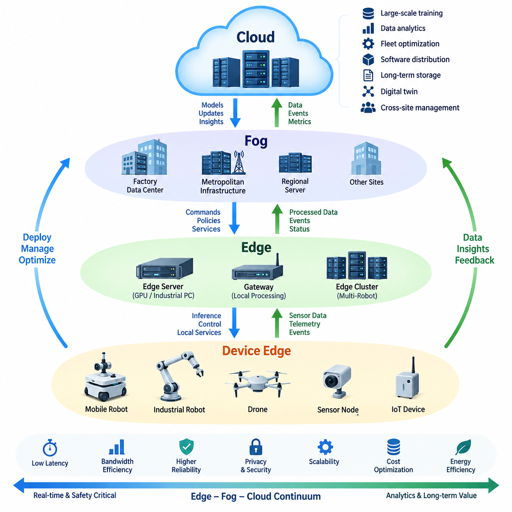{width="7.268055555555556in" height="7.268055555555556in"}

엣지 컴퓨팅(Edge Computing)은 중앙 집중형 클라우드 데이터 센터(Cloud Data Center)의 연산, 저장, 지능형 의사결정 기능을 로봇, 센서, 기계 및 사용자와 물리적으로 더 가까운 위치로 확장하는 컴퓨팅 방식이다. 로보틱스(Robotics)에서는 인지(Perception), 내비게이션(Navigation), 조작(Manipulation), 안전(Safety) 기능이 밀리초(ms) 단위의 응답을 요구하는 경우가 많아 이러한 배치가 특히 중요하다. 데이터가 생성되는 위치 가까이에서 처리하면 원격 네트워크에 대한 의존성을 줄이고, 클라우드 연결이 느려지거나 불안정하거나 일시적으로 중단되더라도 로봇의 지속적인 운영이 가능하다.

엣지(Edge)라는 용어는 특정한 하나의 컴퓨터나 장치를 의미하지 않는다. 이는 물리적 장치와 중앙 집중형 인프라(Centralized Infrastructure) 사이에 위치하는 분산 컴퓨팅 계층(Distributed Computing Layer)을 의미한다. 엣지 노드(Edge Node)는 로봇 내부의 임베디드 AI 컴퓨터(Embedded AI Computer), 여러 기계와 연결된 산업용 PC(Industrial PC), 생산 셀(Production Cell)을 담당하는 게이트웨이(Gateway), 또는 전체 시설을 지원하는 로컬 서버(Local Server)가 될 수 있다. 적절한 위치는 지연시간(Latency), 연산 요구량, 네트워크 용량, 전력 제약, 보안 정책 및 운영 책임에 따라 결정된다.

디바이스 엣지(Device Edge)는 데이터를 생성하는 물리적 시스템 내부 또는 바로 인접한 위치에서 수행되는 연산을 의미한다. 이동 로봇(Mobile Robot)은 자체 탑재 프로세서(Onboard Processor)를 사용하여 위치추정(Localization), 장애물 감지(Obstacle Detection), 궤적 생성(Trajectory Generation), 모터 협조 제어(Motor Coordination), 비상 대응(Emergency Reaction)을 실행할 수 있다. 따라서 카메라 스트림(Camera Stream)과 라이다 포인트 클라우드(LiDAR Point Cloud)를 원격 서버로 계속 전송하지 않고 로컬에서 해석할 수 있으며, 통신 지연과 대역폭 사용량을 줄이면서 일시적인 네트워크 중단 상황에서도 자율 운영을 유지할 수 있다.

엣지 서버(Edge Server)는 로봇과 지리적·논리적으로 가까운 위치를 유지하면서 더 높은 연산 능력을 제공한다. 여러 로봇은 원격 클라우드 리전(Cloud Region)과 통신하지 않고도 로컬 GPU 서버(Local GPU Server), 추론 가속기(Inference Accelerator), 지도 서비스(Map Service), 데이터베이스 캐시(Database Cache), 플릿 협조 구성요소(Fleet Coordination Component)를 공유할 수 있다. 이러한 구조는 개별 로봇에 충분한 연산 하드웨어를 탑재하기 어렵거나 여러 기계가 공통 정보에 접근해야 하는 경우에 유용하다. 따라서 엣지 서버는 온보드 자율성(Onboard Autonomy)과 중앙 집중형 서비스 사이의 중간 지능 계층(Intermediate Intelligence Layer)을 형성한다.

포그 컴퓨팅(Fog Computing)은 서비스를 여러 중간 컴퓨팅 계층에 분산함으로써 엣지 개념을 확장한다. 시스템을 단순히 장치와 클라우드 서버로 구분하는 대신, 포그 아키텍처(Fog Architecture)는 로봇 컴퓨터, 게이트웨이, 로컬 서버, 공장 데이터 센터(Factory Data Center), 도시 인프라(Metropolitan Infrastructure), 클라우드 플랫폼(Cloud Platform)을 포함할 수 있다. 각 계층은 지연시간, 대역폭, 보안 및 자원 요구사항에 따라 서로 다른 처리 작업을 담당한다. 따라서 포그는 하나의 고정된 엣지 위치에서 수행되는 연산보다는 계층적으로 조정되는 분산 컴퓨팅(Hierarchical Distributed Computing)을 강조한다.

클라우드 컴퓨팅(Cloud Computing)은 모든 로봇에 개별적으로 배치하기 어렵거나 비효율적인 자원을 제공하기 때문에 여전히 중요한 역할을 수행한다. 대규모 모델 학습(Large-Scale Model Training), 과거 데이터 분석(Historical Analytics), 플릿 전체 최적화(Fleet-Wide Optimization), 소프트웨어 배포(Software Distribution), 장기 데이터 저장(Long-Term Data Storage), 디지털 트윈 처리(Digital Twin Processing), 사이트 간 관리(Cross-Site Management)는 밀리초 단위의 응답을 요구하지 않으면서도 상당한 연산 및 저장 자원을 필요로 할 수 있다. 클라우드는 여러 엣지 시스템의 정보를 통합하고 모델, 정책, 업데이트 또는 운영 인사이트(Operational Insight)를 생성하여 다시 로봇 방향으로 배포할 수 있다.

엣지--포그--클라우드 연속체(Edge--Fog--Cloud Continuum)는 이러한 자원을 서로 분리된 아키텍처 범주가 아니라 연결된 하나의 스펙트럼(Spectrum)으로 설명한다. 워크로드(Workload)는 운영 조건에 따라 서로 다른 위치에 동적으로 배치될 수 있다. 즉각적인 충돌 회피(Collision Avoidance)는 로봇 내부에서 실행하고, 의미론적 인지(Semantic Perception)는 인접한 GPU 엣지 서버에서 처리하며, 플릿 스케줄링(Fleet Scheduling)은 로컬 시설 클러스터(Local Facility Cluster)에서 수행하고, 장기 학습(Long-Term Learning)은 클라우드에서 수행할 수 있다. 따라서 연속체는 각각의 워크로드를 기술적·운영적 요구사항을 가장 효과적으로 충족할 수 있는 위치에서 실행하도록 한다.

지연시간(Latency)은 워크로드의 실행 위치를 결정하는 주요 요소 중 하나이다. 수 밀리초 이내에 응답해야 하는 제어 루프(Control Loop)는 네트워크 지연이 불규칙하게 변하는 원격 서비스에 안전하게 의존할 수 없다. 반대로 매일 생성되는 플릿 활용도 보고서(Fleet Utilization Report)는 로봇 내부에서 실행할 필요가 없다. 설계자는 하드 실시간(Hard Real-Time) 또는 준실시간(Near-Real-Time) 기능을 대화형 서비스(Interactive Service) 및 지연 허용 워크로드(Delay-Tolerant Workload)와 구분해야 한다. 이러한 분류는 부적절한 클라우드 의존성을 방지하는 동시에 모든 장치에 고가의 연산 자원을 불필요하게 중복 배치하는 것을 방지한다.

대역폭(Bandwidth)은 데이터를 엣지에서 처리해야 하는 또 다른 중요한 이유이다. 현대의 로봇은 카메라 이미지, 깊이 맵(Depth Map), 라이다 스캔(LiDAR Scan), 오디오, 텔레메트리(Telemetry), 진단 정보(Diagnostic Information) 등 대량의 데이터를 생성할 수 있다. 모든 원시 데이터(Raw Data)를 지속적으로 클라우드로 전송하면 무선 네트워크에 과도한 부하를 발생시키고 상당한 저장 및 통신 비용을 초래할 수 있다. 엣지 처리는 센서 스트림을 로컬에서 필터링(Filter), 압축(Compression), 요약(Summarization), 해석하여 의미 있는 이벤트, 선택된 샘플, 메타데이터(Metadata), 이상 상태(Anomaly), 또는 향후 분석과 모델 개선에 필요한 데이터만 상위 계층으로 전달할 수 있다.

연산이 연속체 전체에 분산되면 신뢰성(Reliability)의 특성도 근본적으로 변화한다. 클라우드 의존형 로봇(Cloud-Dependent Robot)은 외부 연결이 중단될 때 중요한 기능을 잃을 수 있지만, 엣지 지향형 로봇(Edge-Oriented Robot)은 로컬 서비스와 캐시된 정보(Cached Information)를 사용하여 필수적인 자율성을 유지할 수 있다. 연결이 복구되면 클라우드 동기화(Cloud Synchronization)를 다시 시작할 수 있다. 이러한 오프라인 대응형 동작(Offline-Capable Operation)은 임무 수행 중 통신 품질을 항상 보장할 수 없는 공장, 물류창고, 건설 현장, 지하 시설, 실외 환경 및 이동형 운영 환경에서 특히 중요하다.

개인정보 보호(Privacy)와 데이터 주권(Data Sovereignty) 역시 워크로드가 실행되는 위치에 영향을 미친다. 센서 스트림에는 작업자 영상, 생산 정보, 시설 배치도, 고객 데이터 또는 독점적인 운영 정보가 포함될 수 있다. 민감한 정보를 로컬에서 처리하면 통제된 환경 외부로 전송되는 원시 데이터의 양을 줄일 수 있다. 엣지 시스템은 필요한 특징(Feature)이나 통계 정보를 추출한 후 선택된 정보만 상위 계층으로 전달할 수 있다. 그러나 로컬 처리가 자동으로 보안을 보장하는 것은 아니며, 엣지 노드에는 인증(Authentication), 암호화(Encryption), 접근 제어(Access Control), 보안 부팅(Secure Boot), 패치(Patching), 모니터링(Monitoring), 물리적 보호(Physical Protection)가 여전히 필요하다.

인공지능(Artificial Intelligence)은 AI 워크로드마다 연산 특성이 크게 다르기 때문에 엣지--클라우드 연속체의 중요성을 더욱 높인다. 경량 인지 모델(Compact Perception Model)은 임베디드 가속기(Embedded Accelerator)에서 지속적으로 실행할 수 있지만, 대규모 멀티모달 모델(Multimodal Model)이나 파운데이션 모델(Foundation Model)은 인접한 GPU 서버 또는 중앙 집중형 클러스터(Centralized Cluster)를 필요로 할 수 있다. 학습(Training)은 일반적으로 대규모 인프라의 이점을 활용하는 반면, 추론(Inference)은 물리적 프로세스와 가까운 위치에서 수행할 때 유리한 경우가 많다. 따라서 실용적인 아키텍처는 모델 학습, 최적화, 배포, 추론, 모니터링 및 재학습(Retraining)을 적절한 컴퓨팅 계층에 분산한다.

로보틱스에서 워크로드 배치(Workload Placement)는 궁극적으로 지연과 장애가 물리적 시스템에 미치는 결과를 기준으로 결정해야 한다. 안전한 움직임을 직접 담당하는 기능은 외부 연결 없이도 예측 가능하게 동작할 수 있도록 기계와 충분히 가까운 위치에 유지해야 한다. 상위 수준 추론(Higher-Level Reasoning), 협조(Coordination), 분석(Analytics), 학습(Learning)은 요구사항에 따라 시설 엣지(Facility Edge), 포그(Fog), 온프레미스(On-Premise), 클라우드(Cloud) 방향으로 점진적으로 이동할 수 있다. 결과적으로 이러한 아키텍처는 단순한 엣지 대 클라우드의 선택이 아니라, 각 로봇 기능의 시간, 데이터, 안전, 개인정보 보호 및 자원 요구사항에 따라 연산 위치를 결정하는 분산 지능 시스템(Distributed Intelligence System)이다.

## 02.02 Edge Platform Comparison: Jetson, x86 Mini, ARM SBC

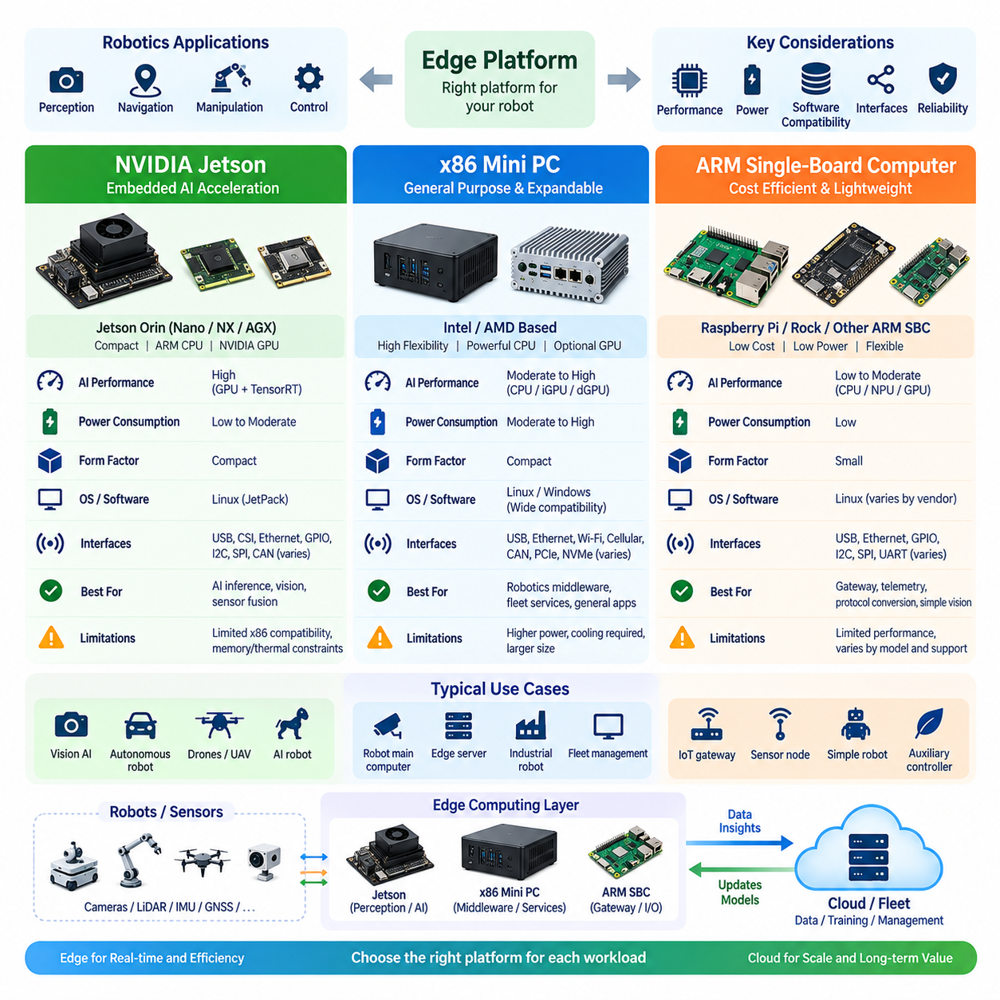{width="7.268055555555556in" height="7.268055555555556in"}

엣지 플랫폼 선택(Edge Platform Selection)은 로봇 시스템에서 사용할 수 있는 AI 성능, 실시간 처리 능력, 전력 소비, 소프트웨어 호환성, 센서 연결성 및 배포 유연성을 결정하기 때문에 로보틱스(Robotics)의 핵심 아키텍처 의사결정이다. NVIDIA Jetson 시스템, x86 미니 PC(x86 Mini PC), ARM 싱글보드 컴퓨터(ARM Single-Board Computer)는 서로 대체 가능한 플랫폼이라기보다 각각 다른 설계 지점을 대표한다. 따라서 연산 자원을 인지, 제어, 네트워킹, 저장장치, 환경 및 에너지 요구사항과 적절하게 대응시켜 선택해야 한다.

NVIDIA Jetson 플랫폼은 임베디드 가속 컴퓨팅(Embedded Accelerated Computing)을 위해 설계되었으며, 특히 센서 가까이에서 AI 추론(AI Inference)을 실행하는 로봇에 적합하다. ARM CPU와 NVIDIA GPU 가속의 조합을 통해 카메라 인지(Camera Perception), 객체 탐지(Object Detection), 분할(Segmentation), 깊이 처리(Depth Processing), 센서 융합(Sensor Fusion), 학습 기반 내비게이션(Learned Navigation)을 제한된 전력 범위 내에서 실행할 수 있다. 또한 CUDA, TensorRT 및 NVIDIA 소프트웨어 생태계는 학습된 신경망을 최적화된 엣지 추론으로 연결하는 직접적인 경로를 제공한다.

Jetson 모듈은 다양한 성능 및 전력 등급을 제공하므로 개발자는 로봇의 크기와 워크로드 복잡도에 따라 하드웨어를 선택할 수 있다. 소형 구성은 경량 인지(Lightweight Perception) 및 센서 처리 애플리케이션을 지원할 수 있으며, 고성능 플랫폼은 여러 신경망과 고대역폭 센서 파이프라인을 동시에 실행할 수 있다. CPU, GPU, 메모리 및 하드웨어 가속기가 긴밀하게 통합되어 있기 때문에 Jetson은 크기와 소비전력 대비 AI 추론 밀도(AI Inference Density)가 중요한 시스템에서 특히 효과적이다.

Jetson의 주요 제한점은 일반적인 x86 컴퓨터와 동일한 수준의 범용 호환성(General-Purpose Compatibility)을 제공하지 않는다는 것이다. x86 전용 바이너리, 특수 PCIe 하드웨어, 기존 산업용 소프트웨어 또는 특정 엔터프라이즈 도구에 의존하는 애플리케이션은 별도의 적응 과정이 필요할 수 있다. GPU 워크로드 역시 사용 가능한 메모리와 열 설계 범위(Thermal Envelope) 내에서 설계해야 한다. 따라서 최대 가속기 성능만으로 플랫폼을 결정해서는 안 되며 실제 로봇의 온도, 전력 및 동시 워크로드 조건에서 유지되는 지속 성능(Sustained Performance)이 더욱 중요하다.

x86 미니 PC(x86 Mini PC)는 비교적 작은 폼팩터(Form Factor)에서 익숙한 범용 컴퓨팅 환경을 제공한다. Intel 또는 AMD 기반 시스템은 표준 Linux와 Windows 소프트웨어 스택을 실행할 수 있으며 개발 도구, 데이터베이스, 미들웨어(Middleware), 산업용 애플리케이션 및 주변장치 드라이버에 대해 폭넓은 호환성을 제공한다. 따라서 x86은 임베디드 AI 추론에만 집중하기보다 로봇 미들웨어, 플릿 서비스(Fleet Service), 데이터베이스, 시각화, 네트워킹 및 기존 애플리케이션 소프트웨어를 함께 실행해야 하는 엣지 컴퓨터에 적합하다.

확장성(Expansion Capability)은 x86 시스템의 또 다른 주요 장점이다. 플랫폼에 따라 NVMe 저장장치, 다중 이더넷 인터페이스, Wi-Fi, 셀룰러 통신(Cellular Communication), CAN 어댑터, 프레임 그래버(Frame Grabber), 추가 가속기 또는 외장 GPU(Discrete GPU)를 통합할 수 있다. 산업용 x86 컴퓨터는 견고한 인클로저(Ruggedized Enclosure), 광범위 입력 전압, 확장된 온도 범위 및 다양한 입출력(I/O)을 제공하기도 한다. 이러한 특성으로 인해 로봇 메인 컴퓨터, 차량용 컴퓨터, 로컬 게이트웨이 또는 시설 수준 엣지 서버로 활용하기에 적합하다.

x86 플랫폼의 단점은 일반적으로 전력, 열 관리(Thermal Management), 크기 및 시스템 복잡성에서 나타난다. 고성능 CPU와 외장 GPU를 결합하면 통합형 임베디드 플랫폼보다 훨씬 많은 전력과 냉각 용량이 필요할 수 있다. 배터리 기반 이동 로봇에서는 컴퓨팅 전력이 직접적으로 운용 시간과 열 설계에 영향을 주기 때문에 이러한 요소가 중요하다. 따라서 x86 아키텍처는 엄격한 크기 및 에너지 제약보다 소프트웨어 호환성, 확장성 및 범용 연산 성능이 중요한 경우에 특히 적합하다.

ARM 싱글보드 컴퓨터(ARM Single-Board Computer, ARM SBC)는 엣지 플랫폼 스펙트럼의 또 다른 중요한 영역을 차지한다. 소형 Linux 보드와 같은 시스템은 게이트웨이(Gateway), 텔레메트리 수집(Telemetry Collection), 프로토콜 변환(Protocol Conversion), 단순 비전(Simple Vision), 장치 관리(Device Management), 경량 로보틱스 애플리케이션을 위한 저비용 컴퓨팅을 제공할 수 있다. 작은 물리적 크기와 낮은 전력 요구사항으로 인해 대형 컴퓨터가 필요하지 않은 분산 센서 노드(Distributed Sensor Node) 또는 보조 제어기(Auxiliary Controller)에 쉽게 통합할 수 있다.

ARM SBC의 성능은 제품마다 크게 다르기 때문에 SBC라는 용어를 하나의 성능 등급으로 이해해서는 안 된다. 일부 보드는 제한적인 CPU 자원만 제공하지만 다른 제품은 멀티코어 프로세서, 신경망 처리 장치(Neural Processing Unit, NPU), GPU, 고속 네트워킹 및 대용량 메모리를 제공한다. 소프트웨어 지원 수준 역시 제조사마다 상당한 차이가 있다. 따라서 생산용 로봇에 SBC를 적용할 때는 프로세서 사양뿐 아니라 커널 품질(Kernel Quality), 장치 드라이버, 가속기 런타임(Accelerator Runtime), 운영체제 이미지 및 장기 업데이트 정책도 중요한 평가 요소가 된다.

AI 워크로드에서는 가속기 아키텍처(Accelerator Architecture)가 실제 플랫폼 성능에 큰 영향을 미친다. Jetson 시스템은 긴밀하게 통합된 NVIDIA GPU 가속의 장점을 활용하고, x86 컴퓨터는 구성에 따라 CPU 추론, 통합 가속기 또는 외장 GPU를 사용할 수 있다. ARM SBC는 제조사별 도구 체계에 기반한 NPU, GPU 또는 외부 가속기를 사용할 수 있다. 따라서 TOPS와 같은 대표 성능 지표만을 독립적으로 비교해서는 안 되며 모델 호환성, 정밀도 지원(Precision Support), 메모리 대역폭, 런타임 최적화 및 지속적인 활용률이 실제 추론 성능을 결정한다.

메모리 아키텍처(Memory Architecture) 역시 로보틱스에서 매우 중요하다. 카메라 프레임, 포인트 클라우드(Point Cloud), 점유 지도(Occupancy Map), 신경망 텐서(Neural-Network Tensor), 위치추정 상태 및 미들웨어 버퍼는 상당한 메모리 용량과 대역폭을 사용할 수 있다. 통합형 시스템은 CPU와 가속기 사이의 데이터 이동을 줄일 수 있는 반면, 분리형 아키텍처는 더 큰 전체 용량과 업그레이드 가능성을 제공할 수 있다. 따라서 플랫폼 평가에서는 설치된 메모리 크기뿐 아니라 대역폭, 공유 구조, 데이터 복사 오버헤드 및 여러 인지 워크로드를 동시에 실행할 때의 동작을 함께 고려해야 한다.

센서 및 통신 인터페이스(Sensor and Communication Interface)는 이론적으로 강력한 플랫폼을 실제 로봇에 적용할 수 있는지를 결정하는 경우가 많다. 로봇은 USB3 카메라, 기가비트 또는 멀티기가비트 이더넷, CAN, 직렬 인터페이스, GPIO, 하드웨어 동기화(Hardware Synchronization), GNSS, IMU, LiDAR, Radar 및 저장장치 인터페이스를 필요로 할 수 있다. 플랫폼은 충분한 물리적 포트와 버스 대역폭을 제공하면서 안정적인 드라이버를 지원해야 한다. 다중 센서 로봇에서는 타임스탬프 동기화(Timestamp Synchronization)와 결정론적 데이터 획득(Deterministic Data Acquisition)이 단순한 프로세서 벤치마크 성능 향상보다 중요해질 수 있다.

전력 예산(Power Budgeting)은 전체 시스템 수준에서 평가해야 한다. 컴퓨팅 모듈, 저장장치, 네트워크 어댑터, 냉각 팬, 통신 모뎀 및 외부 가속기는 모두 에너지를 소비한다. 더 빠른 추론 성능을 가진 플랫폼은 작업을 더 빨리 완료할 수 있지만 높은 지속 전력(Sustained Power)은 배터리 운용 시간을 감소시키고 냉각 요구사항을 증가시킬 수 있다. 따라서 이동 로봇 설계에서는 와트당 성능(Performance per Watt)을 임무 지속시간, 배터리 용량, 주변 온도, 인클로저 공기 흐름 및 예상 연산 듀티 사이클(Computational Duty Cycle)과 함께 평가해야 한다.

엣지 시스템이 프로토타입에서 실제 플릿(Fleet)으로 확장될수록 소프트웨어 생태계(Software Ecosystem)와 수명주기 지원(Lifecycle Support)이 중요해진다. 로봇 플랫폼은 수년 동안 운용될 수 있으므로 재현 가능한 운영체제 이미지, 보안 업데이트, 드라이버 가용성, 컨테이너 지원(Container Support), 원격 진단 및 통제된 소프트웨어 배포가 필요하다. 벤치마크 성능이 뛰어나더라도 소프트웨어 의존성이 불안정한 플랫폼은 전체 수명주기 비용을 증가시킬 수 있다. 따라서 하드웨어 공급 가능성, 제조사 지원, 교체 전략 및 향후 하드웨어 리비전과의 호환성도 아키텍처 결정에 포함해야 한다.

모든 워크로드를 하나의 플랫폼에 강제로 통합하는 것보다 이기종 아키텍처(Heterogeneous Architecture)를 구성하는 것이 더 효과적인 경우가 많다. ARM 제어기는 저수준 인터페이스를 관리하고, Jetson은 인지 및 AI 추론을 실행하며, x86 컴퓨터는 상위 수준 미들웨어, 데이터베이스, 계획 서비스 또는 기존 애플리케이션을 담당할 수 있다. 이후 시설 엣지 서버(Facility Edge Server)가 데이터를 통합하고 여러 로봇을 조정할 수 있다. 이러한 역할 분리는 각 컴퓨팅 플랫폼이 성능, 전력, 호환성 및 신뢰성 특성에 가장 적합한 워크로드를 담당하도록 한다.

적절한 플랫폼은 궁극적으로 프로세서 브랜드가 아니라 워크로드 요구사항(Workload Requirements)을 기준으로 선택해야 한다. Jetson은 소형 GPU 가속 로보틱스에 자연스럽게 대응하고, x86 미니 PC는 높은 호환성과 확장성을 제공하며, ARM SBC는 효율적인 경량 분산 컴퓨팅에 적합하다. 실제 시스템에서는 최종 하드웨어 아키텍처를 확정하기 전에 대표적인 워크로드 환경에서 지속 추론 처리량(Sustained Inference Throughput), CPU 사용률, 메모리 압력, 인터페이스 대역폭, 열 특성, 전력 소비, 소프트웨어 유지보수성 및 장애 복구 능력을 종합적으로 비교해야 한다.

## 02.03 Edge Container Runtime: Docker / containerd on ARM [w/Code]

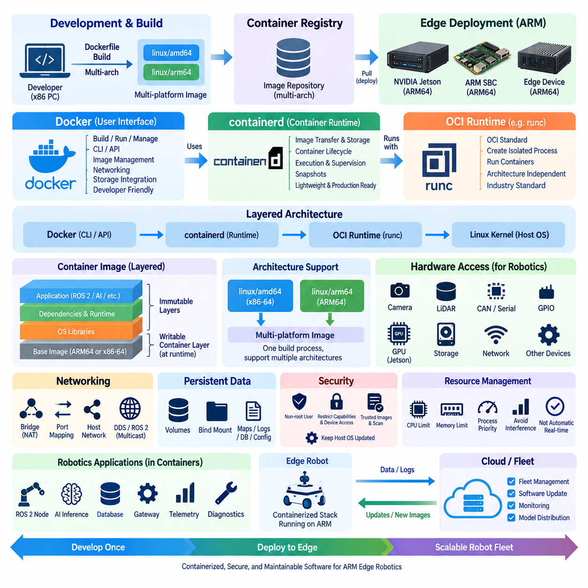{width="7.268055555555556in" height="7.268055555555556in"}

컨테이너 기술(Container Technology)은 애플리케이션을 실행 라이브러리(Runtime Library), 의존성(Dependency), 구성(Configuration)과 함께 패키징하면서 호스트 운영체제(Host Operating System)의 커널을 공유하기 때문에 엣지 로보틱스(Edge Robotics)를 위한 실용적인 소프트웨어 배포 모델을 제공한다. 기존 가상 머신(Virtual Machine)과 비교하면 컨테이너는 일반적으로 저장공간과 메모리를 적게 사용하고 더 빠르게 시작된다. 이러한 특성은 CPU 성능, 메모리, 저장공간, 전력 및 열 자원이 클라우드 서버보다 제한적인 경우가 많은 ARM 기반 엣지 컴퓨터에서 특히 중요하다.

도커(Docker)는 컨테이너화된 애플리케이션(Containerized Application)을 빌드, 패키징, 배포 및 실행하기 위해 널리 사용되는 개발자 중심 환경을 제공한다. 개발자는 컨테이너 이미지(Container Image)를 통해 애플리케이션 환경을 정의하고 개발 컴퓨터, CI/CD 시스템, 엣지 장치 및 로봇 플릿(Robot Fleet)에서 거의 동일한 소프트웨어 스택을 재현할 수 있다. ARM 로보틱스에서 Docker는 각 물리적 장치마다 모든 의존성을 수동으로 구성하지 않고도 ROS 2 노드, AI 추론 서비스, 텔레메트리 에이전트(Telemetry Agent), 데이터베이스, 게이트웨이 및 진단 도구를 배포할 수 있도록 한다.

컨테이너 이미지(Container Image)는 애플리케이션과 필요한 소프트웨어 구성요소를 포함하는 변경 불가능한 파일 시스템 계층(Immutable Filesystem Layer)으로 구성된다. 실행 중인 컨테이너는 쓰기 가능한 런타임 계층(Writable Runtime Layer)을 추가하지만 원본 이미지는 변경되지 않는다. 이러한 계층형 아키텍처(Layered Architecture)는 여러 이미지에서 공통 구성요소를 재사용할 수 있도록 하며 배포 부담을 줄일 수 있다. 엣지 플릿에서는 적절하게 설계된 이미지를 통해 버전 관리, 롤백(Rollback), 단계적 배포(Staged Deployment), 원격 배치된 로봇에서 소프트웨어 장애가 발생했을 때 재현 가능한 복구도 지원할 수 있다.

Docker 자체는 컨테이너를 실행하는 저수준 메커니즘만을 의미하지 않는다. Docker 아키텍처에는 명령줄 도구(Command-Line Tool), API, 이미지 관리(Image Management), 네트워킹, 저장장치 통합 및 컨테이너 작업을 조정하는 데몬(Daemon)이 포함된다. 현대적인 Docker 환경은 이러한 인터페이스 아래에서 저수준 구성요소에 의존한다. 이러한 계층 분리는 개발자가 개발 과정에서는 Docker와 상호작용하면서도 운영 환경의 오케스트레이션 플랫폼(Orchestration Platform)은 표준화된 인터페이스를 통해 컨테이너 런타임(Container Runtime)과 보다 직접적으로 통신할 수 있기 때문에 중요하다.

컨테이너디(containerd)는 이미지 전송과 저장, 컨테이너 실행, 감독(Supervision), 스냅샷(Snapshot) 및 관련 런타임 작업을 포함하여 컨테이너의 전체 수명주기(Container Lifecycle)를 관리하도록 설계된 컨테이너 런타임이다. Docker 또는 쿠버네티스(Kubernetes) 기반 시스템과 같은 상위 플랫폼 아래에서 동작하며 운영 환경을 위한 보다 간결한 실행 계층을 제공한다. 자원이 제한된 엣지 시스템에서는 containerd를 직접 사용하거나 경량 오케스트레이션(Lightweight Orchestration)을 통해 사용함으로써 표준화된 컨테이너 실행 기능을 유지하면서 불필요한 관리 구성요소를 줄일 수 있다.

더 낮은 계층에서 컨테이너 실행은 일반적으로 오픈 컨테이너 이니셔티브(Open Container Initiative, OCI) 규격과 runc와 같은 OCI 호환 런타임(OCI-Compatible Runtime)에 의존한다. OCI 모델은 이미지 형식과 런타임 동작을 표준화하여 컨테이너 아티팩트(Container Artifact)가 특정 상위 제품에만 종속되지 않도록 한다. 개념적으로 애플리케이션 이미지는 컨테이너 관리 계층을 통해 전달되고, containerd가 수명주기를 관리하며, OCI 런타임이 애플리케이션을 실제로 실행하는 격리된 Linux 프로세스 환경(Isolated Linux Process Environment)을 생성한다.

ARM 환경에서는 컨테이너 이미지에 아키텍처별 실행 바이너리(Architecture-Specific Executable Binary)가 포함되기 때문에 프로세서 아키텍처를 반드시 고려해야 한다. x86-64 전용으로 빌드된 이미지는 일반적으로 ARM64 로봇 컴퓨터에서 네이티브 방식으로 실행할 수 없다. 따라서 운영용 빌드 파이프라인(Build Pipeline)은 대상 아키텍처에 맞는 이미지를 생성하거나 linux/amd64와 linux/arm64 등의 아키텍처 변형을 포함하는 멀티플랫폼 이미지(Multi-Platform Image)를 만들어야 한다. 이후 컨테이너 레지스트리(Container Registry)는 대상 엣지 장치의 아키텍처에 적합한 이미지 변형을 제공할 수 있다.

멀티플랫폼 컨테이너 빌드(Multi-Platform Container Build)는 개발 시스템과 실제 배포 시스템이 서로 다른 프로세서를 사용할 때 특히 유용하다. 엔지니어는 x86 워크스테이션에서 소프트웨어를 개발하면서 실제 로봇에는 ARM64 Jetson 또는 다른 ARM 플랫폼을 사용할 수 있다. 애플리케이션 의존성이 각각의 대상 아키텍처를 지원한다면 빌드 시스템은 공통 소스 트리(Common Source Tree)로부터 아키텍처별 이미지를 생성할 수 있다. 이러한 방식은 소프트웨어 브랜치 간 차이를 줄이고 하나의 릴리스 프로세스(Release Process)를 통해 이기종 엣지 하드웨어를 지원할 수 있도록 한다.

교차 아키텍처 에뮬레이션(Cross-Architecture Emulation)은 개발 및 자동화된 빌드를 지원할 수 있지만 네이티브 실행 성능(Native Execution Performance)과 동일하게 이해해서는 안 된다. 에뮬레이션을 사용하면 x86 호스트에서 ARM 바이너리를 빌드하거나 테스트할 수 있지만 연산 집약적인 워크로드는 훨씬 느리게 실행될 수 있다. 따라서 로보틱스 애플리케이션은 대표적인 ARM 하드웨어에서 최종 통합 및 성능 시험을 수행해야 하며, 특히 인지 지연시간, 메모리 소비, 하드웨어 가속, 센서 처리량 및 열 특성을 평가해야 한다.

로봇 컨테이너는 격리된 클라우드 서비스와 달리 물리적 장치와 상호작용하므로 하드웨어 접근(Hardware Access)을 특별히 고려해야 한다. 카메라, LiDAR, 직렬 포트, CAN 인터페이스, GPIO, GPU 및 기타 가속기는 호스트에서 컨테이너 내부로 노출해야 할 수 있다. 장치 권한(Device Permission), Linux 그룹, 마운트(Mount), 런타임 구성 및 제조사별 드라이버를 의도적으로 설정해야 한다. 과도한 특권 접근(Privileged Access)은 프로토타입 개발을 단순화할 수 있지만 보안 위험을 증가시키므로 일반적으로 필요한 장치에 대해서만 제한적으로 권한을 부여하는 방식으로 전환해야 한다.

GPU를 지원하는 ARM 시스템에서는 컨테이너와 하드웨어 사이에 추가적인 소프트웨어 계층이 존재한다. AI 애플리케이션은 호스트 GPU 드라이버, 가속기 라이브러리, 컨테이너 런타임 통합 및 호환 가능한 사용자 공간 라이브러리(User-Space Library)에 의존할 수 있다. NVIDIA Jetson 시스템에서는 소프트웨어 환경을 지원되는 JetPack 및 관련 가속 스택(Acceleration Stack)과 정합시켜야 한다. 컨테이너화는 애플리케이션 의존성을 격리할 수 있지만 기반 플랫폼에서 제공되는 호환되지 않는 커널 드라이버나 하드웨어별 런타임 구성요소까지 완전히 추상화할 수는 없다.

네트워킹 아키텍처(Networking Architecture)도 컨테이너화된 로봇 애플리케이션에 영향을 미친다. 컨테이너는 통신 요구사항에 따라 격리된 가상 네트워크(Isolated Virtual Network), 명시적인 포트 매핑(Port Mapping), 또는 호스트 네트워킹(Host Networking)을 사용할 수 있다. ROS 2 및 DDS 기반 애플리케이션은 멀티캐스트 탐색(Multicast Discovery), 인터페이스 선택, 방화벽 구성 및 네트워크 네임스페이스(Network Namespace)에 민감할 수 있다. 따라서 일반적인 웹 서비스에서 정상적으로 동작하는 네트워크 구성이 분산 로봇 미들웨어에서는 다르게 동작할 수 있으므로 실제 로봇, 엣지 서버 및 플릿 네트워크 환경에서 검증해야 한다.

영구 데이터(Persistent Data)는 일반적으로 일회성 컨테이너 계층과 분리해야 한다. 로봇 지도, 보정 파라미터(Calibration Parameter), 로그, 데이터베이스, 임무 상태(Mission State), 학습된 구성 및 진단 기록은 컨테이너 교체 또는 소프트웨어 업그레이드 이후에도 유지되어야 할 수 있다. 바인드 마운트(Bind Mount), 관리형 볼륨(Managed Volume) 또는 전용 호스트 저장공간을 사용하면 이러한 데이터를 애플리케이션 이미지와 독립적으로 보존할 수 있다. 이러한 분리는 로봇 운영에 필요한 데이터를 유지하면서 소프트웨어만 이전 이미지 버전으로 되돌릴 수 있으므로 롤백도 단순화한다.

ARM 엣지 장치의 컨테이너 보안(Container Security)은 다른 Linux 환경과 동일한 기본 원칙을 따르지만 물리적 배포와 원격 운영 환경을 함께 고려해야 한다. 이미지는 최소한의 의존성을 사용하고 가능한 경우 비루트 실행(Non-Root Execution), 제한된 권한(Capability), 통제된 장치 접근, 신뢰할 수 있는 레지스트리(Trusted Registry), 취약점 관리(Vulnerability Management), 암호학적 검증(Cryptographic Verification)을 적용해야 한다. 컨테이너는 호스트 커널을 공유하므로 호스트 운영체제와 커널 역시 보안 경계(Security Boundary)의 일부가 된다.

여러 컨테이너가 제한된 엣지 하드웨어 자원을 경쟁적으로 사용할 때는 자원 관리(Resource Management)가 중요해진다. 중요도가 낮은 서비스가 내비게이션 또는 인지 워크로드의 자원을 고갈시키지 않도록 CPU 할당량, 메모리 제한, 프로세스 우선순위, 저장공간 사용량 및 가속기 접근을 통제해야 한다. 컨테이너 격리는 소프트웨어 구성을 개선하지만 결정론적 실시간 동작(Deterministic Real-Time Behavior)을 자동으로 제공하지 않는다. 안전 중요 구성요소와 시간 민감형 구성요소에는 여전히 적절한 스케줄링, 운영체제 구성, 워크로드 우선순위 및 시스템 수준 검증이 필요하다.

운영용 로봇 플릿에서는 Docker와 containerd를 단순한 경쟁 관계가 아니라 상호 보완적인 계층으로 이해해야 한다. Docker는 개발자와 이미지 생성을 위한 생산적인 워크플로(Workflow)를 제공하며, containerd는 자동화된 배포와 오케스트레이션에 적합한 집중화된 런타임 기반을 제공한다. ARM 호환 이미지, 통제된 하드웨어 접근, 영구 저장장치, 자원 제한, 보안 정책 및 아키텍처 인식형 CI/CD(Architecture-Aware CI/CD)를 결합하면 컨테이너는 단순한 개발 편의 기능에서 유지보수 가능한 엣지 배포 메커니즘으로 발전할 수 있다.

따라서 견고한 ARM 엣지 컨테이너 전략(ARM Edge Container Strategy)은 재현 가능한 멀티아키텍처 빌드(Multi-Architecture Build)에서 시작하여 레지스트리 관리, 배포, 실행, 모니터링, 롤백 및 수명주기 유지관리까지 연결되어야 한다. 목표는 단순히 로봇 소프트웨어를 컨테이너 내부에 넣는 것이 아니라 통제된 의존성을 유지하면서 개발 환경에서 이기종 엣지 하드웨어까지 이동할 수 있는 예측 가능한 소프트웨어 단위(Software Unit)를 만드는 것이다. 하드웨어 인식형 검증(Hardware-Aware Validation)과 결합된 컨테이너는 개별 로봇부터 대규모 분산 플릿까지 소프트웨어를 일관되게 유지관리하기 위한 확장 가능한 기반을 제공한다.

## 02.04 Edge Orchestration: K3s Lightweight Kubernetes [w/Code]

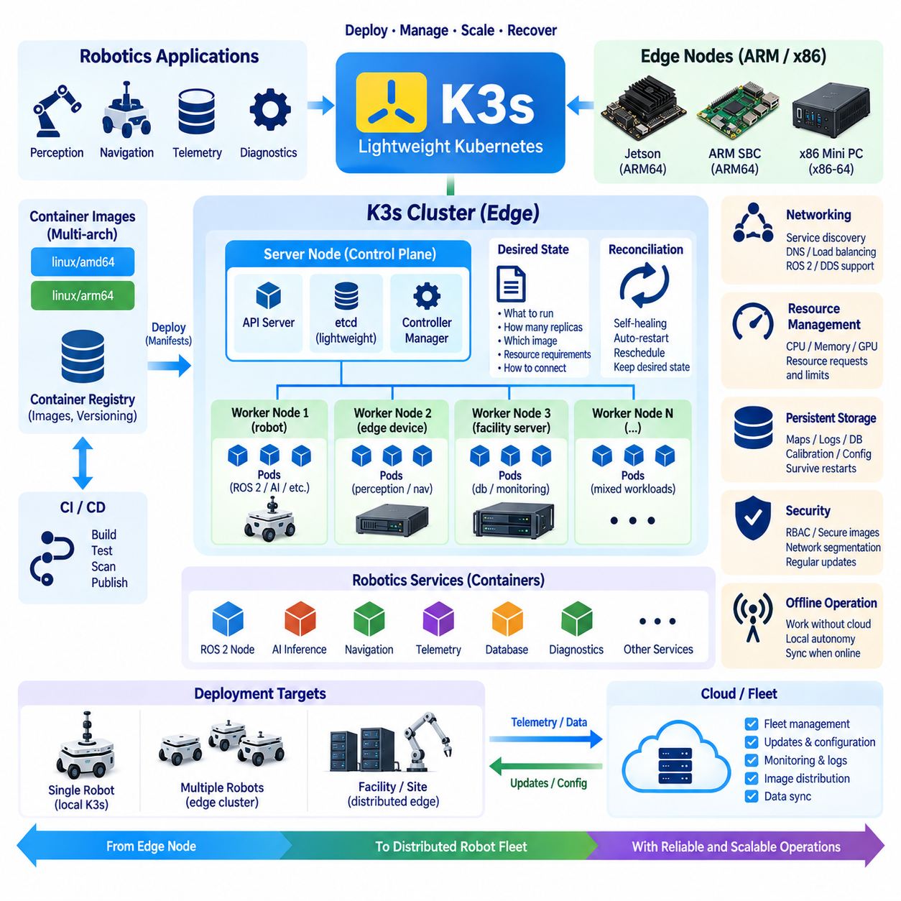{width="7.268055555555556in" height="7.268055555555556in"}

엣지 오케스트레이션(Edge Orchestration)은 분산된 엣지 컴퓨터에서 여러 컨테이너화된 서비스(Containerized Service)를 관리하여 애플리케이션을 일관된 방식으로 배포, 시작, 모니터링, 업데이트 및 복구하는 프로세스이다. 로보틱스에서는 하나의 로봇이나 시설에 ROS 2 노드, AI 추론, 내비게이션, 텔레메트리, 데이터베이스, 장치 관리 및 진단과 같은 여러 독립적인 서비스가 포함될 때 오케스트레이션이 중요해진다. 각 컨테이너를 수동으로 제어하는 대신 오케스트레이션 계층은 시스템의 의도된 운영 상태를 지속적으로 유지한다.

K3s는 운영 오버헤드(Operational Overhead)를 줄이면서 Kubernetes 기능을 제공하도록 설계된 경량 Kubernetes 배포판(Lightweight Kubernetes Distribution)이다. 기존 클라우드 클러스터보다 컴퓨팅 자원, 저장공간, 메모리 및 전력이 제한적인 엣지 환경에 적합하다. K3s는 워크로드(Workload), 서비스(Service), 네트워킹(Networking), 구성(Configuration), 선언적 관리(Declarative Management)와 같은 Kubernetes의 핵심 개념을 유지하면서 소규모 설치 환경을 위한 배포를 단순화한다. 이러한 특성으로 인해 로봇 엣지 노드와 소형 로컬 클러스터에 유용하다.

핵심 아키텍처 개념은 원하는 상태(Desired State)이다. 모든 애플리케이션을 시작하거나 재시작하기 위한 개별 명령을 실행하는 대신, 운영자는 어떤 워크로드가 존재해야 하는지, 몇 개의 인스턴스를 실행해야 하는지, 어떤 이미지를 사용해야 하는지, 어떤 자원을 필요로 하는지, 그리고 서로 어떻게 통신해야 하는지를 정의한다. 오케스트레이션 시스템은 실제 상태(Actual State)와 원하는 상태를 지속적으로 비교하고 차이를 조정(Reconciliation)하려고 한다. 컨테이너가 비정상 종료되거나 노드를 사용할 수 없게 되면 Kubernetes 메커니즘은 정의된 구성에 따라 워크로드를 재시작하거나 다른 노드에 재배치할 수 있다.

K3s는 ARM64와 x86-64 하드웨어 모두에 배포할 수 있으며, 이는 이기종 로보틱스 환경(Heterogeneous Robotics Environment)에서 특히 중요하다. 하나의 로봇은 ARM 기반 엣지 컴퓨터를 사용하고 인접한 산업용 PC 또는 서버는 x86-64를 사용할 수 있다. 아키텍처 인식형 컨테이너 이미지(Architecture-Aware Container Image)를 사용하면 필요한 소프트웨어 및 하드웨어 인터페이스가 지원되는 경우 동일한 애플리케이션 정의를 서로 다른 프로세서 플랫폼에 배포할 수 있다. 이를 통해 각 로봇이나 엣지 노드가 워크로드에 적합한 하드웨어를 사용하는 동시에 일관된 관리 모델을 제공할 수 있다.

로봇 시스템에서 K3s 노드는 여러 기능별 컨테이너(Functional Container)를 호스팅할 수 있다. 인지 컨테이너(Perception Container)는 카메라 또는 LiDAR 데이터를 처리하고, 내비게이션 컨테이너(Navigation Container)는 이동 명령을 계산하며, 다른 서비스는 텔레메트리를 관리할 수 있다. 추가적인 컨테이너는 진단 또는 로컬 데이터베이스 기능을 제공할 수 있다. 이러한 서비스들은 서로 독립적인 워크로드로 정의하면서도 하나의 운영 시스템으로 구성할 수 있다. 오케스트레이션 계층은 각 서비스를 호스트 운영체제에 직접 설치하지 않고도 공통적인 배포 및 수명주기 관리(Lifecycle Management) 방법을 제공한다.

네트워킹(Networking)은 로봇 애플리케이션이 지속적으로 통신하는 경우가 많기 때문에 엣지 오케스트레이션의 핵심 요소이다. Kubernetes는 서비스 탐색(Service Discovery)과 네트워킹 추상화(Networking Abstraction)를 제공하여 애플리케이션이 고정된 컨테이너 주소에만 의존하지 않고 논리적인 서비스 식별자(Logical Service Identity)를 사용하여 통신할 수 있도록 한다. 그러나 로봇 워크로드는 일반적인 웹 애플리케이션과 다른 요구사항을 가질 수 있으며, 특히 ROS 2 및 DDS 통신, 멀티캐스트 탐색(Multicast Discovery), 네트워크 인터페이스 및 시간 민감형 센서 스트림과 관련된 요구사항이 중요하다. 따라서 기본 Kubernetes 네트워크 구성이 충분하다고 가정해서는 안 되며 실제 환경에서 신중하게 검증해야 한다.

자원 관리(Resource Management)는 제한된 CPU, 메모리, 저장공간 및 가속기 자원을 사용하는 엣지 로봇에서 특히 중요하다. Kubernetes는 워크로드가 자원 요청(Resource Request)과 제한(Resource Limit)을 지정할 수 있도록 하여 스케줄러가 배치 결정을 내리고 무제한적인 자원 사용을 방지할 수 있도록 한다. 이는 AI 추론, 인지, 내비게이션, 로깅 및 모니터링이 동일한 하드웨어 자원을 경쟁적으로 사용하는 경우 특히 유용하다. 그러나 자원 제한이 결정론적 실시간 동작(Deterministic Real-Time Behavior)을 제공하는 것은 아니다. 안전 중요 기능(Safety-Critical Function)과 하드 실시간 기능(Hard Real-Time Function)은 일반적인 오케스트레이션 메커니즘 외부에서 전용 실행 환경을 필요로 할 수 있다.

GPU 및 가속기 접근(GPU and Accelerator Access)은 추가적인 복잡성을 발생시킨다. Jetson 또는 다른 가속기가 장착된 엣지 플랫폼에서 실행되는 AI 워크로드는 GPU 장치와 제조사별 런타임 구성요소에 접근해야 할 수 있다. 따라서 오케스트레이션 계층은 보안 및 자원 제어를 유지하면서 필요한 하드웨어가 컨테이너에 노출되도록 구성해야 한다. 여러 AI 서비스가 하나의 엣지 서버에서 가속기를 공유할 경우 GPU 스케줄링(GPU Scheduling)의 중요성이 증가하지만, 실제 배포에서 사용하는 정확한 하드웨어, 드라이버, 런타임 및 컨테이너 이미지 조합에 대해 가속기 지원을 검증해야 한다.

저장장치(Storage)는 일회성 애플리케이션 컨테이너와 별도로 설계해야 한다. 로봇 지도, 보정 정보(Calibration Information), 로그, 데이터베이스, 구성 파일 및 운영 상태는 컨테이너 재시작, 이미지 교체 또는 노드 유지보수 이후에도 유지되어야 할 수 있다. 영구 볼륨(Persistent Volume)과 적절한 호스트 저장장치를 사용하면 애플리케이션 수명주기와 운영 데이터 수명주기를 분리할 수 있다. 이는 로봇에서 특히 중요하다. 장애가 발생한 소프트웨어 구성요소를 교체하더라도 위치추정, 진단, 임무 수행 또는 복구에 필요한 정보가 의도하지 않게 삭제되어서는 안 되기 때문이다.

엣지 오케스트레이션은 간헐적인 연결(Intermittent Connectivity)도 고려해야 한다. 로봇은 플릿 서버 또는 클라우드 서비스와의 통신을 일시적으로 잃더라도 로컬에서 계속 작동해야 할 수 있다. 따라서 로컬 K3s 환경은 외부 제어 인프라에 지속적으로 접근할 수 있다는 가정 대신 자율 운영에 필요한 워크로드를 로컬에 유지해야 한다. 연결이 가능한 시점에는 업데이트와 구성 동기화(Configuration Synchronization)를 수행할 수 있다. 이러한 방식은 상위 수준의 관리 및 동기화 기능이 일시적으로 연결되지 않더라도 로컬 서비스가 계속 실행되는 오프라인 대응형 아키텍처(Offline-Capable Architecture)를 지원한다.

오케스트레이션은 여러 애플리케이션을 제어할 수 있는 관리 평면(Management Plane)을 제공하기 때문에 보안의 중요성이 더욱 커진다. Kubernetes API, 자격 증명(Credential), 컨테이너 이미지, 네트워크 서비스 및 노드 자원에 대한 접근을 신중하게 통제해야 한다. 이미지는 신뢰할 수 있는 레지스트리(Trusted Registry)에서 가져와야 하며 소프트웨어 공급망(Software Supply Chain)의 일부로 스캔하고 버전을 관리해야 한다. 노드는 보안이 강화된 운영체제 구성, 통제된 권한, 적절한 네트워크 분리(Network Segmentation) 및 정기적인 보안 업데이트를 사용해야 한다. 따라서 오케스트레이션 플랫폼 자체를 로봇의 운영 보안 경계(Operational Security Boundary)의 일부로 취급해야 한다.

로봇 플릿에서 K3s는 단일 로봇을 넘어 여러 엣지 컴퓨터 그룹에 대한 경량 클러스터 관리(Lightweight Cluster Management)로 확장될 수 있다. 하나의 시설에는 여러 산업용 PC, GPU 서버, 게이트웨이 및 로봇 노드가 존재할 수 있으며, 워크로드는 사용 가능한 자원과 운영 요구사항에 따라 분산될 수 있다. 이를 통해 공통 배포 정의(Common Deployment Definition), 중앙 구성 관리(Centralized Configuration), 서비스 탐색, 모니터링 통합 및 통제된 업데이트를 구현할 수 있다. 그러나 플릿 규모의 관리에서는 로봇 수준 자율성(Robot-Level Autonomy)과 시설 수준 오케스트레이션(Facility-Level Orchestration)을 구분해야 한다. 관리 계층의 장애가 필수적인 로컬 기능을 불필요하게 중단시키지 않아야 하기 때문이다.

로보틱스에서 K3s의 실질적인 목적은 Kubernetes가 널리 사용되기 때문에 단순히 Kubernetes를 도입하는 것이 아니라 분산 소프트웨어(Distributed Software)에 대해 반복 가능하고 일관된 수명주기 관리를 제공하는 것이다. 수동 스크립트만으로 신뢰성 있게 유지하기 어려울 정도로 서비스와 엣지 노드의 수가 증가하면 오케스트레이션은 배포, 복구, 확장, 구성 및 소프트웨어 일관성을 관리하기 위한 구조화된 방법을 제공한다. 소규모 시스템에서는 직접적인 컨테이너 관리가 여전히 충분할 수 있지만, 로봇 시스템이 더욱 분산되고 이기종화되면 경량 Kubernetes는 개별 컨테이너와 대규모 클라우드 오케스트레이션 사이의 중간 관리 계층으로 활용될 수 있다.

## 02.05 Edge AI Inference Optimization: TensorRT / OpenVINO [w/Code]

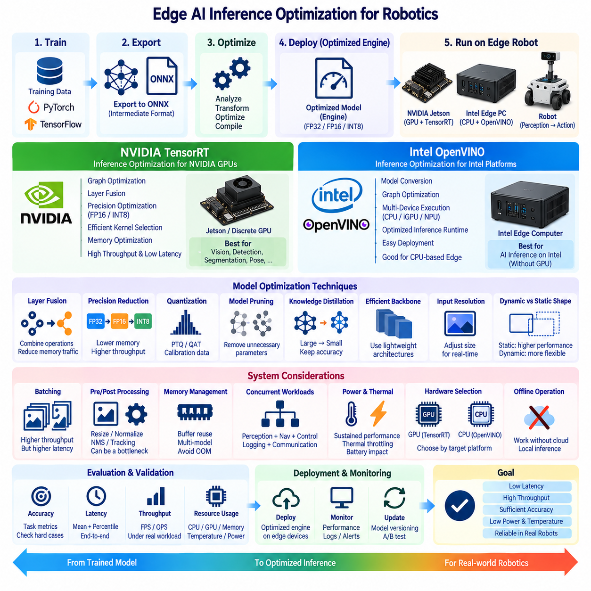{width="7.268055555555556in" height="7.268055555555556in"}

엣지 AI 추론 최적화(Edge AI Inference Optimization)는 학습된 신경망(Neural Network)을 더 낮은 지연시간, 더 높은 처리량, 감소된 메모리 사용량 및 통제된 전력 소비를 제공하면서도 필요한 정확도를 유지할 수 있는 실행 형태로 변환하는 과정이다. 로보틱스에서는 위치추정, 계획, 제어, 통신 및 로깅과 제한된 연산 자원을 공유하면서 인지 기능을 지속적으로 실행해야 하므로 최적화가 특히 중요하다. 따라서 목표는 단순한 최대 벤치마크 속도가 아니라 지속 가능한 시스템 수준 성능(Sustained System-Level Performance)이다.

일반적인 추론 워크플로(Inference Workflow)는 PyTorch 또는 TensorFlow와 같은 프레임워크에서 학습된 모델로 시작하여 배포에 적합한 표현으로 변환하는 과정을 거친다. ONNX는 학습 프레임워크와 대상 추론 엔진(Target Inference Engine)을 분리할 수 있기 때문에 중간 모델 형식(Intermediate Model Format)으로 자주 사용된다. 내보낸 모델은 대상 엣지 하드웨어에 맞게 분석, 변환, 컴파일 및 최적화할 수 있다. 성공적인 배포를 위해서는 연산자, 텐서 형상, 정밀도 모드 및 전처리 동작이 전체 변환 과정에서 호환되는지 검증해야 한다.

TensorRT는 NVIDIA GPU 및 관련 엣지 플랫폼을 위한 NVIDIA의 추론 최적화 및 런타임 기술(Inference Optimization and Runtime Technology)이다. 학습된 네트워크를 분석하고 대상 GPU 환경에 최적화된 실행 엔진(Execution Engine)을 생성한다. TensorRT는 호환 가능한 연산을 결합하고 효율적인 커널을 선택하며 텐서 메모리 사용을 최적화하고 낮은 수치 정밀도(Reduced Numerical Precision)를 활용할 수 있다. 이러한 기능은 비전, 객체 탐지, 분할, 자세 추정 및 기타 신경망 추론 워크로드를 실행하는 Jetson 기반 로봇과 GPU 기반 엣지 컴퓨터에서 특히 중요하다.

계층 및 연산 융합(Layer and Operation Fusion)은 호환 가능한 연산을 더욱 효율적인 실행 순서로 결합하여 불필요한 중간 처리를 줄인다. 중간 텐서를 메모리에 반복적으로 기록한 후 다시 읽는 대신 최적화된 엔진은 메모리 트래픽과 커널 실행 오버헤드(Kernel-Launch Overhead)를 줄일 수 있다. 엣지 시스템의 추론 성능은 단순한 연산 능력뿐 아니라 메모리 대역폭, 데이터 이동, 동기화 및 하드웨어 자원이 얼마나 효율적으로 활용되는지에 의해서도 결정되므로 이러한 최적화가 중요하다.

정밀도 감소(Precision Reduction)는 또 다른 주요 최적화 기법이다. FP32를 사용하여 학습된 모델은 하드웨어 지원과 허용 가능한 정확도 손실 수준에 따라 FP16 또는 INT8을 사용하여 추론을 수행할 수 있다. 낮은 정밀도는 텐서 저장공간과 메모리 대역폭 요구량을 줄이면서 특수 가속기 유닛이 더 많은 연산을 효율적으로 처리할 수 있도록 한다. 그러나 신경망 아키텍처와 애플리케이션 작업에 따라 양자화 및 저정밀도 연산에 대한 영향이 달라질 수 있으므로 수치 정밀도는 실제 측정을 통해 선택해야 한다.

INT8 추론(INT8 Inference)은 부동소수점 값을 제한된 정수 범위로 표현해야 하므로 추가적인 주의가 필요하다. 학습 후 양자화(Post-Training Quantization)는 대표적인 보정 데이터(Calibration Data)를 사용하여 적절한 스케일링 파라미터를 결정할 수 있으며, 양자화 인식 학습(Quantization-Aware Training)은 학습 과정에서 모델이 양자화 효과를 경험하도록 할 수 있다. 로봇 인지에서는 부적절한 보정으로 인해 추론 속도가 크게 향상되더라도 정확도가 저하될 수 있으므로 실제 조명, 객체, 환경 및 센서 특성을 대표하는 보정 데이터를 사용해야 한다.

OpenVINO는 특히 Intel 기반 엣지 시스템과 관련된 추론 최적화 및 배포 환경(Inference Optimization and Deployment Environment)을 제공한다. 모델 변환, 그래프 최적화(Graph Optimization), 그리고 지원되는 CPU, 통합 그래픽 및 사용 가능한 전용 AI 가속 하드웨어 등 Intel 컴퓨팅 장치에서의 실행을 지원한다. 이를 통해 x86 엣지 컴퓨터는 별도의 NVIDIA GPU 없이도 신경망 추론을 수행할 수 있으며, 로봇 미들웨어, 기존 CPU 워크로드 및 AI 추론을 동일한 Intel 기반 플랫폼에서 함께 실행해야 하는 경우 유용하게 활용할 수 있다.

따라서 TensorRT와 OpenVINO는 보편적으로 상호 교환 가능한 가속 라이브러리라기보다 하드웨어 지향형 추론 생태계(Hardware-Oriented Inference Ecosystem)로 이해해야 한다. TensorRT는 NVIDIA GPU 실행과 밀접하게 연계되어 있으며 OpenVINO는 지원되는 Intel 하드웨어 전반에서 최적화된 추론을 제공하는 데 중점을 둔다. 적절한 선택은 실제 배포되는 컴퓨팅 아키텍처에 따라 결정된다. 따라서 이기종 로봇 플릿(Heterogeneous Robot Fleet)은 공통 학습 모델, 모델 레지스트리, 검증 절차 및 배포 정책을 유지하면서 서로 다른 최적화 추론 엔진을 사용할 수 있다.

동적 및 정적 텐서 형상(Dynamic and Static Tensor Shapes) 역시 최적화에 영향을 미친다. 고정된 입력 크기는 추론 엔진이 메모리 할당과 실행 계획에 대해 보다 강한 가정을 적용할 수 있도록 하는 반면, 동적 형상은 서로 다른 해상도나 시퀀스 길이를 처리해야 하는 애플리케이션에 유연성을 제공한다. 로보틱스 개발자는 불필요한 동적 구성을 피해야 한다. 유연성이 최적화 복잡성을 증가시킬 수 있기 때문이다. 따라서 카메라 해상도, 배치 크기, 포인트 클라우드 크기 및 모델 입력 구조는 실제 운영 요구사항을 기준으로 정의해야 한다.

배치 처리(Batching)는 클라우드 추론에서는 매우 효과적이지만 로봇 엣지에서는 보다 신중하게 적용해야 한다. 배치 크기를 증가시키면 가속기 활용률과 처리량을 높일 수 있지만 여러 입력이 모일 때까지 기다리는 과정에서 종단 간 지연시간(End-to-End Latency)이 증가할 수 있다. 새롭게 감지된 장애물에 반응해야 하는 로봇은 초당 최대 이미지 처리량보다 즉각적인 처리를 더 중요하게 평가할 수 있다. 따라서 엣지 최적화에서는 배치 크기를 무조건 최대화하기보다 처리량 중심 워크로드와 지연시간에 민감한 인지 및 제어 파이프라인을 구분해야 한다.

전처리(Preprocessing)와 후처리(Postprocessing) 역시 성능 분석에 포함해야 한다. 이미지 크기 조정, 색상 변환, 정규화, 텐서 형식 변환, 비최대 억제(Non-Maximum Suppression), 좌표 변환, 추적 및 메시지 직렬화(Message Serialization)는 상당한 CPU와 메모리 자원을 사용할 수 있다. 주변 연산이 비효율적인 상태라면 신경망만 가속해도 전체 시스템 성능 향상은 제한적일 수 있다. 따라서 종단 간 프로파일링(End-to-End Profiling)은 센서 데이터 획득부터 추론을 거쳐 로봇이 사용하는 최종 출력까지 전체 경로를 측정해야 한다.

여러 AI 모델이 동시에 실행되는 경우 메모리 최적화(Memory Optimization)가 중요해진다. 객체 탐지, 분할, 깊이 추정, 자세 인식 및 멀티모달 처리(Multimodal Processing)는 동일한 GPU 또는 시스템 메모리를 경쟁적으로 사용할 수 있다. 효율적인 버퍼 재사용, 통제된 모델 로딩, 적절한 텐서 정밀도 및 최소화된 호스트-장치 데이터 복사(Host-Device Copy)는 메모리 부족을 방지하고 지연시간을 감소시킬 수 있다. 통합 메모리 또는 통합형 아키텍처는 일부 데이터 이동을 단순화할 수 있지만 실제 동작은 현실적인 동시 워크로드 환경에서 프로파일링해야 한다.

모델 최적화(Model Optimization)는 런타임 컴파일뿐 아니라 모델 아키텍처 자체의 변경을 포함할 수도 있다. 가지치기(Pruning), 지식 증류(Knowledge Distillation), 효율적인 백본 선택(Efficient Backbone Selection), 입력 해상도 감소 및 모델 재설계는 배포 전에 연산 요구량을 감소시킬 수 있다. 필요한 작업 정확도를 유지하는 소형 모델은 지연시간, 전력 소비 및 열 안정성 측면에서 고도로 최적화된 대형 모델보다 우수할 수 있다. 따라서 엣지 AI 엔지니어링은 추론 최적화를 최종 변환 단계로만 취급하지 않고 모델 설계와 하드웨어 배포를 연결해야 한다.

벤치마킹(Benchmarking)은 평균 추론 시간만이 아니라 지연시간 분포(Latency Distribution)를 측정해야 한다. 평균 지연시간은 로봇의 동작에 영향을 줄 수 있는 간헐적인 장시간 지연을 숨길 수 있다. 백분위 지연시간(Percentile Latency), 처리량, 메모리 소비, CPU 및 가속기 활용률, 온도, 클럭 동작 및 전력 소비를 함께 측정하면 지속적인 성능을 보다 현실적으로 파악할 수 있다. 또한 단독으로 시험한 추론 엔진은 내비게이션, 센서 처리, 데이터 기록 및 네트워킹이 동시에 활성화된 환경에서 다르게 동작할 수 있으므로 실제 로봇 워크로드를 함께 실행하여 측정해야 한다.

모든 최적화 단계에는 정확도 검증(Accuracy Validation)이 함께 수행되어야 한다. 학습 프레임워크에서 ONNX로 변환하거나, 연산자를 변경하거나, FP16을 활성화하거나, INT8 양자화를 적용하거나, 전처리 방식을 변경하면 수치 출력이 달라질 수 있다. 따라서 대표적인 데이터셋과 작업별 평가 지표(Task-Specific Metric)를 사용하여 최적화된 모델을 승인된 기준 모델(Reference Model)과 비교해야 한다. 안전과 관련된 인지 기능에서는 전체 벤치마크 정확도가 비슷하다는 이유만으로 최적화를 승인하기보다 어려운 사례와 실제 운영 시나리오를 별도로 검토해야 한다.

열 및 전력 제약(Thermal and Power Constraints)은 최적화된 추론을 실제 로봇에서 지속적으로 유지할 수 있는지를 최종적으로 결정한다. 모델은 프로세서가 차가운 상태에서는 뛰어난 단시간 성능을 제공하지만 장시간 실행하면 열 스로틀링(Thermal Throttling)이나 공유 전력 제한으로 인해 성능이 감소할 수 있다. 따라서 평가 시험은 실제 인클로저와 목표 환경 조건에서 정상 상태(Steady-State) 동작이 나타날 만큼 충분히 오랫동안 수행해야 한다. 냉각 설계, 전력 모드, 동시 워크로드 및 배터리에 미치는 영향 역시 추론 엔지니어링의 일부이다.

따라서 견고한 엣지 AI 파이프라인(Edge AI Pipeline)은 학습, 모델 내보내기, 최적화, 검증, 배포, 모니터링 및 이후 모델 업데이트를 하나의 연속된 과정으로 연결한다. TensorRT는 NVIDIA 플랫폼에서 고도로 최적화된 실행을 제공할 수 있으며 OpenVINO는 지원되는 Intel 엣지 하드웨어 전반에서 추론을 최적화할 수 있다. 엔지니어링의 목표는 단순히 가장 높은 TOPS 활용률이나 FPS 값을 얻는 것이 아니라 예측 가능한 종단 간 지연시간, 충분한 작업 정확도, 지속 가능한 전력 및 열 특성, 그리고 전체 로봇 소프트웨어 스택과의 신뢰성 높은 통합을 달성하는 것이다.

## 02.06 Edge Data Local Processing: Stream, Filter, Anomaly [w/Code]

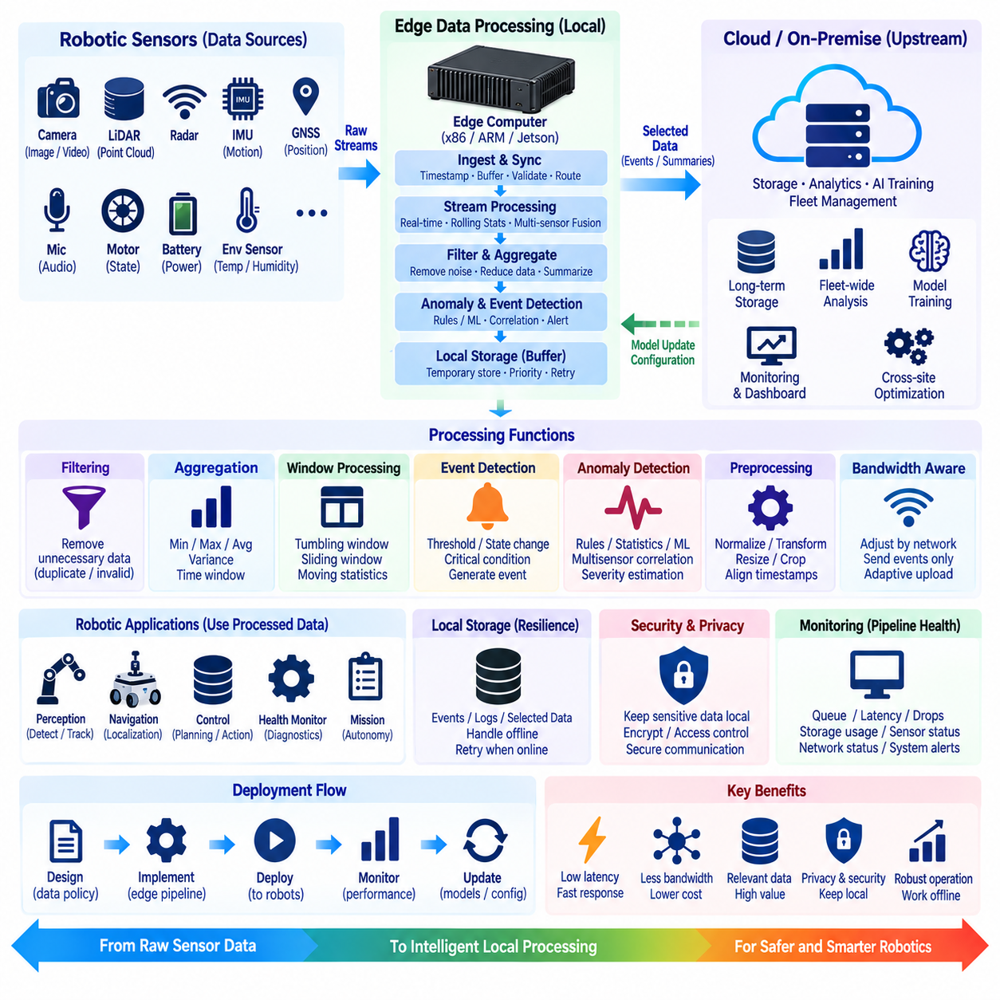{width="7.268055555555556in" height="7.268055555555556in"}

엣지 데이터 처리(Edge Data Processing)는 선택된 연산을 중앙 집중형 클라우드 인프라(Centralized Cloud Infrastructure)에서 로봇, 센서, 기계 및 물리적 프로세스와 가까운 위치로 이동시키는 방식이다. 모든 원시 카메라 프레임, LiDAR 스캔, 텔레메트리 메시지 또는 장비 신호를 지속적으로 전송하는 대신 엣지 노드(Edge Node)는 입력 데이터를 로컬에서 처리하고 즉각적인 조치, 임시 저장 또는 상위 시스템으로의 전송이 필요한 데이터를 결정할 수 있다. 이를 통해 통신 부하를 줄이면서 응답성과 운영 독립성을 향상시킬 수 있다.

로봇 엣지 데이터 파이프라인(Robotic Edge Data Pipeline)은 일반적으로 카메라, LiDAR, Radar, IMU, GNSS, 마이크, 모터 제어기, 배터리 및 환경 센서에서 지속적으로 생성되는 스트림(Stream)으로 시작된다. 이러한 데이터 소스는 주기, 데이터 용량, 시간 요구사항 및 신뢰성 측면에서 상당한 차이가 있다. 따라서 로컬 처리에는 입력 스트림에 타임스탬프(Timestamp)를 부여하고 버퍼링(Buffering), 검증 및 라우팅하면서 동기화와 이후 해석에 필요한 충분한 시간 정보를 보존하는 구조화된 수집 계층(Ingestion Layer)이 필요하다.

스트림 처리(Stream Processing)는 대규모 데이터셋이 저장될 때까지 기다린 후 분석하는 대신 데이터를 지속적으로 도착하는 연속적인 흐름으로 처리한다. 센서 메시지가 도착하는 즉시 평가할 수 있으므로 엣지 시스템은 이동 통계(Rolling Statistics)를 계산하고 상태 변화를 감지하며 여러 신호를 결합하거나 짧은 시간 안에 로봇의 동작을 실행할 수 있다. 물리적 환경의 변화에 대응해야 하는 경우 센서 정보의 가치는 빠르게 감소할 수 있기 때문에 이러한 처리 모델은 로보틱스에 특히 적합하다.

필터링(Filtering)은 추가적인 처리나 전송이 필요하지 않은 데이터를 제거한다. 카메라 파이프라인은 사용할 수 없는 프레임을 제거할 수 있고, 텔레메트리 처리는 반복되는 값을 억제할 수 있으며, 진동 모니터링은 허용 가능한 운영 범위 내의 측정값을 제외할 수 있다. 필터링은 샘플링 주기를 낮추거나 특정 영역과 채널을 선택하는 데에도 사용할 수 있다. 목표는 단순히 데이터를 삭제하는 것이 아니라 제어, 진단, 학습 및 운영 증거에 필요한 정보를 보존하면서 불필요한 연산과 통신을 줄이는 것이다.

집계(Aggregation)는 고주파 관측 데이터를 저장하고 전송하기 쉬운 압축된 요약 정보로 변환한다. 수백 개의 온도, 전류, 진동 또는 움직임 측정값을 최솟값, 최댓값, 평균, 분산, 개수 또는 시간 윈도우 통계(Time-Window Statistics)로 표현할 수 있다. 로봇 텔레메트리 역시 임무, 경로 구간, 운영 모드 또는 시간 간격을 기준으로 요약할 수 있다. 집계는 유용한 추세를 유지하면서 가치가 낮은 반복 측정 데이터가 네트워크 대역폭과 중앙 저장공간을 과도하게 사용하는 것을 방지한다.

윈도우 기반 처리(Window-Based Processing)는 연속적인 스트림을 해석하기 위한 실용적인 메커니즘을 제공한다. 텀블링 윈도우(Tumbling Window)는 데이터를 서로 겹치지 않는 고정된 구간으로 나누고, 슬라이딩 윈도우(Sliding Window)는 서로 겹치는 최근 관측 데이터를 반복적으로 평가한다. 시간 윈도우는 이동 평균, 진동 분석, 통신 품질 모니터링, 배터리 추세 또는 위치추정 신뢰도 분석에 활용할 수 있다. 윈도우가 너무 짧으면 노이즈가 증폭될 수 있고 너무 길면 빠른 변화를 감출 수 있으므로 물리적 현상의 특성에 맞게 지속시간을 설정해야 한다.

이벤트 감지(Event Detection)는 연속적인 센서 스트림을 의미 있는 운영 신호로 변환한다. 모든 측정값을 업로드하는 대신 엣지 시스템은 과도한 모터 전류, 급격한 배터리 전압 감소, 비정상적인 진동, 장애물 출현, 위치추정 성능 저하 또는 통신 손실과 같은 이벤트를 보고할 수 있다. 이벤트에는 타임스탬프, 심각도(Severity), 관련 센서 값, 로봇 상태 및 선택된 상황 데이터(Contextual Data)를 포함할 수 있다. 이러한 이벤트 중심 접근법(Event-Oriented Approach)을 사용하면 상위 시스템이 모든 관측값을 동일하게 처리하는 대신 주의가 필요한 상황에 집중할 수 있다.

이상 감지(Anomaly Detection)는 예상되는 운영 패턴과 다른 동작을 식별함으로써 이벤트 처리를 확장한다. 단순한 방법은 임계값, 허용 범위, 변화율 제한 또는 통계적 편차를 사용할 수 있으며, 보다 발전된 시스템에서는 정상 및 비정상 동작을 학습한 머신러닝 모델을 사용할 수 있다. 적절한 방법은 애플리케이션과 이용 가능한 근거에 따라 달라진다. 안전 관련 기능에서는 학습 기반 이상 감지기를 추가적인 진단 메커니즘으로 사용하더라도 해석 가능한 규칙(Interpretable Rule)이 여전히 중요할 수 있다.

다중 센서 이상 감지(Multisensor Anomaly Detection)는 개별 신호를 독립적으로 모니터링하는 것보다 더 강력한 판단 근거를 제공할 수 있다. 모터 전류 증가만으로는 정상적인 부하 변화일 수 있지만 전류 증가와 비정상 진동, 휠 속도 감소 및 온도 상승이 동시에 발생하면 보다 심각한 기계적 문제를 의미할 수 있다. 엣지 처리는 동기화된 타임스탬프와 운영 상황을 이용하여 이러한 관측값을 상호 연관시킬 수 있다. 이를 통해 모든 원시 센서 스트림을 원격 분석 플랫폼으로 전송하지 않고도 로컬 진단(Local Diagnosis)을 수행할 수 있다.

로컬 전처리(Local Preprocessing)는 이후 AI 시스템에서 사용하는 데이터의 품질도 향상시킨다. 센서 값을 정규화하고 유효하지 않은 샘플을 제거하며 좌표계를 변환하고 타임스탬프를 정렬하며 누락 데이터를 표시한 후 인지 또는 학습 파이프라인으로 전달할 수 있다. 이미지는 크기 조정 또는 자르기(Cropping)를 수행하고 포인트 클라우드는 필터링하며 텔레메트리는 일관된 단위로 변환할 수 있다. 이러한 작업을 데이터 소스 가까이에서 수행하면 반복적인 전처리를 줄이고 이후 연산 단계에 보다 예측 가능한 입력을 제공할 수 있다.

로봇 비전(Robotic Vision)은 특히 많은 데이터 용량을 생성하기 때문에 선택적인 로컬 처리가 중요하다. 전체 영상 스트림을 지속적으로 저장하거나 업로드하는 대신 엣지 컴퓨터는 객체 탐지, 분할, 추적 또는 장면 분류(Scene Classification)를 수행하고 선택된 프레임이나 메타데이터만 보존할 수 있다. 비정상 이벤트가 발생하면 이벤트 전후의 프레임을 일정 시간 동안 임시로 기록하도록 구성할 수도 있다. 이를 통해 지속적인 고대역폭 센싱 데이터를 압축된 증거 정보로 변환하면서 진단 또는 이후 모델 개선에 필요한 중요한 상황 정보를 보존할 수 있다.

로컬 버퍼링(Local Buffering)은 네트워크 연결이 불안정한 경우 시스템의 복원력(Resilience)을 높인다. 처리된 이벤트, 텔레메트리, 로그 및 선택된 센서 샘플을 엣지 장치에 임시 저장하고 통신이 복구된 후 전송할 수 있다. 저장공간은 제한되어 있으므로 버퍼에는 명확한 용량, 보존 기간, 우선순위 및 오버플로 정책(Overflow Policy)이 필요하다. 중요한 진단 또는 안전 관련 증거에 일반 텔레메트리보다 높은 보존 우선순위를 부여하면 장시간 통신 장애에서도 시스템이 점진적으로 성능을 조정하며 동작할 수 있다.

대역폭 인식형 처리(Bandwidth-Aware Processing)는 네트워크 상태에 따라 전송할 정보의 종류와 양을 동적으로 조절할 수 있다. 연결 상태가 양호하면 로봇은 보다 풍부한 텔레메트리 또는 선택된 센서 샘플을 업로드할 수 있지만 통신이 제한되면 이벤트, 상태 요약 및 중요 상태 메시지만 전송할 수 있다. 따라서 로컬 지능(Local Intelligence)은 물리적 센서와 중앙 집중형 시스템 사이에서 데이터 축소 계층(Data Reduction Layer)으로 작동할 수 있다. 이는 Wi-Fi, 셀룰러, 사설 무선망 또는 불안정한 실외 네트워크를 사용하는 이동 로봇에서 특히 유용하다.

엣지 데이터 처리는 불필요한 원시 정보의 이동을 감소시켜 개인정보 보호(Privacy)와 보안(Security)에도 기여한다. 카메라 영상, 시설 배치도, 생산 세부정보 및 운영 기록을 로컬 환경에 유지하면서 파생된 메타데이터나 승인된 이벤트만 상위 시스템으로 전송할 수 있다. 그러나 로컬 저장과 처리는 자체적인 보안 책임을 발생시킨다. 저장 데이터(Data at Rest), 통신 채널, 자격 증명, 접근 권한, 로그 및 소프트웨어 구성요소를 로봇 애플리케이션의 정보 민감도에 따라 적절하게 보호해야 한다.

처리 우선순위(Processing Priority)는 데이터의 운영적 가치에 따라 결정해야 한다. 안전 및 제어 정보는 즉각적인 처리가 필요하고 상태 모니터링은 짧은 지연을 허용할 수 있으며 과거 데이터 분석(Historical Analytics)은 대부분 처리를 연기할 수 있다. 고속 경로 처리(Fast-Path Processing)와 저속 경로 처리(Slow-Path Processing)를 분리하면 대규모 로깅이나 업로드 작업이 시간 민감형 로봇 기능을 방해하는 것을 방지할 수 있다. 따라서 엣지 아키텍처는 처리 자원을 할당하기 전에 스트림을 지연시간, 중요도, 보존 요구사항, 대역폭 및 연산 요구량에 따라 분류해야 한다.

데이터 파이프라인 자체도 장애가 발생할 수 있으므로 모니터링(Monitoring)이 필요하다. 큐 깊이(Queue Depth), 손실된 메시지, 처리 지연시간, 저장공간 사용률, 타임스탬프 품질, 센서 가용성, 네트워크 상태 및 이상 감지기의 동작을 관찰할 수 있어야 한다. 파이프라인 모니터링이 없으면 데이터가 누락된 상태를 정상 운영으로 잘못 판단할 수 있다. 따라서 엣지 시스템은 실제로 비정상 이벤트가 존재하지 않는 상황과 통신, 하드웨어 또는 소프트웨어 장애로 인해 센서 스트림 자체를 관측할 수 없는 상황을 구분해야 한다.

완전한 엣지 데이터 전략(Edge Data Strategy)은 중앙 집중형 인프라를 대체하는 것이 아니라 로컬 스트림 처리와 클라우드 또는 온프레미스 분석(Cloud or On-Premise Analytics)을 연결한다. 엣지에서는 즉각적인 필터링, 집계, 이상 감지, 이벤트 생성 및 임시 버퍼링을 수행하고, 상위 시스템에서는 장기 저장, 플릿 전체 분석(Fleet-Wide Analysis), 모델 학습, 과거 데이터 비교 및 사이트 간 최적화(Cross-Site Optimization)를 수행한다. 충분한 운영 가치 또는 학습 가치를 가진 정보만 이러한 계층 구조를 따라 상위 시스템으로 이동하면 된다.

결과적으로 이러한 아키텍처는 원시 로봇 데이터(Raw Robotic Data)를 데이터가 생성되는 위치 가까이에서 점진적으로 더 높은 가치의 정보로 변환한다. 센서는 연속적인 스트림을 생성하고 엣지 처리는 이를 필터링하고 상황 정보를 결합하며, 이상 감지 로직은 중요한 편차를 식별하고 선택된 이벤트 또는 요약 정보만 상위 시스템으로 전달한다. 로컬의 빠른 대응성과 중앙 집중형 학습 및 플릿 지능(Fleet Intelligence)을 결합함으로써 엣지 데이터 처리는 대역폭과 저장공간 요구량을 줄이는 동시에 분산 로봇 시스템 전체의 복원력, 관측 가능성(Observability) 및 적시 의사결정(Timely Decision-Making)을 향상시킨다.

## 02.07 Edge Network Design: Local Breakout / SD.WAN

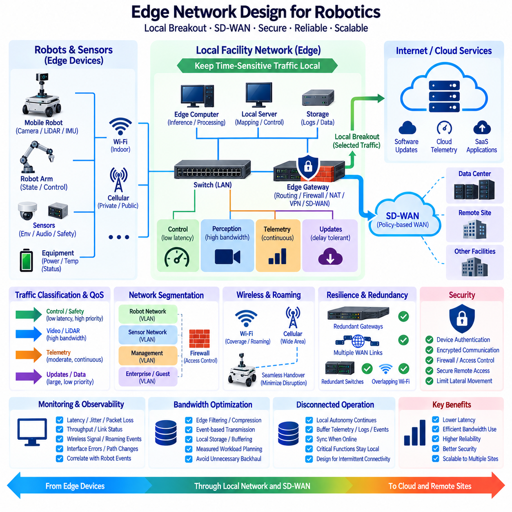{width="7.268055555555556in" height="7.268055555555556in"}

엣지 네트워크 설계(Edge Network Design)는 로봇, 로컬 컴퓨팅 노드(Local Compute Node), 시설 인프라(Facility Infrastructure), 원격 사이트(Remote Site), 클라우드 서비스(Cloud Service)가 지연시간, 신뢰성, 보안 및 운영 연속성을 유지하면서 데이터를 교환하는 방식을 결정한다. 일반적인 엔터프라이즈 단말과 달리 로봇은 지속적으로 센서 스트림을 생성하며 플릿 협조(Fleet Coordination), 텔레메트리, 소프트웨어 업데이트 및 원격 관리를 위해 통신에 의존한다. 따라서 네트워크는 반드시 로컬에 유지해야 하는 트래픽과 광역 네트워크 또는 클라우드를 통해 안전하게 전달할 수 있는 트래픽을 구분해야 한다.

기본적인 설계 원칙은 시간 민감형 로봇 통신(Time-Sensitive Robotic Communication)을 가능한 한 물리적 시스템 가까이에 유지하는 것이다. 센서 데이터, 위치추정 메시지, 내비게이션 명령, 안전 관련 상태 및 로컬 협조는 외부 연결 상태가 저하되더라도 예측 가능한 통신을 요구할 수 있다. 이러한 트래픽을 원격 클라우드 리전(Cloud Region)을 통해 전달하면 불필요한 지연과 의존성이 발생한다. 로컬 스위칭(Local Switching), 라우팅(Routing), 엣지 컴퓨팅을 활용하면 필수적인 로봇 기능을 시설 또는 운영 사이트 내부에서 지속할 수 있다.

로컬 브레이크아웃(Local Breakout)은 모든 트래픽을 중앙 집중형 데이터 센터로 백홀링(Backhauling)하지 않고 선택된 트래픽을 목적지로 직접 전달하는 메커니즘을 제공한다. 인터넷으로 향하는 소프트웨어 업데이트, 클라우드 텔레메트리 또는 SaaS 트래픽은 로컬 게이트웨이를 통해 외부로 전달하면서 내부 로봇 통신은 로컬 네트워크 내부에 유지할 수 있다. 이를 통해 불필요한 WAN 통과를 줄이고 지연시간, 대역폭 효율성 및 복원력(Resilience)을 향상시킬 수 있다. 그러나 브레이크아웃 정책은 보안 검사와 조직의 접근 제어 요구사항을 유지해야 한다.

로봇 데이터는 서로 다른 운영 특성을 가지므로 트래픽 분류(Traffic Classification)가 필수적이다. 제어 및 안전 메시지는 데이터 크기는 작지만 지연시간에 매우 민감할 수 있고, 카메라 또는 LiDAR 스트림은 상당한 대역폭을 사용할 수 있으며, 텔레메트리는 일반적으로 중간 수준의 데이터를 지속적으로 생성한다. 반면 소프트웨어 이미지와 데이터셋 전송은 대용량이지만 지연을 허용할 수 있다. 따라서 네트워크 아키텍처는 모든 패킷을 동일한 운영 우선순위로 처리하지 않고 지연시간, 지터(Jitter), 손실 허용도, 대역폭, 중요도 및 목적지에 따라 트래픽을 분류해야 한다.

서비스 품질(Quality of Service, QoS)은 네트워크 자원이 제한될 때 중요한 트래픽에 우선순위를 부여할 수 있다. 중요한 제어 또는 협조 메시지는 백그라운드 업로드, 로그, 백업 또는 소프트웨어 다운로드보다 우선적으로 처리할 수 있다. QoS는 존재하지 않는 대역폭을 새롭게 생성할 수는 없지만 혼잡이 발생할 때 어떤 워크로드의 성능을 먼저 저하시킬 것인지를 결정할 수 있다. 따라서 효과적인 정책을 위해서는 실제 로봇 트래픽을 측정해야 하며, 지나치게 많은 데이터 흐름에 높은 우선순위를 지정하여 우선순위 자체가 무의미해지는 것을 피해야 한다.

네트워크 분할(Network Segmentation)은 기능, 신뢰 수준 또는 운영 책임에 따라 시스템을 분리한다. 로봇, 센서, 엔지니어링 워크스테이션, 관리 서비스, 게스트 장치 및 일반 엔터프라이즈 시스템이 하나의 제한 없는 브로드캐스트 도메인(Broadcast Domain)을 공유할 필요는 없다. VLAN, 라우팅 정책, 방화벽 및 접근 제어를 사용하면 불필요한 통신 경로를 제한할 수 있다. 네트워크 분할은 장애 전파와 보안 노출을 줄이는 동시에 로봇 네트워크와 엔터프라이즈 네트워크 경계를 통과할 수 있는 서비스를 명확하게 정의하기 쉽게 한다.

이동 로봇은 고정된 이더넷 연결에만 의존할 수 없으므로 무선 연결(Wireless Connectivity)을 특별히 고려해야 한다. Wi-Fi는 높은 로컬 대역폭을 제공할 수 있으며 사설 셀룰러 네트워크(Private Cellular Network) 또는 공용 이동통신망은 더 넓은 영역으로 통신 범위를 확장할 수 있다. 실제 성능은 간섭, 장애물, 로밍 동작(Roaming Behavior), 액세스 포인트 배치, 채널 사용률 및 무선 환경에 따라 달라진다. 따라서 로봇 네트워킹은 정지 상태에서 측정한 처리량만으로 평가하지 않고 실제 운영 환경을 이동하면서 검증해야 한다.

로봇이 여러 무선 커버리지 영역 사이를 이동할 때 로밍 동작은 자율 운영에 직접적인 영향을 미칠 수 있다. 핸드오버 지연(Handover Delay), 패킷 손실, 재연결(Reassociation) 또는 주소 변경은 텔레메트리나 분산 서비스를 일시적으로 중단시킬 수 있다. 애플리케이션은 짧은 통신 중단을 허용할 수 있도록 설계해야 하며 중요한 로컬 자율 기능이 중단 없는 원격 연결에 의존해서는 안 된다. 따라서 무선 네트워크 설계, 애플리케이션 복구 동작, 버퍼링 및 엣지 처리를 서로 독립적인 하위 시스템이 아니라 하나의 통합 시스템으로 설계해야 한다.

소프트웨어 정의 광역 네트워크(Software-Defined Wide Area Networking, SD-WAN)는 시설, 엣지 사이트, 데이터 센터 및 클라우드 환경 사이의 연결을 정책 기반으로 제어한다. 하나의 고정된 WAN 경로에 의존하는 대신 SD-WAN은 여러 사용 가능한 전송망을 활용하고 애플리케이션 정책 및 관측된 네트워크 상태에 따라 경로를 선택할 수 있다. 이는 운영 사이트가 광대역망, 전용 회선, 셀룰러 연결 또는 기타 네트워크 서비스를 조합하여 사용하는 지리적으로 분산된 로봇 플릿에서 유용할 수 있다.

SD-WAN 정책은 비즈니스 및 기술 요구사항에 따라 서로 다른 애플리케이션 트래픽을 적절한 경로로 전달할 수 있다. 플릿 관리 트래픽은 하나의 선호 경로를 사용하고 클라우드 텔레메트리는 다른 경로를 사용할 수 있으며, 대규모 소프트웨어 또는 데이터셋 전송에는 우선순위가 낮은 연결을 사용할 수 있다. 선호 WAN 경로를 사용할 수 없게 되면 정책에 따라 적합한 트래픽을 다른 연결로 전환할 수 있다. 이러한 방식의 효과는 실제 전송망의 다양성, 애플리케이션 동작, 보안 설계 및 선택된 SD-WAN 구현의 기능에 따라 결정된다.

로컬 브레이크아웃(Local Breakout)과 SD-WAN은 서로 관련되어 있지만 서로 다른 아키텍처 문제를 해결한다. 로컬 브레이크아웃은 선택된 트래픽을 중앙 집중형 인프라를 거치게 하지 않고 어느 지점에서 사이트 외부로 전달할 것인지를 결정하는 반면, SD-WAN은 정책에 따라 사용 가능한 광역 네트워크 연결을 통해 트래픽을 어떻게 전달할 것인지를 관리한다. 두 기술을 함께 사용하면 로봇 내부 및 로컬 통신을 엣지 가까이에 유지하고 클라우드 서비스에 효율적으로 접근하면서 모든 패킷이 동일한 중앙 집중형 경로를 따르지 않도록 사이트 간 연결을 동적으로 관리할 수 있다.

엣지 게이트웨이(Edge Gateway)는 로봇 네트워크와 외부 인프라 사이의 중요한 경계를 형성한다. 게이트웨이는 라우팅, 방화벽 기능, VPN 연결, 프로토콜 중재(Protocol Mediation), 트래픽 검사, 로컬 DNS, 네트워크 주소 변환(Network Address Translation, NAT) 또는 SD-WAN 기능을 제공할 수 있다. 소규모 배포에서는 여러 기능을 하나의 장비가 담당할 수 있지만 대규모 시설에서는 성능과 복원성을 위해 기능을 분리할 수 있다. 여러 네트워크 기능을 하나의 장치에 집중하면 중요한 단일 의존성이 발생할 수 있으므로 게이트웨이 장애를 명시적으로 고려해야 한다.

이중화(Redundancy)는 통신 장애가 발생했을 때의 결과에 따라 설계해야 한다. 중요 사이트에서는 다중 게이트웨이, 독립적인 WAN 회선, 이중화 스위치, 중첩된 무선 커버리지 또는 대체 셀룰러 연결을 사용할 수 있다. 그러나 이중화는 장애 영역(Failure Domain)이 실제로 독립적인 경우에만 효과적이다. 두 개의 논리적 경로가 동일한 물리 케이블, 전원 공급원, 액세스 포인트 또는 상위 네트워크 사업자를 사용한다면 동시에 장애가 발생할 수 있다. 따라서 네트워크 복원력은 전체 물리적·논리적 통신 경로를 분석하여 설계해야 한다.

보안(Security)은 네트워크 토폴로지가 완성된 이후 추가하는 기능이 아니라 라우팅과 연결 결정에 통합되어야 한다. 장치 인증(Device Authentication), 암호화 통신, 방화벽 규칙, 네트워크 분할, 인증서 관리(Certificate Management), 안전한 원격 접근 및 모니터링을 통해 로봇 시스템에 대한 비인가 접근을 줄일 수 있다. 원격 유지보수는 전체 로봇 네트워크를 노출하지 않고 필요한 서비스에 대해서만 통제된 접근을 제공해야 한다. 또한 보안 정책은 침해된 엣지 노드(Compromised Edge Node)를 고려하여 해당 노드가 인프라 전체로 수평 이동(Lateral Movement)할 수 있는 범위를 제한해야 한다.

네트워크 동작이 로봇 성능에 영향을 주고 있는지를 파악하려면 관측 가능성(Observability)이 필요하다. 유용한 측정 지표에는 지연시간, 지터, 패킷 손실, 처리량, 재전송, 무선 신호 품질, 로밍 이벤트, 인터페이스 오류, 경로 변경 및 WAN 가용성이 포함된다. 이러한 지표는 로봇의 타임스탬프 및 운영 이벤트와 연계하여 분석해야 한다. 그렇지 않으면 소프트웨어 문제처럼 보이는 내비게이션 또는 인지 장애가 실제로는 지연되거나 순서가 변경되거나 누락된 네트워크 데이터에서 발생했음을 확인하기 어려울 수 있다.

대역폭 계획(Bandwidth Planning)은 명목상의 인터페이스 속도가 아니라 실제 측정된 워크로드를 기준으로 수행해야 한다. 여러 카메라, LiDAR 센서, 지도 전송, 원격 시각화, 로그 및 소프트웨어 업데이트가 동시에 수행되면 평균 트래픽보다 훨씬 큰 순간적인 데이터 전송이 발생할 수 있다. 따라서 설계자는 정상 운영뿐 아니라 최악 조건의 동시 실행 상황도 평가해야 한다. 엣지 필터링, 압축, 이벤트 기반 전송 및 로컬 저장을 활용하면 명확한 운영 또는 학습 가치가 없는 대용량 원시 데이터가 사이트 외부로 전달되는 것을 방지하여 WAN 요구량을 크게 줄일 수 있다.

연결 단절 운영(Disconnected Operation)은 이동형 및 분산형 로봇에서 예외적인 장애 상황이 아니라 정상적인 설계 조건 중 하나로 취급해야 한다. 기술적으로 가능한 경우 로컬 내비게이션, 안전, 임무 수행 및 필수 협조 기능은 클라우드 연결 없이도 지속되어야 한다. 텔레메트리, 로그 및 이벤트는 로컬에 버퍼링한 후 연결이 복구되면 동기화할 수 있다. 이를 통해 로봇 자율성(Robot Autonomy)을 WAN 가용성과 분리하면서도 통신이 가능한 경우 중앙 집중형 플릿 관리 및 분석 기능을 활용할 수 있다.

따라서 확장 가능한 아키텍처(Scalable Architecture)는 로컬 로봇 네트워킹, 분할된 시설 인프라, 엣지 게이트웨이, 로컬 브레이크아웃 및 정책 기반 WAN 연결을 결합한다. 즉각적인 물리적 운영은 로봇 가까이에 유지하고 시설 서비스는 로컬 자원을 조정하며, SD-WAN은 분산된 사이트를 데이터 센터 또는 클라우드 환경과 연결할 수 있다. 각 계층은 모든 워크로드에 하나의 통신 전략을 적용하는 대신 지연시간, 대역폭, 보안, 가용성 및 운영 중요도에 따라 트래픽을 처리한다.

엣지 네트워크 설계의 최종 목표는 단순히 최대 네트워크 속도를 달성하는 것이 아니라 물리적 자율성(Physical Autonomy)을 지원할 수 있는 예측 가능한 통신을 제공하는 것이다. 로컬 브레이크아웃은 불필요한 백홀링을 줄이고, SD-WAN은 정책 기반의 광역 네트워크 경로 관리를 제공하며, 네트워크 분할은 보안 노출을 제한하고, 엣지 처리는 전송되는 데이터의 양을 감소시킨다. 이러한 기술을 이중화, 관측 가능성 및 오프라인 대응형 로봇 소프트웨어(Offline-Capable Robot Software)와 결합하면 로컬 시설과 원격 사이트에 걸쳐 신뢰성 높은 분산 로봇 운영을 지원할 수 있는 네트워크 기반을 구축할 수 있다.

## 02.08 Edge Security Hardening: Immutable OS / Secure Boot

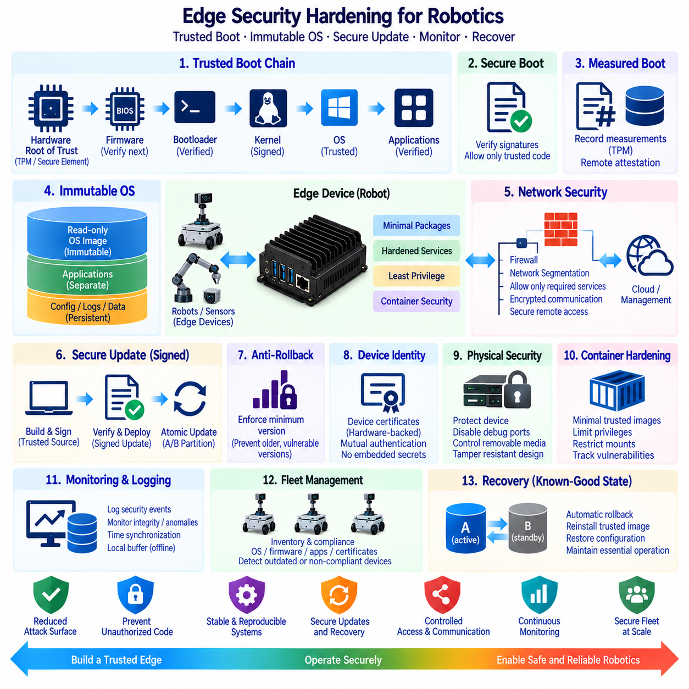{width="7.268055555555556in" height="7.268055555555556in"}

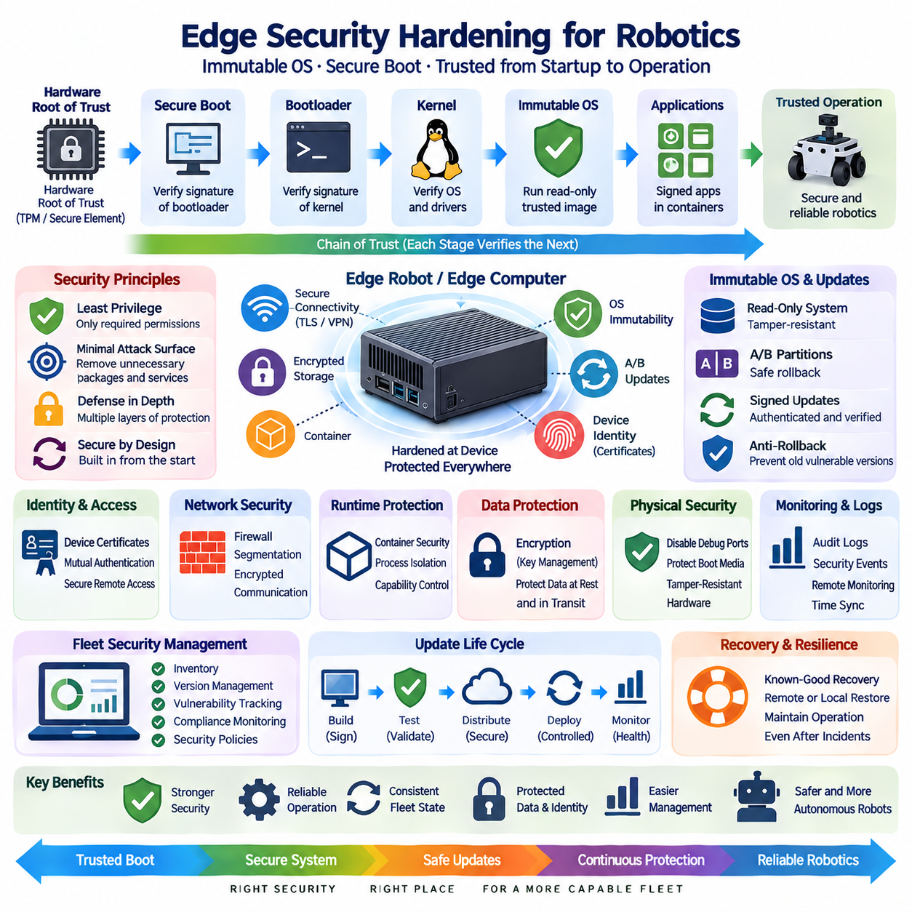{width="7.268055555555556in" height="7.268055555555556in"}

엣지 보안 강화(Edge Security Hardening)는 공격자가 조작할 수 있는 구성요소, 권한, 인터페이스 및 소프트웨어 상태를 줄임으로써 로봇 및 산업용 엣지 시스템을 보호한다. 통제된 시설에 위치하는 중앙 집중형 서버와 달리 엣지 컴퓨터는 로봇, 생산 구역, 창고, 실외 환경 또는 원격 사이트에서 운영될 수 있으며 물리적인 접근이 가능할 수도 있다. 따라서 보안은 초기 부팅부터 운영체제 실행, 애플리케이션 배포, 통신, 업데이트 및 복구에 이르기까지 전체 플랫폼을 보호해야 한다.

강화된 엣지 아키텍처(Hardened Edge Architecture)는 하드웨어 기반 신뢰 체인(Hardware-Rooted Chain of Trust)에서 시작한다. 프로세서 또는 플랫폼 펌웨어는 최초의 신뢰할 수 있는 실행 단계를 설정하고 이후의 부팅 구성요소가 실행되기 전에 무결성(Integrity)과 진위성(Authenticity)을 검증한다. 각각의 신뢰 단계가 다음 단계를 검증함으로써 펌웨어에서 부트로더(Bootloader), 커널(Kernel), 운영체제 구성요소까지 연결되는 신뢰 체인을 형성한다. 이 과정에 승인되지 않은 코드가 삽입되면 검증 메커니즘은 정상 실행을 차단하거나 장치를 통제된 복구 메커니즘으로 전환해야 한다.

보안 부팅(Secure Boot)은 이러한 신뢰 기반 시작 프로세스(Trusted Startup Process)를 강제하는 중요한 메커니즘을 제공한다. 암호학적 서명(Cryptographic Signature)을 사용하여 부팅 구성요소가 승인된 출처에서 제공되었는지 그리고 플랫폼 보안 정책에 따라 허용 가능한 상태를 유지하고 있는지를 판단한다. Secure Boot는 서명 키(Signing Key), 펌웨어 구성, 부트로더 정책 및 복구 절차를 하나의 수명주기로 관리할 때 가장 효과적이다. 키와 업데이트 프로세스를 통제하지 않은 상태에서 기능만 활성화하면 완전하게 관리되는 신뢰 아키텍처보다 보호 효과가 제한적이다.

측정 부팅(Measured Boot)은 단순히 실행을 허용하거나 차단하는 것에 그치지 않고 주요 시작 구성요소의 암호학적 측정값(Cryptographic Measurement)을 기록함으로써 Secure Boot를 보완한다. 이러한 측정값은 신뢰 플랫폼 모듈(Trusted Platform Module, TPM)과 같은 하드웨어 보안 기능을 사용하여 저장하거나 보호할 수 있다. 관리 시스템은 측정값을 알려진 정상 값과 비교하여 장치가 예상된 소프트웨어 구성으로 시작되었는지 판단할 수 있다. 이는 장치 상태 평가, 원격 증명(Remote Attestation), 사고 조사 및 플릿 보안 모니터링을 지원하는 근거를 제공한다.

불변 운영체제(Immutable Operating System)는 배포 이후 소프트웨어 플랫폼에 발생하는 통제되지 않은 변경을 감소시킨다. 핵심 시스템 파티션 또는 운영체제 이미지는 수동 패키지 설치를 통해 지속적으로 변경하는 대신 읽기 전용(Read-Only)으로 취급하거나 원자적으로 교체(Atomic Replacement)한다. 애플리케이션, 구성, 로그 및 영구 운영 데이터는 보호된 시스템 이미지와 분리할 수 있다. 이를 통해 로봇 플릿의 구성 편차(Configuration Drift)를 줄이고 배포 상태를 보다 쉽게 재현, 검증, 업데이트 및 장애 이후 복구할 수 있다.

불변성(Immutability)은 로봇을 절대로 변경할 수 없다는 의미가 아니다. 대신 개별 파일을 임의로 수정하는 것이 아니라 통제된 이미지 버전(Controlled Image Version)을 통해 변경 사항을 적용한다. 새로운 운영체제 이미지를 하나의 알려진 소프트웨어 상태로 빌드하고 시험한 후 서명, 배포 및 활성화할 수 있다. 이러한 방식은 소스 구성과 실제 배포된 장치 사이의 관계를 더욱 명확하게 만든다. 업데이트 이후 문제가 발생하면 변경된 패키지의 불확실한 조합을 다시 구성하는 대신 이전에 검증된 이미지로 복귀할 수 있다.

A/B 시스템 파티션(A/B System Partition)은 안정적인 엣지 업데이트를 구현하는 데 유용하다. 하나의 파티션에서는 현재 검증된 운영체제를 실행하고 다른 파티션에는 다음 소프트웨어 이미지를 설치한다. 검증이 완료되면 장치는 업데이트된 파티션으로 부팅하여 상태 검사(Health Check)를 수행할 수 있다. 시작 또는 검증에 실패하면 이전 파티션으로 되돌아갈 수 있다. 이러한 메커니즘은 다운로드 중단, 전원 장애, 손상된 이미지 또는 호환되지 않는 소프트웨어로 인해 원격 배치된 로봇이 영구적으로 작동 불능 상태가 될 위험을 줄인다.

운영체제 자체에는 최소 공격 표면(Minimal Attack Surface) 원칙을 적용해야 한다. 운영 환경에서 필요하지 않은 패키지, 서비스, 셸(Shell), 네트워크 리스너(Network Listener), 개발 도구 및 기본 계정은 제거하거나 비활성화해야 한다. 추가되는 모든 구성요소는 새로운 취약점, 유지보수 요구사항 또는 예상하지 못한 통신 경로를 만들 수 있다. 최소화된 플랫폼은 소프트웨어 패키지의 수가 감소하므로 로봇의 전체 운영 수명 동안 인벤토리 관리, 모니터링, 패치 및 검증이 필요한 대상을 줄여 취약점 관리도 단순화한다.

최소 권한(Least Privilege)은 애플리케이션과 시스템 서비스 전반에 적용되어야 한다. 모든 소프트웨어를 루트(Root) 권한으로 실행하는 대신 로봇 소프트웨어에는 해당 기능을 수행하는 데 필요한 권한만 부여해야 한다. Linux 기능(Linux Capabilities), 사용자 및 그룹 권한, 파일 시스템 제어, 장치 권한, 강제 접근 제어(Mandatory Access Control), 컨테이너 제한 및 서비스 격리를 통해 특정 프로세스가 침해되었을 때 발생하는 피해를 줄일 수 있다. 카메라, CAN 인터페이스, 직렬 장치, GPU, 저장장치 및 네트워크 구성에 대한 접근 권한 역시 전체 호스트 환경을 노출하는 대신 필요한 범위에서 명시적으로 부여해야 한다.

컨테이너화된 워크로드(Containerized Workload)는 컨테이너와 호스트 양쪽 수준에서 보안을 강화해야 한다. 컨테이너는 최소화되고 신뢰할 수 있는 이미지를 사용하고 불필요한 특권 실행을 피하며 마운트된 호스트 경로를 제한하고 Linux 기능을 최소화하며 영구 데이터를 애플리케이션 계층과 분리해야 한다. 이미지 출처(Image Provenance)와 취약점 상태는 배포 전에 추적해야 한다. 컨테이너는 호스트 커널을 공유하기 때문에 컨테이너 격리(Container Isolation)가 운영체제 보안을 대체할 수는 없다. 손상된 커널이나 과도한 권한을 가진 컨테이너는 애플리케이션 수준에서 강력해 보이는 보안 경계를 무력화할 수 있다.

암호학적 신원(Cryptographic Identity)을 사용하면 각 엣지 장치가 관리 시스템이나 다른 신뢰할 수 있는 인프라에 연결할 때 자신의 신원을 증명할 수 있다. 장치 인증서(Device Certificate), 보호된 개인 키(Private Key) 및 통제된 자격 증명 프로비저닝(Credential Provisioning)은 상호 인증(Mutual Authentication)과 암호화 통신을 지원할 수 있다. 자격 증명을 애플리케이션 이미지 내부에 재사용 가능한 비밀정보로 포함해서는 안 된다. 가능한 경우 민감한 키는 하드웨어 기반 메커니즘으로 보호하여 저장장치를 분리하거나 파일 시스템을 복사하는 것만으로 장치 신원이 노출되지 않도록 해야 한다.

네트워크 강화(Network Hardening)는 공격자가 사용할 수 있는 통신 경로를 제한한다. 엣지 노드는 필요한 서비스만 외부에 노출하고 방화벽과 네트워크 분할(Network Segmentation)을 통해 인바운드, 아웃바운드 및 수평 통신(Lateral Communication)을 제한해야 한다. 로봇 네트워크, 관리 네트워크, 센서 네트워크 및 엔터프라이즈 시스템은 신뢰 수준과 운영 요구사항에 따라 분리할 수 있다. 원격 관리는 신뢰할 수 없는 네트워크에 범용 관리 인터페이스를 직접 노출하는 대신 인증 및 암호화된 통신 채널과 통제된 권한 부여를 사용해야 한다.

소프트웨어 업데이트(Software Update)는 보안을 유지하기 위한 필수 요소인 동시에 새로운 보안 위험을 발생시킬 수 있다. 엣지 장치는 취약점 수정과 애플리케이션 개선을 받아야 하지만 승인되지 않은 업데이트를 허용하면 공격자가 시스템을 장악할 수 있다. 따라서 업데이트 패키지는 인증, 무결성 검사, 버전 관리 과정을 거쳐 신뢰할 수 있는 메커니즘을 통해 배포해야 한다. 롤백 정책(Rollback Policy) 역시 보안 관점에서 고려해야 한다. 이전 이미지로 복귀하면 시스템 가용성은 회복될 수 있지만 이미 수정된 알려진 취약점을 다시 시스템에 도입할 수도 있기 때문이다.

롤백 방지(Anti-Rollback)는 장치가 승인된 보안 수준보다 낮은 소프트웨어 버전을 받아들이지 못하도록 할 수 있다. 이는 공격자가 물리적으로 장치에 접근하여 정상적으로 서명되었지만 악용 가능한 취약점이 포함된 과거 이미지를 설치하려는 경우 특히 중요하다. 버전 카운터(Version Counter), 신뢰할 수 있는 메타데이터(Trusted Metadata) 또는 하드웨어 지원 메커니즘을 이용하여 최소 허용 버전을 강제할 수 있다. 그러나 보안 통제로 인해 정상적인 유지보수나 재해 복구가 불가능해지지 않도록 복구 절차를 신중하게 설계해야 한다.

엣지 컴퓨터는 통제된 데이터 센터 외부에 배치되어 직접 접근이 가능할 수 있으므로 물리적 보안(Physical Security)도 중요하다. 공격자는 직접적인 접근을 통해 저장장치를 제거하거나 디버깅 인터페이스에 연결하고, 부팅 미디어를 교체하거나 펌웨어 설정을 초기화하고, 외부에 노출된 포트에 접근하려고 시도할 수 있다. 운영 장치에서는 불필요한 디버그 인터페이스를 비활성화하고 부팅 구성을 보호하며 이동식 미디어 사용을 통제하고 필요한 경우 변조 방지형 기계 설계(Tamper-Resistant Mechanical Design)를 적용해야 한다. 암호화를 추가하면 로봇에서 분리된 저장장치의 정보 가치를 더욱 낮출 수 있다.

예방적 보안 통제가 충분하지 않은 상황에 대비하여 로깅(Logging)과 보안 모니터링(Security Monitoring)은 사고 분석에 필요한 증거를 제공해야 한다. 인증 실패, 권한 변경, 업데이트 시도, 부팅 측정값, 서비스 충돌, 구성 변경, 네트워크 이상 및 무결성 위반 등을 운영 요구사항에 따라 기록해야 한다. 중요한 로그는 네트워크 연결이 불가능할 때 로컬에 안전하게 버퍼링하고 이후 중앙 모니터링 인프라로 전달할 수 있다. 여러 로봇, 게이트웨이, 서버 및 네트워크 시스템의 이벤트를 연관 분석하려면 시간 동기화(Time Synchronization)가 필수적이다.

플릿 보안(Fleet Security)을 위해서는 배포된 모든 장치의 하드웨어, 펌웨어, 운영체제 버전, 애플리케이션 이미지, 인증서 및 보안 상태에 대한 인벤토리(Inventory)를 유지해야 한다. 더 이상 업데이트를 받지 못하거나 만료된 인증서를 사용하는 로봇은 초기 구성이 안전했더라도 전체 시스템의 취약 지점이 될 수 있다. 중앙 관리 시스템은 오래되거나 정책을 준수하지 않는 노드를 식별할 수 있어야 하며, 일시적으로 연결이 끊긴 상황에서도 필수적인 로컬 기능은 안전하게 지속될 수 있어야 한다. 따라서 보안은 일회성 배포 작업이 아니라 지속적인 수명주기 프로세스(Continuous Lifecycle Process)로 관리해야 한다.

복구(Recovery)는 단순한 가용성 기능이 아니라 보안 강화의 일부로 취급해야 한다. 침해되거나 손상된 장치는 검증된 이미지, 보호된 자격 증명, 알려진 구성 및 필요한 경우 보존된 운영 데이터를 사용하여 신뢰할 수 있는 상태로 복귀할 수 있는 명확한 방법을 갖추어야 한다. 불변 이미지(Immutable Image)와 검증된 부팅 메커니즘(Verified Boot Mechanism)은 복구 목표 상태를 명확하게 정의할 수 있기 때문에 이러한 과정을 단순화한다. 목표는 불확실한 소프트웨어 환경을 수동으로 복구하는 것이 아니라 알려진 정상 상태(Known-Good State)를 복원하는 것이다.

따라서 견고한 엣지 보안 아키텍처(Robust Edge Security Architecture)는 하드웨어 신뢰(Hardware Trust), 보안 부팅(Secure Boot), 측정 기반 시작(Measured Startup), 불변 운영체제 이미지(Immutable Operating-System Image), 통제된 업데이트, 최소 권한, 네트워크 분할, 장치 신원(Device Identity), 모니터링 및 신뢰할 수 있는 복구(Trusted Recovery)를 하나의 체계로 연결한다. 단일 메커니즘만으로 완전한 보호를 제공할 수는 없다. 이러한 통제 수단을 함께 적용하면 승인되지 않은 소프트웨어 실행, 구성 편차, 자격 증명 노출, 수평 이동 및 지속적인 침해 위험을 줄이면서 로봇의 소프트웨어 상태를 보다 쉽게 검증하고 재현할 수 있다.

분산 로봇 시스템(Distributed Robotic System)에서 최종 목표는 장치의 전체 수명주기에 걸쳐 신원, 부팅 상태, 운영체제, 애플리케이션, 통신 경로 및 업데이트 이력을 관리할 수 있는 검증 가능한 엣지 플랫폼(Verifiable Edge Platform)을 구축하는 것이다. Secure Boot는 시스템 시작 단계에서 신뢰성을 확립하고, 불변 운영체제는 예측 가능한 소프트웨어 상태를 유지하며, 서명된 원자적 업데이트(Signed Atomic Update)는 통제된 시스템 변경을 가능하게 한다. 이러한 메커니즘을 모니터링 및 복구 체계와 결합하면 지속적인 관리가 어려운 컴퓨팅 환경에서도 자율 로봇을 안정적으로 운영하기 위한 보안 기반을 구축할 수 있다.

## 02.09 Edge Device Monitoring and Remote Management [w/Code]

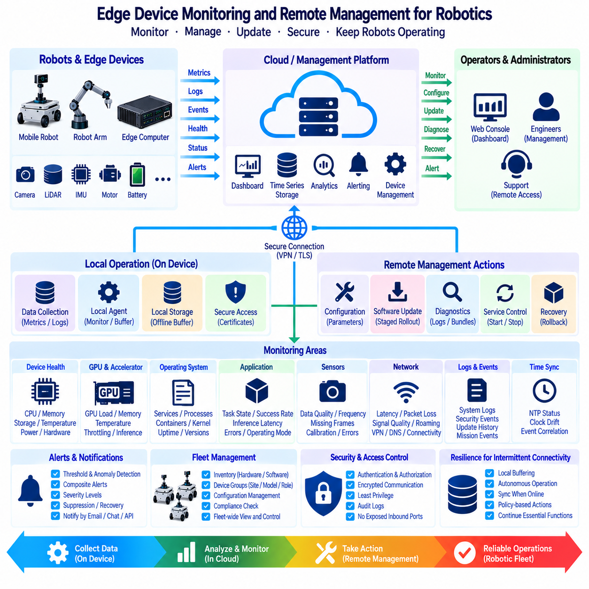{width="7.268055555555556in" height="7.268055555555556in"}

엣지 장치 모니터링(Edge Device Monitoring)과 원격 관리(Remote Management)는 배포 이후 로봇과 분산 컴퓨팅 노드를 유지관리하는 데 필요한 운영 가시성(Operational Visibility)과 제어 기능을 제공한다. 로봇은 엔지니어의 직접적인 감독 없이 수개월 또는 수년 동안 운영될 수 있으므로 플릿 규모에서 수동 점검은 비현실적이다. 따라서 모니터링은 하드웨어, 운영체제, 애플리케이션, 네트워크, 센서, 저장장치 및 임무 수행에 관한 정보를 수집하며, 원격 관리는 진단, 구성, 유지보수 및 복구를 위한 통제된 메커니즘을 제공한다.

효과적인 모니터링은 장치 상태 텔레메트리(Device Health Telemetry)에서 시작한다. 엣지 컴퓨터는 프로세서 사용률, 메모리 사용량, 저장장치 용량, 파일 시스템 상태, 온도, 전원 상태, 가속기 사용률 및 주요 하드웨어 오류를 보고해야 한다. GPU가 탑재된 로봇에서는 GPU 부하, 메모리 사용량, 온도, 스로틀링(Throttling) 및 추론 워크로드 동작을 추가로 추적할 수 있다. 이러한 측정값은 애플리케이션 문제를 자원 고갈, 열적 제한, 저장장치 장애 또는 하드웨어 성능 저하와 구분하는 데 도움을 준다.

운영체제 모니터링(Operating-System Monitoring)은 또 다른 수준의 가시성을 제공한다. 서비스, 프로세스, 컨테이너, 커널 이벤트, 부팅 상태, 시스템 가동 시간, 자원 제한 및 패키지 또는 이미지 버전을 통해 소프트웨어 플랫폼이 의도된 상태를 유지하고 있는지 판단할 수 있다. 반복적인 프로세스 재시작, 예상하지 못한 서비스 종료, 파일 시스템 오류 또는 비정상적인 자원 증가 현상은 시스템 전체 장애가 발생하기 전에 문제를 나타낼 수 있다. 따라서 모니터링은 순간적인 측정값뿐만 아니라 추세(Trend)와 상태 전이(State Transition)에도 초점을 맞춰야 한다.

애플리케이션 수준 텔레메트리(Application-Level Telemetry)는 정상적인 컴퓨터 상태가 반드시 정상적인 로봇 상태를 의미하지 않기 때문에 로봇 시스템에서 특히 중요하다. 인지 파이프라인(Perception Pipeline)은 추론 지연시간, 프레임 속도, 누락 프레임, 탐지 신뢰도 및 처리 대기열을 보고할 수 있다. 위치추정(Localization)은 자세 불확실성이나 추적 품질을 제공할 수 있으며, 플래너(Planner)는 경로 계획 지연시간, 경로 생성 실패 또는 복구 이벤트를 보고할 수 있다. 임무 소프트웨어는 작업 상태, 완료율, 예외 코드 및 운영 모드를 제공하여 일반적인 인프라 지표 이상의 의미 있는 정보를 제공할 수 있다.

센서 모니터링(Sensor Monitoring)은 센서의 가용성뿐만 아니라 데이터 품질도 검증해야 한다. 카메라 프로세스가 실행 중이더라도 영상이 정지될 수 있으며, LiDAR 인터페이스가 연결되어 있더라도 패킷 손실이 증가할 수 있고, IMU가 비정상적인 타이밍이나 값을 가진 데이터를 지속적으로 전송할 수도 있다. 따라서 메시지 주기, 타임스탬프, 오래된 데이터 탐지(Stale-Data Detection), 누락 프레임, 통신 오류, 보정 상태 및 선택적인 통계 검사를 포함해야 한다. 이를 통해 단순히 인터페이스가 동작하는 상태와 신뢰할 수 있는 센서 스트림을 구분할 수 있다.

네트워크 관측 가능성(Network Observability)은 원격 관리 자체가 연결성에 의존하기 때문에 필요하다. 로봇은 지연시간, 패킷 손실, 인터페이스 상태, 무선 신호 품질, 로밍 이벤트, 처리량, DNS 오류, VPN 상태 및 통신 중단을 기록할 수 있다. 이러한 측정값은 애플리케이션 및 임무 이벤트와 연계하여 분석해야 한다. 그렇지 않으면 일시적인 내비게이션 또는 플릿 협조 문제가 실제로는 무선 커버리지 저하나 불안정한 상위 네트워크 연결 때문에 발생했음에도 소프트웨어 결함으로 잘못 진단될 수 있다.

로그(Log)는 수치 기반 지표를 보완하는 상세한 증거를 제공한다. 시스템 로그, 애플리케이션 로그, 보안 이벤트, 컨테이너 출력, 업데이트 이력 및 임무 이벤트를 로컬에서 수집하고 필요한 정보만 중앙 인프라로 전달할 수 있다. 로봇은 네트워크 연결을 잃을 수 있으므로 로깅 시스템은 로컬 버퍼링(Local Buffering)과 지연 동기화(Delayed Synchronization)를 지원해야 한다. 특히 상세 진단 정보, 센서 메타데이터 또는 반복적인 장애가 대량의 데이터를 생성할 수 있으므로 로그가 저장공간을 과도하게 소비하지 않도록 보존 정책(Retention Policy)이 필요하다.

시간 동기화(Time Synchronization)는 분산 모니터링(Distributed Monitoring)의 기본 요소이다. 로봇, 엣지 게이트웨이, 로컬 서버, 클라우드 서비스 및 네트워크 인프라에서 발생하는 이벤트는 사고 발생 과정을 재구성할 수 있을 정도로 일관된 타임스탬프를 공유해야 한다. 정확한 시간이 없다면 통신 장애, 애플리케이션 재시작, 센서 이상 및 임무 중단이 실제와 다른 순서로 나타날 수 있다. 따라서 모니터링 아키텍처는 장치의 시간이 항상 정확하다고 가정하지 않고 타임스탬프 품질(Timestamp Quality)과 동기화 상태 자체를 관측 가능한 시스템 속성으로 관리해야 한다.

중앙 집중형 대시보드(Centralized Dashboard)는 분산된 텔레메트리를 플릿 전체의 운영 관점으로 변환한다. 운영자는 모든 로봇에 직접 로그인하지 않고도 장치 가용성, 소프트웨어 버전, 자원 사용률, 연결 상태, 임무 상태, 활성 경보 및 과거 추세를 확인할 수 있다. 플릿 수준의 집계(Fleet-Level Aggregation)를 통해 개별 장치만으로는 발견하기 어려운 패턴도 식별할 수 있다. 예를 들어 특정 소프트웨어 릴리스 이후 여러 로봇에서 메모리 사용량이 증가하거나 특정 시설에서 통신 장애가 반복되는 현상을 확인할 수 있다.

경보(Alerting)는 모든 비정상적인 측정값에 알림을 발생시키기보다 실제 조치가 필요한 조건(Actionable Condition)에 집중해야 한다. 임계값을 사용하여 높은 온도나 부족한 저장공간을 감지할 수 있으며, 변화율 규칙(Rate-of-Change Rule)을 통해 상태가 빠르게 악화되는 상황을 탐지할 수 있다. 복합 경보(Composite Alert)는 GPU 온도 상승, 스로틀링 및 추론 지연시간 증가와 같은 여러 신호를 결합할 수 있다. 적절한 심각도 수준, 지속 조건, 억제 규칙 및 복구 알림을 적용하면 경보 피로(Alert Fatigue)를 줄이면서 개입이 필요한 상태에 대한 가시성을 유지할 수 있다.

원격 관리(Remote Management)는 관측 가능성을 통제된 운영 조치로 확장한다. 승인된 담당자는 구성 확인, 서비스 재시작, 진단 번들(Diagnostic Bundle) 수집, 승인된 파라미터 변경, 자격 증명 교체, 소프트웨어 배포 또는 복구 절차 실행 등을 수행해야 할 수 있다. 가능한 경우 이러한 기능은 제한 없는 원격 셸(Remote Shell)이 아니라 관리형 인터페이스(Managed Interface)를 통해 제공해야 한다. 표준화된 작업은 각 로봇에 임의의 관리자 접근을 허용하는 방식보다 감사, 자동화, 검증 및 권한 제한을 적용하기 쉽다.

원격 접근(Remote Access)은 최소 권한(Least Privilege)과 강력한 인증(Strong Authentication)을 기반으로 설계해야 한다. 운영자, 자동화 서비스 및 지원 담당자에게는 각자의 책임을 수행하는 데 필요한 권한만 제공해야 한다. 장치 인증서(Device Certificate), 신원 기반 권한 부여(Identity-Based Authorization), 암호화 채널, 단기 자격 증명(Short-Lived Credential) 및 감사 가능한 관리자 세션을 활용하면 원격 유지보수에 따른 위험을 줄일 수 있다. 안전한 아웃바운드 관리 연결이나 통제된 게이트웨이를 사용할 수 있다면 로봇에 인바운드 관리 포트를 영구적으로 노출할 필요가 없다.

구성 관리(Configuration Management)는 대규모 플릿의 일관성을 유지하는 데 도움을 준다. 서비스 설정, 네트워크 구성, 로깅 수준, 애플리케이션 정책 및 운영 프로파일과 같은 파라미터는 식별 가능한 버전과 통제된 배포 절차를 가져야 한다. 관리 시스템은 의도된 구성(Intended Configuration)을 확인하고 이를 실제 장치에서 관측된 상태와 비교할 수 있어야 한다. 수동으로 변경된 로봇은 동일한 애플리케이션 소프트웨어를 실행하더라도 서로 다른 동작을 보일 수 있으므로 구성 편차(Configuration Drift)를 탐지하는 것이 중요하다.

소프트웨어 및 펌웨어 인벤토리(Software and Firmware Inventory)는 원격 관리 시스템과 통합되어야 한다. 운영자는 각 장치에서 실행 중인 운영체제 이미지, 컨테이너 버전, 애플리케이션 릴리스, 드라이버, 펌웨어 및 보안 구성을 파악할 수 있어야 한다. 플릿 질의(Fleet Query)를 통해 유지보수를 시작하기 전에 오래된 장치나 호환되지 않는 조합을 식별할 수 있다. 인벤토리 정보는 업데이트를 먼저 일부 장치에 적용하고 상태 지표가 정상적인 동작을 확인한 이후에만 적용 범위를 확대하는 단계적 배포(Staged Deployment)도 지원한다.

원격 업데이트(Remote Update)는 전체 플릿을 동시에 변경하는 대신 통제된 롤아웃 전략(Controlled Rollout Strategy)을 사용해야 한다. 먼저 소수의 장치에 새로운 버전을 적용하고 검증 이후 점진적으로 더 많은 장치에 확대할 수 있다. 상태 검사(Health Check)는 부팅 성공 여부, 애플리케이션 상태, 자원 소비, 연결성 및 임무 수행 상태를 확인할 수 있다. 사전에 정의된 조건을 만족하지 못하면 배포를 중단하거나 롤백(Rollback)을 실행할 수 있다. 이를 통해 결함이 있는 소프트웨어의 운영 영향을 제한하고 업데이트 결정을 실제 장치 상태와 직접 연결할 수 있다.

간헐적 연결(Intermittent Connectivity) 환경에서는 중앙 서비스에 일시적으로 접근할 수 없는 상황에서도 엣지 장치를 관리 가능한 상태로 유지해야 한다. 모니터링 에이전트(Monitoring Agent)는 지표와 로그를 로컬에 버퍼링할 수 있으며, 관리 정책은 어떤 작업을 자율적으로 실행할 수 있고 어떤 작업에 명시적인 원격 승인이 필요한지를 정의할 수 있다. 연결이 복구되면 저장된 정보를 동기화하고 대기 중인 작업을 조정할 수 있다. 관리 채널이 끊어졌다는 이유만으로 로봇의 정상적인 자율 기능이 중단되어서는 안 된다.

원격 진단(Remote Diagnostics)은 장애를 조사하는 데 충분한 정보를 수집하면서도 대규모 원시 데이터셋을 일상적으로 전송하지 않도록 설계해야 한다. 진단 번들에는 선택된 로그, 시스템 정보, 구성 버전, 최근 경보, 자원 사용 이력, 네트워크 통계 및 애플리케이션 상태가 포함될 수 있다. 인지 또는 센서 장애의 경우 사고 발생 시점을 중심으로 짧은 구간의 데이터를 기록할 수 있다. 이러한 이벤트 기반 방식(Event-Driven Approach)은 대역폭 사용량을 줄이면서 운영 문제의 원인을 설명할 가능성이 높은 정보를 보존한다.

모니터링 인프라(Monitoring Infrastructure) 자체도 모니터링해야 한다. 에이전트가 실패하거나 대기열이 넘칠 수 있고, 로컬 저장공간이 가득 차거나 타임스탬프가 점차 어긋날 수 있으며, 텔레메트리 연결이 별다른 오류 표시 없이 중단될 수도 있다. 지표가 존재하지 않는다는 사실을 정상 상태로 해석해서는 안 된다. 하트비트(Heartbeat), 최신성 검사(Freshness Check), 수집 오류 카운터, 대기열 깊이(Queue Depth) 및 마지막 연결 시각을 사용하면 정상적인 운영과 관측 가능성 상실을 구분할 수 있다. 자동화된 의사결정이 모니터링 데이터에 의존할 경우 이러한 원칙은 특히 중요하다.

플릿 규모 관리(Fleet-Scale Management)는 사이트, 하드웨어 유형, 로봇 모델, 소프트웨어 채널, 임무 역할 또는 운영 상태에 따라 장치를 그룹화함으로써 효율성을 높일 수 있다. 정책과 업데이트를 개별 장치 단위로 관리하는 대신 적절한 그룹을 대상으로 적용할 수 있다. 동일한 구조는 단계적 릴리스(Staged Release), 규정 준수 검사(Compliance Check), 유지보수 시간대 및 사고 격리를 지원한다. 플릿 규모가 증가할수록 각 로봇에서 독립적으로 수행하는 수동 절차보다 선언적 정책(Declarative Policy)과 자동 조정(Automated Reconciliation)이 더 높은 일관성과 신뢰성을 제공한다.

완전한 엣지 관리 아키텍처(Edge Management Architecture)는 로컬 텔레메트리 수집, 로그, 상태 평가, 안전한 원격 작업, 구성 제어, 소프트웨어 인벤토리, 단계적 업데이트, 진단 및 중앙 집중형 플릿 가시성을 하나의 체계로 연결한다. 로컬 에이전트는 네트워크가 중단된 동안에도 운영 정보를 보존하고, 상위 시스템은 과거 데이터 분석과 플릿 전체의 조정을 담당한다. 목표는 모든 로봇을 지속적으로 원격 제어하는 것이 아니라 운영 상태를 지속적으로 파악하면서 필요한 경우 안전하게 개입할 수 있는 수단을 확보하는 것이다.

자율 로봇 플릿(Autonomous Robotic Fleet)에서 모니터링과 원격 관리는 지리적으로 분산된 기계들을 관리 가능한 운영 인프라(Manageable Operational Infrastructure)로 전환한다. 상세한 텔레메트리는 장애를 관측 가능하게 만들고, 중앙 분석은 플릿 전체의 패턴을 식별하며, 안전한 원격 관리는 물리적 접근 없이 유지보수를 가능하게 하고, 통제된 업데이트는 장기간에 걸쳐 소프트웨어의 일관성을 유지한다. 이러한 기능을 로컬 자율성(Local Autonomy) 및 오프라인 버퍼링(Offline Buffering)과 결합하면 각각의 로봇은 독립적인 기능을 유지하면서도 중앙에서 관리되고 지속적으로 유지보수 가능한 플릿의 일부로 운영될 수 있다.

## 02.10 Edge Computing Power Budget for Battery Robots

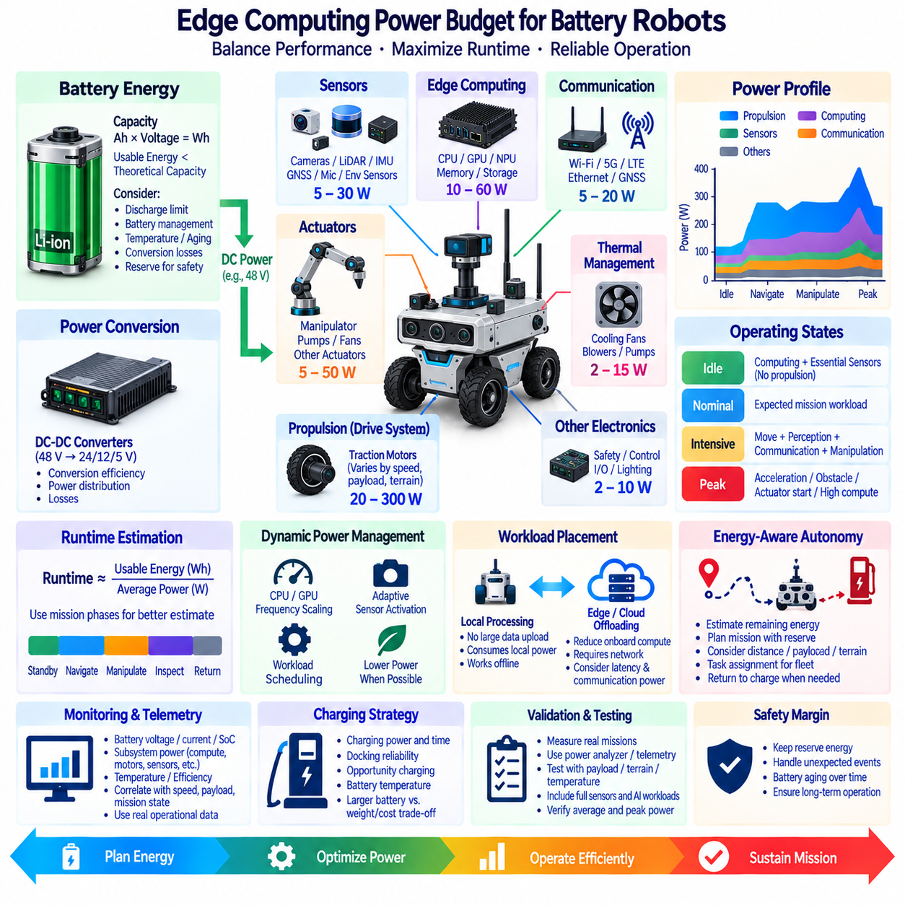{width="7.268055555555556in" height="7.268055555555556in"}

배터리 구동 로봇(Battery-Powered Robot)의 전력 예산(Power Budgeting)은 필요한 운용 시간을 유지하면서 추진, 컴퓨팅, 센서, 통신, 액추에이터 및 보조 전자장치에 전기 에너지를 어떻게 배분할 것인지를 결정한다. 엣지 컴퓨팅(Edge Computing)은 이러한 에너지 중 상당하면서도 지속적으로 변화하는 부분을 소비할 수 있다. 따라서 현실적인 설계에서는 최대 AI 성능 사양만으로 프로세서를 선택하는 것이 아니라 전체 로봇 에너지 시스템과 함께 컴퓨팅 전력을 평가해야 한다.

출발점은 일반적으로 와트시(Watt-Hour, Wh)로 표현되는 배터리 에너지 용량(Battery Energy Capacity)이다. 암페어시(Ampere-Hour, Ah)로 표시된 배터리는 사용 가능한 에너지를 추정하기 위해 공칭 전압(Nominal Voltage)과 함께 해석해야 한다. 그러나 이론적 용량은 실제 사용 가능 에너지와 동일하지 않으며, 방전 제한, 배터리 관리 정책, 온도, 노화, 변환 손실 및 필요한 예비 용량 때문에 안전하게 사용할 수 있는 에너지가 감소한다. 따라서 운용 시간 계산에는 현실적인 사용 가능 에너지(Usable Energy)를 적용해야 한다.

로봇의 전력 수요는 비교적 지속적인 부하(Continuous Load)와 크게 변동하는 부하(Variable Load)로 구성된다. 컴퓨터, 네트워크 장비 및 많은 센서는 임무 수행 중 지속적으로 전력을 소비할 수 있지만, 구동 모터, 매니퓰레이터, 펌프, 히터 또는 기타 액추에이터는 순간적으로 큰 피크 전력(Peak Power)을 발생시킬 수 있다. 평균 전력(Average Power)은 대부분의 운용 가능 시간을 결정하는 반면, 피크 전력은 과도한 전압 강하, 보호장치 작동 또는 시스템 불안정 없이 고부하 상황을 전기 시스템이 지원할 수 있는지를 결정한다.

이동 로봇에서는 추진 시스템(Propulsion System)이 전체 에너지 소비의 상당 부분을 차지하는 경우가 많지만, 전력 요구량은 속도, 페이로드, 가속도, 경사, 지형, 바퀴 저항 및 제어 전략에 따라 크게 달라진다. 평탄한 실내 바닥에서 운용되는 로봇은 무거운 페이로드를 운반하며 실외에서 운용되는 동일한 플랫폼과 매우 다른 에너지 특성을 가질 수 있다. 따라서 컴퓨팅 전력은 모터 시스템이 항상 일정한 비율의 배터리 용량을 소비한다고 가정하지 않고 임무별 에너지 예산(Mission-Specific Energy Budget)의 일부로 평가해야 한다.

엣지 컴퓨터(Edge Computer)는 로봇이 정지해 있을 때도 지속될 수 있는 전력 부하를 발생시킨다. CPU, GPU, NPU, 메모리, 저장장치, 냉각 팬 및 인터페이스 장치가 전체 컴퓨팅 전력 요구량에 포함된다. 고성능 AI 컴퓨터는 인지 및 경로 계획 성능을 향상시킬 수 있지만 사용되지 않는 컴퓨팅 용량도 전력과 열적 비용을 발생시킨다. 따라서 플랫폼 선택에서는 최대 TOPS, GPU 처리량 또는 프로세서 열설계전력(Thermal Design Power, TDP)에만 의존하지 않고 지속적인 워크로드에서의 와트당 성능(Performance per Watt)을 비교해야 한다.

AI 추론 워크로드(AI Inference Workload)는 컴퓨팅 전력에 상당한 변화를 발생시킬 수 있다. 카메라 객체 탐지, 분할(Segmentation), 다중 객체 추적(Multi-Object Tracking), LiDAR 처리, 위치추정, 매핑 및 경로 계획이 동시에 실행되면 개별 벤치마크 시험에서 예상한 것보다 높은 지속 부하가 발생할 수 있다. 따라서 설계자는 대표적인 동시 실행 워크로드(Concurrent Workload)를 측정해야 하며, 전체 인지 및 자율주행 스택이 소비하는 전력은 하나의 신경망만 실행하여 측정한 결과와 상당히 다를 수 있다.

센서(Sensor) 역시 전력 예산에 명시적으로 포함해야 한다. 여러 대의 카메라, 2D 또는 3D LiDAR, 레이더, GNSS 수신기, IMU, 마이크, 깊이 센서 및 환경 센서는 지속적으로 동작할 수 있다. 개별 장치의 소비전력은 추진 시스템에 비해 작아 보일 수 있지만 여러 센서를 설치하면 합산 부하는 상당한 수준에 이를 수 있다. 센서 히터, 조명, 능동형 깊이 방출기(Active Depth Emitter) 및 고속 인터페이스도 특정 운용 조건에서 전력 소비를 추가로 증가시킬 수 있다.

통신 시스템(Communication System)은 또 다른 지속적인 전력 부하를 발생시킨다. Wi-Fi, 이더넷 스위치, 셀룰러 모뎀, 사설 5G 장비, GNSS 보정 링크 및 엣지 게이트웨이는 애플리케이션 트래픽이 많지 않더라도 에너지를 소비한다. 무선 송신 전력과 모뎀 동작은 통신 범위와 네트워크 상태에 따라 달라질 수 있다. 따라서 텔레메트리, 영상, 지도 또는 진단 정보를 지속적으로 업로드하는 로봇은 통신 장치의 전력뿐만 아니라 인코딩, 암호화, 버퍼링 및 프로토콜 처리에 필요한 추가적인 컴퓨팅 전력도 고려해야 한다.

전력 변환 효율(Power Conversion Efficiency)은 배터리 에너지 중 실제로 컴퓨팅 전자장치에 전달되는 양에 영향을 준다. 로봇은 48 V 구동 배터리를 사용하면서 엣지 컴퓨터와 센서에는 24 V, 12 V, 5 V 또는 다른 정전압 전원이 필요할 수 있다. DC-DC 컨버터(DC-DC Converter)는 컨버터 설계와 운용 부하에 따라 손실을 발생시킨다. 따라서 전력 예산에서는 하위 장치의 공칭 입력 전력을 단순히 합산하는 대신 각 전력 경로의 변환 효율을 고려해야 한다.

열 관리(Thermal Management)와 전력 소비는 밀접하게 연결되어 있다. 높은 컴퓨팅 부하는 추가적인 열을 발생시키며, 이를 제거하기 위해 팬, 블로어, 펌프 또는 다른 냉각 장치가 필요해져 추가적인 에너지를 소비할 수 있다. 높은 내부 온도는 프로세서 스로틀링(Processor Throttling)을 발생시켜 전력은 계속 소비하면서 성능을 저하시킬 수도 있다. 따라서 특히 밀폐형 인클로저, 실외 로봇 및 직사광선이나 고온 환경에서 운용되는 플랫폼에서는 현실적인 주변 환경 조건에서 지속 운용 상태를 측정해야 한다.

실용적인 전력 예산은 유휴(Idle), 정상(Nominal), 고부하(Intensive) 및 피크(Peak) 운용 상태를 구분해야 한다. 유휴 상태에서는 추진 시스템이 작동하지 않더라도 컴퓨터와 필수 센서가 동작할 수 있다. 정상 상태는 예상되는 임무 워크로드를 나타내며, 고부하 상태에서는 이동, 인지, 통신 및 조작이 동시에 수행될 수 있다. 피크 상태에는 가속, 장애물 극복, 액추에이터 시작 또는 고부하 컴퓨팅의 동시 실행 등이 포함된다. 이러한 상태 구분은 하나의 단일 전력 수치보다 유용한 엔지니어링 정보를 제공한다.

사용 가능한 배터리 에너지와 평균 임무 전력을 비교하여 운용 시간을 추정할 수 있지만 실제 로봇 임무에서는 하나의 일정한 부하가 지속되는 경우가 드물다. 보다 현실적인 모델은 임무를 대기, 내비게이션, 조작, 검사, 통신 및 충전 지점 접근과 같은 운용 단계(Operating Phase)로 구분한다. 각 단계의 평균 전력과 지속 시간을 이용하여 소비 에너지를 추정할 수 있다. 이러한 단계별 에너지를 합산하면 임무 수준의 에너지 추정값을 얻을 수 있으며 이후 실제 로봇의 측정 결과를 통해 검증할 수 있다.

계산된 운용 시간은 배터리를 절대적인 한계까지 소비하는 것을 전제로 해서는 안 되므로 안전 여유(Safety Margin)가 필요하다. 위치추정 복구, 장애물 회피, 통신 지연, 경로 변경, 도킹 시도 및 충전 지점 복귀 동작을 위해 일정한 에너지를 남겨야 한다. 또한 배터리 노화(Battery Aging)는 시간이 지남에 따라 용량을 감소시킨다. 새 배터리를 이상적인 조건에서 사용할 때만 임무 요구사항을 충족하는 로봇은 장기간 운용에 필요한 충분한 운영 여유(Operational Margin)를 확보하지 못한 것이다.

동적 전력 관리(Dynamic Power Management)를 활용하면 불필요한 엣지 컴퓨팅 전력 소비를 줄일 수 있다. CPU 및 GPU 주파수 조정, 가속기 전력 모드, 선택적 센서 활성화, 적응형 프레임 속도(Adaptive Frame Rate), 추론 주기 감소 및 워크로드 스케줄링을 통해 최대 성능이 필요하지 않을 때 소비전력을 낮출 수 있다. 예를 들어 정지된 로봇은 최고 속도로 주행하는 로봇과 동일한 인지 처리 속도를 필요로 하지 않을 수 있다. 그러나 전력 최적화 과정에서도 안전성, 제어 안정성 및 필요한 인지 범위를 유지해야 한다.

워크로드 배치(Workload Placement) 역시 에너지 예산에 영향을 준다. 센서 데이터를 로컬에서 처리하면 대용량 원시 스트림의 지속적인 전송을 피할 수 있지만 로컬 컴퓨팅 전력이 소비된다. 일부 워크로드를 엣지 서버나 클라우드로 오프로딩(Offloading)하면 온보드 컴퓨팅 부하를 줄일 수 있지만 무선 통신, 지연시간, 연결성 및 원격 인프라가 추가적인 의존성이 된다. 따라서 가장 에너지 효율적인 아키텍처는 데이터량, 계산 복잡도, 네트워크 상태, 임무 요구사항 및 연결 단절 상황에서 요구되는 자율성에 따라 달라진다.

전력 텔레메트리(Power Telemetry)는 설계 단계의 측정에만 사용하는 것이 아니라 로봇 모니터링 시스템과 통합해야 한다. 배터리 전압, 전류, 충전 상태(State of Charge, SoC), 예상 잔여 에너지, 컴퓨팅 전력, 온도, 컨버터 상태 및 주요 하위 시스템의 부하를 임무 수행 중 기록할 수 있다. 이러한 측정값을 로봇 속도, 지형, 페이로드, AI 워크로드 및 임무 상태와 연계하면 실제 에너지가 어디에서 소비되는지를 파악할 수 있으며 엔지니어링 가정을 실제 운영 데이터로 대체할 수 있다.

에너지 인지형 자율성(Energy-Aware Autonomy)은 이러한 정보를 임무 계획에 활용할 수 있다. 로봇은 작업을 완료하고 적절한 예비 에너지를 유지한 상태로 충전 위치까지 이동할 수 있는 충분한 에너지가 남아 있는지를 추정할 수 있다. 임무 스케줄링은 이동 거리, 페이로드, 지형, 예상 컴퓨팅 부하 및 충전 기회를 고려할 수 있다. 플릿 환경에서는 각 로봇의 에너지 상태를 작업 할당(Task Assignment)에 반영하여 불필요한 임무 중단이나 긴급 충전 없이 작업을 완료할 수 있는 로봇에 임무를 배정할 수 있다.

충전 전략(Charging Strategy)은 로봇의 실제 가용성이 방전뿐만 아니라 재충전 동작에도 영향을 받기 때문에 전력 아키텍처의 일부이다. 충전 전력, 충전 시간, 도킹 신뢰성, 배터리 온도 및 기회 충전(Opportunity Charging) 정책은 로봇이 제공할 수 있는 생산적인 운용 시간에 영향을 준다. 배터리 용량을 증가시키면 운용 시간을 연장할 수 있지만 질량, 충전 시간 및 비용도 증가하며 추진 에너지까지 증가할 가능성이 있으므로 단순히 배터리를 대형화하는 것이 항상 가장 효율적인 해결책은 아니다.

검증(Validation)은 구성요소 데이터시트에만 의존하지 않고 대표적인 임무에서 실제 물리적 측정을 통해 수행해야 한다. 전력 분석기(Power Analyzer), 배터리 관리 시스템 텔레메트리, 온보드 전류 센서 및 하위 시스템 측정을 사용하여 실제 평균 및 피크 전력 요구량을 확인할 수 있다. 시험에는 대표적인 페이로드, 지형, 온도, 센서 구성, 통신 상태 및 AI 워크로드를 포함해야 한다. 실험실의 유휴 상태 측정값은 실제 운용 중인 자율 로봇의 에너지 특성을 제대로 나타내지 못하는 경우가 많기 때문이다.

따라서 견고한 배터리 로봇 아키텍처(Robust Battery-Robot Architecture)는 추진, 엣지 컴퓨팅, 센서, 통신, 전력 변환, 열 관리, 임무 동작 및 충전을 하나의 통합 에너지 시스템(Integrated Energy System)으로 다룬다. 목표는 단순히 컴퓨터의 소비전력을 최소화하는 것이 아니라 제한된 배터리 에너지를 가장 높은 운영 가치를 제공하는 영역에 배분하는 것이다. 실제 측정된 워크로드, 현실적인 임무 프로파일, 충분한 예비 여유 및 적응형 전력 관리를 결합하면 이동성, 안전성 또는 임무 완수 능력을 희생하지 않으면서 지속적인 AI 기능을 제공할 수 있다.
