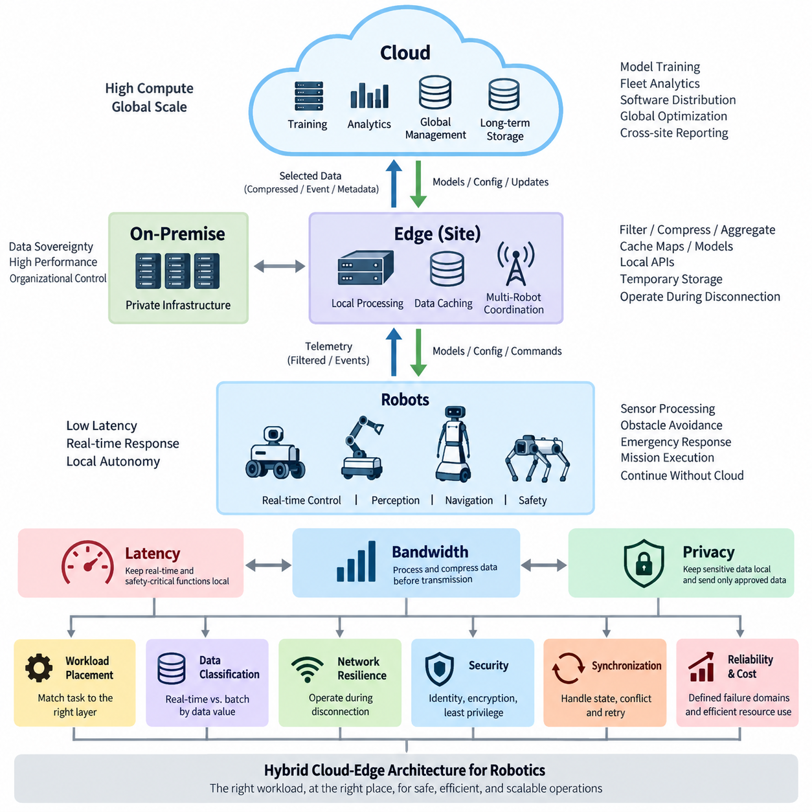
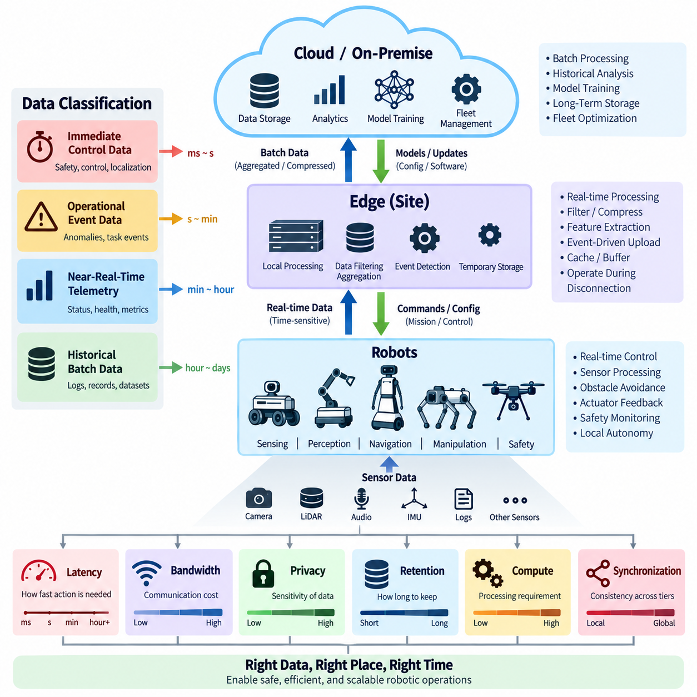
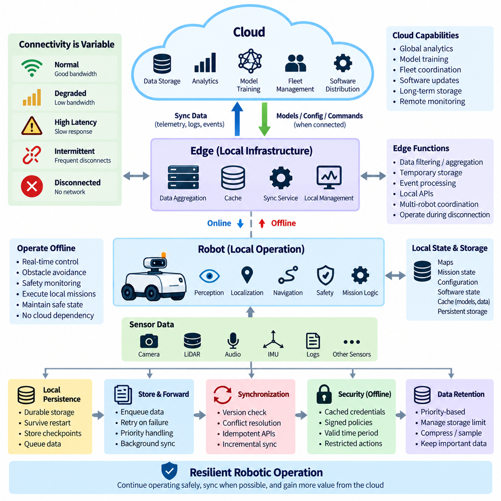
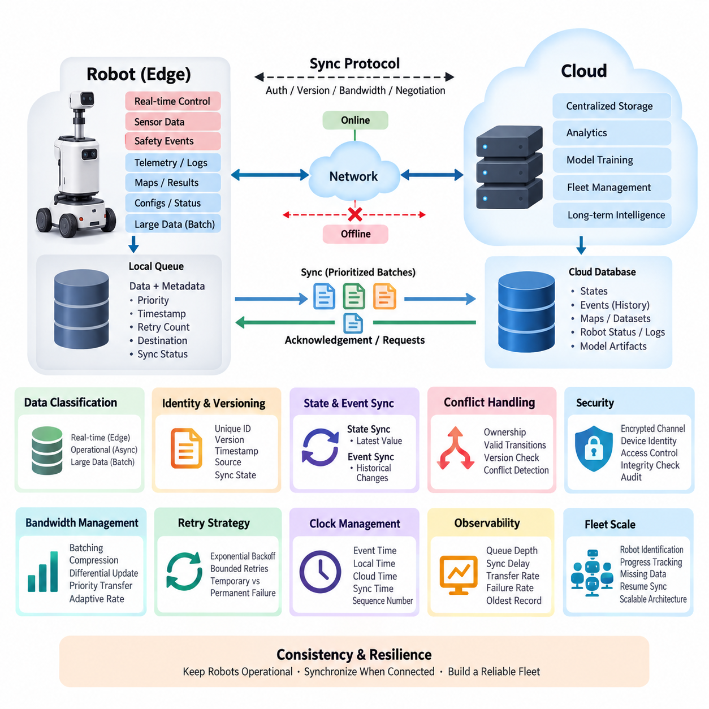
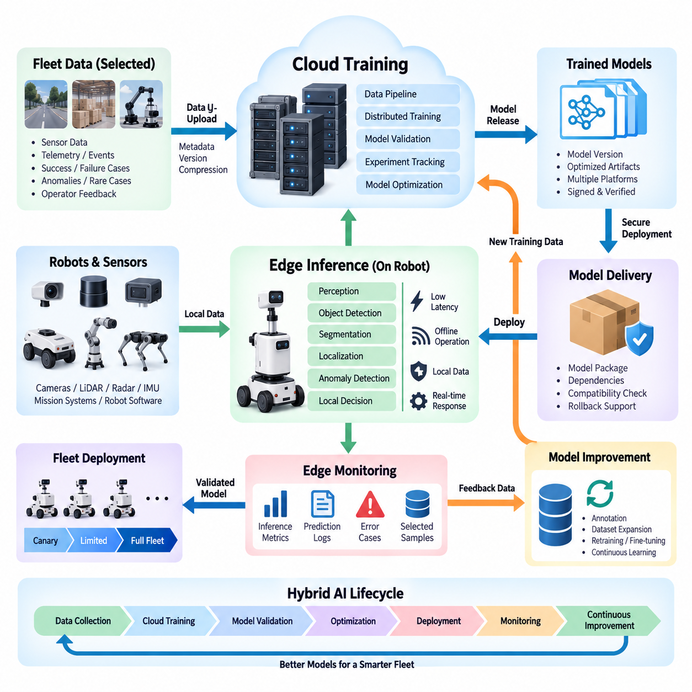
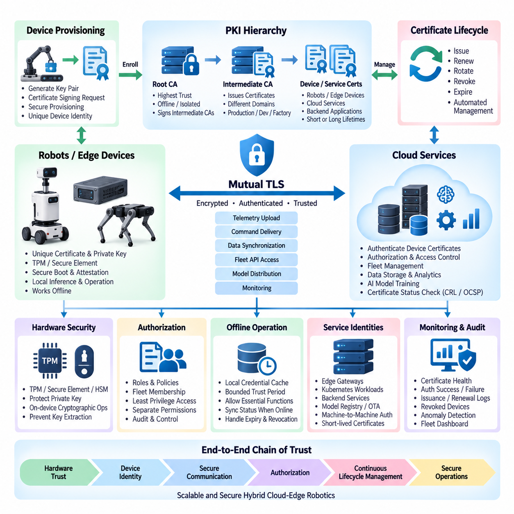
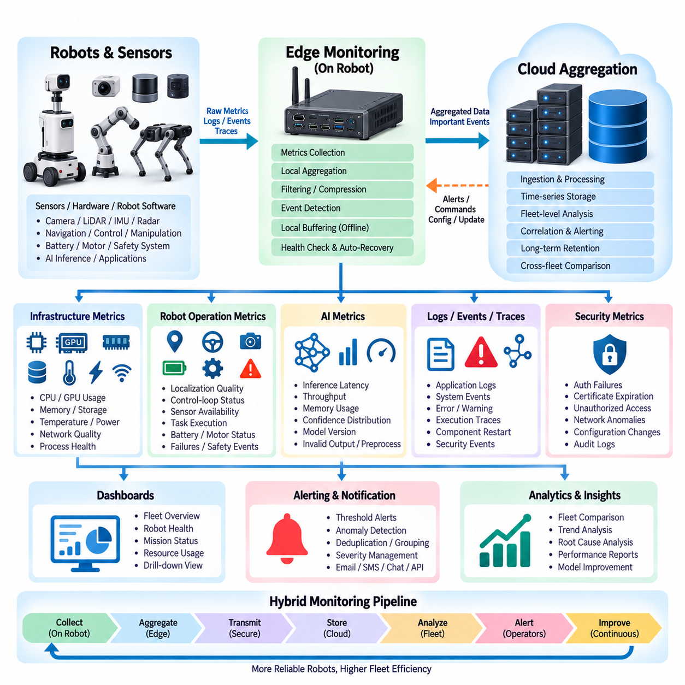
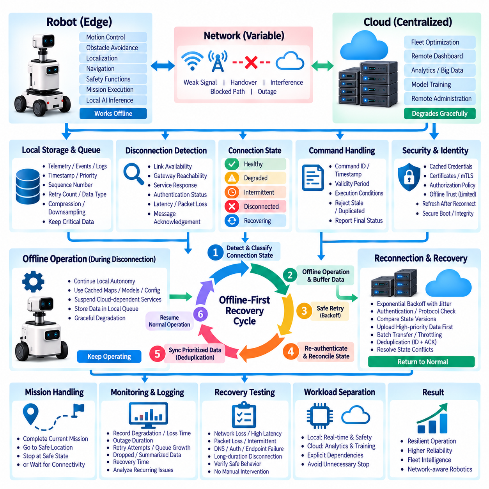
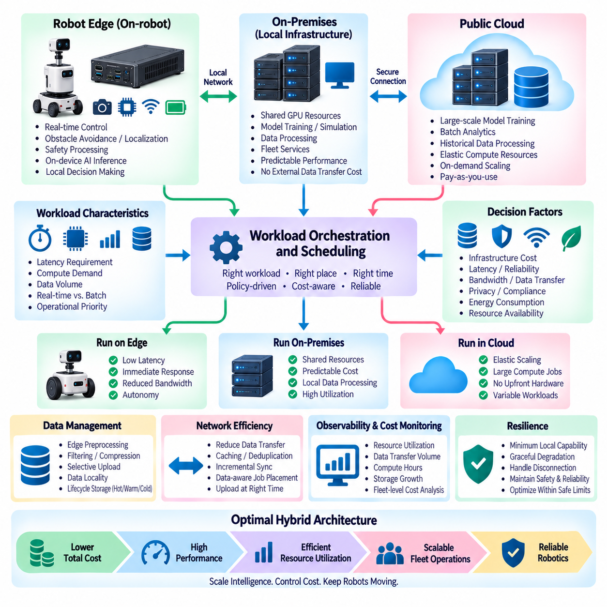
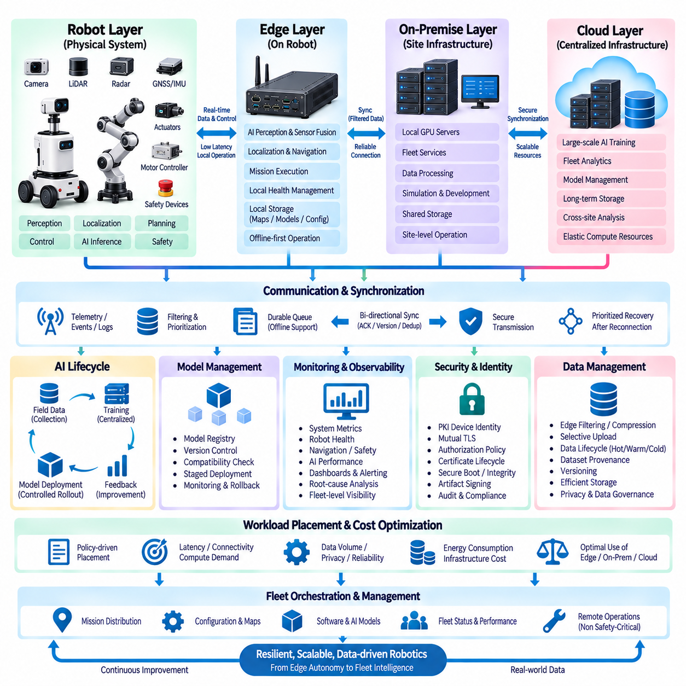

**Volume 09 Cloud and Edge Robotics**

# 03. Hybrid Cloud.Edge Architecture

## 03.01 Hybrid Architecture Principles: Latency, BW, Privacy

{width="7.268055555555556in" height="7.268055555555556in"}

로보틱스를 위한 하이브리드 클라우드-엣지 아키텍처(Hybrid Cloud-Edge Architecture)는 운영 요구사항에 따라 연산을 로봇 내부 프로세서(Robot-Local Processor), 인접 엣지 인프라(Nearby Edge Infrastructure), 온프레미스 시스템(On-Premise System), 원격 클라우드 플랫폼(Remote Cloud Platform)에 분산한다. 목적은 단순히 소프트웨어를 엣지와 클라우드로 나누는 것이 아니라, 각 워크로드(Workload)의 지연시간(Latency), 대역폭(Bandwidth), 가용성(Availability), 보안(Security), 개인정보 보호(Privacy), 연산 특성(Computational Characteristics)을 가장 효과적으로 충족할 수 있는 위치에 배치하는 것이다.

지연시간(Latency)은 워크로드 배치(Workload Placement)를 결정하는 가장 강력한 요소 중 하나이다. 모터 제어(Motor Control), 장애물 회피(Obstacle Avoidance), 비상 대응(Emergency Response), 위치추정 갱신(Localization Update), 안전 모니터링(Safety Monitoring)과 같은 로봇 기능은 엄격한 시간 제약 아래 동작하는 경우가 많다. 이러한 연산을 광역 네트워크(WAN)를 통해 처리하면 가변적인 지연과 지터(Jitter)가 발생하므로, 안전 필수(Safety-Critical) 및 실시간(Real-Time) 의사결정은 일반적으로 로봇이나 결정론적 로컬 엣지 플랫폼(Deterministic Local Edge Platform)에 유지해야 한다.

클라우드 시스템(Cloud System)은 즉각적인 응답보다 연산 규모(Computational Scale)에서 가치가 발생하는 워크로드에 더 적합하다. 대규모 모델 학습(Large-Scale Model Training), 과거 플릿 분석(Historical Fleet Analytics), 장기 데이터 저장(Long-Term Data Storage), 전역 최적화(Global Optimization), 소프트웨어 배포(Software Distribution), 사이트 간 보고(Cross-Site Reporting)는 상대적으로 큰 통신 지연을 허용할 수 있다. 따라서 하이브리드 아키텍처는 로봇의 즉각적인 운영 루프(Operational Loop)를 비동기적으로 수행할 수 있는 상위 수준의 지능 및 관리 프로세스와 분리한다.

대역폭(Bandwidth)은 두 번째로 중요한 아키텍처 제약조건이다. 현대의 로봇은 카메라 이미지(Camera Image), 라이다 포인트 클라우드(LiDAR Point Cloud), 오디오(Audio), 텔레메트리(Telemetry), 지도(Map), 진단 로그(Diagnostic Log), 중간 AI 특징(Intermediate AI Feature)을 지속적으로 생성할 수 있다. 모든 원시 센서 스트림(Raw Sensor Stream)을 클라우드로 업로드하는 것은 비효율적이며 무선 통신 링크에 과도한 부담을 줄 수 있다. 엣지 처리(Edge Processing)는 전송 전에 데이터를 필터링, 압축, 집계, 변환하거나 선택적으로 보존하여 이러한 통신 요구량을 감소시킨다.

이러한 원칙은 데이터 가치(Data Value)의 계층 구조를 만든다. 고주파 원시 센서 정보(High-Frequency Raw Sensor Information)는 엣지에 일시적으로 유지할 수 있으며, 탐지된 이벤트(Detected Event), 요약된 텔레메트리(Summarized Telemetry), 압축된 관측 데이터(Compressed Observation), 메타데이터(Metadata), 선택된 학습 샘플(Selected Training Sample)만 상위 시스템으로 전송할 수 있다. 이를 통해 클라우드 스토리지(Cloud Storage)는 모든 로봇이 생성하는 모든 바이트를 지속적으로 네트워크를 통해 전송하지 않고도 장기적인 운영 또는 학습 가치가 있는 정보를 보존할 수 있다.

개인정보 보호(Privacy)와 데이터 주권(Data Sovereignty)은 처리를 분산해야 하는 또 다른 이유이다. 카메라 스트림(Camera Stream), 인간 상호작용 기록(Human Interaction Record), 시설 지도(Facility Map), 생산 정보(Production Information), 고객 데이터(Customer Data), 운영 로그(Operational Log)에는 민감한 정보가 포함될 수 있다. 이러한 데이터를 로컬에서 처리하면 전체 원본 데이터를 전송하지 않고도 필요한 특징이나 의사결정 결과를 추출할 수 있다. 따라서 클라우드 통신은 승인되고 최소화되며 암호화 또는 익명화된 정보로 제한할 수 있다.

따라서 하이브리드 아키텍처는 단순히 엣지는 빠르고 클라우드는 강력하다는 규칙이 아니라 명시적인 데이터 분류(Data Classification)를 중심으로 설계해야 한다. 각 데이터 유형과 워크로드는 지연 민감도(Latency Sensitivity), 대역폭 소비량(Bandwidth Consumption), 개인정보 보호 등급(Privacy Classification), 보존 기간(Retention Period), 연산 요구량(Computational Demand), 동기화 요구사항(Synchronization Requirement), 장애 발생 시 결과(Failure Consequence)에 따라 평가해야 한다. 이러한 속성이 전체 아키텍처에서 처리와 저장이 수행될 위치를 결정한다.

네트워크 가용성(Network Availability) 역시 중요하다. 이동형 로봇(Mobile Robot)은 영구적인 클라우드 연결을 전제로 할 수 없기 때문이다. 장애물, 간섭, 네트워크 핸드오버(Network Handover), 인프라 장애(Infrastructure Failure), 원격 환경에서의 운영으로 인해 무선 통신 품질이 저하될 수 있다. 따라서 견고한 하이브리드 시스템은 클라우드 통신이 중단되더라도 필수 자율성(Essential Autonomy)을 유지해야 한다. 내비게이션(Navigation), 안전 기능(Safety Function), 로컬 인지(Local Perception), 기본 임무 수행(Basic Mission Execution), 필수 상태 관리(Essential State Management)는 외부 연결 없이도 계속 동작해야 한다.

엣지 환경(Edge Environment)은 개별 로봇과 중앙 집중형 인프라(Centralized Infrastructure)를 연결하는 운영상의 중간 계층 역할을 한다. 사이트 수준 엣지 서버(Site-Level Edge Server)는 텔레메트리를 집계하고, 지도와 모델을 캐싱하며, 여러 로봇을 조정하고, 로컬 API를 제공하며, 네트워크 장애 동안 데이터를 임시 저장할 수 있다. 이는 원격 클라우드 서비스에 대한 의존성을 낮추면서 배터리 기반 로봇 내부에 탑재하기 어려운 수준의 연산 및 저장 용량을 제공한다.

클라우드 인프라(Cloud Infrastructure)는 전역 조정 계층(Global Coordination Layer)을 제공한다. 플릿 전체 설정(Fleet-Wide Configuration), 모델 저장소(Model Repository), 장기 데이터베이스(Long-Term Database), 분석 파이프라인(Analytics Pipeline), 신원 서비스(Identity Service), OTA 배포 시스템(OTA Deployment System), 통합 모니터링(Aggregated Monitoring)을 관리할 수 있다. 여러 공장, 창고, 병원 또는 야외 사이트가 엣지에서 독립적으로 운영되는 경우에도 클라우드는 전체 플릿에 정책과 소프트웨어 버전을 일관되게 관리할 수 있는 공통 관리 평면(Common Management Plane)을 제공한다.

유용한 설계 원칙 중 하나는 제어 평면 트래픽(Control-Plane Traffic)과 데이터 평면 트래픽(Data-Plane Traffic)을 구분하는 것이다. 고속 센서 처리와 시간 민감형 로봇 동작은 주로 로컬 데이터 경로(Local Data Path)에 배치하고, 설정(Configuration), 정책(Policy), 배포(Deployment), 플릿 메타데이터(Fleet Metadata), 수명주기 관리(Lifecycle Management)는 상대적으로 느린 중앙 집중형 경로를 사용할 수 있다. 이러한 역할 분리는 일시적인 클라우드 또는 WAN 문제가 로봇의 실시간 운영 동작을 직접 불안정하게 만드는 것을 방지한다.

워크로드 배치(Workload Placement)는 연산 효율성(Computational Efficiency)도 고려해야 한다. 즉각적인 인지(Perception)가 필요한 경우 AI 추론(AI Inference)은 임베디드 GPU(Embedded GPU) 또는 엣지 가속기(Edge Accelerator)에서 실행할 수 있으며, 학습과 대규모 최적화는 클라우드 또는 온프레미스 GPU 클러스터(On-Premise GPU Cluster)를 활용할 수 있다. 일부 모델은 계층 간 분할될 수도 있으며, 경량 전처리와 추론은 로컬에서 수행하고 선택된 이벤트에 추가 분석이 필요한 경우에만 연산 집약적인 처리를 상위 시스템에서 수행할 수 있다.

분산된 구성요소는 필연적으로 서로 부분적으로 다른 상태를 보유하기 때문에 아키텍처는 동기화 경계(Synchronization Boundary)를 정의해야 한다. 로봇은 로컬 임무 상태(Local Mission State)를, 엣지 서버는 사이트 수준 운영 상태(Site-Level Operational State)를, 클라우드 서비스는 플릿 전체 상태(Fleet-Wide State)를 유지할 수 있다. 따라서 동기화에는 타임스탬프(Timestamp), 버전 식별자(Version Identifier), 충돌 처리 정책(Conflict Policy), 재시도 메커니즘(Retry Mechanism), 멱등 연산(Idempotent Operation), 영속 큐(Durable Queue)를 포함하여 일시적인 연결 중단으로 시스템 상태가 손상되지 않도록 해야 한다.

보안(Security) 역시 동일한 분산 모델을 따라야 한다. 로봇과 엣지 장치가 로컬 네트워크 내부에서 동작한다는 이유만으로 자동으로 신뢰해서는 안 된다. 장치 신원(Device Identity), 상호 인증(Mutual Authentication), 암호화 통신(Encrypted Communication), 최소 권한 인가(Least-Privilege Authorization), 인증서 관리(Certificate Management), 보안 부팅(Secure Boot), 서명된 소프트웨어(Signed Software), 감사 가능한 접근(Auditable Access)을 통해 로봇, 엣지, 온프레미스, 클라우드 계층 사이의 통신을 보호해야 한다. 모든 경계에서 신뢰(Trust)는 명시적으로 확립되어야 한다.

신뢰성(Reliability)은 각 아키텍처 계층이 명확하게 정의된 장애 영역(Failure Domain)을 가질 때 확보된다. 로봇은 엣지 서버가 장애를 일으켰을 때 어떻게 동작할지 알아야 하며, 엣지 시스템은 클라우드에 연결할 수 없을 때 어떻게 운영할지 정의되어야 하고, 클라우드 서비스는 개별 사이트의 장애를 견딜 수 있어야 한다. 로컬 폴백 동작(Local Fallback Behavior), 캐시된 설정(Cached Configuration), 영속 큐(Persistent Queue), 상태 모니터링(Health Monitoring), 재연결 절차(Reconnection Procedure), 통제된 상태 조정(Controlled State Reconciliation)은 네트워크 장애를 관리 가능한 운영 조건으로 전환한다.

따라서 지연시간(Latency), 대역폭(Bandwidth), 개인정보 보호(Privacy)는 서로 독립적인 최적화 변수가 아니라 상호 연결된 요소이다. 인지 처리를 로봇 가까이에 유지하면 지연시간과 네트워크 트래픽을 동시에 줄이면서 원시 센서 데이터의 외부 노출도 제한할 수 있다. 반면 대규모 학습을 중앙 집중형 인프라로 이동하면 더 높은 연산 능력을 확보할 수 있지만, 신중한 데이터 선택과 안전한 전송이 필요하다. 효과적인 하이브리드 설계는 특정 하나의 특성을 극대화하기보다 이러한 요구사항 사이의 균형을 맞춘다.

로보틱스에서 이러한 아키텍처는 엣지와 클라우드 중 하나를 선택하는 이분법적 구조가 아니라 연속체(Continuum)로 이해하는 것이 적절하다. 로봇 로컬 컴퓨팅(Robot-Local Computing)은 즉각적인 물리적 상호작용을 담당하고, 사이트 엣지 인프라(Site Edge Infrastructure)는 저지연 조정과 복원력을 제공하며, 온프레미스 인프라(On-Premise Infrastructure)는 조직이 통제할 수 있는 연산 환경을 제공하고, 클라우드 플랫폼은 탄력적인 전역 서비스(Elastic Global Service)를 제공한다. 워크로드는 운영 특성에 따라 이러한 연속체 전반에서 이동하거나 동기화될 수 있다.

잘 설계된 하이브리드 시스템은 예측하기 어려운 원격 네트워크 연결에 물리적 운영(Physical Operation)이 종속되지 않도록 하면서도 중앙 집중형 지능과 규모의 이점을 활용할 수 있게 한다. 로봇은 안전한 로컬 행동(Local Action) 능력을 유지하고, 엣지는 사이트 수준의 운영 연속성(Operational Continuity)을 보장하며, 클라우드 또는 온프레미스 플랫폼은 플릿 전체의 학습, 거버넌스(Governance), 저장, 최적화를 담당한다. 이러한 계층별 책임 구조는 이후 다루게 될 오프라인 우선(Offline-First), 동기화(Synchronization), 하이브리드 AI(Hybrid AI), 모니터링(Monitoring), 복구(Recovery) 패턴의 기반이 된다.

## 03.02 Edge.Cloud Data Classification: Real-Time vs Batch

{width="7.268055555555556in" height="7.268055555555556in"}

엣지-클라우드 데이터 분류(Edge-Cloud Data Classification)는 로봇 정보의 운영 긴급성(Operational Urgency)과 가치(Value)에 따라 데이터를 어디에서 처리하고, 저장하고, 전송하고, 보존할 것인지를 결정한다. 가장 기본적인 구분은 물리적 동작에 직접 영향을 주는 실시간 데이터(Real-Time Data)와 축적한 후 나중에 처리할 수 있는 배치 데이터(Batch Data)이다. 이러한 분류를 통해 모든 센서 스트림과 이벤트에 동일한 지연시간(Latency), 대역폭(Bandwidth), 인프라 요구사항을 적용하는 비효율을 방지할 수 있다.

실시간 데이터(Real-Time Data)는 주로 로봇의 운영 경로(Operational Path)에 속한다. 대표적인 예로 장애물 탐지(Obstacle Detection), 위치추정 갱신(Localization Update), 속도 추정(Velocity Estimation), 안전 상태(Safety State), 액추에이터 피드백(Actuator Feedback), 충돌 경고(Collision Warning), 임무 필수 센서 관측(Mission-Critical Sensor Observation)이 있다. 이러한 데이터 스트림은 수 밀리초 또는 수 초 이내에 운영 가치를 잃을 수 있다. 로봇 가까이에서 처리하면 네트워크 의존성을 최소화하고 원격 인프라와의 통신이 불안정하더라도 자율 동작을 지속할 수 있다.

배치 데이터(Batch Data)는 다른 시간적 특성을 가진다. 과거 텔레메트리(Historical Telemetry), 진단 로그(Diagnostic Log), 완료된 임무 기록(Completed Mission Record), 선택된 이미지(Selected Image), 누적 포인트 클라우드(Accumulated Point Cloud), 유지보수 통계(Maintenance Statistics), 학습 데이터셋(Training Dataset)은 일반적으로 즉각적인 처리를 요구하지 않는다. 이러한 데이터는 로컬에서 버퍼링(Buffering), 집계(Aggregation), 압축(Compression)한 후 네트워크 용량을 사용할 수 있을 때 전송할 수 있으며, 이후 클라우드 또는 온프레미스 인프라(On-Premise Infrastructure)의 확장 가능한 연산 및 저장 자원을 활용하여 처리할 수 있다.

실시간 처리(Real-Time Processing)와 배치 처리(Batch Processing)의 구분을 엣지와 클라우드 사이의 고정된 분리로 이해해서는 안 된다. 일부 정보는 로봇에서 실시간 스트림(Real-Time Stream)으로 시작하지만 즉각적인 운영 목적을 달성한 이후에는 배치 데이터로 전환된다. 예를 들어 카메라 프레임(Camera Frame)은 로컬 장애물 탐지에 사용될 수 있으며, 이후에는 탐지된 이상 상황(Detected Anomaly), 압축 이미지(Compressed Image), 선택된 학습 샘플(Selected Training Sample)만 중앙 저장소로 전송하여 분석할 수 있다.

따라서 데이터 분류(Data Classification)는 시간 특성만이 아니라 여러 속성을 함께 고려해야 한다. 지연 허용도(Latency Tolerance)는 정보가 얼마나 빠르게 행동으로 연결되어야 하는지를 나타내며, 대역폭 비용(Bandwidth Cost)은 전송에 필요한 통신 자원을 의미한다. 데이터 용량(Data Volume), 개인정보 민감도(Privacy Sensitivity), 연산 요구량(Computational Demand), 보존 기간(Retention Period), 운영 중요도(Operational Criticality), 동기화 요구사항(Synchronization Requirement)도 중요한 분류 기준이며, 이러한 속성을 종합하여 적절한 처리 및 저장 위치를 결정한다.

실용적인 하이브리드 아키텍처(Hybrid Architecture)는 정보를 즉시 제어 데이터(Immediate Control Data), 운영 이벤트 데이터(Operational Event Data), 준실시간 텔레메트리(Near-Real-Time Telemetry), 과거 배치 데이터(Historical Batch Data)로 분류할 수 있다. 즉시 제어 데이터는 전달 지연이 물리적 안전이나 안정성에 영향을 줄 수 있으므로 로컬에 유지한다. 운영 이벤트는 신속하게 전송할 수 있지만 반드시 결정론적 타이밍(Deterministic Timing)을 요구하지는 않는다. 텔레메트리는 버퍼링을 허용할 수 있으며, 과거 데이터셋은 네트워크 및 저장 정책에 따라 비동기적으로 업로드할 수 있다.

센서 데이터(Sensor Data)는 이러한 분류가 중요한 이유를 잘 보여준다. 카메라(Camera)와 라이다(LiDAR)는 단순한 상태 메시지나 로봇 위치 정보보다 훨씬 많은 데이터를 생성할 수 있다. 모든 원시 프레임(Raw Frame)이나 포인트 클라우드(Point Cloud)를 지속적으로 전송하면 운영 가치를 반드시 높이지 않으면서 네트워크 용량만 소비할 수 있다. 대신 엣지 시스템은 인지(Perception), 필터링(Filtering), 특징 추출(Feature Extraction), 이벤트 탐지(Event Detection), 다운샘플링(Downsampling), 압축(Compression)을 수행하고 상위 서비스에 필요한 정보만 전송할 수 있다.

이벤트 기반 전송(Event-Driven Transmission)은 실시간 처리와 배치 처리 사이를 연결하는 효과적인 방법이다. 고대역폭 원시 정보를 지속적으로 업로드하는 대신 로봇 또는 엣지 시스템이 위치추정 성능 저하(Localization Degradation), 예상하지 못한 장애물(Unexpected Obstacle), 비정상 진동(Abnormal Vibration), 작업 실패(Task Failure), 안전 개입(Safety Intervention)과 같은 의미 있는 상태를 탐지할 수 있다. 이벤트가 발생하면 해당 시점 주변의 센서 데이터를 일시적으로 보존하고 관련 시간 구간만 선택적으로 업로드하여 이후 진단에 사용할 수 있다.

데이터를 즉시 전달할 필요가 없는 경우에는 버퍼링(Buffering)이 필수적이다. 로봇은 텔레메트리, 로그, 선택된 센서 기록을 위한 로컬 큐(Local Queue) 또는 영속 스토리지(Persistent Storage)를 유지하고 연결 상태가 개선되었을 때 이를 동기화할 수 있다. 버퍼링 정책(Buffering Policy)은 저장 한도(Storage Limit), 우선순위(Priority), 만료 규칙(Expiration Rule), 재시도 동작(Retry Behavior), 오버플로 처리(Overflow Handling)를 정의해야 한다. 가치가 낮은 대용량 데이터가 로컬 저장공간을 소비했다는 이유로 중요한 기록이 삭제되어서는 안 된다.

우선순위(Priority)는 네트워크 스케줄링(Network Scheduling)에도 반영되어야 한다. 안전 이벤트(Safety Event), 로봇 상태 정보(Robot Health Information), 임무 상태 변경(Mission-State Change)은 즉시 전송해야 할 수 있지만, 대용량 로그 아카이브(Log Archive)나 학습 데이터셋은 사용 가능한 대역폭이 확보될 때까지 기다릴 수 있다. 서비스 품질(Quality of Service), 분리된 큐(Separate Queue), 전송률 제한(Rate Limit), 업로드 일정(Upload Schedule)을 활용하면 백그라운드 전송이 운영 트래픽을 방해하는 것을 방지할 수 있다. 따라서 네트워크 용량은 단순한 데이터 도착 순서가 아니라 정보 가치에 따라 할당되어야 한다.

개인정보 보호(Privacy)는 또 다른 데이터 분류 기준을 제공한다. 원시 영상(Raw Video), 오디오(Audio), 시설 지도(Facility Map), 인간 상호작용 기록(Human Interaction Record), 생산 정보(Production Information)는 일반적인 장비 텔레메트리보다 엄격한 처리가 필요할 수 있다. 민감한 데이터는 로봇 또는 통제된 엣지 환경에 유지하면서 알고리즘이 승인된 특징이나 이벤트만 추출하도록 할 수 있다. 이후 최소화되거나 변환된 정보만 조직 또는 클라우드 경계를 통과하게 함으로써 원시 운영 데이터의 불필요한 노출을 줄일 수 있다.

보존 정책(Retention Policy)은 데이터 목적에 따라 달라져야 한다. 고주파 센서 스트림(High-Frequency Sensor Stream)은 이벤트가 발생하지 않는 한 짧은 로컬 보존 기간만 필요할 수 있지만, 유지보수 기록(Maintenance Record), 임무 이력(Mission History), 소프트웨어 배포 기록(Software Deployment Record), 선택된 AI 학습 샘플(AI Training Sample)은 장기 보존이 필요할 수 있다. 명확한 보존 규칙은 불필요한 저장공간 증가를 줄이는 동시에 디버깅(Debugging), 감사(Auditing), 학습(Learning), 플릿 최적화(Fleet Optimization)에 필요한 정보를 유지할 수 있도록 한다.

엣지와 클라우드 사이의 동기화(Synchronization)는 배치 전송 데이터가 늦게 도착하거나, 순서가 바뀌거나, 일시적인 연결 중단 이후에 전달될 수 있다는 점을 고려해야 한다. 따라서 레코드에는 타임스탬프(Timestamp), 로봇 식별자(Robot Identifier), 순서 정보(Sequence Information), 스키마 버전(Schema Version), 관련 컨텍스트(Context)가 포함되어야 한다. 멱등적 수집(Idempotent Ingestion)과 중복 탐지(Duplicate Detection)는 반복된 동기화 시도가 데이터 불일치를 발생시키는 것을 방지하며, 영속 큐(Persistent Queue)는 중단된 전송을 안전하게 재개할 수 있도록 한다.

데이터 분류는 AI 아키텍처(AI Architecture)에도 영향을 준다. 객체 탐지(Object Detection), 주행 가능 영역 추정(Traversability Estimation), 안전 모니터링(Safety Monitoring)과 같은 시간 민감형 추론(Time-Sensitive Inference)은 일반적으로 물리 시스템 가까이에서 실행한다. 연산 비용이 높은 학습(Training), 플릿 전체 학습(Fleet-Wide Learning), 모델 평가(Model Evaluation), 과거 데이터 분석(Historical Analysis)은 중앙 시스템에서 수행할 수 있다. 엣지 시스템은 어려운 사례나 대표 샘플을 수집하여 모든 관측 데이터를 지속적으로 업로드하지 않고도 중앙 학습 파이프라인이 플릿 경험으로부터 학습할 수 있도록 한다.

플릿 규모 시스템(Fleet-Scale System)에서는 배치된 로봇 수가 증가함에 따라 데이터 양도 증가하므로 분류의 중요성이 더욱 커진다. 한 대의 로봇에서는 동작하는 설계도 수백 또는 수천 대의 장치가 원시 정보를 지속적으로 전송하면 비효율적일 수 있다. 로컬 필터링(Local Filtering)과 계층적 집계(Hierarchical Aggregation)는 대규모 센서 스트림을 더 작은 운영 요약(Operational Summary), 이벤트(Event), 메트릭(Metric), 신중하게 선택된 데이터셋으로 변환한 후 중앙 인프라로 전달함으로써 이러한 증가를 억제한다.

실시간 처리(Real-Time Processing)는 원격 모니터링(Remote Monitoring)과도 분리되어야 한다. 클라우드 대시보드(Cloud Dashboard)는 약간의 지연을 허용하면서 로봇 위치, 상태, 배터리 수준, 임무 진행 상황을 표시할 수 있으며 이는 자율 운영에 직접적인 영향을 주지 않는다. 그러나 로봇 자체는 충돌 회피(Collision Avoidance)나 모션 제어(Motion Control)를 동일한 통신 경로에 의존해서는 안 된다. 이러한 구분은 중앙 집중형 가시성(Centralized Visibility)을 제공하면서도 가변적인 네트워크 상태와 독립된 로컬 제어 루프(Local Control Loop)를 유지할 수 있게 한다.

결과적으로 데이터 아키텍처(Data Architecture)는 고정된 라우팅 규칙(Routing Rule)이 아니라 수명주기(Lifecycle)로 이해해야 한다. 정보는 센서와 소프트웨어에서 생성되고, 긴급성과 민감도에 따라 평가되며, 필요한 경우 로컬에서 처리되고, 엣지에서 필터링 또는 집계되고, 전송을 기다릴 수 있는 경우 버퍼링되며, 광범위한 분석이나 장기 보존의 가치가 있을 때 중앙 인프라로 전송된다. 따라서 동일한 이벤트에 대한 서로 다른 표현이 여러 아키텍처 계층에 존재할 수 있다.

효과적인 엣지-클라우드 분류(Edge-Cloud Classification)는 궁극적으로 각각의 정보를 적절한 시간 척도(Time Scale)에 배치한다. 밀리초 수준의 물리적 의사결정은 로봇 가까이에 유지하고, 운영 이벤트는 낮은 지연으로 엣지를 통해 전달하며, 텔레메트리는 모니터링 요구사항에 따라 집계하고, 대규모 과거 데이터셋은 비동기적으로 처리한다. 이러한 분리는 실시간 자율성(Real-Time Autonomy)을 보호하면서 클라우드와 온프레미스 자원이 플릿 전체 분석(Fleet-Wide Analytics), 학습(Learning), 거버넌스(Governance), 장기 지능(Long-Term Intelligence)을 제공할 수 있도록 한다.

## 03.03 Offline-First Design Pattern [w/Code]

{width="7.268055555555556in" height="7.268055555555556in"}

오프라인 우선 설계 패턴(Offline-First Design Pattern)은 네트워크 연결(Network Connectivity)을 항상 안정적으로 유지되는 조건이 아니라 일시적이고 가변적이며 때로는 사용할 수 없는 조건으로 가정한다. 로봇 시스템에서 이 원칙은 클라우드 서비스(Cloud Service)에 지속적으로 접근하지 못하더라도 필수 운영(Essential Operation)이 계속되어야 한다는 것을 의미한다. 로봇과 로컬 엣지 환경(Local Edge Environment)이 기본 실행 영역이 되고, 클라우드 연결은 통신이 가능할 때 동기화(Synchronization), 분석(Analytics), 모델 배포(Model Distribution), 플릿 전체 관리(Fleet-Wide Management)를 통해 기능을 확장한다.

이러한 접근 방식은 창고, 공장, 병원, 건설 현장, 야외 환경, 원격 시설에서 운용되는 이동형 로봇(Mobile Robot)에 특히 중요하다. 무선 네트워크(Wireless Network)는 간섭(Interference), 음영 지역(Dead Zone), 액세스 포인트 핸드오버(Access-Point Handover), 혼잡(Congestion), 게이트웨이 장애(Gateway Failure), 완전한 WAN 장애 등을 경험할 수 있다. 내비게이션(Navigation), 안전(Safety), 임무 수행(Mission Execution), 상태 관리(State Management)가 원격 서비스에 직접 의존한다면 짧은 통신 중단도 운영 장애로 이어질 수 있다.

따라서 오프라인 우선 아키텍처(Offline-First Architecture)는 운영 권한(Operational Authority)을 물리 시스템 가까이에 배치한다. 인지(Perception), 위치추정(Localization), 장애물 회피(Obstacle Avoidance), 모션 계획(Motion Planning), 안전 모니터링(Safety Monitoring), 필수 임무 로직(Essential Mission Logic)은 로봇 또는 신뢰할 수 있는 로컬 인프라에서 실행되어야 한다. 클라우드 서비스는 최적화와 조정을 제공할 수 있지만, 클라우드 연결이 끊어졌다고 해서 로봇이 안전 상태를 유지하거나 로컬에서 승인된 작업을 수행하는 능력을 즉시 상실해서는 안 된다.

로컬 상태(Local State)는 이 패턴의 핵심 요소이다. 로봇은 원격 데이터베이스(Remote Database)를 조회하지 않고도 현재 임무(Current Mission), 설정(Configuration), 지도(Map), 운영 모드(Operational Mode), 소프트웨어 상태(Software State), 최근 이벤트(Recent Event)를 파악하는 데 필요한 정보를 유지해야 한다. 자주 필요한 정보는 로컬 데이터베이스(Local Database), 캐시(Cache), 파일(File), 영속 키-값 저장소(Persistent Key-Value Store)에 저장하여 연결이 끊어진 상태에서도 애플리케이션 동작을 예측 가능하게 유지할 수 있다.

운영 연속성(Operational Continuity)에 필요한 경우 로컬 영속성(Local Persistence)은 프로세스 재시작과 일시적인 전원 중단 이후에도 유지되어야 한다. 임무 체크포인트(Mission Checkpoint), 대기 중인 이벤트(Pending Event), 텔레메트리 기록(Telemetry Record), 진단 정보(Diagnostic Information), 동기화 메타데이터(Synchronization Metadata), 중요한 상태 전이(Critical State Transition)를 휘발성 메모리에만 저장해서는 안 된다. 영속 스토리지(Durable Storage)는 재시작 후 시스템 상태를 복원하고 일시적인 인프라 문제로 운영 이력이 불필요하게 손실되는 것을 방지한다.

오프라인 우선 패턴에는 로컬 명령 정책(Local Command Policy)도 필요하다. 연결이 끊어지기 전에 이미 승인된 명령은 정의된 규칙에 따라 계속 실행할 수 있지만, 새로운 외부 승인이 필요한 작업은 지연하거나 거부할 수 있다. 안전에 민감한 명령(Safety-Sensitive Command)에는 유효 기간(Validity Period), 순서 정보(Sequence Information), 실행 조건(Execution Condition)을 포함하여 장시간 통신 중단 이후 연결이 복구되었다는 이유만으로 오래된 명령이 다시 유효해지는 것을 방지해야 한다.

오프라인 상태에서 생성된 데이터는 일반적으로 저장 후 전달 파이프라인(Store-and-Forward Pipeline)으로 들어가야 한다. 텔레메트리(Telemetry), 로그(Log), 이벤트(Event), 선택된 센서 관측(Selected Sensor Observation), 임무 기록(Mission Record)은 전송 실패 시 폐기하는 대신 먼저 로컬 영속 스토리지에 기록한다. 이후 동기화 서비스(Synchronization Service)가 이러한 기록을 엣지 또는 클라우드 인프라로 전달할 수 있다. 이를 통해 데이터 생성과 네트워크 가용성을 분리하고 로봇 애플리케이션이 원격 통신을 기다리지 않고 계속 동작하도록 할 수 있다.

큐(Queue)는 이러한 동작을 구현하는 데 특히 유용하다. 각 레코드에는 고유 식별자(Unique Identifier), 타임스탬프(Timestamp), 우선순위(Priority), 재시도 상태(Retry State), 목적지(Destination), 동기화 상태(Synchronization Status)를 포함할 수 있다. 우선순위가 높은 안전 또는 장애 이벤트는 연결이 복구되는 즉시 전송할 수 있으며, 대용량 진단 파일이나 과거 데이터셋은 기다릴 수 있다. 영속 큐(Persistent Queue)는 중단된 전송을 재개하면서 애플리케이션 구성요소가 원래 데이터를 다시 생성해야 하는 상황도 방지한다.

연결 상태(Connectivity)는 단순한 이진 조건(Binary Condition)이 아니라 관찰 가능한 시스템 상태(Observable System State)로 취급해야 한다. 아키텍처는 정상 연결(Normal Connectivity), 대역폭 저하(Degraded Bandwidth), 높은 지연시간(High Latency), 간헐적 통신(Intermittent Communication), 완전한 연결 단절(Complete Disconnection)을 구분할 수 있다. 그러면 애플리케이션은 상태에 따라 동작을 조정할 수 있다. 예를 들어 로봇은 통신 품질이 저하되면 텔레메트리 전송 빈도를 낮추면서 로컬 내비게이션과 안전 기능은 완전하게 유지할 수 있다.

재연결(Reconnection) 이후의 동기화는 오프라인 동안 축적된 모든 데이터를 단순히 업로드하는 것보다 복잡하다. 연결이 끊어진 기간 동안 로컬 상태와 원격 상태가 모두 변경되었을 수 있다. 시스템은 어떤 레코드가 추가 전용(Append-Only)인지, 어떤 설정이 최종 권한(Authority)을 갖는지, 명령이 만료되었는지, 충돌하는 변경사항을 어떻게 해결할 것인지 결정해야 한다. 따라서 예측 가능한 복구를 위해서는 명시적인 동기화 의미론(Synchronization Semantics)이 필수적이다.

버전 정보(Version Information)는 이러한 동기화 의미론을 확립하는 데 도움을 준다. 설정 객체(Configuration Object), 지도(Map), 모델(Model), 임무(Mission), 정책(Policy)은 리비전 번호(Revision Number), 타임스탬프(Timestamp), 해시(Hash), 불변 식별자(Immutable Identifier)를 가질 수 있다. 통신이 복구되면 로봇과 서버가 알고 있는 버전을 비교한 후 업데이트를 적용한다. 이를 통해 오래된 로컬 복사본이 새로운 클라우드 상태를 덮어쓰거나 오래된 원격 명령이 유효한 로컬 운영 상태를 대체하는 것을 방지할 수 있다.

멱등성(Idempotency) 역시 중요한 원칙이다. 메시지가 서버에 도착한 후 로봇이 확인 응답을 받기 전에 네트워크 장애가 발생하면 동일한 작업이 다시 전송될 수 있다. 따라서 클라우드 및 엣지 API는 가능한 경우 중복 요청(Duplicate Request)을 허용할 수 있도록 설계해야 한다. 고유 작업 식별자(Unique Operation Identifier)와 중복 제거 로직(Deduplication Logic)을 사용하면 반복된 동기화 요청이 중복 임무, 레코드, 작업을 생성하지 않고 동일한 최종 상태를 만들도록 할 수 있다.

충돌 해결(Conflict Resolution)은 타임스탬프에만 의존하기보다 명시적인 소유권 규칙(Ownership Rule)을 따라야 한다. 로봇은 로컬에서 관측한 물리 상태(Physical State)에 대한 최종 권한을 가질 수 있으며, 플릿 시스템은 조직 전체의 설정이나 스케줄링 정책(Scheduling Policy)에 대한 최종 권한을 가질 수 있다. 일부 충돌에는 최신 버전 규칙을 적용할 수 있지만 다른 충돌에는 병합(Merging), 거부(Rejection), 운영자 검토(Operator Review)가 필요할 수 있다. 각 데이터 범주의 소유권을 정의하면 재연결 동작을 보다 쉽게 검증하고 시험할 수 있다.

캐싱(Caching)은 상태 저장을 넘어 오프라인 운영 능력을 확장한다. 지도, 내비게이션 파라미터(Navigation Parameter), AI 모델(AI Model), 인증서(Certificate), 임무 템플릿(Mission Template), 소프트웨어 의존성(Software Dependency), 자주 사용하는 참조 데이터(Reference Data)는 필요하기 전에 캐싱할 수 있다. 캐시에는 버전과 만료 정보(Expiration Information)를 포함하여 로봇이 해당 자원을 계속 운영에 사용할 수 있는지 판단할 수 있어야 한다. 원격 저장소에 일시적으로 접근할 수 없다는 이유만으로 중요한 자원이 사라져서는 안 된다.

보안(Security)은 연결이 끊어진 상태에서도 유효하게 유지되어야 한다. 오프라인 기능을 제공한다는 것이 네트워크가 사라질 때마다 인증(Authentication)이나 인가(Authorization)를 우회한다는 의미가 되어서는 안 된다. 로봇은 검증된 자격 증명(Validated Credential), 인증서(Certificate), 신뢰할 수 있는 공개 키(Trusted Public Key), 서명된 정책(Signed Policy), 인가 정보(Authorization Information)를 정의된 유효 기간 동안 유지할 수 있다. 로컬에 캐싱된 보안 정보는 보호되어야 하며 중앙 검증을 사용할 수 없을 때는 권한이 높은 작업에 더 강한 제한을 적용할 수 있다.

장기간 연결이 끊어지면 로컬 저장공간이 제한되어 있으므로 자원 관리(Resource Management)가 중요해진다. 시스템은 저장공간이 소진되기 전에 보존 우선순위(Retention Priority)와 최대 큐 크기(Maximum Queue Size)를 정의해야 한다. 가치가 낮은 고주파 텔레메트리는 먼저 집계(Aggregation), 다운샘플링(Downsampling), 삭제할 수 있지만 안전 이벤트, 임무 이력, 장애 기록, 감사 정보(Audit Information)는 더 높은 보존 우선순위를 가져야 한다. 저장공간 부족(Storage Pressure)은 예상하지 못한 장애가 아니라 관리 가능한 운영 상태가 되어야 한다.

재연결은 통제되지 않은 동기화 폭주(Synchronization Burst)를 발생시키는 대신 점진적으로 수행되어야 한다. 중요한 상태와 안전 이벤트를 먼저 동기화하고 이후 운영 텔레메트리, 진단 데이터, 대용량 과거 파일을 순차적으로 처리할 수 있다. 전송률 제한(Rate Limiting)과 우선순위 스케줄링(Priority Scheduling)은 축적된 업로드가 사용 가능한 모든 대역폭을 소비하는 것을 방지한다. 동기화가 백그라운드에서 진행되는 동안에도 로봇은 정상적인 로컬 운영을 계속해야 한다.

오프라인 우선 동작은 모니터링 전략(Monitoring Strategy)도 변화시킨다. 클라우드 대시보드(Cloud Dashboard)는 일시적으로 로봇으로부터 데이터가 수신되지 않는 상황을 즉각적인 로봇 장애로 해석해서는 안 된다. 단순히 통신을 사용할 수 없는 상황일 수 있기 때문이다. 시스템은 마지막으로 확인된 로봇 상태(Last Known Robot State)와 현재 확인된 상태(Confirmed Current State)를 구분하고 연결 상태의 타임스탬프를 명확히 기록해야 한다. 재연결 이후에는 로컬에서 수집된 상태 및 이벤트 이력을 이용하여 중앙 모니터링에서 직접 확인할 수 없었던 기간에 발생한 상황을 재구성할 수 있다.

시험(Testing)에는 의도적인 연결 중단 시나리오(Disconnection Scenario)를 반드시 포함해야 한다. 엔지니어는 로봇이 동작하는 동안 Wi-Fi, WAN 연결, DNS, 인증 서비스(Authentication Service), 메시지 브로커(Message Broker), 클라우드 API를 의도적으로 중단해야 한다. 시험에서는 로컬 자율성(Local Autonomy), 큐 영속성(Queue Persistence), 저장 한계(Storage Limit), 명령 만료(Command Expiration), 재시작 복구(Restart Recovery), 재연결, 중복 처리(Duplicate Handling), 충돌 해결, 동기화 순서(Synchronization Ordering)를 검증해야 한다. 장애 조건을 정상적인 검증 사례로 취급할 때 오프라인 기능을 신뢰할 수 있다.

오프라인 우선 아키텍처는 궁극적으로 로봇과 클라우드 인프라의 관계를 변화시킨다. 클라우드는 모든 물리적 행동에 반드시 참여해야 하는 구성요소가 아니라 강력한 조정(Coordination), 학습(Learning), 저장(Storage), 관리(Management) 계층이 된다. 로봇은 로컬 자율성(Local Autonomy)과 운영 연속성을 유지하고, 엣지 시스템은 인접 영역의 조정과 버퍼링을 제공하며, 중앙 인프라는 연결이 허용될 때 정보를 수신하고 배포한다. 이러한 역할 분리는 복원력 있는 하이브리드 클라우드-엣지 로보틱스(Hybrid Cloud-Edge Robotics)를 위한 기반을 형성한다.

## 03.04 Edge.Cloud Sync Protocol Design [w/Code]

{width="7.268055555555556in" height="7.268055555555556in"}

엣지-클라우드 동기화(Edge-cloud synchronization)는 로봇 측 데이터와 클라우드 측 데이터의 일관성을 유지하기 위한 통신 메커니즘이며, 동시에 두 환경이 서로 다른 지연시간, 연결성, 연산 능력 및 신뢰성 특성을 가진다는 점을 고려해야 한다. 실용적인 동기화 프로토콜(synchronization protocol)은 로봇이 클라우드에 항상 연결되어 있다고 가정해서는 안 된다. 대신 엣지 시스템(Edge system)이 로컬에서 계속 동작할 수 있도록 하고, 중요한 상태와 이벤트를 보존하며, 통신이 다시 가능해졌을 때 누적된 변경 사항을 동기화할 수 있어야 한다. 이러한 접근 방식은 본 장에서 설명하는 하이브리드 아키텍처(hybrid architecture) 및 오프라인 우선 설계(offline-first design)와 직접 연결된다.

프로토콜은 먼저 데이터의 운영상 중요도와 동기화 요구사항에 따라 데이터를 분류하는 것에서 시작해야 한다. 실시간 제어 데이터(real-time control data), 긴급 이벤트(emergency events), 안전 상태(safety states) 및 단기 센서 정보(short-term sensor information)는 일반적으로 엣지에 유지하는 것이 적절하다. 이러한 데이터를 클라우드를 통해 전송하면 허용하기 어려운 지연시간이 발생하거나 네트워크 가용성에 대한 의존성이 생길 수 있기 때문이다. 운영 텔레메트리(operational telemetry), 작업 결과(task results), 로그(logs), 지도(map), 선택된 센서 기록 및 로봇 상태(robot status)는 비동기적으로 동기화할 수 있다. 원시 카메라 또는 LiDAR 스트림과 같은 대규모 데이터셋은 지속적인 동기화보다는 제어된 배치 전송(batch transfer)을 사용하는 것이 일반적으로 적절하다.

견고한 동기화 프로토콜은 전송 가능한 모든 객체에 명확한 식별자(identity), 버전(version), 타임스탬프(timestamp), 출처(source) 및 동기화 상태(synchronization state)를 가져야 한다. 로봇은 연결이 끊어진 동안 동일한 유형의 이벤트를 반복적으로 생성할 수 있으며, 연결이 복구된 후 클라우드는 지연되거나 중복된 메시지를 받을 수 있다. 고유 이벤트 ID(unique event identifier)와 시퀀스 정보(sequence information)를 사용하면 수신 시스템이 메시지가 새로운 것인지, 중복된 것인지, 이미 처리된 것인지를 판단할 수 있다. 이를 통해 동기화는 멱등성(idempotent)을 갖게 되며, 동일한 작업이 재전송되더라도 동일한 논리적 레코드가 의도하지 않게 여러 번 생성되는 것을 방지할 수 있다.

동기화는 또한 상태 동기화(state synchronization)와 이벤트 동기화(event synchronization)를 구분해야 한다. 상태 동기화는 로봇 구성(robot configuration), 작업 상태(task status), 배터리 상태(battery state) 또는 지도 버전(map version)과 같이 객체의 가장 최근 상태를 전달한다. 이벤트 동기화는 작업 완료(task completion), 고장 발생(fault occurrence), 운영자 명령(operator commands) 또는 시스템 경보(system alarms)와 같이 과거에 발생한 변경 사항을 전달한다. 최신 값만 중요할 경우에는 상태 동기화가 유용하며, 운영 이력을 보존해야 하는 경우에는 이벤트 동기화가 필요하다. 하이브리드 프로토콜(hybrid protocol)은 각 데이터의 의미와 목적에 따라 두 방식을 함께 사용할 수 있다.

네트워크 연결이 중단되면 엣지 시스템은 동기화 대상 데이터를 내구성 있는 로컬 큐(durable local queue)에 계속 저장해야 한다. 이 큐는 프로세스 재시작(process restart)을 견딜 수 있어야 하며, 가능하다면 시스템 재부팅(system reboot) 이후에도 유지되어 일시적인 장애가 데이터의 조용한 손실(silent data loss)로 이어지지 않도록 해야 한다. 각 항목에는 생성 시간(creation time), 우선순위(priority), 재시도 횟수(retry count), 페이로드 크기(payload size), 목적지(destination) 및 동기화 상태(synchronization status)와 같은 메타데이터(metadata)를 유지할 수 있다. 중요도가 높은 안전 또는 운영 이벤트는 낮은 우선순위의 텔레메트리보다 먼저 전송할 수 있으며, 대용량 과거 데이터셋은 충분한 대역폭이 확보될 때까지 큐에 유지할 수 있다.

네트워크가 복구되었다고 해서 연결이 끊긴 동안 축적된 모든 데이터를 제한 없이 즉시 전송해서는 안 된다. 동기화 세션(synchronization session)은 대용량 페이로드를 전송하기 전에 연결 상태, 인증(authentication), 프로토콜 버전(protocol version), 가용 대역폭(available bandwidth) 및 대기 중인 데이터의 양을 확인해야 한다. 이후 엣지 시스템은 우선순위가 높은 배치(priority batch)를 먼저 전송하고 클라우드로부터 명시적인 확인 응답(acknowledgement)을 받을 수 있다. 성공적으로 확인된 데이터는 보존 정책(retention policy)에 따라 로컬 레코드가 동기화 완료 상태로 변경될 수 있다. 전송에 실패한 데이터는 즉시 삭제하지 않고 복구 가능한 상태로 유지해야 한다.

엣지와 클라우드 양쪽에서 동일한 논리적 상태를 수정할 수 있다면 충돌 처리(conflict handling)가 중요해진다. 단순한 최종 기록 우선 방식(last-write-wins)은 일부 비중요 구성 값에는 적합할 수 있지만 로봇 시스템 전체에 안전하게 적용할 수 있는 것은 아니다. 운영 명령(operational commands), 작업 할당(task assignments), 안전 상태(safety states) 또는 미션 데이터(mission data)의 경우에는 어느 시스템이 권한을 가지는지와 허용되는 상태 전이(valid state transitions)를 명확하게 정의해야 한다. 버전 번호(version number), 리비전 식별자(revision identifier), 타임스탬프(timestamp) 및 데이터 출처(source identifier)를 조합하면 유효한 운영 정보를 덮어쓰기 전에 충돌하는 업데이트를 탐지할 수 있다.

시간 관리(clock management) 역시 중요한 요소이다. 동기화 동작에서는 이벤트의 순서와 동기화 상태를 판단하기 위해 타임스탬프가 자주 사용되기 때문이다. 특히 연결이 끊어진 상태에서 동작하는 로봇 시스템은 정확하지 않은 시계를 사용할 가능성이 있다. 따라서 프로토콜은 이벤트 생성 시간(event creation time), 로컬 수신 시간(local receipt time), 클라우드 수신 시간(cloud receipt time) 및 동기화 시간(synchronization time)을 구분해야 한다. 가능한 경우 동기화된 시간 소스(synchronized time source)를 사용하면 여러 시스템의 데이터를 상호 연관시키는 데 도움이 되지만, 타임스탬프만으로 인과관계(causality)를 확정해서는 안 된다. 시퀀스 번호(sequence number)와 이벤트 식별자(event identifier)를 함께 사용하면 보다 정확한 순서 정보를 제공할 수 있다.

데이터 무결성(data integrity)과 보안(security)은 동기화 경로 전체에 적용되어야 한다. 엣지와 클라우드 사이의 통신은 인증되고 암호화된 채널(authenticated and encrypted channel)을 사용해야 하며, 개별 동기화 레코드는 우발적인 손상이나 권한 없는 수정으로부터 보호되어야 한다. 디바이스 ID(device identity), 자격 증명 관리(credential management), 인증서 검증(certificate validation), 접근 제어(access control) 및 감사 정보(audit information)는 하이브리드 인증 아키텍처(hybrid authentication architecture)에 통합되어야 한다. 또한 동기화 서비스는 데이터를 운영 데이터베이스(operational database)에 저장하기 전에 페이로드 구조(payload structure)와 프로토콜 버전(protocol version)을 검증해야 한다. 이를 통해 잘못된 형식이나 호환되지 않는 메시지가 시스템 내부로 전파되는 것을 방지할 수 있다.

모바일 로봇에서는 무선 연결이 운용 중 크게 변동할 수 있기 때문에 대역폭 관리(bandwidth management)가 특히 중요하다. 동기화 프로토콜은 배치 처리(batching), 압축(compression), 차분 업데이트(differential update), 페이로드 우선순위(payload prioritization) 및 적응형 전송 속도(adaptive transfer rate)를 활용하여 불필요한 네트워크 트래픽을 줄일 수 있다. 예를 들어 로봇은 중요한 이벤트를 즉시 동기화하고, 운영 요약 정보를 주기적으로 전송하며, 대용량 센서 데이터셋은 네트워크가 안정적인 경우에만 전송할 수 있다. 이렇게 하면 엣지 시스템이 네트워크가 끊어진 상황에서도 자율성을 유지하면서 클라우드 자원을 효율적으로 사용할 수 있으며, 모든 데이터를 동일한 긴급도를 가진 것으로 취급하는 문제도 피할 수 있다.

동기화 프로토콜은 운영자와 개발자가 장애의 원인을 이해할 수 있도록 관찰 가능한 상태(observable state)를 제공해야 한다. 일반적인 상태에는 대기(pending), 전송 중(transmitting), 확인 완료(acknowledged), 실패(failed), 재시도 중(retrying), 만료(expired) 및 영구 거부(permanently rejected)가 포함될 수 있다. 큐 깊이(queue depth), 동기화 지연시간(synchronization delay), 전송 속도(transfer rate), 재시도 횟수(retry count), 실패율(failure rate) 및 가장 오래된 대기 레코드(oldest pending record)와 같은 지표를 사용하면 특정 로봇 또는 전체 플릿에서 연결 문제나 클라우드 측 장애가 발생하고 있는지를 파악할 수 있다. 이러한 측정값은 세부적인 엣지 메트릭(edge metrics)을 수집하여 클라우드 수준의 운영 화면으로 통합하는 하이브리드 모니터링 아키텍처(hybrid monitoring architecture)의 기반이 될 수 있다.

재시도 동작(retry behavior)은 신중하게 제어해야 한다. 반복적인 전송 실패는 네트워크 자원을 소모하고 엣지와 클라우드 모두에 불필요한 부하를 발생시킬 수 있기 때문이다. 제한된 재시도 간격을 사용하는 지수 백오프(exponential backoff with bounded retry intervals)는 다수의 로봇이 동시에 재연결될 때 발생할 수 있는 동시 재시도 폭주(retry storm)를 방지하는 데 도움이 된다. 프로토콜은 네트워크 단절이나 서비스 장애와 같은 일시적인 오류(temporary failure)와 잘못된 인증 또는 호환되지 않는 페이로드 스키마와 같은 영구적인 오류(permanent failure)를 구분해야 한다. 영구적인 오류는 무한히 반복해서 전송하지 않고 별도의 영역으로 격리하여 조사할 수 있어야 한다.

플릿 규모의 로봇 시스템에서는 동기화를 각각 독립적으로 수행하는 파일 전송 방식이 아니라 제어된 분산 시스템(controlled distributed system)으로 설계해야 한다. 클라우드는 각각의 로봇을 식별하고, 동기화 진행 상황을 추적하며, 누락되거나 지연된 데이터를 파악하고, 필요한 경우 특정 데이터 범위나 버전을 요청할 수 있어야 한다. 엣지 시스템은 중단된 동기화 세션을 복구할 수 있도록 충분한 로컬 이력(local history)을 유지해야 하며, 전체 데이터셋을 처음부터 다시 전송하지 않고도 중단된 지점에서 전송을 재개할 수 있어야 한다. 로봇 수, 센서 스트림, 운영 이벤트 및 AI 관련 데이터가 증가할수록 이러한 기능의 중요성은 더욱 커진다.

전체적으로 엣지-클라우드 동기화는 단순한 네트워크 기능이 아니라 일관성(consistency)과 복원력(resilience)을 제공하는 계층으로 설계해야 한다. 엣지는 즉각적인 로봇 동작과 로컬 연속성을 담당하고, 클라우드는 중앙 집중식 저장소(centralized storage), 분석(analytics), 플릿 수준의 조정(fleet-level coordination), 모델 관련 처리(model-related processing) 및 장기 운영 지능(long-term operational intelligence)을 제공한다. 동기화 프로토콜은 명확한 데이터 소유권(data ownership), 내구성 있는 큐(durable queue), 버전 관리(versioning), 확인 응답(acknowledgement), 충돌 처리(conflict handling), 우선순위 관리(prioritization), 보안(security) 및 복구 메커니즘(recovery mechanism)을 통해 이 두 영역을 연결한다. 이러한 아키텍처를 통해 로봇은 네트워크 연결이 끊어진 동안에도 계속 운용할 수 있으며, 연결이 복구된 이후에는 시스템 상태의 일관성을 점진적으로 복원할 수 있다.

## 03.05 AI Model Hybrid Deploy: Edge Infer / Cloud Train [w/Code]

{width="7.268055555555556in" height="7.268055555555556in"}

하이브리드 AI 배포(Hybrid AI deployment)는 모델 학습(model training)과 모델 추론(model inference)을 각각의 연산 및 운영 특성에 따라 분리한다. 클라우드 또는 온프레미스 GPU 인프라(cloud or on-premise GPU infrastructure)는 데이터 집약적인 학습, 대규모 검증 및 모델 최적화를 수행하고, 엣지 디바이스(Edge device)는 학습된 모델을 로봇과 센서 가까이에서 실행한다. 이러한 분리를 통해 로봇 시스템은 실시간 운영을 지속적인 클라우드 연결에 의존하지 않으면서도 고성능 AI 개발 역량을 활용할 수 있다.

엣지 추론 계층(Edge inference layer)은 낮은 지연시간, 예측 가능한 응답, 로컬 데이터 접근 및 운영 연속성이 요구되는 AI 기능을 담당한다. 인지(perception), 객체 탐지(object detection), 의미론적 분할(semantic segmentation), 이상 탐지(anomaly detection), 위치추정 지원(localization assistance), 사람 인식(human recognition) 및 로컬 의사결정 지원(local decision support)이 대표적인 사례이다. 이러한 워크로드를 로봇 가까이에서 처리하면 네트워크 왕복 지연(network round-trip delay)을 줄이고 외부 통신이 불가능한 상황에서도 로봇이 필수 AI 기능을 계속 수행할 수 있다.

클라우드 학습(Cloud training)은 이와 반대되는 연산 요구사항을 처리한다. 파운데이션 모델(foundation model), 인지 네트워크(perception network), 강화학습 정책(reinforcement learning policy) 또는 멀티모달 모델(multimodal model)의 학습에는 개별 로봇에 설치하기 어려운 대규모 데이터셋과 상당한 GPU 자원이 필요할 수 있다. 중앙 집중식 GPU 서버 또는 클라우드 가속기(cloud accelerator)는 선별된 플릿 데이터를 통합하고, 분산 학습(distributed training)을 실행하며, 후보 모델을 평가하고, 실험 이력을 관리하며, 이후 다양한 엣지 플랫폼에 배포할 최적화된 모델 아티팩트(model artifact)를 생성할 수 있다.

전체 수명주기(lifecycle)는 로봇에서 데이터를 생성하는 것으로 시작된다. 카메라, LiDAR, 레이더(radar), IMU, 운영 소프트웨어, 미션 시스템(mission system) 및 AI 추론 구성요소는 센서 관측값, 텔레메트리(telemetry), 이벤트, 예측 결과 및 진단 정보를 지속적으로 생성한다. 모든 원시 데이터 스트림을 클라우드로 전송하면 과도한 대역폭과 저장공간이 소비될 수 있으므로 엣지에서 먼저 정보를 필터링해야 한다. 운영 가치, 불확실성, 이상 상황, 장애 또는 학습 요구사항을 기준으로 필요한 샘플만 선별할 수 있다.

선별된 데이터는 엣지-클라우드 동기화 아키텍처(Edge-cloud synchronization architecture)를 통해 전송된다. 메타데이터(metadata)는 로봇, 센서, 소프트웨어 버전, 모델 버전, 타임스탬프(timestamp), 미션 컨텍스트(mission context) 및 데이터 품질을 식별할 수 있어야 하며, 이를 통해 클라우드 측 학습 파이프라인이 각 샘플이 생성된 조건을 재구성할 수 있어야 한다. 연결이 불가능한 경우에는 학습 후보 데이터를 내구성 있는 로컬 저장소(durable local storage)에 보관한 후 나중에 업로드할 수 있다. 이러한 오프라인 우선 동작(offline-first behavior)은 AI 데이터 수집이 중단 없는 무선 연결에 의존하는 것을 방지한다.

데이터가 동기화되면 클라우드 측 데이터 파이프라인(data pipeline)은 유입된 데이터셋을 검증하고, 정규화하며, 구성하고, 라벨링하고, 버전 관리할 수 있다. 모델 성능 문제는 특정 센서, 로봇 구성, 환경 또는 소프트웨어 버전에서 발생할 수 있으므로 학습 데이터(training data)는 데이터 출처를 추적할 수 있어야 한다. 데이터셋 버전 관리(dataset versioning)는 각각의 학습 모델을 해당 모델 생성에 사용된 정확한 데이터, 전처리 구성, 학습 코드, 하이퍼파라미터(hyperparameter) 및 평가 절차와 연결함으로써 실험의 재현성(reproducibility)을 확보한다.

이후 학습 인프라(training infrastructure)는 확장 가능한 GPU 자원을 이용하여 연산량이 큰 워크로드를 실행할 수 있다. 데이터셋 규모나 모델 복잡도 때문에 분산 연산이 필요한 경우에는 여러 GPU 또는 GPU 노드를 할당할 수 있다. 학습 환경은 운영 중인 로봇과 논리적으로 분리되어야 하며, 이를 통해 학습 실패나 자원 집약적인 실험이 로봇 제어에 영향을 미치는 것을 방지한다. 생성된 후보 모델(candidate model)은 운영 로봇으로 직접 전송되는 것이 아니라 검증 단계(validation stage)를 거쳐야 한다.

모델 검증(model validation)은 일반적인 AI 정확도뿐 아니라 로봇 특유의 운영 동작도 함께 평가해야 한다. 후보 모델이 오프라인 평가 지표에서는 높은 성능을 나타내더라도 엣지 디바이스에서 과도한 지연시간, 메모리 사용량, GPU 사용률, 발열 부하 또는 전력 소모를 발생시킬 수 있다. 따라서 클라우드 측 평가는 대표적인 엣지 플랫폼을 사용하는 하드웨어 인지형 시험(hardware-aware testing)으로 보완해야 한다. 배포 여부를 결정할 때는 정확도, 추론 지연시간, 처리량(throughput), 메모리 사용량(memory footprint), 호환성 및 운영 견고성(operational robustness)을 함께 고려해야 한다.

검증이 완료되면 대상 엣지 하드웨어에 맞게 모델을 최적화할 수 있다. 양자화(quantization), 그래프 최적화(graph optimization), 연산자 융합(operator fusion), 가지치기(pruning), 저정밀도 연산(reduced precision) 또는 하드웨어별 컴파일(hardware-specific compilation)과 같은 기법을 사용하여 추론 비용을 줄일 수 있다. 동일한 학습 모델이라도 로봇 플랫폼에 따라 서로 다른 아티팩트가 필요할 수 있다. 따라서 모델 레지스트리(model registry)는 논리적 모델 버전과 특정 GPU, 가속기, 런타임(runtime), 운영체제 또는 로봇 구성에 최적화된 배포 아티팩트(deployment artifact)를 구분해야 한다.

제어된 모델 전달 파이프라인(controlled model delivery pipeline)은 승인된 아티팩트를 클라우드에서 엣지 디바이스로 전달한다. 각각의 패키지에는 모델 식별자, 버전, 대상 플랫폼, 의존성, 무결성 및 호환성을 검증하는 데 필요한 충분한 메타데이터가 포함되어야 한다. 암호학적 서명(cryptographic signing)과 보안 전송(secure transport)을 사용하면 배포 체인을 보호할 수 있다. 엣지 배포 에이전트(Edge deployment agent)는 활성화 전에 아티팩트를 검증해야 하며, 배포에 실패하더라도 로봇의 AI 기능이 중단되지 않도록 정상 동작이 확인된 모델(known-good model)을 유지하여 롤백(rollback)할 수 있어야 한다.

플릿 배포(fleet deployment)는 일반적으로 모든 로봇에 동시에 적용하기보다 단계적으로 수행해야 한다. 새로운 모델은 먼저 개발용 로봇이나 제한된 카나리 그룹(canary group)에 배포하여 추론 지연시간, 오류율, 자원 사용률 및 실제 운영 동작을 관찰할 수 있다. 모델이 안정적으로 동작하면 더 큰 그룹으로 배포 범위를 확대할 수 있다. 이러한 단계적 접근(staged approach)은 모델 결함으로 인한 운영 영향을 줄이고 전체 플릿의 표준 모델이 되기 전에 실제 환경에서 검증된 근거를 확보할 수 있게 한다.

엣지 런타임(Edge runtime)은 배포 이후에도 모델 동작을 모니터링해야 한다. 실제 운영 환경은 필연적으로 학습 데이터셋과 차이가 발생하기 때문이다. 신뢰도 분포(confidence distribution), 예측 실패, 비정상적인 입력, 지연시간 변화, 자원 부족 및 운영자 개입은 모델 성능 저하(model degradation) 또는 데이터 드리프트(data drift)를 파악할 수 있는 신호가 된다. 모든 추론 입력을 업로드하는 대신 엣지는 낮은 신뢰도의 예측, 새로운 환경, 오탐지(false detection), 안전 관련 이벤트 또는 명시적으로 요청된 샘플과 같이 학습 가치가 높은 사례를 선택적으로 보존할 수 있다.

이러한 현장 관측(field observation)은 엣지 추론과 클라우드 학습 사이의 학습 루프(learning loop)를 완성한다. 배포된 로봇에서 수집한 어렵거나 새로운 샘플은 어노테이션(annotation), 데이터셋 확장, 재학습(retraining), 미세조정(fine-tuning) 또는 평가를 위한 후보가 될 수 있다. 이후 새로운 모델이 생성되고 검증, 최적화, 등록 및 단계적 재배포 과정을 거친다. 따라서 이 아키텍처는 일회성 모델 설치가 아니라 엣지 운영, 선택적 데이터 수집, 클라우드 학습, 제어된 배포 및 현장 피드백으로 이어지는 지속적인 순환 구조를 형성한다.

이 전체 순환 과정에서는 모델과 소프트웨어 버전이 서로 조정되어야 한다. 모델은 특정 전처리 파이프라인(preprocessing pipeline), 센서 보정(sensor calibration), 추론 런타임(inference runtime), CUDA 또는 가속기 라이브러리, ROS 2 인터페이스(interface) 또는 애플리케이션 API에 의존할 수 있다. 이러한 의존성을 확인하지 않고 모델 파일만 배포하면 발견하기 어려운 호환성 문제가 발생할 수 있다. 따라서 하이브리드 아키텍처는 배포되는 AI 기능을 모델, 런타임, 전처리 로직, 인터페이스 및 하드웨어 가정을 포함하는 하나의 버전 관리 구성(versioned configuration)으로 다루어야 한다.

보안(security)과 거버넌스(governance)는 수명주기의 양방향 모두에 적용되어야 한다. 로봇에서 생성된 학습 데이터에는 민감한 환경 또는 운영 정보가 포함될 수 있으며, 모델 아티팩트는 물리적 동작에 영향을 줄 수 있는 실행 가능한 지능(executable intelligence)을 의미한다. 따라서 인증(authentication), 암호화(encryption), 접근 제어(access control), 아티팩트 서명(artifact signing), 감사 로그(audit log), 데이터셋 출처 추적(dataset provenance) 및 모델 계보(model lineage)는 엣지 데이터 수집에서 클라우드 학습과 배포까지 연결되어야 한다. 이러한 통제를 통해 어떤 데이터로 특정 모델이 만들어졌는지, 그리고 해당 모델이 어떤 로봇에 배포되었는지를 추적할 수 있다.

핵심적인 아키텍처 원칙은 클라우드 지능(cloud intelligence)이 로봇의 성능과 지능을 향상시키되 즉각적인 로봇 동작을 위한 필수 의존성이 되어서는 안 된다는 것이다. 엣지 추론은 로컬 자율성(local autonomy), 결정론적 응답(deterministic response), 개인정보 및 데이터 보호상의 이점, 그리고 연결 단절 상황에서의 복원력을 제공한다. 반면 클라우드 또는 중앙 집중식 GPU 인프라는 확장 가능한 학습, 플릿 전체의 학습, 모델 관리 및 연산 자원의 탄력성(computational elasticity)을 제공한다. 이 두 영역을 결합하면 로봇이 지능을 로컬에서 실행하면서 자신의 경험을 더 큰 학습 시스템에 지속적으로 제공하는 하이브리드 AI 수명주기(hybrid AI lifecycle)를 구축할 수 있다.

## 03.06 Hybrid Auth: PKI-Based Edge Identity Management [w/Code]

{width="7.268055555555556in" height="7.268055555555556in"}

하이브리드 클라우드-엣지 로보틱스(cloud-edge robotics)의 하이브리드 인증(Hybrid authentication)은 로봇, 엣지 컴퓨터(Edge computer), 클라우드 서비스(cloud service), 운영자 및 백엔드 애플리케이션(backend application) 사이에 신뢰할 수 있는 신원 관계를 구축한다. 공개 키 기반 구조(Public Key Infrastructure, PKI)는 비밀번호나 공유 비밀키(shared secret)에만 의존하지 않고 암호학적 신원(cryptographic identity)을 통해 이러한 신뢰를 제공한다. 승인된 각 디바이스는 고유한 인증서(certificate)와 개인 키(private key)를 부여받으며, 이를 통해 서비스는 운영 데이터나 명령을 교환하기 전에 어떤 물리적 또는 가상 구성요소가 통신을 요청하는지 확인할 수 있다.

디바이스 신원(Device identity)은 가능한 한 로봇 수명주기의 초기 단계에서 생성해야 한다. 제조, 커미셔닝(commissioning) 또는 보안 프로비저닝(secure provisioning) 과정에서 엣지 디바이스는 자체 비대칭 키 쌍(asymmetric key pair)을 생성하고 승인된 인증 기관(Certificate Authority, CA)에 인증서 서명 요청(certificate signing request)을 제출할 수 있다. 개인 키는 디바이스 내부에서 보호되어야 하며, 발급된 인증서는 검증 가능한 신원을 나타낸다. 이를 통해 수천 대의 디바이스가 동일한 클라우드 인프라에 연결되더라도 개별 로봇을 구별할 수 있는 확장 가능한 메커니즘을 구축할 수 있다.

계층형 PKI 구조(hierarchical PKI structure)는 조직 및 운영상의 신뢰 도메인(trust domain)을 분리하는 데 유용하다. 보호된 루트 인증 기관(Root CA)은 최상위 신뢰 앵커(trust anchor)를 구성하고, 중간 인증 기관(intermediate CA)은 운영 로봇, 개발 시스템, 공장, 고객 플릿 또는 클라우드 서비스를 위한 인증서를 발급한다. 루트 인증 기관을 오프라인으로 유지하거나 강력하게 격리하면 가장 중요한 서명 키(signing key)의 노출 위험을 줄일 수 있다. 이후 중간 인증 기관이 루트 자격 증명(root credential)에 직접 접근하지 않고 일상적인 인증서 업무를 수행할 수 있다.

하드웨어 기반 키 보호(hardware-backed key protection)는 인증서만으로 충분하지 않고 개인 키가 복사될 가능성이 있다는 점에서 엣지 신원을 더욱 강화한다. 신뢰 플랫폼 모듈(Trusted Platform Module, TPM), 보안 요소(secure element), 하드웨어 보안 모듈(Hardware Security Module, HSM) 또는 플랫폼별 보안 키 저장소(secure key store)는 일반 애플리케이션 소프트웨어에 개인 키를 직접 노출하지 않으면서 키를 생성하고 보관할 수 있다. 인증이 필요한 경우 암호 연산(cryptographic operation)을 보호된 하드웨어 내부에서 수행할 수 있으며, 운영체제 일부가 침해되더라도 로봇 신원을 복제하기 훨씬 어렵게 만든다.

상호 전송 계층 보안(Mutual Transport Layer Security, mTLS)은 이러한 디바이스 인증서를 사용하여 엣지-클라우드 연결의 양쪽을 모두 인증할 수 있다. 로봇은 자신이 승인된 클라우드 엔드포인트(cloud endpoint)와 통신하고 있는지 검증하고, 클라우드는 로봇이 제시한 인증서를 검증한다. 인증이 성공하면 암호화된 통신 채널(encrypted communication channel)이 설정된다. 이 방식은 텔레메트리 업로드, 명령 전달, 동기화, 플릿 API, 모니터링 트래픽 및 AI 모델 배포를 공통적인 인증서 기반 신뢰 메커니즘으로 보호할 수 있다.

인증(authentication)은 신원을 확인하지만, 인가(authorization)는 해당 신원이 어떤 작업을 수행할 수 있는지를 결정한다. 로봇 인증서를 검증한 후 클라우드는 인증된 신원을 명시적인 역할(role), 정책(policy), 플릿 소속(fleet membership), 고객 소유권(customer ownership) 또는 서비스 권한(service permission)에 매핑해야 한다. 텔레메트리 업로드를 담당하는 로봇이 자동으로 관리자 권한을 가져서는 안 되며, 모니터링 서비스가 자동으로 이동 명령을 발행할 권한을 가져서도 안 된다. 최소 권한 인가(least-privilege authorization)는 자격 증명이 침해되었을 때 발생할 수 있는 영향을 제한한다.

따라서 인증서 수명주기 관리(certificate lifecycle management)는 일회성 프로비저닝 작업이 아니라 지속적인 운영 기능으로 다루어야 한다. 인증서에는 정해진 유효기간(validity period)이 있으며 만료되기 전에 갱신해야 한다. 또한 소유권이 변경되거나 보안 정책이 갱신되거나 암호 알고리즘이 변경되거나 침해가 의심되는 경우 인증서 교체(certificate rotation)가 필요할 수 있다. 자동 갱신(automated renewal)은 플릿 유지보수 부담을 줄일 수 있지만, 공격자가 대체 신원을 획득하지 못하도록 갱신 과정에서 기존 디바이스를 안전하게 인증해야 한다.

인증서 폐기(revocation)는 더 이상 시스템과 통신해서는 안 되는 디바이스에 대한 신뢰를 제거하는 메커니즘을 제공한다. 로봇이 폐기, 도난, 양도, 침해되거나 플릿에서 제거되는 경우 기존 인증서는 향후 접근에 사용할 수 없도록 해야 한다. 인증서 폐기 목록(Certificate Revocation List, CRL), 온라인 인증서 상태 프로토콜(Online Certificate Status Protocol, OCSP), 단기 인증서(short-lived certificate) 또는 플랫폼별 폐기 메커니즘을 통해 이러한 변경 사항을 전달할 수 있다. 클라우드 게이트웨이는 인증서의 정상적인 만료 시점에 도달하지 않았더라도 폐기된 신원을 거부해야 한다.

로보틱스에서는 엣지 디바이스가 간헐적인 연결(intermittent connectivity) 환경에서 자주 동작한다는 추가적인 문제가 존재한다. 로봇은 인증이 발생할 때마다 원격 인증서 서비스에 항상 접속할 수 있는 것은 아니다. 따라서 아키텍처는 어떤 자격 증명과 신뢰 정보를 로컬에 캐시(cache)할 수 있는지, 오프라인 검증(offline validation)을 얼마 동안 허용할 것인지, 그리고 클라우드 검증이 불가능한 동안 어떤 작업을 허용할 것인지를 정의해야 한다. 안전 필수 로컬 로봇 기능(safety-critical local robot function)은 외부 신원 서비스에 연결할 수 없다는 이유만으로 중단되어서는 안 된다.

오프라인 운영(offline operation)에서는 인증서 만료와 폐기 정보도 신중하게 처리해야 한다. 로봇이 장시간 연결되지 않으면 로컬에 캐시된 신뢰 상태가 오래된 정보가 될 수 있다. 시스템은 제한된 오프라인 신뢰 기간(bounded offline trust period)을 정의하고 연결이 복구되었을 때 인증서 상태를 다시 동기화하도록 해야 한다. 민감한 클라우드 작업은 최신 인증(fresh authentication)을 요구할 수 있으며, 로컬 기능은 명확하게 정의된 정책에 따라 기존에 설정된 디바이스 신뢰를 기반으로 계속 수행할 수 있다.

보안 부팅(secure boot)과 측정된 플랫폼 무결성(measured platform integrity)은 PKI 기반 신원을 보완할 수 있다. 유효한 인증서는 신뢰할 수 있는 개인 키를 소유하고 있다는 사실을 증명하지만, 디바이스가 승인된 소프트웨어를 실행하고 있다는 사실까지 반드시 증명하는 것은 아니다. 하드웨어 신뢰점(hardware root of trust)은 실행 전에 부트로더(bootloader), 커널(kernel), 펌웨어(firmware) 또는 운영체제 구성요소를 검증할 수 있다. 보다 발전된 아키텍처에서는 디바이스 신원과 증명(attestation)을 결합하여 클라우드 서비스가 디바이스의 신원뿐 아니라 소프트웨어 환경이 정의된 무결성 요구사항을 만족하는지도 평가할 수 있다.

서비스 신원(service identity) 역시 중요하다. 하이브리드 아키텍처에는 물리적인 로봇뿐 아니라 엣지 게이트웨이(Edge gateway), 쿠버네티스 워크로드(Kubernetes workload), 동기화 서비스(synchronization service), 모델 레지스트리(model registry), OTA 서버, 플릿 관리 백엔드(fleet-management backend) 및 클라우드 API가 서로 통신할 수 있기 때문이다. 이러한 서비스에 암호학적 신원을 할당하면 머신 간 통신(machine-to-machine communication)까지 인증 범위를 확장할 수 있다. 워크로드 인증서(workload certificate)는 디바이스 인증서보다 짧은 유효기간을 사용할 수도 있어 임시 서비스 자격 증명이 침해될 경우 노출 기간을 줄일 수 있다.

신원 네임스페이스(identity namespace)는 대규모 플릿 전체에서 전역적으로 모호하지 않도록 유지해야 한다. 인증서 주체(certificate subject), 주체 대체 이름(Subject Alternative Name), 디바이스 식별자(device identifier), 플릿 식별자(fleet identifier) 및 백엔드 레지스트리 기록은 일관된 명명 전략(naming strategy)을 따라야 한다. 로봇은 여러 네트워크 사이를 이동할 수 있으므로 신원은 IP 주소나 호스트 이름처럼 변경 가능한 속성에만 의존해서는 안 된다. 지속적인 디바이스 신원(persistent device identity)을 유지하면서 네트워크 위치, 할당된 미션, 고객 사이트 및 운영 역할은 독립적으로 변경할 수 있어야 한다.

프로비저닝(provisioning)은 승인되지 않은 디바이스가 신뢰 도메인에 진입하는 것도 방지해야 한다. 새로 설치된 로봇이 프로비저닝 서버에 접근할 수 있다는 이유만으로 운영용 자격 증명(production credential)을 받아서는 안 된다. 부트스트랩 인증(bootstrap authentication)에는 제조 단계 자격 증명(manufacturing credential), 일회성 등록 토큰(one-time enrollment token), 하드웨어 결합 신원(hardware-bound identity), 관리자 승인 또는 통제된 등록 절차를 사용할 수 있다. 등록이 성공하면 임시 부트스트랩 자격 증명을 교체하거나 제한하여 이후 승인되지 않은 복제 디바이스를 생성하는 데 재사용되지 않도록 해야 한다.

PKI 운영에는 강력한 감사(auditing)와 관측 가능성(observability)이 필요하다. 인증서 발급, 갱신, 만료, 폐기, 인증 실패, 비정상적인 등록 시도 및 인가 거부는 추적 가능한 보안 이벤트(security event)를 생성해야 한다. 플릿 대시보드(fleet dashboard)는 인증서 상태, 만료 예정 인증서, 폐기된 디바이스, 인증 실패율 및 신원 이상(identity anomaly)을 표시할 수 있다. 이를 통해 신원 관리를 연결 장애가 발생한 이후에만 확인하는 보이지 않는 보안 하위 시스템이 아니라 정상적인 플릿 운영의 일부로 관리할 수 있다.

전체 아키텍처는 하드웨어와 디바이스 신원에서 암호화된 통신을 거쳐 클라우드 인가까지 이어지는 신뢰 체인(chain of trust)을 구축해야 한다. PKI는 검증 가능한 신원을 제공하고, 보호된 개인 키는 신원의 소유권을 유지하며, 상호 전송 계층 보안(mTLS)은 인증된 통신 채널을 설정하고, 인가 정책은 허용되는 작업을 제한하며, 수명주기 관리는 수년에 걸친 로봇 운영 기간 동안 신뢰를 유지한다. 여기에 오프라인 인지형 정책(offline-aware policy)과 플랫폼 무결성 메커니즘(platform integrity mechanism)을 결합하면 안전한 하이브리드 클라우드-엣지 로보틱스를 위한 확장 가능한 신원 기반을 구축할 수 있다.

## 03.07 Hybrid Monitoring: Edge Metrics / Cloud Aggregation [w/Code]

{width="7.268055555555556in" height="7.268055555555556in"}

하이브리드 모니터링(Hybrid monitoring)은 로봇의 로컬 엣지 관측성(Edge observability)과 중앙 집중식 클라우드 집계(cloud aggregation)를 결합하여 각각의 로봇을 독립적으로 모니터링하면서 전체 플릿(fleet)을 하나의 운영 시스템으로 파악할 수 있도록 한다. 엣지는 하드웨어 및 로봇 소프트웨어 가까이에서 고주파 메트릭(high-frequency metrics)을 수집하고, 클라우드는 장기 분석, 플릿 비교, 경보 관리 및 운영 대시보드를 위해 선별되고 요약된 정보를 수신한다. 이러한 분리는 로컬 응답성을 유지하면서도 플릿 전체의 가시성(fleet-wide visibility)을 확보할 수 있게 한다.

엣지 모니터링 계층(Edge monitoring layer)은 물리적 컴퓨팅 플랫폼뿐만 아니라 로봇 소프트웨어 스택(robot software stack)도 관찰해야 한다. CPU 사용률, GPU 사용률, 메모리 소비량, 저장공간 용량, 온도, 전력 소비량, 네트워크 품질 및 프로세스 상태(process health)는 기본적인 인프라 가시성을 제공한다. 로봇 특화 측정값에는 위치추정 품질(localization quality), 제어 루프 상태(control-loop status), 센서 가용성, 내비게이션 실패, 작업 실행 상태, 배터리 상태, 모터 고장, 추론 지연시간(inference latency) 및 안전 시스템 이벤트가 포함될 수 있다.

모든 메트릭을 원래의 샘플링 주기(sampling frequency) 그대로 클라우드에 전송할 필요는 없다. 고속 측정값은 로컬 진단이나 보호를 위해 필요할 수 있지만, 수백 또는 수천 대의 로봇으로 확대되면 과도한 대역폭과 저장공간이 필요해질 수 있다. 따라서 엣지 모니터링 에이전트(Edge monitoring agent)는 짧은 시간 구간에서 측정값을 집계하고 전송 전에 최솟값, 최댓값, 평균값, 백분위수(percentile), 횟수 또는 비율과 같은 통계를 계산할 수 있다. 중요한 이벤트는 일반적인 집계 과정을 우회하여 즉시 보고할 수 있다.

메트릭(metrics), 로그(logs), 이벤트(events) 및 트레이스(traces)는 서로 다른 형태의 관측성 정보(observability information)를 나타내므로 각각의 특성에 맞게 처리해야 한다. 메트릭은 시간에 따른 시스템 동작을 효율적인 수치 형태로 표현하고, 로그는 상세한 애플리케이션 및 진단 메시지를 보존한다. 이벤트는 작업 실패나 구성요소 재시작과 같은 중요한 상태 변화를 나타내며, 트레이스는 분산 서비스(distributed services) 사이의 실행 경로를 파악하는 데 사용할 수 있다. 이러한 정보를 서로 연관시키면 로봇이나 클라우드 서비스가 비정상적으로 동작한 원인을 운영자가 보다 종합적으로 파악할 수 있다.

모바일 로봇은 지속적인 네트워크 연결을 전제로 할 수 없기 때문에 로컬 버퍼링(local buffering)이 필수적이다. 클라우드에 연결할 수 없는 동안 모니터링 데이터를 임시로 저장하고 통신이 복구되면 다시 동기화해야 한다. 엣지 컴퓨터의 저장 용량에는 한계가 있으므로 버퍼링 정책(buffering policy)은 중요 경보와 일반 텔레메트리를 구분해야 한다. 안전 이벤트, 심각한 고장 및 중요한 진단 기록은 더 오래 보존할 수 있으며, 반복적이고 가치가 낮은 메트릭은 사전에 정의된 정책에 따라 다운샘플링(downsampling), 요약 또는 삭제할 수 있다.

클라우드 집계(cloud aggregation)는 개별 로봇의 측정값을 플릿 수준의 운영 정보(fleet-level operational information)로 변환한다. 수신되는 메트릭에는 필요에 따라 로봇 신원, 플릿, 사이트, 소프트웨어 버전, 모델 버전, 하드웨어 유형, 미션 및 운영 환경과 같은 컨텍스트 레이블(contextual label)이 포함되어야 한다. 이러한 차원을 이용하면 운영자는 유사한 로봇을 비교하고 문제가 특정 로봇 한 대에만 발생하는지 전체 배포 환경에 영향을 미치는지 판단하며, 특정 소프트웨어 릴리스, 하드웨어 구성 또는 운영 위치와 장애 사이의 상관관계를 분석할 수 있다.

시계열 저장소(time-series storage)는 대부분의 로봇 메트릭이 지속적으로 변화하는 타임스탬프 기반 측정값이기 때문에 모니터링 데이터에 적합하다. 클라우드 모니터링 플랫폼은 최근 데이터는 높은 해상도로 유지하면서 오래된 데이터의 해상도를 점진적으로 낮출 수 있다. 이러한 계층형 보존 전략(tiered retention strategy)은 진단 가치와 저장 비용 사이의 균형을 제공한다. 장기 요약 정보는 온도 상승, 배터리 성능 저하, 추론 지연시간 증가 또는 플릿 전체의 내비게이션 실패율 증가와 같은 점진적인 성능 저하 추세를 파악하는 데 사용할 수 있다.

대시보드(dashboard)는 사용 가능한 모든 메트릭을 단순히 표시하기보다 운영 책임(operational responsibility)에 따라 정보를 구성해야 한다. 플릿 수준 대시보드는 로봇 가용성, 활성 미션, 연결 상태, 배터리 상태, 중요 경보 및 전체 서비스 상태를 중심으로 구성할 수 있다. 로봇 수준 화면에서는 CPU와 GPU 동작, 센서 상태, 위치추정 품질, AI 추론 성능, 네트워크 상태 및 최근 고장을 확인할 수 있다. 엔지니어는 운영 컨텍스트를 유지하면서 플릿 수준의 증상에서 개별 디바이스의 상세 증거까지 단계적으로 접근할 수 있어야 한다.

경보(alerting)는 모니터링 데이터를 실제 운영 조치가 가능한 신호(actionable operational signal)로 변환한다. 임계값 경보(threshold alert)는 과도한 온도, 부족한 저장공간, 높은 CPU 부하 또는 장시간 통신 단절과 같은 상태를 감지할 수 있다. 보다 발전된 규칙은 여러 신호를 결합하거나 변화율을 감지하거나 정상적인 동작에서 벗어난 상태를 식별할 수 있다. 경보 심각도(alert severity)는 운영 영향을 반영해야 하며, 사소한 성능 변화가 안전 관련 장애나 로봇의 완전한 운영 중단과 동일한 수준으로 처리되어서는 안 된다.

경보 시스템에는 과도한 알림을 방지하는 메커니즘도 필요하다. 하나의 하드웨어 고장이 여러 개의 2차 증상을 발생시키면서 동일한 근본 원인(root cause)에서 다수의 경보가 생성될 수 있다. 중복 제거(deduplication), 그룹화(grouping), 억제(suppression), 히스테리시스(hysteresis) 및 쿨다운 기간(cooldown period)을 활용하면 경보 폭주(alert storm)를 줄일 수 있다. 플릿 수준 상관 분석(fleet-level correlation)을 이용하면 동시에 발생한 경보가 서로 독립적인 로봇 고장인지, 네트워크 장애, 클라우드 서비스 장애 또는 문제가 있는 소프트웨어 배포와 같은 공통 인프라 문제인지 추가로 판단할 수 있다.

클라우드를 사용할 수 없는 상황에서도 모니터링은 계속 동작해야 한다. 로컬 상태 점검(local health check)은 필수 로봇 프로세스를 감시하고 정의된 정책에 따라 복구 가능한 구성요소를 재시작할 수 있다. 심각한 상태가 발생하면 원격 모니터링 시스템의 판단을 기다리지 않고 로컬에서 안전 상태(safe-state) 동작을 실행할 수 있다. 이를 통해 클라우드 모니터링이 가시성과 플릿 관리를 향상시키더라도 즉각적인 로봇 안전이나 기본적인 자율 동작을 위한 필수 의존성이 되지 않도록 하는 아키텍처 원칙을 유지할 수 있다.

AI 워크로드(AI workload)는 모델 동작을 CPU 또는 GPU 사용률만으로 표현할 수 없기 때문에 추가적인 모니터링 요구사항을 가진다. 엣지 시스템은 추론 지연시간, 처리량(throughput), 메모리 사용량, 신뢰도 분포(confidence distribution), 유효하지 않은 출력, 모델 버전, 전처리 실패(preprocessing failure) 및 선택된 예측 통계를 기록할 수 있다. 이러한 측정값을 이용하면 인프라 문제와 모델 문제를 구분할 수 있으며, 모델이 기술적으로는 계속 동작하지만 변화된 환경에서 실제 성능이 저하되고 있는 상황도 식별할 수 있다.

클라우드 집계를 이용하면 개별 로봇에서는 수행하기 어려운 비교 분석이 가능하다. 운영자는 사이트, 하드웨어 플랫폼, 소프트웨어 버전, 환경 조건 또는 로봇 세대별로 모델 성능을 비교할 수 있다. 배포 이후 추론 지연시간이 갑자기 증가한다면 런타임 호환성 문제(runtime compatibility issue)를 의미할 수 있으며, 여러 로봇에서 유사한 장애가 동시에 발생한다면 시스템 전체의 문제일 가능성을 조사할 수 있다. 따라서 플릿 전체 모니터링은 AI 모델 관리와 지속적 개선(continuous improvement)을 위한 중요한 피드백 소스가 된다.

모니터링 아키텍처에는 보안 관측성(security observability)도 포함되어야 한다. 인증 실패, 인증서 만료, 예상하지 못한 서비스 연결, 반복적인 인가 거부, 비정상적인 네트워크 트래픽 및 보호된 구성의 변경 사항을 운영 메트릭과 함께 수집할 수 있다. 보안 이벤트는 조사에 필요한 충분한 디바이스 및 시간 컨텍스트를 유지해야 한다. 보안 모니터링과 운영 모니터링을 결합하면 비정상적인 로봇 동작이 하드웨어 고장, 소프트웨어 결함, 네트워크 문제 또는 승인되지 않은 활동 중 어떤 원인에서 발생했는지를 분석하는 데 도움이 된다.

관측성 데이터(observability data) 자체에도 거버넌스(governance)가 필요하다. 제한 없는 데이터 수집은 상당한 비용과 개인정보 보호 문제를 발생시킬 수 있기 때문이다. 메트릭 카디널리티(metric cardinality), 로그 데이터량, 트레이스 샘플링(trace sampling), 보존 기간, 압축 및 클라우드 수집 주기(cloud ingestion frequency)를 명시적으로 제어해야 한다. 민감한 센서 정보나 운영 세부정보는 단순히 사용할 수 있다는 이유만으로 자동으로 모니터링 데이터가 되어서는 안 된다. 엣지 측 필터링(Edge-side filtering)은 불필요하거나 민감한 정보를 클라우드로 전송하기 전에 제거할 수 있는 중요한 경계 역할을 한다.

따라서 전체 아키텍처는 로봇 구성요소에서 엣지 집계(Edge aggregation)를 거쳐 클라우드 수준의 플릿 지능(fleet intelligence)으로 연결되는 계층형 모니터링 파이프라인(hierarchical monitoring pipeline)을 형성한다. 로컬 모니터링은 고해상도 가시성, 즉각적인 상태 평가, 버퍼링 및 자율적인 대응을 제공하고, 클라우드 집계는 확장 가능한 저장소, 상관 분석, 대시보드, 경보, 과거 데이터 분석 및 플릿 간 비교를 제공한다. 두 영역을 결합하면 네트워크 연결이 끊어진 동안에도 유용하게 동작하면서 연결이 가능한 경우에는 중앙 집중식 운영 상황 파악을 제공하는 관측성 시스템(observability system)을 구축할 수 있다.

## 03.08 Network Disconnection Scenario Design and Recovery [w/Code]

{width="7.268055555555556in" height="7.268055555555556in"}

네트워크 단절(Network disconnection)은 하이브리드 클라우드-엣지 로보틱스(hybrid cloud-edge robotics)에서 예외적인 장애가 아니라 정상적인 운영 조건 중 하나로 다루어야 한다. 모바일 로봇은 약한 Wi-Fi 신호 영역, 프라이빗 5G 핸드오버(private 5G handover) 구간, 전파 간섭, 차단된 무선 경로 또는 일시적인 인프라 장애를 빈번하게 경험할 수 있다. 따라서 아키텍처는 필수적인 자율 기능을 엣지(Edge)에 유지하면서 통신이 복구될 때까지 클라우드 의존 서비스가 제어된 방식으로 성능 저하(degradation)를 허용하도록 설계해야 한다.

첫 번째 설계 단계는 어떤 로봇 기능이 로컬에서 계속 수행될 수 있고 어떤 기능이 외부 연결을 필요로 하는지를 식별하는 것이다. 모션 제어(motion control), 장애물 회피(obstacle avoidance), 위치추정(localization), 비상 정지(emergency stopping), 기본 내비게이션 및 안전 감시(safety supervision)는 일반적으로 클라우드에 접근할 수 없어도 계속 사용할 수 있어야 한다. 플릿 전체 최적화, 원격 대시보드, 중앙 집중식 분석, 대규모 데이터 업로드, 클라우드 학습 및 원격 관리는 일시적인 중단을 허용할 수 있다. 이러한 의존성을 명확하게 분리하면 네트워크 장애 때문에 전체 로봇이 불필요하게 정지하는 것을 방지할 수 있다.

연결 단절 감지(disconnection detection)는 단순한 네트워크 인터페이스 상태만을 사용해서는 안 된다. 로봇이 무선 액세스 포인트(access point)에 연결되어 있더라도 클라우드 서비스, DNS, VPN, 게이트웨이(gateway) 또는 애플리케이션 엔드포인트(application endpoint)에 접근하지 못할 수 있다. 따라서 상태 점검(health check)은 링크 가용성, 게이트웨이 도달 가능성, 서비스 응답, 인증 상태, 왕복 지연시간(round-trip latency), 패킷 손실(packet loss) 및 메시지 확인 응답(acknowledgement) 등 여러 계층을 평가할 수 있다. 이러한 신호를 결합하면 실제 통신 경로가 사용 가능한지를 보다 정확하게 판단할 수 있다.

연결 상태(connectivity)는 단순히 연결됨 또는 연결 끊김으로만 표현하기보다 운영 상태(operational state)로 구분해야 한다. 시스템은 정상(healthy), 성능 저하(degraded), 간헐적 연결(intermittent), 연결 단절(disconnected) 및 복구 중(recovering) 상태를 구분할 수 있다. 성능 저하 상태는 통신이 가능하지만 높은 지연시간이나 패킷 손실이 발생하는 경우를 의미할 수 있으며, 간헐적 연결 상태는 짧은 단절이 반복되는 상황을 나타낼 수 있다. 상태 기반 처리(state-based handling)를 사용하면 완전한 통신 단절이 발생하기 전에 로봇이 비필수 트래픽을 줄이거나 동기화 동작을 변경할 수 있다.

통신 단절이 감지되면 엣지는 사전에 정의된 오프라인 운영 모드(offline operating mode)로 전환해야 한다. 클라우드 의존 요청은 일시 중단할 수 있으며, 로컬 서비스는 캐시된 구성(configuration), 지도, 자격 증명(credentials), 모델 및 미션 정보를 사용하여 계속 동작한다. 새롭게 생성되는 텔레메트리, 이벤트, 로그 및 동기화 레코드는 내구성 있는 로컬 저장소(durable local storage)에 기록해야 한다. 핵심 목표는 점진적 성능 저하(graceful degradation)이며, 실제로 클라우드가 필요한 기능만 일시적으로 사용할 수 없게 하고 독립적인 로컬 기능은 불필요한 중단 없이 계속 수행하는 것이다.

네트워크 장애가 얼마나 오래 지속될지는 항상 예측할 수 없으므로 로컬 저장소를 신중하게 관리해야 한다. 내구성 있는 큐(durable queue)는 타임스탬프(timestamp), 우선순위(priority), 시퀀스 번호(sequence number), 재시도 횟수(retry count) 및 데이터 유형과 같은 메타데이터와 함께 동기화되지 않은 메시지를 보관할 수 있다. 중요 경보와 미션 결과는 반복적인 텔레메트리보다 높은 보존 우선순위를 가져야 한다. 저장공간이 한계에 가까워지면 낮은 가치의 메트릭을 다운샘플링(downsampling)하거나 레코드를 압축하고, 만료된 정보를 제거하거나 대표적인 센서 샘플만 보존하는 정책을 적용할 수 있다.

통신 단절 상황에서 명령(command)은 지연된 실행이 위험할 수 있으므로 특별하게 처리해야 한다. 통신 장애 직전 또는 장애 중에 클라우드에서 발행된 명령은 운영 컨텍스트가 이미 만료되었다면 재연결 이후 자동으로 실행되어서는 안 된다. 따라서 명령에는 식별자(identifier), 타임스탬프, 유효기간(validity period), 시퀀스 정보 및 실행 조건(execution condition)이 포함되어야 한다. 엣지는 오래되거나 중복된 명령을 거부하고 재연결 후 최종 처리 상태를 보고할 수 있으며, 이를 통해 과거의 명령이 현재 로봇 동작을 변경하는 것을 방지할 수 있다.

미션 처리(mission handling)는 작업 수행 중 통신이 사라졌을 때 로봇이 어떻게 동작할지를 정의해야 한다. 애플리케이션에 따라 로봇은 현재 미션을 완료하거나, 사전에 정의된 안전 위치(safe location)로 이동하거나, 안전 상태에 도달한 후 정지하거나, 로컬 안전 기능을 유지하면서 연결 복구를 기다릴 수 있다. 이러한 동작은 장애 발생 이후 즉석에서 결정하는 것이 아니라 미션 정책(mission policy)에 의해 사전에 결정되어야 한다. 원격 제어기에 안정적으로 접근할 수 없는 상황에서는 안전 필수 의사결정(safety-critical decision)을 로컬에서 수행해야 한다.

반복적인 재연결 시도는 제어된 재시도 동작(retry behavior)을 사용해야 한다. 즉각적이고 지속적인 재시도는 특히 많은 로봇이 동시에 연결을 잃었을 경우 전력, 무선 대역폭, CPU 자원 및 클라우드 용량을 소비할 수 있다. 제한된 간격과 무작위 타이밍을 적용한 지수 백오프(exponential backoff)를 사용하면 재시도 트래픽을 시간적으로 분산할 수 있다. 중요 통신 경로에는 낮은 우선순위의 텔레메트리보다 적극적인 복구 정책을 적용하여 제한된 네트워크 자원을 운영 중요도에 따라 배분할 수 있다.

재연결(reconnection)은 완전한 복구(full recovery)를 의미하지 않는다. 통신이 복구되었을 때 엣지와 클라우드는 구성, 작업 상태, 텔레메트리 이력, 모델 정보 또는 동기화 레코드에 대해 서로 다른 버전을 가지고 있을 수 있다. 복구 핸드셰이크(recovery handshake)는 먼저 인증을 다시 설정하고, 프로토콜 호환성을 검증하며, 마지막으로 확인된 동기화 지점을 결정하고, 관련 상태 버전을 비교해야 한다. 이러한 상태 조정(reconciliation)이 완료된 이후에 정상적인 양방향 통신을 재개해야 한다.

버퍼링된 데이터(buffered data)는 단순히 데이터 크기나 생성 순서에 따라 전송하기보다 우선순위에 따라 업로드해야 한다. 안전 이벤트, 장애 보고, 미션 결과 및 중요한 상태 전이(state transition)를 먼저 전송하고 이후 운영 텔레메트리, 로그 및 대용량 센서 데이터셋을 전송할 수 있다. 배치 전송(batch transfer), 압축(compression) 및 대역폭 제한(bandwidth throttling)을 사용하면 복구 트래픽이 막 복원된 네트워크 연결에 과도한 부하를 주는 것을 방지할 수 있다. 과거 데이터가 동기화되는 동안에도 새로운 실시간 트래픽을 처리할 수 있는 충분한 통신 용량을 유지해야 한다.

엣지는 연결이 끊어지기 직전에 전송한 메시지가 실제로 클라우드에 도착했는지 알지 못할 수 있으므로 중복 방지(duplicate prevention)가 필수적이다. 고유 메시지 식별자(unique message identifier), 시퀀스 번호, 확인 응답 및 멱등 처리(idempotent processing)를 사용하면 논리적으로 동일한 이벤트를 중복 생성하지 않고 메시지를 재전송할 수 있다. 클라우드는 이미 처리한 레코드를 인식하고 다시 확인 응답을 보낼 수 있으며, 엣지는 해당 레코드가 정상적으로 수락되었다는 신뢰할 수 있는 확인을 받은 이후에만 대기 큐에서 제거해야 한다.

통신 단절 동안 클라우드와 엣지 구성요소가 각각 정보를 변경하면 상태 충돌(state conflict)이 발생할 수 있다. 구성, 미션 할당, 로봇 상태 및 소프트웨어 또는 모델 버전이 서로 달라질 수 있다. 따라서 복구 로직(recovery logic)은 각각의 상태 유형에 대해 권한을 가진 소유자(authoritative ownership)를 정의하고 충돌 해결 규칙(conflict-resolution rule)을 설정해야 한다. 안전 상태와 실제 로봇 실행 상태는 단순히 클라우드 레코드의 타임스탬프가 더 최신이라는 이유만으로 덮어써서는 안 되며, 의미적 유효성(semantic validity)과 소유권을 함께 고려해야 한다.

인증(authentication) 및 인증서 처리(certificate handling)도 연결이 끊어진 운영을 지원해야 한다. 원격 신원 서비스(identity service)를 사용할 수 없는 동안 내부 통신을 계속하기 위해 로봇은 로컬에 캐시된 신뢰 정보와 자격 증명이 필요할 수 있다. 그러나 장시간의 통신 단절 동안 인증서 상태나 인가 정책(authorization policy)이 변경될 수 있으므로 오프라인 신뢰에는 명확한 제한을 설정해야 한다. 재연결 후 로봇은 민감한 클라우드 작업을 수행하기 전에 관련 자격 증명, 인증서 상태, 인가 정보 및 보안 정책을 갱신해야 한다.

모니터링(monitoring)은 전체 통신 단절 수명주기(disconnection lifecycle)를 기록해야 한다. 유용한 정보에는 연결 성능이 저하되기 시작한 시점, 완전히 단절된 시점, 장애 지속시간, 재시도 횟수, 큐 증가량, 삭제되거나 요약된 데이터, 복구 시간, 동기화 소요시간 및 해결되지 않은 오류가 포함된다. 이러한 기록을 클라우드에서 집계하면 운영자는 반복적으로 발생하는 통신 음영 구간, 불안정한 네트워크 인프라, 문제가 있는 운영 사이트 또는 비정상적으로 잦은 통신 장애를 경험하는 로봇 구성을 식별할 수 있다.

복구 시험(recovery testing)은 실제 배포 전에 의도적으로 통신 장애를 재현하여 수행해야 한다. 시험 시나리오에는 완전한 네트워크 단절, 높은 지연시간, 패킷 손실, 간헐적 연결, DNS 장애, 인증 서비스 장애, 클라우드 엔드포인트 장애 및 장시간 연결 단절을 포함할 수 있다. 엔지니어는 로봇이 필요한 로컬 기능을 유지하고, 위험한 지연 명령 실행을 방지하며, 중요한 데이터를 보존하고, 수동 개입 없이 복구할 수 있는지를 검증해야 한다. 이러한 시험을 통해 네트워크 복원력(network resilience)을 단순히 가정하는 특성이 아니라 검증된 시스템 동작으로 만들 수 있다.

최종적인 아키텍처는 오프라인 우선 복구 순환(offline-first recovery cycle)을 따른다. 통신 성능 저하를 감지하고 연결 상태를 분류하며, 필수 엣지 운영을 유지하고, 중요한 정보를 버퍼링하며, 안전하게 통신을 재시도한다. 이후 재연결되면 인증을 수행하고 분산된 상태를 조정하며, 우선순위에 따라 데이터를 동기화한 후 정상 운영 상태로 복귀한다. 이러한 접근 방식은 클라우드 서비스가 플릿 지능과 운영 관리를 향상시키면서도 일시적인 네트워크 장애가 물리적 로봇 시스템 전체의 통제되지 않은 장애로 확대되는 것을 방지한다.

## 03.09 Hybrid Cost Optimization: Workload Distribution

{width="7.268055555555556in" height="7.268055555555556in"}

하이브리드 비용 최적화(Hybrid cost optimization)는 로봇 엣지 컴퓨터(Edge computer), 온프레미스 인프라(on-premise infrastructure), 퍼블릭 클라우드 자원(public cloud resources) 사이에서 워크로드를 어디에서 실행할 것인지를 결정하는 과정이다. 목표는 단순히 클라우드 비용을 최소화하는 것이 아니라 비용과 지연시간, 신뢰성, 개인정보 보호, 대역폭, 에너지 소비 및 연산 요구사항 사이에서 균형을 확보하는 것이다. 잘 설계된 하이브리드 아키텍처는 각 워크로드를 운영 요구사항을 충족할 수 있는 환경에 배치하면서 불필요한 인프라 및 데이터 전송 비용을 줄인다.

워크로드 분산(workload distribution)은 각각의 로봇 기능이 가지는 특성을 식별하는 것에서 시작한다. 실시간 제어(real-time control), 장애물 회피(obstacle avoidance), 위치추정(localization), 안전 처리(safety processing) 및 지연시간에 민감한 AI 추론(AI inference)은 센서 데이터에 즉시 접근하고 예측 가능한 응답을 제공해야 하므로 일반적으로 엣지에서 수행하는 것이 적합하다. 대규모 모델 학습, 플릿 분석(fleet analytics), 과거 데이터 처리 및 연산 집약적인 최적화는 자원을 공유하고 효율적으로 확장할 수 있는 중앙 집중식 GPU 인프라에 더욱 적합하다.

지연시간(latency)은 워크로드 배치를 결정하는 가장 강력한 제약조건 중 하나이다. 센서 정보를 원격 클라우드 서비스로 전송하고 응답을 기다리는 과정에서는 물리적 제어에 허용하기 어려운 네트워크 지연과 변동성이 발생할 수 있다. 엣지 실행(Edge execution)은 이러한 의존성을 상당 부분 제거하지만 각각의 로봇에 전용 컴퓨팅 하드웨어가 필요하다. 따라서 중앙 집중식 연산이 더 저렴해 보인다는 이유만으로 워크로드를 클라우드로 이동해서는 안 되며, 먼저 해당 워크로드가 요구하는 지연시간과 가용성 조건을 충족할 수 있는지 확인해야 한다.

로봇이 카메라, LiDAR, 레이더(radar), 오디오 및 텔레메트리 데이터를 대량으로 생성하면 대역폭 비용(bandwidth cost)이 중요한 요소가 된다. 원시 센서 스트림을 지속적으로 업로드하면 네트워크 용량을 소비하고 클라우드 데이터 수집 및 저장 비용을 증가시킬 수 있다. 엣지 전처리(Edge preprocessing)는 필터링, 압축, 특징 추출(feature extraction), 이벤트 탐지, 집계 및 선택적 샘플링을 통해 이러한 부담을 줄일 수 있다. 이후 운영, 분석 또는 학습 가치가 있는 정보만 엣지-클라우드 경계(Edge-cloud boundary)를 통과하도록 할 수 있다.

데이터 지역성(data locality)도 경제적인 의사결정에 영향을 미친다. 일부 정보는 개인정보 보호, 보안, 계약 또는 운영 요구사항 때문에 공장, 고객 사이트, 차량 또는 로봇 내부에 유지해야 할 수 있다. 이러한 데이터를 로컬에서 처리하면 외부 데이터 전송을 줄이는 동시에 응답시간을 개선할 수 있다. 클라우드 서비스에는 전체 원시 데이터 스트림 대신 파생된 메트릭, 선별된 이벤트, 익명화된 정보 또는 승인된 데이터셋만 전달하여 제한 없는 데이터 이동 없이 중앙 집중식 지능을 활용할 수 있다.

온프레미스 인프라(on-premise infrastructure)는 로봇별 엣지 컴퓨팅과 퍼블릭 클라우드 자원 사이의 중간 선택지를 제공한다. 지속적인 GPU 워크로드가 존재하는 조직은 모델 학습, 시뮬레이션, 데이터 처리 또는 플릿 서비스를 위해 공유 로컬 서버를 운영할 수 있다. 이러한 시스템에는 초기 설비 투자(capital expenditure), 전력, 냉각, 네트워크, 유지보수 및 용량 계획이 필요하지만, 지속적으로 높은 사용률을 유지하는 워크로드에서는 예측 가능한 성능을 제공하고 반복적인 외부 데이터 전송 비용을 줄일 수 있다.

퍼블릭 클라우드 인프라(public cloud infrastructure)는 워크로드 수요가 변동하거나 일시적으로 로컬 처리 용량을 초과하는 경우 특히 유용하다. 대규모 학습 작업, 시뮬레이션 작업, 배치 분석(batch analytics) 또는 주기적인 데이터셋 처리는 동일한 규모의 하드웨어를 영구적으로 설치하지 않고도 탄력적인 자원을 활용할 수 있다. 경제적 이점은 실제 사용률, 인스턴스 가격, 저장공간, 네트워크 전송, 관리형 서비스 비용 및 운영 오버헤드에 따라 달라진다. 클라우드 탄력성(cloud elasticity)은 작업이 완료된 이후 자원을 해제할 수 있을 때 가장 높은 가치를 제공한다.

GPU 워크로드는 가속기 자원이 AI 인프라 비용의 상당 부분을 차지할 수 있으므로 별도로 고려해야 한다. 엣지 GPU는 주로 운영 추론(operational inference)과 로봇 가까이에서 실행되어야 하는 기능을 지원해야 한다. 중앙 집중식 GPU는 학습, 평가, 시뮬레이션 및 모델 최적화 작업 사이에서 공유할 수 있다. 사용 가능한 가속기에 워크로드를 적절하게 스케줄링하고, 적합한 연산 정밀도(precision)를 선택하며, 추론 또는 학습 작업을 배치 처리하고, 사용하지 않는 클라우드 GPU 인스턴스를 종료하면 자원 활용률을 크게 향상시킬 수 있다.

워크로드 스케줄링(workload scheduling)은 실행 위치뿐만 아니라 실행 시간도 고려해야 한다. 로그 처리, 데이터셋 변환, 보고서 생성, 지도 통합, 모델 평가 및 대규모 데이터 동기화와 같은 긴급하지 않은 작업은 네트워크 상태나 연산 비용이 유리할 때까지 지연할 수 있다. 또한 로봇은 안정적인 Wi-Fi 또는 로컬 인프라에 접근할 때까지 대규모 업로드를 연기할 수 있다. 이러한 시간적 유연성(temporal flexibility)은 낮은 우선순위의 작업이 고비용 또는 제한된 자원을 두고 미션 필수 워크로드와 경쟁하는 것을 방지한다.

로봇 시스템은 장기간에 걸쳐 대규모 데이터셋을 축적하기 때문에 저장 아키텍처(storage architecture)도 전체 비용에 상당한 영향을 미친다. 가치가 높은 최신 데이터는 고속 저장소에 유지하고, 오래된 로그, 센서 아카이브, 학습 데이터셋 및 과거 아티팩트는 저비용 저장 계층(storage tier)으로 이동할 수 있다. 보존 정책(retention policy)은 즉시 접근할 필요가 있는 데이터, 아카이브할 데이터 및 삭제 가능한 데이터를 정의해야 한다. 명확한 수명주기 관리(lifecycle management)가 없으면 보관된 데이터의 운영 가치가 감소하더라도 저장공간 사용량은 지속적으로 증가할 수 있다.

데이터 전송(data transfer)은 아키텍처의 보이지 않는 요소가 아니라 측정 가능한 자원으로 다루어야 한다. 동일한 데이터셋을 엣지, 온프레미스 시스템, 클라우드 저장소 및 GPU 환경 사이에서 반복적으로 이동하면 불필요한 네트워크 부하와 비용이 발생할 수 있다. 캐싱(caching), 증분 동기화(incremental synchronization), 중복 제거(deduplication), 압축, 로컬 데이터셋 스테이징(local dataset staging) 및 데이터 인지형 작업 배치(data-aware job placement)를 사용하면 데이터 이동을 줄일 수 있다. 많은 AI 워크플로에서는 대규모 데이터셋을 연산 환경으로 반복적으로 이동시키는 것보다 연산 작업을 데이터 가까이 배치하는 것이 더 효율적일 수 있다.

플릿 규모(fleet scale)가 커지면 작은 아키텍처 결정도 경제적으로 큰 영향을 미칠 수 있다. 한 대의 로봇에서는 저렴해 보이는 텔레메트리 메시지, 로그 스트림 또는 클라우드 API 호출도 수백 또는 수천 대의 디바이스가 지속적으로 운영되면 상당한 비용이 될 수 있다. 따라서 모니터링 주기, 메트릭 카디널리티(metric cardinality), 로그 상세도(log verbosity), 동기화 간격, API 요청, 저장 데이터 보존 기간 및 모델 다운로드 동작을 플릿 규모에서 평가해야 한다. 비용 모델(cost model)은 로봇 한 대의 자원 소비와 전체 플릿의 총수요를 모두 반영해야 한다.

동적 워크로드 배치(dynamic workload placement)는 변화하는 운영 조건에 따라 적응할 수 있다. 네트워크 품질이 낮을 때는 더 많은 처리를 엣지에 유지하고, 로컬 GPU 자원 사용률이 높으면 중요도가 낮은 워크로드를 온프레미스 또는 클라우드 시스템으로 이동할 수 있다. 클라우드 자원이 비싸거나 즉시 필요하지 않다면 배치 처리를 연기하거나 다른 환경으로 전환할 수 있다. 이러한 정책 기반 접근(policy-driven approach)은 고정된 아키텍처에 의존하는 대신 지연시간, 자원 가용성, 연결 상태, 워크로드 우선순위 및 경제적 제약조건에 따라 배치 결정을 변경할 수 있게 한다.

비용 최적화(cost optimization)는 복원력(resilience)을 훼손해서는 안 된다. 로컬 컴퓨팅 자원을 줄이면 하드웨어 비용을 절감할 수 있지만 로봇이 네트워크 가용성에 의존하게 될 수 있으며, 반대로 과도한 엣지 연산 용량은 디바이스 비용, 전력 소비, 열 관리 요구사항 및 유지보수 복잡성을 증가시킬 수 있다. 마찬가지로 중복 클라우드 서비스를 최소화하면 운영비용은 줄어들 수 있지만 가용성이 약화될 수 있다. 따라서 아키텍처는 먼저 최소 운영 능력(minimum operational capability)을 확립한 후 해당 신뢰성과 안전 경계 내에서 비용을 최적화해야 한다.

관측성(observability)은 이러한 의사결정을 객관적으로 수행하기 위해 필요한 측정 데이터를 제공한다. CPU 및 GPU 사용률, 메모리 사용량, 저장공간 증가량, 네트워크 트래픽, 클라우드 연산 시간, 데이터 전송량, 추론 수요, 큐 깊이(queue depth), 작업 실행시간 및 서비스 사용률을 통해 자원이 과소 사용되거나 과부하되는 위치를 파악할 수 있다. 기술적 메트릭과 인프라 비용 정보를 결합하면 현재 실행 위치가 경제적으로 비효율적인 워크로드를 식별할 수 있다.

실용적인 하이브리드 전략(hybrid strategy)은 각 워크로드의 운영 가치와 자원 특성에 따라 처리 위치를 분산한다. 실시간 및 안전 관련 처리는 로봇 가까이에 유지하고, 공유 가능한 저지연 서비스는 로컬 또는 온프레미스 인프라를 활용하며, 탄력적인 대규모 연산은 필요한 경우 클라우드 자원을 사용한다. 데이터는 전송 전에 필터링하고, 연산 자원은 수요에 따라 확장하며, 저장소에는 수명주기 정책을 적용하고, 워크로드 배치는 고정된 가정이 아니라 실제 측정된 자원 활용률을 기반으로 지속적으로 검토한다.

최종적으로 이러한 아키텍처는 비용 최적화를 엣지, 온프레미스 및 클라우드 환경 전반에서 이루어지는 지속적인 워크로드 오케스트레이션(continuous workload orchestration)으로 다룬다. 각각의 계층은 서로 다른 경제적·기술적 장점을 제공한다. 엣지는 자율성과 낮은 지연시간을 제공하고, 온프레미스 시스템은 공유 가능한 예측 가능 용량(shared predictable capacity)을 제공하며, 클라우드 플랫폼은 탄력성과 대규모 서비스를 제공한다. 이러한 자원을 조정하면 데이터량, 연산 수요 또는 플릿 규모가 증가하더라도 인프라 비용이 불필요하게 동일한 비율로 증가하지 않도록 하면서 로봇 플릿을 확장할 수 있다.

## 03.10 Hills Robotics Hybrid Cloud.Edge Reference Architecture

{width="7.268055555555556in" height="7.268055555555556in"}

힐스 로보틱스의 하이브리드 클라우드-엣지 참조 아키텍처(Hills Robotics' Hybrid Cloud-Edge Reference Architecture)는 엣지(Edge)에서 수행되는 자율 로봇 운영과 중앙 집중식 인프라의 확장 가능한 컴퓨팅, 데이터 관리 및 플릿 지능(fleet intelligence)을 결합하도록 설계된다. 이 아키텍처는 외부 연결이 저하되거나 사용할 수 없는 상황에서도 로봇이 필수 미션을 계속 수행해야 한다는 것을 전제로 한다. 따라서 클라우드 자원은 학습, 조정, 분석 및 관리를 향상시키지만 즉각적인 물리적 동작을 위한 필수 의존성이 되지 않는다.

로봇 계층(robot layer)에서는 센서, 액추에이터(actuator), 제어기(controller) 및 엣지 컴퓨팅 플랫폼(Edge computing platform)이 운영 기반을 구성한다. 카메라, LiDAR, 레이더(radar), GNSS, IMU, 모터 제어기 및 안전 장치는 인지(perception), 위치추정(localization), 경로 계획(planning), 제어(control) 및 AI 추론 소프트웨어와 지속적으로 상호작용한다. 시간에 민감한 처리는 물리적 시스템 가까이에서 유지되어 센싱-행동 루프(sensing-to-action loop)가 예측 가능한 지연시간으로 동작하도록 한다. 이 계층은 안전한 로봇 운영에 필요한 최소 자율 기능(minimum autonomous capability)을 제공한다.

엣지 컴퓨팅 계층(Edge computing layer)은 낮은 지연시간, 로컬 데이터 접근 및 네트워크 장애에 대한 복원력이 필요한 워크로드를 실행한다. AI 인지, 센서 융합(sensor fusion), 위치추정, 장애물 탐지, 내비게이션, 미션 실행 및 로컬 상태 관리(local health management)는 클라우드 가용성과 독립적으로 동작할 수 있다. 로컬 저장소는 지도, 모델, 구성(configuration), 자격 증명(credentials), 미션 정보 및 임시 운영 데이터를 보존한다. 이러한 오프라인 우선 설계(offline-first design)를 통해 각각의 로봇은 클라우드의 원격 단말이 아니라 독립적으로 기능할 수 있는 자율 시스템으로 유지된다.

엣지 통신 및 동기화 계층(Edge communication and synchronization layer)은 로봇의 자율성과 중앙 집중식 서비스를 연결한다. 텔레메트리(telemetry), 운영 이벤트, 로그, 선별된 센서 기록, 미션 결과 및 AI 학습 후보 데이터는 전송 전에 필터링되고 우선순위가 지정된다. 내구성 있는 큐(durable queue)는 통신이 단절되는 동안 동기화되지 않은 정보를 보존하며, 확인 응답(acknowledgement), 시퀀스 번호(sequence number), 버전 식별자(version identifier) 및 멱등 처리(idempotent processing)를 통해 데이터 중복을 방지한다. 연결이 복구되면 우선순위 기반 동기화를 통해 분산 시스템 사이의 일관성을 점진적으로 복원한다.

온프레미스 인프라(on-premise infrastructure)는 개별 로봇과 외부 클라우드 서비스 사이에서 공유 컴퓨팅 계층(shared computing layer)을 제공할 수 있다. 로컬 GPU 서버, 저장 시스템, 플릿 서비스, 개발 환경 및 시뮬레이션 플랫폼은 개별 로봇이 제공할 수 있는 것보다 많은 자원이 필요하면서도 운영 데이터 가까이에 유지하는 것이 유리한 워크로드를 지원할 수 있다. 이 계층은 외부 대역폭 요구사항을 줄이고 예측 가능한 연산 용량을 제공하며 퍼블릭 클라우드 인프라에 대한 접근이 제한된 경우에도 사이트 수준 운영(site-level operation)을 지원할 수 있다.

클라우드 계층(cloud layer)은 즉각적인 물리적 응답이 필요하지 않은 워크로드를 위한 탄력적인 자원을 제공한다. 대규모 AI 학습, 플릿 분석(fleet analytics), 과거 데이터 처리, 중앙 집중식 모니터링, 모델 관리, 장기 저장 및 사이트 간 분석(cross-site analysis)을 이 환경에서 수행할 수 있다. 클라우드 서비스는 여러 로봇과 사이트에서 정보를 집계하여 플릿 수준 지능을 생성한다. 연산 수요가 증가하면 자원을 확장하고, 집중적인 학습, 시뮬레이션 또는 배치 처리(batch processing)가 완료되면 자원을 해제할 수 있다.

AI 운영은 추론을 로봇 가까이에 유지하고 연산 집약적인 학습을 중앙 집중화하는 하이브리드 학습 수명주기(hybrid learning lifecycle)를 따른다. 엣지 디바이스는 검증된 모델을 실행하면서 비정상적인 환경, 낮은 신뢰도의 예측, 장애 또는 운영 이상과 같이 정보 가치가 높은 현장 데이터를 선택적으로 수집한다. 중앙 집중식 GPU 인프라는 이러한 샘플을 데이터셋 확장, 학습, 평가 및 최적화에 사용한다. 승인된 모델은 이후 패키징, 버전 관리되고 호환 가능한 엣지 플랫폼으로 단계적으로 다시 배포된다.

모델 배포(model deployment)는 단순한 파일 배포가 아니라 제어된 플릿 프로세스(controlled fleet process)로 관리해야 한다. 모델 레지스트리(model registry)는 논리적 모델 버전과 하드웨어별 배포 아티팩트(deployment artifact)를 관리하며, 호환성 메타데이터(compatibility metadata)는 필요한 런타임(runtime), 전처리, 소프트웨어 및 가속기 구성을 식별한다. 새로운 모델은 먼저 제한된 로봇 그룹에 배포하여 모니터링한 후 더 넓은 범위로 확장할 수 있다. 새로운 아티팩트가 허용할 수 없는 지연시간, 자원 소비 또는 운영 동작을 발생시키는 경우를 대비해 정상 동작이 확인된 버전(known-good version)을 롤백(rollback)용으로 유지한다.

하이브리드 신원 및 보안(hybrid identity and security)은 로봇, 엣지 시스템, 온프레미스 서비스 및 클라우드 인프라 전반에 걸쳐 신뢰를 구축한다. PKI 기반 디바이스 신원(PKI-based device identity), 보호된 개인 키(private key), 인증서(certificate) 및 상호 전송 계층 보안(mutual TLS, mTLS)을 통해 머신 간 통신(machine-to-machine communication)을 인증할 수 있다. 인가 정책(authorization policy)은 각각의 신원이 필요한 작업만 수행하도록 제한하며, 인증서 수명주기 관리(certificate lifecycle management)는 갱신과 폐기를 지원한다. 보안 부팅(secure boot), 플랫폼 무결성 메커니즘, 암호화 통신, 아티팩트 서명(artifact signing) 및 감사 기록(audit record)은 디바이스 시작부터 데이터 교환과 소프트웨어 배포까지 신뢰 범위를 확장한다.

모니터링(monitoring)은 연산과 동일한 계층 구조를 따른다. 고주파 CPU, GPU, 메모리, 저장공간, 온도, 네트워크, 센서, 내비게이션, 안전 및 AI 추론 메트릭을 로컬에서 수집한다. 엣지 에이전트(Edge agent)는 이러한 측정값을 클라우드로 전송하기 전에 필터링하고 집계하며, 중요 이벤트는 즉시 보고할 수 있다. 중앙 집중식 모니터링은 로봇, 사이트, 소프트웨어 버전 및 모델 버전 전반의 정보를 상호 연관시켜 대시보드, 경보, 추세 분석, 근본 원인 조사(root-cause investigation) 및 플릿 전체의 운영 개선을 지원한다.

네트워크 복원력(network resilience)은 예외 처리 메커니즘이 아니라 아키텍처 요구사항으로 다루어진다. 연결 상태는 정상(healthy), 성능 저하(degraded), 간헐적 연결(intermittent), 연결 단절(disconnected) 또는 복구 중(recovering)으로 분류하여 로봇이 통신 동작을 조정하도록 할 수 있다. 장애가 발생하면 로컬 자율성은 계속 유지되고 텔레메트리와 동기화 레코드는 버퍼링된다. 재연결 이후에는 정상 통신을 재개하기 전에 인증과 상태 조정(state reconciliation)을 수행한다. 오래된 명령은 거부하고 중요한 이벤트를 먼저 동기화한 후 사용 가능한 대역폭에 따라 과거 데이터를 전송한다.

데이터 관리(data management)는 로봇 시스템이 지속적으로 대규모의 이기종 정보(heterogeneous information)를 생성하기 때문에 전체 아키텍처에 걸쳐 적용된다. 원시 센서 데이터는 자동으로 중앙 저장소로 이동해서는 안 된다. 엣지 필터링, 압축, 특징 추출(feature extraction), 이벤트 선택 및 집계를 통해 불필요한 전송을 줄인다. 최근의 가치가 높은 정보는 고속 저장소에 유지하고 과거 데이터셋은 적절한 보존 및 아카이브 계층으로 이동할 수 있다. 데이터셋 출처 추적(dataset provenance)과 버전 관리는 현장 관측, 학습 데이터, 실험 및 배포된 AI 모델 사이의 추적 가능성을 유지한다.

워크로드 배치(workload placement)는 고정된 엣지 대 클라우드 규칙이 아니라 운영 요구사항에 따라 결정된다. 안전 필수 및 실시간 워크로드는 로봇에 유지하고, 공유 가능한 저지연 처리는 온프레미스 자원을 사용할 수 있으며, 탄력적인 연산 워크로드는 클라우드로 이동할 수 있다. 배치 결정에는 지연시간, 연결 상태, 연산 수요, 데이터량, 개인정보 보호, 신뢰성, 에너지 소비 및 인프라 비용을 고려한다. 이를 통해 로봇 엣지, 로컬 인프라 및 중앙 집중식 컴퓨팅 자원을 연결하는 정책 기반 연속체(policy-driven continuum)를 구성할 수 있다.

이 아키텍처는 즉각적인 물리적 제어 권한을 로봇에서 제거하지 않으면서 플릿 수준 오케스트레이션(fleet-level orchestration)을 지원한다. 중앙 집중식 서비스는 미션, 구성, 지도, 소프트웨어, AI 모델 및 운영 정책을 배포하는 동시에 플릿 상태와 성능 정보를 수집할 수 있다. 각각의 로봇은 즉각적인 안전과 로컬 실행에 대한 권한을 유지한다. 이러한 분리를 통해 중앙 집중식 지능이 다수의 자율 시스템을 조정하면서도 통신 지연, 장애 또는 인프라 중단 상황에서 결정론적인 로컬 동작(deterministic local behavior)을 유지할 수 있다.

관측성(observability), 보안, 동기화, AI 수명주기 관리(AI lifecycle management) 및 비용 최적화는 서로 독립적으로 추가되는 기능이 아니라 공유 아키텍처 서비스(shared architectural services)로 동작해야 한다. 모니터링 데이터는 워크로드 배치와 용량 계획에 활용되고, 신원 제어는 동기화와 배포를 보호하며, 동기화는 AI 학습을 위한 현장 데이터를 제공하고, 모델 텔레메트리는 이후 학습을 위한 피드백을 제공한다. 이러한 메커니즘을 통합하면 실제 플릿 동작을 측정하여 인프라 의사결정과 로봇 지능을 지속적으로 개선하는 폐쇄형 운영 루프(closed operational loop)를 구축할 수 있다.

최종적으로 힐스 로보틱스 참조 아키텍처(Hills Robotics reference architecture)는 센서와 물리적 제어에서 시작하여 엣지 지능(Edge intelligence), 사이트 수준 인프라(site-level infrastructure), 중앙 집중식 클라우드 서비스로 확장되는 계층형 하이브리드 시스템(layered hybrid system)을 구축한다. 엣지 자율성은 로봇의 지속적인 운영을 보장하고, 온프레미스 자원은 공유 가능한 예측 가능한 연산 용량을 제공하며, 클라우드 인프라는 확장 가능한 학습과 플릿 지능을 제공한다. 보안 동기화(secure synchronization)는 로컬 독립성을 유지하면서 이러한 계층을 연결하며, 이를 통해 복원력 있고 확장 가능하며 데이터 중심적인 로봇 플릿과 미래의 피지컬 AI 서비스(Physical AI services)를 위한 기반을 구축한다.
