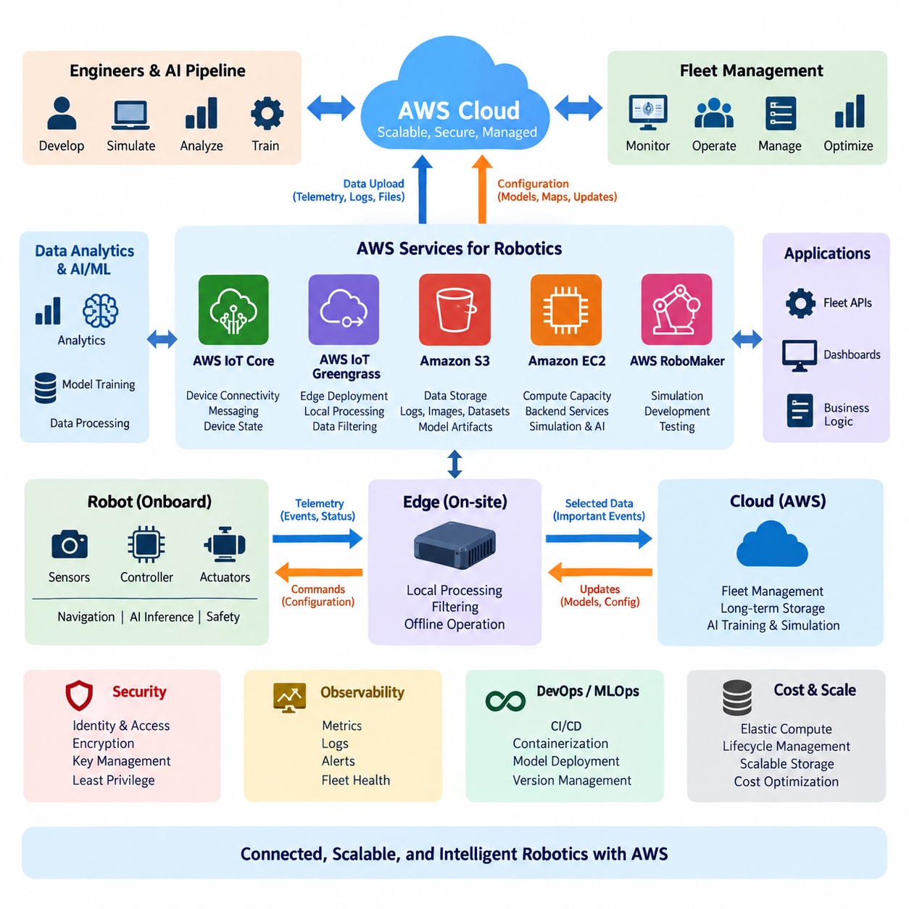
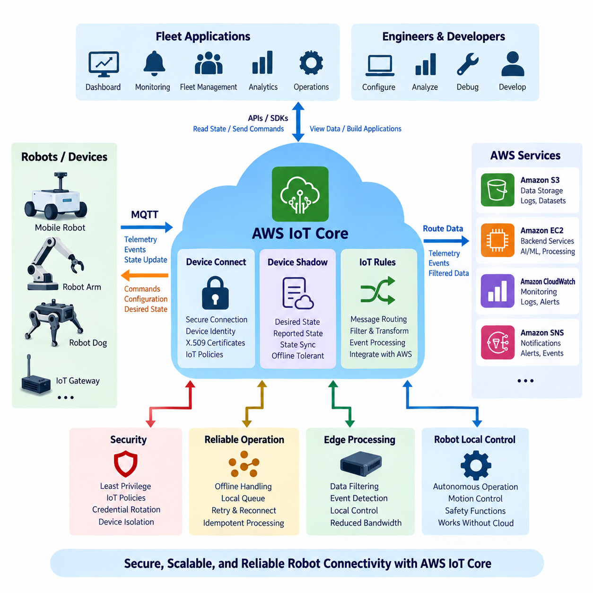
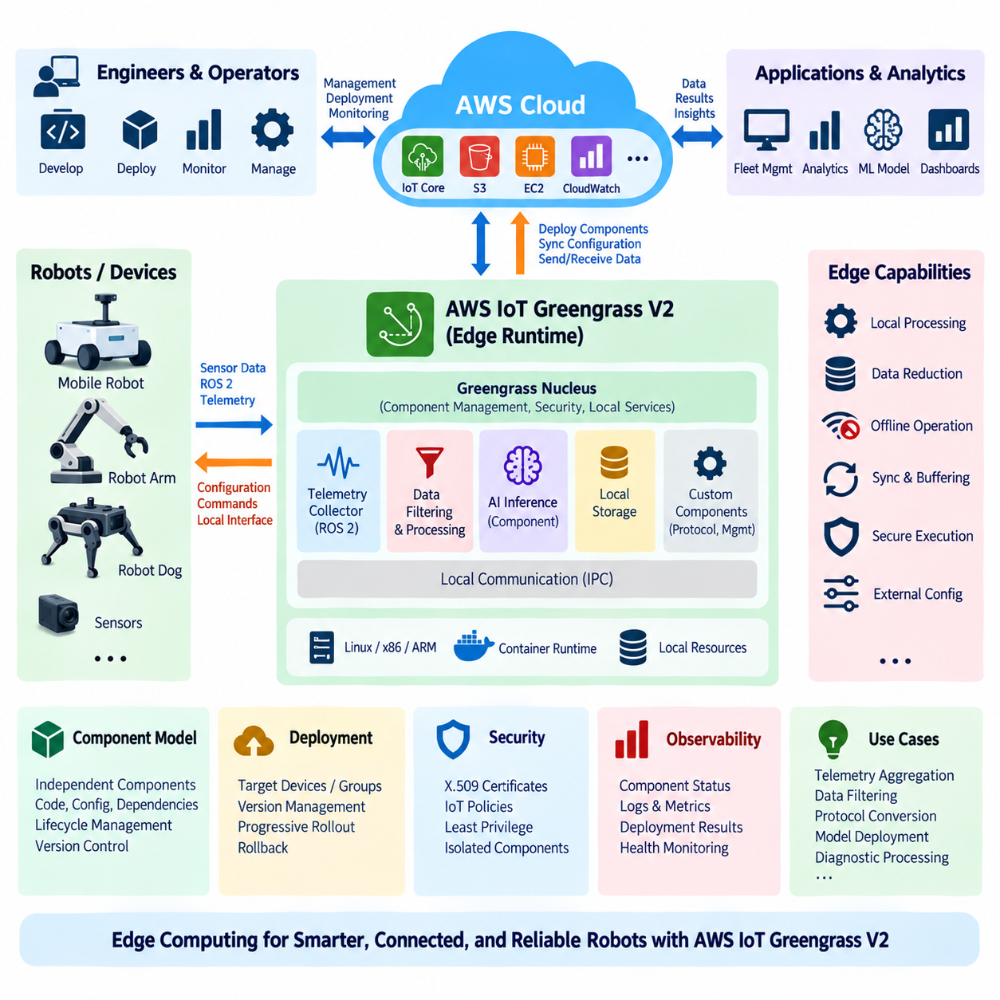
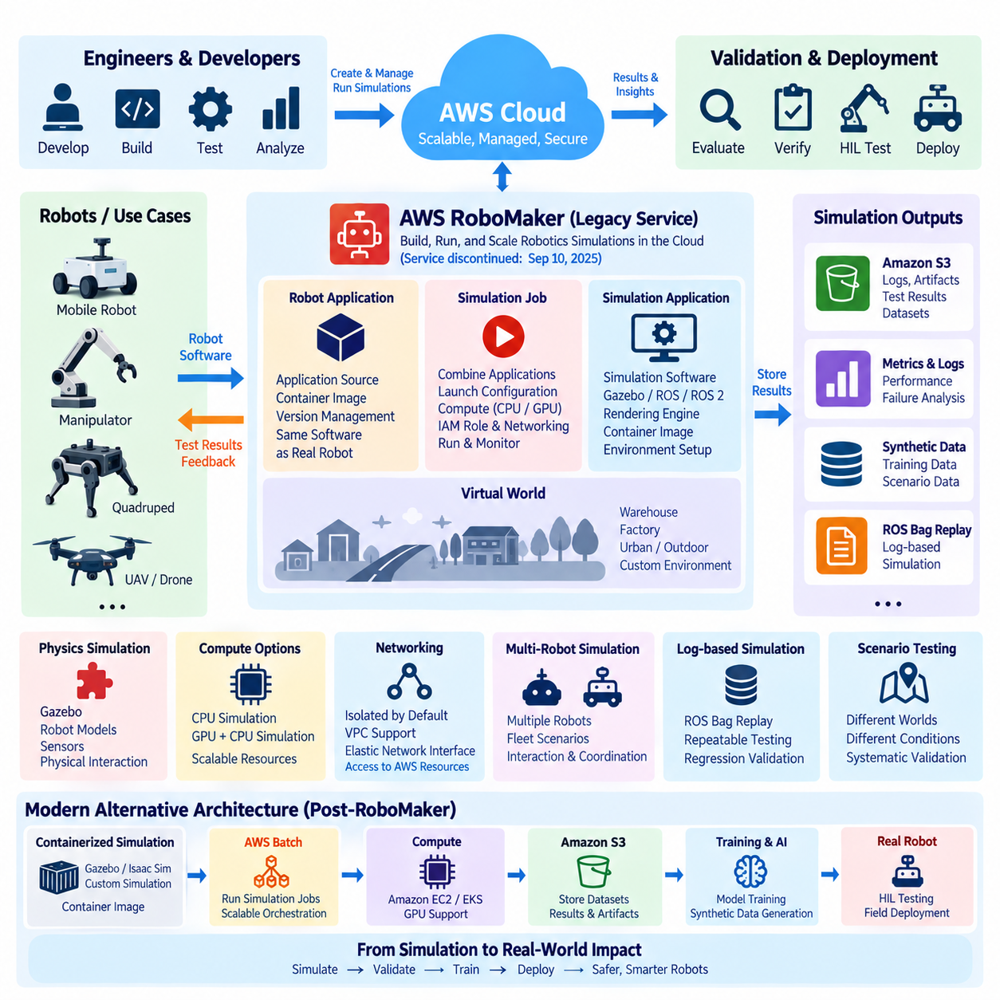
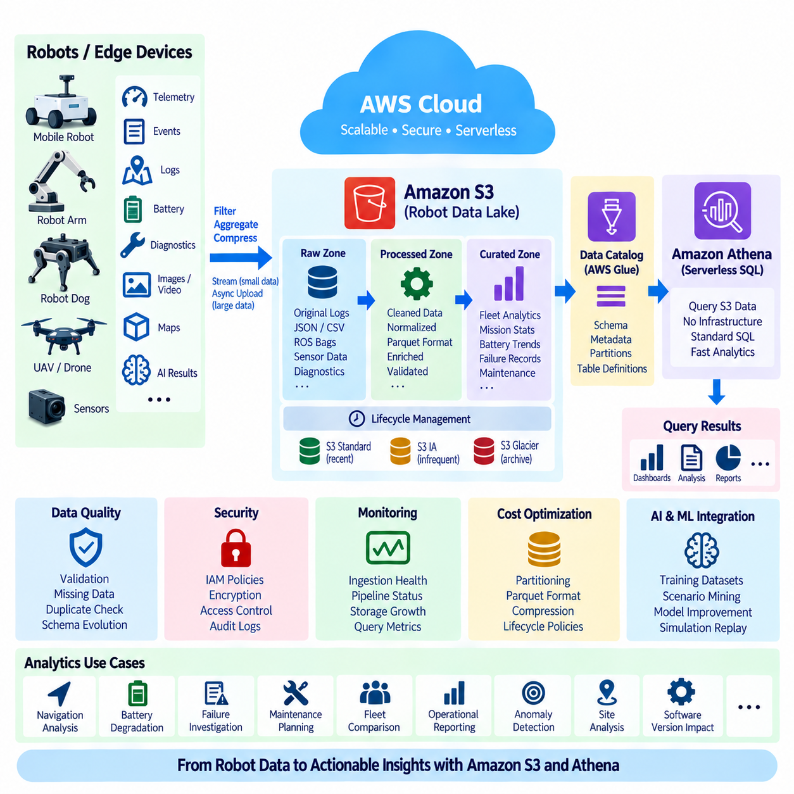
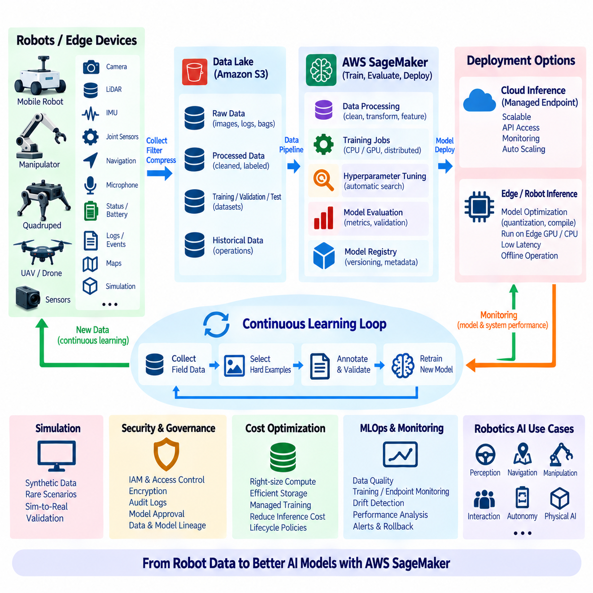
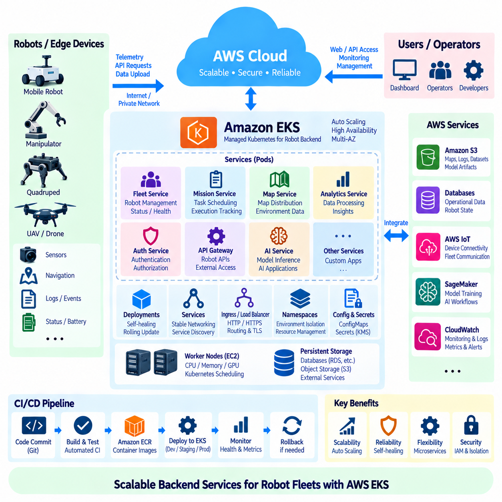
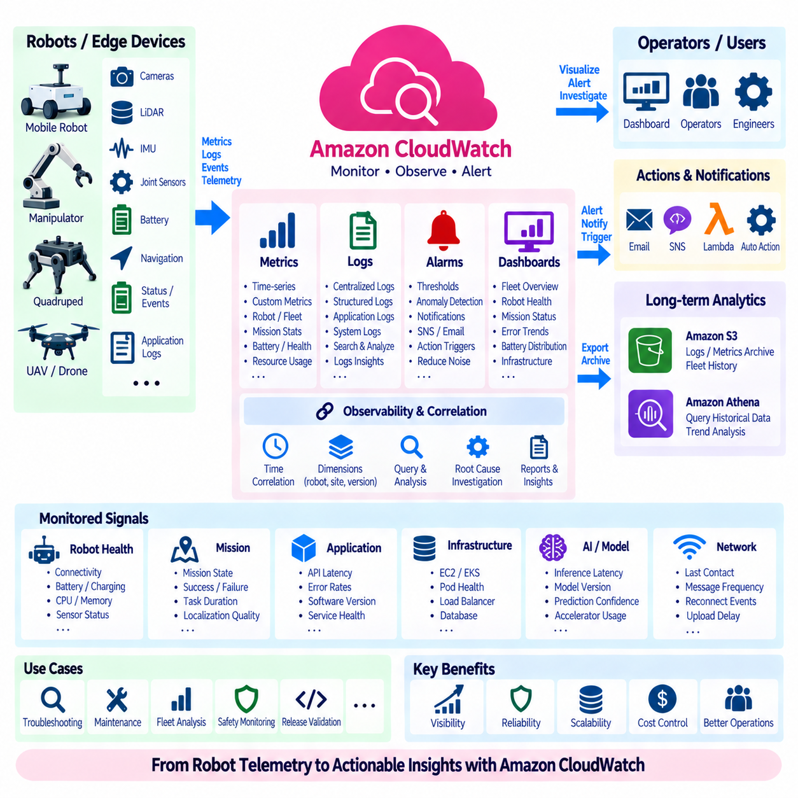
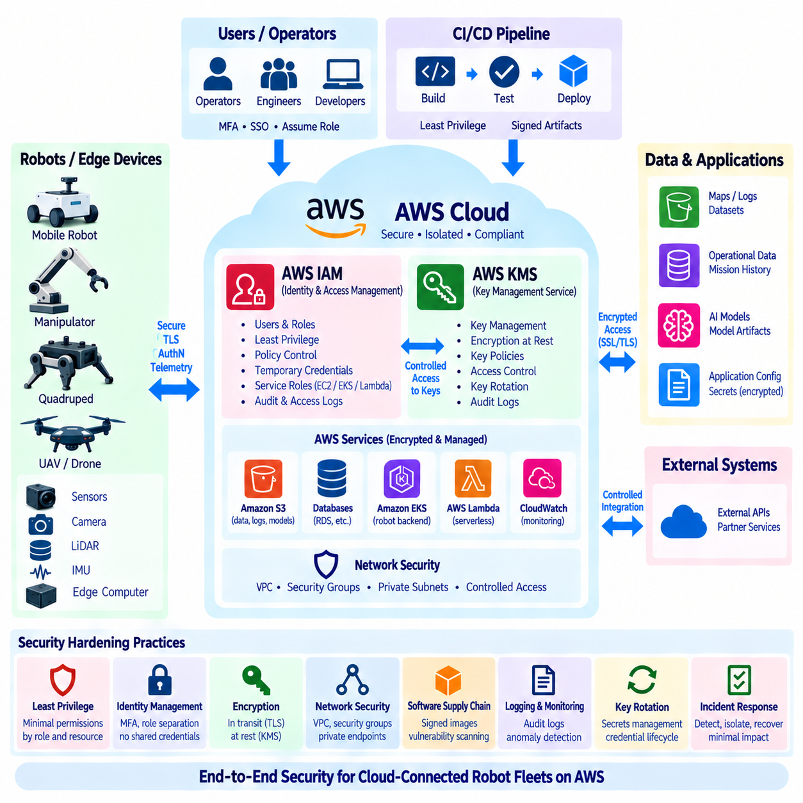
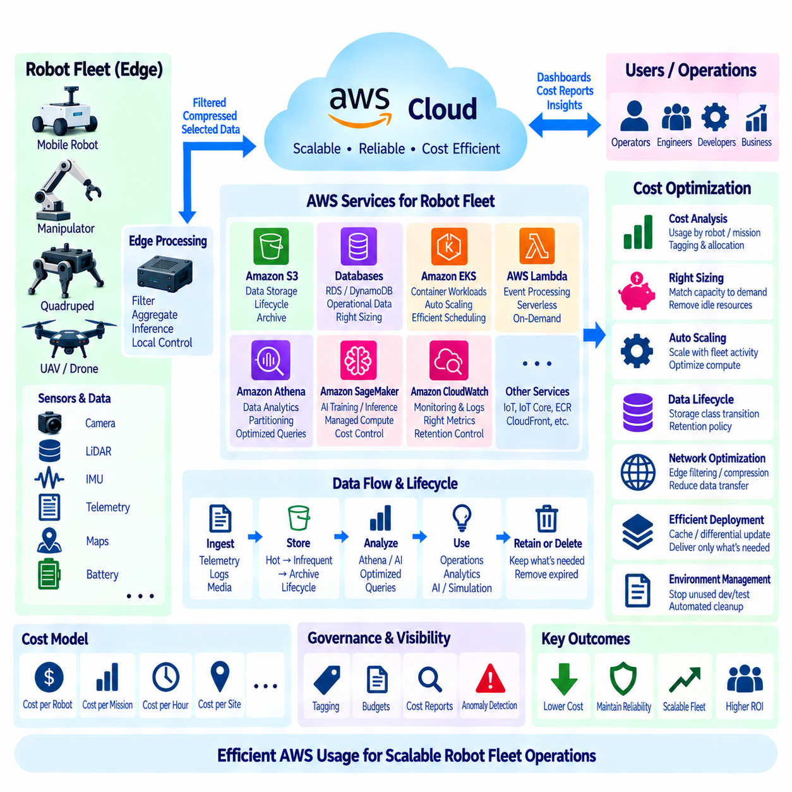

**Volume 09 Cloud and Edge Robotics**


# 04. AWS Robotics

##  

## 04.01 AWS Robot Service Portfolio: IoT, RoboMaker, S3, EC2

{width="7.268055555555556in" height="7.268055555555556in"}

AWS provides a broad cloud and edge service portfolio that can support the full operational lifecycle of connected robots. Rather than relying on one robotics-specific service, practical architectures combine device connectivity, edge processing, compute, storage, analytics, security, and monitoring services. In the structure of a robotics cloud platform, AWS IoT services connect robots, Amazon S3 retains large-scale operational data, and Amazon EC2 supplies elastic computing resources for backend and engineering workloads.

A useful way to understand the AWS robotics portfolio is to divide the system into robot, edge, and cloud layers. The robot layer contains sensors, actuators, controllers, navigation software, and local AI inference. Edge components handle workloads that must remain close to the machine, while cloud services provide centralized fleet functions, historical storage, model training, simulation, analytics, and administrative applications. This separation prevents network latency from becoming part of safety-critical control loops.

AWS IoT Core provides a managed communication layer for connecting devices and cloud applications. Robots can publish telemetry such as battery level, pose, temperature, diagnostic status, mission progress, and fault events, while backend applications can distribute configuration or operational commands. MQTT is commonly suited to this communication model because its publish-subscribe mechanism allows robot software and cloud applications to exchange asynchronous messages without maintaining tightly coupled service relationships.

For robotics, cloud connectivity should complement rather than replace autonomous local operation. Motion control, emergency stopping, obstacle avoidance, localization, and other time-sensitive functions normally remain on the robot or nearby edge computer. AWS IoT connectivity is more appropriate for fleet status, configuration management, event reporting, remote supervision, and data synchronization. This distinction becomes particularly important when robots must continue operating safely during temporary network degradation or complete cloud disconnection.

Device state can also be represented independently of continuous connectivity. A cloud-side representation of desired and reported device state enables applications to reason about robot configuration even when a robot is temporarily offline. When connectivity returns, state synchronization can reconcile changes between the device and backend. In fleet environments, this pattern helps separate transient telemetry from persistent operational state such as assigned configuration, software version, operating mode, or selected mission parameters.

AWS IoT Greengrass extends cloud-oriented software patterns toward edge devices and local computers. It can support deployment and management of components that perform local processing, messaging, filtering, or integration with cloud services. In a robot fleet, this makes it possible to process high-frequency sensor information locally and transmit only selected events or summaries. Such filtering reduces bandwidth consumption while retaining cloud visibility into information that is operationally important.

Amazon S3 provides object storage for data that does not belong in high-frequency robot control paths. Camera images, LiDAR recordings, ROS bag files, diagnostic archives, maps, simulation outputs, AI datasets, model artifacts, and operational logs can be organized as objects and retained at large scale. Because robotics datasets often grow from gigabytes to terabytes or petabytes, object storage becomes a central component of long-term fleet data architecture rather than merely a backup location.

S3-based storage also supports separation between raw, processed, and curated robot data. Raw sensor captures may be preserved for reproducibility, while derived datasets contain filtered frames, annotations, features, or training samples. Lifecycle policies can move older information into lower-cost storage classes according to retention requirements. This approach allows engineering teams to preserve valuable historical evidence without keeping every robot-generated object in the most expensive storage tier indefinitely.

Amazon EC2 provides general-purpose virtual computing capacity for workloads requiring operating-system-level control or configurable CPU, memory, networking, and accelerator resources. Robotics teams can use EC2 instances for fleet backend applications, ROS-related development environments, simulation coordination, data preprocessing, build infrastructure, dashboards, and AI workloads. GPU-enabled instance families can additionally support machine learning training, accelerated inference, computer vision processing, and selected simulation workloads.

Elastic compute is especially valuable because robotics workloads are rarely uniform. Continuous fleet services may require predictable capacity, whereas simulation campaigns, dataset preprocessing, or model training can generate large temporary peaks. EC2 capacity can be provisioned according to workload characteristics instead of purchasing physical infrastructure for the maximum possible demand. However, real-time robot control should not be moved to remote virtual machines merely because scalable compute is available in the cloud.

AWS RoboMaker historically provided AWS-managed capabilities aimed specifically at robotics development and simulation, particularly around ROS-based workflows. In an architectural study, RoboMaker is useful for understanding how cloud resources can be connected to robot simulation, development, and testing processes. The broader lesson is that robotics workloads can consume scalable compute and storage resources while maintaining a software workflow linking simulation environments, robot applications, test scenarios, and operational data.

For a modern architecture, RoboMaker should be understood within the larger AWS service ecosystem rather than as the sole foundation of an AWS robotics platform. Robot systems can be assembled from general AWS infrastructure and IoT services according to their actual requirements. This service-composition approach also fits the structure of a broader cloud and edge robotics platform in which later layers address Greengrass, S3 analytics, AI training, Kubernetes deployment, monitoring, security, and fleet cost optimization separately.

A typical data flow begins when a robot generates telemetry and sensor information during operation. Small status messages and events can travel through IoT-oriented communication channels, while large files are uploaded asynchronously to object storage. Backend services running on EC2 or other compute platforms process operational information, expose fleet APIs, and coordinate business logic. Engineers and AI pipelines can later retrieve historical datasets from S3 for analysis, retraining, debugging, or simulation.

The reverse flow is equally important. Cloud applications may produce robot configurations, mission parameters, AI model versions, maps, or software deployment instructions. These artifacts should not be treated as unrestricted remote control commands. Instead, robot-side software validates received information, applies authorization and version checks, and activates changes according to controlled deployment procedures. This preserves a clear authority boundary between centralized management and local autonomous execution.

Security must span every layer of the portfolio. Individual robots require identities and credentials, communication channels require encryption, cloud applications need controlled permissions, and stored datasets may require encryption and retention policies. AWS Identity and Access Management can restrict cloud-side actions, while key-management mechanisms can protect sensitive data and credentials. A production design should grant each robot, service, operator, and engineering workflow only the permissions required for its intended function.

Observability is another essential part of the architecture because physical systems fail differently from ordinary web applications. A robot can remain connected while experiencing degraded localization, a damaged sensor, excessive motor temperature, or declining battery health. Cloud monitoring therefore needs both infrastructure metrics and robotics-specific operational signals. Logs, telemetry, alerts, and fleet-level aggregation should allow engineers to distinguish network failures, software defects, hardware faults, and abnormal mission behavior.

The resulting architecture is not simply a robot connected to a remote server. It is a distributed computing system in which responsibility is assigned according to latency, bandwidth, safety, availability, privacy, and cost. Robot and edge computers maintain immediate physical interaction, while AWS services provide scalable connectivity, storage, computation, analytics, and centralized fleet functions. This division is consistent with the volume\'s progression from cloud fundamentals and edge computing toward hybrid architectures and fleet operations.

The most effective AWS robotics design therefore treats IoT, edge, storage, and compute services as complementary building blocks. IoT services establish managed communication and device integration, edge software preserves local responsiveness, S3 creates a durable data foundation, and EC2 supplies configurable computing capacity. Together, these capabilities allow a robotics platform to grow from a small number of connected machines into a larger fleet without forcing every workload into either the robot or the cloud.

From a system-engineering perspective, the key design decision is workload placement. Millisecond-level control and safety functions remain local; near-real-time filtering and inference can execute at the edge; fleet coordination, historical analysis, large-scale training, and long-term storage can use cloud resources. When these boundaries are explicitly defined, AWS becomes an infrastructure layer supporting robotic autonomy rather than a dependency that autonomy requires for every physical action.

This portfolio view also establishes the foundation for more specialized AWS robotics topics. Device connectivity and state management lead naturally to AWS IoT Core, local execution leads to Greengrass, accumulated robot data leads to S3 and analytics, AI workloads lead to managed training and deployment services, and fleet applications lead to container orchestration, monitoring, identity, and cost management. The chapter structure reflects this progression from core services toward an integrated cloud-edge robot operating environment.

AWS는 연결형 로봇(Connected Robot)의 전체 운영 수명주기(Operational Lifecycle)를 지원할 수 있는 폭넓은 클라우드 및 엣지 서비스 포트폴리오(Cloud and Edge Service Portfolio)를 제공한다. 실제 로봇 아키텍처에서는 하나의 로봇 전용 서비스에 의존하기보다 장치 연결(Device Connectivity), 엣지 처리(Edge Processing), 컴퓨팅(Compute), 스토리지(Storage), 분석(Analytics), 보안(Security), 모니터링(Monitoring) 서비스를 조합한다. 로봇 클라우드 플랫폼(Robotics Cloud Platform)에서는 AWS IoT 서비스가 로봇을 연결하고, Amazon S3가 대규모 운영 데이터를 저장하며, Amazon EC2가 백엔드 및 엔지니어링 워크로드(Engineering Workload)를 위한 탄력적인 컴퓨팅 자원을 제공한다.

AWS 로보틱스 포트폴리오(AWS Robotics Portfolio)를 이해하는 유용한 방법은 시스템을 로봇 계층(Robot Layer), 엣지 계층(Edge Layer), 클라우드 계층(Cloud Layer)으로 구분하는 것이다. 로봇 계층에는 센서(Sensor), 액추에이터(Actuator), 컨트롤러(Controller), 내비게이션 소프트웨어(Navigation Software), 로컬 AI 추론(Local AI Inference)이 포함된다. 엣지 구성요소는 기계 가까이에서 처리해야 하는 워크로드를 담당하며, 클라우드 서비스는 중앙집중식 플릿 기능(Fleet Function), 장기 저장, 모델 학습, 시뮬레이션, 분석 및 관리 애플리케이션을 제공한다. 이러한 분리는 네트워크 지연(Network Latency)이 안전 필수 제어 루프(Safety-Critical Control Loop)에 개입하는 것을 방지한다.

AWS IoT Core는 장치(Device)와 클라우드 애플리케이션(Cloud Application)을 연결하기 위한 관리형 통신 계층(Managed Communication Layer)을 제공한다. 로봇은 배터리 수준(Battery Level), 위치 및 자세(Pose), 온도, 진단 상태(Diagnostic Status), 임무 진행 상황(Mission Progress), 고장 이벤트(Fault Event) 등의 텔레메트리(Telemetry)를 전송할 수 있으며, 백엔드 애플리케이션은 구성 정보(Configuration) 또는 운영 명령을 배포할 수 있다. MQTT는 발행-구독(Publish-Subscribe) 메커니즘을 통해 로봇 소프트웨어와 클라우드 애플리케이션이 긴밀하게 결합되지 않은 상태에서 비동기 메시지를 교환할 수 있기 때문에 이러한 통신 모델에 적합하다.

로보틱스(Robotics)에서 클라우드 연결성(Cloud Connectivity)은 자율적인 로컬 동작(Local Autonomous Operation)을 대체하는 것이 아니라 보완해야 한다. 모션 제어(Motion Control), 비상 정지(Emergency Stop), 장애물 회피(Obstacle Avoidance), 위치 추정(Localization) 및 기타 시간 민감형 기능(Time-Sensitive Function)은 일반적으로 로봇 또는 인접한 엣지 컴퓨터(Edge Computer)에 유지된다. AWS IoT 연결은 플릿 상태(Fleet Status), 구성 관리(Configuration Management), 이벤트 보고(Event Reporting), 원격 감독(Remote Supervision), 데이터 동기화(Data Synchronization)에 더욱 적합하다. 이러한 구분은 일시적인 네트워크 성능 저하 또는 완전한 클라우드 연결 단절 상황에서도 로봇이 안전하게 동작해야 할 때 특히 중요하다.

장치 상태(Device State)는 지속적인 네트워크 연결과 독립적으로 표현될 수도 있다. 원하는 상태(Desired State)와 보고된 상태(Reported State)를 클라우드 측에서 표현하면 로봇이 일시적으로 오프라인 상태에 있더라도 애플리케이션이 로봇의 구성 상태를 관리할 수 있다. 연결이 복구되면 상태 동기화(State Synchronization)를 통해 장치와 백엔드 사이의 변경 사항을 조정할 수 있다. 플릿 환경(Fleet Environment)에서는 이러한 패턴을 통해 일시적인 텔레메트리와 지정된 구성, 소프트웨어 버전, 운영 모드, 선택된 임무 매개변수 등 지속적으로 유지되어야 하는 운영 상태(Operational State)를 분리할 수 있다.

AWS IoT Greengrass는 클라우드 중심 소프트웨어 패턴(Cloud-Oriented Software Pattern)을 엣지 장치(Edge Device)와 로컬 컴퓨터까지 확장한다. 이를 통해 로컬 처리(Local Processing), 메시징(Messaging), 필터링(Filtering), 클라우드 서비스 통합(Cloud Service Integration)을 수행하는 구성요소를 배포하고 관리할 수 있다. 로봇 플릿에서는 고주파 센서 정보(High-Frequency Sensor Information)를 로컬에서 처리하고 선택된 이벤트 또는 요약 정보만 전송할 수 있다. 이러한 필터링은 대역폭 소비(Bandwidth Consumption)를 줄이는 동시에 운영상 중요한 정보에 대한 클라우드 가시성(Cloud Visibility)을 유지한다.

Amazon S3는 고주파 로봇 제어 경로(High-Frequency Robot Control Path)에 포함될 필요가 없는 데이터를 위한 객체 스토리지(Object Storage)를 제공한다. 카메라 이미지, LiDAR 기록, ROS Bag 파일, 진단 아카이브(Diagnostic Archive), 지도(Map), 시뮬레이션 결과(Simulation Output), AI 데이터셋(AI Dataset), 모델 아티팩트(Model Artifact), 운영 로그(Operational Log)를 객체 단위로 구성하고 대규모로 저장할 수 있다. 로보틱스 데이터셋은 기가바이트(GB)에서 테라바이트(TB), 페타바이트(PB) 규모까지 증가할 수 있으므로 객체 스토리지는 단순한 백업 공간이 아니라 장기 플릿 데이터 아키텍처(Long-Term Fleet Data Architecture)의 핵심 구성요소가 된다.

S3 기반 스토리지(S3-Based Storage)는 원시 데이터(Raw Data), 처리 데이터(Processed Data), 정제 데이터(Curated Data)를 분리하는 구조도 지원한다. 재현성(Reproducibility)을 위해 원시 센서 캡처(Raw Sensor Capture)를 보존하고, 파생 데이터셋(Derived Dataset)에는 필터링된 프레임, 어노테이션(Annotation), 특징(Feature), 학습 샘플(Training Sample)을 저장할 수 있다. 수명주기 정책(Lifecycle Policy)을 사용하면 보존 요구사항에 따라 오래된 정보를 저비용 스토리지 클래스(Storage Class)로 이동할 수 있다. 이를 통해 모든 로봇 생성 데이터를 가장 비싼 저장 계층에 무기한 보관하지 않으면서도 중요한 과거 데이터를 유지할 수 있다.

Amazon EC2는 운영체제 수준의 제어 또는 구성 가능한 CPU, 메모리, 네트워크, 가속기(Accelerator) 자원이 필요한 워크로드를 위한 범용 가상 컴퓨팅 자원(General-Purpose Virtual Computing Capacity)을 제공한다. 로보틱스 팀은 EC2 인스턴스(EC2 Instance)를 플릿 백엔드 애플리케이션, ROS 관련 개발 환경, 시뮬레이션 조정(Simulation Coordination), 데이터 전처리(Data Preprocessing), 빌드 인프라(Build Infrastructure), 대시보드(Dashboard), AI 워크로드 등에 사용할 수 있다. GPU 지원 인스턴스는 머신러닝 학습(Machine Learning Training), 가속 추론(Accelerated Inference), 컴퓨터 비전 처리(Computer Vision Processing), 일부 시뮬레이션 워크로드를 추가로 지원할 수 있다.

탄력적 컴퓨팅(Elastic Compute)이 중요한 이유는 로보틱스 워크로드가 일정하지 않기 때문이다. 지속적으로 실행되는 플릿 서비스는 예측 가능한 컴퓨팅 용량이 필요하지만, 시뮬레이션 캠페인(Simulation Campaign), 데이터셋 전처리 또는 모델 학습에서는 일시적으로 매우 큰 컴퓨팅 수요가 발생할 수 있다. EC2 용량은 최대 예상 수요에 맞춰 물리적 인프라를 구매하는 대신 워크로드 특성에 따라 필요한 시점에 프로비저닝(Provisioning)할 수 있다. 그러나 확장 가능한 클라우드 컴퓨팅 자원이 존재한다는 이유만으로 실시간 로봇 제어(Real-Time Robot Control)를 원격 가상 머신으로 이동해서는 안 된다.

AWS RoboMaker는 역사적으로 로보틱스 개발(Robotics Development)과 시뮬레이션(Simulation), 특히 ROS 기반 워크플로(ROS-Based Workflow)를 지원하기 위한 AWS 관리형 기능을 제공해 왔다. 아키텍처 관점에서 RoboMaker는 클라우드 자원을 로봇 시뮬레이션, 개발 및 테스트 프로세스와 어떻게 연결할 수 있는지를 이해하는 데 유용하다. 보다 넓은 관점에서는 시뮬레이션 환경, 로봇 애플리케이션, 테스트 시나리오(Test Scenario), 운영 데이터를 연결하는 소프트웨어 워크플로를 유지하면서 확장 가능한 컴퓨팅 및 스토리지 자원을 활용할 수 있다는 점이 중요하다.

현대적인 아키텍처(Modern Architecture)에서는 RoboMaker를 AWS 로보틱스 플랫폼 전체의 유일한 기반으로 보기보다 더 큰 AWS 서비스 생태계(AWS Service Ecosystem)의 일부로 이해해야 한다. 로봇 시스템은 실제 요구사항에 따라 범용 AWS 인프라와 IoT 서비스를 조합하여 구축할 수 있다. 이러한 서비스 조합 방식(Service-Composition Approach)은 Greengrass, S3 분석, AI 학습, 쿠버네티스(Kubernetes) 배포, 모니터링, 보안 및 플릿 비용 최적화(Fleet Cost Optimization)를 각각 다루는 보다 광범위한 클라우드-엣지 로보틱스 플랫폼(Cloud-Edge Robotics Platform)의 구조와도 잘 부합한다.

일반적인 데이터 흐름(Data Flow)은 로봇이 운용 과정에서 텔레메트리와 센서 정보를 생성하면서 시작된다. 작은 상태 메시지와 이벤트는 IoT 중심 통신 채널을 통해 전달되고, 대용량 파일은 객체 스토리지에 비동기적으로 업로드될 수 있다. EC2 또는 다른 컴퓨팅 플랫폼에서 실행되는 백엔드 서비스는 운영 정보를 처리하고 플릿 API(Fleet API)를 제공하며 비즈니스 로직(Business Logic)을 조정한다. 이후 엔지니어와 AI 파이프라인(AI Pipeline)은 분석, 재학습(Retraining), 디버깅(Debugging), 시뮬레이션을 위해 S3에 저장된 과거 데이터셋을 활용할 수 있다.

반대 방향의 데이터 흐름 역시 중요하다. 클라우드 애플리케이션은 로봇 구성 정보, 임무 매개변수, AI 모델 버전, 지도 또는 소프트웨어 배포 지침을 생성할 수 있다. 이러한 아티팩트(Artifact)를 제한 없는 원격 제어 명령(Remote Control Command)으로 취급해서는 안 된다. 대신 로봇 측 소프트웨어가 수신된 정보를 검증하고 권한(Authorization) 및 버전을 확인한 후 통제된 배포 절차(Controlled Deployment Procedure)에 따라 변경 사항을 활성화해야 한다. 이를 통해 중앙집중식 관리(Centralized Management)와 로컬 자율 실행(Local Autonomous Execution) 사이에 명확한 권한 경계(Authority Boundary)를 유지할 수 있다.

보안(Security)은 포트폴리오의 모든 계층에 걸쳐 적용되어야 한다. 개별 로봇에는 신원(Identity)과 자격 증명(Credential)이 필요하고, 통신 채널에는 암호화(Encryption)가 필요하며, 클라우드 애플리케이션에는 통제된 권한(Permission)이 필요하다. 저장된 데이터셋에도 암호화 및 보존 정책(Retention Policy)이 적용될 수 있다. AWS Identity and Access Management는 클라우드 측 작업 권한을 제한할 수 있으며, 키 관리(Key Management) 메커니즘은 민감한 데이터와 자격 증명을 보호할 수 있다. 운영 환경에서는 각 로봇, 서비스, 운영자 및 엔지니어링 워크플로에 필요한 최소한의 권한만 부여해야 한다.

관측 가능성(Observability) 역시 아키텍처의 핵심 요소이다. 물리 시스템(Physical System)은 일반적인 웹 애플리케이션과 다른 방식으로 고장날 수 있기 때문이다. 로봇은 네트워크에 정상적으로 연결되어 있으면서도 위치 추정 성능 저하, 센서 손상, 모터 과열 또는 배터리 상태 악화와 같은 문제를 경험할 수 있다. 따라서 클라우드 모니터링(Cloud Monitoring)은 인프라 메트릭(Infrastructure Metric)뿐 아니라 로봇 특화 운영 신호(Robotics-Specific Operational Signal)도 처리해야 한다. 로그, 텔레메트리, 경보(Alert), 플릿 수준 집계(Fleet-Level Aggregation)를 통해 네트워크 장애, 소프트웨어 결함, 하드웨어 고장, 비정상적인 임무 동작을 구분할 수 있어야 한다.

이러한 아키텍처는 단순히 로봇을 원격 서버에 연결하는 구조가 아니다. 지연시간(Latency), 대역폭(Bandwidth), 안전성(Safety), 가용성(Availability), 개인정보 보호(Privacy), 비용(Cost)에 따라 책임과 워크로드를 배치하는 분산 컴퓨팅 시스템(Distributed Computing System)이다. 로봇과 엣지 컴퓨터는 즉각적인 물리적 상호작용(Physical Interaction)을 담당하고, AWS 서비스는 확장 가능한 연결성, 저장, 컴퓨팅, 분석 및 중앙집중식 플릿 기능을 제공한다. 이러한 역할 분담은 클라우드 기초와 엣지 컴퓨팅에서 하이브리드 아키텍처(Hybrid Architecture)와 플릿 운영(Fleet Operation)으로 확장되는 전체 구성과 일관성을 갖는다.

따라서 효과적인 AWS 로보틱스 설계(AWS Robotics Design)는 IoT, 엣지, 스토리지, 컴퓨팅 서비스를 상호 보완적인 구성요소로 다루어야 한다. IoT 서비스는 관리형 통신 및 장치 통합(Device Integration)을 제공하고, 엣지 소프트웨어는 로컬 응답성(Local Responsiveness)을 유지하며, S3는 지속 가능한 데이터 기반(Data Foundation)을 형성하고, EC2는 구성 가능한 컴퓨팅 용량을 제공한다. 이러한 기능을 결합하면 모든 워크로드를 로봇이나 클라우드 중 한쪽에 집중시키지 않고도 소수의 연결형 로봇에서 대규모 플릿으로 시스템을 확장할 수 있다.

시스템 엔지니어링(System Engineering) 관점에서 가장 중요한 설계 결정은 워크로드 배치(Workload Placement)이다. 밀리초 수준의 제어와 안전 기능은 로컬에 유지하고, 준실시간(Near-Real-Time) 필터링과 추론은 엣지에서 실행할 수 있으며, 플릿 조정, 과거 데이터 분석, 대규모 학습, 장기 데이터 저장은 클라우드 자원을 활용할 수 있다. 이러한 경계를 명확하게 정의하면 AWS는 로봇의 모든 물리적 동작이 의존해야 하는 시스템이 아니라 로봇 자율성(Robotic Autonomy)을 지원하는 인프라 계층(Infrastructure Layer)이 된다.

이러한 포트폴리오 관점(Portfolio View)은 이후의 보다 전문적인 AWS 로보틱스 주제를 이해하기 위한 기반도 제공한다. 장치 연결 및 상태 관리는 AWS IoT Core로, 로컬 실행(Local Execution)은 Greengrass로, 축적된 로봇 데이터는 S3 및 분석 서비스로, AI 워크로드는 관리형 학습 및 배포 서비스로 자연스럽게 연결된다. 또한 플릿 애플리케이션은 컨테이너 오케스트레이션(Container Orchestration), 모니터링, 신원 관리(Identity Management), 비용 관리(Cost Management)로 확장된다. 이러한 구성은 핵심 서비스에서 통합된 클라우드-엣지 로봇 운영 환경(Cloud-Edge Robot Operating Environment)으로 발전하는 전체 흐름을 형성한다.

##  

## 04.02 AWS IoT Core: Device Connect, Shadow, Rules [w/Code]

{width="7.268055555555556in" height="7.268055555555556in"}

AWS IoT Core provides the managed connectivity layer that allows robots, sensors, gateways, and cloud applications to exchange information securely at scale. In a robotics architecture, it normally sits above the robot's real-time control functions rather than replacing them. Robots maintain autonomous motion and safety locally while IoT Core carries telemetry, operational events, configuration information, and cloud-originated messages between distributed devices and backend services.

A robot typically establishes its identity before communicating with AWS IoT Core. Device authentication can use X.509 certificates associated with IoT policies that define which operations the device is permitted to perform. This creates a device-oriented security model in which each robot or gateway can have an independently managed identity. Compromise of one credential therefore does not inherently require every robot in the fleet to share the same security exposure.

MQTT is one of the principal communication protocols used with AWS IoT Core because its publish-subscribe model fits distributed robotic systems well. A robot publishes information to topics without needing to know which backend application consumes it. Fleet services subscribe to relevant topics and react independently. The same mechanism allows backend components to publish configuration or operational information that selected robots or robot groups receive through predefined topic structures.

Topic design becomes an important architectural decision as the number of robots increases. A structured namespace can distinguish fleet, site, robot, subsystem, and message type, allowing applications to subscribe at appropriate levels of granularity. Telemetry, faults, mission events, diagnostics, and configuration messages should be logically separated rather than placed into one generic channel. Clear topic organization improves authorization, routing, observability, debugging, and long-term fleet maintainability.

Robot telemetry commonly includes pose summaries, battery state, mission progress, operating mode, temperature, connectivity quality, subsystem health, and diagnostic events. High-bandwidth raw camera or LiDAR streams are generally unsuitable for continuous MQTT transmission. Such data can be filtered or stored locally and transferred through storage-oriented pipelines when necessary, while IoT messages communicate metadata, events, references, or upload completion notifications.

Device Shadow provides a persistent cloud representation of selected device state. Instead of requiring an application to communicate synchronously with a robot whenever it needs state information, the application can interact with a shadow document maintained by AWS IoT. This is particularly useful for mobile robots because connectivity may change as they move through buildings, outdoor environments, warehouses, factories, or private wireless networks.

A shadow distinguishes between desired state and reported state. The desired state represents what an application wants the device configuration to become, while the reported state represents what the robot currently reports about itself. When these values differ, the difference can be used to identify pending changes. The robot can receive the requested state, validate it locally, apply an appropriate configuration, and then update its reported state after the change succeeds.

This desired-reported pattern is valuable for configuration management because cloud software does not need to assume that every robot is continuously online. For example, a backend may request a different operating parameter while a robot is disconnected. The requested state remains represented in the cloud, and synchronization can occur after connectivity returns. This supports an offline-tolerant architecture while maintaining a consistent mechanism for managing fleet configuration.

Not every robot variable belongs in a Device Shadow. High-frequency sensor samples, rapidly changing localization values, image streams, and control-loop signals are better handled through telemetry or local processing. Shadow state is more appropriate for information whose current value has operational meaning, such as configuration mode, selected profile, software-related state, feature enablement, or other relatively persistent properties that cloud applications need to inspect or modify.

AWS IoT Rules provide a mechanism for routing and processing messages arriving through IoT Core. A rule can examine incoming MQTT messages, select relevant fields or events, and direct matching information toward other AWS services. This allows the messaging layer to become an entry point into broader cloud data pipelines without requiring every robot to understand the architecture of downstream storage, analytics, monitoring, or application systems.

For example, routine robot telemetry can be routed toward persistent storage or analytics pipelines, while fault events can trigger separate processing paths. A battery warning, navigation failure, sensor fault, or mission completion event may require different cloud-side actions even though all originated from robot messages. Rule-based routing separates device communication from backend processing logic and reduces direct dependencies between embedded robot software and individual cloud services.

Rules also support data reduction strategies when combined with appropriate robot and edge processing. The robot should avoid uploading every available measurement simply because cloud connectivity exists. Local software can aggregate high-rate information into summaries or detect significant events before publishing them. IoT Rules can then perform another stage of selection or routing, creating a hierarchy in which data becomes progressively more relevant as it moves from physical devices toward cloud applications.

A complete connection workflow therefore begins with device provisioning and identity. The robot obtains credentials, connects securely to an AWS IoT endpoint, and receives permissions according to its IoT policy. After connection, it publishes telemetry and subscribes to authorized command or configuration topics. Device Shadow interactions maintain selected persistent state, while Rules transform or route incoming messages into storage, monitoring, analytics, notification, or application workflows.

Security policies should follow the principle of least privilege. A robot that only needs to publish telemetry for its own identity should not automatically receive permission to publish arbitrary messages for every other robot. Topic structures and policies should therefore be designed together. Device identity, permitted actions, resource scope, certificate lifecycle, credential rotation, and revocation procedures become fundamental elements of fleet security rather than implementation details added after deployment.

Cloud-to-robot communication also requires a carefully defined authority boundary. Receiving an MQTT message or desired shadow state should not imply unconditional execution by the robot. Local software should validate message structure, authorization context, operating state, version compatibility, and safety constraints before applying a request. Safety-critical actions such as emergency braking, collision avoidance, and low-level actuator control should remain under deterministic local control.

Connectivity failures must be treated as normal operating conditions rather than exceptional cases. A mobile robot may temporarily lose Wi-Fi, private 5G, or Internet connectivity while continuing its mission. Local queues, retry policies, timestamped events, state reconciliation, and idempotent processing help prevent duplicated or lost operations after reconnection. Device Shadow can restore configuration context, while buffered telemetry can be uploaded according to bandwidth and operational priorities.

At fleet scale, the combination of MQTT topics, device identities, shadows, and rules creates a logical abstraction above individual network connections. Backend applications can reason about robots as managed entities with state, events, permissions, and data flows. This makes it possible to construct fleet dashboards, alert systems, maintenance workflows, mission services, and historical analytics without embedding all cloud-specific processing logic directly into each robot application.

The architecture also connects naturally with the broader AWS robotics service portfolio. IoT Core supplies device communication, Greengrass can extend processing toward edge computers, S3 can retain large robot datasets, and EC2 or other compute services can host backend processing. IoT Rules provide routing between incoming device information and these cloud resources, while Device Shadow maintains selected operational state across temporary disconnections and asynchronous application interactions.

For Physical AI and autonomous robots, the most important principle is that IoT Core forms a management and information plane rather than the innermost physical control loop. Perception, localization, planning, motion control, and safety functions must be placed according to their latency and reliability requirements. Cloud connectivity adds fleet-level visibility and coordination, but autonomous operation should degrade gracefully when communication with remote services becomes unavailable.

AWS IoT Core can therefore be viewed as the communication backbone connecting robot identity, messaging, persistent state, and event-driven cloud processing. Device Connect establishes secure communication, Device Shadow maintains synchronized operational state, and IoT Rules transform message streams into actionable cloud workflows. Together, these mechanisms provide a scalable foundation for connecting individual robots to larger cloud-edge fleet architectures while preserving local autonomy and clear system boundaries.

AWS IoT Core는 로봇, 센서, 게이트웨이(Gateway), 클라우드 애플리케이션(Cloud Application)이 대규모 환경에서 안전하게 정보를 교환할 수 있도록 관리형 연결 계층(Managed Connectivity Layer)을 제공한다. 로보틱스 아키텍처(Robotics Architecture)에서는 일반적으로 로봇의 실시간 제어 기능(Real-Time Control Function)을 대체하지 않고 그 상위 계층에서 동작한다. 로봇은 자율 이동과 안전 기능을 로컬에서 유지하고, IoT Core는 분산된 장치와 백엔드 서비스 사이에서 텔레메트리(Telemetry), 운영 이벤트, 구성 정보(Configuration Information), 클라우드에서 생성된 메시지를 전달한다.

로봇은 일반적으로 AWS IoT Core와 통신하기 전에 자신의 신원(Identity)을 설정한다. 장치 인증(Device Authentication)은 IoT 정책(IoT Policy)과 연결된 X.509 인증서(X.509 Certificate)를 사용할 수 있으며, 정책은 해당 장치가 수행할 수 있는 작업을 정의한다. 이를 통해 각 로봇 또는 게이트웨이가 독립적으로 관리되는 신원을 가질 수 있는 장치 중심 보안 모델(Device-Oriented Security Model)이 형성된다. 따라서 하나의 자격 증명(Credential)이 손상되더라도 플릿(Fleet)의 모든 로봇이 동일한 보안 위험에 노출될 필요는 없다.

MQTT는 발행-구독(Publish-Subscribe) 모델이 분산 로봇 시스템(Distributed Robotic System)에 적합하기 때문에 AWS IoT Core에서 사용되는 주요 통신 프로토콜 중 하나이다. 로봇은 어떤 백엔드 애플리케이션이 정보를 사용하는지 알 필요 없이 토픽(Topic)에 정보를 발행할 수 있다. 플릿 서비스(Fleet Service)는 필요한 토픽을 구독하고 독립적으로 반응한다. 동일한 메커니즘을 통해 백엔드 구성요소는 사전에 정의된 토픽 구조를 이용하여 특정 로봇 또는 로봇 그룹에 구성 정보나 운영 정보를 전달할 수 있다.

로봇의 수가 증가할수록 토픽 설계(Topic Design)는 중요한 아키텍처 결정이 된다. 구조화된 네임스페이스(Namespace)를 사용하면 플릿, 사이트(Site), 로봇, 서브시스템(Subsystem), 메시지 유형을 구분할 수 있으며 애플리케이션은 필요한 세분성(Granularity)에 따라 정보를 구독할 수 있다. 텔레메트리, 고장(Fault), 임무 이벤트(Mission Event), 진단(Diagnostics), 구성 메시지는 하나의 일반적인 채널에 통합하기보다 논리적으로 분리해야 한다. 명확한 토픽 구조는 권한 관리, 라우팅(Routing), 관측 가능성(Observability), 디버깅(Debugging), 장기적인 플릿 유지보수성을 향상시킨다.

로봇 텔레메트리에는 일반적으로 위치 및 자세 요약(Pose Summary), 배터리 상태, 임무 진행 상황, 운영 모드, 온도, 연결 품질, 서브시스템 상태, 진단 이벤트 등이 포함된다. 고대역폭 원시 카메라 또는 LiDAR 스트림은 일반적으로 MQTT를 통한 지속적인 전송에 적합하지 않다. 이러한 데이터는 로컬에서 필터링하거나 저장한 후 필요한 경우 스토리지 중심 파이프라인(Storage-Oriented Pipeline)을 통해 전송하고, IoT 메시지는 메타데이터(Metadata), 이벤트, 참조 정보 또는 업로드 완료 알림 등을 전달하는 방식이 적절하다.

디바이스 섀도(Device Shadow)는 선택된 장치 상태(Device State)를 클라우드에 지속적으로 표현하는 기능을 제공한다. 애플리케이션이 상태 정보를 확인할 때마다 로봇과 동기식으로 직접 통신하는 대신 AWS IoT가 관리하는 섀도 문서(Shadow Document)를 이용할 수 있다. 이동 로봇(Mobile Robot)은 건물, 실외 환경, 창고, 공장 또는 사설 무선 네트워크(Private Wireless Network)를 이동하면서 연결 상태가 변화할 수 있기 때문에 이러한 방식이 특히 유용하다.

디바이스 섀도는 원하는 상태(Desired State)와 보고된 상태(Reported State)를 구분한다. 원하는 상태는 애플리케이션이 장치의 구성을 어떤 상태로 변경하고자 하는지를 나타내고, 보고된 상태는 로봇이 현재 자신의 상태라고 보고한 값을 나타낸다. 두 값이 서로 다르면 아직 적용되지 않은 변경 사항을 식별할 수 있다. 로봇은 요청된 상태를 수신하고 로컬에서 검증한 후 적절한 구성을 적용하며, 변경이 성공하면 보고된 상태를 갱신할 수 있다.

이러한 원하는 상태-보고된 상태(Desired-Reported) 패턴은 모든 로봇이 항상 온라인 상태라고 가정할 필요가 없기 때문에 구성 관리(Configuration Management)에 유용하다. 예를 들어 로봇의 연결이 끊어진 상태에서 백엔드가 다른 운영 매개변수(Operating Parameter)를 요청할 수 있다. 요청된 상태는 클라우드에 계속 유지되며 연결이 복구된 이후 동기화할 수 있다. 이를 통해 플릿 구성 관리를 위한 일관된 메커니즘을 유지하면서 오프라인 허용 아키텍처(Offline-Tolerant Architecture)를 구현할 수 있다.

모든 로봇 변수를 디바이스 섀도에 저장하는 것은 적절하지 않다. 고주파 센서 샘플(High-Frequency Sensor Sample), 빠르게 변화하는 위치 추정값, 이미지 스트림, 제어 루프 신호(Control-Loop Signal)는 텔레메트리 또는 로컬 처리를 통해 관리하는 것이 적합하다. 섀도 상태는 구성 모드(Configuration Mode), 선택된 프로파일(Profile), 소프트웨어 관련 상태, 기능 활성화 여부처럼 현재 값 자체가 운영상 의미를 가지며 클라우드 애플리케이션이 확인하거나 변경해야 하는 비교적 지속적인 속성에 적합하다.

AWS IoT Rules는 IoT Core를 통해 들어오는 메시지를 라우팅하고 처리하기 위한 메커니즘을 제공한다. 규칙(Rule)은 수신되는 MQTT 메시지를 검사하고 필요한 필드 또는 이벤트를 선택한 다음 조건에 일치하는 정보를 다른 AWS 서비스로 전달할 수 있다. 이를 통해 모든 로봇이 하위 스토리지, 분석, 모니터링 또는 애플리케이션 시스템의 내부 아키텍처를 이해할 필요 없이 메시징 계층(Messaging Layer)을 광범위한 클라우드 데이터 파이프라인(Cloud Data Pipeline)의 진입점으로 사용할 수 있다.

예를 들어 일반적인 로봇 텔레메트리는 영구 스토리지(Persistent Storage) 또는 분석 파이프라인으로 전달하고, 고장 이벤트는 별도의 처리 경로로 전달할 수 있다. 배터리 경고, 내비게이션 장애(Navigation Failure), 센서 고장, 임무 완료 이벤트는 모두 로봇 메시지에서 발생하지만 서로 다른 클라우드 측 작업이 필요할 수 있다. 규칙 기반 라우팅(Rule-Based Routing)은 장치 통신과 백엔드 처리 로직(Backend Processing Logic)을 분리하여 임베디드 로봇 소프트웨어와 개별 클라우드 서비스 사이의 직접적인 의존성을 감소시킨다.

규칙은 적절한 로봇 및 엣지 처리(Edge Processing)와 결합될 경우 데이터 감소 전략(Data Reduction Strategy)도 지원한다. 클라우드 연결이 가능하다는 이유만으로 로봇이 사용 가능한 모든 측정값을 업로드해서는 안 된다. 로컬 소프트웨어는 고주파 정보를 요약 정보로 집계하거나 중요한 이벤트를 감지한 후 발행할 수 있다. 이후 IoT Rules가 추가적인 선택 또는 라우팅 단계를 수행함으로써 데이터가 물리적 장치에서 클라우드 애플리케이션으로 이동할수록 점진적으로 의미 있는 정보로 정제되는 계층 구조를 만들 수 있다.

완전한 연결 워크플로(Connection Workflow)는 장치 프로비저닝(Device Provisioning)과 신원 설정에서 시작된다. 로봇은 자격 증명을 획득하고 AWS IoT 엔드포인트(Endpoint)에 안전하게 연결하며 IoT 정책에 따라 권한을 부여받는다. 연결된 이후에는 텔레메트리를 발행하고 허용된 명령 또는 구성 토픽을 구독한다. 디바이스 섀도 상호작용은 선택된 지속 상태(Persistent State)를 관리하고, IoT Rules는 메시지를 스토리지, 모니터링, 분석, 알림(Notification), 애플리케이션 워크플로로 변환하거나 라우팅한다.

보안 정책(Security Policy)은 최소 권한 원칙(Principle of Least Privilege)을 따라야 한다. 자신의 신원에 해당하는 텔레메트리만 발행해야 하는 로봇에게 다른 모든 로봇을 대신하여 임의의 메시지를 발행할 수 있는 권한을 제공해서는 안 된다. 따라서 토픽 구조와 정책을 함께 설계해야 한다. 장치 신원, 허용 작업(Permitted Action), 리소스 범위(Resource Scope), 인증서 수명주기(Certificate Lifecycle), 자격 증명 교체(Credential Rotation), 폐기 절차(Revocation Procedure)는 배포 이후 추가되는 세부 구현 사항이 아니라 플릿 보안의 핵심 요소가 된다.

클라우드-로봇 통신(Cloud-to-Robot Communication)에서도 명확한 권한 경계(Authority Boundary)가 필요하다. MQTT 메시지 또는 원하는 섀도 상태를 수신했다고 해서 로봇이 이를 무조건 실행해서는 안 된다. 로컬 소프트웨어는 요청을 적용하기 전에 메시지 구조, 권한 정보, 현재 운영 상태, 버전 호환성(Version Compatibility), 안전 제약조건(Safety Constraint)을 검증해야 한다. 비상 제동(Emergency Braking), 충돌 회피(Collision Avoidance), 저수준 액추에이터 제어(Low-Level Actuator Control)와 같은 안전 필수 기능은 결정론적 로컬 제어(Deterministic Local Control) 영역에 유지되어야 한다.

연결 장애(Connectivity Failure)는 예외적인 상황이 아니라 정상적인 운영 조건 중 하나로 취급해야 한다. 이동 로봇은 임무를 계속 수행하면서 Wi-Fi, 사설 5G(Private 5G), 인터넷 연결을 일시적으로 상실할 수 있다. 로컬 큐(Local Queue), 재시도 정책(Retry Policy), 타임스탬프가 포함된 이벤트(Timestamped Event), 상태 조정(State Reconciliation), 멱등 처리(Idempotent Processing)를 사용하면 재연결 이후 중복되거나 손실되는 작업을 줄일 수 있다. 디바이스 섀도는 구성 컨텍스트(Configuration Context)를 복구하고, 버퍼링된 텔레메트리는 대역폭과 운영 우선순위에 따라 업로드할 수 있다.

플릿 규모에서는 MQTT 토픽, 장치 신원, 디바이스 섀도, 규칙의 조합이 개별 네트워크 연결보다 상위 수준의 논리적 추상화(Logical Abstraction)를 형성한다. 백엔드 애플리케이션은 로봇을 상태, 이벤트, 권한, 데이터 흐름을 가진 관리 대상 개체(Managed Entity)로 처리할 수 있다. 이를 통해 모든 클라우드 처리 로직을 각 로봇 애플리케이션에 직접 포함하지 않고도 플릿 대시보드(Fleet Dashboard), 경보 시스템(Alert System), 유지보수 워크플로(Maintenance Workflow), 임무 서비스, 과거 데이터 분석(Historical Analytics)을 구축할 수 있다.

이 아키텍처는 보다 광범위한 AWS 로보틱스 서비스 포트폴리오(AWS Robotics Service Portfolio)와도 자연스럽게 연결된다. IoT Core는 장치 통신을 제공하고, Greengrass는 처리 기능을 엣지 컴퓨터까지 확장할 수 있으며, S3는 대규모 로봇 데이터셋을 저장할 수 있다. EC2 또는 다른 컴퓨팅 서비스는 백엔드 처리를 담당할 수 있다. IoT Rules는 수신된 장치 정보와 이러한 클라우드 자원 사이의 라우팅을 제공하고, 디바이스 섀도는 일시적인 연결 단절과 비동기 애플리케이션 상호작용에서도 선택된 운영 상태를 유지한다.

피지컬 AI(Physical AI)와 자율 로봇(Autonomous Robot)에서 가장 중요한 원칙은 IoT Core가 가장 내부의 물리적 제어 루프(Physical Control Loop)가 아니라 관리 및 정보 계층(Management and Information Plane)을 형성한다는 것이다. 인지(Perception), 위치 추정(Localization), 경로 계획(Planning), 모션 제어(Motion Control), 안전 기능은 각각의 지연시간과 신뢰성 요구사항에 따라 배치되어야 한다. 클라우드 연결은 플릿 수준의 가시성과 조정 기능을 추가하지만, 원격 서비스와의 통신이 불가능해질 경우에도 자율 운용 기능은 점진적으로 성능을 낮추면서 안전하게 유지되는 구조(Graceful Degradation)를 가져야 한다.

따라서 AWS IoT Core는 로봇 신원(Robot Identity), 메시징(Messaging), 지속 상태(Persistent State), 이벤트 기반 클라우드 처리(Event-Driven Cloud Processing)를 연결하는 통신 백본(Communication Backbone)으로 볼 수 있다. 장치 연결(Device Connect)은 안전한 통신을 구축하고, 디바이스 섀도(Device Shadow)는 동기화된 운영 상태를 유지하며, IoT Rules는 메시지 스트림을 실행 가능한 클라우드 워크플로(Actionable Cloud Workflow)로 변환한다. 이러한 메커니즘은 로컬 자율성과 명확한 시스템 경계를 유지하면서 개별 로봇을 대규모 클라우드-엣지 플릿 아키텍처(Cloud-Edge Fleet Architecture)에 연결하기 위한 확장 가능한 기반을 제공한다.

##  

## 04.03 AWS IoT Greengrass V2: Edge Runtime Setup [w/Code]

{width="7.268055555555556in" height="7.268055555555556in"}

AWS IoT Greengrass V2 extends cloud-managed software capabilities to edge computers located close to robots, sensors, and industrial equipment. In a robotics architecture, Greengrass acts as an edge runtime between autonomous robot software and AWS cloud services. It allows selected applications, data-processing functions, communication services, and management logic to execute locally while maintaining controlled integration with centralized cloud infrastructure.

The main architectural reason for using Greengrass is that robotic workloads have different latency and connectivity requirements. Motion control, collision avoidance, and safety functions must remain local, while telemetry aggregation, data filtering, protocol conversion, model distribution, or diagnostic processing can operate as managed edge workloads. Greengrass provides a framework for deploying these functions without requiring every workload to execute remotely in the cloud.

Greengrass V2 uses a component-based software model. Instead of treating the edge system as one monolithic application, software capabilities can be packaged as independently deployable components. A component can contain application code, configuration, dependencies, lifecycle instructions, and artifacts required for execution. This modular structure allows robotics teams to separate telemetry collectors, monitoring agents, data filters, AI inference services, and cloud synchronization functions.

The Greengrass nucleus is the core runtime responsible for coordinating component execution and essential device-side services. It operates on the Greengrass core device and provides the foundation on which additional components are deployed. For a robot or industrial edge computer, the core device may be an embedded Linux computer, an x86 industrial PC, or another supported computing platform positioned between local robot software and AWS services.

Initial setup begins with preparing the edge operating environment and establishing an AWS IoT identity for the core device. The device requires appropriate credentials, certificates, permissions, and connectivity to relevant AWS endpoints. The runtime software is then installed and associated with the intended IoT thing and Greengrass configuration. Production provisioning should treat certificates and private keys as protected security assets rather than ordinary application files.

The host environment must also provide the runtime dependencies required by the selected Greengrass configuration and deployed components. Hardware capacity should be evaluated according to expected CPU utilization, memory consumption, storage, network traffic, and application dependencies. A small telemetry gateway has very different requirements from an edge computer simultaneously performing sensor processing, AI inference, local database operations, and synchronization for several robots.

After installation, component deployment becomes the primary mechanism for managing edge software. A deployment specifies which components and versions should operate on a target core device or group of devices. Greengrass resolves the required software and applies the deployment to the edge system. This allows a fleet operator to manage software configurations centrally while execution remains physically close to the robots and equipment generating the data.

Component lifecycle definitions determine how software is installed, started, stopped, and executed. This separation is useful in robotics because different edge services may require different runtimes or startup behavior. A telemetry service may continuously monitor ROS 2 data, while another component may periodically package diagnostic files. An AI component may load a model and remain active as a local inference service for applications that require low-latency responses.

Configuration should be externalized whenever possible rather than embedded permanently into component code. Parameters such as topic names, sampling intervals, file locations, endpoint settings, thresholds, and operational modes can then be modified without rebuilding an entire application. Controlled configuration management also makes it easier to maintain different settings for development robots, test fleets, production sites, or hardware variants while preserving common component implementations.

Interprocess communication is important when several Greengrass components cooperate on the same edge device. Components may need to exchange messages, request services, or share selected information without sending every interaction through the remote cloud. Local communication reduces unnecessary network traffic and allows edge workflows to continue during connectivity interruptions. Access between components should nevertheless be explicitly controlled rather than implicitly trusted.

A common robotics pattern is to connect Greengrass components with local robot middleware or application interfaces. A component can collect selected ROS 2 messages, transform them into compact operational records, and publish only meaningful events to cloud services. Another component may receive configuration information and expose it to robot applications through a controlled local interface. This creates a boundary between robot-native communication and cloud-oriented communication.

Local data filtering is one of the strongest reasons for introducing an edge runtime. Cameras, LiDARs, IMUs, motor controllers, and navigation software can generate data at rates far beyond what should continuously traverse an Internet connection. Edge components can aggregate measurements, detect anomalies, extract metadata, compress records, or select important events before transmission. Raw datasets can remain local until a policy determines that cloud upload is necessary.

Greengrass also supports architectures designed for intermittent connectivity. Edge applications should not assume that the AWS connection is continuously available. Local processing can continue while the network is unavailable, and data can be buffered or queued according to application requirements. After connectivity returns, synchronization logic can transmit pending information while considering timestamps, ordering, duplication, storage limits, and available network bandwidth.

Deployment strategy is especially important for robot fleets because a defective edge component can affect many physical machines. New component versions should therefore be validated on development systems and representative robots before broad deployment. Fleet segmentation allows different groups to receive different versions or configurations. Progressive rollout, health verification, rollback planning, and version traceability reduce the operational risk associated with centralized software distribution.

Security extends beyond initial device authentication. Components should execute with only the permissions they require, and access to local resources should be restricted according to function. Cloud-side IAM permissions, IoT policies, component permissions, operating-system accounts, file ownership, secrets, and network exposure collectively determine the security boundary. A compromised telemetry component should not automatically gain unrestricted access to robot control interfaces or sensitive credentials.

Observability should be designed into the edge runtime from the beginning. Operators need visibility into component status, startup failures, resource consumption, communication errors, deployment results, and application-specific health indicators. Logs generated by edge components can be retained locally and selectively forwarded to cloud monitoring systems. This allows engineers to distinguish failures in robot software, edge applications, network connectivity, cloud integration, or the Greengrass runtime itself.

Greengrass should not be treated as a replacement for the robot's deterministic execution environment. High-frequency motor control, emergency stopping, hard real-time communication, and safety-certified logic should remain within the appropriate embedded controller or real-time computing domain. Greengrass is better positioned for supervisory processing, data management, integration, local AI services, application orchestration, and cloud synchronization where timing requirements permit a general-purpose edge runtime.

For AI-enabled robots, Greengrass components can participate in model deployment workflows. A cloud-side pipeline can prepare a validated model artifact, while an edge deployment distributes the appropriate version to selected devices. A local inference component can load the model and expose predictions to nearby applications. Model version, hardware compatibility, preprocessing configuration, rollback behavior, and resource consumption should be managed together rather than treating the model as an isolated file.

The resulting architecture forms a clear robot-edge-cloud continuum. Robot controllers execute immediate physical interaction, Greengrass core devices host managed edge applications, and AWS cloud services provide centralized deployment, storage, analytics, monitoring, and fleet functions. Data can be reduced near its source before cloud transmission, while configuration and software artifacts flow from centralized management toward selected edge systems under controlled deployment policies.

AWS IoT Greengrass V2 therefore provides an edge application platform rather than simply a communication client. Its component model, deployment mechanism, local processing capability, device identity integration, and cloud connectivity allow robotics systems to distribute software according to latency and operational requirements. When combined with AWS IoT Core, storage, compute, and monitoring services, it creates a practical foundation for scalable cloud-edge robot operations.

A robust setup ultimately depends less on installing the runtime than on defining correct architectural boundaries. Teams must determine which functions belong inside deterministic robot control, which can run as Greengrass edge components, and which should execute in the cloud. With these boundaries established, Greengrass can provide manageable edge software deployment while preserving local autonomy, reducing bandwidth consumption, supporting disconnected operation, and maintaining centralized fleet visibility.

AWS IoT Greengrass V2는 클라우드에서 관리되는 소프트웨어 기능(Cloud-Managed Software Capability)을 로봇, 센서 및 산업 장비 가까이에 위치한 엣지 컴퓨터(Edge Computer)까지 확장한다. 로보틱스 아키텍처(Robotics Architecture)에서 Greengrass는 자율 로봇 소프트웨어와 AWS 클라우드 서비스 사이의 엣지 런타임(Edge Runtime) 역할을 한다. 선택된 애플리케이션, 데이터 처리 기능, 통신 서비스 및 관리 로직을 로컬에서 실행하면서 중앙집중식 클라우드 인프라와의 통제된 통합을 유지할 수 있도록 한다.

Greengrass를 사용하는 핵심적인 아키텍처상의 이유는 로봇 워크로드(Robotic Workload)마다 지연시간(Latency)과 연결성(Connectivity) 요구사항이 서로 다르기 때문이다. 모션 제어(Motion Control), 충돌 회피(Collision Avoidance), 안전 기능(Safety Function)은 로컬에 유지해야 하지만, 텔레메트리 집계(Telemetry Aggregation), 데이터 필터링(Data Filtering), 프로토콜 변환(Protocol Conversion), 모델 배포(Model Distribution), 진단 처리(Diagnostic Processing)는 관리형 엣지 워크로드로 실행할 수 있다. Greengrass는 모든 워크로드를 원격 클라우드에서 실행하지 않고 이러한 기능을 배포하기 위한 프레임워크를 제공한다.

Greengrass V2는 컴포넌트 기반 소프트웨어 모델(Component-Based Software Model)을 사용한다. 엣지 시스템을 하나의 단일 애플리케이션(Monolithic Application)으로 처리하는 대신 소프트웨어 기능을 독립적으로 배포 가능한 컴포넌트(Component)로 패키징할 수 있다. 하나의 컴포넌트에는 애플리케이션 코드, 구성(Configuration), 의존성(Dependency), 수명주기 명령(Lifecycle Instruction), 실행에 필요한 아티팩트(Artifact)가 포함될 수 있다. 이러한 모듈형 구조를 통해 텔레메트리 수집기, 모니터링 에이전트, 데이터 필터, AI 추론 서비스, 클라우드 동기화 기능을 분리할 수 있다.

Greengrass 뉴클리어스(Greengrass Nucleus)는 컴포넌트 실행과 핵심 장치 측 서비스를 조정하는 코어 런타임(Core Runtime)이다. Greengrass 코어 장치(Core Device)에서 동작하며 추가 컴포넌트가 배포되는 기반을 제공한다. 로봇 또는 산업용 엣지 컴퓨터 환경에서 코어 장치는 임베디드 리눅스 컴퓨터(Embedded Linux Computer), x86 산업용 PC(Industrial PC), 또는 로컬 로봇 소프트웨어와 AWS 서비스 사이에 위치하는 다른 지원 컴퓨팅 플랫폼이 될 수 있다.

초기 설정(Initial Setup)은 엣지 운영 환경을 준비하고 코어 장치에 대한 AWS IoT 신원(Identity)을 설정하는 과정에서 시작된다. 장치에는 적절한 자격 증명(Credential), 인증서(Certificate), 권한(Permission), 관련 AWS 엔드포인트(Endpoint)에 대한 연결성이 필요하다. 이후 런타임 소프트웨어를 설치하고 대상 IoT 사물(IoT Thing) 및 Greengrass 구성과 연결한다. 운영 환경의 프로비저닝(Production Provisioning)에서는 인증서와 개인 키(Private Key)를 일반적인 애플리케이션 파일이 아니라 보호해야 할 보안 자산(Security Asset)으로 취급해야 한다.

호스트 환경(Host Environment)은 선택된 Greengrass 구성과 배포되는 컴포넌트에 필요한 런타임 의존성(Runtime Dependency)도 제공해야 한다. 하드웨어 용량은 예상 CPU 사용률, 메모리 소비량, 스토리지, 네트워크 트래픽, 애플리케이션 의존성을 기준으로 평가해야 한다. 단순한 텔레메트리 게이트웨이(Telemetry Gateway)는 센서 처리, AI 추론, 로컬 데이터베이스 작업 및 여러 로봇의 동기화를 동시에 수행하는 엣지 컴퓨터와 매우 다른 자원 요구사항을 가진다.

설치가 완료되면 컴포넌트 배포(Component Deployment)가 엣지 소프트웨어를 관리하는 주요 메커니즘이 된다. 배포(Deployment)는 대상 코어 장치 또는 장치 그룹에서 어떤 컴포넌트와 버전을 실행할 것인지를 지정한다. Greengrass는 필요한 소프트웨어를 확인하고 해당 배포를 엣지 시스템에 적용한다. 이를 통해 플릿 운영자(Fleet Operator)는 소프트웨어 구성을 중앙에서 관리하면서 실제 실행은 데이터가 생성되는 로봇과 장비 가까이에서 수행되도록 할 수 있다.

컴포넌트 수명주기 정의(Component Lifecycle Definition)는 소프트웨어가 어떻게 설치되고 시작되며 중지되고 실행되는지를 결정한다. 이러한 분리는 서로 다른 엣지 서비스가 서로 다른 런타임 또는 시작 동작(Startup Behavior)을 요구할 수 있는 로보틱스 환경에서 유용하다. 텔레메트리 서비스는 ROS 2 데이터를 지속적으로 모니터링할 수 있고, 다른 컴포넌트는 주기적으로 진단 파일을 패키징할 수 있다. AI 컴포넌트는 모델을 로딩한 후 낮은 지연시간 응답이 필요한 애플리케이션을 위한 로컬 추론 서비스(Local Inference Service)로 계속 실행될 수 있다.

구성(Configuration)은 가능한 경우 컴포넌트 코드 내부에 영구적으로 포함시키기보다 외부화(Externalization)해야 한다. 토픽 이름, 샘플링 주기(Sampling Interval), 파일 위치, 엔드포인트 설정, 임계값(Threshold), 운영 모드와 같은 매개변수는 전체 애플리케이션을 다시 빌드하지 않고 변경할 수 있어야 한다. 통제된 구성 관리(Configuration Management)를 적용하면 공통 컴포넌트 구현을 유지하면서 개발용 로봇, 시험 플릿, 운영 사이트 또는 하드웨어 변형에 서로 다른 설정을 적용하기 쉬워진다.

여러 Greengrass 컴포넌트가 동일한 엣지 장치에서 협력할 경우 프로세스 간 통신(Interprocess Communication)이 중요하다. 컴포넌트는 모든 상호작용을 원격 클라우드로 전송하지 않고도 메시지를 교환하고 서비스를 요청하거나 선택된 정보를 공유해야 할 수 있다. 로컬 통신(Local Communication)은 불필요한 네트워크 트래픽을 줄이고 연결 중단 상황에서도 엣지 워크플로(Edge Workflow)가 지속되도록 한다. 그러나 컴포넌트 사이의 접근 권한은 암묵적으로 신뢰하기보다 명시적으로 통제해야 한다.

일반적인 로보틱스 패턴(Robotics Pattern)은 Greengrass 컴포넌트를 로컬 로봇 미들웨어(Robot Middleware) 또는 애플리케이션 인터페이스와 연결하는 것이다. 하나의 컴포넌트가 선택된 ROS 2 메시지를 수집하여 간결한 운영 데이터로 변환하고 의미 있는 이벤트만 클라우드 서비스에 발행할 수 있다. 다른 컴포넌트는 구성 정보를 수신하여 통제된 로컬 인터페이스를 통해 로봇 애플리케이션에 제공할 수 있다. 이를 통해 로봇 고유 통신(Robot-Native Communication)과 클라우드 중심 통신(Cloud-Oriented Communication) 사이의 경계를 형성할 수 있다.

로컬 데이터 필터링(Local Data Filtering)은 엣지 런타임을 도입하는 가장 중요한 이유 중 하나이다. 카메라, LiDAR, IMU, 모터 컨트롤러, 내비게이션 소프트웨어는 인터넷 연결을 통해 지속적으로 전송하기에는 지나치게 많은 데이터를 생성할 수 있다. 엣지 컴포넌트는 전송 전에 측정값을 집계하고, 이상 상태(Anomaly)를 감지하며, 메타데이터(Metadata)를 추출하고, 데이터를 압축하거나 중요한 이벤트를 선택할 수 있다. 원시 데이터셋(Raw Dataset)은 정책에 따라 클라우드 업로드가 필요하다고 결정될 때까지 로컬에 유지할 수 있다.

Greengrass는 간헐적인 연결성(Intermittent Connectivity)을 고려한 아키텍처도 지원한다. 엣지 애플리케이션은 AWS 연결이 항상 사용 가능하다고 가정해서는 안 된다. 네트워크를 사용할 수 없는 동안에도 로컬 처리는 계속될 수 있으며, 애플리케이션 요구사항에 따라 데이터를 버퍼링(Buffering)하거나 큐(Queue)에 저장할 수 있다. 연결이 복구되면 동기화 로직(Synchronization Logic)이 타임스탬프, 순서, 중복, 저장 용량 제한 및 사용 가능한 네트워크 대역폭을 고려하여 대기 중인 정보를 전송할 수 있다.

결함이 있는 엣지 컴포넌트가 여러 물리적 로봇에 영향을 줄 수 있으므로 로봇 플릿에서는 배포 전략(Deployment Strategy)이 특히 중요하다. 새로운 컴포넌트 버전은 광범위하게 배포하기 전에 개발 시스템과 대표적인 로봇에서 검증해야 한다. 플릿 세분화(Fleet Segmentation)를 사용하면 서로 다른 그룹에 서로 다른 버전이나 구성을 제공할 수 있다. 점진적 배포(Progressive Rollout), 상태 검증(Health Verification), 롤백 계획(Rollback Planning), 버전 추적성(Version Traceability)을 적용하면 중앙집중식 소프트웨어 배포와 관련된 운영 위험을 줄일 수 있다.

보안(Security)은 초기 장치 인증보다 더 넓은 영역에 적용된다. 컴포넌트는 필요한 권한만 가지고 실행되어야 하며 로컬 리소스에 대한 접근은 기능에 따라 제한되어야 한다. 클라우드 측 IAM 권한, IoT 정책, 컴포넌트 권한, 운영체제 계정, 파일 소유권(File Ownership), 비밀정보(Secret), 네트워크 노출(Network Exposure)이 함께 보안 경계(Security Boundary)를 결정한다. 하나의 텔레메트리 컴포넌트가 침해되더라도 로봇 제어 인터페이스나 민감한 자격 증명에 무제한으로 접근할 수 있어서는 안 된다.

관측 가능성(Observability)은 처음부터 엣지 런타임 설계에 포함되어야 한다. 운영자는 컴포넌트 상태, 시작 실패, 자원 사용량, 통신 오류, 배포 결과 및 애플리케이션별 상태 지표(Health Indicator)를 확인할 수 있어야 한다. 엣지 컴포넌트가 생성하는 로그는 로컬에 저장하고 필요한 정보만 선택적으로 클라우드 모니터링 시스템으로 전달할 수 있다. 이를 통해 엔지니어는 로봇 소프트웨어, 엣지 애플리케이션, 네트워크 연결, 클라우드 통합 또는 Greengrass 런타임 자체의 장애를 구분할 수 있다.

Greengrass를 로봇의 결정론적 실행 환경(Deterministic Execution Environment)을 대체하는 시스템으로 취급해서는 안 된다. 고주파 모터 제어, 비상 정지(Emergency Stop), 하드 실시간 통신(Hard Real-Time Communication), 안전 인증 로직(Safety-Certified Logic)은 적절한 임베디드 컨트롤러 또는 실시간 컴퓨팅 영역에 유지해야 한다. Greengrass는 일반적인 엣지 런타임의 타이밍 요구사항으로 처리할 수 있는 감독 처리(Supervisory Processing), 데이터 관리, 통합, 로컬 AI 서비스, 애플리케이션 오케스트레이션(Application Orchestration), 클라우드 동기화에 더욱 적합하다.

AI 기반 로봇(AI-Enabled Robot)에서는 Greengrass 컴포넌트가 모델 배포 워크플로(Model Deployment Workflow)에 참여할 수 있다. 클라우드 측 파이프라인에서 검증된 모델 아티팩트를 준비하고, 엣지 배포를 통해 적절한 버전을 선택된 장치에 전달할 수 있다. 로컬 추론 컴포넌트는 모델을 로딩하고 주변 애플리케이션에 예측 결과를 제공할 수 있다. 모델 버전, 하드웨어 호환성(Hardware Compatibility), 전처리 구성(Preprocessing Configuration), 롤백 동작, 자원 소비량은 모델을 단순한 독립 파일로 취급하지 않고 함께 관리해야 한다.

결과적으로 이러한 아키텍처는 명확한 로봇-엣지-클라우드 연속체(Robot-Edge-Cloud Continuum)를 형성한다. 로봇 컨트롤러는 즉각적인 물리적 상호작용을 실행하고, Greengrass 코어 장치는 관리형 엣지 애플리케이션(Managed Edge Application)을 호스팅하며, AWS 클라우드 서비스는 중앙집중식 배포, 스토리지, 분석, 모니터링 및 플릿 기능을 제공한다. 데이터는 클라우드로 전송되기 전에 발생 지점 가까이에서 축소할 수 있으며, 구성 정보와 소프트웨어 아티팩트는 통제된 배포 정책에 따라 중앙 관리 시스템에서 선택된 엣지 시스템으로 전달된다.

따라서 AWS IoT Greengrass V2는 단순한 통신 클라이언트(Communication Client)가 아니라 엣지 애플리케이션 플랫폼(Edge Application Platform)을 제공한다. 컴포넌트 모델, 배포 메커니즘, 로컬 처리 기능, 장치 신원 통합(Device Identity Integration), 클라우드 연결성을 통해 로보틱스 시스템은 지연시간과 운영 요구사항에 따라 소프트웨어를 분산 배치할 수 있다. AWS IoT Core, 스토리지, 컴퓨팅 및 모니터링 서비스와 결합하면 확장 가능한 클라우드-엣지 로봇 운영(Cloud-Edge Robot Operation)을 위한 실용적인 기반을 구축할 수 있다.

견고한 설정(Robust Setup)은 결국 런타임 자체를 설치하는 것보다 올바른 아키텍처 경계(Architectural Boundary)를 정의하는 데 더 크게 좌우된다. 개발팀은 어떤 기능을 결정론적 로봇 제어 영역에 배치할 것인지, 어떤 기능을 Greengrass 엣지 컴포넌트로 실행할 것인지, 어떤 기능을 클라우드에서 실행할 것인지를 결정해야 한다. 이러한 경계가 확립되면 Greengrass는 로컬 자율성(Local Autonomy)을 유지하고, 대역폭 소비를 줄이며, 연결 단절 상태의 운영을 지원하고, 중앙집중식 플릿 가시성(Fleet Visibility)을 유지하면서 관리 가능한 엣지 소프트웨어 배포를 제공할 수 있다.

##  

## 04.04 AWS RoboMaker Simulation Environment Setup [w/Code]

{width="7.268055555555556in" height="7.268055555555556in"}

AWS RoboMaker was designed as a managed cloud service for building, running, scaling, and automating robotics simulations without requiring teams to manage the underlying simulation infrastructure. It supported robot applications, simulation applications, simulation jobs, and virtual worlds as managed resources. However, AWS discontinued RoboMaker support on September 10, 2025, so this material should now be understood as a legacy architecture and migration reference rather than a procedure for creating new RoboMaker resources.

The historical RoboMaker simulation architecture separated the robot application from the simulation application. The robot application represented the software that would eventually execute on the physical robot, while the simulation application provided the virtual environment and simulation-specific functions. A simulation job combined these applications with a selected world and runtime configuration, allowing developers to test robot behavior before transferring software to physical hardware.

Robot application packaging was an important part of the environment. RoboMaker supported application sources and container-based execution, allowing the software environment to be defined consistently across simulation jobs. Application versions provided identifiable revisions that could be referenced by simulation jobs. This approach established a useful engineering principle: simulation should execute a version-controlled representation of the same robot software architecture that will later be evaluated on physical hardware.

The simulation application defined the virtual execution environment used to evaluate the robot application. Historical RoboMaker APIs included support for simulation software suites such as Gazebo, robot software suites including ROS and ROS 2 variants, rendering engines, application sources, and container image URIs. These elements allowed developers to construct a reproducible simulation environment rather than manually configuring a separate simulation server for every experiment.

A simulation job was the execution unit that brought the robot application and simulation application together. The job configuration could specify the applications, launch configuration, maximum duration, IAM role, output location, failure behavior, networking, and computing resources. The robot and simulation applications could therefore be launched together as a controlled experiment, with the resulting execution status and outputs collected for later analysis.

The virtual world was another important element of the simulation environment. A world represents the physical context in which the robot operates, such as a warehouse, factory, roadway, or other structured environment. By changing the world while keeping the robot application consistent, developers can evaluate how navigation, perception, planning, and control software behaves under different environmental conditions. This separation supports systematic scenario-based validation.

Gazebo was historically important within the RoboMaker ecosystem because it provided a physics-based simulation environment for ROS-oriented robotics development. The simulator could represent robot models, sensors, environments, physical interactions, and motion. A cloud execution environment allowed teams to run such simulations without maintaining every simulation server locally. RoboMaker documentation and APIs also exposed simulation configurations for Gazebo and related simulation software.

Simulation computing could be configured according to the workload. RoboMaker historically supported CPU-based simulation and GPU-and-CPU simulation configurations. GPU-backed simulation was useful when applications required GPU-enabled sensor plugins, high-fidelity rendering, or workloads that benefited from accelerated computation. This distinction is important because simulation resource requirements can differ substantially between simple functional tests and visually or computationally intensive robotic scenarios.

Networking was another architectural consideration. RoboMaker simulation jobs were isolated by default, while VPC configuration could be provided when simulations needed to access resources inside an Amazon VPC. The service could establish elastic network interfaces for such connectivity, allowing a simulation job to interact with private AWS resources under controlled networking policies. This demonstrated how simulation workloads could be integrated into a broader cloud architecture rather than operating as completely isolated processes.

Simulation outputs could be directed to Amazon S3, making object storage an important companion to the simulation environment. Developers could retain logs, generated artifacts, test results, and other outputs for subsequent inspection or automated analysis. This creates a valuable simulation data loop in which a scenario is executed, results are stored, failures are analyzed, and modified software or parameters are tested again. For large robotics programs, this repeatable loop is more important than any single simulation run.

Log-based simulation was another significant concept demonstrated by RoboMaker. Instead of relying entirely on a virtual physics environment, prerecorded ROS bag data could be replayed as input to robot software. This approach enables repeatable regression testing because the same recorded inputs can be presented repeatedly to different software versions. It can be particularly useful when validating perception or decision-making behavior against previously captured real-world situations.

Multi-robot simulation was also an important use case. RoboMaker was designed to help developers execute simulations containing multiple robots and to scale simulation workloads for fleet-oriented scenarios. Such experiments can evaluate robot interaction, shared-space navigation, multi-robot coordination, task allocation, and algorithms that depend on information from other robots. This provides a bridge between single-robot validation and fleet-level behavior testing.

For a modern AWS robotics architecture, the key lesson is therefore not to reproduce the discontinued RoboMaker service itself. AWS currently documents alternative approaches in which containerized simulation workloads can be executed using services such as AWS Batch, while contemporary AWS guidance also demonstrates robotic simulation and training using NVIDIA Isaac Sim on Amazon EC2 or Amazon EKS. These approaches preserve the underlying architectural principle of scalable cloud simulation while replacing the former RoboMaker-managed execution layer.

A modern simulation environment should consequently treat the robot application, simulation environment, compute infrastructure, dataset storage, and experiment orchestration as separable components. Containers can package the software environment, AWS Batch can coordinate containerized batch workloads, EC2 or EKS can provide scalable compute, and S3 can retain datasets and experiment artifacts. This architecture is more general than the historical RoboMaker model and can accommodate Gazebo, Isaac Sim, or other supported simulation technologies according to project requirements.

The simulation workflow should also remain connected to the physical robot development lifecycle. A software revision can first be evaluated against deterministic regression scenarios, then subjected to varied environments and sensor conditions, followed by multi-robot or large-scale experiments. Successful candidates can proceed to hardware-in-the-loop testing and eventually controlled field testing. Simulation does not prove that a robot is safe in every physical condition, but it can substantially increase the number and repeatability of software tests performed before physical deployment.

For Physical AI systems, simulation becomes even more important because training and validation may require large numbers of interactions rather than a small collection of manually designed test cases. Parallel environments can generate diverse experiences for learning-based policies, while recorded real-world data can provide evaluation references. The cloud therefore becomes a scalable experimentation layer, while edge and robot hardware remain responsible for actual physical execution and real-time constraints.

The central architectural principle is that cloud simulation should reproduce the relevant software and physical interfaces without moving safety-critical execution requirements into an uncontrolled remote environment. Simulation provides scalable experimentation, automated regression testing, scenario variation, data generation, and software validation. Physical robots ultimately provide the evidence required for real-world performance. The historical RoboMaker architecture remains useful for understanding this separation, while current AWS designs should use supported services and contemporary simulation platforms rather than attempting to deploy new RoboMaker resources.

AWS RoboMaker는 기본적인 시뮬레이션 인프라를 직접 관리하지 않고도 로보틱스 시뮬레이션을 구축(Build), 실행(Run), 확장(Scale), 자동화(Automate)할 수 있도록 설계된 관리형 클라우드 서비스(Managed Cloud Service)였다. 로봇 애플리케이션(Robot Application), 시뮬레이션 애플리케이션(Simulation Application), 시뮬레이션 작업(Simulation Job), 가상 월드(Virtual World)를 관리형 리소스로 제공했다. 그러나 AWS는 2025년 9월 10일 RoboMaker 지원을 종료했으므로, 현재 이 내용은 새로운 RoboMaker 리소스를 생성하기 위한 절차가 아니라 레거시 아키텍처(Legacy Architecture)와 마이그레이션(Migration)을 이해하기 위한 참고 자료로 보아야 한다.

역사적인 RoboMaker 시뮬레이션 아키텍처는 로봇 애플리케이션과 시뮬레이션 애플리케이션을 분리했다. 로봇 애플리케이션은 실제 로봇에서 최종적으로 실행될 소프트웨어를 표현하고, 시뮬레이션 애플리케이션은 가상 환경과 시뮬레이션에 특화된 기능을 제공했다. 시뮬레이션 작업은 이러한 애플리케이션을 선택된 월드(World) 및 런타임 구성(Runtime Configuration)과 결합하여 물리적 하드웨어로 소프트웨어를 이전하기 전에 로봇의 동작을 테스트할 수 있도록 했다.

로봇 애플리케이션 패키징(Application Packaging)은 환경 구성에서 중요한 부분이었다. RoboMaker는 애플리케이션 소스와 컨테이너 기반 실행(Container-Based Execution)을 지원하여 시뮬레이션 작업 간에 소프트웨어 실행 환경을 일관되게 정의할 수 있도록 했다. 애플리케이션 버전(Application Version)은 식별 가능한 소프트웨어 리비전(Revision)을 제공하여 시뮬레이션 작업에서 참조할 수 있었다. 이러한 방식은 시뮬레이션이 이후 실제 하드웨어에서 평가될 동일한 로봇 소프트웨어 아키텍처의 버전 관리된 표현을 실행해야 한다는 중요한 엔지니어링 원칙을 보여준다.

시뮬레이션 애플리케이션은 로봇 애플리케이션을 평가하는 데 사용되는 가상 실행 환경(Virtual Execution Environment)을 정의했다. 역사적으로 RoboMaker API는 Gazebo와 같은 시뮬레이션 소프트웨어 제품군(Simulation Software Suite), ROS 및 ROS 2 변형을 포함하는 로봇 소프트웨어 제품군(Robot Software Suite), 렌더링 엔진(Rendering Engine), 애플리케이션 소스(Application Source), 컨테이너 이미지 URI(Container Image URI) 등을 지원했다. 이를 통해 개발자는 각 실험마다 별도의 시뮬레이션 서버를 수동으로 구성하기보다 재현 가능한 시뮬레이션 환경(Reproducible Simulation Environment)을 구성할 수 있었다.

시뮬레이션 작업(Simulation Job)은 로봇 애플리케이션과 시뮬레이션 애플리케이션을 하나로 결합하여 실행하는 단위였다. 작업 구성에는 애플리케이션, 실행 구성(Launch Configuration), 최대 실행 시간(Maximum Duration), IAM 역할, 출력 위치(Output Location), 오류 처리 방식(Failure Behavior), 네트워크 및 컴퓨팅 자원 등을 지정할 수 있었다. 따라서 로봇 애플리케이션과 시뮬레이션 애플리케이션을 통제된 실험으로 함께 실행하고, 실행 상태와 결과물을 수집하여 이후 분석할 수 있었다.

가상 월드(Virtual World)는 시뮬레이션 환경의 또 다른 중요한 구성요소였다. 월드는 창고, 공장, 도로 또는 기타 구조화된 환경과 같이 로봇이 동작하는 물리적 맥락을 표현한다. 로봇 애플리케이션은 동일하게 유지하면서 월드를 변경하면 개발자는 다양한 환경 조건에서 내비게이션(Navigation), 인지(Perception), 계획(Planning), 제어(Control) 소프트웨어가 어떻게 동작하는지를 평가할 수 있다. 이러한 분리는 체계적인 시나리오 기반 검증(Scenario-Based Validation)을 가능하게 한다.

Gazebo는 ROS 중심 로보틱스 개발 환경에서 물리 기반 시뮬레이션 환경을 제공했기 때문에 역사적으로 RoboMaker 생태계에서 중요한 역할을 했다. 시뮬레이터는 로봇 모델, 센서, 환경, 물리적 상호작용(Physical Interaction), 움직임 등을 표현할 수 있었다. 클라우드 실행 환경을 사용하면 모든 시뮬레이션 서버를 직접 유지하지 않고도 이러한 시뮬레이션을 실행할 수 있었다. RoboMaker 문서와 API 역시 Gazebo 및 관련 시뮬레이션 소프트웨어를 위한 시뮬레이션 구성을 제공했다.

시뮬레이션 컴퓨팅 자원은 워크로드에 따라 구성할 수 있었다. RoboMaker는 역사적으로 CPU 기반 시뮬레이션과 GPU 및 CPU 기반 시뮬레이션 구성을 지원했다. GPU 기반 시뮬레이션은 GPU를 사용하는 센서 플러그인(Sensor Plugin), 고품질 렌더링(High-Fidelity Rendering), 또는 가속된 연산의 이점을 얻는 워크로드가 필요한 경우 유용했다. 이는 단순한 기능 테스트와 시각적 또는 계산 집약적인 로봇 시나리오 사이에서 시뮬레이션 자원 요구사항이 크게 달라질 수 있다는 점에서 중요하다.

네트워킹(Networking) 역시 중요한 아키텍처 고려사항이었다. RoboMaker 시뮬레이션 작업은 기본적으로 격리되었으며, 시뮬레이션이 Amazon VPC 내부의 리소스에 접근해야 하는 경우 VPC 구성을 제공할 수 있었다. 이러한 연결을 위해 Elastic Network Interface를 생성할 수 있었으며, 이를 통해 통제된 네트워크 정책(Networking Policy) 아래에서 시뮬레이션 작업이 프라이빗 AWS 리소스와 상호작용할 수 있었다. 이는 시뮬레이션 워크로드가 완전히 독립된 프로세스로 실행되는 것이 아니라 보다 광범위한 클라우드 아키텍처에 통합될 수 있음을 보여준다.

시뮬레이션 결과(Simulation Output)는 Amazon S3로 전달할 수 있었기 때문에 객체 스토리지(Object Storage)는 시뮬레이션 환경의 중요한 보완 구성요소였다. 개발자는 로그, 생성된 아티팩트(Artifact), 테스트 결과 및 기타 출력물을 이후 검토 또는 자동화된 분석을 위해 보존할 수 있었다. 이를 통해 시나리오 실행, 결과 저장, 오류 분석, 소프트웨어 또는 매개변수 수정, 재시험으로 이어지는 시뮬레이션 데이터 루프(Simulation Data Loop)를 구성할 수 있었다. 대규모 로보틱스 프로그램에서는 이러한 반복 가능성이 단일 시뮬레이션 실행 자체보다 더 중요하다.

로그 기반 시뮬레이션(Log-Based Simulation)은 RoboMaker가 보여준 또 다른 중요한 개념이었다. 가상 물리 환경에만 의존하는 대신 사전에 녹화된 ROS Bag 데이터를 로봇 소프트웨어의 입력으로 재생할 수 있었다. 이 방식은 동일하게 기록된 입력을 서로 다른 소프트웨어 버전에 반복적으로 제공할 수 있기 때문에 재현 가능한 회귀 테스트(Regression Test)를 가능하게 한다. 특히 실제 환경에서 이전에 수집한 상황을 기준으로 인지 또는 의사결정 동작을 검증할 때 유용할 수 있다.

다중 로봇 시뮬레이션(Multi-Robot Simulation) 역시 중요한 활용 사례였다. RoboMaker는 여러 로봇을 포함하는 시뮬레이션을 실행하고 플릿 중심 시나리오(Fleet-Oriented Scenario)를 위한 시뮬레이션 워크로드를 확장할 수 있도록 설계되었다. 이러한 실험을 통해 로봇 간 상호작용, 공유 공간 내비게이션(Shared-Space Navigation), 다중 로봇 협조(Multi-Robot Coordination), 작업 할당(Task Allocation), 다른 로봇의 정보에 의존하는 알고리즘을 평가할 수 있다. 이는 단일 로봇 검증에서 플릿 수준의 동작 검증으로 발전하기 위한 연결 고리를 제공한다.

현대적인 AWS 로보틱스 아키텍처에서 중요한 교훈은 단종된 RoboMaker 서비스 자체를 재현하는 것이 아니다. AWS는 현재 AWS Batch와 같은 서비스를 사용하여 컨테이너화된 시뮬레이션 워크로드를 실행하는 대안을 제시하고 있으며, 최신 AWS 가이드에서는 Amazon EC2 또는 Amazon EKS에서 NVIDIA Isaac Sim을 활용하여 로봇 시뮬레이션과 학습을 수행하는 방법도 제시하고 있다. 이러한 접근 방식은 기존 RoboMaker가 관리했던 실행 계층을 다른 방식으로 대체하면서 확장 가능한 클라우드 시뮬레이션이라는 기본 아키텍처 원칙을 유지한다.

따라서 현대적인 시뮬레이션 환경은 로봇 애플리케이션, 시뮬레이션 환경, 컴퓨팅 인프라, 데이터셋 스토리지, 실험 오케스트레이션(Experiment Orchestration)을 서로 분리 가능한 구성요소로 다루어야 한다. 컨테이너는 소프트웨어 실행 환경을 패키징할 수 있고, AWS Batch는 컨테이너화된 배치 워크로드(Batch Workload)를 조정할 수 있으며, EC2 또는 EKS는 확장 가능한 컴퓨팅 자원을 제공하고, S3는 데이터셋과 실험 아티팩트를 보존할 수 있다. 이러한 아키텍처는 역사적인 RoboMaker 모델보다 일반적이며 프로젝트 요구사항에 따라 Gazebo, Isaac Sim 또는 기타 지원되는 시뮬레이션 기술을 수용할 수 있다.

시뮬레이션 워크플로는 실제 로봇 개발 수명주기(Development Lifecycle)와도 연결되어 있어야 한다. 소프트웨어 리비전(Software Revision)은 먼저 결정론적 회귀 시나리오(Deterministic Regression Scenario)를 대상으로 평가하고, 이후 다양한 환경 및 센서 조건에서 시험하며, 다중 로봇 또는 대규모 실험으로 확장할 수 있다. 성공적인 후보는 하드웨어 인 더 루프(Hardware-in-the-Loop) 테스트를 거쳐 통제된 현장 테스트(Controlled Field Testing)로 진행할 수 있다. 시뮬레이션만으로 모든 물리적 조건에서 로봇의 안전성을 입증할 수는 없지만, 실제 하드웨어에 배포하기 전에 수행할 수 있는 소프트웨어 테스트의 양과 반복성을 크게 증가시킬 수 있다.

피지컬 AI 시스템(Physical AI System)에서는 학습과 검증에 소수의 수동 설계 테스트 케이스가 아니라 대규모 상호작용이 필요할 수 있기 때문에 시뮬레이션이 더욱 중요해진다. 병렬 환경(Parallel Environment)은 학습 기반 정책(Learning-Based Policy)을 위한 다양한 경험을 생성할 수 있으며, 실제 환경에서 기록된 데이터는 평가 기준(Evaluation Reference)을 제공할 수 있다. 따라서 클라우드는 확장 가능한 실험 계층(Scalable Experimentation Layer)이 되고, 엣지와 로봇 하드웨어는 실제 물리적 실행과 실시간 제약조건을 담당한다.

핵심 아키텍처 원칙은 클라우드 시뮬레이션이 관련 소프트웨어 및 물리적 인터페이스를 재현하되, 안전 필수 실행 요구사항(Safety-Critical Execution Requirement)을 통제되지 않은 원격 환경으로 이동시키지 않는 것이다. 시뮬레이션은 확장 가능한 실험, 자동화된 회귀 테스트, 시나리오 다양화, 데이터 생성 및 소프트웨어 검증을 제공한다. 실제 로봇은 궁극적으로 실제 환경에서의 성능을 확인하기 위한 증거를 제공한다. 역사적인 RoboMaker 아키텍처는 이러한 분리를 이해하는 데 여전히 유용하지만, 현재 AWS 설계에서는 새로운 RoboMaker 리소스를 생성하려 하기보다 지원되는 서비스와 현대적인 시뮬레이션 플랫폼을 사용해야 한다.

##  

## 04.05 AWS S3 / Athena Robot Data Analytics Pipeline [w/Code]

{width="7.268055555555556in" height="7.268055555555556in"}

Robot fleets continuously generate heterogeneous data such as telemetry, mission events, navigation logs, battery histories, diagnostic records, sensor metadata, maps, and AI inference results. An AWS-based analytics pipeline can use Amazon S3 as the durable data foundation and Amazon Athena as a serverless SQL query layer. This combination allows robotics teams to retain large operational datasets while analyzing them without maintaining a dedicated database server for every historical workload.

The pipeline normally begins at the robot or edge layer rather than directly inside the cloud. High-frequency sensors can generate far more information than should be transmitted continuously, so robot and edge software should first classify, filter, aggregate, or compress data. Small telemetry records and events may flow continuously, while large camera, LiDAR, ROS bag, map, or diagnostic files can be uploaded asynchronously according to bandwidth, mission, and retention policies.

Amazon S3 functions as the central object storage layer for this architecture. Data can be organized by fleet, site, robot identifier, data type, and time period so that analytical workloads can efficiently locate relevant objects. A logical hierarchy might distinguish raw ingestion data from processed and curated datasets. Maintaining these layers preserves original evidence while allowing optimized representations to be created for repeated analytics and machine learning workflows.

Raw data should preserve information as close as practical to the original robot output. This layer may contain unmodified logs, JSON telemetry, CSV exports, ROS-related files, sensor captures, and diagnostic packages. Because raw data acts as a historical source of truth, transformation pipelines should generally create new processed objects rather than destructively modifying the original dataset. This supports reproducibility, debugging, auditing, and future reprocessing.

The processed layer converts operational data into formats and structures better suited to analytics. Timestamps can be normalized, identifiers validated, corrupted records removed, units standardized, and frequently queried fields extracted. Column-oriented formats such as Apache Parquet are particularly useful for analytical datasets because queries can read selected columns instead of repeatedly scanning complete text records, improving efficiency for large robot fleets and long operating histories.

A curated layer can provide higher-level datasets designed around specific engineering or operational questions. Examples include daily battery degradation summaries, navigation failure records, mission completion statistics, charging behavior, localization quality, component temperatures, and maintenance events. Curated datasets reduce repeated preprocessing and give engineers, operators, and AI teams a consistent analytical representation of fleet behavior across robots, sites, and software versions.

Metadata is essential because S3 stores objects but does not by itself provide the relational schema expected by SQL analytics. A data catalog can describe tables, columns, data types, partitions, and object locations associated with datasets stored in S3. Once these definitions are available, Athena can interpret the underlying objects as queryable tables, allowing users to analyze robot data through familiar SQL without loading the entire dataset into a traditional database.

Amazon Athena is a serverless interactive query service that can execute SQL queries directly against data stored in Amazon S3. Robotics teams can therefore investigate historical operations without provisioning and maintaining a permanent analytical database cluster. Engineers can query mission failures, compare robot performance, identify abnormal battery behavior, examine fault frequency, or correlate software versions with operational outcomes while leaving the underlying data in object storage.

Partitioning is one of the most important design decisions for an S3-Athena pipeline. Robot data is naturally partitionable by attributes such as year, month, day, site, fleet, robot, or data category. Proper partitioning allows queries to scan only the relevant subset of objects instead of examining the entire data lake. Poor partition design can increase query latency and cost even when the SQL statement itself appears simple.

File organization also affects analytical performance. Millions of extremely small objects create metadata and query overhead, while very large unstructured files can reduce flexibility. Edge or cloud processing stages can combine small records into appropriately sized analytical files before long-term storage. Compression and columnar formats further reduce the amount of data Athena must scan, making storage layout an important part of both performance engineering and cloud cost optimization.

A typical analytics flow begins when robots publish telemetry or upload operational files. Ingestion services or edge applications write the data into an S3 raw zone, after which processing jobs validate and transform it into structured analytical datasets. Catalog metadata describes the resulting objects, and Athena executes SQL queries against them. Query results can then support dashboards, engineering investigations, reports, maintenance analysis, or downstream AI workflows.

Athena is particularly useful for fleet-level analysis because SQL can aggregate information across many robots and long time ranges. An engineer can calculate mission success rates by software version, compare energy consumption across robot models, identify sites with unusually high navigation failures, or examine whether specific fault codes increase before maintenance events. These analyses transform isolated robot logs into fleet-level operational knowledge.

Time alignment requires special attention because robot datasets originate from distributed systems. Sensor timestamps, edge processing times, cloud ingestion times, and application event times may not represent the same moment. Analytics pipelines should preserve relevant timestamps and their provenance rather than replacing them with a single cloud arrival time. Accurate temporal information is essential when reconstructing incidents or correlating events across navigation, perception, control, and infrastructure systems.

Data quality should also be treated as an explicit pipeline concern. Missing fields, duplicate messages, inconsistent units, clock errors, corrupted files, and software-version-dependent schemas can produce misleading analytical results. Validation stages should identify or quarantine problematic records and preserve enough metadata to explain why data was rejected. Schema evolution should be managed so that historical data remains interpretable as robot software changes over time.

Security must protect both the S3 data lake and the analytical access path. IAM policies can restrict which users and services may read, write, transform, or query specific datasets. Encryption can protect stored objects and query results, while logging and auditing mechanisms provide visibility into access. Sensitive operational datasets should be separated according to business, privacy, customer, or security requirements rather than granting broad access to an entire robotics data lake.

Lifecycle management becomes increasingly important as fleet data accumulates. Frequently queried recent telemetry may remain in storage classes optimized for active access, while older raw sensor data can move to lower-cost archival tiers when operational requirements permit. Retention policies should reflect the future value of each dataset. A small fault event may remain analytically valuable for years, whereas redundant raw sensor streams may justify different retention strategies.

The S3-Athena pipeline can also support AI and Physical AI development. Historical mission data can be queried to identify difficult scenarios, rare failures, environmental conditions, or robots exhibiting unusual behavior. SQL-derived subsets can help define training and evaluation datasets, while associated sensor files remain in S3. This connects fleet operations with dataset curation, model improvement, simulation replay, and continuous learning workflows.

The architecture should nevertheless separate analytical processing from real-time robot control. Athena is designed for interactive analysis of stored data, not deterministic control loops or millisecond-level operational decisions. Immediate collision avoidance, motion control, safety functions, and time-critical anomaly responses belong on the robot or edge system. S3 and Athena operate at the historical and fleet intelligence layer, where scalability and analytical flexibility are more important than control latency.

Observability of the data pipeline itself is also necessary. Teams should monitor failed uploads, delayed ingestion, transformation errors, unexpected schema changes, partition gaps, abnormal storage growth, and query behavior. A pipeline that silently loses data can produce apparently valid but incomplete fleet statistics. Data completeness and processing health should therefore be treated as measurable system properties alongside robot availability and mission performance.

Cost optimization follows directly from good data architecture. S3 storage cost depends on retained volume and storage class, while Athena query cost is strongly influenced by the amount of data scanned. Partition pruning, compressed Parquet datasets, appropriate file sizes, lifecycle policies, and selective retention can substantially reduce unnecessary consumption. Efficient analytics is therefore achieved through data engineering decisions made before a SQL query is executed.

The resulting architecture transforms robot-generated information into a reusable organizational asset. Robots and edge systems generate and filter data, S3 provides scalable and durable storage, metadata services describe analytical structure, and Athena provides serverless SQL exploration. Processed results feed dashboards, engineering analysis, maintenance workflows, AI dataset construction, and operational decision support without forcing high-volume historical data into the robot's real-time execution path.

An effective AWS S3-Athena robotics pipeline therefore depends on more than simply uploading files and running SQL. It requires deliberate decisions about edge filtering, data zones, schemas, partitioning, timestamps, file formats, security, lifecycle management, and query patterns. When these elements are designed together, the platform can scale from individual robot debugging to long-term fleet analytics while providing a data foundation for cloud robotics and Physical AI development.

로봇 플릿(Robot Fleet)은 텔레메트리(Telemetry), 임무 이벤트(Mission Event), 내비게이션 로그(Navigation Log), 배터리 이력(Battery History), 진단 기록(Diagnostic Record), 센서 메타데이터(Sensor Metadata), 지도(Map), AI 추론 결과(AI Inference Result) 등 다양한 형태의 데이터를 지속적으로 생성한다. AWS 기반 분석 파이프라인에서는 Amazon S3를 지속 가능한 데이터 기반(Durable Data Foundation)으로 사용하고 Amazon Athena를 서버리스 SQL 쿼리 계층(Serverless SQL Query Layer)으로 사용할 수 있다. 이를 통해 전용 데이터베이스 서버를 별도로 유지하지 않고도 대규모 운영 데이터를 저장하고 분석할 수 있다.

파이프라인은 일반적으로 클라우드 내부가 아니라 로봇 또는 엣지 계층(Robot or Edge Layer)에서 시작한다. 고주파 센서는 지속적으로 전송하기 어려울 정도로 많은 정보를 생성할 수 있으므로 로봇과 엣지 소프트웨어에서 데이터를 먼저 분류(Classification), 필터링(Filtering), 집계(Aggregation), 압축(Compression)해야 한다. 소규모 텔레메트리와 이벤트는 지속적으로 전송할 수 있지만, 대용량 카메라, LiDAR, ROS Bag, 지도 또는 진단 파일은 대역폭, 임무, 보존 정책(Retention Policy)에 따라 비동기적으로 업로드할 수 있다.

Amazon S3는 이러한 아키텍처의 중앙 객체 스토리지 계층(Central Object Storage Layer)으로 동작한다. 데이터는 플릿, 사이트(Site), 로봇 식별자(Robot Identifier), 데이터 유형, 시간 구간에 따라 구성하여 분석 워크로드가 관련 객체를 효율적으로 찾도록 할 수 있다. 논리적 계층은 원시 수집 데이터(Raw Ingestion Data), 처리 데이터(Processed Data), 정제 데이터(Curated Data)를 구분할 수 있다. 이러한 계층을 유지하면 원본 증거를 보존하면서 반복적인 분석 및 머신러닝 워크플로에 최적화된 표현을 생성할 수 있다.

원시 데이터(Raw Data)는 가능한 범위에서 로봇이 생성한 원래 정보와 가까운 형태로 보존해야 한다. 이 계층에는 수정되지 않은 로그, JSON 텔레메트리, CSV 내보내기 데이터, ROS 관련 파일, 센서 캡처, 진단 패키지 등이 포함될 수 있다. 원시 데이터는 과거 데이터의 기준 정보(Source of Truth) 역할을 하므로 변환 파이프라인은 원본 데이터셋을 파괴적으로 수정하기보다 새로운 처리 객체를 생성하는 것이 일반적으로 적절하다. 이를 통해 재현성(Reproducibility), 디버깅, 감사(Auditing), 향후 재처리를 지원할 수 있다.

처리 계층(Processed Layer)은 운영 데이터를 분석에 더 적합한 형식과 구조로 변환한다. 타임스탬프(Timestamp)를 정규화하고, 식별자를 검증하며, 손상된 레코드를 제거하고, 단위를 표준화하며, 자주 조회되는 필드를 추출할 수 있다. Apache Parquet과 같은 열 지향 형식(Column-Oriented Format)은 전체 텍스트 레코드를 반복적으로 스캔하지 않고 필요한 열만 읽을 수 있기 때문에 분석 데이터셋에 특히 유용하며, 대규모 로봇 플릿과 장기간의 운영 이력에 대한 분석 효율성을 높일 수 있다.

정제 계층(Curated Layer)은 특정 엔지니어링 또는 운영 질문을 중심으로 설계된 상위 수준 데이터셋을 제공할 수 있다. 예를 들어 일별 배터리 열화(Battery Degradation) 요약, 내비게이션 실패 기록, 임무 완료 통계, 충전 동작, 위치 추정 품질(Localization Quality), 부품 온도, 유지보수 이벤트 등이 포함될 수 있다. 정제 데이터셋은 반복적인 전처리를 줄이고 엔지니어, 운영자, AI 팀이 여러 로봇, 사이트, 소프트웨어 버전의 플릿 동작을 일관된 형태로 분석할 수 있도록 한다.

S3는 객체를 저장하지만 SQL 분석에서 요구되는 관계형 스키마(Relational Schema)를 자체적으로 제공하지 않으므로 메타데이터(Metadata)가 중요하다. 데이터 카탈로그(Data Catalog)는 S3에 저장된 데이터셋과 연결되는 테이블, 열(Column), 데이터 유형, 파티션(Partition), 객체 위치를 정의할 수 있다. 이러한 정의가 준비되면 Athena는 기본 객체를 쿼리 가능한 테이블(Queryable Table)로 해석할 수 있으며, 전체 데이터셋을 기존 데이터베이스로 이동하지 않고도 익숙한 SQL을 사용하여 로봇 데이터를 분석할 수 있다.

Amazon Athena는 Amazon S3에 저장된 데이터를 직접 대상으로 SQL 쿼리를 실행할 수 있는 서버리스 대화형 쿼리 서비스(Serverless Interactive Query Service)이다. 따라서 로보틱스 팀은 영구적인 분석 데이터베이스 클러스터를 프로비저닝하고 관리하지 않고도 과거 운영 데이터를 조사할 수 있다. 엔지니어는 기본 데이터를 객체 스토리지에 그대로 유지하면서 임무 실패, 로봇 성능 비교, 비정상적인 배터리 동작, 고장 발생 빈도 또는 소프트웨어 버전과 운영 결과 사이의 상관관계를 분석할 수 있다.

파티셔닝(Partitioning)은 S3-Athena 파이프라인에서 가장 중요한 설계 결정 중 하나이다. 로봇 데이터는 연도, 월, 일, 사이트, 플릿, 로봇 또는 데이터 범주와 같은 속성을 기준으로 자연스럽게 파티셔닝할 수 있다. 적절한 파티셔닝을 적용하면 전체 데이터 레이크(Data Lake)를 검사하지 않고 쿼리에 필요한 객체 집합만 스캔할 수 있다. SQL 문 자체가 단순하더라도 파티션 설계가 잘못되면 쿼리 지연시간과 비용이 증가할 수 있다.

파일 구성(File Organization)도 분석 성능에 영향을 미친다. 지나치게 작은 객체가 수백만 개 존재하면 메타데이터 및 쿼리 오버헤드(Query Overhead)가 증가하고, 지나치게 큰 비정형 파일은 유연성을 떨어뜨릴 수 있다. 엣지 또는 클라우드 처리 단계에서 작은 레코드를 장기 저장에 적합한 크기의 분석 파일로 결합할 수 있다. 압축(Compression)과 열 지향 형식을 함께 사용하면 Athena가 스캔해야 하는 데이터 양을 더욱 줄일 수 있으므로 스토리지 배치는 성능 엔지니어링과 클라우드 비용 최적화(Cloud Cost Optimization)의 중요한 부분이 된다.

일반적인 분석 흐름(Analytics Flow)은 로봇이 텔레메트리를 발행하거나 운영 파일을 업로드하면서 시작된다. 수집 서비스(Ingestion Service) 또는 엣지 애플리케이션이 데이터를 S3 원시 영역(Raw Zone)에 저장하고, 이후 처리 작업이 데이터를 검증하고 구조화된 분석 데이터셋으로 변환한다. 카탈로그 메타데이터는 생성된 객체를 설명하며 Athena는 이를 대상으로 SQL 쿼리를 실행한다. 쿼리 결과는 대시보드, 엔지니어링 분석, 보고서, 유지보수 분석 또는 후속 AI 워크플로에 활용할 수 있다.

Athena는 SQL을 사용하여 여러 로봇과 장기간의 정보를 집계할 수 있기 때문에 플릿 수준 분석(Fleet-Level Analysis)에 특히 유용하다. 엔지니어는 소프트웨어 버전별 임무 성공률을 계산하고, 로봇 모델별 에너지 소비량을 비교하며, 내비게이션 실패가 비정상적으로 높은 사이트를 식별하거나, 유지보수 이벤트 이전에 특정 고장 코드(Fault Code)가 증가하는지를 조사할 수 있다. 이러한 분석을 통해 개별 로봇 로그를 플릿 수준의 운영 지식(Operational Knowledge)으로 변환할 수 있다.

로봇 데이터셋은 분산 시스템(Distributed System)에서 생성되기 때문에 시간 정렬(Time Alignment)에 특별한 주의가 필요하다. 센서 타임스탬프, 엣지 처리 시간, 클라우드 수집 시간, 애플리케이션 이벤트 시간은 동일한 시점을 나타내지 않을 수 있다. 분석 파이프라인은 이러한 정보를 하나의 클라우드 도착 시간으로 대체하기보다 관련 타임스탬프와 그 출처(Provenance)를 보존해야 한다. 정확한 시간 정보는 사고를 재구성하거나 내비게이션, 인지, 제어, 인프라 시스템 사이의 이벤트를 연관 분석할 때 필수적이다.

데이터 품질(Data Quality) 역시 명시적인 파이프라인 관리 항목으로 취급해야 한다. 누락된 필드, 중복 메시지, 일관되지 않은 단위, 시계 오류(Clock Error), 손상된 파일, 소프트웨어 버전에 따라 달라지는 스키마는 잘못된 분석 결과를 만들 수 있다. 검증 단계에서는 문제가 있는 레코드를 식별하거나 격리(Quarantine)하고 데이터가 거부된 이유를 설명할 수 있는 충분한 메타데이터를 보존해야 한다. 로봇 소프트웨어가 변화하더라도 과거 데이터를 계속 해석할 수 있도록 스키마 진화(Schema Evolution)도 관리해야 한다.

보안(Security)은 S3 데이터 레이크와 분석 접근 경로 모두를 보호해야 한다. IAM 정책을 통해 특정 데이터셋을 읽고, 쓰고, 변환하고, 쿼리할 수 있는 사용자와 서비스를 제한할 수 있다. 암호화(Encryption)는 저장된 객체와 쿼리 결과를 보호할 수 있으며, 로깅과 감사 메커니즘(Auditing Mechanism)은 접근 상황에 대한 가시성을 제공한다. 민감한 운영 데이터셋은 전체 로보틱스 데이터 레이크에 광범위한 접근 권한을 제공하기보다 비즈니스, 개인정보 보호, 고객 또는 보안 요구사항에 따라 분리해야 한다.

플릿 데이터가 지속적으로 축적될수록 수명주기 관리(Lifecycle Management)의 중요성도 증가한다. 자주 조회되는 최근 텔레메트리는 활성 접근에 최적화된 스토리지 클래스(Storage Class)에 유지하고, 오래된 원시 센서 데이터는 운영 요구사항이 허용하는 경우 저비용 아카이브 계층(Archive Tier)으로 이동할 수 있다. 보존 정책은 각 데이터셋의 미래 가치를 반영해야 한다. 작은 고장 이벤트는 수년 동안 분석 가치가 유지될 수 있지만, 중복된 원시 센서 스트림에는 다른 보존 전략을 적용할 수 있다.

S3-Athena 파이프라인은 AI 및 피지컬 AI(Physical AI) 개발도 지원할 수 있다. 과거 임무 데이터를 쿼리하여 어려운 시나리오, 희귀 고장(Rare Failure), 특정 환경 조건 또는 비정상적인 동작을 보이는 로봇을 식별할 수 있다. SQL로 추출한 데이터 부분집합(Subset)은 학습 및 평가 데이터셋을 정의하는 데 활용할 수 있으며, 관련 센서 파일은 S3에 그대로 유지할 수 있다. 이를 통해 플릿 운영을 데이터셋 정제(Dataset Curation), 모델 개선, 시뮬레이션 재생(Simulation Replay), 지속 학습(Continuous Learning) 워크플로와 연결할 수 있다.

그러나 이 아키텍처에서는 분석 처리(Analytical Processing)와 실시간 로봇 제어(Real-Time Robot Control)를 명확하게 분리해야 한다. Athena는 저장된 데이터를 대화형으로 분석하기 위한 서비스이며 결정론적 제어 루프(Deterministic Control Loop)나 밀리초 수준의 운영 판단을 위한 시스템이 아니다. 즉각적인 충돌 회피, 모션 제어, 안전 기능, 시간 민감형 이상 대응은 로봇 또는 엣지 시스템에서 수행해야 한다. S3와 Athena는 제어 지연시간보다 확장성과 분석 유연성이 중요한 과거 데이터 및 플릿 인텔리전스 계층(Fleet Intelligence Layer)에 위치한다.

데이터 파이프라인 자체에 대한 관측 가능성(Observability)도 필요하다. 개발팀은 업로드 실패, 수집 지연, 변환 오류, 예상하지 못한 스키마 변경, 파티션 누락, 비정상적인 스토리지 증가, 쿼리 동작 등을 모니터링해야 한다. 데이터를 조용히 손실하는 파이프라인은 외관상 정상적이지만 불완전한 플릿 통계를 생성할 수 있다. 따라서 데이터 완전성(Data Completeness)과 처리 상태(Processing Health)는 로봇 가용성 및 임무 성능과 함께 측정 가능한 시스템 속성으로 관리해야 한다.

비용 최적화(Cost Optimization)는 올바른 데이터 아키텍처에서 자연스럽게 이어진다. S3 스토리지 비용은 보존되는 데이터 용량과 스토리지 클래스의 영향을 받고, Athena 쿼리 비용은 스캔되는 데이터 양의 영향을 크게 받는다. 파티션 프루닝(Partition Pruning), 압축된 Parquet 데이터셋, 적절한 파일 크기, 수명주기 정책, 선택적 데이터 보존을 활용하면 불필요한 자원 소비를 크게 줄일 수 있다. 따라서 효율적인 분석은 SQL 쿼리가 실행되기 전에 이루어진 데이터 엔지니어링(Data Engineering) 결정에서 시작된다.

결과적으로 이러한 아키텍처는 로봇이 생성한 정보를 재사용 가능한 조직의 데이터 자산(Data Asset)으로 변환한다. 로봇과 엣지 시스템은 데이터를 생성하고 필터링하며, S3는 확장 가능하고 지속적인 스토리지를 제공하고, 메타데이터 서비스는 분석 구조를 정의하며, Athena는 서버리스 SQL 분석을 제공한다. 처리된 결과는 대시보드, 엔지니어링 분석, 유지보수 워크플로, AI 데이터셋 구축, 운영 의사결정 지원에 활용되며 대용량 과거 데이터를 로봇의 실시간 실행 경로에 포함시킬 필요가 없다.

효과적인 AWS S3-Athena 로보틱스 파이프라인은 단순히 파일을 업로드하고 SQL을 실행하는 것 이상을 요구한다. 엣지 필터링, 데이터 영역(Data Zone), 스키마, 파티셔닝, 타임스탬프, 파일 형식, 보안, 수명주기 관리, 쿼리 패턴을 의도적으로 설계해야 한다. 이러한 요소를 통합적으로 설계하면 개별 로봇의 디버깅에서 장기간의 플릿 분석까지 확장할 수 있으며, 동시에 클라우드 로보틱스(Cloud Robotics)와 피지컬 AI 개발을 위한 데이터 기반(Data Foundation)을 제공할 수 있다.

##  

## 04.06 AWS SageMaker: Robot AI Train / Deploy [w/Code]

{width="7.268055555555556in" height="7.268055555555556in"}

Amazon SageMaker provides managed capabilities for building, training, evaluating, and deploying machine learning models that can support robot AI development. In a robotics architecture, SageMaker is normally positioned in the cloud AI lifecycle rather than inside the robot's deterministic control loop. Robot and edge systems collect operational data, cloud pipelines prepare datasets, SageMaker trains models, and validated model artifacts can later be deployed to suitable cloud or edge inference environments.

The workflow begins with robot-generated data. Cameras, LiDARs, depth sensors, IMUs, microphones, joint sensors, navigation systems, and application software can generate observations useful for AI development. Because raw robotics data can become extremely large, robots or edge computers may filter, compress, select, or annotate information before transfer. Amazon S3 can then provide a scalable storage foundation for training, validation, test, and historical operational datasets.

Dataset preparation is critical because model quality depends heavily on the consistency and relevance of training information. Raw robot data may contain corrupted frames, duplicated samples, timestamp errors, missing labels, inconsistent coordinate systems, or software-version differences. Processing pipelines can clean and transform these records, generate features, convert formats, and divide datasets into training, validation, and test subsets while preserving the provenance of the original observations.

SageMaker processing capabilities can support preprocessing and evaluation workloads that should be separated from the training algorithm itself. Robotics teams may resize images, normalize sensor values, convert annotations, calculate dataset statistics, or generate derived samples before training begins. Treating preprocessing as a reproducible pipeline stage makes it easier to repeat experiments when datasets, algorithms, preprocessing parameters, or robot software versions change.

A training job executes machine learning code using selected compute resources and input datasets. Depending on the workload, robotics teams may use CPU or GPU instances and choose computing capacity appropriate for model complexity and dataset size. Computer vision networks, multimodal models, perception systems, and large learning workloads can require substantial GPU resources, while smaller classification or regression models may require significantly less infrastructure.

Managed training separates model development from ownership of permanent training servers. Compute resources can be provisioned for a training job and released when the job finishes, which is useful when robotics workloads occur in campaigns rather than continuously. A team can perform intensive training after collecting new field data without maintaining the maximum required GPU capacity at all times. This elasticity becomes increasingly important as datasets and model complexity grow.

Experiment traceability should accompany training. A useful robot AI experiment records the dataset version, source code revision, preprocessing configuration, hyperparameters, training environment, model artifact, and evaluation results. Without this information, a model deployed months later may be difficult to reproduce or diagnose. Model development should therefore be treated as a controlled engineering process rather than simply storing whichever neural-network file produced the highest metric.

Hyperparameter optimization can automate repeated training experiments across different parameter combinations. Parameters such as learning rate, batch size, regularization, network configuration, or optimizer settings can materially affect model behavior. Automated searches can reduce manual experimentation, but optimization objectives must reflect meaningful robot performance. Improving a generic machine learning metric does not automatically guarantee better behavior when the model interacts with physical environments.

Model evaluation should use data that is appropriately separated from training data. For perception systems, evaluation may include precision, recall, detection quality, segmentation accuracy, latency, robustness, and failure analysis. Robot AI evaluation should also examine operationally meaningful conditions such as illumination changes, occlusion, motion blur, unusual objects, sensor degradation, environmental variation, and difficult scenarios collected from real deployments.

After evaluation, a model artifact can be stored and associated with metadata describing its origin and intended use. Model registration and version management help distinguish experimental models from candidates approved for deployment. A production robotics organization may maintain several versions simultaneously because different robot models, sensors, accelerators, sites, or software releases can require different AI artifacts even when they perform the same logical function.

Deployment does not necessarily mean hosting every robot model behind a cloud endpoint. Cloud inference can be useful for workloads that tolerate network latency and have reliable connectivity, but many robotic perception and decision functions require local execution. A camera-based obstacle detector or time-sensitive perception model may need to run directly on an edge GPU or robot computer. The deployment architecture must therefore follow latency, safety, bandwidth, availability, and hardware constraints.

For cloud inference, managed endpoints can expose trained models as scalable services that applications invoke through network APIs. This pattern can support centralized analysis, non-real-time classification, fleet-level services, or applications in which data is already located in the cloud. Endpoint monitoring, scaling, authentication, and version control are important because the inference service becomes part of the production application rather than merely an experimental machine learning resource.

For edge inference, the trained artifact must be converted into a form compatible with the target hardware and runtime. A robot may use an NVIDIA GPU, embedded accelerator, CPU, or specialized AI processor with different memory and numerical precision constraints. Model optimization can include graph transformation, quantization, compilation, or runtime-specific conversion. Validation must be repeated after optimization because deployment transformations can change numerical behavior or accuracy.

The edge deployment package should include more than the neural-network weights. Preprocessing logic, normalization parameters, label definitions, model metadata, runtime dependencies, postprocessing logic, and compatibility information may all be necessary to reproduce expected behavior. A mismatch between cloud training preprocessing and robot-side inference preprocessing can cause serious performance degradation even when the model file itself is technically correct.

A controlled model release process can connect SageMaker with broader AWS edge and device-management services. Validated model artifacts can be stored centrally, assigned versions, and distributed to selected devices through an appropriate deployment mechanism. Fleet segmentation is important because a new model should normally be evaluated on development systems or a limited robot group before broad deployment. Health checks and rollback mechanisms reduce the risk of fleet-wide AI regressions.

Continuous learning creates a feedback loop between deployed robots and cloud model development. Robots encounter environments that may not be represented adequately in the original training dataset. Difficult examples, false detections, uncertain predictions, rare events, or operator-confirmed failures can be selected and returned to the data platform. These observations can become new training or evaluation samples after appropriate validation, annotation, and governance processes.

This feedback loop should not imply uncontrolled automatic retraining and deployment. A newly trained model may improve one metric while degrading another operational condition. Training, evaluation, approval, deployment, and monitoring should remain distinct stages with explicit quality gates. For safety-relevant robotics applications, human review, simulation, controlled testing, and physical validation may be required before a new model is permitted to influence production robot behavior.

Monitoring continues after deployment because model performance can change as operating environments evolve. Data distributions may shift when lighting, floor conditions, objects, customers, sensors, robot hardware, or mission patterns change. Operational monitoring can identify changes in prediction confidence, error rates, inference latency, resource consumption, and failure patterns. Selected field data can then be returned to the training pipeline for investigation and improvement.

Simulation can complement real-world datasets during the SageMaker lifecycle. Synthetic images, simulated sensor observations, rare scenarios, and controlled environmental variations can expand training or evaluation coverage. However, simulated data should be treated with awareness of the simulation-to-reality gap. Real-world validation remains necessary because sensor noise, physical interactions, environmental complexity, and unexpected operating conditions may differ from the simulated environment.

Security and governance apply across the entire machine learning pipeline. Access to training datasets, processing jobs, model artifacts, endpoints, and deployment resources should follow least-privilege principles. Encryption, IAM permissions, logging, artifact integrity, and controlled model approval help protect the AI supply chain. Robotics organizations should also preserve enough lineage information to determine which data and software produced a model currently operating in a physical system.

Cost management requires matching resources to each lifecycle stage. Large GPU instances may be justified during intensive training but unnecessary for preprocessing or lightweight inference. Training jobs should release resources when complete, datasets should use appropriate storage policies, and repeated experiments should be designed to avoid unnecessary computation. Edge deployment can also reduce recurring cloud inference traffic when models can execute efficiently on hardware already installed in the robot.

The complete architecture therefore forms a robot-data-to-model-to-robot cycle. Robots and edge systems generate operational observations, S3 retains structured datasets, processing stages prepare training information, SageMaker executes training and evaluation, and approved model artifacts move toward cloud or edge deployment. Production results generate new observations that return to the data platform, creating an iterative engineering loop for improving robot intelligence.

For Physical AI, this lifecycle can extend beyond conventional image classification into multimodal perception, learned representations, policy components, world-model-related processing, and other data-driven robot functions. The underlying engineering principle remains consistent: scalable cloud resources perform computationally intensive development, while deployment targets are selected according to the physical system's real-time, safety, connectivity, power, and compute constraints.

Amazon SageMaker can therefore serve as the managed machine learning layer within a broader AWS robotics architecture. It connects stored robot datasets with reproducible processing, scalable training, model evaluation, version management, deployment workflows, and operational feedback. When combined with S3, edge computing, IoT connectivity, simulation, and disciplined MLOps practices, it supports a continuous path from robot-generated data to validated AI models and controlled deployment back into robotic systems.

Amazon SageMaker는 로봇 AI 개발을 지원하기 위해 머신러닝 모델(Machine Learning Model)을 구축(Build), 학습(Train), 평가(Evaluate), 배포(Deploy)하기 위한 관리형 기능을 제공한다. 로보틱스 아키텍처에서 SageMaker는 일반적으로 로봇의 결정론적 제어 루프(Deterministic Control Loop) 내부가 아니라 클라우드 AI 수명주기(Cloud AI Lifecycle)에 위치한다. 로봇과 엣지 시스템은 운영 데이터를 수집하고, 클라우드 파이프라인은 데이터셋을 준비하며, SageMaker는 모델을 학습하고, 검증된 모델 아티팩트(Model Artifact)는 이후 적절한 클라우드 또는 엣지 추론 환경에 배포될 수 있다.

워크플로는 로봇이 생성하는 데이터에서 시작한다. 카메라, LiDAR, 깊이 센서(Depth Sensor), IMU, 마이크, 관절 센서(Joint Sensor), 내비게이션 시스템(Navigation System), 애플리케이션 소프트웨어는 AI 개발에 유용한 관측 데이터(Observation)를 생성할 수 있다. 원시 로보틱스 데이터는 매우 커질 수 있으므로 로봇 또는 엣지 컴퓨터가 전송 전에 정보를 필터링, 압축, 선택 또는 주석 처리(Annotation)할 수 있다. 이후 Amazon S3는 학습, 검증, 테스트 및 과거 운영 데이터셋을 위한 확장 가능한 스토리지 기반(Storage Foundation)을 제공할 수 있다.

데이터셋 준비(Dataset Preparation)는 모델 품질이 학습 정보의 일관성과 관련성에 크게 의존하기 때문에 매우 중요하다. 원시 로봇 데이터에는 손상된 프레임, 중복 샘플, 타임스탬프 오류, 누락된 라벨, 일관되지 않은 좌표계(Coordinate System), 소프트웨어 버전 차이 등이 포함될 수 있다. 처리 파이프라인은 이러한 레코드를 정제하고 변환하며, 특징(Feature)을 생성하고, 형식을 변환하고, 원래 관측 데이터의 출처(Provenance)를 보존하면서 데이터셋을 학습, 검증, 테스트 부분집합으로 분할할 수 있다.

SageMaker 처리 기능(Processing Capability)은 학습 알고리즘 자체와 분리해야 하는 전처리(Preprocessing) 및 평가 워크로드를 지원할 수 있다. 로보틱스 팀은 학습을 시작하기 전에 이미지 크기를 조정하고, 센서 값을 정규화하며, 주석을 변환하고, 데이터셋 통계를 계산하거나 파생 샘플(Derived Sample)을 생성할 수 있다. 전처리를 재현 가능한 파이프라인 단계(Reproducible Pipeline Stage)로 관리하면 데이터셋, 알고리즘, 전처리 매개변수 또는 로봇 소프트웨어 버전이 변경되었을 때 실험을 반복하기 쉬워진다.

학습 작업(Training Job)은 선택된 컴퓨팅 자원과 입력 데이터셋을 사용하여 머신러닝 코드를 실행한다. 워크로드에 따라 로보틱스 팀은 CPU 또는 GPU 인스턴스를 사용하고 모델 복잡도와 데이터셋 크기에 적합한 컴퓨팅 용량을 선택할 수 있다. 컴퓨터 비전 네트워크(Computer Vision Network), 멀티모달 모델(Multimodal Model), 인지 시스템(Perception System), 대규모 학습 워크로드는 상당한 GPU 자원을 요구할 수 있지만, 소규모 분류 또는 회귀 모델은 훨씬 적은 인프라로 실행할 수 있다.

관리형 학습(Managed Training)은 모델 개발을 영구적인 학습 서버의 소유 및 관리와 분리한다. 학습 작업에 필요한 컴퓨팅 자원을 프로비저닝(Provisioning)하고 작업이 완료되면 해제할 수 있으므로 로보틱스 학습 워크로드가 지속적이지 않고 특정 기간에 집중되는 경우 유용하다. 팀은 새로운 현장 데이터를 수집한 이후 집중적인 학습을 수행하면서 항상 최대 GPU 용량을 유지할 필요가 없다. 이러한 탄력성(Elasticity)은 데이터셋과 모델 복잡도가 증가할수록 더욱 중요해진다.

실험 추적성(Experiment Traceability)은 학습 과정과 함께 관리되어야 한다. 유용한 로봇 AI 실험 기록에는 데이터셋 버전, 소스 코드 리비전(Source Code Revision), 전처리 구성, 하이퍼파라미터(Hyperparameter), 학습 환경, 모델 아티팩트, 평가 결과가 포함된다. 이러한 정보가 없으면 수개월 후 배포된 모델을 재현하거나 문제를 진단하기 어려울 수 있다. 따라서 모델 개발은 단순히 가장 높은 지표를 기록한 신경망 파일을 저장하는 것이 아니라 통제된 엔지니어링 프로세스(Controlled Engineering Process)로 관리해야 한다.

하이퍼파라미터 최적화(Hyperparameter Optimization)는 서로 다른 매개변수 조합을 사용하는 반복적인 학습 실험을 자동화할 수 있다. 학습률(Learning Rate), 배치 크기(Batch Size), 정규화(Regularization), 네트워크 구성, 옵티마이저(Optimizer) 설정과 같은 매개변수는 모델 동작에 실질적인 영향을 줄 수 있다. 자동화된 탐색은 수동 실험을 줄일 수 있지만 최적화 목표는 의미 있는 로봇 성능을 반영해야 한다. 일반적인 머신러닝 지표가 향상되었다고 해서 모델이 실제 물리 환경과 상호작용할 때 반드시 더 나은 동작을 보장하는 것은 아니다.

모델 평가(Model Evaluation)는 학습 데이터와 적절하게 분리된 데이터를 사용해야 한다. 인지 시스템의 경우 정밀도(Precision), 재현율(Recall), 객체 검출 품질, 분할 정확도(Segmentation Accuracy), 지연시간(Latency), 강건성(Robustness), 실패 분석 등을 평가할 수 있다. 또한 로봇 AI 평가는 조명 변화, 가림(Occlusion), 모션 블러(Motion Blur), 비정상 객체, 센서 성능 저하, 환경 변화 및 실제 운용 과정에서 수집된 어려운 시나리오와 같이 운영적으로 의미 있는 조건도 검토해야 한다.

평가 이후 모델 아티팩트는 모델의 출처와 의도된 사용 목적을 설명하는 메타데이터(Metadata)와 함께 저장할 수 있다. 모델 등록(Model Registration)과 버전 관리(Version Management)를 통해 실험 모델과 배포 승인을 받은 후보 모델을 구분할 수 있다. 실제 로보틱스 조직에서는 서로 다른 로봇 모델, 센서, 가속기(Accelerator), 사이트 또는 소프트웨어 릴리스가 동일한 논리적 기능을 수행하면서도 서로 다른 AI 아티팩트를 요구할 수 있기 때문에 여러 모델 버전을 동시에 관리할 수 있다.

배포(Deployment)가 모든 로봇 모델을 클라우드 엔드포인트(Cloud Endpoint) 뒤에서 실행해야 한다는 의미는 아니다. 클라우드 추론(Cloud Inference)은 네트워크 지연을 허용할 수 있고 안정적인 연결성을 가진 워크로드에 유용하지만, 많은 로봇 인지 및 의사결정 기능은 로컬 실행(Local Execution)을 요구한다. 카메라 기반 장애물 감지기나 시간 민감형 인지 모델은 엣지 GPU 또는 로봇 컴퓨터에서 직접 실행해야 할 수 있다. 따라서 배포 아키텍처는 지연시간, 안전성, 대역폭, 가용성 및 하드웨어 제약조건을 따라야 한다.

클라우드 추론을 위해 관리형 엔드포인트(Managed Endpoint)는 학습된 모델을 네트워크 API를 통해 애플리케이션이 호출할 수 있는 확장 가능한 서비스로 제공할 수 있다. 이 패턴은 중앙 집중형 분석, 비실시간 분류, 플릿 수준 서비스 또는 데이터가 이미 클라우드에 존재하는 애플리케이션을 지원할 수 있다. 추론 서비스가 단순한 실험용 머신러닝 리소스가 아니라 운영 애플리케이션의 일부가 되므로 엔드포인트 모니터링, 확장, 인증(Authentication), 버전 관리가 중요하다.

엣지 추론(Edge Inference)을 위해서는 학습된 아티팩트를 대상 하드웨어와 런타임(Runtime)에 호환되는 형태로 변환해야 한다. 로봇은 NVIDIA GPU, 임베디드 가속기(Embedded Accelerator), CPU 또는 특수 AI 프로세서를 사용할 수 있으며 각각 메모리와 수치 정밀도(Numerical Precision)에 서로 다른 제약조건이 존재한다. 모델 최적화에는 그래프 변환(Graph Transformation), 양자화(Quantization), 컴파일(Compilation), 런타임별 변환이 포함될 수 있다. 배포 과정의 변환이 수치적 동작이나 정확도를 변화시킬 수 있으므로 최적화 이후에는 검증을 다시 수행해야 한다.

엣지 배포 패키지(Edge Deployment Package)는 신경망 가중치(Neural-Network Weight)만 포함해서는 안 된다. 전처리 로직, 정규화 매개변수, 라벨 정의, 모델 메타데이터, 런타임 의존성(Runtime Dependency), 후처리 로직(Postprocessing Logic), 호환성 정보도 예상된 동작을 재현하기 위해 필요할 수 있다. 클라우드 학습 단계의 전처리와 로봇 측 추론 전처리가 서로 일치하지 않으면 모델 파일 자체가 기술적으로 정상이어도 심각한 성능 저하가 발생할 수 있다.

통제된 모델 릴리스 프로세스(Controlled Model Release Process)는 SageMaker를 더 광범위한 AWS 엣지 및 디바이스 관리 서비스와 연결할 수 있다. 검증된 모델 아티팩트는 중앙에서 저장하고 버전을 지정한 뒤 적절한 배포 메커니즘을 통해 선택된 디바이스에 전달할 수 있다. 새로운 모델은 일반적으로 전체 배포 전에 개발 시스템 또는 제한된 로봇 그룹에서 평가해야 하므로 플릿 세분화(Fleet Segmentation)가 중요하다. 상태 확인(Health Check)과 롤백(Rollback) 메커니즘은 플릿 전체에 AI 성능 회귀가 발생할 위험을 줄인다.

지속 학습(Continuous Learning)은 배포된 로봇과 클라우드 모델 개발 사이에 피드백 루프(Feedback Loop)를 형성한다. 로봇은 최초 학습 데이터셋에 충분히 포함되지 않은 환경을 경험할 수 있다. 어려운 사례, 오검출(False Detection), 불확실한 예측, 희귀 이벤트 또는 운영자가 확인한 실패를 선택하여 데이터 플랫폼으로 다시 전달할 수 있다. 이러한 관측 데이터는 적절한 검증, 주석 처리 및 거버넌스(Governance) 과정을 거친 후 새로운 학습 또는 평가 샘플이 될 수 있다.

이러한 피드백 루프가 통제되지 않은 자동 재학습 및 자동 배포(Uncontrolled Automatic Retraining and Deployment)를 의미해서는 안 된다. 새롭게 학습된 모델은 하나의 지표를 향상시키면서 다른 운영 조건의 성능을 저하시킬 수 있다. 학습, 평가, 승인, 배포, 모니터링은 명시적인 품질 게이트(Quality Gate)를 가진 독립된 단계로 유지해야 한다. 안전과 관련된 로보틱스 애플리케이션에서는 새로운 모델이 운영 로봇의 동작에 영향을 주기 전에 사람의 검토, 시뮬레이션, 통제된 시험, 실제 물리 검증이 필요할 수 있다.

배포 이후에도 모델 성능은 운영 환경 변화에 따라 달라질 수 있으므로 모니터링(Monitoring)을 계속해야 한다. 조명, 바닥 상태, 객체, 고객 환경, 센서, 로봇 하드웨어 또는 임무 패턴이 변경되면 데이터 분포(Data Distribution)가 변화할 수 있다. 운영 모니터링을 통해 예측 신뢰도, 오류율, 추론 지연시간, 자원 사용량, 실패 패턴의 변화를 식별할 수 있다. 이후 선택된 현장 데이터를 학습 파이프라인으로 다시 전달하여 조사하고 개선할 수 있다.

시뮬레이션(Simulation)은 SageMaker 수명주기에서 실제 데이터셋을 보완할 수 있다. 합성 이미지(Synthetic Image), 시뮬레이션 센서 관측, 희귀 시나리오, 통제된 환경 변화는 학습 또는 평가 범위를 확장할 수 있다. 그러나 시뮬레이션 데이터는 시뮬레이션과 현실 간 격차(Sim-to-Real Gap)를 고려하여 사용해야 한다. 센서 노이즈, 물리적 상호작용, 환경 복잡성 및 예상하지 못한 운영 조건은 시뮬레이션 환경과 다를 수 있으므로 실제 환경 검증(Real-World Validation)은 여전히 필요하다.

보안(Security)과 거버넌스는 전체 머신러닝 파이프라인에 적용된다. 학습 데이터셋, 처리 작업, 모델 아티팩트, 엔드포인트, 배포 리소스에 대한 접근은 최소 권한 원칙(Least-Privilege Principle)을 따라야 한다. 암호화(Encryption), IAM 권한, 로깅, 아티팩트 무결성(Artifact Integrity), 통제된 모델 승인은 AI 공급망(AI Supply Chain)을 보호하는 데 도움이 된다. 또한 로보틱스 조직은 현재 물리 시스템에서 동작하는 모델을 어떤 데이터와 소프트웨어가 생성했는지 확인할 수 있도록 충분한 계보 정보(Lineage Information)를 보존해야 한다.

비용 관리(Cost Management)를 위해서는 각 수명주기 단계에 적합한 자원을 사용해야 한다. 대형 GPU 인스턴스는 계산 집약적인 학습에는 필요할 수 있지만 전처리 또는 경량 추론에는 불필요할 수 있다. 학습 작업이 완료되면 자원을 해제하고, 데이터셋에는 적절한 스토리지 정책을 적용하며, 반복 실험에서는 불필요한 계산을 방지하도록 설계해야 한다. 모델이 로봇에 이미 설치된 하드웨어에서 효율적으로 실행될 수 있다면 엣지 배포를 통해 반복적으로 발생하는 클라우드 추론 트래픽도 줄일 수 있다.

전체 아키텍처는 결과적으로 로봇 데이터에서 모델을 생성하고 다시 로봇으로 배포하는 순환 구조(Robot-Data-to-Model-to-Robot Cycle)를 형성한다. 로봇과 엣지 시스템은 운영 관측 데이터를 생성하고, S3는 구조화된 데이터셋을 저장하며, 처리 단계는 학습 정보를 준비하고, SageMaker는 학습과 평가를 수행한다. 승인된 모델 아티팩트는 클라우드 또는 엣지 배포 단계로 이동하고, 운영 결과에서 생성된 새로운 관측 데이터는 다시 데이터 플랫폼으로 전달되어 로봇 지능을 개선하는 반복적인 엔지니어링 루프(Iterative Engineering Loop)를 구성한다.

피지컬 AI(Physical AI)에서는 이러한 수명주기가 기존의 이미지 분류를 넘어 멀티모달 인지(Multimodal Perception), 학습된 표현(Learned Representation), 정책 구성요소(Policy Component), 월드 모델(World Model) 관련 처리 및 기타 데이터 기반 로봇 기능으로 확장될 수 있다. 기본적인 엔지니어링 원칙은 동일하다. 확장 가능한 클라우드 자원은 계산 집약적인 개발을 담당하고, 배포 대상은 물리 시스템의 실시간성, 안전성, 연결성, 전력 및 컴퓨팅 제약조건에 따라 선택되어야 한다.

따라서 Amazon SageMaker는 보다 광범위한 AWS 로보틱스 아키텍처에서 관리형 머신러닝 계층(Managed Machine Learning Layer)으로 활용할 수 있다. 저장된 로봇 데이터셋을 재현 가능한 처리, 확장 가능한 학습, 모델 평가, 버전 관리, 배포 워크플로 및 운영 피드백과 연결한다. S3, 엣지 컴퓨팅(Edge Computing), IoT 연결성(IoT Connectivity), 시뮬레이션, 체계적인 MLOps와 결합하면 로봇이 생성한 데이터에서 검증된 AI 모델을 생성하고 이를 다시 로봇 시스템에 통제된 방식으로 배포하는 지속적인 경로를 구성할 수 있다.

##  

## 04.07 AWS EKS: Robot Backend Service Deployment [w/Code]

{width="7.268055555555556in" height="7.268055555555556in"}

Amazon Elastic Kubernetes Service (Amazon EKS) provides a managed Kubernetes environment for deploying and operating containerized backend services used by robotic systems. In a cloud robotics architecture, EKS normally hosts fleet management, mission coordination, APIs, data services, authentication, monitoring, and AI-support applications rather than deterministic robot control. This separation allows cloud services to scale independently while real-time and safety-critical functions remain on robots or edge computers.

The architecture begins by decomposing the robot backend into services with clear responsibilities. A fleet service may track robot identity and status, a mission service may manage tasks, a map service may distribute environment information, and an analytics service may process operational events. Containerizing these functions makes their runtime dependencies explicit and allows each service to be developed, tested, deployed, scaled, and updated independently within the Kubernetes environment.

Container images provide the deployable software unit for EKS. Application code, libraries, runtime dependencies, and startup configuration are packaged into versioned images and stored in a container registry such as Amazon Elastic Container Registry (Amazon ECR). Immutable image versions improve traceability because a deployment can reference a specific artifact rather than an ambiguously changing software package. The same image can then move through development, staging, and production environments.

An EKS cluster provides the Kubernetes control environment while worker compute resources execute application Pods. Worker capacity can be supplied through EC2-based nodes or other supported compute approaches according to workload requirements. CPU-intensive backend services, memory-heavy analytics, and GPU-dependent AI services can require different resource profiles. Kubernetes scheduling enables workloads to be placed on suitable compute resources while maintaining a common orchestration framework.

Kubernetes Deployments describe how stateless backend applications should run. A Deployment specifies container images, replica counts, resource requirements, update behavior, and other execution settings. If a Pod fails, Kubernetes can create a replacement, while multiple replicas can provide additional capacity and availability. This self-healing behavior is valuable for fleet backend services that must continue operating even when individual application instances or compute nodes experience failures.

Kubernetes Services provide stable network access to groups of Pods whose individual addresses may change over time. Internal services can expose APIs only within the cluster, while externally reachable services can be connected to appropriate AWS load-balancing infrastructure. A robot fleet may communicate with public or private API endpoints depending on network architecture. Stable service discovery prevents robot-facing applications from depending on the temporary network identity of individual containers.

Ingress and load-balancing mechanisms can provide controlled entry points for HTTP or HTTPS traffic entering the backend. Requests can be routed to different services according to hostnames or paths, enabling fleet APIs, operator interfaces, and administrative functions to share managed infrastructure. Transport encryption, authentication, authorization, rate control, and API validation should be applied at appropriate layers because robot connectivity exposes operational systems to external networks.

Namespaces can logically separate Kubernetes resources belonging to different environments, teams, applications, or operational domains. Development, test, and production workloads should not be mixed without clear boundaries. Robotics deployments may also separate fleet services, analytics, monitoring, and AI workloads. Namespaces alone are not a complete security boundary, but they provide an organizational foundation for resource policies, access control, quotas, and operational management.

Configuration should remain separate from container images whenever practical. Kubernetes ConfigMaps can provide non-sensitive configuration, while secrets require protected handling through appropriate Kubernetes and AWS security mechanisms. Robot backend configuration may include service endpoints, feature settings, fleet identifiers, database parameters, and environment-specific values. Separating configuration from application images allows the same software artifact to operate consistently across multiple deployment environments.

Persistent state should also be separated from disposable application containers. Robot identities, mission histories, user information, maps, operational records, and analytical datasets generally belong in appropriate databases or storage services rather than inside Pod-local filesystems. Backend Pods can then be replaced or scaled without losing critical information. This stateless-service pattern improves resilience and simplifies rolling updates, horizontal scaling, and recovery.

Horizontal scaling is particularly important when the number of connected robots or backend requests changes over time. Kubernetes can increase or decrease application replicas according to workload indicators, while underlying compute capacity can also be adjusted when required. A fleet management service may experience higher traffic during shift changes, mass mission dispatch, software updates, or incident analysis. Elastic scaling helps the backend accommodate such variations without permanently provisioning peak capacity.

Resource requests and limits help Kubernetes understand the CPU and memory requirements of each workload. Without reasonable resource definitions, one service can consume excessive capacity and interfere with other backend functions. Robotics platforms often combine lightweight APIs with computationally expensive processing, so resource governance is essential. Workload profiling should determine suitable values rather than assigning arbitrary limits that may cause unnecessary throttling or instability.

Availability should be designed across multiple layers. Multiple Pod replicas reduce dependence on a single application instance, while worker nodes can be distributed to reduce node-level failure risk. AWS infrastructure can further support resilient deployment across Availability Zones where architecture and service requirements permit. High availability does not eliminate failures, so applications should also use retries, timeouts, idempotent operations, health checks, and graceful degradation where appropriate.

Kubernetes readiness and liveness mechanisms help distinguish whether an application is ready to receive traffic and whether it remains healthy. A newly started mission service should not receive production requests before its dependencies and internal state are ready. Likewise, an unhealthy process can be restarted when recovery is appropriate. Health checks should represent meaningful application conditions rather than merely confirming that a process exists.

Rolling deployment enables backend software to be updated gradually instead of stopping the entire service at once. New Pods can be introduced while older versions continue handling requests, allowing service availability to be maintained during routine updates. For higher-risk robotics changes, teams can use staged release patterns, limited traffic exposure, or separate environments before broad rollout. Rollback capability is important when a new backend version produces unexpected fleet behavior.

Continuous integration and continuous deployment (CI/CD) can automate the path from source code to container image and Kubernetes deployment. A typical pipeline performs code validation, automated tests, image construction, security checks, registry publication, manifest or package updates, and controlled deployment. Automation reduces manual inconsistency, but production release policies should still include explicit approval and validation gates when backend changes can influence physical robot operations.

Observability is essential because distributed backend failures can be difficult to diagnose from robot symptoms alone. Application logs, Kubernetes events, resource metrics, request latency, error rates, deployment status, and service health should be collected and correlated. Amazon CloudWatch and compatible observability tools can support monitoring and alerting. Robot identifiers, mission identifiers, timestamps, and software versions should be preserved to connect cloud events with field behavior.

Security operates at the AWS, Kubernetes, container, network, and application layers. IAM controls access to AWS resources, Kubernetes authorization controls cluster actions, and workload identities should receive only the permissions they require. Container images should be managed and inspected, sensitive information protected, network paths restricted, and administrative interfaces separated from robot-facing interfaces. Security should be treated as part of the deployment architecture rather than an additional feature added later.

Network design must recognize that robots may communicate over unreliable wireless or wide-area connections. A cloud backend should not assume permanent low-latency connectivity with every robot. APIs and messaging patterns should tolerate delayed requests, reconnection, duplicate delivery, and temporary offline operation where possible. Robots must retain enough local autonomy to enter a safe or useful operating state when cloud services or external networks become temporarily unavailable.

EKS is therefore most appropriate for supervisory and fleet-level services rather than hard real-time control. Mission assignment, fleet coordination, dashboards, user management, data APIs, software distribution, analytics, and cloud AI services are natural backend workloads. Motor control, emergency stopping, immediate obstacle avoidance, and other deterministic functions should remain on robot or edge systems where execution does not depend on Internet latency or cloud availability.

The backend can integrate with other AWS services instead of implementing every capability inside Kubernetes. Amazon S3 can store maps, logs, datasets, and artifacts; databases can maintain structured operational state; IoT services can provide device connectivity; SageMaker can support machine learning workflows; and CloudWatch can provide monitoring. EKS then acts as an orchestration layer for custom robot backend applications that connect these managed capabilities.

A complete deployment flow can begin when developers commit backend code, after which automated processes test the software and create a versioned container image. The image is stored in ECR and referenced by Kubernetes deployment configuration. EKS schedules the resulting Pods, Services expose required interfaces, monitoring verifies application health, and staged rollout mechanisms control production introduction. Operational telemetry then feeds back into debugging and future software revisions.

For large robot fleets, this architecture allows backend capacity and software organization to evolve independently from individual robot hardware. New cloud capabilities can be introduced as services, existing components can be scaled according to demand, and multiple robot generations can communicate through stable APIs. Clear interface contracts are essential so that backend upgrades do not unexpectedly break robots running older software versions in the field.

For Physical AI systems, EKS can also coordinate cloud-side services surrounding model training, world-model data processing, simulation, fleet intelligence, and policy management. These computational services may require different scaling and accelerator resources from conventional web APIs. Kubernetes provides a common orchestration model, but workload placement must still reflect latency, cost, GPU availability, data locality, and the safety boundary between cloud intelligence and physical execution.

An effective AWS EKS robotics backend therefore combines containerization, Kubernetes orchestration, elastic compute, stable networking, security, observability, persistent external storage, and automated deployment. The objective is not to move the entire robot into the cloud, but to provide a scalable service layer around autonomous machines. When cloud, edge, and robot responsibilities are clearly separated, EKS can support reliable fleet operations while preserving local autonomy and real-time physical control.

Amazon Elastic Kubernetes Service(Amazon EKS)는 로봇 시스템에서 사용하는 컨테이너화된 백엔드 서비스(Containerized Backend Service)를 배포하고 운영하기 위한 관리형 Kubernetes 환경을 제공한다. 클라우드 로보틱스 아키텍처(Cloud Robotics Architecture)에서 EKS는 일반적으로 결정론적 로봇 제어(Deterministic Robot Control)가 아니라 플릿 관리(Fleet Management), 임무 조정(Mission Coordination), API, 데이터 서비스, 인증(Authentication), 모니터링 및 AI 지원 애플리케이션을 호스팅한다. 이러한 분리를 통해 클라우드 서비스는 독립적으로 확장할 수 있으며 실시간 및 안전 필수 기능은 로봇이나 엣지 컴퓨터에 유지할 수 있다.

아키텍처는 로봇 백엔드를 명확한 책임을 가진 서비스로 분해하는 것에서 시작한다. 플릿 서비스(Fleet Service)는 로봇의 식별 정보와 상태를 추적하고, 임무 서비스(Mission Service)는 작업을 관리하며, 지도 서비스(Map Service)는 환경 정보를 배포하고, 분석 서비스(Analytics Service)는 운영 이벤트를 처리할 수 있다. 이러한 기능을 컨테이너화(Containerization)하면 런타임 의존성을 명확하게 정의할 수 있으며 각 서비스를 Kubernetes 환경에서 독립적으로 개발, 테스트, 배포, 확장 및 업데이트할 수 있다.

컨테이너 이미지(Container Image)는 EKS를 위한 배포 가능한 소프트웨어 단위를 제공한다. 애플리케이션 코드, 라이브러리, 런타임 의존성(Runtime Dependency), 시작 구성(Startup Configuration)은 버전이 지정된 이미지로 패키징되어 Amazon Elastic Container Registry(Amazon ECR)와 같은 컨테이너 레지스트리(Container Registry)에 저장된다. 불변 이미지 버전(Immutable Image Version)은 배포가 모호하게 변경되는 소프트웨어 패키지가 아니라 특정 아티팩트를 참조하도록 하여 추적성을 향상시킨다. 동일한 이미지는 이후 개발, 스테이징(Staging), 운영 환경으로 이동할 수 있다.

EKS 클러스터(EKS Cluster)는 Kubernetes 제어 환경을 제공하고 워커 컴퓨팅 자원(Worker Compute Resource)은 애플리케이션 파드(Pod)를 실행한다. 워커 용량은 워크로드 요구사항에 따라 EC2 기반 노드 또는 기타 지원되는 컴퓨팅 방식을 통해 제공할 수 있다. CPU 집약적인 백엔드 서비스, 메모리를 많이 사용하는 분석, GPU 의존형 AI 서비스는 서로 다른 자원 구성을 요구할 수 있다. Kubernetes 스케줄링(Scheduling)은 공통 오케스트레이션 프레임워크(Orchestration Framework)를 유지하면서 워크로드를 적합한 컴퓨팅 자원에 배치할 수 있도록 한다.

Kubernetes 디플로이먼트(Deployment)는 상태 비저장 백엔드 애플리케이션(Stateless Backend Application)이 어떻게 실행되어야 하는지를 정의한다. 디플로이먼트는 컨테이너 이미지, 복제본 수(Replica Count), 자원 요구사항, 업데이트 방식 및 기타 실행 설정을 지정한다. 파드가 실패하면 Kubernetes가 대체 파드를 생성할 수 있으며, 여러 복제본을 통해 추가 처리 용량과 가용성을 확보할 수 있다. 이러한 자가 복구(Self-Healing) 동작은 개별 애플리케이션 인스턴스나 컴퓨팅 노드에 장애가 발생하더라도 지속적으로 운영되어야 하는 플릿 백엔드 서비스에 유용하다.

Kubernetes 서비스(Service)는 개별 주소가 시간에 따라 변경될 수 있는 여러 파드에 안정적인 네트워크 접근(Stable Network Access)을 제공한다. 내부 서비스는 클러스터 내부에서만 API를 노출할 수 있으며 외부에서 접근해야 하는 서비스는 적절한 AWS 로드 밸런싱 인프라(Load-Balancing Infrastructure)와 연결할 수 있다. 로봇 플릿은 네트워크 아키텍처에 따라 공개 또는 비공개 API 엔드포인트와 통신할 수 있다. 안정적인 서비스 디스커버리(Service Discovery)를 사용하면 로봇 대상 애플리케이션이 개별 컨테이너의 일시적인 네트워크 주소에 의존하지 않아도 된다.

인그레스(Ingress) 및 로드 밸런싱(Load Balancing) 메커니즘은 백엔드로 들어오는 HTTP 또는 HTTPS 트래픽에 대해 통제된 진입점을 제공할 수 있다. 요청은 호스트 이름이나 경로에 따라 서로 다른 서비스로 라우팅할 수 있으므로 플릿 API, 운영자 인터페이스 및 관리 기능이 관리형 인프라를 공유할 수 있다. 로봇 연결은 운영 시스템을 외부 네트워크에 노출시키므로 전송 암호화, 인증, 권한 부여(Authorization), 요청률 제어(Rate Control), API 검증을 적절한 계층에 적용해야 한다.

네임스페이스(Namespace)는 서로 다른 환경, 팀, 애플리케이션 또는 운영 영역에 속한 Kubernetes 리소스를 논리적으로 분리할 수 있다. 개발, 테스트, 운영 워크로드는 명확한 경계 없이 혼합해서는 안 된다. 로보틱스 배포에서는 플릿 서비스, 분석, 모니터링, AI 워크로드를 분리할 수도 있다. 네임스페이스 자체가 완전한 보안 경계(Security Boundary)는 아니지만 자원 정책, 접근 제어, 할당량(Quota), 운영 관리를 위한 조직적 기반을 제공한다.

가능한 경우 구성(Configuration)은 컨테이너 이미지와 분리해야 한다. Kubernetes ConfigMap은 민감하지 않은 구성을 제공할 수 있으며, 시크릿(Secret)은 적절한 Kubernetes 및 AWS 보안 메커니즘을 통해 보호해야 한다. 로봇 백엔드 구성에는 서비스 엔드포인트, 기능 설정, 플릿 식별자, 데이터베이스 매개변수 및 환경별 값이 포함될 수 있다. 구성을 애플리케이션 이미지와 분리하면 동일한 소프트웨어 아티팩트를 여러 배포 환경에서 일관되게 사용할 수 있다.

영구 상태(Persistent State) 역시 폐기 가능한 애플리케이션 컨테이너와 분리해야 한다. 로봇 식별 정보, 임무 이력, 사용자 정보, 지도, 운영 기록 및 분석 데이터셋은 일반적으로 파드 로컬 파일 시스템(Pod-Local Filesystem)이 아니라 적절한 데이터베이스나 스토리지 서비스에 저장해야 한다. 이렇게 하면 백엔드 파드를 교체하거나 확장하더라도 중요한 정보를 잃지 않는다. 이러한 상태 비저장 서비스 패턴(Stateless-Service Pattern)은 복원력을 높이고 롤링 업데이트(Rolling Update), 수평 확장(Horizontal Scaling), 복구를 단순화한다.

연결된 로봇 수나 백엔드 요청량이 시간에 따라 변화하기 때문에 수평 확장은 특히 중요하다. Kubernetes는 워크로드 지표에 따라 애플리케이션 복제본을 증가시키거나 감소시킬 수 있으며 필요하면 기반 컴퓨팅 용량도 조정할 수 있다. 플릿 관리 서비스는 교대 시간, 대규모 임무 할당, 소프트웨어 업데이트 또는 장애 분석 과정에서 더 높은 트래픽을 경험할 수 있다. 탄력적 확장(Elastic Scaling)은 최대 부하에 맞춘 용량을 항상 유지하지 않고도 이러한 변화를 처리할 수 있도록 한다.

자원 요청(Resource Request)과 제한(Resource Limit)은 Kubernetes가 각 워크로드의 CPU와 메모리 요구사항을 이해하는 데 도움을 준다. 적절한 자원 정의가 없으면 하나의 서비스가 과도한 용량을 사용하여 다른 백엔드 기능에 영향을 줄 수 있다. 로보틱스 플랫폼은 경량 API와 계산 집약적인 처리를 함께 사용하는 경우가 많기 때문에 자원 거버넌스(Resource Governance)가 중요하다. 불필요한 스로틀링(Throttling)이나 불안정성을 발생시키는 임의의 제한값을 설정하기보다 워크로드 프로파일링(Workload Profiling)을 통해 적절한 값을 결정해야 한다.

가용성(Availability)은 여러 계층에 걸쳐 설계해야 한다. 여러 파드 복제본은 하나의 애플리케이션 인스턴스에 대한 의존성을 줄이고, 워커 노드를 분산하면 노드 수준 장애 위험을 줄일 수 있다. 아키텍처와 서비스 요구사항이 허용하는 경우 AWS 인프라를 통해 가용 영역(Availability Zone)에 걸친 복원력 있는 배포를 지원할 수도 있다. 고가용성(High Availability)이 장애 자체를 제거하는 것은 아니므로 애플리케이션은 필요에 따라 재시도(Retry), 타임아웃(Timeout), 멱등 연산(Idempotent Operation), 상태 확인(Health Check), 점진적 기능 저하(Graceful Degradation)를 사용해야 한다.

Kubernetes 준비 상태(Readiness)와 활성 상태(Liveness) 메커니즘은 애플리케이션이 트래픽을 받을 준비가 되었는지와 정상적으로 동작하고 있는지를 구분하는 데 도움을 준다. 새롭게 시작된 임무 서비스는 종속 서비스와 내부 상태가 준비되기 전에 운영 요청을 받아서는 안 된다. 마찬가지로 복구가 가능한 경우 비정상 프로세스를 다시 시작할 수 있다. 상태 확인은 단순히 프로세스가 존재하는지만 확인하는 것이 아니라 의미 있는 애플리케이션 상태를 나타내도록 설계해야 한다.

롤링 배포(Rolling Deployment)를 사용하면 전체 서비스를 한 번에 중지하지 않고 백엔드 소프트웨어를 점진적으로 업데이트할 수 있다. 새로운 파드를 도입하는 동안 기존 버전이 계속 요청을 처리하도록 하여 일반적인 업데이트 과정에서도 서비스 가용성을 유지할 수 있다. 위험도가 높은 로보틱스 변경에서는 전체 배포 전에 단계적 릴리스(Staged Release), 제한된 트래픽 적용 또는 별도의 환경을 사용할 수 있다. 새로운 백엔드 버전이 예상하지 못한 플릿 동작을 발생시키는 경우를 대비하여 롤백 기능도 중요하다.

지속적 통합 및 지속적 배포(CI/CD)는 소스 코드에서 컨테이너 이미지와 Kubernetes 배포로 이어지는 과정을 자동화할 수 있다. 일반적인 파이프라인은 코드 검증, 자동화 테스트, 이미지 생성, 보안 검사, 레지스트리 게시, 매니페스트(Manifest) 또는 패키지 업데이트, 통제된 배포를 수행한다. 자동화는 수동 작업의 불일치를 줄이지만 백엔드 변경이 실제 로봇 동작에 영향을 줄 수 있는 경우 운영 릴리스 정책에는 명시적인 승인과 검증 게이트(Validation Gate)가 포함되어야 한다.

분산된 백엔드의 장애는 로봇에서 나타나는 증상만으로 진단하기 어려울 수 있으므로 관측 가능성(Observability)이 필수적이다. 애플리케이션 로그, Kubernetes 이벤트, 자원 메트릭(Resource Metric), 요청 지연시간, 오류율, 배포 상태, 서비스 상태를 수집하고 상호 연관시켜야 한다. Amazon CloudWatch와 호환 가능한 관측 도구를 통해 모니터링과 경고(Alerting)를 지원할 수 있다. 클라우드 이벤트를 현장 로봇 동작과 연결하려면 로봇 식별자, 임무 식별자, 타임스탬프, 소프트웨어 버전을 보존해야 한다.

보안(Security)은 AWS, Kubernetes, 컨테이너, 네트워크, 애플리케이션 계층 전체에서 적용된다. IAM은 AWS 리소스에 대한 접근을 제어하고, Kubernetes 권한 부여는 클러스터 작업을 제어하며, 워크로드 아이덴티티(Workload Identity)에는 필요한 최소한의 권한만 제공해야 한다. 컨테이너 이미지는 관리 및 검사되어야 하고, 민감한 정보는 보호하며, 네트워크 경로는 제한하고, 관리 인터페이스는 로봇 대상 인터페이스와 분리해야 한다. 보안은 나중에 추가하는 기능이 아니라 배포 아키텍처의 일부로 취급해야 한다.

네트워크 설계(Network Design)는 로봇이 불안정한 무선 또는 광역 네트워크를 통해 통신할 수 있다는 점을 고려해야 한다. 클라우드 백엔드는 모든 로봇과 항상 낮은 지연시간으로 연결된다고 가정해서는 안 된다. API와 메시징 패턴(Messaging Pattern)은 가능한 경우 요청 지연, 재연결, 중복 전달, 일시적인 오프라인 운영을 허용하도록 설계해야 한다. 클라우드 서비스나 외부 네트워크가 일시적으로 사용할 수 없더라도 로봇은 안전하거나 유용한 운영 상태를 유지할 수 있는 충분한 로컬 자율성(Local Autonomy)을 보유해야 한다.

따라서 EKS는 하드 실시간 제어(Hard Real-Time Control)보다 감독 및 플릿 수준 서비스(Supervisory and Fleet-Level Service)에 적합하다. 임무 할당, 플릿 조정, 대시보드, 사용자 관리, 데이터 API, 소프트웨어 배포, 분석 및 클라우드 AI 서비스는 자연스러운 백엔드 워크로드이다. 모터 제어, 비상 정지, 즉각적인 장애물 회피 및 기타 결정론적 기능은 인터넷 지연이나 클라우드 가용성에 실행이 의존하지 않도록 로봇 또는 엣지 시스템에 유지해야 한다.

백엔드는 모든 기능을 Kubernetes 내부에서 직접 구현하는 대신 다른 AWS 서비스와 통합할 수 있다. Amazon S3는 지도, 로그, 데이터셋 및 아티팩트를 저장하고, 데이터베이스는 구조화된 운영 상태를 유지하며, IoT 서비스는 디바이스 연결성을 제공하고, SageMaker는 머신러닝 워크플로를 지원하며, CloudWatch는 모니터링을 제공할 수 있다. EKS는 이러한 관리형 기능을 연결하는 맞춤형 로봇 백엔드 애플리케이션(Custom Robot Backend Application)을 위한 오케스트레이션 계층으로 동작한다.

전체 배포 흐름(Deployment Flow)은 개발자가 백엔드 코드를 커밋하면서 시작할 수 있으며, 이후 자동화된 프로세스가 소프트웨어를 테스트하고 버전이 지정된 컨테이너 이미지를 생성한다. 이미지는 ECR에 저장되고 Kubernetes 배포 구성에서 참조된다. EKS는 생성된 파드를 스케줄링하고, 서비스는 필요한 인터페이스를 노출하며, 모니터링은 애플리케이션 상태를 검증하고, 단계적 롤아웃(Staged Rollout) 메커니즘은 운영 환경 도입을 제어한다. 운영 텔레메트리는 다시 디버깅과 향후 소프트웨어 리비전에 활용된다.

대규모 로봇 플릿에서 이러한 아키텍처는 백엔드 용량과 소프트웨어 구조가 개별 로봇 하드웨어와 독립적으로 발전할 수 있도록 한다. 새로운 클라우드 기능을 서비스 형태로 추가하고, 기존 구성요소를 수요에 따라 확장하며, 여러 세대의 로봇이 안정적인 API를 통해 통신할 수 있다. 백엔드 업그레이드가 현장에서 이전 버전의 소프트웨어를 실행하는 로봇을 예기치 않게 중단시키지 않도록 명확한 인터페이스 계약(Interface Contract)이 필수적이다.

피지컬 AI 시스템(Physical AI System)에서 EKS는 모델 학습, 월드 모델 데이터 처리(World-Model Data Processing), 시뮬레이션, 플릿 인텔리전스(Fleet Intelligence), 정책 관리(Policy Management)를 둘러싼 클라우드 측 서비스를 조정할 수도 있다. 이러한 계산 서비스는 일반적인 웹 API와 서로 다른 확장 특성과 가속기 자원을 요구할 수 있다. Kubernetes는 공통 오케스트레이션 모델을 제공하지만 워크로드 배치는 여전히 지연시간, 비용, GPU 가용성, 데이터 지역성(Data Locality), 클라우드 인텔리전스와 물리적 실행 사이의 안전 경계(Safety Boundary)를 반영해야 한다.

효과적인 AWS EKS 로보틱스 백엔드는 컨테이너화, Kubernetes 오케스트레이션, 탄력적 컴퓨팅(Elastic Compute), 안정적인 네트워킹, 보안, 관측 가능성, 외부 영구 스토리지(Persistent External Storage), 자동화된 배포를 결합한다. 목표는 로봇 전체를 클라우드로 이동시키는 것이 아니라 자율 기계(Autonomous Machine)를 지원하는 확장 가능한 서비스 계층을 제공하는 것이다. 클라우드, 엣지, 로봇의 책임을 명확하게 분리하면 EKS는 로컬 자율성과 실시간 물리 제어를 유지하면서 안정적인 플릿 운영을 지원할 수 있다.

##  

## 04.08 AWS CloudWatch: Robot Fleet Monitoring [w/Code]

{width="7.268055555555556in" height="7.268055555555556in"}

Amazon CloudWatch provides monitoring and observability capabilities for cloud applications and infrastructure supporting robot fleets. In an AWS robotics architecture, CloudWatch can collect metrics, logs, events, and operational signals from backend services, edge applications, and connected systems. It provides a centralized view of fleet health while the robot itself continues to execute real-time control, safety, perception, and motion functions locally.

Robot fleet monitoring begins by defining which operational signals are meaningful. Useful information can include robot connectivity, mission state, battery level, charging status, localization quality, navigation failures, CPU and memory utilization, sensor health, application errors, and software versions. Monitoring every available variable is rarely efficient, so telemetry should be selected according to operational, diagnostic, safety, and maintenance requirements.

CloudWatch Metrics represents numerical measurements as time-series data. Standard AWS services automatically publish many infrastructure metrics, while robotics applications can publish custom metrics describing fleet-specific behavior. Examples include active robot count, completed missions, mission failure rate, average task duration, battery state, localization recovery events, charging cycles, and backend API latency. These measurements provide quantitative visibility into system behavior over time.

Metric dimensions allow measurements to be separated according to operational context. A custom metric can include dimensions such as robot identifier, fleet, site, robot model, software version, or subsystem. This makes it possible to compare behavior across groups rather than viewing only a global average. Dimension design should remain controlled because excessive combinations can create unnecessary metric cardinality, operational complexity, and monitoring cost.

CloudWatch Logs provides centralized storage and analysis for application and infrastructure logs. Robot backend services running on EC2, EKS, Lambda, or other AWS environments can send execution logs to CloudWatch Logs, while selected robot or edge logs can also be forwarded through suitable ingestion mechanisms. Centralized logs allow engineers to investigate failures without manually retrieving every diagnostic file from individual robots.

Structured logging is particularly valuable for distributed robotic systems. Instead of storing only free-form text messages, log records can contain consistent fields such as timestamp, robot ID, mission ID, component, software version, severity, error code, and event type. These attributes make it easier to search and correlate events across cloud services and robots. Consistent identifiers are essential when reconstructing a failure that spans several distributed components.

CloudWatch Logs Insights can query and analyze log data interactively. Engineers can search for recurring error codes, identify robots generating abnormal exceptions, compare failures between software releases, or reconstruct events around a mission interruption. Log analysis becomes significantly more effective when applications use consistent timestamps and structured fields, because events from different services can then be correlated along a common operational timeline.

CloudWatch Alarms evaluate metrics against defined conditions and can change state when abnormal behavior is detected. A fleet operator might monitor high backend error rates, excessive CPU utilization, repeated mission failures, rapidly decreasing battery state, or loss of expected telemetry. Alarms should represent actionable conditions rather than every minor variation, because excessive alarms can create alert fatigue and reduce the operational value of the monitoring system.

Static thresholds are useful when acceptable operating ranges are clearly known, but not every robot metric behaves consistently across all environments. Mission duration, network latency, power consumption, and workload intensity may vary by site or robot type. Monitoring policies should therefore reflect operational context and distinguish expected variation from meaningful anomalies. Thresholds should be validated using actual fleet behavior rather than chosen without supporting evidence.

CloudWatch Dashboards can combine important metrics into operational views for engineers and fleet operators. A fleet dashboard may show connected robots, mission completion, error trends, battery distribution, backend latency, compute utilization, and site-level status. Separate dashboards can serve different audiences because an operations team requires a different level of information from a software engineer investigating a specific subsystem failure.

Fleet monitoring should follow a hierarchy from overall service health to individual robot diagnosis. A high-level view can reveal that mission success has declined at one site, after which operators can inspect affected robot groups, individual devices, missions, and component logs. This drill-down structure avoids overwhelming users with low-level telemetry while preserving access to detailed evidence when deeper investigation is required.

Time synchronization is fundamental to robot observability. A navigation event recorded on the robot, an API request observed in the cloud, and a backend exception may describe the same incident but contain different clocks or timestamps. Monitoring pipelines should preserve event time, ingestion time, and relevant timestamp provenance where necessary. Reliable time correlation makes it possible to reconstruct distributed failures and determine the sequence of events.

Connectivity itself should be treated as a monitored condition because mobile robots frequently depend on wireless networks. Monitoring can track last-contact time, message frequency, reconnect events, upload delays, or missing telemetry. However, loss of cloud connectivity should not automatically make a robot unsafe. Safety-critical responses must remain local, while cloud monitoring identifies communication problems and supports operators in diagnosing persistent or fleet-wide connectivity degradation.

CloudWatch can also monitor the AWS infrastructure supporting the robot fleet. EC2 instances, EKS workloads, load balancers, databases, APIs, storage pipelines, and other services can produce metrics and logs relevant to system health. Correlating robot symptoms with backend infrastructure conditions helps distinguish whether a failure originated on the robot, in the network, in a cloud service, or in an application dependency.

For Kubernetes-based robot backends, monitoring should include both infrastructure and application perspectives. Node resource utilization, Pod health, restart frequency, deployment status, request latency, and service errors can be observed alongside robot-oriented metrics. A robot may appear offline because its physical system failed, but similar symptoms can also occur when a backend service becomes unavailable. Cross-layer observability helps distinguish these cases.

Monitoring should also support software release management. Metrics and logs can be segmented by software version to determine whether a new robot or backend release changes failure frequency, resource consumption, latency, or mission performance. During staged deployment, teams can compare a limited release group with the existing fleet before expanding rollout. Observable degradation provides evidence for stopping deployment or initiating rollback.

AI-enabled robots introduce additional monitoring requirements. Useful signals can include inference latency, model version, prediction confidence distributions, accelerator utilization, preprocessing failures, and selected model errors. These signals do not by themselves prove model quality, but they can reveal operational changes or data drift that deserve investigation. Monitoring should connect model behavior with robot, environment, mission, and software context.

Operational monitoring and long-term analytics serve different purposes. CloudWatch is well suited to near-term observability, health monitoring, logs, alarms, and operational investigation, while large historical datasets may be retained in Amazon S3 and analyzed through services such as Athena. Important monitoring information can therefore flow into longer-term data platforms when organizations need fleet trend analysis, maintenance studies, or AI dataset construction.

Retention policies should reflect the value and volume of monitoring data. Detailed debug logs may be valuable during development but expensive and unnecessary to retain indefinitely across a large fleet. Critical fault records, mission summaries, and security events may require longer retention. Log levels and retention periods should therefore be defined intentionally so that observability remains useful without producing uncontrolled storage and ingestion costs.

Security is part of monitoring architecture because logs can contain operational details, identifiers, network information, and application state. IAM policies should restrict who can publish, read, query, or modify monitoring resources. Encryption, controlled log access, audit trails, and appropriate separation between development and production environments help prevent observability infrastructure from becoming an unintended source of sensitive information.

Monitoring cost should be engineered alongside monitoring coverage. High-frequency custom metrics, excessive dimensions, verbose logs, and unnecessary retention can increase cloud consumption significantly when multiplied across hundreds or thousands of robots. Edge aggregation, selective logging, appropriate metric periods, controlled dimensions, and retention policies can reduce cost while preserving the information required for reliable operations and diagnosis.

An effective alerting workflow should connect detection with operational response. An alarm is useful only when operators know what the condition means, which robots or services are affected, and what action should follow. Alerts can reference dashboards, logs, diagnostic procedures, or automated workflows. Severity levels can distinguish informational events from conditions requiring immediate investigation, helping teams focus attention on meaningful operational risks.

Observability can ultimately create a feedback loop for reliability improvement. Repeated failures identified through metrics and logs can become engineering issues, regression tests, maintenance rules, or new AI evaluation scenarios. Fleet monitoring therefore does more than display current status. It converts production behavior into evidence that can improve software, hardware, operating procedures, datasets, and future robot designs.

The complete monitoring architecture connects robots, edge systems, communication infrastructure, cloud backends, and operational applications through shared observability signals. CloudWatch provides metrics, logs, queries, dashboards, and alarms, while longer-term data services retain historical evidence. The robot remains responsible for immediate physical safety, whereas cloud monitoring provides fleet-wide awareness, diagnosis, trend detection, and operational coordination.

AWS CloudWatch can therefore function as the observability layer surrounding a cloud-connected robot fleet. When telemetry selection, structured logging, metrics, alarms, dashboards, time correlation, security, retention, and cost controls are designed together, operators gain a coherent view from fleet-level health down to individual failures. This visibility supports scalable operations without confusing cloud supervision with the robot's local real-time control responsibilities.

Amazon CloudWatch는 로봇 플릿(Robot Fleet)을 지원하는 클라우드 애플리케이션과 인프라를 위한 모니터링(Monitoring) 및 관측 가능성(Observability) 기능을 제공한다. AWS 로보틱스 아키텍처에서 CloudWatch는 백엔드 서비스, 엣지 애플리케이션, 연결된 시스템으로부터 메트릭(Metric), 로그(Log), 이벤트(Event), 운영 신호(Operational Signal)를 수집할 수 있다. 이를 통해 플릿 상태를 중앙에서 파악하면서 로봇 자체는 실시간 제어, 안전, 인지(Perception), 모션 기능을 로컬에서 계속 수행할 수 있다.

로봇 플릿 모니터링은 어떤 운영 신호가 의미 있는지를 정의하는 것에서 시작한다. 유용한 정보에는 로봇 연결 상태, 임무 상태, 배터리 수준, 충전 상태, 위치 추정 품질(Localization Quality), 내비게이션 실패, CPU 및 메모리 사용률, 센서 상태, 애플리케이션 오류, 소프트웨어 버전 등이 포함될 수 있다. 사용 가능한 모든 변수를 모니터링하는 것은 일반적으로 효율적이지 않으므로 운영, 진단, 안전, 유지보수 요구사항에 따라 텔레메트리(Telemetry)를 선택해야 한다.

CloudWatch Metrics는 수치 측정값을 시계열 데이터(Time-Series Data)로 표현한다. 표준 AWS 서비스는 다양한 인프라 메트릭을 자동으로 게시하며, 로보틱스 애플리케이션은 플릿 특화 동작을 설명하는 사용자 정의 메트릭(Custom Metric)을 게시할 수 있다. 활성 로봇 수, 완료된 임무, 임무 실패율, 평균 작업 시간, 배터리 상태, 위치 추정 복구 이벤트, 충전 주기, 백엔드 API 지연시간 등이 대표적인 예이며, 이러한 측정값은 시간에 따른 시스템 동작을 정량적으로 파악할 수 있도록 한다.

메트릭 차원(Metric Dimension)을 사용하면 운영 맥락에 따라 측정값을 구분할 수 있다. 사용자 정의 메트릭에는 로봇 식별자, 플릿, 사이트(Site), 로봇 모델, 소프트웨어 버전 또는 하위 시스템(Subsystem)과 같은 차원을 포함할 수 있다. 이를 통해 전체 평균만 확인하는 대신 그룹별 동작을 비교할 수 있다. 그러나 지나치게 많은 조합은 불필요한 메트릭 카디널리티(Metric Cardinality), 운영 복잡성 및 모니터링 비용을 발생시킬 수 있으므로 차원 설계는 통제되어야 한다.

CloudWatch Logs는 애플리케이션 및 인프라 로그를 위한 중앙 집중형 저장 및 분석 기능을 제공한다. EC2, EKS, Lambda 또는 기타 AWS 환경에서 실행되는 로봇 백엔드 서비스는 실행 로그를 CloudWatch Logs로 전송할 수 있으며, 선택된 로봇 또는 엣지 로그도 적절한 수집 메커니즘(Ingestion Mechanism)을 통해 전달할 수 있다. 중앙 집중형 로그를 사용하면 엔지니어가 개별 로봇에서 모든 진단 파일을 직접 수집하지 않고도 장애를 조사할 수 있다.

구조화된 로깅(Structured Logging)은 분산 로봇 시스템에서 특히 중요하다. 자유 형식 텍스트 메시지만 저장하는 대신 로그 레코드에 타임스탬프, 로봇 ID, 임무 ID, 구성요소, 소프트웨어 버전, 심각도(Severity), 오류 코드, 이벤트 유형과 같은 일관된 필드를 포함할 수 있다. 이러한 속성을 사용하면 클라우드 서비스와 로봇 사이에서 이벤트를 보다 쉽게 검색하고 연관시킬 수 있다. 여러 분산 구성요소에 걸쳐 발생한 장애를 재구성하려면 일관된 식별자가 필수적이다.

CloudWatch Logs Insights는 로그 데이터를 대화형으로 쿼리하고 분석할 수 있다. 엔지니어는 반복적으로 발생하는 오류 코드를 검색하고, 비정상적인 예외를 생성하는 로봇을 식별하고, 소프트웨어 릴리스 간 장애를 비교하거나, 임무 중단 전후의 이벤트를 재구성할 수 있다. 애플리케이션에서 일관된 타임스탬프와 구조화된 필드를 사용하면 서로 다른 서비스에서 발생한 이벤트를 공통 운영 타임라인(Operational Timeline)에 따라 연관시킬 수 있으므로 로그 분석의 효율성이 크게 향상된다.

CloudWatch Alarms는 정의된 조건을 기준으로 메트릭을 평가하고 비정상적인 동작이 감지되면 상태를 변경할 수 있다. 플릿 운영자는 높은 백엔드 오류율, 과도한 CPU 사용률, 반복적인 임무 실패, 빠르게 감소하는 배터리 상태 또는 예상되는 텔레메트리의 손실 등을 모니터링할 수 있다. 지나치게 많은 알람은 경보 피로(Alert Fatigue)를 발생시키고 모니터링 시스템의 운영 가치를 낮출 수 있으므로 알람은 사소한 모든 변화가 아니라 실제 조치가 필요한 조건(Actionable Condition)을 나타내야 한다.

정적 임계값(Static Threshold)은 허용 가능한 운영 범위가 명확하게 알려진 경우 유용하지만 모든 로봇 메트릭이 모든 환경에서 동일하게 동작하는 것은 아니다. 임무 시간, 네트워크 지연시간, 전력 소비, 워크로드 강도는 사이트 또는 로봇 유형에 따라 달라질 수 있다. 따라서 모니터링 정책은 운영 맥락을 반영하고 예상되는 변화와 의미 있는 이상(Anomaly)을 구분해야 한다. 임계값은 근거 없이 선택하기보다 실제 플릿 동작을 사용하여 검증해야 한다.

CloudWatch Dashboards는 중요한 메트릭을 결합하여 엔지니어와 플릿 운영자를 위한 운영 화면(Operational View)을 구성할 수 있다. 플릿 대시보드는 연결된 로봇, 임무 완료 상태, 오류 추세, 배터리 분포, 백엔드 지연시간, 컴퓨팅 자원 사용률, 사이트별 상태 등을 표시할 수 있다. 운영팀이 필요로 하는 정보 수준과 특정 하위 시스템의 장애를 조사하는 소프트웨어 엔지니어가 필요로 하는 정보가 다르므로 대상에 따라 별도의 대시보드를 구성할 수 있다.

플릿 모니터링은 전체 서비스 상태에서 개별 로봇 진단으로 내려가는 계층적 구조(Hierarchical Structure)를 따라야 한다. 상위 수준 화면에서 특정 사이트의 임무 성공률이 감소했음을 발견한 후 운영자는 영향을 받는 로봇 그룹, 개별 장치, 임무 및 구성요소 로그를 차례로 확인할 수 있다. 이러한 드릴다운 구조(Drill-Down Structure)는 사용자에게 과도한 저수준 텔레메트리를 노출하지 않으면서 심층 조사가 필요한 경우 상세 증거에 접근할 수 있도록 한다.

시간 동기화(Time Synchronization)는 로봇 관측 가능성의 기본 요소이다. 로봇에서 기록된 내비게이션 이벤트, 클라우드에서 관측된 API 요청, 백엔드 예외가 동일한 사고를 나타내더라도 서로 다른 시계나 타임스탬프를 포함할 수 있다. 모니터링 파이프라인은 필요한 경우 이벤트 시간(Event Time), 수집 시간(Ingestion Time), 관련 타임스탬프 출처(Timestamp Provenance)를 보존해야 한다. 신뢰할 수 있는 시간 상관관계(Time Correlation)는 분산 장애를 재구성하고 이벤트 발생 순서를 판단할 수 있도록 한다.

이동형 로봇은 무선 네트워크에 의존하는 경우가 많으므로 연결성(Connectivity) 자체를 모니터링 대상 상태로 취급해야 한다. 모니터링 시스템은 마지막 통신 시간, 메시지 빈도, 재연결 이벤트, 업로드 지연 또는 누락된 텔레메트리를 추적할 수 있다. 그러나 클라우드 연결 손실이 로봇을 자동으로 위험한 상태로 만들어서는 안 된다. 안전 필수 대응(Safety-Critical Response)은 로컬에 유지하고, 클라우드 모니터링은 통신 문제를 식별하고 지속적이거나 플릿 전체에 발생하는 연결 성능 저하를 운영자가 진단하도록 지원해야 한다.

CloudWatch는 로봇 플릿을 지원하는 AWS 인프라도 모니터링할 수 있다. EC2 인스턴스, EKS 워크로드, 로드 밸런서(Load Balancer), 데이터베이스, API, 스토리지 파이프라인 및 기타 서비스는 시스템 상태와 관련된 메트릭과 로그를 생성할 수 있다. 로봇에서 나타나는 증상을 백엔드 인프라 상태와 연관시키면 장애가 로봇, 네트워크, 클라우드 서비스 또는 애플리케이션 의존성(Application Dependency) 중 어디에서 시작되었는지 구분하는 데 도움이 된다.

Kubernetes 기반 로봇 백엔드에서는 인프라와 애플리케이션 관점을 모두 포함하여 모니터링해야 한다. 노드 자원 사용률, 파드(Pod) 상태, 재시작 빈도, 배포 상태, 요청 지연시간, 서비스 오류를 로봇 중심 메트릭과 함께 관찰할 수 있다. 로봇이 오프라인 상태로 보이는 원인은 실제 물리 시스템의 장애일 수도 있지만 백엔드 서비스의 가용성 문제에서도 유사한 현상이 발생할 수 있다. 계층 간 관측 가능성(Cross-Layer Observability)은 이러한 경우를 구분하는 데 도움이 된다.

모니터링은 소프트웨어 릴리스 관리(Software Release Management)도 지원해야 한다. 메트릭과 로그를 소프트웨어 버전별로 구분하면 새로운 로봇 또는 백엔드 릴리스가 장애 빈도, 자원 소비, 지연시간 또는 임무 성능을 변화시키는지 확인할 수 있다. 단계적 배포(Staged Deployment)에서는 전체 롤아웃 전에 제한된 릴리스 그룹과 기존 플릿을 비교할 수 있다. 관측 가능한 성능 저하는 배포를 중단하거나 롤백(Rollback)을 시작하기 위한 근거를 제공한다.

AI 기반 로봇(AI-Enabled Robot)은 추가적인 모니터링 요구사항을 가진다. 유용한 신호에는 추론 지연시간(Inference Latency), 모델 버전, 예측 신뢰도 분포(Prediction Confidence Distribution), 가속기 사용률, 전처리 실패, 선택된 모델 오류 등이 포함될 수 있다. 이러한 신호 자체만으로 모델 품질을 입증할 수는 없지만 조사해야 할 운영 변화나 데이터 드리프트(Data Drift)를 발견하는 데 활용할 수 있다. 모니터링은 모델 동작을 로봇, 환경, 임무 및 소프트웨어 맥락과 연결해야 한다.

운영 모니터링(Operational Monitoring)과 장기 분석(Long-Term Analytics)은 서로 다른 목적을 가진다. CloudWatch는 단기적인 관측 가능성, 상태 모니터링, 로그, 알람 및 운영 조사에 적합하며 대규모 과거 데이터셋은 Amazon S3에 저장하고 Athena와 같은 서비스를 통해 분석할 수 있다. 따라서 조직에서 플릿 추세 분석, 유지보수 연구 또는 AI 데이터셋 구축이 필요한 경우 중요한 모니터링 정보를 장기 데이터 플랫폼으로 전달할 수 있다.

보존 정책(Retention Policy)은 모니터링 데이터의 가치와 데이터 양을 반영해야 한다. 상세한 디버그 로그(Debug Log)는 개발 과정에서는 가치가 높지만 대규모 플릿 전체에서 무기한 보존하는 것은 비용이 높고 불필요할 수 있다. 중요한 고장 기록, 임무 요약 및 보안 이벤트는 더 장기간 보존해야 할 수 있다. 따라서 관측 가능성의 유용성을 유지하면서 통제되지 않은 스토리지 및 수집 비용을 방지하도록 로그 수준(Log Level)과 보존 기간을 의도적으로 정의해야 한다.

로그에는 운영 세부정보, 식별자, 네트워크 정보 및 애플리케이션 상태가 포함될 수 있으므로 보안(Security)은 모니터링 아키텍처의 일부이다. IAM 정책은 모니터링 리소스를 게시, 읽기, 쿼리 또는 수정할 수 있는 주체를 제한해야 한다. 암호화(Encryption), 통제된 로그 접근, 감사 추적(Audit Trail), 개발 환경과 운영 환경의 적절한 분리는 관측 인프라가 의도하지 않은 민감 정보의 출처가 되는 것을 방지하는 데 도움이 된다.

모니터링 비용(Monitoring Cost)은 모니터링 범위와 함께 설계해야 한다. 고주파 사용자 정의 메트릭, 과도한 차원, 상세한 로그, 불필요한 장기 보존은 수백 또는 수천 대의 로봇으로 확대될 경우 클라우드 자원 소비를 크게 증가시킬 수 있다. 엣지 집계(Edge Aggregation), 선택적 로깅, 적절한 메트릭 주기, 통제된 차원, 보존 정책을 사용하면 안정적인 운영과 진단에 필요한 정보를 유지하면서 비용을 줄일 수 있다.

효과적인 경보 워크플로(Alerting Workflow)는 이상 감지와 운영 대응을 연결해야 한다. 알람은 운영자가 해당 조건의 의미, 영향을 받는 로봇이나 서비스, 이후 수행해야 할 조치를 이해할 수 있을 때 가치가 있다. 경보는 대시보드, 로그, 진단 절차 또는 자동화된 워크플로를 참조할 수 있다. 심각도 수준(Severity Level)을 사용하면 정보성 이벤트와 즉각적인 조사가 필요한 조건을 구분하여 운영팀이 의미 있는 운영 위험에 집중할 수 있다.

관측 가능성은 궁극적으로 신뢰성 개선을 위한 피드백 루프(Feedback Loop)를 형성할 수 있다. 메트릭과 로그를 통해 반복적으로 확인된 장애는 엔지니어링 이슈, 회귀 테스트(Regression Test), 유지보수 규칙 또는 새로운 AI 평가 시나리오로 전환될 수 있다. 따라서 플릿 모니터링은 현재 상태를 표시하는 기능을 넘어 운영 환경의 동작을 소프트웨어, 하드웨어, 운영 절차, 데이터셋 및 미래 로봇 설계를 개선하기 위한 증거로 변환한다.

전체 모니터링 아키텍처는 공유된 관측 신호(Observability Signal)를 통해 로봇, 엣지 시스템, 통신 인프라, 클라우드 백엔드 및 운영 애플리케이션을 연결한다. CloudWatch는 메트릭, 로그, 쿼리, 대시보드, 알람을 제공하고 장기 데이터 서비스는 과거 증거를 보존한다. 로봇은 즉각적인 물리적 안전을 담당하며 클라우드 모니터링은 플릿 전체의 상황 인식, 진단, 추세 감지(Trend Detection), 운영 조정을 제공한다.

따라서 AWS CloudWatch는 클라우드 연결형 로봇 플릿(Cloud-Connected Robot Fleet)을 둘러싼 관측 가능성 계층(Observability Layer)으로 기능할 수 있다. 텔레메트리 선택, 구조화된 로깅, 메트릭, 알람, 대시보드, 시간 상관관계, 보안, 보존 정책 및 비용 제어를 함께 설계하면 운영자는 플릿 수준의 전체 상태에서 개별 장애까지 일관된 관점을 확보할 수 있다. 이러한 가시성(Visibility)은 클라우드 감독(Cloud Supervision)과 로봇의 로컬 실시간 제어(Local Real-Time Control)를 혼동하지 않으면서 확장 가능한 운영을 지원한다.

##  

## 04.09 AWS Security Hardening: IAM Roles / KMS

{width="7.268055555555556in" height="7.268055555555556in"}

Security hardening for an AWS robotics platform begins with the assumption that robots, edge computers, cloud services, operators, and development systems form one distributed security boundary. A compromise in one layer can affect fleet operations or expose sensitive data. Security must therefore be designed across identity, authorization, encryption, networking, software deployment, monitoring, and operational procedures rather than added after the system is deployed.

AWS Identity and Access Management (IAM) provides the foundation for controlling access to AWS resources. IAM policies define which principals can perform specific actions on selected resources and under which conditions. In a robotics environment, developers, operators, CI/CD systems, backend workloads, analytics jobs, and device-management services should receive permissions appropriate to their responsibilities instead of sharing broad administrative credentials.

The principle of least privilege should guide IAM design. A fleet monitoring service that only reads telemetry does not need permission to modify deployment resources, while a model deployment service does not automatically require access to unrelated customer datasets. Permissions should be narrowed by action, resource, and condition wherever practical. This reduces the potential impact of compromised credentials, software defects, and unintended administrative operations.

IAM roles provide temporary AWS credentials to authorized users, applications, and services without requiring long-lived access keys to be embedded in software. EC2 instances, EKS workloads, Lambda functions, and other AWS services can assume roles designed for their specific responsibilities. For robot backend systems, this allows each service to obtain only the AWS permissions it needs while reducing dependence on manually distributed static credentials.

Role separation should follow system responsibilities. A telemetry ingestion role may write robot data to selected storage locations, an analytics role may read approved datasets, and a deployment role may update defined application resources. Administrative roles should remain separate from normal operational roles. Clear separation limits privilege propagation and makes audit records easier to interpret because actions can be associated with specific functional identities.

Human access should also be separated from machine access. Engineers and operators should authenticate through controlled identity mechanisms and assume roles appropriate to their tasks, while workloads should use service or workload identities. Shared user accounts and credentials make accountability difficult. Strong authentication, temporary sessions, and multi-factor authentication for privileged operations can reduce the risk associated with stolen passwords or persistent credentials.

Amazon EKS environments require coordination between AWS identity and Kubernetes authorization. AWS permissions determine access to AWS resources, while Kubernetes mechanisms govern operations within the cluster. Workloads should receive dedicated identities instead of inheriting broad node permissions whenever possible. A robot mission service, analytics component, and monitoring application may require different AWS access even when they execute within the same Kubernetes cluster.

Robot and edge identities require similar discipline. Each device should have a distinguishable identity so that credentials can be revoked or policies changed without affecting the entire fleet. Sharing one credential among many robots increases the blast radius of compromise. Device provisioning should establish identity securely, while lifecycle processes should support certificate or credential rotation, replacement, revocation, and decommissioning.

Encryption in transit protects information moving between robots, edge systems, cloud endpoints, and backend services. TLS should be used where supported so that telemetry, commands, API requests, software artifacts, and management traffic are protected against interception and modification. Encryption does not replace authentication or authorization; secure communication requires verification of identity and enforcement of permissions in addition to protecting network traffic.

Encryption at rest protects data stored in services such as Amazon S3, databases, logs, snapshots, and other persistent resources. Robot fleets can retain maps, sensor records, mission histories, diagnostic logs, AI datasets, and model artifacts that may contain sensitive operational information. Encryption policies should therefore be applied according to data classification, operational requirements, regulatory obligations, and recovery needs.

AWS Key Management Service (AWS KMS) provides centralized management of cryptographic keys used by supported AWS services and applications. KMS keys can be associated with encrypted S3 objects, database resources, storage volumes, logs, secrets, and other protected data. Central key management helps organizations define who may use particular keys, record key-related activity, and separate cryptographic control from ordinary application access.

KMS key policies and IAM policies must be designed together. Permission to access an encrypted object does not automatically mean that every principal should be allowed to use the key required to decrypt it. Separating data permissions from key permissions creates an additional control layer. Sensitive robotics datasets can therefore require both authorization to the storage resource and authorization to perform the necessary cryptographic operation.

Key separation can reflect data sensitivity and operational boundaries. Development datasets, production fleet information, customer-specific data, security logs, and model artifacts may use different keys when isolation requirements justify it. This makes it possible to control access, rotation, auditing, and incident response at a finer level. Excessive key fragmentation, however, can create operational complexity, so separation should follow meaningful security boundaries.

Secrets such as database passwords, API credentials, tokens, and private configuration values should not be embedded directly in source code, container images, deployment manifests, or robot application packages. Appropriate secret-management mechanisms should provide controlled retrieval at runtime. Access to secrets should be limited to the workloads that require them, and secret rotation should be planned so credentials can be replaced without rebuilding an entire robotics platform.

Network hardening reduces unnecessary exposure between components. Cloud services can be placed in appropriate public or private network segments, security groups can restrict traffic, and administrative interfaces can be separated from robot-facing endpoints. Backend databases generally should not become directly reachable simply because robot APIs require external connectivity. Network paths should expose only the protocols and destinations necessary for intended operation.

Robot-to-cloud communication should treat all externally received commands and configuration as untrusted until validated. Authentication confirms who sent a request, but application-level checks must still verify message format, authorization context, freshness, permitted operating range, and expected state. A valid cloud identity should never become an unrestricted path to actuators. Safety limits and immediate physical protection must remain enforced locally.

Software supply-chain security is another important hardening layer. Container images, robot packages, dependencies, AI models, and deployment artifacts should have identifiable versions and controlled sources. CI/CD pipelines should restrict who can publish production artifacts and preserve evidence linking deployed software to reviewed source and build processes. Vulnerability scanning and dependency management help identify known weaknesses before software reaches production systems.

Production and development environments should be separated to reduce accidental cross-environment access. Test credentials, experimental services, temporary datasets, and development containers should not automatically receive production permissions. Separate accounts, roles, namespaces, networks, or other boundaries can be used according to system scale. The objective is to prevent experimentation from becoming an unintended administrative path into operational robot infrastructure.

Logging and auditing are necessary because preventive controls cannot eliminate every security incident. AWS activity records, application logs, authentication events, deployment histories, and security-relevant robot events should provide enough evidence to determine what occurred. Monitoring can identify unusual access attempts, unexpected policy changes, repeated authentication failures, or abnormal resource activity and can trigger investigation before a problem expands.

Security monitoring should be connected to incident response procedures. When a robot credential, backend service, user account, or deployment artifact is suspected of compromise, operators should know how to isolate the affected identity, revoke access, rotate credentials, preserve evidence, and restore trusted operation. Fleet architecture should allow individual robots or services to be contained without unnecessarily disabling the entire robotic system.

Backup and recovery design must include security considerations. Encrypted backups are valuable only when the required keys and permissions remain recoverable under controlled conditions. Conversely, overly broad recovery access can bypass normal production protections. Organizations should test restoration procedures, key availability, identity recovery, and emergency administrative processes so that security controls remain effective during failures and disaster recovery operations.

Security hardening also requires continuous review because robot fleets evolve. New sensors, cloud services, APIs, software versions, AI models, sites, and external integrations can introduce additional trust relationships. IAM policies that were appropriate during a prototype may become overly broad in production. Periodic review should identify unused permissions, obsolete credentials, exposed endpoints, outdated software, and security assumptions that no longer match the deployed architecture.

For Physical AI systems, the security boundary extends from cloud data and AI pipelines to machines capable of physical action. Model artifacts, policies, configuration, maps, and mission commands can influence robot behavior even when they are not conventional control signals. Their integrity and provenance therefore matter. Security architecture should protect not only confidentiality but also the authenticity and integrity of information that can affect physical decisions.

A defense-in-depth architecture combines multiple controls so that failure of one mechanism does not automatically compromise the entire fleet. Device identity, IAM roles, least privilege, network segmentation, TLS, encryption at rest, KMS, secret protection, artifact control, monitoring, and local safety enforcement address different attack paths. No single AWS service provides complete robot security; protection emerges from coordinated controls across the complete robot-edge-cloud system.

Effective AWS security hardening therefore establishes explicit trust boundaries and minimizes unnecessary authority throughout the robotics platform. IAM and roles determine who or what may perform actions, KMS protects cryptographic control over sensitive data, network and application policies restrict communication, and monitoring provides evidence of system activity. Combined with secure robot-side execution, these controls create a scalable security foundation for cloud-connected robot fleets.

AWS 로보틱스 플랫폼의 보안 강화(Security Hardening)는 로봇, 엣지 컴퓨터(Edge Computer), 클라우드 서비스, 운영자, 개발 시스템이 하나의 분산 보안 경계(Distributed Security Boundary)를 형성한다는 전제에서 시작한다. 하나의 계층이 침해되면 플릿 운영에 영향을 주거나 민감한 데이터가 노출될 수 있다. 따라서 보안은 시스템 배포 이후 추가하는 것이 아니라 신원(Identity), 권한 부여(Authorization), 암호화(Encryption), 네트워킹, 소프트웨어 배포, 모니터링, 운영 절차 전반에 걸쳐 설계해야 한다.

AWS Identity and Access Management(IAM)는 AWS 리소스에 대한 접근을 제어하기 위한 기반을 제공한다. IAM 정책(IAM Policy)은 어떤 주체(Principal)가 특정 리소스에서 어떤 작업을 어떤 조건으로 수행할 수 있는지를 정의한다. 로보틱스 환경에서는 개발자, 운영자, CI/CD 시스템, 백엔드 워크로드, 분석 작업, 디바이스 관리 서비스가 광범위한 관리자 자격 증명(Administrative Credential)을 공유하는 대신 각자의 책임에 적합한 권한을 부여받아야 한다.

최소 권한 원칙(Principle of Least Privilege)은 IAM 설계의 기본 원칙이 되어야 한다. 텔레메트리만 읽는 플릿 모니터링 서비스에는 배포 리소스를 수정할 권한이 필요하지 않으며, 모델 배포 서비스에도 관련 없는 고객 데이터셋에 대한 접근 권한이 자동으로 부여되어서는 안 된다. 가능한 경우 작업(Action), 리소스(Resource), 조건(Condition)을 기준으로 권한을 제한해야 한다. 이를 통해 자격 증명 침해, 소프트웨어 결함 및 의도하지 않은 관리 작업으로 인한 잠재적 영향을 줄일 수 있다.

IAM 역할(IAM Role)은 장기간 사용하는 액세스 키(Long-Lived Access Key)를 소프트웨어에 포함하지 않고도 승인된 사용자, 애플리케이션 및 서비스에 임시 AWS 자격 증명(Temporary AWS Credential)을 제공한다. EC2 인스턴스, EKS 워크로드, Lambda 함수 및 기타 AWS 서비스는 각각의 책임에 맞게 설계된 역할을 맡을 수 있다. 로봇 백엔드 시스템에서는 각 서비스가 필요한 AWS 권한만 획득하도록 하면서 수동으로 배포하는 정적 자격 증명(Static Credential)에 대한 의존성을 줄일 수 있다.

역할 분리(Role Separation)는 시스템의 책임 구조를 따라야 한다. 텔레메트리 수집 역할(Telemetry Ingestion Role)은 선택된 스토리지 위치에 로봇 데이터를 기록하고, 분석 역할(Analytics Role)은 승인된 데이터셋을 읽으며, 배포 역할(Deployment Role)은 정의된 애플리케이션 리소스를 업데이트할 수 있다. 관리자 역할은 일반 운영 역할과 분리해야 한다. 명확한 역할 분리는 권한 확산(Privilege Propagation)을 제한하고 특정 기능 신원과 작업을 연결할 수 있으므로 감사 기록(Audit Record)을 보다 쉽게 해석할 수 있도록 한다.

사람의 접근(Human Access)과 기계의 접근(Machine Access) 역시 분리해야 한다. 엔지니어와 운영자는 통제된 신원 확인 메커니즘을 통해 인증하고 작업에 적합한 역할을 맡아야 하며, 워크로드는 서비스 또는 워크로드 신원(Workload Identity)을 사용해야 한다. 공유 사용자 계정과 자격 증명은 책임 추적성을 떨어뜨린다. 강력한 인증, 임시 세션(Temporary Session), 중요 작업에 대한 다중 요소 인증(Multi-Factor Authentication)은 탈취된 비밀번호나 지속형 자격 증명(Persistent Credential)과 관련된 위험을 줄일 수 있다.

Amazon EKS 환경에서는 AWS 신원과 Kubernetes 권한 부여(Kubernetes Authorization)를 함께 조정해야 한다. AWS 권한은 AWS 리소스에 대한 접근을 결정하고 Kubernetes 메커니즘은 클러스터 내부 작업을 관리한다. 가능한 경우 워크로드가 광범위한 노드 권한을 상속하지 않도록 전용 신원(Dedicated Identity)을 부여해야 한다. 동일한 Kubernetes 클러스터에서 실행되더라도 로봇 임무 서비스, 분석 구성요소, 모니터링 애플리케이션은 서로 다른 AWS 접근 권한을 요구할 수 있다.

로봇 및 엣지 신원(Robot and Edge Identity)에도 동일한 원칙이 필요하다. 각 디바이스는 플릿 전체에 영향을 주지 않고 자격 증명을 폐기하거나 정책을 변경할 수 있도록 구별 가능한 신원(Distinguishable Identity)을 가져야 한다. 여러 로봇이 하나의 자격 증명을 공유하면 침해 발생 시 영향 범위(Blast Radius)가 증가한다. 디바이스 프로비저닝(Device Provisioning)은 신원을 안전하게 설정해야 하며, 수명주기 프로세스는 인증서 또는 자격 증명의 교체(Rotation), 변경, 폐기(Revocation), 서비스 종료(Decommissioning)를 지원해야 한다.

전송 중 암호화(Encryption in Transit)는 로봇, 엣지 시스템, 클라우드 엔드포인트 및 백엔드 서비스 사이에서 이동하는 정보를 보호한다. 지원되는 환경에서는 TLS를 사용하여 텔레메트리, 명령, API 요청, 소프트웨어 아티팩트 및 관리 트래픽을 가로채기와 변조로부터 보호해야 한다. 암호화가 인증이나 권한 부여를 대체하는 것은 아니다. 안전한 통신을 위해서는 네트워크 트래픽 보호와 함께 신원 검증 및 권한 적용이 필요하다.

저장 데이터 암호화(Encryption at Rest)는 Amazon S3, 데이터베이스, 로그, 스냅샷(Snapshot) 및 기타 영구 리소스에 저장된 데이터를 보호한다. 로봇 플릿은 지도, 센서 기록, 임무 이력, 진단 로그, AI 데이터셋, 모델 아티팩트 등 민감한 운영 정보를 포함할 수 있는 데이터를 보존한다. 따라서 데이터 분류(Data Classification), 운영 요구사항, 규제 의무(Regulatory Obligation), 복구 요구사항에 따라 암호화 정책을 적용해야 한다.

AWS Key Management Service(AWS KMS)는 지원되는 AWS 서비스와 애플리케이션에서 사용하는 암호화 키(Cryptographic Key)를 중앙에서 관리할 수 있도록 한다. KMS 키는 암호화된 S3 객체, 데이터베이스 리소스, 스토리지 볼륨, 로그, 시크릿(Secret) 및 기타 보호 대상 데이터와 연결할 수 있다. 중앙 집중형 키 관리(Centralized Key Management)를 통해 특정 키를 사용할 수 있는 주체를 정의하고 키 관련 활동을 기록하며 일반적인 애플리케이션 접근 권한과 암호화 제어를 분리할 수 있다.

KMS 키 정책(Key Policy)과 IAM 정책은 함께 설계해야 한다. 암호화된 객체에 접근할 권한이 있다고 해서 모든 주체가 해당 객체의 복호화에 필요한 키를 사용할 수 있어야 하는 것은 아니다. 데이터 권한(Data Permission)과 키 권한(Key Permission)을 분리하면 추가적인 제어 계층을 구성할 수 있다. 따라서 민감한 로보틱스 데이터셋에는 스토리지 리소스 접근 권한과 필요한 암호화 작업을 수행할 권한을 동시에 요구하도록 구성할 수 있다.

키 분리(Key Separation)는 데이터 민감도와 운영 경계를 반영할 수 있다. 개발 데이터셋, 운영 플릿 정보, 고객별 데이터, 보안 로그, 모델 아티팩트는 격리 요구사항이 정당한 경우 서로 다른 키를 사용할 수 있다. 이를 통해 접근 제어, 키 교체, 감사 및 사고 대응(Incident Response)을 보다 세밀하게 관리할 수 있다. 그러나 지나친 키 세분화(Key Fragmentation)는 운영 복잡성을 증가시킬 수 있으므로 의미 있는 보안 경계를 기준으로 분리해야 한다.

데이터베이스 비밀번호, API 자격 증명, 토큰(Token), 비공개 구성 값과 같은 시크릿은 소스 코드, 컨테이너 이미지, 배포 매니페스트(Deployment Manifest), 로봇 애플리케이션 패키지에 직접 포함해서는 안 된다. 적절한 시크릿 관리 메커니즘(Secret-Management Mechanism)을 통해 런타임에 통제된 방식으로 가져와야 한다. 시크릿 접근 권한은 실제로 필요한 워크로드에만 제공하고 전체 로보틱스 플랫폼을 다시 빌드하지 않고도 자격 증명을 교체할 수 있도록 시크릿 교체(Secret Rotation)를 계획해야 한다.

네트워크 강화(Network Hardening)는 구성요소 사이의 불필요한 노출을 줄인다. 클라우드 서비스는 적절한 공개 또는 비공개 네트워크 영역에 배치할 수 있고, 보안 그룹(Security Group)을 통해 트래픽을 제한하며, 관리 인터페이스를 로봇 대상 엔드포인트와 분리할 수 있다. 로봇 API에 외부 연결이 필요하다는 이유만으로 백엔드 데이터베이스까지 직접 접근 가능하게 해서는 안 된다. 네트워크 경로는 의도된 운영에 필요한 프로토콜과 목적지만 노출해야 한다.

로봇-클라우드 통신(Robot-to-Cloud Communication)은 외부에서 수신한 모든 명령과 구성을 검증하기 전까지 신뢰할 수 없는 정보로 취급해야 한다. 인증은 요청을 누가 전송했는지를 확인하지만 애플리케이션 수준의 검증을 통해 메시지 형식, 권한 컨텍스트(Authorization Context), 최신성(Freshness), 허용 가능한 운영 범위 및 예상 상태를 추가로 확인해야 한다. 유효한 클라우드 신원이 액추에이터(Actuator)에 대한 무제한 접근 경로가 되어서는 안 된다. 안전 제한과 즉각적인 물리적 보호는 로컬에서 강제되어야 한다.

소프트웨어 공급망 보안(Software Supply-Chain Security)은 또 다른 중요한 보안 강화 계층이다. 컨테이너 이미지, 로봇 패키지, 종속성(Dependency), AI 모델, 배포 아티팩트에는 식별 가능한 버전과 통제된 출처가 있어야 한다. CI/CD 파이프라인은 운영 아티팩트를 게시할 수 있는 주체를 제한하고 배포된 소프트웨어를 검토된 소스 및 빌드 프로세스와 연결하는 증거를 보존해야 한다. 취약점 스캐닝(Vulnerability Scanning)과 종속성 관리는 알려진 취약점이 운영 시스템에 도달하기 전에 식별하는 데 도움을 준다.

운영 환경(Production Environment)과 개발 환경(Development Environment)은 의도하지 않은 환경 간 접근을 줄이기 위해 분리해야 한다. 테스트 자격 증명, 실험 서비스, 임시 데이터셋 및 개발 컨테이너에 운영 권한을 자동으로 제공해서는 안 된다. 시스템 규모에 따라 별도의 계정, 역할, 네임스페이스, 네트워크 또는 기타 경계를 사용할 수 있다. 목적은 실험 환경이 운영 로봇 인프라에 대한 의도하지 않은 관리 경로가 되는 것을 방지하는 것이다.

예방적 제어(Preventive Control)만으로 모든 보안 사고를 제거할 수 없으므로 로깅(Logging)과 감사(Auditing)가 필요하다. AWS 활동 기록, 애플리케이션 로그, 인증 이벤트, 배포 이력 및 보안 관련 로봇 이벤트는 어떤 일이 발생했는지 판단할 수 있는 충분한 증거를 제공해야 한다. 모니터링을 통해 비정상적인 접근 시도, 예상하지 못한 정책 변경, 반복적인 인증 실패 또는 비정상적인 리소스 활동을 식별하고 문제가 확대되기 전에 조사를 시작할 수 있다.

보안 모니터링(Security Monitoring)은 사고 대응 절차(Incident Response Procedure)와 연결되어야 한다. 로봇 자격 증명, 백엔드 서비스, 사용자 계정 또는 배포 아티팩트가 침해된 것으로 의심되는 경우 운영자는 영향을 받은 신원을 격리하고, 접근 권한을 폐기하고, 자격 증명을 교체하며, 증거를 보존하고, 신뢰할 수 있는 운영 상태를 복구하는 방법을 알고 있어야 한다. 플릿 아키텍처는 전체 로봇 시스템을 불필요하게 중단하지 않고도 개별 로봇이나 서비스를 격리할 수 있어야 한다.

백업 및 복구 설계(Backup and Recovery Design)에도 보안 고려사항이 포함되어야 한다. 암호화된 백업은 필요한 키와 권한을 통제된 조건에서 복구할 수 있을 때만 가치가 있다. 반대로 지나치게 광범위한 복구 권한은 정상적인 운영 보안 체계를 우회할 수 있다. 조직은 장애 및 재해 복구(Disaster Recovery) 과정에서도 보안 통제가 효과적으로 유지되도록 복원 절차, 키 가용성, 신원 복구 및 비상 관리자 프로세스를 테스트해야 한다.

로봇 플릿은 지속적으로 변화하기 때문에 보안 강화에는 지속적인 검토(Continuous Review)가 필요하다. 새로운 센서, 클라우드 서비스, API, 소프트웨어 버전, AI 모델, 사이트 및 외부 통합은 새로운 신뢰 관계(Trust Relationship)를 만들 수 있다. 프로토타입 단계에서 적절했던 IAM 정책이 운영 환경에서는 지나치게 광범위할 수 있다. 정기적인 검토를 통해 사용되지 않는 권한, 오래된 자격 증명, 노출된 엔드포인트, 구형 소프트웨어 및 현재 배포 아키텍처와 맞지 않는 보안 가정을 식별해야 한다.

피지컬 AI 시스템(Physical AI System)에서 보안 경계는 클라우드 데이터 및 AI 파이프라인에서 물리적 행동을 수행할 수 있는 기계까지 확장된다. 모델 아티팩트, 정책(Policy), 구성, 지도 및 임무 명령은 기존의 제어 신호가 아니더라도 로봇 동작에 영향을 줄 수 있다. 따라서 이러한 정보의 무결성(Integrity)과 출처(Provenance)가 중요하다. 보안 아키텍처는 기밀성(Confidentiality)뿐만 아니라 물리적 의사결정에 영향을 줄 수 있는 정보의 진위성(Authenticity)과 무결성도 보호해야 한다.

심층 방어 아키텍처(Defense-in-Depth Architecture)는 하나의 보안 메커니즘이 실패하더라도 전체 플릿이 자동으로 침해되지 않도록 여러 제어 수단을 결합한다. 디바이스 신원, IAM 역할, 최소 권한, 네트워크 분할(Network Segmentation), TLS, 저장 데이터 암호화, KMS, 시크릿 보호, 아티팩트 제어, 모니터링, 로컬 안전 강제(Local Safety Enforcement)는 서로 다른 공격 경로를 방어한다. 하나의 AWS 서비스만으로 완전한 로봇 보안을 제공할 수 없으며 전체 로봇-엣지-클라우드(Robot-Edge-Cloud) 시스템에 걸친 통합된 제어를 통해 보호 체계를 형성해야 한다.

효과적인 AWS 보안 강화는 로보틱스 플랫폼 전체에서 명확한 신뢰 경계(Trust Boundary)를 설정하고 불필요한 권한을 최소화하는 것이다. IAM과 역할은 누가 또는 무엇이 특정 작업을 수행할 수 있는지를 결정하고, KMS는 민감한 데이터에 대한 암호화 제어(Cryptographic Control)를 보호하며, 네트워크 및 애플리케이션 정책은 통신을 제한하고, 모니터링은 시스템 활동의 증거를 제공한다. 이러한 제어를 안전한 로봇 측 실행(Secure Robot-Side Execution)과 결합하면 클라우드 연결형 로봇 플릿을 위한 확장 가능한 보안 기반(Security Foundation)을 구축할 수 있다.

##  

## 04.10 AWS-Based Robot Fleet Operation Cost Optimization

{width="7.268055555555556in" height="7.268055555555556in"}

Operating a robot fleet on AWS requires cost optimization across the complete robot-edge-cloud architecture rather than simply reducing the price of individual cloud services. Compute, storage, networking, telemetry, databases, monitoring, AI training, and software deployment can all contribute to recurring expenditure. The objective is to match cloud resources to operational value while preserving fleet reliability, security, scalability, and robot autonomy.

Cost analysis should begin by identifying how robot activity creates cloud consumption. Each robot may generate telemetry, logs, images, maps, sensor records, mission events, API requests, and software update traffic. Backend applications consume compute and database resources, while analytics and AI pipelines add processing and storage demand. Mapping these flows makes it possible to understand which fleet behaviors are responsible for specific AWS costs.

A useful cost model separates fixed infrastructure from variable fleet consumption. Some backend services may require a minimum operating capacity regardless of robot count, while storage, messages, API calls, analytics, and data transfer can grow with fleet activity. Cost per robot, cost per mission, cost per operating hour, or cost per site can provide more meaningful indicators than a single monthly cloud bill because they connect spending directly with operational scale.

Workload placement is one of the most important cost decisions. Sending every camera frame, LiDAR scan, or high-frequency sensor measurement to the cloud can create substantial network, storage, and processing demand. Edge computers can filter, aggregate, compress, or summarize data before transmission. Local execution is especially appropriate when information is required for immediate robot control and does not provide enough long-term value to justify continuous cloud transfer.

Telemetry should therefore be designed according to information value. High-frequency internal control variables may remain local, while mission status, health indicators, exceptions, summaries, and selected diagnostic samples are transmitted to the cloud. During an incident, a robot can temporarily increase diagnostic detail when architecture permits. This adaptive approach can preserve operational visibility without maintaining maximum telemetry volume during normal fleet operation.

Amazon S3 can support cost-efficient storage when robot data is organized according to its access pattern and lifecycle. Recently collected operational data may require frequent access, while older logs, completed mission records, historical sensor datasets, and archived AI data may be accessed less often. Storage lifecycle policies can move appropriate objects to lower-cost storage classes or remove data after its required retention period has expired.

Retention policies should be defined by the purpose of each dataset rather than by an assumption that all robot data must be preserved indefinitely. Safety records, security events, AI training samples, debugging information, and routine telemetry may require different retention periods. Duplicate files and obsolete intermediate artifacts should also be controlled. Data classification and lifecycle management prevent long-running fleets from accumulating storage without corresponding operational value.

Data format also influences storage and analytics cost. Compact structured formats, compression, partitioning, and efficient object organization can reduce the amount of data scanned or transferred during analysis. Large collections of small files can create management and query inefficiencies, while poorly partitioned historical data can cause analytics jobs to process much more information than necessary. Data architecture should therefore consider both analytical usability and cloud consumption.

Amazon Athena enables serverless analysis of data stored in S3, but query design directly affects cost because unnecessary data scanning creates unnecessary consumption. Partitioning by dimensions such as date, site, fleet, robot, or data type can reduce the amount of information examined by a query. Column-oriented formats can further improve analytical efficiency when workloads need only selected fields from large robot datasets.

Compute resources should be matched to actual workload requirements. Robot backend services running on EC2 or EKS should not remain permanently oversized for rare peak conditions when scaling mechanisms can handle changing demand. CPU, memory, network, and accelerator utilization should be measured before selecting capacity. Rightsizing based on observed workloads can reduce waste while avoiding arbitrary resource reductions that damage application reliability.

Elastic scaling allows backend capacity to follow fleet demand. Mission services, APIs, analytics workers, and processing applications may experience predictable or temporary workload increases. Horizontal scaling can add application instances during high demand and reduce them when traffic falls. The underlying compute layer should also be designed so that unused capacity does not remain indefinitely after application demand has decreased.

Containerized workloads require resource governance because inefficient Kubernetes configurations can create hidden waste. Excessive CPU and memory requests may reserve capacity that applications never use, while limits that are too small can cause throttling or instability. EKS workloads should be profiled using operational measurements, and node capacity should be aligned with actual Pod requirements. Scheduling efficiency becomes increasingly important as the number of backend services grows.

Different purchasing and capacity models can be appropriate for different workloads. Predictable baseline services and interruptible batch processing do not necessarily require the same compute strategy. Training, simulation, offline analytics, and large preprocessing jobs may tolerate flexible execution patterns, while production fleet APIs may require stable availability. Cost optimization should therefore classify workloads by duration, interruption tolerance, performance needs, and operational criticality.

AI training can become a major cost center because GPU resources are expensive relative to general-purpose compute. Training jobs should provision accelerators only when needed and release them after completion. Dataset preparation and lightweight processing do not automatically require the same GPU resources as model training. Experiment tracking also helps teams avoid repeating expensive training runs simply because previous configurations or results were not recorded correctly.

Simulation workloads have similar elasticity opportunities. Large-scale robot simulations may require substantial compute for limited periods during development, validation, or release testing. Cloud resources can be provisioned for these campaigns and removed afterward instead of being maintained continuously. Simulation scenarios, output data, and artifacts should also have retention policies so temporary validation workloads do not create permanent storage growth.

Monitoring costs can increase rapidly when each robot publishes many high-frequency custom metrics and verbose logs. CloudWatch configurations should prioritize actionable metrics, appropriate collection periods, controlled dimensions, and useful log levels. Debug logging may be temporarily enabled during investigation rather than permanently across an entire fleet. Log retention should also reflect diagnostic and compliance requirements instead of using unlimited retention by default.

Network consumption should be included in architecture decisions because robot fleets can continuously move data among devices, sites, AWS services, and external systems. Video, point clouds, maps, model packages, and software updates are particularly important to control. Edge filtering, compression, caching, incremental updates, and scheduled transfer can reduce unnecessary traffic while still delivering the information required by fleet applications.

Software and model distribution should avoid repeatedly transferring identical large artifacts when more efficient mechanisms are available. Versioned packages, local caching, differential updates, and site-level distribution strategies can reduce redundant traffic. Deployment systems should identify which robots actually require a new artifact rather than broadcasting every package to the entire fleet. This becomes increasingly important when fleets operate across many facilities or wide-area networks.

Database cost depends on workload design as well as instance capacity. High-frequency writes, inefficient queries, excessive indexes, unnecessary replicas, and poorly defined retention can increase consumption. Operational state should be modeled according to access patterns, while large raw sensor datasets usually belong in object storage rather than transactional databases. Separating operational databases from historical data platforms helps each storage technology serve the workload for which it is suited.

High availability and disaster recovery introduce deliberate redundancy, so cost optimization should not remove resources that exist for reliability requirements without understanding their purpose. Multiple replicas, backup copies, additional Availability Zones, and recovery environments may appear underutilized during normal operation but provide resilience during failures. Optimization should distinguish waste from intentional redundancy and relate reliability expenditure to defined service objectives.

Development, test, staging, and demonstration environments should also be managed intentionally. Non-production resources can remain active long after engineers finish using them if shutdown and cleanup processes are not established. Temporary clusters, compute instances, test databases, simulation resources, and experimental storage should have ownership and lifecycle rules. Automated scheduling or environment teardown can reduce consumption that provides no value outside working or testing periods.

Cost allocation becomes more useful when resources are associated with meaningful organizational dimensions. Tags and account structures can help attribute spending to fleets, sites, projects, environments, applications, or teams. This enables engineers and managers to identify which systems create increasing consumption and whether that growth corresponds to operational expansion. Cost visibility should support engineering decisions rather than exist only as a financial reporting activity.

Budgets, cost reports, and anomaly detection can provide early warning when consumption differs significantly from expectations. A sudden increase may indicate a software defect, excessive logging, unexpected data transfer, a scaling configuration problem, or legitimate fleet growth. Cost monitoring should therefore be connected with technical observability. Engineers need enough context to determine whether a financial anomaly represents waste, failure, or expected operational activity.

The most effective optimization process is continuous because fleet behavior changes as robot count, missions, software, sensors, AI models, and sites evolve. Architecture decisions that are economical for ten robots may behave differently at hundreds or thousands of devices. Teams should periodically review unit costs, utilization, data growth, telemetry volume, storage retention, scaling behavior, and major service contributors instead of treating cost optimization as a one-time activity.

For Physical AI systems, cost optimization should preserve the architectural boundary between physical execution and cloud intelligence. Moving suitable filtering and inference to the edge can reduce network and cloud consumption while supporting low-latency operation, whereas centralized cloud resources remain valuable for fleet analytics, large-scale training, simulation, data management, and collective intelligence. The optimal design balances computation location with latency, data value, reliability, and cost.

An AWS-based robot fleet can therefore optimize cost through coordinated decisions across workload placement, telemetry, storage lifecycle, analytics, compute sizing, elastic scaling, AI training, simulation, monitoring, networking, databases, and deployment. The goal is not minimum cloud spending at any cost, but efficient consumption per unit of useful robot operation. A well-designed architecture allows cloud expenditure to grow predictably with fleet value while maintaining reliability, security, and scalable autonomy.

AWS에서 로봇 플릿(Robot Fleet)을 운영할 때의 비용 최적화(Cost Optimization)는 개별 클라우드 서비스의 가격을 단순히 낮추는 것이 아니라 전체 로봇-엣지-클라우드(Robot-Edge-Cloud) 아키텍처 전반에서 수행해야 한다. 컴퓨팅, 스토리지, 네트워킹, 텔레메트리(Telemetry), 데이터베이스, 모니터링, AI 학습, 소프트웨어 배포는 모두 반복적으로 발생하는 비용에 영향을 줄 수 있다. 목표는 플릿의 신뢰성, 보안, 확장성 및 로봇 자율성을 유지하면서 클라우드 리소스를 운영 가치에 맞추는 것이다.

비용 분석(Cost Analysis)은 로봇의 활동이 어떻게 클라우드 리소스 소비로 이어지는지를 파악하는 것에서 시작해야 한다. 각 로봇은 텔레메트리, 로그, 이미지, 지도, 센서 기록, 임무 이벤트, API 요청 및 소프트웨어 업데이트 트래픽을 생성할 수 있다. 백엔드 애플리케이션은 컴퓨팅과 데이터베이스 리소스를 소비하며 분석 및 AI 파이프라인은 추가적인 처리와 스토리지 수요를 발생시킨다. 이러한 흐름을 매핑하면 특정 AWS 비용을 발생시키는 플릿 동작을 파악할 수 있다.

유용한 비용 모델(Cost Model)은 고정 인프라(Fixed Infrastructure)와 가변적인 플릿 소비(Variable Fleet Consumption)를 구분한다. 일부 백엔드 서비스는 로봇 수와 관계없이 최소 운영 용량이 필요하지만 스토리지, 메시지, API 호출, 분석 및 데이터 전송은 플릿 활동에 따라 증가할 수 있다. 로봇당 비용(Cost per Robot), 임무당 비용(Cost per Mission), 운영 시간당 비용(Cost per Operating Hour), 사이트당 비용(Cost per Site)은 지출을 운영 규모와 직접 연결하므로 하나의 월간 클라우드 비용보다 의미 있는 지표가 될 수 있다.

워크로드 배치(Workload Placement)는 가장 중요한 비용 결정 요소 중 하나이다. 모든 카메라 프레임, LiDAR 스캔 또는 고주파 센서 측정값을 클라우드로 전송하면 상당한 네트워크, 스토리지 및 처리 수요가 발생할 수 있다. 엣지 컴퓨터(Edge Computer)는 데이터를 전송하기 전에 필터링, 집계(Aggregation), 압축 또는 요약할 수 있다. 즉각적인 로봇 제어에 필요하고 지속적인 클라우드 전송을 정당화할 만큼 장기적 가치가 높지 않은 정보는 특히 로컬 실행(Local Execution)에 적합하다.

따라서 텔레메트리는 정보 가치(Information Value)에 따라 설계해야 한다. 고주파 내부 제어 변수는 로컬에 유지하고 임무 상태, 상태 지표, 예외, 요약 정보 및 선택된 진단 샘플은 클라우드로 전송할 수 있다. 아키텍처가 허용한다면 사고가 발생했을 때 로봇이 일시적으로 진단 데이터의 상세 수준을 높일 수도 있다. 이러한 적응형 접근 방식(Adaptive Approach)은 정상적인 플릿 운영 중 최대 수준의 텔레메트리 양을 계속 유지하지 않고도 운영 가시성을 확보할 수 있도록 한다.

Amazon S3는 로봇 데이터를 접근 패턴(Access Pattern)과 수명주기(Lifecycle)에 따라 구성할 경우 비용 효율적인 스토리지를 지원할 수 있다. 최근 수집된 운영 데이터는 빈번한 접근이 필요할 수 있지만 오래된 로그, 완료된 임무 기록, 과거 센서 데이터셋 및 보관된 AI 데이터는 접근 빈도가 낮을 수 있다. 스토리지 수명주기 정책(Storage Lifecycle Policy)을 통해 적절한 객체를 저비용 스토리지 클래스로 이동하거나 필요한 보존 기간이 종료된 데이터를 삭제할 수 있다.

보존 정책(Retention Policy)은 모든 로봇 데이터를 무기한 보존해야 한다는 가정이 아니라 각 데이터셋의 목적에 따라 정의해야 한다. 안전 기록, 보안 이벤트, AI 학습 샘플, 디버깅 정보 및 일반 텔레메트리는 서로 다른 보존 기간을 요구할 수 있다. 중복 파일과 더 이상 필요하지 않은 중간 아티팩트(Intermediate Artifact) 역시 통제해야 한다. 데이터 분류(Data Classification)와 수명주기 관리를 통해 장기간 운영되는 플릿에서 운영 가치와 관계없는 스토리지가 지속적으로 증가하는 것을 방지할 수 있다.

데이터 형식(Data Format) 역시 스토리지 및 분석 비용에 영향을 준다. 압축된 구조화 형식, 데이터 압축(Compression), 파티셔닝(Partitioning), 효율적인 객체 구성을 사용하면 분석 과정에서 스캔하거나 전송해야 하는 데이터의 양을 줄일 수 있다. 많은 수의 작은 파일은 관리 및 쿼리 효율을 떨어뜨릴 수 있으며, 과거 데이터가 적절하게 파티셔닝되지 않으면 분석 작업에서 필요 이상으로 많은 정보를 처리할 수 있다. 따라서 데이터 아키텍처는 분석 활용성과 클라우드 리소스 소비를 함께 고려해야 한다.

Amazon Athena는 S3에 저장된 데이터를 서버리스(Serverless) 방식으로 분석할 수 있도록 하지만 불필요한 데이터 스캔은 불필요한 비용을 발생시키므로 쿼리 설계가 비용에 직접 영향을 준다. 날짜, 사이트, 플릿, 로봇 또는 데이터 유형과 같은 차원을 기준으로 파티셔닝하면 하나의 쿼리가 검사해야 하는 데이터의 양을 줄일 수 있다. 열 지향 형식(Column-Oriented Format)은 대규모 로봇 데이터셋에서 선택된 필드만 필요한 분석 워크로드의 효율성을 더욱 향상시킬 수 있다.

컴퓨팅 리소스(Compute Resource)는 실제 워크로드 요구사항에 맞게 구성해야 한다. EC2 또는 EKS에서 실행되는 로봇 백엔드 서비스는 변화하는 수요를 스케일링 메커니즘(Scaling Mechanism)으로 처리할 수 있다면 드물게 발생하는 최대 부하에 맞춰 영구적으로 과도한 용량을 유지할 필요가 없다. 용량을 선택하기 전에 CPU, 메모리, 네트워크 및 가속기 사용률을 측정해야 한다. 관측된 워크로드를 기반으로 한 적정 규모 조정(Rightsizing)은 애플리케이션 신뢰성을 훼손하는 임의적인 리소스 축소를 피하면서 낭비를 줄일 수 있다.

탄력적 확장(Elastic Scaling)을 사용하면 백엔드 용량을 플릿 수요에 맞출 수 있다. 임무 서비스, API, 분석 워커(Analytics Worker), 처리 애플리케이션은 예측 가능하거나 일시적인 워크로드 증가를 경험할 수 있다. 수평 확장(Horizontal Scaling)을 통해 수요가 높은 시기에 애플리케이션 인스턴스를 추가하고 트래픽이 감소하면 다시 줄일 수 있다. 기반 컴퓨팅 계층 역시 애플리케이션 수요가 감소한 이후 사용되지 않는 용량이 무기한 유지되지 않도록 설계해야 한다.

컨테이너화된 워크로드(Containerized Workload)는 비효율적인 Kubernetes 구성이 숨겨진 낭비를 발생시킬 수 있으므로 리소스 거버넌스(Resource Governance)가 필요하다. 과도한 CPU와 메모리 요청은 애플리케이션이 실제로 사용하지 않는 용량을 예약할 수 있으며, 지나치게 낮은 제한값은 스로틀링(Throttling)이나 불안정성을 발생시킬 수 있다. EKS 워크로드는 운영 측정값을 기반으로 프로파일링하고 노드 용량을 실제 파드(Pod) 요구사항과 맞춰야 한다. 백엔드 서비스의 수가 증가할수록 스케줄링 효율성(Scheduling Efficiency)은 더욱 중요해진다.

서로 다른 워크로드에는 서로 다른 구매 및 용량 모델(Purchasing and Capacity Model)을 적용할 수 있다. 예측 가능한 기본 서비스와 중단 가능한 배치 처리(Interruptible Batch Processing)가 반드시 동일한 컴퓨팅 전략을 사용할 필요는 없다. 학습, 시뮬레이션, 오프라인 분석 및 대규모 전처리 작업은 유연한 실행 방식을 허용할 수 있지만 운영 플릿 API에는 안정적인 가용성이 필요할 수 있다. 따라서 비용 최적화는 워크로드를 실행 시간, 중단 허용성, 성능 요구사항 및 운영 중요도에 따라 분류해야 한다.

AI 학습(AI Training)은 GPU 리소스가 범용 컴퓨팅보다 비용이 높기 때문에 주요 비용 요소가 될 수 있다. 학습 작업은 필요한 경우에만 가속기를 프로비저닝(Provisioning)하고 완료 후에는 이를 해제해야 한다. 데이터셋 준비와 가벼운 처리 작업에 모델 학습과 동일한 GPU 리소스가 반드시 필요한 것은 아니다. 실험 추적(Experiment Tracking)을 활용하면 이전 구성이나 결과가 제대로 기록되지 않아 비용이 높은 학습 작업을 불필요하게 반복하는 상황도 방지할 수 있다.

시뮬레이션 워크로드(Simulation Workload)에도 유사한 탄력성 활용 기회가 존재한다. 대규모 로봇 시뮬레이션은 개발, 검증 또는 릴리스 테스트 기간 동안 제한된 시간에 상당한 컴퓨팅 리소스를 요구할 수 있다. 이러한 작업을 위해 클라우드 리소스를 일시적으로 프로비저닝하고 작업 종료 후 제거하면 지속적으로 리소스를 유지할 필요가 없다. 임시 검증 워크로드가 영구적인 스토리지 증가로 이어지지 않도록 시뮬레이션 시나리오, 출력 데이터 및 아티팩트에도 보존 정책을 적용해야 한다.

각 로봇이 많은 고주파 사용자 정의 메트릭(Custom Metric)과 상세 로그를 게시하면 모니터링 비용(Monitoring Cost)이 빠르게 증가할 수 있다. CloudWatch 구성에서는 실제 조치가 가능한 메트릭, 적절한 수집 주기, 통제된 차원(Dimension), 유용한 로그 수준(Log Level)을 우선해야 한다. 전체 플릿에서 디버그 로깅(Debug Logging)을 영구적으로 활성화하기보다 문제 조사 기간에 일시적으로 사용할 수 있다. 로그 보존 기간 역시 기본적으로 무제한으로 설정하는 대신 진단 및 규정 준수 요구사항을 반영해야 한다.

로봇 플릿은 디바이스, 사이트, AWS 서비스 및 외부 시스템 사이에서 지속적으로 데이터를 이동시킬 수 있으므로 네트워크 사용량(Network Consumption)을 아키텍처 결정에 포함해야 한다. 비디오, 포인트 클라우드(Point Cloud), 지도, 모델 패키지 및 소프트웨어 업데이트는 특히 통제가 필요한 데이터이다. 엣지 필터링, 압축, 캐싱(Caching), 증분 업데이트(Incremental Update), 예약 전송(Scheduled Transfer)을 활용하면 플릿 애플리케이션에 필요한 정보를 제공하면서 불필요한 트래픽을 줄일 수 있다.

보다 효율적인 메커니즘을 사용할 수 있다면 소프트웨어와 모델 배포 과정에서 동일한 대용량 아티팩트를 반복적으로 전송하지 않아야 한다. 버전 관리된 패키지(Versioned Package), 로컬 캐싱, 차등 업데이트(Differential Update), 사이트 수준 배포 전략을 사용하면 중복 트래픽을 줄일 수 있다. 배포 시스템은 모든 패키지를 전체 플릿에 전송하기보다 실제로 새로운 아티팩트가 필요한 로봇을 식별해야 한다. 이러한 방식은 플릿이 여러 시설이나 광역 네트워크에 걸쳐 운영될수록 더욱 중요해진다.

데이터베이스 비용(Database Cost)은 인스턴스 용량뿐만 아니라 워크로드 설계에도 영향을 받는다. 고주파 쓰기, 비효율적인 쿼리, 과도한 인덱스(Index), 불필요한 복제본(Replica), 부적절한 보존 정책은 리소스 소비를 증가시킬 수 있다. 운영 상태 데이터는 접근 패턴에 맞게 모델링해야 하며 대규모 원시 센서 데이터셋은 일반적으로 트랜잭션 데이터베이스보다 객체 스토리지(Object Storage)에 저장하는 것이 적합하다. 운영 데이터베이스와 과거 데이터 플랫폼을 분리하면 각각의 스토리지 기술을 적합한 워크로드에 사용할 수 있다.

고가용성(High Availability)과 재해 복구(Disaster Recovery)는 의도적인 중복성을 필요로 하므로 비용 최적화 과정에서 해당 리소스의 목적을 이해하지 않고 제거해서는 안 된다. 여러 복제본, 백업 사본, 추가 가용 영역(Availability Zone), 복구 환경은 정상 운영 중에는 활용률이 낮아 보일 수 있지만 장애 발생 시 복원력을 제공한다. 최적화 과정에서는 낭비와 의도적인 중복성(Intentional Redundancy)을 구분하고 신뢰성을 위한 비용을 정의된 서비스 목표(Service Objective)와 연결해야 한다.

개발, 테스트, 스테이징(Staging), 데모 환경도 의도적으로 관리해야 한다. 종료 및 정리 프로세스가 없다면 엔지니어가 사용을 마친 후에도 비운영 리소스가 계속 활성화될 수 있다. 임시 클러스터, 컴퓨팅 인스턴스, 테스트 데이터베이스, 시뮬레이션 리소스 및 실험용 스토리지에는 소유권(Ownership)과 수명주기 규칙이 있어야 한다. 자동 스케줄링이나 환경 제거(Environment Teardown)를 사용하면 업무 또는 테스트 시간 외에는 가치를 제공하지 않는 리소스 소비를 줄일 수 있다.

비용 할당(Cost Allocation)은 리소스를 의미 있는 조직적 차원과 연결할 때 더욱 유용해진다. 태그(Tag)와 계정 구조를 활용하여 비용을 플릿, 사이트, 프로젝트, 환경, 애플리케이션 또는 팀별로 구분할 수 있다. 이를 통해 엔지니어와 관리자는 어떤 시스템의 리소스 소비가 증가하고 있는지, 그리고 그 증가가 실제 운영 확장과 연관되어 있는지를 파악할 수 있다. 비용 가시성(Cost Visibility)은 단순한 재무 보고 활동이 아니라 엔지니어링 의사결정을 지원해야 한다.

예산(Budget), 비용 보고서 및 이상 탐지(Anomaly Detection)는 리소스 소비가 예상과 크게 달라질 경우 조기 경고를 제공할 수 있다. 갑작스러운 비용 증가는 소프트웨어 결함, 과도한 로깅, 예상하지 못한 데이터 전송, 스케일링 구성 문제 또는 정상적인 플릿 확장으로 인해 발생할 수 있다. 따라서 비용 모니터링은 기술적 관측 가능성(Technical Observability)과 연결되어야 한다. 엔지니어는 재무적 이상이 낭비, 장애 또는 예상된 운영 활동 중 무엇을 의미하는지 판단할 수 있는 충분한 맥락을 확보해야 한다.

플릿 동작은 로봇 수, 임무, 소프트웨어, 센서, AI 모델 및 운영 사이트의 변화에 따라 계속 달라지므로 가장 효과적인 최적화 프로세스는 지속적인 방식(Continuous Process)으로 수행된다. 10대의 로봇에서는 경제적인 아키텍처가 수백 또는 수천 대의 디바이스에서는 다르게 동작할 수 있다. 팀은 비용 최적화를 일회성 활동으로 취급하지 않고 단위 비용(Unit Cost), 리소스 사용률, 데이터 증가량, 텔레메트리 양, 스토리지 보존, 스케일링 동작 및 주요 서비스별 비용을 정기적으로 검토해야 한다.

피지컬 AI 시스템(Physical AI System)의 비용 최적화에서는 물리적 실행(Physical Execution)과 클라우드 지능(Cloud Intelligence) 사이의 아키텍처 경계를 유지해야 한다. 적절한 필터링과 추론(Inference)을 엣지로 이동하면 낮은 지연시간 운영을 지원하면서 네트워크와 클라우드 리소스 소비를 줄일 수 있다. 반면 중앙 집중형 클라우드 리소스는 플릿 분석, 대규모 학습, 시뮬레이션, 데이터 관리 및 집단 지능(Collective Intelligence)에 높은 가치를 제공한다. 최적의 설계는 지연시간, 데이터 가치, 신뢰성 및 비용을 고려하여 연산 위치를 균형 있게 결정한다.

따라서 AWS 기반 로봇 플릿은 워크로드 배치, 텔레메트리, 스토리지 수명주기, 분석, 컴퓨팅 적정 규모 조정, 탄력적 확장, AI 학습, 시뮬레이션, 모니터링, 네트워킹, 데이터베이스 및 배포 전반의 통합된 의사결정을 통해 비용을 최적화할 수 있다. 목표는 어떠한 대가를 치르더라도 클라우드 비용을 최소화하는 것이 아니라 유용한 로봇 운영 단위당 리소스 소비를 효율화하는 것이다. 잘 설계된 아키텍처는 신뢰성, 보안 및 확장 가능한 자율성(Scalable Autonomy)을 유지하면서 플릿이 창출하는 가치에 따라 클라우드 비용이 예측 가능하게 증가하도록 한다.
