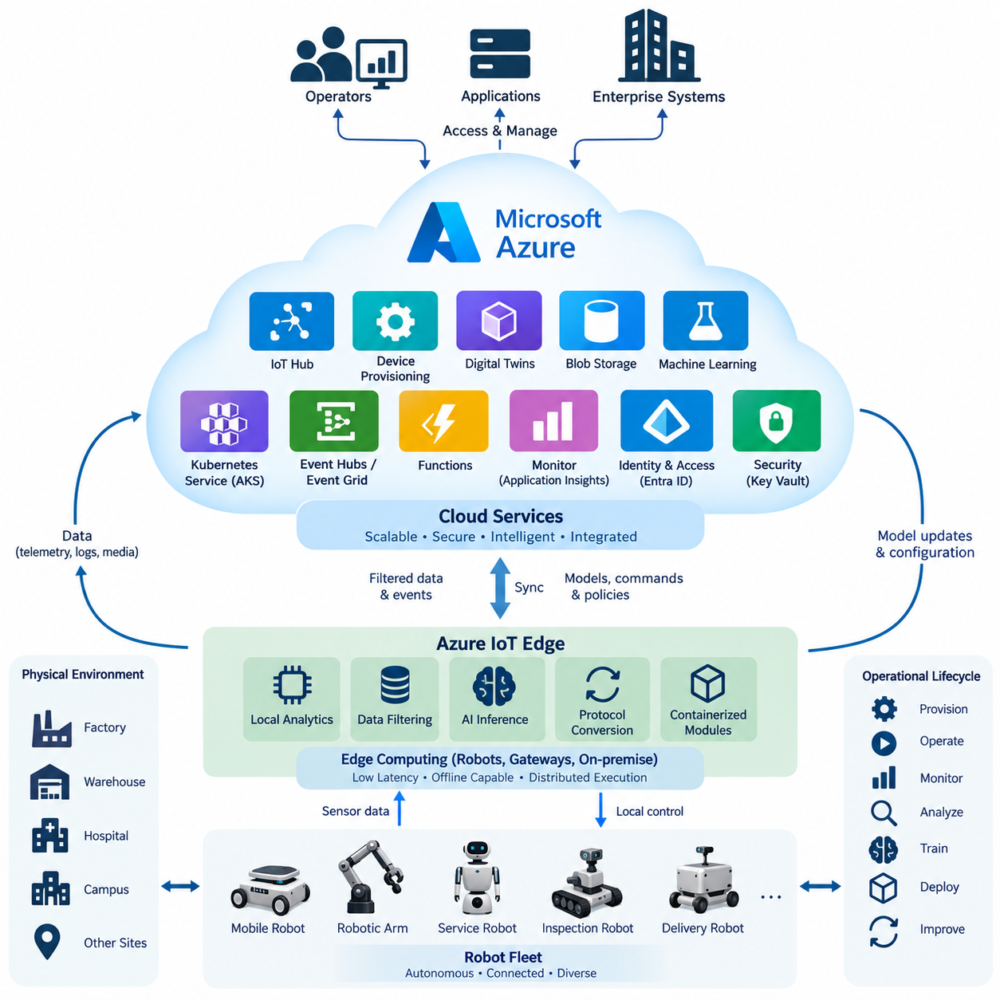
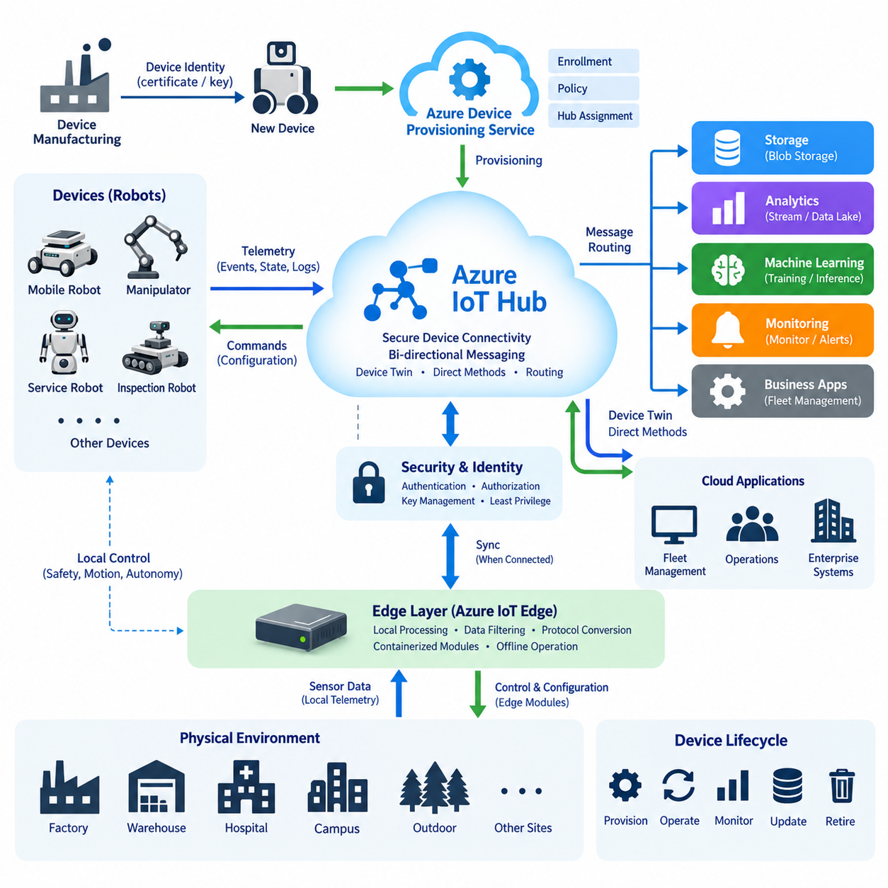
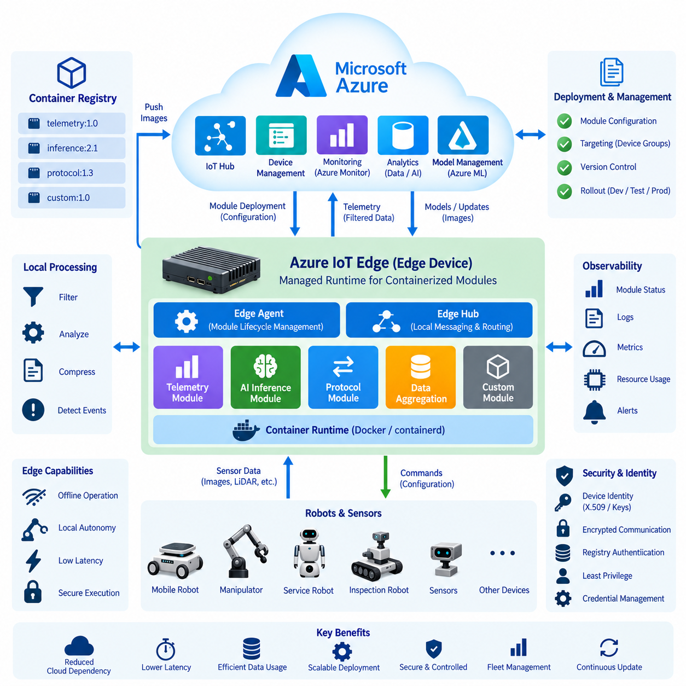
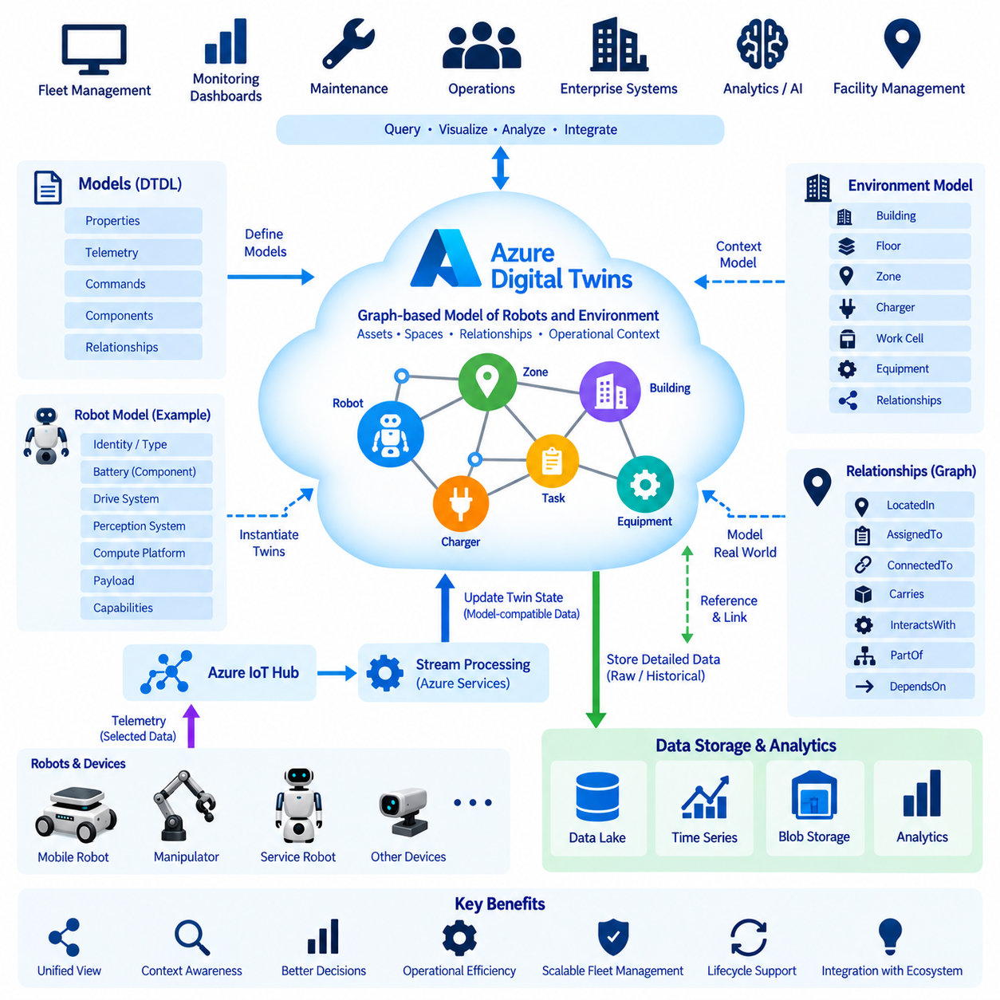
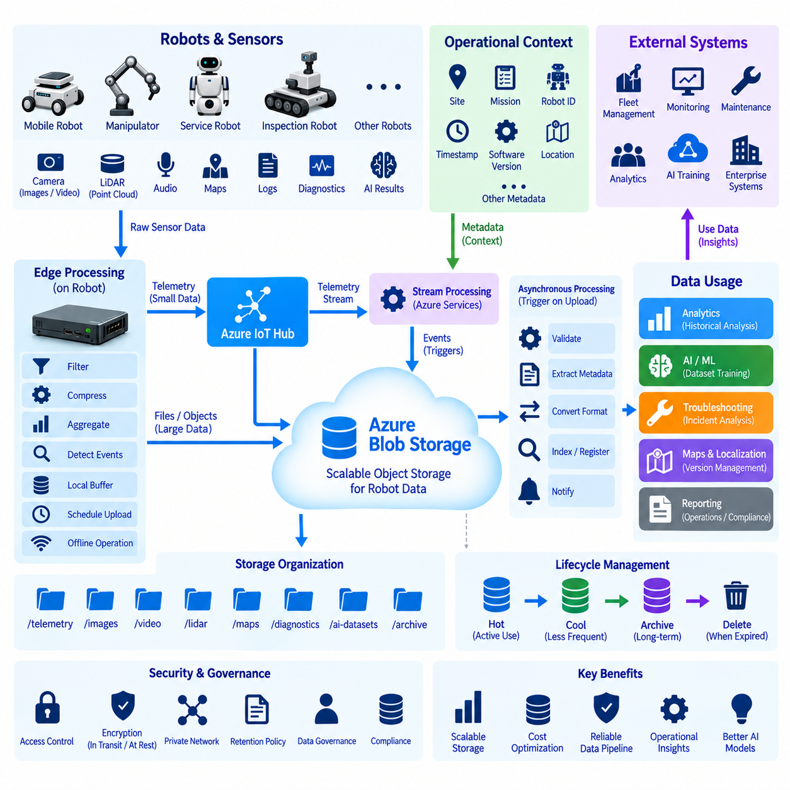
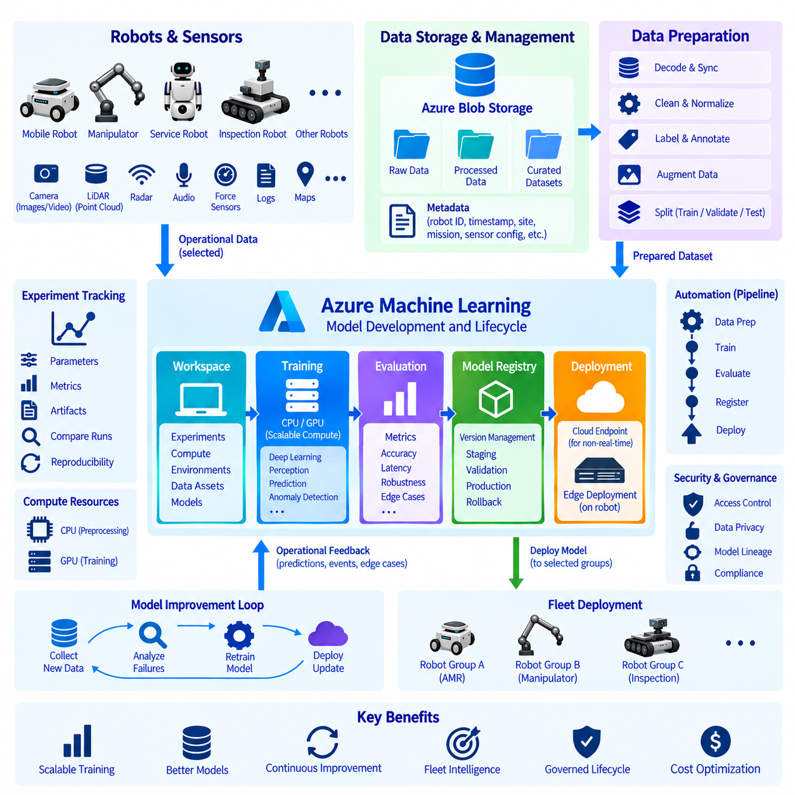
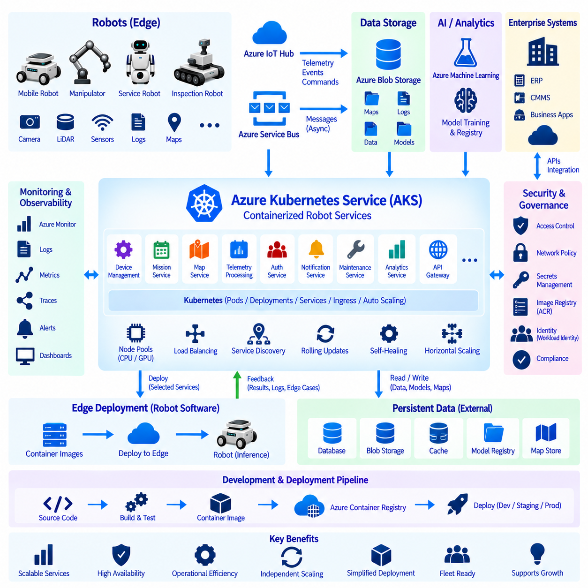
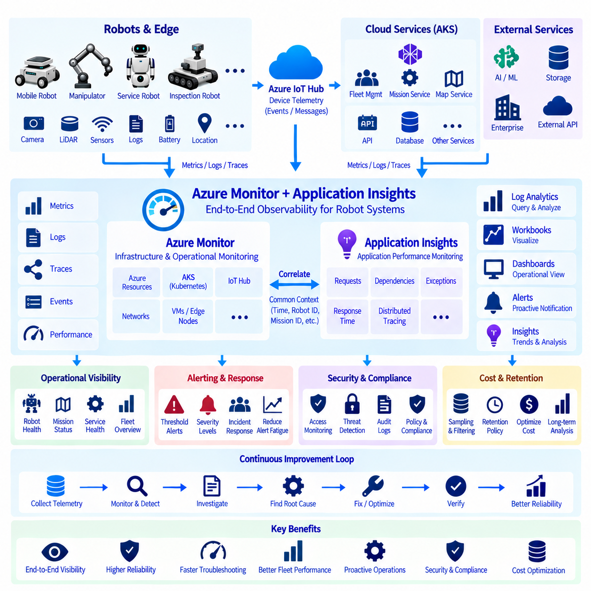
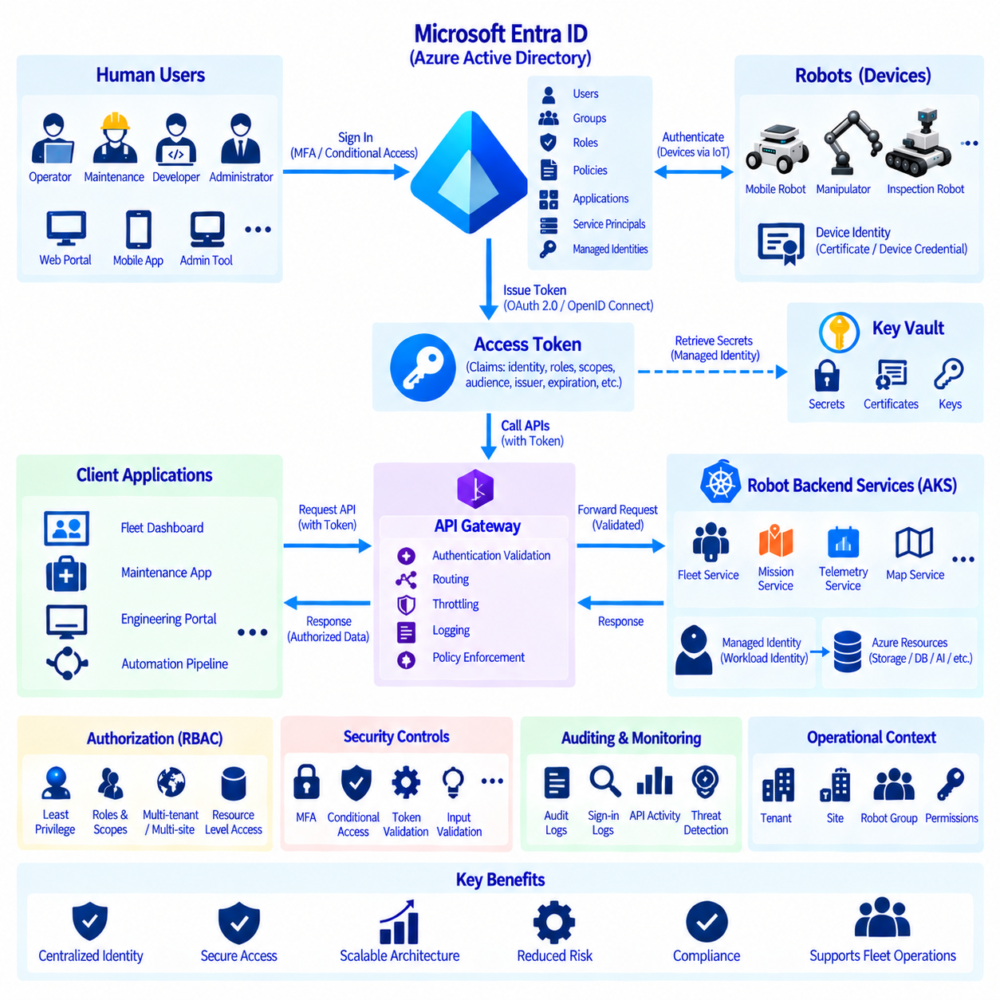
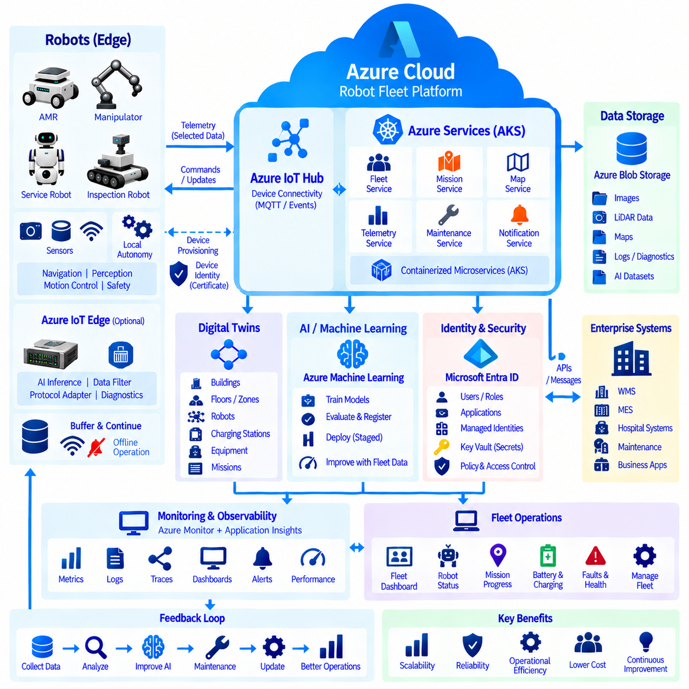

**Volume 09 Cloud and Edge Robotics**

# 05. Azure Robotics

## 05.01 Azure IoT Service Portfolio Overview

{width="7.268055555555556in" height="7.268055555555556in"}

마이크로소프트 애저(Microsoft Azure)는 연결형 로봇(Connected Robot)을 위한 종단 간 인프라(End-to-End Infrastructure)를 구성할 수 있는 광범위한 클라우드(Cloud) 및 엣지(Edge) 서비스 포트폴리오를 제공한다. 애저 로보틱스(Azure Robotics)의 구조에서 이러한 서비스는 장치 프로비저닝(Device Provisioning), 엣지 실행(Edge Execution), 디지털 트윈(Digital Twin), 데이터 저장(Data Storage), 인공지능 학습(AI Training), 쿠버네티스 배포(Kubernetes Deployment), 모니터링(Monitoring), 인증(Authentication)과 같은 후속 기능의 기반을 형성한다. 클라우드를 원격 로봇 제어기로 사용하는 것보다 자율적인 엣지 시스템을 지원하는 확장 가능한 관리 및 지능형 서비스로 활용하는 것이 효과적이다.

애저 IoT 허브(Azure IoT Hub)는 클라우드 애플리케이션(Cloud Application)과 대규모 연결 장치 사이의 양방향 통신(Bidirectional Communication)을 관리하기 위한 핵심 연결 서비스이다. 각각의 로봇은 개별적으로 인증된 장치로 표현될 수 있으며, 백엔드 시스템(Backend System)과 텔레메트리(Telemetry), 명령(Command), 상태 정보(State Information), 운영 이벤트(Operational Event)를 교환할 수 있다. 이러한 구조를 사용하면 시간 제약이 중요한 인지(Perception), 계획(Planning), 모션 제어(Motion Control), 안전(Safety) 기능을 로봇 내부에 유지하면서 수천 대의 이기종 로봇을 표준화된 인터페이스를 통해 관리할 수 있다.

장치 신원(Device Identity)은 생산 환경의 로봇 플릿(Robot Fleet)이 수동으로 구성된 자격 증명(Credential)에 의존해서는 안 된다는 점에서 매우 중요하다. 애저 IoT 허브 장치 프로비저닝 서비스(Azure IoT Hub Device Provisioning Service)는 장치를 적절한 IoT 허브 및 등록 정책(Enrollment Policy)에 연결하여 자동 프로비저닝을 지원한다. 제조, 시운전(Commissioning), 현장 배포 과정에서 로봇은 자신의 신원을 확립하고 지정된 클라우드 환경에 접속하는 데 필요한 정보를 얻을 수 있다. 이러한 방식은 플릿이 공장, 물류창고, 병원, 캠퍼스 및 지리적으로 분산된 고객 현장으로 확장될수록 더욱 중요해진다.

애저 IoT 엣지(Azure IoT Edge)는 클라우드 중심의 애플리케이션 관리를 로봇 내부 또는 로봇 주변에 설치된 컴퓨터까지 확장한다. 컨테이너화된 모듈(Containerized Module)을 로컬에서 실행하여 데이터 필터링(Data Filtering), 프로토콜 변환(Protocol Conversion), 분석(Analytics), 일부 인공지능 워크로드(AI Workload)를 지속적인 인터넷 연결 없이 수행할 수 있다. 로보틱스 아키텍처에서는 이를 통해 저지연 로컬 실행(Low-Latency Local Execution)과 확장 가능한 클라우드 서비스를 실질적으로 분리할 수 있다. 일시적인 네트워크 단절 중에도 엣지 처리를 지속하고 통신이 복구되면 선택된 정보를 클라우드와 동기화할 수 있다.

애저 디지털 트윈(Azure Digital Twins)은 물리적 환경, 자산 및 이들 사이의 관계를 표현하기 위한 모델링 환경(Modeling Environment)을 제공한다. 로보틱스에서는 단순히 개별 로봇의 텔레메트리를 복제하는 것보다 로봇을 시설, 작업 셀(Work Cell), 충전소(Charging Station), 장비, 구역 및 운영 자원과 연결하는 디지털 표현을 구성할 수 있다. 이러한 모델은 원시 센서 스트림(Raw Sensor Stream)만으로는 효율적으로 표현하기 어려운 문맥 정보(Contextual Information)를 제공하여 백엔드 애플리케이션이 물리적 자산과 운영 상태 사이의 관계를 이해할 수 있도록 한다.

로봇 플릿은 로그(Log), 이미지(Image), 지도(Map), 진단 기록(Diagnostic Record), 인공지능 추론 결과(AI Inference Result)를 비롯한 다양한 운영 데이터를 지속적으로 생성한다. 애저 블롭 스토리지(Azure Blob Storage)는 이러한 대규모 이기종 데이터셋(Heterogeneous Dataset)을 위한 확장 가능한 객체 저장소(Object Storage)로 활용될 수 있다. 모든 고대역폭 센서 스트림을 지속적으로 전송하는 대신 엣지 시스템에서 정보를 선택, 압축, 버퍼링 또는 집계한 후 업로드할 수 있다. 저장된 데이터는 과거 분석, 장애 조사, 데이터셋 구축, 모델 개발, 규정 준수 데이터 보존 및 플릿 전체 최적화에 활용할 수 있다.

애저 머신 러닝(Azure Machine Learning)은 머신러닝 모델(Machine Learning Model)의 개발, 학습, 추적, 등록 및 배포를 위한 인프라를 제공한다. 로보틱스 워크플로(Robotics Workflow)는 현장에 배포된 로봇으로부터 운영 데이터셋을 수집하고, 클라우드 또는 하이브리드 인프라(Hybrid Infrastructure)에서 학습 데이터를 준비하며, 개선된 모델을 학습하고 검증된 결과물을 등록한 후 선택된 버전을 다시 엣지 컴퓨터에 배포할 수 있다. 이를 통해 클라우드는 계산 집약적인 학습을 담당하고 로봇은 지연시간에 민감한 추론을 수행하는 지속적인 클라우드-엣지 인공지능 개선 순환(Cloud-Edge AI Improvement Loop)을 구축할 수 있다.

일반적으로 AKS라고 부르는 애저 쿠버네티스 서비스(Azure Kubernetes Service)는 컨테이너(Container)와 마이크로서비스(Microservice)로 구성된 백엔드 애플리케이션을 위한 관리형 쿠버네티스 인프라를 제공한다. 로봇 플릿 플랫폼에는 텔레메트리 수집, 장치 관리, 작업 오케스트레이션(Task Orchestration), 지도, 사용자 인터페이스(User Interface), 알림, API 및 인공지능 서비스를 위한 독립적인 서비스가 필요한 경우가 많다. AKS를 이용하면 이러한 구성요소를 독립적으로 확장하면서 롤링 배포(Rolling Deployment), 서비스 검색(Service Discovery), 워크로드 격리(Workload Isolation), 자동 복구(Automated Recovery)를 구현할 수 있다.

이벤트 기반 서비스(Event-Driven Service)는 지속적인 로봇 연결을 보완한다. 애저 이벤트 허브(Azure Event Hubs)는 대용량 스트림을 수집할 수 있으며, 애저 이벤트 그리드(Azure Event Grid)는 느슨하게 결합된 애플리케이션(Loosely Coupled Application) 사이에서 이벤트를 전달할 수 있다. 애저 펑션(Azure Functions)은 상시 실행되는 애플리케이션 서버 없이 이벤트에 대응하여 단기 처리 로직을 실행할 수 있다. 예를 들어 로봇 장애 이벤트가 발생하면 운영 데이터베이스 업데이트, 알림 생성, 진단 메타데이터 저장 및 추가 워크플로 실행을 연속적으로 수행할 수 있다.

운영 가시성(Operational Visibility)은 애저 모니터(Azure Monitor)와 애플리케이션 인사이트(Application Insights) 같은 관측성(Observability) 기능을 통해 제공된다. 로보틱스 모니터링은 장애가 애플리케이션뿐 아니라 네트워크, 엣지 컴퓨터, 센서, 배터리, 위치추정 시스템(Localization System), 물리적 메커니즘에서 발생할 수 있으므로 클라우드 서버의 상태만 감시해서는 충분하지 않다. 메트릭(Metric), 로그, 추적 정보(Trace), 애플리케이션 정보를 통합함으로써 운영자는 로봇 측 이벤트와 백엔드 동작의 상관관계를 분석할 수 있다. 이를 통해 개별 로봇을 각각 조사하는 대신 플릿 대시보드(Fleet Dashboard)와 경보 시스템을 이용하여 시스템 수준의 상태를 파악할 수 있다.

신원 및 접근 관리(Identity and Access Management)는 또 다른 중요한 아키텍처 계층이다. 과거 애저 액티브 디렉터리(Azure Active Directory)로 알려졌던 마이크로소프트 엔트라 ID(Microsoft Entra ID)는 로봇 서비스에 접근하는 운영자와 애플리케이션을 인증할 수 있으며, 애저 역할 기반 접근 제어(Azure Role-Based Access Control)는 인증된 신원이 수행할 수 있는 작업을 제한할 수 있다. 장치 신원(Device Identity), 사용자 신원(User Identity), 애플리케이션 신원(Application Identity), 권한 부여(Authorization)는 개념적으로 분리되어야 한다. 이를 통해 대시보드나 백엔드 서비스의 클라우드 자격 증명이 물리적 로봇을 무제한으로 제어하는 수단으로 사용되는 것을 방지할 수 있다.

보안 서비스(Security Service)는 네트워크 경계에 추가되는 별도의 기능이 아니라 전체 아키텍처에 통합되어야 한다. 암호화(Encryption), 인증서(Certificate), 관리형 신원(Managed Identity), 비밀 정보 관리(Secrets Management), 접근 정책(Access Policy), 로깅(Logging), 보안 모니터링(Security Monitoring)은 심층 방어 모델(Defense-in-Depth Model)을 구성한다. 애저 키 볼트(Azure Key Vault)는 클라우드 애플리케이션에서 사용하는 비밀 정보, 키 및 인증서를 보호할 수 있으며, 중앙화된 신원 정책은 통제되지 않은 자격 증명의 확산을 줄일 수 있다. 공공 또는 산업 환경에서 동작하는 로봇에서는 클라우드 자격 증명의 침해가 물리적 제어 권한의 무제한 획득으로 직접 연결되지 않도록 설계해야 한다.

따라서 전체 애저 로보틱스 서비스 포트폴리오(Azure Robotics Service Portfolio)는 하나의 전용 로보틱스 제품이라기보다 서로 협력하는 여러 계층의 집합으로 이해하는 것이 적절하다. IoT 허브와 프로비저닝은 장치 연결 및 신원을 제공하고, IoT 엣지는 분산 실행(Distributed Execution)을 지원하며, 디지털 트윈은 물리적 문맥을 추가한다. 블롭 스토리지는 데이터를 보존하고, 애저 머신 러닝은 인공지능 워크플로를 관리하며, AKS는 확장 가능한 백엔드 서비스를 운영한다. 이벤트 서비스는 비동기 프로세스(Asynchronous Process)를 연결하고, 모니터링과 신원 및 보안 서비스는 시스템 전반의 관측성과 통제된 접근을 제공한다.

실제 로봇 아키텍처에서는 지연시간(Latency), 대역폭(Bandwidth), 가용성(Availability), 안전(Safety), 계산 요구사항(Computational Requirement)에 따라 기능을 분배해야 한다. 모터 제어(Motor Control), 비상 대응(Emergency Handling), 장애물 회피(Obstacle Avoidance), 위치추정 및 기타 시간 제약이 중요한 기능은 일반적으로 로컬에 유지한다. 플릿 분석(Fleet Analytics), 장기 데이터 저장, 모델 학습, 사이트 간 협업(Cross-Site Coordination), 기업 시스템 통합(Enterprise Integration), 장기 최적화는 클라우드 워크로드에 적합하다. 중간 계층의 엣지 컴퓨터는 모든 워크로드를 임베디드 로봇 제어기에 배치하지 않으면서 로컬 응답성이 필요한 서비스를 수행할 수 있다.

이러한 분리는 시스템 복원력(Resilience)도 향상시킨다. 로봇은 클라우드 연결이 끊어졌다는 이유만으로 핵심 자율 기능을 즉시 상실해서는 안 된다. 로컬 소프트웨어는 연결이 없는 동안에도 안전한 동작을 유지하고 중요한 데이터를 버퍼링하며 로컬에서 사용할 수 있는 정책을 적용할 수 있다. 연결이 복구되면 축적된 텔레메트리와 상태 변경 정보를 클라우드 서비스와 동기화할 수 있다. 따라서 클라우드는 기본적인 물리적 동작의 불필요한 단일 장애점(Single Point of Failure)이 되지 않으면서 플릿 지능(Fleet Intelligence), 관리성(Manageability), 확장성(Scalability), 수명주기 자동화(Lifecycle Automation)를 강화한다.

대규모 로봇 플릿에서 애저의 가치는 전체 운영 수명주기(Operational Lifecycle)에 걸친 서비스 통합에서 나타난다. 장치를 안전하게 프로비저닝하고 연결 및 모니터링하며 디지털 방식으로 표현하고, 컨테이너화된 소프트웨어와 인공지능 모델을 공급하면서 확장 가능한 기업 애플리케이션과 통합할 수 있다. 운영 과정에서 생성된 데이터는 저장소와 머신러닝 파이프라인으로 다시 전달되고 새로운 모델과 운영 지식을 생성하며, 그 결과를 다시 로봇에 배포할 수 있다. 이러한 폐쇄형 클라우드-엣지 수명주기(Closed Cloud-Edge Lifecycle)는 데이터 중심으로 지속적으로 개선되는 로봇 시스템의 아키텍처 기반을 제공한다.

이 서비스 포트폴리오는 클라우드 로보틱스(Cloud Robotics)를 단순한 원격 연산(Remote Computation)이 아니라 분산 시스템(Distributed System)으로 설계해야 하는 이유를 보여준다. 로봇은 엄격한 시간 및 안전 제약조건 아래에서 물리적 세계와 상호작용하는 반면, 클라우드 플랫폼은 탄력적 확장성(Elasticity), 중앙 집중형 협업(Centralized Coordination), 영구 데이터(Persistent Data), 대규모 연산(Large-Scale Computation)을 제공한다. 이러한 장점을 결합하면 자율 로봇은 엣지에서 운영 독립성을 유지하면서 애저가 전체 플릿을 관리, 분석, 보호하고 지속적으로 발전시키는 데 필요한 공유 디지털 인프라(Shared Digital Infrastructure)를 제공하는 구조를 구축할 수 있다.

## 05.02 Azure IoT Hub: Device Provisioning / Messaging [w/Code]

{width="7.268055555555556in" height="7.268055555555556in"}

애저 IoT 허브(Azure IoT Hub)는 로봇, 게이트웨이(Gateway), 센서 및 임베디드 제어기(Embedded Controller)를 애저 클라우드 애플리케이션(Azure Cloud Application)과 연결하는 장치 통신 계층(Device Communication Layer)을 제공한다. 로보틱스 아키텍처에서 각각의 로봇은 고유하게 인증된 장치 신원(Device Identity)을 유지하면서 백엔드 서비스(Backend Service)와 텔레메트리(Telemetry), 운영 상태(Operational State), 명령(Command), 이벤트(Event)를 교환할 수 있다. 이를 통해 물리적 환경에서 자율적으로 동작하는 로봇과 플릿 수준 관리(Fleet-Level Management)를 담당하는 확장 가능한 클라우드 서비스 사이에 통제된 통신 경계가 형성된다.

실제 운영되는 로봇 플릿(Robot Fleet)은 서로 다른 공장, 물류창고, 병원, 캠퍼스 및 실외 환경에 배치된 수백 대 또는 수천 대의 장치로 구성될 수 있다. 모든 로봇에 대해 자격 증명(Credential)을 수동으로 생성하고 클라우드 엔드포인트(Cloud Endpoint)를 설정하는 방식은 규모가 증가하면 비현실적이다. 일반적으로 DPS라고 부르는 애저 IoT 허브 장치 프로비저닝 서비스(Azure IoT Hub Device Provisioning Service)는 로봇이 지정된 IoT 허브와 정상적인 통신을 시작하기 전에 자동화되고 확장 가능한 장치 등록(Device Enrollment) 및 프로비저닝(Provisioning)을 제공하여 이러한 문제를 해결한다.

프로비저닝 과정은 장치의 제조 신원(Manufacturing Identity)과 최종 클라우드 할당(Cloud Assignment)을 분리한다. 로봇은 신원 자격 증명을 가진 상태로 생산 공정을 완료한 후 시운전(Commissioning) 또는 최초 부팅(First Boot) 과정에서 DPS에 접속할 수 있다. DPS는 등록 정보를 평가하고 설정된 프로비저닝 정책(Provisioning Policy)에 따라 적절한 IoT 허브를 결정한다. 이후 로봇은 정상적인 운영에 필요한 연결 정보를 전달받기 때문에 모든 장치에 사이트별 IoT 허브 설정을 수동으로 내장하지 않고도 현장에서 장치를 구성할 수 있다.

장치 인증(Device Authentication)은 보안 요구사항과 장치 기능에 따라 X.509 인증서(X.509 Certificate) 또는 대칭 키(Symmetric Key)와 같은 메커니즘을 기반으로 구성할 수 있다. 대규모 로봇 배포 환경에서는 인증서 기반 신원(Certificate-Based Identity)이 물리적 장치와 클라우드 인프라 사이에 개별적인 신뢰 관계를 구축하는 데 유용한 기반을 제공한다. 가능한 경우 하드웨어 기반 보안(Hardware-Backed Security)을 사용하여 자격 증명을 보호해야 하며, 장치 신원 수명주기(Device Identity Lifecycle)는 인증을 일회성 설정으로 취급하지 않고 안전한 제조, 프로비저닝, 갱신, 폐기, 교체 및 운영 종료까지 포함해야 한다.

애저 IoT 허브는 로봇에서 생성되는 텔레메트리와 운영 정보를 전송하기 위한 장치-클라우드 메시징(Device-to-Cloud Messaging)을 지원한다. 로봇은 배터리 상태, 위치추정 품질(Localization Quality), 임무 진행 상태(Mission Progress), 온도, 진단 이벤트(Diagnostic Event), 하위 시스템 상태(Subsystem Health), 활용률 통계(Utilization Statistics), 선택된 인지 결과(Perception Result)를 전송할 수 있다. 이러한 메시지는 백엔드 애플리케이션에서 처리되고 저장, 분석, 모니터링 또는 이벤트 처리 서비스로 전달될 수 있다. 그러나 카메라나 라이다(LiDAR)의 모든 데이터를 무분별하게 IoT 메시징으로 전송하기보다는 고대역폭 원시 센서 스트림(Raw Sensor Stream)에 별도의 데이터 전략을 적용하는 것이 일반적이다.

클라우드-장치 통신(Cloud-to-Device Communication)은 플릿 또는 백엔드 서비스에서 생성된 정보를 장치로 전달하는 역방향 경로를 제공한다. 애플리케이션은 연결된 장치에 명령이나 기타 운영 메시지를 전달할 수 있으며, 장치 트윈(Device Twin)은 선택된 장치 상태와 설정의 동기화된 표현을 제공한다. 로보틱스에서는 이러한 메커니즘을 설정 변경, 운영 파라미터(Operating Parameter), 임무 관련 정보, 기능 설정 및 기타 비경성 실시간(Non-Hard-Real-Time) 상호작용에 활용할 수 있으며, 결정론적 모션 제어(Deterministic Motion Control)를 클라우드 통신 경로에 배치하지 않으면서 신뢰성 있는 클라우드 협업을 구현할 수 있다.

장치 트윈(Device Twin)은 희망 속성(Desired Properties), 보고 속성(Reported Properties), 추가 메타데이터(Metadata)를 통해 장치를 설명하는 클라우드 측 정보를 유지한다. 플릿 서비스는 원하는 설정을 희망 상태로 표현할 수 있고 로봇은 실제 적용한 상태를 보고할 수 있다. 클라우드의 요청이 물리적 로봇이 즉시 해당 상태에 도달했음을 의미하지 않기 때문에 이러한 구분은 중요하다. 일시적인 연결 단절, 소프트웨어 장애, 안전 제약조건 또는 현장의 운영 조건으로 인해 설정 변경이 지연되거나 적용되지 않을 수 있으므로 희망 상태와 보고 상태를 분리하여 평가해야 한다.

직접 메서드(Direct Method)는 백엔드 애플리케이션이 연결된 장치와 요청-응답(Request-Response) 방식으로 통신해야 할 때 사용할 수 있는 또 다른 상호작용 방식이다. 즉각적인 확인 응답(Acknowledgement)이나 결과가 필요한 관리 작업에 활용할 수 있지만 결정론적 실시간 제어(Deterministic Real-Time Control)와 혼동해서는 안 된다. 네트워크 지연시간, 클라우드 가용성 및 무선 연결 상태는 계속 변할 수 있다. 따라서 비상 정지(Emergency Stop), 모터 제어 루프(Motor Control Loop), 충돌 회피(Collision Avoidance) 및 기타 안전 필수 기능(Safety-Critical Function)은 애저 IoT 허브 연결과 독립된 로컬 실행 경로를 가져야 한다.

메시지 라우팅(Message Routing)을 사용하면 메시지 속성, 장치 정보 또는 애플리케이션이 정의한 조건에 따라 IoT 허브 트래픽을 서로 다른 다운스트림 서비스(Downstream Service)로 전달할 수 있다. 모든 텔레메트리 메시지를 하나의 거대한 백엔드로 전달하는 대신 로봇 이벤트를 운영, 진단, 분석 및 보관 흐름으로 분리할 수 있다. 예를 들어 중요한 장애 이벤트는 신속한 모니터링 워크플로(Monitoring Workflow)로 전달하고 일반적인 텔레메트리는 과거 분석을 위해 저장하며 선택된 데이터는 분석 또는 머신러닝 파이프라인(Machine Learning Pipeline)으로 전달할 수 있다.

로봇은 연결 상태가 불안정해질 수 있는 무선 네트워크(Wireless Network)에서 동작하는 경우가 많다. 따라서 장치 통신 아키텍처는 일시적인 연결 단절을 예외적인 장애로만 처리하기보다 기본적으로 발생할 수 있는 조건으로 고려해야 한다. 로컬 애플리케이션은 자율 동작을 유지하고 안전 기능을 지속하며 적절한 정보를 버퍼링(Buffering)한 후 네트워크 서비스가 복구되면 다시 연결할 수 있다. 재연결 이후 동기화 메커니즘(Synchronization Mechanism)을 통해 필요한 클라우드 상태를 복원하면서 로봇은 로컬에서 사용할 수 있는 정책과 제약조건에 따라 계속 동작할 수 있다.

메시지 설계(Message Design)는 통신 서비스 자체만큼 중요하다. 텔레메트리에는 로봇, 하위 시스템, 타임스탬프(Timestamp), 소프트웨어 또는 설정 상태, 측정값의 의미를 식별할 수 있는 충분한 문맥 정보(Contextual Information)가 포함되어야 한다. 일관된 스키마(Schema)를 사용하면 백엔드 애플리케이션을 특정 펌웨어 구현에 강하게 결합하지 않고 서로 다른 세대의 로봇 정보를 처리할 수 있다. 하드웨어, 임베디드 소프트웨어, 엣지 애플리케이션 및 클라우드 서비스가 긴 로봇 수명주기 동안 독립적으로 발전하기 때문에 버전이 관리되는 메시지 계약(Versioned Message Contract)이 특히 중요하다.

프로비저닝은 플릿 분할(Fleet Segmentation)도 지원해야 한다. 로봇은 서로 다른 고객, 사이트, 개발 단계, 지역 또는 운영 그룹에 속할 수 있으며 이러한 차이에 따라 사용해야 하는 클라우드 자원이 달라질 수 있다. 자동 할당 정책(Automated Allocation Policy)은 시운전 작업을 줄이고 확장 가능한 배포 패턴(Deployment Pattern)을 지원할 수 있다. 등록 과정에서 설정된 장치 메타데이터는 이후 백엔드 시스템이 서로 다른 로봇 그룹에 적절한 설정, 모니터링, 소프트웨어 배포 및 운영 정책을 적용하는 데 활용될 수 있다.

보안(Security)은 최초 연결을 인증하는 것만으로 충분하지 않다. 장치 권한은 최소 권한 원칙(Least-Privilege Principle)을 따라야 하고 자격 증명은 추출되지 않도록 보호되어야 하며, 백엔드 애플리케이션은 IoT 자원에 접근할 때 통제된 신원(Controlled Identity)을 사용해야 한다. 전송 암호화(Transport Encryption)는 통신 채널을 보호하며 인증서와 키 관리 정책은 장기간 운영되는 장치의 신뢰성을 결정한다. 침해되었거나 운영이 종료된 로봇은 다른 장치에 영향을 주지 않으면서 신뢰된 플릿(Trusted Fleet)에서 제거할 수 있어야 한다.

따라서 IoT 허브는 로봇의 결정론적 제어 아키텍처(Deterministic Control Architecture) 내부에 직접 삽입하기보다 그 상위 계층에 배치해야 한다. 모터 제어, 액추에이터 동기화(Actuator Synchronization), 안전 모니터링, 위치추정, 장애물 회피 및 기타 지연시간에 민감한 기능은 임베디드 또는 엣지 컴퓨터에 유지한다. IoT 허브는 텔레메트리, 설정, 진단, 원격 관리(Remote Management), 기업 또는 클라우드 애플리케이션 통합과 같이 중앙 집중형 가시성(Centralized Visibility)과 플릿 규모의 협업이 필요한 통신을 담당한다.

확장 가능한 구현에서는 IoT 통신과 상위 수준의 플릿 비즈니스 로직(Fleet Business Logic)도 분리한다. IoT 허브는 안전한 장치 연결 및 메시징을 제공하고, 다른 백엔드 구성요소는 텔레메트리를 해석하고 플릿 상태를 관리하며 임무를 스케줄링하고 경보를 생성하거나 과거 정보를 저장하고 운영자 및 기업 시스템에 API를 제공한다. 이러한 분리를 통해 메시징 계층이 거대한 단일 플릿 관리 애플리케이션(Monolithic Fleet Management Application)으로 변하는 것을 방지하고 개별 클라우드 서비스가 각각의 확장성 및 가용성 요구사항에 따라 발전할 수 있도록 한다.

전체 수명주기(Lifecycle)는 신뢰할 수 있는 제조 신원(Manufacturing Identity)을 가진 로봇에서 시작하여 자동화된 DPS 등록 및 IoT 허브 할당을 거친 후 인증된 운영 메시징(Authenticated Operational Messaging) 단계로 전환될 수 있다. 서비스 운영 중 로봇은 텔레메트리와 보고 상태를 전송하고 희망 설정, 관리 요청 및 적절한 클라우드 생성 정보를 수신한다. 모니터링 및 백엔드 서비스는 이러한 통신 흐름을 처리하며, 신원 및 프로비저닝 정책은 어떤 물리적 로봇이 플릿에 참여할 수 있는지를 지속적으로 통제한다.

로보틱스에서 핵심적인 아키텍처 원칙은 애저 IoT 허브(Azure IoT Hub)와 장치 프로비저닝 서비스(Device Provisioning Service)가 로봇의 자율성(Robot Autonomy)을 대체하지 않으면서 안전한 플릿 연결성을 제공한다는 것이다. 프로비저닝은 클라우드 관리 플릿에 대한 신뢰된 구성원 자격을 확립하고, 메시징은 물리적 운영과 디지털 서비스를 연결하며, 장치 상태 메커니즘은 분산 시스템의 설정을 조정한다. 이러한 기능을 로컬 자율 실행(Local Autonomous Execution)과 결합하면 운영 복원력(Operational Resilience)을 유지하면서 소규모 배포에서 대규모 플릿까지 확장할 수 있는 클라우드-엣지 아키텍처(Cloud-Edge Architecture)를 구축할 수 있다.

## 05.03 Azure IoT Edge: Runtime Module Deployment [w/Code]

{width="7.268055555555556in" height="7.268055555555556in"}

애저 IoT 엣지(Azure IoT Edge)는 애저 클라우드(Azure Cloud)의 기능을 로봇, 게이트웨이(Gateway) 또는 인근 산업 인프라에 설치된 로컬 컴퓨터까지 확장한다. 그 목적은 로봇의 임베디드 제어 소프트웨어(Embedded Control Software)를 대체하는 것이 아니라 물리적 운영 환경 가까이에서 컨테이너화된 애플리케이션(Containerized Application)을 실행할 수 있는 관리형 실행 환경(Managed Execution Environment)을 제공하는 것이다. 이러한 아키텍처는 지속적인 클라우드 연결에 대한 의존성을 줄이는 동시에 선택된 클라우드 관리 워크로드(Cloud-Managed Workload)를 낮은 지연시간으로 실행하고 로컬 로봇 데이터에 통제된 방식으로 접근할 수 있도록 한다.

IoT 엣지 런타임(IoT Edge Runtime)은 엣지 장치(Edge Device)에 배포된 워크로드를 관리하는 소프트웨어 기반을 제공한다. 각각의 애플리케이션을 수동으로 설치하는 대신 소프트웨어 기능을 독립적으로 배포 가능한 모듈(Module)로 패키징할 수 있다. 이러한 모듈은 텔레메트리 전처리(Telemetry Preprocessing), 프로토콜 변환(Protocol Conversion), 로컬 분석(Local Analytics), 인공지능 추론(AI Inference), 데이터 집계(Data Aggregation), 로봇 미들웨어(Robot Middleware)와의 통신 등을 수행할 수 있다. 런타임은 모듈 실행을 조정하고 애저 서비스는 중앙 집중형 설정 및 배포 관리를 제공한다.

IoT 엣지 설치 환경은 기본적으로 워크로드 관리(Workload Management)와 워크로드 구현(Workload Implementation)을 분리한다. 애플리케이션 개발자는 모듈 기능을 개발하고 이를 컨테이너 이미지(Container Image)로 패키징한 후 적절한 컨테이너 레지스트리(Container Registry)에 게시한다. 이후 배포 설정(Deployment Configuration)을 통해 특정 엣지 장치에서 어떤 모듈을 실행하고 어떻게 동작시킬 것인지를 정의한다. 이러한 분리를 통해 하나의 물리적 엣지 컴퓨터에서 모든 기능을 단일 로봇 애플리케이션으로 통합하지 않고도 독립적으로 관리되는 여러 서비스를 실행할 수 있다.

런타임에는 통신 및 모듈 수명주기 관리(Module Lifecycle Management)를 담당하는 시스템 구성요소가 포함된다. 엣지 에이전트(Edge Agent)는 배포 정보를 해석하고 지정된 설정에 따라 필요한 모듈이 생성, 시작, 중지 또는 재시작되도록 관리한다. 엣지 허브(Edge Hub)는 로컬 메시징(Local Messaging) 기능을 제공하며 모듈, 장치 및 IoT 허브(IoT Hub) 사이의 통신을 중개한다. 이 두 구성요소를 통해 클라우드에서 희망 설정(Desired Configuration)을 조정할 수 있는 관리형 로컬 환경이 형성된다.

모듈 배포(Module Deployment)는 애플리케이션과 필요한 런타임 종속성(Runtime Dependency)을 포함하는 컨테이너 이미지에서 시작된다. 로보틱스 환경에서는 하나의 모듈이 텔레메트리를 처리하고, 다른 모듈이 인공지능 추론을 실행하며, 또 다른 모듈이 로컬 프로토콜과 클라우드 메시징 사이의 변환을 담당할 수 있다. 이러한 워크로드를 개별적으로 패키징하면 소프트웨어 종속성 충돌을 줄이고 전체 엣지 소프트웨어 스택(Edge Software Stack)을 다시 구축하지 않고도 개별 구성요소를 업데이트할 수 있다. 버전이 지정된 이미지는 배포된 소프트웨어와 운영 설정 사이의 관계도 명확하게 만든다.

배포 매니페스트(Deployment Manifest)는 IoT 엣지 장치의 희망 상태(Desired State)를 정의한다. 여기에는 모듈, 이미지 위치(Image Location), 환경 변수(Environment Variable), 재시작 동작(Restart Behavior), 라우팅 관계(Routing Relationship) 및 배포에 필요한 기타 실행 파라미터가 포함된다. 희망 설정이 변경되면 엣지 에이전트는 요청된 상태와 로컬 상태를 비교하고 필요한 수명주기 작업을 수행한다. 이러한 희망 상태 모델(Desired-State Model)을 통해 플릿 관리자는 각각의 로봇에 직접 로그인하여 설치 내용을 수정하지 않고 선언적 방식(Declarative Method)으로 엣지 소프트웨어를 관리할 수 있다.

컨테이너 레지스트리(Container Registry)는 모듈 이미지를 배포하는 배포 지점(Distribution Point)을 제공한다. 배포 과정에서 엣지 장치는 지정된 이미지를 가져와 설정에 따라 해당 모듈을 생성한다. 따라서 특히 독점적인 로봇 소프트웨어를 프라이빗 저장소(Private Repository)를 통해 배포하는 경우 레지스트리 인증(Registry Authentication)은 배포 보안 아키텍처의 일부가 된다. 플릿 운영자가 각각의 로봇에서 어떤 소프트웨어 결과물이 실행되고 있는지를 확인하고 모호한 이미지 참조로 인한 의도하지 않은 변경을 방지할 수 있도록 이미지 버전을 명확하게 관리해야 한다.

IoT 엣지 메시지 라우팅(IoT Edge Message Routing)을 사용하면 모든 통신 관계를 애플리케이션 코드 내부에 직접 구현하지 않고도 로컬 모듈과 클라우드 엔드포인트(Cloud Endpoint) 사이에서 데이터를 전달할 수 있다. 센서 처리 모듈은 필터링된 결과를 다른 모듈에 전달하고 선택된 텔레메트리는 IoT 허브로 전송할 수 있다. 따라서 라우팅 규칙(Routing Rule)은 애플리케이션 로직(Application Logic)과 통신 토폴로지(Communication Topology)를 분리하는 데 도움을 준다. 로봇 소프트웨어가 발전하더라도 각 모듈에 클라우드 통합 기능을 다시 구현하지 않고 데이터 경로를 변경할 수 있다는 장점이 있다.

로봇에서 원시 센서 정보(Raw Sensor Information)는 클라우드 애플리케이션에 실제로 필요한 운영 정보보다 훨씬 큰 데이터 용량을 생성할 수 있기 때문에 엣지 처리(Edge Processing)가 특히 중요하다. 카메라 이미지, 라이다 포인트 클라우드(LiDAR Point Cloud), 오디오 스트림(Audio Stream), 진단 로그 및 기타 데이터 소스는 상당한 데이터량을 생성할 수 있다. 로컬 모듈은 전송 전에 데이터를 필터링, 요약, 압축, 분류하거나 이벤트를 탐지할 수 있다. 이를 통해 불필요한 네트워크 트래픽을 줄이면서 플릿 모니터링, 저장, 분석 및 모델 개선에 적합한 정보만 클라우드로 전달할 수 있다.

오프라인 운영(Offline Operation)은 이동 로봇 및 현장 로봇에서 정상적인 설계 조건으로 고려해야 한다. 클라우드 연결이 중단되더라도 로컬에 배포된 모듈의 런타임은 엣지 컴퓨터에서 실행되므로 계속 동작할 수 있다. 필요한 정보는 로컬에 버퍼링한 후 연결이 복구되면 동기화할 수 있다. 이를 통해 클라우드는 소프트웨어를 관리하고 플릿 정보를 수집하면서도 로봇의 필수 동작이 지속적인 인터넷 연결에 의존하지 않도록 할 수 있으며, 이는 물류창고, 실외 환경 및 원격 시설에서 특히 중요하다.

IoT 엣지와 실시간 로봇 제어(Real-Time Robot Control) 사이의 경계는 명확하게 유지해야 한다. 안전 루프(Safety Loop), 비상 정지(Emergency Stop), 모터 제어(Motor Control), 액추에이터 동기화(Actuator Synchronization), 장애물 회피(Obstacle Avoidance) 및 기타 결정론적 기능(Deterministic Function)은 전용 임베디드 또는 실시간 소프트웨어 계층에 유지해야 한다. IoT 엣지는 상위 수준 처리(Supervisory Processing), 데이터 관리, 인공지능 추론, 시스템 통합, 진단 및 클라우드 동기화에 더 적합하다. 이러한 역할 분리는 컨테이너 또는 네트워크의 가변적인 동작이 안전 필수 제어 경로(Safety-Critical Control Path)에 포함되는 것을 방지한다.

인공지능 추론(AI Inference)은 로보틱스에서 중요한 IoT 엣지 워크로드 중 하나이다. 학습된 모델(Trained Model)을 추론 애플리케이션 및 필요한 라이브러리와 함께 패키징하여 버전이 관리되는 모듈로 배포할 수 있다. 센서 데이터 또는 전처리된 데이터를 해당 모듈에 로컬로 전달함으로써 모든 입력 데이터를 클라우드로 전송하지 않고도 추론 결과를 생성할 수 있다. 이후 업데이트된 모델을 관리형 배포 프로세스를 통해 배포함으로써 클라우드 기반 모델 개발(Cloud-Based Model Development)과 로봇 측 실행(Robot-Side Execution)을 실질적으로 연결할 수 있다.

플릿 규모 배포(Fleet-Scale Deployment)에서는 모든 로봇이 반드시 동일한 소프트웨어를 동시에 받아야 하는 것은 아니기 때문에 대상 지정 메커니즘(Targeting Mechanism)이 필요하다. 장치는 하드웨어 세대, 고객 사이트, 운영 환경, 개발 단계 또는 애플리케이션 설정에 따라 서로 다를 수 있다. 배포 정책(Deployment Policy)을 이용하면 적절한 장치 그룹에 원하는 모듈 설정을 연결할 수 있다. 이를 통해 개발(Development), 검증(Validation), 파일럿(Pilot), 양산 운영(Production) 그룹을 분리할 수 있으며 이기종 로봇 플릿에 대한 통제된 소프트웨어 롤아웃(Controlled Software Rollout)의 아키텍처 기반을 제공한다.

소프트웨어 업데이트(Software Update)는 단순한 파일 교체가 아니라 통제된 수명주기 전환(Controlled Lifecycle Transition)으로 관리해야 한다. 새로운 모듈 버전은 정상적으로 동작한다고 판단하기 전에 다운로드되고, 인스턴스화(Instantiation)되고, 설정되고, 시작된 후 동작 상태가 관찰되어야 한다. 애플리케이션이 반복적으로 실패하거나 주변 구성요소와 호환되지 않는 경우 배포 절차에는 정의된 복구 전략(Recovery Strategy)이 필요하다. 버전이 관리되는 컨테이너 이미지와 배포 설정을 유지하면 추적성(Traceability)이 향상되고 특정 현장 이벤트와 관련된 소프트웨어 상태를 식별할 수 있다.

배포가 성공했다는 사실만으로 애플리케이션이 올바르게 동작한다는 것을 보장할 수 없기 때문에 관측성(Observability)이 필요하다. 운영자는 모듈 상태(Module Status), 재시작 동작, 자원 사용량(Resource Consumption), 애플리케이션 로그, 통신 장애 및 엣지 장치 상태를 확인할 수 있어야 한다. 배터리 상태, 센서 가용성(Sensor Availability), 위치추정 품질(Localization Quality), 임무 상태(Mission State), 인공지능 추론 성능과 같은 로봇 고유의 메트릭을 인프라 정보와 결합할 수도 있다. 이는 클라우드 서비스나 컨테이너 상태만 독립적으로 감시하는 것보다 완전한 운영 상태를 제공한다.

보안(Security)은 클라우드 설정부터 로컬 모듈 실행까지 전체 경로를 포괄해야 한다. 장치 신원(Device Identity)은 어떤 엣지 컴퓨터를 신뢰할 것인지를 결정하고, 레지스트리 자격 증명(Registry Credential)은 소프트웨어 이미지에 대한 접근을 통제하며, 암호화 통신(Encrypted Communication)은 전송 중 데이터를 보호한다. 애플리케이션 권한은 최소 권한 원칙(Least-Privilege Principle)에 따라 제한해야 하며 비밀 정보(Secret)를 컨테이너 이미지에 직접 포함해서는 안 된다. 운영 시스템에서는 이미지 출처(Image Provenance), 버전 관리, 자격 증명 갱신 및 오래되거나 침해된 소프트웨어의 제거도 통제해야 한다.

배터리 기반 로봇(Battery-Powered Robot)의 엣지 컴퓨터는 제한된 CPU, GPU, 메모리, 저장공간, 열 및 전력 예산(Power Budget)을 가지기 때문에 자원 관리(Resource Management)가 특히 중요하다. 개별 애플리케이션이 정상적으로 동작하더라도 추가 모듈 배포는 계산 부하와 전력 소비를 증가시킬 수 있다. 따라서 엣지 아키텍처에서는 워크로드 우선순위 설정(Workload Prioritization)과 용량 계획(Capacity Planning)이 필요하다. 인공지능 추론, 데이터 처리, 진단 및 통신 워크로드는 자율주행 소프트웨어의 자원을 과도하게 사용하거나 로봇 플랫폼의 열 및 에너지 제약조건을 초과하지 않도록 함께 관리되어야 한다.

완전한 클라우드-엣지 로보틱스 아키텍처(Cloud-Edge Robotics Architecture)에서 애저 IoT 엣지는 저수준 자율 로봇 소프트웨어(Low-Level Autonomous Robot Software)와 중앙 집중형 애저 서비스 사이에 위치하는 관리형 애플리케이션 계층(Managed Application Layer)이 된다. 로봇은 로컬 제어와 안전 기능을 유지하고, 엣지 모듈은 유연한 처리와 시스템 통합을 제공하며, IoT 허브는 플릿 규모의 연결성과 설정 관리를 담당한다. 클라우드 시스템은 소프트웨어와 모델을 배포하고 선택된 운영 정보를 수집함으로써 현장에 배치된 물리적 로봇과 중앙 집중형 디지털 인프라 사이에 통제된 피드백 순환(Feedback Loop)을 형성한다.

따라서 IoT 엣지의 아키텍처적 가치는 로컬 실행(Local Execution)과 중앙 집중형 수명주기 관리(Centralized Lifecycle Management)를 결합하는 데 있다. 컨테이너화된 모듈은 소프트웨어 격리(Software Isolation)와 배포 유연성을 제공하고, 런타임은 원하는 애플리케이션 상태를 유지하며, 라우팅은 로컬 및 클라우드 데이터 흐름을 연결하고, 오프라인 기능은 통신이 중단된 상황에서도 운영을 지속하도록 한다. 이러한 메커니즘을 로봇의 실시간 및 안전 경계(Real-Time and Safety Boundary)에 맞게 설계하면 애저 IoT 엣지를 통해 물리적 로봇 시스템에 요구되는 자율성과 복원력을 유지하면서 확장 가능한 소프트웨어 배포를 구현할 수 있다.

## 05.04 Azure Digital Twins: Robot Twin Modeling [w/Code]

{width="7.268055555555556in" height="7.268055555555556in"}

애저 디지털 트윈(Azure Digital Twins)은 물리적 시스템, 자산, 공간 및 이들 사이의 관계를 클라우드에서 표현하기 위한 그래프 기반 모델링 환경(Graph-Based Modeling Environment)을 제공한다. 로보틱스에서 디지털 트윈(Digital Twin)은 단순히 로봇의 시각적인 3차원 복제본으로 이해해서는 안 된다. 디지털 트윈은 로봇의 속성, 운영 상태, 환경, 인프라 및 관계를 연결하여 애플리케이션이 물리적 시스템을 의미 있는 운영 문맥(Operational Context) 안에서 해석할 수 있도록 하는 구조화된 디지털 표현(Structured Digital Representation)이다.

로봇 트윈(Robot Twin)은 비교적 정적인 특성과 지속적으로 변화하는 운영 정보를 모두 표현할 수 있다. 정적 정보에는 로봇 유형, 하드웨어 구성, 페이로드 등급(Payload Class), 센서 구성, 소프트웨어 세대 및 지원 기능 등이 포함될 수 있다. 동적 속성(Dynamic Property)은 배터리 상태, 운영 모드, 현재 임무, 위치추정 상태(Localization Status), 온도, 상태 지표(Health Indicator), 충전 상태 등을 나타낼 수 있다. 이러한 개념을 분리하면 로봇의 전체 수명주기 동안 일관되게 활용할 수 있는 정보 모델을 구축할 수 있다.

애저 디지털 트윈은 디지털 개체(Digital Entity)의 구조와 의미(Semantics)를 정의하기 위해 모델(Model)을 사용한다. 모델은 특정 유형의 물리적 또는 논리적 객체를 설명하는 속성(Property), 텔레메트리(Telemetry), 명령(Command), 구성요소(Component), 관계(Relationship)를 정의한다. 따라서 로봇 개발자는 배포된 각각의 자산마다 서로 다른 데이터 구조를 만드는 대신 이동 로봇(Mobile Robot), 매니퓰레이터(Manipulator), 충전소(Charging Station), 작업 셀(Work Cell), 엘리베이터, 출입문, 검사 장비 또는 시설에 대한 재사용 가능한 모델을 정의할 수 있다.

일반적으로 DTDL이라고 부르는 디지털 트윈 정의 언어(Digital Twins Definition Language)는 이러한 모델을 설명하기 위한 표준화된 방법을 제공한다. DTDL 인터페이스(DTDL Interface)는 디지털 개체와 관련된 기능 및 데이터 구조를 정의할 수 있으며, 구성요소를 사용하면 복잡한 시스템을 재사용 가능한 하위 모델(Submodel)로 분해할 수 있다. 로봇 모델은 배터리, 구동 시스템(Drive System), 인지 서브시스템(Perception Subsystem), 컴퓨팅 플랫폼(Compute Platform), 페이로드를 나타내는 구성요소를 포함할 수 있으며, 이를 통해 복잡한 기계를 모듈화되고 유지관리 가능한 모델 구조로 표현할 수 있다.

관계(Relationship)는 디지털 트윈 모델링에서 가장 중요한 특성 중 하나이다. 로봇은 독립된 객체로만 동작하는 경우가 드물며 물류창고의 특정 구역에 위치하거나 임무를 할당받고, 충전소와 연결되거나 페이로드를 운반하고, 다른 장비와 상호작용할 수 있다. 애저 디지털 트윈은 이러한 연결을 그래프 관계(Graph Relationship)로 표현할 수 있으므로 애플리케이션은 개별 객체의 상태뿐만 아니라 운영 환경 내에서 객체들이 어떻게 연결되어 있는지도 이해할 수 있다.

따라서 플릿 수준 트윈(Fleet-Level Twin)은 개별 로봇 모델을 넘어 확장될 수 있다. 그래프는 하나의 문맥 모델(Contextual Model) 안에서 로봇, 건물, 층, 구역, 충전 인프라, 생산 장비, 보관 구역, 작업대 및 기타 자원을 표현할 수 있다. 백엔드 애플리케이션(Backend Application)은 이 그래프를 질의하여 특정 구역에 어떤 로봇이 위치하는지, 해당 구역에 어떤 충전기가 연결되어 있는지 또는 특정 임무나 시설과 어떤 운영 자원이 연관되어 있는지를 확인할 수 있다.

실제 로봇 데이터는 디지털 트윈 모델이 현재의 물리적 상태를 표현할 수 있도록 먼저 모델에 매핑되어야 한다. 로봇 제어기, 센서, IoT 장치 또는 엣지 애플리케이션(Edge Application)에서 생성되는 텔레메트리는 IoT 허브(IoT Hub) 및 관련 처리 서비스를 통해 전달될 수 있다. 이후 선택된 정보가 모델과 호환되는 업데이트로 변환된다. 이러한 아키텍처는 모든 원시 센서 측정값이 트윈 속성이 되는 것을 방지하고, 디지털 트윈이 제한 없는 대용량 데이터 스트림보다 운영상 의미 있는 상태(Operationally Meaningful State)를 포함하도록 한다.

이러한 구분이 중요한 이유는 애저 디지털 트윈이 시계열 데이터베이스(Time-Series Database), 객체 저장소(Object Storage) 또는 원시 센서 저장소(Raw Sensor Repository)를 대체하기 위한 서비스가 아니기 때문이다. 카메라 이미지, 라이다 포인트 클라우드(LiDAR Point Cloud), 대용량 진단 파일 및 고주파 텔레메트리는 해당 데이터 유형에 적합한 서비스에 저장하는 것이 효과적이다. 트윈에는 이러한 데이터셋의 문맥을 제공하는 참조 정보, 요약 상태, 최신 값 또는 관계를 유지할 수 있다. 따라서 디지털 트윈은 기반 데이터 플랫폼 위에 위치하는 의미론적 운영 계층(Semantic Operational Layer)이 된다.

로봇 트윈 모델링(Robot Twin Modeling)에서는 보고된 물리적 상태(Reported Physical State)와 요청되거나 계획된 상태(Requested or Planned State)를 구분해야 한다. 플릿 시스템은 로봇에 임무 또는 충전소를 할당할 수 있지만, 로봇은 실제 위치와 실행 상태를 독립적으로 보고한다. 이러한 개념을 분리하면 명령이 전달되었다는 이유만으로 물리적 현실이 이미 변경되었다고 소프트웨어가 가정하는 것을 방지할 수 있다. 따라서 디지털 트윈은 의도된 운영(Intended Operation), 현재 상태(Current State), 관측된 실행 결과(Observed Execution Result) 사이의 차이를 애플리케이션이 판단하는 데 도움을 줄 수 있다.

트윈 그래프(Twin Graph)의 변경으로 생성되는 이벤트는 다른 클라우드 서비스와 통합할 수 있다. 배터리 상태, 로봇 장애, 구역 이동(Zone Transition) 또는 장비 상태의 변화는 후속 처리, 모니터링, 알림 또는 워크플로 로직(Workflow Logic)을 실행할 수 있다. 이러한 이벤트 기반 접근 방식(Event-Driven Approach)은 애플리케이션이 모든 자산의 상태를 지속적으로 폴링(Polling)해야 하는 필요성을 줄여준다. 대신 의미 있는 상태 변화가 클라우드 서비스로 전달되어 적절한 작업을 실행하는 동안 로봇 자체는 로컬에서 자율 동작을 지속할 수 있다.

과거 데이터 분석(Historical Analysis)을 위해서는 문맥 모델과 영구적인 운영 데이터를 결합해야 한다. 현재의 트윈 그래프는 로봇이 어디에 속하고, 어떤 장비와 상호작용하며, 가장 최근의 의미 있는 상태가 무엇인지를 표현할 수 있는 반면 과거 텔레메트리는 별도의 분석 또는 저장 시스템에 유지할 수 있다. 이러한 계층을 연결하면 엔지니어는 위치, 임무, 하드웨어 구성, 소프트웨어 버전 및 환경 관계와 같은 문맥 정보를 이용하여 장애 또는 성능 추세를 분석할 수 있다.

디지털 트윈 모델링은 이기종 로봇(Heterogeneous Robot)을 공통 의미 구조(Common Semantic Structure)로 표현할 수 있기 때문에 플릿 관리(Fleet Management)에서 특히 유용하다. 서로 다른 세대의 로봇은 다른 센서, 임베디드 컴퓨터 또는 내부 소프트웨어를 사용할 수 있지만 플릿 애플리케이션에서는 가용성, 임무 상태, 배터리 상태, 위치 및 시스템 상태와 같은 일관된 개념이 필요하다. 잘 설계된 기본 모델(Base Model)과 특화 확장 모델(Specialized Extension)을 사용하면 공통 플릿 로직과 플랫폼별 특성을 함께 유지할 수 있다.

물리적 로봇과 소프트웨어는 지속적으로 발전하기 때문에 모델 버전 관리(Model Versioning)가 필요하다. 로봇은 운영 기간 동안 새로운 센서, 컴퓨팅 하드웨어, 페이로드 모듈 또는 기능을 추가할 수 있다. 호환성을 고려하지 않고 모델을 변경하면 기존 속성이나 관계에 의존하는 애플리케이션이 정상적으로 동작하지 않을 수 있다. 따라서 디지털 트윈 거버넌스(Digital Twin Governance)에는 모델 명명, 버전 관리, 호환성 규칙, 검증(Validation), 마이그레이션 전략(Migration Strategy)을 포함하여 의미론적 아키텍처가 운영 시스템을 불안정하게 만들지 않으면서 발전할 수 있도록 해야 한다.

트윈에는 로봇 상태, 시설 구조, 장비 관계 및 운영 활동에 관한 상세한 정보가 포함될 수 있으므로 보안(Security)과 권한 부여(Authorization) 역시 중요하다. 트윈 상태를 업데이트하는 애플리케이션은 통제된 신원(Controlled Identity)을 사용하고 역할 수행에 필요한 권한만 부여받아야 한다. 디지털 트윈 계층이 물리적 장비를 무제한으로 제어할 수 있는 경로가 되어서는 안 된다. 안전 필수 명령(Safety-Critical Command)과 결정론적 제어(Deterministic Control)는 적절하게 설계된 로봇 및 산업 제어 시스템 내부에 유지해야 한다.

디지털 트윈은 물리 시뮬레이션(Physics Simulation)과도 다르다. 시뮬레이션 시스템은 수학적 모델, 동역학(Dynamics), 충돌 모델(Collision Model), 센서 시뮬레이션 또는 가상 환경을 이용하여 물리적 동작을 계산한다. 반면 디지털 트윈은 실제 운영 개체 및 데이터와 연결된 구조화된 표현을 유지하는 데 중점을 둔다. 그러나 두 개념은 통합될 수 있다. 트윈 정보는 시뮬레이션 설정에 사용될 수 있으며, 시뮬레이션 결과는 계획, 예측 분석(Predictive Analysis), 시험 또는 운영 의사결정 지원(Operational Decision Support)에 활용될 수 있다.

자율이동로봇(Autonomous Mobile Robot)의 실제 트윈 그래프는 로봇을 현재 시설, 운영 구역, 할당된 작업, 충전 자원, 페이로드 및 소프트웨어 설정과 연결할 수 있다. 로봇 트윈 내부의 구성요소는 배터리, 내비게이션(Navigation), 인지(Perception), 컴퓨팅 서브시스템을 표현할 수 있다. 클라우드 애플리케이션은 이러한 관계를 질의하여 단순히 로봇 식별자와 오류 코드만 포함된 개별 메시지를 받는 것이 아니라 특정 경고가 발생한 운영 문맥 전체를 이해할 수 있다.

플릿 규모에서 이러한 문맥 그래프(Contextual Graph)는 모니터링, 자산 관리(Asset Management), 유지보수(Maintenance), 운영 분석(Operational Analytics), 기업 시스템 통합(Enterprise System Integration)을 지원할 수 있다. 유지보수 애플리케이션은 장애를 영향을 받은 서브시스템 및 로봇 구성과 연결할 수 있고, 플릿 서비스는 로봇의 가용성을 임무 및 충전 자원과 연계할 수 있다. 시설 애플리케이션은 이동 로봇을 건물 및 운영 구역과 연결하여 로보틱스와 주변 인프라 전반에서 공유할 수 있는 정보 모델을 구축할 수 있다.

그러나 이러한 아키텍처에서도 명확한 책임 경계(Responsibility Boundary)를 유지해야 한다. 로봇과 엣지 컴퓨터는 자율 동작, 로컬 인지, 모션 계획(Motion Planning), 안전 및 저지연 의사결정(Low-Latency Decision)을 계속 담당한다. IoT 통신은 선택된 정보를 전달하고 애저 디지털 트윈은 클라우드 애플리케이션을 위해 의미 있는 상태와 관계를 구성한다. 저장 및 분석 플랫폼은 상세한 과거 데이터를 보존하며, 상위 수준 서비스는 이러한 계층을 활용하여 플릿 전체의 추론(Fleet-Wide Reasoning)과 운영 관리를 지원한다.

따라서 로보틱스에서 애저 디지털 트윈의 핵심 가치는 의미론적 통합(Semantic Integration)에 있다. 서로 단절된 장치 데이터를 각각의 개체가 무엇을 의미하고, 개체들이 어떻게 연결되며, 현재의 운영 문맥이 무엇을 나타내는지를 설명하는 그래프로 변환한다. 이를 IoT 연결(IoT Connectivity), 엣지 처리(Edge Processing), 영구 데이터 플랫폼(Persistent Data Platform), 분석(Analytics), 플릿 애플리케이션과 결합하면 개별 자율 로봇을 실제로 작업하는 더 큰 물리적·운영 시스템과 연결하는 확장 가능한 디지털 표현(Scalable Digital Representation)을 구축할 수 있다.

## 05.05 Azure Blob Storage: Robot Data Pipeline [w/Code]

{width="7.268055555555556in" height="7.268055555555556in"}

애저 블롭 스토리지(Azure Blob Storage)는 로봇 시스템에서 생성되는 대규모 이기종 데이터셋(Heterogeneous Dataset)을 저장하기 위한 확장 가능한 객체 저장소(Object Storage)를 제공한다. 이동 로봇(Mobile Robot), 매니퓰레이터(Manipulator), 검사 로봇(Inspection Platform), 서비스 로봇(Service Robot)은 텔레메트리(Telemetry), 이미지, 영상, 라이다(LiDAR) 데이터, 지도, 로그, 진단 파일 및 인공지능 결과를 지속적으로 생성한다. 블롭 스토리지는 이러한 데이터를 실시간 로봇 운영을 담당하는 트랜잭션 서비스(Transactional Service)와 분리하여 관리할 수 있는 영구적인 클라우드 저장소(Persistent Cloud Repository)를 제공한다.

로봇 데이터 파이프라인(Robot Data Pipeline)은 모든 센서 샘플을 단순히 클라우드 저장소로 직접 전송하도록 설계해서는 안 된다. 카메라, 라이다, 마이크 및 진단 시스템은 실제 네트워크 대역폭과 저장 비용을 초과할 정도의 데이터를 생성할 수 있다. 따라서 엣지 컴퓨터(Edge Computer)는 업로드 전에 필터링(Filtering), 압축(Compression), 집계(Aggregation), 이벤트 탐지(Event Detection), 임시 버퍼링(Temporary Buffering)을 수행한다. 이러한 엣지 우선 접근 방식(Edge-First Approach)은 운영, 장애 분석, 데이터 분석 및 인공지능 개발에 필요한 정보를 보존하면서 불필요한 네트워크 트래픽을 줄인다.

데이터는 특성에 따라 여러 경로를 통해 저장 파이프라인에 전달될 수 있다. 소규모 텔레메트리와 이벤트 메시지는 애저 IoT 허브(Azure IoT Hub) 및 스트림 처리 서비스(Stream-Processing Service)를 통과할 수 있으며, 이미지, 영상 구간, 지도, 포인트 클라우드(Point Cloud), 진단 아카이브와 같은 대용량 파일은 객체 형태로 업로드할 수 있다. 메시지 기반 통신(Message-Oriented Communication)과 대용량 객체 전송(Bulk Object Transfer)을 분리하면 대규모 센서 파일이 IoT 메시징 경로에 과부하를 발생시키는 것을 방지하고 더욱 확장 가능한 로봇 데이터 아키텍처를 구성할 수 있다.

블롭 스토리지는 저장소 계정(Storage Account)과 컨테이너(Container) 내부에 객체를 구성하여 애플리케이션 요구사항에 따라 로봇 데이터셋을 분리할 수 있도록 한다. 플릿(Fleet)은 양산 텔레메트리, 인지 데이터(Perception Data), 진단 정보, 지도, 인공지능 데이터셋 및 보관 데이터를 위해 컨테이너 또는 논리적 객체 경로(Logical Object Path)를 사용할 수 있다. 객체 이름에는 로봇 식별자(Robot ID), 사이트, 날짜, 임무, 센서 또는 데이터 유형과 같은 문맥 식별자(Contextual Identifier)를 포함할 수 있으며, 이를 통해 모든 데이터를 하나의 거대한 저장소에 구분 없이 저장하지 않고 필요한 데이터셋을 효율적으로 탐색하고 처리할 수 있다.

센서 파일은 운영 문맥(Operational Context)이 없으면 활용 가치가 제한되므로 메타데이터(Metadata)가 매우 중요하다. 로봇 데이터 객체에는 필요에 따라 장치 신원(Device Identity), 타임스탬프(Timestamp), 센서 유형, 임무 식별자(Mission Identifier), 소프트웨어 버전, 보정 버전(Calibration Version), 위치 및 이벤트 분류(Event Classification) 등의 정보를 연결해야 한다. 일관된 메타데이터 규칙을 사용하면 후속 시스템에서 특정 조건에서 생성된 데이터셋을 식별할 수 있으며 장애 분석, 데이터셋 구축, 모델 평가 및 운영 추적성(Operational Traceability)을 크게 향상시킬 수 있다.

여러 로봇 센서가 하나의 분석 이벤트에 관련될 경우 시간 동기화(Time Synchronization)가 중요해진다. 이미지, 라이다 스캔, 위치추정 결과(Localization Estimate), 관성측정장치(IMU) 측정값 및 시스템 로그를 운영 이후 서로 연관시켜 분석해야 할 수 있다. 따라서 타임스탬프는 단순히 업로드 시간을 기준으로 해석하기보다 통제된 시간 아키텍처(Controlled Time Architecture)를 기반으로 생성되어야 한다. 클라우드 저장소는 객체가 저장된 시간을 기록하지만 의미 있는 로봇 분석에서는 실제 물리적 관측이 언제 발생했는지를 아는 것이 중요하다.

로컬 버퍼링(Local Buffering)은 불안정한 연결 환경으로부터 데이터 파이프라인을 보호한다. 이동 로봇은 임무를 계속 수행하면서 Wi-Fi, 셀룰러(Cellular) 또는 사설 네트워크(Private Network) 연결을 일시적으로 잃을 수 있다. 이때 데이터를 폐기하거나 자율 동작을 중단하는 대신 엣지 시스템은 선택된 파일을 로컬에 저장하고 업로드 큐(Upload Queue)를 유지할 수 있다. 연결이 복구되면 클라우드 가용성을 로봇의 실시간 제어 경로에 포함시키지 않으면서 우선순위, 사용 가능한 대역폭, 보존 정책 및 운영 중요도에 따라 대기 중인 객체를 전송할 수 있다.

업로드 스케줄링(Upload Scheduling)을 활용하면 클라우드 전송이 로봇 운영에 미치는 영향을 더욱 줄일 수 있다. 우선순위가 높은 장애 증거 데이터는 즉시 전송해야 할 수 있지만 일반 로그 또는 대용량 인지 데이터셋은 로봇이 충전소나 고대역폭 네트워크에 도달할 때까지 기다릴 수 있다. 따라서 데이터 파이프라인은 정보의 긴급성과 가치에 따라 데이터를 분류할 수 있다. 이를 통해 백그라운드 전송(Background Transfer)이 플릿 명령, 모니터링, 원격 지원(Remote Assistance) 또는 기타 운영 트래픽에 필요한 통신 자원을 과도하게 사용하는 것을 방지할 수 있다.

로봇 데이터셋은 빠르게 증가할 수 있으므로 저장소 수명주기 관리(Storage Lifecycle Management)가 필요하다. 자주 접근하는 운영 데이터는 처음에는 활성 사용에 적합한 저장 계층(Storage Tier)에 유지하고 오래된 정보는 보존 정책(Retention Policy)에 따라 비용이 낮은 계층으로 이동할 수 있다. 엔지니어링, 규제 준수, 분석 또는 학습 가치가 더 이상 없는 데이터는 최종적으로 삭제할 수 있다. 수명주기 정책(Lifecycle Policy)은 저장소를 무제한으로 데이터를 축적하는 공간이 아니라 데이터의 지속적인 가치에 따라 비용을 관리하는 통제된 시스템으로 전환한다.

데이터 파이프라인에서는 원시 데이터(Raw Data), 처리 데이터(Processed Data), 선별 데이터(Curated Data)를 구분해야 한다. 원시 데이터는 재현성(Reproducibility) 또는 향후 재처리에 필요한 선택된 원본 관측 정보를 보존한다. 처리 데이터에는 압축된 센서 출력, 추출된 특징(Extracted Feature), 탐지 결과 또는 정규화된 레코드(Normalized Record)가 포함될 수 있다. 선별 데이터셋은 품질 검사를 통과하여 분석, 검증 또는 인공지능 학습에 사용할 수 있는 정보를 포함한다. 이러한 단계를 유지하면 데이터 계보(Data Lineage)를 파악할 수 있으며 변환된 결과를 원본 측정값으로 잘못 인식하는 것을 방지할 수 있다.

애저 서비스는 객체가 업로드된 이후 저장된 데이터를 비동기적으로 처리할 수 있다. 새로운 파일은 검증, 메타데이터 추출, 형식 변환(Format Conversion), 인덱싱(Indexing), 데이터셋 등록(Dataset Registration), 알림 등을 수행하는 이벤트 기반 워크플로(Event-Driven Workflow)를 실행할 수 있다. 데이터가 로봇에서 생성되었다는 이유만으로 대규모 처리 작업을 로봇 내부에서 수행할 필요는 없다. 이를 통해 배터리 기반 엣지 컴퓨터는 자율 동작에 집중하고 확장 가능한 클라우드 자원은 비실시간 처리와 장시간 분석 워크로드를 수행할 수 있다.

로봇 로그와 진단 패키지(Diagnostic Package)는 이러한 아키텍처의 중요한 사례이다. 내비게이션 장애(Navigation Failure), 센서 오류, 열 이벤트(Thermal Event), 비정상 정지 등이 발생하면 엣지 시스템은 관련 로그와 선택된 센서 증거를 장애 패키지(Incident Package)로 수집할 수 있다. 이 패키지는 문맥 메타데이터와 함께 업로드되어 중앙에서 분석될 수 있다. 이를 통해 엔지니어는 문제가 발생할 때마다 각각의 물리적 로봇에서 파일을 수동으로 가져오는 대신 여러 로봇에서 발생한 장애 사례를 비교할 수 있다.

블롭 스토리지에 저장된 인지 데이터는 인공지능 수명주기(AI Lifecycle)의 일부가 될 수도 있다. 배포된 로봇에서 선택된 이미지, 포인트 클라우드 또는 센서 시퀀스(Sensor Sequence)를 수집하고 데이터 정책에 따라 필터링하여 데이터셋 준비 워크플로에 포함할 수 있다. 주석 작업(Annotation)과 품질 관리(Quality Control)를 거친 선별 데이터는 모델 학습 및 평가에 사용할 수 있다. 이후 개선된 모델을 다시 엣지 시스템에 배포함으로써 현장 운영, 클라우드 데이터 수집, 학습 및 재배포 사이에 피드백 순환(Feedback Loop)을 형성할 수 있다.

지도와 위치추정 관련 결과물(Localization-Related Artifact)은 로봇의 동작 의미가 운영 당시 사용된 지도에 따라 달라질 수 있으므로 신중한 버전 관리(Version Management)가 필요하다. 저장 경로와 메타데이터를 이용하여 지도 파일을 사이트, 개정 버전(Revision), 생성 시간 및 호환 가능한 로봇 소프트웨어와 연결할 수 있다. 장애 상황을 재구성하기 위해 과거 버전을 보존해야 할 수도 있다. 따라서 로봇 데이터 플랫폼은 지도와 설정 결과물을 임의의 이름을 가진 일반 파일이 아니라 통제되는 운영 자산(Governed Operational Asset)으로 관리해야 한다.

보안(Security)은 데이터 전송과 저장된 객체 모두를 보호해야 한다. 저장소 접근은 광범위하게 배포된 자격 증명(Credential)이 아니라 적절한 신원(Identity)과 권한 부여 정책(Authorization Policy)을 통해 통제해야 한다. 암호화(Encryption)는 전송 중 데이터와 저장 데이터를 보호하며, 프라이빗 네트워킹(Private Networking)과 제한된 엔드포인트(Restricted Endpoint)를 통해 불필요한 노출을 줄일 수 있다. 각각의 애플리케이션에는 역할 수행에 필요한 권한만 부여하여, 예를 들어 모니터링 서비스가 모든 로봇 데이터셋에 자동으로 무제한 접근하지 못하도록 해야 한다.

로봇 센서가 사람, 시설, 고객 자산 또는 민감한 산업 공정을 관측하는 경우 데이터 거버넌스(Data Governance)는 더욱 중요해진다. 수집되는 정보의 특성에 따라 보존 기간, 접근 규칙, 지역적 요구사항(Geographic Requirement), 익명화 절차(Anonymization Procedure), 삭제 정책을 정의해야 한다. 기술적으로 데이터셋을 무기한 저장할 수 있다고 해서 그러한 방식이 운영상 또는 법적으로 적절하다는 의미는 아니다. 따라서 데이터 수집은 명확한 목적과 수명주기에 연결되어야 한다.

관측성(Observability)은 데이터를 생성하는 로봇뿐만 아니라 파이프라인 자체도 포함해야 한다. 운영자는 업로드가 정상적으로 이루어지는지, 큐가 계속 증가하는지, 로컬 저장공간이 용량 한계에 접근하는지, 전송이 반복적으로 실패하는지 또는 클라우드 저장공간 사용량이 예상보다 빠르게 증가하는지를 확인할 수 있어야 한다. 이러한 상태를 모니터링하면 조용히 발생하는 데이터 손실(Silent Data Loss)을 방지하고 엣지 및 클라우드 인프라 전체에 대한 용량 계획(Capacity Planning)을 수행할 수 있다. 따라서 파이프라인 상태(Pipeline Health)는 별도의 저장소 문제가 아니라 전체 플릿 관측성의 일부가 된다.

플릿 규모(Fleet Scale)에서는 일관된 저장소 아키텍처를 통해 서로 다른 로봇의 데이터를 공통 클라우드 워크플로(Common Cloud Workflow)로 처리할 수 있다. 각 플랫폼은 서로 다른 센서 형식을 생성할 수 있지만 공통된 명명 규칙(Naming Convention), 메타데이터, 수명주기, 보안 및 데이터 계보 규칙은 통합된 관리 계층을 제공한다. 이를 통해 기술적으로 필요한 플랫폼별 데이터셋은 유지하면서 서로 다른 로봇 세대, 사이트 및 임무 사이의 운영 동작을 비교할 수 있다.

따라서 전체 애저 블롭 스토리지 로봇 데이터 파이프라인(Azure Blob Storage Robot Data Pipeline)은 물리적 데이터 생성과 장기적인 디지털 가치(Long-Term Digital Value)를 연결한다. 로봇과 엣지 시스템은 정보를 선택하고 준비하며, 통신 서비스는 운영 메시지를 전달하고, 객체 저장소는 대규모 데이터셋을 보존하며, 후속 서비스는 분석, 모니터링 및 인공지능 처리를 수행한다. 실시간 자율 동작(Real-Time Autonomy)과 대용량 데이터 관리를 분리함으로써 안전한 로봇 운영이 지속적인 클라우드 전송에 의존하지 않으면서 데이터 수집을 확장할 수 있다.

핵심 설계 원칙은 데이터를 무분별하게 업로드하는 것이 아니라 선택적이고 문맥화되며 통제된 데이터 이동(Selective, Contextual, and Governed Data Movement)을 구현하는 것이다. 엣지 필터링은 대역폭을 관리하고, 구조화된 메타데이터는 데이터의 의미를 보존하며, 객체 저장소는 지속적인 저장 용량을 제공하고, 수명주기 정책은 비용을 관리하며, 후속 처리는 저장된 관측 정보를 엔지니어링 및 운영 지식으로 변환한다. 이러한 메커니즘을 결합하면 클라우드-엣지 수명주기(Cloud-Edge Lifecycle) 전반에서 플릿 운영, 장애 분석, 과거 데이터 분석 및 지속적인 인공지능 개선을 지원하는 로봇 데이터 파이프라인을 구축할 수 있다.

## 05.06 Azure Machine Learning: Robot AI Training [w/Code]

{width="7.268055555555556in" height="7.268055555555556in"}

애저 머신 러닝(Azure Machine Learning)은 로봇 시스템에서 사용되는 머신러닝 모델(Machine Learning Model)을 개발, 학습, 평가, 등록 및 배포하기 위한 관리형 플랫폼(Managed Platform)을 제공한다. 클라우드-엣지 로보틱스 아키텍처(Cloud-Edge Robotics Architecture)에서 애저 머신 러닝은 주로 확장 가능한 연산(Scalable Computation)과 수명주기 관리(Lifecycle Management)를 제공하며 로봇에 탑재된 추론(Onboard Inference)을 대체하지 않는다. 로봇은 물리적 환경에서 운영 데이터를 수집하고, 클라우드 인프라는 선택된 데이터셋을 향상된 인지, 예측, 검사 및 의사결정 지원 모델로 변환한다.

로봇 인공지능 개발(Robot AI Development)은 카메라, 라이다(LiDAR), 레이더(Radar), 마이크, 힘 센서(Force Sensor), 진단 시스템 및 운영 소프트웨어에서 수집된 데이터로 시작한다. 지속적으로 배포되어 운영되는 로봇은 막대한 양의 데이터를 생성할 수 있기 때문에 학습 파이프라인(Training Pipeline)은 모든 센서 샘플을 자동으로 보존해서는 안 된다. 엣지 필터링(Edge Filtering)과 이벤트 선택(Event Selection)을 통해 유용한 관측 데이터를 식별하고, 클라우드 저장소에는 모델 개발, 장애 분석, 검증 및 향후 재학습에 필요한 데이터셋을 보존한다.

애저 블롭 스토리지(Azure Blob Storage) 및 관련 데이터 서비스는 머신러닝 워크플로(Machine Learning Workflow)를 위한 영구적인 데이터 기반을 제공할 수 있다. 데이터 변환 과정의 추적성을 유지하기 위해 원시 관측 데이터(Raw Observation)를 처리 데이터(Processed Data) 및 선별 데이터셋(Curated Dataset)과 분리하여 구성할 수 있다. 로봇 신원, 센서 구성, 타임스탬프(Timestamp), 사이트, 임무, 소프트웨어 버전 및 보정 상태(Calibration State)를 설명하는 메타데이터(Metadata)는 엔지니어가 학습 샘플이 생성된 조건을 이해하고 서로 다른 운영 조건의 데이터가 문맥 없이 혼합되는 것을 방지하는 데 도움을 준다.

데이터셋 준비(Dataset Preparation)는 로봇 운영 데이터를 학습에 적합한 표현으로 변환한다. 이 과정에는 센서 파일 디코딩(Decoding), 다중 모달 관측 데이터 동기화(Multimodal Observation Synchronization), 손상된 샘플 제거, 값 정규화(Normalization), 라벨 생성(Label Generation), 학습 및 검증 데이터 분할, 데이터 증강(Data Augmentation)이 포함될 수 있다. 로보틱스에서는 카메라 보정, 라이다 구성, 환경, 날씨, 조명, 페이로드 또는 로봇 움직임의 변화가 수집 데이터의 통계적 특성에 상당한 영향을 미칠 수 있으므로 신중한 데이터 준비가 특히 중요하다.

애저 머신 러닝 작업 영역(Azure Machine Learning Workspace)은 머신러닝 자원과 개발 활동을 구성하기 위한 논리적 환경(Logical Environment)을 제공한다. 엔지니어는 실험(Experiment), 작업(Job), 컴퓨팅 자원(Compute Resource), 데이터 자산(Data Asset), 환경(Environment), 모델 및 기타 결과물을 통제된 프로젝트 문맥과 연결할 수 있다. 여러 개발자와 로봇 플랫폼이 인프라를 공유하는 경우 모델 결과를 해당 모델을 생성한 정확한 데이터, 소프트웨어 환경, 파라미터 및 학습 절차와 연결해야 하므로 이러한 구성이 중요해진다.

컴퓨팅 자원은 모든 프로젝트에 하나의 시스템을 영구적으로 할당하는 대신 워크로드 특성에 따라 선택할 수 있다. CPU 자원은 전처리와 일반적인 분석을 지원하고, GPU 기반 컴퓨팅은 객체 탐지(Object Detection), 의미론적 분할(Semantic Segmentation), 다중 모달 인지(Multimodal Perception), 이상 탐지(Anomaly Detection) 및 기타 신경망 모델의 딥러닝 워크로드를 가속할 수 있다. 클라우드의 탄력성(Cloud Elasticity)을 활용하면 배포된 모든 로봇에 동일한 수준의 연산 자원을 탑재하지 않고도 대규모 학습 작업에 필요한 자원을 일시적으로 확장할 수 있다.

모델의 소프트웨어 종속성을 알 수 없는 상태에서는 안정적인 유지관리가 어렵기 때문에 학습 환경(Training Environment)은 재현 가능(Reproducible)해야 한다. 프레임워크 버전, 파이썬 패키지(Python Package), CUDA 관련 종속성, 전처리 코드 및 학습 설정은 모델 동작에 영향을 미친다. 관리형 환경(Managed Environment)과 컨테이너화된 실행(Containerized Execution)을 사용하면 이러한 종속성을 기록하여 이후 동일한 실험을 반복하거나 조사할 수 있다. 특정 모델 버전이 현장 성능 또는 안전 관련 엔지니어링 조사와 연결되는 경우 재현성(Reproducibility)은 특히 중요하다.

실험 추적(Experiment Tracking)은 학습 실행을 파라미터, 메트릭(Metric), 결과물 및 출력과 연결한다. 엔지니어는 수동으로 작성한 기록에 의존하지 않고 서로 다른 아키텍처, 학습률(Learning Rate), 데이터 증강 전략, 데이터셋 버전 또는 전처리 설정을 비교할 수 있다. 로봇 인공지능에서 유용한 메트릭은 작업에 따라 달라지며 정밀도(Precision), 재현율(Recall), 탐지 정확도, 위치추정 오차(Localization Error), 추론 지연시간(Inference Latency), 강건성(Robustness) 또는 기타 애플리케이션별 측정값이 포함될 수 있다. 클라우드 기반 추적은 후보 모델이 어떻게 발전했는지에 대한 공통 이력을 제공한다.

대규모 학습(Training at Scale)을 수행하더라도 대표성 있는 로봇 데이터(Representative Robot Data)의 필요성이 사라지는 것은 아니다. GPU 자원을 늘리면 최적화 속도를 높일 수 있지만 배포 환경을 제대로 반영하지 못하는 데이터셋의 문제를 해결할 수는 없다. 실내 자율이동로봇(Indoor AMR), 실외 검사 로봇(Outdoor Inspection Robot), 병원 로봇(Hospital Robot), 매니퓰레이터는 근본적으로 서로 다른 운영 조건에 직면한다. 따라서 데이터셋 구성은 가림(Occlusion), 조명 변화, 비정상적인 객체, 센서 성능 저하 및 환경 변화와 같은 어려운 사례를 포함하여 실제 운영 영역(Operational Domain)을 반영해야 한다.

모델 평가(Model Evaluation)는 하나의 종합 정확도(Aggregate Accuracy) 값만으로 수행해서는 안 된다. 후보 모델은 대표적인 시나리오, 극단 사례(Edge Case), 운영 제약조건 및 하드웨어 제한을 기준으로 시험해야 한다. 엣지에 배포되는 로봇에서는 추론 지연시간, GPU 메모리 사용량, 열 부하(Thermal Load), 전력 소비가 예측 품질만큼 중요할 수 있다. 클라우드 GPU에서 높은 성능을 보이는 모델도 임베디드 하드웨어에서 실제로 사용하기 위해서는 최적화(Optimization), 양자화(Quantization), 가지치기(Pruning) 또는 기타 배포 특화 변환이 필요할 수 있다.

검증된 모델은 관리형 결과물(Managed Artifact)로 등록하여 학습 결과를 익명의 파일이 아니라 식별 가능한 배포 후보로 관리할 수 있다. 모델 등록(Model Registration)은 모델 버전과 관련 메타데이터 사이에 통제된 관계를 제공한다. 플릿 조직(Fleet Organization)은 실험(Experimental), 검증(Validation), 파일럿(Pilot), 양산(Production) 모델을 구분하고 비교 또는 롤백(Rollback)을 위해 이전 버전을 보존할 수 있다. 이를 통해 개발자 컴퓨터, 클라우드 저장소 및 개별 로봇 사이에서 모델 파일이 통제되지 않은 상태로 복사되는 것을 방지할 수 있다.

배포 경로(Deployment Path)는 추론이 실행되어야 하는 위치에 따라 달라진다. 클라우드 엔드포인트(Cloud Endpoint)는 네트워크 지연시간을 허용하면서 중앙 집중형 연산의 장점을 활용할 수 있는 워크로드에 적합하지만, 로봇의 인지 및 기타 지연시간에 민감한 기능은 일반적으로 로컬 추론(Local Inference)이 필요하다. 따라서 학습된 모델은 애저 머신 러닝에서 엣지 배포 워크플로(Edge Deployment Workflow)로 전달되어 추론 소프트웨어와 함께 패키징되고 컨테이너화된 엣지 모듈(Containerized Edge Module) 또는 다른 로봇 소프트웨어 배포 시스템을 통해 배포될 수 있다.

클라우드 학습(Cloud Training)과 엣지 추론(Edge Inference)은 실용적인 연산 분담 구조를 형성한다. 대규모 데이터셋과 계산 집약적인 최적화는 확장 가능한 클라우드 인프라에서 수행하고, 현장에 배포된 로봇은 센서와 액추에이터 가까이에서 경량화된 추론 워크로드를 실행한다. 네트워크를 통해서는 선택된 데이터와 모델 결과만 전달하면 된다. 이를 통해 대역폭 요구량을 줄이고 일시적인 클라우드 연결 단절 중에도 로봇의 중요한 인공지능 기능을 유지하면서 중앙에서 학습된 모델의 이점을 활용할 수 있다.

성숙한 로보틱스 인공지능 파이프라인(Robotics AI Pipeline)은 지속적인 피드백 순환(Continuous Feedback Loop)을 형성한다. 로봇은 현장에서 모델을 실행하고 예측 결과, 운영 이벤트 및 선택된 센서 증거를 생성한다. 어렵거나 비정상적인 사례는 데이터 플랫폼으로 다시 전달되고 필요에 따라 검토 및 라벨링되어 개선된 데이터셋에 포함된다. 새로운 모델을 학습하고 평가한 후 승인된 버전을 등록하고 적절한 로봇 그룹에 배포한다. 따라서 현장 운영 자체가 이후 모델 개선을 위한 증거의 원천이 된다.

자동화(Automation)를 적용하면 이러한 과정을 반복 가능한 머신러닝 파이프라인으로 전환할 수 있다. 데이터 준비, 학습, 평가, 모델 등록 및 배포 검증을 서로 연결된 통제형 워크플로(Controlled Workflow)로 구성하여 수동적이고 일관되지 않은 방식으로 실행되는 것을 방지할 수 있다. 자동화가 엔지니어링 판단(Engineering Judgment)을 제거하는 것은 아니다. 반복적인 기술 단계가 정의된 절차에 따라 수행되도록 만드는 것이며, 안전, 성능, 고객 요구사항 또는 운영 위험으로 인해 사람의 검토가 필요한 경우 단계 사이에 승인 게이트(Approval Gate)를 유지할 수 있다.

이기종 로봇(Heterogeneous Robot)이 동일한 인공지능 결과물을 지원하지 않을 수 있기 때문에 모델 배포에서는 플릿 분할(Fleet Segmentation)이 중요하다. 플랫폼에 따라 서로 다른 카메라, GPU, 센서 위치, 펌웨어 또는 애플리케이션 요구사항을 가질 수 있다. 따라서 모델 릴리스(Model Release)에는 호환성 정보(Compatibility Information)가 포함되어야 하며 적절한 장치 그룹을 대상으로 배포해야 한다. 특정 센서 구성에서 검증된 모델을 단순히 유사한 임무를 수행한다는 이유만으로 전체 플릿에 자동 배포해서는 안 된다.

오프라인 검증(Offline Validation)이 모든 실제 운영 조건을 표현할 수는 없으므로 배포 이후에도 모니터링을 지속해야 한다. 운영 시스템은 추론 통계(Inference Statistics), 신뢰도 분포(Confidence Distribution), 지연시간, 자원 사용량, 장애 이벤트 및 잠재적인 모델 성능 저하를 나타내는 선택된 사례를 관측할 수 있다. 환경, 센서, 객체 또는 운영 절차가 변화하면 데이터 드리프트(Data Drift) 또는 성능 드리프트(Performance Drift)가 발생할 수 있다. 이러한 신호는 조사를 시작하고 근거가 충분한 경우 데이터셋 업데이트와 재학습(Retraining)으로 연결될 수 있다.

보안(Security)과 거버넌스(Governance)는 머신러닝 수명주기 전체에 적용된다. 데이터셋, 컴퓨팅 자원, 실험, 등록된 모델 및 배포 메커니즘에 대한 접근은 사용자와 서비스 역할에 따라 통제해야 한다. 민감한 로봇 데이터에는 적절한 보존 및 접근 정책이 필요하고 양산 모델은 학습 데이터와 코드에서 실제 배포까지 추적할 수 있어야 한다. 이러한 계보(Lineage)를 통해 사고 또는 예상하지 못한 인공지능 동작이 발생했을 때 특정 로봇에서 어떤 모델이 실행되고 있었는지를 확인할 수 있다.

대규모 학습은 상당한 GPU 및 저장 자원을 사용할 수 있기 때문에 비용 관리(Cost Management) 역시 중요하다. 컴퓨팅 자원은 워크로드에 맞게 선택하고 사용하지 않는 자원을 불필요하게 계속 할당해서는 안 되며, 반복 실험은 낭비성 중복 작업을 줄이도록 설계해야 한다. 데이터셋 수명주기 정책(Dataset Lifecycle Policy)을 통해 장기 저장 비용을 줄일 수 있으며, 소규모 예비 실험을 통해 적합하지 않은 접근 방식을 고비용의 전체 규모 학습 전에 제거할 수 있다. 클라우드 확장성은 체계적인 자원 거버넌스(Resource Governance)와 결합될 때 가장 효과적이다.

따라서 애저 머신 러닝은 애저 로보틱스 아키텍처(Azure Robotics Architecture)에서 모델 개발 및 수명주기 계층(Model Development and Lifecycle Layer)을 담당한다. 블롭 스토리지와 데이터 파이프라인은 학습 정보를 제공하고, 확장 가능한 컴퓨팅 자원은 최적화를 수행하며, 실험 추적은 개발 이력을 보존하고, 모델 등록은 결과물을 통제하며, 배포 워크플로는 검증된 모델을 클라우드 또는 엣지 추론 환경으로 전달한다. 로봇은 물리적 자율 동작을 계속 담당하고 클라우드 머신러닝 인프라는 지속적인 인공지능 개선을 위한 연산 및 관리 기반을 제공한다.

핵심 아키텍처 원칙은 일회성 모델 학습이 아니라 폐쇄형 클라우드-엣지 학습 수명주기(Closed Cloud-Edge Learning Lifecycle)를 구축하는 것이다. 운영 중인 로봇은 신중하게 선택된 증거 데이터를 생성하고, 클라우드 인프라는 이를 통제된 데이터셋과 재현 가능한 실험으로 변환하며, 검증된 모델은 관리되는 결과물이 되고, 엣지 시스템은 물리적 환경 가까이에서 적절한 버전을 실행한다. 이 순환을 반복함으로써 추적성, 배포 통제, 확장성 및 자율 로봇에 필요한 운영 독립성(Operational Independence)을 유지하면서 로봇 인공지능을 체계적으로 개선할 수 있다.

## 05.07 Azure AKS: Robot Service Deployment [w/Code]

{width="7.268055555555556in" height="7.268055555555556in"}

애저 쿠버네티스 서비스(Azure Kubernetes Service), 일반적으로 AKS라고 부르는 이 서비스는 로봇 시스템에서 사용하는 컨테이너화된 백엔드 서비스(Containerized Backend Service)를 배포하고 운영하기 위한 관리형 쿠버네티스 환경(Managed Kubernetes Environment)을 제공한다. 클라우드-엣지 로보틱스 아키텍처(Cloud-Edge Robotics Architecture)에서 AKS는 일반적으로 결정론적 로봇 제어 루프(Deterministic Robot Control Loop)를 실행하지 않는다. 대신 플릿 관리(Fleet Management), 임무 조정(Mission Coordination), 텔레메트리 처리(Telemetry Processing), API, 대시보드, 분석, 인공지능 통합 및 여러 로봇이 공유하는 기타 워크로드를 위한 확장 가능한 서비스를 호스팅한다.

로봇 클라우드 플랫폼(Robot Cloud Platform)은 서로 다른 책임과 확장 요구사항을 가진 여러 서비스로 자연스럽게 구성된다. 장치 관리(Device Management), 임무 스케줄링(Mission Scheduling), 지도 배포(Map Distribution), 텔레메트리 수집(Telemetry Ingestion), 사용자 인증(User Authentication), 알림(Notification), 유지보수(Maintenance), 기업 시스템 통합(Enterprise Integration)은 서로 독립적으로 발전할 수 있다. 이러한 기능을 컨테이너(Container)로 패키징하고 쿠버네티스(Kubernetes)를 통해 배포하면 하나의 거대한 플릿 애플리케이션을 다시 구축하지 않고도 각 서비스를 독립적으로 개발, 릴리스, 확장, 모니터링 및 복구할 수 있다.

쿠버네티스는 애플리케이션 컨테이너를 파드(Pod)로 구성하며, 파드는 클러스터(Cluster) 내의 기본 배포 실행 단위(Basic Deployable Execution Unit)를 나타낸다. 긴밀하게 결합된 기능이 필요한 경우 하나의 파드에는 주요 서비스 컨테이너와 이를 지원하는 컨테이너가 함께 포함될 수 있다. 디플로이먼트(Deployment)는 애플리케이션 인스턴스가 어떻게 실행되고 원하는 복제본(Replica) 수를 어떻게 유지해야 하는지를 정의한다. 파드에 장애가 발생하면 쿠버네티스가 대체 파드를 생성할 수 있으므로 지속적으로 운영되어야 하는 로봇 백엔드 서비스의 복원력(Resilience)을 위한 기반을 제공한다.

쿠버네티스 서비스(Kubernetes Service)는 워크로드가 재시작되거나 재스케줄링되면서 개별 주소가 변경될 수 있는 파드 그룹에 안정적인 네트워크 접근을 제공한다. 이러한 추상화(Abstraction)는 임무 서비스가 모든 텔레메트리 또는 지도 처리 컨테이너의 물리적 위치를 알 필요가 없기 때문에 로보틱스 마이크로서비스(Robotics Microservice)에 유용하다. 내부 서비스 검색(Service Discovery)을 통해 백엔드 구성요소는 안정적인 논리적 엔드포인트(Logical Endpoint)를 이용하여 통신하고, 쿠버네티스는 그 아래에서 변화하는 인프라를 관리한다.

인그레스(Ingress) 및 관련 네트워킹 메커니즘(Networking Mechanism)은 내부 서비스를 분리된 상태로 유지하면서 선택된 애플리케이션을 외부 클라이언트에 노출한다. 로봇 운영자는 통제된 엔드포인트를 통해 대시보드, API 또는 플릿 관리 인터페이스(Fleet Management Interface)에 접근할 수 있으며 내부 데이터베이스와 처리 서비스는 공용 네트워크에서 접근할 수 없도록 유지할 수 있다. 네트워크 아키텍처는 모든 구성요소를 하나의 제한 없는 엔드포인트 뒤에 배치하기보다 로봇 연결, 운영자 접근, 서비스 간 통신(Service-to-Service Communication), 관리 트래픽(Administrative Traffic)을 구분해야 한다.

AKS는 쿠버네티스 제어 평면(Kubernetes Control Plane)과 애플리케이션 워크로드를 실행하는 워커 노드(Worker Node)를 분리한다. 노드 풀(Node Pool)은 서로 다른 워크로드 특성에 맞게 구성할 수 있으므로 일반 백엔드 서비스와 연산 집약적인 처리가 적절한 자원을 사용할 수 있다. CPU 중심 서비스는 표준 노드에서 실행하고 특수 워크로드는 필요한 경우 가속기(Accelerator)를 갖춘 노드를 사용할 수 있다. 이러한 분리를 통해 모든 백엔드 구성요소에 동일한 인프라를 제공하는 것보다 효율적으로 자원을 할당할 수 있다.

여러 로봇 서비스가 동일한 쿠버네티스 클러스터를 공유할 수 있으므로 자원 요청(Resource Request)과 제한(Resource Limit)이 중요하다. 각각의 워크로드는 예상 CPU 및 메모리 요구량을 선언하여 스케줄러(Scheduler)가 적절한 노드에 파드를 배치하도록 할 수 있다. 제한 설정은 하나의 오작동 서비스가 다른 서비스에 필요한 자원을 과도하게 사용하는 위험을 줄일 수 있다. 그러나 용량 계획(Capacity Planning)은 평균 사용률만을 최대 운영 요구량으로 가정하지 않고 트래픽 피크, 플릿 증가, 소프트웨어 업데이트 및 장애 시나리오를 고려해야 한다.

수평 확장(Horizontal Scaling)을 사용하면 워크로드 요구량에 따라 선택된 서비스의 실행 인스턴스 수를 증가시키거나 감소시킬 수 있다. 텔레메트리 수집, API 처리, 이벤트 처리 또는 분석 서비스는 로봇 플릿이 증가하거나 운영 부하가 집중되는 시점에 트래픽이 증가할 수 있다. 쿠버네티스는 전체 백엔드를 하나의 단위로 확장하는 대신 필요한 워크로드를 독립적으로 확장할 수 있다. 이러한 특성은 수천 대의 로봇이 비동기 통신(Asynchronous Communication)과 운영 이벤트를 생성하는 환경에서 특히 유용하다.

고가용성(High Availability)은 단순히 애플리케이션을 쿠버네티스 내부에서 실행하는 것만으로 달성되지 않는다. 중요한 서비스는 필요한 경우 여러 복제본을 사용하고 개별 노드 장애가 전체 서비스를 중단시키지 않도록 워크로드를 분산해야 한다. 상태 검사(Health Probe)를 통해 쿠버네티스는 컨테이너가 실행 중이지만 정상적으로 요청을 처리하지 못하는 상태를 식별할 수 있다. 준비 상태 검사(Readiness Check)는 비정상 인스턴스가 트래픽을 받지 않도록 하고, 활성 상태 검사(Liveness Mechanism)는 애플리케이션이 응답하지 않을 때 복구 작업을 시작할 수 있다.

롤링 업데이트(Rolling Update)는 서비스 가용성을 유지하면서 애플리케이션 버전을 점진적으로 교체할 수 있도록 한다. 플릿 백엔드에 새로운 임무 서비스나 텔레메트리 처리기가 배포될 때 쿠버네티스는 새로운 파드를 생성하고 이전 인스턴스를 단계적으로 종료할 수 있다. 그러나 백엔드 가용성만으로 시스템 호환성이 보장되는 것은 아니므로 배포 전략에는 데이터베이스, API, 메시지 스키마(Message Schema), 로봇 소프트웨어와의 호환성이 포함되어야 한다. 통제된 롤아웃(Controlled Rollout)과 롤백(Rollback) 절차는 클라우드 소프트웨어 업데이트의 운영 위험을 줄인다.

가능한 경우 설정(Configuration)은 컨테이너 이미지(Container Image)와 분리해야 한다. 환경별 파라미터, 엔드포인트 정보, 기능 설정 및 기타 설정값은 각 사이트마다 애플리케이션 이미지를 다시 빌드하는 대신 배포 시점에 제공할 수 있다. 자격 증명(Credential), 키(Key), 토큰(Token)과 같은 민감한 정보는 더욱 강력하게 보호해야 하며 소스 코드나 컨테이너 이미지에 직접 포함해서는 안 된다. 신원 기반 접근(Identity-Based Access)과 전용 비밀 정보 관리(Secret Management) 메커니즘은 더욱 안전한 운영 모델을 제공한다.

AKS에서 사용하는 컨테이너 이미지는 버전을 관리하고 애저 컨테이너 레지스트리(Azure Container Registry)와 같은 통제된 레지스트리에 저장해야 한다. 재현 가능한 배포(Reproducible Deployment)를 위해서는 모호한 이미지 참조에 의존하지 않고 정확히 어떤 소프트웨어 결과물이 실행되고 있는지를 확인할 수 있어야 한다. 이미지 빌드 파이프라인(Image Build Pipeline)은 개발, 검증, 스테이징(Staging), 양산 환경을 거치는 변경 불가능한 버전(Immutable Version)을 생성할 수 있다. 이를 통해 소스 코드, 컨테이너 결과물, 배포 설정 및 실제 운영 중인 플릿 서비스 사이의 추적성(Traceability)을 확보할 수 있다.

AKS는 지속적 통합 및 지속적 배포(Continuous Integration and Continuous Deployment) 워크플로와 자연스럽게 통합된다. 소스 코드 변경은 자동화된 빌드, 시험, 보안 검사, 이미지 게시 및 배포 준비 과정을 실행할 수 있다. 운영 위험 때문에 사람의 검토가 필요한 경우 양산 롤아웃에는 승인 게이트(Approval Gate)와 단계적 릴리스 정책(Staged Release Policy)을 포함할 수 있다. 로보틱스에서는 백엔드 소프트웨어와 로봇 측 소프트웨어가 서로 다른 속도로 발전할 수 있으므로 배포 프로세스의 일부로 API 및 메시지 호환성을 검증해야 한다.

분산형 로보틱스 백엔드(Distributed Robotics Backend)는 수십 개의 상호작용하는 서비스로 구성될 수 있기 때문에 관측성(Observability)이 필수적이다. 메트릭(Metric), 로그(Log), 분산 추적(Distributed Trace)을 통해 애플리케이션 장애, 자원 고갈(Resource Exhaustion), 통신 지연, 비정상 트래픽 및 종속성 문제를 파악할 수 있다. 애저 모니터(Azure Monitor) 및 관련 모니터링 기능은 인프라와 애플리케이션 정보를 통합할 수 있다. 이러한 클라우드 메트릭을 로봇 텔레메트리와 연계하면 운영 문제가 물리적 로봇, 네트워크 연결 또는 백엔드 서비스 중 어디에서 발생했는지를 분석할 수 있다.

로봇은 일반적인 웹 클라이언트처럼 지속적으로 동작하지 않기 때문에 로봇 플릿 백엔드는 일반적으로 비동기 메시징(Asynchronous Messaging)에 의존한다. 텔레메트리, 장애 이벤트, 임무 업데이트 및 장치 상태 변화는 수천 대의 로봇에서 독립적으로 발생할 수 있다. AKS에서 실행되는 서비스는 IoT 및 메시징 인프라에서 이벤트를 수신하고 처리하여 플릿 상태를 업데이트하거나 후속 워크플로를 실행할 수 있다. 이벤트 생성자(Event Producer)와 소비자(Event Consumer)를 분리하면 모든 로봇 연결이 특정 백엔드 애플리케이션 인스턴스와 강하게 결합되는 것을 방지할 수 있다.

영구 데이터(Persistent Data)는 일반적으로 일시적인 애플리케이션 컨테이너 외부에 유지해야 한다. 데이터베이스, 객체 저장소(Object Storage), 텔레메트리 저장소, 모델 레지스트리(Model Registry), 지도 저장소는 데이터 내구성(Durability)과 백업을 고려하여 설계된 저장 아키텍처가 필요하다. AKS 애플리케이션은 이러한 시스템에 접근하면서 가능한 경우 교체 가능하고 대부분 상태 비저장(Stateless) 형태로 유지할 수 있다. 이를 통해 개별 컨테이너 파일 시스템을 로봇 플릿 정보의 권위 있는 원본으로 사용하지 않으면서 파드를 재시작, 이동 또는 확장할 수 있다.

보안(Security)은 클러스터, 애플리케이션, 신원 및 네트워크 계층 전반에 적용해야 한다. 역할 기반 접근 제어(Role-Based Access Control)는 관리 작업을 제한할 수 있고, 워크로드 신원(Workload Identity)은 정적인 자격 증명에 대한 의존성을 줄일 수 있으며, 네트워크 정책(Network Policy)은 불필요한 서비스 간 통신을 제한할 수 있다. 컨테이너 이미지와 종속성도 전체 수명주기에 걸쳐 통제해야 한다. 양산 로봇 인프라에서는 개발 권한과 운영 권한을 분리하여 소프트웨어 개발 접근 권한이 배포된 플릿 서비스에 대한 제어 권한으로 자동 연결되지 않도록 하는 것이 중요하다.

다중 환경 배포(Multi-Environment Deployment)는 운영 위험을 줄이는 데 유용하다. 개발 클러스터(Development Cluster)는 빠른 실험을 지원하고, 스테이징 환경은 실제와 유사한 로봇 인터페이스를 이용해 통합을 검증하며, 양산 클러스터(Production Cluster)는 더욱 엄격한 보안 및 릴리스 정책을 적용할 수 있다. 설정과 인프라 정의는 필요한 차이를 유지하면서도 각 환경에서 재현 가능해야 한다. 이를 통해 실제 운영 중인 로봇의 의존성이 되기 전에 백엔드 변경사항을 평가할 수 있다.

AKS와 로봇 엣지 시스템(Robot Edge System)은 상호 보완적인 역할을 수행한다. 엣지 컴퓨터는 지연시간에 민감한 처리, 로컬 자율 동작(Local Autonomy), 센서 상호작용 및 네트워크 단절 중 지속적인 운영을 담당한다. AKS는 탄력적인 연산(Elastic Compute), 공유 플릿 상태(Shared Fleet State), 기업 시스템 통합 및 중앙 집중형 관리의 이점을 활용할 수 있는 서비스를 호스팅한다. 이들 사이의 통신 경계는 일시적인 연결 단절을 허용하도록 설계하여 쿠버네티스 백엔드에 대한 접근이 일시적으로 중단되더라도 로봇의 필수 자율 동작이 즉시 비활성화되지 않도록 해야 한다.

플릿 규모(Fleet Scale)에서 AKS는 IoT 통신, 저장소, 디지털 트윈(Digital Twin), 머신러닝(Machine Learning), 모니터링 및 기업 서비스를 연결하는 애플리케이션 플랫폼(Application Platform)이 될 수 있다. 애저 IoT 서비스를 통해 수신된 텔레메트리는 컨테이너화된 애플리케이션에서 처리하고, 운영 데이터는 저장 시스템에 기록하며, 디지털 표현(Digital Representation)을 업데이트하고, 인공지능 관련 워크플로는 등록된 모델과 상호작용할 수 있다. 쿠버네티스는 이러한 백엔드 구성요소가 서로 독립적으로 발전하고 확장될 수 있도록 하는 오케스트레이션 계층(Orchestration Layer)을 제공한다.

핵심 아키텍처 원칙은 AKS를 물리적 로봇의 직접 제어가 아니라 확장 가능한 로봇 서비스(Scalable Robot Service)에 사용하는 것이다. 쿠버네티스는 클라우드 애플리케이션을 위한 컨테이너 오케스트레이션(Container Orchestration), 서비스 검색, 스케줄링, 확장, 복구, 설정 관리 및 통제된 배포 기능을 제공한다. 로봇은 로컬 자율성과 안전 기능을 유지하고 AKS는 플릿을 둘러싼 디지털 서비스를 조정한다. 이러한 역할 분리를 통해 물리적 로봇의 동작을 개별 클라우드 컨테이너에 의존시키지 않으면서 증가하는 로봇 플릿을 지원할 수 있는 복원력 있는 클라우드-엣지 아키텍처를 구축할 수 있다.

## 05.08 Azure Monitor / Application Insights Integration [w/Code]

{width="7.268055555555556in" height="7.268055555555556in"}

애저 모니터(Azure Monitor)는 클라우드, 엣지 및 로봇 시스템에서 생성되는 운영 정보를 수집, 분석, 시각화하고 이에 대응하기 위한 중앙 관측성 계층(Observability Layer)을 제공한다. 애플리케이션 인사이트(Application Insights)는 분산 소프트웨어 서비스(Distributed Software Service)를 위한 애플리케이션 성능 모니터링(Application Performance Monitoring) 기능으로 이를 확장한다. 두 서비스를 함께 사용하면 로봇 플릿 애플리케이션이 사용 가능한 상태인지, 적절한 응답성을 유지하는지, 올바르게 통합되어 있는지, 예상된 성능 범위 내에서 동작하는지를 엔지니어링 팀이 파악할 수 있다.

로봇 관측성(Robot Observability)은 눈에 보이는 장애의 원인이 실제 증상이 나타난 구성요소와 멀리 떨어진 곳에서 발생할 수 있기 때문에 여러 계층의 정보가 필요하다. 임무 지연(Mission Delay)은 로봇, 무선 네트워크, IoT 통신 서비스, AKS 애플리케이션, 데이터베이스 또는 외부 API에서 발생할 수 있다. 따라서 모니터링 시스템은 각 하위 시스템을 독립적인 모니터링 영역으로 취급하는 대신 로봇 텔레메트리(Robot Telemetry)를 클라우드 인프라 및 애플리케이션 신호와 연계해야 한다.

애저 모니터는 애저 자원(Azure Resource)과 연결된 애플리케이션으로부터 메트릭(Metric), 로그(Log), 이벤트(Event) 및 기타 텔레메트리를 수집할 수 있다. 메트릭은 CPU 사용률, 메모리 사용량, 요청 비율, 큐 깊이(Queue Depth), 네트워크 처리량 또는 서비스 지연시간과 같은 수치 측정값을 나타낸다. 로그는 애플리케이션 이벤트, 오류, 장치 활동, 배포 변경 및 운영 조건을 장기간에 걸쳐 설명할 수 있는 더욱 풍부한 문맥 정보를 제공한다.

애플리케이션 인사이트는 애플리케이션 수준의 동작(Application-Level Behavior)에 중점을 두며, 애저 쿠버네티스 서비스(Azure Kubernetes Service)와 같은 환경에서 실행되는 로봇 플릿 마이크로서비스(Robot Fleet Microservice)를 모니터링하는 데 특히 유용하다. 요청(Request), 종속성(Dependency), 예외(Exception), 응답시간(Response Time), 애플리케이션 트랜잭션(Application Transaction)을 관측할 수 있다. 이를 통해 개발자는 플릿 관리 API, 임무 스케줄러(Mission Scheduler), 텔레메트리 처리기(Telemetry Processor), 인증 서비스 또는 지도 서비스가 실제 운영 워크로드에서 정상적으로 동작하는지를 조사할 수 있다.

하나의 로봇 이벤트가 여러 클라우드 서비스를 통과하는 경우 분산 추적(Distributed Tracing)이 중요해진다. 하나의 임무 요청은 API를 통해 입력된 후 인증을 수행하고, 데이터베이스를 조회하고, 메시지를 게시하고, 플릿 상태를 업데이트한 다음 최종적으로 로봇 명령을 생성할 수 있다. 추적 상관관계(Trace Correlation)는 이러한 작업을 하나의 논리적 트랜잭션(Logical Transaction)으로 연결하여 엔지니어가 서로 관련 없는 로그를 수동으로 조사하지 않고 어떤 서비스에서 과도한 지연이나 장애가 발생했는지를 식별하도록 지원한다.

로봇 측 텔레메트리(Robot-Side Telemetry)에는 물리적 동작과 클라우드 관측 정보를 연결할 수 있을 정도의 충분한 문맥 정보가 포함되어야 한다. 유용한 속성에는 로봇 식별자, 임무 식별자(Mission Identifier), 소프트웨어 버전, 사이트, 타임스탬프(Timestamp), 운영 모드, 배터리 상태, 위치추정 품질(Localization Quality), 통신 상태 및 장애 코드(Fault Code)가 포함될 수 있다. 일관된 식별자를 사용하면 물리적 장비, 네트워크 및 백엔드 애플리케이션에 걸쳐 발생하는 사고를 조사할 때 클라우드 로그와 로봇 이벤트를 서로 연계할 수 있다.

시간 동기화(Time Synchronization)는 의미 있는 상관관계 분석의 기본 요소이다. 로봇 시계, 엣지 컴퓨터, 클라우드 애플리케이션 및 인프라 로그가 서로 다른 시간 기준을 사용하면 이벤트 발생 순서를 재구성하기 어려워질 수 있다. 가능한 경우 로봇은 신뢰할 수 있는 동기화된 타임스탬프를 유지해야 하며, 필요한 경우 모니터링 파이프라인은 이벤트 시간(Event Time)을 처리 시간(Processing Time)과 분리하여 보존해야 한다. 정확한 시간 정보는 여러 분산 구성요소에서 간헐적으로 발생하는 장애를 진단할 때 특히 중요하다.

로그 애널리틱스(Log Analytics)는 수집된 운영 데이터를 조사하기 위한 쿼리 중심 환경(Query-Oriented Environment)을 제공한다. 엔지니어는 애플리케이션과 인프라 전반의 기록을 검색하고 상호 연계하여 어떤 로봇에서 통신 장애가 발생했는지, 소프트웨어 배포 이후 오류가 증가했는지, 또는 어떤 백엔드 서비스에서 비정상적인 지연시간이 발생했는지를 분석할 수 있다. 구조화된 로깅(Structured Logging)을 사용하면 대량의 비정형 텍스트를 검색하는 방식보다 이러한 조사를 더욱 신뢰성 있게 수행할 수 있다.

대시보드(Dashboard)와 워크북(Workbook)은 원시 모니터링 정보를 사용자별 운영 화면으로 변환할 수 있다. 플릿 운영자(Fleet Operator)는 로봇 가용성, 임무 상태, 통신 상태 및 활성 경보를 필요로 할 수 있으며, 클라우드 엔지니어는 요청 지연시간, 서비스 장애, 컨테이너 상태 및 자원 사용률에 집중할 수 있다. 유지보수 팀은 모든 이해관계자가 동일한 기술 메트릭을 확인할 필요 없이 반복적인 로봇 장애와 진단 추세(Diagnostic Trend)에 집중할 수 있다.

경보(Alert)는 모니터링 데이터를 실제 대응이 가능한 운영 신호(Actionable Operational Signal)로 변환한다. 임계값 기반 경보(Threshold-Based Alert)는 높은 CPU 사용률, 과도한 API 지연시간, 비정상적인 오류율 또는 로봇 통신 손실과 같은 조건을 식별할 수 있다. 보다 복잡한 규칙은 여러 측정값을 결합하거나 로그 쿼리를 평가할 수 있다. 지나치게 많은 낮은 가치의 알림은 경보 피로(Alert Fatigue)를 발생시켜 실제로 중요한 이벤트를 식별하기 어렵게 만들 수 있으므로 경보 설계는 대응이 필요한 조건에 집중해야 한다.

심각도 분류(Severity Classification)는 정보성 이벤트와 운영 사고(Operational Incident)를 구분하는 데 도움을 준다. 일시적인 텔레메트리 지연은 관찰만 필요할 수 있지만 광범위한 플릿 통신 손실이나 임무 핵심 백엔드 서비스(Mission-Critical Backend Service)의 장애는 즉각적인 대응이 필요할 수 있다. 심각도는 단순히 이벤트의 기술적 발생원보다 운영 영향(Operational Impact)을 기준으로 정의해야 한다. 이를 통해 대응 절차는 로봇 안전, 임무 연속성(Mission Continuity) 또는 고객 운영에 영향을 주는 상황을 우선적으로 처리할 수 있다.

AKS 기반 로봇 서비스를 모니터링하려면 쿠버네티스 인프라와 애플리케이션 동작을 모두 관측할 수 있어야 한다. 노드 사용률(Node Utilization), 파드 상태(Pod Status), 재시작 횟수(Restart Count), 자원 압박(Resource Pressure), 배포 상태는 플랫폼 상태를 나타내며, 애플리케이션 인사이트는 요청 동작과 서비스 종속성을 보여준다. 이러한 두 관점을 결합하면 인프라 장애와 애플리케이션 결함을 구분할 수 있으며, 쿠버네티스 클러스터가 정상이라는 이유만으로 모든 로봇 서비스가 정상적으로 동작한다고 판단하는 것을 방지할 수 있다.

IoT 통신 역시 별도의 운영 계층(Operational Layer)으로 관측해야 한다. 메시지 전송률(Message Rate), 연결 상태 변화, 전달 실패, 스로틀링(Throttling), 비정상적인 지연시간을 통해 통신 문제가 로봇 임무 장애로 나타나기 전에 발견할 수 있다. 모니터링 시스템은 물리적으로 사용할 수 없는 로봇, 네트워크 연결을 상실한 로봇, 수신 메시지를 처리할 수 없는 클라우드 서비스를 구분해야 한다. 각 조건에 따라 필요한 대응 방법이 서로 다르기 때문이다.

애플리케이션 종속성 모니터링(Application Dependency Monitoring)은 로봇 백엔드 서비스가 데이터베이스, 저장 시스템, 메시지 브로커(Message Broker), 신원 서비스(Identity Service), 머신러닝 엔드포인트(Machine Learning Endpoint), 기업 애플리케이션 등에 의존하는 경우 유용하다. 하나의 종속 서비스가 느려지거나 사용할 수 없게 되더라도 플릿 서비스 자체는 계속 실행될 수 있다. 종속성 텔레메트리(Dependency Telemetry)는 이러한 관계를 보여주며 성능 저하의 원인이 애플리케이션 내부에 있는지 또는 의존하고 있는 외부 서비스에 있는지를 엔지니어가 판단하도록 지원한다.

사용자 정의 메트릭(Custom Metric)은 일반적인 클라우드 메트릭으로 표현하기 어려운 로보틱스 특화 운영 상태를 나타낼 수 있다. 예를 들어 임무 완료율(Mission Completion Rate), 내비게이션 실패 횟수, 위치추정 신뢰도(Localization Confidence), 비상정지 이벤트(Emergency-Stop Event), 충전 실패, 평균 작업 시간, 운영자 개입 빈도(Intervention Frequency), 현재 오프라인 상태인 로봇 수 등이 포함될 수 있다. 이러한 측정값은 기술적 관측성을 실제 플릿 성능과 연결하여 로봇 운영자와 서비스 관리자에게 더욱 의미 있는 모니터링 정보를 제공한다.

운영 변화는 소프트웨어 릴리스 이후 발생하는 경우가 많으므로 소프트웨어 배포 정보(Software Deployment Information)를 모니터링과 통합해야 한다. 대시보드와 로그는 비정상적인 동작을 백엔드 버전, 컨테이너 이미지, 설정 변경 또는 로봇 소프트웨어 개정 버전과 연계할 수 있다. 배포 직후 오류율이 증가하면 엔지니어는 영향을 받은 버전을 조사하고 롤백(Rollback)이 적절한지 판단할 수 있다. 따라서 릴리스 주석(Release Annotation)과 버전 메타데이터(Version Metadata)는 사고 진단 능력을 향상시킨다.

로봇의 네트워크 연결이 간헐적으로 중단되는 상황에서도 모니터링은 유용성을 유지해야 한다. 엣지 시스템은 연결이 끊어진 동안 로컬 진단 기록(Local Diagnostic Record)을 보존하고 통신이 복구되면 선택된 정보를 업로드할 수 있다. 클라우드 모니터링 시스템은 모든 짧은 네트워크 중단을 완전한 로봇 장애로 해석해서는 안 된다. 연결 상태, 마지막 확인 상태(Last-Known Status), 로컬 버퍼링(Local Buffering), 지연된 텔레메트리 표시를 활용하면 운영자가 일시적인 통신 공백과 지속적인 운영 장애를 구분할 수 있다.

대규모 플릿에서 제한 없이 로그를 생성하면 불필요한 네트워크, 저장소 및 분석 비용이 발생할 수 있으므로 데이터 양(Data Volume)을 신중하게 통제해야 한다. 고주파 센서 스트림(High-Frequency Sensor Stream)을 자동으로 모니터링 로그로 변환해서는 안 된다. 대신 시스템은 메트릭을 집계하고, 반복적인 이벤트를 샘플링(Sampling)하며, 중요한 예외를 보존하고, 대용량 원시 센서 데이터는 전용 저장 파이프라인으로 전달할 수 있다. 관측성 데이터는 전체 로봇 데이터셋을 복제하지 않으면서도 진단에 필요한 충분한 증거를 포함해야 한다.

보안 모니터링(Security Monitoring)은 성능 모니터링을 보완한다. 인증 실패(Authentication Failure), 비정상적인 접근 패턴, 승인되지 않은 설정 변경 시도, 비정상적인 API 활동 및 예상하지 못한 관리 작업을 수집하여 인프라 이벤트와 연계할 수 있다. 로그에는 로봇 위치, 고객 정보, 소프트웨어 버전 또는 시스템 아키텍처와 같은 운영 세부정보가 포함될 수 있으므로 모니터링 데이터 자체에 대한 접근도 통제해야 한다.

보존 정책(Retention Policy)은 진단, 운영, 규제 및 비용 요구사항을 반영해야 한다. 최근의 상세 로그는 신속한 문제 해결에 유용하지만 오래된 정보는 추세 분석(Trend Analysis)을 위해 집계하거나 선택적으로 보존할 수 있다. 서로 다른 텔레메트리 유형이 반드시 동일한 보존 기간을 필요로 하는 것은 아니다. 이러한 정책을 정의하면 엔지니어링 및 운영 분석에 필요한 증거는 유지하면서 모니터링 플랫폼이 통제되지 않는 장기 데이터 저장소로 변하는 것을 방지할 수 있다.

성숙한 모니터링 아키텍처(Monitoring Architecture)는 폐쇄형 운영 개선 순환(Closed Operational Improvement Loop)을 지원한다. 로봇과 클라우드 서비스가 텔레메트리를 생성하면 애저 모니터와 애플리케이션 인사이트가 신호를 수집하고 연계하며, 대시보드는 플릿 상태를 표시하고, 경보는 중요한 상태를 식별하며, 엔지니어는 근본 원인(Root Cause)을 조사한다. 분석 결과는 소프트웨어 수정, 설정 변경, 인프라 확장, 경보 규칙 개선 또는 로봇 동작 개선으로 이어질 수 있으며, 이후 모니터링을 통해 해당 수정 조치가 실제로 효과적이었는지를 검증한다.

핵심 원칙은 전체 클라우드-엣지 로봇 시스템(Cloud-Edge Robot System)에 걸쳐 종단간 관측성(End-to-End Observability)을 확보하는 것이다. 애저 모니터는 인프라와 운영 가시성(Operational Visibility)을 제공하고, 애플리케이션 인사이트는 애플리케이션 성능과 분산 서비스 동작을 보여준다. 로봇 텔레메트리, IoT 통신, AKS 워크로드, 종속성, 배포 정보 및 비즈니스 수준의 플릿 메트릭이 일관된 문맥을 공유하면 운영자는 단순한 장애 감지를 넘어 장애 원인을 이해하고 플릿 신뢰성(Fleet Reliability)을 체계적으로 개선할 수 있다.

## 05.09 Azure Active Directory: Robot API Auth

{width="7.268055555555556in" height="7.268055555555556in"}

마이크로소프트 엔트라 ID(Microsoft Entra ID), 이전 명칭 애저 액티브 디렉터리(Azure Active Directory)는 애저 로보틱스 환경(Azure Robotics Environment)에서 사용자, 애플리케이션, 서비스 및 API를 위한 신원 및 접근 관리(Identity and Access Management)의 기반을 제공한다. 로봇 플릿 아키텍처(Robot Fleet Architecture)에서 인증은 각 백엔드 서비스가 자체 사용자 데이터베이스나 비밀번호 체계를 관리하는 방식에 의존해서는 안 된다. 중앙 집중형 신원(Centralized Identity)을 사용하면 로봇 API, 플릿 애플리케이션, 클라우드 서비스 및 관리 도구에 일관된 인증(Authentication) 및 인가(Authorization) 정책을 적용할 수 있다.

인증(Authentication)과 인가(Authorization)는 서로 다른 보안 기능을 의미한다. 인증은 누가 또는 무엇이 접근을 요청하는지를 확인하고, 인가는 해당 신원이 어떤 작업을 수행할 수 있는지를 결정한다. 성공적으로 인증된 플릿 운영자라고 해서 로봇 설정 변경, 소프트웨어 배포, 진단 데이터 접근 또는 임무 명령 실행 권한을 자동으로 부여받아서는 안 된다. 따라서 로봇 플랫폼은 보호된 서비스 경계(Protected Service Boundary)에서 신원과 권한을 각각 평가해야 한다.

사람 사용자는 플릿 대시보드, 유지보수 애플리케이션, 엔지니어링 포털 또는 관리 API에 접근하기 전에 엔트라 ID를 통해 인증할 수 있다. 인증된 신원은 조직 계정, 그룹, 역할(Role) 및 보안 정책과 연결될 수 있다. 중앙 집중형 사용자 신원(Centralized User Identity)은 직원의 담당 업무가 변경되거나 조직을 떠날 때 모든 로봇 관련 애플리케이션의 자격 증명(Credential)을 개별적으로 수정하지 않고도 접근 권한을 변경할 수 있으므로 계정 수명주기 관리(Account Lifecycle Management)를 단순화한다.

로봇 API를 제공하는 애플리케이션은 신원 플랫폼(Identity Platform)에 등록하여 보호 대상 자원에 명시적인 신원과 권한 정의를 부여할 수 있다. 플릿 관리 API, 임무 서비스, 텔레메트리 서비스, 지도 서비스 또는 유지보수 인터페이스는 어떤 클라이언트가 해당 기능에 접근할 수 있는지를 정의할 수 있다. 이를 통해 클라우드 네트워크 내부의 모든 애플리케이션을 자동으로 신뢰하는 대신 API 소비자(API Consumer)와 제공자(API Provider) 사이에 통제된 신뢰 관계(Trust Relationship)를 구축할 수 있다.

OAuth 2.0은 보호된 API에서 일반적으로 사용하는 인가 프레임워크(Authorization Framework)를 제공하며, 오픈아이디 커넥트(OpenID Connect)는 사용자 인증을 위한 신원 기능을 확장한다. 클라이언트는 신원 플랫폼에서 접근 토큰(Access Token)을 획득하고 보호된 서비스를 호출할 때 해당 토큰을 전달한다. 요청을 받은 API는 요청을 처리하기 전에 토큰과 관련 클레임(Claim)을 검증한다. 따라서 자격 증명을 모든 백엔드 애플리케이션에 반복적으로 전송할 필요가 없다.

접근 토큰에는 인증된 신원, 대상 서비스(Audience), 발급자(Issuer), 만료 시간(Expiration), 범위(Scope), 역할(Role) 및 기타 보안 문맥(Security Context)을 설명하는 클레임이 포함될 수 있다. 로봇 API는 단순히 토큰의 존재 여부만 확인하는 것이 아니라 이러한 속성을 검증해야 한다. 대상 서비스 검증(Audience Validation)은 하나의 서비스를 위해 발급된 토큰이 관련 없는 다른 API에서 재사용되는 것을 방지하며, 만료 시간 및 발급자 검증은 부적절하거나 오래된 인증 정보가 허용되는 위험을 줄인다.

범위(Scope)는 사용자를 대신하여 동작하는 애플리케이션에 부여되는 위임 권한(Delegated Permission)을 나타낼 수 있다. 예를 들어 운영자 애플리케이션에는 플릿 상태를 읽을 수 있는 권한을 부여하고, 다른 승인된 워크플로에는 임무 관리 기능을 요청할 수 있는 권한을 부여할 수 있다. 역할(Role)은 플릿 운영자, 유지보수 엔지니어, 개발자 또는 관리자와 같은 애플리케이션 또는 조직의 책임을 나타낼 수 있다. 권한 설계(Permission Design)는 하나의 광범위한 특권 역할에 의존하기보다 실제 로봇 운영 업무를 반영해야 한다.

역할 기반 접근 제어(Role-Based Access Control)는 각 신원에 담당 업무를 수행하는 데 필요한 권한만 부여함으로써 최소 권한 원칙(Principle of Least Privilege)을 지원한다. 모니터링 사용자는 플릿 상태에 대한 읽기 전용 접근(Read-Only Access)만 필요할 수 있으며, 유지보수 담당자는 소프트웨어 배포 권한 없이 진단 기능만 필요할 수 있다. 배포 엔지니어는 릴리스 서비스에 대한 접근이 필요하지만 고객 운영 데이터에는 접근할 필요가 없을 수 있다. 이러한 기능 분리는 계정 침해 또는 실수로 인한 작업의 영향을 제한한다.

기계 간 통신(Machine-to-Machine Communication)에는 사람의 대화형 로그인(Interactive Login)에 의존하지 않는 신원이 필요하다. 백엔드 서비스, 자동화 파이프라인 및 기타 워크로드는 애플리케이션 신원(Application Identity), 서비스 주체(Service Principal) 또는 지원되는 경우 관리형 신원(Managed Identity)을 통해 인증할 수 있다. 관리형 신원은 애플리케이션이 장기간 사용되는 자격 증명을 소스 코드, 설정 파일 또는 컨테이너 이미지에 직접 포함하지 않고도 허용된 애저 자원에 접근할 수 있기 때문에 애저에서 호스팅되는 워크로드에 특히 유용하다.

AKS에서 호스팅되는 로봇 서비스는 워크로드 신원(Workload Identity) 메커니즘을 사용하여 할당된 권한에 따라 애저 자원에 접근할 수 있다. 텔레메트리 처리기에는 저장소 계정에 대한 접근 권한이 필요할 수 있으며, 임무 서비스에는 서로 다른 자원 집합에 대한 접근 권한이 필요할 수 있다. 각 워크로드에 별도의 신원을 제공하면 전체 클러스터에서 하나의 공유 자격 증명을 사용하는 것을 방지할 수 있다. 따라서 하나의 마이크로서비스가 침해되더라도 관련 없는 다른 서비스가 가진 동일한 권한까지 자동으로 획득하지 못한다.

로봇 신원(Robot Identity)은 사람 및 백엔드 애플리케이션의 신원과 구분해야 한다. 애저 IoT 서비스를 통해 연결되는 물리적 로봇은 인증서(Certificate) 또는 장치 자격 증명(Device Credential)과 같은 장치별 인증 메커니즘을 사용할 수 있는 반면, 플릿 API를 호출하는 운영자는 엔트라 ID를 사용한다. 이러한 신원 영역(Identity Domain)을 혼합하면 불필요한 복잡성이 발생할 수 있다. 클라우드 백엔드는 물리적 로봇이 사람 사용자와 완전히 동일한 방식으로 인증하도록 요구하지 않고도 장치 신원과 애플리케이션 신원을 연계할 수 있다.

API 게이트웨이(API Gateway)는 로봇 관련 API를 위한 통제된 진입점(Controlled Entry Point)을 제공할 수 있다. 인증 검증, 라우팅(Routing), 스로틀링(Throttling), 로깅(Logging), 정책 적용(Policy Enforcement)을 요청이 내부 서비스에 도달하기 전에 수행할 수 있다. 이를 통해 마이크로서비스마다 중복된 보안 로직을 구현하는 것을 줄이고 일관된 외부 인터페이스를 구축할 수 있다. 그러나 게이트웨이를 통과했다는 이유만으로 전체 백엔드에서 무제한 신뢰가 형성되어서는 안 되므로 내부 서비스에서도 적절한 인가를 적용해야 한다.

다중 사이트 또는 다중 고객 로봇 플릿에서는 세분화된 인가(Fine-Grained Authorization)가 중요하다. 사용자는 하나의 시설에 있는 로봇을 운영할 권한은 있지만 다른 시설의 로봇에는 접근할 수 없을 수 있으며, 유지보수 조직은 특정 장치 그룹에 대해서만 접근이 필요할 수 있다. 따라서 인가 결정은 신원 역할과 테넌트(Tenant), 사이트, 플릿, 로봇 그룹 또는 자원 소유권(Resource Ownership)과 같은 애플리케이션 수준의 문맥을 결합할 수 있다. 이를 통해 광범위한 조직 권한으로 인해 관련 없는 운영 자산이 노출되는 것을 방지한다.

특권 작업(Privileged Operation)은 일반적인 읽기 요청보다 강력한 보호가 필요하다. 로봇 정지, 안전 관련 설정 변경, 소프트웨어 배포, 자격 증명 교체 또는 접근 정책 변경 명령은 운영에 상당한 영향을 미칠 수 있다. 이러한 기능에는 높은 수준의 역할, 추가 승인, 강화된 인증 또는 상세한 감사(Auditing)를 요구할 수 있다. 따라서 인증 아키텍처는 모든 API 엔드포인트를 동일하게 취급하는 대신 API 작업이 물리적 시스템에 미치는 영향을 고려해야 한다.

조건부 접근 정책(Conditional Access Policy)은 조직의 보안 요구사항에 따라 사람 사용자의 인증을 강화할 수 있다. 적용 가능한 경우 인증 강도(Authentication Strength), 사용자 위험(User Risk), 장치 상태(Device State) 또는 접근 문맥(Access Context)과 같은 요소를 기반으로 접근 여부를 결정할 수 있다. 다중 요소 인증(Multi-Factor Authentication)은 민감한 관리 인터페이스에서 비밀번호에 대한 의존성을 줄일 수 있다. 클라우드 자격 증명이 고객 사이트에서 작동하는 물리적 장비에 간접적으로 영향을 줄 수 있기 때문에 이러한 통제는 원격 플릿 관리(Remote Fleet Management)에서 특히 중요하다.

여전히 필요한 비밀 정보(Secret)는 애플리케이션 소스 코드와 분리하여 관리해야 한다. API 키, 인증서, 서명 자료(Signing Material), 데이터베이스 자격 증명 및 기타 민감한 값에는 통제된 저장, 접근, 교체 및 감사가 필요하다. 애저 키 볼트(Azure Key Vault)는 적절한 워크로드를 위한 중앙 집중형 비밀 정보 및 인증서 관리 기능을 제공할 수 있다. 애플리케이션은 필요한 비밀 정보만 가져와야 하며 자격 증명을 컨테이너 이미지, 저장소(Repository), 로그 또는 배포 스크립트에 복사하지 않아야 한다.

토큰 및 자격 증명의 수명주기(Token and Credential Lifecycle)는 교체(Rotation)와 만료(Expiration)를 고려하여 설계해야 한다. 장기간 유지되는 정적 자격 증명(Static Credential)은 유출된 값이 오랫동안 사용될 수 있기 때문에 보안 노출을 증가시킨다. 단기 토큰(Short-Lived Token), 관리형 신원, 인증서 갱신 및 자동화된 비밀 정보 교체를 통해 이러한 위험을 줄일 수 있다. 또한 로보틱스 시스템은 백엔드 서비스와 엣지 장치가 여러 사이트에 배포되어 있는 경우에도 플릿 운영을 불필요하게 중단하지 않고 자격 증명 변경을 처리할 수 있어야 한다.

API 보안(API Security)은 신원 검증만으로 완성되지 않는다. 속도 제한(Rate Limiting), 입력 검증(Input Validation), 암호화된 전송(Encrypted Transport), 필요한 경우 재전송 공격 방지(Replay Protection), 요청 로깅 및 안전한 오류 처리(Secure Error Handling)가 인증과 인가를 보완한다. 유효한 신원을 가진 사용자나 서비스라고 하더라도 과도한 요청으로 임무 서비스를 마비시키거나 잘못 구성된 입력을 악용할 수 있어서는 안 된다. 따라서 유효한 토큰을 완전한 보호 수단으로 간주하지 않고 인증된 API 주변에 여러 보안 통제를 적용해야 한다.

감사(Auditing)는 신원 관련 결정과 운영 책임성(Operational Accountability)을 연결한다. 보안 로그는 누가 인증했는지, 어떤 API에 접근했는지, 어떤 특권 작업이 요청되었는지, 인가가 성공했는지 또는 실패했는지를 기록할 수 있다. 이러한 기록을 로봇 및 플릿 로그와 결합하면 설정 변경, 임무 수정 또는 배포 작업과 같은 이벤트를 재구성하는 데 도움이 된다. 일관된 타임스탬프와 상관관계 식별자(Correlation Identifier)를 사용하면 분산된 클라우드 및 로봇 시스템 전반의 조사를 향상시킬 수 있다.

모니터링(Monitoring)을 통해 반복적인 인증 실패, 비정상적인 특권 작업, 예상하지 못한 접근 패턴 또는 비정상적인 API 트래픽과 같은 의심스러운 신원 및 API 동작을 탐지할 수 있다. 애저 모니터링 및 보안 서비스는 이러한 신호를 애플리케이션 및 인프라 이벤트와 연계할 수 있다. 탐지 시스템은 정상적인 운영 피크와 잠재적인 악성 활동을 구분하면서도 사고 발생 시 조사에 필요한 충분한 증거를 보존해야 한다.

성숙한 로봇 API 아키텍처(Robot API Architecture)는 주로 네트워크 위치에 의존하는 대신 모든 상호작용에서 신뢰를 확인한다. 사용자는 중앙 집중형 신원을 통해 인증하고, 애플리케이션과 워크로드에는 전용 신원을 부여하며, API는 토큰과 권한을 검증하고, 물리적 로봇은 별도의 장치 신원을 유지한다. 인가는 요청된 자원과 작업에 따라 적용된다. 이러한 접근 방식은 접근 권한을 명시적으로 검증하는 제로 트러스트 보안 모델(Zero-Trust Security Model)에 로봇 클라우드 서비스를 정렬한다.

핵심 원칙은 로봇 API 인증(Robot API Authentication)이 디지털 자원과 물리적 동작을 모두 보호해야 한다는 것이다. 마이크로소프트 엔트라 ID는 중앙 집중형 신원, 토큰 발급(Token Issuance), 애플리케이션 등록(Application Registration), 역할 및 접근 정책을 제공하고, API 서비스는 운영 문맥에 따라 인가를 적용한다. 관리형 신원, 워크로드 신원, 안전한 비밀 정보 관리(Secure Secret Management), 감사 및 모니터링을 결합하면 시스템 전체에 통제되지 않은 자격 증명을 분산시키지 않으면서 로봇 플릿을 위한 확장 가능한 접근 제어(Scalable Access Control) 아키텍처를 구축할 수 있다.

## 05.10 Azure-Based Robot Fleet Case Study

{width="7.268055555555556in" height="7.268055555555556in"}

애저 기반 로봇 플릿(Azure-Based Robot Fleet)은 물리적 로봇이 로컬 자율성(Local Autonomy)을 유지하는 동시에 애저(Azure)가 중앙 집중형 연결, 플릿 서비스(Fleet Service), 데이터 관리, 인공지능 수명주기(AI Lifecycle), 모니터링 및 보안을 제공하는 분산형 클라우드-엣지 시스템(Distributed Cloud-Edge System)으로 설계할 수 있다. 대표적인 배포 환경에는 창고, 공장, 병원, 캠퍼스 및 기타 시설에서 운영되는 실내 자율이동로봇(Indoor AMR), 검사 로봇(Inspection Robot), 매니퓰레이터(Manipulator), 서비스 로봇(Service Robot) 등이 포함될 수 있으며, 이들은 공통 클라우드 플랫폼을 공유한다.

각 로봇에는 안전한 로컬 운영에 필요한 컴퓨팅 자원, 센서 및 제어 소프트웨어가 탑재된다. 내비게이션(Navigation), 위치추정(Localization), 장애물 회피(Obstacle Avoidance), 인지(Perception), 모션 제어(Motion Control) 및 필수 안전 기능은 예측하기 어려운 인터넷 지연시간에 의존할 수 없으므로 로봇 또는 인접한 엣지 컴퓨터(Edge Computer)에 유지된다. 따라서 애저 플랫폼은 즉각적인 물리적 움직임에 필요한 결정론적 제어 루프(Deterministic Control Loop)에 포함되지 않으면서 플릿을 감독하고 조정한다.

로봇 온보딩(Robot Onboarding)은 고유한 장치 신원(Device Identity)과 통제된 프로비저닝 과정(Provisioning Process)으로 시작한다. 애저 IoT 허브(Azure IoT Hub)는 장치-클라우드 텔레메트리(Device-to-Cloud Telemetry)와 클라우드-장치 메시지(Cloud-to-Device Message)를 위한 통신 계층을 제공하고, 장치 프로비저닝 서비스(Device Provisioning Service)는 장치를 적절한 IoT 환경에 자동으로 할당할 수 있다. 인증서 또는 기타 장치 자격 증명(Device Credential)을 통해 신뢰 관계를 설정하여 승인되지 않은 장치가 플릿 인프라에 연결해 운영 정보를 전송하는 것을 방지한다.

운영 중인 로봇은 위치 자세(Pose), 임무 상태, 배터리 수준, 상태 정보, 장애 코드(Fault Code), 소프트웨어 버전 및 통신 상태와 같은 선택된 텔레메트리를 전송한다. 대용량 센서 스트림(High-Volume Sensor Stream)은 일반적으로 지속적으로 업로드하지 않고 로컬에서 처리한다. 엣지 소프트웨어는 이벤트를 필터링하고, 진단 정보를 압축하며, 인공지능 결과를 추출하고, 네트워크 단절 중 데이터를 버퍼링(Buffering)할 수 있다. 이를 통해 플릿 감독과 엔지니어링 분석에 필요한 정보를 유지하면서 네트워크 대역폭을 절약한다.

애저 IoT 엣지(Azure IoT Edge)는 컨테이너화된 워크로드(Containerized Workload)를 로봇 가까이에서 실행해야 하는 경우 관리형 실행 계층(Managed Execution Layer)을 제공할 수 있다. 인지 모듈, 프로토콜 어댑터(Protocol Adapter), 데이터 필터, 진단 기능 또는 인공지능 추론 구성요소를 로컬에서 실행하면서 클라우드에서 소프트웨어 수명주기를 관리할 수 있다. 일시적인 연결 단절 중에도 로봇은 필수 작업을 계속 수행할 수 있으며, 모든 로컬 판단에 클라우드 가용성을 요구하지 않고 연결 복구 후 버퍼링된 이벤트를 동기화할 수 있다.

클라우드 측 플릿 서비스는 애저 쿠버네티스 서비스(Azure Kubernetes Service)에서 컨테이너화된 마이크로서비스(Containerized Microservice) 형태로 실행할 수 있다. 개별 서비스는 임무, 로봇 상태, 지도, 텔레메트리, 유지보수, 알림, 사용자 및 외부 API를 관리할 수 있다. 쿠버네티스(Kubernetes)를 사용하면 플릿이 증가함에 따라 각 구성요소를 독립적으로 확장할 수 있다. 텔레메트리 처리량이 급격하게 증가하더라도 지도 또는 인증 서비스를 동일한 비율로 확장할 필요가 없으며, 장애가 발생한 애플리케이션 인스턴스는 전체 플릿 플랫폼을 재구축하지 않고 다시 시작할 수 있다.

임무 조정(Mission Coordination)은 클라우드와 엣지 사이의 역할 분담을 잘 보여준다. 중앙 서비스는 플릿 가용성과 비즈니스 우선순위에 따라 배송, 검사 또는 순찰 작업을 할당할 수 있다. 선택된 로봇은 임무 목표를 전달받은 후 자체 자율주행 스택(Onboard Autonomy Stack)을 사용하여 로컬 경로 계획(Local Path Planning)과 장애물 회피를 수행한다. 진행 상황과 예외는 클라우드로 다시 보고되므로 클라우드에서 모든 조향 또는 속도 명령을 생성하지 않고도 중앙 집중형 조정이 가능하다.

애저 블롭 스토리지(Azure Blob Storage)는 선택된 이미지, 라이다(LiDAR) 데이터, 지도, 진단 패키지, 로그 및 인공지능 데이터셋과 같은 대용량 운영 결과물(Operational Artifact)을 저장할 수 있다. 메타데이터(Metadata)는 각 객체와 연결된 로봇, 타임스탬프(Timestamp), 사이트, 임무, 센서 구성, 소프트웨어 버전 및 이벤트 문맥을 식별한다. 원시 데이터(Raw Data), 처리 데이터(Processed Data), 선별 데이터셋(Curated Dataset)을 분리하면 문제 해결, 분석 및 머신러닝 워크플로에서 통제되지 않은 파일 집합 대신 추적 가능한 정보를 사용할 수 있다.

애저 디지털 트윈(Azure Digital Twins)은 플릿을 둘러싼 운영 관계를 표현할 수 있다. 로봇은 그래프 기반 모델(Graph-Based Model)에서 건물, 층, 구역, 충전소, 장비 및 임무와 연결될 수 있다. 이러한 의미론적 문맥(Semantic Context)을 사용하면 애플리케이션은 로봇이 특정 상태를 보고했다는 사실뿐 아니라 로봇이 어디에서 운영되고 어떤 자원과 상호작용하는지도 이해할 수 있다. 트윈 그래프(Twin Graph)는 상세 시계열 데이터(Time-Series Data)나 원시 센서 저장소를 대체하지 않고 텔레메트리 및 저장 시스템을 보완한다.

머신러닝 개발(Machine Learning Development)은 선택된 플릿 데이터를 사용하여 인지, 검사, 이상 탐지(Anomaly Detection) 또는 예측 모델을 개선할 수 있다. 애저 머신 러닝(Azure Machine Learning)은 확장 가능한 학습 자원, 실험 추적(Experiment Tracking), 모델 평가(Model Evaluation) 및 모델 등록(Model Registration)을 제공한다. 현장 장애와 어려운 사례를 개선된 데이터셋에 포함한 후 후보 모델을 학습하고 검증할 수 있다. 승인된 모델은 호환 가능한 로봇 그룹을 대상으로 하는 통제된 배포 프로세스(Controlled Deployment Process)로 전달될 수 있다.

모델 배포(Model Deployment)는 플릿 내부의 하드웨어 차이를 고려해야 한다. 로봇마다 서로 다른 카메라, GPU, 센서 구성 또는 소프트웨어 개정 버전(Software Revision)을 사용할 수 있으므로 하나의 모델을 모든 장치에 자동으로 배포해서는 안 된다. 호환성 메타데이터(Compatibility Metadata)와 단계적 롤아웃 정책(Staged Rollout Policy)을 사용하면 먼저 선택된 그룹을 대상으로 릴리스를 수행할 수 있다. 이후 운영 모니터링을 통해 지연시간, 자원 사용량, 예측 동작 및 장애율을 검증한 후 더 넓은 범위로 배포할 수 있으며, 필요한 경우 롤백(Rollback)을 수행할 수 있다.

애저 모니터(Azure Monitor)와 애플리케이션 인사이트(Application Insights)는 클라우드 애플리케이션과 플릿 운영 전반에 걸쳐 종단간 관측성(End-to-End Observability)을 제공한다. 인프라 메트릭, 애플리케이션 요청, 종속성(Dependency), 예외, 로그 및 분산 추적(Distributed Trace)을 로봇 텔레메트리와 연계할 수 있다. 백엔드 배포 이후 임무 장애가 발생하기 시작하면 엔지니어는 원인이 로봇 문제, 무선 통신 단절, IoT 통신 문제, AKS 서비스 장애, 데이터베이스 종속성 또는 새롭게 릴리스된 애플리케이션 버전 중 어디에 있는지를 분석할 수 있다.

플릿 대시보드(Fleet Dashboard)는 이러한 정보를 운영에 적합한 화면으로 변환한다. 운영자는 로봇 가용성, 임무 진행 상태, 배터리 상태, 활성 장애, 통신 상태 및 충전 상태를 모니터링할 수 있으며, 엔지니어링 팀은 서비스 지연시간, 컨테이너 재시작, 자원 사용률, API 장애 및 소프트웨어 버전을 분석할 수 있다. 유지보수 팀은 반복적으로 발생하는 진단 이벤트와 장애 추세(Failure Trend)에 집중할 수 있다. 따라서 각 그룹은 동일한 관측성 기반에서 자신의 책임에 적합한 정보를 제공받을 수 있다.

경보(Alert)는 지속적인 로봇 연결 단절, 반복적인 임무 실패, 충전 문제, 백엔드 서비스 성능 저하, 비정상적인 오류율 또는 자원 고갈(Resource Exhaustion)과 같이 개입이 필요한 상태를 탐지할 수 있다. 경보 심각도(Alert Severity)는 모든 일시적인 이상 현상에 대해 알림을 생성하기보다 운영 영향을 기준으로 결정해야 한다. 짧은 무선 통신 중단은 허용할 수 있지만 대규모 로봇 그룹에서 동시에 통신이 단절되는 경우에는 즉각적인 조사가 필요한 인프라 장애를 의미할 수 있다.

마이크로소프트 엔트라 ID(Microsoft Entra ID)는 운영자, 엔지니어, 관리자, 애플리케이션 및 보호된 API를 위한 중앙 집중형 신원(Centralized Identity)을 제공한다. 역할 기반 권한(Role-Based Permission)을 통해 플릿 운영, 유지보수, 개발 및 관리 책임을 분리할 수 있다. API 클라이언트는 토큰(Token)을 획득하고 보호된 서비스는 요청을 실행하기 전에 신원과 인가(Authorization)를 검증한다. 물리적 로봇은 IoT 계층을 통해 별도의 장치 신원을 유지하므로 사람, 애플리케이션 및 장치 인증이 하나의 통제되지 않은 자격 증명 영역으로 결합되는 것을 방지한다.

민감한 백엔드 워크로드는 장기간 사용되는 자격 증명을 애플리케이션 이미지에 포함하는 대신 관리형 신원(Managed Identity) 또는 워크로드 신원(Workload Identity)을 사용할 수 있다. 애저 키 볼트(Azure Key Vault)는 필요한 비밀 정보(Secret), 인증서 및 키를 보호할 수 있다. 소프트웨어 배포, 자격 증명 변경 또는 민감한 설정 변경과 같은 특권 작업(Privileged Operation)에는 더욱 강력한 권한과 감사(Auditing)를 요구할 수 있다. 이러한 신원 아키텍처는 하나의 애플리케이션 침해가 전체 플릿에 대한 무제한 제어 권한으로 이어질 가능성을 줄인다.

기업 시스템(Enterprise System)은 통제된 API와 비동기 메시징(Asynchronous Messaging)을 통해 통합할 수 있다. 창고 관리 시스템(Warehouse Management System), 제조 실행 시스템(Manufacturing Execution System), 병원 시스템, 유지보수 플랫폼 또는 비즈니스 애플리케이션은 로봇 액추에이터를 직접 제어하지 않고 작업을 요청하거나 운영 결과를 전달받을 수 있다. 플릿 플랫폼은 기업 수준의 목표를 로봇 임무로 변환하고 실행 상태를 반환한다. 이러한 경계를 통해 비즈니스 애플리케이션이 개별 로봇 하드웨어나 내비게이션 구현에 강하게 결합되는 것을 방지한다.

전체 시스템은 서로 연결된 여러 피드백 순환(Feedback Loop)으로 동작한다. 로봇 텔레메트리는 플릿 서비스와 대시보드를 업데이트하고, 운영 데이터는 진단과 분석에 사용되며, 선택된 센서 증거는 인공지능 재학습(AI Retraining)을 지원한다. 모니터링은 인프라와 소프트웨어 문제를 발견하고 유지보수 결과는 운영 정책을 개선한다. 따라서 클라우드 서비스는 단순히 로봇을 원격으로 표시하는 것을 넘어 물리적 장비, 소프트웨어, 데이터, 인공지능 및 사람 운영자를 조정하는 공통 디지털 환경(Common Digital Environment)을 구축한다.

네트워크 단절(Network Disconnection)은 예외적인 장애가 아니라 정상적인 운영 조건으로 취급한다. 로봇은 위치추정, 내비게이션, 장애물 회피 및 안전 기능을 로컬에서 유지하고 클라우드 의존 기능은 통제된 방식으로 성능이 저하되도록 설계한다. 엣지 버퍼(Edge Buffer)는 연결이 복구될 때까지 중요한 이벤트를 보존하며, 백엔드는 일시적인 통신 손실과 물리적인 로봇 장애를 구분한다. 이러한 원칙을 통해 짧은 무선 또는 인터넷 장애로 인해 정상적으로 자율 동작할 수 있는 로봇이 불필요하게 정지하는 것을 방지한다.

플릿이 몇 대의 로봇에서 수백 또는 수천 대로 확대되면 역할 분리를 통해 확장성(Scalability)을 확보할 수 있다. IoT 서비스는 장치 통신을 관리하고, AKS는 백엔드 애플리케이션을 확장하며, 블롭 스토리지는 대용량 데이터 객체를 처리하고, 디지털 트윈은 의미론적 문맥을 제공하며, 애저 머신 러닝은 인공지능 개발을 관리하고, 애저 모니터는 관측성을 제공하며, 엔트라 ID는 접근을 통제한다. 각 계층은 전체 아키텍처의 다른 구성요소와 정의된 인터페이스를 유지하면서 독립적으로 발전할 수 있다.

이 사례 연구(Case Study)는 애저 기반 로봇 플릿을 원격으로 제어되는 장비들의 집합이 아니라 복원력 있는 클라우드-엣지 생태계(Resilient Cloud-Edge Ecosystem)로 설계해야 한다는 것을 보여준다. 물리적 자율성과 안전은 로봇 가까이에 유지하고, 애저는 플릿 수준의 서비스, 데이터, 인공지능, 보안 및 운영을 조정한다. 이러한 역할 분리를 통해 로봇의 움직임을 지속적인 클라우드 연결에 의존시키지 않으면서 중앙 집중형 관리와 지속적인 개선(Continuous Improvement)을 수행할 수 있으며, 장기적인 다중 로봇 운영(Multi-Robot Operation)을 위한 확장 가능한 기반을 구축할 수 있다.
