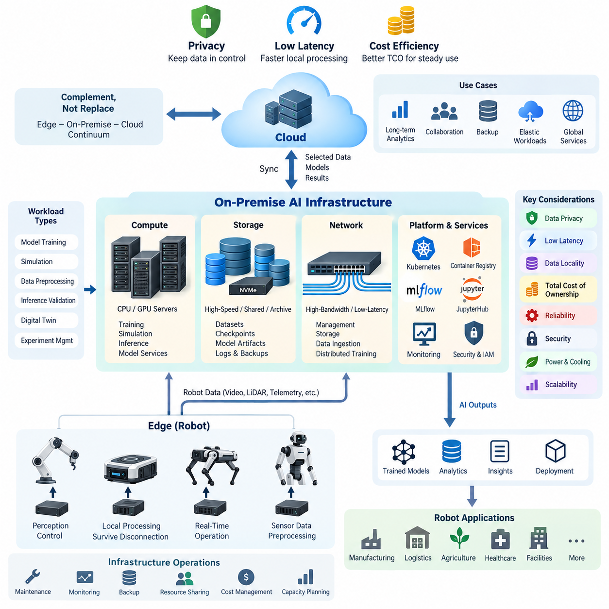
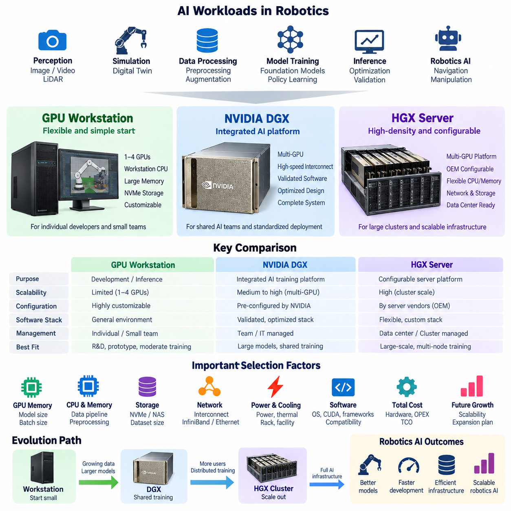
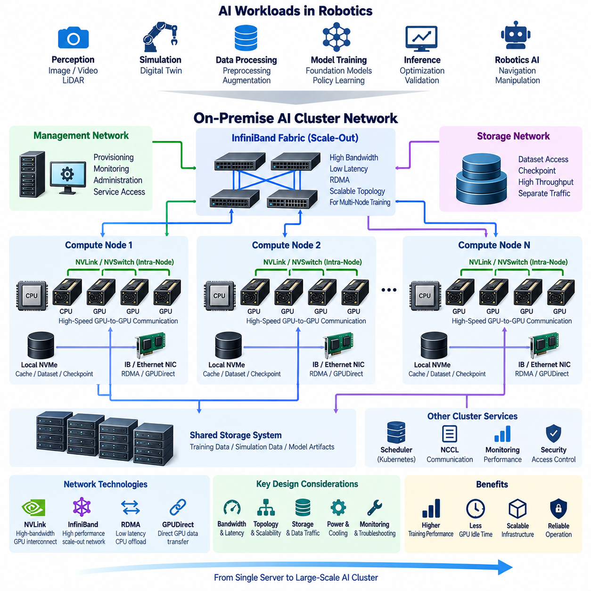
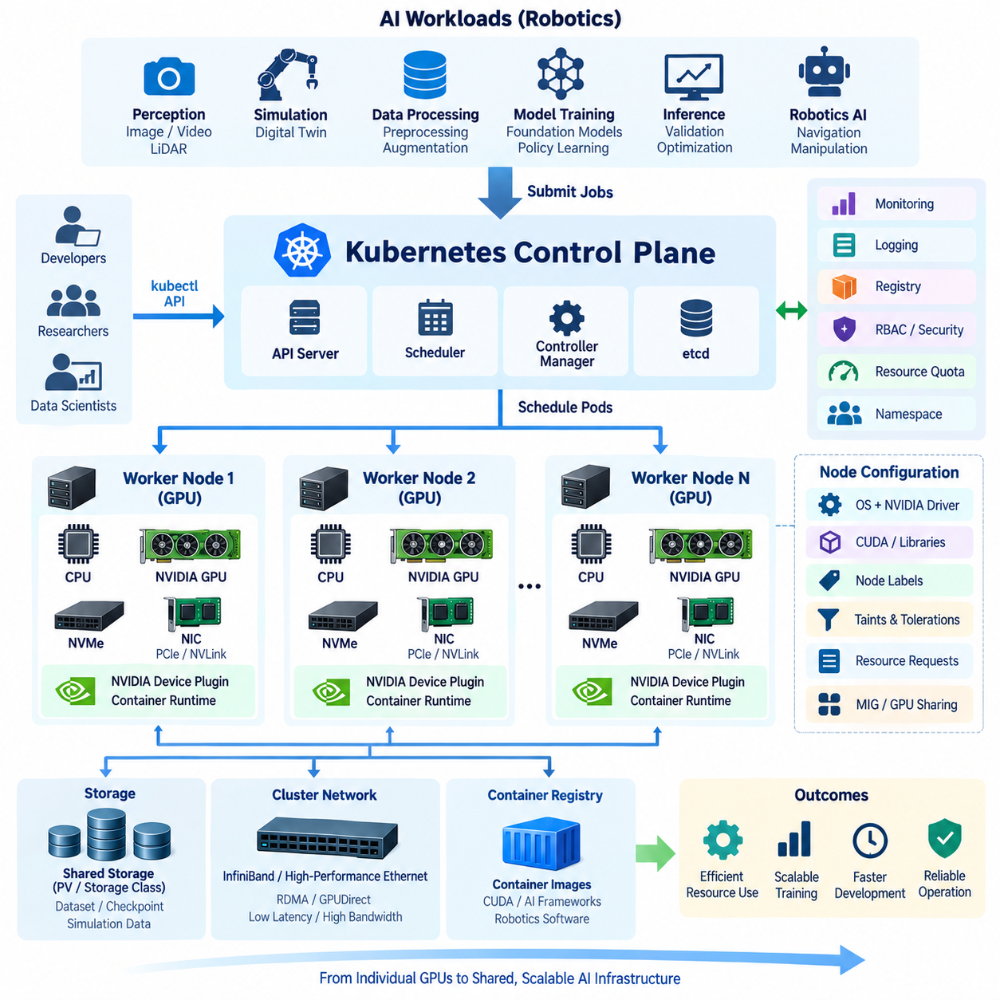
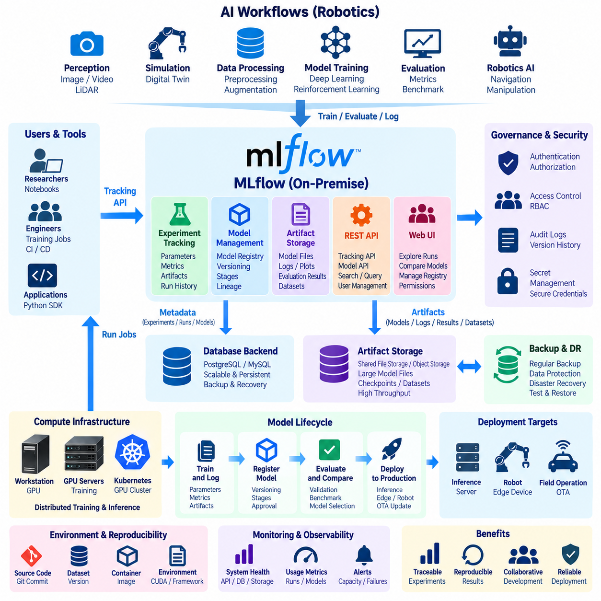
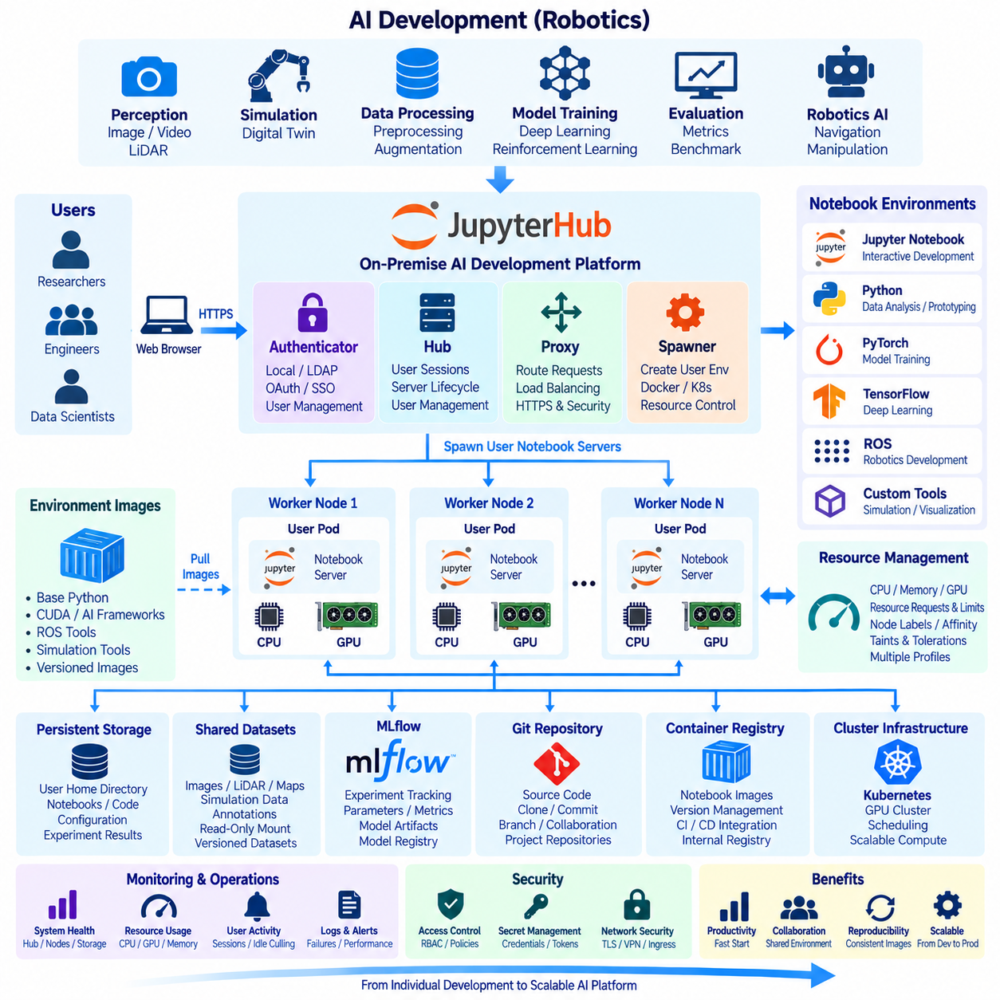
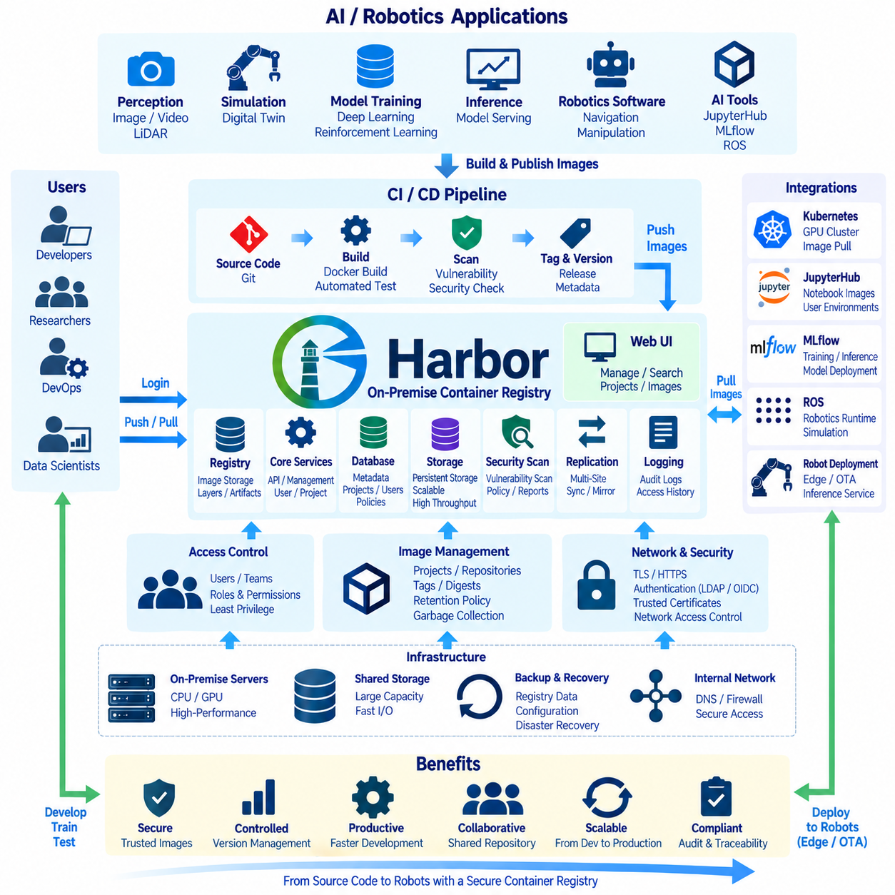
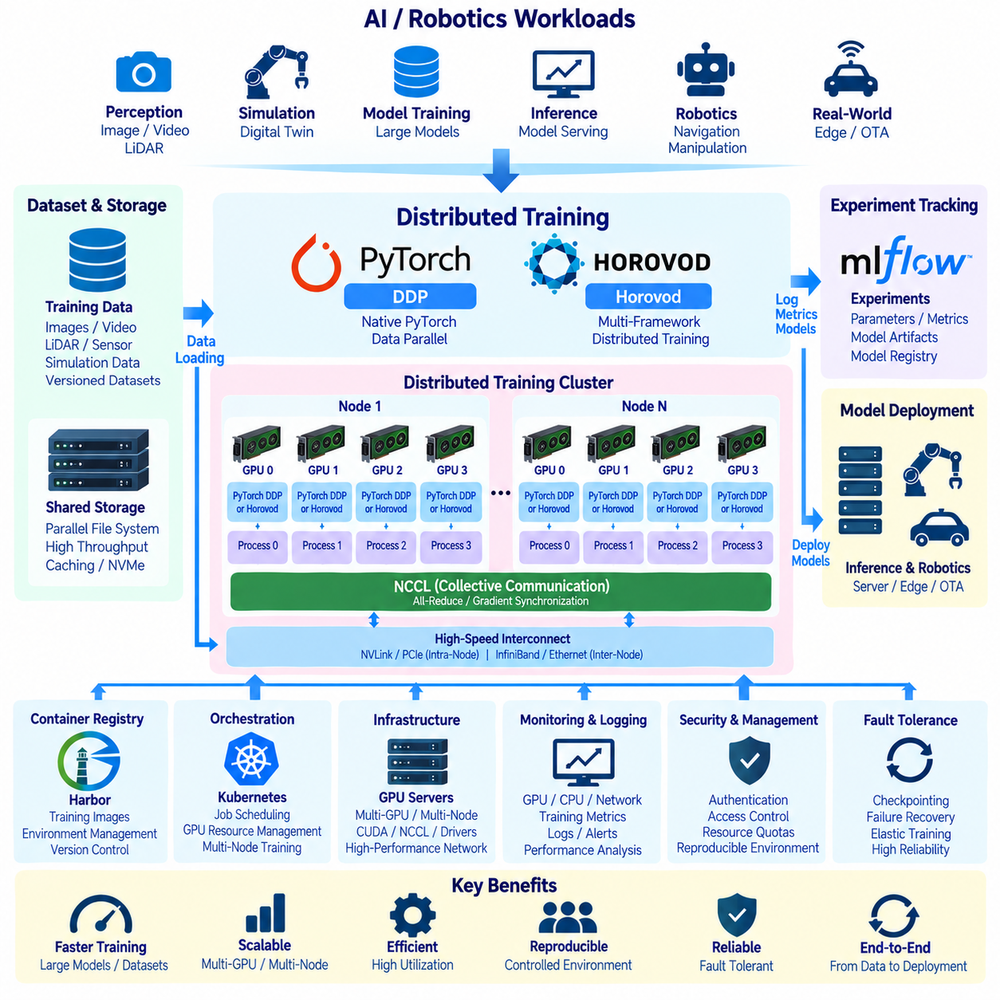
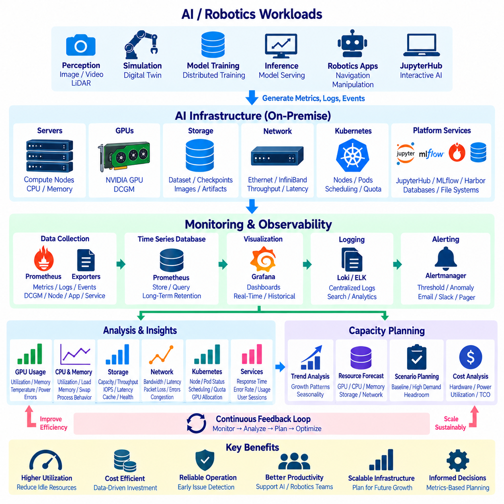
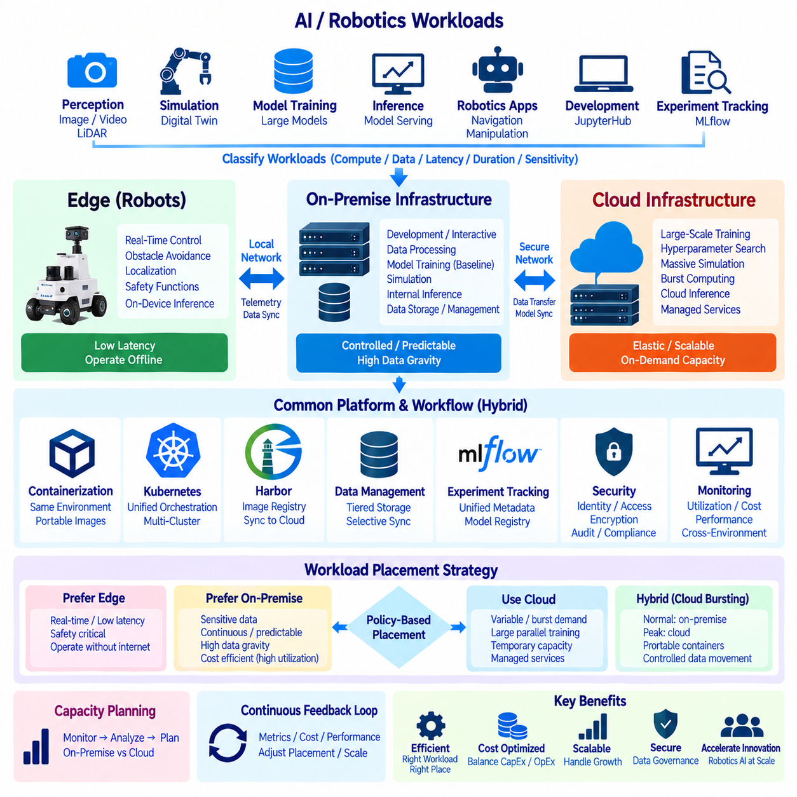

**Volume 09 Cloud and Edge Robotics**


# 06. On-Premise AI

##  

## 06.01 On-Premise AI Infrastructure Design: Privacy, Latency, Cost

{width="7.268055555555556in" height="7.268055555555556in"}

On-premise AI infrastructure places computing, storage, networking, and AI development resources inside an organization's own facilities or dedicated data center rather than relying entirely on public cloud services. In robotics, this architecture is especially valuable because training datasets may contain sensitive factory layouts, camera streams, operational records, robot trajectories, and proprietary control knowledge that organizations prefer to retain within controlled infrastructure.

The design of an on-premise AI environment should begin with workload characterization rather than hardware selection. Robot AI workloads can include model training, simulation, dataset preprocessing, inference validation, digital-twin execution, and large-scale experiment management. Each workload produces different requirements for GPU memory, CPU capacity, storage throughput, network bandwidth, and execution time, so infrastructure should be sized around measurable computational and data flows.

Privacy is one of the strongest motivations for deploying AI infrastructure on premises. Industrial robots continuously generate information about production processes, facility geometry, equipment behavior, workers, inventory, and operational performance. Keeping raw datasets within organizational boundaries reduces unnecessary external data transfer and allows security policies, access controls, retention rules, encryption, and audit procedures to be applied directly under the organization's governance framework.

Data locality also becomes important when robotics datasets grow from terabytes to petabytes. High-resolution video, LiDAR point clouds, depth images, simulation outputs, and multimodal training datasets can create substantial transfer overhead when repeatedly moved between a facility and a remote cloud. An on-premise architecture allows GPU servers to operate close to high-capacity storage, reducing dependence on wide-area network bandwidth and avoiding repeated movement of large datasets.

Latency is another major architectural consideration, although on-premise computing should not automatically be interpreted as hard real-time robot control. Safety-critical motor control and fast perception loops normally remain on robot controllers or edge computers. On-premise servers instead provide nearby computational capacity for workloads such as fleet analytics, map processing, model services, simulation, centralized perception assistance, and operational intelligence where local network latency can be advantageous.

A practical architecture therefore separates robot edge computing from centralized on-premise AI computing. Robots execute functions that must survive network interruption, while the local AI infrastructure performs computationally intensive or shared services. Cloud platforms can remain a third layer for long-term analytics, external collaboration, backup, elastic workloads, or globally distributed services. This creates an edge--on-premise--cloud continuum rather than treating the deployment choices as mutually exclusive alternatives.

Compute infrastructure usually combines CPU servers with one or more GPU systems. GPU selection should consider not only peak arithmetic performance but also GPU memory capacity, memory bandwidth, inter-GPU communication, power consumption, cooling requirements, software compatibility, and expected utilization. Small organizations may begin with GPU workstations, while larger installations can evolve toward rack-mounted multi-GPU servers and eventually clustered training infrastructure.

Storage architecture is equally important because expensive GPUs provide little value when they wait for data. Robot AI environments often require a combination of high-speed local NVMe storage for active workloads, shared storage for datasets and checkpoints, and larger-capacity storage for archives. Dataset versioning, metadata, experiment outputs, model artifacts, logs, and backup copies should be considered from the beginning because storage demand frequently grows faster than the initial compute configuration.

Network design connects these resources into a usable AI platform. Management traffic, user access, storage traffic, robot data ingestion, and distributed GPU communication can have very different performance and security requirements. Separating traffic logically or physically can improve predictability and fault isolation. As distributed training grows, network throughput and latency become increasingly important because communication between accelerators can limit scaling even when individual GPU servers are powerful.

Cost analysis for on-premise AI differs fundamentally from consumption-based cloud pricing. The organization must account for capital expenditure on servers, GPUs, storage, networking, racks, power systems, and cooling, together with operational expenses such as electricity, maintenance, administration, hardware replacement, and facility capacity. The relevant metric is therefore total cost of ownership over the expected service life rather than the purchase price of GPU hardware alone.

Cloud infrastructure has an advantage when workloads are highly variable because resources can be provisioned temporarily and released after use. On-premise infrastructure becomes economically attractive when expensive computing resources are used consistently and when large datasets remain local. However, low utilization can turn purchased accelerators into stranded capital. Capacity planning should consequently evaluate GPU utilization, queue time, storage growth, power consumption, and expected workload expansion before major investments are approved.

Cost and performance are also affected by resource sharing. A centralized GPU environment can serve multiple AI engineers, simulation jobs, training pipelines, and validation workloads rather than assigning one physical machine permanently to each developer. Containers and workload schedulers can improve repeatability and allocation efficiency, while quotas and priorities prevent individual experiments from monopolizing resources. This prepares the infrastructure for later Kubernetes or dedicated cluster scheduling architectures.

Reliability must be designed into the platform because centralized AI infrastructure can become a dependency for many engineering activities. Redundant storage, backup policies, monitoring, spare capacity, network redundancy, and recovery procedures should reflect the operational importance of each service. Training jobs may tolerate temporary interruption, whereas model repositories, authentication services, dataset catalogs, and operational robot services can require significantly stronger availability guarantees.

Security requires more than placing servers behind a corporate firewall. Administrative access should follow least-privilege principles, identities should be centrally managed, sensitive data should be encrypted, network segments should restrict unnecessary communication, and software images should be controlled and updated. Container registries, notebooks, model repositories, APIs, and GPU management interfaces all expand the attack surface and therefore need explicit authentication, authorization, logging, and vulnerability-management policies.

Power and cooling impose physical limits that are sometimes overlooked during AI infrastructure planning. Multi-GPU systems can concentrate substantial electrical and thermal loads within a small rack area. Facility design must therefore consider circuit capacity, power distribution, UPS requirements, cooling capability, airflow, rack density, and expansion margin. Installing additional accelerators without sufficient supporting infrastructure can reduce reliability or prevent the hardware from operating at sustained performance.

Scalability should be planned as an evolutionary process. An organization can begin with a single GPU workstation or server, add shared storage and centralized development services, introduce additional GPU nodes, and later adopt high-speed networking and distributed scheduling. Designing addressing, identity, storage namespaces, monitoring, and deployment standards early makes this progression easier and prevents every hardware expansion from becoming a complete infrastructure redesign.

The most effective robotics architecture ultimately assigns each workload to the environment that best satisfies its requirements. Immediate perception and control remain near the robot, sustained local AI workloads can execute on on-premise infrastructure, and elastic or geographically distributed workloads can use cloud resources. Privacy, latency, cost, availability, data volume, utilization, and operational responsibility should therefore be evaluated together rather than optimizing any single factor independently.

On-premise AI should consequently be understood as part of the broader cloud-and-edge robotics architecture rather than simply as a privately owned GPU server. It provides a controlled computational foundation connecting robot-generated data, AI development, simulation, model training, validation, and deployment. When privacy, latency, data locality, utilization, and total cost are balanced correctly, it can become the persistent intelligence infrastructure supporting increasingly capable robotic systems.

온프레미스 AI 인프라(On-Premise AI Infrastructure)는 퍼블릭 클라우드 서비스(Public Cloud Services)에 전적으로 의존하는 대신, 조직 자체 시설이나 전용 데이터센터(Dedicated Data Center) 내부에 컴퓨팅(Computing), 스토리지(Storage), 네트워킹(Networking), AI 개발 자원을 배치하는 방식이다. 로보틱스(Robotics)에서는 학습 데이터셋(Training Dataset)에 민감한 공장 배치 정보, 카메라 스트림(Camera Stream), 운영 기록, 로봇 궤적(Robot Trajectory), 독점적인 제어 지식 등이 포함될 수 있으므로, 이를 조직이 직접 통제하는 인프라 내부에 유지하는 것이 특히 중요하다.

온프레미스 AI 환경(On-Premise AI Environment)의 설계는 하드웨어 선정이 아니라 워크로드 특성 분석(Workload Characterization)에서 시작해야 한다. 로봇 AI 워크로드(Robot AI Workload)는 모델 학습(Model Training), 시뮬레이션(Simulation), 데이터셋 전처리(Dataset Preprocessing), 추론 검증(Inference Validation), 디지털 트윈 실행(Digital Twin Execution), 대규모 실험 관리 등을 포함할 수 있다. 각각의 워크로드는 GPU 메모리, CPU 용량, 스토리지 처리량(Storage Throughput), 네트워크 대역폭(Network Bandwidth), 실행 시간에 서로 다른 요구사항을 가지므로 측정 가능한 계산량과 데이터 흐름을 기준으로 인프라 용량을 설계해야 한다.

개인정보 보호 및 데이터 기밀성(Privacy)은 AI 인프라를 온프레미스로 구축하는 가장 강력한 이유 중 하나이다. 산업용 로봇(Industrial Robot)은 생산 공정, 시설 구조, 장비 동작, 작업자, 재고, 운영 성능 등에 관한 정보를 지속적으로 생성한다. 원시 데이터(Raw Data)를 조직 내부에 유지하면 불필요한 외부 데이터 전송을 줄일 수 있으며, 보안 정책(Security Policy), 접근 제어(Access Control), 데이터 보존 규칙(Retention Rule), 암호화(Encryption), 감사 절차(Audit Procedure)를 조직의 자체 거버넌스 체계(Governance Framework) 아래에서 직접 적용할 수 있다.

데이터 지역성(Data Locality)은 로보틱스 데이터셋(Robotics Dataset)이 테라바이트(Terabyte)에서 페타바이트(Petabyte) 규모로 증가할수록 더욱 중요해진다. 고해상도 영상, 라이다 포인트 클라우드(LiDAR Point Cloud), 깊이 영상(Depth Image), 시뮬레이션 결과, 멀티모달 학습 데이터셋(Multimodal Training Dataset)은 시설과 원격 클라우드 사이에서 반복적으로 이동할 경우 상당한 전송 부담을 발생시킨다. 온프레미스 아키텍처(On-Premise Architecture)는 GPU 서버를 대용량 스토리지 가까이에 배치하여 광역 네트워크(WAN) 대역폭에 대한 의존성을 줄이고 대규모 데이터의 반복적인 이동을 최소화할 수 있다.

지연시간(Latency) 역시 중요한 아키텍처 설계 요소이지만, 온프레미스 컴퓨팅(On-Premise Computing)을 반드시 하드 실시간 로봇 제어(Hard Real-Time Robot Control)와 동일하게 해석해서는 안 된다. 안전이 중요한 모터 제어와 고속 인지 루프(Perception Loop)는 일반적으로 로봇 제어기(Robot Controller) 또는 엣지 컴퓨터(Edge Computer)에 유지된다. 온프레미스 서버는 대신 플릿 분석(Fleet Analytics), 지도 처리(Map Processing), 모델 서비스(Model Service), 시뮬레이션, 중앙집중형 인지 지원(Centralized Perception Assistance), 운영 지능(Operational Intelligence)처럼 로컬 네트워크의 낮은 지연시간을 활용할 수 있는 연산 자원을 제공한다.

따라서 실용적인 아키텍처는 로봇 엣지 컴퓨팅(Robot Edge Computing)과 중앙집중형 온프레미스 AI 컴퓨팅(Centralized On-Premise AI Computing)을 분리한다. 로봇은 네트워크가 단절되어도 유지되어야 하는 기능을 자체적으로 실행하고, 로컬 AI 인프라는 계산 집약적이거나 여러 로봇이 공유하는 서비스를 수행한다. 클라우드 플랫폼(Cloud Platform)은 장기 분석, 외부 협업, 백업, 탄력적 워크로드(Elastic Workload), 글로벌 분산 서비스 등에 활용할 수 있다. 이는 각각을 상호 배타적인 선택지로 보는 대신 엣지--온프레미스--클라우드 연속체(Edge--On-Premise--Cloud Continuum)를 구성한다.

컴퓨팅 인프라(Compute Infrastructure)는 일반적으로 CPU 서버와 하나 이상의 GPU 시스템을 결합한다. GPU 선정에서는 최대 연산 성능뿐만 아니라 GPU 메모리 용량, 메모리 대역폭(Memory Bandwidth), GPU 간 통신(Inter-GPU Communication), 전력 소비, 냉각 요구사항, 소프트웨어 호환성(Software Compatibility), 예상 활용률(Utilization)을 함께 고려해야 한다. 소규모 조직은 GPU 워크스테이션(GPU Workstation)에서 시작할 수 있으며, 규모가 증가하면 랙마운트 멀티 GPU 서버(Rack-Mounted Multi-GPU Server)를 거쳐 클러스터형 학습 인프라(Clustered Training Infrastructure)로 확장할 수 있다.

스토리지 아키텍처(Storage Architecture)도 동일하게 중요하다. GPU가 데이터 입력을 기다린다면 고가의 연산 자원이 충분한 가치를 제공하지 못하기 때문이다. 로봇 AI 환경에서는 활성 워크로드를 위한 고속 로컬 NVMe 스토리지, 데이터셋과 체크포인트(Checkpoint)를 위한 공유 스토리지(Shared Storage), 장기 보존을 위한 대용량 스토리지를 조합할 수 있다. 데이터셋 버전 관리(Dataset Versioning), 메타데이터(Metadata), 실험 결과, 모델 아티팩트(Model Artifact), 로그(Log), 백업 복사본까지 초기 설계 단계부터 고려해야 한다.

네트워크 설계(Network Design)는 이러한 자원들을 하나의 활용 가능한 AI 플랫폼으로 연결한다. 관리 트래픽(Management Traffic), 사용자 접근, 스토리지 트래픽(Storage Traffic), 로봇 데이터 수집(Robot Data Ingestion), 분산 GPU 통신(Distributed GPU Communication)은 서로 다른 성능 및 보안 요구사항을 가진다. 트래픽을 논리적 또는 물리적으로 분리하면 예측 가능성과 장애 격리(Fault Isolation)를 향상시킬 수 있다. 분산 학습(Distributed Training)의 규모가 커지면 가속기 사이의 통신이 병목이 될 수 있으므로 네트워크 처리량과 지연시간의 중요성이 더욱 커진다.

온프레미스 AI의 비용 분석(Cost Analysis)은 사용량 기반 클라우드 과금(Consumption-Based Cloud Pricing)과 근본적으로 다르다. 조직은 서버, GPU, 스토리지, 네트워크 장비, 랙(Rack), 전력 시스템, 냉각 시스템에 대한 자본적 지출(Capital Expenditure)뿐만 아니라 전기료, 유지보수, 시스템 관리, 하드웨어 교체, 시설 용량 등의 운영비용(Operational Expenditure)을 함께 고려해야 한다. 따라서 중요한 평가지표는 단순한 GPU 구매 가격이 아니라 예상 사용 기간 전체에 대한 총소유비용(Total Cost of Ownership, TCO)이다.

클라우드 인프라(Cloud Infrastructure)는 워크로드 변동성이 높은 경우 필요한 자원을 일시적으로 할당하고 작업 종료 후 반환할 수 있다는 장점이 있다. 반면 온프레미스 인프라는 고가의 컴퓨팅 자원을 지속적으로 사용하고 대규모 데이터셋을 로컬에 유지해야 할 때 경제성이 높아질 수 있다. 그러나 활용률이 낮으면 구매한 가속기가 유휴 자본(Stranded Capital)이 될 수 있다. 따라서 대규모 투자 이전에 GPU 활용률, 작업 대기시간(Queue Time), 스토리지 증가율, 전력 소비량, 예상 워크로드 증가를 기반으로 용량 계획(Capacity Planning)을 수행해야 한다.

비용과 성능은 자원 공유(Resource Sharing)의 영향을 크게 받는다. 중앙집중형 GPU 환경은 각각의 개발자에게 물리적 시스템을 고정적으로 할당하는 대신 여러 AI 엔지니어, 시뮬레이션 작업, 학습 파이프라인(Training Pipeline), 검증 워크로드가 공동으로 사용할 수 있다. 컨테이너(Container)와 워크로드 스케줄러(Workload Scheduler)는 재현성과 자원 할당 효율을 향상시키며, 할당량(Quota)과 우선순위(Priority)는 특정 실험이 전체 자원을 독점하는 것을 방지한다. 이러한 구조는 향후 쿠버네티스(Kubernetes) 또는 전용 클러스터 스케줄링(Cluster Scheduling) 아키텍처로 발전하기 위한 기반이 된다.

신뢰성(Reliability)은 중앙집중형 AI 인프라가 여러 엔지니어링 활동의 공통 의존 자원이 될 수 있기 때문에 초기부터 설계되어야 한다. 이중화 스토리지(Redundant Storage), 백업 정책, 모니터링(Monitoring), 예비 용량(Spare Capacity), 네트워크 이중화(Network Redundancy), 복구 절차(Recovery Procedure)는 각 서비스의 운영 중요도에 맞게 구성해야 한다. 학습 작업은 일시적인 중단을 허용할 수 있지만, 모델 저장소(Model Repository), 인증 서비스(Authentication Service), 데이터셋 카탈로그(Dataset Catalog), 운영 로봇 서비스에는 더 높은 수준의 가용성(Availability)이 요구될 수 있다.

보안(Security)은 단순히 서버를 기업 방화벽(Corporate Firewall) 내부에 배치하는 것만으로 확보되지 않는다. 관리자 접근에는 최소 권한 원칙(Least-Privilege Principle)을 적용하고, 사용자 신원(Identity)을 중앙에서 관리하며, 민감한 데이터는 암호화해야 한다. 또한 네트워크 세그먼트(Network Segment)를 통해 불필요한 통신을 제한하고 소프트웨어 이미지를 통제하고 업데이트해야 한다. 컨테이너 레지스트리(Container Registry), 노트북 환경(Notebook Environment), 모델 저장소, API, GPU 관리 인터페이스는 모두 공격 표면(Attack Surface)을 확대하므로 명시적인 인증, 권한 부여(Authorization), 로깅(Logging), 취약점 관리(Vulnerability Management) 정책이 필요하다.

전력과 냉각(Power and Cooling)은 AI 인프라 계획 과정에서 간과하기 쉬운 물리적 한계를 형성한다. 멀티 GPU 시스템(Multi-GPU System)은 작은 랙 공간에 상당한 전력 및 열 부하를 집중시킬 수 있다. 따라서 시설 설계에서는 전기 회로 용량, 전력 분배(Power Distribution), 무정전 전원장치(UPS), 냉각 용량, 공기 흐름(Airflow), 랙 밀도(Rack Density), 향후 확장 여유를 함께 고려해야 한다. 충분한 기반 시설 없이 가속기를 추가하면 시스템 신뢰성이 저하되거나 하드웨어가 지속적인 최대 성능을 발휘하지 못할 수 있다.

확장성(Scalability)은 단계적으로 진화하는 과정으로 계획하는 것이 바람직하다. 조직은 단일 GPU 워크스테이션 또는 GPU 서버에서 시작하여 공유 스토리지와 중앙집중형 개발 서비스를 추가하고, 이후 GPU 노드를 확장하면서 고속 네트워크와 분산 스케줄링(Distributed Scheduling)을 도입할 수 있다. 초기부터 네트워크 주소 체계, 사용자 신원 관리, 스토리지 네임스페이스(Storage Namespace), 모니터링, 배포 표준(Deployment Standard)을 체계적으로 설계하면 하드웨어를 확장할 때마다 전체 인프라를 다시 설계해야 하는 문제를 줄일 수 있다.

궁극적으로 가장 효과적인 로보틱스 아키텍처(Robotics Architecture)는 각 워크로드를 해당 요구사항을 가장 적절하게 충족하는 실행 환경에 배치한다. 즉각적인 인지와 제어는 로봇 가까이에 유지하고, 지속적으로 발생하는 로컬 AI 워크로드는 온프레미스 인프라에서 실행하며, 탄력적인 확장이 필요하거나 지리적으로 분산된 워크로드는 클라우드 자원을 활용할 수 있다. 따라서 개인정보 보호, 지연시간, 비용, 가용성, 데이터 규모, 자원 활용률, 운영 책임을 함께 평가해야 하며 특정 요소 하나만 독립적으로 최적화해서는 안 된다.

따라서 온프레미스 AI(On-Premise AI)는 단순히 조직이 소유한 GPU 서버가 아니라 더 광범위한 클라우드 및 엣지 로보틱스 아키텍처(Cloud and Edge Robotics Architecture)의 일부로 이해해야 한다. 이는 로봇이 생성하는 데이터와 AI 개발, 시뮬레이션, 모델 학습, 검증, 배포를 연결하는 통제 가능한 컴퓨팅 기반을 제공한다. 개인정보 보호, 지연시간, 데이터 지역성, 자원 활용률, 총소유비용을 적절하게 균형화하면 온프레미스 AI는 점점 더 지능화되는 로봇 시스템을 지원하는 지속적인 지능 인프라(Intelligence Infrastructure)로 발전할 수 있다.

##  

## 06.02 GPU Server Selection: NVIDIA DGX, HGX, Workstation

{width="7.268055555555556in" height="7.268055555555556in"}

Selecting a GPU server for on-premise AI requires matching the computing platform to workload scale, model size, dataset volume, concurrency, and expected growth. NVIDIA DGX systems, HGX-based servers, and professional GPU workstations represent different infrastructure classes rather than simply different performance levels. The correct choice depends on whether the system serves an individual developer, a shared AI team, or a large distributed training environment.

A GPU workstation is generally the simplest entry point for robotics AI development. It combines one or several professional or data-center-class GPUs with conventional workstation CPUs, system memory, and local NVMe storage. This configuration is suitable for model development, inference optimization, dataset preprocessing, simulation, visualization, and moderate training workloads where engineers benefit from direct access to dedicated computing resources.

Workstations provide flexibility because GPU, memory, storage, and peripheral configurations can often be customized around specific engineering requirements. Robotics developers may need high-capacity NVMe drives for sensor datasets, large system memory for point-cloud processing, or additional PCIe devices for networking and data acquisition. However, workstation scalability is constrained by chassis space, PCIe topology, power delivery, cooling capacity, and the number of GPUs that can operate efficiently within one system.

NVIDIA DGX represents a more integrated approach to AI infrastructure. Rather than treating GPUs as independent accelerator cards installed in a general-purpose server, DGX systems are engineered as complete AI computing platforms in which GPUs, CPUs, high-speed interconnects, networking, storage interfaces, system software, power, and cooling are designed together. This reduces the integration effort required when deploying large multi-GPU AI workloads.

A major advantage of the DGX architecture is its emphasis on high-bandwidth communication between GPUs. Modern AI training increasingly involves models or batches that cannot be processed efficiently on a single accelerator. High-speed GPU interconnect technologies allow multiple GPUs to cooperate with substantially lower communication overhead than architectures that depend entirely on conventional PCIe transfers. This becomes important for distributed deep learning, foundation models, multimodal models, and large robotics policy training.

DGX systems also provide a standardized software environment around the hardware platform. NVIDIA\'s AI software ecosystem, GPU drivers, CUDA libraries, communication libraries, containerized frameworks, monitoring components, and validated configurations can reduce compatibility problems. For organizations that value predictable deployment and vendor-supported integration, this standardization can be more important than the cost difference between a DGX platform and a custom-built GPU server.

HGX occupies a different position because it is primarily a server platform architecture used by system manufacturers to build high-density GPU servers. An HGX platform integrates multiple data-center GPUs through high-speed GPU interconnect technologies and provides the foundation upon which OEM and server vendors add CPUs, memory, storage, networking, chassis design, cooling, management controllers, and other infrastructure components.

This distinction is important when comparing DGX and HGX. DGX is delivered as an NVIDIA-designed integrated AI system, whereas HGX enables server manufacturers and infrastructure providers to create systems around NVIDIA\'s multi-GPU computing platform. An organization selecting HGX-based servers can therefore obtain greater flexibility in server vendor, CPU configuration, storage architecture, network interfaces, rack integration, support contracts, and data-center deployment strategy.

HGX-based servers become particularly attractive when AI infrastructure is being designed as part of a larger cluster. In this environment, individual servers are nodes within a distributed computing system rather than isolated machines. High-speed Ethernet or InfiniBand networking, shared storage, workload schedulers, container orchestration, monitoring, authentication, and cluster management become as important as the GPU specification of each node.

The selection process should therefore begin with GPU memory requirements. Robotics AI models increasingly combine camera images, video, LiDAR, language, actions, maps, and simulation states, which can consume substantial accelerator memory. Training also requires memory for model parameters, gradients, optimizer states, activations, and temporary tensors. If workloads regularly exceed the capacity of a single GPU, multi-GPU communication and memory-distribution strategies become fundamental architectural requirements.

GPU quantity alone is not a reliable indicator of training performance. Two systems containing the same number of accelerators can behave differently because of GPU topology, PCIe bandwidth, GPU-to-GPU interconnects, CPU architecture, system memory, storage throughput, and network configuration. Server selection should therefore evaluate the complete data path from storage to CPU memory, GPU memory, neighboring GPUs, and other cluster nodes rather than comparing only theoretical GPU compute performance.

CPU and system memory must also be sized for the AI pipeline surrounding the GPUs. Image decoding, point-cloud transformation, simulation, data augmentation, dataset indexing, compression, and preprocessing can create substantial CPU workloads. Insufficient CPU resources can leave expensive GPUs underutilized. Similarly, inadequate system memory may limit large datasets, simulation environments, caching strategies, or parallel data-loader processes before GPU capacity becomes the actual bottleneck.

Local storage should support the active working set of AI experiments. High-speed NVMe storage can accelerate dataset caching, checkpoint operations, container loading, preprocessing, and repeated training iterations. Larger datasets can remain on shared NAS or high-performance cluster storage, while frequently accessed subsets are staged locally. The server architecture should provide enough PCIe connectivity to support GPUs, NVMe devices, and high-speed network adapters without creating hidden bandwidth bottlenecks.

Power and cooling requirements become progressively more significant when moving from workstations toward DGX or HGX-class systems. Dense multi-GPU servers can require substantial electrical capacity and generate concentrated thermal loads. Rack power distribution, UPS design, cooling capacity, airflow, equipment weight, acoustic constraints, and facility expansion should therefore be evaluated before procurement rather than after the servers arrive.

Software compatibility is another selection criterion. The server must support the operating system, GPU driver, CUDA environment, container runtime, AI frameworks, distributed training libraries, simulation software, and orchestration platform required by the organization. Standardizing these components across development workstations and shared servers simplifies model migration because experiments can move from individual development systems to larger infrastructure with fewer environmental differences.

Operational responsibility differs among the three approaches. Workstations can usually be managed directly by individual engineers or small teams. DGX systems provide a more standardized platform but still require infrastructure management for networking, storage, accounts, monitoring, backup, and scheduling. HGX-based clusters demand broader data-center and cluster engineering capabilities because hardware integration, node configuration, fabric design, resource scheduling, and lifecycle management become organization-level responsibilities.

Cost comparison should consequently use total cost of ownership rather than accelerator purchase price alone. Workstations may offer an economical starting point but become difficult to manage when many independent systems accumulate. DGX can reduce integration risk and engineering effort through standardization, while HGX-based systems can provide greater architectural flexibility for large deployments. Power, cooling, networking, storage, support, administrator effort, and utilization must all be included in the economic analysis.

For robotics organizations, these platforms can also form an evolutionary infrastructure path. Individual GPU workstations can support early perception, navigation, simulation, and Physical AI experiments. As datasets and models expand, centralized multi-GPU servers can provide shared training capacity. When workloads require many concurrent users or distributed training across multiple nodes, DGX or HGX-class infrastructure can become the foundation of a dedicated GPU cluster.

The final selection should therefore be based on workload architecture rather than product prestige. A workstation is appropriate when flexibility, local development, and moderate GPU scale dominate. DGX is suitable when an integrated and standardized multi-GPU AI platform is important, while HGX-based servers are especially relevant when organizations require configurable high-density GPU nodes within larger data-center or cluster architectures. These platforms can coexist as complementary layers of the same on-premise AI environment.

GPU 서버(GPU Server)를 온프레미스 AI(On-Premise AI) 환경에 선정하려면 컴퓨팅 플랫폼을 워크로드 규모, 모델 크기, 데이터셋 용량, 동시 작업 수, 향후 확장 요구사항에 맞추어야 한다. NVIDIA DGX 시스템, HGX 기반 서버(HGX-Based Server), 전문 GPU 워크스테이션(GPU Workstation)은 단순히 성능 수준만 다른 제품이 아니라 서로 다른 인프라 계층을 의미한다. 적절한 선택은 시스템이 개인 개발자, 공유 AI 팀, 대규모 분산 학습 환경 중 어디에 사용되는지에 따라 달라진다.

GPU 워크스테이션(GPU Workstation)은 일반적으로 로보틱스 AI(Robotics AI) 개발을 시작하기 위한 가장 단순한 방식이다. 하나 또는 여러 개의 전문 GPU나 데이터센터급 GPU를 일반적인 워크스테이션 CPU, 시스템 메모리, 로컬 NVMe 스토리지와 결합한다. 이러한 구성은 모델 개발, 추론 최적화(Inference Optimization), 데이터셋 전처리, 시뮬레이션, 시각화, 중간 규모 학습 등에 적합하며 엔지니어가 전용 컴퓨팅 자원에 직접 접근할 수 있다는 장점이 있다.

워크스테이션은 GPU, 메모리, 스토리지, 주변장치 구성을 특정 엔지니어링 요구사항에 맞게 조정할 수 있어 높은 유연성(Flexibility)을 제공한다. 로보틱스 개발자는 센서 데이터셋을 위한 대용량 NVMe 드라이브, 포인트 클라우드(Point Cloud) 처리를 위한 대용량 시스템 메모리, 네트워킹 및 데이터 수집을 위한 추가 PCIe 장치를 필요로 할 수 있다. 그러나 워크스테이션의 확장성은 섀시 공간, PCIe 토폴로지(PCIe Topology), 전력 공급, 냉각 용량, 효율적으로 운용할 수 있는 GPU 수에 의해 제한된다.

NVIDIA DGX는 AI 인프라에 대해 보다 통합적인 접근 방식을 제공한다. GPU를 범용 서버에 설치되는 독립적인 가속기 카드로 취급하는 대신, DGX 시스템은 GPU, CPU, 고속 인터커넥트(High-Speed Interconnect), 네트워킹, 스토리지 인터페이스, 시스템 소프트웨어, 전력, 냉각을 하나의 AI 컴퓨팅 플랫폼으로 통합하여 설계한다. 이를 통해 대규모 멀티 GPU AI 워크로드를 구축할 때 필요한 시스템 통합 부담을 줄일 수 있다.

DGX 아키텍처의 주요 장점 중 하나는 GPU 사이의 고대역폭 통신(High-Bandwidth Communication)을 중요하게 고려한다는 것이다. 현대 AI 학습에서는 하나의 가속기만으로 효율적으로 처리하기 어려운 모델이나 배치(Batch)가 점점 증가하고 있다. 고속 GPU 인터커넥트 기술은 기존 PCIe 전송에 전적으로 의존하는 구조보다 낮은 통신 오버헤드로 여러 GPU가 협력할 수 있도록 한다. 이는 분산 딥러닝(Distributed Deep Learning), 파운데이션 모델(Foundation Model), 멀티모달 모델(Multimodal Model), 대규모 로봇 정책 학습(Robot Policy Training)에서 중요하다.

DGX 시스템은 하드웨어 플랫폼뿐만 아니라 표준화된 소프트웨어 환경(Standardized Software Environment)도 제공한다. NVIDIA의 AI 소프트웨어 생태계, GPU 드라이버, CUDA 라이브러리, 통신 라이브러리, 컨테이너 기반 프레임워크(Containerized Framework), 모니터링 구성요소, 검증된 시스템 구성을 활용하면 호환성 문제를 줄일 수 있다. 예측 가능한 배포와 제조사 지원 통합 환경을 중요하게 생각하는 조직에서는 이러한 표준화가 DGX와 사용자 구성 GPU 서버 사이의 가격 차이보다 더 중요한 요소가 될 수 있다.

HGX는 시스템 제조사가 고밀도 GPU 서버(High-Density GPU Server)를 구축하는 데 사용하는 서버 플랫폼 아키텍처(Server Platform Architecture)라는 점에서 다른 위치를 차지한다. HGX 플랫폼은 여러 데이터센터 GPU를 고속 GPU 인터커넥트 기술로 통합하며, 이를 기반으로 OEM 및 서버 제조사가 CPU, 메모리, 스토리지, 네트워크, 섀시 설계, 냉각, 관리 컨트롤러(Management Controller) 등의 인프라 구성요소를 추가한다.

이러한 차이는 DGX와 HGX를 비교할 때 중요하다. DGX는 NVIDIA가 설계한 통합 AI 시스템(Integrated AI System)으로 제공되는 반면, HGX는 서버 제조사와 인프라 공급업체가 NVIDIA의 멀티 GPU 컴퓨팅 플랫폼을 기반으로 자체 시스템을 구성할 수 있게 한다. 따라서 HGX 기반 서버를 선택하는 조직은 서버 제조사, CPU 구성, 스토리지 아키텍처, 네트워크 인터페이스, 랙 통합(Rack Integration), 지원 계약, 데이터센터 구축 전략 등에 대해 더 높은 유연성을 확보할 수 있다.

HGX 기반 서버는 AI 인프라가 더 큰 클러스터(Cluster)의 일부로 설계될 때 특히 유용하다. 이러한 환경에서 각각의 서버는 독립된 장비가 아니라 분산 컴퓨팅 시스템(Distributed Computing System)의 노드(Node)로 동작한다. 따라서 고속 이더넷(High-Speed Ethernet) 또는 인피니밴드(InfiniBand), 공유 스토리지, 워크로드 스케줄러(Workload Scheduler), 컨테이너 오케스트레이션(Container Orchestration), 모니터링, 인증, 클러스터 관리가 개별 노드의 GPU 사양만큼 중요해진다.

따라서 시스템 선정 과정은 GPU 메모리 요구사항(GPU Memory Requirement)을 분석하는 것에서 시작해야 한다. 로보틱스 AI 모델은 카메라 영상, 비디오, 라이다(LiDAR), 언어, 행동(Action), 지도, 시뮬레이션 상태 등을 결합하는 방향으로 발전하고 있으며 이는 상당한 가속기 메모리를 요구할 수 있다. 학습 과정에서도 모델 파라미터, 그래디언트(Gradient), 옵티마이저 상태(Optimizer State), 활성값(Activation), 임시 텐서를 위한 메모리가 필요하다. 워크로드가 단일 GPU 용량을 지속적으로 초과한다면 멀티 GPU 통신과 메모리 분산 전략이 핵심적인 아키텍처 요구사항이 된다.

GPU 개수만으로 학습 성능을 판단하는 것은 적절하지 않다. 동일한 수의 가속기를 탑재한 두 시스템도 GPU 토폴로지, PCIe 대역폭, GPU 간 인터커넥트, CPU 아키텍처, 시스템 메모리, 스토리지 처리량, 네트워크 구성에 따라 서로 다른 성능을 보일 수 있다. 따라서 서버 선정에서는 이론적인 GPU 연산 성능만 비교하는 것이 아니라 스토리지에서 CPU 메모리, GPU 메모리, 인접 GPU, 다른 클러스터 노드까지 이어지는 전체 데이터 경로(Data Path)를 평가해야 한다.

CPU와 시스템 메모리 역시 GPU 주변에서 실행되는 AI 파이프라인(AI Pipeline)에 맞게 구성해야 한다. 이미지 디코딩(Image Decoding), 포인트 클라우드 변환, 시뮬레이션, 데이터 증강(Data Augmentation), 데이터셋 인덱싱, 압축, 전처리는 상당한 CPU 워크로드를 발생시킬 수 있다. CPU 자원이 부족하면 고가의 GPU가 충분히 활용되지 못할 수 있다. 마찬가지로 시스템 메모리가 부족하면 GPU 용량이 실제 병목이 되기 전에 대규모 데이터셋, 시뮬레이션 환경, 캐싱 전략, 병렬 데이터 로더(Data Loader)가 제한될 수 있다.

로컬 스토리지(Local Storage)는 AI 실험에서 현재 사용되는 활성 작업 데이터(Active Working Set)를 충분히 지원해야 한다. 고속 NVMe 스토리지는 데이터셋 캐싱, 체크포인트 작업, 컨테이너 로딩, 전처리, 반복 학습을 가속할 수 있다. 더 큰 데이터셋은 공유 NAS 또는 고성능 클러스터 스토리지에 유지하고 자주 사용하는 데이터만 로컬로 스테이징(Staging)할 수 있다. 또한 서버 아키텍처는 GPU, NVMe 장치, 고속 네트워크 어댑터를 동시에 지원하면서 숨겨진 대역폭 병목이 발생하지 않도록 충분한 PCIe 연결성을 제공해야 한다.

워크스테이션에서 DGX 또는 HGX급 시스템으로 이동할수록 전력과 냉각(Power and Cooling)의 중요성은 크게 증가한다. 고밀도 멀티 GPU 서버는 상당한 전력을 필요로 하며 좁은 공간에 높은 열 부하를 집중시킬 수 있다. 따라서 서버를 구매하기 전에 랙 전력 분배, 무정전 전원장치(UPS), 냉각 용량, 공기 흐름(Airflow), 장비 중량, 소음 제약, 시설 확장 가능성을 함께 평가해야 한다.

소프트웨어 호환성(Software Compatibility)도 중요한 선정 기준이다. 서버는 조직에서 사용하는 운영체제, GPU 드라이버, CUDA 환경, 컨테이너 런타임(Container Runtime), AI 프레임워크, 분산 학습 라이브러리, 시뮬레이션 소프트웨어, 오케스트레이션 플랫폼(Orchestration Platform)을 지원해야 한다. 개발 워크스테이션과 공유 서버에서 이러한 구성요소를 표준화하면 개별 개발 환경에서 수행한 실험을 더 큰 인프라로 이전할 때 환경 차이로 발생하는 문제를 줄일 수 있다.

세 가지 접근 방식은 운영 책임(Operational Responsibility)에서도 차이가 있다. 워크스테이션은 일반적으로 개별 엔지니어나 소규모 팀이 직접 관리할 수 있다. DGX 시스템은 보다 표준화된 플랫폼을 제공하지만 네트워크, 스토리지, 계정, 모니터링, 백업, 스케줄링 등을 위한 인프라 관리는 여전히 필요하다. HGX 기반 클러스터는 하드웨어 통합, 노드 구성, 패브릭 설계(Fabric Design), 자원 스케줄링, 수명주기 관리(Lifecycle Management)가 조직 차원의 업무가 되므로 보다 폭넓은 데이터센터 및 클러스터 엔지니어링 역량을 요구한다.

따라서 비용 비교에서는 가속기의 구매 가격만이 아니라 총소유비용(Total Cost of Ownership, TCO)을 사용해야 한다. 워크스테이션은 경제적인 시작점이 될 수 있지만 독립적인 시스템의 수가 증가하면 관리가 어려워질 수 있다. DGX는 표준화를 통해 통합 위험과 엔지니어링 부담을 줄일 수 있으며, HGX 기반 시스템은 대규모 구축에서 더 높은 아키텍처 유연성을 제공할 수 있다. 전력, 냉각, 네트워크, 스토리지, 기술지원, 관리자 투입 시간, 자원 활용률을 모두 경제성 분석에 포함해야 한다.

로보틱스 조직에서는 이러한 플랫폼을 단계적으로 발전하는 인프라 경로(Evolutionary Infrastructure Path)로 구성할 수도 있다. 개별 GPU 워크스테이션은 초기 인지(Perception), 내비게이션(Navigation), 시뮬레이션, 피지컬 AI(Physical AI) 실험을 지원할 수 있다. 데이터셋과 모델 규모가 증가하면 중앙집중형 멀티 GPU 서버가 공유 학습 자원을 제공할 수 있다. 이후 다수의 동시 사용자 또는 여러 노드에 걸친 분산 학습이 필요해지면 DGX 또는 HGX급 인프라가 전용 GPU 클러스터의 기반으로 발전할 수 있다.

최종적인 시스템 선정은 제품의 명성이나 등급이 아니라 워크로드 아키텍처(Workload Architecture)를 기준으로 이루어져야 한다. 유연성, 로컬 개발, 중간 규모 GPU 사용이 중요하다면 워크스테이션이 적합하다. 통합되고 표준화된 멀티 GPU AI 플랫폼이 중요하다면 DGX가 적합하며, 대규모 데이터센터 또는 클러스터 아키텍처 내부에서 구성 가능한 고밀도 GPU 노드가 필요하다면 HGX 기반 서버가 중요한 선택지가 된다. 이러한 플랫폼들은 서로 배타적인 대안이 아니라 하나의 온프레미스 AI 환경을 구성하는 상호 보완적인 계층으로 함께 활용될 수 있다.

##  

## 06.03 On-Premise AI Cluster Network: InfiniBand / NVLink

{width="7.268055555555556in" height="7.268055555555556in"}

An on-premise AI cluster network must move data efficiently between GPUs, compute nodes, storage systems, and management services. As AI workloads expand from a single server to distributed training across multiple machines, network communication can become as important as GPU performance itself. InfiniBand and NVLink address different parts of this communication hierarchy and should be understood as complementary technologies rather than direct substitutes.

Distributed AI training repeatedly exchanges gradients, parameters, activations, and synchronization messages among accelerators. If communication cannot keep pace with GPU computation, accelerators spend increasing amounts of time waiting for data instead of executing useful operations. Network architecture must therefore be designed according to model size, communication pattern, number of GPUs, node count, storage traffic, and expected cluster expansion.

NVLink is a high-speed interconnect technology designed primarily for direct communication between NVIDIA GPUs and, in supported architectures, other tightly coupled processors. Compared with communication paths that rely only on conventional PCIe, NVLink can provide higher bandwidth for supported GPU-to-GPU transfers. This allows accelerators inside a multi-GPU system to exchange data more efficiently during parallel AI computation.

Within a server, GPU topology strongly influences performance. GPUs connected through high-bandwidth interconnects can communicate differently from devices whose traffic must traverse PCIe switches or CPU-controlled paths. Distributed training software should therefore understand the physical topology of the machine. Scheduling processes without considering GPU connectivity can produce inconsistent performance even when the same number and type of accelerators are allocated.

NVSwitch extends high-bandwidth GPU connectivity by providing switching infrastructure among multiple GPUs within supported systems. Instead of relying only on individual point-to-point connections, an NVSwitch-based architecture can provide more flexible communication paths across a dense group of accelerators. This is particularly valuable for large models that distribute computation or model state across several GPUs inside one server.

InfiniBand operates at another level of the cluster architecture. It provides high-performance networking for communication between servers, storage systems, and other cluster resources. Its combination of high bandwidth, low latency, and remote direct memory access capabilities makes it widely applicable to high-performance computing and distributed AI environments where many compute nodes must exchange data continuously.

Remote Direct Memory Access, or RDMA, reduces communication overhead by allowing data transfers to occur with less involvement from host CPUs and conventional operating-system networking paths. For distributed AI workloads, this can reduce latency and CPU consumption while increasing effective communication throughput. RDMA becomes increasingly valuable as collective communication operations span larger numbers of accelerators and servers.

GPUDirect RDMA further optimizes the data path by enabling supported network adapters and GPUs to exchange data without requiring every transfer to be staged through conventional host-memory paths. This reduces unnecessary copies and helps distributed training frameworks communicate GPU-resident data efficiently between nodes. The resulting benefit depends on compatible GPUs, network adapters, drivers, topology, and software configuration.

NCCL, the NVIDIA Collective Communications Library, provides communication primitives commonly used by distributed deep-learning frameworks. Operations such as all-reduce, all-gather, reduce-scatter, and broadcast are fundamental to data parallelism and other distributed training strategies. NCCL can select communication paths according to available GPU interconnects and network interfaces, making physical topology an important component of software-level performance.

A multi-node AI cluster therefore contains several communication layers. Inside an accelerator node, GPUs may communicate through NVLink and NVSwitch where supported, while PCIe continues to connect GPUs, CPUs, storage devices, and network adapters. Between nodes, InfiniBand or high-performance Ethernet transports distributed workloads. The overall training performance depends on how effectively these layers operate together rather than on any single interconnect technology.

High-performance Ethernet remains an important alternative to InfiniBand. Modern Ethernet networks can support RDMA technologies and integrate well with existing data-center infrastructure, operational tools, and networking expertise. Organizations should therefore avoid selecting InfiniBand solely because it is associated with high-performance AI. Existing infrastructure, cluster scale, target workload, operational capability, cost, and required performance should determine the network technology.

Network topology becomes increasingly important as clusters expand. A poorly designed switching hierarchy can create oversubscription, congestion, and uneven communication performance between nodes. Distributed training frequently generates synchronized traffic patterns in which many GPUs communicate simultaneously. Switch capacity, uplink bandwidth, path diversity, and oversubscription ratios should therefore be evaluated against expected collective communication behavior.

Storage traffic must also be considered separately from GPU synchronization traffic. Large robotics datasets can contain video, LiDAR point clouds, depth images, simulation outputs, maps, and multimodal training samples. Hundreds of workers reading these datasets simultaneously can generate substantial network load. Storage access competing with distributed training communication on the same constrained links can reduce GPU utilization and increase training time.

For this reason, cluster designs often separate management, storage, and high-performance compute traffic logically or physically. Management networks handle provisioning, monitoring, administration, and service access. Storage networks carry datasets and checkpoints, while the high-performance fabric supports latency-sensitive distributed computation. Separation improves traffic predictability, troubleshooting, security segmentation, and capacity planning even when some infrastructure is shared.

Latency and bandwidth must be evaluated together. Large sequential transfers benefit strongly from bandwidth, while synchronization-heavy workloads can also be sensitive to message latency. A network with impressive theoretical throughput may still perform poorly if topology, congestion, protocol overhead, or software configuration increases effective communication delay. Benchmarking should therefore reproduce actual AI communication patterns rather than relying only on interface specifications.

Cluster networking also requires careful physical infrastructure planning. High-speed network adapters and switches consume PCIe resources, electrical power, rack space, and cooling capacity. Cable type, cable length, transceiver selection, switch placement, redundant paths, and rack layout can influence both reliability and cost. Network design should consequently be coordinated with server, storage, power, and cooling architecture before hardware procurement.

Monitoring is essential because communication bottlenecks may appear as apparent GPU performance problems. GPU utilization, network throughput, packet errors, link state, retransmissions, congestion indicators, storage throughput, and collective communication performance should be observed together. Baseline measurements collected when the cluster is healthy make it easier to identify whether later degradation originates from GPUs, software, storage, or the network fabric.

Scalability should be designed before the first expansion. A small cluster may operate effectively with a simple switching configuration, but adding many GPU nodes can change bandwidth requirements and traffic patterns dramatically. Switch port availability, uplink capacity, addressing, fabric management, rack placement, and storage connectivity should include expansion margins so that growth does not require replacing the entire network architecture.

For robotics AI, the cluster network connects workloads such as perception training, simulation, world models, reinforcement learning, multimodal foundation models, and large-scale dataset processing. These workloads can differ substantially in communication intensity. Simulation may require large numbers of independent GPU tasks, whereas distributed foundation-model training can demand continuous accelerator synchronization. Network requirements should therefore be derived from workload behavior rather than GPU count alone.

The resulting architecture can be viewed as a communication hierarchy: high-speed GPU interconnects provide tightly coupled communication inside supported servers, PCIe integrates major local devices, and InfiniBand or high-performance Ethernet connects compute nodes and shared infrastructure across the cluster. RDMA, GPUDirect technologies, and communication libraries such as NCCL optimize movement across these layers.

A well-designed on-premise AI cluster network ultimately minimizes the time expensive accelerators spend waiting for communication. NVLink and NVSwitch strengthen intra-node GPU communication, while InfiniBand and comparable high-performance network technologies enable efficient scale-out across servers. When topology, RDMA, storage access, software libraries, monitoring, and future expansion are designed together, the network becomes an integral part of AI computing performance rather than a secondary infrastructure component.

온프레미스 AI 클러스터 네트워크(On-Premise AI Cluster Network)는 GPU, 컴퓨팅 노드(Compute Node), 스토리지 시스템(Storage System), 관리 서비스(Management Service) 사이에서 데이터를 효율적으로 이동시킬 수 있어야 한다. AI 워크로드가 단일 서버에서 여러 시스템을 사용하는 분산 학습(Distributed Training)으로 확장되면 네트워크 통신 성능은 GPU 자체의 성능만큼 중요해질 수 있다. 인피니밴드(InfiniBand)와 NVLink는 서로 다른 통신 계층을 담당하므로 직접적인 대체 기술이 아니라 상호 보완적인 기술로 이해해야 한다.

분산 AI 학습(Distributed AI Training)에서는 가속기 사이에서 그래디언트(Gradient), 파라미터(Parameter), 활성값(Activation), 동기화 메시지(Synchronization Message)를 반복적으로 교환한다. 통신 속도가 GPU 연산 속도를 따라가지 못하면 가속기는 실제 연산을 수행하는 대신 데이터를 기다리는 시간이 증가한다. 따라서 네트워크 아키텍처는 모델 크기, 통신 패턴, GPU 수, 노드 수, 스토리지 트래픽(Storage Traffic), 예상 클러스터 확장 규모를 기준으로 설계해야 한다.

NVLink는 주로 NVIDIA GPU 사이의 직접 통신과 지원되는 아키텍처에서 긴밀하게 결합된 다른 프로세서와의 통신을 위해 설계된 고속 인터커넥트(High-Speed Interconnect) 기술이다. 기존 PCIe만을 사용하는 통신 경로와 비교하면 NVLink는 지원되는 GPU 간 데이터 전송에서 더 높은 대역폭을 제공할 수 있다. 이를 통해 멀티 GPU 시스템 내부에서 병렬 AI 연산을 수행할 때 가속기들이 데이터를 더욱 효율적으로 교환할 수 있다.

하나의 서버 내부에서는 GPU 토폴로지(GPU Topology)가 성능에 큰 영향을 미친다. 고대역폭 인터커넥트로 연결된 GPU와 PCIe 스위치 또는 CPU를 경유해야 하는 GPU는 서로 다른 통신 특성을 가진다. 따라서 분산 학습 소프트웨어는 시스템의 물리적 토폴로지를 이해해야 한다. GPU 연결 구조를 고려하지 않고 프로세스를 할당하면 동일한 종류와 개수의 가속기를 사용하더라도 서로 다른 성능이 나타날 수 있다.

NVSwitch는 지원되는 시스템 내부의 여러 GPU 사이에 스위칭 인프라(Switching Infrastructure)를 제공하여 고대역폭 GPU 연결을 확장한다. 개별적인 지점 간 연결(Point-to-Point Connection)에만 의존하는 대신 NVSwitch 기반 아키텍처는 고밀도로 구성된 여러 가속기 사이에서 보다 유연한 통신 경로를 제공할 수 있다. 이는 하나의 서버 내부에서 여러 GPU에 연산 또는 모델 상태를 분산해야 하는 대규모 모델에 특히 유용하다.

인피니밴드(InfiniBand)는 클러스터 아키텍처의 또 다른 계층에서 동작한다. 서버, 스토리지 시스템, 기타 클러스터 자원 사이의 통신을 위한 고성능 네트워크(High-Performance Network)를 제공한다. 높은 대역폭, 낮은 지연시간, 원격 직접 메모리 접근(Remote Direct Memory Access, RDMA) 기능을 결합하기 때문에 다수의 컴퓨팅 노드가 지속적으로 데이터를 교환해야 하는 고성능 컴퓨팅(High-Performance Computing, HPC) 및 분산 AI 환경에 적합하다.

원격 직접 메모리 접근(Remote Direct Memory Access, RDMA)은 호스트 CPU와 일반적인 운영체제 네트워킹 경로의 개입을 줄이면서 데이터를 전송할 수 있도록 하여 통신 오버헤드를 감소시킨다. 분산 AI 워크로드에서는 이를 통해 지연시간과 CPU 사용량을 줄이고 실질적인 통신 처리량을 향상시킬 수 있다. 다수의 가속기와 서버에 걸쳐 집합 통신(Collective Communication)이 수행될수록 RDMA의 중요성은 더욱 커진다.

GPUDirect RDMA는 지원되는 네트워크 어댑터와 GPU가 모든 데이터 전송을 기존 호스트 메모리 경로를 거치지 않고 교환할 수 있도록 데이터 경로(Data Path)를 더욱 최적화한다. 이를 통해 불필요한 데이터 복사를 줄이고 분산 학습 프레임워크가 노드 사이에서 GPU에 존재하는 데이터를 효율적으로 통신하도록 지원한다. 실제 효과는 호환 가능한 GPU, 네트워크 어댑터, 드라이버, 토폴로지, 소프트웨어 구성에 따라 달라진다.

NVIDIA 집합 통신 라이브러리(NVIDIA Collective Communications Library, NCCL)는 분산 딥러닝 프레임워크에서 일반적으로 사용되는 통신 프리미티브(Communication Primitive)를 제공한다. 올리듀스(All-Reduce), 올개더(All-Gather), 리듀스-스캐터(Reduce-Scatter), 브로드캐스트(Broadcast) 등의 연산은 데이터 병렬화(Data Parallelism)와 다양한 분산 학습 전략에서 핵심적인 역할을 한다. NCCL은 사용 가능한 GPU 인터커넥트와 네트워크 인터페이스를 기반으로 통신 경로를 선택할 수 있으므로 물리적 토폴로지가 소프트웨어 수준의 성능에도 중요한 영향을 준다.

따라서 멀티 노드 AI 클러스터(Multi-Node AI Cluster)는 여러 개의 통신 계층으로 구성된다. 하나의 가속기 노드 내부에서는 지원되는 경우 GPU가 NVLink와 NVSwitch를 통해 통신하며, PCIe는 GPU, CPU, 스토리지 장치, 네트워크 어댑터를 계속 연결한다. 노드 사이에서는 인피니밴드 또는 고성능 이더넷(High-Performance Ethernet)이 분산 워크로드의 데이터를 전달한다. 전체 학습 성능은 특정 인터커넥트 하나가 아니라 이러한 계층들이 얼마나 효율적으로 함께 동작하는지에 의해 결정된다.

고성능 이더넷(High-Performance Ethernet)은 인피니밴드의 중요한 대안이다. 현대적인 이더넷 네트워크는 RDMA 기술을 지원할 수 있으며 기존 데이터센터 인프라, 운영 도구, 네트워크 관리 역량과 통합하기 쉽다는 장점이 있다. 따라서 고성능 AI와 연관된 기술이라는 이유만으로 인피니밴드를 선택해서는 안 된다. 기존 인프라, 클러스터 규모, 목표 워크로드, 운영 역량, 비용, 요구 성능을 종합적으로 고려하여 네트워크 기술을 결정해야 한다.

클러스터 규모가 증가할수록 네트워크 토폴로지(Network Topology)의 중요성도 높아진다. 잘못 설계된 스위칭 계층(Switching Hierarchy)은 오버서브스크립션(Oversubscription), 혼잡(Congestion), 노드 간 통신 성능 불균형을 발생시킬 수 있다. 분산 학습에서는 다수의 GPU가 동시에 통신하는 동기화된 트래픽 패턴이 자주 발생한다. 따라서 스위치 용량, 업링크 대역폭(Uplink Bandwidth), 경로 다양성(Path Diversity), 오버서브스크립션 비율을 예상되는 집합 통신 패턴과 함께 평가해야 한다.

스토리지 트래픽(Storage Traffic) 역시 GPU 동기화 트래픽과 별도로 고려해야 한다. 대규모 로보틱스 데이터셋은 비디오, 라이다 포인트 클라우드(LiDAR Point Cloud), 깊이 영상(Depth Image), 시뮬레이션 결과, 지도, 멀티모달 학습 샘플 등을 포함할 수 있다. 수백 개의 작업 프로세스가 이러한 데이터를 동시에 읽으면 상당한 네트워크 부하가 발생한다. 스토리지 접근과 분산 학습 통신이 동일한 제한된 링크를 두고 경쟁하면 GPU 활용률이 감소하고 학습 시간이 증가할 수 있다.

이러한 이유로 클러스터 설계에서는 관리 트래픽(Management Traffic), 스토리지 트래픽, 고성능 컴퓨팅 트래픽(High-Performance Compute Traffic)을 논리적 또는 물리적으로 분리하는 경우가 많다. 관리 네트워크는 프로비저닝(Provisioning), 모니터링, 시스템 관리, 서비스 접근을 처리하고, 스토리지 네트워크는 데이터셋과 체크포인트(Checkpoint)를 전송하며, 고성능 패브릭(High-Performance Fabric)은 지연시간에 민감한 분산 연산을 담당한다. 이러한 분리는 일부 인프라를 공유하더라도 트래픽 예측성, 장애 분석, 보안 분리, 용량 계획을 향상시킨다.

지연시간(Latency)과 대역폭(Bandwidth)은 함께 평가해야 한다. 대규모 연속 데이터 전송은 높은 대역폭의 영향을 크게 받지만, 동기화가 빈번한 워크로드는 메시지 지연시간에도 민감할 수 있다. 이론적인 처리량이 높은 네트워크라도 토폴로지, 혼잡, 프로토콜 오버헤드(Protocol Overhead), 소프트웨어 구성으로 인해 실제 통신 지연이 증가하면 성능이 저하될 수 있다. 따라서 단순한 인터페이스 사양이 아니라 실제 AI 통신 패턴을 재현하여 벤치마킹(Benchmarking)해야 한다.

클러스터 네트워킹은 물리적 인프라에 대한 세심한 계획도 필요로 한다. 고속 네트워크 어댑터와 스위치는 PCIe 자원, 전력, 랙 공간, 냉각 용량을 사용한다. 케이블 종류, 케이블 길이, 트랜시버(Transceiver) 선정, 스위치 배치, 이중화 경로(Redundant Path), 랙 레이아웃(Rack Layout)은 신뢰성과 비용 모두에 영향을 줄 수 있다. 따라서 하드웨어 구매 전에 네트워크 설계를 서버, 스토리지, 전력, 냉각 아키텍처와 함께 조정해야 한다.

모니터링(Monitoring)은 통신 병목 현상이 GPU 성능 문제처럼 나타날 수 있기 때문에 필수적이다. GPU 활용률, 네트워크 처리량, 패킷 오류(Packet Error), 링크 상태, 재전송(Retransmission), 혼잡 지표, 스토리지 처리량, 집합 통신 성능을 함께 관찰해야 한다. 클러스터가 정상적인 상태일 때 기준 측정값(Baseline)을 확보해 두면 이후 성능 저하의 원인이 GPU, 소프트웨어, 스토리지 또는 네트워크 패브릭 중 어디에 있는지 식별하기 쉬워진다.

확장성(Scalability)은 최초 확장 이전부터 설계되어야 한다. 소규모 클러스터에서는 단순한 스위칭 구성만으로도 충분할 수 있지만 GPU 노드가 증가하면 필요한 대역폭과 트래픽 패턴이 크게 달라질 수 있다. 스위치 포트 가용성, 업링크 용량, 주소 체계(Addressing), 패브릭 관리(Fabric Management), 랙 배치, 스토리지 연결에는 향후 확장을 위한 여유를 포함해야 하며, 이를 통해 시스템 확장 시 전체 네트워크 아키텍처를 교체해야 하는 상황을 방지할 수 있다.

로보틱스 AI(Robotics AI)에서 클러스터 네트워크는 인지 학습(Perception Training), 시뮬레이션, 월드 모델(World Model), 강화학습(Reinforcement Learning), 멀티모달 파운데이션 모델(Multimodal Foundation Model), 대규모 데이터셋 처리 등의 워크로드를 연결한다. 이러한 워크로드는 통신 집약도(Communication Intensity)가 크게 다를 수 있다. 시뮬레이션은 다수의 독립적인 GPU 작업을 요구할 수 있는 반면, 분산 파운데이션 모델 학습은 지속적인 가속기 동기화를 요구할 수 있다. 따라서 네트워크 요구사항은 단순한 GPU 개수가 아니라 실제 워크로드 동작 특성에서 도출해야 한다.

결과적인 아키텍처는 하나의 통신 계층 구조(Communication Hierarchy)로 이해할 수 있다. 고속 GPU 인터커넥트는 지원되는 서버 내부에서 긴밀하게 결합된 통신을 제공하고, PCIe는 주요 로컬 장치를 통합하며, 인피니밴드 또는 고성능 이더넷은 클러스터 전체의 컴퓨팅 노드와 공유 인프라를 연결한다. RDMA, GPUDirect 기술, NCCL과 같은 통신 라이브러리는 이러한 계층을 통과하는 데이터 이동을 최적화한다.

잘 설계된 온프레미스 AI 클러스터 네트워크의 궁극적인 목적은 고가의 가속기가 통신을 기다리며 소비하는 시간을 최소화하는 것이다. NVLink와 NVSwitch는 노드 내부 GPU 통신(Intra-Node GPU Communication)을 강화하고, 인피니밴드와 이에 대응하는 고성능 네트워크 기술은 여러 서버에 걸친 효율적인 스케일아웃(Scale-Out)을 가능하게 한다. 토폴로지, RDMA, 스토리지 접근, 소프트웨어 라이브러리, 모니터링, 향후 확장을 통합적으로 설계하면 네트워크는 부수적인 인프라가 아니라 AI 컴퓨팅 성능을 결정하는 핵심 구성요소가 된다.

##  

## 06.04 Kubernetes GPU Cluster Configuration [w/Code]

{width="7.268055555555556in" height="7.268055555555556in"}

Kubernetes provides a container orchestration layer for operating shared GPU resources across an on-premise AI cluster. Instead of assigning physical GPU servers permanently to individual engineers, Kubernetes represents compute nodes as a common resource pool and schedules containerized AI workloads according to declared requirements. This model supports robotics training, simulation, inference validation, data processing, and other GPU-intensive workloads within a unified infrastructure.

A Kubernetes GPU cluster extends the conventional Kubernetes control-plane and worker-node architecture with GPU-aware components. The control plane manages desired state, scheduling, APIs, and cluster metadata, while GPU-equipped worker nodes execute containers. Each worker can contain CPUs, system memory, local NVMe storage, network adapters, and one or more NVIDIA GPUs connected through PCIe, NVLink, or other supported interconnects.

Before Kubernetes can schedule accelerators, each GPU node requires a compatible software stack. The host operating system, NVIDIA GPU driver, container runtime, Kubernetes components, and GPU container support must operate together correctly. AI containers should package frameworks and application dependencies while relying on the host driver interface for GPU access, reducing differences between developer environments and shared production infrastructure.

The NVIDIA Container Toolkit enables containers to access NVIDIA GPUs while preserving container isolation and reproducibility. Applications can therefore use CUDA and GPU-accelerated libraries without installing an independent kernel-level GPU driver inside every container image. This separation simplifies image maintenance and allows standardized AI environments to move between compatible GPU nodes while retaining access to underlying acceleration hardware.

Kubernetes itself does not automatically discover every specialized accelerator as a schedulable resource. NVIDIA Device Plugin is commonly deployed across GPU worker nodes to detect available devices and advertise them to Kubernetes. Once registered, GPUs appear as extended resources that Pods can request explicitly, allowing the scheduler to place workloads only on nodes with sufficient accelerator capacity.

A GPU workload is typically expressed through a Pod, Job, or higher-level workload controller containing resource requirements. Training jobs can request GPUs together with CPU and memory resources, while node labels and affinity rules can distinguish different accelerator classes. This becomes important when a cluster contains heterogeneous hardware because not every robotics workload requires the same GPU memory capacity, performance level, or interconnect topology.

Node labels provide a practical mechanism for describing infrastructure characteristics such as GPU family, memory class, network capability, or intended workload role. Node selectors and node affinity can then constrain placement according to these attributes. Taints and tolerations can reserve expensive GPU nodes for approved workloads, preventing ordinary CPU-only services from consuming resources on specialized AI servers unnecessarily.

Resource requests and limits are central to predictable cluster operation. CPU and memory can be allocated independently from GPUs, so an AI workload should describe the complete resource profile needed for execution. Allocating many GPUs without sufficient CPU preprocessing capacity or system memory can leave accelerators underutilized. Kubernetes configuration should therefore reflect the entire AI pipeline rather than treating the GPU as the only relevant resource.

For long-running AI services, Deployments can maintain a desired number of replicas and recover failed Pods automatically. Training and preprocessing workloads are often better represented as Jobs because they have defined completion states. More complex distributed training systems may use specialized operators or controllers that coordinate worker processes, ranks, replicas, restart behavior, and communication settings across multiple Pods and nodes.

Multi-GPU training inside a single node depends heavily on the physical GPU topology. Kubernetes may allocate the requested devices, but application performance still depends on communication paths among those GPUs. NVLink or NVSwitch connectivity, PCIe topology, CPU locality, and network-interface placement can affect throughput. GPU-aware scheduling should therefore evolve beyond simple device counting when large distributed workloads become important.

Multi-node training adds the cluster network to this scheduling problem. Pods running on separate servers must exchange gradients, parameters, or model states through InfiniBand or high-performance Ethernet. RDMA and GPUDirect technologies can reduce communication overhead when supported by the hardware and software stack. Kubernetes provides orchestration, but high-performance communication still requires correct network devices, drivers, plugins, topology, and distributed training libraries.

Storage must also be integrated into the cluster architecture. Robotics AI workloads may consume large datasets containing video, LiDAR, maps, simulation data, model checkpoints, and experiment artifacts. Kubernetes Persistent Volumes and storage classes can provide controlled access to shared storage, while local NVMe can cache frequently used datasets. Storage throughput must remain high enough to prevent data loading from becoming the bottleneck for expensive GPUs.

Namespaces provide a logical boundary for organizing users, projects, teams, or workload classes. ResourceQuota policies can limit the amount of CPU, memory, storage, and GPU capacity that a namespace consumes, while LimitRange policies can establish default or permitted resource configurations. These controls are especially useful in shared environments where multiple robotics projects compete for a finite pool of accelerator resources.

Scheduling policy should reflect organizational priorities as well as technical constraints. Interactive development, urgent validation, scheduled model training, simulation campaigns, and background preprocessing may require different service levels. Priority classes can influence which workloads receive resources first, while queue-oriented extensions or external scheduling systems can provide more sophisticated policies when demand consistently exceeds available GPU capacity.

GPU partitioning can improve utilization for workloads that do not require an entire accelerator. Depending on the GPU architecture and deployment model, technologies such as Multi-Instance GPU can divide supported GPUs into isolated hardware-backed instances. Other sharing mechanisms may allow multiple processes to use the same accelerator. The appropriate method depends on isolation requirements, memory demand, workload behavior, and supported hardware capabilities.

Container images should be managed through a controlled registry rather than assembled independently on each node. Versioned images can capture CUDA libraries, AI frameworks, robotics software, and application dependencies in reproducible environments. An on-premise registry also reduces repeated external downloads and supports environments with restricted internet access. Image signing, vulnerability scanning, and access control strengthen the software supply chain.

Observability must cover both Kubernetes and GPU-specific metrics. Standard cluster monitoring provides information about Pods, nodes, CPU, memory, storage, and network behavior, while NVIDIA GPU telemetry can expose utilization, memory consumption, temperature, power, and hardware health. Combining these signals makes it possible to determine whether low training performance originates from GPU saturation, CPU starvation, storage delays, networking, or scheduling inefficiency.

Failure handling is another advantage of orchestration, but AI jobs require careful recovery design. Kubernetes can restart failed containers or reschedule workloads after node failures, yet restarting a large training process from the beginning may waste substantial computation. Periodic checkpointing to persistent storage allows training to resume from a recent state, while application-level recovery logic should complement Kubernetes infrastructure-level restart mechanisms.

Security should follow least-privilege principles throughout the cluster. Role-Based Access Control can restrict Kubernetes API operations, namespaces can separate organizational workloads, and network policies can constrain service communication. Secrets, container registry credentials, storage access, service accounts, and administrative privileges require explicit management because a shared GPU cluster concentrates valuable datasets, models, computing resources, and infrastructure controls.

Capacity planning should examine utilization rather than simply counting installed GPUs. Administrators should track accelerator occupancy, GPU memory usage, job queue time, CPU-to-GPU balance, storage throughput, network traffic, and workload duration. These measurements reveal whether additional GPUs are actually required or whether performance is limited by preprocessing, communication, storage, scheduling policy, or inefficient resource allocation.

A practical deployment can evolve gradually. An organization may initially create a small Kubernetes cluster with several GPU worker nodes, shared storage, a container registry, and basic monitoring. As usage increases, the environment can add dedicated GPU pools, high-speed networking, distributed training operators, quotas, advanced scheduling, automated provisioning, and stronger observability without fundamentally changing the containerized workload model.

For robotics AI, Kubernetes therefore acts as the resource-management layer connecting developers, containerized software, GPU servers, storage, and cluster networking. It does not replace CUDA, NVLink, InfiniBand, NCCL, or AI frameworks; instead, it coordinates where and how workloads execute across the underlying infrastructure. A well-configured Kubernetes GPU cluster transforms independent accelerator servers into a shared, reproducible, scalable computing platform for robotics AI development and training.

쿠버네티스(Kubernetes)는 온프레미스 AI 클러스터(On-Premise AI Cluster) 전체에서 공유 GPU 자원을 운영하기 위한 컨테이너 오케스트레이션 계층(Container Orchestration Layer)을 제공한다. 물리적인 GPU 서버를 개별 엔지니어에게 영구적으로 할당하는 대신, 쿠버네티스는 컴퓨팅 노드(Compute Node)를 하나의 공통 자원 풀(Resource Pool)로 구성하고 선언된 요구사항에 따라 컨테이너화된 AI 워크로드를 스케줄링한다. 이를 통해 로보틱스 학습, 시뮬레이션, 추론 검증, 데이터 처리 등 GPU 집약적 워크로드를 통합된 인프라에서 운영할 수 있다.

쿠버네티스 GPU 클러스터(Kubernetes GPU Cluster)는 기존 쿠버네티스의 컨트롤 플레인(Control Plane)과 워커 노드(Worker Node) 아키텍처에 GPU 인식 구성요소(GPU-Aware Component)를 추가한다. 컨트롤 플레인은 목표 상태, 스케줄링, API, 클러스터 메타데이터를 관리하고 GPU가 장착된 워커 노드는 컨테이너를 실행한다. 각 워커는 CPU, 시스템 메모리, 로컬 NVMe 스토리지, 네트워크 어댑터와 함께 PCIe, NVLink 또는 기타 지원 인터커넥트로 연결된 하나 이상의 NVIDIA GPU를 포함할 수 있다.

쿠버네티스가 가속기(Accelerator)를 스케줄링하기 전에 각각의 GPU 노드에는 서로 호환되는 소프트웨어 스택(Software Stack)이 필요하다. 호스트 운영체제, NVIDIA GPU 드라이버, 컨테이너 런타임(Container Runtime), 쿠버네티스 구성요소, GPU 컨테이너 지원 환경이 올바르게 연동되어야 한다. AI 컨테이너에는 프레임워크와 애플리케이션 의존성을 포함하고 GPU 접근에는 호스트 드라이버 인터페이스를 사용함으로써 개발 환경과 공유 운영 인프라 사이의 차이를 줄일 수 있다.

NVIDIA 컨테이너 툴킷(NVIDIA Container Toolkit)은 컨테이너 격리성과 재현성(Reproducibility)을 유지하면서 컨테이너가 NVIDIA GPU에 접근할 수 있도록 한다. 따라서 애플리케이션은 각각의 컨테이너 이미지 내부에 독립적인 커널 수준 GPU 드라이버를 설치하지 않고도 CUDA와 GPU 가속 라이브러리를 사용할 수 있다. 이러한 분리는 이미지 유지보수를 단순화하며 표준화된 AI 환경을 호환 가능한 GPU 노드 사이에서 이동하면서 하부 가속 하드웨어를 계속 사용할 수 있도록 한다.

쿠버네티스 자체가 모든 특수 가속기를 자동으로 검색하여 스케줄링 가능한 자원으로 등록하는 것은 아니다. NVIDIA 디바이스 플러그인(NVIDIA Device Plugin)은 일반적으로 GPU 워커 노드 전체에 배포되어 사용 가능한 장치를 탐지하고 이를 쿠버네티스에 알린다. 등록된 GPU는 파드(Pod)가 명시적으로 요청할 수 있는 확장 자원(Extended Resource)으로 표시되며, 스케줄러는 충분한 가속기 용량을 가진 노드에만 해당 워크로드를 배치할 수 있다.

GPU 워크로드는 일반적으로 자원 요구사항을 포함하는 파드(Pod), 잡(Job), 또는 상위 수준 워크로드 컨트롤러(Workload Controller)로 표현된다. 학습 작업은 GPU와 함께 CPU 및 메모리 자원을 요청할 수 있으며, 노드 레이블(Node Label)과 어피니티 규칙(Affinity Rule)을 이용하여 서로 다른 가속기 등급을 구분할 수 있다. 클러스터에 이기종 하드웨어(Heterogeneous Hardware)가 존재할 경우 모든 로보틱스 워크로드가 동일한 GPU 메모리 용량, 성능 수준, 인터커넥트 토폴로지를 요구하지 않기 때문에 이러한 구분이 중요하다.

노드 레이블(Node Label)은 GPU 제품군, 메모리 등급, 네트워크 성능, 목표 워크로드 역할과 같은 인프라 특성을 표현하는 실용적인 방법을 제공한다. 노드 셀렉터(Node Selector)와 노드 어피니티(Node Affinity)를 사용하면 이러한 특성에 따라 워크로드 배치를 제한할 수 있다. 테인트와 톨러레이션(Taints and Tolerations)은 고가의 GPU 노드를 승인된 워크로드에 예약하여 일반적인 CPU 전용 서비스가 특수 AI 서버의 자원을 불필요하게 사용하는 것을 방지할 수 있다.

자원 요청과 제한(Resource Requests and Limits)은 예측 가능한 클러스터 운영의 핵심이다. CPU와 메모리는 GPU와 독립적으로 할당할 수 있으므로 AI 워크로드는 실행에 필요한 전체 자원 프로파일(Resource Profile)을 정의해야 한다. 충분한 CPU 전처리 성능이나 시스템 메모리 없이 다수의 GPU만 할당하면 가속기 활용률이 낮아질 수 있다. 따라서 쿠버네티스 구성은 GPU만을 유일한 핵심 자원으로 취급하지 않고 전체 AI 파이프라인을 반영해야 한다.

장시간 실행되는 AI 서비스에는 디플로이먼트(Deployment)를 사용하여 필요한 복제본(Replica) 수를 유지하고 장애가 발생한 파드를 자동으로 복구할 수 있다. 학습과 전처리 워크로드는 명확한 완료 상태를 가지므로 잡(Job)으로 표현하는 것이 적합한 경우가 많다. 더 복잡한 분산 학습 시스템에서는 여러 파드와 노드에 걸쳐 워커 프로세스, 랭크(Rank), 복제본, 재시작 동작, 통신 설정을 조정하는 전문 오퍼레이터(Operator) 또는 컨트롤러를 사용할 수 있다.

단일 노드 내부의 멀티 GPU 학습(Multi-GPU Training)은 물리적인 GPU 토폴로지에 크게 의존한다. 쿠버네티스는 요청된 장치를 할당할 수 있지만 애플리케이션의 실제 성능은 해당 GPU 사이의 통신 경로에 따라 달라진다. NVLink 또는 NVSwitch 연결, PCIe 토폴로지, CPU 지역성(CPU Locality), 네트워크 인터페이스 배치는 처리량에 영향을 줄 수 있다. 따라서 대규모 분산 워크로드가 중요해지면 GPU 인식 스케줄링도 단순한 장치 개수 할당 이상의 수준으로 발전해야 한다.

멀티 노드 학습(Multi-Node Training)에서는 클러스터 네트워크까지 스케줄링 문제에 포함된다. 서로 다른 서버에서 실행되는 파드는 인피니밴드(InfiniBand) 또는 고성능 이더넷(High-Performance Ethernet)을 통해 그래디언트, 파라미터 또는 모델 상태를 교환해야 한다. RDMA와 GPUDirect 기술은 하드웨어와 소프트웨어 스택이 지원하는 경우 통신 오버헤드를 줄일 수 있다. 쿠버네티스가 오케스트레이션을 담당하지만 고성능 통신을 위해서는 적절한 네트워크 장치, 드라이버, 플러그인, 토폴로지, 분산 학습 라이브러리가 필요하다.

스토리지(Storage)도 클러스터 아키텍처에 통합되어야 한다. 로보틱스 AI 워크로드는 비디오, 라이다(LiDAR), 지도, 시뮬레이션 데이터, 모델 체크포인트(Model Checkpoint), 실험 아티팩트(Experiment Artifact)를 포함하는 대규모 데이터셋을 사용할 수 있다. 쿠버네티스 퍼시스턴트 볼륨(Persistent Volume)과 스토리지 클래스(Storage Class)를 이용하면 공유 스토리지에 대한 제어된 접근을 제공할 수 있으며, 로컬 NVMe는 자주 사용하는 데이터셋을 캐싱할 수 있다. 고가의 GPU에서 데이터 로딩이 병목이 되지 않도록 충분한 스토리지 처리량을 확보해야 한다.

네임스페이스(Namespace)는 사용자, 프로젝트, 팀 또는 워크로드 유형을 구성하기 위한 논리적 경계를 제공한다. 리소스쿼터(ResourceQuota) 정책은 특정 네임스페이스가 사용할 수 있는 CPU, 메모리, 스토리지, GPU 용량을 제한할 수 있으며, 리밋레인지(LimitRange) 정책은 기본값 또는 허용 가능한 자원 구성을 정의할 수 있다. 이러한 제어 방식은 여러 로보틱스 프로젝트가 제한된 가속기 자원을 공유하는 환경에서 특히 유용하다.

스케줄링 정책(Scheduling Policy)은 기술적인 제약뿐만 아니라 조직의 업무 우선순위도 반영해야 한다. 대화형 개발(Interactive Development), 긴급 검증, 예약된 모델 학습, 시뮬레이션 캠페인, 백그라운드 전처리는 서로 다른 서비스 수준을 요구할 수 있다. 우선순위 클래스(Priority Class)를 사용하면 어떤 워크로드가 먼저 자원을 받을지 결정할 수 있으며, 자원 수요가 지속적으로 GPU 공급량을 초과하는 경우 큐 기반 확장 기능이나 외부 스케줄링 시스템을 통해 더욱 정교한 정책을 적용할 수 있다.

GPU 파티셔닝(GPU Partitioning)은 전체 가속기를 필요로 하지 않는 워크로드의 자원 활용률을 향상시킬 수 있다. GPU 아키텍처와 배포 방식에 따라 멀티 인스턴스 GPU(Multi-Instance GPU, MIG)와 같은 기술은 지원되는 GPU를 하드웨어 수준에서 격리된 여러 인스턴스로 분할할 수 있다. 다른 공유 방식에서는 여러 프로세스가 하나의 가속기를 공동으로 사용할 수도 있다. 적절한 방법은 격리 요구사항, 메모리 수요, 워크로드 특성, 지원되는 하드웨어 기능에 따라 결정해야 한다.

컨테이너 이미지(Container Image)는 각각의 노드에서 독립적으로 생성하기보다 통제된 레지스트리(Registry)를 통해 관리해야 한다. 버전이 지정된 이미지는 CUDA 라이브러리, AI 프레임워크, 로보틱스 소프트웨어, 애플리케이션 의존성을 재현 가능한 환경으로 구성할 수 있다. 온프레미스 레지스트리(On-Premise Registry)는 반복적인 외부 다운로드를 줄이고 인터넷 접근이 제한된 환경도 지원한다. 이미지 서명(Image Signing), 취약점 스캐닝(Vulnerability Scanning), 접근 제어를 적용하면 소프트웨어 공급망(Software Supply Chain)의 보안도 강화할 수 있다.

관측 가능성(Observability)은 쿠버네티스와 GPU 관련 지표를 모두 포함해야 한다. 일반적인 클러스터 모니터링은 파드, 노드, CPU, 메모리, 스토리지, 네트워크 상태를 제공하고 NVIDIA GPU 텔레메트리(GPU Telemetry)는 GPU 활용률, 메모리 사용량, 온도, 전력, 하드웨어 상태를 제공할 수 있다. 이러한 신호를 통합하면 낮은 학습 성능이 GPU 포화, CPU 자원 부족, 스토리지 지연, 네트워크 문제 또는 비효율적인 스케줄링 중 어디에서 발생하는지 파악할 수 있다.

장애 처리(Failure Handling)는 오케스트레이션의 또 다른 장점이지만 AI 작업에는 세심한 복구 설계가 필요하다. 쿠버네티스는 장애가 발생한 컨테이너를 재시작하거나 노드 장애 이후 워크로드를 다른 위치에 다시 스케줄링할 수 있지만 대규모 학습을 처음부터 다시 시작하면 상당한 연산 자원이 낭비될 수 있다. 퍼시스턴트 스토리지(Persistent Storage)에 주기적으로 체크포인트를 저장하면 최근 상태에서 학습을 재개할 수 있으며, 애플리케이션 수준 복구 로직과 쿠버네티스의 인프라 수준 재시작 기능을 함께 구성해야 한다.

보안(Security)은 클러스터 전체에 최소 권한 원칙(Least-Privilege Principle)을 적용해야 한다. 역할 기반 접근 제어(Role-Based Access Control, RBAC)를 사용하여 쿠버네티스 API 작업을 제한할 수 있고, 네임스페이스를 통해 조직별 워크로드를 분리하며, 네트워크 정책(Network Policy)을 통해 서비스 간 통신을 제한할 수 있다. 시크릿(Secret), 컨테이너 레지스트리 인증정보, 스토리지 접근 권한, 서비스 계정(Service Account), 관리자 권한을 명시적으로 관리해야 한다.

용량 계획(Capacity Planning)은 설치된 GPU의 단순한 개수보다 실제 활용률을 중심으로 수행해야 한다. 관리자는 가속기 점유율, GPU 메모리 사용량, 작업 대기시간, CPU와 GPU의 자원 균형, 스토리지 처리량, 네트워크 트래픽, 워크로드 실행 시간을 추적해야 한다. 이를 통해 실제로 GPU 추가가 필요한지 또는 전처리, 통신, 스토리지, 스케줄링 정책, 비효율적인 자원 할당이 성능을 제한하고 있는지 판단할 수 있다.

실제 구축은 단계적으로 발전시킬 수 있다. 조직은 초기에는 여러 GPU 워커 노드, 공유 스토리지, 컨테이너 레지스트리, 기본적인 모니터링으로 구성된 소규모 쿠버네티스 클러스터에서 시작할 수 있다. 사용량이 증가하면 전용 GPU 풀(GPU Pool), 고속 네트워크, 분산 학습 오퍼레이터, 자원 할당량, 고급 스케줄링, 자동 프로비저닝(Automated Provisioning), 강화된 관측 가능성을 추가하면서도 기본적인 컨테이너 기반 워크로드 모델을 유지할 수 있다.

따라서 로보틱스 AI에서 쿠버네티스는 개발자, 컨테이너화된 소프트웨어, GPU 서버, 스토리지, 클러스터 네트워크를 연결하는 자원 관리 계층(Resource Management Layer)으로 동작한다. 쿠버네티스가 CUDA, NVLink, 인피니밴드, NCCL 또는 AI 프레임워크를 대체하는 것은 아니며, 대신 기반 인프라 전체에서 워크로드가 어디에서 어떻게 실행되는지를 조정한다. 적절하게 구성된 쿠버네티스 GPU 클러스터는 독립적인 가속기 서버들을 로보틱스 AI 개발과 학습을 위한 공유 가능하고 재현 가능하며 확장 가능한 컴퓨팅 플랫폼으로 전환한다.

##  

## 06.05 MLflow On-Premise Install and Model Management [w/Code]

{width="7.268055555555556in" height="7.268055555555556in"}

MLflow provides a platform for managing the machine-learning lifecycle by connecting experiment tracking, model artifacts, model registration, and deployment-oriented metadata within a common workflow. In an on-premise AI environment, MLflow allows robotics organizations to retain experiment information, trained models, parameters, metrics, and related artifacts inside infrastructure controlled by the organization rather than depending entirely on externally hosted services.

An on-premise MLflow deployment should be designed as a shared service rather than as a tool installed independently on every developer workstation. Researchers, training jobs, notebooks, CI pipelines, and Kubernetes workloads can communicate with a centralized MLflow Tracking Server. This architecture establishes a common system of record for AI experiments while allowing actual computation to remain distributed across GPU workstations, servers, and cluster nodes.

The MLflow Tracking Server acts as the primary interface between AI applications and the experiment-management infrastructure. Training code sends information such as parameters, metrics, tags, run status, and artifact references to the tracking service. By assigning experiments and runs systematically, engineers can compare training configurations and preserve the history of how a particular model result was produced instead of relying on manually named folders or disconnected spreadsheets.

A production-oriented installation normally separates metadata storage from artifact storage. Metadata describing experiments, runs, parameters, metrics, and model-management information can be maintained in a database backend, while larger files such as model checkpoints, evaluation outputs, plots, logs, and packaged models are stored in an artifact repository. This separation makes the system easier to scale and prevents large binary objects from overwhelming the metadata layer.

For an on-premise environment, artifact storage can be implemented using shared file storage or an internally operated object-storage service, depending on scale and operational requirements. Robotics projects can generate large model files, perception results, evaluation reports, and training outputs, so storage capacity and throughput should be planned alongside MLflow itself. Backup policies must protect both metadata and artifacts because losing either side can break experiment reproducibility.

Database selection should reflect the expected number of users, experiments, and concurrent training processes. A small development installation can begin with a simple backend, but a shared organizational service benefits from a dedicated database architecture that supports concurrent access, backup, monitoring, and recovery. The database should be treated as persistent infrastructure rather than temporary storage attached to a single MLflow process.

MLflow integrates naturally with Python-based AI training workflows. Training scripts can create or select experiments, start runs, log hyperparameters, record metrics during training, and save model artifacts at completion. This makes experiment tracking part of the execution pipeline rather than a separate reporting task. Robotics teams can record learning rates, dataset versions, sensor configurations, simulation conditions, evaluation scores, and other information needed to reproduce results.

Model management becomes increasingly important when many experiments produce similar model files. A useful model repository must distinguish experimental checkpoints from models that have been reviewed for downstream use. MLflow\'s model-management capabilities provide structured identities and versions for registered models, allowing teams to associate model artifacts with their experiment history and manage their progression through development and operational workflows.

Model versioning should be coordinated with dataset, source-code, and container versions. A trained model alone does not completely describe how an AI result was produced. Reproducibility may require the Git commit, dataset revision, preprocessing configuration, framework version, CUDA environment, container image, training parameters, and hardware context. These identifiers can be stored as tags, parameters, or related metadata so that a model can be traced back to its development environment.

This traceability is particularly valuable in robotics because model behavior can depend on sensor configuration and operating conditions. A perception model may have been trained using a particular camera resolution, LiDAR configuration, region of interest, annotation policy, or simulation environment. Recording these conditions alongside the training run reduces the risk of deploying a technically valid model into a robot configuration for which it was never evaluated.

MLflow can also support evaluation-oriented workflows. Training results can include validation metrics, confusion matrices, benchmark outputs, latency measurements, memory consumption, or robustness tests as artifacts and metadata. Teams can compare candidate models using common evaluation criteria before selecting models for deployment. The final acceptance decision can therefore be linked to recorded evidence rather than only to a model filename or informal developer judgment.

In a Kubernetes GPU cluster, MLflow can operate as a persistent platform service while training workloads execute as separate Pods or Jobs. GPU jobs communicate with the MLflow endpoint to record their results regardless of which worker node executes them. This separation is important because training containers may be temporary, while experiment history must remain persistent. Persistent databases and artifact storage therefore sit outside the lifecycle of individual training Pods.

Containerization simplifies deployment of the MLflow service itself. The tracking server and supporting components can be packaged into controlled container images and deployed through Docker or Kubernetes. Configuration such as database connections, artifact locations, service addresses, and credentials should be supplied externally rather than embedded permanently in images. This approach improves reproducibility and allows infrastructure configuration to change without rebuilding application software.

Networking should restrict MLflow access to authorized development and cluster environments. In a private AI infrastructure, the tracking endpoint may be exposed only through internal networks, VPN access, or controlled ingress services. Authentication and authorization should be added according to organizational requirements, while database and object-storage credentials should be protected through appropriate secret-management mechanisms rather than stored directly in training scripts.

Security also applies to the model artifacts themselves. Trained models can contain substantial intellectual property and may encode knowledge derived from proprietary datasets. Access policies should therefore distinguish users who can view experiments, upload artifacts, register models, or approve deployment candidates. Audit logs and version history become increasingly important when MLflow is used as part of a formal model-governance process rather than only as a research convenience.

Model deployment should remain separated from model registration. Registering or identifying a model as a candidate does not automatically mean that it is safe for robot operation. A deployment pipeline can retrieve an approved model version, perform additional validation, package it into an inference container or robot software release, and then distribute it through the organization\'s deployment or OTA infrastructure. This separation reduces accidental promotion of unvalidated models.

For edge robotics, the registered model may require optimization before deployment. A training artifact created with PyTorch or another framework can pass through export and optimization stages such as conversion to an inference representation or hardware-specific runtime format. MLflow can preserve references to the original model and derived deployment artifacts, helping engineers understand the relationship between the trained model and the version actually executed on the robot.

Monitoring should cover both MLflow infrastructure health and usage. Administrators should observe server availability, API response time, database performance, artifact-storage capacity, request volume, and backup status. Rapid growth in experiments or large checkpoints can consume storage unexpectedly. Capacity planning should therefore consider model size, run frequency, retention policy, number of users, and the expected growth of robotics AI programs.

Backup and disaster recovery must preserve consistency between the backend database and artifact repository. Database backups alone cannot recover model binaries that have been lost, while artifact backups without experiment metadata may leave files difficult to identify or reproduce. Recovery procedures should therefore include both layers and be tested periodically so that the experiment history and corresponding artifacts can be restored together after infrastructure failure.

A practical adoption strategy can begin with one centralized tracking service, persistent metadata storage, and a shared artifact repository. As usage grows, the organization can add database redundancy, scalable object storage, authentication, Kubernetes deployment, monitoring, backup automation, and integration with CI/CD and model deployment pipelines. The fundamental experiment and model identities can remain stable while the supporting infrastructure evolves.

For robotics AI, MLflow ultimately provides the management layer connecting experimentation with controlled model delivery. GPU clusters perform the computation, datasets provide training material, Git manages source code, container registries preserve software environments, and MLflow records how experiments and models relate to those resources. When these systems are integrated, model development becomes traceable, reproducible, and manageable across teams.

An on-premise MLflow environment should therefore be treated as part of the organization\'s AI infrastructure rather than merely as an experiment dashboard. Centralized tracking, persistent metadata, artifact management, model versioning, access control, evaluation records, and deployment integration create a continuous path from research experiments to validated robotics models. This foundation becomes increasingly important as AI teams, GPU resources, datasets, and deployed robot fleets grow in scale.

MLflow는 실험 추적(Experiment Tracking), 모델 아티팩트(Model Artifact), 모델 등록(Model Registration), 배포 관련 메타데이터(Deployment-Oriented Metadata)를 하나의 공통 워크플로로 연결하여 머신러닝 수명주기(Machine Learning Lifecycle)를 관리하는 플랫폼을 제공한다. 온프레미스 AI(On-Premise AI) 환경에서 MLflow를 활용하면 로보틱스 조직은 외부 호스팅 서비스에 전적으로 의존하지 않고 실험 정보, 학습된 모델, 파라미터, 메트릭(Metric), 관련 아티팩트를 조직이 통제하는 인프라 내부에 유지할 수 있다.

온프레미스 MLflow 구축(On-Premise MLflow Deployment)은 각각의 개발자 워크스테이션에 독립적으로 설치하는 도구가 아니라 공유 서비스(Shared Service)로 설계하는 것이 바람직하다. 연구자, 학습 작업, 노트북(Notebook), CI 파이프라인, 쿠버네티스(Kubernetes) 워크로드는 중앙집중형 MLflow 추적 서버(MLflow Tracking Server)와 통신할 수 있다. 이러한 아키텍처는 실제 연산을 GPU 워크스테이션, 서버, 클러스터 노드에 분산하면서 AI 실험에 대한 공통 기록 시스템(System of Record)을 구축한다.

MLflow 추적 서버(MLflow Tracking Server)는 AI 애플리케이션과 실험 관리 인프라 사이의 주요 인터페이스 역할을 한다. 학습 코드는 파라미터, 메트릭, 태그(Tag), 실행 상태(Run Status), 아티팩트 참조 정보 등을 추적 서비스로 전송한다. 실험(Experiment)과 실행(Run)을 체계적으로 관리하면 엔지니어는 학습 구성을 비교하고 특정 모델 결과가 어떻게 생성되었는지에 대한 이력을 보존할 수 있으며, 수동으로 이름을 지정한 폴더나 서로 분리된 스프레드시트에 의존하는 문제를 줄일 수 있다.

운영 환경을 고려한 구축에서는 일반적으로 메타데이터 스토리지(Metadata Storage)와 아티팩트 스토리지(Artifact Storage)를 분리한다. 실험, 실행, 파라미터, 메트릭, 모델 관리 정보를 설명하는 메타데이터는 데이터베이스 백엔드(Database Backend)에 저장하고, 모델 체크포인트(Model Checkpoint), 평가 결과, 그래프, 로그, 패키징된 모델과 같은 대용량 파일은 아티팩트 저장소(Artifact Repository)에 저장한다. 이러한 분리는 시스템 확장을 용이하게 하고 대용량 바이너리 객체가 메타데이터 계층에 과도한 부담을 주는 것을 방지한다.

온프레미스 환경에서는 규모와 운영 요구사항에 따라 아티팩트 스토리지를 공유 파일 스토리지(Shared File Storage) 또는 내부에서 운영하는 객체 스토리지(Object Storage) 서비스로 구성할 수 있다. 로보틱스 프로젝트에서는 대규모 모델 파일, 인지 결과, 평가 보고서, 학습 출력물이 생성될 수 있으므로 MLflow 자체뿐만 아니라 스토리지 용량과 처리량도 함께 계획해야 한다. 메타데이터나 아티팩트 중 하나라도 손실되면 실험 재현성(Reproducibility)이 훼손될 수 있으므로 백업 정책은 두 영역을 모두 보호해야 한다.

데이터베이스 선정은 예상 사용자 수, 실험 수, 동시 학습 프로세스 수를 반영해야 한다. 소규모 개발 환경은 단순한 백엔드에서 시작할 수 있지만 조직 전체가 공유하는 서비스는 동시 접근, 백업, 모니터링, 복구를 지원하는 전용 데이터베이스 아키텍처(Dedicated Database Architecture)를 사용하는 것이 유리하다. 데이터베이스는 단일 MLflow 프로세스에 연결된 임시 저장소가 아니라 지속적인 인프라(Persistent Infrastructure)로 관리해야 한다.

MLflow는 파이썬(Python) 기반 AI 학습 워크플로와 자연스럽게 통합된다. 학습 스크립트는 실험을 생성하거나 선택하고, 실행을 시작하며, 하이퍼파라미터(Hyperparameter)를 기록하고, 학습 과정의 메트릭을 저장하며, 완료 후 모델 아티팩트를 저장할 수 있다. 이를 통해 실험 추적을 별도의 보고 작업이 아니라 실행 파이프라인의 일부로 구성할 수 있다. 로보틱스 팀은 학습률, 데이터셋 버전, 센서 구성, 시뮬레이션 조건, 평가 점수 등 결과 재현에 필요한 정보를 함께 기록할 수 있다.

많은 실험에서 유사한 모델 파일이 생성되면 모델 관리(Model Management)의 중요성이 더욱 높아진다. 효과적인 모델 저장소는 실험 단계의 체크포인트와 후속 활용을 위해 검토된 모델을 구분할 수 있어야 한다. MLflow의 모델 관리 기능은 등록된 모델(Registered Model)에 구조화된 식별자와 버전을 제공하여 모델 아티팩트를 해당 실험 이력과 연결하고 개발 및 운영 워크플로를 거치는 모델의 진행 과정을 체계적으로 관리할 수 있도록 한다.

모델 버전 관리(Model Versioning)는 데이터셋, 소스 코드, 컨테이너 버전과 연계되어야 한다. 학습된 모델 파일만으로는 AI 결과가 어떻게 생성되었는지를 완전히 설명할 수 없다. 재현을 위해서는 Git 커밋(Git Commit), 데이터셋 리비전(Dataset Revision), 전처리 구성, 프레임워크 버전, CUDA 환경, 컨테이너 이미지, 학습 파라미터, 하드웨어 환경 등이 필요할 수 있다. 이러한 식별자는 태그, 파라미터 또는 관련 메타데이터로 저장하여 모델을 개발 환경까지 추적할 수 있도록 해야 한다.

이러한 추적 가능성(Traceability)은 모델 동작이 센서 구성과 운영 조건에 따라 달라질 수 있는 로보틱스에서 특히 중요하다. 인지 모델(Perception Model)은 특정 카메라 해상도, 라이다(LiDAR) 구성, 관심 영역(Region of Interest, ROI), 어노테이션 정책(Annotation Policy), 시뮬레이션 환경을 기반으로 학습되었을 수 있다. 이러한 조건을 학습 실행과 함께 기록하면 평가되지 않은 로봇 구성에 기술적으로 정상적인 모델을 잘못 배포하는 위험을 줄일 수 있다.

MLflow는 평가 중심 워크플로(Evaluation-Oriented Workflow)도 지원할 수 있다. 학습 결과에는 검증 메트릭, 혼동 행렬(Confusion Matrix), 벤치마크 결과, 지연시간 측정값, 메모리 사용량, 강건성 테스트(Robustness Test) 등을 아티팩트와 메타데이터로 포함할 수 있다. 팀은 배포 모델을 선정하기 전에 공통 평가 기준을 사용하여 후보 모델을 비교할 수 있다. 따라서 최종 승인 결정은 단순한 모델 파일명이나 개발자의 비공식적인 판단이 아니라 기록된 평가 근거와 연결될 수 있다.

쿠버네티스 GPU 클러스터(Kubernetes GPU Cluster)에서 MLflow는 지속적인 플랫폼 서비스(Persistent Platform Service)로 동작하고 실제 학습 워크로드는 별도의 파드(Pod) 또는 잡(Job)으로 실행할 수 있다. GPU 작업은 어떤 워커 노드에서 실행되는지와 관계없이 MLflow 엔드포인트(Endpoint)와 통신하여 결과를 기록한다. 학습 컨테이너는 일시적으로 생성되고 삭제될 수 있지만 실험 이력은 지속적으로 유지되어야 하므로 데이터베이스와 아티팩트 스토리지는 개별 학습 파드의 수명주기 외부에 존재해야 한다.

컨테이너화(Containerization)는 MLflow 서비스 자체의 배포도 단순화한다. 추적 서버와 관련 구성요소를 통제된 컨테이너 이미지로 패키징하고 도커(Docker) 또는 쿠버네티스를 통해 배포할 수 있다. 데이터베이스 연결, 아티팩트 위치, 서비스 주소, 인증정보와 같은 구성은 이미지 내부에 영구적으로 포함하지 않고 외부에서 제공해야 한다. 이러한 방식은 재현성을 향상시키고 애플리케이션 소프트웨어를 다시 빌드하지 않고도 인프라 구성을 변경할 수 있게 한다.

네트워크 구성(Networking)은 승인된 개발 및 클러스터 환경에서만 MLflow에 접근할 수 있도록 제한해야 한다. 프라이빗 AI 인프라(Private AI Infrastructure)에서는 추적 엔드포인트를 내부 네트워크, VPN 접근 또는 통제된 인그레스 서비스(Ingress Service)를 통해서만 노출할 수 있다. 조직의 요구사항에 따라 인증(Authentication)과 권한 부여(Authorization)를 적용하고 데이터베이스 및 객체 스토리지 인증정보는 학습 스크립트에 직접 저장하지 않고 적절한 시크릿 관리(Secret Management) 체계를 통해 보호해야 한다.

보안(Security)은 모델 아티팩트 자체에도 적용된다. 학습된 모델에는 상당한 지식재산(Intellectual Property)이 포함될 수 있으며 독점적인 데이터셋으로부터 학습된 지식을 내포할 수도 있다. 따라서 접근 정책은 실험을 조회할 수 있는 사용자, 아티팩트를 업로드할 수 있는 사용자, 모델을 등록할 수 있는 사용자, 배포 후보를 승인할 수 있는 사용자를 구분해야 한다. MLflow가 단순한 연구 편의 도구를 넘어 공식적인 모델 거버넌스(Model Governance)의 일부로 활용될수록 감사 로그(Audit Log)와 버전 이력의 중요성이 증가한다.

모델 배포(Model Deployment)는 모델 등록과 분리하여 운영해야 한다. 모델을 등록하거나 배포 후보로 지정했다고 해서 해당 모델이 즉시 로봇 운용에 안전하다는 의미는 아니다. 배포 파이프라인(Deployment Pipeline)은 승인된 모델 버전을 가져와 추가 검증을 수행하고 추론 컨테이너(Inference Container) 또는 로봇 소프트웨어 릴리스로 패키징한 다음 조직의 배포 또는 OTA 인프라를 통해 전달할 수 있다. 이러한 분리는 검증되지 않은 모델이 실수로 운영 환경에 배포되는 위험을 줄인다.

엣지 로보틱스(Edge Robotics)에서는 등록된 모델이 실제 배포 전에 추가적인 최적화를 필요로 할 수 있다. PyTorch 또는 다른 프레임워크에서 생성된 학습 아티팩트는 추론 표현(Inference Representation) 또는 하드웨어 전용 런타임 형식으로 변환되는 내보내기 및 최적화 단계를 거칠 수 있다. MLflow는 원본 모델과 파생된 배포 아티팩트 사이의 참조 관계를 보존하여 엔지니어가 학습된 모델과 실제 로봇에서 실행되는 버전 사이의 관계를 이해할 수 있도록 지원한다.

모니터링(Monitoring)은 MLflow 인프라의 상태와 사용량을 모두 포함해야 한다. 관리자는 서버 가용성, API 응답시간, 데이터베이스 성능, 아티팩트 스토리지 용량, 요청량, 백업 상태를 관찰해야 한다. 실험 수가 빠르게 증가하거나 대용량 체크포인트가 반복적으로 저장되면 예상보다 빠르게 스토리지를 소비할 수 있다. 따라서 용량 계획(Capacity Planning)은 모델 크기, 실행 빈도, 데이터 보존 정책(Retention Policy), 사용자 수, 로보틱스 AI 프로그램의 예상 성장 규모를 고려해야 한다.

백업 및 재해 복구(Backup and Disaster Recovery)는 백엔드 데이터베이스와 아티팩트 저장소 사이의 일관성을 보존해야 한다. 데이터베이스 백업만으로는 손실된 모델 바이너리를 복구할 수 없으며, 실험 메타데이터가 없는 아티팩트 백업만으로는 저장된 파일을 식별하거나 실험을 재현하기 어려울 수 있다. 따라서 복구 절차에는 두 계층을 모두 포함하고 주기적으로 복구 테스트를 수행하여 인프라 장애 이후 실험 이력과 해당 아티팩트를 함께 복원할 수 있도록 해야 한다.

실용적인 도입 전략은 하나의 중앙집중형 추적 서비스, 지속형 메타데이터 스토리지, 공유 아티팩트 저장소에서 시작할 수 있다. 사용량이 증가하면 데이터베이스 이중화(Database Redundancy), 확장 가능한 객체 스토리지, 인증, 쿠버네티스 배포, 모니터링, 백업 자동화, CI/CD 및 모델 배포 파이프라인과의 통합을 추가할 수 있다. 이를 통해 기반 인프라가 발전하더라도 핵심적인 실험 및 모델 식별 체계를 안정적으로 유지할 수 있다.

로보틱스 AI에서 MLflow는 궁극적으로 실험 과정과 통제된 모델 전달을 연결하는 관리 계층(Management Layer)을 제공한다. GPU 클러스터는 실제 연산을 수행하고, 데이터셋은 학습 데이터를 제공하며, Git은 소스 코드를 관리하고, 컨테이너 레지스트리(Container Registry)는 소프트웨어 환경을 보존한다. MLflow는 실험과 모델이 이러한 자원들과 어떤 관계를 가지는지 기록한다. 이러한 시스템을 통합하면 여러 팀에 걸친 모델 개발을 추적 가능하고 재현 가능하며 관리 가능한 프로세스로 전환할 수 있다.

따라서 온프레미스 MLflow 환경(On-Premise MLflow Environment)은 단순한 실험 대시보드(Experiment Dashboard)가 아니라 조직의 AI 인프라 일부로 관리해야 한다. 중앙집중형 추적, 지속적인 메타데이터 관리, 아티팩트 관리, 모델 버전 관리, 접근 제어, 평가 기록, 배포 통합을 통해 연구 단계의 실험에서 검증된 로보틱스 모델까지 이어지는 연속적인 경로를 구축할 수 있다. 이러한 기반은 AI 팀, GPU 자원, 데이터셋, 실제 배포되는 로봇 플릿(Robot Fleet)의 규모가 증가할수록 더욱 중요해진다.

##  

## 06.06 JupyterHub On-Premise AI Dev Environment [w/Code]

{width="7.268055555555556in" height="7.268055555555556in"}

JupyterHub provides a centralized, multi-user development environment for on-premise AI infrastructure by allowing researchers and engineers to access individual Jupyter notebook sessions through a shared service. Instead of configuring independent Python environments on every workstation, an organization can provide controlled development environments connected directly to internal datasets, GPU resources, model repositories, and robotics software infrastructure.

The architecture separates user access from the actual notebook execution environment. A user connects through a web browser and authenticates with JupyterHub, after which the platform creates or connects the user to an isolated notebook server. The notebook environment can execute on a local server, container, virtual machine, or Kubernetes worker node depending on the deployment architecture and resource requirements of the organization.

JupyterHub itself coordinates authentication, user sessions, and notebook-server lifecycle management. Its Hub component maintains information about users and running servers, while a configurable proxy routes incoming requests to the correct notebook instance. A Spawner determines how each user environment is created. This separation allows the same user interface to support deployments ranging from a single shared server to a large Kubernetes-based GPU cluster.

Authentication should be integrated with the organization\'s identity-management strategy whenever possible. Local accounts may be sufficient for a small laboratory, while larger installations can connect JupyterHub to centralized authentication systems. The objective is to avoid unmanaged shared accounts and establish identifiable users whose permissions, resource consumption, notebook environments, and access to sensitive AI datasets can be controlled according to organizational policy.

User isolation is particularly important in a shared AI environment. Researchers may install libraries, execute experimental code, consume large amounts of memory, or accidentally create processes that continue running after interactive work has finished. Containers or other isolated execution environments can limit the impact of these activities. Each user can receive a separate filesystem workspace and computational environment while selected datasets and shared project resources remain centrally accessible.

Containerized notebook environments improve reproducibility by packaging Python, CUDA libraries, AI frameworks, ROS tools, simulation dependencies, and project-specific software into versioned images. Instead of manually reproducing development environments across multiple machines, administrators can publish standardized images for particular workloads. Researchers can then begin experiments from controlled software baselines while retaining separate workspaces for notebooks, code, and intermediate results.

GPU access is a central requirement for robotics AI development. JupyterHub can be integrated with GPU-equipped servers or a Kubernetes GPU cluster so notebook sessions request accelerator resources when required. CPU-only analysis can remain on ordinary nodes, while deep-learning training, perception experiments, simulation, or model optimization can be directed toward GPU workers. This separation improves utilization of expensive accelerator resources.

In a Kubernetes deployment, JupyterHub can create a dedicated Pod for each user session. Kubernetes then determines where the Pod runs according to CPU, memory, GPU, node labels, affinity rules, taints, and other scheduling policies. This model connects interactive notebook development with the same resource-management infrastructure used for batch training and other containerized AI workloads, reducing the need for separate computing environments.

Resource requests and limits should be defined carefully because interactive notebooks can otherwise consume cluster capacity unpredictably. A notebook profile can specify CPU, memory, storage, and GPU requirements for different development tasks. Lightweight data exploration may require no GPU, while perception training or simulation can request one or more accelerators. Administrators can provide several predefined profiles rather than allowing every user unrestricted resource allocation.

Persistent storage ensures that user work survives notebook restarts or Pod replacement. Home directories, notebooks, source code, configuration files, and selected experiment outputs can reside on persistent volumes, while large shared datasets remain on centralized storage. Temporary local NVMe storage can be used for high-speed caching or intermediate processing, but important results should be transferred to persistent infrastructure before temporary execution environments are removed.

Shared robotics datasets require a different access strategy from personal workspaces. Camera images, LiDAR point clouds, maps, simulation data, annotations, and training datasets may be too large to duplicate for every user. Read-only or controlled shared mounts can provide common dataset access while preventing accidental modification. Dataset versioning should remain independent from notebook storage so experiments can identify precisely which data revision was used.

JupyterHub should also integrate with source-control workflows rather than becoming the permanent location of project code. Developers can clone Git repositories into their notebook environments, create branches, test modifications, and commit validated changes back to the repository. This preserves Git as the authoritative source for software history while JupyterHub remains an interactive development environment for exploration, experimentation, debugging, visualization, and prototype implementation.

The relationship with MLflow is similarly complementary. JupyterHub provides the environment in which researchers interactively develop and execute experiments, while MLflow can record parameters, metrics, artifacts, model versions, and experiment history. A notebook can launch training code and log its results to the centralized MLflow service. This prevents important experimental knowledge from remaining only inside notebook cells or manually written notes.

Container registries provide another connection between JupyterHub and the broader AI platform. Standard notebook images can be built through controlled CI/CD processes, stored in an internal registry, and referenced by JupyterHub profiles. Updating an AI framework or robotics library then becomes an image-versioning process rather than a manual modification on every user\'s environment. Previous images can remain available when older experiments must be reproduced.

Network design should restrict notebook services to authorized users and trusted environments. JupyterHub may be accessible only through an internal network, VPN, or controlled ingress endpoint. TLS should protect browser communication, while access to databases, MLflow, storage systems, Git services, and cluster APIs should follow least-privilege principles. Notebook users should not automatically receive administrative access to the underlying Kubernetes or server infrastructure.

Secrets require particular care because notebooks encourage interactive experimentation. API keys, database passwords, storage credentials, and service tokens should not be written directly into notebooks or committed to Git repositories. Credentials can instead be injected through controlled environment variables, mounted secrets, or dedicated secret-management mechanisms. Access should be scoped so that compromise of one notebook session does not expose unrelated infrastructure.

Idle-resource management becomes important when GPU notebooks are shared by many users. Interactive sessions can remain open even when no computation is occurring, leaving valuable GPUs reserved but unused. Idle culling policies can stop inactive notebook servers after an appropriate period, while persistent storage preserves user work. Users can restart their environment later and request accelerator resources again when active computation is required.

Monitoring should combine JupyterHub service health with infrastructure utilization. Administrators should observe active users, notebook startup time, failed spawns, CPU and memory consumption, GPU utilization, storage usage, network activity, and idle sessions. These measurements help determine whether poor user experience results from insufficient cluster capacity, slow container startup, storage bottlenecks, scheduler congestion, or inefficient resource reservations.

JupyterHub can also support multiple development profiles for different stages of robotics AI engineering. A lightweight Python environment can serve data inspection, a CUDA-enabled profile can support deep-learning experiments, a ROS-oriented environment can provide robotics libraries, and a simulation profile can include specialized tools. Maintaining these environments as controlled images provides flexibility without forcing every notebook session to contain the complete software stack.

Interactive development and production execution should remain distinct. A notebook is useful for exploration, visualization, debugging, and prototype development, but validated training or deployment pipelines should eventually become reproducible scripts, containers, Jobs, or CI/CD workflows. This transition prevents critical AI processes from depending permanently on manual notebook execution and allows experiments to scale beyond an individual research session.

Backup policies should focus on persistent user data and platform configuration rather than temporary notebook containers. User workspaces, important notebooks, configuration, access policies, and required metadata should be recoverable after infrastructure failure. Source code committed to Git, experiments logged to MLflow, and model artifacts stored in dedicated repositories provide additional separation between interactive development and long-term engineering records.

A practical deployment can begin with a centralized JupyterHub server connected to shared storage and one or more GPU systems. As the organization grows, notebook execution can move into Kubernetes, standardized container images can be introduced, GPU profiles can be established, and authentication, monitoring, idle culling, quotas, and persistent storage can be strengthened. The user experience can remain largely consistent while the underlying infrastructure scales.

For robotics AI, JupyterHub ultimately becomes the interactive development gateway to the on-premise computing environment. It connects researchers with Python, GPU acceleration, robotics datasets, Git repositories, MLflow, container images, shared storage, and Kubernetes resources through controlled notebook sessions. This creates a common workspace where experimentation can begin quickly without sacrificing infrastructure governance or reproducibility.

A well-designed JupyterHub environment therefore complements rather than replaces the surrounding AI platform. Kubernetes manages shared compute resources, GPU infrastructure performs accelerated computation, storage systems preserve datasets, Git manages source code, MLflow tracks experiments and models, and JupyterHub provides the human-facing development interface connecting these components. Together they form a scalable and controlled on-premise AI development environment for robotics research and engineering.

JupyterHub는 연구자와 엔지니어가 공유 서비스를 통해 개별 주피터 노트북(Jupyter Notebook) 세션에 접근할 수 있도록 하여 온프레미스 AI 인프라(On-Premise AI Infrastructure)를 위한 중앙집중형 다중 사용자 개발 환경(Centralized Multi-User Development Environment)을 제공한다. 각 워크스테이션에 독립적인 파이썬(Python) 환경을 구성하는 대신, 조직은 내부 데이터셋, GPU 자원, 모델 저장소(Model Repository), 로보틱스 소프트웨어 인프라에 직접 연결되는 통제된 개발 환경을 제공할 수 있다.

이 아키텍처는 사용자 접근(User Access)과 실제 노트북 실행 환경(Notebook Execution Environment)을 분리한다. 사용자는 웹 브라우저를 통해 접속하여 JupyterHub에서 인증한 후 격리된 노트북 서버(Notebook Server)를 생성하거나 기존 서버에 연결된다. 조직의 배포 아키텍처와 자원 요구사항에 따라 노트북 환경은 로컬 서버, 컨테이너(Container), 가상 머신(Virtual Machine), 또는 쿠버네티스 워커 노드(Kubernetes Worker Node)에서 실행될 수 있다.

JupyterHub 자체는 인증(Authentication), 사용자 세션(User Session), 노트북 서버 수명주기 관리(Notebook Server Lifecycle Management)를 조정한다. 허브(Hub) 구성요소는 사용자와 실행 중인 서버에 대한 정보를 유지하며, 구성 가능한 프록시(Configurable Proxy)는 들어오는 요청을 올바른 노트북 인스턴스로 전달한다. 스포너(Spawner)는 각 사용자의 환경을 어떻게 생성할지 결정한다. 이러한 분리를 통해 동일한 사용자 인터페이스를 단일 공유 서버에서 대규모 쿠버네티스 기반 GPU 클러스터까지 다양한 배포 환경에 적용할 수 있다.

가능한 경우 인증은 조직의 신원 관리 전략(Identity Management Strategy)과 통합해야 한다. 소규모 연구실에서는 로컬 계정으로 충분할 수 있지만, 대규모 환경에서는 JupyterHub를 중앙집중형 인증 시스템(Centralized Authentication System)에 연결할 수 있다. 핵심 목적은 관리되지 않는 공유 계정의 사용을 방지하고, 사용자별 권한, 자원 사용량, 노트북 환경, 민감한 AI 데이터셋 접근을 조직 정책에 따라 통제할 수 있는 식별 가능한 사용자 체계를 구축하는 것이다.

사용자 격리(User Isolation)는 공유 AI 환경에서 특히 중요하다. 연구자는 라이브러리를 설치하고, 실험적인 코드를 실행하며, 많은 메모리를 소비하거나 대화형 작업이 종료된 후에도 계속 실행되는 프로세스를 실수로 생성할 수 있다. 컨테이너 또는 기타 격리된 실행 환경(Isolated Execution Environment)은 이러한 활동의 영향을 제한할 수 있다. 각 사용자는 별도의 파일시스템 작업공간과 컴퓨팅 환경을 할당받으면서 선택된 데이터셋과 공유 프로젝트 자원에는 중앙집중형 방식으로 접근할 수 있다.

컨테이너화된 노트북 환경(Containerized Notebook Environment)은 파이썬, CUDA 라이브러리, AI 프레임워크, ROS 도구, 시뮬레이션 의존성, 프로젝트별 소프트웨어를 버전이 지정된 이미지(Versioned Image)로 패키징하여 재현성(Reproducibility)을 향상시킨다. 여러 시스템에서 개발 환경을 수동으로 재현하는 대신 관리자는 특정 워크로드를 위한 표준화된 이미지를 제공할 수 있다. 연구자는 통제된 소프트웨어 기준 환경에서 실험을 시작하면서 노트북, 코드, 중간 결과를 위한 별도의 작업공간을 유지할 수 있다.

GPU 접근(GPU Access)은 로보틱스 AI 개발의 핵심 요구사항이다. JupyterHub는 GPU가 장착된 서버 또는 쿠버네티스 GPU 클러스터(Kubernetes GPU Cluster)와 통합하여 필요한 경우 노트북 세션이 가속기 자원을 요청하도록 구성할 수 있다. CPU 전용 분석은 일반 노드에서 실행하고, 딥러닝 학습, 인지 실험(Perception Experiment), 시뮬레이션, 모델 최적화는 GPU 워커로 전달할 수 있다. 이러한 분리는 고가의 가속기 자원 활용률을 향상시킨다.

쿠버네티스 배포(Kubernetes Deployment)에서는 JupyterHub가 각각의 사용자 세션을 위한 전용 파드(Pod)를 생성할 수 있다. 이후 쿠버네티스는 CPU, 메모리, GPU, 노드 레이블(Node Label), 어피니티 규칙(Affinity Rule), 테인트(Taint) 등의 스케줄링 정책을 기준으로 해당 파드가 실행될 위치를 결정한다. 이 모델은 대화형 노트북 개발을 배치 학습(Batch Training) 및 기타 컨테이너화된 AI 워크로드에 사용되는 동일한 자원 관리 인프라와 연결하여 별도의 컴퓨팅 환경을 구축해야 하는 필요성을 줄인다.

대화형 노트북은 별도의 통제 없이 클러스터 자원을 예측하기 어렵게 소비할 수 있으므로 자원 요청과 제한(Resource Requests and Limits)을 신중하게 정의해야 한다. 노트북 프로파일(Notebook Profile)은 개발 작업별 CPU, 메모리, 스토리지, GPU 요구사항을 지정할 수 있다. 가벼운 데이터 탐색에는 GPU가 필요하지 않을 수 있지만 인지 모델 학습이나 시뮬레이션에는 하나 이상의 가속기를 요청할 수 있다. 관리자는 모든 사용자에게 무제한 자원 할당을 허용하는 대신 여러 개의 사전 정의된 프로파일을 제공할 수 있다.

영구 스토리지(Persistent Storage)는 노트북이 재시작되거나 파드가 교체된 이후에도 사용자의 작업이 유지되도록 한다. 홈 디렉터리, 노트북, 소스 코드, 구성 파일, 일부 실험 결과는 퍼시스턴트 볼륨(Persistent Volume)에 저장할 수 있으며 대규모 공유 데이터셋은 중앙집중형 스토리지에 유지할 수 있다. 임시 로컬 NVMe 스토리지는 고속 캐싱이나 중간 처리에 사용할 수 있지만 중요한 결과는 임시 실행 환경이 제거되기 전에 영구 인프라로 이동해야 한다.

공유 로보틱스 데이터셋(Shared Robotics Dataset)은 개인 작업공간과 다른 접근 전략이 필요하다. 카메라 이미지, 라이다 포인트 클라우드(LiDAR Point Cloud), 지도, 시뮬레이션 데이터, 어노테이션(Annotation), 학습 데이터셋은 사용자마다 복제하기에는 지나치게 클 수 있다. 읽기 전용(Read-Only) 또는 통제된 공유 마운트(Shared Mount)를 사용하면 실수에 의한 변경을 방지하면서 공통 데이터셋에 접근할 수 있다. 실험에서 정확히 어떤 데이터 리비전(Data Revision)을 사용했는지 식별할 수 있도록 데이터셋 버전 관리는 노트북 스토리지와 독립적으로 유지해야 한다.

JupyterHub는 프로젝트 코드의 영구적인 저장 위치가 되기보다는 소스 제어 워크플로(Source-Control Workflow)와 통합되어야 한다. 개발자는 자신의 노트북 환경으로 Git 저장소를 복제하고, 브랜치(Branch)를 생성하고, 변경 사항을 테스트한 후 검증된 변경 내용을 저장소에 다시 커밋할 수 있다. 이를 통해 Git은 소프트웨어 이력의 기준 저장소(Authoritative Source) 역할을 유지하고 JupyterHub는 탐색, 실험, 디버깅, 시각화, 프로토타입 구현을 위한 대화형 개발 환경으로 활용된다.

MLflow와의 관계도 마찬가지로 상호 보완적이다. JupyterHub는 연구자가 대화형으로 실험을 개발하고 실행하는 환경을 제공하고, MLflow는 파라미터, 메트릭, 아티팩트, 모델 버전, 실험 이력을 기록할 수 있다. 노트북에서 학습 코드를 실행하면서 결과를 중앙집중형 MLflow 서비스에 기록할 수 있다. 이를 통해 중요한 실험 지식이 노트북 셀이나 수동으로 작성된 기록에만 남는 문제를 방지할 수 있다.

컨테이너 레지스트리(Container Registry)는 JupyterHub와 전체 AI 플랫폼을 연결하는 또 다른 구성요소이다. 표준 노트북 이미지는 통제된 CI/CD 프로세스를 통해 빌드하고 내부 레지스트리에 저장한 후 JupyterHub 프로파일에서 참조할 수 있다. AI 프레임워크나 로보틱스 라이브러리를 업데이트하는 작업은 각 사용자의 환경을 수동으로 변경하는 대신 이미지 버전 관리(Image Versioning) 과정으로 전환된다. 이전 실험을 재현해야 할 경우 기존 이미지 버전도 유지할 수 있다.

네트워크 설계(Network Design)는 승인된 사용자와 신뢰할 수 있는 환경에서만 노트북 서비스에 접근할 수 있도록 제한해야 한다. JupyterHub는 내부 네트워크, VPN 또는 통제된 인그레스 엔드포인트(Ingress Endpoint)를 통해서만 접근하도록 구성할 수 있다. TLS를 사용하여 브라우저 통신을 보호하고 데이터베이스, MLflow, 스토리지 시스템, Git 서비스, 클러스터 API에 대한 접근에는 최소 권한 원칙(Least-Privilege Principle)을 적용해야 한다. 노트북 사용자가 기반 쿠버네티스 또는 서버 인프라의 관리자 권한을 자동으로 부여받아서는 안 된다.

시크릿(Secret)은 노트북이 대화형 실험을 장려하는 환경이라는 점에서 특히 주의해서 관리해야 한다. API 키, 데이터베이스 비밀번호, 스토리지 인증정보, 서비스 토큰(Service Token)을 노트북에 직접 작성하거나 Git 저장소에 커밋해서는 안 된다. 대신 통제된 환경 변수(Environment Variable), 마운트된 시크릿(Mounted Secret), 전용 시크릿 관리 체계를 통해 인증정보를 주입할 수 있다. 하나의 노트북 세션이 침해되더라도 관련 없는 인프라까지 노출되지 않도록 접근 범위를 제한해야 한다.

GPU 노트북을 여러 사용자가 공유하는 환경에서는 유휴 자원 관리(Idle Resource Management)가 중요하다. 실제 연산이 수행되지 않더라도 대화형 세션이 계속 열려 있으면 가치가 높은 GPU가 예약된 상태로 사용되지 않을 수 있다. 유휴 세션 종료 정책(Idle Culling Policy)을 적용하여 일정 시간 동안 사용되지 않은 노트북 서버를 중지하고, 영구 스토리지를 통해 사용자 작업은 그대로 보존할 수 있다. 이후 사용자는 환경을 다시 시작하고 실제 연산이 필요할 때 GPU 자원을 다시 요청할 수 있다.

모니터링(Monitoring)은 JupyterHub 서비스 상태와 인프라 자원 활용률을 함께 포함해야 한다. 관리자는 활성 사용자, 노트북 시작 시간, 생성 실패(Failed Spawn), CPU 및 메모리 사용량, GPU 활용률, 스토리지 사용량, 네트워크 활동, 유휴 세션을 관찰해야 한다. 이러한 측정값을 통해 사용자 경험 저하의 원인이 부족한 클러스터 용량, 느린 컨테이너 시작, 스토리지 병목, 스케줄러 혼잡 또는 비효율적인 자원 예약 중 어디에 있는지 판단할 수 있다.

JupyterHub는 로보틱스 AI 엔지니어링의 서로 다른 단계에 맞는 여러 개발 프로파일(Development Profile)도 지원할 수 있다. 경량 파이썬 환경은 데이터 검사에 사용할 수 있고, CUDA 지원 프로파일은 딥러닝 실험에 활용할 수 있으며, ROS 중심 환경은 로보틱스 라이브러리를 제공하고, 시뮬레이션 프로파일은 전문적인 시뮬레이션 도구를 포함할 수 있다. 이러한 환경을 통제된 이미지로 유지하면 모든 노트북 세션에 전체 소프트웨어 스택을 포함하지 않고도 유연성을 확보할 수 있다.

대화형 개발(Interactive Development)과 운영 실행(Production Execution)은 서로 구분되어야 한다. 노트북은 탐색, 시각화, 디버깅, 프로토타입 개발에 유용하지만 검증된 학습 또는 배포 파이프라인은 최종적으로 재현 가능한 스크립트, 컨테이너, 잡(Job), CI/CD 워크플로로 전환해야 한다. 이러한 전환을 통해 중요한 AI 프로세스가 수동 노트북 실행에 영구적으로 의존하는 것을 방지하고 개별 연구 세션을 넘어 확장할 수 있다.

백업 정책(Backup Policy)은 임시 노트북 컨테이너가 아니라 영구적인 사용자 데이터와 플랫폼 구성에 초점을 맞추어야 한다. 사용자 작업공간, 중요한 노트북, 구성, 접근 정책, 필요한 메타데이터는 인프라 장애 이후 복구할 수 있어야 한다. Git에 커밋된 소스 코드, MLflow에 기록된 실험, 전용 저장소에 보관된 모델 아티팩트는 대화형 개발 환경과 장기적인 엔지니어링 기록을 추가적으로 분리하는 역할을 한다.

실제 구축은 공유 스토리지와 하나 이상의 GPU 시스템에 연결된 중앙집중형 JupyterHub 서버에서 시작할 수 있다. 조직 규모가 커지면 노트북 실행 환경을 쿠버네티스로 이동하고, 표준화된 컨테이너 이미지를 도입하며, GPU 프로파일을 설정하고, 인증, 모니터링, 유휴 세션 종료, 할당량(Quota), 영구 스토리지를 강화할 수 있다. 기반 인프라가 확장되더라도 사용자가 경험하는 개발 방식은 대부분 일관되게 유지할 수 있다.

로보틱스 AI에서 JupyterHub는 궁극적으로 온프레미스 컴퓨팅 환경에 접근하기 위한 대화형 개발 게이트웨이(Interactive Development Gateway)가 된다. 연구자는 통제된 노트북 세션을 통해 파이썬, GPU 가속, 로보틱스 데이터셋, Git 저장소, MLflow, 컨테이너 이미지, 공유 스토리지, 쿠버네티스 자원에 접근할 수 있다. 이를 통해 인프라 거버넌스(Infrastructure Governance)와 재현성을 유지하면서 실험을 신속하게 시작할 수 있는 공통 작업공간을 구축한다.

따라서 잘 설계된 JupyterHub 환경은 주변 AI 플랫폼을 대체하는 것이 아니라 이를 보완한다. 쿠버네티스는 공유 컴퓨팅 자원을 관리하고, GPU 인프라는 가속 연산을 수행하며, 스토리지 시스템은 데이터셋을 보존하고, Git은 소스 코드를 관리하며, MLflow는 실험과 모델을 추적한다. JupyterHub는 이러한 구성요소를 연결하는 사용자 중심 개발 인터페이스(Human-Facing Development Interface)를 제공한다. 이들이 함께 결합되면 로보틱스 연구 및 엔지니어링을 위한 확장 가능하고 통제된 온프레미스 AI 개발 환경(On-Premise AI Development Environment)을 구성할 수 있다.

##  

## 06.07 On-Premise Container Registry: Harbor Setup [w/Code]

{width="7.268055555555556in" height="7.268055555555556in"}

Harbor provides an enterprise-oriented container registry for storing, organizing, securing, and distributing container images inside an on-premise AI infrastructure. Instead of requiring GPU servers, Kubernetes nodes, and developer systems to repeatedly download images from external registries, Harbor creates an internally controlled repository where robotics software, AI frameworks, notebook environments, inference services, and infrastructure components can be maintained.

An on-premise registry becomes increasingly important as AI development shifts toward containerized workflows. A robotics organization may maintain different images for model training, JupyterHub notebooks, ROS development, simulation, perception services, MLflow components, and robot deployment. Harbor provides a common distribution point for these images so that developers and automated systems can reference controlled versions rather than independently assembling environments on each machine.

Harbor is built around projects that logically organize container images and related artifacts. Separate projects can represent development teams, robotics platforms, AI workloads, infrastructure services, or deployment environments. A project can define access permissions and repository policies independently, allowing the organization to separate experimental development images from validated production artifacts while continuing to operate them through the same registry infrastructure.

A typical Harbor deployment contains several cooperating services rather than only a directory containing image files. Registry services manage image content, Harbor services provide APIs and management functions, a database maintains metadata, and storage preserves image layers and artifacts. Additional components support authentication, security scanning, replication, logging, and web-based administration, forming a complete registry management platform.

Installation should begin with infrastructure planning rather than immediately starting containers. Administrators must determine the registry hostname, network location, storage capacity, TLS configuration, authentication method, backup strategy, and expected image volume. Because AI container images can include CUDA libraries, deep-learning frameworks, ROS packages, and simulation dependencies, individual images may become large and storage requirements can grow rapidly as versions accumulate.

A stable domain name should be assigned to Harbor so that developers, CI/CD systems, Kubernetes nodes, and other infrastructure can access the registry consistently. Changing registry addresses after images and deployment configurations have been widely distributed creates unnecessary operational work. Internal DNS should therefore resolve the Harbor hostname reliably from all authorized development, cluster, and administration networks.

TLS should be treated as a standard requirement rather than an optional production enhancement. Registry clients exchange credentials and software artifacts with Harbor, making authenticated and encrypted communication important. Organizations can use certificates issued by an internal certificate authority or another trusted mechanism appropriate to the environment. Docker, container runtimes, Kubernetes nodes, and developer machines must trust the certificate chain used by the registry.

Storage architecture directly influences registry reliability and performance. A small installation can use appropriately protected local or shared storage, while larger deployments may require scalable storage services. The design should account for container layer size, number of repositories, image versions, concurrent pulls, backup requirements, and future growth. High-throughput storage becomes particularly important when many GPU worker nodes simultaneously pull large AI images.

After Harbor is installed, administrators create projects and define repository organization. A practical naming strategy can distinguish platform, application, and version information without creating excessively complex paths. For example, separate repositories can represent training environments, robotics runtime components, notebook images, or infrastructure services. Consistent naming makes automated pipelines easier to understand and reduces ambiguity when multiple teams publish similar artifacts.

Image tags provide convenient human-readable references, but tags alone should not be treated as immutable identities. A tag such as development or latest can move between different image contents over time. Deployment systems that require strong reproducibility can reference immutable digests or enforce policies around protected release tags. This ensures that a previously validated robotics deployment does not silently receive different software under an unchanged reference.

Harbor access control should follow the principle of least privilege. Developers may need permission to pull and push images within selected projects, while production environments may require pull-only access. CI/CD service accounts can receive narrowly scoped credentials for automated publishing. Administrative privileges should remain restricted because registry administrators control software artifacts that may eventually execute across GPU clusters and deployed robot systems.

Authentication can be integrated with broader organizational identity management when required. Centralized authentication simplifies account lifecycle management and reduces unmanaged credentials across development infrastructure. Regardless of the authentication mechanism, shared personal accounts should be avoided. Individual users and automated services should have identifiable credentials so that repository operations can be attributed and access can be revoked without disrupting unrelated users.

Vulnerability scanning is one of Harbor\'s major security functions. Container images can contain operating-system packages, Python libraries, AI frameworks, utilities, and other dependencies with known vulnerabilities. Scanning allows teams to identify potential problems before an image progresses through the deployment pipeline. Scan results should support engineering decisions, but vulnerability severity, exploitability, runtime exposure, and application context should be evaluated together.

Image security should also address software provenance. Organizations need confidence that an image originated from an approved build process and has not been replaced or modified unexpectedly. Signing and verification mechanisms can become part of the container supply-chain strategy, while CI/CD pipelines can associate build metadata, source revisions, and release information with published artifacts. This strengthens traceability from source code to executable container.

Harbor integrates naturally with CI/CD pipelines. A source-code change can trigger automated testing and container building, after which the pipeline assigns an appropriate version and pushes the resulting image to Harbor. Subsequent validation stages can retrieve exactly that artifact for testing or deployment. This creates a controlled path from Git source code through build and verification stages to a container artifact that can be consumed by the AI infrastructure.

Kubernetes integration is especially important in an on-premise GPU cluster. Worker nodes can pull training, inference, JupyterHub, MLflow, monitoring, and robotics service images directly from Harbor. Private repositories require Kubernetes to receive appropriate image-pull credentials or service-account configuration. Once configured, workload definitions can reference internal registry locations consistently across development, validation, and production namespaces.

JupyterHub can use Harbor as the source of standardized notebook environments. Administrators can publish separate images containing Python, CUDA, PyTorch, ROS, simulation tools, or project-specific dependencies. JupyterHub profiles then reference these controlled images when creating user environments. Updating a development environment becomes a managed image-release process rather than a sequence of manual package installations on individual notebook sessions.

MLflow and Harbor serve different but complementary purposes. MLflow records experiments, metrics, model artifacts, and model-management information, while Harbor stores executable container environments. A validated model can be packaged with its inference runtime and dependencies into a container image, published to Harbor, and associated with the model version that produced it. This creates traceability between model development and the software environment used for deployment.

Robot deployment introduces another important use case. An inference or robotics application image validated in the central infrastructure can be stored in Harbor and then incorporated into an edge deployment or OTA pipeline. The registry should remain the authoritative source of approved container artifacts, while the deployment system controls when and where those artifacts are released. Registry publication alone should not automatically authorize deployment to operational robots.

Replication can support environments containing multiple sites or isolated infrastructure zones. Instead of forcing every location to retrieve large images through a single connection, registry artifacts can be synchronized according to defined policies. This can reduce external bandwidth consumption and improve availability for remote development or deployment environments. Replication policies should clearly define artifact ownership, direction, filtering, and conflict handling.

Retention policies are necessary because container registries can grow continuously. CI pipelines may generate new images for every branch, commit, experiment, or release, while large CUDA-based AI images can consume substantial storage. Harbor retention rules can preserve important releases while removing unnecessary intermediate artifacts according to organizational policy. Cleanup should be coordinated with deployment requirements so that still-required images are not removed.

Garbage collection complements retention management by reclaiming storage associated with artifacts that are no longer referenced. Deleting tags or repositories does not always translate immediately into recovered physical capacity because container layers may be shared. Registry maintenance should therefore include controlled cleanup procedures, storage monitoring, and sufficient free-space margins rather than waiting until the underlying filesystem becomes full.

Monitoring should cover service availability, storage consumption, request rates, authentication failures, image push and pull behavior, scanning status, and infrastructure health. Sudden increases in pull traffic may indicate large-scale deployment activity, while repeated failures can reveal certificate, credential, network, or storage problems. Harbor monitoring should be integrated with the broader observability environment used for the on-premise AI platform.

Backup and recovery must protect both registry data and Harbor configuration. Container artifacts, metadata databases, configuration files, certificates, and required credentials may all be necessary for complete restoration. A backup that preserves only image layers may not reproduce project configuration or access policies. Recovery procedures should therefore be documented and tested so that the registry can be restored without breaking dependent Kubernetes and AI services.

Harbor should ultimately be treated as the software artifact distribution layer of the on-premise AI platform. Git manages source code, CI/CD builds and validates software, Harbor stores controlled container artifacts, Kubernetes schedules those containers, JupyterHub provides interactive development environments, and MLflow manages experiments and models. Together these components create a traceable path from development source to reproducible execution.

A well-designed Harbor deployment therefore improves more than container storage. It provides centralized image management, controlled access, vulnerability visibility, reproducible versioning, internal distribution, and integration with automated development and deployment pipelines. For robotics AI organizations, this makes Harbor an important foundation for securely moving software from developer environments through GPU clusters and ultimately toward validated robot operation.

Harbor는 온프레미스 AI 인프라(On-Premise AI Infrastructure) 내부에서 컨테이너 이미지(Container Image)를 저장, 구성, 보호, 배포하기 위한 엔터프라이즈 지향 컨테이너 레지스트리(Container Registry)를 제공한다. GPU 서버, 쿠버네티스(Kubernetes) 노드, 개발 시스템이 외부 레지스트리에서 이미지를 반복적으로 다운로드하도록 하는 대신, Harbor는 로보틱스 소프트웨어, AI 프레임워크, 노트북 환경, 추론 서비스, 인프라 구성요소를 내부에서 통제하고 관리할 수 있는 저장소를 구축한다.

AI 개발이 컨테이너화된 워크플로(Containerized Workflow) 중심으로 전환될수록 온프레미스 레지스트리(On-Premise Registry)의 중요성은 더욱 커진다. 로보틱스 조직은 모델 학습, JupyterHub 노트북, ROS 개발, 시뮬레이션, 인지 서비스(Perception Service), MLflow 구성요소, 로봇 배포를 위한 서로 다른 이미지를 관리할 수 있다. Harbor는 이러한 이미지에 대한 공통 배포 지점을 제공하여 개발자와 자동화 시스템이 각 시스템에서 독립적으로 환경을 구성하는 대신 통제된 버전을 참조하도록 한다.

Harbor는 컨테이너 이미지와 관련 아티팩트(Artifact)를 논리적으로 구성하는 프로젝트(Project)를 중심으로 운영된다. 개별 프로젝트는 개발팀, 로보틱스 플랫폼, AI 워크로드, 인프라 서비스 또는 배포 환경을 나타낼 수 있다. 프로젝트마다 접근 권한과 저장소 정책을 독립적으로 정의할 수 있으므로 실험적인 개발 이미지와 검증된 운영 아티팩트를 분리하면서 동일한 레지스트리 인프라를 통해 통합 관리할 수 있다.

일반적인 Harbor 구축 환경은 단순히 이미지 파일을 저장하는 디렉터리가 아니라 여러 서비스가 상호 협력하는 구조로 구성된다. 레지스트리 서비스(Registry Service)는 이미지 콘텐츠를 관리하고, Harbor 서비스는 API와 관리 기능을 제공하며, 데이터베이스는 메타데이터를 유지하고, 스토리지는 이미지 레이어(Image Layer)와 아티팩트를 보존한다. 추가 구성요소는 인증, 보안 스캔(Security Scanning), 복제(Replication), 로깅, 웹 기반 관리 등을 지원하여 완전한 레지스트리 관리 플랫폼을 구성한다.

설치는 즉시 컨테이너를 실행하는 것보다 먼저 인프라 계획(Infrastructure Planning)부터 시작해야 한다. 관리자는 레지스트리 호스트명, 네트워크 위치, 스토리지 용량, TLS 구성, 인증 방식, 백업 전략, 예상 이미지 규모를 결정해야 한다. AI 컨테이너 이미지에는 CUDA 라이브러리, 딥러닝 프레임워크, ROS 패키지, 시뮬레이션 의존성이 포함될 수 있으므로 개별 이미지의 크기가 커질 수 있으며 버전이 누적됨에 따라 스토리지 요구량도 빠르게 증가할 수 있다.

Harbor에는 안정적인 도메인 이름(Domain Name)을 할당하여 개발자, CI/CD 시스템, 쿠버네티스 노드 및 기타 인프라가 레지스트리에 일관되게 접근할 수 있도록 해야 한다. 이미지와 배포 구성이 광범위하게 사용된 이후 레지스트리 주소를 변경하면 불필요한 운영 작업이 발생한다. 따라서 내부 DNS는 승인된 모든 개발, 클러스터 및 관리 네트워크에서 Harbor 호스트명을 안정적으로 해석할 수 있어야 한다.

TLS는 선택적인 운영 개선 기능이 아니라 기본 요구사항으로 다루는 것이 바람직하다. 레지스트리 클라이언트는 Harbor와 인증정보 및 소프트웨어 아티팩트를 교환하므로 인증되고 암호화된 통신이 중요하다. 조직은 내부 인증 기관(Certificate Authority)에서 발급한 인증서 또는 환경에 적합한 신뢰 메커니즘을 사용할 수 있다. Docker, 컨테이너 런타임(Container Runtime), 쿠버네티스 노드, 개발자 시스템은 레지스트리가 사용하는 인증서 체인(Certificate Chain)을 신뢰하도록 구성해야 한다.

스토리지 아키텍처(Storage Architecture)는 레지스트리의 신뢰성과 성능에 직접적인 영향을 준다. 소규모 환경에서는 적절하게 보호된 로컬 또는 공유 스토리지를 사용할 수 있지만, 대규모 구축에서는 확장 가능한 스토리지 서비스가 필요할 수 있다. 컨테이너 레이어 크기, 저장소 수, 이미지 버전 수, 동시 풀(Pull), 백업 요구사항, 향후 성장 규모를 고려해야 한다. 특히 여러 GPU 워커 노드가 대용량 AI 이미지를 동시에 가져오는 환경에서는 높은 처리량의 스토리지가 중요하다.

Harbor 설치 후 관리자는 프로젝트를 생성하고 저장소 구성(Repository Organization)을 정의한다. 실용적인 명명 전략(Naming Strategy)은 지나치게 복잡한 경로를 만들지 않으면서 플랫폼, 애플리케이션, 버전 정보를 구분할 수 있어야 한다. 예를 들어 학습 환경, 로보틱스 런타임 구성요소, 노트북 이미지, 인프라 서비스를 각각 별도의 저장소로 구성할 수 있다. 일관된 명명 방식은 자동화 파이프라인을 이해하기 쉽게 하고 여러 팀이 유사한 아티팩트를 게시할 때 발생하는 혼란을 줄인다.

이미지 태그(Image Tag)는 사람이 이해하기 쉬운 참조 정보를 제공하지만 태그만을 불변 식별자(Immutable Identity)로 간주해서는 안 된다. development 또는 latest와 같은 태그는 시간이 지나면서 서로 다른 이미지 콘텐츠를 가리킬 수 있다. 강력한 재현성이 필요한 배포 시스템에서는 불변 다이제스트(Immutable Digest)를 참조하거나 보호된 릴리스 태그에 대한 정책을 적용할 수 있다. 이를 통해 이전에 검증된 로보틱스 배포가 동일한 참조 이름 아래에서 다른 소프트웨어를 의도하지 않게 사용하는 문제를 방지할 수 있다.

Harbor 접근 제어(Access Control)는 최소 권한 원칙(Principle of Least Privilege)을 따라야 한다. 개발자는 지정된 프로젝트 내에서 이미지를 가져오고 업로드할 권한이 필요할 수 있지만 운영 환경에는 읽기 전용(Pull-Only) 접근 권한만 필요할 수 있다. CI/CD 서비스 계정에는 자동 게시에 필요한 범위로 제한된 인증정보를 부여할 수 있다. 레지스트리 관리자는 GPU 클러스터와 실제 로봇 시스템에서 실행될 수 있는 소프트웨어 아티팩트를 통제하므로 관리자 권한은 제한적으로 부여해야 한다.

필요한 경우 인증(Authentication)은 조직의 전반적인 신원 관리(Identity Management) 체계와 통합할 수 있다. 중앙집중형 인증은 계정 수명주기 관리를 단순화하고 개발 인프라 전반에 분산된 관리되지 않는 인증정보를 줄일 수 있다. 인증 방식과 관계없이 개인 계정을 여러 사용자가 공유하는 방식은 피해야 한다. 개별 사용자와 자동화 서비스에 식별 가능한 인증정보를 부여하여 저장소 작업의 주체를 추적하고 다른 사용자에게 영향을 주지 않으면서 접근 권한을 해제할 수 있어야 한다.

취약점 스캔(Vulnerability Scanning)은 Harbor의 주요 보안 기능 중 하나이다. 컨테이너 이미지에는 운영체제 패키지, 파이썬 라이브러리, AI 프레임워크, 유틸리티 및 알려진 취약점이 존재할 수 있는 다양한 의존성이 포함될 수 있다. 스캔을 통해 이미지가 배포 파이프라인을 진행하기 전에 잠재적인 문제를 식별할 수 있다. 다만 스캔 결과를 판단할 때는 취약점 심각도뿐 아니라 실제 악용 가능성, 런타임 노출 범위, 애플리케이션 환경을 함께 고려해야 한다.

이미지 보안(Image Security)은 소프트웨어 출처(Provenance)도 포함해야 한다. 조직은 이미지가 승인된 빌드 프로세스에서 생성되었으며 예상하지 못한 방식으로 교체되거나 변경되지 않았다는 신뢰성을 확보해야 한다. 서명(Signing)과 검증(Verification) 메커니즘을 컨테이너 공급망(Container Supply Chain) 전략에 포함할 수 있으며, CI/CD 파이프라인은 빌드 메타데이터, 소스 리비전(Source Revision), 릴리스 정보를 게시된 아티팩트와 연결할 수 있다. 이를 통해 소스 코드에서 실행 가능한 컨테이너까지의 추적 가능성(Traceability)을 강화할 수 있다.

Harbor는 CI/CD 파이프라인과 자연스럽게 통합된다. 소스 코드 변경으로 자동 테스트와 컨테이너 빌드를 실행하고, 이후 파이프라인이 적절한 버전을 할당하여 생성된 이미지를 Harbor에 푸시(Push)할 수 있다. 후속 검증 단계에서는 정확히 동일한 아티팩트를 가져와 테스트하거나 배포할 수 있다. 이를 통해 Git 소스 코드에서 빌드 및 검증 단계를 거쳐 AI 인프라에서 사용할 수 있는 컨테이너 아티팩트까지 이어지는 통제된 경로를 구축한다.

쿠버네티스 통합(Kubernetes Integration)은 온프레미스 GPU 클러스터에서 특히 중요하다. 워커 노드는 학습, 추론, JupyterHub, MLflow, 모니터링, 로보틱스 서비스 이미지를 Harbor에서 직접 가져올 수 있다. 프라이빗 저장소(Private Repository)를 사용하려면 쿠버네티스에 적절한 이미지 풀 인증정보(Image Pull Credential) 또는 서비스 계정(Service Account) 구성을 제공해야 한다. 구성이 완료되면 개발, 검증, 운영 네임스페이스에서 내부 레지스트리 위치를 일관되게 참조할 수 있다.

JupyterHub는 Harbor를 표준화된 노트북 환경(Standardized Notebook Environment)의 이미지 공급원으로 사용할 수 있다. 관리자는 파이썬, CUDA, PyTorch, ROS, 시뮬레이션 도구 또는 프로젝트별 의존성을 포함하는 개별 이미지를 게시할 수 있다. 이후 JupyterHub 프로파일은 사용자 환경을 생성할 때 이러한 통제된 이미지를 참조한다. 개발 환경 업데이트는 각각의 노트북 세션에서 패키지를 수동 설치하는 과정이 아니라 관리되는 이미지 릴리스(Image Release) 프로세스로 전환된다.

MLflow와 Harbor는 서로 다른 역할을 수행하지만 상호 보완적인 관계를 가진다. MLflow는 실험, 메트릭, 모델 아티팩트, 모델 관리 정보를 기록하고 Harbor는 실행 가능한 컨테이너 환경을 저장한다. 검증된 모델을 추론 런타임(Inference Runtime) 및 관련 의존성과 함께 컨테이너 이미지로 패키징하여 Harbor에 게시하고 해당 이미지를 생성한 모델 버전과 연결할 수 있다. 이를 통해 모델 개발 과정과 실제 배포에 사용되는 소프트웨어 환경 사이의 추적 가능성을 확보할 수 있다.

로봇 배포(Robot Deployment)는 Harbor의 또 다른 중요한 활용 사례이다. 중앙 인프라에서 검증된 추론 또는 로보틱스 애플리케이션 이미지를 Harbor에 저장한 후 엣지 배포(Edge Deployment) 또는 OTA 파이프라인에 포함할 수 있다. 레지스트리는 승인된 컨테이너 아티팩트의 기준 저장소(Authoritative Source) 역할을 유지하고, 실제 배포 시스템은 해당 아티팩트를 언제 어디에 릴리스할지 제어해야 한다. 레지스트리에 이미지를 게시했다는 사실만으로 운영 중인 로봇에 자동 배포되도록 해서는 안 된다.

복제(Replication)는 여러 사이트 또는 격리된 인프라 영역을 포함하는 환경을 지원할 수 있다. 모든 위치에서 단일 연결을 통해 대용량 이미지를 가져오는 대신 정의된 정책에 따라 레지스트리 아티팩트를 동기화할 수 있다. 이를 통해 외부 네트워크 대역폭 소비를 줄이고 원격 개발 또는 배포 환경의 가용성을 향상시킬 수 있다. 복제 정책은 아티팩트 소유권, 복제 방향, 필터링, 충돌 처리 방식을 명확하게 정의해야 한다.

보존 정책(Retention Policy)은 컨테이너 레지스트리가 지속적으로 증가할 수 있기 때문에 필요하다. CI 파이프라인은 각 브랜치, 커밋, 실험, 릴리스마다 새로운 이미지를 생성할 수 있으며 대용량 CUDA 기반 AI 이미지는 상당한 스토리지를 소비할 수 있다. Harbor 보존 규칙을 이용하면 조직 정책에 따라 중요한 릴리스를 유지하면서 불필요한 중간 아티팩트를 제거할 수 있다. 여전히 필요한 이미지가 삭제되지 않도록 정리 정책을 배포 요구사항과 연계해야 한다.

가비지 컬렉션(Garbage Collection)은 더 이상 참조되지 않는 아티팩트와 관련된 스토리지 공간을 회수하여 보존 정책을 보완한다. 컨테이너 레이어가 여러 이미지 사이에서 공유될 수 있으므로 태그나 저장소를 삭제한다고 해서 실제 물리적 저장 공간이 즉시 확보되는 것은 아니다. 따라서 레지스트리 유지관리는 기반 파일시스템이 가득 찰 때까지 기다리는 것이 아니라 통제된 정리 절차, 스토리지 모니터링, 충분한 여유 공간 확보를 포함해야 한다.

모니터링(Monitoring)은 서비스 가용성, 스토리지 사용량, 요청률, 인증 실패, 이미지 푸시 및 풀 동작, 스캔 상태, 인프라 상태를 포함해야 한다. 풀 트래픽이 갑자기 증가하면 대규모 배포 작업이 진행되고 있음을 나타낼 수 있으며 반복적인 실패는 인증서, 인증정보, 네트워크 또는 스토리지 문제를 의미할 수 있다. Harbor 모니터링은 온프레미스 AI 플랫폼 전체에 사용되는 통합 관측 환경(Observability Environment)과 연계하는 것이 바람직하다.

백업 및 복구(Backup and Recovery)는 레지스트리 데이터와 Harbor 구성을 모두 보호해야 한다. 컨테이너 아티팩트, 메타데이터 데이터베이스, 구성 파일, 인증서, 필요한 인증정보가 모두 완전한 복구에 필요할 수 있다. 이미지 레이어만 보존하는 백업으로는 프로젝트 구성이나 접근 정책을 복원할 수 없을 수 있다. 따라서 종속된 쿠버네티스 및 AI 서비스를 중단시키지 않고 레지스트리를 복원할 수 있도록 복구 절차를 문서화하고 실제로 테스트해야 한다.

Harbor는 궁극적으로 온프레미스 AI 플랫폼의 소프트웨어 아티팩트 배포 계층(Software Artifact Distribution Layer)으로 관리해야 한다. Git은 소스 코드를 관리하고, CI/CD는 소프트웨어를 빌드하고 검증하며, Harbor는 통제된 컨테이너 아티팩트를 저장하고, 쿠버네티스는 해당 컨테이너를 스케줄링한다. JupyterHub는 대화형 개발 환경을 제공하고 MLflow는 실험과 모델을 관리한다. 이러한 구성요소를 통합하면 개발 소스에서 재현 가능한 실행 환경까지 이어지는 추적 가능한 경로를 구축할 수 있다.

따라서 잘 설계된 Harbor 구축 환경은 단순한 컨테이너 저장 기능 이상의 가치를 제공한다. 중앙집중형 이미지 관리, 통제된 접근, 취약점 가시성(Vulnerability Visibility), 재현 가능한 버전 관리, 내부 배포, 자동화된 개발 및 배포 파이프라인과의 통합을 제공한다. 로보틱스 AI 조직에서 Harbor는 개발자 환경에서 GPU 클러스터를 거쳐 최종적으로 검증된 로봇 운용 환경까지 소프트웨어를 안전하고 일관되게 전달하기 위한 핵심 기반 인프라가 된다.

##  

## 06.08 On-Premise Distributed Training: PyTorch DDP / Horovod [w/Code]

{width="7.268055555555556in" height="7.268055555555556in"}

Distributed training allows an on-premise AI infrastructure to combine multiple GPUs and multiple servers so that large neural networks or large datasets can be processed faster than on a single accelerator. Instead of treating each GPU server as an isolated resource, frameworks such as PyTorch Distributed Data Parallel and Horovod coordinate training processes across the cluster while maintaining a consistent model state.

The basic principle is data parallelism. Each training process maintains a copy of the same model but processes a different portion of the training batch. After computing gradients locally, the processes exchange and aggregate those gradients before updating their model parameters. When synchronization is performed correctly, every process begins the next iteration with equivalent parameters while the computational workload is distributed across many GPUs.

PyTorch Distributed Data Parallel, commonly called DDP, is a native PyTorch mechanism for distributed data-parallel training. A typical configuration launches one training process for each GPU and associates that process with a specific accelerator. The model is wrapped by DDP, input data is partitioned among processes, and gradient synchronization occurs automatically during backward propagation, allowing existing PyTorch training code to be extended toward multi-GPU execution.

Each DDP process is identified by a rank within a distributed process group. The global rank identifies the process across the entire training job, while local rank commonly identifies the GPU used within one server. World size represents the total number of participating processes. Correct management of rank, world size, device assignment, and process initialization is essential because every participant must join the same distributed training operation consistently.

Distributed initialization requires the participating processes to discover one another and establish communication. A designated address and port can be used to coordinate process-group creation, while launch utilities or cluster orchestration systems provide rank and topology information. On a single server this configuration is relatively simple, but multi-node training additionally requires reliable network connectivity and consistent software environments across all participating machines.

For GPU-based PyTorch training, NCCL is commonly used as the communication backend because it is optimized for collective operations across NVIDIA GPUs. Operations such as all-reduce combine gradients produced by individual workers and distribute the aggregated result back to them. Communication performance therefore becomes part of training performance, especially when models contain large numbers of parameters or synchronization occurs frequently.

The physical communication path depends on the cluster architecture. GPUs within the same server may communicate through PCIe, NVLink, or NVSwitch, while communication between servers can use high-performance Ethernet or InfiniBand. RDMA and GPUDirect RDMA can reduce unnecessary CPU involvement and memory copies by enabling more direct data movement between accelerator resources and the network, improving distributed-training efficiency.

DDP overlaps portions of gradient communication with backward computation where possible. Rather than waiting until every gradient has been calculated before beginning synchronization, gradients can be grouped into communication buckets and reduced as they become available. The effectiveness of this overlap depends on model structure, communication bandwidth, latency, bucket configuration, and the relative amount of computation performed by each GPU.

Data loading must also be distributed correctly. If every worker processes the same samples during every iteration, additional GPUs may duplicate work rather than increase useful training throughput. Distributed samplers divide dataset indices among workers so that each process receives an appropriate subset. Epoch transitions must maintain coordinated shuffling behavior so that data diversity is preserved without unintentionally repeating the same workload across processes.

Global batch size changes as the number of workers increases. If each GPU processes a local batch of 32 samples, eight GPUs collectively process a global batch of 256 samples per synchronized step. Increasing global batch size can affect convergence and may require changes to learning rate, warm-up strategy, optimizer configuration, or training duration. Distributed scaling therefore requires validation of model quality as well as measurement of raw throughput.

Horovod provides another distributed-training approach originally designed to simplify scaling across multiple deep-learning frameworks. It uses collective communication concepts and can integrate with frameworks such as PyTorch while presenting a relatively compact distributed-training interface. Horovod became widely associated with ring-allreduce and MPI-style distributed execution, although its practical communication behavior can depend on the backend and environment used.

In Horovod-based training, each worker initializes the distributed environment and obtains information such as its rank, local rank, and total worker count. The local rank can determine GPU assignment, while distributed optimizer mechanisms coordinate gradient updates. Initial model parameters and relevant optimizer states must remain consistent across workers so that every process participates in a synchronized training procedure rather than developing independent model states.

DDP and Horovod should not be viewed simply as competing implementations of the same command. DDP is tightly integrated with the PyTorch ecosystem and is a natural choice when the training stack is standardized around PyTorch. Horovod can be useful when an organization has established Horovod-based workflows or requires a distributed abstraction across supported frameworks. Selection should reflect the software ecosystem, operational experience, orchestration method, and required compatibility.

Containerization is especially valuable for multi-node training because all workers should execute compatible versions of Python, PyTorch, CUDA, NCCL, drivers, libraries, and application dependencies. A controlled image stored in an internal registry such as Harbor can provide the common execution environment. Kubernetes or another scheduler can then start distributed workers from the same image, reducing failures caused by inconsistent software configurations between servers.

Kubernetes can provide the resource-management layer underneath distributed training. Training workers can run as Pods scheduled onto GPU nodes according to GPU requests, node labels, affinity rules, and other policies. Distributed training controllers or job definitions can coordinate groups of related workers. Kubernetes manages placement and lifecycle, while PyTorch DDP, Horovod, NCCL, and the underlying network handle the actual training communication.

Storage performance can become a bottleneck even when GPU communication is highly optimized. Large robotics datasets containing camera images, video, LiDAR point clouds, simulation sequences, or multimodal sensor records may require substantial read throughput. If all workers continuously request data from a slow shared filesystem, GPUs can remain idle while waiting for input. Parallel storage, caching, preprocessing, and local NVMe staging can reduce this problem.

Checkpointing is necessary because the cost of a failed distributed job increases with cluster size and training duration. Rather than independently writing identical checkpoints from every process, one designated rank can usually perform persistent checkpoint operations while other workers synchronize appropriately. The checkpoint should contain the model, optimizer state, training progress, and other information required to resume execution after node, process, or infrastructure failure.

Failure handling becomes more complex in multi-node training because loss of one worker can interrupt collective communication for the entire job. Infrastructure monitoring should detect GPU errors, process failures, network problems, and node unavailability quickly. Depending on the training architecture, the job may restart from the latest checkpoint or use elastic mechanisms capable of adapting to worker changes. Recovery behavior should be tested before long production-scale runs.

Performance evaluation should focus on scaling efficiency rather than only reporting that additional GPUs were used. If one GPU processes a certain number of samples per second, an eight-GPU configuration will rarely deliver exactly eight times that throughput because communication, synchronization, data loading, and framework overhead increase. Measuring throughput, GPU utilization, communication time, input waiting time, and iteration latency helps identify the actual scaling limitation.

Strong scaling and weak scaling describe different evaluation perspectives. Strong scaling keeps the overall workload approximately constant while increasing computing resources, measuring how much faster the same work completes. Weak scaling increases the workload as resources increase, examining whether each GPU can maintain similar productivity. Both measurements can help determine whether additional cluster investment will translate into useful training capacity.

Network topology should be considered when allocating distributed jobs. Placing communicating GPUs across poorly connected nodes can reduce performance even if the total number of accelerators is unchanged. GPU topology within servers, network interface placement, InfiniBand or Ethernet fabric design, and oversubscription can influence collective communication. Topology-aware scheduling can therefore become important as the on-premise cluster grows.

Distributed training should integrate with the surrounding AI lifecycle rather than operate as an isolated cluster function. Training jobs can obtain source code from Git-controlled workflows, use container images from Harbor, read versioned datasets from shared storage, and record parameters, metrics, checkpoints, and model results in MLflow. This creates traceability between distributed computation and the experiment that produced the final model.

Monitoring should combine application-level and infrastructure-level information. Training metrics such as loss and validation accuracy describe model behavior, while GPU utilization, GPU memory, temperature, network throughput, storage I/O, CPU usage, and synchronization time explain infrastructure efficiency. Correlating these measurements makes it easier to distinguish model-level problems from communication, storage, scheduling, or hardware bottlenecks.

A practical adoption path begins with single-node multi-GPU DDP before moving to multi-node training. Engineers can first validate process launching, data partitioning, gradient synchronization, checkpointing, and reproducibility within one server. Once these mechanisms are stable, the same training architecture can expand across the cluster, where network performance, distributed storage, orchestration, monitoring, and failure recovery become increasingly important.

For an on-premise robotics AI platform, distributed training connects GPU servers into a shared computational system capable of processing increasingly large models and datasets. PyTorch DDP provides a tightly integrated approach for PyTorch workloads, while Horovod offers another collective-training abstraction. Their effectiveness ultimately depends on the entire infrastructure path, including GPUs, interconnects, storage, containers, orchestration, and software configuration.

A successful distributed-training architecture therefore requires more than adding GPUs to a training job. Compute, communication, data delivery, synchronization, checkpointing, monitoring, and experiment management must operate as one coordinated system. When these layers are designed together, an on-premise AI cluster can scale robotics model development from individual GPU experiments to repeatable multi-node training while preserving performance, reliability, and reproducibility.

분산 학습(Distributed Training)은 온프레미스 AI 인프라(On-Premise AI Infrastructure)가 여러 GPU와 여러 서버를 결합하여 단일 가속기보다 대규모 신경망이나 대용량 데이터셋을 더 빠르게 처리할 수 있도록 한다. 각각의 GPU 서버를 독립적인 자원으로 사용하는 대신, PyTorch 분산 데이터 병렬(PyTorch Distributed Data Parallel, DDP) 및 Horovod와 같은 프레임워크는 클러스터 전체의 학습 프로세스를 조정하면서 일관된 모델 상태를 유지한다.

기본 원리는 데이터 병렬 처리(Data Parallelism)이다. 각각의 학습 프로세스는 동일한 모델의 복사본을 유지하지만 서로 다른 학습 배치(Training Batch)를 처리한다. 로컬에서 그래디언트(Gradient)를 계산한 후 프로세스들은 모델 파라미터를 업데이트하기 전에 해당 그래디언트를 교환하고 집계한다. 동기화가 올바르게 수행되면 모든 프로세스는 동일한 파라미터를 가진 상태에서 다음 반복을 시작하며 계산 워크로드는 여러 GPU에 분산된다.

일반적으로 DDP라고 하는 PyTorch 분산 데이터 병렬(PyTorch Distributed Data Parallel)은 분산 데이터 병렬 학습을 위한 PyTorch 네이티브 메커니즘이다. 일반적인 구성에서는 각 GPU마다 하나의 학습 프로세스를 실행하고 해당 프로세스를 특정 가속기와 연결한다. 모델을 DDP로 래핑(Wrapping)하고 입력 데이터를 프로세스별로 분할하면 역전파(Backward Propagation) 과정에서 그래디언트 동기화가 자동으로 수행되어 기존 PyTorch 학습 코드를 다중 GPU 실행으로 확장할 수 있다.

각 DDP 프로세스는 분산 프로세스 그룹(Distributed Process Group) 내에서 랭크(Rank)로 식별된다. 글로벌 랭크(Global Rank)는 전체 학습 작업에서 프로세스를 식별하고, 로컬 랭크(Local Rank)는 일반적으로 하나의 서버 내부에서 사용할 GPU를 식별한다. 월드 크기(World Size)는 참여하는 전체 프로세스 수를 의미한다. 모든 참여자가 동일한 분산 학습 작업에 일관되게 참여해야 하므로 랭크, 월드 크기, 디바이스 할당, 프로세스 초기화를 올바르게 관리하는 것이 중요하다.

분산 초기화(Distributed Initialization)를 수행하려면 참여 프로세스가 서로를 발견하고 통신을 설정해야 한다. 지정된 주소와 포트를 이용하여 프로세스 그룹 생성을 조정할 수 있으며 실행 유틸리티(Launch Utility) 또는 클러스터 오케스트레이션 시스템(Cluster Orchestration System)이 랭크와 토폴로지 정보를 제공할 수 있다. 단일 서버에서는 비교적 간단하지만 다중 노드 학습에서는 모든 참여 시스템 사이의 안정적인 네트워크 연결과 일관된 소프트웨어 환경이 추가로 필요하다.

GPU 기반 PyTorch 학습에서는 NVIDIA GPU 간 집합 통신(Collective Communication)에 최적화된 NCCL이 일반적으로 통신 백엔드(Communication Backend)로 사용된다. 올리듀스(All-Reduce)와 같은 연산은 개별 워커가 생성한 그래디언트를 결합하고 집계된 결과를 다시 모든 워커에 배포한다. 따라서 모델의 파라미터 수가 많거나 동기화가 빈번하게 수행되는 경우 통신 성능 자체가 학습 성능의 중요한 요소가 된다.

물리적인 통신 경로는 클러스터 아키텍처에 따라 달라진다. 동일한 서버 내부의 GPU는 PCIe, NVLink 또는 NVSwitch를 통해 통신할 수 있으며 서버 간 통신에는 고성능 이더넷(High-Performance Ethernet) 또는 인피니밴드(InfiniBand)를 사용할 수 있다. RDMA와 GPUDirect RDMA는 가속기 자원과 네트워크 사이에서 데이터를 보다 직접적으로 이동시켜 불필요한 CPU 개입과 메모리 복사를 줄이고 분산 학습 효율을 향상시킬 수 있다.

DDP는 가능한 경우 그래디언트 통신(Gradient Communication)의 일부를 역전파 계산과 중첩(Overlap)한다. 모든 그래디언트 계산이 완료될 때까지 기다린 후 동기화를 시작하는 대신, 그래디언트를 통신 버킷(Communication Bucket)으로 묶어 준비되는 순서대로 리듀스(Reduce)할 수 있다. 이러한 중첩의 효과는 모델 구조, 통신 대역폭, 지연시간, 버킷 구성, 각 GPU가 수행하는 계산량에 따라 달라진다.

데이터 로딩(Data Loading) 역시 올바르게 분산해야 한다. 모든 워커가 매 반복마다 동일한 샘플을 처리한다면 GPU를 추가하더라도 유효한 학습 처리량이 증가하는 대신 동일한 작업을 중복 수행할 수 있다. 분산 샘플러(Distributed Sampler)는 데이터셋 인덱스를 워커별로 분할하여 각 프로세스가 적절한 데이터 부분을 처리하도록 한다. 에포크(Epoch)가 전환될 때도 동일한 워크로드가 의도하지 않게 반복되지 않으면서 데이터 다양성이 유지되도록 셔플링(Shuffling)을 조정해야 한다.

워커 수가 증가하면 글로벌 배치 크기(Global Batch Size)도 변화한다. 각 GPU가 로컬 배치(Local Batch)로 32개의 샘플을 처리한다면 8개의 GPU는 동기화된 한 단계에서 총 256개의 샘플을 처리한다. 글로벌 배치 크기가 증가하면 수렴(Convergence)에 영향을 줄 수 있으며 학습률(Learning Rate), 웜업 전략(Warm-Up Strategy), 옵티마이저 구성(Optimizer Configuration), 학습 기간을 조정해야 할 수 있다. 따라서 분산 확장은 단순한 처리량 측정뿐 아니라 모델 품질 검증도 필요하다.

Horovod는 여러 딥러닝 프레임워크에서 확장을 단순화하기 위해 개발된 또 다른 분산 학습 방식이다. 집합 통신 개념을 사용하며 PyTorch와 같은 프레임워크와 통합하면서 비교적 간결한 분산 학습 인터페이스를 제공할 수 있다. Horovod는 링 올리듀스(Ring-Allreduce) 및 MPI 방식의 분산 실행과 널리 연관되어 있지만 실제 통신 동작은 사용하는 백엔드와 실행 환경에 따라 달라질 수 있다.

Horovod 기반 학습에서는 각각의 워커가 분산 환경을 초기화하고 자신의 랭크, 로컬 랭크, 전체 워커 수 등의 정보를 획득한다. 로컬 랭크를 이용하여 GPU를 할당할 수 있으며 분산 옵티마이저(Distributed Optimizer) 메커니즘을 통해 그래디언트 업데이트를 조정한다. 모든 프로세스가 독립적인 모델 상태를 생성하는 대신 동기화된 학습 절차에 참여하도록 초기 모델 파라미터와 관련 옵티마이저 상태를 워커 간에 일관되게 유지해야 한다.

DDP와 Horovod를 단순히 동일한 명령을 구현하는 경쟁 기술로 볼 필요는 없다. DDP는 PyTorch 생태계와 긴밀하게 통합되어 있어 학습 스택이 PyTorch를 중심으로 표준화된 환경에서 자연스러운 선택이 될 수 있다. Horovod는 조직에 기존 Horovod 기반 워크플로가 구축되어 있거나 지원되는 여러 프레임워크에 걸친 분산 추상화(Distributed Abstraction)가 필요한 경우 활용할 수 있다. 선택은 소프트웨어 생태계, 운영 경험, 오케스트레이션 방식, 요구되는 호환성을 반영해야 한다.

컨테이너화(Containerization)는 모든 워커가 호환되는 Python, PyTorch, CUDA, NCCL, 드라이버, 라이브러리, 애플리케이션 의존성을 실행해야 하는 다중 노드 학습에서 특히 유용하다. Harbor와 같은 내부 레지스트리(Internal Registry)에 저장된 통제된 이미지는 공통 실행 환경을 제공할 수 있다. 이후 쿠버네티스(Kubernetes) 또는 다른 스케줄러가 동일한 이미지에서 분산 워커를 실행하여 서버 사이의 소프트웨어 구성 차이로 발생하는 오류를 줄일 수 있다.

쿠버네티스는 분산 학습의 기반 자원 관리 계층(Resource Management Layer)을 제공할 수 있다. 학습 워커는 GPU 요청, 노드 레이블(Node Label), 어피니티 규칙(Affinity Rule) 및 기타 정책에 따라 GPU 노드에 스케줄링되는 파드(Pod)로 실행될 수 있다. 분산 학습 컨트롤러 또는 잡 정의(Job Definition)는 관련된 워커 그룹을 조정할 수 있다. 쿠버네티스는 배치와 수명주기를 관리하고 PyTorch DDP, Horovod, NCCL 및 기반 네트워크는 실제 학습 통신을 담당한다.

GPU 통신이 고도로 최적화되어 있더라도 스토리지 성능(Storage Performance)이 병목이 될 수 있다. 카메라 이미지, 비디오, 라이다 포인트 클라우드(LiDAR Point Cloud), 시뮬레이션 시퀀스, 멀티모달 센서 기록을 포함하는 대규모 로보틱스 데이터셋은 높은 읽기 처리량을 요구할 수 있다. 모든 워커가 느린 공유 파일시스템에서 지속적으로 데이터를 요청하면 GPU는 입력을 기다리며 유휴 상태가 될 수 있다. 병렬 스토리지, 캐싱, 전처리, 로컬 NVMe 스테이징(Staging)을 활용하여 이러한 문제를 줄일 수 있다.

클러스터 규모와 학습 시간이 증가할수록 분산 작업 실패의 비용도 증가하므로 체크포인팅(Checkpointing)이 필요하다. 모든 프로세스가 동일한 체크포인트를 독립적으로 기록하는 대신 일반적으로 지정된 하나의 랭크가 영구적인 체크포인트 저장을 수행하고 다른 워커는 적절하게 동기화할 수 있다. 체크포인트에는 노드, 프로세스 또는 인프라 장애 이후 실행을 재개하는 데 필요한 모델, 옵티마이저 상태, 학습 진행 상태 및 기타 정보를 포함해야 한다.

다중 노드 학습에서는 하나의 워커 손실이 전체 작업의 집합 통신을 중단시킬 수 있으므로 장애 처리(Failure Handling)가 더욱 복잡해진다. 인프라 모니터링은 GPU 오류, 프로세스 장애, 네트워크 문제, 노드 사용 불가 상태를 신속하게 감지해야 한다. 학습 아키텍처에 따라 최신 체크포인트에서 작업을 다시 시작하거나 워커 변화에 적응할 수 있는 탄력적 메커니즘(Elastic Mechanism)을 사용할 수 있다. 장시간의 운영 규모 학습을 시작하기 전에 복구 동작을 검증해야 한다.

성능 평가는 단순히 추가 GPU를 사용했다는 사실보다 확장 효율(Scaling Efficiency)에 초점을 맞춰야 한다. 하나의 GPU가 초당 일정한 수의 샘플을 처리하더라도 통신, 동기화, 데이터 로딩, 프레임워크 오버헤드가 증가하기 때문에 8개의 GPU가 정확히 8배의 처리량을 제공하는 경우는 드물다. 처리량, GPU 활용률, 통신 시간, 입력 대기 시간, 반복 지연시간(Iteration Latency)을 측정하면 실제 확장 제한 요소를 식별할 수 있다.

강한 확장(Strong Scaling)과 약한 확장(Weak Scaling)은 서로 다른 성능 평가 관점을 나타낸다. 강한 확장은 전체 워크로드를 거의 동일하게 유지하면서 컴퓨팅 자원을 증가시켜 동일한 작업이 얼마나 빠르게 완료되는지를 측정한다. 약한 확장은 자원이 증가함에 따라 워크로드도 함께 증가시키면서 각 GPU가 비슷한 생산성을 유지할 수 있는지 평가한다. 두 측정 방법 모두 추가적인 클러스터 투자가 실제 학습 용량 증가로 이어질지를 판단하는 데 활용할 수 있다.

분산 작업에 자원을 할당할 때 네트워크 토폴로지(Network Topology)를 고려해야 한다. 서로 통신하는 GPU를 연결 상태가 좋지 않은 노드에 분산 배치하면 전체 가속기 수가 동일하더라도 성능이 감소할 수 있다. 서버 내부의 GPU 토폴로지, 네트워크 인터페이스 위치, 인피니밴드 또는 이더넷 패브릭 설계, 오버서브스크립션(Oversubscription)은 집합 통신 성능에 영향을 줄 수 있다. 따라서 온프레미스 클러스터 규모가 증가하면 토폴로지 인식 스케줄링(Topology-Aware Scheduling)의 중요성도 커진다.

분산 학습은 독립적인 클러스터 기능으로 운영하기보다 전체 AI 수명주기(AI Lifecycle)와 통합되어야 한다. 학습 작업은 Git으로 관리되는 워크플로에서 소스 코드를 가져오고, Harbor에서 컨테이너 이미지를 사용하며, 공유 스토리지에서 버전이 관리되는 데이터셋을 읽고, MLflow에 파라미터, 메트릭, 체크포인트, 모델 결과를 기록할 수 있다. 이를 통해 분산 연산과 최종 모델을 생성한 실험 사이의 추적 가능성(Traceability)을 확보할 수 있다.

모니터링(Monitoring)은 애플리케이션 수준과 인프라 수준의 정보를 결합해야 한다. 손실(Loss)과 검증 정확도(Validation Accuracy) 같은 학습 메트릭은 모델의 동작을 나타내고, GPU 활용률, GPU 메모리, 온도, 네트워크 처리량, 스토리지 I/O, CPU 사용률, 동기화 시간은 인프라 효율성을 설명한다. 이러한 측정값을 연계하면 모델 자체의 문제와 통신, 스토리지, 스케줄링 또는 하드웨어 병목을 보다 쉽게 구분할 수 있다.

실용적인 도입 경로는 다중 노드 학습으로 바로 확장하기보다 단일 노드 다중 GPU DDP(Single-Node Multi-GPU DDP)에서 시작하는 것이다. 엔지니어는 먼저 하나의 서버에서 프로세스 실행, 데이터 분할, 그래디언트 동기화, 체크포인팅, 재현성을 검증할 수 있다. 이러한 메커니즘이 안정화된 이후 동일한 학습 아키텍처를 클러스터 전체로 확장하면 네트워크 성능, 분산 스토리지, 오케스트레이션, 모니터링, 장애 복구가 점차 중요한 요소가 된다.

온프레미스 로보틱스 AI 플랫폼에서 분산 학습은 GPU 서버를 하나의 공유 컴퓨팅 시스템(Shared Computational System)으로 연결하여 점점 더 큰 모델과 데이터셋을 처리할 수 있도록 한다. PyTorch DDP는 PyTorch 워크로드에 긴밀하게 통합된 방식을 제공하고 Horovod는 또 다른 집합 학습 추상화(Collective Training Abstraction)를 제공한다. 그러나 실제 효과는 GPU, 인터커넥트(Interconnect), 스토리지, 컨테이너, 오케스트레이션, 소프트웨어 구성을 포함하는 전체 인프라 경로에 의해 결정된다.

따라서 성공적인 분산 학습 아키텍처(Distributed Training Architecture)는 단순히 학습 작업에 GPU를 추가하는 것만으로 구축되지 않는다. 컴퓨팅, 통신, 데이터 공급, 동기화, 체크포인팅, 모니터링, 실험 관리가 하나의 통합된 시스템으로 동작해야 한다. 이러한 계층을 함께 설계하면 온프레미스 AI 클러스터는 성능, 신뢰성, 재현성을 유지하면서 개별 GPU 실험에서 반복 가능한 다중 노드 학습(Multi-Node Training)까지 로보틱스 모델 개발을 확장할 수 있다.

##  

## 06.09 On-Premise AI Infrastructure Monitoring: Capacity Planning

{width="7.268055555555556in" height="7.268055555555556in"}

Monitoring an on-premise AI infrastructure requires visibility across compute, accelerators, memory, storage, networking, orchestration, and application services. A GPU cluster may appear operational while expensive accelerators remain underutilized because of slow data loading, network congestion, memory pressure, scheduling delays, or software failures. Monitoring therefore must reveal not only whether infrastructure is running, but also whether resources are being used efficiently.

Infrastructure monitoring should begin with a layered observability model. Physical servers, operating systems, GPU devices, storage systems, network fabrics, Kubernetes resources, and AI platform services generate different classes of operational information. Metrics, logs, events, and alerts from these layers should be collected into a common monitoring environment so administrators can correlate symptoms across the complete AI execution path.

GPU monitoring is particularly important because accelerators usually represent the most expensive computing resources in an AI cluster. Administrators should observe GPU utilization, memory consumption, temperature, power usage, clock behavior, and hardware errors. Low utilization does not automatically indicate insufficient demand; it may reveal that training processes are waiting for CPU preprocessing, storage reads, network communication, synchronization, or scheduler allocation.

NVIDIA Data Center GPU Manager, commonly known as DCGM, provides telemetry and management capabilities for NVIDIA GPU infrastructure. In clustered environments, DCGM metrics can be exported into monitoring systems to provide visibility into GPU utilization, memory, temperature, power, errors, and other operational indicators. Combined with node and workload metadata, these measurements help identify which jobs or services are consuming accelerator resources.

CPU and system-memory monitoring remains essential even in GPU-centered infrastructure. Data preprocessing, augmentation, decompression, simulation, container runtime operations, storage handling, and distributed-training coordination may consume substantial CPU resources. Memory pressure can trigger swapping, process termination, or degraded performance. Monitoring CPU utilization, load, memory availability, swap activity, and process behavior helps identify bottlenecks outside the GPU layer.

Storage monitoring should cover both capacity and performance. AI datasets, container images, model checkpoints, experiment artifacts, logs, and simulation outputs can grow rapidly. Administrators should track used and available capacity, read and write throughput, IOPS, latency, cache effectiveness, and filesystem health. A storage system with sufficient free space can still limit AI performance if concurrent training jobs exceed its available throughput.

Network observability becomes increasingly important as training expands from single-server workloads to distributed multi-node execution. Metrics should include interface utilization, throughput, latency, packet loss, errors, and congestion. High-performance Ethernet or InfiniBand fabrics may additionally require monitoring of specialized counters. Network telemetry helps distinguish communication bottlenecks from GPU, CPU, or storage limitations during distributed training.

Kubernetes introduces another monitoring layer because physical resource availability does not directly indicate whether workloads can actually obtain those resources. Administrators should observe node health, Pod status, scheduling delays, pending workloads, restarts, resource requests, limits, quotas, and GPU allocation. A cluster can contain idle GPUs while jobs remain pending because of affinity rules, taints, resource fragmentation, or incompatible scheduling constraints.

Monitoring should extend beyond infrastructure into platform services such as JupyterHub, MLflow, Harbor, databases, and internal storage services. Service availability, response time, error rate, active sessions, request volume, database performance, and storage consumption can reveal problems affecting developers even when the underlying servers remain healthy. User-facing AI productivity depends on the complete platform rather than only on GPU availability.

Prometheus can provide a centralized time-series monitoring layer by collecting metrics from servers, Kubernetes components, exporters, applications, and GPU monitoring services. Grafana can visualize these measurements through dashboards that combine infrastructure and workload information. A useful dashboard should allow operators to move from cluster-level health to individual nodes, GPUs, workloads, and services without requiring separate monitoring systems for every component.

Logs complement metrics by providing detailed information about events that numerical measurements cannot fully explain. Container logs, Kubernetes events, application errors, authentication records, storage messages, and system logs can help determine why a workload failed or degraded. Centralized log collection makes it possible to correlate a performance anomaly with application, infrastructure, or security events occurring during the same period.

Alerting should focus on conditions requiring action rather than generating notifications for every unusual measurement. Examples include GPU overheating, repeated hardware errors, critical storage capacity, failed nodes, unavailable services, persistent scheduling failures, or abnormal network behavior. Alert thresholds should consider duration and operational context because short utilization spikes or temporary resource saturation may be normal during intensive AI workloads.

Monitoring data becomes the foundation for capacity planning when it is collected over sufficiently long periods. Capacity planning should use observed workload behavior to determine whether existing GPU, CPU, memory, storage, and network resources can support future demand. Purchasing additional hardware based only on peak utilization can lead to overprovisioning, while planning from average utilization alone can underestimate periods of intense training activity.

GPU capacity planning should distinguish allocated capacity from effective utilization. A GPU can be reserved by a workload while performing little useful computation, meaning allocation statistics alone may overestimate actual demand. Conversely, consistently high utilization with long job queues can indicate insufficient accelerator capacity. Queue duration, job completion time, GPU utilization, memory requirements, and concurrency should therefore be evaluated together.

Workload classification improves capacity forecasts. Interactive JupyterHub sessions, distributed model training, inference services, simulation, preprocessing, and experimental jobs have different usage patterns. Interactive workloads may require fast startup but low average utilization, while distributed training can occupy many GPUs continuously for hours or days. Separating these workload classes helps determine whether dedicated resource pools or scheduling policies are appropriate.

Historical trends can reveal growth that short-term dashboards cannot show. Increasing dataset size, model complexity, research-team size, experiment frequency, and deployed services may gradually increase infrastructure demand. Monitoring systems should retain enough historical information to identify weekly, monthly, and project-based patterns. Trend analysis can provide evidence for expanding GPU capacity, storage, network bandwidth, or supporting infrastructure before saturation occurs.

Capacity planning must also account for headroom. Operating every component permanently near maximum utilization leaves little capacity for failures, workload bursts, maintenance, or urgent experiments. Some spare capacity allows jobs to migrate when nodes are unavailable and provides flexibility when several teams require resources simultaneously. The appropriate margin depends on workload criticality, procurement lead time, reliability requirements, and budget constraints.

Storage capacity requires lifecycle planning because AI data often grows faster than compute infrastructure. Raw robotics sensor data, processed datasets, simulation outputs, checkpoints, MLflow artifacts, Harbor images, and monitoring logs may have different retention requirements. Capacity planning should therefore combine growth forecasting with retention, archival, replication, backup, and deletion policies rather than assuming all generated data must remain permanently on high-performance storage.

Network capacity should be planned according to communication patterns rather than server count alone. Distributed training can generate heavy east-west traffic between GPU nodes, while dataset access produces traffic between compute and storage systems. Simultaneous container pulls or checkpoint operations can create additional bursts. Monitoring these flows helps determine whether network upgrades, topology changes, traffic separation, or higher-bandwidth interconnects are necessary.

Power and cooling should be included in AI capacity planning because adding GPU servers does not only increase computational capacity. High-density accelerators can significantly increase rack power, heat output, cooling requirements, and electrical infrastructure demand. Monitoring server power and thermal behavior provides data for determining whether a facility can support additional GPU nodes before procurement decisions are finalized.

Cost monitoring adds another dimension to capacity management. On-premise infrastructure has capital costs, power consumption, maintenance expenses, storage growth, networking requirements, and administrative overhead. Resource utilization data can help calculate whether expensive equipment is providing sufficient productive capacity. Underutilized GPUs may indicate scheduling or workflow problems that should be corrected before additional hardware is purchased.

Capacity forecasting should use scenarios rather than one fixed estimate. A baseline scenario can represent expected project growth, while higher-demand scenarios can model additional teams, larger models, increased simulation, or major training campaigns. Comparing these scenarios against current utilization and infrastructure limits provides a clearer view of when particular resources are likely to become constraints and where investment should be prioritized.

Monitoring and capacity planning should therefore form a continuous feedback loop. Infrastructure produces telemetry, monitoring systems convert telemetry into operational visibility, historical analysis identifies utilization patterns, and capacity planning converts those patterns into infrastructure decisions. After resources or policies are changed, monitoring verifies whether the expected improvement actually occurred and provides new data for the next planning cycle.

For robotics AI, this feedback loop should connect with Kubernetes, distributed training, JupyterHub, MLflow, Harbor, storage, and GPU infrastructure. Operators can observe how developers and training pipelines consume resources from interactive experimentation through model training and deployment. This end-to-end visibility allows technical teams to distinguish genuine hardware shortages from inefficient scheduling, software configuration, data pipelines, or resource allocation.

A mature on-premise AI platform therefore treats monitoring and capacity planning as core infrastructure functions rather than administrative tasks performed after problems occur. Continuous observability, historical analysis, workload classification, forecasting, and resource optimization allow the organization to increase AI computing capacity in a controlled manner while maintaining performance, reliability, cost efficiency, and room for future robotics workloads.

온프레미스 AI 인프라(On-Premise AI Infrastructure)를 모니터링하려면 컴퓨팅, 가속기, 메모리, 스토리지, 네트워크, 오케스트레이션(Orchestration), 애플리케이션 서비스 전반에 대한 가시성(Visibility)이 필요하다. GPU 클러스터가 정상적으로 작동하는 것처럼 보여도 느린 데이터 로딩, 네트워크 혼잡, 메모리 압박, 스케줄링 지연 또는 소프트웨어 장애로 인해 고가의 가속기가 충분히 활용되지 않을 수 있다. 따라서 모니터링은 인프라의 정상 작동 여부뿐 아니라 자원이 효율적으로 사용되고 있는지도 확인할 수 있어야 한다.

인프라 모니터링(Infrastructure Monitoring)은 계층화된 관측성 모델(Layered Observability Model)에서 시작해야 한다. 물리 서버, 운영체제, GPU 장치, 스토리지 시스템, 네트워크 패브릭(Network Fabric), 쿠버네티스(Kubernetes) 자원, AI 플랫폼 서비스는 서로 다른 종류의 운영 정보를 생성한다. 이러한 계층의 메트릭(Metric), 로그(Log), 이벤트(Event), 경고(Alert)를 공통 모니터링 환경으로 수집하여 관리자가 전체 AI 실행 경로에서 발생하는 현상을 상호 연관시킬 수 있도록 해야 한다.

GPU는 일반적으로 AI 클러스터에서 가장 고가의 컴퓨팅 자원이므로 GPU 모니터링(GPU Monitoring)이 특히 중요하다. 관리자는 GPU 활용률, 메모리 사용량, 온도, 전력 사용량, 클럭 동작, 하드웨어 오류를 관찰해야 한다. 낮은 활용률이 반드시 수요 부족을 의미하는 것은 아니며, 학습 프로세스가 CPU 전처리, 스토리지 읽기, 네트워크 통신, 동기화 또는 스케줄러 자원 할당을 기다리고 있음을 나타낼 수도 있다.

일반적으로 DCGM이라고 하는 NVIDIA 데이터 센터 GPU 관리자(NVIDIA Data Center GPU Manager)는 NVIDIA GPU 인프라를 위한 텔레메트리(Telemetry) 및 관리 기능을 제공한다. 클러스터 환경에서는 DCGM 메트릭을 모니터링 시스템으로 내보내 GPU 활용률, 메모리, 온도, 전력, 오류 및 기타 운영 지표에 대한 가시성을 확보할 수 있다. 이러한 측정값을 노드 및 워크로드 메타데이터와 결합하면 어떤 작업이나 서비스가 가속기 자원을 소비하고 있는지 식별하는 데 도움이 된다.

GPU 중심 인프라에서도 CPU와 시스템 메모리 모니터링은 필수적이다. 데이터 전처리, 증강(Augmentation), 압축 해제, 시뮬레이션, 컨테이너 런타임(Container Runtime) 작업, 스토리지 처리, 분산 학습 조정에는 상당한 CPU 자원이 사용될 수 있다. 메모리 압박은 스와핑(Swapping), 프로세스 종료 또는 성능 저하를 발생시킬 수 있다. CPU 활용률, 시스템 부하, 가용 메모리, 스왑 동작, 프로세스 상태를 모니터링하면 GPU 외부에서 발생하는 병목을 식별할 수 있다.

스토리지 모니터링(Storage Monitoring)은 용량과 성능을 모두 포함해야 한다. AI 데이터셋, 컨테이너 이미지, 모델 체크포인트(Model Checkpoint), 실험 아티팩트(Experiment Artifact), 로그, 시뮬레이션 출력은 빠르게 증가할 수 있다. 관리자는 사용 및 가용 용량, 읽기 및 쓰기 처리량, IOPS, 지연시간, 캐시 효율성, 파일시스템 상태를 추적해야 한다. 충분한 여유 공간이 존재하더라도 여러 학습 작업이 동시에 스토리지 처리량 한계를 초과하면 AI 성능이 제한될 수 있다.

학습 환경이 단일 서버에서 분산 다중 노드 실행(Distributed Multi-Node Execution)으로 확장될수록 네트워크 관측성(Network Observability)의 중요성이 증가한다. 모니터링 메트릭에는 인터페이스 활용률, 처리량, 지연시간, 패킷 손실, 오류, 혼잡 등이 포함되어야 한다. 고성능 이더넷(High-Performance Ethernet) 또는 인피니밴드(InfiniBand) 패브릭에서는 특수한 카운터를 추가로 모니터링해야 할 수 있다. 네트워크 텔레메트리를 활용하면 분산 학습 과정에서 통신 병목과 GPU, CPU 또는 스토리지 병목을 구분할 수 있다.

쿠버네티스는 물리적인 자원 가용성이 실제 워크로드의 자원 확보 가능성을 직접적으로 의미하지 않기 때문에 별도의 모니터링 계층을 추가한다. 관리자는 노드 상태, 파드(Pod) 상태, 스케줄링 지연, 대기 중인 워크로드, 재시작, 자원 요청, 제한, 할당량(Quota), GPU 할당 상태를 관찰해야 한다. 클러스터에 유휴 GPU가 존재하더라도 어피니티 규칙(Affinity Rule), 테인트(Taint), 자원 단편화(Resource Fragmentation), 호환되지 않는 스케줄링 제약으로 인해 작업이 대기 상태로 남아 있을 수 있다.

모니터링은 인프라를 넘어 JupyterHub, MLflow, Harbor, 데이터베이스, 내부 스토리지 서비스와 같은 플랫폼 서비스까지 확장되어야 한다. 서비스 가용성, 응답시간, 오류율, 활성 세션, 요청량, 데이터베이스 성능, 스토리지 사용량은 기반 서버가 정상적인 상태에서도 개발자에게 영향을 주는 문제를 보여줄 수 있다. 사용자의 AI 개발 생산성은 GPU 가용성뿐 아니라 전체 플랫폼의 정상적인 동작에 의해 결정된다.

Prometheus는 서버, 쿠버네티스 구성요소, 익스포터(Exporter), 애플리케이션, GPU 모니터링 서비스에서 메트릭을 수집하여 중앙집중형 시계열 모니터링 계층(Centralized Time-Series Monitoring Layer)을 제공할 수 있다. Grafana는 이러한 측정값을 인프라와 워크로드 정보를 결합한 대시보드(Dashboard)로 시각화할 수 있다. 효과적인 대시보드는 구성요소별로 별도의 모니터링 시스템을 사용하지 않고도 클러스터 전체 상태에서 개별 노드, GPU, 워크로드, 서비스 수준까지 분석할 수 있어야 한다.

로그는 수치형 측정만으로 완전히 설명하기 어려운 이벤트의 상세 정보를 제공하여 메트릭을 보완한다. 컨테이너 로그, 쿠버네티스 이벤트, 애플리케이션 오류, 인증 기록, 스토리지 메시지, 시스템 로그를 활용하면 워크로드가 실패하거나 성능이 저하된 원인을 파악할 수 있다. 중앙집중형 로그 수집(Centralized Log Collection)을 사용하면 성능 이상이 발생한 시간대의 애플리케이션, 인프라 또는 보안 이벤트를 서로 연관시킬 수 있다.

경고(Alerting)는 모든 비정상적인 측정값에 알림을 생성하는 대신 실제 조치가 필요한 상황에 집중해야 한다. GPU 과열, 반복적인 하드웨어 오류, 스토리지 용량 임계 상태, 노드 장애, 서비스 중단, 지속적인 스케줄링 실패, 비정상적인 네트워크 동작 등이 대표적인 사례이다. 짧은 활용률 급증이나 일시적인 자원 포화는 집중적인 AI 워크로드에서 정상적으로 발생할 수 있으므로 경고 임계값은 지속 시간과 운영 상황을 함께 고려해야 한다.

모니터링 데이터가 충분히 장기간 수집되면 용량 계획(Capacity Planning)의 기반으로 활용할 수 있다. 용량 계획에서는 실제로 관찰된 워크로드 동작을 사용하여 현재 GPU, CPU, 메모리, 스토리지, 네트워크 자원이 미래 수요를 지원할 수 있는지를 판단해야 한다. 최대 활용률만을 기준으로 추가 하드웨어를 구매하면 과잉 구축(Overprovisioning)이 발생할 수 있으며, 평균 활용률만으로 계획하면 집중적인 학습이 이루어지는 기간의 수요를 과소평가할 수 있다.

GPU 용량 계획(GPU Capacity Planning)은 할당된 용량과 실제 활용률을 구분해야 한다. GPU가 워크로드에 예약되어 있더라도 실질적인 연산을 거의 수행하지 않을 수 있으므로 할당 통계만으로 실제 수요를 평가하면 과대평가할 수 있다. 반대로 지속적으로 높은 GPU 활용률과 긴 작업 대기열이 함께 나타난다면 가속기 용량이 부족할 가능성이 있다. 따라서 대기열 시간, 작업 완료 시간, GPU 활용률, 메모리 요구량, 동시 실행 수를 함께 평가해야 한다.

워크로드 분류(Workload Classification)는 용량 예측의 정확성을 향상시킨다. 대화형 JupyterHub 세션, 분산 모델 학습, 추론 서비스, 시뮬레이션, 전처리, 실험 작업은 서로 다른 자원 사용 패턴을 가진다. 대화형 워크로드는 빠른 시작이 중요하지만 평균 활용률은 낮을 수 있으며, 분산 학습은 여러 GPU를 수시간 또는 수일 동안 지속적으로 점유할 수 있다. 이러한 워크로드 유형을 구분하면 전용 자원 풀(Resource Pool)이나 별도의 스케줄링 정책이 필요한지를 판단하는 데 도움이 된다.

과거 추세(Historical Trend)는 단기 대시보드에서 확인하기 어려운 장기적인 성장을 보여줄 수 있다. 데이터셋 크기, 모델 복잡도, 연구팀 규모, 실험 빈도, 배포 서비스 수가 증가하면서 인프라 수요도 점진적으로 증가할 수 있다. 모니터링 시스템은 주간, 월간, 프로젝트별 패턴을 식별할 수 있을 만큼 충분한 기간의 이력 정보를 유지해야 한다. 추세 분석을 활용하면 포화 상태에 도달하기 전에 GPU 용량, 스토리지, 네트워크 대역폭 또는 지원 인프라의 확장 필요성을 판단할 수 있다.

용량 계획에서는 여유 용량(Headroom)도 고려해야 한다. 모든 구성요소를 지속적으로 최대 활용률에 가깝게 운영하면 장애, 워크로드 급증, 유지보수 또는 긴급 실험을 처리할 수 있는 여유가 거의 없다. 일정 수준의 예비 용량을 확보하면 노드 사용이 불가능할 때 작업을 다른 자원으로 이동할 수 있으며 여러 팀이 동시에 자원을 요구하는 상황에도 대응할 수 있다. 적절한 여유 수준은 워크로드 중요도, 조달 소요기간, 신뢰성 요구사항, 예산 제약에 따라 결정된다.

AI 데이터는 컴퓨팅 인프라보다 빠르게 증가하는 경우가 많으므로 스토리지 용량에는 수명주기 계획(Lifecycle Planning)이 필요하다. 원시 로보틱스 센서 데이터, 처리된 데이터셋, 시뮬레이션 출력, 체크포인트, MLflow 아티팩트, Harbor 이미지, 모니터링 로그는 서로 다른 보존 요구사항을 가질 수 있다. 따라서 모든 생성 데이터를 고성능 스토리지에 영구 보존한다고 가정하기보다 증가량 예측과 보존, 아카이빙(Archiving), 복제, 백업, 삭제 정책을 함께 고려해야 한다.

네트워크 용량은 단순한 서버 수가 아니라 통신 패턴을 기준으로 계획해야 한다. 분산 학습은 GPU 노드 사이에 대규모 동서 트래픽(East-West Traffic)을 생성할 수 있으며 데이터셋 접근은 컴퓨팅 시스템과 스토리지 시스템 사이에 트래픽을 발생시킨다. 컨테이너 동시 풀(Pull)이나 체크포인트 저장도 추가적인 트래픽 급증을 발생시킬 수 있다. 이러한 흐름을 모니터링하면 네트워크 업그레이드, 토폴로지 변경, 트래픽 분리 또는 더 높은 대역폭의 인터커넥트(Interconnect)가 필요한지를 판단할 수 있다.

GPU 서버를 추가하는 것은 단순히 컴퓨팅 용량만 증가시키는 것이 아니므로 전력과 냉각(Power and Cooling)도 AI 용량 계획에 포함해야 한다. 고밀도 가속기는 랙 전력, 발열량, 냉각 요구량, 전기 인프라 수요를 크게 증가시킬 수 있다. 서버 전력과 열 상태를 모니터링하면 추가 GPU 노드의 구매를 확정하기 전에 시설이 해당 장비를 수용할 수 있는지를 판단할 수 있는 데이터를 확보할 수 있다.

비용 모니터링(Cost Monitoring)은 용량 관리에 또 다른 관점을 제공한다. 온프레미스 인프라에는 초기 자본 비용, 전력 소비, 유지보수 비용, 스토리지 증가, 네트워크 요구사항, 관리 오버헤드가 포함된다. 자원 활용 데이터를 이용하면 고가의 장비가 충분한 생산적 용량을 제공하고 있는지를 평가할 수 있다. GPU 활용률이 낮다면 추가 하드웨어를 구매하기 전에 스케줄링이나 워크플로의 비효율을 먼저 개선해야 할 수 있다.

용량 예측(Capacity Forecasting)은 하나의 고정된 추정치가 아니라 여러 시나리오를 사용해야 한다. 기준 시나리오(Baseline Scenario)는 예상되는 프로젝트 성장을 나타낼 수 있으며, 높은 수요 시나리오는 추가 팀, 더 큰 모델, 증가된 시뮬레이션 또는 대규모 학습 작업을 반영할 수 있다. 이러한 시나리오를 현재 활용률 및 인프라 한계와 비교하면 어떤 자원이 언제 제약 요소가 될 가능성이 있는지와 어디에 투자를 우선해야 하는지를 보다 명확하게 파악할 수 있다.

따라서 모니터링과 용량 계획은 지속적인 피드백 루프(Continuous Feedback Loop)를 형성해야 한다. 인프라는 텔레메트리를 생성하고, 모니터링 시스템은 텔레메트리를 운영 가시성으로 변환하며, 이력 분석은 자원 활용 패턴을 식별하고, 용량 계획은 이러한 패턴을 인프라 의사결정으로 전환한다. 자원이나 정책을 변경한 후에는 모니터링을 통해 예상한 개선이 실제로 발생했는지를 검증하고 다음 계획 주기를 위한 새로운 데이터를 제공해야 한다.

로보틱스 AI에서는 이러한 피드백 루프가 쿠버네티스, 분산 학습(Distributed Training), JupyterHub, MLflow, Harbor, 스토리지, GPU 인프라와 연결되어야 한다. 운영자는 개발자의 대화형 실험부터 모델 학습과 배포에 이르기까지 개발자와 학습 파이프라인이 자원을 어떻게 소비하는지 관찰할 수 있다. 이러한 종단 간 가시성(End-to-End Visibility)을 확보하면 실제 하드웨어 부족과 비효율적인 스케줄링, 소프트웨어 구성, 데이터 파이프라인 또는 자원 할당 문제를 구분할 수 있다.

성숙한 온프레미스 AI 플랫폼은 모니터링과 용량 계획을 문제가 발생한 이후 수행하는 관리 업무가 아니라 핵심 인프라 기능(Core Infrastructure Function)으로 다룬다. 지속적인 관측성, 이력 분석, 워크로드 분류, 예측, 자원 최적화를 통해 조직은 성능, 신뢰성, 비용 효율성을 유지하면서 향후 로보틱스 워크로드를 위한 충분한 여유를 확보하고 AI 컴퓨팅 용량을 체계적으로 확장할 수 있다.

##  

## 06.10 Cloud vs On-Premise AI Workload Distribution Strategy

{width="7.268055555555556in" height="7.268055555555556in"}

Cloud and on-premise AI should not be treated as mutually exclusive infrastructure choices. A robotics organization can distribute workloads between them according to latency, data sensitivity, computational demand, utilization pattern, cost, scalability, and operational requirements. The objective is to place each workload where it can execute most effectively while maintaining a consistent development, security, and model-management workflow.

Workload classification should precede infrastructure selection. AI activities such as interactive development, data preprocessing, model training, simulation, inference, experiment tracking, and long-term storage have different resource characteristics. Some require continuous access to internal robotics datasets, while others need temporary access to hundreds of GPUs. Classifying workloads by compute intensity, duration, data volume, and urgency provides the basis for placement decisions.

On-premise infrastructure is particularly suitable for workloads that operate continuously and predictably. Frequently used GPU servers can provide stable computing capacity without recurring cloud instance charges for every training hour. Internal clusters are also useful when large datasets already reside inside the organization, because training can occur near the data without repeatedly transferring camera images, LiDAR point clouds, simulation records, and model artifacts across external networks.

Data governance is another major reason to retain workloads on-premise. Robotics datasets may contain proprietary facility maps, customer environments, industrial processes, sensor recordings, or information subject to organizational security policies. Keeping sensitive datasets and selected models inside controlled infrastructure can simplify data-location policies and reduce unnecessary external transfer. Cloud usage can then be limited to workloads whose data and security requirements permit external processing.

Latency-sensitive workloads generally belong closer to the robot or local infrastructure. Motion control, obstacle avoidance, localization, safety functions, and other real-time operations should remain on the robot or Edge because network connectivity cannot be assumed continuously. Local on-premise servers can support nearby services requiring relatively fast response, while cloud services are better suited to functions that can tolerate wider and more variable communication latency.

Cloud infrastructure provides an important advantage when demand changes rapidly. A local GPU cluster has a fixed capacity determined by purchased hardware, whereas cloud resources can be provisioned temporarily for unusually large experiments, parallel hyperparameter searches, simulation campaigns, or short-term training peaks. This elasticity allows an organization to access additional computational capacity without permanently installing enough hardware for its maximum possible demand.

This leads to a cloud-bursting strategy in which normal workloads execute on-premise while temporary excess demand is moved to cloud resources. The approach can be useful when local GPU queues become long or a project requires substantially more accelerators for a limited period. Effective cloud bursting requires portable containers, compatible software environments, controlled data movement, and orchestration policies that determine which workloads are eligible to leave the internal infrastructure.

Cost comparison must consider workload behavior rather than only GPU hourly prices or hardware purchase prices. On-premise systems require capital investment, power, cooling, networking, maintenance, storage, and administration, but highly utilized equipment can provide economical long-term capacity. Cloud platforms avoid much of the initial infrastructure investment but introduce recurring compute, storage, managed-service, and data-transfer costs that increase with sustained usage.

Utilization is therefore central to the economic decision. An expensive local GPU cluster that remains mostly idle can be inefficient, while continuously running cloud GPU workloads can accumulate substantial operating costs. Predictable baseline demand is often easier to justify on dedicated infrastructure, whereas irregular or temporary demand can benefit from elastic cloud capacity. Monitoring historical utilization provides stronger evidence for this decision than theoretical peak requirements.

Data movement can become the hidden constraint in hybrid AI architectures. Large robotics datasets may reach terabyte or petabyte scale, making repeated transfers between on-premise storage and cloud environments slow and costly. Workload placement should therefore consider data gravity: computation is often most efficient when moved toward the location where the required data already resides. Only necessary datasets, subsets, features, or model artifacts should cross infrastructure boundaries.

A tiered data strategy can reduce unnecessary transfers. Raw sensor recordings may remain on-premise, while curated datasets approved for external processing can be synchronized to cloud storage when required. Training outputs can return as checkpoints, metrics, or validated model artifacts rather than transferring every intermediate file. Clear dataset identities and versions are necessary so that experiments remain reproducible regardless of where computation occurs.

Containerization provides an important portability layer between cloud and on-premise environments. Training and inference software can be packaged with framework versions, CUDA dependencies, robotics libraries, and application code into controlled container images. Harbor can serve as the internal authoritative registry, while approved images can be replicated or published to cloud-accessible registries when external execution is required.

Kubernetes can provide a common orchestration model across environments, although the underlying infrastructure may differ. On-premise clusters can manage internal GPU nodes while cloud Kubernetes services or separate cloud clusters provide elastic capacity. Consistent workload definitions, resource requests, namespaces, configuration practices, and container interfaces reduce the engineering effort required to move eligible workloads between environments.

JupyterHub can remain primarily connected to internal resources while providing controlled access to alternative execution backends when required. Interactive development and smaller experiments may use on-premise GPUs, while larger training tasks can be submitted to separate clusters. This prevents researchers from manually rebuilding development environments whenever computational demand exceeds local capacity and preserves a familiar development workflow.

MLflow can provide experiment continuity across distributed infrastructure. Whether a training job runs on an internal GPU server or approved cloud resources, it can record parameters, metrics, model artifacts, dataset references, and execution metadata through a common model-management workflow. Infrastructure location should itself be recorded as experiment metadata because hardware type, accelerator count, and execution environment may influence performance results.

Distributed training requires additional placement considerations because network topology strongly affects performance. Multi-GPU jobs with frequent gradient synchronization benefit from high-bandwidth, low-latency interconnects. An on-premise InfiniBand or NVLink-based environment may be effective for sustained distributed training, while cloud GPU clusters can provide temporary large-scale configurations. Performance should be evaluated using actual training throughput rather than accelerator count alone.

Simulation workloads are strong candidates for flexible distribution because many simulation tasks can be parallelized with limited communication between workers. Large scenario-generation campaigns can exceed local capacity even when normal development fits comfortably on-premise. Temporary cloud resources can execute additional simulations, while results needed for training or validation are returned to controlled storage according to the organization\'s data-management policy.

Inference placement should follow application latency and availability requirements. Real-time robot inference normally remains on the robot\'s Edge computer, while centralized on-premise inference can support fleet-level or facility-level services. Cloud inference can support applications where connectivity and latency are acceptable. The architecture should avoid making safety-critical robot behavior dependent on remote cloud availability unless the system is explicitly designed to tolerate communication loss.

Security policies must remain consistent even when workloads cross infrastructure boundaries. Identity management, encryption, secret handling, container provenance, access control, audit logging, and model permissions should follow defined organizational rules. Hybrid operation should not create an uncontrolled secondary environment in which datasets or credentials are copied manually. Infrastructure automation can enforce approved configurations more reliably than ad hoc migration procedures.

Monitoring should provide a unified view of workload behavior across both environments. GPU utilization, job duration, queue time, storage consumption, network transfer, failures, and cost information can be collected to determine whether current placement decisions remain appropriate. A workload initially assigned to cloud resources may become economical to move on-premise as usage increases, while an infrequent internal workload may become a better candidate for elastic execution.

Capacity planning should use cloud resources as one possible response to local capacity limits rather than automatically expanding physical infrastructure. When monitoring shows persistent GPU saturation and long queues, the organization can compare purchasing additional servers with using cloud capacity. If demand is temporary, cloud expansion may absorb the peak; if demand becomes stable and sustained, additional on-premise infrastructure may provide a more predictable long-term resource base.

Workload placement can therefore be expressed as a policy-driven decision process. Sensitive data, continuous utilization, low latency, and strong data gravity tend to favor on-premise or Edge execution. Highly variable demand, short-lived capacity peaks, large parallel experiments, and rapid scalability tend to favor cloud resources. Many robotics AI workflows contain both characteristics, making hybrid distribution more practical than applying one infrastructure model to every task.

The strategy should also consider failure and connectivity conditions. Internal development and robot operations should not become unusable simply because cloud connectivity is interrupted. Essential services, repositories, models, and operational functions can remain available locally, while cloud-dependent workloads pause or degrade gracefully. When connectivity returns, queued data transfers, experiment synchronization, or external jobs can resume according to defined recovery procedures.

A mature architecture forms a continuous placement feedback loop. Monitoring measures utilization, performance, cost, and data movement; capacity planning identifies emerging constraints; policies determine whether workloads remain local, burst to the cloud, or move permanently; and subsequent monitoring verifies the result. Placement decisions therefore evolve with model size, dataset growth, hardware utilization, project demand, and infrastructure economics.

For robotics AI, the resulting architecture is a continuum rather than a simple cloud-versus-on-premise choice. Robot Edge systems provide real-time autonomy, on-premise infrastructure supplies controlled and predictable AI development capacity, and cloud platforms provide elastic resources for appropriate workloads. Containers, Kubernetes, MLflow, registries, storage policies, security controls, and monitoring connect these environments into a coordinated operational model.

An effective workload distribution strategy ultimately places computation according to technical and operational requirements rather than infrastructure preference. By combining Edge execution, on-premise GPU clusters, and elastic cloud resources, robotics organizations can balance latency, privacy, performance, scalability, utilization, and cost. The result is a hybrid AI infrastructure capable of adapting as datasets, models, development teams, and deployed robot fleets increase in scale.

클라우드(Cloud)와 온프레미스 AI(On-Premise AI)는 서로 배타적인 인프라 선택지로 간주해서는 안 된다. 로보틱스 조직은 지연시간, 데이터 민감도, 연산 수요, 활용 패턴, 비용, 확장성, 운영 요구사항에 따라 두 환경 사이에 워크로드를 분산할 수 있다. 핵심 목표는 일관된 개발, 보안, 모델 관리 워크플로를 유지하면서 각각의 워크로드를 가장 효과적으로 실행할 수 있는 위치에 배치하는 것이다.

인프라를 선택하기 전에 워크로드 분류(Workload Classification)를 수행해야 한다. 대화형 개발, 데이터 전처리, 모델 학습, 시뮬레이션, 추론, 실험 추적, 장기 스토리지와 같은 AI 활동은 서로 다른 자원 특성을 가진다. 일부 작업은 내부 로보틱스 데이터셋에 지속적으로 접근해야 하지만, 다른 작업은 일시적으로 수백 개의 GPU가 필요할 수도 있다. 연산 집약도, 실행 시간, 데이터 규모, 긴급성을 기준으로 워크로드를 분류하면 배치 결정을 위한 기반을 마련할 수 있다.

온프레미스 인프라(On-Premise Infrastructure)는 지속적이고 예측 가능한 형태로 실행되는 워크로드에 특히 적합하다. 자주 사용되는 GPU 서버는 매 학습 시간마다 클라우드 인스턴스 비용을 지불하지 않고 안정적인 컴퓨팅 용량을 제공할 수 있다. 또한 대규모 데이터셋이 이미 조직 내부에 존재하는 경우 카메라 이미지, 라이다 포인트 클라우드(LiDAR Point Cloud), 시뮬레이션 기록, 모델 아티팩트를 외부 네트워크로 반복 전송하지 않고 데이터와 가까운 위치에서 학습할 수 있다.

데이터 거버넌스(Data Governance)는 워크로드를 온프레미스에 유지하는 또 다른 주요 이유이다. 로보틱스 데이터셋에는 독점적인 시설 지도, 고객 환경, 산업 공정, 센서 기록 또는 조직의 보안 정책이 적용되는 정보가 포함될 수 있다. 민감한 데이터셋과 특정 모델을 통제된 내부 인프라에 유지하면 데이터 위치 정책(Data-Location Policy)을 단순화하고 불필요한 외부 전송을 줄일 수 있다. 이후 데이터 및 보안 요구사항이 외부 처리를 허용하는 워크로드에 한하여 클라우드를 사용할 수 있다.

지연시간에 민감한 워크로드(Latency-Sensitive Workload)는 일반적으로 로봇 또는 로컬 인프라에 더 가까운 위치에서 실행해야 한다. 모션 제어, 장애물 회피, 위치추정(Localization), 안전 기능 및 기타 실시간 작업은 네트워크 연결이 항상 유지된다고 가정할 수 없으므로 로봇 또는 엣지(Edge)에 유지해야 한다. 로컬 온프레미스 서버는 비교적 빠른 응답이 필요한 주변 서비스를 지원할 수 있으며, 클라우드 서비스는 더 크고 가변적인 통신 지연을 허용할 수 있는 기능에 적합하다.

클라우드 인프라(Cloud Infrastructure)는 수요가 빠르게 변화하는 경우 중요한 장점을 제공한다. 로컬 GPU 클러스터는 구매한 하드웨어에 의해 고정된 용량을 가지지만 클라우드 자원은 비정상적으로 큰 실험, 병렬 하이퍼파라미터 탐색(Hyperparameter Search), 시뮬레이션 캠페인 또는 단기간의 학습 피크를 위해 일시적으로 프로비저닝(Provisioning)할 수 있다. 이러한 탄력성(Elasticity)을 통해 조직은 최대 예상 수요에 맞춰 하드웨어를 영구적으로 설치하지 않고도 추가 연산 용량을 사용할 수 있다.

이러한 방식은 일반적인 워크로드는 온프레미스에서 실행하고 일시적인 초과 수요는 클라우드 자원으로 이동시키는 클라우드 버스팅(Cloud Bursting) 전략으로 이어진다. 로컬 GPU 대기열이 길어지거나 특정 프로젝트가 제한된 기간 동안 훨씬 많은 가속기를 요구할 때 유용하게 활용할 수 있다. 효과적인 클라우드 버스팅을 위해서는 이식 가능한 컨테이너, 호환 가능한 소프트웨어 환경, 통제된 데이터 이동, 어떤 워크로드가 내부 인프라 외부로 이동할 수 있는지를 결정하는 오케스트레이션 정책(Orchestration Policy)이 필요하다.

비용 비교는 GPU 시간당 가격이나 하드웨어 구매 가격만이 아니라 워크로드 동작 특성을 고려해야 한다. 온프레미스 시스템에는 초기 자본 투자, 전력, 냉각, 네트워크, 유지보수, 스토리지, 관리 비용이 필요하지만 장비 활용률이 높다면 장기적으로 경제적인 컴퓨팅 용량을 제공할 수 있다. 클라우드 플랫폼은 상당한 초기 인프라 투자를 줄일 수 있지만 지속적인 사용량 증가에 따라 컴퓨팅, 스토리지, 관리형 서비스(Managed Service), 데이터 전송 비용이 반복적으로 발생한다.

따라서 활용률(Utilization)은 경제적 판단의 핵심 요소이다. 고가의 로컬 GPU 클러스터가 대부분 유휴 상태라면 비효율적일 수 있으며, 반대로 클라우드 GPU 워크로드를 지속적으로 실행하면 상당한 운영 비용이 누적될 수 있다. 예측 가능한 기본 수요(Baseline Demand)는 전용 인프라를 통해 처리하는 것이 타당할 수 있으며, 불규칙하거나 일시적인 수요는 탄력적인 클라우드 용량을 활용할 수 있다. 과거 활용률을 모니터링하면 이론적인 최대 요구량보다 이러한 판단에 더 강한 근거를 제공할 수 있다.

데이터 이동(Data Movement)은 하이브리드 AI 아키텍처(Hybrid AI Architecture)에서 숨겨진 제약 요소가 될 수 있다. 대규모 로보틱스 데이터셋은 테라바이트(Terabyte) 또는 페타바이트(Petabyte) 규모에 이를 수 있어 온프레미스 스토리지와 클라우드 환경 사이의 반복적인 전송은 느리고 비용이 많이 들 수 있다. 따라서 워크로드 배치에서는 데이터 중력(Data Gravity)을 고려해야 한다. 필요한 데이터가 이미 존재하는 위치로 연산을 이동하는 것이 일반적으로 효율적이며, 인프라 경계를 넘어서는 데이터는 필요한 데이터셋, 부분집합, 특징 또는 모델 아티팩트로 제한해야 한다.

계층화된 데이터 전략(Tiered Data Strategy)을 사용하면 불필요한 전송을 줄일 수 있다. 원시 센서 기록은 온프레미스에 유지하고 외부 처리가 승인된 정제 데이터셋(Curated Dataset)은 필요한 경우 클라우드 스토리지와 동기화할 수 있다. 학습 결과는 모든 중간 파일을 전송하는 대신 체크포인트, 메트릭 또는 검증된 모델 아티팩트 형태로 다시 가져올 수 있다. 연산이 어디에서 수행되든 실험의 재현성(Reproducibility)을 유지하려면 명확한 데이터셋 식별자와 버전 관리가 필요하다.

컨테이너화(Containerization)는 클라우드와 온프레미스 환경 사이에서 중요한 이식성 계층(Portability Layer)을 제공한다. 학습 및 추론 소프트웨어를 프레임워크 버전, CUDA 의존성, 로보틱스 라이브러리, 애플리케이션 코드와 함께 통제된 컨테이너 이미지로 패키징할 수 있다. Harbor는 내부 기준 레지스트리(Authoritative Registry) 역할을 수행할 수 있으며, 외부 실행이 필요한 경우 승인된 이미지를 클라우드에서 접근 가능한 레지스트리로 복제하거나 게시할 수 있다.

쿠버네티스(Kubernetes)는 기반 인프라가 서로 다르더라도 여러 환경에 공통된 오케스트레이션 모델(Orchestration Model)을 제공할 수 있다. 온프레미스 클러스터는 내부 GPU 노드를 관리하고 클라우드 쿠버네티스 서비스 또는 별도의 클라우드 클러스터는 탄력적인 용량을 제공할 수 있다. 일관된 워크로드 정의, 자원 요청, 네임스페이스(Namespace), 구성 방식, 컨테이너 인터페이스를 사용하면 환경 사이에서 적합한 워크로드를 이동할 때 필요한 엔지니어링 작업을 줄일 수 있다.

JupyterHub는 주로 내부 자원과 연결된 상태를 유지하면서 필요한 경우 대체 실행 백엔드(Execution Backend)에 대한 통제된 접근을 제공할 수 있다. 대화형 개발과 소규모 실험은 온프레미스 GPU를 사용하고 더 큰 학습 작업은 별도의 클러스터로 제출할 수 있다. 이를 통해 연산 수요가 로컬 용량을 초과할 때마다 연구자가 개발 환경을 수동으로 다시 구축할 필요가 없으며 익숙한 개발 워크플로를 유지할 수 있다.

MLflow는 분산된 인프라 전반에서 실험 연속성(Experiment Continuity)을 제공할 수 있다. 학습 작업이 내부 GPU 서버에서 실행되거나 승인된 클라우드 자원에서 실행되는 것과 관계없이 공통 모델 관리 워크플로를 통해 파라미터, 메트릭, 모델 아티팩트, 데이터셋 참조, 실행 메타데이터를 기록할 수 있다. 하드웨어 유형, 가속기 수, 실행 환경이 성능 결과에 영향을 줄 수 있으므로 인프라 위치 자체도 실험 메타데이터로 기록해야 한다.

분산 학습(Distributed Training)은 네트워크 토폴로지(Network Topology)가 성능에 큰 영향을 미치기 때문에 추가적인 배치 기준이 필요하다. 빈번한 그래디언트 동기화(Gradient Synchronization)를 수행하는 다중 GPU 작업은 높은 대역폭과 낮은 지연시간의 인터커넥트(Interconnect)를 활용할 때 유리하다. 온프레미스의 InfiniBand 또는 NVLink 기반 환경은 지속적인 분산 학습에 효과적일 수 있으며, 클라우드 GPU 클러스터는 일시적인 대규모 구성을 제공할 수 있다. 성능은 단순한 가속기 수가 아니라 실제 학습 처리량을 기준으로 평가해야 한다.

시뮬레이션 워크로드(Simulation Workload)는 많은 시뮬레이션 작업을 워커 간 통신을 최소화하면서 병렬 처리할 수 있기 때문에 유연한 분산에 적합한 후보이다. 일반적인 개발 작업은 온프레미스 용량으로 충분하더라도 대규모 시나리오 생성 작업은 로컬 용량을 초과할 수 있다. 일시적인 클라우드 자원을 이용하여 추가 시뮬레이션을 실행하고 학습 또는 검증에 필요한 결과를 조직의 데이터 관리 정책에 따라 통제된 스토리지로 반환할 수 있다.

추론 배치(Inference Placement)는 애플리케이션의 지연시간 및 가용성 요구사항을 따라야 한다. 실시간 로봇 추론은 일반적으로 로봇의 엣지 컴퓨터(Edge Computer)에 유지하고 중앙집중형 온프레미스 추론은 플릿(Fleet) 또는 시설 수준의 서비스를 지원할 수 있다. 클라우드 추론은 연결성과 지연시간이 허용되는 애플리케이션에 활용할 수 있다. 통신 손실을 견딜 수 있도록 시스템이 명시적으로 설계되지 않았다면 안전 필수 로봇 동작(Safety-Critical Robot Behavior)이 원격 클라우드 가용성에 의존하지 않도록 해야 한다.

워크로드가 인프라 경계를 넘어 이동하더라도 보안 정책(Security Policy)은 일관되게 유지해야 한다. 신원 관리, 암호화, 시크릿 관리(Secret Handling), 컨테이너 출처(Container Provenance), 접근 제어, 감사 로깅(Audit Logging), 모델 권한은 정의된 조직 규칙을 따라야 한다. 하이브리드 운영으로 인해 데이터셋이나 인증정보를 수동으로 복사하는 통제되지 않은 보조 환경이 생성되어서는 안 된다. 인프라 자동화(Infrastructure Automation)는 임시적인 수동 이전 절차보다 승인된 구성을 더 안정적으로 적용할 수 있다.

모니터링(Monitoring)은 두 환경 전체의 워크로드 동작을 통합적으로 확인할 수 있어야 한다. GPU 활용률, 작업 실행시간, 대기열 시간, 스토리지 사용량, 네트워크 전송량, 장애, 비용 정보를 수집하여 현재의 워크로드 배치 결정이 여전히 적절한지 판단할 수 있다. 초기에는 클라우드 자원에 배치했던 워크로드도 사용량이 증가하면 온프레미스로 이동하는 것이 경제적일 수 있으며, 반대로 사용 빈도가 낮은 내부 워크로드는 탄력적 실행의 더 적합한 후보가 될 수 있다.

용량 계획(Capacity Planning)에서는 로컬 용량 한계에 대한 대응책으로 물리적 인프라를 자동으로 확장하기보다 클라우드 자원을 하나의 대안으로 고려해야 한다. 모니터링에서 지속적인 GPU 포화와 긴 대기열이 나타나면 조직은 추가 서버 구매와 클라우드 용량 활용을 비교할 수 있다. 수요가 일시적이라면 클라우드 확장으로 피크를 흡수할 수 있으며, 수요가 안정적이고 지속적으로 유지된다면 추가 온프레미스 인프라가 보다 예측 가능한 장기 자원 기반을 제공할 수 있다.

따라서 워크로드 배치(Workload Placement)는 정책 기반 의사결정 프로세스(Policy-Driven Decision Process)로 표현할 수 있다. 민감한 데이터, 지속적인 활용, 낮은 지연시간, 강한 데이터 중력은 온프레미스 또는 엣지 실행에 적합한 특성이며, 매우 가변적인 수요, 단기적인 용량 피크, 대규모 병렬 실험, 빠른 확장 요구는 클라우드 자원에 적합한 특성이다. 많은 로보틱스 AI 워크플로는 두 가지 특성을 모두 포함하므로 모든 작업에 하나의 인프라 모델을 적용하는 것보다 하이브리드 분산(Hybrid Distribution)이 실용적이다.

전략에서는 장애와 연결 상태도 고려해야 한다. 클라우드 연결이 중단되었다는 이유만으로 내부 개발이나 로봇 운용이 불가능해져서는 안 된다. 필수 서비스, 저장소, 모델, 운영 기능은 로컬에서 계속 사용할 수 있도록 유지하고 클라우드 의존 워크로드는 일시 중지되거나 점진적으로 기능이 축소(Graceful Degradation)되도록 설계할 수 있다. 연결이 복구되면 정의된 복구 절차에 따라 대기 중인 데이터 전송, 실험 동기화 또는 외부 작업을 재개할 수 있다.

성숙한 아키텍처는 지속적인 배치 피드백 루프(Continuous Placement Feedback Loop)를 형성한다. 모니터링은 활용률, 성능, 비용, 데이터 이동량을 측정하고, 용량 계획은 새롭게 발생하는 제약 요소를 식별하며, 정책은 워크로드를 로컬에 유지할지, 클라우드로 버스팅할지, 또는 영구적으로 이동할지를 결정한다. 이후 모니터링을 통해 결과를 다시 검증한다. 따라서 배치 결정은 모델 크기, 데이터셋 증가, 하드웨어 활용률, 프로젝트 수요, 인프라 경제성의 변화에 따라 지속적으로 발전한다.

로보틱스 AI에서 최종 아키텍처는 단순한 클라우드 대 온프레미스 선택이 아니라 연속적인 컴퓨팅 구조(Computing Continuum)이다. 로봇 엣지 시스템(Robot Edge System)은 실시간 자율성을 제공하고, 온프레미스 인프라는 통제되고 예측 가능한 AI 개발 용량을 제공하며, 클라우드 플랫폼은 적합한 워크로드를 위한 탄력적 자원을 제공한다. 컨테이너, 쿠버네티스, MLflow, 레지스트리, 스토리지 정책, 보안 제어, 모니터링이 이러한 환경을 하나의 조정된 운영 모델로 연결한다.

효과적인 워크로드 분산 전략(Workload Distribution Strategy)은 궁극적으로 특정 인프라에 대한 선호가 아니라 기술적 및 운영적 요구사항에 따라 연산을 배치한다. 엣지 실행, 온프레미스 GPU 클러스터, 탄력적인 클라우드 자원을 결합하면 로보틱스 조직은 지연시간, 개인정보 보호, 성능, 확장성, 활용률, 비용 사이의 균형을 조정할 수 있다. 그 결과 데이터셋, 모델, 개발팀, 실제 배포된 로봇 플릿(Robot Fleet)의 규모가 증가함에 따라 함께 확장하고 변화할 수 있는 하이브리드 AI 인프라(Hybrid AI Infrastructure)를 구축할 수 있다.
