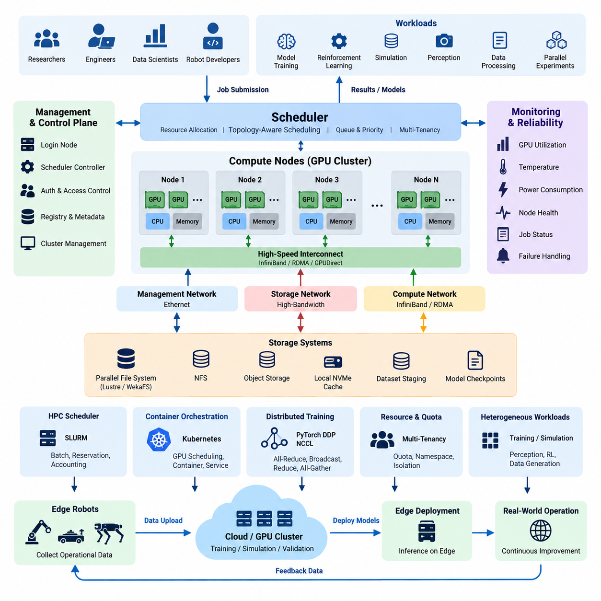
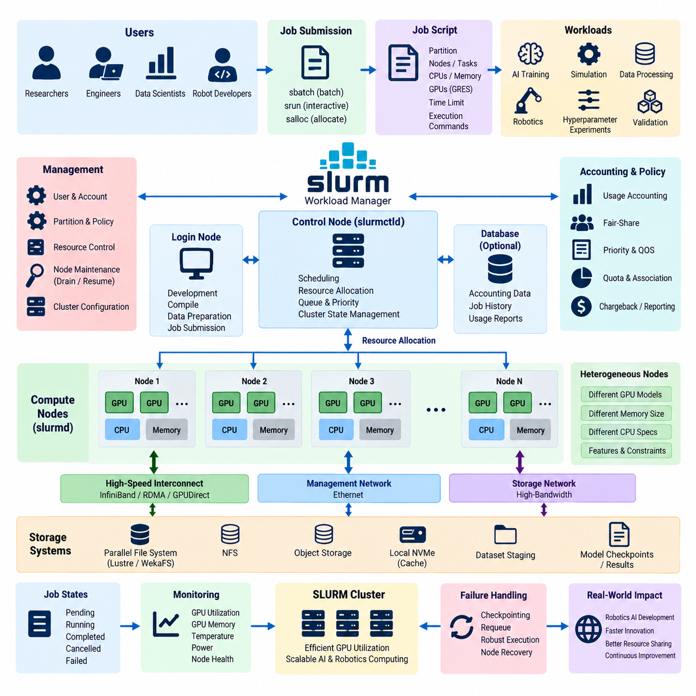
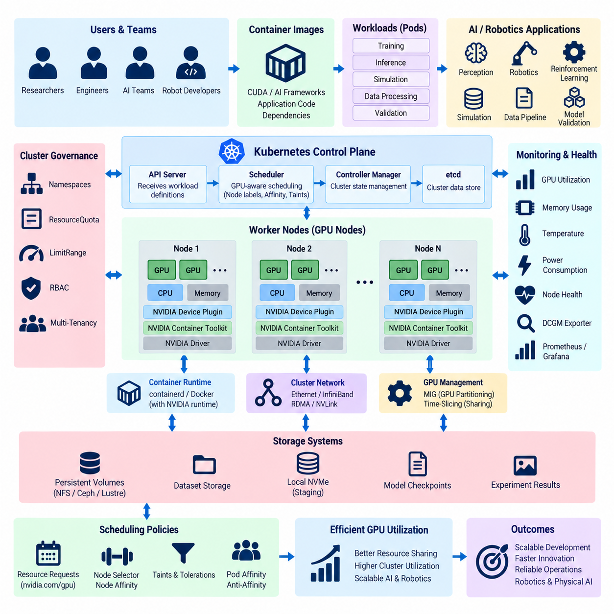
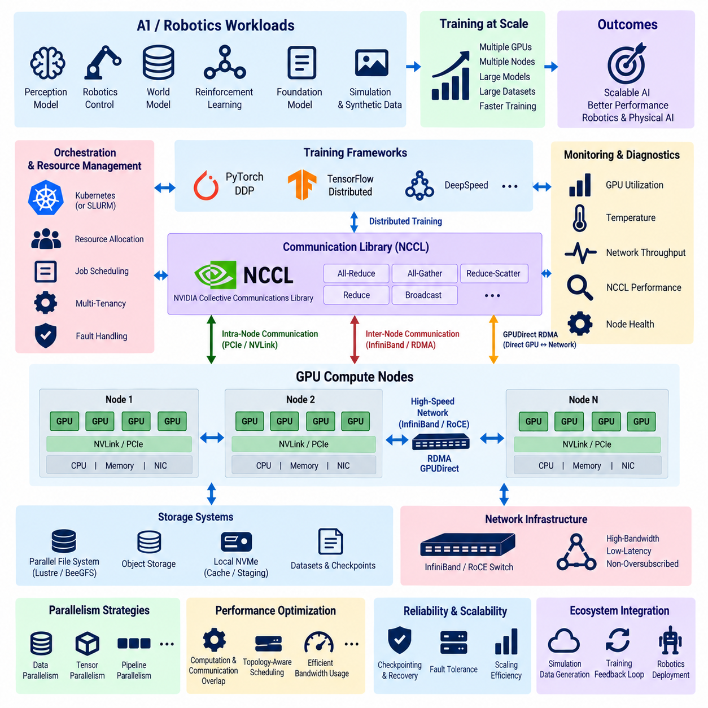
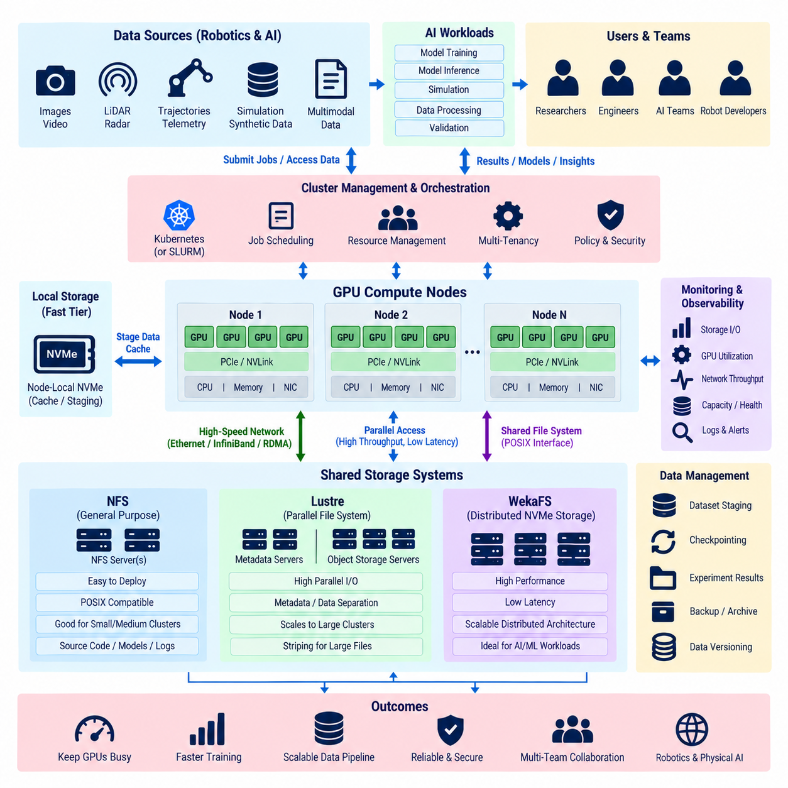
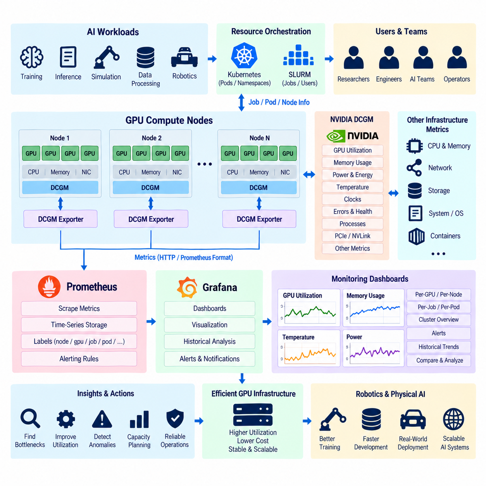
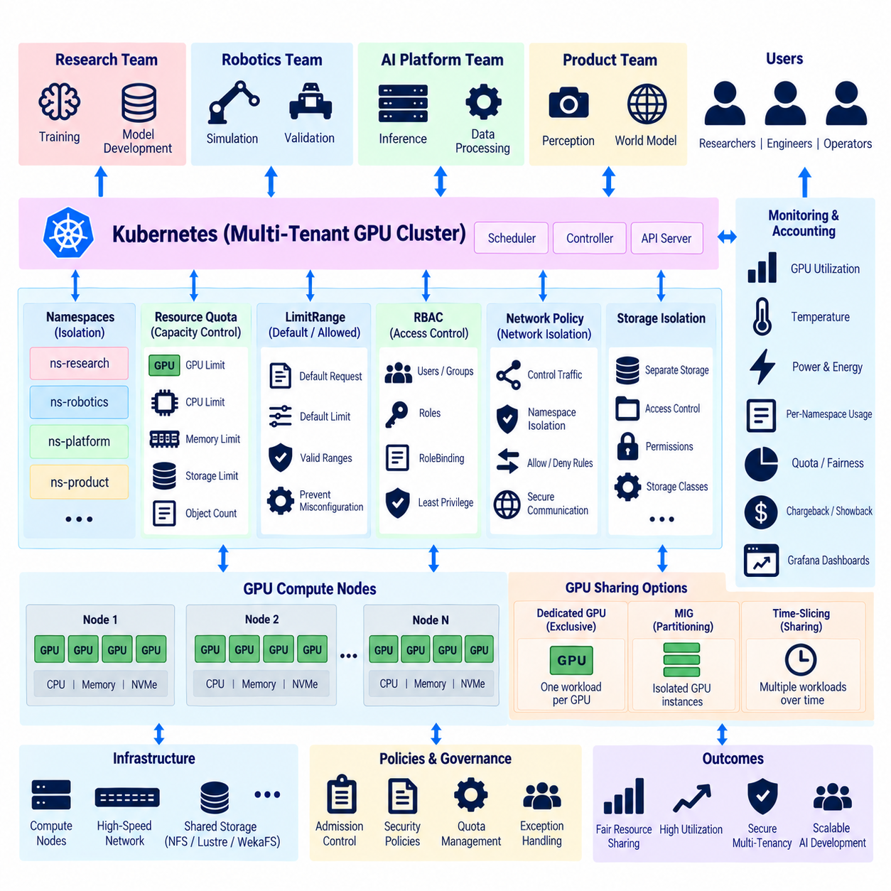
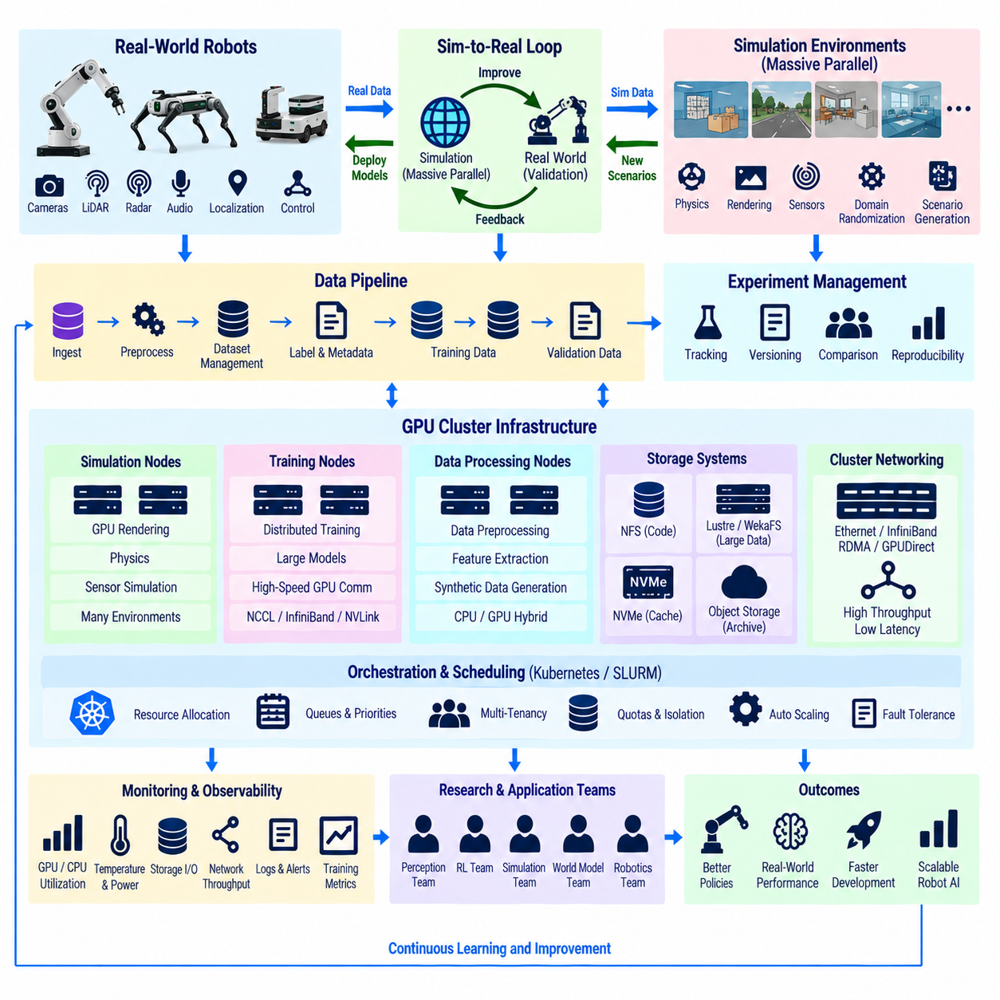
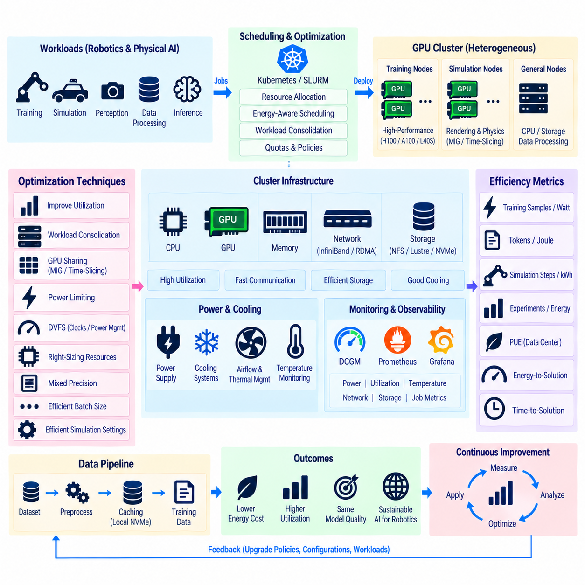
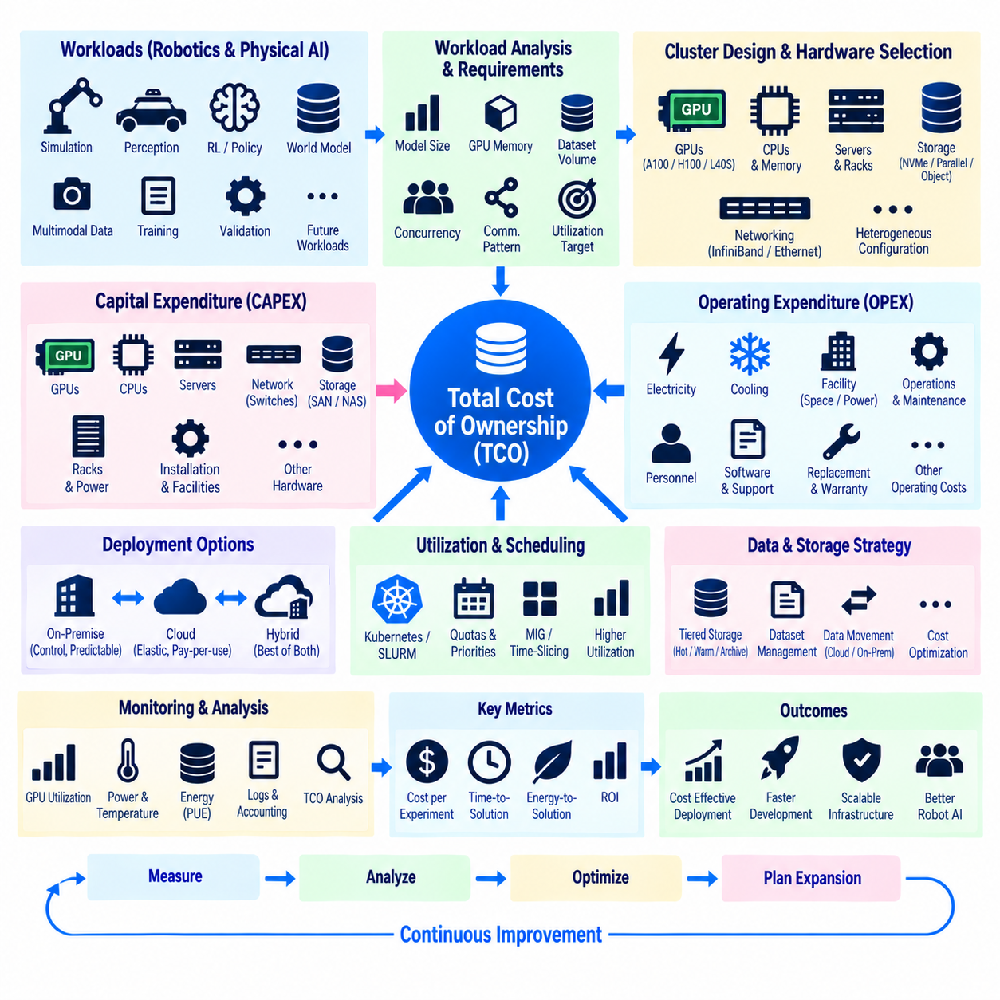

**Volume 09 Cloud and Edge Robotics**

# 07. GPU Clusters

## 07.01 GPU Cluster Architecture: Scheduling / Connectivity

{width="7.268055555555556in" height="7.268055555555556in"}

GPU 클러스터(GPU Cluster)는 여러 개의 그래픽 처리 장치(Graphics Processing Unit)를 개별 가속기(Accelerator)로 운용하는 것이 아니라 하나의 공유 컴퓨팅 인프라(Shared Computing Infrastructure)로 구성한 환경이다. 로보틱스(Robotics)와 피지컬 AI(Physical AI)에서는 단일 GPU의 메모리, 연산 성능 또는 처리량을 초과하는 파운데이션 모델(Foundation Model) 학습, 강화학습(Reinforcement Learning), 대규모 시뮬레이션(Large-Scale Simulation), 인식 모델(Perception Model) 학습 및 병렬 실험 실행을 지원한다.

GPU 클러스터의 기본 아키텍처(Architecture)는 일반적으로 GPU 컴퓨팅 노드(GPU Compute Node), 관리 또는 제어 계층(Management or Control Layer), 고속 네트워크(High-Speed Network), 공유 스토리지(Shared Storage), 워크로드 스케줄링 서비스(Workload Scheduling Service)로 구성된다. 각 컴퓨팅 노드는 PCI Express를 통해 CPU 및 시스템 메모리와 연결된 하나 이상의 GPU를 포함하며, 고성능 시스템에서는 노드 내부의 GPU 간에 더욱 빠른 통신 환경을 제공할 수 있다.

GPU 토폴로지(GPU Topology)는 애플리케이션(Application)의 성능에 큰 영향을 준다. 동일한 서버 내부에 위치한 GPU 간 통신과 서로 다른 서버에 위치한 GPU 간 통신은 성능 특성이 크게 다를 수 있다. 따라서 분산 소프트웨어(Distributed Software)는 데이터가 로컬 GPU 인터커넥트(Local GPU Interconnect), PCIe, 호스트 메모리(Host Memory), 외부 네트워크 중 어느 경로를 통해 이동하는지 고려해야 한다. 효율적인 토폴로지 인식 배치(Topology-Aware Placement)는 불필요한 통신을 줄이고 GPU 확장에 따른 분산 작업의 성능을 향상시킨다.

클러스터 네트워크(Cluster Network)는 개념적으로 관리 트래픽(Management Traffic), 스토리지 트래픽(Storage Traffic), 고성능 연산 트래픽(High-Performance Computation Traffic)으로 구분할 수 있다. 이더넷(Ethernet)은 일반적인 관리와 서비스에 적합하지만 높은 성능이 필요한 분산 학습(Distributed Training)에는 고대역폭·저지연 네트워크가 필요할 수 있다. 인피니밴드(InfiniBand)와 RDMA 같은 기술은 노드 간 통신 오버헤드를 줄이며, GPUDirect 기술은 GPU, 네트워크 어댑터(Network Adapter), 스토리지 사이의 데이터 경로를 단축할 수 있다.

연결성(Connectivity)은 동기식 분산 학습(Synchronous Distributed Training)에서 특히 중요하다. 각 GPU가 모델 워크로드(Model Workload)의 일부를 계산하더라도 그래디언트(Gradient)나 기타 중간 정보를 참여 프로세스 사이에서 지속적으로 교환해야 하기 때문이다. 올리듀스(All-Reduce), 브로드캐스트(Broadcast), 리듀스(Reduce), 올게더(All-Gather)와 같은 집단 통신 연산(Collective Communication Operation)은 전체 성능을 좌우할 수 있다. 네트워크가 충분하지 않으면 고성능 GPU가 실제 연산 대신 통신을 기다리는 시간이 증가한다.

스케줄러(Scheduler)는 물리적인 GPU 클러스터를 관리 가능한 공유 컴퓨팅 플랫폼(Shared Computing Platform)으로 변환한다. 개별 GPU를 사용자에게 수동으로 할당하는 대신 스케줄러가 워크로드 요구사항을 받아 적절한 자원에 작업(Job)을 배치한다. 요청에는 GPU 수, CPU 코어, 시스템 메모리, 실행 시간, 노드 특성, 가속기 유형 등이 포함될 수 있으며, 스케줄링 계층(Scheduling Layer)은 자원 충돌을 방지하면서 각 워크로드가 언제 어디에서 실행될지를 결정한다.

스케줄링(Scheduling)은 단순히 사용하지 않는 GPU를 찾는 작업보다 복잡하다. 예를 들어 8개의 GPU를 요구하는 분산 작업은 하나의 서버에 GPU가 집중되어 있는 경우, 고속으로 연결된 두 개의 노드에 분산된 경우, 또는 클러스터 전체에 흩어진 경우에 서로 다른 성능을 나타낼 수 있다. 토폴로지 인식 스케줄링(Topology-Aware Scheduling)은 관련 프로세스를 서로 가깝게 배치하고 통신 지역성(Communication Locality)을 유지하며 가능한 경우 연속적인 자원을 할당한다.

배치 처리 중심(Batch-Oriented)의 GPU 클러스터에서는 SLURM과 같은 고성능 컴퓨팅 스케줄러(HPC Scheduler)를 일반적으로 사용하며, 클라우드 네이티브 환경(Cloud-Native Environment)에서는 쿠버네티스(Kubernetes)와 GPU 인식 장치 관리(GPU-Aware Device Management)를 활용할 수 있다. HPC 스케줄링은 작업 대기열, 예약, 자원 사용량 관리, 긴밀하게 결합된 병렬 연산을 강조하는 반면 쿠버네티스는 컨테이너(Container), 서비스, 선언적 배포(Declarative Deployment), 오케스트레이션(Orchestration), 현대적인 애플리케이션 플랫폼과의 통합을 강조한다.

GPU 자원은 비용이 높고 유휴 상태의 가속기는 계산적인 가치를 제공하지 않으므로 자원 활용률(Resource Utilization)은 중요한 아키텍처 목표이다. 스케줄러는 작업 대기열을 관리하고 우선순위와 선점 정책(Preemption Policy)을 적용하며 워크로드와 적합한 장치를 연결함으로써 활용률을 높일 수 있다. 소규모 실험은 개별 GPU를 사용할 수 있지만 대규모 학습 작업은 예측 가능한 통신 성능을 확보하고 다른 워크로드의 간섭을 줄이기 위해 전체 멀티 GPU 노드(Multi-GPU Node)를 예약할 수 있다.

GPU 메모리(GPU Memory) 역시 핵심적인 스케줄링 제약조건(Scheduling Constraint)으로 관리해야 한다. 계산 성능이 비슷한 두 GPU도 사용 가능한 메모리 용량이 다르면 동일한 워크로드를 실행하지 못할 수 있다. 대규모 신경망(Neural Network), 고해상도 인식 모델, 월드 모델(World Model), 대규모 학습 배치(Training Batch)는 상당한 가속기 메모리를 요구할 수 있다. 따라서 GPU를 모두 동일한 자원으로 취급하지 않고 GPU 종류, 메모리 용량, 연산 능력, 인터커넥트 특성 등을 자원 정보에 포함해야 한다.

스토리지 아키텍처(Storage Architecture)는 GPU 스케줄링 및 연결성과 직접적으로 상호작용한다. 학습 작업은 이미지, 영상, LiDAR 데이터, 로봇 궤적(Robot Trajectory), 시뮬레이션 결과, 모델 체크포인트(Model Checkpoint) 등 방대한 데이터를 사용할 수 있다. 공유 스토리지가 GPU가 요구하는 속도로 데이터를 공급하지 못하면 GPU의 이론적 연산 성능과 관계없이 활용률이 떨어진다. 고속 NFS, 병렬 파일 시스템(Parallel File System), 객체 스토리지(Object Storage), 로컬 NVMe 캐싱(Local NVMe Caching), 데이터셋 스테이징(Dataset Staging)을 워크로드 특성에 따라 조합할 수 있다.

데이터 지역성(Data Locality)을 활용하면 클러스터 효율을 더욱 높일 수 있다. 자주 사용하는 데이터셋을 학습 시작 전에 중앙 스토리지(Central Storage)에서 노드 로컬 NVMe(Node-Local NVMe)로 복사하면 공유 스토리지 네트워크를 통한 반복적인 데이터 전송을 줄일 수 있다. 체크포인트와 최종 결과물은 이후 영구적인 중앙 스토리지로 반환할 수 있다. 이러한 구조는 안정성, 저장 용량, 대역폭 및 인프라 비용 사이의 균형을 확보하는 데 도움이 된다.

분산 AI 프레임워크(Distributed AI Framework)는 기반이 되는 클러스터 아키텍처에 크게 의존한다. 예를 들어 파이토치 분산 데이터 병렬(PyTorch Distributed Data Parallel)은 여러 GPU에서 프로세스를 실행할 수 있으며 통신 라이브러리(Communication Library)가 텐서(Tensor) 교환을 조정한다. NCCL은 최적화된 GPU 집단 통신에 널리 활용되며 사용 가능한 하드웨어에 따라 통신 경로를 선택할 수 있다. 결과적으로 실제 학습 속도는 애플리케이션 병렬화, GPU 토폴로지, 네트워크 대역폭, 통신 라이브러리 및 스케줄링 결정의 상호작용으로 결정된다.

피지컬 AI(Physical AI)는 특히 다양한 클러스터 워크로드를 발생시킨다. 하나의 클러스터에서 인식 모델 학습, 강화학습 실험, 합성 데이터 생성(Synthetic Data Generation), 로봇 시뮬레이션, 월드 모델 학습 및 검증 파이프라인(Validation Pipeline)을 동시에 실행할 수 있다. 각각의 워크로드는 GPU, CPU, 메모리, 네트워크 및 스토리지 요구사항이 서로 다르기 때문에 실제 아키텍처는 모든 AI 작업을 동일하게 취급하지 않고 이질적인 자원 프로파일(Heterogeneous Resource Profile)을 지원해야 한다.

대규모 병렬 시뮬레이션(Massive Parallel Simulation)은 또 다른 스케줄링 형태를 만든다. 하나의 거대한 학습 프로세스를 실행하는 대신 수백 또는 수천 개의 시뮬레이션 환경을 동시에 실행하여 학습 알고리즘에 필요한 경험 데이터를 생성할 수 있다. 클러스터는 시뮬레이션 워커(Simulation Worker), 학습 프로세스, 데이터 버퍼(Data Buffer), 실험 메타데이터(Experiment Metadata)를 조정해야 한다. 시뮬레이션과 학습 구성요소 사이의 과도한 통신은 대규모 병렬 실행의 이점을 감소시킬 수 있으므로 효율적인 배치가 중요하다.

멀티테넌시(Multi-Tenancy) 환경에서는 스케줄러가 자원 활용률과 격리(Isolation)를 동시에 관리해야 한다. 서로 다른 연구자, 프로젝트 또는 로봇 프로그램이 동일한 인프라를 공유하면서 독립적인 할당량(Quota), 우선순위, 네임스페이스(Namespace), 컨테이너 및 접근 권한을 요구할 수 있다. 자원 사용량 관리(Resource Accounting)를 통해 GPU 소비량을 가시화하고 조직 정책에 따라 컴퓨팅 용량을 할당할 수 있으며, 특정 실험이 모든 GPU를 독점하거나 다른 중요한 워크로드를 방해하는 상황도 방지할 수 있다.

클러스터 규모와 작업 시간이 증가할수록 구성요소 장애 가능성도 증가하므로 신뢰성(Reliability)을 아키텍처 단계에서 고려해야 한다. 장시간 실행되는 분산 학습은 체크포인팅(Checkpointing)과 재시작(Restart) 메커니즘을 지원해야 한다. 모니터링 시스템(Monitoring System)은 GPU 온도, 메모리 활용률, 전력 소비, 인터커넥트 활동, 노드 상태 및 작업 상태를 관찰해야 하며, 장애가 발생한 GPU나 노드는 유지보수가 완료될 때까지 스케줄링 대상에서 제외할 수 있다.

제어 평면(Control Plane)은 높은 연산 부하를 발생시키는 AI 작업과 논리적으로 분리하는 것이 바람직하다. 로그인 노드(Login Node), 스케줄러 컨트롤러(Scheduler Controller), 모니터링 서비스, 레지스트리(Registry), 메타데이터 시스템 및 인증 서비스가 학습 작업과 동일한 핵심 자원을 두고 경쟁해서는 안 된다. 이러한 분리는 운영 안정성을 높이고 컴퓨팅 워크로드가 실행되는 동안에도 인프라를 보다 안정적으로 관리할 수 있게 한다.

클러스터 확장성(Cluster Scalability)은 단순히 GPU 개수를 기준으로 평가하는 것이 아니라 전체 시스템의 종단간 특성(End-to-End Property)으로 평가해야 한다. GPU를 추가하면 이론적인 연산 용량은 증가하지만 실제 성능은 통신 효율, 스토리지 처리량, CPU 데이터 준비, 스케줄링 품질 및 소프트웨어 확장성에 의해 결정된다. 다른 하위 시스템이 병목(Bottleneck)이 된다면 GPU 수를 두 배로 증가시키더라도 분산 워크로드의 처리 속도가 자동으로 두 배가 되는 것은 아니다.

로보틱스 조직에서 GPU 클러스터는 궁극적으로 데이터셋, 시뮬레이션, 학습, 평가 및 배포 파이프라인(Deployment Pipeline)을 연결하는 공유 지능 생산 인프라(Shared Intelligence-Production Infrastructure)로 기능한다. 엣지 로봇(Edge Robot)이 운영 데이터를 수집하면 중앙 GPU 자원이 높은 연산 성능이 필요한 학습과 검증을 수행할 수 있다. 검증된 모델은 다시 엣지 시스템으로 배포되어 추론(Inference)에 사용되며, 이를 통해 전체 클라우드-엣지 아키텍처(Cloud-Edge Architecture)에서 로봇 운영과 중앙집중형 AI 연산이 지속적으로 연결된다.

## 07.02 SLURM HPC Cluster Configuration [w/Code]

{width="7.268055555555556in" height="7.268055555555556in"}

SLURM은 인공지능(Artificial Intelligence)과 로보틱스(Robotics)를 위한 GPU 클러스터를 포함하여 고성능 컴퓨팅(High-Performance Computing) 환경에서 널리 사용되는 워크로드 관리 및 작업 스케줄링 시스템(Workload Management and Job Scheduling System)이다. 사용자가 컴퓨팅 서버와 GPU를 직접 선택하도록 하는 대신, SLURM은 클러스터 자원을 중앙집중형 스케줄링 환경(Centralized Scheduling Environment)을 통해 제공한다. 작업(Job)은 필요한 자원을 요청하고 대기열(Queue)에 들어간 후 자원을 할당받아 실행되며, 처리가 완료되면 해당 자원을 반환한다.

기본적인 SLURM 클러스터는 관리 기능과 연산 기능을 분리한다. 제어 노드(Control Node)는 중앙 스케줄러(Central Scheduler)를 실행하고 사용 가능한 노드, 파티션(Partition), 작업 및 자원 상태에 대한 정보를 관리한다. 컴퓨팅 노드(Compute Node)는 사용자의 워크로드를 실행하고 상태를 컨트롤러(Controller)에 보고한다. 로그인 노드(Login Node)는 소스 관리, 작업 준비, 컴파일, 데이터셋 확인 및 작업 제출을 위한 별도의 환경을 제공하여 대화형 사용자 작업이 컴퓨팅 서버에서 직접 실행되지 않도록 할 수 있다.

SLURM 컨트롤러는 주로 slurmctld 데몬(Daemon)을 통해 관리되며 각 컴퓨팅 노드는 일반적으로 slurmd를 실행한다. 컨트롤러는 작업 요청을 수신하고 스케줄링 정책(Scheduling Policy)과 사용 가능한 자원을 평가한 다음 적절한 노드를 할당한다. 컴퓨팅 노드의 데몬은 작업을 실행하고 그 상태를 컨트롤러로 다시 전달한다. 실제 운영 환경에서는 스케줄링 결정과 클러스터 상태 관리가 이러한 제어 평면(Control Plane) 서비스에 의존하므로 컨트롤러의 신뢰성이 중요하다.

클러스터 구성(Configuration)은 SLURM이 관리할 하드웨어 자원을 정의하는 것에서 시작한다. 컴퓨팅 노드는 CPU 수, 메모리 용량, 토폴로지(Topology) 정보 및 기타 특성과 함께 정의할 수 있다. GPU 자원은 일반적으로 GRES라고 부르는 범용 자원(Generic Resources)으로 표현된다. 이를 통해 노드는 설치된 GPU의 수와 유형을 알려줄 수 있으며, 사용자는 GPU를 단순히 서버에 연결된 보이지 않는 하드웨어로 취급하지 않고 필요한 가속기 자원(Accelerator Resource)을 명시적으로 요청할 수 있다.

파티션(Partition)은 컴퓨팅 자원을 논리적으로 그룹화한다. GPU 클러스터에서는 하드웨어 세대, 워크로드 목적, 실행 정책 또는 서비스 수준에 따라 노드를 구분할 수 있다. 예를 들어 단기 실험, 장시간 학습, 대용량 GPU 메모리가 필요한 워크로드 및 운영 검증(Production Validation)을 서로 다른 파티션으로 구성할 수 있다. 파티션은 기본 물리 인프라를 하나의 중앙 관리 클러스터로 유지하면서도 스케줄링 제한과 접근 정책을 정의할 수 있다.

작업 제출(Job Submission)은 일반적으로 비대화형 배치 워크로드(Non-Interactive Batch Workload)에 대해 sbatch를 사용하여 수행한다. 작업 스크립트(Job Script)에는 실행 명령과 함께 파티션, 노드 수, 태스크 수, CPU 할당량, 메모리, 실행 시간 및 GPU 수와 같은 자원 요구사항을 지정한다. 제출 후 SLURM은 작업 식별자(Job Identifier)를 할당하고 워크로드를 스케줄링 시스템에 등록한다. 사용자가 어떤 특정 서버에서 워크로드를 실행할 것인지 직접 결정할 필요가 없다.

대화형 실행(Interactive Execution)은 srun과 같은 명령이나 salloc을 통해 생성된 자원 할당(Resource Allocation)을 이용하여 지원할 수 있다. 개발자가 학습 코드를 디버깅하거나 GPU 동작을 확인하고 분산 통신(Distributed Communication)을 시험하거나 장시간 배치 작업을 실행하기 전에 환경을 검증할 때 유용하다. 대화형 세션도 자원 할당 절차를 거쳐야 실험 프로세스가 이미 다른 워크로드에 할당된 GPU를 점유하는 문제를 방지할 수 있다.

GPU 스케줄링을 위해서는 물리적인 가속기와 SLURM 자원 사이의 관계를 정확하게 구성해야 한다. 여러 GPU가 장착된 노드는 해당 장치를 GRES 정의를 통해 노출할 수 있으며 작업은 하나 이상의 GPU를 요청할 수 있다. SLURM은 작업이 할당받은 자원만 사용하도록 제한하고 GPU 인식 애플리케이션(GPU-Aware Application)에 필요한 실행 환경을 제공한다. 정확한 구성은 여러 독립적인 작업이 의도하지 않게 동일한 가속기를 두고 경쟁하는 상황을 방지한다.

하드웨어 이질성(Hardware Heterogeneity)은 추가적인 스케줄링 요구사항을 발생시킨다. 하나의 클러스터에는 서로 다른 GPU 모델, GPU 메모리 용량, CPU 아키텍처 또는 노드 구성이 존재할 수 있다. 기능(Feature)과 제약조건(Constraint)을 사용하여 이러한 차이를 정의하면 특정 가속기 등급이 필요한 워크로드를 호환되는 노드에 배치할 수 있다. AI 워크로드는 GPU 세대에 따라 모델 크기, 수치 정밀도(Numerical Precision), 소프트웨어 호환성 및 성능 요구사항이 크게 달라질 수 있기 때문에 이러한 구분이 중요하다.

분산 학습(Distributed Training)은 여러 GPU와 경우에 따라 여러 노드에 걸친 조정된 자원 할당을 필요로 한다. SLURM은 실행 전에 필요한 전체 자원을 예약하여 분산 작업의 일부만 먼저 실행되는 상황을 방지할 수 있다. 이후 파이토치 분산 데이터 병렬(PyTorch Distributed Data Parallel)과 같은 프레임워크가 할당된 자원에서 협력 프로세스를 실행하고, NCCL은 사용 가능한 인터커넥트(Interconnect) 인프라를 통해 올리듀스(All-Reduce)와 같은 GPU 집단 통신(Collective Communication)을 처리한다.

태스크 배치(Task Placement)는 클러스터의 물리적 토폴로지를 반영해야 한다. 서로 집중적으로 통신하는 프로세스는 가능한 한 효율적인 통신 경로로 연결된 GPU와 노드를 사용하는 것이 바람직하다. 서버 내부의 GPU 통신은 PCIe 또는 전용 GPU 인터커넥트를 사용할 수 있으며 서버 간 통신에는 이더넷(Ethernet), 인피니밴드(InfiniBand), RDMA 또는 GPUDirect를 지원하는 인프라를 사용할 수 있다. 부적절한 배치는 강력한 GPU 연산 성능에도 불구하고 통신 오버헤드가 전체 성능을 지배하게 만들 수 있다.

SLURM 스케줄링 정책은 제한된 자원을 여러 워크로드가 어떻게 공유할 것인지를 결정한다. 작업은 우선순위(Priority), 대기 시간, 자원 요구사항, 계정 정보 또는 조직 정책 등에 따라 정렬될 수 있다. 백필 스케줄링(Backfill Scheduling)은 먼저 예약된 높은 우선순위의 작업을 지연시키지 않는 범위에서 작은 작업을 실행하여 자원 활용률을 높일 수 있다. 이를 통해 스케줄 사이에 발생하는 유휴 구간을 줄이고 고가의 GPU 인프라에 대한 실질적인 활용률을 향상시킬 수 있다.

공정 공유(Fair-Share) 메커니즘은 특정 사용자나 프로젝트가 지속적으로 클러스터 대부분을 사용하는 것을 방지할 수 있다. 사용 이력, 계정(Account), 연결 관계(Association), 우선순위 정책을 조합하여 조직의 목적에 맞게 자원을 분배할 수 있다. 연구팀별로 물리적인 GPU를 영구 할당하지 않고도 정의된 접근 권한을 제공할 수 있다. 이를 통해 인프라를 공통 자원 풀(Common Resource Pool)로 운영하면서 컴퓨팅 자원 사용에 대한 책임성과 추적성을 유지할 수 있다.

클러스터가 여러 프로젝트를 지원하는 경우 자원 사용량 관리(Resource Accounting)는 필수적이다. SLURM 어카운팅(Accounting)은 제출된 작업, 할당된 자원, 실행 시간, 작업 상태 및 관련 사용 정보를 기록할 수 있다. 관리자는 이러한 기록을 이용하여 GPU 수요를 파악하고 지속적으로 발생하는 대기열을 확인하며 활용률을 평가하고 용량 계획(Capacity Planning)을 수립할 수 있다. 또한 인프라 사용량을 연구 프로그램, 고객 또는 내부 개발 활동과 연결하여 분석할 수 있다.

작업 상태(Job State)는 클러스터 운영에 대한 가시성을 제공한다. 워크로드는 자원이 부족하여 대기 상태(Pending)가 될 수 있고, 자원을 할당받아 실행 상태(Running)가 되거나 정상적으로 완료될 수 있으며, 취소 또는 소프트웨어·하드웨어 문제로 실패할 수도 있다. squeue와 같은 명령을 사용하면 사용자와 관리자가 대기 중이거나 실행 중인 작업을 확인할 수 있으며, 노드 관련 명령을 통해 사용 가능, 할당, 드레인(Drained) 또는 사용 불가능 상태의 컴퓨팅 자원을 확인할 수 있다.

노드 유지보수(Node Maintenance)를 수행할 때는 해당 자원을 스케줄링 대상에서 통제된 방식으로 제거해야 한다. GPU, 네트워크 어댑터, 스토리지 경로, 드라이버 또는 기타 구성요소에 대한 점검이 필요한 경우 관리자는 컴퓨팅 노드를 드레인(Drain) 상태로 설정할 수 있다. 유지보수가 수행되는 동안 새로운 워크로드가 해당 노드에 할당되지 않으며, 검증이 완료된 이후 다시 서비스 상태로 복귀시킬 수 있다. 이러한 방식은 하나의 서버 문제로 전체 클러스터를 중단하는 상황을 방지한다.

소프트웨어 환경(Software Environment)은 모든 컴퓨팅 노드에서 재현 가능해야 한다. AI 클러스터는 일반적으로 SLURM과 환경 모듈(Environment Module), 컨테이너(Container) 또는 표준화된 소프트웨어 이미지(Standardized Software Image)를 결합하여 작업마다 일관된 CUDA 라이브러리, 프레임워크, 통신 라이브러리 및 의존성을 제공한다. 특히 컨테이너는 프로젝트별 소프트웨어 스택을 호스트 운영체제와 분리하면서 할당된 GPU와 고성능 네트워크를 애플리케이션에 제공하는 데 유용하다.

스토리지(Storage)는 스케줄링된 모든 컴퓨팅 노드에서 일관되게 접근할 수 있어야 한다. 사용자는 소스 코드, 데이터셋, 체크포인트(Checkpoint), 실험 결과 및 로그를 공유 스토리지에 보관할 수 있으며 높은 처리량이 필요한 워크로드는 자주 사용하는 데이터를 로컬 NVMe 장치에 스테이징(Staging)할 수 있다. 작업 실행 전에 데이터를 복사하고 완료 후 체크포인트를 다시 저장하는 워크플로를 구성하면 중앙집중식 데이터 관리와 재현성을 유지하면서 공유 스토리지의 부하를 줄일 수 있다.

장시간 실행되는 피지컬 AI(Physical AI) 학습에서는 장애 처리(Failure Handling)가 더욱 중요하다. 여러 날 동안 실행되는 작업에서 모델 상태가 저장되기 전에 노드 장애가 발생하면 상당한 계산 결과를 잃을 수 있다. 따라서 학습 애플리케이션은 주기적으로 체크포인트를 생성하고 재시작 가능한 실행 절차를 유지해야 한다. SLURM은 설정된 정책에 따라 적절한 워크로드를 다시 제출하거나 재대기(Requeue)시킬 수 있지만, 스케줄러 자체가 손실된 신경망 학습 상태를 복원할 수 없기 때문에 애플리케이션 수준의 체크포인팅이 필요하다.

모니터링(Monitoring)은 스케줄러 정보와 GPU 텔레메트리(GPU Telemetry)를 결합해야 한다. SLURM은 각 자원을 어떤 작업이 사용하고 있는지 보여주며 GPU 모니터링 시스템은 활용률, 메모리 사용량, 온도, 전력 및 하드웨어 상태를 제공할 수 있다. 두 정보를 결합하면 관리자는 할당된 GPU가 실제로 유효한 연산을 수행하고 있는지 판단할 수 있다. 지속적인 낮은 활용률은 비효율적인 코드, 데이터 로딩 병목, 통신 제한, 과도한 자원 할당 또는 부적절한 스케줄링 정책을 의미할 수 있다.

로보틱스와 피지컬 AI 환경에서 SLURM은 기존의 고성능 컴퓨팅 작업뿐만 아니라 이질적인 워크로드 포트폴리오(Heterogeneous Workload Portfolio)를 조정할 수 있다. 인식 모델 학습, 강화학습(Reinforcement Learning), 월드 모델(World Model) 학습, 시뮬레이션, 합성 데이터 생성(Synthetic Data Generation), 하이퍼파라미터 실험(Hyperparameter Experiment) 및 검증 작업이 동일한 인프라에서 공존할 수 있다. 서로 다른 파티션, 자원 제약조건, 우선순위 및 할당량을 통해 이러한 워크로드가 GPU 용량을 공유하면서도 운영 통제를 유지할 수 있다.

잘 구성된 SLURM 환경은 고가의 GPU 하드웨어와 AI 개발 워크플로 사이에서 자원 관리 계층(Resource Management Layer)의 역할을 수행한다. 컴퓨팅 노드는 가속 연산을 제공하고, 고속 네트워크는 분산 통신을 지원하며, 스토리지는 데이터셋과 체크포인트를 제공하고, SLURM은 워크로드가 언제 어디에서 실행될지를 결정한다. 이러한 아키텍처는 서로 독립적으로 존재하는 GPU 서버를 확장 가능한 로보틱스 및 피지컬 AI 개발을 지원하는 통합 고성능 컴퓨팅 플랫폼(HPC Platform)으로 전환한다.

## 07.03 Kubernetes GPU Scheduler: nvidia.device.plugin [w/Code]

{width="7.268055555555556in" height="7.268055555555556in"}

쿠버네티스(Kubernetes)는 GPU 가속 워크로드(GPU-Accelerated Workload)를 컨테이너화된 애플리케이션(Containerized Application)으로 실행하기 위한 클라우드 네이티브 오케스트레이션 환경(Cloud-Native Orchestration Environment)을 제공한다. GPU 클러스터에서 쿠버네티스는 일반적인 CPU 및 메모리 자원 모델을 통해 가속기 하드웨어를 직접 관리하지 않는다. 대신 엔비디아 디바이스 플러그인(NVIDIA Device Plugin)과 같은 지원 구성요소를 통해 NVIDIA GPU를 쿠버네티스에 노출하여 파드(Pod)가 기존 컴퓨팅 자원과 함께 GPU를 스케줄링 가능한 자원(Schedulable Resource)으로 요청할 수 있도록 한다.

엔비디아 디바이스 플러그인(NVIDIA Device Plugin)은 쿠버네티스 자원 관리와 워커 노드(Worker Node)에 설치된 GPU 장치 사이에서 동작한다. 호환 가능한 NVIDIA 가속기를 검색하고 일반적으로 nvidia.com/gpu로 표현되는 확장 자원(Extended Resource)으로 큐블릿(Kubelet)에 등록한다. 이러한 자원이 등록되면 쿠버네티스 스케줄러(Kubernetes Scheduler)는 각 노드에서 사용 가능한 GPU 수를 인식하고 충분한 가속기 용량을 가진 노드에만 GPU를 요청하는 파드를 배치할 수 있다.

각 GPU 워커 노드에는 가속기 워크로드를 안정적으로 실행하기 위한 적절한 NVIDIA 소프트웨어 스택(Software Stack)이 필요하다. 호스트 운영체제(Host Operating System)는 호환 가능한 NVIDIA 드라이버를 제공해야 하며, 컨테이너 런타임(Container Runtime)은 컨테이너가 할당된 GPU 장치에 접근할 수 있도록 구성해야 한다. 엔비디아 컨테이너 툴킷(NVIDIA Container Toolkit)은 컨테이너 실행 환경을 호스트 GPU 환경과 연결하여 CUDA 기반 애플리케이션이 각 이미지에 커널 수준 GPU 드라이버를 포함하지 않고도 물리적 가속기를 사용할 수 있도록 한다.

디바이스 플러그인(Device Plugin)은 일반적으로 데몬셋(DaemonSet)으로 배포되어 GPU를 사용할 수 있는 모든 노드에서 하나의 플러그인 인스턴스가 실행되도록 한다. 이 배포 모델은 클러스터 구성 변화에 자동으로 대응한다. GPU 워커가 클러스터에 추가되면 쿠버네티스가 해당 노드에서 플러그인을 실행할 수 있으며, 노드가 제거되면 해당 플러그인 인스턴스도 함께 제거된다. 따라서 데몬셋 방식은 많은 워커 노드에서 GPU 검색 기능을 확장성 있게 유지하는 방법을 제공한다.

GPU 자원은 물리적인 가속기를 컨테이너에 수동으로 지정하는 대신 파드 명세(Pod Specification)에서 요청한다. 워크로드는 nvidia.com/gpu 확장 자원을 사용하여 필요한 GPU 수를 선언할 수 있으며, 스케줄러는 해당 요청을 만족할 수 있는 노드를 검색한다. 배치가 결정되면 디바이스 플러그인이 할당된 가속기를 컨테이너에 노출하는 과정에 참여한다. 이를 통해 애플리케이션 수준의 자원 요청과 저수준 장치 할당(Device Assignment)을 분리할 수 있다.

CPU 자원과 달리 일반적인 GPU 자원은 정수 단위 장치(Integer Device)로 취급된다. 하나의 GPU를 요청한 파드는 표준 nvidia.com/gpu 자원의 임의적인 일부가 아니라 할당된 하나의 가속기에 접근한다. 따라서 소규모 추론(Inference)이나 실험 워크로드가 GPU의 전체 연산 능력을 사용하지 못하는 경우 클러스터 활용률이 낮아질 수 있다. 더욱 세분화된 가속기 활용이 필요한 경우에는 고급 GPU 공유 메커니즘(GPU Sharing Mechanism)을 적용할 수 있다.

스케줄링(Scheduling)은 GPU의 수뿐만 아니라 워크로드 호환성(Workload Compatibility)에도 영향을 받는다. 이기종 클러스터(Heterogeneous Cluster)에는 서로 다른 아키텍처, 메모리 용량, 성능 수준 또는 용도를 가진 GPU가 포함될 수 있다. 쿠버네티스 노드 레이블(Node Label)을 이용하여 이러한 하드웨어 특성을 표현하고, 노드 셀렉터(Node Selector), 노드 어피니티(Node Affinity) 및 관련 배치 규칙을 통해 적절한 노드를 선택할 수 있다. 이를 통해 단순히 사용 가능한 GPU가 있다는 이유만으로 메모리 집약적인 학습 작업이 호환되지 않는 GPU에 배치되는 것을 방지한다.

노드 어피니티(Node Affinity)는 단순한 노드 셀렉터보다 유연한 배치 논리를 제공한다. 워크로드는 필수 또는 선호 특성을 정의하여 가속기 종류, 노드 세대, 네트워크 기능 또는 운영 역할을 기준으로 스케줄링할 수 있다. 또한 테인트와 톨러레이션(Taints and Tolerations)을 사용하면 일반적인 CPU 전용 파드가 명시적인 실행 권한 없이 고가의 GPU 서버 자원을 소비하지 못하도록 제한하여 GPU 노드를 적절한 워크로드에 예약할 수 있다.

쿠버네티스 스케줄링은 여러 구성요소가 하나의 AI 파이프라인(AI Pipeline)을 형성하는 경우 파드 어피니티 및 안티어피니티(Pod Affinity and Anti-Affinity)를 고려할 수도 있다. 긴밀하게 협력하는 서비스는 서로 가까운 위치에 배치하는 것이 유리할 수 있으며, 장애 격리(Fault Isolation)가 필요한 복제본은 서로 다른 노드에 분산할 수 있다. 분산 GPU 학습에서는 통신 집약적인 워커가 비효율적인 네트워크 경로를 가진 노드에 배치될 경우 상당한 성능 저하가 발생할 수 있으므로 네트워크 토폴로지도 고려해야 한다.

기본 쿠버네티스 스케줄러(Default Kubernetes Scheduler)는 모든 GPU 인터커넥트 토폴로지(GPU Interconnect Topology)를 상세하게 이해하기보다 선언된 자원과 스케줄링 제약조건을 만족시키는 데 중점을 둔다. 따라서 대규모 분산 학습 환경에서는 추가적인 스케줄링 정책, 토폴로지 정보, 오퍼레이터(Operator) 또는 특수 목적 스케줄러(Specialized Scheduler)가 필요할 수 있다. 목적은 파드 배치를 NVLink, PCIe, 인피니밴드(InfiniBand), RDMA 등 집단 통신 성능에 영향을 미치는 연결 특성과 일치시키는 것이다.

분산 학습(Distributed Training)은 일반적으로 여러 GPU 또는 여러 노드에서 동작하는 다수의 협력 워커 프로세스를 사용한다. 파이토치 분산 데이터 병렬(PyTorch Distributed Data Parallel)과 같은 프레임워크는 쿠버네티스 파드 내부에서 실행될 수 있으며, NCCL은 GPU 집단 통신(Collective Communication)을 제공한다. 쿠버네티스는 수명주기 관리(Lifecycle Management)와 자원 배치를 담당하고 학습 프레임워크는 연산을 조정한다. 노드 간 통신이 느리면 GPU를 추가하여 얻을 수 있는 확장 효과가 감소하기 때문에 고성능 네트워크가 중요하다.

쿠버네티스 제어 평면(Control Plane)은 원하는 클러스터 상태를 관리하고 실제 GPU 연산은 워커 노드에서 수행된다. API 서버(API Server)는 워크로드 정의를 수신하고 스케줄러는 적절한 노드를 선택하며 큐블릿은 해당 노드에서 파드 실행을 관리한다. 이러한 역할 분리를 통해 GPU 워크로드는 다른 쿠버네티스 애플리케이션과 동일한 선언적 배포 모델(Declarative Deployment Model)을 사용하면서도 NVIDIA 디바이스 플러그인과 관련 런타임 구성요소를 통해 특수한 가속기 관리 기능을 사용할 수 있다.

여러 로보틱스 또는 AI 팀이 하나의 클러스터를 공유하는 경우 네임스페이스(Namespace)와 자원 거버넌스(Resource Governance)가 중요해진다. 쿠버네티스 네임스페이스를 사용하여 프로젝트를 논리적으로 분리할 수 있으며, 리소스쿼터(ResourceQuota)와 리밋레인지(LimitRange) 정책을 통해 자원 소비를 제한할 수 있다. GPU 할당량은 하나의 팀이 모든 가속기를 사용하는 상황을 방지하는 데 도움이 된다. 역할 기반 접근 제어(Role-Based Access Control)와 결합하면 조직 정책에 따라 공유 GPU 인프라를 관리하는 멀티테넌트 환경(Multi-Tenant Environment)을 구성할 수 있다.

GPU 공유(GPU Sharing)는 전체 가속기가 필요하지 않은 워크로드의 자원 활용률을 향상시킬 수 있다. GPU 플랫폼과 소프트웨어 구성에 따라 타임 슬라이싱(Time-Slicing) 또는 멀티 인스턴스 GPU(Multi-Instance GPU)와 같은 하드웨어 기반 파티셔닝 기술을 적용할 수 있다. 이러한 방식은 서로 다른 격리 수준과 성능 특성을 제공한다. 따라서 클러스터 설계자는 하나의 장치에서 실행 시간을 공유하는 방식과 지원되는 GPU를 더욱 강하게 격리된 하드웨어 기반 GPU 인스턴스로 분할하는 방식을 구분해야 한다.

일반적으로 MIG라고 부르는 멀티 인스턴스 GPU(Multi-Instance GPU)는 이를 지원하는 NVIDIA GPU를 정의된 연산 및 메모리 자원을 가진 여러 개의 격리된 GPU 인스턴스로 분할할 수 있도록 한다. 쿠버네티스 환경에서는 구성된 장치 관리 전략(Device Management Strategy)에 따라 이러한 인스턴스를 자원으로 노출할 수 있다. MIG는 각 파드에 전체 물리 GPU를 전용으로 할당하지 않으면서 예측 가능한 가속기 파티션이 필요한 여러 추론 서비스, 개발 실험 또는 중간 규모 워크로드에 유용할 수 있다.

타임 슬라이싱(Time-Slicing)은 서로 다른 자원 활용 문제를 해결한다. 여러 워크로드가 시간에 따라 GPU 실행 자원을 공유하도록 하여 가벼운 워크로드의 실질적인 GPU 활용도를 높일 수 있지만, MIG와 동일한 수준의 하드웨어 격리(Hardware Isolation)를 제공하는 것은 아니다. 따라서 스케줄링 정책은 워크로드 특성을 반영해야 한다. 대규모 학습 작업에는 전용 GPU가 적합할 수 있으며, 개발, 테스트 또는 비교적 작은 추론 작업은 통제된 공유 방식에 적합할 수 있다.

운영 가시성(Operational Visibility)을 확보하려면 단순히 GPU가 할당되었는지를 확인하는 것만으로는 충분하지 않다. 쿠버네티스는 파드 배치와 자원 요청 정보를 제공하지만 관리자는 GPU 활용률, 메모리 사용량, 온도, 전력 소비 및 하드웨어 상태와 같은 가속기 수준 정보도 확인해야 한다. NVIDIA DCGM 기반 모니터링(Monitoring)을 쿠버네티스 메트릭과 결합하고 텔레메트리(Telemetry)를 모니터링 플랫폼으로 전송하면 스케줄러의 자원 할당과 실제 GPU 동작을 비교할 수 있다.

상태 관리(Health Management)도 중요하다. 스케줄러 관점에서는 GPU가 정상적으로 할당되어 있더라도 실제 하드웨어, 드라이버 또는 통신 문제가 발생할 수 있기 때문이다. 모니터링 시스템은 비정상적인 가속기 상태를 탐지해야 하며 문제가 발생한 노드는 코든(Cordon) 또는 드레인(Drain)하여 새로운 워크로드가 배치되지 않도록 할 수 있다. 이후 쿠버네티스는 적합한 워크로드를 다른 위치에 다시 배치할 수 있지만, 상태를 가진 AI 작업의 계산 진행 상황을 복구하려면 애플리케이션 수준 체크포인팅(Application-Level Checkpointing)이 필요하다.

컨테이너화(Containerization)는 프레임워크, 라이브러리, 애플리케이션 코드 및 사용자 공간 의존성(User-Space Dependency)을 버전이 관리되는 이미지에 패키징하여 GPU 노드 사이의 재현성(Reproducibility)을 향상시킨다. 팀은 호스트 시스템을 반복적으로 수정하지 않고 CUDA 애플리케이션, 인식 모델 학습, 강화학습(Reinforcement Learning), 시뮬레이션 및 모델 검증을 위한 서로 다른 환경을 유지할 수 있다. 컨테이너 레지스트리(Container Registry)는 이러한 이미지의 통제된 배포를 지원하며 쿠버네티스는 선언된 버전이 클러스터 전체에서 일관되게 실행되도록 한다.

영구 스토리지(Persistent Storage)와 고성능 스토리지(High-Performance Storage)도 필수적이다. GPU 스케줄링만으로 효율적인 AI 실행을 보장할 수 없기 때문이다. 학습 파드는 대규모 이미지, 영상, LiDAR, 로봇 궤적 또는 시뮬레이션 데이터셋을 읽고 지속적으로 체크포인트와 실험 결과를 기록할 수 있다. 퍼시스턴트 볼륨(Persistent Volume)은 관리되는 스토리지 접근을 제공하고 로컬 NVMe 스테이징(Local NVMe Staging)은 데이터 집약적인 워크로드를 가속할 수 있다. 스토리지 처리량이 부족하면 GPU가 올바르게 할당되어 있어도 애플리케이션이 데이터를 기다리면서 유휴 상태가 될 수 있다.

로보틱스와 피지컬 AI(Physical AI)에서 쿠버네티스 GPU 스케줄링은 하나의 클러스터에서 인식 모델 학습, 강화학습, 월드 모델(World Model) 개발, 시뮬레이션, 합성 데이터 생성(Synthetic Data Generation), 검증 및 추론 서비스와 같은 다양한 컨테이너화 워크로드를 운영할 수 있게 한다. GPU 워커 노드는 일반 CPU 노드와 함께 구성될 수 있으며 스케줄링 규칙을 통해 각 워크로드를 적절한 하드웨어로 전달할 수 있다. 이를 통해 AI 개발과 광범위한 클라우드 네이티브 로보틱스 인프라를 연결하는 유연한 플랫폼을 구축할 수 있다.

따라서 엔비디아 디바이스 플러그인(NVIDIA Device Plugin)은 쿠버네티스와 물리적인 GPU 자원을 연결하는 핵심적인 가교 역할을 한다. 쿠버네티스는 선언적 오케스트레이션(Declarative Orchestration), 스케줄링, 격리, 수명주기 관리 및 멀티테넌트 거버넌스를 제공하고, NVIDIA 구성요소는 가속기 장치를 검색하고 사용할 수 있도록 지원한다. 적절한 네트워크, 스토리지, 모니터링 및 공유 정책과 결합하면 이러한 아키텍처는 개별 GPU 서버를 로보틱스와 피지컬 AI를 위한 확장 가능한 클라우드 네이티브 컴퓨팅 플랫폼(Cloud-Native Computing Platform)으로 전환한다.

## 07.04 Distributed Training Infrastructure: NCCL, RDMA, GPUDirect [w/Code]

{width="7.268055555555556in" height="7.268055555555556in"}

분산 학습 인프라(Distributed Training Infrastructure)는 여러 GPU와 여러 컴퓨팅 노드(Compute Node)를 하나의 통합된 컴퓨팅 시스템처럼 협력하여 사용할 수 있도록 한다. 이러한 기능은 모델 크기, 데이터셋 규모, 시뮬레이션 처리량 또는 학습 시간이 단일 가속기(Accelerator)의 실질적인 한계를 초과할 때 필수적이다. 로보틱스(Robotics)와 피지컬 AI(Physical AI)에서는 인식 모델, 월드 모델(World Model), 강화학습(Reinforcement Learning), 파운데이션 모델(Foundation Model), 대규모 멀티모달 학습(Multimodal Learning)을 지원한다.

기본 아키텍처(Architecture)는 GPU 컴퓨팅 노드, 고속 인터커넥트(High-Speed Interconnect), 분산 학습 프레임워크(Distributed Training Framework), 통신 라이브러리(Communication Library), 공유 또는 분산 스토리지(Distributed Storage)로 구성된다. 각 노드는 일반적으로 PCIe 또는 고대역폭 GPU 인터커넥트를 통해 연결된 여러 GPU를 포함하며, 노드 간에는 이더넷(Ethernet)이나 인피니밴드(InfiniBand)를 통해 통신한다. 효율적인 학습을 위해서는 이러한 구성요소들이 독립된 인프라가 아니라 하나의 통합 데이터 경로(Data Path)로 동작해야 한다.

분산 데이터 병렬화(Distributed Data Parallelism)는 가장 일반적인 확장 전략 중 하나이다. 각 GPU는 동일한 모델의 복사본을 유지하면서 학습 배치(Training Batch)의 서로 다른 부분을 처리한다. 순전파(Forward)와 역전파(Backward) 연산 이후에는 각 워커(Worker)가 계산한 그래디언트(Gradient)를 모델 파라미터 업데이트 전에 동기화해야 한다. GPU 수가 증가할수록 이러한 동기화의 효율성이 추가 가속기가 실제 학습 시간을 단축할 수 있는지를 결정하는 중요한 요소가 된다.

NCCL(NVIDIA Collective Communications Library)은 멀티 GPU 및 멀티 노드 애플리케이션을 위한 최적화된 통신 기능을 제공한다. 올리듀스(All-Reduce), 올게더(All-Gather), 리듀스 스캐터(Reduce-Scatter), 리듀스(Reduce), 브로드캐스트(Broadcast)와 같은 연산을 지원한다. 딥러닝 프레임워크(Deep-Learning Framework)는 저수준 GPU 통신 메커니즘을 직접 구현하지 않고 이러한 기능을 사용할 수 있으므로, 학습 프레임워크는 모델 실행에 집중하고 NCCL은 가속기 사이의 효율적인 데이터 이동을 담당할 수 있다.

올리듀스(All-Reduce)는 여러 워커에서 생성된 그래디언트를 결합한 후 모든 참여 워커에 다시 전달해야 하는 동기식 데이터 병렬 학습(Synchronous Data-Parallel Training)에서 특히 중요하다. 동기화 단계가 비효율적으로 구현되면 GPU가 계산보다 대기 상태에서 상당한 시간을 소비할 수 있다. NCCL은 사용 가능한 GPU 토폴로지(GPU Topology)와 네트워크 기능에 따라 통신 전략을 선택하여 대규모 분산 학습에서 발생하는 통신 오버헤드를 줄이는 데 도움을 준다.

하나의 컴퓨팅 노드 내부 통신과 노드 간 통신은 서로 다른 특성을 가진다. 동일한 서버의 GPU는 PCIe 또는 NVLink와 같은 기술을 통해 데이터를 교환할 수 있지만, 멀티 노드 통신은 네트워크 인터페이스(Network Interface)와 스위치를 거쳐야 한다. 따라서 분산 학습 성능은 노드 내부 대역폭(Intra-Node Bandwidth)과 노드 간 대역폭(Inter-Node Bandwidth)에 모두 의존한다. 강력한 GPU를 갖춘 클러스터라도 외부 네트워크가 필요한 집단 통신 트래픽을 처리하지 못하면 확장 성능이 낮아질 수 있다.

원격 직접 메모리 접근(Remote Direct Memory Access), 즉 RDMA는 기존 네트워크 통신 경로보다 CPU 개입을 줄이면서 네트워크로 연결된 시스템의 메모리 공간 사이에서 데이터를 이동할 수 있도록 한다. 불필요한 데이터 복사와 전통적인 운영체제 네트워크 스택(Networking Stack)의 일부 처리를 줄임으로써 지연시간(Latency)과 CPU 오버헤드를 감소시킬 수 있다. 따라서 컴퓨팅 노드 사이에서 대규모 텐서(Tensor)를 반복적으로 교환하는 분산 AI 워크로드에 유용하다.

인피니밴드(InfiniBand)는 높은 대역폭, 낮은 지연시간, 클러스터 집약적 통신에 적합한 기능을 제공하기 때문에 고성능 RDMA 환경에서 널리 사용된다. RDMA는 적절하게 구성된 이더넷 환경에서도 RoCE와 같은 기술을 통해 구현할 수 있다. 이러한 방식의 선택은 요구되는 성능, 기존 인프라, 운영 전문성, 네트워크 설계 및 분산 워크로드 규모에 따라 결정된다.

GPUDirect는 GPU와 관련된 불필요한 데이터 이동을 줄이기 위해 더욱 직접적인 통신 경로를 제공하는 기술이다. 기존 데이터 전송 방식에서는 GPU 데이터가 네트워크 인터페이스나 다른 하위 시스템으로 이동하기 전에 호스트 메모리(Host Memory)를 통과해야 할 수 있다. GPUDirect 기술은 지원되는 환경에서 이러한 중간 데이터 전송을 줄여 CPU 개입을 감소시키고 가속기 데이터가 더욱 효율적인 경로를 통해 이동하도록 설계되었다.

GPUDirect RDMA는 호환 가능한 네트워크 어댑터(Network Adapter)가 GPU 메모리에 보다 직접적인 데이터 경로를 통해 접근할 수 있기 때문에 멀티 노드 GPU 학습에서 특히 중요하다. 통신 버퍼를 CPU 시스템 메모리를 통해 반복적으로 스테이징(Staging)하는 대신, 지원되는 구성에서는 중간 복사를 줄이면서 GPU 메모리와 네트워크 인터페이스 사이에서 데이터를 전송할 수 있다. 이를 통해 지연시간과 CPU 부하를 줄이고 실질적인 통신 처리량을 향상시킬 수 있다.

전체 통신 경로는 여러 계층이 협력하여 구성된다. 딥러닝 프레임워크는 텐서와 분산 연산을 생성하고, NCCL은 집단 통신을 어떻게 수행할 것인지 결정하며, CUDA는 GPU 실행 환경을 제공한다. 네트워크 스택은 노드 사이의 데이터를 전송한다. RDMA와 GPUDirect는 저수준 데이터 전송을 최적화할 수 있으며, 물리적인 네트워크 어댑터와 스위치는 클러스터에 필요한 실제 연결성을 제공한다.

토폴로지 인식(Topology Awareness)은 모든 GPU가 다른 GPU나 네트워크 어댑터에 동일한 경로로 연결되는 것이 아니기 때문에 중요하다. PCIe 계층 구조, NUMA 배치, GPU 인터커넥트, 네트워크 인터페이스 위치 및 스위치 토폴로지는 데이터 전송 성능에 영향을 줄 수 있다. 따라서 분산 학습 인프라는 특정 GPU가 어떤 네트워크 인터페이스를 통해 통신하는지와 프로세스가 물리적 하드웨어에 어떻게 배치되는지를 고려해야 한다. 부적절한 토폴로지 정렬은 불필요한 병목(Bottleneck)을 발생시킬 수 있다.

네트워크 인터페이스 대역폭(Network Interface Bandwidth)은 하나의 가속기가 요구하는 통신량이 아니라 여러 GPU가 동시에 생성하는 전체 통신 수요를 기준으로 평가해야 한다. 멀티 GPU 서버에서는 여러 워커가 동시에 통신 트래픽을 발생시킬 수 있다. 모든 GPU가 통합 트래픽을 처리하기에 부족한 하나의 네트워크 인터페이스에 의존하면 네트워크가 병목이 된다. 따라서 고성능 설계에서는 여러 네트워크 어댑터 또는 균형 있게 구성된 통신 경로를 사용할 수 있다.

스위치 아키텍처(Switch Architecture) 역시 확장 성능에 영향을 준다. 학습 트래픽에서는 다수의 컴퓨팅 노드에 걸친 집단 통신 연산으로 많은 데이터 흐름이 동시에 발생할 수 있다. 오버서브스크립션(Oversubscription)이 적용된 네트워크 설계는 일반적인 기업 트래픽에는 적합할 수 있지만 분산 AI 워크로드의 성능을 제한할 수 있다. 대규모 학습을 위한 클러스터 네트워크는 참여 노드 수가 증가하더라도 효율적인 집단 통신을 유지할 수 있도록 충분한 패브릭 대역폭(Fabric Bandwidth)과 예측 가능한 지연시간을 제공해야 한다.

분산 학습 프레임워크는 클러스터 전체의 프로세스 식별 정보와 참여 관계를 조정해야 한다. 각 워커는 일반적으로 글로벌 랭크(Global Rank), 로컬 랭크(Local Rank), 월드 사이즈(World Size), 조정 서비스의 주소와 같은 정보를 필요로 한다. 글로벌 랭크는 전체 분산 작업에서 프로세스를 식별하며, 로컬 랭크는 하나의 노드 안에서 해당 프로세스에 할당된 GPU를 식별한다. NCCL 통신 그룹이 일관되게 동작하려면 올바른 프로세스 초기화가 필요하다.

파이토치 분산 데이터 병렬(PyTorch Distributed Data Parallel)은 일반적으로 GPU 하나당 하나의 학습 프로세스를 사용한다. 각 프로세스는 할당된 가속기에서 연산을 수행하며 그래디언트 동기화는 분산 백엔드(Distributed Backend)를 통해 이루어진다. 이러한 구조는 프로세스 배치를 물리적인 GPU 토폴로지와 일치시킬 수 있기 때문에 멀티 GPU 클러스터에 자연스럽게 적용된다. SLURM이나 쿠버네티스(Kubernetes)와 같은 클러스터 스케줄러는 분산 프레임워크가 협력 학습 프로세스를 실행하기 전에 필요한 노드와 가속기를 할당할 수 있다.

가능한 경우 통신과 연산은 중첩(Overlap)되어야 한다. 모든 그래디언트 계산이 완료된 이후에야 통신을 시작하면 동기화 과정에서 가속기가 유휴 상태로 남을 수 있다. 현대적인 분산 프레임워크는 그래디언트 통신을 여러 버킷(Bucket)으로 구성하고 다른 계층에서 역전파 연산이 계속되는 동안 계산이 완료된 그래디언트의 전송을 시작할 수 있다. 효과적인 연산·통신 중첩은 외부로 노출되는 통신 시간을 줄이고 확장 효율성(Scaling Efficiency)을 향상시킨다.

모델 크기가 매우 커지면 기존 데이터 병렬화만으로 충분하지 않아 추가적인 병렬화 방식이 필요할 수 있다. 텐서 병렬화(Tensor Parallelism)는 수학적 연산을 여러 가속기에 분산하며, 파이프라인 병렬화(Pipeline Parallelism)는 서로 다른 모델 단계를 서로 다른 장치에 배치한다. 대규모 모델에서는 데이터, 텐서 및 파이프라인 병렬화를 함께 사용할 수 있다. 이러한 방식은 통신 복잡성을 증가시키므로 고대역폭 인터커넥트, NCCL 연산, 토폴로지 인식 배치 및 예측 가능한 네트워크 성능이 더욱 중요해진다.

NCCL과 RDMA가 주로 통신 문제를 해결하더라도 스토리지 성능(Storage Performance)은 여전히 분산 학습 효율성과 밀접하게 연결된다. 수백 개의 GPU 워커가 있더라도 데이터셋이 충분한 속도로 공급되지 않으면 높은 생산성을 유지할 수 없다. 공유 병렬 스토리지(Shared Parallel Storage), 객체 스토리지(Object Storage), 데이터셋 스테이징(Dataset Staging), 노드 로컬 NVMe 캐시(Node-Local NVMe Cache)를 조합하여 학습 데이터를 효율적으로 공급할 수 있다. 대규모 체크포인트 기록도 공유 스토리지에 과도한 부하를 발생시키지 않도록 설계해야 한다.

참여 노드의 수가 증가할수록 장애 허용성(Fault Tolerance)의 중요성도 커진다. 하나의 GPU, 네트워크 어댑터, 노드 또는 통신 프로세스에 장애가 발생하면 전체 동기식 학습 작업이 중단될 수 있다. 따라서 주기적인 체크포인팅(Checkpointing)을 통해 학습 진행 상태를 보호하고, 모니터링 시스템은 GPU 상태, 네트워크 오류, 통신 성능 및 노드 가용성을 추적해야 한다. 스케줄러는 장애 자원을 대체할 수 있지만 학습 프레임워크는 모델 및 옵티마이저(Optimizer) 상태를 복구해야 한다.

성능 분석(Performance Analysis)에서는 연산 병목과 통신 병목을 구분해야 한다. GPU 활용률, NCCL 통신 시간, 네트워크 처리량, 지연시간, CPU 활동 및 스토리지 처리량을 함께 관찰해야 한다. 노드 수를 증가시킬수록 GPU 활용률이 감소한다면 통신이 확장 성능을 제한하고 있을 가능성이 있다. 따라서 이론적인 GPU 성능이나 네트워크 대역폭을 개별적으로 평가하는 것보다 종단간 학습 처리량(End-to-End Training Throughput)을 측정하는 것이 더 중요하다.

피지컬 AI에서는 분산 인프라를 통해 대규모 시뮬레이션(Massive Simulation)과 대규모 학습을 연결할 수 있다. 수천 개의 시뮬레이션 로봇 환경이 궤적(Trajectory), 센서 관측값, 행동(Action), 보상(Reward) 또는 합성 데이터(Synthetic Data)를 생성하는 동안 GPU 학습 노드는 정책(Policy)과 월드 모델을 업데이트할 수 있다. 고속 통신은 이러한 구성요소들이 정보를 효율적으로 교환하도록 하여 클러스터를 단순한 독립 GPU 서버 집합이 아니라 통합 학습 플랫폼(Coordinated Learning Platform)으로 만든다.

결과적으로 NCCL, RDMA 및 GPUDirect는 분산 학습의 서로 다르지만 상호보완적인 계층을 담당한다. NCCL은 GPU 중심의 집단 통신을 제공하고, RDMA는 네트워크 기반 메모리 전송의 오버헤드를 줄이며, GPUDirect는 GPU와 호환 가능한 장치 사이에 더욱 효율적인 데이터 경로를 제공한다. 이들을 고속 네트워크, 토폴로지 인식 스케줄링, 고속 스토리지 및 분산 AI 프레임워크와 결합하면 확장 가능한 로보틱스와 피지컬 AI 학습을 위한 핵심 통신 인프라를 구성할 수 있다.

## 07.05 GPU Cluster Storage: High-Speed NFS, Lustre, WekaFS

{width="7.268055555555556in" height="7.268055555555556in"}

GPU 클러스터 스토리지(GPU Cluster Storage)는 가속기(Accelerator)에 충분한 속도로 데이터가 공급되어야 GPU가 지속적으로 높은 생산성을 유지할 수 있기 때문에 AI 인프라의 핵심 구성요소이다. 대규모 학습 워크로드는 데이터셋을 지속적으로 읽고, 체크포인트(Checkpoint)를 기록하며, 실험 결과와 중간 산출물을 저장한다. 로보틱스(Robotics)와 피지컬 AI(Physical AI)에서는 이미지, 영상, LiDAR 포인트 클라우드(Point Cloud), 궤적(Trajectory), 시뮬레이션 결과, 합성 데이터(Synthetic Data), 멀티모달 센서 기록 등이 주요 데이터에 포함된다.

따라서 스토리지 성능(Storage Performance)은 독립적인 저장 용량 문제가 아니라 GPU 연산 및 네트워크 성능과 함께 평가해야 한다. 다수의 고성능 GPU로 구성된 클러스터라도 스토리지가 충분한 속도로 학습 샘플을 공급하지 못하면 GPU 활용률이 낮아질 수 있다. 효과적인 아키텍처는 클러스터에서 실행되는 워크로드 특성에 따라 총 처리량(Aggregate Throughput), 메타데이터 성능, 지연시간(Latency), 동시성(Concurrency), 용량, 신뢰성 및 비용의 균형을 맞춰야 한다.

일반적인 GPU 클러스터는 영구 공유 스토리지(Persistent Shared Storage)와 고속 임시 스토리지(High-Speed Temporary Storage)를 분리한다. 공유 스토리지는 중앙집중식 데이터셋, 소스 산출물, 모델 체크포인트 및 실험 결과를 제공하고, 노드 로컬 NVMe(Node-Local NVMe)는 자주 사용하는 데이터를 캐싱(Cache)하거나 스테이징(Staging)할 수 있다. 학습 작업은 실행 전에 선택한 데이터셋을 로컬 스토리지로 복사하고 완료 후 중요한 결과를 다시 저장하여 중앙 스토리지에 반복적으로 발생하는 트래픽을 줄일 수 있다.

네트워크 파일 시스템(Network File System), 즉 NFS는 여러 컴퓨팅 노드가 마운트(Mount)하여 사용할 수 있는 익숙한 공유 파일 인터페이스를 제공한다. 구축이 비교적 간단하며 POSIX 방식의 파일 접근을 사용하는 리눅스 애플리케이션과 자연스럽게 통합된다. 소규모 및 중규모 GPU 클러스터에서는 복잡한 병렬 파일 시스템(Parallel File System)을 구축하지 않고도 소스 코드, 모델 파일, 중간 규모 데이터셋, 로그 및 체크포인트를 위한 실용적인 중앙 스토리지를 제공할 수 있다.

고속 NFS(High-Speed NFS)는 빠른 저장 매체, 고대역폭 이더넷(Ethernet) 또는 인피니밴드(InfiniBand), 적절한 서버 구성 및 다중 네트워크 경로를 통해 성능을 향상시킬 수 있다. 그러나 일반적인 NFS 아키텍처에서는 트래픽이 제한된 수의 스토리지 서버에 집중될 수 있다. GPU 워커 수가 증가하면 다수 노드의 동시 접근으로 서버 처리 성능, 네트워크 대역폭, 메타데이터 연산 또는 기반 디스크에서 병목(Bottleneck)이 발생할 수 있다.

따라서 NFS는 워크로드 동시성과 전체 처리량이 스토리지 서버 아키텍처가 처리할 수 있는 범위에 있을 때 가장 효과적이다. 또한 로컬 NVMe 캐싱(Local NVMe Caching)과 함께 사용하면 매 학습 에포크(Epoch)마다 대규모 데이터셋을 NFS 서버에서 반복적으로 읽는 것을 줄일 수 있다. 이러한 하이브리드 방식(Hybrid Approach)은 단순한 중앙집중식 관리를 유지하면서 각 컴퓨팅 노드가 지속적인 학습 과정에서 더 높은 로컬 읽기 성능을 확보할 수 있도록 한다.

병렬 파일 시스템(Parallel File System)은 여러 서버와 스토리지 타깃(Storage Target)에 스토리지 연산을 분산하여 더 큰 규모의 워크로드를 지원한다. 하나의 주요 데이터 경로에 의존하는 대신 많은 클라이언트가 병렬 인프라를 통해 동시에 데이터에 접근할 수 있도록 한다. 이러한 아키텍처는 수십 또는 수백 개의 가속기가 학습, 시뮬레이션, 전처리 및 체크포인트 작업 중 상당한 동시 읽기·쓰기 트래픽을 생성하는 GPU 클러스터에 특히 적합하다.

러스터(Lustre)는 고성능 컴퓨팅(HPC) 환경에서 널리 사용되는 병렬 파일 시스템이다. 러스터의 아키텍처는 메타데이터 관리(Metadata Management)와 실제 데이터 저장을 분리하고 파일 데이터를 여러 스토리지 타깃에 분산한다. 따라서 적절한 기반 인프라가 구성되어 있다면 컴퓨팅 클라이언트가 데이터의 서로 다른 부분에 병렬로 접근하여 일반적인 단일 서버 파일 서비스보다 높은 총 처리량을 제공할 수 있다.

러스터에서는 메타데이터 서버(Metadata Server)가 파일 이름, 디렉터리 구조, 권한 및 파일 배치와 같은 정보를 관리하고, 오브젝트 스토리지 서버(Object Storage Server)는 실제 파일 데이터를 처리한다. 이러한 분리를 통해 메타데이터 연산과 대용량 입출력(Bulk I/O)을 각각 최적화할 수 있다. 대규모 파일을 여러 오브젝트 스토리지 타깃(Object Storage Target)에 스트라이핑(Striping)하면 여러 저장 장치와 서버가 학습 데이터의 읽기 및 쓰기에 동시에 참여할 수 있다.

스트라이핑(Striping)은 대규모 AI 데이터셋, 체크포인트 및 시뮬레이션 결과에서 특히 중요하다. 파일 블록을 여러 스토리지 타깃에 분산하면 순차 또는 병렬 입출력에서 전체 대역폭을 높일 수 있다. 최적의 스트라이프 구성(Stripe Configuration)은 파일 크기, 접근 패턴, 클라이언트 수 및 사용 가능한 스토리지 타깃 수에 따라 달라진다. 지나친 스트라이핑은 불필요한 오버헤드를 발생시킬 수 있으므로 하나의 설정을 모든 데이터에 적용하기보다 실제 워크로드 특성에 맞춰 정책을 구성해야 한다.

AI 워크로드는 메타데이터 집약적인 접근 패턴(Metadata-Intensive Access Pattern)도 발생시킨다. 수백만 개의 작은 이미지나 센서 파일로 구성된 데이터셋은 전체 데이터 대역폭이 크지 않더라도 메타데이터 서비스에 상당한 부하를 줄 수 있다. 여러 샘플을 더 큰 컨테이너(Container) 형태로 결합하는 데이터셋 형식을 사용하면 파일 시스템 연산 횟수를 줄일 수 있다. 따라서 스토리지 아키텍처는 처리량뿐 아니라 파일 수, 디렉터리 연산 및 메타데이터 요청률도 함께 고려해야 한다.

일반적으로 WEKA 데이터 플랫폼과 연관되는 WekaFS는 데이터 집약적 컴퓨팅을 위한 또 다른 고성능 공유 스토리지(High-Performance Shared Storage) 접근 방식이다. 분산 소프트웨어 정의 스토리지(Distributed Software-Defined Storage)를 기반으로 설계되며 NVMe 기반 인프라를 활용하여 여러 클라이언트에 높은 처리량과 낮은 지연시간을 제공할 수 있다. 이러한 아키텍처는 학습, 추론, 전처리 및 체크포인트 워크로드가 대규모 데이터에 동시에 접근하는 GPU 환경에서 유용하다.

분산 고성능 스토리지 플랫폼(Distributed High-Performance Storage Platform)은 하나의 스토리지 컨트롤러에 의존하는 대신 여러 스토리지 노드의 자원을 통합할 수 있다. 데이터와 메타데이터 연산이 시스템 전체에 분산되므로 적절한 자원을 추가함에 따라 성능을 확장할 수 있다. AI 인프라에서는 이러한 방식으로 중앙집중식 병목을 줄이고 공유 네임스페이스(Shared Namespace)를 제공하면서 여러 GPU 워커가 발생시키는 병렬 접근 패턴을 지원할 수 있다.

NFS, 러스터(Lustre), WekaFS 중 어떤 방식을 선택할지는 특정 기술에 대한 선호가 아니라 워크로드 규모를 기준으로 결정해야 한다. NFS는 비교적 작은 환경에서 단순성을 제공할 수 있고, 러스터는 대규모 HPC 형태의 병렬 워크로드에 적합하며, 분산 NVMe 중심 플랫폼은 높은 동시성과 낮은 지연시간을 요구하는 AI 데이터 파이프라인에 대응할 수 있다. 운영 복잡성, 하드웨어 요구사항, 라이선스, 전문 인력 및 향후 확장성도 함께 고려해야 한다.

스토리지 네트워크(Storage Network) 역시 중요하다. 빠른 파일 시스템도 충분한 성능을 제공하지 못하는 네트워크를 통해서는 잠재 성능을 발휘할 수 없기 때문이다. GPU 클러스터에서는 컴퓨팅 시스템과 스토리지 사이에 고대역폭 이더넷, 인피니밴드 또는 RDMA 지원 네트워크를 사용할 수 있다. 스토리지와 연산 통신 패브릭(Communication Fabric)을 분리하면 대규모 분산 학습에서 데이터셋 트래픽이 NCCL 집단 통신(Collective Communication)과 직접 경쟁하는 상황을 줄일 수 있다.

RDMA를 지원하는 스토리지 경로(Storage Path)는 전체 인프라가 이를 지원할 경우 CPU 오버헤드를 줄이고 데이터 전송 효율을 향상시킬 수 있다. 실제 효과는 스토리지 시스템, 네트워크 어댑터, 스위치, 프로토콜 및 소프트웨어 구성이 함께 올바르게 동작하는지에 따라 결정된다. 따라서 스토리지 설계는 개별 구성요소만 최적화하기보다 저장 매체에서 서버, 네트워크 패브릭, 컴퓨팅 노드, 시스템 메모리 및 가속기까지 이어지는 전체 경로를 하나의 통합 파이프라인(Integrated Pipeline)으로 고려해야 한다.

로컬 NVMe 스토리지(Local NVMe Storage)는 GPU 연산에 가까운 또 하나의 고성능 스토리지 계층(Storage Tier)을 제공한다. 반복적으로 사용되는 데이터셋을 학습 시작 전에 공유 스토리지에서 노드 로컬 NVMe로 스테이징할 수 있다. 이후 학습 프로세스는 클러스터 네트워크를 통해 동일한 데이터를 반복적으로 전송하는 대신 로컬에서 데이터를 읽는다. 실행 완료 후 중요한 체크포인트와 실험 결과는 영구 공유 스토리지로 다시 동기화하여 보존하고 분석할 수 있다.

데이터셋 스테이징(Dataset Staging)은 학습 과정에서 비교적 고정된 데이터셋을 반복적으로 접근할 때 특히 효과적이다. 스케줄러(Scheduler) 또는 워크플로 시스템이 GPU 할당 전에 데이터를 준비하거나 작업 초기화 과정에 스테이징을 포함할 수 있다. 그러나 캐시 관리는 용량, 일관성(Consistency), 제거(Eviction), 데이터셋 버전 관리까지 고려해야 한다. 그렇지 않으면 로컬 스토리지에 오래된 데이터가 누적되거나 실험마다 서로 다른 데이터셋 버전을 사용하는 문제가 발생할 수 있다.

체크포인트 워크로드(Checkpoint Workload)는 데이터셋 읽기와 다른 특성을 가진다. 대규모 분산 모델은 모델 파라미터, 옵티마이저 상태(Optimizer State), 스케줄러 정보 및 학습 메타데이터를 포함한 상당한 양의 상태 정보를 주기적으로 기록할 수 있다. 여러 워커가 동시에 체크포인트를 저장하면 순간적으로 대규모 트래픽이 발생할 수 있다. 따라서 체크포인트 주기, 병렬 쓰기 전략, 임시 로컬 버퍼링(Local Buffering), 비동기 영구 저장(Asynchronous Persistence)을 적절하게 설계하여 GPU 연산이 반복적으로 중단되지 않도록 해야 한다.

성능이 주요 설계 목표이더라도 신뢰성(Reliability)과 데이터 보호(Data Protection)는 필수적이다. 원본에서 다시 생성할 수 있는 학습 데이터셋도 있지만 정제된 어노테이션(Annotation), 높은 비용으로 생성된 시뮬레이션 결과, 실험 기록 및 학습 완료 모델 체크포인트는 다시 생성하기 어려울 수 있다. 따라서 고성능 스토리지는 각 데이터 유형의 가치와 복구 가능성에 따라 백업(Backup), 복제(Replication), 스냅샷(Snapshot), 객체 스토리지(Object Storage) 또는 아카이브 계층(Archive Tier)과 연계해야 한다.

모니터링(Monitoring)은 GPU 활용률과 함께 스토리지 처리량, IOPS, 지연시간, 메타데이터 부하, 네트워크 사용률, 캐시 효율, 용량 및 클라이언트 동작을 관찰해야 한다. 파일 시스템 자체에 명확한 장애가 없더라도 낮은 GPU 활용률의 원인이 스토리지일 수 있다. 스토리지 메트릭과 학습 처리량을 연계하여 분석하면 데이터 공급 부족(Data Starvation)을 GPU 연산 또는 통신 병목과 구분할 수 있으며, 근거 기반의 용량 계획(Capacity Planning)을 수행할 수 있다.

피지컬 AI(Physical AI)는 실제 로봇 센서 데이터와 시뮬레이션 및 생성 데이터셋을 함께 사용하기 때문에 특히 높은 수준의 스토리지 파이프라인을 요구한다. 카메라 스트림, LiDAR, 레이더(Radar), 오디오, 텔레메트리(Telemetry), 지도, 궤적, 레이블(Label), 월드 모델 데이터 및 합성 환경이 대규모 이기종 데이터 집합을 생성할 수 있다. 스토리지는 여러 AI 팀이 동시에 사용하는 환경에서 데이터 수집, 전처리, 학습, 검증, 체크포인팅 및 장기 보존을 지원해야 한다.

따라서 효과적인 GPU 클러스터는 하나의 파일 시스템이 모든 요구사항을 해결하도록 하는 대신 여러 스토리지 계층(Storage Tier)을 조합한다. NFS는 단순한 공유 접근을 지원하고, 러스터(Lustre)는 대규모 병렬 입출력을 제공하며, WekaFS와 같은 분산 고성능 플랫폼은 높은 성능이 필요한 AI 워크로드를 지원할 수 있다. 여기에 로컬 NVMe를 이용한 스테이징과 캐싱을 결합하면 반복적인 데이터 접근을 가속할 수 있다. 이러한 계층을 고속 네트워크와 적절한 데이터 관리 정책과 함께 구성하면 고가의 GPU에 지속적으로 데이터를 공급하고 확장 가능한 로보틱스와 피지컬 AI 학습을 지원할 수 있다.

## 07.06 GPU Utilization Monitoring: DCGM Exporter / Grafana [w/Code]

{width="7.268055555555556in" height="7.268055555555556in"}

GPU 활용률 모니터링(GPU Utilization Monitoring)은 가속기(Accelerator)가 할당되었다는 사실만으로 GPU가 실제로 유용한 연산을 수행하고 있는지 판단할 수 없기 때문에 효율적인 AI 클러스터 운영에 필수적이다. GPU가 학습 작업에 할당되어 있더라도 느린 데이터 로딩, 통신 지연, CPU 병목(Bottleneck), 메모리 제한 또는 비효율적인 애플리케이션 코드로 인해 상당 시간 유휴 상태로 남을 수 있다. 모니터링은 이러한 숨겨진 상태를 측정 가능한 운영 정보로 변환한다.

완전한 모니터링 아키텍처(Monitoring Architecture)는 GPU 연산 활동뿐만 아니라 메모리, 전력, 온도, 인터커넥트(Interconnect), 프로세스, 네트워크, 스토리지 및 작업 수준의 정보를 함께 관찰한다. 이러한 측정값은 개별적으로 평가하기보다 서로 연계하여 분석해야 한다. 예를 들어 GPU 할당률은 높지만 연산 활용률이 낮다면 자원 낭비를 의미할 수 있으며, 높은 메모리 점유율과 낮은 활용률이 동시에 나타난다면 모델이 가속기 메모리를 차지한 상태에서 다른 하위 시스템을 기다리고 있을 가능성이 있다.

엔비디아 데이터 센터 GPU 매니저(NVIDIA Data Center GPU Manager), 즉 DCGM은 데이터센터 환경의 NVIDIA GPU를 위한 관리 및 텔레메트리(Telemetry) 기능을 제공한다. GPU 활용률, 프레임버퍼 메모리(Framebuffer Memory), 전력 소비, 온도, 클록(Clock), 오류 및 기타 장치 상태에 관한 정보를 제공할 수 있다. GPU 클러스터에서 DCGM은 각 애플리케이션이 별도의 하드웨어 모니터링 기능을 구현하지 않아도 가속기의 상태와 성능 정보를 수집할 수 있는 표준화된 계층을 제공한다.

DCGM은 물리적 GPU 계층과 가까운 위치에서 동작하면서 인프라 관리자가 성능 모니터링과 하드웨어 상태 관리에 모두 활용할 수 있는 텔레메트리를 제공한다. 이러한 구분은 낮은 애플리케이션 성능의 원인이 항상 소프트웨어에 있는 것은 아니기 때문에 중요하다. 열적 제한(Thermal Limitation), 하드웨어 오류, 비정상적인 전력 동작, 메모리 상태 또는 통신 문제도 가속기 성능에 영향을 줄 수 있으므로 모니터링 아키텍처를 통해 확인할 수 있어야 한다.

DCGM 익스포터(DCGM Exporter)는 GPU 텔레메트리를 프로메테우스(Prometheus) 모니터링 생태계와 연결한다. 지원되는 DCGM 메트릭(Metric)을 수집하여 프로메테우스가 스크레이프(Scrape)할 수 있는 형식으로 HTTP 엔드포인트(Endpoint)를 통해 제공한다. 이를 통해 GPU 전용 텔레메트리를 시계열 메트릭(Time-Series Metric)으로 변환하여 컴퓨팅 노드, 컨테이너, 네트워크, 스토리지 및 스케줄러와 같은 다른 인프라 구성요소의 정보와 함께 저장, 조회, 집계 및 연계 분석할 수 있다.

쿠버네티스(Kubernetes) GPU 클러스터에서는 일반적으로 GPU 워커 노드(Worker Node) 전체에 DCGM 익스포터를 배포하여 텔레메트리가 물리적인 가속기 인프라를 따라 수집되도록 한다. 각 익스포터 인스턴스(Exporter Instance)는 해당 노드에서 사용 가능한 GPU를 관찰하고, 프로메테우스는 노출된 메트릭을 주기적으로 수집한다. 이러한 분산 수집 아키텍처는 GPU 노드가 추가될 때 자연스럽게 확장되며 사용자가 명령줄 도구로 각 서버를 개별적으로 확인하지 않아도 중앙집중식 가시성을 제공한다.

프로메테우스(Prometheus)는 모니터링 스택(Monitoring Stack)의 시계열 수집 및 질의 계층으로 동작한다. 설정된 메트릭 엔드포인트를 주기적으로 스크레이프하고 측정값을 타임스탬프(Timestamp) 및 레이블(Label)과 함께 저장한다. 레이블은 텔레메트리를 노드, GPU 식별자, 워크로드, 네임스페이스(Namespace), 파드(Pod) 또는 다른 인프라 차원과 연결할 수 있기 때문에 GPU 환경에서 특히 유용하다. 관리자는 클러스터 전체 추세에서 개별 가속기의 동작까지 단계적으로 분석할 수 있다.

그라파나(Grafana)는 수집된 시계열 데이터 위에서 시각화 계층(Visualization Layer)을 제공한다. 대시보드를 통해 GPU 활용률, 메모리 사용량, 온도, 전력, 클록 동작 및 기타 측정값의 시간에 따른 변화를 표시할 수 있다. 현재 값만 확인하는 대신 과거 패턴을 관찰하고 구성 변경 전후의 기간을 비교할 수 있다. 따라서 그라파나는 실시간 운영뿐만 아니라 장기적인 성능 분석에도 유용하다.

GPU 활용률(GPU Utilization)은 가장 대표적인 메트릭 중 하나이지만 단독으로 해석해서는 안 된다. 높은 활용률은 일반적으로 가속기가 적극적으로 워크로드를 실행하고 있음을 의미하지만 전체 학습 파이프라인이 효율적이라는 것을 자동으로 의미하지는 않는다. 높은 연산 활동을 유지하면서도 과도한 통신, 부적절한 배치 크기(Batch Size), 낮은 확장 효율 또는 불필요하게 긴 실행 시간이 발생할 수 있다. 따라서 활용률은 처리량(Throughput) 및 워크로드 목표와 함께 해석해야 한다.

GPU 메모리 모니터링(GPU Memory Monitoring)은 또 다른 중요한 분석 차원을 제공한다. 사용 중인 프레임버퍼 메모리와 사용 가능한 메모리를 나타내는 메트릭을 통해 가속기 용량 한계에 접근하는 워크로드나 필요 이상으로 많은 메모리를 점유하는 작업을 식별할 수 있다. 메모리 압박(Memory Pressure)은 메모리 부족(Out-of-Memory) 오류를 발생시킬 수 있으며, 지속적으로 낮은 메모리 사용량은 연산 성능과 격리 요구사항에 따라 더 작은 GPU 등급 또는 자원 공유가 가능할 수 있음을 보여준다.

전력 소비(Power Consumption)와 온도(Temperature)는 성능뿐만 아니라 인프라 상태에 대한 정보도 제공한다. 지속적인 학습 워크로드를 실행하는 GPU는 설정된 전력 한계에 가까운 상태로 동작할 수 있으며, 열적 조건은 클록 동작과 성능 안정성에 영향을 줄 수 있다. 이러한 메트릭을 모니터링하면 비정상적인 노드, 냉각 문제, 전력 제약 또는 동일한 사양의 서버 사이에서 발생하는 성능 차이를 식별하는 데 도움이 된다.

GPU 클록 정보(GPU Clock Information)는 예상하지 못한 성능 차이를 설명하는 데 활용할 수 있다. 유사한 워크로드가 할당된 두 가속기라도 전력, 온도, 구성 또는 하드웨어 상태로 인해 실제 동작 클록이 다르면 서로 다른 처리량을 나타낼 수 있다. 클록을 활용률, 온도 및 전력과 연계하여 분석하면 소프트웨어 비효율성과 장치 수준의 운영 제약을 구분하고 성능 이상 현상을 진단할 수 있는 더 강력한 근거를 확보할 수 있다.

오류 및 상태 텔레메트리(Error and Health Telemetry)는 성능 분석에 사용하는 동일한 모니터링 환경에 통합해야 한다. 하드웨어 장애, 메모리 관련 오류, 통신 문제 또는 기타 가속기 이벤트는 노드가 완전히 고장 나기 전에도 학습 신뢰성에 영향을 줄 수 있다. 비정상적인 상태가 지속될 경우 조사와 유지보수를 수행하거나 해당 노드를 스케줄링 대상에서 제외하여 새로운 워크로드가 신뢰성이 낮은 하드웨어에 반복적으로 할당되는 것을 방지할 수 있다.

GPU 텔레메트리를 스케줄러(Scheduler) 정보와 연계하면 모니터링의 가치가 더욱 높아진다. SLURM은 할당된 GPU와 연관된 작업 및 사용자를 식별할 수 있으며, 쿠버네티스는 자원을 파드, 네임스페이스 및 워크로드와 연결할 수 있다. 스케줄링 메타데이터와 DCGM 메트릭을 결합하면 GPU가 사용 중인지뿐만 아니라 어떤 워크로드가 해당 GPU를 사용하고 있는지, 할당된 자원을 실제로 효율적으로 활용하고 있는지까지 판단할 수 있다.

이러한 연계는 클러스터 수준의 활용률 분석(Cluster-Level Utilization Analysis)을 지원한다. 관리자는 할당된 GPU와 실제로 연산에 사용되는 GPU를 구분하여 예약되어 있지만 연산을 거의 수행하지 않는 자원을 식별할 수 있다. 스케줄러 관점에서는 클러스터가 완전히 사용 중인 것처럼 보이더라도 실제 가속기 활용률은 낮을 수 있다. 따라서 자원 할당과 실제 활동을 함께 측정해야 인프라 효율성을 보다 정확하게 평가할 수 있다.

프로메테우스 알림 규칙(Prometheus Alerting Rules)을 사용하면 텔레메트리를 운영 대응으로 연결할 수 있다. 지속적인 고온, 비정상적인 메모리 동작, 장시간의 낮은 활용률, 익스포터 장애, 사용할 수 없는 노드 또는 기타 측정 가능한 상태에 대해 알림을 설정할 수 있다. 알림 임계값(Alert Threshold)은 임의의 공통 값을 적용하기보다 하드웨어 특성과 워크로드 동작을 반영해야 한다. 목적은 정상적인 워크로드 변동으로 과도한 알림을 생성하지 않으면서 실제 대응이 필요한 이상 상태를 식별하는 것이다.

그라파나 대시보드(Grafana Dashboard)는 사용 가능한 모든 메트릭을 동시에 표시하기보다 운영상의 질문을 중심으로 구성해야 한다. 클러스터 개요 화면에서는 전체 GPU 용량, 활성 가속기, 활용률 분포, 메모리 사용량, 전력 및 비정상 장치를 보여줄 수 있다. 노드 수준 화면에서는 개별 GPU 동작을 표시하고, 워크로드 중심 대시보드에서는 가속기 텔레메트리를 작업, 파드, 학습 처리량, 네트워크 활동 및 스토리지 성능과 연결할 수 있다.

분산 학습(Distributed Training)에서는 GPU 사이의 활용률 차이에 특별히 주의해야 한다. 동기식 학습에서는 하나의 느린 워커가 집단 동기화 지점(Collective Synchronization Point)에서 다른 워커들을 대기시킬 수 있다. 모든 워커의 개별 GPU 활용률을 표시하는 대시보드는 클러스터 전체 평균에서는 드러나지 않는 불균형을 확인하는 데 도움이 된다. NCCL 통신 메트릭, 네트워크 처리량 및 학습 스텝 시간(Training-Step Duration)을 함께 분석하면 분산 확장 문제를 진단하기 위한 추가 근거를 얻을 수 있다.

스토리지 모니터링(Storage Monitoring) 역시 GPU 텔레메트리와 연계해야 한다. GPU 활용률이 반복적으로 감소하는 동시에 스토리지 지연시간이나 처리량이 한계에 도달한다면 학습 파이프라인에서 데이터 공급 부족(Data Starvation)이 발생하고 있을 수 있다. CPU 전처리가 충분히 빠르게 배치를 생성하지 못하는 경우에도 유사한 현상이 나타날 수 있다. GPU, CPU, 네트워크 및 스토리지 메트릭을 동일한 시간축에서 관찰하면 분리된 모니터링 시스템에서는 파악하기 어려운 상관관계를 확인할 수 있다.

로컬 NVMe 캐시(Local NVMe Cache)를 모니터링하면 데이터 집약적인 워크로드 분석을 더욱 개선할 수 있다. 캐시 적중률(Cache Hit Rate), 로컬 읽기 처리량, 스테이징 시간 및 용량 사용량을 통해 데이터셋 스테이징이 의도한 대로 공유 스토리지 트래픽을 감소시키고 있는지 확인할 수 있다. 로컬 캐시가 효과적으로 사용되지 않으면 컴퓨팅 노드에 충분한 NVMe 용량이 존재하더라도 GPU는 계속 중앙 스토리지의 데이터 공급을 기다릴 수 있다.

장기 텔레메트리(Long-Term Telemetry)는 즉각적인 문제 해결뿐만 아니라 용량 계획(Capacity Planning)을 위한 정보도 제공한다. 과거 GPU 활용률을 분석하면 최대 수요, 유휴 시간, 워크로드 증가 및 팀이나 프로젝트별 사용 패턴의 차이를 확인할 수 있다. 메모리 사용량 분포는 실제 필요한 가속기 메모리 용량을 결정하는 데 활용할 수 있으며, 네트워크와 스토리지 측정값은 향후 GPU 확장이 다른 인프라에서 병목을 발생시킬 가능성을 판단하는 데 도움을 준다.

피지컬 AI(Physical AI) 환경에서는 인식 학습, 강화학습(Reinforcement Learning), 월드 모델(World Model) 개발, 시뮬레이션, 합성 데이터 생성 및 검증에 따라 워크로드 특성이 크게 달라질 수 있으므로 이러한 장기 분석이 특히 유용하다. 일부 워크로드는 연산 집약적이고 다른 워크로드는 메모리, 스토리지, CPU 전처리 또는 통신의 영향을 크게 받을 수 있다. 모니터링은 모든 GPU 작업을 동일하게 취급하는 대신 각 워크로드를 적합한 인프라에 배치하기 위한 근거를 제공한다.

모니터링 데이터는 재현성(Reproducibility)과 실험 분석(Experiment Analysis)도 지원해야 한다. 중요한 학습 실행에서는 모델 메트릭과 함께 GPU 종류, 활용률 패턴, 메모리 동작, 소프트웨어 환경 및 인프라 상태에 대한 정보를 참조할 수 있도록 보존할 수 있다. 두 실험에서 예상하지 못한 학습 시간 또는 결과 차이가 발생하면 인프라 텔레메트리를 통해 그 차이가 모델 구성에서 발생했는지 실행 환경에서 발생했는지를 판단하는 데 도움을 받을 수 있다.

전체 모니터링 파이프라인(Monitoring Pipeline)은 NVIDIA GPU 텔레메트리, DCGM, DCGM 익스포터(DCGM Exporter), 프로메테우스(Prometheus), 그라파나(Grafana)를 하나의 운영 피드백 루프(Operational Feedback Loop)로 연결한다. DCGM은 가속기 동작을 관찰하고, 익스포터는 메트릭을 외부에 제공하며, 프로메테우스는 이를 수집하고 저장하고, 그라파나는 생성된 시계열 데이터를 대시보드와 운영 인사이트(Operational Insight)로 변환한다. 여기에 스케줄러, 네트워크, 스토리지 및 애플리케이션 메트릭을 추가하면 종단간 가시성(End-to-End Visibility)을 확보할 수 있다.

로보틱스와 피지컬 AI에서 목표는 단순히 GPU 사용률의 백분율을 표시하는 것이 아니라 고가의 컴퓨팅 자원이 실제로 유용한 AI 작업을 효율적이고 안정적으로 수행하고 있는지를 이해하는 것이다. 잘 설계된 DCGM 익스포터와 그라파나 모니터링 아키텍처는 자원 낭비, 하드웨어 문제, 통신 지연, 메모리 압박 및 데이터 병목을 가시화한다. 이를 통해 GPU 클러스터를 단순한 가속기의 집합에서 측정하고 관리할 수 있는 AI 컴퓨팅 인프라로 발전시킬 수 있다.

## 07.07 GPU Cluster Multi-Tenancy: Quota, NS, Isolation [w/Code]

{width="7.268055555555556in" height="7.268055555555556in"}

멀티테넌시(Multi-Tenancy)는 하나의 GPU 클러스터를 여러 팀, 프로젝트, 애플리케이션 및 사용자가 공유하면서도 공용 컴퓨팅 인프라에 대한 접근을 통제할 수 있도록 한다. 로보틱스(Robotics)와 피지컬 AI(Physical AI) 환경에서는 인식 학습, 강화학습(Reinforcement Learning), 시뮬레이션, 월드 모델(World Model) 개발, 추론 및 데이터 처리가 동일한 가속기(Accelerator)를 놓고 경쟁할 수 있다. 멀티테넌트 아키텍처(Multi-Tenant Architecture)는 하나의 워크로드가 다른 모든 사용자에게 필요한 자원까지 독점하는 상황을 방지한다.

GPU 자원은 비용이 높고 수량이 제한적이며 일반적인 CPU 자원보다 유연하게 분할하기 어렵다는 점이 핵심적인 과제이다. 여러 GPU를 요청한 사용자가 클러스터의 상당 부분을 수 시간 또는 수일 동안 점유할 수 있다. 따라서 효과적인 멀티테넌시는 자원 할당(Resource Allocation), 쿼터(Quota), 스케줄링(Scheduling), 격리(Isolation), 접근 제어(Access Control), 모니터링(Monitoring), 어카운팅(Accounting)을 결합하여 워크로드 수가 증가하더라도 공유 인프라를 예측 가능하게 운영해야 한다.

쿠버네티스 네임스페이스(Kubernetes Namespace)는 공유 클러스터 내부에서 워크로드를 구성하기 위한 논리적 경계(Logical Boundary)를 제공한다. 서로 다른 네임스페이스는 팀, 프로젝트, 개발 환경, 운영 서비스 또는 연구 프로그램을 나타낼 수 있다. 파드(Pod), 서비스(Service), 컨피그맵(ConfigMap), 시크릿(Secret) 및 기타 쿠버네티스 객체를 이러한 경계 안에 그룹화할 수 있으므로, 모든 조직에 별도의 물리적 클러스터를 구축하지 않고도 특정 테넌트 그룹에 정책을 적용하고 관리할 수 있다.

네임스페이스는 논리적 분리를 제공하지만 그 자체만으로 완전한 보안 격리(Security Isolation)를 제공한다고 간주해서는 안 된다. 역할 기반 접근 제어(Role-Based Access Control), 네트워크 정책(Network Policy), 어드미션 정책(Admission Policy), 리소스 쿼터(Resource Quota), 워크로드 보안 제어 및 적절하게 구성된 스토리지 권한과 같은 추가 메커니즘이 필요하다. 따라서 멀티테넌시는 하나의 네임스페이스 경계에 의존하는 것이 아니라 여러 쿠버네티스 기능을 조합하여 구현한다.

리소스 쿼터(ResourceQuota)는 하나의 네임스페이스가 사용할 수 있는 인프라 자원의 양을 제어한다. 관리자는 CPU, 메모리, 스토리지, 객체 수뿐만 아니라 자원 모델에서 지원되는 경우 GPU와 같은 확장 자원(Extended Resource)의 한도를 정의할 수 있다. 이를 통해 각 팀은 다른 모든 테넌트와 제한 없이 경쟁하는 대신 정의된 GPU 자원 한도를 부여받을 수 있다. 쿼터는 클러스터 용량을 관리 가능한 자원 풀(Resource Pool)로 전환한다.

GPU 쿼터(GPU Quota)는 스케줄러의 자원 할당만으로 장기간의 조직 간 공정성을 보장할 수 없기 때문에 특히 유용하다. 쿼터가 없다면 하나의 네임스페이스가 지속적으로 작업을 제출하여 GPU가 사용 가능해질 때마다 대부분의 가속기를 점유할 수 있다. 네임스페이스 수준의 제한은 동시에 사용할 수 있는 GPU 수의 상한을 설정하고 다른 팀을 위한 용량을 확보하는 데 도움을 주지만, 스케줄링 우선순위(Scheduling Priority)나 공정 공유(Fair-Share) 메커니즘을 대체하지는 않는다.

리밋레인지(LimitRange)는 네임스페이스 내부의 개별 워크로드에 대해 기본 또는 허용 가능한 자원 요청(Resource Request)과 제한(Resource Limit)을 정의하여 리소스 쿼터를 보완한다. GPU 자원은 CPU와 메모리와 다른 할당 특성을 가지지만 일관된 워크로드 사양은 여전히 중요하다. 적절한 자원 요청을 요구하면 정의가 불완전한 파드가 클러스터에 진입하는 것을 방지하고 스케줄러가 공유 컴퓨팅 노드에서 보다 예측 가능한 배치 결정을 수행할 수 있다.

역할 기반 접근 제어(Role-Based Access Control), 즉 RBAC는 사용자와 서비스 계정(Service Account)이 쿠버네티스 자원에 대해 어떤 작업을 수행할 수 있는지를 결정한다. 연구자가 전체 클러스터에 대한 관리자 권한을 얻지 않고 자신의 네임스페이스 안에서 워크로드를 관리하도록 권한 범위를 제한할 수 있다. 플랫폼 관리자는 노드, GPU 장치 구성, 네트워크, 스토리지 및 보안 정책에 대한 권한을 유지하면서 일반적인 실험 운영은 각 팀에 위임할 수 있다.

인증(Authentication)과 인가(Authorization)는 가능한 경우 조직의 신원 관리(Identity Management) 시스템과 연결해야 한다. 사용자는 공유 관리자 자격 증명 대신 식별 가능한 개별 계정을 통해 작업해야 한다. 서비스 계정에는 해당 애플리케이션에 필요한 최소한의 권한만 부여해야 한다. 이러한 최소 권한 모델(Least-Privilege Model)은 실수에 의한 구성 변경을 줄이고 자격 증명이 침해되었을 때의 영향을 제한하며 공유 GPU 환경에서 보다 명확한 감사 기록(Audit Record)을 제공한다.

네트워크 격리(Network Isolation)는 멀티테넌시의 또 다른 구성요소이다. 서로 다른 네임스페이스에 속한 워크로드가 반드시 자유롭게 통신할 필요는 없다. 쿠버네티스 네트워크 정책(Kubernetes NetworkPolicy)은 배포된 네트워킹 구현이 이를 지원할 경우 파드와 서비스 사이에서 허용되는 트래픽을 제한할 수 있다. 이는 여러 프로젝트의 학습 서비스, 실험 API, 모델 엔드포인트(Model Endpoint), 데이터베이스 또는 내부 도구가 동일한 클러스터 네트워크에서 동작할 때 중요하다.

스토리지에도 동일한 수준의 격리가 필요하다. 공유 파일 시스템에는 서로 다른 팀이 소유한 데이터셋, 체크포인트(Checkpoint), 모델, 로그 또는 프로젝트 기밀 정보가 포함될 수 있다. 네임스페이스 분리만으로 파일 시스템 격리가 자동으로 보장되는 것은 아니므로 영구 볼륨(Persistent Volume) 구성, 스토리지 클래스(Storage Class), 접근 모드(Access Mode), 디렉터리 권한, 자격 증명 및 외부 스토리지 정책을 의도적으로 설계해야 한다. 데이터 격리는 컴퓨팅 및 네트워크 격리와 일관성을 유지해야 한다.

일부 구성에서는 여러 워크로드가 동일한 물리적 가속기를 공유할 수 있으므로 GPU 하드웨어에는 추가적인 격리 고려사항이 존재한다. 가장 단순한 방식은 하나의 워크로드에 전체 GPU를 독점적으로 할당하는 것으로, 강력한 자원 분리를 제공하지만 사용되지 않는 용량이 발생할 수 있다. 전체 GPU 메모리나 연산 능력의 일부만 필요한 소규모 워크로드에서는 상당한 가속기 자원이 낭비될 수 있다.

엔비디아 멀티 인스턴스 GPU(NVIDIA Multi-Instance GPU), 즉 MIG는 지원되는 GPU를 정의된 연산 및 메모리 자원을 가진 하드웨어 격리 GPU 인스턴스(Hardware-Isolated GPU Instance)로 분할할 수 있다. 관련 소프트웨어 스택이 적절하게 구성되면 쿠버네티스는 이러한 인스턴스를 스케줄링 가능한 자원으로 제공할 수 있다. MIG는 전체 가속기를 필요로 하지 않는 워크로드의 활용률을 향상시키면서 소프트웨어 기반 공유 방식보다 강력한 자원 분리를 제공할 수 있다.

타임 슬라이싱(Time-Slicing)은 전용 하드웨어 파티션을 할당하는 대신 여러 워크로드가 시간에 따라 동일한 GPU에 접근하도록 하는 다른 형태의 공유 모델이다. 개발, 실험 또는 비교적 가벼운 워크로드에서 사용 가능한 것처럼 보이는 자원의 양을 늘릴 수 있지만, 여러 테넌트가 동일한 물리적 가속기의 성능을 공유한다. 따라서 성능 및 격리 특성이 근본적으로 다르므로 타임 슬라이싱과 MIG를 명확하게 구분해야 한다.

멀티테넌트 스케줄링(Multi-Tenant Scheduling)은 우선순위도 고려해야 한다. 운영 추론(Production Inference), 중요 검증, 계획된 학습, 탐색적 연구 및 배치 전처리(Batch Preprocessing)는 서로 다른 업무 중요도를 가질 수 있다. 쿠버네티스 프라이어리티클래스(PriorityClass)와 스케줄러 정책은 어떤 워크로드가 먼저 자원을 확보할지에 영향을 줄 수 있으며, 선점(Preemption)은 설정된 조건에서 높은 우선순위의 워크로드가 낮은 우선순위 워크로드의 자원을 대체할 수 있도록 한다. 이러한 정책은 예측하기 어려운 클러스터 동작을 방지하기 위해 사용자에게 명확하게 공개되어야 한다.

쿼터와 우선순위는 서로 다른 문제를 해결한다. 쿼터는 테넌트가 사용할 수 있는 용량을 정의하는 반면, 우선순위는 수요가 공급을 초과할 때 어떤 워크로드가 희소한 자원을 먼저 확보할지를 결정한다. 하나의 네임스페이스가 GPU 쿼터 범위 안에 있더라도 높은 우선순위의 워크로드가 사용 가능한 장치를 점유하고 있다면 대기할 수 있다. 따라서 효과적인 거버넌스(Governance)는 하나의 메커니즘에 완전한 공정성을 기대하기보다 용량 제한과 스케줄링 정책을 함께 사용한다.

노드 레이블(Node Label), 셀렉터(Selector), 어피니티 규칙(Affinity Rule), 테인트(Taint), 톨러레이션(Toleration)을 사용하면 서로 다른 하드웨어 풀(Hardware Pool)에 테넌트 또는 워크로드 유형을 분리하여 배치할 수 있다. 여러 종류의 GPU를 포함한 클러스터에서는 특정 가속기를 대규모 모델 학습, 시뮬레이션, 추론 또는 전문 연구용으로 예약할 수 있다. 논리적 격리만으로 운영, 보안 또는 성능 요구사항을 충족하기 어려운 경우 민감한 워크로드나 운영 워크로드를 전용 노드에 배치할 수도 있다.

멀티테넌시는 GPU 용량이 지나치게 파편화(Fragmentation)되는 것을 방지해야 한다. 모든 팀에 영구적인 전용 노드를 제공하면 한 팀의 GPU는 유휴 상태인데 다른 팀은 자원을 기다리는 상황이 발생할 수 있다. 공유 스케줄링은 수요에 따라 워크로드 사이에서 용량을 이동시켜 전체 활용률을 향상시킨다. 강력한 격리가 필요한 경우에는 전용 풀이 유용하지만 공유 자원과 예약 자원의 균형은 실제 측정된 워크로드 요구사항을 기반으로 결정해야 한다.

모니터링(Monitoring)은 쿼터와 격리 정책이 의도대로 작동하는지를 확인할 수 있는 근거를 제공한다. GPU 활용률, 메모리 소비량, 할당된 가속기 수, 네임스페이스별 사용량, 작업 실행 시간, 대기 시간 및 실패율을 테넌트별로 집계할 수 있다. DCGM 익스포터(DCGM Exporter), 프로메테우스(Prometheus), 그라파나(Grafana) 및 스케줄러 메타데이터를 결합하면 팀과 프로젝트별로 할당된 GPU 용량과 실제 연산 활동을 동시에 보여주는 통합된 가시성을 제공할 수 있다.

동일한 어카운팅(Accounting) 정보를 기반으로 차지백(Chargeback) 또는 쇼백(Showback) 체계를 구축할 수도 있다. 조직이 내부 팀에 반드시 직접 비용을 청구할 필요는 없지만 GPU 시간(GPU-Hours), 스토리지 사용량, 네트워크 사용량 및 워크로드 효율을 보고하면 인프라 비용을 가시화할 수 있다. 많은 가속기를 점유하면서 지속적으로 낮은 활용률을 보이는 팀은 단순히 추가 하드웨어를 요청하기보다 데이터 파이프라인, 모델 구성, 스케줄링 동작 또는 자원 요청을 분석할 수 있다.

어드미션 제어(Admission Control)는 워크로드가 클러스터에 수용되기 전에 정책을 적용할 수 있는 또 다른 지점을 제공한다. 정책을 통해 승인된 컨테이너 레지스트리(Container Registry), 필수 자원 요청, 허용된 GPU 종류, 보안 설정, 레이블 또는 기타 구성 규칙을 요구할 수 있다. 잘못되거나 안전하지 않은 워크로드가 공유 클러스터 자원을 이미 소비한 이후에 문제를 발견하는 것보다 수용 단계에서 이를 차단하는 것이 일반적으로 더 효과적이다.

컨테이너 격리(Container Isolation)도 테넌트 분리에 기여하지만 컨테이너는 기본 호스트 커널(Host Kernel)을 공유하므로 별도의 물리적 시스템과 동일한 수준의 격리를 제공한다고 자동으로 간주해서는 안 된다. 보안 컨텍스트(Security Context), 제한된 권한, 제어된 장치 접근, 신뢰할 수 있는 이미지, 런타임 정책(Runtime Policy) 및 호스트 보호가 중요하다. 위험도가 높은 워크로드에는 조직의 보안 요구사항에 따라 더 강력한 격리 경계 또는 전용 노드가 필요할 수 있다.

운영 거버넌스(Operational Governance)는 테넌트가 쿼터를 초과하거나, 비정상적으로 큰 워크로드를 제출하거나, 일시적인 용량 증가 또는 특권 접근(Privileged Access)이 필요한 경우의 처리 방식을 정의해야 한다. 예외 사항은 영구적인 관리자 권한으로 처리하기보다 명시적인 절차를 통해 관리해야 한다. 쿼터 조정, 우선순위 변경, 유지보수 및 사고 대응(Incident Response)에 대한 명확한 절차는 사용자와 프로젝트 수가 증가하더라도 공유 인프라를 안정적으로 운영할 수 있도록 한다.

피지컬 AI 클러스터(Physical AI Cluster)는 워크로드의 특성이 매우 이질적이기 때문에 유연한 멀티테넌시의 이점을 특히 크게 얻을 수 있다. 시뮬레이션 팀은 일시적으로 많은 GPU를 필요로 할 수 있고, 인식 팀은 지속적인 학습을 수행하며, 로보틱스 팀은 상대적으로 작은 검증 작업을 실행하고, 월드 모델 프로젝트는 대용량 메모리 GPU를 요구할 수 있다. 네임스페이스와 쿼터 정책은 이러한 활동이 조직적 경계를 유지하면서 동일한 인프라를 공유할 수 있도록 한다.

성숙한 아키텍처는 논리적 구성을 위한 네임스페이스, 용량 거버넌스를 위한 리소스 쿼터(ResourceQuota)와 리밋레인지(LimitRange), 권한 관리를 위한 RBAC, 격리를 위한 네트워크 정책(NetworkPolicy)과 스토리지 제어, 그리고 전용 GPU 할당, MIG 또는 타임 슬라이싱과 같은 GPU 전용 메커니즘을 결합한다. 여기에 스케줄러 우선순위, 토폴로지 정책(Topology Policy), 모니터링 및 어카운팅을 추가하면 완전한 운영 모델을 구성할 수 있다.

GPU 클러스터 멀티테넌시의 목적은 단순히 하드웨어를 동일한 비율로 나누는 것이 아니다. 서로 다른 팀이 독립적으로 작업할 수 있도록 하면서 고가의 가속기에 대해 통제되고 안전하며 관찰 가능하고 효율적인 접근을 제공하는 것이 핵심이다. 쿼터, 네임스페이스 격리, 스케줄링, GPU 파티셔닝(GPU Partitioning), 보안 및 모니터링이 함께 동작하면 공유 클러스터는 자원 효율성과 운영 통제력을 유지하면서 확장 가능한 로보틱스 및 피지컬 AI 개발을 지원할 수 있다.

## 07.08 Robot Physical AI Massive Parallel Training Infra

{width="7.268055555555556in" height="7.268055555555556in"}

로봇 피지컬 AI(Robot Physical AI)를 위한 대규모 병렬 학습 인프라(Massive Parallel Training Infrastructure)는 대량의 시뮬레이션, 학습 프로세스, 데이터 파이프라인 및 검증 워크로드를 동시에 실행하도록 설계된다. 주로 GPU 전반에 모델 연산을 확장하는 기존 AI 학습과 달리 피지컬 AI(Physical AI)는 환경, 로봇 인스턴스, 센서 생성, 물리 시뮬레이션, 강화학습(Reinforcement Learning), 멀티모달 데이터 처리까지 하나의 통합 인프라에서 함께 확장해야 한다.

핵심 목표는 제한적인 실제 로봇 경험을 훨씬 더 큰 규모의 학습 과정으로 확장하는 것이다. 물리적 로봇은 카메라, LiDAR, 레이더(Radar), 오디오, 위치 추정(Localization), 제어 및 상호작용 데이터를 수집할 수 있지만 실제 환경에서의 데이터 획득은 상대적으로 느리고 비용이 높다. 대규모 시뮬레이션(Massive Simulation)은 많은 가상 로봇 경험을 병렬로 생성하여 이를 보완하고, 정책(Policy)과 모델이 실제 배포 전에 다양한 환경과 운용 조건을 경험하도록 한다.

일반적인 아키텍처(Architecture)는 시뮬레이션 노드(Simulation Node), GPU 학습 노드(GPU Training Node), 데이터 처리 노드(Data-Processing Node), 고속 스토리지, 클러스터 네트워크, 오케스트레이션(Orchestration), 실험 관리(Experiment Management)로 구성된다. 시뮬레이션 노드는 환경과 궤적(Trajectory)을 생성하고, 학습 노드는 인식 모델, 정책 또는 월드 모델(World Model)을 업데이트한다. 스토리지는 데이터셋과 체크포인트(Checkpoint)를 보존하며 스케줄러(Scheduler)는 수천 개의 동시 작업이 서로 분리된 연산 영역이 되지 않도록 자원 할당을 조정한다.

병렬 시뮬레이션(Parallel Simulation)은 피지컬 AI 인프라를 정의하는 핵심적인 특징 중 하나이다. 하나의 로봇 시뮬레이션을 순차적으로 실행하는 대신 서로 다른 지도, 객체, 로봇 상태, 센서 조건 및 작업 설정을 가진 수백 또는 수천 개의 환경 인스턴스를 동시에 실행할 수 있다. 각 환경은 관측값(Observation), 행동(Action), 보상(Reward), 실패 또는 궤적을 생성하며, 이러한 데이터는 강화학습 및 기타 데이터 기반 학습 과정에서 활용될 수 있다.

GPU 가속 시뮬레이션(GPU-Accelerated Simulation)은 일정한 시간 동안 처리할 수 있는 환경의 수를 증가시킨다. 시뮬레이션 플랫폼이 GPU 가속을 지원하는 경우 물리 연산, 렌더링(Rendering), 센서 합성(Sensor Synthesis), 충돌 처리 및 일부 환경 로직을 병렬로 실행할 수 있다. 이렇게 증가된 처리량(Throughput)을 통해 로봇 학습 알고리즘은 물리적 로봇만을 사용하는 경우보다 훨씬 많은 상호작용을 경험할 수 있다.

강화학습(Reinforcement Learning)은 정책을 개선하기 위해 막대한 수의 환경 상호작용이 필요할 수 있기 때문에 이러한 아키텍처의 이점을 특히 크게 얻는다. 여러 시뮬레이션 워커(Simulation Worker)가 현재 정책을 실행하여 경험을 생성하고, 궤적 또는 전이 데이터(Transition Data)를 학습 프로세스에 전달한다. 학습기(Learner)는 축적된 경험으로 정책 파라미터를 업데이트하고 갱신된 모델을 다시 워커에 배포하여 반복적인 시뮬레이션-학습 피드백 루프(Simulation-Training Feedback Loop)를 형성한다.

시뮬레이션 처리량과 학습기 처리량(Learner Throughput)의 관계는 신중하게 균형을 맞춰야 한다. 시뮬레이션 워커가 학습 노드에서 소비할 수 있는 속도보다 빠르게 경험을 생성하면 큐(Queue)와 스토리지 요구량이 증가한다. 반대로 학습기가 시뮬레이션보다 빠르면 고가의 GPU가 새로운 경험을 기다리면서 유휴 상태가 될 수 있다. 따라서 인프라 설계에서는 초당 환경 스텝(Environment Steps per Second), 학습 배치 소비량, 통신 오버헤드 및 동기화 동작을 하나의 성능 모델로 고려해야 한다.

피지컬 AI 학습은 강화학습을 넘어 다양한 학습 영역으로 확장된다. 인식 모델(Perception Model)은 실제 및 합성 이미지, 깊이 맵(Depth Map), 포인트 클라우드(Point Cloud), 세그멘테이션 레이블(Segmentation Label), 로봇 상태의 대규모 조합을 사용하여 학습할 수 있다. 월드 모델은 궤적과 멀티모달 관측값에서 시간적 관계를 학습할 수 있으며, 비전-언어-행동(Vision-Language-Action) 및 관련 모델은 시각 정보, 언어 명령, 로봇 행동 및 환경 피드백을 훨씬 큰 규모의 분산 학습 파이프라인에서 결합할 수 있다.

합성 데이터 생성(Synthetic Data Generation)은 모델 학습과 병렬 워크로드로 함께 실행될 수 있다. 시뮬레이션 환경은 조명, 텍스처(Texture), 객체 배치, 센서 노이즈, 카메라 위치, 날씨, 지형 및 물리 파라미터를 변화시켜 다양한 학습 샘플을 생성할 수 있다. 도메인 랜덤화(Domain Randomization)와 제어된 시나리오 생성(Controlled Scenario Generation)은 데이터 다양성을 증가시키고 모델이 제한적인 시뮬레이션 조건에 지나치게 의존하는 것을 줄이는 데 도움을 줄 수 있다.

대규모 시나리오 생성(Large-Scale Scenario Generation)은 안전 및 검증에도 활용된다. 드문 충돌, 비정상적인 장애물, 위치 추정 실패, 센서 성능 저하, 험난한 지형 또는 예상하지 못한 상호작용은 물리적 로봇으로 반복적으로 재현하기 어렵거나 위험할 수 있다. 병렬 시뮬레이션은 이러한 시나리오를 대량으로 실행하고 실패를 체계적으로 기록하여 모델 개선과 회귀 시험(Regression Testing)에 사용할 수 있는 데이터셋을 생성할 수 있다.

컴퓨팅 인프라는 워크로드의 자원 특성에 따라 분리되어야 한다. 시뮬레이션에는 GPU 렌더링과 상당한 CPU 처리가 필요할 수 있고, 분산 학습에는 고성능 GPU와 고속 인터커넥트(High-Speed Interconnect)가 필요하며, 전처리는 CPU, 스토리지 또는 메모리 집약적일 수 있다. 모든 작업에 동일한 노드를 사용하면 자원이 낭비될 수 있다. 이기종 클러스터(Heterogeneous Cluster)는 각 워크로드 유형을 해당 연산 특성에 더 적합한 하드웨어에서 실행할 수 있도록 한다.

쿠버네티스(Kubernetes) 또는 SLURM과 같은 스케줄러는 노드 레이블(Node Label), 파티션(Partition), 큐(Queue), 우선순위(Priority), 쿼터(Quota), 가속기 요청(Accelerator Request)을 통해 이러한 이기종 자원을 관리할 수 있다. 시뮬레이션 워커는 하나의 자원 풀(Resource Pool)을 사용하고 분산 학습은 다른 자원 풀을 사용할 수 있다. 또한 고용량 메모리 GPU를 대규모 모델에 예약하고 일반 GPU를 렌더링이나 추론에 할당하며 낮은 우선순위의 실험이 중요한 검증 또는 운영 워크로드를 차단하지 않도록 할 수 있다.

여러 가속기가 하나의 작업에 참여하는 분산 모델 학습(Distributed Model Training)은 고속 GPU 통신에 의존한다. NCCL, 인피니밴드(InfiniBand), RDMA, GPUDirect, NVLink 및 적절한 토폴로지 인식 배치(Topology-Aware Placement)를 사용하면 동기화 오버헤드를 줄일 수 있다. 이러한 기술은 가속기 사이의 통신이 전체 학습 시간에서 상당한 비중을 차지할 수 있는 대규모 월드 모델이나 멀티모달 모델에서 특히 중요하다.

시뮬레이션에서 학습으로 전달되는 트래픽(Simulation-to-Training Traffic)은 그래디언트 동기화(Gradient Synchronization)와 다른 요구사항을 가진다. 경험 버퍼(Experience Buffer), 궤적, 이미지, 포인트 클라우드 및 합성 센서 스트림은 매우 많은 데이터를 생성할 수 있다. 일부 파이프라인은 프로세스 사이에서 데이터를 직접 전송하고, 다른 파이프라인은 공유 메모리, 큐, 객체 스토리지(Object Storage) 또는 고성능 파일 시스템을 사용한다. 직접 스트리밍(Direct Streaming)이 더 효율적이라면 모든 임시 시뮬레이션 산출물을 영구 스토리지에 기록하는 방식은 피해야 한다.

따라서 스토리지는 여러 계층(Storage Tier)으로 구성할 필요가 있다. 공유 NFS는 코드와 비교적 작은 프로젝트 자산을 지원하고, 러스터(Lustre)나 WekaFS와 같은 병렬 또는 분산 스토리지는 대규모 데이터셋을 처리할 수 있으며, 노드 로컬 NVMe(Node-Local NVMe)는 자주 사용하는 샘플이나 임시 시뮬레이션 결과를 캐싱할 수 있다. 장기 객체 또는 아카이브 스토리지(Archive Storage)는 가장 빠른 스토리지 계층을 점유하지 않으면서 중요한 실제 데이터셋, 검증된 합성 데이터셋, 실험 결과 및 모델 체크포인트를 보존할 수 있다.

데이터 파이프라인(Data Pipeline)은 관측값과 로봇 행동 사이의 관계를 유지해야 한다. 하나의 학습 샘플에는 동기화된 카메라 프레임, LiDAR 스캔, 로봇 자세(Pose), 속도, 액추에이터 명령(Actuator Command), 작업 상태, 보상 및 환경 메타데이터가 포함될 수 있다. 시간 정보나 시나리오 문맥을 잃으면 수집된 경험의 활용 가치가 낮아질 수 있다. 따라서 피지컬 AI 인프라는 원시 센서 데이터와 함께 데이터셋 스키마(Dataset Schema), 타임스탬프(Timestamp), 에피소드 식별자(Episode Identifier), 시나리오 메타데이터 및 버전 정보를 관리해야 한다.

병렬성이 증가할수록 실험 재현성(Experiment Reproducibility)을 확보하기가 더욱 어려워진다. 각 학습 실행은 모델 코드, 컨테이너 이미지(Container Image), 시뮬레이션 버전, 환경 파라미터, 데이터셋, 랜덤 시드(Random Seed), 하이퍼파라미터(Hyperparameter), 클러스터 구성에 의존할 수 있다. 실험 추적(Experiment Tracking)은 이러한 요소를 체크포인트 및 평가 결과와 연결하여 성공하거나 실패한 동작이 대규모 분산 시스템에서 원인을 추적할 수 없는 결과로 남지 않고 재현될 수 있도록 해야 한다.

모니터링(Monitoring)은 인프라 성능과 학습 성능을 모두 포함해야 한다. GPU 활용률, 메모리, 온도, CPU 부하, 스토리지 처리량, 네트워크 트래픽, 시뮬레이션 속도, 초당 환경 스텝, 학습 처리량, 큐 깊이(Queue Depth), 보상 추세, 손실(Loss), 검증 메트릭(Validation Metric)은 서로 보완적인 관점을 제공한다. DCGM, 프로메테우스(Prometheus), 그라파나(Grafana), 스케줄러 텔레메트리 및 애플리케이션 메트릭을 통합하면 전체 학습 파이프라인의 병목을 파악할 수 있다.

대규모 병렬 시스템에서는 소규모 시스템보다 구성요소 장애가 발생할 가능성이 높아지므로 장애 처리(Failure Handling)가 필수적이다. 가능한 경우 개별 시뮬레이션 워커에 장애가 발생하더라도 전체 실험을 종료하지 않고 해당 워커를 교체할 수 있어야 한다. 분산 학습기는 체크포인팅과 복구(Recovery)를 지원해야 하며, 워크플로 시스템은 실패한 작업을 감지하고 다시 스케줄링해야 한다. 부분적인 장애를 허용하도록 워크로드를 설계하면 장기간 실행되는 피지컬 AI 학습에서 클러스터 생산성을 높일 수 있다.

멀티테넌시(Multi-Tenancy)는 인식, 시뮬레이션, 강화학습, 월드 모델 및 로보틱스 팀이 동일한 인프라를 공유하도록 한다. 네임스페이스(Namespace), 쿼터, 우선순위, RBAC, 스토리지 격리(Storage Isolation), GPU 할당 정책을 통해 하나의 실험이 전체 클러스터를 독점하는 것을 방지할 수 있다. 동시에 공유 스케줄링(Shared Scheduling)은 사용되지 않는 자원을 프로젝트 사이에서 이동시켜 고가의 가속기가 비활성 팀에 영구적으로 할당되는 것을 방지한다.

핵심적인 요소 중 하나는 시뮬레이션-현실 루프(Sim-to-Real Loop)이다. 시뮬레이션에서 학습된 모델은 최종적으로 물리적 로봇에서 평가되어야 하며, 실제 센서, 액추에이터(Actuator), 타이밍, 마찰, 지형, 통신 지연 및 환경 불확실성을 통해 가상 환경과의 차이가 드러난다. 실제 환경에서 얻은 결과는 다시 데이터 플랫폼으로 전달되고 시뮬레이션의 차이를 식별하는 데 사용되며 이후 학습과 시나리오 생성 과정에 반영된다.

이를 통해 실제 로봇이 근거 데이터를 생성하고, 시뮬레이션이 경험을 확장하며, GPU 클러스터가 모델을 학습하고, 검증 과정이 성능을 측정하며, 배포 단계가 개선된 모델을 다시 로봇에 적용하는 지속적인 피지컬 AI 학습 사이클(Physical AI Learning Cycle)이 형성된다. 현장에서 발견된 실패는 새로운 시나리오가 되고 성공적인 동작은 추가 최적화를 위한 참조 데이터가 된다. 따라서 인프라는 단순한 학습 시스템이 아니라 반복적인 엔지니어링 피드백 시스템(Engineering Feedback System)을 지원한다.

대규모 병렬 학습은 로봇 개발 성과를 측정하는 방식도 변화시킨다. 중요한 지표는 단순히 설치된 GPU의 수가 아니라 전체 시스템이 만들어 내는 유효 학습 처리량(Useful Learning Throughput)이다. 추가 인프라가 실제로 의미 있는 개선을 제공하는지를 판단하려면 시뮬레이션 스텝, 학습 샘플, 모델 업데이트, 검증 시나리오, GPU 효율, 실험 완료 시간 및 실제 환경 성능을 함께 평가해야 한다.

최종 아키텍처는 물리적 로봇(Physical Robot), 시뮬레이션 팜(Simulation Farm), 이기종 GPU 클러스터, 분산 학습, 고속 네트워크, 계층형 스토리지(Tiered Storage), 스케줄링, 모니터링 및 실험 관리를 하나의 통합 학습 플랫폼(Integrated Learning Platform)으로 결합한다. 경험 생성과 모델 최적화를 함께 확장함으로써 대규모 병렬 인프라는 로보틱스와 피지컬 AI 시스템이 물리적 시험만으로 확보할 수 있는 것보다 훨씬 다양한 시나리오에서 학습하도록 하면서 실제 환경 검증으로 연결되는 통제된 경로를 유지할 수 있도록 한다.

## 07.09 GPU Cluster Energy Efficiency Optimization

{width="7.268055555555556in" height="7.268055555555556in"}

GPU 클러스터의 에너지 효율 최적화(Energy Efficiency Optimization)는 소비되는 전기 에너지 단위당 유용한 AI 연산을 최대화하는 것을 목표로 한다. 현대적인 가속기(Accelerator)는 상당한 전력을 요구할 수 있으며, 대규모 클러스터에서는 이러한 전력 수요가 GPU, CPU, 메모리, 네트워크, 스토리지 및 냉각 시스템 전체로 확대된다. 따라서 로보틱스(Robotics)와 피지컬 AI(Physical AI)에서 에너지 효율은 단순한 하드웨어 운영 파라미터가 아니라 인프라 설계 목표가 된다.

가장 유용한 효율 지표는 단순한 전체 전력 소비량이 아니다. 전기를 적게 소비하는 클러스터라도 학습 작업에 훨씬 더 긴 시간이 필요하거나 가속기가 유휴 상태로 남는다면 비효율적일 수 있다. 와트당 학습 샘플(Training Samples per Watt), 줄당 토큰(Tokens per Joule), 킬로와트시당 시뮬레이션 스텝(Simulation Steps per Kilowatt-Hour), 에너지 단위당 완료된 실험과 같은 지표는 전력 소비를 실제 유용한 연산 결과와 연결하여 최적화를 위한 더 적절한 기준을 제공한다.

GPU 활용률(GPU Utilization)은 할당된 가속기가 애플리케이션 활동이 낮은 상태에서도 계속 전력을 소비하기 때문에 에너지 효율에 큰 영향을 준다. 데이터 로딩 지연, 동기화 대기, CPU 병목(Bottleneck), 느린 스토리지 및 부족한 네트워크 대역폭으로 인해 클러스터가 상당한 전력을 소비하면서 GPU 활용률은 낮게 유지될 수 있다. 따라서 전체 데이터 및 통신 파이프라인을 개선하면 GPU 하드웨어를 변경하지 않고도 학습 작업당 에너지 소비를 줄일 수 있다.

워크로드 통합(Workload Consolidation)은 낮은 부하로 동작하는 서버의 수를 줄여 효율성을 향상시킬 수 있다. 작은 워크로드를 많은 노드에 분산하는 대신 스케줄러(Scheduler)가 호환 가능한 작업을 더 적은 수의 시스템에 배치하고, 사용되지 않는 노드는 저전력 상태로 전환하거나 종료할 수 있도록 한다. 다만 에너지 절감이 새로운 연산 병목을 만들지 않도록 GPU 메모리, 성능 격리, 열적 한계, 토폴로지(Topology) 및 통신 요구사항을 함께 고려해야 한다.

GPU 공유 기술(GPU Sharing Technology)은 활성화된 각 가속기에서 수행되는 유용한 작업량을 증가시킬 수 있다. 전용 GPU(Dedicated GPU)는 대규모 또는 성능 민감형 워크로드에 적합하며, 엔비디아 멀티 인스턴스 GPU(NVIDIA Multi-Instance GPU), 즉 MIG는 지원되는 가속기를 소규모의 격리된 워크로드를 위해 분할할 수 있다. 타임 슬라이싱(Time-Slicing) 역시 개발 또는 경량 작업에서 활용률을 높일 수 있다. 적절한 방식은 성능 예측 가능성, 격리, 메모리 요구량 및 워크로드 특성에 따라 결정된다.

전력 제한(Power Limiting)은 또 다른 최적화 방법을 제공한다. GPU가 허용된 최대 전력으로 동작한다고 해서 애플리케이션 처리량이 항상 비례하여 증가하는 것은 아니다. 일부 워크로드에서는 GPU 전력 제한을 적절하게 낮추면 학습 처리량은 상대적으로 적게 감소하면서 전력 소비를 상당히 줄일 수 있다. 최적의 설정은 워크로드마다 다르므로 전체 클러스터에 하나의 공통 전력 제한을 적용하기보다 실제 측정을 통해 결정해야 한다.

동적 전압 및 주파수 조절(Dynamic Voltage and Frequency Scaling)은 동작 클록(Operating Clock) 및 전력 관리 메커니즘을 통해 가속기와 CPU의 효율에 영향을 줄 수 있다. 메모리, 스토리지, 통신 또는 전처리에 의해 성능이 제한되는 워크로드에서는 항상 최대 주파수가 필요한 것은 아니다. 실제 워크로드 요구에 맞춰 동작 성능을 조절하면 불필요한 전력 소비를 줄일 수 있지만, 지나친 주파수 감소는 실행 시간을 증가시켜 의도한 에너지 절감 효과를 상쇄할 수 있다.

CPU 효율은 GPU 효율과 함께 고려해야 한다. 피지컬 AI 파이프라인에서는 시뮬레이션 로직, 데이터 디코딩, 증강(Augmentation), 센서 전처리, 오케스트레이션(Orchestration), 스토리지 연산 등에 CPU를 자주 사용한다. 과도한 CPU 할당은 에너지를 낭비하고, 부족한 CPU 용량은 GPU에 충분한 작업을 공급하지 못할 수 있다. CPU 활용률과 GPU 처리량 사이의 관계를 프로파일링(Profiling)하면 어느 한쪽 자원을 단순히 최대화하는 대신 적절한 균형점을 결정할 수 있다.

메모리 구성(Memory Configuration)도 클러스터 에너지와 성능에 영향을 준다. 데이터셋 전처리, 시뮬레이션, 캐싱 또는 대규모 모델에는 많은 시스템 메모리가 필요할 수 있지만 사용되지 않는 메모리도 플랫폼 전력 소비와 하드웨어 비용에 영향을 준다. GPU 메모리 용량 역시 워크로드 요구사항에 맞춰야 한다. 대부분의 워크로드가 가용 용량의 일부만 사용한다면 최대 메모리만을 기준으로 가속기를 선택하는 것은 비효율적일 수 있다.

분산 학습(Distributed Training)에서는 통신 성능이 여러 GPU가 활성 상태로 유지되는 시간을 결정할 수 있기 때문에 네트워크 효율(Network Efficiency)이 중요하다. 느리거나 오버서브스크립션(Oversubscription)된 네트워크는 동기화 시간을 증가시키고 전체 작업 시간을 연장한다. NVLink와 인피니밴드(InfiniBand) 같은 고속 인터커넥트(High-Speed Interconnect)를 NCCL, RDMA, GPUDirect 및 토폴로지 인식 배치(Topology-Aware Placement)와 결합하면 통신 시간을 단축하고 분산 학습 완료에 필요한 에너지를 줄일 수 있다.

토폴로지 인식 스케줄링(Topology-Aware Scheduling)은 서로 통신하는 프로세스를 관련 자원 가까이에 배치하여 에너지 효율 향상에 기여한다. 학습 작업을 불필요하게 멀리 떨어진 노드나 네트워크 경로에 분산하면 통신 시간이 증가하고 더 많은 인프라가 오랫동안 활성 상태로 유지될 수 있다. GPU를 적절한 노드, NUMA 도메인(NUMA Domain), 네트워크 패브릭(Network Fabric) 및 스토리지 경로에 배치하면 연산 능력을 줄이지 않고도 성능과 에너지 효율을 함께 향상시킬 수 있다.

스토리지 아키텍처(Storage Architecture)도 유사한 영향을 미친다. 과부하된 공유 스토리지에서 데이터셋을 기다리는 GPU는 유용한 학습을 진행하지 못하면서 계속 에너지를 소비한다. 고성능 공유 스토리지, 병렬 파일 시스템(Parallel File System), 노드 로컬 NVMe 캐싱(Node-Local NVMe Caching), 데이터셋 스테이징(Dataset Staging)을 활용하면 데이터 지연을 줄일 수 있다. 반복적으로 사용하는 데이터셋을 컴퓨팅 노드 가까이 복사하면 학습 에포크(Epoch)마다 공유 네트워크와 스토리지 자원을 반복적으로 사용하는 것을 줄일 수 있다.

체크포인트 전략(Checkpoint Strategy)에서도 에너지 효율을 고려해야 한다. 지나치게 빈번한 동기식 체크포인트 기록은 연산을 중단시키고 스토리지 트래픽을 순간적으로 증가시키며 전체 학습 시간을 연장할 수 있다. 로컬 버퍼링(Local Buffering), 비동기 영구 저장(Asynchronous Persistence), 적절한 경우의 증분 기법(Incremental Technique), 워크로드별 체크포인트 주기를 활용하면 불필요한 입출력을 줄일 수 있다. 다만 신뢰성 요구사항이 우선되어야 하므로 복구 비용과 체크포인트 오버헤드 사이의 균형이 필요하다.

스케줄러는 기존의 CPU 및 GPU 가용성뿐만 아니라 에너지 관련 정책(Energy-Aware Policy)을 적용할 수 있다. 호환되는 경우 워크로드를 더 새롭고 효율적인 GPU 세대에 배치하거나, 활성 노드에 작업을 통합하거나, 허용된 운영 시간 범위 안에서 작업을 조정하여 인프라 활용률을 높일 수 있다. 에너지 인식 스케줄링(Energy-Aware Scheduling)은 전력 소비만 독립적으로 최적화하기보다 서비스 수준 목표(Service-Level Objective), 마감 시간, 하드웨어 제약 및 워크로드 우선순위를 함께 고려해야 한다.

이기종 클러스터(Heterogeneous Cluster)는 워크로드와 하드웨어를 적절하게 매칭할 수 있는 기회를 제공한다. 대규모 분산 모델에는 대용량 메모리 가속기와 고속 인터커넥트가 필요할 수 있지만 추론, 전처리, 시뮬레이션 또는 소규모 학습 작업은 상대적으로 성능이 낮은 장치에서도 효율적으로 동작할 수 있다. 모든 워크로드를 최고 성능 GPU에 할당하면 에너지와 자원을 모두 낭비할 수 있다. 스케줄러 정책을 통해 측정된 요구사항에 적합한 하드웨어 등급으로 작업을 배치할 수 있다.

피지컬 AI 클러스터에서는 시뮬레이션 워크로드(Simulation Workload)에 특별한 주의가 필요하다. GPU 렌더링, 물리 계산, 합성 센서 생성 및 강화학습 환경은 최대 수준의 시각적 충실도(Visual Fidelity)가 필요하지 않은 경우에도 많은 연산 자원을 소비할 수 있다. 시뮬레이션 해상도, 센서 주기, 환경 복잡도, 렌더링 품질 및 병렬 환경 수를 학습 목표에 맞추면 모델 개선에 기여하지 않는 정보를 생성하는 데 연산 자원이 낭비되는 것을 방지할 수 있다.

배치 크기(Batch Size)는 GPU 활용률과 에너지 효율 모두에 영향을 줄 수 있다. 더 큰 배치는 가속기 점유율을 높이고 오버헤드를 줄일 수 있지만 지나치게 큰 배치는 메모리 압박(Memory Pressure)을 증가시키거나 학습 특성을 변화시킬 수 있다. 메모리 용량으로 인해 배치 크기가 제한되는 경우 그래디언트 누적(Gradient Accumulation)을 대안으로 사용할 수 있다. 목표는 모델에 필요한 수치적 특성과 최적화 특성을 유지하면서 높은 유효 처리량을 달성하는 것이다.

모델과 하드웨어가 지원하는 경우 혼합 정밀도 연산(Mixed-Precision Computation)은 효율을 크게 향상시킬 수 있다. 낮은 정밀도 형식(Lower-Precision Format)은 완전 정밀도 연산(Full-Precision Execution)보다 메모리 트래픽을 줄이고 텐서 처리량을 높일 수 있다. 현대적인 학습 파이프라인은 일반적으로 수치적 안정성을 유지하는 기법과 낮은 정밀도 연산을 함께 사용한다. 순간적인 GPU 전력이 높은 상태로 유지되더라도 작업을 더 빠르게 완료하면 전체 학습당 에너지 소비를 줄일 수 있다.

에너지 최적화는 이론적인 하드웨어 사양만으로 안정적으로 관리할 수 없으므로 모니터링(Monitoring)이 필요하다. DCGM은 GPU 활용률, 전력, 온도, 클록, 메모리 동작 및 상태 정보를 제공할 수 있으며, 프로메테우스(Prometheus)와 그라파나(Grafana)는 이러한 측정값을 저장하고 시각화할 수 있다. CPU, 네트워크, 스토리지, 냉각, 스케줄러 및 애플리케이션 메트릭을 GPU 텔레메트리(Telemetry)와 연계하여 유용한 작업 없이 에너지가 소비되는 위치를 파악해야 한다.

전력 사용 효율(Power Usage Effectiveness), 즉 PUE는 데이터센터 전체 에너지와 컴퓨팅 장비에 공급되는 에너지를 비교하여 시설 수준의 관점을 제공한다. GPU 최적화는 전체 에너지 시스템의 일부만을 대상으로 한다. 냉각, 전력 변환, 팬, 네트워크 및 스토리지 역시 전력을 소비하기 때문이다. 따라서 공기 흐름(Airflow), 냉각 효율, 랙 배치(Rack Layout), 전력 분배를 개선하면 클러스터 수준의 소프트웨어 및 스케줄러 최적화를 보완할 수 있다.

열 관리(Thermal Management)와 에너지 효율은 밀접하게 연결되어 있다. 부적절한 공기 흐름이나 과도한 랙 밀도(Rack Density)는 냉각 수요를 증가시키고 하드웨어가 열적 제약 아래에서 동작하도록 만들 수 있다. 유입 공기 온도(Inlet Temperature), GPU 온도, 팬 동작 및 랙 전력 밀도를 모니터링하면 효율을 저하시키는 인프라 상태를 식별할 수 있다. 효율적인 냉각은 필요 이상의 시설 에너지를 소비하지 않으면서 안전한 운영 조건을 유지해야 한다.

장기 텔레메트리(Long-Term Telemetry)는 에너지 인식 용량 계획(Energy-Aware Capacity Planning)을 가능하게 한다. 관리자는 성능과 전력 데이터를 함께 사용하여 GPU 모델, 워크로드, 팀 및 학습 구성을 비교할 수 있다. 더 빠른 가속기가 순간적으로 더 많은 전력을 소비하더라도 작업을 충분히 빠르게 완료하면 전체 에너지 소비량은 더 적을 수 있다. 따라서 장치의 열 설계 전력(Thermal Design Power)이나 최대 소비전력만을 기준으로 판단하기보다 솔루션당 에너지(Energy-to-Solution)와 솔루션 도달 시간(Time-to-Solution)을 함께 비교해야 한다.

피지컬 AI는 시뮬레이션, 멀티모달 학습(Multimodal Training), 분산 통신, 합성 데이터 생성, 검증 및 실제 환경 데이터 처리를 결합하기 때문에 이러한 시스템 수준의 관점이 필요하다. 각 단계는 서로 다른 연산 및 에너지 특성을 가진다. GPU 전력만 최적화하면 병목이 다른 영역으로 이동할 수 있지만 컴퓨팅, 네트워크, 스토리지, 스케줄링 및 시뮬레이션 설정을 통합적으로 최적화하면 전체 학습 파이프라인의 에너지 효율을 향상시킬 수 있다.

궁극적인 목표는 신뢰성, 모델 품질, 마감 시간 및 운영 요구사항을 유지하면서 에너지 단위당 유용한 학습(Useful Learning per Unit of Energy)을 최대화하는 것이다. 효율적인 GPU 클러스터는 높은 활용률, 워크로드 인식 전력 설정, 적절한 하드웨어 선택, 고속 통신, 최적화된 스토리지, 지능형 스케줄링, 모니터링 및 효과적인 냉각을 결합한다. 로보틱스와 피지컬 AI에서 이러한 기술은 인프라 비용과 에너지 수요를 줄이면서 가용한 컴퓨팅 자원으로 수행할 수 있는 생산적인 학습과 시뮬레이션의 양을 증가시킨다.

## 07.10 GPU Cluster Deployment TCO Analysis

{width="7.268055555555556in" height="7.268055555555556in"}

GPU 클러스터를 구축할 때는 가속기(Accelerator)와 서버의 구매 가격보다 훨씬 넓은 범위를 평가해야 한다. 총소유비용(Total Cost of Ownership, TCO)은 장비 도입, 네트워크, 스토리지, 전력, 냉각, 시설, 소프트웨어, 운영, 유지보수 및 하드웨어 수명주기 비용을 포함한다. 로보틱스(Robotics)와 피지컬 AI(Physical AI)에서는 시뮬레이션, 분산 학습, 멀티모달 데이터셋(Multimodal Dataset), 검증 및 빠르게 변화하는 컴퓨팅 요구사항까지 구축 계획에 포함해야 한다.

총소유비용(TCO) 분석의 첫 단계는 워크로드 특성 분석(Workload Characterization)이다. 인프라 규모는 예상되는 학습 모델, GPU 메모리 요구량, 시뮬레이션 동시 실행 규모, 데이터셋 용량, 분산 통신 패턴 및 활용률 목표에 따라 결정해야 한다. 이러한 워크로드를 이해하기 전에 하드웨어를 구매하면 개발을 제한하는 과소 규모 클러스터 또는 고가의 가속기가 상당한 시간 동안 유휴 상태로 남는 과대 규모 시스템이 구축될 수 있다.

자본적 지출(Capital Expenditure, CAPEX)에는 GPU, CPU, 시스템 메모리, 서버 섀시(Server Chassis), 로컬 NVMe 스토리지, 네트워크 어댑터, 스위치, 랙(Rack), 전력 분배 장비 및 공유 스토리지가 포함된다. 고성능 클러스터에는 인피니밴드(InfiniBand) 또는 이에 상응하는 저지연 네트워크가 추가로 필요할 수 있다. 특히 많은 GPU 노드가 분산 학습 과정에서 지속적으로 통신해야 하는 경우 이러한 지원 구성요소가 전체 구축 비용에서 상당한 비중을 차지할 수 있다.

GPU 선정에서는 최고 성능만이 아니라 워크로드 적합성(Workload Suitability)을 고려해야 한다. 대규모 월드 모델(World Model)은 대용량 메모리와 고속 GPU 인터커넥트(Interconnect)를 갖춘 가속기가 필요할 수 있지만 시뮬레이션, 추론, 전처리 또는 소규모 인식 모델은 상대적으로 저렴한 하드웨어에서도 효율적으로 동작할 수 있다. 이기종 클러스터(Heterogeneous Cluster)는 모든 작업에 최고급 GPU를 사용하는 대신 각 워크로드를 적절한 가속기 등급에 배치하여 총소유비용을 줄일 수 있다.

스토리지 아키텍처(Storage Architecture) 역시 주요 비용 요소이다. 피지컬 AI 파이프라인은 대량의 카메라 이미지, 포인트 클라우드(Point Cloud), 시뮬레이션 궤적(Trajectory), 합성 데이터셋(Synthetic Dataset), 체크포인트(Checkpoint), 실험 로그를 생성할 수 있다. 고성능 스토리지는 비용이 높기 때문에 모든 데이터를 가장 빠른 계층에 저장하는 방식은 경제적이지 않다. 공유 스토리지, 병렬 파일 시스템(Parallel File System), 로컬 NVMe 캐시(Local NVMe Cache), 객체 스토리지(Object Storage), 아카이브 계층(Archival Tier)을 성능과 보존 요구사항에 따라 조합할 수 있다.

네트워크 설계(Network Design)는 장비 도입 비용과 클러스터 생산성 모두에 직접적인 영향을 준다. 분산 학습에는 인피니밴드, RDMA, GPUDirect, NCCL과 같은 기술을 이용한 고대역폭·저지연 통신이 필요할 수 있다. 저렴한 네트워크는 초기 투자비를 줄일 수 있지만 통신이 병목이 되면 학습 시간이 증가한다. 따라서 총소유비용 분석에서는 네트워크 비용뿐만 아니라 GPU 활용률과 솔루션 도달 시간(Time-to-Solution)에 미치는 영향까지 함께 평가해야 한다.

시설 준비 상태(Facility Readiness)는 구축 비용을 크게 변화시킬 수 있다. GPU 서버는 높은 랙 전력 밀도(Rack Power Density), 이중화된 전력 분배, 충분한 냉각, 적절한 공기 흐름 및 물리적 공간을 요구할 수 있다. 기존 CPU 워크로드를 기준으로 설계된 서버실은 추가 설비 없이 고밀도 GPU 시스템을 지원하지 못할 수 있다. 따라서 하드웨어 구매 전에 전력 용량, 무정전 전원장치(Uninterruptible Power Supply, UPS), 냉각 장비, 랙 배치, 화재 방호 및 설치 작업을 평가해야 한다.

운영비용(Operating Expenditure, OPEX)에는 컴퓨팅 장비와 이를 지원하는 인프라가 소비하는 전력이 포함된다. GPU가 전체 전력 수요에서 큰 비중을 차지하지만 CPU, 메모리, 스토리지, 스위치, 팬, 냉각 및 전력 변환 장비도 전력을 소비한다. 전력 사용 효율(Power Usage Effectiveness, PUE)은 IT 장비의 전력 소비와 시설 전체 에너지를 연결하여 장기적인 운영비용을 추정하기 위한 보다 넓은 기준을 제공한다.

활용률(Utilization)은 실질적인 총소유비용을 결정하는 가장 중요한 요소 중 하나이다. 생산적인 활용률이 높은 고가의 GPU 클러스터가 스케줄링이 비효율적이고 유휴 시간이 많은 소규모 시스템보다 경제성이 높을 수 있다. 하드웨어 보유 자체가 가치를 만드는 것이 아니라 설치된 자원이 실제 유용한 작업을 수행해야 하므로 GPU 할당, 실제 연산 활용률, 큐 대기 시간(Queue Time), 작업 완료율 및 워크로드 처리량을 함께 모니터링해야 한다.

쿠버네티스(Kubernetes) 또는 SLURM과 같은 스케줄러(Scheduler)는 여러 프로젝트가 가속기를 공유하고 수요에 따라 워크로드를 할당함으로써 인프라 경제성을 향상시킨다. 쿼터(Quota), 우선순위(Priority), 이기종 노드 풀(Heterogeneous Node Pool), MIG, 타임 슬라이싱(Time-Slicing), 워크로드 통합(Workload Consolidation)을 이용하면 운영 통제를 유지하면서 활용률을 높일 수 있다. 효과적인 스케줄링은 기존 클러스터에서 더 많은 유용한 연산을 수행함으로써 추가 하드웨어 구매 시점을 늦출 수 있다.

인력 비용(Personnel Cost) 역시 구축 계획에 포함해야 한다. GPU 클러스터에는 리눅스(Linux) 관리, 네트워크, 스토리지, 컨테이너 플랫폼(Container Platform), GPU 드라이버, 스케줄러, 모니터링, 보안 및 AI 프레임워크에 대한 전문성이 필요하다. 대규모 환경에서는 전담 플랫폼 엔지니어링(Platform Engineering) 또는 MLOps 인력이 필요할 수도 있다. 하드웨어 관점에서 저렴해 보이는 인프라도 상당한 수작업 관리와 빈번한 문제 해결이 필요하다면 전체 비용은 높아질 수 있다.

소프트웨어 및 지원 비용(Software and Support Cost)은 아키텍처에 따라 크게 달라질 수 있다. 오픈소스(Open Source) 구성요소는 라이선스 비용을 줄일 수 있지만 통합과 유지보수를 위한 엔지니어링 작업은 여전히 필요하다. 상용 스토리지 플랫폼, 클러스터 관리 소프트웨어, 엔터프라이즈 쿠버네티스(Enterprise Kubernetes) 배포판, 모니터링 도구, 공급업체 지원 및 전문 AI 소프트웨어에는 반복적인 비용이 발생할 수 있다. 이러한 비용은 초기 구축 시점뿐만 아니라 계획된 인프라 수명 전체를 기준으로 평가해야 한다.

유지보수 및 교체 비용(Maintenance and Replacement Cost)도 총소유비용에 포함된다. GPU 장애, 스토리지 장치 교체, 스위치 장애, 팬 및 전원공급장치 유지보수, 보증 연장 및 예비 하드웨어는 운영 예산에 영향을 줄 수 있다. 대규모 클러스터에서는 개별 하드웨어 장애로 인해 과도한 비용의 서비스 중단이 발생하지 않도록 노드 격리(Node Isolation), 워크로드 재스케줄링(Workload Rescheduling), 체크포인트 복구(Checkpoint Recovery), 구성요소 교체 전략을 마련해야 한다.

GPU 기술은 빠르게 발전하므로 하드웨어 감가상각(Hardware Depreciation)과 기술 교체 주기(Technology Refresh)를 특별히 고려해야 한다. 클러스터가 수년 동안 기능적으로 동작하더라도 새로운 시스템과 비교하면 와트당 성능(Performance per Watt)이나 메모리 용량 측면에서 경쟁력이 낮아질 수 있다. 따라서 총소유비용 분석에서는 가속기의 예상 유효 수명, 재판매 또는 2차 활용 가능성, 업그레이드 경로 및 구형 GPU를 추론, 시뮬레이션, 테스트 또는 소규모 학습에 계속 활용할 수 있는지를 고려해야 한다.

구축 방식은 온프레미스(On-Premise), 클라우드(Cloud) 또는 하이브리드(Hybrid) 모델로 구성할 수 있다. 온프레미스 인프라는 상당한 초기 투자가 필요하지만 예측 가능한 용량과 직접적인 통제력을 제공하며 활용률이 지속적으로 높은 경우 경제적인 운영이 가능할 수 있다. 클라우드 GPU 서비스는 초기 자본 투자를 줄이고 빠른 확장성을 제공하지만 장기간 지속되는 고집약도 워크로드에서는 상당한 운영비용이 누적될 수 있다. 경제성은 워크로드 지속시간과 활용률에 따라 달라지므로 어느 한 방식이 항상 더 저렴한 것은 아니다.

하이브리드 인프라(Hybrid Infrastructure)는 지속적으로 사용하는 로컬 컴퓨팅 용량과 일시적인 피크 수요, 특수 가속기 또는 단기 실험에 사용하는 클라우드 자원을 결합할 수 있다. 예측 가능한 핵심 워크로드는 온프레미스에 유지하고 필요한 경우 버스트 워크로드(Burst Workload)에 외부 자원을 사용할 수 있다. 이를 통해 드물게 발생하는 최대 수요에 맞춰 로컬 클러스터를 과도하게 구축할 필요를 줄일 수 있지만 데이터 전송, 보안, 소프트웨어 호환성 및 운영 복잡성도 분석에 포함해야 한다.

데이터 이동(Data Movement)은 하이브리드 및 클라우드 구축에서 숨겨진 비용이 될 수 있다. 피지컬 AI 데이터셋은 매우 큰 규모로 증가할 수 있어 반복적인 데이터 전송에는 긴 시간과 상당한 비용이 발생할 수 있다. 따라서 학습 인프라는 데이터가 어디에서 생성되고 저장되며 처리되고 보관되는지를 고려해야 한다. 특히 반복적인 학습과 검증 워크플로에서는 사용 가능한 GPU가 있는 위치로 대규모 데이터셋을 반복해서 이동하는 것보다 컴퓨팅 자원을 데이터 가까이에 배치하는 것이 더 경제적일 수 있다.

총소유비용은 솔루션 도달 시간(Time-to-Solution)과 함께 분석해야 한다. 비용이 낮은 클러스터에서 핵심 모델을 학습하는 데 두 배의 시간이 필요하다면 실험, 로봇 검증, 제품 출시 또는 연구 마일스톤이 지연될 수 있다. 더 빠른 인프라는 실험 처리량을 증가시키고 개발 주기를 단축할 수 있다면 높은 초기 구매 비용을 정당화할 수 있다. 따라서 완료된 실험당 비용(Cost per Completed Experiment)이나 검증된 모델당 비용(Cost per Validated Model)이 단순한 하드웨어 가격보다 더 의미 있는 지표가 될 수 있다.

솔루션당 에너지(Energy-to-Solution)는 또 다른 유용한 경제적 관점을 제공한다. 새로운 가속기가 순간적으로 더 많은 전력을 소비하더라도 학습을 충분히 빠르게 완료하면 전체 에너지 소비량은 더 적을 수 있다. 마찬가지로 고속 네트워크와 스토리지는 인프라 전력 소비를 증가시킬 수 있지만 GPU 유휴 시간과 전체 실행 시간을 줄일 수 있다. 따라서 구축 의사결정에서는 각 구성요소의 전력 정격만 독립적으로 평가하기보다 전체 워크로드의 에너지 소비와 완료 시간을 함께 비교해야 한다.

용량 계획(Capacity Planning)은 예상되는 성장을 포함하면서도 지나치게 많은 미사용 용량을 너무 일찍 구매하지 않도록 해야 한다. 모델 크기, 시뮬레이션 규모, 데이터셋 용량 및 엔지니어링 팀이 성장하면서 GPU 수요도 증가할 수 있다. 모듈형 구축(Modular Deployment)을 적용하면 컴퓨팅 노드, 스토리지 및 네트워크 용량을 단계적으로 추가할 수 있다. 그러나 초기 아키텍처는 이후 확장 과정에서 전체 인프라를 다시 설계하지 않도록 충분한 랙, 전력, 냉각 및 네트워크 확장성을 제공해야 한다.

모니터링(Monitoring)은 총소유비용 모델에서 사용한 가정을 실제 운영 데이터로 검증하기 위해 필수적이다. DCGM, 프로메테우스(Prometheus), 그라파나(Grafana), 스케줄러 어카운팅(Scheduler Accounting), 스토리지 텔레메트리(Storage Telemetry), 전력 모니터링을 통해 실제 GPU 활용률, 에너지 소비, 큐 동작, 메모리 요구량 및 워크로드 분포를 확인할 수 있다. 이러한 운영 데이터는 초기 추정치를 대체하고 증설, 통합, 하드웨어 교체 또는 스케줄링 정책 변경에 대한 의사결정을 지원할 수 있다.

피지컬 AI에서는 전체 학습 파이프라인을 기준으로 클러스터 경제성을 평가해야 한다. 시뮬레이션 팜(Simulation Farm), 합성 데이터 생성(Synthetic Data Generation), 인식 학습(Perception Training), 강화학습(Reinforcement Learning), 월드 모델 개발(World Model Development), 검증 및 실제 환경 데이터 처리는 서로 다른 하드웨어 요구사항을 가진다. 이러한 워크로드 유형을 구분하고 각각의 자원 소비를 측정하면 실제 개발 처리량을 제한하는 구성요소에 인프라 투자를 집중할 수 있다.

실용적인 총소유비용 모델(TCO Model)은 자본적 지출, 운영비용, 활용률, 에너지, 인력, 소프트웨어, 유지보수, 시설, 감가상각 및 확장 요구사항을 통합한다. 이러한 비용은 제공된 GPU 시간(GPU-Hours), 완료된 실험, 생성된 시뮬레이션 스텝, 학습된 모델 및 완료된 검증 사이클과 같은 측정 가능한 결과와 연결해야 한다. 이를 통해 총소유비용은 단순한 회계 계산에서 벗어나 인프라 구축을 위한 엔지니어링 의사결정 프레임워크(Engineering Decision Framework)로 확장된다.

GPU 클러스터 구축의 목표는 가장 낮아 보이는 하드웨어 가격으로 가능한 한 가장 큰 인프라를 만드는 것이 아니다. 목표는 지속 가능한 수명주기 비용(Lifecycle Cost)으로 필요한 성능, 가용성, 확장성 및 운영 통제력을 제공하는 컴퓨팅 플랫폼을 구축하는 것이다. 로보틱스와 피지컬 AI에서 체계적인 총소유비용 분석은 인프라 투자를 생산적인 학습 처리량(Productive Learning Throughput) 및 향상된 지능을 물리적 로봇에 배포할 수 있는 개발 속도와 직접 연결한다.
