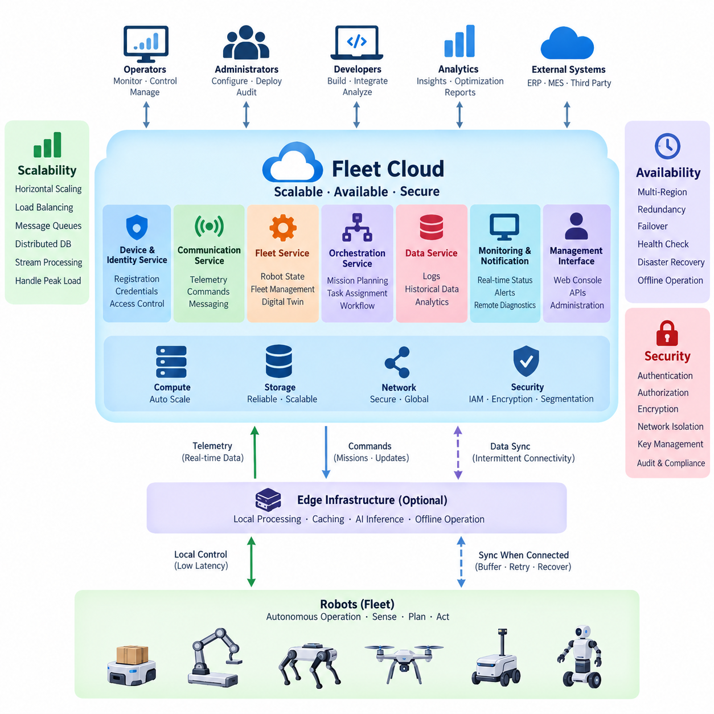
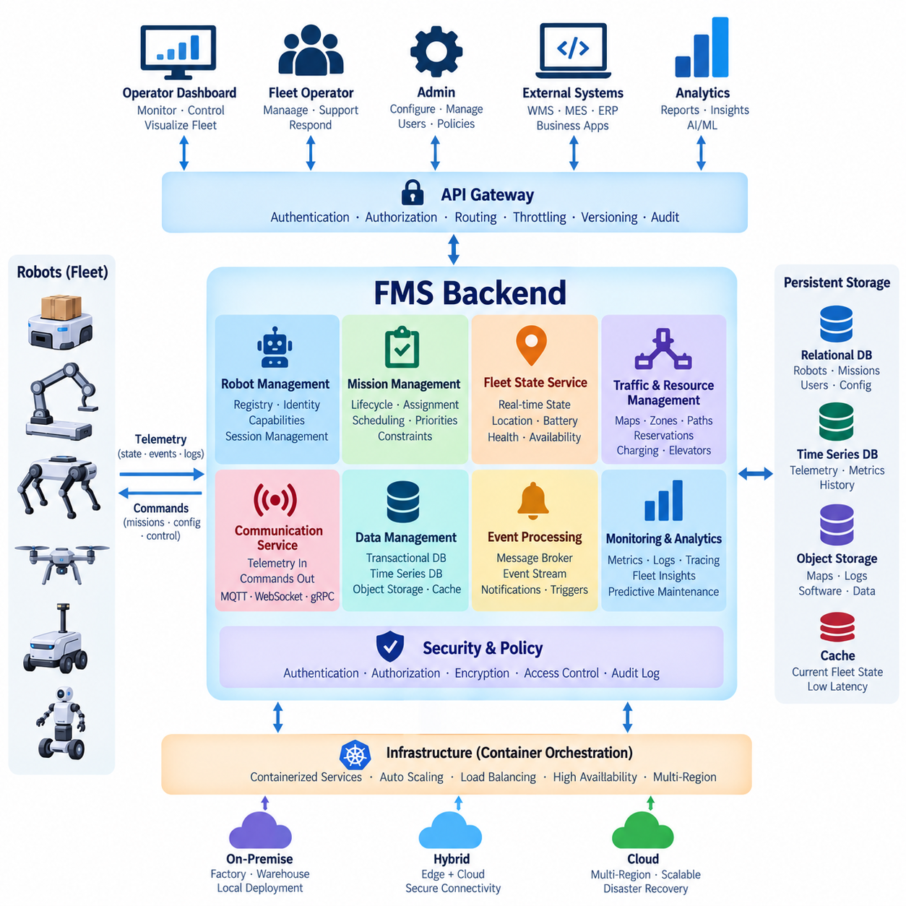
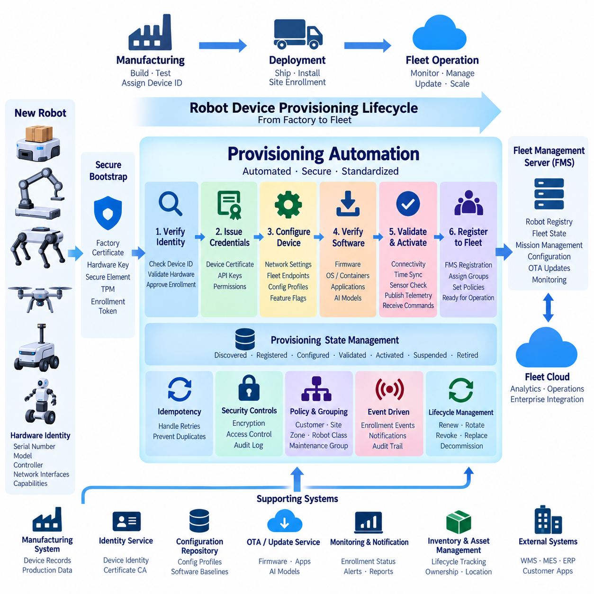
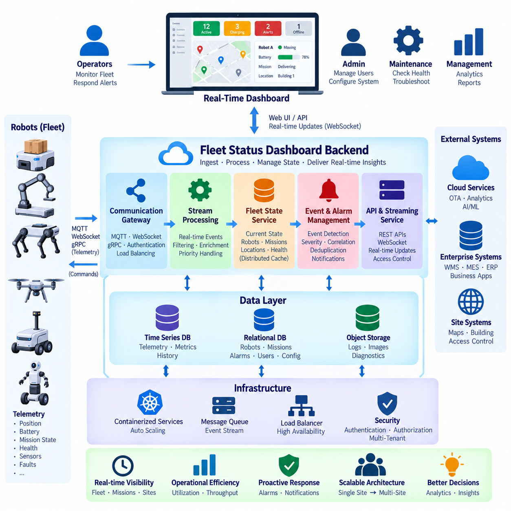
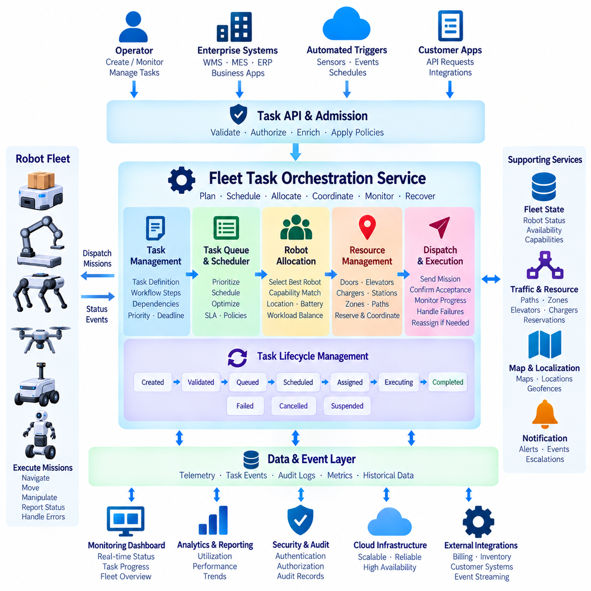
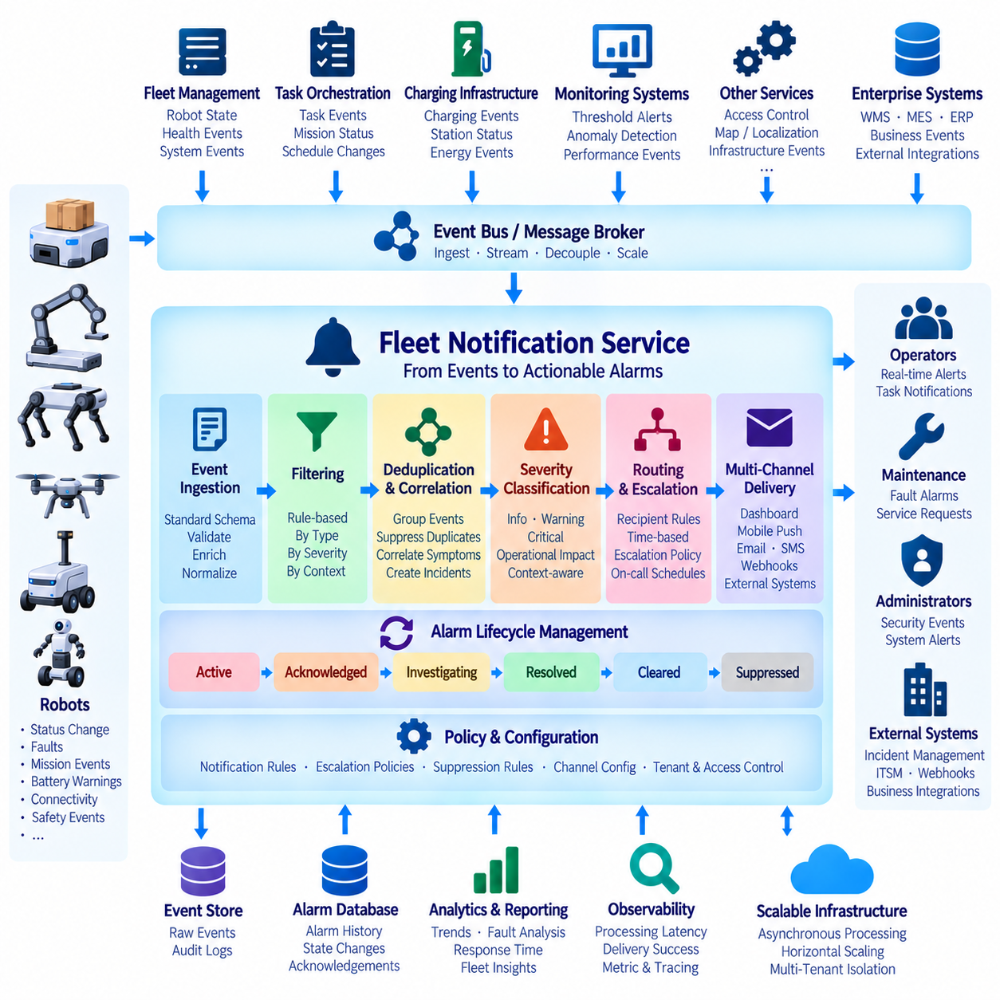
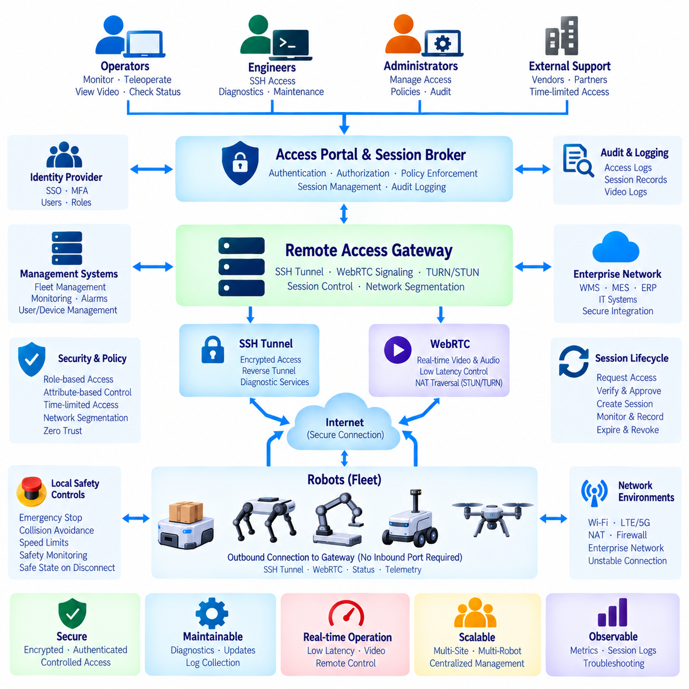
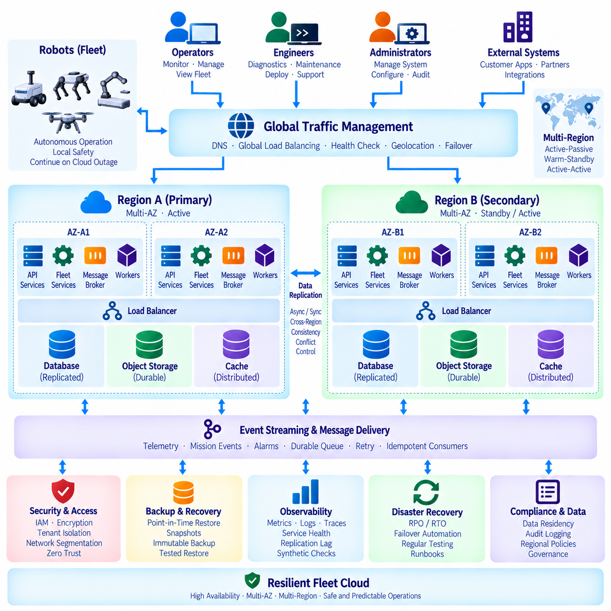
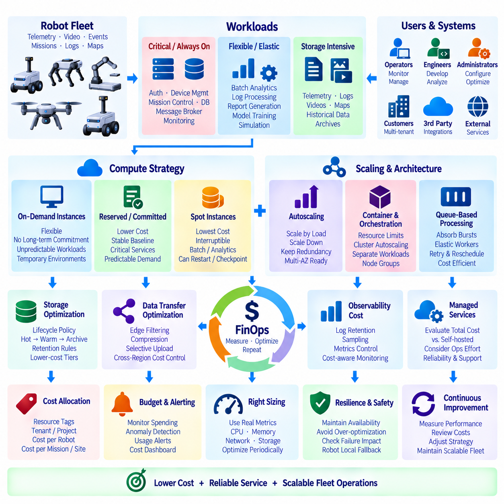
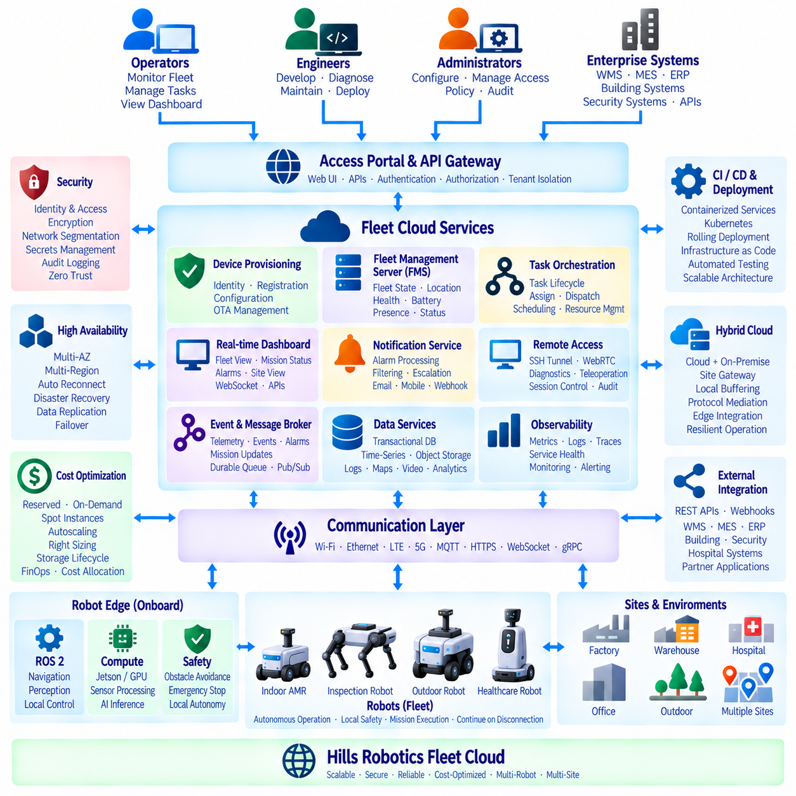

**Volume 09 Cloud and Edge Robotics**


# 08. Fleet Cloud

##  

## 08.01 Fleet Cloud Architecture: Scalability, Availability, Security

{width="7.268055555555556in" height="7.268055555555556in"}

A fleet cloud provides the shared backend environment through which large populations of robots can be registered, monitored, coordinated, updated, and analyzed. Unlike a conventional application cloud, it must continuously interact with physical machines whose connectivity, battery state, location, sensors, software versions, and operational conditions change over time. Its architecture therefore combines distributed cloud services with robot-aware state management and communication mechanisms.

The fundamental architectural separation is between robot-side execution and fleet-level coordination. Safety-critical motion control, obstacle avoidance, localization, and other latency-sensitive functions should remain on the robot or nearby edge infrastructure, while the cloud manages fleet state, missions, historical information, policies, analytics, and global optimization. This boundary prevents temporary cloud or network failures from immediately disabling autonomous robot operation.

A fleet cloud typically contains several logical service domains. Device and identity services maintain robot registration and credentials, communication services exchange telemetry and commands, fleet services maintain operational state, orchestration services assign missions, and data services store logs and historical records. Monitoring, notification, remote diagnostics, and administrative interfaces operate across these domains, creating a common operational view of the entire robot population.

Scalability begins by avoiding architectural assumptions that every robot can be represented by a permanently dedicated server process. As fleet size increases, telemetry messages, state transitions, API calls, mission requests, logs, and alerts may grow rapidly and unevenly. Stateless application services can therefore be replicated horizontally, while load balancers, message brokers, queues, caches, and distributed databases absorb variable workloads and separate producers from consumers.

Robot telemetry is particularly important because it creates continuous data streams rather than occasional application transactions. Position, battery state, operating mode, diagnostic values, mission progress, and fault information can arrive at different frequencies. A scalable architecture should classify these streams according to operational importance, aggregate or filter unnecessary high-frequency data, and independently scale ingestion, stream processing, persistent storage, and analytical workloads.

Event-driven communication helps reduce tight coupling among fleet services. A robot status update can be published once and consumed independently by monitoring, alerting, analytics, digital-twin, or mission-management components. Consumers can process events at different rates without forcing the robot communication layer to wait for every downstream service. Queues and durable event streams also provide buffering when temporary traffic bursts exceed immediate processing capacity.

Availability must be considered from the perspective of robot operations rather than only server uptime. A cloud endpoint can technically remain available while delayed commands, stale robot state, unavailable mission services, or database failures make the fleet operationally ineffective. Availability objectives should therefore cover communication, device identity, mission orchestration, state persistence, monitoring, and recovery paths, while robots retain defined autonomous behavior during cloud degradation or disconnection.

Redundancy eliminates unnecessary single points of failure. Critical fleet services can run across multiple compute instances or availability zones, with health checks and load balancing directing traffic toward healthy replicas. Databases may use replication and controlled failover, while messaging infrastructure should preserve important events when individual nodes fail. The architecture should distinguish components requiring immediate redundancy from analytical workloads that can tolerate temporary interruption.

Fleet systems must also assume intermittent robot connectivity. Wireless coverage changes as robots move through warehouses, factories, campuses, outdoor environments, elevators, or remote areas. Robot clients should therefore tolerate connection loss through local buffering, retry policies, session recovery, and synchronization after reconnection. Commands that become unsafe or meaningless after delay require expiration rules so that an old instruction is not executed merely because connectivity has returned.

Security begins with establishing a trustworthy identity for every robot, service, operator, and administrative interface. Device credentials should be unique rather than shared across an entire fleet, and authentication should precede access to fleet APIs or messaging channels. Authorization then limits each identity to required resources and operations. A compromised robot should not automatically gain authority to control other robots, modify fleet policies, or access unrelated operational information.

Encryption protects communication between robots, edge systems, and cloud services, but transport encryption alone is insufficient. Credentials and cryptographic keys require secure provisioning, storage, rotation, revocation, and replacement throughout the robot lifecycle. Secrets should not be embedded casually in software images or configuration files. When a robot is retired, transferred, lost, or suspected of compromise, its cloud identity must be removable without disrupting the remaining fleet.

Network and service segmentation further limit the consequences of compromise. Public APIs, operator interfaces, robot communication endpoints, internal microservices, databases, and administrative systems should not automatically share unrestricted trust. Firewalls, private networks, API gateways, service identities, and least-privilege access policies create boundaries between these areas. Sensitive management operations can receive stronger authentication and auditing than ordinary telemetry submission.

Fleet cloud security must also preserve command integrity. Commands such as mission cancellation, remote restart, configuration change, software deployment, or manual intervention can directly influence physical systems. The architecture should verify the sender, target robot, authorization scope, command freshness, and relevant operational context. Important actions should produce auditable records that identify what was requested, which system accepted it, and how the robot responded.

Observability connects scalability, availability, and security into one operational discipline. Infrastructure metrics alone cannot explain whether a robot fleet is functioning correctly. Cloud monitoring should correlate server health with message latency, connection state, mission success, command acknowledgement, battery conditions, software versions, and robot faults. Distributed tracing and structured logs can help engineers follow an operation from an external API through backend services to the affected robot.

Capacity planning should consider fleet behavior rather than robot count alone. One thousand robots sending low-rate health information can impose less infrastructure load than a much smaller fleet transmitting frequent sensor metadata or diagnostic events. Peak mission transitions, simultaneous reconnects after network restoration, mass software deployment, and incident-driven log uploads can create concentrated demand. Architecture should therefore be validated against realistic peak scenarios rather than simple average traffic.

Data architecture must reflect different consistency requirements. Authentication and deployment records may require strong transactional guarantees, whereas dashboards can often tolerate slightly delayed telemetry. Current robot state may benefit from low-latency caching, while long-term operational history can move into scalable analytical or object storage. Separating these workloads prevents expensive consistency or performance requirements from being imposed uniformly across all fleet data.

Disaster recovery extends availability beyond individual service failures. Backups, replicated configuration, infrastructure automation, recovery procedures, and geographically separated resources can restore fleet services after larger incidents. Recovery priorities should reflect operational dependency: restoring robot identity, communication, fleet state, and mission services may be more urgent than restoring historical analytics. Recovery procedures should be tested because an undocumented recovery assumption is not equivalent to a verified recovery capability.

A mature fleet cloud therefore treats scalability, availability, and security as interdependent architectural properties. Scaling without identity isolation increases the potential impact of compromise, redundancy without state consistency can create conflicting fleet information, and strong security without offline-aware operation can make robots unnecessarily dependent on connectivity. These properties must be designed together around the behavior of physical robots and their operating environments.

Within the broader Cloud and Edge Robotics structure, Fleet Cloud forms the operational bridge between hybrid cloud-edge infrastructure and specialized services such as fleet management backends, automated provisioning, real-time dashboards, task orchestration, event-driven notifications, remote access, high availability, and cost optimization. This foundation allows those later capabilities to evolve independently while sharing consistent principles for communication, identity, state, resilience, and security.

플릿 클라우드(Fleet Cloud)는 대규모 로봇 집단을 등록하고, 모니터링하며, 조정하고, 업데이트하고, 분석하기 위한 공유 백엔드 환경(Shared Backend Environment)을 제공한다. 일반적인 애플리케이션 클라우드(Application Cloud)와 달리, 플릿 클라우드는 연결 상태, 배터리 상태, 위치, 센서, 소프트웨어 버전, 운용 조건이 지속적으로 변화하는 물리적 기계와 상호작용해야 한다. 따라서 분산 클라우드 서비스(Distributed Cloud Services)와 로봇 인식형 상태 관리(Robot-Aware State Management), 통신 메커니즘(Communication Mechanism)을 결합한 아키텍처가 필요하다.

기본적인 아키텍처 분리는 로봇 측 실행(Robot-Side Execution)과 플릿 수준 조정(Fleet-Level Coordination) 사이에서 이루어진다. 안전 필수형 동작 제어(Safety-Critical Motion Control), 장애물 회피(Obstacle Avoidance), 위치 추정(Localization)과 같은 지연시간에 민감한 기능은 로봇 또는 인접한 엣지 인프라(Edge Infrastructure)에 유지하고, 클라우드는 플릿 상태, 임무, 이력 정보, 정책, 분석, 전역 최적화(Global Optimization)를 관리한다. 이러한 경계는 일시적인 클라우드 또는 네트워크 장애가 자율 로봇의 운용을 즉시 중단시키는 것을 방지한다.

플릿 클라우드는 일반적으로 여러 논리적 서비스 도메인(Logical Service Domain)으로 구성된다. 디바이스 및 아이덴티티 서비스(Device and Identity Service)는 로봇 등록과 자격 증명(Credential)을 관리하고, 통신 서비스(Communication Service)는 텔레메트리(Telemetry)와 명령을 교환하며, 플릿 서비스(Fleet Service)는 운용 상태를 유지한다. 오케스트레이션 서비스(Orchestration Service)는 임무를 할당하고, 데이터 서비스(Data Service)는 로그와 이력 데이터를 저장한다. 모니터링, 알림, 원격 진단, 관리 인터페이스는 이러한 도메인 전체에서 동작하여 전체 로봇 집단에 대한 공통 운용 관점(Common Operational View)을 제공한다.

확장성(Scalability)은 각 로봇마다 영구적으로 전용 서버 프로세스(Dedicated Server Process)를 할당해야 한다는 아키텍처 가정을 피하는 것에서 시작한다. 플릿 규모가 증가하면 텔레메트리 메시지, 상태 전환, API 호출, 임무 요청, 로그, 경보가 빠르고 불균일하게 증가할 수 있다. 따라서 무상태 애플리케이션 서비스(Stateless Application Service)를 수평 확장(Horizontal Scaling)하고, 로드 밸런서(Load Balancer), 메시지 브로커(Message Broker), 큐(Queue), 캐시(Cache), 분산 데이터베이스(Distributed Database)를 활용하여 가변적인 워크로드를 처리하고 생산자와 소비자를 분리할 수 있다.

로봇 텔레메트리(Robot Telemetry)는 간헐적인 애플리케이션 트랜잭션이 아니라 지속적인 데이터 스트림(Data Stream)을 생성하기 때문에 특히 중요하다. 위치, 배터리 상태, 운용 모드, 진단 값, 임무 진행 상황, 고장 정보는 서로 다른 주기로 전송될 수 있다. 확장 가능한 아키텍처는 이러한 스트림을 운용 중요도에 따라 분류하고, 불필요한 고주파 데이터를 집계하거나 필터링하며, 데이터 수집(Ingestion), 스트림 처리(Stream Processing), 영구 저장(Persistent Storage), 분석 워크로드(Analytical Workload)를 독립적으로 확장할 수 있어야 한다.

이벤트 기반 통신(Event-Driven Communication)은 플릿 서비스 간의 강한 결합(Tight Coupling)을 줄이는 데 도움이 된다. 하나의 로봇 상태 업데이트를 한 번 게시하면 모니터링, 경보, 분석, 디지털 트윈(Digital Twin), 임무 관리 구성요소가 이를 독립적으로 소비할 수 있다. 각 소비자는 로봇 통신 계층이 모든 하위 서비스의 처리를 기다리지 않고 서로 다른 속도로 이벤트를 처리할 수 있다. 큐와 내구성 이벤트 스트림(Durable Event Stream)은 일시적인 트래픽 급증이 즉각적인 처리 용량을 초과할 때 버퍼 역할도 수행한다.

가용성(Availability)은 단순한 서버 가동 시간(Server Uptime)이 아니라 로봇 운용의 관점에서 고려해야 한다. 클라우드 엔드포인트(Cloud Endpoint)가 기술적으로 동작하고 있더라도 명령이 지연되거나 로봇 상태가 오래되었거나 임무 서비스 또는 데이터베이스를 사용할 수 없다면 플릿은 실질적으로 정상 운용되지 못할 수 있다. 따라서 가용성 목표는 통신, 디바이스 아이덴티티(Device Identity), 임무 오케스트레이션(Mission Orchestration), 상태 영속성(State Persistence), 모니터링, 복구 경로를 포함해야 하며, 클라우드 성능 저하나 연결 단절 중에도 로봇은 정의된 자율 동작을 유지해야 한다.

중복성(Redundancy)은 불필요한 단일 장애점(Single Point of Failure)을 제거한다. 핵심 플릿 서비스는 여러 컴퓨팅 인스턴스(Compute Instance) 또는 가용 영역(Availability Zone)에 걸쳐 실행할 수 있으며, 상태 확인(Health Check)과 로드 밸런싱(Load Balancing)을 통해 정상적인 복제본으로 트래픽을 전달할 수 있다. 데이터베이스는 복제(Replication)와 제어된 장애조치(Failover)를 사용할 수 있고, 메시징 인프라는 개별 노드가 실패하더라도 중요한 이벤트를 보존해야 한다. 또한 즉각적인 중복성이 필요한 구성요소와 일시적 중단을 허용할 수 있는 분석 워크로드를 구분해야 한다.

플릿 시스템은 로봇 연결이 간헐적으로 끊어질 수 있다는 점도 기본적으로 가정해야 한다. 로봇이 창고, 공장, 캠퍼스, 실외 환경, 엘리베이터 또는 원격 지역을 이동함에 따라 무선 네트워크 범위가 변화한다. 따라서 로봇 클라이언트(Robot Client)는 로컬 버퍼링(Local Buffering), 재시도 정책(Retry Policy), 세션 복구(Session Recovery), 재연결 후 동기화를 통해 연결 단절을 견딜 수 있어야 한다. 지연된 후에는 위험하거나 의미가 없어지는 명령에는 만료 규칙(Expiration Rule)을 적용하여 연결이 복구되었다는 이유만으로 오래된 명령이 실행되는 것을 방지해야 한다.

보안(Security)은 모든 로봇, 서비스, 운영자, 관리 인터페이스에 신뢰할 수 있는 아이덴티티(Identity)를 설정하는 것에서 시작한다. 디바이스 자격 증명(Device Credential)은 전체 플릿에서 공유하지 않고 로봇별로 고유해야 하며, 플릿 API 또는 메시징 채널에 접근하기 전에 인증(Authentication)을 수행해야 한다. 이후 인가(Authorization)를 통해 각 아이덴티티가 필요한 리소스와 작업에만 접근하도록 제한한다. 하나의 로봇이 침해되더라도 다른 로봇을 제어하거나 플릿 정책을 변경하거나 관련 없는 운용 정보에 접근할 권한까지 자동으로 획득해서는 안 된다.

암호화(Encryption)는 로봇, 엣지 시스템, 클라우드 서비스 사이의 통신을 보호하지만 전송 암호화(Transport Encryption)만으로는 충분하지 않다. 자격 증명과 암호화 키(Cryptographic Key)는 로봇의 전체 수명주기 동안 안전한 프로비저닝(Provisioning), 저장, 교체(Rotation), 폐기(Revocation), 갱신 절차를 필요로 한다. 비밀 정보(Secret)는 소프트웨어 이미지나 설정 파일에 무분별하게 포함해서는 안 된다. 로봇이 폐기, 양도, 분실되거나 침해가 의심될 경우 나머지 플릿의 운용에 영향을 주지 않고 해당 로봇의 클라우드 아이덴티티를 제거할 수 있어야 한다.

네트워크 및 서비스 분할(Network and Service Segmentation)은 침해 발생 시 영향 범위를 더욱 제한한다. 공개 API, 운영자 인터페이스, 로봇 통신 엔드포인트, 내부 마이크로서비스(Microservice), 데이터베이스, 관리 시스템 사이에 무제한적인 신뢰 관계를 두어서는 안 된다. 방화벽(Firewall), 사설 네트워크(Private Network), API 게이트웨이(API Gateway), 서비스 아이덴티티(Service Identity), 최소 권한 접근 정책(Least-Privilege Access Policy)을 이용하여 영역 간 경계를 형성할 수 있다. 민감한 관리 작업에는 일반적인 텔레메트리 제출보다 강화된 인증과 감사(Auditing)를 적용할 수 있다.

플릿 클라우드 보안은 명령 무결성(Command Integrity)도 보장해야 한다. 임무 취소, 원격 재시작, 설정 변경, 소프트웨어 배포, 수동 개입과 같은 명령은 물리적 시스템의 동작에 직접 영향을 줄 수 있다. 따라서 아키텍처는 명령 발신자, 대상 로봇, 인가 범위, 명령의 최신성(Command Freshness), 관련 운용 상황을 검증해야 한다. 중요한 작업은 무엇이 요청되었는지, 어떤 시스템이 이를 승인했는지, 로봇이 어떻게 응답했는지를 확인할 수 있는 감사 기록(Audit Record)을 생성해야 한다.

관측 가능성(Observability)은 확장성, 가용성, 보안을 하나의 운용 체계로 연결한다. 인프라 메트릭(Infrastructure Metric)만으로는 로봇 플릿이 정상적으로 기능하는지 설명할 수 없다. 클라우드 모니터링은 서버 상태를 메시지 지연시간, 연결 상태, 임무 성공 여부, 명령 승인(Command Acknowledgement), 배터리 상태, 소프트웨어 버전, 로봇 고장과 연계해야 한다. 분산 추적(Distributed Tracing)과 구조화 로그(Structured Log)를 사용하면 외부 API에서 백엔드 서비스를 거쳐 대상 로봇까지 이어지는 작업 흐름을 엔지니어가 추적할 수 있다.

용량 계획(Capacity Planning)은 단순한 로봇 대수가 아니라 플릿의 실제 동작 특성을 고려해야 한다. 낮은 빈도로 상태 정보만 전송하는 1,000대의 로봇이 고빈도 센서 메타데이터 또는 진단 이벤트를 전송하는 훨씬 작은 플릿보다 인프라 부하가 낮을 수도 있다. 임무의 집중적인 전환, 네트워크 복구 후 동시 재연결, 대규모 소프트웨어 배포, 사고 발생 시 로그 업로드 등은 순간적으로 높은 부하를 발생시킬 수 있다. 따라서 단순 평균 트래픽이 아니라 현실적인 최대 부하 시나리오(Peak Scenario)를 기준으로 아키텍처를 검증해야 한다.

데이터 아키텍처(Data Architecture)는 데이터마다 서로 다른 일관성 요구사항(Consistency Requirement)이 존재한다는 점을 반영해야 한다. 인증 및 배포 기록에는 강력한 트랜잭션 보장(Transactional Guarantee)이 필요할 수 있지만, 대시보드는 약간 지연된 텔레메트리를 허용할 수 있다. 현재 로봇 상태에는 저지연 캐싱(Low-Latency Caching)이 적합하고, 장기 운용 이력은 확장 가능한 분석 스토리지(Analytical Storage) 또는 객체 스토리지(Object Storage)로 이동할 수 있다. 이러한 워크로드를 분리하면 모든 플릿 데이터에 동일하게 높은 수준의 일관성과 성능 요구사항을 적용하는 비효율을 방지할 수 있다.

재해 복구(Disaster Recovery)는 개별 서비스 장애를 넘어 전체적인 가용성을 확장한다. 백업(Backup), 복제된 설정, 인프라 자동화(Infrastructure Automation), 복구 절차, 지리적으로 분리된 리소스를 활용하면 대규모 장애 이후 플릿 서비스를 복구할 수 있다. 복구 우선순위는 실제 운용 의존성을 반영해야 하며, 과거 분석 데이터를 복원하는 것보다 로봇 아이덴티티, 통신, 플릿 상태, 임무 서비스를 먼저 복구하는 것이 중요할 수 있다. 또한 문서화된 복구 가정만으로는 충분하지 않으며 실제 복구 절차를 시험하여 검증해야 한다.

성숙한 플릿 클라우드는 확장성(Scalability), 가용성(Availability), 보안(Security)을 서로 독립적인 기능이 아니라 상호 의존적인 아키텍처 속성으로 다룬다. 아이덴티티 격리 없이 시스템을 확장하면 침해의 잠재적 영향이 커지고, 상태 일관성 없이 중복성만 강화하면 상충되는 플릿 정보가 생성될 수 있다. 또한 오프라인 대응 능력이 없는 강력한 보안 구조는 로봇을 네트워크 연결에 지나치게 의존하게 만들 수 있다. 따라서 이 세 가지 속성은 물리적 로봇과 실제 운용 환경의 특성을 중심으로 함께 설계해야 한다.

보다 광범위한 클라우드 및 엣지 로보틱스(Cloud and Edge Robotics) 구조에서 플릿 클라우드(Fleet Cloud)는 하이브리드 클라우드-엣지 인프라(Hybrid Cloud-Edge Infrastructure)와 플릿 관리 백엔드(Fleet Management Backend), 자동 프로비저닝(Automated Provisioning), 실시간 대시보드(Real-Time Dashboard), 작업 오케스트레이션(Task Orchestration), 이벤트 기반 알림(Event-Driven Notification), 원격 접근(Remote Access), 고가용성(High Availability), 비용 최적화(Cost Optimization)와 같은 전문 서비스 사이를 연결하는 운용 기반을 형성한다. 이러한 기반을 통해 이후의 각 기능은 통신, 아이덴티티, 상태, 복원력(Resilience), 보안에 대한 일관된 원칙을 공유하면서도 독립적으로 발전할 수 있다.

##  

## 08.02 Fleet Management Server (FMS) Backend Architecture [w/Code]

{width="7.268055555555556in" height="7.268055555555556in"}

A Fleet Management Server (FMS) backend is the central software layer responsible for coordinating robot operations across a fleet. While individual robots execute perception, localization, navigation, obstacle avoidance, and low-level control locally, the FMS maintains a global operational view. It connects robot state, missions, maps, resources, operators, and enterprise systems so that independent autonomous machines can operate as a coordinated system.

The backend architecture should separate robot autonomy from fleet-level decision making. A robot must remain capable of safe local behavior when communication with the FMS is delayed or temporarily unavailable. The server therefore focuses on functions requiring shared knowledge, including task assignment, traffic coordination, mission lifecycle management, fleet monitoring, resource allocation, operational policy, and synchronization of information used by multiple robots.

A typical FMS backend exposes a communication gateway between robots and cloud services. This gateway receives telemetry such as robot position, velocity, battery state, operating mode, mission progress, health information, and fault events. In the opposite direction, it delivers missions, configuration changes, operational commands, and acknowledgements. MQTT, WebSocket, gRPC, REST APIs, or similar protocols can be selected according to latency, reliability, and integration requirements.

Robot identity and session management form another fundamental backend function. Each connected robot should have a unique identity, authenticated credentials, hardware and software metadata, capability information, and current connection state. The FMS can maintain a robot registry containing model type, payload capability, installed sensors, software version, operational permissions, and supported mission types, allowing higher-level services to determine which robots are suitable for particular tasks.

The fleet state service maintains the current operational representation of every robot. Instead of repeatedly querying physical robots whenever another service requires information, the backend maintains synchronized state derived from telemetry and events. Position, battery level, availability, mission state, alarms, connectivity, and maintenance conditions can therefore be accessed through a consistent interface by dashboards, schedulers, orchestration services, analytics systems, and external applications.

Mission management represents the lifecycle of work assigned to robots. A mission can progress through states such as created, queued, assigned, accepted, executing, completed, cancelled, or failed. The backend records these transitions and associates missions with robots, destinations, priorities, payload requirements, deadlines, and operational constraints. Persistent mission state allows the system to recover correctly after service restarts or temporary communication failures without losing knowledge of active operations.

Task allocation determines which robot should execute each mission. Simple systems may assign the nearest available robot, while larger fleets can consider battery level, estimated travel time, robot capability, workload, charging requirements, congestion, mission priority, and resource availability. The allocation engine should remain logically separated from mission persistence so that scheduling algorithms can evolve without changing the fundamental representation of missions or robot state.

Traffic and resource coordination become important when multiple robots share constrained physical infrastructure. Corridors, intersections, doors, elevators, loading stations, charging points, work cells, and transfer locations may need coordinated access. The FMS backend can represent these resources and manage reservations or permissions, while local navigation remains responsible for immediate collision avoidance. This separation combines global coordination with fast robot-side safety behavior.

An event-driven architecture is useful because fleet operations naturally produce asynchronous state changes. Robot connection, mission completion, low battery, localization failure, blocked path, charging completion, emergency state, and software faults can be represented as events. A message broker or event stream can distribute these events to mission management, notification, monitoring, analytics, and persistence services without requiring every component to communicate directly with every other component.

Persistent storage should be divided according to data characteristics rather than forcing all information into one database. Transactional storage can maintain robot registrations, missions, users, permissions, and configuration. Low-latency caches can hold frequently accessed current fleet state, while time-series storage can preserve telemetry and operational metrics. Object storage may contain maps, diagnostic archives, sensor snapshots, software packages, and other large artifacts generated during fleet operation.

The FMS backend should expose well-defined APIs to operator interfaces and external enterprise systems. Dashboards require fleet state, mission information, alarms, and operational history, while warehouse management systems, manufacturing execution systems, ERP platforms, or customer applications may create tasks and retrieve results. An API gateway can provide authentication, authorization, request routing, throttling, version management, and auditing without exposing internal services directly.

Security is especially important because backend commands can cause physical actions. Authentication verifies robots, operators, and external applications, while authorization determines which fleet resources and operations each identity may access. Sensitive commands such as mission cancellation, remote restart, manual movement requests, configuration changes, or software deployment should be controlled by explicit permissions and recorded in audit logs that support operational and security investigation.

The backend must handle disconnected and intermittently connected robots without corrupting fleet state. Communication sessions should support retries, acknowledgements, sequence information, and appropriate message expiration. When a robot reconnects, the server and robot must reconcile mission status and relevant state rather than assuming that the last cloud record remains correct. Commands that are no longer operationally valid should expire instead of being executed unexpectedly after a long network interruption.

Scalability requires FMS services to avoid unnecessary dependence on local process memory. Stateless API gateways and application services can be replicated horizontally behind load balancers, while persistent state is maintained in databases, distributed caches, and messaging infrastructure. Partitioning fleets by customer, site, region, or logical group can reduce contention and create clear operational boundaries as the number of connected robots and facilities increases.

High availability requires critical FMS components to tolerate infrastructure and software failures. Multiple service instances, replicated databases, redundant message brokers, health checks, automated restart, and controlled failover can prevent individual failures from stopping fleet operation. Robots should simultaneously retain defined offline behavior so that a backend outage results in controlled degradation rather than immediate loss of autonomous safety or basic navigation capabilities.

Observability must connect backend behavior with physical fleet behavior. Metrics such as API latency, message throughput, queue depth, database response time, and service health should be correlated with robot connectivity, mission duration, task failures, battery conditions, blocked states, and command acknowledgement. Structured logging, distributed tracing, and event histories allow engineers to reconstruct how a fleet-level request propagated through backend services and ultimately affected a robot.

Backend deployment can use containers and orchestration platforms to provide reproducible service packaging, horizontal scaling, health management, and controlled software updates. Individual services can be upgraded independently when interfaces remain compatible. However, microservice decomposition should follow meaningful operational boundaries rather than splitting every function unnecessarily, because excessive service fragmentation increases network communication, observability requirements, deployment complexity, and failure modes.

The FMS backend ultimately acts as the coordination plane between autonomous robots and higher-level business operations. Robot-side software provides immediate physical autonomy, while the backend provides shared state, mission orchestration, resource coordination, historical persistence, security, and enterprise integration. A well-designed architecture preserves this boundary and allows robot fleets to grow from a few machines at one site into distributed operational systems without redesigning the fundamental management model.

플릿 관리 서버(Fleet Management Server, FMS) 백엔드는 전체 로봇 플릿(Fleet)의 운용을 조정하는 중앙 소프트웨어 계층(Central Software Layer)이다. 개별 로봇은 인지(Perception), 위치 추정(Localization), 내비게이션(Navigation), 장애물 회피(Obstacle Avoidance), 저수준 제어(Low-Level Control)를 로컬에서 수행하는 반면, FMS는 전체 운용 상태(Global Operational View)를 유지한다. 이를 통해 로봇 상태, 임무, 지도, 자원, 운영자, 기업 시스템을 연결하여 독립적으로 동작하는 자율 기계들이 하나의 조정된 시스템으로 운용될 수 있도록 한다.

백엔드 아키텍처(Backend Architecture)는 로봇 자율성(Robot Autonomy)과 플릿 수준 의사결정(Fleet-Level Decision Making)을 분리해야 한다. FMS와의 통신이 지연되거나 일시적으로 사용할 수 없는 상황에서도 로봇은 안전한 로컬 동작을 유지할 수 있어야 한다. 따라서 서버는 작업 할당(Task Assignment), 교통 조정(Traffic Coordination), 임무 수명주기 관리(Mission Lifecycle Management), 플릿 모니터링, 자원 할당(Resource Allocation), 운용 정책, 여러 로봇이 사용하는 정보의 동기화와 같이 공유 지식이 필요한 기능에 집중한다.

일반적인 FMS 백엔드는 로봇과 클라우드 서비스 사이에 통신 게이트웨이(Communication Gateway)를 제공한다. 이 게이트웨이는 로봇 위치, 속도, 배터리 상태, 운용 모드, 임무 진행 상황, 상태 정보, 고장 이벤트 등의 텔레메트리(Telemetry)를 수신한다. 반대 방향으로는 임무, 설정 변경, 운용 명령, 승인 응답(Acknowledgement)을 전달한다. MQTT, 웹소켓(WebSocket), gRPC, REST API 등의 프로토콜은 지연시간, 신뢰성, 통합 요구사항에 따라 선택할 수 있다.

로봇 아이덴티티 및 세션 관리(Robot Identity and Session Management)는 또 다른 핵심 백엔드 기능이다. 연결된 각 로봇은 고유한 아이덴티티(Identity), 인증된 자격 증명(Credential), 하드웨어 및 소프트웨어 메타데이터, 기능 정보, 현재 연결 상태를 가져야 한다. FMS는 모델 유형, 페이로드 능력(Payload Capability), 설치된 센서, 소프트웨어 버전, 운용 권한, 지원 임무 유형 등을 포함하는 로봇 레지스트리(Robot Registry)를 유지하여 상위 서비스가 특정 작업에 적합한 로봇을 판단할 수 있도록 한다.

플릿 상태 서비스(Fleet State Service)는 모든 로봇의 현재 운용 상태 표현을 유지한다. 다른 서비스가 정보를 필요로 할 때마다 물리적 로봇에 반복적으로 질의하는 대신, 백엔드는 텔레메트리와 이벤트를 기반으로 동기화된 상태를 관리한다. 따라서 위치, 배터리 수준, 가용 상태, 임무 상태, 경보, 연결 상태, 유지보수 상태 등을 대시보드, 스케줄러(Scheduler), 오케스트레이션 서비스(Orchestration Service), 분석 시스템, 외부 애플리케이션이 일관된 인터페이스를 통해 이용할 수 있다.

임무 관리(Mission Management)는 로봇에 할당되는 작업의 수명주기(Lifecycle)를 표현한다. 하나의 임무는 생성(Created), 대기(Queued), 할당(Assigned), 수락(Accepted), 실행(Executing), 완료(Completed), 취소(Cancelled), 실패(Failed) 등의 상태를 거칠 수 있다. 백엔드는 이러한 상태 전환을 기록하고 임무를 로봇, 목적지, 우선순위, 페이로드 요구사항, 마감시간, 운용 제약조건과 연결한다. 영속적인 임무 상태(Persistent Mission State)는 서비스 재시작이나 일시적인 통신 장애 이후에도 진행 중인 작업에 대한 정보를 잃지 않고 시스템을 올바르게 복구할 수 있도록 한다.

작업 할당(Task Allocation)은 각 임무를 어떤 로봇이 수행할 것인지를 결정한다. 단순한 시스템에서는 가장 가까운 가용 로봇을 선택할 수 있지만, 대규모 플릿에서는 배터리 수준, 예상 이동시간, 로봇 기능, 작업 부하, 충전 요구사항, 혼잡도, 임무 우선순위, 자원 가용성을 함께 고려할 수 있다. 할당 엔진(Allocation Engine)은 임무 영속성(Mission Persistence)과 논리적으로 분리하여 임무나 로봇 상태의 기본 표현을 변경하지 않고도 스케줄링 알고리즘을 발전시킬 수 있도록 해야 한다.

여러 로봇이 제한된 물리적 인프라를 공유하면 교통 및 자원 조정(Traffic and Resource Coordination)이 중요해진다. 복도, 교차로, 문, 엘리베이터, 적재 스테이션, 충전 지점, 작업 셀, 이송 위치 등은 조정된 접근이 필요할 수 있다. FMS 백엔드는 이러한 자원을 표현하고 예약(Reservation) 또는 접근 권한을 관리할 수 있으며, 로컬 내비게이션은 즉각적인 충돌 회피를 담당한다. 이러한 분리는 전역 조정(Global Coordination)과 빠른 로봇 측 안전 동작을 결합한다.

이벤트 기반 아키텍처(Event-Driven Architecture)는 플릿 운용에서 비동기 상태 변화가 자연스럽게 발생하기 때문에 유용하다. 로봇 연결, 임무 완료, 배터리 부족, 위치 추정 실패, 경로 차단, 충전 완료, 비상 상태, 소프트웨어 고장 등을 이벤트로 표현할 수 있다. 메시지 브로커(Message Broker) 또는 이벤트 스트림(Event Stream)은 모든 구성요소가 서로 직접 통신하지 않아도 이러한 이벤트를 임무 관리, 알림, 모니터링, 분석, 영속성 서비스에 배포할 수 있도록 한다.

영구 저장소(Persistent Storage)는 모든 정보를 하나의 데이터베이스에 저장하기보다 데이터 특성에 따라 분리해야 한다. 트랜잭션 저장소(Transactional Storage)는 로봇 등록, 임무, 사용자, 권한, 설정을 관리할 수 있다. 저지연 캐시(Low-Latency Cache)는 자주 접근하는 현재 플릿 상태를 저장하고, 시계열 저장소(Time-Series Storage)는 텔레메트리와 운용 메트릭을 보존할 수 있다. 객체 스토리지(Object Storage)는 지도, 진단 아카이브, 센서 스냅샷, 소프트웨어 패키지 및 플릿 운용 과정에서 생성되는 대용량 데이터를 저장할 수 있다.

FMS 백엔드는 운영자 인터페이스와 외부 기업 시스템을 위한 명확하게 정의된 API를 제공해야 한다. 대시보드는 플릿 상태, 임무 정보, 경보, 운용 이력을 필요로 하며, 창고 관리 시스템(Warehouse Management System), 제조 실행 시스템(Manufacturing Execution System), 전사적 자원관리(Enterprise Resource Planning, ERP) 플랫폼 또는 고객 애플리케이션은 작업을 생성하고 결과를 조회할 수 있다. API 게이트웨이(API Gateway)는 내부 서비스를 직접 노출하지 않고 인증, 인가, 요청 라우팅(Request Routing), 속도 제한(Throttling), 버전 관리, 감사를 제공할 수 있다.

백엔드 명령은 실제 물리적 동작을 발생시킬 수 있기 때문에 보안(Security)이 특히 중요하다. 인증(Authentication)은 로봇, 운영자, 외부 애플리케이션의 신원을 확인하며, 인가(Authorization)는 각 아이덴티티가 접근할 수 있는 플릿 자원과 작업 범위를 결정한다. 임무 취소, 원격 재시작, 수동 이동 요청, 설정 변경, 소프트웨어 배포와 같은 민감한 명령은 명시적인 권한으로 제어하고 운용 및 보안 조사에 활용할 수 있도록 감사 로그(Audit Log)에 기록해야 한다.

백엔드는 연결이 끊기거나 간헐적으로 연결되는 로봇에서도 플릿 상태가 손상되지 않도록 처리해야 한다. 통신 세션은 재시도(Retry), 승인 응답, 시퀀스 정보(Sequence Information), 적절한 메시지 만료(Message Expiration)를 지원해야 한다. 로봇이 다시 연결되면 서버와 로봇은 마지막 클라우드 기록이 여전히 정확하다고 가정하지 않고 임무 상태와 관련 상태 정보를 조정(Reconciliation)해야 한다. 더 이상 운용적으로 유효하지 않은 명령은 오랜 네트워크 단절 후 예상치 못하게 실행되지 않도록 만료되어야 한다.

확장성(Scalability)을 확보하려면 FMS 서비스가 로컬 프로세스 메모리(Local Process Memory)에 불필요하게 의존하지 않도록 설계해야 한다. 무상태 API 게이트웨이(Stateless API Gateway)와 애플리케이션 서비스는 로드 밸런서 뒤에서 수평 확장할 수 있으며, 영속 상태는 데이터베이스, 분산 캐시(Distributed Cache), 메시징 인프라에 유지할 수 있다. 고객, 사이트, 지역 또는 논리 그룹에 따라 플릿을 분할하면 연결된 로봇과 시설 수가 증가하더라도 경합을 줄이고 명확한 운용 경계를 형성할 수 있다.

고가용성(High Availability)을 위해서는 핵심 FMS 구성요소가 인프라 및 소프트웨어 장애를 견딜 수 있어야 한다. 다중 서비스 인스턴스, 복제 데이터베이스(Replicated Database), 중복 메시지 브로커, 상태 확인(Health Check), 자동 재시작, 제어된 장애조치(Failover)를 통해 개별 장애가 전체 플릿 운용을 중단시키는 것을 방지할 수 있다. 동시에 로봇은 정의된 오프라인 동작(Offline Behavior)을 유지하여 백엔드 장애가 발생하더라도 자율 안전 기능이나 기본적인 내비게이션 능력을 즉시 상실하지 않도록 해야 한다.

관측 가능성(Observability)은 백엔드 동작과 실제 물리적 플릿 동작을 연결해야 한다. API 지연시간, 메시지 처리량, 큐 깊이(Queue Depth), 데이터베이스 응답시간, 서비스 상태 등의 메트릭을 로봇 연결 상태, 임무 수행시간, 작업 실패, 배터리 상태, 경로 차단 상태, 명령 승인과 연계해야 한다. 구조화 로그(Structured Logging), 분산 추적(Distributed Tracing), 이벤트 이력(Event History)을 이용하면 엔지니어가 플릿 수준의 요청이 백엔드 서비스를 거쳐 최종적으로 로봇에 어떤 영향을 주었는지 재구성할 수 있다.

백엔드 배포(Backend Deployment)에는 컨테이너(Container)와 오케스트레이션 플랫폼(Orchestration Platform)을 사용하여 재현 가능한 서비스 패키징, 수평 확장, 상태 관리, 제어된 소프트웨어 업데이트를 제공할 수 있다. 인터페이스 호환성이 유지된다면 개별 서비스를 독립적으로 업그레이드할 수 있다. 그러나 마이크로서비스 분해(Microservice Decomposition)는 의미 있는 운용 경계를 기준으로 수행해야 하며, 모든 기능을 불필요하게 세분화하면 네트워크 통신, 관측 가능성 요구사항, 배포 복잡성, 장애 유형이 증가할 수 있다.

FMS 백엔드는 궁극적으로 자율 로봇과 상위 비즈니스 운영 사이의 조정 계층(Coordination Plane) 역할을 한다. 로봇 측 소프트웨어는 즉각적인 물리적 자율성(Physical Autonomy)을 제공하고, 백엔드는 공유 상태, 임무 오케스트레이션, 자원 조정, 이력 영속성, 보안, 기업 시스템 통합을 제공한다. 잘 설계된 아키텍처는 이러한 경계를 유지하면서 단일 사이트의 소수 로봇에서 여러 지역에 분산된 대규모 운용 시스템으로 플릿이 확장되더라도 기본 관리 모델을 다시 설계하지 않고 성장할 수 있도록 한다.

##  

## 08.03 Robot Device Provisioning Automation [w/Code]

{width="7.268055555555556in" height="7.268055555555556in"}

Robot device provisioning is the controlled process of transforming a newly manufactured or reset robot into a trusted, identifiable, and manageable member of a fleet. In small deployments, engineers may configure devices manually, but this approach becomes unreliable as fleet size increases. Provisioning automation replaces repeated manual work with standardized workflows for identity creation, credential installation, configuration, registration, validation, and activation.

The provisioning lifecycle should begin before the robot connects to the operational fleet. Manufacturing or integration systems can assign a unique device identifier linked to hardware information such as serial number, robot model, controller type, network interfaces, and supported capabilities. This identity becomes the reference used throughout deployment, operation, maintenance, software updates, incident investigation, ownership transfer, and eventual device retirement.

A secure bootstrap mechanism establishes the initial trust relationship between the robot and the provisioning service. The robot requires enough trusted information to identify the legitimate server without embedding fleet-wide reusable secrets. Factory-installed certificates, hardware-backed keys, secure elements, TPM-based credentials, or controlled enrollment tokens can provide this bootstrap identity. The objective is to prevent an unauthorized device from registering simply by knowing a fleet endpoint.

When the robot first connects, the provisioning backend verifies its bootstrap identity and determines whether enrollment is permitted. Validation may compare serial numbers, manufacturing records, expected hardware characteristics, ownership information, or previously approved enrollment requests. Successful verification allows the backend to create the robot\'s operational identity, while failed or suspicious requests can remain quarantined for investigation instead of receiving normal fleet access.

Operational credentials should normally be unique for each robot. After successful enrollment, the provisioning service can issue device certificates, API credentials, messaging permissions, or other authentication material required by the fleet platform. Unique credentials allow one robot to be revoked without affecting the rest of the fleet. They also provide a reliable basis for associating telemetry, commands, audit records, and configuration changes with a specific physical device.

Provisioning automation should register the device with the Fleet Management Server (FMS) at the same time that credentials are established. The registration record can contain robot identity, model, hardware revision, software baseline, payload capability, sensor configuration, communication interfaces, operational site, and supported mission types. This information allows downstream fleet services to understand what the robot is and which tasks or policies are applicable to it.

Configuration assignment can be driven by metadata rather than performed manually on every robot. A provisioning service can associate devices with configuration profiles according to model, customer, site, region, hardware revision, or operational role. Network parameters, fleet endpoints, logging policies, telemetry intervals, map references, feature flags, and application settings can then be delivered consistently while preserving site-specific or robot-specific differences where necessary.

Software baseline verification is another important provisioning step. Before activation, the backend can compare installed firmware, operating system components, containers, robot applications, AI models, and configuration versions against an approved baseline. Devices with outdated or incompatible software can be directed into an update workflow before joining normal operations. This reduces configuration drift and prevents newly deployed robots from starting with inconsistent software environments.

Automated provisioning should be implemented as a stateful workflow rather than a single registration request. A device may progress through states such as discovered, identity verified, registered, credentials issued, configured, validated, activated, suspended, or retired. Recording these transitions makes failures visible and allows interrupted provisioning to resume safely without repeating sensitive operations or creating duplicate identities in the fleet database.

Idempotency is particularly important when network interruptions occur during enrollment. A robot may submit the same provisioning request multiple times because it does not know whether a previous response was received. Backend operations should therefore recognize repeated requests and return the existing result whenever appropriate rather than generating another robot identity or credential set. Transaction identifiers and persistent provisioning state can support this behavior.

The provisioning workflow should include validation before a robot becomes operational. Automated checks can confirm network connectivity, time synchronization, certificate validity, software versions, storage availability, required services, sensor presence, and communication with the FMS. Application-level tests may verify that telemetry can be published and authorized commands can be received. Failed validation should prevent activation until the identified problem has been corrected.

Fleet grouping can also be automated during provisioning. Robots may be assigned to a customer, facility, building, operational zone, robot class, maintenance group, or deployment wave. These groups can later control mission eligibility, monitoring dashboards, configuration policies, OTA deployment schedules, access permissions, and alert routing. Automated grouping reduces administrative effort and makes large fleets easier to manage through policy rather than individual device configuration.

Provisioning services should integrate closely with event-driven backend architecture. Enrollment requests, successful registrations, validation failures, credential issuance, activation, and retirement can generate events consumed by monitoring, notification, inventory, security, and audit services. This approach avoids hard dependencies between provisioning logic and every downstream application while creating a traceable history of how each robot entered and changed within the fleet.

Security controls must continue after initial enrollment. Device certificates and keys may require expiration, renewal, rotation, revocation, and replacement throughout the robot lifecycle. If a robot is compromised, lost, transferred, or decommissioned, its credentials should be invalidated promptly. Automated lifecycle management prevents obsolete credentials from remaining active indefinitely and reduces the operational burden associated with manually maintaining large numbers of robot identities.

Sensitive provisioning data should be protected both in transit and at rest. Private keys should preferably remain in protected hardware or secure storage rather than being exported unnecessarily. Provisioning APIs should use authenticated and encrypted channels, while backend permissions should restrict which services or administrators can issue credentials, modify device identity, or activate robots. Important provisioning operations should also generate immutable or protected audit records.

Manufacturing and deployment environments often require different stages of provisioning. A factory may establish hardware identity and perform initial diagnostics, while a deployment site assigns customer, network, map, and operational configuration. Separating factory provisioning from site enrollment allows robots to be manufactured with a common trusted baseline and later personalized for specific deployments without rebuilding the complete software image for every customer or facility.

Zero-touch provisioning extends automation by allowing a robot to configure itself after power-on with minimal technician involvement. Once connected to an approved network, the robot contacts a known provisioning endpoint, authenticates its bootstrap identity, receives its operational credentials and configuration, validates required services, and registers with the FMS. Human intervention can then focus on physical installation or exceptional failures rather than repetitive software configuration.

At large scale, provisioning infrastructure must handle simultaneous device enrollment and recovery scenarios. A new facility may activate many robots within a short period, while replacement or factory-reset devices may need rapid re-enrollment. Stateless API components can scale horizontally, while persistent workflow state, credential services, device registries, and message queues preserve consistency. Rate limits and admission controls can protect security-sensitive services from unexpected enrollment bursts.

Robot device provisioning automation ultimately creates the trusted bridge between physical robot hardware and fleet cloud operations. By combining unique identity, secure bootstrap, automated registration, configuration profiles, software validation, lifecycle credentials, policy assignment, and activation checks, the system converts deployment from a manual engineering procedure into a repeatable fleet capability. This foundation enables subsequent monitoring, orchestration, OTA management, and large-scale robot operations to begin from a known and verifiable device state.

로봇 디바이스 프로비저닝(Robot Device Provisioning)은 새로 제조되거나 초기화된 로봇을 신뢰할 수 있고 식별 가능하며 관리 가능한 플릿(Fleet)의 구성원으로 전환하는 통제된 과정이다. 소규모 배포에서는 엔지니어가 디바이스를 수동으로 설정할 수 있지만, 플릿 규모가 증가하면 이러한 방식의 신뢰성과 효율성이 떨어진다. 프로비저닝 자동화(Provisioning Automation)는 반복적인 수작업을 아이덴티티 생성, 자격 증명 설치, 설정, 등록, 검증, 활성화를 위한 표준화된 워크플로(Workflow)로 대체한다.

프로비저닝 수명주기(Provisioning Lifecycle)는 로봇이 실제 운용 플릿에 연결되기 전에 시작되어야 한다. 제조 또는 통합 시스템은 일련번호, 로봇 모델, 컨트롤러 유형, 네트워크 인터페이스, 지원 기능 등의 하드웨어 정보와 연결된 고유 디바이스 식별자(Unique Device Identifier)를 할당할 수 있다. 이 아이덴티티는 이후 배포, 운용, 유지보수, 소프트웨어 업데이트, 사고 조사, 소유권 이전, 최종적인 디바이스 폐기까지 전체 수명주기에서 기준 정보로 사용된다.

보안 부트스트랩 메커니즘(Secure Bootstrap Mechanism)은 로봇과 프로비저닝 서비스 사이의 초기 신뢰 관계를 설정한다. 로봇은 플릿 전체에서 재사용되는 비밀 정보를 내장하지 않으면서도 정상적인 서버를 식별할 수 있는 최소한의 신뢰 정보를 보유해야 한다. 공장 설치 인증서(Factory-Installed Certificate), 하드웨어 기반 키(Hardware-Backed Key), 보안 요소(Secure Element), TPM 기반 자격 증명 또는 통제된 등록 토큰(Enrollment Token)을 통해 이러한 부트스트랩 아이덴티티를 제공할 수 있다. 핵심 목적은 단순히 플릿 엔드포인트를 알고 있다는 이유만으로 승인되지 않은 디바이스가 등록되는 것을 방지하는 것이다.

로봇이 처음 연결되면 프로비저닝 백엔드(Provisioning Backend)는 부트스트랩 아이덴티티를 검증하고 등록 허용 여부를 판단한다. 검증 과정에서는 일련번호, 제조 기록, 예상 하드웨어 특성, 소유권 정보 또는 사전에 승인된 등록 요청을 비교할 수 있다. 검증에 성공하면 백엔드는 로봇의 운용 아이덴티티(Operational Identity)를 생성하고, 실패하거나 의심스러운 요청은 정상적인 플릿 접근 권한을 제공하는 대신 격리(Quarantine)하여 조사할 수 있다.

운용 자격 증명(Operational Credential)은 일반적으로 각 로봇마다 고유하게 발급되어야 한다. 등록이 성공하면 프로비저닝 서비스는 플릿 플랫폼에서 필요한 디바이스 인증서(Device Certificate), API 자격 증명, 메시징 권한 또는 기타 인증 정보를 발급할 수 있다. 고유한 자격 증명을 사용하면 하나의 로봇에 대한 권한을 폐기하더라도 나머지 플릿에는 영향을 주지 않는다. 또한 텔레메트리, 명령, 감사 기록, 설정 변경을 특정 물리적 디바이스와 신뢰성 있게 연결할 수 있는 기반을 제공한다.

프로비저닝 자동화는 자격 증명을 설정하는 동시에 디바이스를 플릿 관리 서버(Fleet Management Server, FMS)에 등록해야 한다. 등록 레코드(Registration Record)에는 로봇 아이덴티티, 모델, 하드웨어 리비전(Hardware Revision), 소프트웨어 기준선(Software Baseline), 페이로드 능력, 센서 구성, 통신 인터페이스, 운용 사이트, 지원 임무 유형 등이 포함될 수 있다. 이를 통해 하위 플릿 서비스는 해당 로봇의 특성과 적용 가능한 작업 또는 정책을 파악할 수 있다.

설정 할당(Configuration Assignment)은 모든 로봇을 개별적으로 수동 설정하는 대신 메타데이터(Metadata)를 기반으로 수행할 수 있다. 프로비저닝 서비스는 모델, 고객, 사이트, 지역, 하드웨어 리비전 또는 운용 역할에 따라 디바이스를 설정 프로파일(Configuration Profile)과 연결할 수 있다. 이후 네트워크 파라미터, 플릿 엔드포인트, 로깅 정책, 텔레메트리 전송 주기, 지도 참조, 기능 플래그(Feature Flag), 애플리케이션 설정을 일관되게 전달하면서 필요한 경우 사이트별 또는 로봇별 차이를 유지할 수 있다.

소프트웨어 기준선 검증(Software Baseline Verification)은 또 다른 중요한 프로비저닝 단계이다. 활성화 전에 백엔드는 설치된 펌웨어, 운영체제 구성요소, 컨테이너(Container), 로봇 애플리케이션, AI 모델, 설정 버전을 승인된 기준선과 비교할 수 있다. 오래되었거나 호환되지 않는 소프트웨어가 설치된 디바이스는 정상 운용에 참여하기 전에 업데이트 워크플로(Update Workflow)로 전달할 수 있다. 이를 통해 설정 드리프트(Configuration Drift)를 줄이고 새로 배포된 로봇이 서로 다른 소프트웨어 환경으로 운용을 시작하는 것을 방지한다.

자동 프로비저닝은 하나의 등록 요청이 아니라 상태 기반 워크플로(Stateful Workflow)로 구현하는 것이 적절하다. 디바이스는 발견(Discovered), 아이덴티티 검증(Identity Verified), 등록(Registered), 자격 증명 발급(Credentials Issued), 설정(Configured), 검증(Validated), 활성화(Activated), 정지(Suspended), 폐기(Retired) 등의 상태를 거칠 수 있다. 이러한 상태 전환을 기록하면 실패 지점을 확인할 수 있고, 중단된 프로비저닝을 민감한 작업의 중복 실행이나 플릿 데이터베이스의 중복 아이덴티티 생성 없이 안전하게 재개할 수 있다.

멱등성(Idempotency)은 등록 과정에서 네트워크 연결이 중단되는 경우 특히 중요하다. 로봇은 이전 요청에 대한 응답이 정상적으로 수신되었는지 알 수 없어 동일한 프로비저닝 요청을 여러 번 전송할 수 있다. 따라서 백엔드 작업은 반복된 요청을 인식하고 새로운 로봇 아이덴티티나 자격 증명 세트를 다시 생성하는 대신 가능한 경우 기존 결과를 반환해야 한다. 트랜잭션 식별자(Transaction Identifier)와 영속적인 프로비저닝 상태(Persistent Provisioning State)를 통해 이러한 동작을 지원할 수 있다.

프로비저닝 워크플로에는 로봇이 실제 운용 상태가 되기 전 검증(Validation) 단계가 포함되어야 한다. 자동화된 검사는 네트워크 연결, 시간 동기화(Time Synchronization), 인증서 유효성, 소프트웨어 버전, 저장공간 가용성, 필수 서비스, 센서 존재 여부, FMS와의 통신 상태를 확인할 수 있다. 애플리케이션 수준 시험에서는 텔레메트리가 정상적으로 게시되고 인가된 명령을 수신할 수 있는지 검증할 수 있다. 검증에 실패한 경우 확인된 문제가 해결될 때까지 활성화를 차단해야 한다.

플릿 그룹화(Fleet Grouping) 역시 프로비저닝 과정에서 자동화할 수 있다. 로봇을 고객, 시설, 건물, 운용 구역, 로봇 클래스, 유지보수 그룹 또는 배포 웨이브(Deployment Wave)에 할당할 수 있다. 이러한 그룹은 이후 임무 수행 자격, 모니터링 대시보드, 설정 정책, 무선 소프트웨어 업데이트(Over-the-Air, OTA) 배포 일정, 접근 권한, 경보 라우팅을 제어하는 데 활용할 수 있다. 자동 그룹화는 관리 작업을 줄이고 개별 디바이스 설정 대신 정책 기반으로 대규모 플릿을 관리할 수 있도록 한다.

프로비저닝 서비스는 이벤트 기반 백엔드 아키텍처(Event-Driven Backend Architecture)와 긴밀하게 통합되어야 한다. 등록 요청, 성공적인 등록, 검증 실패, 자격 증명 발급, 활성화, 폐기 등의 과정에서 이벤트를 생성하고 이를 모니터링, 알림, 인벤토리(Inventory), 보안, 감사 서비스가 소비할 수 있다. 이러한 접근 방식은 프로비저닝 로직과 모든 하위 애플리케이션 사이의 강한 의존성을 피하면서 각 로봇이 플릿에 진입하고 변경된 과정을 추적할 수 있는 이력을 제공한다.

보안 제어(Security Control)는 최초 등록 이후에도 지속되어야 한다. 디바이스 인증서와 키는 로봇의 전체 수명주기 동안 만료, 갱신(Renewal), 교체(Rotation), 폐기(Revocation), 재발급이 필요할 수 있다. 로봇이 침해되거나 분실, 양도 또는 폐기되는 경우 해당 자격 증명을 신속하게 무효화해야 한다. 자동화된 수명주기 관리(Lifecycle Management)는 오래된 자격 증명이 무기한 활성 상태로 남는 것을 방지하고 대규모 로봇 아이덴티티를 수동으로 유지관리하는 운용 부담을 줄인다.

민감한 프로비저닝 데이터는 전송 중(In Transit)과 저장 상태(At Rest) 모두에서 보호해야 한다. 개인 키(Private Key)는 불필요하게 외부로 내보내기보다 보호된 하드웨어 또는 보안 저장소에 유지하는 것이 바람직하다. 프로비저닝 API는 인증되고 암호화된 채널을 사용해야 하며, 백엔드 권한은 자격 증명 발급, 디바이스 아이덴티티 변경, 로봇 활성화를 수행할 수 있는 서비스와 관리자를 제한해야 한다. 중요한 프로비저닝 작업은 변경이 어렵거나 보호된 감사 기록(Audit Record)도 생성해야 한다.

제조 환경과 실제 배포 환경에서는 서로 다른 프로비저닝 단계가 필요할 수 있다. 공장에서는 하드웨어 아이덴티티를 설정하고 초기 진단을 수행할 수 있으며, 실제 배포 사이트에서는 고객, 네트워크, 지도, 운용 설정을 할당할 수 있다. 공장 프로비저닝(Factory Provisioning)과 사이트 등록(Site Enrollment)을 분리하면 공통의 신뢰 가능한 기준선으로 로봇을 제조한 뒤 고객이나 시설마다 전체 소프트웨어 이미지를 다시 구축하지 않고 특정 배포 환경에 맞게 로봇을 구성할 수 있다.

제로터치 프로비저닝(Zero-Touch Provisioning)은 전원을 켠 이후 최소한의 기술자 개입만으로 로봇이 스스로 설정될 수 있도록 자동화 수준을 확장한다. 승인된 네트워크에 연결되면 로봇은 알려진 프로비저닝 엔드포인트에 접속하고, 부트스트랩 아이덴티티를 인증하며, 운용 자격 증명과 설정을 수신하고, 필요한 서비스를 검증한 뒤 FMS에 등록한다. 이를 통해 사람은 반복적인 소프트웨어 설정 대신 물리적 설치나 예외적인 장애 처리에 집중할 수 있다.

대규모 환경에서는 프로비저닝 인프라가 여러 디바이스의 동시 등록과 복구 시나리오를 처리할 수 있어야 한다. 새로운 시설에서는 짧은 시간 안에 많은 로봇이 활성화될 수 있으며, 교체되거나 공장 초기화된 디바이스 역시 신속한 재등록이 필요할 수 있다. 무상태 API 구성요소(Stateless API Component)는 수평 확장할 수 있고, 영속 워크플로 상태, 자격 증명 서비스, 디바이스 레지스트리, 메시지 큐(Message Queue)는 일관성을 유지한다. 속도 제한(Rate Limit)과 승인 제어(Admission Control)를 통해 예상하지 못한 등록 요청 급증으로부터 보안에 민감한 서비스를 보호할 수 있다.

로봇 디바이스 프로비저닝 자동화(Robot Device Provisioning Automation)는 궁극적으로 물리적 로봇 하드웨어와 플릿 클라우드 운용(Fleet Cloud Operation)을 연결하는 신뢰 기반의 가교를 형성한다. 고유 아이덴티티, 보안 부트스트랩, 자동 등록, 설정 프로파일, 소프트웨어 검증, 수명주기 자격 증명, 정책 할당, 활성화 검사를 결합함으로써 로봇 배포를 수동 엔지니어링 절차에서 반복 가능한 플릿 기능으로 전환한다. 이러한 기반을 통해 이후의 모니터링, 오케스트레이션, OTA 관리, 대규모 로봇 운용은 알려지고 검증 가능한 디바이스 상태에서 시작될 수 있다.

##  

## 08.04 Fleet Real-Time Status Dashboard Backend [w/Code]

{width="7.268055555555556in" height="7.268055555555556in"}

A fleet real-time status dashboard backend provides the data and service layer that converts continuous robot telemetry into an operational view of the entire fleet. The dashboard itself is only the presentation surface; the backend must ingest robot events, maintain current state, detect abnormalities, aggregate metrics, and distribute updates with sufficiently low latency for operators to understand what is happening across robots, missions, sites, and infrastructure.

Real-time monitoring begins with telemetry ingestion from robots and edge systems. Typical messages include position, velocity, heading, battery state, operating mode, mission progress, connectivity, localization quality, sensor health, controller status, and fault information. Because different signals have different update frequencies and importance, the backend should process telemetry according to operational priority rather than treating every incoming message identically.

A communication layer separates robot connections from dashboard consumers. MQTT, WebSocket, gRPC, or other messaging technologies can receive data from robots, while message brokers or event streams distribute updates to backend services. This decoupling prevents visualization clients from connecting directly to robots and allows monitoring, alerting, storage, analytics, and fleet-state services to consume the same operational events independently.

The fleet-state service maintains a current representation of each robot. Instead of reconstructing present conditions from historical telemetry whenever a dashboard request arrives, the backend continuously updates a compact state model containing location, battery, mission, health, connectivity, operating mode, and recent alarms. This state can be stored in memory or a distributed cache for fast access while historical information is written separately to persistent storage.

Real-time dashboards require both initial state retrieval and continuous updates. When an operator opens the dashboard, a REST or similar API can provide the current fleet snapshot, including robots, missions, alarms, and site information. After initialization, a persistent WebSocket or event-stream connection can deliver incremental changes. This approach avoids repeatedly downloading the complete fleet state while still keeping the interface synchronized with backend events.

Update frequency should be designed according to the meaning of the data. Robot position may require frequent updates for map visualization, while software version or maintenance status changes rarely. Sending every sensor value at its maximum source frequency wastes bandwidth and backend resources without improving operator awareness. Sampling, aggregation, change detection, and threshold-based publishing can reduce traffic while preserving information required for operational decisions.

The backend should distinguish between raw telemetry and derived fleet state. Raw messages represent observations received from robots, whereas derived state represents the backend\'s interpretation of current conditions. For example, multiple heartbeat failures may produce a disconnected state, battery measurements may produce a low-battery condition, and localization diagnostics may produce a degraded localization status. This separation keeps dashboard logic consistent across different robot models.

Event processing converts state changes into meaningful operational events. Mission completion, emergency stop, blocked path, charging start, communication loss, localization failure, hardware fault, or abnormal battery condition can generate events that require different responses. An event-processing service can classify severity, apply suppression or deduplication rules, and route important conditions to dashboards, notification systems, incident management, or automated recovery workflows.

Alarm management should prevent operators from being overwhelmed by repetitive information. A robot reporting the same fault every second should not necessarily generate a new visible alarm each time. The backend can maintain alarm lifecycle states such as active, acknowledged, cleared, or suppressed and associate them with the affected robot and event source. Correlation rules can also combine related symptoms into a smaller number of operationally meaningful incidents.

Historical storage complements real-time state by allowing operators to understand how a condition developed. Time-series databases can store telemetry and operational metrics, while relational databases maintain robots, missions, alarms, users, and configuration records. Object storage can preserve large diagnostic files, logs, images, or sensor snapshots. The dashboard backend can expose these sources through unified APIs without requiring clients to understand each storage technology.

Geospatial data is especially important for mobile robot fleets. The backend may maintain robot coordinates, map identifiers, zones, paths, destinations, and site information so that dashboards can visualize movement within operational environments. Position updates should include timestamps and appropriate reference information because displaying delayed or mismatched coordinates as current data can mislead operators about the actual physical location of a robot.

Multi-site fleets require hierarchical filtering and aggregation. Operators may need to view all robots globally, a particular customer, one facility, a building, an operational zone, or an individual robot. Backend queries and subscriptions should therefore support fleet grouping and scoped access. Aggregated statistics such as available robots, active missions, charging robots, disconnected devices, or critical alarms can be calculated for each organizational or geographical level.

Security must apply to both dashboard APIs and streaming connections. Authentication establishes operator identity, while authorization determines which customers, sites, robots, missions, and administrative functions each user can access. Real-time subscriptions must enforce the same permissions as ordinary API requests so that a user cannot bypass access controls by subscribing directly to an event channel containing data from unauthorized robots or facilities.

Scalability becomes important when many robots publish updates while many operators simultaneously observe the fleet. Stateless API servers can scale horizontally behind load balancers, while distributed caches and messaging systems maintain shared state and event delivery. WebSocket connections may require connection-aware routing or dedicated gateway services. Fleet, site, or tenant partitioning can reduce contention and limit the amount of data processed by individual service instances.

Backpressure handling is necessary when incoming event rates exceed the processing capacity of downstream components. Message queues and streaming platforms can buffer temporary bursts, while lower-priority telemetry can be sampled or aggregated. Critical safety and fault events should receive higher processing priority than routine status information. Without explicit backpressure policies, traffic spikes can increase latency precisely when operators most need timely information during abnormal fleet conditions.

High availability requires dashboard services to tolerate individual backend failures. Multiple API and streaming gateway instances, replicated state stores, redundant message brokers, health checks, and automatic failover can maintain monitoring capability during infrastructure faults. If a component restarts, persistent events and reconstructable fleet state should allow it to recover without forcing every robot to perform a complete manual re-registration or leaving the dashboard permanently inconsistent.

Observability of the dashboard backend itself is essential. Engineers should monitor telemetry ingestion rate, message processing latency, dropped events, queue depth, cache performance, API response time, WebSocket connection count, database latency, and update delivery delay. These technical metrics should be correlated with robot-side timestamps so that teams can distinguish a real robot problem from a network delay, backend bottleneck, or visualization problem.

Data freshness should be represented explicitly rather than assuming that the most recently stored value is current. Each state update should carry timestamps, and the backend can calculate age or freshness indicators. When updates stop arriving, the dashboard should transition the robot toward stale or disconnected status according to defined rules. This prevents an old position, battery level, or mission state from appearing indefinitely as valid real-time information.

The dashboard backend can also provide analytical summaries without turning the real-time path into a heavy analytics pipeline. Fleet utilization, mission throughput, charging ratio, fault frequency, average mission duration, and availability trends can be computed asynchronously from stored data. Keeping complex historical analysis separate from latency-sensitive state distribution protects real-time monitoring performance while still providing operators and managers with broader operational insight.

A well-designed fleet real-time status dashboard backend therefore acts as an operational nervous system for the fleet. It receives telemetry, maintains current state, interprets events, manages alarms, stores history, enforces access control, and distributes low-latency updates to authorized users. By separating ingestion, state management, event processing, persistence, APIs, and streaming delivery, the architecture can scale from a small local fleet to multi-site robot operations while preserving consistent and trustworthy situational awareness.

플릿 실시간 상태 대시보드 백엔드(Fleet Real-Time Status Dashboard Backend)는 지속적으로 발생하는 로봇 텔레메트리(Robot Telemetry)를 전체 플릿(Fleet)의 운용 상태 정보로 변환하는 데이터 및 서비스 계층(Data and Service Layer)을 제공한다. 대시보드 자체는 정보를 표현하는 화면에 불과하며, 백엔드는 로봇 이벤트를 수집하고 현재 상태를 유지하며 이상 상태를 감지하고 메트릭을 집계하여 운영자가 로봇, 임무, 사이트, 인프라 전반의 상황을 파악할 수 있도록 충분히 낮은 지연시간으로 업데이트를 전달해야 한다.

실시간 모니터링(Real-Time Monitoring)은 로봇과 엣지 시스템(Edge System)에서 전달되는 텔레메트리를 수집하는 것에서 시작한다. 일반적인 메시지에는 위치, 속도, 방향, 배터리 상태, 운용 모드, 임무 진행 상황, 연결 상태, 위치 추정 품질(Localization Quality), 센서 상태, 컨트롤러 상태, 고장 정보 등이 포함된다. 각 신호는 업데이트 주기와 중요도가 서로 다르므로 백엔드는 모든 수신 메시지를 동일하게 처리하기보다 운용 우선순위에 따라 텔레메트리를 처리해야 한다.

통신 계층(Communication Layer)은 로봇 연결과 대시보드 소비자(Dashboard Consumer)를 분리한다. MQTT, 웹소켓(WebSocket), gRPC 또는 기타 메시징 기술을 통해 로봇 데이터를 수신할 수 있으며, 메시지 브로커(Message Broker) 또는 이벤트 스트림(Event Stream)을 통해 업데이트를 백엔드 서비스로 배포할 수 있다. 이러한 분리는 시각화 클라이언트가 로봇에 직접 연결되는 것을 방지하며 모니터링, 경보, 저장, 분석, 플릿 상태 서비스가 동일한 운용 이벤트를 독립적으로 사용할 수 있도록 한다.

플릿 상태 서비스(Fleet-State Service)는 각 로봇의 현재 상태 표현을 유지한다. 대시보드 요청이 발생할 때마다 과거 텔레메트리로부터 현재 상태를 다시 구성하는 대신, 백엔드는 위치, 배터리, 임무, 상태, 연결, 운용 모드, 최근 경보를 포함하는 간결한 상태 모델(State Model)을 지속적으로 갱신한다. 빠른 접근을 위해 이러한 상태를 메모리 또는 분산 캐시(Distributed Cache)에 저장하고, 과거 정보는 별도의 영구 저장소(Persistent Storage)에 기록할 수 있다.

실시간 대시보드는 초기 상태 조회(Initial State Retrieval)와 지속적인 업데이트(Continuous Update)를 모두 필요로 한다. 운영자가 대시보드를 열면 REST 또는 유사한 API를 통해 로봇, 임무, 경보, 사이트 정보를 포함한 현재 플릿 스냅샷(Fleet Snapshot)을 제공할 수 있다. 초기화 이후에는 지속적인 웹소켓 연결 또는 이벤트 스트림 연결을 통해 변경된 정보만 전달할 수 있다. 이를 통해 전체 플릿 상태를 반복적으로 다운로드하지 않으면서 인터페이스를 백엔드 이벤트와 동기화할 수 있다.

업데이트 빈도(Update Frequency)는 데이터가 가지는 의미에 따라 설계해야 한다. 로봇 위치는 지도 시각화를 위해 빈번한 업데이트가 필요할 수 있지만 소프트웨어 버전이나 유지보수 상태는 거의 변경되지 않는다. 모든 센서 값을 최대 발생 주기로 전송하면 운영자의 상황 인식 능력을 개선하지 않으면서 네트워크 대역폭과 백엔드 자원을 낭비하게 된다. 샘플링(Sampling), 집계(Aggregation), 변경 감지(Change Detection), 임계값 기반 게시(Threshold-Based Publishing)를 통해 운용에 필요한 정보를 유지하면서 트래픽을 줄일 수 있다.

백엔드는 원시 텔레메트리(Raw Telemetry)와 파생 플릿 상태(Derived Fleet State)를 구분해야 한다. 원시 메시지는 로봇에서 수신한 관측 정보를 나타내는 반면, 파생 상태는 현재 상황에 대한 백엔드의 해석을 의미한다. 예를 들어 여러 번의 하트비트(Heartbeat) 실패는 연결 끊김 상태를 생성할 수 있고, 배터리 측정값은 배터리 부족 상태를 생성할 수 있으며, 위치 추정 진단 정보는 위치 추정 성능 저하 상태를 생성할 수 있다. 이러한 분리는 서로 다른 로봇 모델에서도 대시보드 로직을 일관되게 유지할 수 있도록 한다.

이벤트 처리(Event Processing)는 상태 변화를 의미 있는 운용 이벤트로 변환한다. 임무 완료, 비상 정지(Emergency Stop), 경로 차단, 충전 시작, 통신 단절, 위치 추정 실패, 하드웨어 고장, 비정상적인 배터리 상태 등은 서로 다른 대응이 필요한 이벤트를 생성할 수 있다. 이벤트 처리 서비스(Event-Processing Service)는 심각도(Severity)를 분류하고 억제(Suppression) 또는 중복 제거(Deduplication) 규칙을 적용하여 중요한 상태를 대시보드, 알림 시스템, 사고 관리 시스템(Incident Management), 자동 복구 워크플로(Automated Recovery Workflow)로 전달할 수 있다.

경보 관리(Alarm Management)는 반복적인 정보로 인해 운영자가 과도한 부담을 받는 것을 방지해야 한다. 로봇이 동일한 고장을 매초 보고한다고 해서 매번 새로운 가시적 경보를 생성해야 하는 것은 아니다. 백엔드는 활성(Active), 확인(Acknowledged), 해제(Cleared), 억제(Suppressed)와 같은 경보 수명주기 상태(Alarm Lifecycle State)를 관리하고 해당 경보를 영향을 받는 로봇 및 이벤트 발생원과 연결할 수 있다. 상관관계 규칙(Correlation Rule)을 통해 서로 관련된 여러 증상을 더 적은 수의 운용상 의미 있는 사고로 통합할 수도 있다.

이력 저장소(Historical Storage)는 실시간 상태를 보완하여 운영자가 특정 상태가 어떻게 발생했는지를 이해할 수 있도록 한다. 시계열 데이터베이스(Time-Series Database)는 텔레메트리와 운용 메트릭을 저장하고, 관계형 데이터베이스(Relational Database)는 로봇, 임무, 경보, 사용자, 설정 기록을 관리할 수 있다. 객체 스토리지(Object Storage)는 대용량 진단 파일, 로그, 이미지 또는 센서 스냅샷을 보존할 수 있다. 대시보드 백엔드는 클라이언트가 각각의 저장 기술을 직접 이해할 필요 없이 통합 API(Unified API)를 통해 이러한 데이터 소스를 제공할 수 있다.

지리공간 데이터(Geospatial Data)는 이동 로봇 플릿에서 특히 중요하다. 백엔드는 로봇 좌표, 지도 식별자, 구역(Zone), 경로, 목적지, 사이트 정보를 관리하여 대시보드에서 운용 환경 내부의 이동 상태를 시각화할 수 있다. 지연되었거나 서로 다른 기준의 좌표를 현재 위치로 표시하면 운영자가 실제 로봇 위치를 잘못 판단할 수 있으므로 위치 업데이트에는 타임스탬프(Timestamp)와 적절한 기준 정보(Reference Information)가 포함되어야 한다.

다중 사이트 플릿(Multi-Site Fleet)에서는 계층적 필터링(Hierarchical Filtering)과 집계가 필요하다. 운영자는 전 세계의 모든 로봇, 특정 고객, 하나의 시설, 건물, 운용 구역 또는 개별 로봇 수준으로 정보를 확인해야 할 수 있다. 따라서 백엔드 질의와 구독(Subscription)은 플릿 그룹화와 범위 기반 접근(Scoped Access)을 지원해야 한다. 가용 로봇, 활성 임무, 충전 중인 로봇, 연결이 끊어진 디바이스, 중요 경보 등의 집계 통계를 각 조직 또는 지리적 계층별로 계산할 수 있다.

보안(Security)은 대시보드 API와 스트리밍 연결(Streaming Connection)에 모두 적용되어야 한다. 인증(Authentication)은 운영자의 아이덴티티를 확인하고, 인가(Authorization)는 각 사용자가 접근할 수 있는 고객, 사이트, 로봇, 임무, 관리 기능을 결정한다. 실시간 구독에도 일반적인 API 요청과 동일한 권한 정책을 적용해야 하며, 사용자가 권한이 없는 로봇이나 시설의 데이터를 포함하는 이벤트 채널을 직접 구독하여 접근 제어를 우회할 수 없도록 해야 한다.

많은 로봇이 상태 정보를 게시하는 동시에 다수의 운영자가 플릿을 관찰하는 환경에서는 확장성(Scalability)이 중요하다. 무상태 API 서버(Stateless API Server)는 로드 밸런서 뒤에서 수평 확장할 수 있으며, 분산 캐시와 메시징 시스템을 통해 공유 상태와 이벤트 전달을 유지할 수 있다. 웹소켓 연결에는 연결 인식 라우팅(Connection-Aware Routing) 또는 전용 게이트웨이 서비스가 필요할 수 있다. 플릿, 사이트 또는 테넌트(Tenant) 단위의 분할은 경합을 줄이고 개별 서비스 인스턴스가 처리해야 하는 데이터량을 제한할 수 있다.

백프레셔 처리(Backpressure Handling)는 수신되는 이벤트 속도가 하위 구성요소의 처리 능력을 초과할 때 필요하다. 메시지 큐(Message Queue)와 스트리밍 플랫폼은 일시적인 트래픽 급증을 버퍼링할 수 있으며, 중요도가 낮은 텔레메트리는 샘플링하거나 집계할 수 있다. 중요한 안전 및 고장 이벤트는 일반적인 상태 정보보다 높은 처리 우선순위를 가져야 한다. 명확한 백프레셔 정책이 없으면 비정상적인 플릿 상황에서 운영자가 가장 신속한 정보를 필요로 하는 시점에 오히려 지연시간이 증가할 수 있다.

고가용성(High Availability)을 확보하려면 대시보드 서비스가 개별 백엔드 장애를 견딜 수 있어야 한다. 다중 API 및 스트리밍 게이트웨이 인스턴스, 복제된 상태 저장소(Replicated State Store), 중복 메시지 브로커, 상태 확인(Health Check), 자동 장애조치(Automatic Failover)를 통해 인프라 장애 중에도 모니터링 기능을 유지할 수 있다. 구성요소가 재시작되더라도 영속적인 이벤트와 재구성 가능한 플릿 상태를 활용하면 모든 로봇을 수동으로 다시 등록하거나 대시보드가 영구적으로 불일치 상태에 빠지는 것을 방지할 수 있다.

대시보드 백엔드 자체의 관측 가능성(Observability)도 필수적이다. 엔지니어는 텔레메트리 수집 속도, 메시지 처리 지연시간, 손실 이벤트, 큐 깊이(Queue Depth), 캐시 성능, API 응답시간, 웹소켓 연결 수, 데이터베이스 지연시간, 업데이트 전달 지연을 모니터링해야 한다. 이러한 기술적 메트릭을 로봇 측 타임스탬프와 연계하면 실제 로봇 문제와 네트워크 지연, 백엔드 병목현상(Backend Bottleneck), 시각화 문제를 구분할 수 있다.

데이터 최신성(Data Freshness)은 가장 최근에 저장된 값이 현재 값이라고 가정하는 대신 명시적으로 표현해야 한다. 각 상태 업데이트에는 타임스탬프가 포함되어야 하며, 백엔드는 데이터의 경과 시간(Age) 또는 최신성 지표(Freshness Indicator)를 계산할 수 있다. 업데이트가 더 이상 수신되지 않으면 정의된 규칙에 따라 로봇 상태를 오래된 상태(Stale State) 또는 연결 끊김 상태(Disconnected State)로 전환해야 한다. 이를 통해 오래된 위치, 배터리 수준, 임무 상태가 유효한 실시간 정보처럼 무기한 표시되는 것을 방지할 수 있다.

대시보드 백엔드는 실시간 처리 경로를 무거운 분석 파이프라인(Analytics Pipeline)으로 만들지 않으면서 분석 요약 정보도 제공할 수 있다. 플릿 활용률(Fleet Utilization), 임무 처리량(Mission Throughput), 충전 비율, 고장 빈도, 평균 임무 수행시간, 가용성 추세 등을 저장된 데이터로부터 비동기적으로 계산할 수 있다. 복잡한 이력 분석을 지연시간에 민감한 상태 전달 과정과 분리하면 실시간 모니터링 성능을 보호하면서 운영자와 관리자에게 더 넓은 운용 인사이트(Operational Insight)를 제공할 수 있다.

잘 설계된 플릿 실시간 상태 대시보드 백엔드(Fleet Real-Time Status Dashboard Backend)는 전체 플릿의 운용 신경계(Operational Nervous System) 역할을 한다. 텔레메트리를 수신하고 현재 상태를 유지하며 이벤트를 해석하고 경보를 관리하며 이력을 저장하고 접근 제어를 적용하며 인가된 사용자에게 저지연 업데이트를 전달한다. 데이터 수집, 상태 관리, 이벤트 처리, 영속성(Persistence), API, 스트리밍 전달을 분리함으로써 소규모 로컬 플릿에서 다중 사이트 로봇 운용까지 확장하면서도 일관되고 신뢰할 수 있는 상황 인식(Situational Awareness)을 유지할 수 있다.

##  

## 08.05 Fleet Task Orchestration Service Design [w/Code]

{width="7.268055555555556in" height="7.268055555555556in"}

Fleet task orchestration is the service layer that converts business requests and operational goals into coordinated robot missions. While individual robots execute navigation and physical actions locally, the orchestration service determines what work should be performed, when it should begin, which robot should perform it, and how dependencies between tasks should be managed. It therefore connects enterprise-level demand with the real-time capabilities and constraints of the robot fleet.

A task should be represented as a structured operational object rather than a simple command. Its definition can include task type, origin, destination, payload requirements, priority, deadline, required robot capabilities, execution constraints, and business context. This representation allows the orchestration service to reason about work consistently while supporting different applications such as transport, inspection, patrol, delivery, towing, or material handling.

Complex missions can be decomposed into multiple task steps connected by dependencies. A transport mission, for example, may require navigation to a pickup location, confirmation of resource availability, loading, transport, unloading, and return or charging. Representing these steps as a workflow allows the backend to track progress, identify failures precisely, retry appropriate operations, and coordinate actions involving robots, infrastructure, and external systems.

Task lifecycle management provides explicit states for orchestration. A task may progress through created, validated, queued, scheduled, assigned, accepted, executing, completed, failed, cancelled, or suspended states. State transitions should be persistent and auditable so that the system can recover after service restarts or communication failures. Explicit lifecycle rules also prevent ambiguous situations in which multiple services believe that different robots own the same task.

The orchestration service receives work from multiple sources. Operators may create tasks manually, while Warehouse Management Systems, Manufacturing Execution Systems, ERP platforms, customer applications, sensors, or automated workflows can generate requests through APIs or events. An admission layer should validate these requests before scheduling, ensuring that destinations exist, required capabilities are available, parameters are valid, and the requested operation complies with site policies.

Task queues organize validated work awaiting execution. Rather than processing requests only in arrival order, the scheduler can consider priority, deadlines, service-level objectives, customer policies, task age, and operational urgency. Separate logical queues may represent sites, robot classes, customers, or mission categories. Queue policies should prevent low-priority work from being permanently starved while still allowing emergency or time-critical missions to receive rapid service.

Robot selection requires current information from the fleet-state service. Candidate robots can be filtered according to availability, capability, payload capacity, location, battery state, operating mode, maintenance condition, and connectivity. The orchestration service should avoid assigning tasks based only on static device information because a technically compatible robot may currently be charging, executing another mission, unavailable, or operating in a restricted area.

Task allocation can use increasingly sophisticated strategies as fleet complexity grows. A basic implementation may choose the nearest available compatible robot, while advanced allocation can consider estimated travel time, battery consumption, congestion, workload balance, charging plans, mission deadlines, and future task demand. The allocation algorithm should remain separated from task lifecycle storage so that scheduling policies can evolve without redesigning the fundamental orchestration architecture.

Resource constraints must be considered together with robot availability. Tasks may require access to doors, elevators, loading stations, chargers, work cells, transfer points, or restricted zones. Assigning a robot without confirming required resources can create deadlocks or unnecessary waiting. The orchestration service can therefore coordinate with traffic and resource-management services to reserve shared infrastructure or delay execution until required resources become available.

Dispatch converts an assigned task into an executable robot mission. The backend sends a mission containing relevant parameters and associates it with unique task, mission, and robot identifiers. The robot should acknowledge acceptance before the task is considered actively executing. This handshake prevents the backend from assuming successful dispatch when a command was lost because of a network interruption or when the robot rejected the mission because its local state had changed.

Execution monitoring follows the mission after dispatch. Robot events can report acceptance, movement, arrival, action completion, waiting, blocking, failure, cancellation, or final completion. The orchestration service updates persistent task state from these events and can expose progress to dashboards and external systems. Heartbeats and execution timeouts help detect situations in which a mission appears active in the backend but the robot has stopped communicating or progressing.

Failure handling should distinguish between transient and permanent problems. Temporary network loss, resource contention, or a short-lived obstacle may justify waiting or retrying, while hardware failure or an invalid destination may require task reassignment or operator intervention. Retry limits, timeout policies, fallback actions, and escalation rules should be explicit. Blindly repeating physical actions can create unsafe or duplicated operations, especially when completion status is uncertain.

Task reassignment is particularly important in large fleets. If a robot becomes unavailable before executing a task, the scheduler can return the work to the queue and select another compatible robot. Reassignment during execution requires greater caution because physical progress may already have occurred. The orchestration service must determine whether the task is resumable, restartable, transferable, or requires recovery before another robot can continue the operation.

Idempotency protects orchestration against duplicate requests and repeated messages. Enterprise systems may retry task creation when responses are delayed, and robots may resend execution events after reconnecting. Unique request identifiers and persistent state allow the backend to recognize duplicates without creating multiple physical missions. This property is essential because duplicated database records are inconvenient, whereas duplicated robot actions can produce real operational consequences.

Event-driven architecture allows orchestration components to remain loosely coupled. Task creation, assignment, dispatch, progress, completion, failure, cancellation, and reassignment can be published as events. Fleet monitoring, notifications, analytics, billing, inventory, and external business systems can consume these events independently. Durable messaging also helps preserve important transitions when individual downstream services are temporarily unavailable.

Concurrency control is required when several scheduler instances operate simultaneously. Without coordination, two instances could assign the same robot or task at nearly the same time. Database transactions, optimistic locking, distributed locks, leases, or atomic reservation mechanisms can protect ownership transitions. The design should keep locking scopes small because excessive global locking reduces throughput and becomes a bottleneck as the fleet expands.

Scalability can be achieved by partitioning orchestration workloads according to site, customer, fleet, or operational region. Stateless API and scheduling workers can scale horizontally, while persistent task state and message streams preserve coordination. Independent sites can often continue scheduling locally even when other regions experience heavy workloads. This architecture also limits the failure domain and reduces unnecessary cross-region communication for physically local robot operations.

Security must ensure that only authorized identities can create, modify, cancel, or reprioritize tasks. Requests from enterprise systems, operators, and internal services should be authenticated and evaluated against access policies. High-impact operations such as emergency cancellation, manual reassignment, priority override, or restricted-zone missions should generate audit records. Task parameters must also be validated so that authorized API access cannot be abused to issue unsafe or malformed missions.

Observability should reveal both technical service health and operational scheduling performance. Useful information includes queue depth, assignment latency, dispatch success, task duration, retry frequency, failure reasons, robot utilization, waiting time, and resource contention. Distributed tracing can follow a request from an external business system through validation, scheduling, dispatch, robot execution, and completion, helping engineers locate delays across the complete orchestration path.

A well-designed fleet task orchestration service therefore acts as the operational decision layer between business demand and autonomous robot execution. It manages task lifecycles, queues, priorities, allocation, resources, dispatch, progress, failures, and reassignment while preserving consistency and auditability. By separating orchestration from local robot autonomy, fleets can scale toward complex multi-robot operations without moving safety-critical physical control away from the robot itself.

플릿 작업 오케스트레이션(Fleet Task Orchestration)은 비즈니스 요청과 운용 목표를 조정된 로봇 임무(Robot Mission)로 변환하는 서비스 계층이다. 개별 로봇은 내비게이션(Navigation)과 물리적 동작을 로컬에서 실행하지만, 오케스트레이션 서비스(Orchestration Service)는 어떤 작업을 수행할 것인지, 언제 시작할 것인지, 어떤 로봇이 수행할 것인지, 작업 간 의존성을 어떻게 관리할 것인지를 결정한다. 따라서 기업 수준의 수요를 로봇 플릿의 실시간 기능 및 제약조건과 연결하는 역할을 한다.

작업(Task)은 단순한 명령이 아니라 구조화된 운용 객체(Structured Operational Object)로 표현해야 한다. 작업 정의에는 작업 유형, 출발지, 목적지, 페이로드 요구사항, 우선순위, 마감시간, 필요한 로봇 기능, 실행 제약조건, 비즈니스 컨텍스트(Business Context) 등이 포함될 수 있다. 이러한 표현을 통해 오케스트레이션 서비스는 운송, 검사, 순찰, 배송, 견인, 자재 이송 등 서로 다른 애플리케이션을 지원하면서 작업을 일관된 방식으로 처리할 수 있다.

복잡한 임무는 의존성(Dependency)으로 연결된 여러 작업 단계로 분해할 수 있다. 예를 들어 운송 임무에는 픽업 위치까지 이동, 자원 가용성 확인, 적재, 운송, 하역, 복귀 또는 충전 등의 단계가 필요할 수 있다. 이러한 단계를 워크플로(Workflow)로 표현하면 백엔드가 진행 상황을 추적하고, 장애가 발생한 지점을 정확하게 식별하며, 적절한 작업을 재시도하고, 로봇과 인프라 및 외부 시스템이 관련된 동작을 조정할 수 있다.

작업 수명주기 관리(Task Lifecycle Management)는 오케스트레이션을 위한 명확한 상태를 제공한다. 작업은 생성(Created), 검증(Validated), 대기(Queued), 스케줄됨(Scheduled), 할당(Assigned), 수락(Accepted), 실행(Executing), 완료(Completed), 실패(Failed), 취소(Cancelled), 일시 중지(Suspended) 등의 상태를 거칠 수 있다. 상태 전환은 영속적이고 감사 가능해야 하며, 이를 통해 서비스 재시작이나 통신 장애 이후에도 시스템을 복구할 수 있다. 명확한 수명주기 규칙은 여러 서비스가 서로 다른 로봇이 동일한 작업을 소유한다고 판단하는 모호한 상황도 방지한다.

오케스트레이션 서비스는 여러 소스로부터 작업을 수신한다. 운영자가 수동으로 작업을 생성할 수도 있고, 창고 관리 시스템(Warehouse Management System), 제조 실행 시스템(Manufacturing Execution System), 전사적 자원관리(Enterprise Resource Planning, ERP) 플랫폼, 고객 애플리케이션, 센서 또는 자동화된 워크플로가 API나 이벤트를 통해 요청을 생성할 수도 있다. 승인 계층(Admission Layer)은 스케줄링 전에 목적지 존재 여부, 필요한 기능의 가용성, 파라미터 유효성, 사이트 정책 준수 여부 등을 확인하여 이러한 요청을 검증해야 한다.

작업 큐(Task Queue)는 실행을 기다리는 검증된 작업을 관리한다. 단순히 요청 도착 순서대로 처리하는 대신 스케줄러(Scheduler)는 우선순위, 마감시간, 서비스 수준 목표(Service-Level Objective), 고객 정책, 작업 대기시간, 운용 긴급성을 고려할 수 있다. 사이트, 로봇 클래스, 고객 또는 임무 유형별로 별도의 논리적 큐를 구성할 수도 있다. 큐 정책은 긴급하거나 시간에 민감한 임무를 신속하게 처리하면서도 낮은 우선순위의 작업이 영구적으로 실행되지 못하는 기아 상태(Starvation)에 빠지지 않도록 해야 한다.

로봇 선택(Robot Selection)에는 플릿 상태 서비스(Fleet-State Service)의 최신 정보가 필요하다. 후보 로봇은 가용성, 기능, 페이로드 용량, 위치, 배터리 상태, 운용 모드, 유지보수 상태, 연결 상태를 기준으로 필터링할 수 있다. 기술적으로 작업 수행이 가능한 로봇이라도 현재 충전 중이거나 다른 임무를 실행하거나 사용할 수 없는 상태이거나 제한 구역에서 운용 중일 수 있으므로 오케스트레이션 서비스는 정적인 디바이스 정보만을 기준으로 작업을 할당해서는 안 된다.

플릿의 복잡성이 증가하면 작업 할당(Task Allocation)에 점점 더 정교한 전략을 적용할 수 있다. 기본적인 구현에서는 가장 가까운 가용 호환 로봇을 선택할 수 있지만, 고급 할당 방식에서는 예상 이동시간, 배터리 소비량, 혼잡도, 작업 부하 균형, 충전 계획, 임무 마감시간, 향후 작업 수요 등을 함께 고려할 수 있다. 할당 알고리즘은 작업 수명주기 저장소와 분리하여 기본 오케스트레이션 아키텍처를 다시 설계하지 않고도 스케줄링 정책을 발전시킬 수 있도록 해야 한다.

자원 제약조건(Resource Constraint)은 로봇 가용성과 함께 고려해야 한다. 작업을 수행하려면 문, 엘리베이터, 적재 스테이션, 충전기, 작업 셀, 이송 지점 또는 제한 구역에 대한 접근이 필요할 수 있다. 필요한 자원을 확인하지 않고 로봇을 할당하면 교착 상태(Deadlock)나 불필요한 대기가 발생할 수 있다. 따라서 오케스트레이션 서비스는 교통 및 자원 관리 서비스(Traffic and Resource Management Service)와 연계하여 공유 인프라를 예약하거나 필요한 자원을 사용할 수 있을 때까지 실행을 지연할 수 있다.

디스패치(Dispatch)는 할당된 작업을 로봇이 실행할 수 있는 임무로 변환한다. 백엔드는 필요한 파라미터가 포함된 임무를 전송하고 이를 고유한 작업, 임무, 로봇 식별자와 연결한다. 작업이 실제 실행 상태로 전환되기 전에 로봇은 임무 수락을 확인해야 한다. 이러한 핸드셰이크(Handshake)는 네트워크 단절로 명령이 손실되거나 로봇의 로컬 상태가 변경되어 임무가 거부되었음에도 백엔드가 디스패치에 성공했다고 판단하는 것을 방지한다.

실행 모니터링(Execution Monitoring)은 디스패치 이후 임무의 진행 상황을 추적한다. 로봇 이벤트를 통해 수락, 이동, 도착, 동작 완료, 대기, 차단, 실패, 취소, 최종 완료 등의 상태를 보고할 수 있다. 오케스트레이션 서비스는 이러한 이벤트를 기반으로 영속적인 작업 상태를 갱신하고 진행 상황을 대시보드와 외부 시스템에 제공할 수 있다. 하트비트(Heartbeat)와 실행 타임아웃(Execution Timeout)을 사용하면 백엔드에서는 임무가 활성 상태로 보이지만 실제 로봇의 통신이나 작업 진행이 중단된 상황을 감지할 수 있다.

장애 처리(Failure Handling)는 일시적인 문제와 영구적인 문제를 구분해야 한다. 일시적인 네트워크 단절, 자원 경합(Resource Contention), 단기 장애물은 대기 또는 재시도를 적용할 수 있지만, 하드웨어 고장이나 잘못된 목적지는 작업 재할당 또는 운영자 개입이 필요할 수 있다. 재시도 횟수, 타임아웃 정책, 대체 동작(Fallback Action), 에스컬레이션 규칙(Escalation Rule)을 명확하게 정의해야 한다. 완료 여부가 불확실한 상황에서 물리적 동작을 무조건 반복하면 위험하거나 중복된 작업이 발생할 수 있다.

작업 재할당(Task Reassignment)은 특히 대규모 플릿에서 중요하다. 로봇이 작업을 실행하기 전에 사용할 수 없는 상태가 되면 스케줄러는 해당 작업을 다시 큐로 반환하고 다른 호환 로봇을 선택할 수 있다. 실행 중인 작업을 재할당하는 경우에는 물리적인 작업이 이미 일부 진행되었을 수 있으므로 더 신중한 처리가 필요하다. 오케스트레이션 서비스는 다른 로봇이 작업을 계속하기 전에 해당 작업이 재개 가능(Resumable), 재시작 가능(Restartable), 이전 가능(Transferable)한지 또는 별도의 복구가 필요한지를 판단해야 한다.

멱등성(Idempotency)은 중복 요청과 반복 메시지로부터 오케스트레이션 시스템을 보호한다. 기업 시스템은 응답이 지연되면 작업 생성 요청을 다시 전송할 수 있고, 로봇은 재연결 이후 실행 이벤트를 재전송할 수 있다. 고유 요청 식별자(Unique Request Identifier)와 영속 상태를 이용하면 백엔드는 중복된 물리적 임무를 생성하지 않고 반복 요청을 인식할 수 있다. 중복된 데이터베이스 레코드는 불편을 발생시키는 수준이지만 중복된 로봇 동작은 실제 운용상의 문제를 일으킬 수 있으므로 이러한 특성은 매우 중요하다.

이벤트 기반 아키텍처(Event-Driven Architecture)를 사용하면 오케스트레이션 구성요소 간의 결합도를 낮게 유지할 수 있다. 작업 생성, 할당, 디스패치, 진행, 완료, 실패, 취소, 재할당 등의 상태를 이벤트로 게시할 수 있다. 플릿 모니터링, 알림, 분석, 과금, 재고 관리, 외부 비즈니스 시스템은 이러한 이벤트를 독립적으로 소비할 수 있다. 내구성 메시징(Durable Messaging)을 사용하면 개별 하위 서비스가 일시적으로 사용할 수 없는 경우에도 중요한 상태 전환 정보를 보존할 수 있다.

여러 스케줄러 인스턴스가 동시에 동작할 경우 동시성 제어(Concurrency Control)가 필요하다. 적절한 조정이 없으면 두 개의 인스턴스가 거의 동시에 동일한 로봇이나 작업을 할당할 수 있다. 데이터베이스 트랜잭션(Database Transaction), 낙관적 잠금(Optimistic Locking), 분산 잠금(Distributed Lock), 임대(Lease), 원자적 예약 메커니즘(Atomic Reservation Mechanism)을 통해 소유권 전환을 보호할 수 있다. 과도한 전역 잠금(Global Locking)은 처리량을 감소시키고 플릿 규모가 증가할수록 병목현상이 될 수 있으므로 잠금 범위는 가능한 작게 유지해야 한다.

확장성(Scalability)은 사이트, 고객, 플릿 또는 운용 지역에 따라 오케스트레이션 워크로드를 분할함으로써 확보할 수 있다. 무상태 API 및 스케줄링 워커(Stateless Scheduling Worker)는 수평 확장할 수 있으며, 영속적인 작업 상태와 메시지 스트림을 통해 조정 상태를 유지할 수 있다. 독립적인 사이트는 다른 지역에 높은 부하가 발생하더라도 로컬 스케줄링을 계속 수행할 수 있다. 이러한 아키텍처는 장애 범위(Failure Domain)를 제한하고 물리적으로 로컬에서 수행되는 로봇 작업에 불필요한 지역 간 통신이 발생하는 것도 줄여준다.

보안(Security)은 인가된 아이덴티티만 작업을 생성, 수정, 취소하거나 우선순위를 변경할 수 있도록 보장해야 한다. 기업 시스템, 운영자, 내부 서비스의 요청은 인증(Authentication)을 거쳐야 하며 접근 정책에 따라 평가되어야 한다. 긴급 취소, 수동 재할당, 우선순위 강제 변경(Priority Override), 제한 구역 임무와 같이 영향이 큰 작업은 감사 기록(Audit Record)을 생성해야 한다. 또한 인가된 API 접근 권한이 안전하지 않거나 잘못 구성된 임무를 생성하는 데 악용되지 않도록 작업 파라미터를 검증해야 한다.

관측 가능성(Observability)은 기술적인 서비스 상태뿐만 아니라 실제 운용 스케줄링 성능도 보여주어야 한다. 유용한 정보에는 큐 깊이(Queue Depth), 할당 지연시간, 디스패치 성공률, 작업 수행시간, 재시도 빈도, 실패 원인, 로봇 활용률, 대기시간, 자원 경합 등이 포함된다. 분산 추적(Distributed Tracing)을 이용하면 외부 비즈니스 시스템의 요청이 검증, 스케줄링, 디스패치, 로봇 실행, 완료 단계까지 전달되는 전체 과정을 추적하여 오케스트레이션 경로에서 발생하는 지연 원인을 확인할 수 있다.

잘 설계된 플릿 작업 오케스트레이션 서비스(Fleet Task Orchestration Service)는 비즈니스 수요와 자율 로봇 실행 사이에서 운용 의사결정 계층(Operational Decision Layer)의 역할을 한다. 작업 수명주기, 큐, 우선순위, 할당, 자원, 디스패치, 진행 상황, 장애, 재할당을 관리하면서 일관성과 감사 가능성을 유지한다. 오케스트레이션과 로봇의 로컬 자율성(Local Robot Autonomy)을 분리함으로써 안전 필수형 물리 제어(Safety-Critical Physical Control)를 로봇 자체에서 유지하면서도 플릿을 복잡한 다중 로봇 운용(Multi-Robot Operation) 환경으로 확장할 수 있다.

##  

## 08.06 Fleet Notification Service: Event-Driven Alarm [w/Code]

{width="7.268055555555556in" height="7.268055555555556in"}

Fleet notification services transform operational events into timely and actionable information for operators, maintenance teams, administrators, and external systems. Robots continuously generate status changes, faults, mission events, battery warnings, connectivity changes, and safety-related conditions. Rather than sending every raw event directly to users, the notification service interprets these signals, applies policies, determines significance, and delivers appropriate alarms through selected communication channels.

An event-driven architecture separates event generation from notification delivery. Robots, Fleet Management Servers, task orchestration services, monitoring systems, charging infrastructure, and other backend components publish events without needing to know who will receive them. A message broker or event-stream platform distributes these events to the notification service, allowing producers and consumers to evolve independently while maintaining scalable asynchronous communication.

Events should follow a standardized schema so that notifications can be processed consistently across different robot models and services. An event may contain a unique identifier, event type, source robot, site, timestamp, severity, current state, related mission, diagnostic information, and contextual metadata. Standardization allows the notification backend to apply common filtering, correlation, routing, and escalation logic instead of implementing separate processing rules for every event producer.

Severity classification determines how urgently an event should be handled. Informational events may simply appear in a dashboard or historical log, while warnings can require operator awareness and critical alarms may demand immediate action. Severity should reflect operational impact rather than only the internal error level of a component. A localization warning affecting an idle robot, for example, may require different treatment from the same condition during an active transport mission.

Event filtering prevents low-value information from overwhelming users and backend systems. High-frequency telemetry changes should not automatically become notifications, and expected state transitions such as normal mission completion may require only dashboard updates. Rules can filter events by type, severity, robot group, site, operating mode, maintenance state, or time period. This allows notification traffic to remain focused on conditions that require awareness or action.

Deduplication is essential because robots and services may repeatedly report the same abnormal condition. A motor controller fault transmitted every second should normally remain one active alarm rather than create hundreds of independent notifications. The service can generate a correlation key from robot identity, component, fault code, and operational context, then update the existing alarm until the underlying condition changes or is cleared.

Alarm correlation extends this concept by combining related events into a more meaningful operational incident. Communication loss may cause telemetry timeout, stale position, mission delay, and heartbeat alarms at nearly the same time. Presenting all of them independently can obscure the root condition. Correlation rules can group symptoms associated with the same robot, subsystem, or time window and expose a consolidated incident to operators while preserving underlying events for diagnosis.

An alarm should have its own lifecycle rather than exist as a one-time message. Typical states include active, acknowledged, investigating, resolved, cleared, or suppressed. The backend records when the alarm was created, who acknowledged it, which actions were taken, and when the condition disappeared. Persistent lifecycle management provides accountability and prevents critical conditions from disappearing merely because an operator closed a notification window.

Routing determines who or what should receive each notification. Policies may consider site, robot group, severity, event category, working schedule, operational responsibility, and user role. A battery warning may be routed to fleet operations, while a motor fault may also reach maintenance personnel. Security-related events may require administrators. Policy-based routing avoids maintaining fixed recipient lists inside robot software and allows organizational responsibilities to change centrally.

Multiple delivery channels can be supported according to urgency and operational environment. Real-time dashboard notifications, mobile push messages, email, SMS, collaboration platforms, webhooks, and enterprise incident-management systems can all serve different purposes. The notification service should separate alarm generation from channel delivery so that adding or replacing a communication method does not require modifications to robot-side software or event producers.

Escalation policies address alarms that remain unresolved. A warning may initially notify the responsible operator, then escalate to a supervisor or maintenance team if it is not acknowledged within a defined period. Critical events can immediately trigger several channels or organizational roles. Escalation timers, acknowledgement conditions, operating schedules, and severity changes should be explicitly represented so that urgent incidents do not depend solely on one recipient noticing a message.

Notification suppression is necessary during known maintenance or controlled operational conditions. A robot undergoing service may intentionally have sensors disconnected, software restarted, or communication interrupted. Maintenance windows and suppression policies can prevent expected events from generating unnecessary alarms while preserving the original event records. Suppression should be time-bounded and auditable so that genuine failures are not accidentally hidden after maintenance has ended.

Rate limiting protects both users and external communication channels during large incidents. A network outage affecting hundreds of robots could otherwise generate thousands of nearly identical notifications within seconds. The service can aggregate alarms by site or event category, limit repeated delivery, and provide summary notifications while maintaining detailed backend records. Critical events should remain visible even when lower-priority notification traffic is being reduced.

Reliable delivery requires explicit handling of failures in downstream channels. Email providers, push services, webhook endpoints, or enterprise applications may temporarily become unavailable. Delivery attempts can therefore be placed in durable queues and retried according to channel-specific policies. Dead-letter queues can preserve messages that repeatedly fail, allowing operators or automated processes to inspect them without blocking successful notifications destined for other channels.

Event ordering and freshness also require careful treatment. Delayed network messages can cause an old alarm event to arrive after a newer recovery event. Timestamps, sequence numbers, event versions, and state-aware processing can prevent stale information from reopening a condition that has already been resolved. Notification systems should therefore interpret events in relation to current alarm state rather than assuming that message arrival order always reflects physical event order.

Security is important because notifications may contain operationally sensitive information and may also trigger automated actions. Producers should be authenticated before publishing events, and consumers should receive only information within their authorized scope. Webhook endpoints and external integrations require protected credentials and encrypted communication. Administrative actions such as changing alarm rules, disabling notifications, or modifying escalation policies should generate audit records.

Multi-tenant fleet platforms require strict isolation between customers and sites. An event from one tenant must never be routed to users, dashboards, or integrations belonging to another tenant. Tenant identifiers and authorization context should remain associated with events throughout ingestion, processing, storage, and delivery. Partitioning event streams or applying tenant-aware routing policies can provide additional isolation as the fleet platform grows.

Scalability depends on asynchronous processing and horizontal expansion. Event consumers, rule engines, notification workers, and delivery adapters can be replicated independently according to workload. Message partitions may distribute events by tenant, site, robot, or event type while preserving ordering where required. This architecture allows a notification platform to support increasing robot populations without forcing every component to scale at exactly the same rate.

Observability should measure both event-processing health and notification effectiveness. Useful metrics include event ingestion rate, processing latency, active alarms, acknowledgement time, escalation frequency, suppressed events, delivery success, retry count, dead-letter volume, and channel latency. Correlating these metrics with robot and mission information helps teams identify whether operational delays result from physical failures, notification policies, backend congestion, or delivery-channel problems.

Historical alarm data can support broader fleet improvement. Repeated faults, frequently affected robot models, sites with high communication-loss rates, average acknowledgement time, and recurring mission-related alarms can reveal systemic problems. Analytical workloads should operate separately from the latency-sensitive notification path, allowing historical information to support reliability engineering and maintenance planning without slowing real-time alarm delivery.

A well-designed fleet notification service therefore acts as the event-to-action layer of fleet operations. It receives distributed events, evaluates severity, filters noise, deduplicates and correlates alarms, manages alarm lifecycles, routes notifications, applies escalation, and records outcomes. Combined with durable messaging, security, observability, and scalable delivery workers, this architecture ensures that important fleet conditions reach the appropriate people and systems without overwhelming them with raw robot events.

플릿 알림 서비스(Fleet Notification Service)는 운용 이벤트(Operational Event)를 운영자, 유지보수 팀, 관리자, 외부 시스템이 적시에 대응할 수 있는 정보로 변환한다. 로봇은 지속적으로 상태 변화, 고장, 임무 이벤트, 배터리 경고, 연결 상태 변화, 안전 관련 상황을 생성한다. 모든 원시 이벤트(Raw Event)를 사용자에게 직접 전달하는 대신 알림 서비스는 이러한 신호를 해석하고 정책을 적용하며 중요도를 판단하여 선택된 통신 채널을 통해 적절한 경보(Alarm)를 전달한다.

이벤트 기반 아키텍처(Event-Driven Architecture)는 이벤트 생성과 알림 전달을 분리한다. 로봇, 플릿 관리 서버(Fleet Management Server), 작업 오케스트레이션 서비스(Task Orchestration Service), 모니터링 시스템, 충전 인프라 및 기타 백엔드 구성요소는 누가 이벤트를 수신할 것인지 알 필요 없이 이벤트를 게시한다. 메시지 브로커(Message Broker) 또는 이벤트 스트림 플랫폼(Event-Stream Platform)이 이러한 이벤트를 알림 서비스로 전달함으로써 생산자와 소비자가 독립적으로 발전하면서 확장 가능한 비동기 통신(Asynchronous Communication)을 유지할 수 있다.

이벤트는 서로 다른 로봇 모델과 서비스에서도 일관되게 알림을 처리할 수 있도록 표준화된 스키마(Standardized Schema)를 따라야 한다. 이벤트에는 고유 식별자, 이벤트 유형, 발생 로봇, 사이트, 타임스탬프, 심각도, 현재 상태, 관련 임무, 진단 정보, 컨텍스트 메타데이터(Contextual Metadata) 등이 포함될 수 있다. 이러한 표준화를 통해 알림 백엔드는 각 이벤트 생성자마다 별도의 처리 규칙을 구현하지 않고 공통 필터링, 상관관계 분석, 라우팅, 에스컬레이션 로직을 적용할 수 있다.

심각도 분류(Severity Classification)는 이벤트를 얼마나 긴급하게 처리해야 하는지를 결정한다. 정보성 이벤트(Informational Event)는 단순히 대시보드나 이력 로그에 표시할 수 있지만, 경고(Warning)는 운영자의 인지가 필요할 수 있으며 중요 경보(Critical Alarm)는 즉각적인 대응이 필요할 수 있다. 심각도는 구성요소 내부의 오류 수준만이 아니라 운용에 미치는 영향을 반영해야 한다. 예를 들어 유휴 상태 로봇의 위치 추정 경고와 실제 운송 임무를 수행 중인 로봇에서 발생한 동일한 상태는 서로 다르게 처리할 수 있다.

이벤트 필터링(Event Filtering)은 가치가 낮은 정보가 사용자와 백엔드 시스템에 과도하게 전달되는 것을 방지한다. 고주파 텔레메트리 변화가 자동으로 알림이 되어서는 안 되며, 정상적인 임무 완료와 같이 예상되는 상태 전환은 대시보드 업데이트만 필요할 수 있다. 규칙을 통해 이벤트 유형, 심각도, 로봇 그룹, 사이트, 운용 모드, 유지보수 상태 또는 시간대에 따라 이벤트를 필터링할 수 있다. 이를 통해 알림 트래픽을 실제 인지나 대응이 필요한 상황에 집중할 수 있다.

중복 제거(Deduplication)는 로봇과 서비스가 동일한 비정상 상태를 반복적으로 보고할 수 있기 때문에 필수적이다. 매초 전송되는 모터 컨트롤러 고장은 일반적으로 수백 개의 독립적인 알림을 생성하는 대신 하나의 활성 경보(Active Alarm)로 유지되어야 한다. 서비스는 로봇 아이덴티티, 구성요소, 고장 코드, 운용 컨텍스트를 이용해 상관관계 키(Correlation Key)를 생성하고 근본적인 상태가 변경되거나 해제될 때까지 기존 경보를 갱신할 수 있다.

경보 상관관계 분석(Alarm Correlation)은 서로 관련된 이벤트를 보다 의미 있는 운용 사고(Operational Incident)로 통합함으로써 이러한 개념을 확장한다. 통신 단절은 거의 동시에 텔레메트리 타임아웃, 오래된 위치 정보, 임무 지연, 하트비트 경보를 발생시킬 수 있다. 이를 각각 독립적으로 표시하면 근본 원인을 파악하기 어려워질 수 있다. 상관관계 규칙을 통해 동일한 로봇, 하위 시스템 또는 시간 구간과 관련된 증상을 그룹화하고 진단을 위한 기본 이벤트를 보존하면서 운영자에게 통합된 사고를 제공할 수 있다.

경보는 일회성 메시지로 존재하기보다 자체적인 수명주기(Lifecycle)를 가져야 한다. 일반적인 상태에는 활성(Active), 확인(Acknowledged), 조사 중(Investigating), 해결(Resolved), 해제(Cleared), 억제(Suppressed) 등이 포함된다. 백엔드는 경보가 생성된 시간, 누가 이를 확인했는지, 어떤 조치가 수행되었는지, 해당 상태가 언제 사라졌는지를 기록한다. 영속적인 수명주기 관리(Persistent Lifecycle Management)는 책임 추적성을 제공하며 운영자가 알림 창을 닫았다는 이유만으로 중요한 상태가 사라지는 것을 방지한다.

라우팅(Routing)은 각각의 알림을 누가 또는 어떤 시스템이 수신해야 하는지를 결정한다. 정책은 사이트, 로봇 그룹, 심각도, 이벤트 범주, 근무 일정, 운용 책임, 사용자 역할 등을 고려할 수 있다. 배터리 경고는 플릿 운영팀으로 전달하고 모터 고장은 유지보수 담당자에게도 전달할 수 있다. 보안 관련 이벤트는 관리자에게 전달해야 할 수 있다. 정책 기반 라우팅(Policy-Based Routing)을 사용하면 로봇 소프트웨어 내부에 고정된 수신자 목록을 유지할 필요가 없으며 조직의 책임 체계를 중앙에서 변경할 수 있다.

긴급성과 운용 환경에 따라 여러 전달 채널(Delivery Channel)을 지원할 수 있다. 실시간 대시보드 알림, 모바일 푸시 메시지(Mobile Push Message), 이메일, SMS, 협업 플랫폼, 웹훅(Webhook), 기업 사고 관리 시스템(Enterprise Incident-Management System)은 각각 서로 다른 목적에 사용할 수 있다. 알림 서비스는 경보 생성과 채널 전달을 분리하여 새로운 통신 방법을 추가하거나 기존 방법을 교체하더라도 로봇 측 소프트웨어나 이벤트 생성자를 수정하지 않도록 해야 한다.

에스컬레이션 정책(Escalation Policy)은 해결되지 않은 상태로 유지되는 경보를 처리한다. 경고는 먼저 담당 운영자에게 전달하고 정의된 시간 내에 확인되지 않으면 관리자나 유지보수 팀으로 확대할 수 있다. 중요 이벤트는 즉시 여러 채널이나 조직 역할에 동시에 전달할 수 있다. 에스컬레이션 타이머(Escalation Timer), 확인 조건, 근무 일정, 심각도 변경을 명확하게 표현하여 긴급한 사고 대응이 한 명의 수신자가 메시지를 확인하는 것에만 의존하지 않도록 해야 한다.

알림 억제(Notification Suppression)는 계획된 유지보수나 통제된 운용 조건에서 필요하다. 정비 중인 로봇에서는 센서가 의도적으로 분리되거나 소프트웨어가 재시작되거나 통신이 중단될 수 있다. 유지보수 시간대(Maintenance Window)와 억제 정책을 적용하면 예상된 이벤트가 불필요한 경보를 발생시키는 것을 방지하면서 원본 이벤트 기록은 보존할 수 있다. 억제는 시간 범위가 제한되고 감사 가능해야 하며, 유지보수가 종료된 이후 실제 고장이 실수로 숨겨지지 않도록 해야 한다.

속도 제한(Rate Limiting)은 대규모 사고가 발생했을 때 사용자와 외부 통신 채널을 모두 보호한다. 수백 대의 로봇에 영향을 미치는 네트워크 장애가 발생하면 수초 이내에 수천 개의 거의 동일한 알림이 생성될 수 있다. 서비스는 사이트 또는 이벤트 범주별로 경보를 집계하고 반복적인 전달을 제한하며 상세 백엔드 기록을 유지하면서 요약 알림을 제공할 수 있다. 낮은 우선순위의 알림 트래픽을 줄이는 상황에서도 중요 이벤트는 계속 명확하게 표시되어야 한다.

신뢰성 있는 전달(Reliable Delivery)을 위해서는 하위 전달 채널의 장애를 명확하게 처리해야 한다. 이메일 제공자, 푸시 서비스, 웹훅 엔드포인트 또는 기업 애플리케이션이 일시적으로 사용할 수 없는 상태가 될 수 있다. 따라서 전달 시도를 내구성 큐(Durable Queue)에 저장하고 채널별 정책에 따라 재시도할 수 있다. 데드 레터 큐(Dead-Letter Queue)는 반복적으로 전달에 실패한 메시지를 보존하여 다른 채널로 전달되는 정상 알림을 방해하지 않으면서 운영자나 자동화 프로세스가 이를 검사할 수 있도록 한다.

이벤트 순서(Event Ordering)와 최신성(Freshness)도 신중하게 처리해야 한다. 네트워크에서 지연된 메시지로 인해 새로운 복구 이벤트 이후에 오래된 경보 이벤트가 도착할 수 있다. 타임스탬프, 시퀀스 번호(Sequence Number), 이벤트 버전, 상태 인식 처리(State-Aware Processing)를 사용하면 이미 해결된 상태가 오래된 정보에 의해 다시 활성화되는 것을 방지할 수 있다. 따라서 알림 시스템은 메시지 도착 순서가 항상 실제 물리적 이벤트 순서를 반영한다고 가정하기보다 현재 경보 상태와의 관계를 기반으로 이벤트를 해석해야 한다.

보안(Security)은 알림에 운용상 민감한 정보가 포함될 수 있고 자동화된 동작을 유발할 수도 있기 때문에 중요하다. 이벤트 생산자는 이벤트를 게시하기 전에 인증(Authentication)되어야 하며 소비자는 자신에게 인가된 범위의 정보만 수신해야 한다. 웹훅 엔드포인트와 외부 통합에는 보호된 자격증명(Protected Credential)과 암호화 통신(Encrypted Communication)이 필요하다. 경보 규칙 변경, 알림 비활성화, 에스컬레이션 정책 수정과 같은 관리 작업은 감사 기록(Audit Record)을 생성해야 한다.

멀티테넌트 플릿 플랫폼(Multi-Tenant Fleet Platform)은 고객과 사이트 사이의 엄격한 격리(Isolation)를 필요로 한다. 한 테넌트에서 발생한 이벤트가 다른 테넌트에 속한 사용자, 대시보드 또는 통합 시스템으로 전달되어서는 안 된다. 테넌트 식별자와 인가 컨텍스트(Authorization Context)는 이벤트 수집, 처리, 저장, 전달 전체 과정에서 이벤트와 함께 유지되어야 한다. 플릿 플랫폼이 확장됨에 따라 이벤트 스트림을 분할하거나 테넌트 인식 라우팅 정책(Tenant-Aware Routing Policy)을 적용하여 추가적인 격리를 제공할 수 있다.

확장성(Scalability)은 비동기 처리(Asynchronous Processing)와 수평 확장(Horizontal Scaling)을 기반으로 한다. 이벤트 소비자(Event Consumer), 규칙 엔진(Rule Engine), 알림 워커(Notification Worker), 전달 어댑터(Delivery Adapter)를 워크로드에 따라 독립적으로 복제할 수 있다. 메시지 파티션(Message Partition)은 필요한 경우 순서를 유지하면서 테넌트, 사이트, 로봇 또는 이벤트 유형별로 이벤트를 분산할 수 있다. 이러한 아키텍처를 통해 모든 구성요소를 동일한 비율로 확장하지 않고도 증가하는 로봇 규모를 지원할 수 있다.

관측 가능성(Observability)은 이벤트 처리 상태와 알림 효과를 모두 측정해야 한다. 유용한 메트릭에는 이벤트 수집 속도, 처리 지연시간, 활성 경보 수, 확인 시간, 에스컬레이션 빈도, 억제된 이벤트 수, 전달 성공률, 재시도 횟수, 데드 레터 발생량, 채널 지연시간 등이 포함된다. 이러한 메트릭을 로봇 및 임무 정보와 연계하면 운용 지연이 물리적 고장, 알림 정책, 백엔드 혼잡 또는 전달 채널 문제 중 어디에서 발생했는지를 파악하는 데 도움이 된다.

과거 경보 데이터(Historical Alarm Data)는 전체 플릿의 개선에도 활용할 수 있다. 반복되는 고장, 빈번하게 영향을 받는 로봇 모델, 높은 통신 단절 비율을 보이는 사이트, 평균 경보 확인 시간, 반복적으로 발생하는 임무 관련 경보 등을 분석하면 시스템적인 문제를 발견할 수 있다. 분석 워크로드(Analytical Workload)는 지연시간에 민감한 알림 경로와 분리하여 과거 정보가 신뢰성 엔지니어링(Reliability Engineering)과 유지보수 계획을 지원하면서도 실시간 경보 전달 속도를 저하시키지 않도록 해야 한다.

잘 설계된 플릿 알림 서비스(Fleet Notification Service)는 플릿 운용의 이벤트-대응 계층(Event-to-Action Layer) 역할을 한다. 분산된 이벤트를 수신하고 심각도를 평가하며 노이즈를 필터링하고 경보를 중복 제거 및 상관관계 분석하며 경보 수명주기를 관리하고 알림을 라우팅하며 에스컬레이션을 적용하고 처리 결과를 기록한다. 내구성 메시징(Durable Messaging), 보안, 관측 가능성, 확장 가능한 전달 워커(Scalable Delivery Worker)를 결합함으로써 중요한 플릿 상태가 원시 로봇 이벤트로 사용자를 압도하지 않으면서 적절한 사람과 시스템에 전달되도록 할 수 있다.

##  

## 08.07 Fleet Remote Access: SSH Tunnel / WebRTC Control [w/Code]

{width="7.268055555555556in" height="7.268055555555556in"}

Remote access is an essential operational capability for robot fleets because deployed robots often require diagnosis, maintenance, software inspection, log collection, and limited manual intervention without physical access to the site. A fleet remote-access architecture should provide engineers and operators with controlled connectivity while preventing robots from becoming directly exposed to public networks. SSH tunneling, secure gateways, WebRTC, authentication, authorization, and audit services can be combined to create a layered remote-control environment.

Direct inbound connections to robots should generally be avoided because mobile robots frequently operate behind NAT, firewalls, private LTE or 5G networks, and enterprise security boundaries. Instead, the robot can establish an authenticated outbound connection to a trusted remote-access gateway. Once this session is established, authorized users can request access through the gateway without requiring a publicly reachable robot IP address or permanently opening inbound firewall ports at the deployment site.

SSH provides a practical mechanism for engineering access to robot computers. Through SSH, authorized engineers can inspect processes, review logs, check ROS 2 nodes, examine container status, transfer diagnostic files, or execute approved maintenance commands. Public-key authentication should replace password-based login wherever possible, and individual user identities should be maintained so that access can be attributed to a specific engineer rather than a shared maintenance account.

An SSH tunnel extends this model by forwarding selected network services through an encrypted connection. A robot may establish a reverse SSH tunnel to a fleet gateway, allowing an engineer to reach a protected SSH port, web interface, ROS diagnostic service, or other maintenance endpoint without exposing it publicly. Tunnel creation should be centrally controlled, time-limited, and associated with an authenticated support session rather than operating as an unrestricted permanent backdoor.

A remote-access broker can manage the lifecycle of these sessions. When an engineer requests access to a robot, the broker verifies user identity, robot identity, permissions, site policies, and current robot state. If the request is approved, it can issue short-lived credentials or session tokens and instruct the gateway to create the required connection. When the maintenance window ends, the session and temporary authorization can automatically expire.

Role-based and attribute-based access control can restrict what each user is allowed to do. A fleet operator may be permitted to view status and initiate limited teleoperation, while a maintenance engineer may receive SSH access to diagnostic services. Administrators may manage policies without automatically receiving unrestricted robot control. Access decisions can also consider customer, site, robot group, maintenance window, task state, and requested operation.

Remote maintenance and remote driving should be treated as different access classes. SSH is primarily intended for system administration and diagnosis, whereas interactive robot control requires predictable low-latency communication and continuous state feedback. Separating these functions reduces the possibility that general engineering access accidentally becomes an uncontrolled mechanism for commanding robot motion and allows stronger safety policies to be applied specifically to teleoperation.

WebRTC is suitable for interactive remote operation because it supports low-latency real-time media and data communication. Camera video, microphone audio, operator commands, and selected telemetry can be exchanged through coordinated WebRTC sessions. Signaling services establish the connection, while ICE procedures determine viable network paths. STUN can assist with NAT traversal, and TURN relays can provide connectivity when direct peer-to-peer communication is not possible.

Video streaming should be optimized for operational awareness rather than maximum image quality alone. Resolution, frame rate, codec, bitrate, latency, and camera selection influence both network usage and operator performance. Adaptive bitrate control can reduce video quality when network conditions degrade while preserving command and status communication. Multiple camera streams may be available, but unnecessary streams should remain disabled to conserve wireless and backend resources.

Control commands require stronger treatment than ordinary video packets. Each command should be associated with an authenticated session, authorized operator, robot identifier, sequence information, and validity period. Stale commands should expire rather than execute after a delayed connection recovers. The robot should also verify its local operating mode before accepting remote motion commands so that network authorization alone cannot override physical safety conditions.

Teleoperation authority must be explicitly transferred. A robot should know whether control belongs to autonomous navigation, a local operator, or a remote operator, and conflicting command sources should not control motion simultaneously. The transition into remote-control mode can require predefined conditions such as low speed, safe location, operator confirmation, or local permission. Returning to autonomous operation should similarly follow a controlled state transition.

Safety-critical functions should remain local even during remote operation. Emergency stopping, collision avoidance, actuator limits, speed restrictions, obstacle detection, and basic protective behaviors should continue to execute on the robot regardless of network conditions. Remote commands should therefore be interpreted as requests within local safety constraints rather than direct unrestricted actuator control. Loss of communication must lead to a predefined safe behavior instead of uncontrolled continued motion.

Network quality should be continuously monitored during interactive sessions. Round-trip latency, jitter, packet loss, available bandwidth, video delay, command acknowledgement, and connection state provide indicators of whether remote operation remains reliable. If communication quality falls below defined thresholds, the system can reduce speed, degrade video quality, pause remote movement, or transition the robot into a safe stopped state according to operational policy.

Session recording and audit logging provide accountability for remote access. The backend can record who connected, which robot was accessed, when the session started and ended, which privileges were granted, and which administrative actions were performed. High-impact commands and control-mode changes should receive additional audit records. Video recording may also be supported where organizational policy and applicable privacy requirements permit it.

Credential management should minimize the lifetime and scope of remote-access privileges. Long-lived shared SSH keys create unnecessary risk when engineers, contractors, or devices change. Short-lived certificates, temporary tokens, centralized identity providers, key rotation, and immediate revocation provide stronger control. Robot credentials should identify the device independently from human operator credentials so that both sides of a remote session can be authenticated separately.

Network segmentation limits the consequences of a compromised remote session. Remote-access gateways can be isolated from fleet application services, databases, enterprise networks, and safety-critical robot networks. Only explicitly approved ports and services should be reachable through a session. This zero-trust-oriented approach assumes that successful authentication does not automatically justify unrestricted lateral movement across the robot or cloud infrastructure.

Remote access must also operate across unstable connections. A robot may temporarily move through weak Wi-Fi coverage, cellular handover zones, tunnels, or radio interference. Session services should detect disconnection, invalidate unsafe command streams, and support controlled reconnection. Diagnostic tunnels may resume after authentication, but interactive control should require confirmation that the operator, robot state, and network quality remain suitable before motion authority is restored.

Fleet-scale remote access requires centralized session management rather than individually configured tunnels for every robot. Gateways, signaling services, TURN infrastructure, identity services, and session brokers can scale horizontally while the fleet platform maintains robot presence and connection state. Site or regional gateways can reduce latency and bandwidth consumption while providing a consistent authorization and audit model across geographically distributed deployments.

Observability should cover both access infrastructure and individual sessions. Useful metrics include active SSH tunnels, WebRTC sessions, connection establishment time, authentication failures, TURN relay usage, video bitrate, packet loss, command latency, reconnection frequency, and session termination reasons. Correlating these measurements with robot events allows engineers to distinguish robot faults from access-gateway failures, network degradation, or operator-side connectivity problems.

A well-designed fleet remote-access architecture therefore combines secure engineering access with controlled real-time teleoperation without exposing robots directly to untrusted networks. SSH tunnels support diagnosis and maintenance, while WebRTC provides low-latency media and interactive control. Central identity, session brokering, authorization, auditing, network segmentation, and robot-local safety controls ensure that remote capabilities remain manageable as deployments expand from individual robots to distributed multi-site fleets.

원격 접근(Remote Access)은 배치된 로봇에 물리적으로 접근하지 않고도 진단, 유지보수, 소프트웨어 점검, 로그 수집, 제한적인 수동 개입을 수행해야 하는 경우가 많기 때문에 로봇 플릿(Robot Fleet)의 핵심 운용 기능이다. 플릿 원격 접근 아키텍처(Fleet Remote-Access Architecture)는 로봇이 공용 네트워크에 직접 노출되는 것을 방지하면서 엔지니어와 운영자에게 통제된 연결성을 제공해야 한다. SSH 터널링(SSH Tunneling), 보안 게이트웨이(Secure Gateway), WebRTC, 인증(Authentication), 인가(Authorization), 감사 서비스(Audit Service)를 결합하여 계층화된 원격 제어 환경을 구축할 수 있다.

모바일 로봇은 NAT, 방화벽(Firewall), 사설 LTE 또는 5G 네트워크, 기업 보안 경계 내부에서 동작하는 경우가 많기 때문에 로봇으로 직접 들어오는 인바운드 연결(Direct Inbound Connection)은 일반적으로 피해야 한다. 대신 로봇이 신뢰할 수 있는 원격 접근 게이트웨이(Remote-Access Gateway)에 인증된 아웃바운드 연결(Authenticated Outbound Connection)을 설정할 수 있다. 이 세션이 구성되면 배치 사이트에서 공개적으로 접근 가능한 로봇 IP 주소나 상시 개방된 인바운드 방화벽 포트 없이도 인가된 사용자가 게이트웨이를 통해 접근을 요청할 수 있다.

SSH는 로봇 컴퓨터에 대한 엔지니어링 접근(Engineering Access)을 제공하는 실용적인 방법이다. 인가된 엔지니어는 SSH를 통해 프로세스를 확인하고, 로그를 검토하고, ROS 2 노드를 확인하고, 컨테이너 상태를 점검하고, 진단 파일을 전송하거나 승인된 유지보수 명령을 실행할 수 있다. 가능한 경우 비밀번호 기반 로그인 대신 공개키 인증(Public-Key Authentication)을 사용해야 하며, 공유 유지보수 계정이 아니라 특정 엔지니어에게 접근 행위를 추적할 수 있도록 개별 사용자 아이덴티티(Individual User Identity)를 유지해야 한다.

SSH 터널(SSH Tunnel)은 암호화된 연결을 통해 선택된 네트워크 서비스를 전달함으로써 이러한 모델을 확장한다. 로봇은 플릿 게이트웨이로 역방향 SSH 터널(Reverse SSH Tunnel)을 설정할 수 있으며, 이를 통해 엔지니어는 서비스를 공개적으로 노출하지 않고 보호된 SSH 포트, 웹 인터페이스, ROS 진단 서비스 또는 기타 유지보수 엔드포인트에 접근할 수 있다. 터널 생성은 중앙에서 제어되고 시간 제한을 가져야 하며, 제한 없는 영구 백도어(Permanent Backdoor)로 동작하는 대신 인증된 지원 세션과 연계되어야 한다.

원격 접근 브로커(Remote-Access Broker)는 이러한 세션의 수명주기(Lifecycle)를 관리할 수 있다. 엔지니어가 로봇에 대한 접근을 요청하면 브로커는 사용자 아이덴티티, 로봇 아이덴티티, 권한, 사이트 정책, 현재 로봇 상태를 확인한다. 요청이 승인되면 단기 자격증명(Short-Lived Credential) 또는 세션 토큰(Session Token)을 발급하고 게이트웨이에 필요한 연결 생성을 지시할 수 있다. 유지보수 시간이 종료되면 세션과 임시 인가 권한이 자동으로 만료되도록 할 수 있다.

역할 기반 접근 제어(Role-Based Access Control)와 속성 기반 접근 제어(Attribute-Based Access Control)를 통해 각 사용자가 수행할 수 있는 작업을 제한할 수 있다. 플릿 운영자는 상태 확인과 제한적인 원격 조작(Teleoperation) 권한을 가질 수 있고, 유지보수 엔지니어는 진단 서비스를 위한 SSH 접근 권한을 받을 수 있다. 관리자는 정책을 관리하더라도 자동으로 무제한 로봇 제어 권한을 가지지 않도록 할 수 있다. 접근 결정에는 고객, 사이트, 로봇 그룹, 유지보수 시간, 작업 상태, 요청된 작업 등의 조건도 고려할 수 있다.

원격 유지보수(Remote Maintenance)와 원격 주행(Remote Driving)은 서로 다른 접근 등급으로 처리해야 한다. SSH는 주로 시스템 관리와 진단을 위한 것이지만, 대화형 로봇 제어(Interactive Robot Control)는 예측 가능한 저지연 통신과 지속적인 상태 피드백을 필요로 한다. 이러한 기능을 분리하면 일반적인 엔지니어링 접근이 의도하지 않게 로봇 움직임을 제어하는 통제되지 않은 수단으로 변하는 것을 방지할 수 있으며, 원격 조작에 특화된 보다 강력한 안전 정책을 적용할 수 있다.

WebRTC는 저지연 실시간 미디어 및 데이터 통신을 지원하기 때문에 대화형 원격 운용(Interactive Remote Operation)에 적합하다. 카메라 영상, 마이크 오디오, 운영자 명령, 선택된 텔레메트리를 조정된 WebRTC 세션을 통해 교환할 수 있다. 시그널링 서비스(Signaling Service)가 연결 설정을 담당하며, ICE 절차(Interactive Connectivity Establishment)는 사용 가능한 네트워크 경로를 결정한다. STUN은 NAT 통과(NAT Traversal)를 지원할 수 있고, TURN 릴레이(TURN Relay)는 직접적인 피어 투 피어(Peer-to-Peer) 통신이 불가능한 경우 연결을 제공할 수 있다.

비디오 스트리밍(Video Streaming)은 최대 영상 품질만을 목표로 하기보다 운용 상황 인식(Operational Awareness)에 맞게 최적화해야 한다. 해상도, 프레임률(Frame Rate), 코덱(Codec), 비트레이트(Bitrate), 지연시간, 카메라 선택은 네트워크 사용량과 운영자 성능에 모두 영향을 미친다. 적응형 비트레이트 제어(Adaptive Bitrate Control)는 네트워크 상태가 악화될 때 명령 및 상태 통신을 유지하면서 영상 품질을 낮출 수 있다. 여러 카메라 스트림을 제공할 수 있지만 불필요한 스트림은 무선 네트워크와 백엔드 자원을 절약하기 위해 비활성화해야 한다.

제어 명령(Control Command)은 일반적인 비디오 패킷보다 더 엄격하게 처리해야 한다. 각 명령은 인증된 세션, 인가된 운영자, 로봇 식별자, 시퀀스 정보(Sequence Information), 유효기간과 연결되어야 한다. 오래된 명령(Stale Command)은 지연된 연결이 복구된 이후 실행되는 것이 아니라 만료되어야 한다. 또한 네트워크상의 인가만으로 물리적 안전 조건을 우회할 수 없도록 로봇은 원격 이동 명령을 수락하기 전에 자체 로컬 운용 모드(Local Operating Mode)를 확인해야 한다.

원격 조작 권한(Teleoperation Authority)은 명시적으로 전환되어야 한다. 로봇은 제어 권한이 자율 내비게이션(Autonomous Navigation), 로컬 운영자(Local Operator), 원격 운영자(Remote Operator) 중 누구에게 있는지를 알고 있어야 하며, 서로 충돌하는 명령 소스가 동시에 로봇의 움직임을 제어해서는 안 된다. 원격 제어 모드로 전환할 때는 저속 상태, 안전한 위치, 운영자 확인 또는 로컬 승인과 같은 사전 정의된 조건을 요구할 수 있다. 자율 운용으로 복귀하는 과정도 동일하게 통제된 상태 전환(Controlled State Transition)을 따라야 한다.

안전 필수 기능(Safety-Critical Function)은 원격 운용 중에도 로컬에서 유지되어야 한다. 비상 정지(Emergency Stop), 충돌 회피(Collision Avoidance), 액추에이터 제한(Actuator Limit), 속도 제한, 장애물 감지, 기본 보호 동작은 네트워크 상태와 관계없이 로봇에서 계속 실행되어야 한다. 따라서 원격 명령은 제한 없는 직접 액추에이터 제어가 아니라 로컬 안전 제약조건(Local Safety Constraint) 안에서 처리되는 요청으로 해석해야 한다. 통신이 끊어지면 통제되지 않은 움직임이 계속되는 대신 사전에 정의된 안전 동작(Safe Behavior)으로 전환되어야 한다.

대화형 세션 중에는 네트워크 품질(Network Quality)을 지속적으로 모니터링해야 한다. 왕복 지연시간(Round-Trip Latency), 지터(Jitter), 패킷 손실(Packet Loss), 가용 대역폭, 영상 지연, 명령 확인(Command Acknowledgement), 연결 상태는 원격 운용의 신뢰성을 판단하는 지표가 된다. 통신 품질이 정의된 임계값 이하로 떨어지면 운용 정책에 따라 속도를 낮추거나 영상 품질을 저하시키거나 원격 이동을 일시 중지하거나 로봇을 안전 정지 상태(Safe Stopped State)로 전환할 수 있다.

세션 기록(Session Recording)과 감사 로깅(Audit Logging)은 원격 접근에 대한 책임 추적성을 제공한다. 백엔드는 누가 연결했는지, 어떤 로봇에 접근했는지, 세션이 언제 시작되고 종료되었는지, 어떤 권한이 부여되었는지, 어떤 관리 작업이 수행되었는지를 기록할 수 있다. 영향도가 높은 명령과 제어 모드 변경에는 추가적인 감사 기록을 남겨야 한다. 조직 정책과 적용되는 개인정보 보호 요구사항이 허용하는 경우 영상 기록(Video Recording)도 지원할 수 있다.

자격증명 관리(Credential Management)는 원격 접근 권한의 수명과 범위를 최소화해야 한다. 장기간 유지되는 공유 SSH 키는 엔지니어, 계약업체 또는 장치가 변경될 때 불필요한 위험을 발생시킨다. 단기 인증서(Short-Lived Certificate), 임시 토큰(Temporary Token), 중앙 아이덴티티 제공자(Centralized Identity Provider), 키 순환(Key Rotation), 즉각적인 폐기(Immediate Revocation)를 통해 보다 강력한 통제를 제공할 수 있다. 원격 세션의 양쪽을 독립적으로 인증할 수 있도록 로봇 자격증명은 사람인 운영자의 자격증명과 별도로 장치를 식별해야 한다.

네트워크 세분화(Network Segmentation)는 원격 세션이 침해되었을 때 발생할 수 있는 영향을 제한한다. 원격 접근 게이트웨이는 플릿 애플리케이션 서비스, 데이터베이스, 기업 네트워크, 안전 필수 로봇 네트워크와 격리할 수 있다. 세션에서는 명시적으로 승인된 포트와 서비스에만 접근할 수 있어야 한다. 이러한 제로 트러스트(Zero Trust) 지향 접근 방식은 인증에 성공했다는 사실만으로 로봇이나 클라우드 인프라 전반에 대한 제한 없는 수평 이동(Lateral Movement)이 허용되는 것은 아니라는 원칙을 따른다.

원격 접근은 불안정한 연결 환경에서도 동작해야 한다. 로봇은 일시적으로 약한 Wi-Fi 커버리지, 셀룰러 핸드오버(Cellular Handover) 구간, 터널 또는 무선 간섭 지역을 통과할 수 있다. 세션 서비스는 연결 단절을 감지하고 안전하지 않은 명령 스트림을 무효화하며 통제된 재연결(Controlled Reconnection)을 지원해야 한다. 진단 터널은 인증 이후 재개할 수 있지만, 대화형 제어는 이동 권한을 복원하기 전에 운영자, 로봇 상태, 네트워크 품질이 계속 적절한지를 다시 확인해야 한다.

플릿 규모의 원격 접근(Fleet-Scale Remote Access)을 구현하려면 각 로봇마다 개별적으로 터널을 구성하는 대신 중앙 집중식 세션 관리(Centralized Session Management)가 필요하다. 게이트웨이, 시그널링 서비스, TURN 인프라, 아이덴티티 서비스, 세션 브로커(Session Broker)는 수평 확장할 수 있으며 플릿 플랫폼은 로봇의 접속 여부와 연결 상태를 유지할 수 있다. 사이트 또는 지역별 게이트웨이를 사용하면 지연시간과 대역폭 사용량을 줄이면서 지리적으로 분산된 배치 환경에서도 일관된 인가 및 감사 모델을 제공할 수 있다.

관측 가능성(Observability)은 접근 인프라와 개별 세션을 모두 포함해야 한다. 유용한 메트릭에는 활성 SSH 터널 수, WebRTC 세션 수, 연결 설정 시간, 인증 실패, TURN 릴레이 사용량, 영상 비트레이트, 패킷 손실, 명령 지연시간, 재연결 빈도, 세션 종료 원인 등이 포함된다. 이러한 측정값을 로봇 이벤트와 연계하면 엔지니어는 로봇 자체의 고장과 접근 게이트웨이 장애, 네트워크 성능 저하, 운영자 측 연결 문제를 구분할 수 있다.

잘 설계된 플릿 원격 접근 아키텍처(Fleet Remote-Access Architecture)는 로봇을 신뢰할 수 없는 네트워크에 직접 노출하지 않으면서 안전한 엔지니어링 접근과 통제된 실시간 원격 조작을 결합한다. SSH 터널은 진단과 유지보수를 지원하고 WebRTC는 저지연 미디어와 대화형 제어를 제공한다. 중앙 아이덴티티(Central Identity), 세션 브로커, 인가, 감사, 네트워크 세분화, 로봇 로컬 안전 제어(Robot-Local Safety Control)를 결합함으로써 개별 로봇에서 지리적으로 분산된 다중 사이트 플릿(Multi-Site Fleet)으로 배치 규모가 확대되더라도 원격 기능을 안전하고 체계적으로 관리할 수 있다.

##  

## 08.08 Fleet Cloud HA Design: Multi.AZ / Multi-Region

{width="7.268055555555556in" height="7.268055555555556in"}

High availability in a fleet cloud must be designed around robot operations rather than conventional server uptime alone. A backend can report high infrastructure availability while robots still lose task coordination, telemetry ingestion, remote supervision, or authentication during failures. The architecture should therefore define which fleet functions must survive component, Availability Zone, and regional failures, while robots retain essential autonomous and safety functions locally.

Multi-Availability Zone architecture provides the first major layer of cloud fault isolation. Application services can run across two or more independent Availability Zones within the same region, with load balancers distributing requests among healthy instances. If one zone experiences compute, networking, or infrastructure failure, traffic can be redirected to surviving zones without requiring robots and operators to change service endpoints manually.

Stateless fleet services are particularly suitable for Multi-AZ deployment because instances can be replaced or scaled without transferring local session data. API gateways, device services, task APIs, notification workers, and telemetry processors should keep durable operational state in shared resilient stores rather than local memory. Temporary caches may remain local or distributed, but the system should be capable of reconstructing important fleet state after an instance disappears.

Stateful components require stronger replication strategies. Robot registries, mission records, task states, user information, configuration, and alarm lifecycles should use databases capable of replication across Availability Zones. Message brokers and event-stream platforms should also replicate partitions or queues so that the loss of one node does not erase important robot events. Storage durability must therefore be considered separately from application-service redundancy.

Load balancing and health checking determine whether redundant capacity actually provides availability. Health checks should verify more than process existence and should detect whether a service can reach its required databases, brokers, caches, or identity systems. Failed instances should be removed from routing quickly, while recovery mechanisms should avoid repeatedly sending traffic toward components that are alive at the operating-system level but unable to perform useful fleet functions.

Multi-Region architecture extends fault isolation beyond a single cloud region. A second region can provide disaster recovery or active service capacity when a large-scale regional outage occurs. Depending on operational requirements, the architecture may use active-passive, warm-standby, or active-active patterns. The appropriate model depends on recovery objectives, data consistency requirements, geographic distribution, complexity, and acceptable operating cost.

In an active-passive design, one region normally serves production traffic while another maintains replicated data and sufficient infrastructure for recovery. This model is comparatively simple but requires a controlled failover process. A warm-standby design keeps more services continuously running in the secondary region, reducing recovery time. The secondary environment should be exercised regularly because an untested standby region may fail precisely when it is needed.

Active-active architecture allows multiple regions to process production traffic simultaneously. Robots and users can connect to geographically appropriate endpoints, reducing latency and providing regional redundancy. However, active-active operation introduces difficult consistency, routing, ownership, and conflict-resolution problems. Mission assignment and robot command ownership require particular care because two regions must never independently issue conflicting operational authority to the same robot.

Global traffic management directs clients toward an appropriate healthy region. DNS-based routing, global load balancing, anycast services, or application-level discovery can select endpoints according to health, latency, geography, or policy. Robot clients should not assume that a single fixed server address will always be available. Connection logic can support endpoint discovery, controlled retries, exponential backoff, and reconnection without producing excessive traffic during large outages.

Data replication between regions must reflect the consistency needs of each information class. Device configuration and historical telemetry may tolerate asynchronous replication, while active mission ownership and command state require stronger controls. Attempting to make every data item globally synchronous can increase latency and reduce availability. The architecture should therefore classify data according to operational criticality and select replication and consistency mechanisms accordingly.

Split-brain prevention is essential when connectivity between regions fails while both regions remain operational. Without ownership controls, separate schedulers could believe they control the same site or robot fleet. Leases, quorum mechanisms, fencing tokens, regional ownership records, or other coordination methods can ensure that only one control authority remains valid. For physical robots, preventing conflicting commands is more important than maximizing theoretical backend availability.

Robots should be designed to tolerate temporary cloud unavailability even when Multi-AZ and Multi-Region protections exist. Local navigation, obstacle avoidance, emergency stopping, current mission safety, and essential control should not depend on continuous cloud connectivity. During a backend outage, robots may complete a safely committed action, pause at a safe location, buffer telemetry, or enter a defined degraded mode according to system policy.

Message delivery should remain durable across service failures. Telemetry, mission events, alarms, and task transitions can pass through replicated message brokers or event streams with acknowledgement and retry mechanisms. Consumers should be idempotent because failover can cause messages to be delivered more than once. Durable messaging allows recovered services to reconstruct processing progress rather than relying entirely on volatile in-memory state.

Recovery Point Objective and Recovery Time Objective provide measurable targets for disaster-recovery design. The Recovery Point Objective defines how much data loss can be tolerated, while the Recovery Time Objective defines how long service restoration may take. Different fleet functions may require different objectives. Historical analytics can often tolerate longer recovery, whereas robot authentication, mission coordination, and operational monitoring may require much faster restoration.

Backup architecture remains necessary even when databases are replicated across zones and regions. Replication protects against infrastructure failure but can also propagate accidental deletion, corrupted data, or incorrect administrative changes. Point-in-time recovery, immutable backups, configuration snapshots, and protected credential backups provide an independent recovery path. Restoration procedures should be tested instead of assuming that successful backup creation guarantees recoverability.

Failover should be automated where the failure condition can be identified reliably, but automation must consider physical operations. Automatically moving stateless APIs between zones is relatively low risk, while transferring command authority between regions can affect moving robots. Failover logic should therefore distinguish ordinary service recovery from control-plane ownership changes and require appropriate fencing, state reconciliation, and safety checks before a new region assumes operational authority.

Observability must span zones, regions, cloud services, networks, and robots. Operators should monitor service availability, replication lag, queue depth, database health, regional latency, failed requests, reconnect rates, and robot communication status. Synthetic health checks can continuously verify important end-to-end paths. Correlating cloud metrics with robot events helps determine whether an incident originates from a service instance, an Availability Zone, a region, or local connectivity.

Disaster-recovery testing should reproduce realistic failure scenarios instead of verifying only individual component restart. Exercises can isolate an Availability Zone, disable a database replica, interrupt inter-region replication, remove a message broker, or make the primary region unavailable. The objective is to verify routing, data recovery, robot reconnection, service ownership, alarm generation, and operator procedures as one coordinated system.

Multi-Region design should also consider data residency, security boundaries, and administrative separation. Robot telemetry or customer information may need to remain within particular geographic regions, while global management services require controlled cross-region visibility. Encryption, regional identity policies, tenant isolation, replication permissions, and audit logging should remain consistent with the fleet platform\'s security model during both normal operation and failover.

A resilient fleet cloud therefore combines Multi-AZ redundancy for routine infrastructure failures with Multi-Region recovery for larger disruptions. Stateless service replication, durable state stores, global routing, controlled data replication, split-brain prevention, robot-local autonomy, backups, observability, and tested failover procedures work together as one availability strategy. The goal is not simply to keep cloud servers running, but to preserve safe and predictable fleet operation when parts of the cloud inevitably fail.

플릿 클라우드(Fleet Cloud)의 고가용성(High Availability)은 일반적인 서버 가동시간(Server Uptime)만을 기준으로 설계해서는 안 되며 로봇 운용을 중심으로 설계해야 한다. 백엔드 인프라가 높은 가용성을 유지하더라도 장애 발생 시 로봇의 작업 조정, 텔레메트리 수집, 원격 감독, 인증 기능이 중단될 수 있다. 따라서 아키텍처는 구성요소, 가용 영역(Availability Zone), 리전(Region) 장애 상황에서도 어떤 플릿 기능을 유지해야 하는지를 정의하고, 로봇은 필수적인 자율주행 및 안전 기능을 로컬에서 계속 유지하도록 설계해야 한다.

다중 가용 영역(Multi-Availability Zone) 아키텍처는 클라우드 장애 격리(Cloud Fault Isolation)를 위한 첫 번째 주요 계층을 제공한다. 애플리케이션 서비스는 동일한 리전 내에서 서로 독립적인 두 개 이상의 가용 영역에 배치할 수 있으며, 로드 밸런서(Load Balancer)가 정상 상태의 인스턴스로 요청을 분산한다. 하나의 가용 영역에서 컴퓨팅, 네트워크 또는 인프라 장애가 발생하면 로봇과 운영자가 서비스 엔드포인트를 수동으로 변경하지 않아도 정상적인 다른 가용 영역으로 트래픽을 전환할 수 있다.

무상태 플릿 서비스(Stateless Fleet Service)는 로컬 세션 데이터를 이전하지 않고도 인스턴스를 교체하거나 확장할 수 있기 때문에 다중 가용 영역 배포에 특히 적합하다. API 게이트웨이(API Gateway), 디바이스 서비스, 작업 API, 알림 워커(Notification Worker), 텔레메트리 프로세서(Telemetry Processor)는 지속적으로 유지해야 하는 운용 상태를 로컬 메모리가 아니라 공유되는 복원력 높은 저장소(Resilient Store)에 보관해야 한다. 임시 캐시는 로컬 또는 분산 방식으로 유지할 수 있지만 인스턴스가 사라진 이후에도 중요한 플릿 상태를 재구성할 수 있어야 한다.

상태 저장형 구성요소(Stateful Component)에는 더욱 강력한 복제 전략(Replication Strategy)이 필요하다. 로봇 레지스트리(Robot Registry), 임무 기록, 작업 상태, 사용자 정보, 설정, 경보 수명주기는 가용 영역 간 복제가 가능한 데이터베이스를 사용해야 한다. 메시지 브로커(Message Broker)와 이벤트 스트림 플랫폼(Event-Stream Platform)도 파티션 또는 큐를 복제하여 하나의 노드가 손실되더라도 중요한 로봇 이벤트가 사라지지 않도록 해야 한다. 따라서 저장소 내구성(Storage Durability)은 애플리케이션 서비스의 이중화와 별도로 고려해야 한다.

로드 밸런싱(Load Balancing)과 상태 확인(Health Checking)은 이중화된 용량이 실제 가용성으로 연결되는지를 결정한다. 상태 확인은 단순히 프로세스의 존재 여부만 검사해서는 안 되며 서비스가 필요한 데이터베이스, 브로커, 캐시 또는 아이덴티티 시스템에 정상적으로 접근할 수 있는지를 확인해야 한다. 장애가 발생한 인스턴스는 신속하게 라우팅에서 제거하고, 복구 메커니즘은 운영체제 수준에서는 살아 있지만 실제 플릿 기능을 수행할 수 없는 구성요소로 트래픽이 반복적으로 전달되는 것을 방지해야 한다.

다중 리전(Multi-Region) 아키텍처는 하나의 클라우드 리전을 넘어 장애 격리 범위를 확장한다. 대규모 리전 장애가 발생하면 두 번째 리전이 재해 복구(Disaster Recovery) 또는 활성 서비스 용량을 제공할 수 있다. 운용 요구사항에 따라 액티브-패시브(Active-Passive), 웜 스탠바이(Warm-Standby), 액티브-액티브(Active-Active) 구조를 사용할 수 있다. 적절한 모델은 복구 목표, 데이터 일관성 요구사항, 지리적 분산, 시스템 복잡도, 허용 가능한 운영비용에 따라 결정된다.

액티브-패시브(Active-Passive) 설계에서는 하나의 리전이 일반적으로 운영 트래픽을 처리하고 다른 리전은 복제된 데이터와 복구에 필요한 충분한 인프라를 유지한다. 이 방식은 상대적으로 단순하지만 통제된 장애조치(Failover) 과정이 필요하다. 웜 스탠바이(Warm-Standby) 방식은 보조 리전에서 더 많은 서비스를 지속적으로 실행하여 복구시간을 줄인다. 테스트되지 않은 대기 리전은 실제 필요한 순간에 정상적으로 작동하지 않을 수 있으므로 보조 환경은 정기적으로 검증해야 한다.

액티브-액티브(Active-Active) 아키텍처에서는 여러 리전이 동시에 운영 트래픽을 처리할 수 있다. 로봇과 사용자는 지리적으로 적절한 엔드포인트에 연결할 수 있어 지연시간을 줄이고 리전 수준의 이중화를 확보할 수 있다. 그러나 액티브-액티브 운용은 복잡한 데이터 일관성, 라우팅, 소유권, 충돌 해결(Conflict Resolution) 문제를 발생시킨다. 특히 임무 할당과 로봇 명령 소유권(Command Ownership)은 두 리전이 동일한 로봇에 서로 충돌하는 운용 권한을 독립적으로 부여하지 않도록 주의해야 한다.

글로벌 트래픽 관리(Global Traffic Management)는 클라이언트를 적절한 정상 리전으로 전달한다. DNS 기반 라우팅, 글로벌 로드 밸런싱(Global Load Balancing), 애니캐스트 서비스(Anycast Service), 애플리케이션 수준 디스커버리(Application-Level Discovery)를 사용하여 상태, 지연시간, 지리적 위치 또는 정책에 따라 엔드포인트를 선택할 수 있다. 로봇 클라이언트는 하나의 고정된 서버 주소가 항상 사용 가능하다고 가정해서는 안 된다. 연결 로직은 엔드포인트 검색, 통제된 재시도, 지수 백오프(Exponential Backoff), 재연결을 지원하여 대규모 장애 상황에서 과도한 트래픽이 발생하지 않도록 해야 한다.

리전 간 데이터 복제(Data Replication)는 각 정보 유형의 일관성 요구사항을 반영해야 한다. 디바이스 설정과 과거 텔레메트리는 비동기 복제(Asynchronous Replication)를 허용할 수 있지만, 활성 임무 소유권과 명령 상태에는 더욱 강력한 제어가 필요하다. 모든 데이터를 전역적으로 동기화하려고 하면 지연시간이 증가하고 가용성이 감소할 수 있다. 따라서 아키텍처는 데이터를 운용 중요도에 따라 분류하고 이에 적합한 복제 및 일관성 메커니즘을 선택해야 한다.

분할 뇌 방지(Split-Brain Prevention)는 리전 간 연결이 끊어졌지만 두 리전이 모두 정상적으로 동작하는 상황에서 필수적이다. 소유권 제어가 없으면 서로 다른 스케줄러가 동일한 사이트 또는 로봇 플릿을 자신이 제어한다고 판단할 수 있다. 임대(Lease), 쿼럼 메커니즘(Quorum Mechanism), 펜싱 토큰(Fencing Token), 리전 소유권 기록(Regional Ownership Record) 또는 기타 조정 방법을 사용하여 하나의 제어 권한만 유효하도록 보장할 수 있다. 물리적 로봇 시스템에서는 이론적인 백엔드 가용성을 극대화하는 것보다 서로 충돌하는 명령을 방지하는 것이 더 중요하다.

다중 가용 영역과 다중 리전 보호 구조가 존재하더라도 로봇은 일시적인 클라우드 사용 불가 상태를 견딜 수 있도록 설계해야 한다. 로컬 내비게이션(Local Navigation), 장애물 회피, 비상 정지, 현재 임무의 안전 유지, 필수 제어 기능은 지속적인 클라우드 연결에 의존해서는 안 된다. 백엔드 장애가 발생하면 시스템 정책에 따라 로봇은 안전하게 확정된 동작을 완료하거나 안전한 위치에서 대기하거나 텔레메트리를 버퍼링하거나 정의된 성능 저하 모드(Degraded Mode)로 전환할 수 있다.

메시지 전달(Message Delivery)은 서비스 장애가 발생하더라도 내구성을 유지해야 한다. 텔레메트리, 임무 이벤트, 경보, 작업 상태 전환은 확인 응답(Acknowledgement)과 재시도 메커니즘을 지원하는 복제된 메시지 브로커 또는 이벤트 스트림을 통해 전달할 수 있다. 장애조치 과정에서 메시지가 두 번 이상 전달될 수 있으므로 소비자(Consumer)는 멱등성(Idempotency)을 가져야 한다. 내구성 메시징(Durable Messaging)을 사용하면 복구된 서비스가 휘발성 메모리 상태에만 의존하지 않고 처리 진행 상태를 재구성할 수 있다.

복구 시점 목표(Recovery Point Objective, RPO)와 복구 시간 목표(Recovery Time Objective, RTO)는 재해 복구 설계를 위한 측정 가능한 목표를 제공한다. RPO는 허용 가능한 데이터 손실량을 정의하고 RTO는 서비스 복구에 허용되는 시간을 정의한다. 서로 다른 플릿 기능에는 서로 다른 목표를 적용할 수 있다. 과거 데이터 분석은 상대적으로 긴 복구시간을 허용할 수 있지만 로봇 인증, 임무 조정, 운용 모니터링은 훨씬 빠른 복구를 요구할 수 있다.

데이터베이스가 가용 영역과 리전 사이에서 복제되더라도 백업 아키텍처(Backup Architecture)는 여전히 필요하다. 복제는 인프라 장애로부터 데이터를 보호하지만 실수에 의한 삭제, 손상된 데이터, 잘못된 관리 변경 사항도 함께 복제할 수 있다. 특정 시점 복구(Point-in-Time Recovery), 변경 불가능한 백업(Immutable Backup), 설정 스냅샷(Configuration Snapshot), 보호된 자격증명 백업은 독립적인 복구 경로를 제공한다. 백업 생성에 성공했다는 사실만으로 복구 가능성이 보장되는 것은 아니므로 실제 복원 절차도 테스트해야 한다.

장애 조건을 신뢰성 있게 식별할 수 있는 경우 장애조치는 자동화해야 하지만, 자동화 과정에서는 물리적 로봇 운용을 고려해야 한다. 무상태 API를 가용 영역 간 자동으로 이동시키는 것은 상대적으로 위험이 낮지만 리전 간 명령 권한(Command Authority)을 이전하는 것은 이동 중인 로봇에 직접적인 영향을 줄 수 있다. 따라서 장애조치 로직은 일반적인 서비스 복구와 제어 평면 소유권(Control-Plane Ownership) 변경을 구분하고 새로운 리전이 운용 권한을 인수하기 전에 적절한 펜싱(Fencing), 상태 조정(State Reconciliation), 안전 검사를 수행해야 한다.

관측 가능성(Observability)은 가용 영역, 리전, 클라우드 서비스, 네트워크, 로봇 전체를 포괄해야 한다. 운영자는 서비스 가용성, 복제 지연(Replication Lag), 큐 깊이(Queue Depth), 데이터베이스 상태, 리전 간 지연시간, 실패 요청, 재연결 비율, 로봇 통신 상태를 모니터링해야 한다. 합성 상태 확인(Synthetic Health Check)을 이용하면 중요한 종단 간 경로(End-to-End Path)를 지속적으로 검증할 수 있다. 클라우드 메트릭과 로봇 이벤트를 연계하면 장애가 서비스 인스턴스, 가용 영역, 리전 또는 로컬 연결 중 어디에서 발생했는지를 판단하는 데 도움이 된다.

재해 복구 테스트(Disaster-Recovery Testing)는 개별 구성요소의 재시작만 확인하는 것이 아니라 실제적인 장애 시나리오를 재현해야 한다. 테스트에서는 가용 영역을 격리하거나 데이터베이스 복제본을 비활성화하거나 리전 간 복제를 중단하거나 메시지 브로커를 제거하거나 기본 리전을 사용할 수 없도록 만들 수 있다. 목적은 라우팅, 데이터 복구, 로봇 재연결, 서비스 소유권, 경보 생성, 운영자 절차가 하나의 통합된 시스템으로 정상적으로 작동하는지를 검증하는 것이다.

다중 리전 설계에서는 데이터 레지던시(Data Residency), 보안 경계(Security Boundary), 관리 영역 분리도 고려해야 한다. 로봇 텔레메트리 또는 고객 정보는 특정 지리적 리전 내부에 유지되어야 할 수 있으며, 글로벌 관리 서비스는 통제된 리전 간 가시성(Cross-Region Visibility)을 필요로 할 수 있다. 암호화, 리전별 아이덴티티 정책, 테넌트 격리(Tenant Isolation), 복제 권한, 감사 로깅(Audit Logging)은 정상 운용과 장애조치 상황 모두에서 플릿 플랫폼의 보안 모델과 일관성을 유지해야 한다.

복원력 있는 플릿 클라우드(Resilient Fleet Cloud)는 일상적인 인프라 장애에 대응하기 위한 다중 가용 영역(Multi-AZ) 이중화와 대규모 장애에 대응하기 위한 다중 리전(Multi-Region) 복구를 결합한다. 무상태 서비스 복제, 내구성 상태 저장소, 글로벌 라우팅, 통제된 데이터 복제, 분할 뇌 방지, 로봇 로컬 자율성(Robot-Local Autonomy), 백업, 관측 가능성, 검증된 장애조치 절차가 하나의 가용성 전략으로 함께 작동한다. 궁극적인 목표는 단순히 클라우드 서버를 계속 실행하는 것이 아니라 클라우드 일부에 장애가 발생하더라도 안전하고 예측 가능한 플릿 운용을 유지하는 것이다.

##  

## 08.09 Fleet Cloud Cost Optimization: Spot / Reserved Instance

{width="7.268055555555556in" height="7.268055555555556in"}

Fleet cloud cost optimization should reduce infrastructure expenditure without weakening robot safety, service availability, or operational predictability. Robot fleets generate continuous telemetry, API traffic, event streams, logs, video, historical data, and periodic analytical workloads, but these resources do not all require the same reliability or compute model. Effective optimization begins by separating steady production workloads from elastic, interruptible, and storage-intensive workloads.

Cost analysis should start with workload classification rather than instance pricing alone. Core fleet services such as authentication, device management, mission coordination, databases, message brokers, and real-time monitoring usually require predictable availability. Batch analytics, log processing, model evaluation, simulation, report generation, and some development workloads are more flexible. Mapping each workload to its operational criticality prevents aggressive cost reduction from affecting essential robot services.

On-demand instances provide flexibility because capacity can be started or stopped without long-term commitment. They are useful for unpredictable workloads, temporary environments, new services whose utilization is not yet understood, and short-term capacity expansion. However, continuously running production services can become expensive when operated entirely with on-demand pricing. Fleet platforms should therefore use on-demand capacity selectively rather than treating it as the default for every persistent backend component.

Reserved capacity or commitment-based pricing is appropriate for predictable baseline workloads. Fleet API servers, databases, monitoring infrastructure, identity services, and message-processing components often maintain relatively stable minimum demand as the fleet operates continuously. Committing to an expected baseline can reduce compute cost compared with permanent on-demand usage. The commitment level should be based on measured utilization and conservative growth assumptions rather than maximum theoretical capacity.

The baseline should not be overcommitted because robot deployments can change over time. Customers may delay projects, sites may operate seasonally, and software architecture may become more efficient. Excessive reservation can convert an expected discount into unused capacity cost. A practical approach is to cover the stable portion of long-term demand with reserved or committed resources while keeping uncertain growth and temporary peaks on flexible capacity.

Spot instances can provide substantial savings for workloads that tolerate interruption. Cloud providers may reclaim this capacity with limited notice, so Spot resources should not become the sole execution environment for critical fleet-control services. They are better suited to batch processing, historical telemetry analysis, simulation, AI training, log transformation, map processing, software testing, and other jobs that can restart, checkpoint, migrate, or wait for replacement capacity.

Spot-aware applications should assume interruption as a normal operating condition. Long-running jobs can periodically checkpoint progress to durable storage, while queues can retain unfinished work for another worker. Containers and orchestration platforms can reschedule terminated tasks onto alternative nodes. Diversifying instance types and capacity pools can further improve availability. The objective is to exploit discounted capacity without allowing interruption to cause data loss or incomplete operational workflows.

A mixed-capacity architecture combines reserved, on-demand, and Spot resources according to workload characteristics. Stable production services can run primarily on committed capacity, temporary demand can use on-demand instances, and interruptible workers can consume Spot capacity. This portfolio approach is more resilient than selecting one purchasing model for the entire fleet cloud and allows cost optimization to remain aligned with service-level requirements.

Autoscaling is another major cost-control mechanism. Stateless APIs, telemetry processors, notification workers, and asynchronous consumers can scale horizontally according to request rate, CPU usage, queue depth, or event throughput. Scaling down during low demand prevents idle resources from remaining permanently allocated. Scaling policies should nevertheless preserve minimum redundant capacity so that cost reduction does not remove the fault tolerance required for Multi-AZ fleet services.

Queue-based workloads are particularly suitable for elastic scaling. Instead of provisioning workers for the maximum possible event rate, durable queues can absorb temporary bursts while worker capacity expands. When backlog decreases, workers can scale down again. This pattern is useful for log processing, analytics, report generation, image processing, and noncritical telemetry transformation because processing capacity can follow actual workload rather than peak theoretical demand.

Compute rightsizing should be based on measured resource utilization. Oversized virtual machines with consistently low CPU or memory consumption waste budget, while undersized instances may create latency and reliability problems. Metrics for CPU, memory, network throughput, storage IOPS, accelerator usage, and request latency can reveal whether instance families and sizes match real workloads. Rightsizing should be performed periodically because fleet software and robot populations continuously evolve.

Containerized services can improve utilization by sharing compute nodes, but resource requests and limits must be configured carefully. Excessively large reservations reduce cluster density, while unrealistically small requests can cause contention during traffic peaks. Cluster autoscaling can add or remove nodes as workloads change. Separating critical services from interruptible batch workloads through node groups, scheduling policies, or priority classes prevents cost-oriented jobs from consuming resources required by fleet operations.

Data storage frequently becomes a major fleet-cloud expense because robots continuously generate telemetry, logs, images, video, maps, and diagnostic files. Not all information requires high-performance storage indefinitely. Recent operational data can remain in fast storage, while older information can move automatically to lower-cost object or archival tiers. Lifecycle policies should reflect retention requirements, diagnostic value, regulatory obligations, and the probability that data will be accessed again.

Data transfer cost must also be considered because robot fleets exchange information across sites, regions, and cloud services. Uploading unnecessary raw sensor data can increase both network and storage expenses. Edge filtering, event-based upload, compression, aggregation, and selective synchronization can reduce cloud traffic. Multi-Region architectures should additionally evaluate cross-region replication and transfer charges because duplicating large telemetry datasets may cost more than the compute services processing them.

Observability costs require active management as well. High-frequency metrics, verbose application logs, distributed traces, and long retention periods can generate unexpectedly large monitoring bills. Logging policies can assign different retention periods to debugging, security, audit, and operational data. Sampling can reduce high-volume traces, while critical alarms and audit records remain complete. Cost optimization should reduce unnecessary observability volume without removing evidence required for diagnosis or security.

Managed cloud services can reduce operational labor but should be evaluated using total cost rather than unit price alone. A managed database or message service may cost more than self-hosted compute while reducing administration, patching, backup, failover, and staffing effort. Conversely, very large predictable workloads may justify more direct infrastructure control. Fleet-cloud architecture should therefore consider engineering effort, operational risk, recovery capability, and infrastructure charges together.

Cost allocation becomes important when a fleet platform supports multiple customers, sites, or robot groups. Resource tags, tenant identifiers, project accounts, and billing dimensions can associate compute, storage, network, database, and observability expenses with their operational source. Unit metrics such as cost per robot, cost per active robot-hour, cost per mission, or cost per site provide more useful management information than total monthly cloud expenditure alone.

Budgets and cost anomaly detection can prevent gradual inefficiency from becoming a major financial problem. Automated monitoring can detect unexpected increases in compute hours, storage growth, data transfer, logging volume, or idle resources. Alerts should identify both the affected cloud service and the fleet workload responsible for the change. Cost dashboards can then be reviewed together with performance and availability metrics instead of treating financial optimization as a separate administrative activity.

Cost optimization must remain subordinate to operational safety and availability. A cheaper architecture is not beneficial if Spot interruption stops mission coordination, aggressive scaling creates unacceptable command latency, or reduced redundancy increases fleet downtime. Each optimization should therefore be evaluated against service criticality, failure behavior, recovery time, and robot-local fallback capability before being applied to production environments.

A mature fleet cloud combines purchasing strategy, autoscaling, rightsizing, storage lifecycle management, edge processing, and cost observability into a continuous FinOps process. Reserved or committed resources support predictable baseline services, on-demand capacity handles uncertainty, and Spot instances reduce the cost of interruptible workloads. By continuously measuring both infrastructure spending and robot-service performance, the platform can reduce cost while preserving scalable, resilient, and predictable fleet operations.

플릿 클라우드 비용 최적화(Fleet Cloud Cost Optimization)는 로봇 안전, 서비스 가용성, 운용 예측 가능성을 약화시키지 않으면서 인프라 비용을 절감해야 한다. 로봇 플릿은 지속적인 텔레메트리, API 트래픽, 이벤트 스트림, 로그, 비디오, 이력 데이터와 주기적인 분석 워크로드(Analytical Workload)를 생성하지만, 이러한 자원이 모두 동일한 신뢰성이나 컴퓨팅 모델을 필요로 하는 것은 아니다. 효과적인 최적화는 안정적으로 지속되는 운영 워크로드와 탄력적이고 중단 가능하며 저장소 사용량이 많은 워크로드를 구분하는 것에서 시작한다.

비용 분석(Cost Analysis)은 인스턴스 가격만 비교하기보다 워크로드 분류(Workload Classification)에서 시작해야 한다. 인증, 디바이스 관리, 임무 조정, 데이터베이스, 메시지 브로커, 실시간 모니터링과 같은 핵심 플릿 서비스는 일반적으로 예측 가능한 가용성을 필요로 한다. 반면 배치 분석(Batch Analytics), 로그 처리, 모델 평가, 시뮬레이션, 보고서 생성, 일부 개발 워크로드는 보다 유연하게 운용할 수 있다. 각 워크로드를 운용 중요도에 따라 분류하면 과도한 비용 절감이 필수 로봇 서비스에 영향을 주는 것을 방지할 수 있다.

온디맨드 인스턴스(On-Demand Instance)는 장기 약정 없이 용량을 시작하거나 중지할 수 있기 때문에 높은 유연성을 제공한다. 예측하기 어려운 워크로드, 임시 환경, 아직 사용량이 충분히 파악되지 않은 신규 서비스, 단기간의 용량 확장 등에 적합하다. 그러나 지속적으로 실행되는 운영 서비스를 전부 온디맨드 가격으로 운용하면 비용이 높아질 수 있다. 따라서 플릿 플랫폼은 모든 지속형 백엔드 구성요소에 온디맨드를 기본적으로 적용하기보다 필요한 영역에 선택적으로 사용해야 한다.

예약 용량(Reserved Capacity) 또는 약정 기반 가격(Commitment-Based Pricing)은 예측 가능한 기본 워크로드에 적합하다. 플릿 API 서버, 데이터베이스, 모니터링 인프라, 아이덴티티 서비스(Identity Service), 메시지 처리 구성요소는 플릿이 지속적으로 운용되는 동안 비교적 안정적인 최소 수요를 유지하는 경우가 많다. 예상되는 기본 사용량에 대해 약정하면 지속적인 온디맨드 사용보다 컴퓨팅 비용을 절감할 수 있다. 약정 수준은 이론적인 최대 용량이 아니라 실제 측정된 사용률과 보수적인 성장 가정을 기반으로 결정해야 한다.

로봇 배치 환경은 시간에 따라 변화할 수 있으므로 기본 용량을 과도하게 약정해서는 안 된다. 고객 프로젝트가 지연되거나 사이트가 계절적으로 운영될 수 있으며 소프트웨어 아키텍처의 효율성이 향상될 수도 있다. 지나치게 많은 예약은 예상했던 할인 효과를 사용되지 않는 용량 비용으로 바꿀 수 있다. 장기간 안정적으로 필요한 수요는 예약 또는 약정 자원으로 처리하고, 불확실한 성장과 일시적인 피크 수요는 유연한 용량으로 유지하는 방식이 실용적이다.

스팟 인스턴스(Spot Instance)는 중단을 허용할 수 있는 워크로드에서 상당한 비용 절감 효과를 제공할 수 있다. 클라우드 제공자는 제한적인 사전 통지 후 이러한 용량을 회수할 수 있으므로 스팟 자원을 중요 플릿 제어 서비스의 유일한 실행 환경으로 사용해서는 안 된다. 배치 처리, 과거 텔레메트리 분석, 시뮬레이션, AI 학습, 로그 변환, 지도 처리, 소프트웨어 테스트처럼 재시작, 체크포인트(Checkpoint), 이전 또는 대기가 가능한 작업에 더 적합하다.

스팟 인스턴스를 고려한 애플리케이션(Spot-Aware Application)은 중단을 정상적인 운용 조건으로 가정해야 한다. 장시간 실행되는 작업은 진행 상태를 내구성 저장소(Durable Storage)에 주기적으로 체크포인트로 저장할 수 있으며, 큐는 완료되지 않은 작업을 다른 워커(Worker)가 처리할 수 있도록 유지할 수 있다. 컨테이너 및 오케스트레이션 플랫폼은 종료된 작업을 다른 노드에 다시 스케줄링할 수 있다. 인스턴스 유형과 용량 풀(Capacity Pool)을 다양화하면 가용성을 추가로 높일 수 있다. 목적은 중단으로 인한 데이터 손실이나 미완료 운용 워크플로 없이 할인된 용량을 활용하는 것이다.

혼합 용량 아키텍처(Mixed-Capacity Architecture)는 워크로드 특성에 따라 예약, 온디맨드, 스팟 자원을 결합한다. 안정적인 운영 서비스는 주로 약정 용량에서 실행하고, 일시적인 수요에는 온디맨드 인스턴스를 사용하며, 중단 가능한 워커는 스팟 용량을 활용할 수 있다. 이러한 포트폴리오 방식(Portfolio Approach)은 전체 플릿 클라우드에 하나의 구매 모델만 적용하는 것보다 복원력이 높으며 비용 최적화를 서비스 수준 요구사항(Service-Level Requirement)과 일치시킬 수 있다.

오토스케일링(Autoscaling)은 또 다른 주요 비용 제어 메커니즘이다. 무상태 API, 텔레메트리 프로세서, 알림 워커, 비동기 소비자(Asynchronous Consumer)는 요청률, CPU 사용률, 큐 깊이(Queue Depth), 이벤트 처리량에 따라 수평 확장할 수 있다. 수요가 낮을 때 규모를 축소하면 유휴 자원이 계속 할당되는 것을 방지할 수 있다. 그러나 비용 절감을 위해 다중 가용 영역(Multi-AZ) 플릿 서비스에 필요한 장애 허용성(Fault Tolerance)이 제거되지 않도록 스케일링 정책은 최소 이중화 용량을 유지해야 한다.

큐 기반 워크로드(Queue-Based Workload)는 탄력적인 확장에 특히 적합하다. 가능한 최대 이벤트 발생률을 기준으로 워커를 미리 할당하는 대신 내구성 큐(Durable Queue)가 일시적인 트래픽 급증을 흡수하는 동안 워커 용량을 확장할 수 있다. 백로그(Backlog)가 감소하면 워커 수도 다시 축소할 수 있다. 이러한 패턴은 로그 처리, 분석, 보고서 생성, 이미지 처리, 비핵심 텔레메트리 변환 등에 유용하며 실제 워크로드에 따라 처리 용량을 조절할 수 있도록 한다.

컴퓨팅 적정 크기 조정(Compute Rightsizing)은 실제 측정된 자원 사용률을 기반으로 해야 한다. CPU 또는 메모리 사용량이 지속적으로 낮은 과대 구성 가상 머신은 예산을 낭비하고, 지나치게 작은 인스턴스는 지연시간과 신뢰성 문제를 발생시킬 수 있다. CPU, 메모리, 네트워크 처리량, 스토리지 IOPS, 가속기 사용률, 요청 지연시간 등의 메트릭을 통해 인스턴스 제품군과 크기가 실제 워크로드에 적합한지 확인할 수 있다. 플릿 소프트웨어와 로봇 수가 계속 변화하므로 적정 크기 조정은 주기적으로 수행해야 한다.

컨테이너화된 서비스(Containerized Service)는 컴퓨팅 노드를 공유함으로써 자원 활용률을 높일 수 있지만 자원 요청(Resource Request)과 제한(Resource Limit)을 신중하게 설정해야 한다. 지나치게 큰 자원 예약은 클러스터 밀도(Cluster Density)를 낮추고, 비현실적으로 작은 요청은 트래픽 피크 시 자원 경합을 일으킬 수 있다. 클러스터 오토스케일링(Cluster Autoscaling)은 워크로드 변화에 따라 노드를 추가하거나 제거할 수 있다. 노드 그룹, 스케줄링 정책, 우선순위 클래스(Priority Class)를 이용해 핵심 서비스와 중단 가능한 배치 워크로드를 분리하면 비용 중심 작업이 플릿 운용에 필요한 자원을 소비하는 것을 방지할 수 있다.

로봇이 지속적으로 텔레메트리, 로그, 이미지, 비디오, 지도, 진단 파일을 생성하기 때문에 데이터 저장 비용(Data Storage Cost)은 플릿 클라우드의 주요 비용 항목이 될 수 있다. 모든 정보를 고성능 저장소에 영구적으로 유지할 필요는 없다. 최근 운용 데이터는 빠른 저장소에 유지하고 오래된 정보는 자동으로 저비용 객체 또는 아카이브 계층(Archive Tier)으로 이동할 수 있다. 수명주기 정책(Lifecycle Policy)은 보존 요구사항, 진단 가치, 규제 의무, 향후 데이터 접근 가능성을 반영해야 한다.

로봇 플릿은 사이트, 리전, 클라우드 서비스 사이에서 데이터를 교환하므로 데이터 전송 비용(Data Transfer Cost)도 고려해야 한다. 불필요한 원시 센서 데이터를 업로드하면 네트워크와 저장 비용이 모두 증가할 수 있다. 엣지 필터링(Edge Filtering), 이벤트 기반 업로드(Event-Based Upload), 압축, 집계, 선택적 동기화를 통해 클라우드 트래픽을 줄일 수 있다. 다중 리전(Multi-Region) 아키텍처에서는 대용량 텔레메트리 데이터셋을 복제하는 비용이 이를 처리하는 컴퓨팅 서비스보다 커질 수도 있으므로 리전 간 복제와 데이터 전송 비용을 추가로 평가해야 한다.

관측 가능성 비용(Observability Cost)도 적극적으로 관리해야 한다. 고주파 메트릭, 상세한 애플리케이션 로그, 분산 추적(Distributed Trace), 장기간의 데이터 보존은 예상보다 큰 모니터링 비용을 발생시킬 수 있다. 로깅 정책은 디버깅, 보안, 감사, 운용 데이터에 서로 다른 보존기간을 적용할 수 있다. 샘플링(Sampling)을 통해 대용량 추적 데이터를 줄이는 동시에 중요 경보와 감사 기록은 완전하게 유지할 수 있다. 비용 최적화 과정에서 진단이나 보안에 필요한 증거를 제거하지 않으면서 불필요한 관측 데이터량을 줄여야 한다.

관리형 클라우드 서비스(Managed Cloud Service)는 운용 인력을 줄일 수 있지만 단순한 단가가 아니라 총비용(Total Cost)을 기준으로 평가해야 한다. 관리형 데이터베이스나 메시지 서비스는 자체 호스팅 컴퓨팅보다 높은 비용이 발생할 수 있지만 관리, 패치, 백업, 장애조치, 인력 투입을 줄일 수 있다. 반대로 매우 크고 예측 가능한 워크로드는 인프라를 직접 제어하는 것이 적합할 수도 있다. 따라서 플릿 클라우드 아키텍처는 엔지니어링 노력, 운용 위험, 복구 능력, 인프라 비용을 함께 고려해야 한다.

플릿 플랫폼이 여러 고객, 사이트 또는 로봇 그룹을 지원하면 비용 할당(Cost Allocation)이 중요해진다. 자원 태그(Resource Tag), 테넌트 식별자(Tenant Identifier), 프로젝트 계정, 과금 차원(Billing Dimension)을 사용하여 컴퓨팅, 저장소, 네트워크, 데이터베이스, 관측 가능성 비용을 실제 발생 원인과 연결할 수 있다. 로봇당 비용(Cost per Robot), 활성 로봇 시간당 비용(Cost per Active Robot-Hour), 임무당 비용(Cost per Mission), 사이트당 비용(Cost per Site)과 같은 단위 메트릭은 전체 월간 클라우드 비용만 확인하는 것보다 유용한 관리 정보를 제공한다.

예산(Budget)과 비용 이상 탐지(Cost Anomaly Detection)를 활용하면 점진적으로 누적되는 비효율이 큰 재무 문제로 확대되는 것을 방지할 수 있다. 자동화된 모니터링은 컴퓨팅 사용시간, 저장소 증가량, 데이터 전송량, 로깅 데이터량 또는 유휴 자원의 예상치 못한 증가를 탐지할 수 있다. 경보는 영향을 받은 클라우드 서비스뿐만 아니라 비용 증가를 발생시킨 플릿 워크로드도 식별해야 한다. 비용 대시보드는 재무 최적화를 별도의 관리 업무로 취급하기보다 성능 및 가용성 메트릭과 함께 검토할 수 있다.

비용 최적화는 항상 운용 안전성과 가용성보다 우선해서는 안 된다. 스팟 인스턴스 중단으로 임무 조정이 정지하거나, 공격적인 스케일링으로 허용할 수 없는 명령 지연이 발생하거나, 이중화 감소로 플릿 다운타임이 증가한다면 더 저렴한 아키텍처라고 할 수 없다. 따라서 각 최적화 방법은 운영 환경에 적용하기 전에 서비스 중요도, 장애 발생 시 동작, 복구시간, 로봇 로컬 대체 기능(Robot-Local Fallback Capability)을 기준으로 평가해야 한다.

성숙한 플릿 클라우드는 구매 전략(Purchasing Strategy), 오토스케일링, 적정 크기 조정, 저장소 수명주기 관리(Storage Lifecycle Management), 엣지 처리(Edge Processing), 비용 관측 가능성(Cost Observability)을 지속적인 핀옵스(FinOps) 프로세스로 통합한다. 예약 또는 약정 자원은 예측 가능한 기본 서비스를 지원하고, 온디맨드 용량은 불확실한 수요를 처리하며, 스팟 인스턴스는 중단 가능한 워크로드의 비용을 절감한다. 인프라 비용과 로봇 서비스 성능을 지속적으로 함께 측정함으로써 확장 가능하고 복원력 있으며 예측 가능한 플릿 운용을 유지하면서 클라우드 비용을 절감할 수 있다.

##  

## 08.10 Robotics Fleet Cloud Reference Architecture

{width="7.268055555555556in" height="7.268055555555556in"}

The Robotics Fleet Cloud Reference Architecture provides a common backend foundation for operating indoor AMRs, outdoor autonomous robots, inspection platforms, healthcare robots, and future multi-robot systems. The architecture connects robot-local autonomy with centralized fleet services while preserving the principle that safety-critical motion, obstacle avoidance, localization, and essential control remain executable on the robot even when cloud connectivity is temporarily unavailable.

Each robot operates as an intelligent Edge node rather than a simple cloud-controlled device. Onboard compute platforms execute ROS 2, navigation, perception, sensor processing, local mission execution, diagnostics, and safety supervision. Depending on the robot class, the Edge platform may use NVIDIA Jetson-class computing or higher-performance GPU systems. The fleet cloud exchanges missions, configuration, telemetry, events, software packages, and operational policies with these autonomous Edge systems.

The communication layer provides the secure bridge between deployed robots and fleet services. Robots can connect through Wi-Fi, Ethernet, LTE, private 5G, or other site networks while maintaining authenticated outbound sessions. MQTT or similar messaging protocols can support telemetry and event streams, while HTTPS, REST, WebSocket, or gRPC interfaces can support APIs, dashboards, commands, and service integration according to communication requirements.

A device identity and provisioning layer establishes every robot as a trusted fleet member. Manufacturing or deployment records associate each robot with a unique identity, hardware configuration, software baseline, sensors, compute capability, customer, and deployment site. Automated provisioning can issue credentials, register devices, apply configuration profiles, validate software versions, and activate robots without requiring engineers to manually configure every unit.

The Fleet Management Server forms the primary operational coordination layer. It maintains robot presence, availability, location, battery state, operating mode, health information, active mission, and connectivity status. Instead of replacing local autonomy, the FMS maintains a synchronized global representation of the fleet and provides the information required for operators and higher-level services to coordinate multiple robots across sites.

Task orchestration converts requests from operators and enterprise systems into executable robot missions. Tasks can be validated, queued, prioritized, assigned, dispatched, monitored, completed, cancelled, or reassigned through a persistent lifecycle. Robot selection can consider capability, location, battery level, payload, current workload, connectivity, and maintenance state while traffic and resource services coordinate shared doors, elevators, chargers, corridors, and work areas.

An event-driven backbone decouples robots and backend services. Telemetry, mission transitions, alarms, device-state changes, provisioning events, OTA status, and system events can be published through durable message brokers or event streams. Independent consumers can process these events for dashboards, notifications, analytics, storage, or enterprise integration. This architecture allows individual services to scale or recover without requiring every producer and consumer to remain synchronously connected.

The real-time fleet dashboard provides operators with an operational view derived from fleet-state and event services. It can present robot position, mission progress, battery level, connectivity, alarms, operating mode, and site status while avoiding unnecessary transmission of every raw sensor value. WebSocket or similar streaming mechanisms can push important state changes to clients, while APIs provide historical information and detailed data when requested.

The notification service converts distributed events into actionable alarms. Severity classification, filtering, deduplication, correlation, acknowledgement, suppression, routing, and escalation policies prevent operators from being overwhelmed by raw robot events. Notifications can be delivered through dashboards, mobile channels, email, enterprise systems, or webhooks, while persistent alarm lifecycles preserve who acknowledged an incident, what action occurred, and when the condition was resolved.

Remote access is separated into engineering maintenance and interactive teleoperation. Secure SSH tunnels can provide temporary diagnostic access without exposing robot computers directly to public networks. WebRTC can support low-latency video, audio, telemetry, and remote-control sessions when interactive operation is required. Central authentication, short-lived authorization, session brokering, auditing, and network segmentation restrict access to approved users and services.

Remote commands remain subordinate to robot-local safety. Emergency stopping, obstacle avoidance, actuator limits, collision protection, and defined communication-loss behavior continue locally regardless of cloud or operator state. Control authority should explicitly transition between autonomous, local, and remote modes. If latency, packet loss, or connectivity exceeds operational limits, the robot can reduce speed, stop safely, or return to an approved autonomous state according to policy.

The data architecture separates operational state from high-volume historical information. Transactional databases can store robot registry, mission, task, user, policy, and alarm data, while time-series or analytical stores retain telemetry and performance measurements. Object storage can contain logs, maps, images, video, diagnostic files, AI datasets, and software artifacts. Lifecycle policies move older information toward lower-cost storage according to operational and retention requirements.

Observability spans robot, Edge, network, and cloud layers. Metrics, logs, traces, events, and health information can be correlated using robot, mission, site, and service identifiers. Operators and engineers can monitor service latency, queue depth, database health, telemetry ingestion, robot reconnects, task duration, alarm frequency, network quality, and resource utilization. End-to-end observability allows cloud failures to be distinguished from robot, site-network, or application problems.

Security follows a layered identity and least-privilege model. Robots, users, services, and external applications receive independent identities and permissions. Communication is encrypted, credentials are rotated, administrative operations are audited, and tenant boundaries separate customers and deployment sites. API gateways, network segmentation, policy enforcement, secrets management, and protected device credentials reduce the effect of compromised accounts, robots, or backend components.

High availability begins with Multi-AZ deployment of critical fleet services. Stateless services can run across multiple Availability Zones behind load balancers, while databases, message systems, and durable storage maintain replicated state. Robots should reconnect automatically when service instances change. The architecture treats temporary cloud disconnection as an expected condition and allows robots to preserve essential autonomous operation while buffering information for later synchronization.

Multi-Region capability provides an additional disaster-recovery layer for geographically distributed deployments. Regional services can reduce communication latency and isolate failures, while selected fleet information is replicated according to consistency and data-residency requirements. Control ownership must remain explicit so that two regions cannot issue conflicting authority to the same robot. Regional failover therefore requires fencing, state reconciliation, and validated transfer of operational ownership.

Deployment should use containerized services and automated infrastructure wherever practical. Kubernetes or equivalent orchestration can provide service replication, rolling deployment, health checking, resource scheduling, and horizontal scaling. CI/CD pipelines can build, test, scan, and deploy backend components consistently, while infrastructure-as-code maintains reproducible environments. Service boundaries should remain operationally meaningful rather than dividing the backend into unnecessarily small microservices.

The reference architecture supports hybrid cloud and on-premise deployment because robot sites may have different connectivity, security, latency, and data-governance requirements. Site-local gateways or Edge servers can provide buffering, protocol mediation, local integration, and selected fleet functions close to robots. Central cloud services can provide cross-site fleet visibility, analytics, software distribution, administration, and long-term data management while local operation continues during WAN disruption.

Enterprise integration connects the robot fleet with surrounding operational systems. REST APIs, event interfaces, and secured webhooks can integrate Warehouse Management Systems, Manufacturing Execution Systems, ERP platforms, building systems, security systems, hospital systems, or customer applications. External systems request business-level work, while the fleet platform translates these requests into robot missions and returns execution status without exposing low-level robot control interfaces.

Cost optimization is incorporated without compromising operational requirements. Predictable baseline services can use reserved or committed compute, uncertain demand can use on-demand capacity, and interruptible analytics, simulation, testing, or data-processing workloads can use Spot resources. Autoscaling, compute rightsizing, Edge filtering, storage lifecycle policies, and cost allocation by customer, site, or robot provide a continuous FinOps mechanism for controlling infrastructure expenditure.

The Robotics Fleet Cloud Reference Architecture ultimately establishes a layered control model from robot autonomy through site connectivity, fleet coordination, cloud services, enterprise integration, and operations. Device provisioning, FMS, task orchestration, real-time dashboards, event-driven alarms, remote access, data services, security, high availability, observability, and cost optimization operate as coordinated platform capabilities. This structure provides a scalable foundation for expanding from individual AMRs to distributed multi-site and multi-robot operations.

로보틱스 플릿 클라우드 참조 아키텍처(Hills Robotics Fleet Cloud Reference Architecture)는 실내 자율이동로봇 (AMR), 실외 자율주행 로봇, 점검 로봇 플랫폼, 헬스케어 로봇, 향후 다중 로봇 시스템을 운용하기 위한 공통 백엔드 기반을 제공한다. 이 아키텍처는 로봇 로컬 자율성(Robot-Local Autonomy)과 중앙 집중형 플릿 서비스를 연결하면서도 안전에 중요한 주행, 장애물 회피, 위치 추정, 필수 제어 기능은 클라우드 연결이 일시적으로 중단되더라도 로봇 자체에서 계속 실행될 수 있도록 하는 원칙을 유지한다.

각 로봇은 단순히 클라우드에서 제어되는 장치가 아니라 지능형 엣지 노드(Intelligent Edge Node)로 동작한다. 온보드 컴퓨팅(Onboard Computing) 플랫폼은 ROS 2, 내비게이션, 인지(Perception), 센서 처리, 로컬 임무 실행, 진단, 안전 감독 기능을 수행한다. 로봇 종류에 따라 엣지 플랫폼은 NVIDIA Jetson 계열 컴퓨팅 또는 더 높은 성능의 GPU 시스템을 사용할 수 있다. 플릿 클라우드는 이러한 자율형 엣지 시스템과 임무, 설정, 텔레메트리, 이벤트, 소프트웨어 패키지, 운용 정책을 교환한다.

통신 계층(Communication Layer)은 배치된 로봇과 플릿 서비스 사이에 안전한 연결을 제공한다. 로봇은 Wi-Fi, 이더넷(Ethernet), LTE, 프라이빗 5G(Private 5G) 또는 기타 사이트 네트워크를 통해 연결하면서 인증된 아웃바운드 세션(Authenticated Outbound Session)을 유지할 수 있다. MQTT 또는 유사한 메시징 프로토콜은 텔레메트리와 이벤트 스트림에 사용할 수 있으며, HTTPS, REST, WebSocket 또는 gRPC 인터페이스는 통신 요구사항에 따라 API, 대시보드, 명령, 서비스 통합을 지원할 수 있다.

디바이스 아이덴티티 및 프로비저닝 계층(Device Identity and Provisioning Layer)은 각 로봇을 신뢰할 수 있는 플릿 구성원으로 등록한다. 제조 또는 배치 기록은 각 로봇의 고유 아이덴티티, 하드웨어 구성, 소프트웨어 기준선(Software Baseline), 센서, 컴퓨팅 성능, 고객, 배치 사이트를 연결한다. 자동 프로비저닝(Automated Provisioning)은 엔지니어가 모든 로봇을 수동으로 설정하지 않아도 자격증명을 발급하고, 디바이스를 등록하고, 설정 프로파일을 적용하고, 소프트웨어 버전을 검증하고, 로봇을 활성화할 수 있도록 한다.

플릿 관리 서버(Fleet Management Server, FMS)는 핵심적인 운용 조정 계층을 구성한다. FMS는 로봇의 접속 상태, 가용성, 위치, 배터리 상태, 운용 모드, 상태 정보, 현재 임무, 연결 상태를 유지한다. FMS는 로컬 자율성을 대체하는 것이 아니라 플릿 전체에 대한 동기화된 전역 표현(Global Representation)을 유지하고, 운영자와 상위 서비스가 여러 사이트의 다수 로봇을 조정하는 데 필요한 정보를 제공한다.

작업 오케스트레이션(Task Orchestration)은 운영자와 기업 시스템에서 발생한 요청을 실행 가능한 로봇 임무로 변환한다. 작업은 지속적인 수명주기(Persistent Lifecycle)를 통해 검증, 대기열 등록, 우선순위 설정, 할당, 디스패치, 모니터링, 완료, 취소 또는 재할당될 수 있다. 로봇 선정에는 기능, 위치, 배터리 수준, 페이로드, 현재 작업량, 연결 상태, 유지보수 상태를 고려할 수 있으며, 교통 및 자원 서비스는 공용 출입문, 엘리베이터, 충전기, 통로, 작업 영역을 조정한다.

이벤트 기반 백본(Event-Driven Backbone)은 로봇과 백엔드 서비스를 분리한다. 텔레메트리, 임무 상태 전환, 경보, 디바이스 상태 변경, 프로비저닝 이벤트, 무선 소프트웨어 업데이트(Over-the-Air, OTA) 상태, 시스템 이벤트는 내구성 메시지 브로커(Durable Message Broker) 또는 이벤트 스트림(Event Stream)을 통해 발행할 수 있다. 독립적인 소비자(Consumer)는 이러한 이벤트를 대시보드, 알림, 분석, 저장 또는 기업 시스템 연동을 위해 처리할 수 있다. 이러한 구조는 모든 생산자와 소비자가 동기적으로 계속 연결되어 있지 않아도 개별 서비스가 독립적으로 확장되거나 복구될 수 있도록 한다.

실시간 플릿 대시보드(Real-Time Fleet Dashboard)는 플릿 상태 및 이벤트 서비스에서 생성된 운용 정보를 운영자에게 제공한다. 모든 원시 센서 값을 불필요하게 전송하지 않으면서 로봇 위치, 임무 진행 상황, 배터리 수준, 연결 상태, 경보, 운용 모드, 사이트 상태를 표시할 수 있다. WebSocket 또는 유사한 스트리밍 메커니즘을 사용하여 중요한 상태 변경을 클라이언트에 전달하고, API를 통해 필요할 때 과거 정보와 상세 데이터에 접근할 수 있다.

알림 서비스(Notification Service)는 분산된 이벤트를 실행 가능한 경보(Actionable Alarm)로 변환한다. 심각도 분류, 필터링, 중복 제거, 상관관계 분석, 확인, 억제, 라우팅, 에스컬레이션 정책을 통해 운영자가 원시 로봇 이벤트에 과도하게 노출되는 것을 방지한다. 알림은 대시보드, 모바일 채널, 이메일, 기업 시스템 또는 웹훅(Webhook)을 통해 전달할 수 있으며, 지속적인 경보 수명주기는 누가 사고를 확인했고 어떤 조치가 수행되었으며 언제 문제가 해결되었는지를 기록한다.

원격 접근(Remote Access)은 엔지니어링 유지보수와 대화형 원격운전(Interactive Teleoperation)으로 분리한다. 보안 SSH 터널(Secure SSH Tunnel)은 로봇 컴퓨터를 공용 네트워크에 직접 노출하지 않고 일시적인 진단 접근을 제공할 수 있다. WebRTC는 대화형 운용이 필요할 때 저지연 비디오, 오디오, 텔레메트리, 원격제어 세션을 지원할 수 있다. 중앙 인증, 단기 권한 부여(Short-Lived Authorization), 세션 브로커링(Session Brokering), 감사, 네트워크 분할을 통해 승인된 사용자와 서비스만 접근할 수 있도록 제한한다.

원격 명령(Remote Command)은 항상 로봇 로컬 안전 기능보다 하위 권한을 갖는다. 비상 정지, 장애물 회피, 액추에이터 제한, 충돌 방지, 정의된 통신 단절 대응 기능은 클라우드나 운영자의 상태와 관계없이 로컬에서 계속 수행된다. 제어 권한(Control Authority)은 자율, 로컬, 원격 모드 사이에서 명확하게 전환되어야 한다. 지연시간, 패킷 손실 또는 연결 상태가 운용 한계를 초과하면 정책에 따라 로봇이 속도를 줄이거나 안전하게 정지하거나 승인된 자율 상태로 복귀할 수 있다.

데이터 아키텍처(Data Architecture)는 운용 상태와 대용량 이력 정보를 분리한다. 트랜잭션 데이터베이스(Transactional Database)는 로봇 레지스트리, 임무, 작업, 사용자, 정책, 경보 데이터를 저장할 수 있으며, 시계열 또는 분석 저장소(Time-Series or Analytical Store)는 텔레메트리와 성능 측정값을 보관한다. 객체 저장소(Object Storage)는 로그, 지도, 이미지, 비디오, 진단 파일, AI 데이터셋, 소프트웨어 아티팩트(Software Artifact)를 저장할 수 있다. 수명주기 정책(Lifecycle Policy)은 운용 및 보존 요구사항에 따라 오래된 정보를 저비용 저장소로 이동시킨다.

관측 가능성(Observability)은 로봇, 엣지, 네트워크, 클라우드 계층 전체를 포괄한다. 메트릭, 로그, 추적(Trace), 이벤트, 상태 정보는 로봇, 임무, 사이트, 서비스 식별자를 이용하여 서로 연계할 수 있다. 운영자와 엔지니어는 서비스 지연시간, 큐 깊이, 데이터베이스 상태, 텔레메트리 수집, 로봇 재연결, 작업 수행시간, 경보 빈도, 네트워크 품질, 자원 사용률을 모니터링할 수 있다. 종단 간 관측 가능성(End-to-End Observability)을 통해 클라우드 장애와 로봇, 사이트 네트워크 또는 애플리케이션 문제를 구분할 수 있다.

보안(Security)은 계층화된 아이덴티티와 최소 권한(Least Privilege) 모델을 따른다. 로봇, 사용자, 서비스, 외부 애플리케이션에는 서로 독립적인 아이덴티티와 권한을 부여한다. 통신은 암호화되고 자격증명은 주기적으로 교체되며 관리 작업은 감사되고, 테넌트 경계(Tenant Boundary)를 통해 고객과 배치 사이트를 분리한다. API 게이트웨이, 네트워크 분할(Network Segmentation), 정책 집행(Policy Enforcement), 비밀정보 관리(Secrets Management), 보호된 디바이스 자격증명을 통해 계정, 로봇 또는 백엔드 구성요소가 침해되었을 때의 영향을 제한한다.

고가용성(High Availability)은 핵심 플릿 서비스의 다중 가용 영역(Multi-Availability Zone, Multi-AZ) 배치에서 시작한다. 무상태 서비스(Stateless Service)는 로드 밸런서 뒤에서 여러 가용 영역에 걸쳐 실행될 수 있으며, 데이터베이스, 메시지 시스템, 내구성 저장소는 복제된 상태를 유지한다. 서비스 인스턴스가 변경되면 로봇은 자동으로 재연결할 수 있어야 한다. 이 아키텍처는 일시적인 클라우드 연결 중단을 예상 가능한 조건으로 취급하고 로봇이 필수 자율 운용을 유지하면서 나중에 동기화할 정보를 버퍼링하도록 한다.

다중 리전(Multi-Region) 기능은 지리적으로 분산된 배치를 위한 추가적인 재해 복구(Disaster Recovery) 계층을 제공한다. 리전별 서비스는 통신 지연시간을 줄이고 장애를 격리할 수 있으며, 선택된 플릿 정보는 일관성과 데이터 레지던시(Data Residency) 요구사항에 따라 복제된다. 두 리전이 동일한 로봇에 서로 충돌하는 제어 권한을 부여하지 않도록 제어 소유권(Control Ownership)을 명확하게 유지해야 한다. 따라서 리전 장애조치는 펜싱(Fencing), 상태 조정(State Reconciliation), 검증된 운용 소유권 이전을 필요로 한다.

배포(Deployment)는 가능한 경우 컨테이너화된 서비스(Containerized Service)와 자동화된 인프라를 사용해야 한다. 쿠버네티스(Kubernetes) 또는 이에 상응하는 오케스트레이션 시스템은 서비스 복제, 롤링 배포(Rolling Deployment), 상태 확인, 자원 스케줄링, 수평 확장을 제공할 수 있다. 지속적 통합 및 지속적 배포(CI/CD) 파이프라인은 백엔드 구성요소를 일관되게 빌드, 테스트, 스캔, 배포할 수 있으며, 코드형 인프라(Infrastructure as Code)는 재현 가능한 환경을 유지한다. 서비스 경계는 백엔드를 불필요하게 작은 마이크로서비스로 분리하기보다 운용적으로 의미 있는 수준으로 유지해야 한다.

참조 아키텍처는 로봇 사이트마다 연결성, 보안, 지연시간, 데이터 거버넌스 요구사항이 다를 수 있으므로 하이브리드 클라우드(Hybrid Cloud)와 온프레미스(On-Premise) 배포를 지원한다. 사이트 로컬 게이트웨이 또는 엣지 서버는 로봇 가까이에서 버퍼링, 프로토콜 중재(Protocol Mediation), 로컬 시스템 연동, 일부 플릿 기능을 제공할 수 있다. 중앙 클라우드 서비스는 사이트 간 플릿 가시성, 분석, 소프트웨어 배포, 관리, 장기 데이터 관리를 제공하며 광역 네트워크(WAN)가 중단되더라도 로컬 운용은 계속될 수 있다.

기업 시스템 통합(Enterprise Integration)은 로봇 플릿을 주변 운용 시스템과 연결한다. REST API, 이벤트 인터페이스, 보안 웹훅을 이용하여 창고관리시스템(Warehouse Management System, WMS), 제조실행시스템(Manufacturing Execution System, MES), 전사적자원관리(Enterprise Resource Planning, ERP), 빌딩 시스템, 보안 시스템, 병원 시스템 또는 고객 애플리케이션과 연동할 수 있다. 외부 시스템은 비즈니스 수준의 작업을 요청하고 플릿 플랫폼은 이를 로봇 임무로 변환한 후 저수준 로봇 제어 인터페이스를 노출하지 않고 실행 상태를 반환한다.

비용 최적화(Cost Optimization)는 운용 요구사항을 훼손하지 않는 범위에서 아키텍처에 포함된다. 예측 가능한 기본 서비스는 예약 또는 약정 컴퓨팅(Reserved or Committed Compute)을 사용하고, 불확실한 수요는 온디맨드 용량(On-Demand Capacity)을 사용하며, 중단 가능한 분석, 시뮬레이션, 테스트, 데이터 처리 워크로드에는 스팟 자원(Spot Resource)을 사용할 수 있다. 오토스케일링(Autoscaling), 컴퓨팅 적정 크기 조정(Compute Rightsizing), 엣지 필터링(Edge Filtering), 저장소 수명주기 정책(Storage Lifecycle Policy), 고객·사이트·로봇별 비용 할당을 통해 인프라 비용을 관리하는 지속적인 핀옵스(FinOps) 체계를 구축할 수 있다.

로보틱스 플릿 클라우드 참조 아키텍처는 궁극적으로 로봇 자율성에서 사이트 연결, 플릿 조정, 클라우드 서비스, 기업 시스템 통합, 운용 관리로 이어지는 계층형 제어 모델(Layered Control Model)을 구축한다. 디바이스 프로비저닝, FMS, 작업 오케스트레이션, 실시간 대시보드, 이벤트 기반 경보, 원격 접근, 데이터 서비스, 보안, 고가용성, 관측 가능성, 비용 최적화가 서로 연계된 플랫폼 기능으로 동작한다. 이러한 구조는 개별 자율이동로봇(AMR)에서 분산된 다중 사이트 및 다중 로봇 운용으로 확장하기 위한 확장 가능한 기반을 제공한다.
