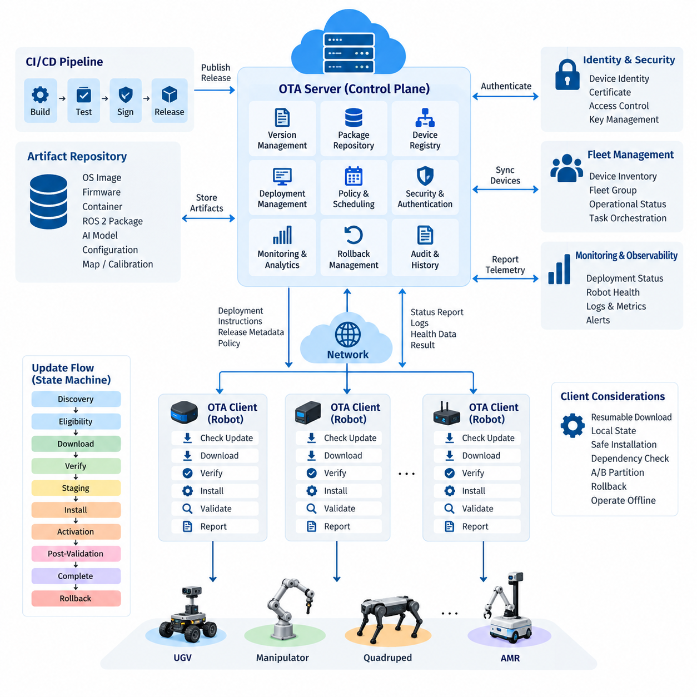
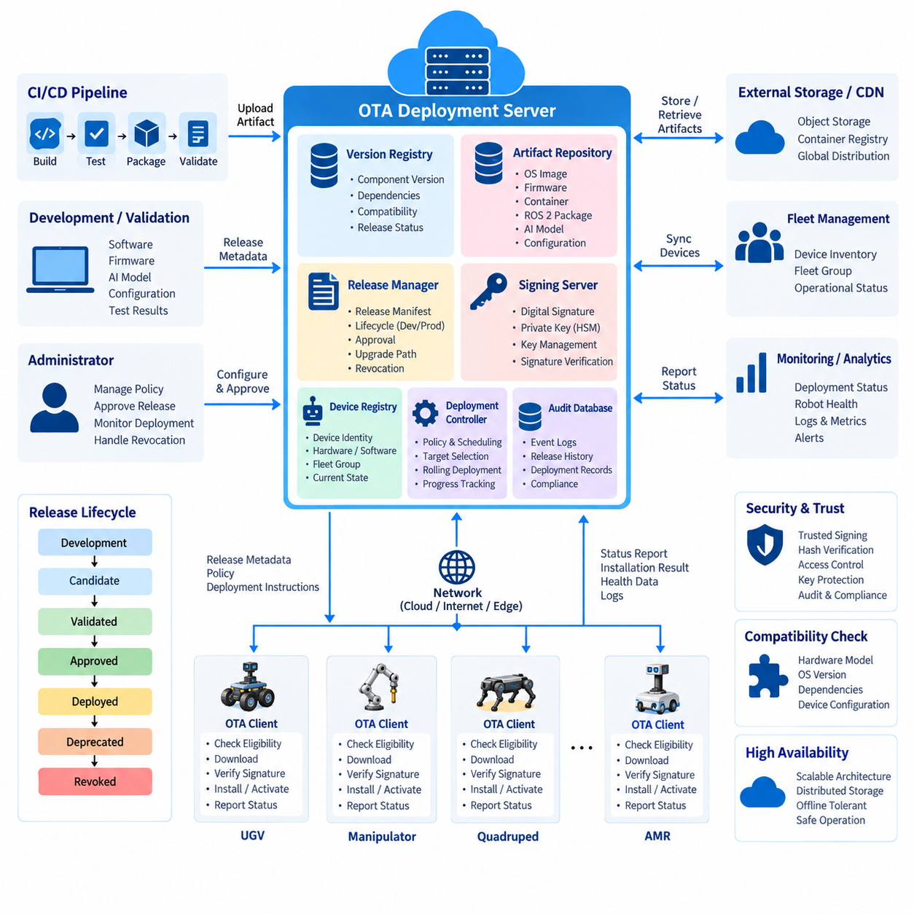
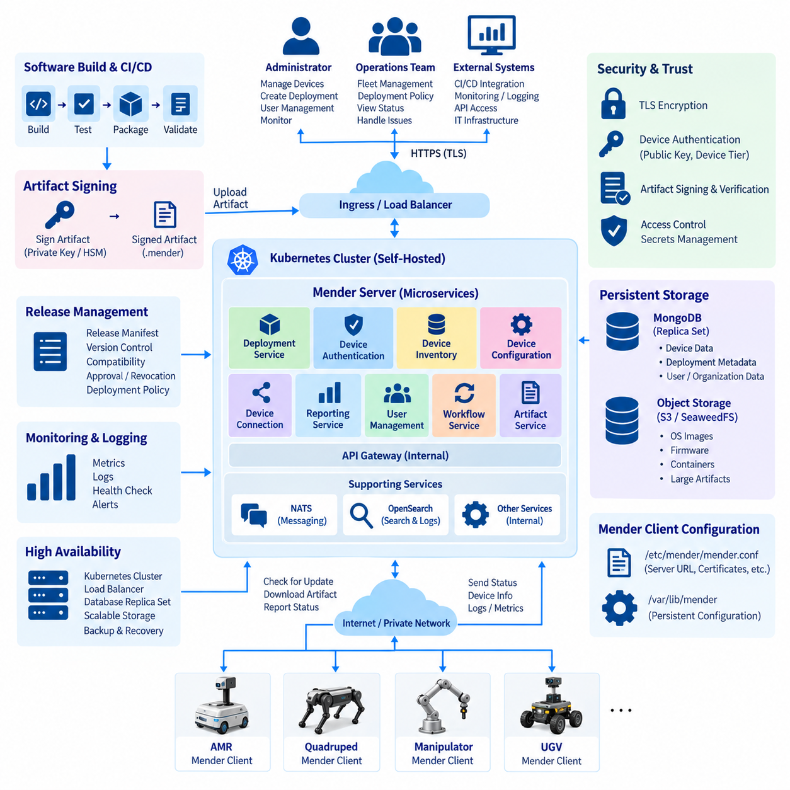
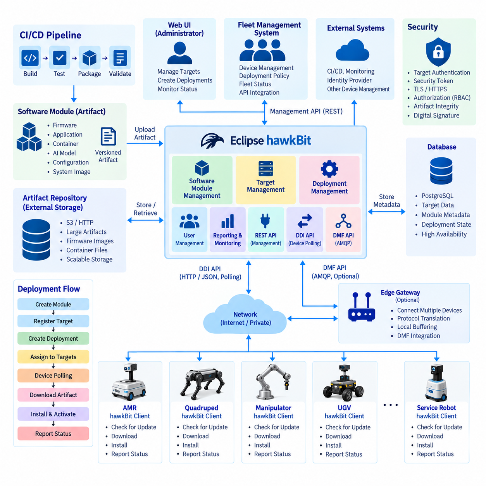
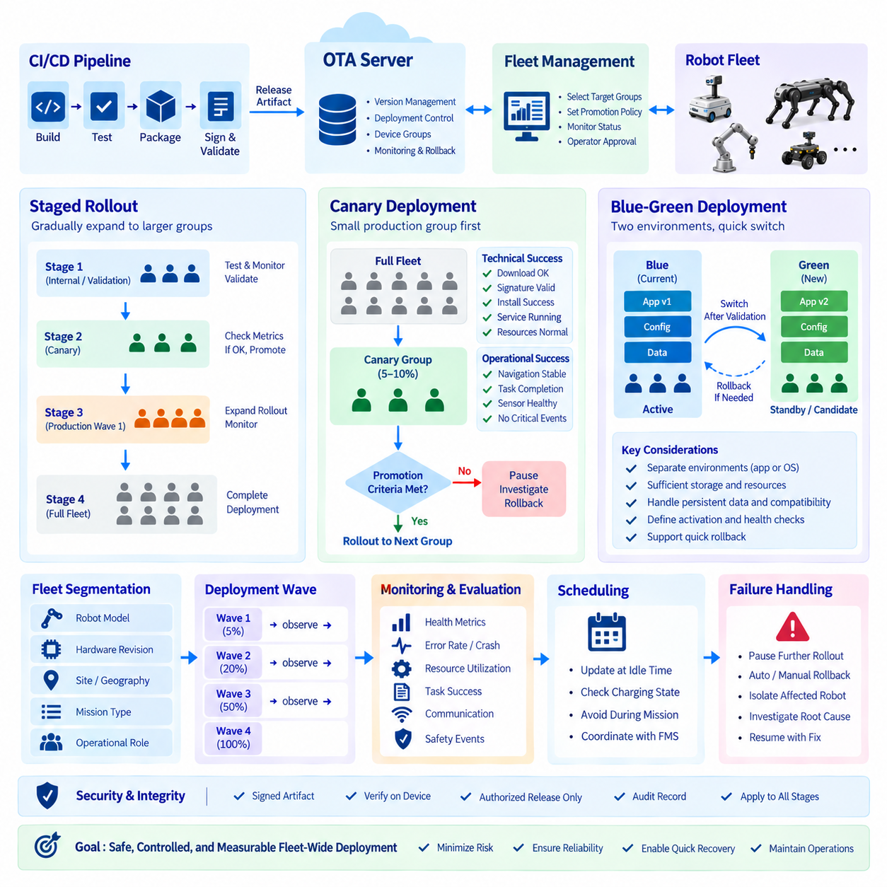
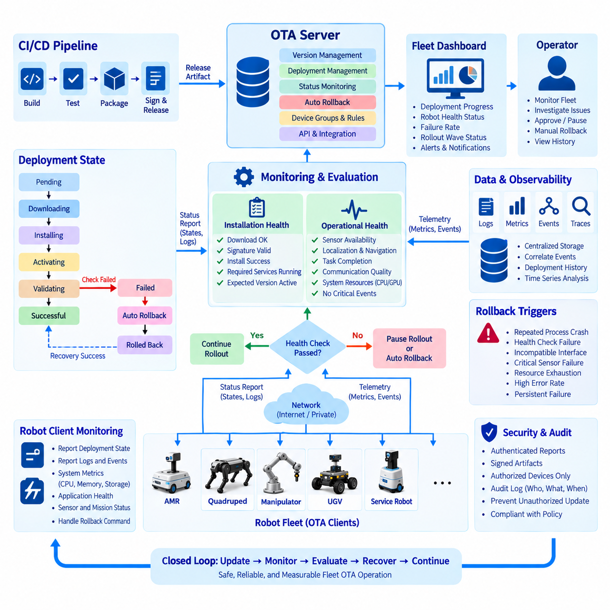
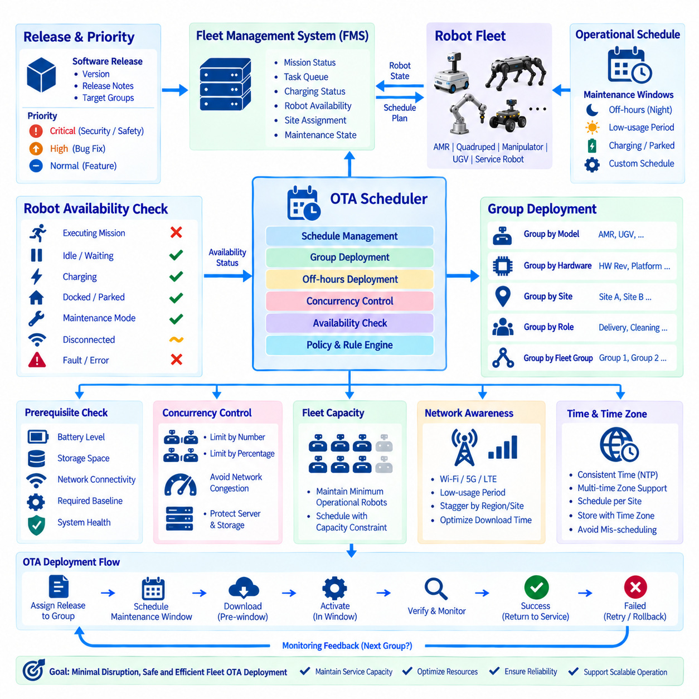
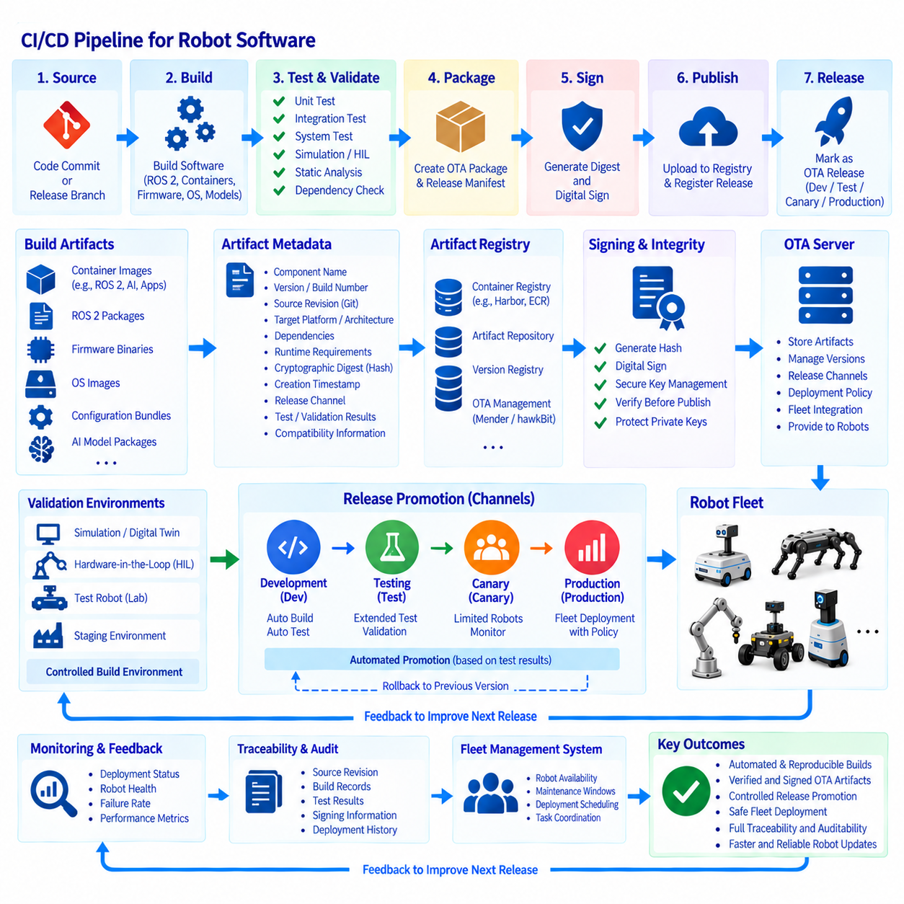
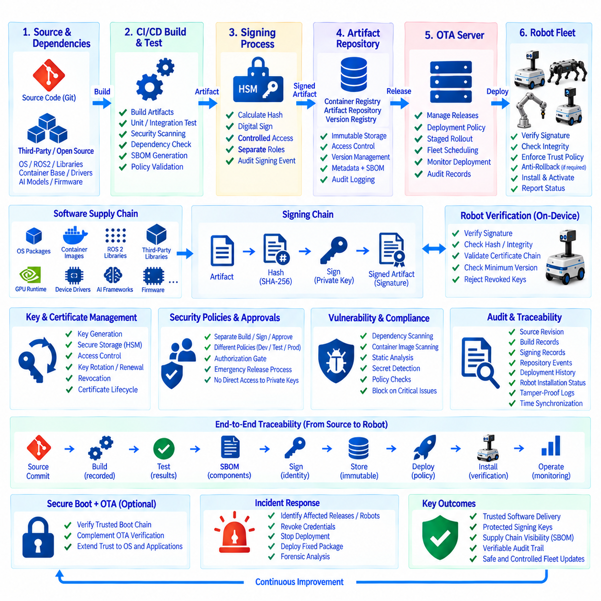
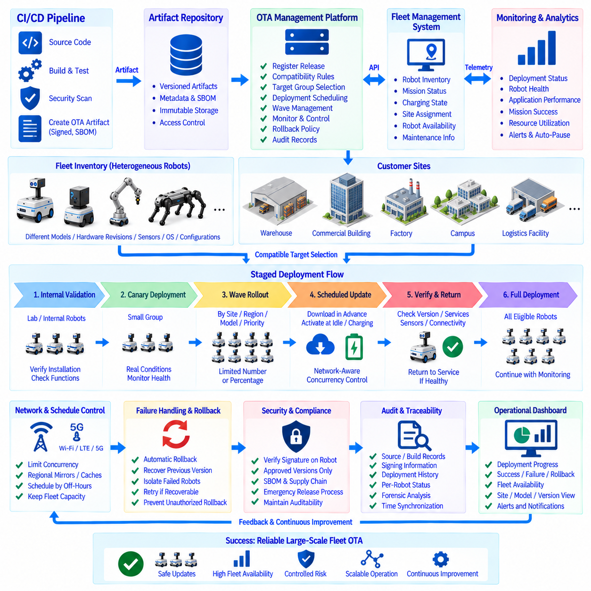

**Volume 09 Cloud and Edge Robotics**


# 09. OTA Architecture

##  

## 09.01 Robot OTA Architecture: Server, Client, Deploy, Management

{width="7.268055555555556in" height="7.268055555555556in"}

Over-the-air deployment for robots is not simply a remote file transfer mechanism. It is a distributed software lifecycle architecture that coordinates software packages, firmware, containers, configuration, AI models, and system images across robots operating under different network and operational conditions. A practical OTA platform therefore combines centralized deployment management with autonomous client-side execution, verification, recovery, and reporting.

The server side acts as the control plane of the OTA architecture. It maintains software versions, deployment packages, device inventories, compatibility metadata, deployment policies, cryptographic signatures, and historical deployment records. Instead of directly manipulating individual robots, the server describes the desired software state of each robot or fleet group and distributes deployment instructions through authenticated communication channels.

A robot-side OTA client forms the execution plane. The client periodically or event-drivenly communicates with the deployment service, authenticates the server, obtains deployment metadata, and determines whether an available package is applicable to its hardware and software configuration. It then downloads the required artifacts, verifies integrity and authenticity, performs installation, executes validation procedures, and reports the resulting state to the server.

Robot OTA differs fundamentally from conventional desktop software updating because a robot continuously interacts with the physical environment. Updating navigation, perception, motor-control interfaces, ROS 2 components, sensor drivers, or AI inference models can directly change physical behavior. Deployment management must therefore consider operational state, battery level, mission status, connectivity, hardware revision, safety conditions, and recovery capability before installation begins.

The deployment server normally maintains a device registry describing each robot\'s identity and configuration. Typical records include robot ID, hardware model, compute platform, operating-system version, firmware versions, application versions, installed AI models, deployment group, and current operational state. This inventory enables the OTA system to determine which package is compatible with which device rather than treating an entire heterogeneous fleet as identical.

Version management provides another essential architectural function. Every deployable artifact should have an identifiable version and associated metadata describing dependencies, hardware requirements, operating-system compatibility, configuration assumptions, and upgrade paths. A release may contain several coordinated components, such as a container image, ROS 2 application package, configuration bundle, perception model, and device firmware, that together represent one validated robot software baseline.

Deployment management converts releases into controlled fleet operations. A deployment specification identifies the target devices, required release, scheduling constraints, installation policy, verification conditions, and failure behavior. Robots can be organized by model, customer site, geographic region, hardware generation, operational role, or software channel. This grouping allows the same OTA infrastructure to manage development robots, validation fleets, pilot systems, and production robots independently.

The communication architecture should assume that robots may experience intermittent or low-bandwidth connectivity. Large packages should therefore support resumable downloads, retry policies, caching, integrity checks, and bandwidth-aware transfer. The OTA client should preserve enough local state to continue or safely restart an interrupted update process. Network disconnection must not leave the robot in an undefined software state or make normal local operation unnecessarily dependent on cloud availability.

Security begins with trusted device identity and authenticated server communication. The robot must determine not only whether a package was downloaded correctly but also whether it was produced and authorized by a trusted software-release process. Cryptographic hashes protect artifact integrity, while digital signatures establish provenance and authorization. Transport encryption, certificate-based identity, access control, credential rotation, and protected key storage complement package-level verification.

An OTA transaction should be modeled as a state machine rather than a single installation command. Typical states include update discovery, eligibility evaluation, download, verification, staging, installation, activation, post-installation validation, completion, and rollback. Persisting these transitions allows both the robot and management server to understand exactly where an interrupted or failed deployment stopped and determine the appropriate recovery operation.

Safe installation requires separation between downloading an artifact and activating it. A robot can often download software while operating normally, but activation may require the robot to stop, dock, reboot, restart containers, or enter a maintenance state. Separating download, staging, and activation reduces operational interruption and allows deployment managers to schedule disruptive operations according to fleet workload rather than network-transfer duration.

Atomicity becomes particularly important when multiple software components depend on one another. Updating a perception model while leaving an incompatible inference runtime, configuration schema, or application interface unchanged can create failures even though each individual artifact is valid. Release manifests should therefore describe compatible component sets, and the OTA client should verify dependencies before changing the active robot configuration.

Rollback provides the primary recovery path when newly deployed software fails validation. Systems may retain a previous container image, software package, model, or complete system partition so that the client can restore a known-good state. A/B partition strategies are particularly useful for operating-system or firmware updates because the new image can be written to an inactive partition before the boot target changes, preserving the previous image for recovery.

Post-deployment validation determines whether installation success actually means operational success. The client can verify process startup, container health, ROS 2 node availability, required interfaces, sensor connectivity, storage capacity, system temperature, GPU availability, and application-specific health indicators. Only after required checks pass should the new release be declared healthy; otherwise the client can initiate rollback or request operator intervention.

Fleet-scale OTA requires progressive deployment rather than simultaneous fleet-wide activation. A release can first reach laboratory devices, then selected validation robots, a small production subset, and finally progressively larger groups. Each stage provides telemetry and failure evidence before exposure expands. This architecture limits the operational impact of defects and creates measurable decision points between software release and full production adoption.

Server and client responsibilities should remain clearly separated. The server determines policy, target selection, release eligibility, scheduling, and fleet-level visibility, while the robot client retains authority over local installation safety and execution. A server may request an update, but the client should reject or postpone it when required local conditions are not satisfied. This separation is particularly important when cloud connectivity and physical robot safety have different availability assumptions.

Observability connects deployment management with fleet operations. Each OTA transaction should generate timestamps, package identifiers, version transitions, download results, verification outcomes, installation logs, reboot information, health-check results, and rollback events. Aggregating these records enables operators to distinguish isolated device failures from release-wide problems and provides an auditable history of the software configuration deployed to every robot.

The architecture should also support several artifact classes because modern robots contain multiple independently evolving software layers. Linux system images, bootloader or controller firmware, ROS 2 packages, Docker containers, configuration files, maps, calibration parameters, AI models, and security certificates have different installation and rollback characteristics. A unified management plane can track them while specialized client handlers perform artifact-specific deployment operations.

OTA management naturally connects cloud, edge, fleet-management, and DevOps systems. CI/CD pipelines can produce validated artifacts and register approved releases, while fleet services provide robot inventory and operational status. Monitoring systems return deployment health data, and identity services control device authentication. This places OTA between software delivery and robot operations rather than treating it as an isolated maintenance subsystem.

A mature robot OTA architecture ultimately maintains a controlled relationship between desired state and actual state. The server records what software each robot should run, while the client reports what is actually installed and operational. Differences trigger reconciliation according to deployment policy, but physical safety and recoverability remain local constraints. This server-client model provides the foundation for scalable staged rollout, automatic rollback, fleet scheduling, CI/CD integration, and secure software supply-chain management addressed by the subsequent OTA architecture topics.

무선 업데이트(Over-the-Air, OTA) 배포는 로봇에서 단순한 원격 파일 전송 메커니즘이 아니다. 이는 서로 다른 네트워크 및 운영 조건에서 동작하는 로봇 전체에 소프트웨어 패키지(software package), 펌웨어(firmware), 컨테이너(container), 구성(configuration), 인공지능 모델(AI model), 시스템 이미지(system image)를 조정하여 배포하는 분산 소프트웨어 생명주기 아키텍처(distributed software lifecycle architecture)이다. 따라서 실용적인 OTA 플랫폼(platform)은 중앙 집중식 배포 관리(centralized deployment management)와 클라이언트 측의 자율적인 실행, 검증, 복구 및 보고 기능을 결합해야 한다.

서버 측(server side)은 OTA 아키텍처의 제어 평면(control plane) 역할을 수행한다. 서버는 소프트웨어 버전(software version), 배포 패키지(deployment package), 장치 인벤토리(device inventory), 호환성 메타데이터(compatibility metadata), 배포 정책(deployment policy), 암호학적 서명(cryptographic signature), 과거 배포 기록을 관리한다. 개별 로봇을 직접 조작하는 대신 서버는 각 로봇 또는 플릿 그룹(fleet group)이 가져야 하는 목표 소프트웨어 상태(desired software state)를 정의하고 인증된 통신 채널을 통해 배포 명령을 전달한다.

로봇 측 OTA 클라이언트(OTA client)는 실행 평면(execution plane)을 구성한다. 클라이언트는 주기적 또는 이벤트 기반(event-driven)으로 배포 서비스와 통신하고, 서버를 인증하며, 배포 메타데이터를 획득한 후 사용 가능한 패키지가 해당 로봇의 하드웨어 및 소프트웨어 구성에 적용 가능한지를 판단한다. 이후 필요한 아티팩트(artifact)를 다운로드하고 무결성(integrity)과 진위성(authenticity)을 검증한 다음 설치, 검증 절차를 수행하고 그 결과 상태를 서버에 보고한다.

로봇 OTA는 로봇이 물리적 환경(physical environment)과 지속적으로 상호작용한다는 점에서 일반적인 데스크톱 소프트웨어 업데이트와 근본적으로 다르다. 내비게이션(navigation), 인지(perception), 모터 제어 인터페이스(motor-control interface), ROS 2 구성요소, 센서 드라이버(sensor driver), AI 추론 모델(AI inference model)을 업데이트하면 로봇의 실제 물리적 동작이 직접 변경될 수 있다. 따라서 배포 관리에서는 설치 전에 운용 상태, 배터리 수준, 임무 상태, 연결 상태, 하드웨어 리비전(hardware revision), 안전 조건 및 복구 가능성을 고려해야 한다.

배포 서버(deployment server)는 일반적으로 각 로봇의 신원과 구성을 설명하는 장치 레지스트리(device registry)를 유지한다. 대표적인 기록에는 로봇 ID, 하드웨어 모델, 컴퓨팅 플랫폼(compute platform), 운영체제 버전, 펌웨어 버전, 애플리케이션 버전, 설치된 AI 모델, 배포 그룹 및 현재 운용 상태가 포함된다. 이러한 인벤토리를 이용하면 OTA 시스템은 이기종 플릿(heterogeneous fleet) 전체를 동일하게 취급하지 않고 어떤 패키지가 어떤 장치와 호환되는지를 판단할 수 있다.

버전 관리(version management)는 또 하나의 핵심적인 아키텍처 기능을 제공한다. 배포 가능한 모든 아티팩트는 식별 가능한 버전과 함께 종속성(dependency), 하드웨어 요구사항, 운영체제 호환성, 구성 조건 및 업그레이드 경로를 설명하는 메타데이터를 가져야 한다. 하나의 릴리스(release)는 컨테이너 이미지(container image), ROS 2 애플리케이션 패키지, 구성 번들(configuration bundle), 인지 모델(perception model), 장치 펌웨어처럼 서로 연계된 여러 구성요소를 포함할 수 있으며, 이들이 하나의 검증된 로봇 소프트웨어 기준선(baseline)을 구성한다.

배포 관리(deployment management)는 릴리스를 통제된 플릿 운영으로 변환한다. 배포 명세(deployment specification)는 대상 장치, 필요한 릴리스, 스케줄링 제약조건, 설치 정책, 검증 조건 및 장애 발생 시 동작을 정의한다. 로봇은 모델, 고객 사이트, 지역, 하드웨어 세대, 운영 역할 또는 소프트웨어 채널에 따라 그룹화할 수 있다. 이러한 그룹화를 통해 동일한 OTA 인프라에서 개발 로봇, 검증 플릿(validation fleet), 파일럿 시스템(pilot system), 양산 로봇을 독립적으로 관리할 수 있다.

통신 아키텍처(communication architecture)는 로봇이 간헐적이거나 낮은 대역폭의 연결 환경을 경험할 수 있다는 것을 전제로 설계해야 한다. 따라서 대용량 패키지는 이어받기 다운로드(resumable download), 재시도 정책(retry policy), 캐싱(caching), 무결성 검사 및 대역폭 인식 전송(bandwidth-aware transfer)을 지원해야 한다. OTA 클라이언트는 중단된 업데이트를 계속 수행하거나 안전하게 재시작할 수 있도록 충분한 로컬 상태(local state)를 보존해야 한다. 네트워크 연결이 끊어져도 로봇이 정의되지 않은 소프트웨어 상태에 빠지거나 정상적인 로컬 운용이 불필요하게 클라우드 가용성에 의존해서는 안 된다.

보안(security)은 신뢰할 수 있는 장치 신원(trusted device identity)과 인증된 서버 통신에서 시작된다. 로봇은 패키지가 올바르게 다운로드되었는지만 확인하는 것이 아니라 신뢰할 수 있는 소프트웨어 릴리스 프로세스에서 생성되고 승인되었는지도 판단해야 한다. 암호학적 해시(cryptographic hash)는 아티팩트 무결성을 보호하며, 디지털 서명(digital signature)은 출처와 승인 여부를 확인한다. 전송 암호화, 인증서 기반 신원(certificate-based identity), 접근 제어(access control), 자격 증명 순환(credential rotation), 보호된 키 저장소가 패키지 수준 검증을 보완한다.

OTA 트랜잭션(transaction)은 하나의 설치 명령이 아니라 상태 머신(state machine)으로 모델링해야 한다. 일반적인 상태에는 업데이트 탐색(update discovery), 적합성 평가(eligibility evaluation), 다운로드, 검증, 스테이징(staging), 설치, 활성화(activation), 설치 후 검증(post-installation validation), 완료 및 롤백(rollback)이 포함된다. 이러한 상태 전이를 지속적으로 저장하면 로봇과 관리 서버 모두 중단되거나 실패한 배포가 정확히 어느 단계에서 멈췄는지 파악하고 적절한 복구 작업을 결정할 수 있다.

안전한 설치를 위해서는 아티팩트 다운로드와 활성화(activation)를 분리해야 한다. 로봇은 정상적으로 운용되는 동안 소프트웨어를 다운로드할 수 있지만, 활성화를 위해서는 로봇 정지, 도킹(docking), 재부팅, 컨테이너 재시작 또는 유지보수 상태(maintenance state) 진입이 필요할 수 있다. 다운로드, 스테이징 및 활성화를 분리하면 운용 중단을 줄일 수 있으며, 배포 관리자는 네트워크 전송 시간이 아니라 플릿의 작업 부하에 맞춰 서비스 중단이 필요한 작업을 스케줄링할 수 있다.

여러 소프트웨어 구성요소가 서로 의존할 경우 원자성(atomicity)은 특히 중요하다. 호환되지 않는 추론 런타임(inference runtime), 구성 스키마(configuration schema), 애플리케이션 인터페이스를 그대로 둔 상태에서 인지 모델만 업데이트하면 각각의 아티팩트가 정상이라도 시스템 장애가 발생할 수 있다. 따라서 릴리스 매니페스트(release manifest)는 서로 호환되는 구성요소 집합을 정의해야 하며, OTA 클라이언트는 활성 로봇 구성을 변경하기 전에 종속성을 검증해야 한다.

롤백(rollback)은 새롭게 배포된 소프트웨어가 검증에 실패했을 때 사용하는 핵심 복구 경로를 제공한다. 시스템은 이전 컨테이너 이미지, 소프트웨어 패키지, 모델 또는 전체 시스템 파티션(system partition)을 보존하여 클라이언트가 정상 동작이 확인된 상태(known-good state)로 복원할 수 있도록 한다. A/B 파티션 전략(A/B partition strategy)은 새 이미지를 비활성 파티션에 기록한 후 부팅 대상을 변경할 수 있기 때문에 운영체제 또는 펌웨어 업데이트에 특히 유용하며, 이전 이미지를 복구용으로 유지할 수 있다.

배포 후 검증(post-deployment validation)은 설치 성공이 실제 운용 성공을 의미하는지를 판단한다. 클라이언트는 프로세스 시작, 컨테이너 상태(container health), ROS 2 노드 가용성, 필수 인터페이스, 센서 연결 상태, 저장 공간, 시스템 온도, GPU 가용성 및 애플리케이션별 상태 지표를 확인할 수 있다. 필요한 검사가 모두 통과한 이후에만 새로운 릴리스를 정상 상태(healthy state)로 선언해야 하며, 그렇지 않으면 클라이언트가 롤백을 시작하거나 운영자의 개입을 요청할 수 있다.

대규모 플릿 OTA는 전체 플릿을 동시에 활성화하는 대신 점진적 배포(progressive deployment)를 필요로 한다. 릴리스는 먼저 실험실 장치에 적용하고 이후 선택된 검증 로봇, 소규모 양산 로봇 그룹, 그리고 점차 더 큰 그룹으로 확대할 수 있다. 각 단계는 적용 범위를 확대하기 전에 텔레메트리(telemetry)와 장애 데이터를 제공한다. 이러한 아키텍처는 결함으로 인한 운용 영향을 제한하고 소프트웨어 릴리스와 전체 양산 배포 사이에 측정 가능한 의사결정 지점을 제공한다.

서버와 클라이언트의 책임은 명확하게 분리되어야 한다. 서버는 정책, 대상 선택, 릴리스 적합성, 스케줄링 및 플릿 수준 가시성을 결정하고, 로봇 클라이언트는 로컬 설치의 안전성과 실행에 대한 권한을 유지한다. 서버가 업데이트를 요청하더라도 필요한 로컬 조건이 충족되지 않으면 클라이언트가 이를 거부하거나 연기할 수 있어야 한다. 이러한 분리는 클라우드 연결 가용성과 로봇의 물리적 안전이 서로 다른 가용성 조건을 갖는 환경에서 특히 중요하다.

관측 가능성(observability)은 배포 관리와 플릿 운영을 연결한다. 각각의 OTA 트랜잭션은 타임스탬프(timestamp), 패키지 식별자, 버전 전환, 다운로드 결과, 검증 결과, 설치 로그, 재부팅 정보, 상태 검사 결과 및 롤백 이벤트를 생성해야 한다. 이러한 기록을 집계하면 운영자는 개별 장치의 장애와 릴리스 전체에 영향을 미치는 문제를 구분할 수 있으며, 모든 로봇에 배포된 소프트웨어 구성에 대한 감사 가능한 이력(auditable history)을 확보할 수 있다.

현대의 로봇에는 독립적으로 발전하는 여러 소프트웨어 계층이 존재하므로 OTA 아키텍처는 다양한 아티팩트 유형(artifact class)을 지원해야 한다. 리눅스 시스템 이미지(Linux system image), 부트로더 또는 제어기 펌웨어, ROS 2 패키지, Docker 컨테이너, 구성 파일, 지도, 보정 파라미터(calibration parameter), AI 모델 및 보안 인증서는 각각 서로 다른 설치 및 롤백 특성을 가진다. 통합 관리 평면(unified management plane)이 전체 상태를 추적하는 동안 전문화된 클라이언트 핸들러(client handler)가 아티팩트별 배포 작업을 수행할 수 있다.

OTA 관리는 자연스럽게 클라우드(cloud), 엣지(edge), 플릿 관리(fleet management), 데브옵스(DevOps) 시스템과 연결된다. 지속적 통합 및 지속적 배포(CI/CD) 파이프라인은 검증된 아티팩트를 생성하고 승인된 릴리스를 등록할 수 있으며, 플릿 서비스는 로봇 인벤토리와 운용 상태를 제공한다. 모니터링 시스템은 배포 상태 데이터를 반환하고 신원 관리 서비스(identity service)는 장치 인증을 제어한다. 따라서 OTA는 독립적인 유지보수 하위 시스템이 아니라 소프트웨어 전달과 로봇 운영 사이에 위치하는 핵심 연결 계층이다.

성숙한 로봇 OTA 아키텍처는 궁극적으로 목표 상태(desired state)와 실제 상태(actual state) 사이의 통제된 관계를 유지한다. 서버는 각 로봇이 어떤 소프트웨어를 실행해야 하는지를 기록하고, 클라이언트는 실제로 무엇이 설치되어 정상적으로 동작하는지를 보고한다. 차이가 발생하면 배포 정책에 따라 상태 조정(reconciliation)이 수행되지만, 물리적 안전과 복구 가능성은 항상 로컬 제약조건으로 유지된다. 이러한 서버-클라이언트 모델(server-client model)은 이후 OTA 아키텍처에서 다루는 단계적 롤아웃(staged rollout), 자동 롤백(auto rollback), 플릿 스케줄링(fleet scheduling), CI/CD 통합 및 안전한 소프트웨어 공급망 관리(software supply-chain management)를 위한 기반을 제공한다.

##  

## 09.02 OTA Deploy Server Design: Version Registry / Sign Server [w/Code]

{width="7.268055555555556in" height="7.268055555555556in"}

An OTA deployment server is the central coordination layer that transforms validated software artifacts into controlled robot releases. Its responsibility extends beyond storing update files: it maintains version relationships, device compatibility, release metadata, cryptographic trust, deployment policies, and historical state. In a fleet architecture, the server provides the authoritative source for determining which software release may be delivered to each robot.

A practical deployment server can be divided into several logical services, including a version registry, artifact repository, release manager, signing service, device registry, deployment controller, and audit database. These services may initially run as modules of one application and later become independent services as fleet size increases. Separating their responsibilities makes software releases easier to validate, secure, scale, and trace throughout the OTA lifecycle.

The version registry maintains the identity and relationships of every deployable software component. A version record normally contains the component name, semantic or internal version identifier, build number, creation time, source revision, supported hardware, operating-system requirements, dependencies, and release status. The registry therefore answers more than "what is the latest version"; it determines which version is valid for a particular robot configuration.

Robot releases often contain multiple independently versioned components. A single release may combine an operating-system image, ROS 2 packages, container images, motor-controller firmware, sensor drivers, configuration files, maps, and AI models. The server should represent the complete validated combination through a release manifest rather than assuming that independently current components are mutually compatible. This creates a reproducible software baseline for production robots.

The artifact repository stores the actual binary objects referenced by the version registry. Large operating-system images, firmware binaries, container layers, model files, and compressed application packages should be treated as immutable artifacts once released. Their metadata remains in the registry while their binary content may reside in object storage, an OCI-compatible container registry, or another scalable storage service optimized for large downloads.

Immutability is important because a version identifier must always resolve to exactly the same content. Replacing a binary while preserving its version number destroys reproducibility and makes field failures difficult to investigate. Each artifact should therefore be associated with a cryptographic digest such as a SHA-256 hash. The server and robot client can independently calculate the digest and detect corruption or unauthorized modification before installation.

The signing server establishes trust between the software production pipeline and deployed robots. After an artifact or release manifest passes the required build and validation stages, an authorized signing operation generates a digital signature using a protected private key. Robot clients verify the signature using a trusted public key before accepting the release. This prevents possession of artifact-storage access alone from becoming sufficient authority to deploy executable software.

Signing keys require stronger protection than ordinary application credentials because compromise of a release-signing key can undermine the entire OTA trust model. Private keys should be isolated from general deployment services and preferably protected by a hardware security module, managed key service, or equivalent controlled signing environment. Access should follow least-privilege principles, and signing requests should generate immutable audit records identifying the release and authorization context.

The release manager connects versions, artifacts, and signatures into a deployable unit. It can maintain lifecycle states such as development, candidate, validated, approved, deprecated, and revoked. Only releases reaching an explicitly authorized state should become available to production deployment policies. This separation prevents an automatically generated CI build from becoming equivalent to a production-approved robot release merely because its artifact exists in storage.

Compatibility metadata is especially important for heterogeneous robot fleets. Robots may differ in CPU architecture, Jetson or x86 computing platform, sensor configuration, controller firmware, storage capacity, and hardware revision. The server should associate releases with explicit compatibility constraints and compare them against device inventory before deployment. An update intended for one hardware generation should never depend solely on operators manually selecting the correct robots.

The device registry supplies the server with the information required for this matching process. Each device identity can reference hardware type, serial identity, software baseline, installed component versions, deployment channel, customer or site grouping, and current OTA state. When a client requests an update, the server evaluates both device identity and release policy before returning eligible release metadata rather than simply returning the newest available package.

Deployment policies determine how an approved release moves through the fleet. A policy can specify target groups, allowed software channels, maintenance windows, prerequisite versions, battery or operational constraints, deployment concurrency, and expiration conditions. The deployment controller resolves these policies into device-specific actions while retaining a centralized record of intended state. This creates a clear distinction between defining a release and authorizing its actual installation.

The server should distribute metadata before transferring large artifacts. A robot can first receive a compact manifest describing the release identifier, artifact URLs, sizes, hashes, signatures, dependencies, required disk space, compatibility constraints, and activation requirements. The client evaluates this information locally and downloads binary content only after determining that the update is applicable. This approach reduces unnecessary network traffic and supports safer offline-first behavior.

Artifact delivery itself should be scalable independently of the control server. The deployment API does not need to stream every multi-gigabyte system image through the same service that manages policies and device states. Binary artifacts can be delivered through object storage, content delivery infrastructure, or geographically distributed caches using temporary authenticated access. Separating control-plane traffic from artifact data improves scalability when thousands of robots update concurrently.

The server must also understand update lineage. Some releases can be installed directly from many previous versions, while others require intermediate migrations because of database schemas, firmware interfaces, bootloader changes, or configuration transformations. Upgrade-path metadata allows the deployment controller to determine whether a direct transition is valid. The same information is valuable when determining whether rollback to an earlier baseline remains technically safe.

Revocation is the inverse of release approval and should be designed from the beginning. If a vulnerability, corrupted artifact, signing problem, or severe operational defect is discovered, administrators must be able to prevent further installation of the affected release. Revocation metadata can also instruct connected clients that a previously approved artifact is no longer trusted, while fleet inventory identifies robots that have already installed the affected version.

Auditability ties the entire deployment server together. Important events include artifact registration, metadata modification, signing requests, release approval, policy creation, target selection, deployment initiation, client acknowledgement, installation result, rollback, and revocation. These records should preserve timestamps, identities, release references, and relevant outcomes so that operators can reconstruct exactly how a specific software version reached a particular robot.

The deployment server should expose machine-readable interfaces so that OTA becomes part of the broader software delivery process. CI/CD systems can register artifacts and candidate releases, validation pipelines can update qualification results, fleet-management systems can provide operational eligibility, and monitoring services can return deployment health. Human operators then manage policy and exceptions through the same authoritative backend rather than maintaining separate manual release records.

High availability is important because the deployment server may coordinate a large production fleet, but temporary server failure should not make robots unsafe. Robots should continue operating with their existing validated software when the server is unavailable. After connectivity returns, clients can reconcile their local state with the desired state stored by the server. This preserves the cloud-edge separation in which centralized management controls evolution without becoming a real-time dependency for robot operation.

A well-designed OTA deployment server therefore forms a trusted release authority rather than merely a download server. The version registry defines what exists, the artifact repository preserves immutable content, the signing server establishes authenticity, the release manager determines what is approved, and the deployment controller determines where and when it may be installed. Together, these functions provide the server foundation required for staged rollout, monitoring, rollback, scheduling, CI/CD integration, and secure fleet-scale OTA operations described throughout the OTA architecture chapter.

OTA 배포 서버(OTA deployment server)는 검증된 소프트웨어 아티팩트(software artifact)를 통제된 로봇 릴리스(robot release)로 변환하는 중앙 조정 계층(central coordination layer)이다. 이 서버의 역할은 단순히 업데이트 파일을 저장하는 것을 넘어 버전 관계, 장치 호환성, 릴리스 메타데이터(release metadata), 암호학적 신뢰(cryptographic trust), 배포 정책 및 과거 상태를 관리하는 데까지 확장된다. 플릿 아키텍처(fleet architecture)에서 서버는 각 로봇에 어떤 소프트웨어 릴리스를 배포할 수 있는지를 결정하는 권위 있는 정보원(authoritative source)의 역할을 수행한다.

실용적인 배포 서버(deployment server)는 버전 레지스트리(version registry), 아티팩트 저장소(artifact repository), 릴리스 관리자(release manager), 서명 서비스(signing service), 장치 레지스트리(device registry), 배포 제어기(deployment controller), 감사 데이터베이스(audit database) 등의 논리적 서비스로 구분할 수 있다. 초기에는 이러한 서비스를 하나의 애플리케이션 모듈로 운영하고 플릿 규모가 증가하면 독립적인 서비스로 분리할 수 있다. 책임을 분리하면 전체 OTA 생명주기에서 소프트웨어 릴리스를 보다 쉽게 검증하고 보호하며 확장하고 추적할 수 있다.

버전 레지스트리(version registry)는 배포 가능한 모든 소프트웨어 구성요소의 식별 정보와 상호 관계를 관리한다. 버전 레코드(version record)는 일반적으로 구성요소 이름, 시맨틱 또는 내부 버전 식별자, 빌드 번호, 생성 시간, 소스 리비전(source revision), 지원 하드웨어, 운영체제 요구사항, 종속성(dependency), 릴리스 상태를 포함한다. 따라서 레지스트리는 단순히 "최신 버전이 무엇인가"를 알려주는 것이 아니라 특정 로봇 구성에 어떤 버전이 유효한지를 결정한다.

로봇 릴리스(robot release)는 독립적으로 버전이 관리되는 여러 구성요소를 포함하는 경우가 많다. 하나의 릴리스에는 운영체제 이미지, ROS 2 패키지, 컨테이너 이미지(container image), 모터 제어기 펌웨어, 센서 드라이버, 구성 파일, 지도 및 AI 모델이 함께 포함될 수 있다. 서버는 개별적으로 최신인 구성요소들이 서로 호환된다고 가정하지 않고 전체 검증 조합을 릴리스 매니페스트(release manifest)로 표현해야 한다. 이를 통해 양산 로봇에서 재현 가능한 소프트웨어 기준선(software baseline)을 구성할 수 있다.

아티팩트 저장소(artifact repository)는 버전 레지스트리가 참조하는 실제 바이너리 객체(binary object)를 저장한다. 대용량 운영체제 이미지, 펌웨어 바이너리, 컨테이너 계층(container layer), 모델 파일 및 압축된 애플리케이션 패키지는 릴리스된 이후 불변 아티팩트(immutable artifact)로 취급해야 한다. 관련 메타데이터는 레지스트리에 유지하면서 바이너리 콘텐츠는 객체 저장소(object storage), OCI 호환 컨테이너 레지스트리(OCI-compatible container registry) 또는 대용량 다운로드에 최적화된 다른 확장형 저장 서비스에 보관할 수 있다.

불변성(immutability)이 중요한 이유는 하나의 버전 식별자가 항상 정확히 동일한 콘텐츠를 가리켜야 하기 때문이다. 버전 번호를 유지하면서 바이너리를 교체하면 재현성(reproducibility)이 훼손되고 현장에서 발생한 장애의 원인을 조사하기 어려워진다. 따라서 각 아티팩트에는 SHA-256 해시와 같은 암호학적 다이제스트(cryptographic digest)를 연결해야 한다. 서버와 로봇 클라이언트는 각각 독립적으로 다이제스트를 계산하여 설치 전에 데이터 손상이나 승인되지 않은 변경을 탐지할 수 있다.

서명 서버(signing server)는 소프트웨어 생산 파이프라인과 배포된 로봇 사이의 신뢰를 확립한다. 아티팩트 또는 릴리스 매니페스트가 필요한 빌드 및 검증 단계를 통과하면 승인된 서명 작업이 보호된 개인 키(private key)를 사용하여 디지털 서명(digital signature)을 생성한다. 로봇 클라이언트는 릴리스를 수락하기 전에 신뢰할 수 있는 공개 키(public key)를 사용해 서명을 검증한다. 이를 통해 아티팩트 저장소에 접근할 수 있다는 사실만으로 실행 가능한 소프트웨어를 배포할 권한까지 획득하는 것을 방지한다.

서명 키(signing key)가 유출되면 전체 OTA 신뢰 모델(trust model)이 손상될 수 있으므로 일반적인 애플리케이션 자격 증명보다 강력하게 보호해야 한다. 개인 키는 일반 배포 서비스와 격리하고 가능하면 하드웨어 보안 모듈(Hardware Security Module, HSM), 관리형 키 서비스(managed key service) 또는 이에 상응하는 통제된 서명 환경으로 보호해야 한다. 접근에는 최소 권한 원칙(least-privilege principle)을 적용하고 모든 서명 요청에 대해 릴리스와 승인 상황을 식별할 수 있는 변경 불가능한 감사 기록(immutable audit record)을 생성해야 한다.

릴리스 관리자(release manager)는 버전, 아티팩트 및 서명을 하나의 배포 가능한 단위로 연결한다. 개발(development), 후보(candidate), 검증 완료(validated), 승인(approved), 사용 중단(deprecated), 폐기(revoked)와 같은 생명주기 상태(lifecycle state)를 관리할 수 있다. 명시적으로 승인된 상태에 도달한 릴리스만 양산 배포 정책에서 사용할 수 있어야 한다. 이를 통해 자동으로 생성된 CI 빌드가 저장소에 존재한다는 이유만으로 양산 로봇에 승인된 릴리스와 동일하게 취급되는 것을 방지한다.

호환성 메타데이터(compatibility metadata)는 이기종 로봇 플릿(heterogeneous robot fleet)에서 특히 중요하다. 로봇은 CPU 아키텍처, Jetson 또는 x86 컴퓨팅 플랫폼, 센서 구성, 제어기 펌웨어, 저장 용량 및 하드웨어 리비전(hardware revision)이 서로 다를 수 있다. 서버는 릴리스에 명확한 호환성 제약조건(compatibility constraint)을 연결하고 배포 전에 이를 장치 인벤토리(device inventory)와 비교해야 한다. 특정 하드웨어 세대를 대상으로 하는 업데이트가 운영자의 수동 로봇 선택에만 의존해서는 안 된다.

장치 레지스트리(device registry)는 이러한 매칭 과정에 필요한 정보를 서버에 제공한다. 각각의 장치 신원(device identity)은 하드웨어 유형, 시리얼 식별 정보, 소프트웨어 기준선, 설치된 구성요소 버전, 배포 채널(deployment channel), 고객 또는 사이트 그룹 및 현재 OTA 상태를 참조할 수 있다. 클라이언트가 업데이트를 요청하면 서버는 단순히 가장 최신 패키지를 반환하는 대신 장치 신원과 릴리스 정책을 함께 평가한 후 적용 가능한 릴리스 메타데이터를 반환한다.

배포 정책(deployment policy)은 승인된 릴리스가 플릿 전체로 어떻게 전달되는지를 결정한다. 정책에는 대상 그룹, 허용된 소프트웨어 채널, 유지보수 시간대(maintenance window), 선행 버전(prerequisite version), 배터리 또는 운용 제약조건, 동시 배포 수(concurrency), 만료 조건 등을 지정할 수 있다. 배포 제어기는 이러한 정책을 장치별 작업으로 변환하면서 목표 상태(intended state)에 대한 중앙 집중식 기록을 유지한다. 이를 통해 릴리스를 정의하는 것과 실제 설치를 승인하는 것을 명확히 구분할 수 있다.

서버는 대용량 아티팩트를 전송하기 전에 메타데이터(metadata)를 먼저 배포해야 한다. 로봇은 릴리스 식별자, 아티팩트 URL, 크기, 해시, 서명, 종속성, 필요한 디스크 공간, 호환성 제약조건 및 활성화 요구사항을 설명하는 작은 크기의 매니페스트(manifest)를 먼저 받을 수 있다. 클라이언트는 이 정보를 로컬에서 평가한 후 업데이트가 적용 가능하다고 판단될 때만 바이너리 콘텐츠를 다운로드한다. 이러한 방식은 불필요한 네트워크 트래픽을 줄이고 보다 안전한 오프라인 우선 동작(offline-first behavior)을 지원한다.

아티팩트 전달(artifact delivery)은 제어 서버와 독립적으로 확장할 수 있어야 한다. 배포 API가 정책과 장치 상태를 관리하면서 동시에 수 기가바이트 규모의 모든 시스템 이미지를 직접 스트리밍할 필요는 없다. 바이너리 아티팩트는 임시 인증 접근(temporary authenticated access)을 이용하여 객체 저장소, 콘텐츠 전달 인프라(content delivery infrastructure), 지리적으로 분산된 캐시(distributed cache)를 통해 전달할 수 있다. 제어 평면 트래픽(control-plane traffic)과 아티팩트 데이터를 분리하면 수천 대의 로봇이 동시에 업데이트될 때 확장성을 향상시킬 수 있다.

서버는 업데이트 계보(update lineage)도 이해해야 한다. 일부 릴리스는 여러 이전 버전에서 직접 설치할 수 있지만, 데이터베이스 스키마, 펌웨어 인터페이스, 부트로더 변경 또는 구성 변환 때문에 중간 마이그레이션(intermediate migration)이 필요한 경우도 있다. 업그레이드 경로 메타데이터(upgrade-path metadata)를 사용하면 배포 제어기가 직접적인 버전 전환이 유효한지를 판단할 수 있다. 동일한 정보는 이전 기준선으로의 롤백이 기술적으로 안전한지를 결정할 때도 유용하다.

폐기(revocation)는 릴리스 승인의 반대 과정이며 처음부터 설계에 포함해야 한다. 취약점, 손상된 아티팩트, 서명 문제 또는 심각한 운용 결함이 발견되면 관리자는 해당 릴리스의 추가 설치를 차단할 수 있어야 한다. 폐기 메타데이터(revocation metadata)를 이용하면 연결된 클라이언트에 이전에 승인된 아티팩트를 더 이상 신뢰해서는 안 된다는 사실을 전달할 수 있으며, 플릿 인벤토리를 이용하여 문제가 있는 버전을 이미 설치한 로봇을 식별할 수 있다.

감사 가능성(auditability)은 전체 배포 서버를 하나의 체계로 연결한다. 중요한 이벤트에는 아티팩트 등록, 메타데이터 변경, 서명 요청, 릴리스 승인, 정책 생성, 대상 선택, 배포 시작, 클라이언트 승인 응답, 설치 결과, 롤백 및 폐기가 포함된다. 이러한 기록에는 타임스탬프, 신원 정보, 릴리스 참조 정보 및 관련 결과를 보존하여 운영자가 특정 소프트웨어 버전이 특정 로봇에 어떤 과정을 통해 배포되었는지를 정확하게 재구성할 수 있도록 해야 한다.

배포 서버는 기계 판독형 인터페이스(machine-readable interface)를 제공하여 OTA가 보다 광범위한 소프트웨어 전달 프로세스의 일부가 되도록 해야 한다. CI/CD 시스템은 아티팩트와 후보 릴리스를 등록하고, 검증 파이프라인(validation pipeline)은 적격성 평가 결과를 갱신하며, 플릿 관리 시스템은 운용 적합성 정보를 제공하고, 모니터링 서비스는 배포 상태를 반환할 수 있다. 운영자는 별도의 수동 릴리스 기록을 관리하는 대신 동일한 권위 있는 백엔드(authoritative backend)를 통해 정책과 예외 상황을 관리할 수 있다.

배포 서버가 대규모 양산 플릿을 조정할 수 있으므로 고가용성(high availability)은 중요하지만, 일시적인 서버 장애가 로봇을 위험한 상태로 만들어서는 안 된다. 서버를 사용할 수 없는 동안에도 로봇은 기존에 검증된 소프트웨어를 사용하여 계속 운용할 수 있어야 한다. 연결이 복구되면 클라이언트가 로컬 상태와 서버에 저장된 목표 상태(desired state)를 다시 조정(reconciliation)할 수 있다. 이를 통해 중앙 집중식 관리가 소프트웨어 진화를 통제하면서도 로봇 운용의 실시간 의존성이 되지 않는 클라우드-엣지 분리(cloud-edge separation)를 유지할 수 있다.

잘 설계된 OTA 배포 서버는 단순한 다운로드 서버가 아니라 신뢰할 수 있는 릴리스 권한 체계(trusted release authority)를 형성한다. 버전 레지스트리는 무엇이 존재하는지를 정의하고, 아티팩트 저장소는 변경되지 않는 콘텐츠를 보존하며, 서명 서버는 진위성(authenticity)을 확립하고, 릴리스 관리자는 무엇이 승인되었는지를 결정하며, 배포 제어기는 어디에 언제 설치할 수 있는지를 결정한다. 이러한 기능들은 함께 OTA 아키텍처 장 전체에서 다루는 단계적 롤아웃(staged rollout), 모니터링(monitoring), 롤백(rollback), 스케줄링(scheduling), CI/CD 통합 및 안전한 플릿 규모 OTA 운영을 위한 서버 기반을 제공한다.

##  

## 09.03 Mender Server Self-Hosted Configuration [w/Code]

{width="7.268055555555556in" height="7.268055555555556in"}

Mender is a software update platform designed around a client-server architecture in which robot devices communicate with a centrally managed backend. In a self-hosted configuration, the organization operates the Mender Server infrastructure instead of relying on a hosted service. This approach places responsibility for server deployment, storage, networking, certificates, authentication, upgrades, monitoring, and operational maintenance within the organization's own infrastructure. ([Mender Docs][1])

The Mender Server is composed of multiple microservices, each responsible for a defined part of the OTA lifecycle. The architecture includes services for deployments, device authentication, device inventory, device configuration, device connection, reporting, user administration, workflows, and artifact creation, together with supporting components such as an API gateway, object storage, messaging, and search or data-storage services. This service-oriented structure allows the self-hosted installation to separate device communication, management operations, artifact handling, and internal service communication.

For a production self-hosted environment, Mender provides a Kubernetes-based installation approach using a Helm chart. The Kubernetes cluster hosts the Mender backend services and provides the orchestration layer required for service deployment, scaling, restart handling, and configuration management. The production architecture should therefore be treated as an infrastructure platform rather than simply installing a single Mender application on one Linux server. ([Mender Docs][2])

The external entry point is normally an Ingress controller or load balancer that exposes the Mender Server outside the Kubernetes cluster. Production configuration requires HTTPS, and the ingress layer is responsible for receiving authenticated client and management requests and forwarding them to the appropriate backend services. Health checking and TLS certificate management should also be incorporated into this boundary so that the externally visible server endpoint remains controlled and observable. ([Mender Docs][3])

Persistent storage is another fundamental part of the self-hosted architecture. The Mender backend requires database and artifact-storage services, while large update artifacts should be separated from transactional metadata. Mender documentation describes support for S3-compatible object storage and other storage options, while MongoDB is used for persistent application data. For production high availability, Mender recommends MongoDB replica-set operation rather than relying on a single database instance. ([Mender Docs][2])

The artifact-storage layer should be designed around the characteristics of robot software packages. Operating-system images, firmware, containers, and other large artifacts may consume substantially more storage and bandwidth than ordinary API traffic. Keeping these artifacts in dedicated object storage allows the Mender backend to concentrate on deployment control and metadata while the storage layer handles large-object delivery. This separation also provides a foundation for backup, replication, lifecycle management, and scalable artifact distribution.

Mender also uses supporting infrastructure for internal communication and service operation. The documented server architecture includes NATS as a messaging system and OpenSearch for storage and search, while SeaweedFS can provide object storage in the documented architecture. These components are not merely optional application libraries; they participate in the distributed backend architecture and therefore need to be considered when planning resource allocation, persistence, backup, monitoring, and recovery. ([Mender Docs][1])

Device authentication establishes the trust relationship between a robot and the self-hosted Mender Server. A Mender device is identified using identity attributes together with a public key and device tier. Before a device can authenticate and communicate normally, its authentication identity must be authorized by the server. The authentication service then issues authentication tokens that the Mender Client uses when accessing Device APIs. This model separates identifying a physical robot from authorizing its ability to participate in OTA operations. ([Mender Docs][4])

The robot-side configuration must point the Mender Client to the organization's self-hosted server. The Mender Client uses a JSON configuration file, commonly located at \`/etc/mender/mender.conf\`, for settings such as the server URL and certificate information. Persistent configuration can also be maintained under \`/var/lib/mender\`, allowing selected configuration data to survive future software updates. This distinction is important because an OTA system must not accidentally remove the configuration required to contact the OTA server during an update. ([Mender Docs][5])

TLS configuration protects communication between the robot and server. By default, the Mender Client can validate the server through the operating system's trusted Certificate Authorities when the server certificate is issued by a recognized CA. For self-signed certificates, the appropriate certificate must instead be provisioned to the client so that it can verify the self-hosted server. Consequently, certificate provisioning becomes part of the robot image or manufacturing process when an internal certificate authority or self-signed certificate is used. ([Mender Docs][6])

Artifact signing provides a second security layer that is independent of the network connection. A Mender Artifact can be digitally signed before being uploaded to the server, and the Mender Client can verify the signature using its configured public verification key. If signature verification is enabled and the artifact is unsigned or cannot be verified, the client rejects the update rather than installing it. This means that successfully downloading an artifact is not sufficient to authorize its installation. ([Mender Docs][7])

Signing-key management should therefore be separated from ordinary artifact-building operations whenever possible. Mender documentation notes that using the build system directly as the signing system increases security exposure because compromise of the build environment could provide access to the private signing key. A controlled signing environment, potentially incorporating an HSM or another PKCS#11-compatible cryptographic device, provides stronger protection for the private key and establishes a clearer trust boundary between software creation and production release authorization. ([Mender Docs][7])

A self-hosted Mender installation also requires deliberate configuration of server-side secrets and certificates. Internal service communication may use separate cryptographic credentials, while the API gateway exposes the externally accessible HTTPS endpoint. User authentication, device authentication, artifact verification, and service-to-service communication should therefore not be treated as one generic credential system. Each trust relationship should have an explicit purpose, controlled storage, and an appropriate rotation or replacement procedure. ([Mender Docs][6])

The deployment workflow begins when a validated Mender Artifact is made available to the server. The artifact contains the software payload and associated metadata, while the server maintains information about devices, deployments, and their current state. A deployment can then target a defined set of devices according to the organization's fleet-management policy. The robot periodically communicates with the server, determines whether an update is available, downloads the artifact, verifies it, and performs the configured installation procedure.

Self-hosting also changes the operational responsibility compared with a managed OTA service. The organization must maintain the Kubernetes environment, external database or database cluster, artifact storage, networking, TLS certificates, secrets, monitoring, backups, and recovery procedures. Mender documentation explicitly distinguishes supported production configurations from alternative infrastructure that may technically work but is not necessarily covered by the same support model. This makes infrastructure selection and maintenance strategy part of the OTA system design rather than an afterthought. ([Mender Docs][2])

Scaling should be considered according to the number of connected devices and the characteristics of the update workload. Mender documents example resource sizes ranging from small installations for up to approximately 100 devices to larger configurations for much larger fleets. These figures should be treated as documented infrastructure guidance rather than universal sizing rules, because actual resource requirements depend on deployment frequency, concurrent updates, artifact size, device reporting volume, storage architecture, and other workload characteristics. ([Mender Docs][2])

High availability should focus on avoiding a single point of failure across the complete server path. Kubernetes worker nodes, ingress or load-balancing infrastructure, database services, artifact storage, and supporting services all contribute to overall OTA availability. For example, a highly available application layer cannot provide reliable OTA operation if the database or artifact store remains a single failure point. Production architecture should therefore evaluate the complete dependency chain rather than considering only the Mender application containers.

A self-hosted Mender environment is particularly useful when OTA infrastructure must remain under organizational control. An organization can integrate it with its own network, identity infrastructure, artifact pipeline, monitoring platform, storage policies, and fleet-management environment. The resulting system can serve as an internal OTA control plane while robots remain responsible for local installation, verification, activation, and recovery. This preserves the server-client separation established in the preceding OTA architecture discussion.

The complete configuration can therefore be viewed as a chain from software production to robot execution. A CI/CD environment creates and validates an artifact, a controlled signing process establishes its authenticity, the self-hosted Mender Server registers and manages the release, artifact storage provides the binary payload, deployment services select authorized devices, and the Mender Client performs local installation and verification. Device authentication and TLS protect communication, while persistent databases and storage maintain the state required for reliable fleet operation.

In this architecture, self-hosting Mender is not simply a choice to run OTA software locally. It establishes an organization-controlled OTA platform whose reliability depends on the integration of application services, Kubernetes infrastructure, persistent storage, network exposure, device identity, certificate management, artifact signing, and operational monitoring. Once these foundations are correctly established, the same platform can support controlled fleet deployments and provides the basis for the subsequent topics of staged rollout, monitoring, automatic rollback, scheduling, CI/CD integration, and large-scale robot OTA operation.

Mender는 로봇 장치가 중앙에서 관리되는 백엔드와 통신하는 클라이언트-서버 아키텍처(client-server architecture)를 기반으로 설계된 소프트웨어 업데이트 플랫폼(software update platform)이다. 자체 호스팅 구성(self-hosted configuration)에서는 호스팅 서비스를 사용하는 대신 조직이 Mender Server 인프라를 직접 운영한다. 이러한 방식에서는 서버 배포, 저장소, 네트워크, 인증서, 인증, 업그레이드, 모니터링 및 운영 유지보수에 대한 책임이 조직 내부에 위치하게 된다.

Mender Server는 각각 OTA 생명주기(OTA lifecycle)의 특정 부분을 담당하는 여러 마이크로서비스(microservice)로 구성된다. 아키텍처에는 배포(deployment), 장치 인증(device authentication), 장치 인벤토리(device inventory), 장치 구성(device configuration), 장치 연결(device connection), 보고(reporting), 사용자 관리(user administration), 워크플로(workflow), 아티팩트 생성(artifact creation)을 담당하는 서비스와 함께 API 게이트웨이(API gateway), 객체 저장소(object storage), 메시징(messaging), 검색 또는 데이터 저장 서비스가 포함된다. 이러한 서비스 지향 구조(service-oriented structure)는 장치 통신, 관리 작업, 아티팩트 처리 및 내부 서비스 통신을 분리할 수 있도록 한다.

운영 환경(production environment)의 자체 호스팅 환경에서는 Mender가 Helm 차트(Helm chart)를 사용하는 Kubernetes 기반 설치 방식을 제공한다. Kubernetes 클러스터는 Mender 백엔드 서비스를 호스팅하고 서비스 배포, 확장, 재시작 처리 및 구성 관리를 위한 오케스트레이션 계층(orchestration layer)을 제공한다. 따라서 운영 환경 아키텍처는 단일 Linux 서버에 하나의 Mender 애플리케이션을 설치하는 것이 아니라 인프라 플랫폼(infrastructure platform)으로 취급해야 한다.

외부 진입점(external entry point)은 일반적으로 Ingress 컨트롤러(Ingress controller) 또는 로드 밸런서(load balancer)이며, Kubernetes 클러스터 외부에 Mender Server를 노출한다. 운영 환경 구성에서는 HTTPS가 필요하며, Ingress 계층은 인증된 클라이언트 및 관리 요청을 수신하여 적절한 백엔드 서비스로 전달한다. 상태 확인(health checking)과 TLS 인증서 관리(TLS certificate management)도 이 경계에 포함하여 외부에 노출되는 서버 엔드포인트가 통제되고 관측 가능하도록 해야 한다.

영구 저장소(persistent storage)는 자체 호스팅 아키텍처의 또 다른 핵심 요소이다. Mender 백엔드는 데이터베이스와 아티팩트 저장소(artifact storage) 서비스를 필요로 하며, 대규모 업데이트 아티팩트는 트랜잭션 메타데이터(transactional metadata)와 분리해야 한다. Mender 문서는 S3 호환 객체 저장소(S3-compatible object storage)와 기타 저장 옵션을 지원하며, MongoDB는 영구 애플리케이션 데이터에 사용된다. 고가용성 운영 환경에서는 단일 데이터베이스 인스턴스에 의존하기보다 MongoDB 레플리카 세트(replica set) 운영을 권장한다.

아티팩트 저장 계층(artifact-storage layer)은 로봇 소프트웨어 패키지의 특성을 고려하여 설계해야 한다. 운영체제 이미지(OS image), 펌웨어(firmware), 컨테이너(container) 및 기타 대용량 아티팩트는 일반적인 API 트래픽보다 훨씬 많은 저장 공간과 네트워크 대역폭을 소비할 수 있다. 이러한 아티팩트를 전용 객체 저장소(dedicated object storage)에 보관하면 Mender 백엔드는 배포 제어와 메타데이터 관리에 집중하고 저장소 계층은 대용량 객체 전달을 담당할 수 있다. 이러한 분리는 백업, 복제, 수명주기 관리 및 확장 가능한 아티팩트 배포를 위한 기반도 제공한다.

Mender는 내부 통신과 서비스 운영을 위해 지원 인프라(supporting infrastructure)도 사용한다. 문서화된 서버 아키텍처에는 메시징 시스템(messaging system)인 NATS와 저장 및 검색을 위한 OpenSearch가 포함되며, SeaweedFS는 객체 저장소(object storage)를 제공할 수 있다. 이러한 구성요소는 단순한 선택적 애플리케이션 라이브러리가 아니라 분산 백엔드 아키텍처(distributed backend architecture)의 일부로 동작한다. 따라서 자원 할당, 영구 저장, 백업, 모니터링 및 복구 계획을 수립할 때 이들을 함께 고려해야 한다.

장치 인증(device authentication)은 로봇과 자체 호스팅 Mender Server 사이의 신뢰 관계(trust relationship)를 확립한다. Mender 장치는 장치 식별 속성(device identity attributes), 공개 키(public key) 및 장치 티어(device tier)를 사용하여 식별된다. 장치가 인증되고 정상적으로 통신하기 위해서는 먼저 해당 인증 신원(authentication identity)이 서버에서 승인되어야 한다. 이후 인증 서비스(authentication service)는 인증 토큰(authentication token)을 발급하고 Mender Client는 이를 사용하여 Device API에 접근한다. 이러한 모델은 물리적 로봇의 식별과 OTA 작업에 참여할 수 있는 권한을 분리한다.

로봇 측 구성은 Mender Client가 조직의 자체 호스팅 서버를 가리키도록 설정해야 한다. Mender Client는 일반적으로 \`/etc/mender/mender.conf\`에 위치하는 JSON 구성 파일(JSON configuration file)을 사용하여 서버 URL과 인증서 정보 등의 설정을 관리한다. 영구 구성(persistent configuration)은 \`/var/lib/mender\` 아래에서도 관리할 수 있으며, 이를 통해 선택된 구성 데이터가 향후 소프트웨어 업데이트 이후에도 유지될 수 있다. OTA 시스템은 업데이트 과정에서 OTA 서버와 통신하는 데 필요한 구성을 실수로 제거하지 않아야 하므로 이러한 차이가 중요하다.

TLS 구성(TLS configuration)은 로봇과 서버 사이의 통신을 보호한다. 기본적으로 Mender Client는 서버 인증서가 신뢰할 수 있는 CA(Certificate Authority)에 의해 발급된 경우 운영체제의 신뢰된 인증기관(trusted Certificate Authority)을 통해 서버를 검증할 수 있다. 자체 서명 인증서(self-signed certificate)를 사용하는 경우에는 자체 호스팅 서버를 검증할 수 있도록 해당 인증서를 클라이언트에 별도로 배포해야 한다. 따라서 내부 인증 기관(internal certificate authority) 또는 자체 서명 인증서를 사용하는 경우 인증서 배포는 로봇 이미지(robot image) 또는 제조 공정(manufacturing process)의 일부가 된다.

아티팩트 서명(artifact signing)은 네트워크 연결과 독립적인 두 번째 보안 계층(security layer)을 제공한다. Mender Artifact는 서버에 업로드되기 전에 디지털 서명(digital signature)을 할 수 있으며, Mender Client는 구성된 공개 검증 키(public verification key)를 사용하여 서명을 검증할 수 있다. 서명 검증이 활성화되어 있고 아티팩트가 서명되지 않았거나 검증할 수 없는 경우 클라이언트는 업데이트를 설치하지 않고 거부한다. 따라서 아티팩트를 성공적으로 다운로드했다는 사실만으로 설치 권한이 부여되는 것은 아니다.

따라서 서명 키 관리(signing-key management)는 가능한 경우 일반적인 아티팩트 빌드 작업과 분리해야 한다. Mender 문서는 빌드 시스템을 직접 서명 시스템으로 사용하는 경우 보안 노출이 증가할 수 있다고 설명한다. 빌드 환경이 침해되면 개인 서명 키(private signing key)에 대한 접근까지 확보될 수 있기 때문이다. HSM(Hardware Security Module) 또는 기타 PKCS#11 호환 암호 장치를 포함할 수 있는 통제된 서명 환경(controlled signing environment)은 개인 키를 보다 강력하게 보호하고 소프트웨어 생성과 운영 릴리스 승인 사이에 보다 명확한 신뢰 경계(trust boundary)를 구축한다.

자체 호스팅 Mender 설치에서는 서버 측 시크릿(server-side secrets)과 인증서도 신중하게 구성해야 한다. 내부 서비스 통신에는 별도의 암호화 자격 증명(cryptographic credential)을 사용할 수 있으며, API 게이트웨이는 외부에서 접근 가능한 HTTPS 엔드포인트를 제공한다. 따라서 사용자 인증(user authentication), 장치 인증(device authentication), 아티팩트 검증(artifact verification) 및 서비스 간 통신(service-to-service communication)을 하나의 일반적인 자격 증명 시스템으로 취급해서는 안 된다. 각각의 신뢰 관계에는 명확한 목적, 통제된 저장 방식 및 적절한 교체 또는 순환 절차가 필요하다.

배포 워크플로(deployment workflow)는 검증된 Mender Artifact가 서버에서 사용할 수 있게 되면서 시작된다. 아티팩트에는 소프트웨어 페이로드(software payload)와 관련 메타데이터가 포함되고 서버는 장치, 배포 및 현재 상태에 대한 정보를 관리한다. 이후 배포는 플릿 관리 정책(fleet-management policy)에 따라 정의된 장치 집합을 대상으로 수행할 수 있다. 로봇은 주기적으로 서버와 통신하여 업데이트가 있는지 확인하고 아티팩트를 다운로드한 후 검증하고 구성된 설치 절차를 수행한다.

자체 호스팅은 관리형 OTA 서비스(managed OTA service)에 비해 운영 책임도 변화시킨다. 조직은 Kubernetes 환경, 외부 데이터베이스 또는 데이터베이스 클러스터, 아티팩트 저장소, 네트워크, TLS 인증서, 시크릿, 모니터링, 백업 및 복구 절차를 직접 유지해야 한다. Mender 문서는 지원되는 운영 환경 구성과 기술적으로 작동할 수 있지만 동일한 지원 모델의 적용을 받지 않을 수 있는 대체 인프라를 구분한다. 따라서 인프라 선택과 유지보수 전략은 OTA 시스템 설계의 일부이며 사후적으로 결정할 사항이 아니다.

확장성(scaling)은 연결된 장치 수와 업데이트 작업의 특성에 따라 고려해야 한다. Mender는 약 100대의 장치를 대상으로 하는 소규모 설치부터 훨씬 큰 플릿을 대상으로 하는 구성까지 다양한 예시 자원 규모를 문서화하고 있다. 그러나 이러한 수치는 보편적인 용량 산정 규칙이 아니라 문서화된 인프라 가이드(infrastructure guidance)로 취급해야 한다. 실제 자원 요구량은 배포 빈도, 동시 업데이트 수, 아티팩트 크기, 장치 보고량, 저장소 아키텍처 및 기타 작업 특성에 따라 달라질 수 있다.

고가용성(high availability)은 전체 서버 경로에서 단일 장애점(single point of failure)을 제거하는 데 초점을 맞춰야 한다. Kubernetes 워커 노드(worker node), Ingress 또는 로드 밸런싱 인프라, 데이터베이스 서비스, 아티팩트 저장소 및 지원 서비스가 모두 전체 OTA 가용성에 영향을 준다. 예를 들어 애플리케이션 계층의 고가용성이 확보되어 있더라도 데이터베이스나 아티팩트 저장소가 단일 장애점으로 남아 있다면 안정적인 OTA 운영을 제공할 수 없다. 따라서 운영 환경 아키텍처는 Mender 애플리케이션 컨테이너만이 아니라 전체 종속성 체인을 평가해야 한다.

자체 호스팅 Mender 환경은 OTA 인프라를 조직의 통제 아래에 두어야 할 때 특히 유용하다. 조직은 이를 자체 네트워크, 신원 인프라(identity infrastructure), 아티팩트 파이프라인(artifact pipeline), 모니터링 플랫폼, 저장소 정책 및 플릿 관리 환경과 통합할 수 있다. 결과적으로 이 시스템은 내부 OTA 제어 평면(internal OTA control plane)으로 동작하면서 로봇은 로컬 설치, 검증, 활성화 및 복구를 담당할 수 있다. 이는 앞서 설명한 OTA 아키텍처의 서버-클라이언트 분리(server-client separation)를 유지한다.

전체 구성은 소프트웨어 생산에서 로봇 실행까지 이어지는 하나의 체인으로 볼 수 있다. CI/CD 환경은 아티팩트를 생성하고 검증하며, 통제된 서명 프로세스(controlled signing process)는 진위성을 확립하고, 자체 호스팅 Mender Server는 릴리스를 등록하고 관리하며, 아티팩트 저장소는 바이너리 페이로드를 제공하고, 배포 서비스는 승인된 장치를 선택하며, Mender Client는 로컬 설치와 검증을 수행한다. 장치 인증과 TLS는 통신을 보호하고, 영구 데이터베이스와 저장소는 안정적인 플릿 운영에 필요한 상태를 유지한다.

이 아키텍처에서 Mender 자체 호스팅은 단순히 OTA 소프트웨어를 로컬에서 실행하는 선택이 아니다. 이는 애플리케이션 서비스, Kubernetes 인프라, 영구 저장소, 네트워크 노출, 장치 신원, 인증서 관리, 아티팩트 서명 및 운영 모니터링을 통합한 조직 통제형 OTA 플랫폼(organization-controlled OTA platform)을 구축하는 것이다. 이러한 기반이 올바르게 구축되면 동일한 플랫폼을 통제된 플릿 배포에 사용할 수 있으며, 이후 OTA 아키텍처에서 다루는 단계적 롤아웃(staged rollout), 모니터링(monitoring), 자동 롤백(automatic rollback), 스케줄링(scheduling), CI/CD 통합 및 대규모 로봇 OTA 운영을 위한 기반을 제공할 수 있다.

##  

## 09.04 Eclipse hawkBit OTA Server Integration [w/Code]

{width="7.268055555555556in" height="7.268055555555556in"}

Eclipse hawkBit is an open-source backend framework for managing software updates across connected edge devices, gateways, and robotic systems. In a robotics environment, hawkBit can serve as the OTA control plane between a fleet-management system and robot-side update clients. Its role is to organize software modules, deployment targets, update assignments, and deployment states so that software delivery becomes a controlled operational process rather than an individual remote maintenance task.

The central concept in hawkBit is the separation between software that can be deployed and devices that receive it. Software modules represent deployable components, while targets represent connected devices or device-side controllers. A deployment connects these elements through an update assignment. This separation is useful for robotics because one software release can be assigned to many robots, while a robot can also contain multiple independently managed software components.

A software module can represent firmware, an application package, a container, or another deployable artifact. The module contains version information and references to the actual artifact content. For a robot, this model can represent a motor-controller firmware package, ROS 2 application, perception container, AI model, configuration package, or complete system image. Keeping the module definition separate from the physical robot allows the same release management mechanism to support different robot platforms.

The target represents the robot-side endpoint that participates in the OTA process. hawkBit identifies a target through a controller ID, which represents the actual service or client communicating with the server. This architecture also allows a single physical target to have multiple controllers when different update responsibilities must be separated, such as firmware management and application management. This distinction is valuable for complex robots containing multiple software update domains.

Communication between a target and hawkBit can use the Direct Device Integration (DDI) API, which is based on HTTP and JSON and uses a polling mechanism. The robot-side client periodically contacts the server to determine whether an update task is available. When an assignment exists, the client obtains the required deployment information and can download the referenced artifact. The client then performs the device-specific installation procedure and reports its progress and result back to the server. ([GitHub][1])

hawkBit also provides a Management API for external applications. A fleet-management system can use this interface to create software modules, register targets, organize deployment information, and initiate update operations without requiring an operator to perform every action manually through a user interface. This makes hawkBit suitable as an OTA backend that can be integrated into a larger robot management platform rather than functioning as an isolated update application. ([GitHub][2])

For architectures that require an intermediary gateway or messaging infrastructure, hawkBit provides the Device Management Federation (DMF) API. DMF uses AMQP-based messaging and can connect hawkBit with other device-management systems or gateways. The messaging approach is useful when a robot fleet already contains an edge gateway responsible for communication with multiple devices. In such an architecture, the gateway can participate in device management while hawkBit remains responsible for update orchestration. ([GitHub][3])

A typical robot OTA integration therefore contains a hawkBit server, an artifact repository, a management application, a device-side update client, and the network connecting them. The management application defines the desired deployment, hawkBit maintains the deployment state, and the robot client executes the actual update. The artifact itself can be stored separately from the management service, allowing large update files to be delivered without forcing the management API to become the primary binary-transfer mechanism.

Deployment state management is particularly important for robots because an update is not complete merely because a file has been downloaded. The client must distinguish between states such as update availability, download, installation, execution, successful completion, and failure. hawkBit maintains a target-oriented state model while the DDI interface provides device-facing states and status messages. This allows the server to retain fleet-level deployment information while the robot performs detailed local operations. ([GitHub][1])

Security must be considered across both device communication and software authenticity. hawkBit supports several target authentication approaches, including target security tokens, while authentication and authorization mechanisms can also be integrated with external identity systems. The server can control which targets are permitted to retrieve commands and report feedback. For production robotics, this communication security should be combined with artifact integrity and digital-signature verification performed by the robot-side update mechanism. ([GitHub][4])

hawkBit can be deployed as a monolithic update server or integrated into a more distributed service architecture. The project provides separate modules for functions such as core processing, artifact handling, repository access, DDI, DMF, management APIs, and user interfaces. This allows an initial laboratory deployment to remain relatively simple while providing architectural paths toward larger fleet-management environments. The appropriate deployment structure depends on fleet scale, availability requirements, network topology, and operational responsibility.

For robotics, hawkBit should normally be positioned between CI/CD and the robot fleet. The CI/CD pipeline builds and tests the software, creates the deployable artifact, and establishes the release version. After validation and approval, the artifact and its metadata are registered with hawkBit. A fleet-management operator or automated deployment service then assigns the release to selected targets. The robot client receives the assignment, downloads the artifact, performs installation, and returns the resulting status.

This architecture also makes staged deployment possible. A new robot software version can first be assigned to a small validation group before being expanded to additional targets. The management layer can use hawkBit deployment information together with robot health and operational telemetry to determine whether further deployment should proceed. This creates a useful separation between software release management and physical robot operation, which is essential when an incorrect update could affect navigation, perception, communication, or other safety-relevant functions.

An Eclipse hawkBit integration is therefore best understood as an OTA orchestration layer rather than a complete robot-update implementation by itself. hawkBit provides the server-side concepts for targets, software modules, deployments, APIs, and update states, while the robot-side client remains responsible for platform-specific installation, activation, validation, and recovery. This separation allows the same OTA management infrastructure to support different robot hardware and update technologies while maintaining centralized fleet-level deployment control. ([GitHub][2])

Eclipse hawkBit은 연결된 엣지 장치(edge device), 게이트웨이(gateway) 및 로봇 시스템(robotic system) 전반의 소프트웨어 업데이트를 관리하기 위해 설계된 오픈소스 백엔드 프레임워크(open-source backend framework)이다. 로봇 환경에서 hawkBit은 플릿 관리 시스템(fleet-management system)과 로봇 측 업데이트 클라이언트(update client) 사이의 OTA 제어 평면(OTA control plane)으로 사용할 수 있다. hawkBit의 역할은 소프트웨어 모듈, 배포 대상, 업데이트 할당 및 배포 상태를 구성하여 소프트웨어 전달이 개별적인 원격 유지보수 작업이 아니라 통제된 운영 프로세스가 되도록 하는 것이다.

hawkBit의 핵심 개념은 배포할 수 있는 소프트웨어와 이를 수신하는 장치를 분리하는 것이다. 소프트웨어 모듈(software module)은 배포 가능한 구성요소를 나타내고, 대상(target)은 연결된 장치 또는 장치 측 제어기(device-side controller)를 나타낸다. 배포(deployment)는 업데이트 할당(update assignment)을 통해 이러한 요소들을 연결한다. 이러한 분리는 로봇 환경에서 유용한데, 하나의 소프트웨어 릴리스를 여러 로봇에 할당할 수 있으며 하나의 로봇 역시 여러 개의 독립적으로 관리되는 소프트웨어 구성요소를 포함할 수 있기 때문이다.

소프트웨어 모듈(software module)은 펌웨어(firmware), 애플리케이션 패키지(application package), 컨테이너(container) 또는 기타 배포 가능한 아티팩트(artifact)를 나타낼 수 있다. 모듈에는 버전 정보와 실제 아티팩트 콘텐츠에 대한 참조가 포함된다. 로봇에서는 이러한 모델을 모터 제어기 펌웨어 패키지, ROS 2 애플리케이션, 인지 컨테이너(perception container), AI 모델, 구성 패키지 또는 전체 시스템 이미지(system image)에 적용할 수 있다. 모듈 정의를 물리적 로봇과 분리하면 동일한 릴리스 관리 메커니즘으로 서로 다른 로봇 플랫폼을 지원할 수 있다.

대상(target)은 OTA 프로세스에 참여하는 로봇 측 엔드포인트(endpoint)를 나타낸다. hawkBit은 실제로 서버와 통신하는 서비스 또는 클라이언트를 나타내는 컨트롤러 ID(controller ID)를 사용하여 대상을 식별한다. 이 아키텍처에서는 하나의 물리적 대상이 여러 개의 컨트롤러를 가질 수도 있으며, 서로 다른 업데이트 책임을 분리해야 하는 경우 이를 활용할 수 있다. 예를 들어 펌웨어 관리와 애플리케이션 관리를 분리할 수 있다. 이러한 구분은 여러 소프트웨어 업데이트 영역을 포함하는 복잡한 로봇에서 특히 유용하다.

대상(target)과 hawkBit 사이의 통신에는 HTTP와 JSON을 기반으로 하고 폴링(polling) 메커니즘을 사용하는 Direct Device Integration(DDI) API를 사용할 수 있다. 로봇 측 클라이언트는 주기적으로 서버에 접속하여 업데이트 작업(update task)이 존재하는지를 확인한다. 할당이 존재하면 클라이언트는 필요한 배포 정보를 가져오고 참조된 아티팩트를 다운로드할 수 있다. 이후 클라이언트는 장치별 설치 절차를 수행하고 진행 상태와 결과를 다시 서버에 보고한다.

hawkBit은 외부 애플리케이션을 위한 Management API도 제공한다. 플릿 관리 시스템(fleet-management system)은 이 인터페이스를 사용하여 소프트웨어 모듈을 생성하고, 대상을 등록하고, 배포 정보를 구성하고, 업데이트 작업을 시작할 수 있다. 따라서 운영자가 사용자 인터페이스를 통해 모든 작업을 수동으로 수행할 필요가 없다. 이를 통해 hawkBit은 독립적인 업데이트 애플리케이션이 아니라 더 큰 로봇 관리 플랫폼에 통합되는 OTA 백엔드(OTA backend)로 사용할 수 있다.

중간 게이트웨이(gateway) 또는 메시징 인프라(messaging infrastructure)가 필요한 아키텍처에서는 hawkBit의 Device Management Federation(DMF) API를 사용할 수 있다. DMF는 AMQP 기반 메시징(AMQP-based messaging)을 사용하며 hawkBit을 다른 장치 관리 시스템 또는 게이트웨이와 연결할 수 있다. 여러 장치와의 통신을 담당하는 엣지 게이트웨이가 이미 존재하는 로봇 플릿에서는 이러한 메시징 방식이 유용하다. 이러한 구조에서는 게이트웨이가 장치 관리에 참여하면서 hawkBit은 업데이트 오케스트레이션(update orchestration)을 계속 담당할 수 있다.

일반적인 로봇 OTA 통합은 hawkBit 서버, 아티팩트 저장소(artifact repository), 관리 애플리케이션(management application), 장치 측 업데이트 클라이언트(device-side update client), 그리고 이들을 연결하는 네트워크로 구성된다. 관리 애플리케이션은 원하는 배포 상태(desired deployment)를 정의하고, hawkBit은 배포 상태를 유지하며, 로봇 클라이언트는 실제 업데이트를 실행한다. 아티팩트 자체는 관리 서비스와 별도로 저장할 수 있으므로 대용량 업데이트 파일을 전달할 때 관리 API가 기본 바이너리 전송 경로가 되는 것을 방지할 수 있다.

배포 상태 관리(deployment state management)는 로봇에서 특히 중요하다. 업데이트가 완료되었다는 것은 단순히 파일 다운로드가 완료되었다는 의미가 아니기 때문이다. 클라이언트는 업데이트 가능 상태, 다운로드, 설치, 실행, 성공적인 완료 및 실패와 같은 상태를 구분해야 한다. hawkBit은 대상 중심의 상태 모델(target-oriented state model)을 유지하고 DDI 인터페이스는 장치 측 상태와 상태 메시지를 제공한다. 이를 통해 서버는 플릿 수준의 배포 정보를 유지하면서 로봇은 세부적인 로컬 작업을 수행할 수 있다.

보안(security)은 장치 통신과 소프트웨어 진위성(software authenticity) 양쪽에서 고려해야 한다. hawkBit은 대상 보안 토큰(target security token)을 포함한 여러 대상 인증 방식을 지원하며, 인증 및 권한 부여(authentication and authorization) 메커니즘을 외부 신원 시스템(external identity system)과 통합할 수도 있다. 서버는 어떤 대상이 명령을 가져오고 피드백을 보고할 수 있는지를 제어할 수 있다. 운영 로봇 환경에서는 이러한 통신 보안을 로봇 측 업데이트 메커니즘에서 수행하는 아티팩트 무결성(artifact integrity) 및 디지털 서명 검증(digital-signature verification)과 결합해야 한다.

hawkBit은 모놀리식 업데이트 서버(monolithic update server)로 배포하거나 보다 분산된 서비스 아키텍처(distributed service architecture)에 통합할 수 있다. 프로젝트는 핵심 처리, 아티팩트 처리, 저장소 접근, DDI, DMF, 관리 API 및 사용자 인터페이스 등의 기능을 위한 별도의 모듈을 제공한다. 이를 통해 초기 실험실 환경에서는 비교적 단순한 배포를 유지하면서도 더 큰 플릿 관리 환경으로 확장할 수 있는 아키텍처 경로를 제공한다. 적절한 배포 구조는 플릿 규모, 가용성 요구사항, 네트워크 토폴로지 및 운영 책임에 따라 결정된다.

로봇 환경에서는 일반적으로 hawkBit을 CI/CD와 로봇 플릿 사이에 위치시켜야 한다. CI/CD 파이프라인은 소프트웨어를 빌드하고 테스트하며 배포 가능한 아티팩트를 생성하고 릴리스 버전을 설정한다. 검증과 승인이 완료되면 아티팩트와 메타데이터를 hawkBit에 등록한다. 이후 플릿 관리 운영자 또는 자동화된 배포 서비스가 선택된 대상에 릴리스를 할당한다. 로봇 클라이언트는 할당을 수신하고 아티팩트를 다운로드하며 설치를 수행하고 결과 상태를 반환한다.

이 아키텍처는 단계적 배포(staged deployment)도 가능하게 한다. 새로운 로봇 소프트웨어 버전은 전체 플릿으로 확대하기 전에 먼저 소규모 검증 그룹(validation group)에 할당할 수 있다. 관리 계층은 hawkBit의 배포 정보와 로봇 상태 및 운용 텔레메트리(operational telemetry)를 함께 사용하여 추가 배포를 진행할지 판단할 수 있다. 이러한 구조는 소프트웨어 릴리스 관리와 실제 로봇 운용을 분리하며, 잘못된 업데이트가 내비게이션, 인지, 통신 또는 기타 안전 관련 기능에 영향을 줄 수 있는 환경에서 특히 중요하다.

Eclipse hawkBit 통합은 완전한 로봇 업데이트 구현 자체라기보다는 OTA 오케스트레이션 계층(OTA orchestration layer)으로 이해하는 것이 적절하다. hawkBit은 대상, 소프트웨어 모듈, 배포, API 및 업데이트 상태에 대한 서버 측 개념을 제공하는 반면, 로봇 측 클라이언트는 플랫폼별 설치, 활성화, 검증 및 복구를 계속 담당한다. 이러한 분리를 통해 동일한 OTA 관리 인프라로 서로 다른 로봇 하드웨어와 업데이트 기술을 지원하면서도 중앙 집중식 플릿 수준 배포 제어를 유지할 수 있다.

##  

## 09.05 Staged Rollout: Canary / Blue.Green Deployment [w/Code]

{width="7.268055555555556in" height="7.268055555555556in"}

Staged rollout is a deployment strategy that gradually expands a new robot software release from a small controlled population to the broader fleet. Instead of updating every robot immediately, the OTA system defines deployment groups and promotes the release only after each stage provides sufficient operational evidence. This approach reduces the blast radius of software defects and is particularly important for robots because software changes can affect perception, localization, navigation, control, communication, and physical interaction with the environment.

The first stage is normally a validation or internal group containing representative robots. These devices should reflect the hardware, sensor configurations, software versions, and operating conditions expected in production. The purpose is not simply to verify that installation succeeds, but to determine whether the complete robot system continues to behave correctly after activation. Logs, health information, mission results, resource utilization, and application-specific telemetry should be collected before the release advances to a larger population.

Canary deployment is a staged rollout pattern in which a small subset of production robots receives the new release before the remaining fleet. The canary population should be large enough to expose meaningful operational variation but small enough to limit potential impact. Selection can be based on robot model, site, geography, hardware revision, mission type, or another representative characteristic. The server records which devices belong to the canary group and prevents the release from automatically reaching the wider fleet until the defined promotion conditions are satisfied.

A useful canary strategy separates technical success from operational success. Technical checks can verify that the package was downloaded correctly, its signature was accepted, installation completed, required processes started, and system resources remain within expected conditions. Operational checks examine robot-specific behavior such as navigation stability, localization quality, sensor availability, task completion, communication reliability, and safety-related events. A deployment should advance only when both installation health and operational evidence satisfy the release policy.

Promotion criteria should be defined before the canary deployment begins. These criteria can include deployment completion, application health, error rates, crash frequency, resource consumption, mission completion, communication status, and the absence of specified critical events. The exact thresholds should be derived from the robot system\'s validated requirements and operational baseline rather than chosen arbitrarily. A deployment controller can evaluate these conditions automatically and place the rollout on hold when the evidence is insufficient.

Blue-green deployment uses two separately identifiable software environments or system states, commonly called Blue and Green. One environment represents the currently active release while the other contains the candidate release. After the candidate environment is prepared and validated, traffic or execution responsibility can be switched from the active environment to the new one. The fundamental advantage is that the previous environment remains available as a recovery target, although the practicality of this pattern depends strongly on the robot\'s hardware and software architecture.

For robots, blue-green deployment is most naturally implemented at the software or container level when the hardware provides sufficient storage and compute resources. Two application versions can coexist as inactive and active environments, allowing the new version to be prepared without immediately replacing the running system. A similar principle can be applied to operating-system partitions through an A/B system-image architecture. The update mechanism must define which state is active, which state is staged, and how the system determines whether activation succeeded.

Blue-green deployment becomes more difficult when updates modify shared state or hardware interfaces. Database schemas, persistent configuration, firmware protocols, calibration data, and device drivers may not be simultaneously compatible with both software generations. Therefore, maintaining two software environments does not automatically guarantee safe rollback. Release design must consider backward and forward compatibility, state migration, persistent data handling, and hardware-interface changes before selecting blue-green as the deployment mechanism.

Canary and blue-green deployment can also be combined. A candidate release can first be prepared using a blue-green mechanism on selected robots, activated for a canary group, and then progressively promoted across additional groups. If the canary shows unacceptable behavior, the active state can be returned to the previous version where the underlying platform supports rapid switching. This combines population-level risk control from canary deployment with environment-level recovery capability from blue-green deployment.

The deployment controller should therefore maintain an explicit promotion state for every rollout. A release can move through states such as prepared, canary, validating, promoted, paused, failed, or completed. These states should be associated with deployment groups and individual device results. A paused rollout is particularly important because it prevents an uncertain release from continuing automatically while preserving the evidence required for an operator to investigate the situation.

Fleet segmentation is a critical part of staged deployment. A fleet may contain different robot models, compute platforms, sensor packages, firmware generations, customer sites, and operational roles. The first production group should therefore be selected using compatibility information and operational representativeness rather than simply choosing the first available devices. A release that works correctly on one robot configuration does not automatically establish compatibility with every configuration in the fleet.

Deployment waves provide a practical mechanism for expanding the rollout. After laboratory validation, the release can move to a small production canary, followed by progressively larger groups. Each wave has an explicit entry condition, observation period, and promotion decision. The size and composition of each wave should reflect the organization\'s risk tolerance, fleet heterogeneity, and ability to detect and respond to failures. The OTA server should preserve the relationship between each wave and the software release so that deployment history remains auditable.

Observation time is important because some defects do not appear immediately after installation. A robot may start normally while later exhibiting memory growth, sensor communication instability, navigation degradation, increased CPU or GPU utilization, or intermittent application failures. A staged rollout should therefore provide sufficient operational observation before promotion. The required observation period depends on the system and mission profile and should be established from validated operational requirements rather than assumed to be identical for every robot.

Staged rollout also interacts with robot scheduling. Updating an active robot during a mission can introduce unnecessary operational risk even when the software itself is valid. The deployment system should coordinate with fleet-management services to determine whether a robot is idle, charging, available for maintenance, or executing a mission. This allows the software release to be promoted at controlled operational boundaries rather than interrupting physical work.

The OTA server should maintain both desired and observed deployment state. Desired state identifies which release a target is intended to receive, while observed state records whether the robot has downloaded, installed, activated, and successfully operated that release. The difference between these states provides a basis for deployment monitoring. If a robot remains in an intermediate state, the system can distinguish an ordinary delayed update from a failed deployment and apply the appropriate policy.

Failure handling must be integrated into the staged rollout design rather than added afterward. When a canary robot fails installation or exhibits unacceptable behavior, the deployment controller should be able to pause further promotion. Depending on the failure type and recovery architecture, the affected robot can be rolled back, isolated for investigation, or returned to service using the previous validated software. The next OTA topic, status monitoring and automatic rollback, builds directly on this requirement.

Security and release integrity remain active throughout every deployment stage. The same release-signing and artifact-verification mechanisms used for normal OTA installation should apply to canary and production waves. Staging must never become a mechanism for bypassing release authorization. Deployment policies should also ensure that only compatible and approved software can be assigned to a target, while audit records preserve the identity of the release, target group, deployment decision, and resulting status.

Canary, blue-green, and staged rollout are therefore complementary rather than interchangeable concepts. Staged rollout controls how widely a release is distributed over time, canary deployment uses a limited representative population to obtain production evidence, and blue-green deployment maintains separable active and candidate software states to facilitate controlled activation and recovery. A production robot OTA architecture can use one or more of these mechanisms according to the software layer being updated, the robot platform\'s capabilities, and the operational risk associated with the change.

The overall objective is to transform OTA from a simple update operation into a controlled release process. CI/CD produces and validates the software, the OTA server authorizes the release, a staged policy determines the target population, canary robots provide early production evidence, blue-green or A/B mechanisms provide controlled activation where supported, and monitoring determines whether promotion should continue. This structure creates a measurable path from validated software to fleet-wide deployment while limiting the consequences of defects and providing clear transition points for investigation, rollback, and recovery. The chapter structure places this topic immediately before OTA status monitoring and automatic rollback, followed by fleet scheduling, CI/CD integration, security auditing, and large-scale fleet operation.

단계적 롤아웃(staged rollout)은 새로운 로봇 소프트웨어 릴리스(robot software release)를 소규모의 통제된 대상에서 시작하여 전체 플릿(fleet)으로 점진적으로 확대하는 배포 전략이다. 모든 로봇을 즉시 업데이트하는 대신 OTA 시스템은 배포 그룹(deployment group)을 정의하고 각 단계에서 충분한 운영 증거가 확보된 후에만 릴리스를 다음 단계로 승격한다. 이러한 방식은 소프트웨어 결함의 영향 범위(blast radius)를 줄이며, 특히 소프트웨어 변경이 인지(perception), 위치 추정(localization), 내비게이션(navigation), 제어(control), 통신 및 물리적 환경과의 상호작용에 영향을 줄 수 있는 로봇 시스템에서 중요하다.

첫 번째 단계는 일반적으로 대표성을 가진 로봇으로 구성된 검증 또는 내부 그룹(validation or internal group)이다. 이러한 장치는 실제 운영 환경에서 사용될 것으로 예상되는 하드웨어, 센서 구성, 소프트웨어 버전 및 운용 조건을 반영해야 한다. 목적은 단순히 설치가 성공하는지를 확인하는 것이 아니라 활성화 이후 전체 로봇 시스템이 정상적으로 동작하는지를 판단하는 것이다. 로그(log), 상태 정보(health information), 임무 결과(mission result), 자원 사용량(resource utilization) 및 애플리케이션별 텔레메트리(application-specific telemetry)를 수집하고, 릴리스가 더 많은 로봇으로 확대되기 전에 이를 분석해야 한다.

카나리 배포(canary deployment)는 전체 양산 플릿에 배포하기 전에 소수의 양산 로봇에 새로운 릴리스를 먼저 적용하는 단계적 롤아웃 패턴이다. 카나리 그룹(canary population)은 의미 있는 운용 변화를 발견할 수 있을 만큼 충분히 커야 하지만 잠재적인 영향을 제한할 수 있을 만큼 작아야 한다. 대상 선택은 로봇 모델, 사이트, 지역, 하드웨어 리비전(hardware revision), 임무 유형 또는 대표성을 가진 다른 특성을 기준으로 수행할 수 있다. 서버는 카나리 그룹에 포함된 장치를 기록하고 정의된 승격 조건(promotion condition)이 충족될 때까지 릴리스가 전체 플릿으로 자동 확산되지 않도록 한다.

유용한 카나리 전략은 기술적 성공(technical success)과 운용적 성공(operational success)을 분리한다. 기술적 검사는 패키지가 정상적으로 다운로드되었는지, 서명이 승인되었는지, 설치가 완료되었는지, 필요한 프로세스가 시작되었는지, 시스템 자원이 예상 범위에 있는지를 확인할 수 있다. 운용적 검사는 내비게이션 안정성, 위치 추정 품질, 센서 가용성, 작업 완료율, 통신 신뢰성 및 안전 관련 이벤트와 같은 로봇 특화 동작을 확인한다. 설치 상태와 운용 증거가 모두 릴리스 정책의 조건을 만족할 때만 배포를 다음 단계로 진행해야 한다.

승격 기준(promotion criteria)은 카나리 배포가 시작되기 전에 정의해야 한다. 이러한 기준에는 배포 완료율, 애플리케이션 상태, 오류율, 충돌 빈도, 자원 사용량, 임무 완료율, 통신 상태 및 특정 중요 이벤트의 발생 여부가 포함될 수 있다. 구체적인 임계값(threshold)은 임의로 선택하기보다 로봇 시스템의 검증된 요구사항과 운용 기준선(operational baseline)에서 도출해야 한다. 배포 제어기(deployment controller)는 이러한 조건을 자동으로 평가하고 증거가 충분하지 않을 경우 롤아웃을 일시 중지할 수 있다.

블루-그린 배포(blue-green deployment)는 일반적으로 Blue와 Green으로 구분되는 두 개의 독립적으로 식별 가능한 소프트웨어 환경 또는 시스템 상태를 사용하는 방식이다. 하나의 환경은 현재 활성화된 릴리스를 나타내고 다른 환경은 후보 릴리스(candidate release)를 포함한다. 후보 환경이 준비되고 검증된 후 실행 책임 또는 트래픽을 활성 환경에서 새로운 환경으로 전환할 수 있다. 핵심적인 장점은 이전 환경을 복구 대상으로 유지할 수 있다는 점이지만, 이 방식의 실제 적용 가능성은 로봇의 하드웨어 및 소프트웨어 아키텍처에 크게 좌우된다.

로봇에서는 하드웨어가 충분한 저장 공간과 컴퓨팅 자원을 제공하는 경우 블루-그린 배포를 소프트웨어 또는 컨테이너 계층에서 구현하는 것이 가장 자연스럽다. 두 개의 애플리케이션 버전을 비활성 환경과 활성 환경으로 동시에 유지하여 새로운 버전을 실행 중인 시스템을 즉시 교체하지 않고 준비할 수 있다. 유사한 원칙은 A/B 시스템 이미지(A/B system-image) 아키텍처를 이용한 운영체제 파티션에도 적용할 수 있다. 업데이트 메커니즘은 어떤 상태가 활성 상태인지, 어떤 상태가 스테이징된 상태인지, 활성화가 성공했는지를 어떻게 판단하는지를 명확하게 정의해야 한다.

공유 상태(shared state)나 하드웨어 인터페이스(hardware interface)를 변경하는 업데이트에서는 블루-그린 배포가 더욱 어려워진다. 데이터베이스 스키마, 영구 구성(persistent configuration), 펌웨어 프로토콜, 보정 데이터(calibration data) 및 장치 드라이버는 두 세대의 소프트웨어와 동시에 호환되지 않을 수 있다. 따라서 두 개의 소프트웨어 환경을 유지한다고 해서 안전한 롤백이 자동으로 보장되는 것은 아니다. 릴리스 설계 단계에서 이전 버전 및 이후 버전과의 호환성, 상태 마이그레이션(state migration), 영구 데이터 처리 및 하드웨어 인터페이스 변경을 고려한 후 블루-그린 배포를 선택해야 한다.

카나리와 블루-그린 배포는 서로 결합할 수도 있다. 후보 릴리스는 먼저 선택된 로봇에서 블루-그린 메커니즘을 사용하여 준비한 후 카나리 그룹에서 활성화하고, 이후 추가 그룹으로 점진적으로 승격할 수 있다. 카나리에서 허용하기 어려운 동작이 나타나면 기본 플랫폼이 신속한 전환을 지원하는 경우 활성 상태를 이전 버전으로 되돌릴 수 있다. 이러한 방식은 카나리 배포의 집단 수준 위험 제어(population-level risk control)와 블루-그린 배포의 환경 수준 복구 능력(environment-level recovery capability)을 결합한다.

따라서 배포 제어기(deployment controller)는 모든 롤아웃에 대해 명확한 승격 상태(promotion state)를 유지해야 한다. 릴리스는 준비됨(prepared), 카나리(canary), 검증 중(validating), 승격됨(promoted), 일시 중지됨(paused), 실패(failed), 완료(completed)와 같은 상태를 거칠 수 있다. 이러한 상태는 배포 그룹과 개별 장치의 결과와 연결되어야 한다. 특히 일시 중지된 롤아웃은 불확실한 릴리스가 자동으로 계속 배포되는 것을 방지하면서 운영자가 상황을 조사하는 데 필요한 증거를 보존할 수 있다는 점에서 중요하다.

플릿 세분화(fleet segmentation)는 단계적 배포의 핵심 요소이다. 하나의 플릿에는 서로 다른 로봇 모델, 컴퓨팅 플랫폼, 센서 패키지, 펌웨어 세대, 고객 사이트 및 운영 역할이 포함될 수 있다. 따라서 첫 번째 양산 그룹은 단순히 가장 먼저 사용할 수 있는 장치를 선택하는 것이 아니라 호환성 정보와 운용 대표성을 기준으로 선정해야 한다. 하나의 로봇 구성에서 정상적으로 동작하는 릴리스가 플릿의 모든 구성과 자동으로 호환된다는 것을 의미하지는 않는다.

배포 웨이브(deployment wave)는 롤아웃을 확대하기 위한 실용적인 메커니즘을 제공한다. 실험실 검증 이후 릴리스는 소규모 양산 카나리 그룹으로 이동하고, 이후 점점 더 큰 그룹으로 확대될 수 있다. 각 웨이브에는 명확한 진입 조건(entry condition), 관찰 기간(observation period) 및 승격 결정(promotion decision)이 존재한다. 각 웨이브의 규모와 구성은 조직의 위험 허용 수준, 플릿의 이기종성(heterogeneity), 장애를 탐지하고 대응할 수 있는 능력을 반영해야 한다. OTA 서버는 각 웨이브와 소프트웨어 릴리스 사이의 관계를 보존하여 배포 이력이 감사 가능한 상태(auditable state)로 유지되도록 해야 한다.

관찰 시간(observation time)은 중요하다. 일부 결함은 설치 직후에는 나타나지 않기 때문이다. 로봇은 정상적으로 시작되더라도 이후 메모리 증가, 센서 통신 불안정, 내비게이션 성능 저하, CPU 또는 GPU 사용량 증가, 간헐적인 애플리케이션 장애 등을 나타낼 수 있다. 따라서 단계적 롤아웃은 다음 단계로 승격하기 전에 충분한 운용 관찰 시간을 제공해야 한다. 필요한 관찰 기간은 시스템과 임무 프로파일에 따라 달라지며 모든 로봇에 동일한 기간을 가정하기보다는 검증된 운용 요구사항을 기반으로 설정해야 한다.

단계적 롤아웃은 로봇 스케줄링(robot scheduling)과도 연계된다. 소프트웨어 자체가 정상적이더라도 임무 수행 중인 로봇을 업데이트하면 불필요한 운용 위험이 발생할 수 있다. 배포 시스템은 플릿 관리 서비스와 연계하여 로봇이 유휴 상태인지, 충전 중인지, 유지보수가 가능한 상태인지 또는 임무를 수행 중인지를 확인해야 한다. 이를 통해 소프트웨어 릴리스를 실제 작업을 중단시키지 않고 통제된 운용 경계에서 승격할 수 있다.

OTA 서버는 목표 배포 상태(desired deployment state)와 관측된 배포 상태(observed deployment state)를 모두 유지해야 한다. 목표 상태는 특정 대상이 어떤 릴리스를 받아야 하는지를 나타내며, 관측 상태는 로봇이 해당 릴리스를 다운로드하고 설치하고 활성화하고 정상적으로 운용했는지를 기록한다. 이 두 상태 사이의 차이는 배포 모니터링의 기반을 제공한다. 로봇이 중간 상태에 머무르는 경우 시스템은 일반적인 업데이트 지연과 배포 실패를 구분하고 적절한 정책을 적용할 수 있다.

장애 처리(failure handling)는 단계적 롤아웃 설계에 처음부터 통합되어야 하며 사후적으로 추가되어서는 안 된다. 카나리 로봇에서 설치가 실패하거나 허용할 수 없는 동작이 발생하면 배포 제어기는 추가 승격을 일시 중지할 수 있어야 한다. 장애의 유형과 복구 아키텍처에 따라 해당 로봇을 롤백하거나, 조사를 위해 격리하거나, 이전에 검증된 소프트웨어를 사용하여 다시 운용 상태로 복귀시킬 수 있다. 이후 OTA 주제인 상태 모니터링 및 자동 롤백(status monitoring and automatic rollback)은 이러한 요구사항을 직접적으로 확장한다.

모든 배포 단계에서 보안과 릴리스 무결성(release integrity)은 계속 유지되어야 한다. 일반적인 OTA 설치에 사용되는 동일한 릴리스 서명(release signing) 및 아티팩트 검증 메커니즘은 카나리 및 양산 웨이브에도 적용되어야 한다. 스테이징(staging)은 릴리스 승인 절차를 우회하기 위한 수단이 되어서는 안 된다. 배포 정책은 호환되고 승인된 소프트웨어만 대상에 할당되도록 보장해야 하며, 감사 기록(audit record)은 릴리스의 신원, 대상 그룹, 배포 결정 및 최종 상태를 보존해야 한다.

카나리(canary), 블루-그린(blue-green), 단계적 롤아웃(staged rollout)은 서로 대체되는 개념이 아니라 상호 보완적인 개념이다. 단계적 롤아웃은 시간에 따라 릴리스가 얼마나 넓게 배포되는지를 제어하고, 카나리 배포는 제한된 대표 집단을 사용하여 실제 운영 환경의 증거를 확보하며, 블루-그린 배포는 통제된 활성화와 복구를 위해 분리 가능한 활성 및 후보 소프트웨어 상태를 유지한다. 운영 로봇 OTA 아키텍처는 업데이트되는 소프트웨어 계층, 로봇 플랫폼의 기능 및 변경으로 인해 발생할 수 있는 운용 위험에 따라 이러한 메커니즘 중 하나 또는 여러 개를 사용할 수 있다.

전체적인 목적은 OTA를 단순한 업데이트 작업에서 통제된 릴리스 프로세스로 전환하는 것이다. CI/CD는 소프트웨어를 생성하고 검증하며, OTA 서버는 릴리스를 승인하고, 단계적 정책은 대상 집단을 결정하며, 카나리 로봇은 초기 양산 환경의 증거를 제공하고, 블루-그린 또는 A/B 메커니즘은 지원되는 경우 통제된 활성화를 제공하며, 모니터링은 승격을 계속할지를 결정한다. 이러한 구조는 검증된 소프트웨어에서 전체 플릿 배포까지 측정 가능한 경로를 만들면서 결함의 영향을 제한하고 조사, 롤백 및 복구를 위한 명확한 전환 지점을 제공한다. 이 장의 구조에서는 이 주제가 OTA 상태 모니터링 및 자동 롤백 바로 앞에 위치하며, 이후 플릿 스케줄링(fleet scheduling), CI/CD 통합, 보안 감사(security auditing) 및 대규모 플릿 운영(large-scale fleet operation)으로 이어진다.

##  

## 09.06 OTA Status Monitoring and Auto Rollback [w/Code]

{width="7.268055555555556in" height="7.268055555555556in"}

OTA status monitoring is the operational layer that determines whether a software deployment is actually healthy after an update has been delivered to a robot. A successful download or installation does not necessarily mean that the robot is operating correctly. The monitoring system should therefore observe the complete transition from deployment initiation through download, installation, activation, health verification, and normal operation. This information becomes the basis for deciding whether a rollout should continue, pause, or trigger recovery.

The OTA server should maintain a deployment state for every target robot and every release. Typical states include pending, downloading, installing, activating, validating, successful, failed, paused, and rolled back. These states allow the fleet-management system to distinguish a robot that has not yet started an update from one that is actively installing software or one that has completed installation but failed its post-update health checks. State transitions should be persistent so that deployment history remains available after communication interruptions or server restarts.

Robot-side monitoring should provide both software and system-level health information. The OTA client can report whether required processes and containers are running, whether expected software versions are active, and whether installation scripts completed successfully. System indicators such as CPU utilization, memory consumption, storage capacity, temperature, network connectivity, and GPU availability can provide additional evidence. For robots, application health should also include important functions such as sensor availability, localization, navigation, communication, and mission execution.

A useful monitoring architecture separates deployment status from operational telemetry while connecting both through a common robot identity and release identifier. Deployment status answers whether an update was delivered and activated, while operational telemetry shows how the robot behaves afterward. Combining these data sources makes it possible to identify failures that are not visible from installation logs alone. For example, an update may install successfully while subsequently causing increased resource consumption, repeated application crashes, sensor communication failures, or degraded navigation behavior.

Health checks should be defined before a release enters production deployment. Basic checks can confirm that required services start correctly and that the expected software version is active. More advanced checks can evaluate application interfaces, sensor connectivity, communication channels, mission execution, and system resource conditions. The checks should reflect the robot\'s validated operational baseline. A release should not be considered healthy simply because a process is running; it should satisfy the conditions required for the robot to perform its intended function.

Automatic rollback uses these monitoring results to restore a previously validated software state when a deployment produces unacceptable results. The rollback mechanism should have access to a known-good version and should clearly define which conditions can trigger recovery. Depending on the update architecture, rollback may restore a previous container, application package, firmware image, or operating-system partition. The recovery operation should itself be monitored so that the server can confirm whether the robot successfully returned to the previous operational state.

Rollback triggers should distinguish transient conditions from genuine software failures. A temporary network interruption during an update should not automatically be treated as evidence that the release is defective. In contrast, repeated process crashes, failed health checks, incompatible interfaces, critical sensor failures, or persistent resource exhaustion can provide stronger evidence of an unsuccessful deployment. The deployment controller should therefore evaluate multiple signals and, where appropriate, require persistence or repeated failures before initiating automatic recovery.

For fleet-scale operation, monitoring should aggregate results across deployment groups and rollout waves. Operators need to know not only which individual robots failed but also whether failures are concentrated around a particular software version, hardware revision, site, or robot model. A sudden increase in failures among robots receiving the same release can indicate a release-level problem. Conversely, an isolated failure on one hardware configuration may require device-specific investigation rather than stopping the entire rollout.

The monitoring system should support clear rollout gates between deployment stages. When a canary group receives a new release, the OTA controller can evaluate installation success, health-check results, error rates, crashes, resource behavior, communication status, and mission-level results before allowing the next deployment wave. If the required conditions are not satisfied, the rollout can be paused while affected robots are investigated or rolled back. This directly connects the monitoring architecture with the staged rollout and canary deployment strategy described in the preceding section.

Robot operating conditions must also be considered when interpreting OTA status. A robot executing a mission may temporarily show unusual CPU utilization, network traffic, or sensor activity that is unrelated to the software update. Similarly, a disconnected robot cannot immediately report its current state even though its local software may remain healthy. The OTA system should therefore distinguish unavailable telemetry from confirmed failure and preserve the last known state together with its timestamp. This prevents communication loss from being incorrectly interpreted as software failure.

Observability should include structured logs, metrics, events, and deployment history. Each record should be associated with the robot identity, software release, component version, deployment stage, and relevant timestamp. Centralized storage allows operators to correlate installation events with subsequent robot behavior. Dashboards can provide fleet-level deployment progress and health summaries, while alerts can identify abnormal failure rates, repeated rollbacks, or critical post-update events that require immediate investigation.

Security and auditability remain part of the monitoring process. Status information should be authenticated so that the server can distinguish legitimate robot reports from unauthorized messages. Deployment and rollback events should be recorded with sufficient information to reconstruct what happened, when it happened, which release was involved, and which action was taken. Monitoring should not become a mechanism for bypassing release authorization or software-signature verification; instead, it should provide operational evidence for the same controlled release process.

Automatic rollback should also have safeguards because recovery operations can themselves affect robot availability. The system should prevent repeated update-and-rollback cycles from continuing indefinitely and should place a problematic device into an appropriate recovery or investigation state when repeated failures occur. A robot that cannot establish a healthy state after rollback may require operator intervention, maintenance, or a separate recovery procedure. The OTA architecture should therefore treat automatic rollback as one layer of fault recovery rather than assuming that every software failure can be solved by returning to the previous version.

The complete monitoring and rollback cycle can be understood as a closed feedback loop. A release is assigned to a target, the robot downloads and activates the software, the OTA client reports installation state, monitoring services observe system and application health, and the deployment controller evaluates the resulting evidence. Healthy results permit continued rollout, while defined failure conditions can pause deployment or initiate rollback. After recovery, the robot reports its restored state, allowing the fleet system to reconcile desired and actual software states.

For a robotics fleet, this closed-loop design transforms OTA from a one-way software distribution mechanism into a controlled operational system. The objective is not merely to deliver a new version but to maintain a verified relationship between software release, robot state, and operational behavior. This topic therefore forms the bridge between staged rollout and the following fleet OTA scheduling, CI/CD integration, security auditing, and large-scale fleet operation topics defined in the OTA architecture chapter. The chapter structure explicitly places status monitoring and automatic rollback after staged rollout and before fleet scheduling, package-build automation, security auditing, and large-scale OTA operation.

OTA 상태 모니터링(OTA status monitoring)은 소프트웨어 배포가 로봇에 전달된 이후 실제로 정상적인 상태인지 판단하는 운영 계층(operational layer)이다. 성공적인 다운로드나 설치가 반드시 로봇이 정상적으로 운용되고 있음을 의미하는 것은 아니다. 따라서 모니터링 시스템은 배포 시작부터 다운로드, 설치, 활성화(activation), 상태 검증(health verification), 정상 운용에 이르는 전체 전환 과정을 관찰해야 한다. 이러한 정보는 롤아웃(rollout)을 계속 진행할지, 일시 중지할지 또는 복구(recovery)를 시작할지를 결정하는 기반이 된다.

OTA 서버는 각 대상 로봇과 각 릴리스(release)에 대한 배포 상태(deployment state)를 유지해야 한다. 일반적인 상태에는 대기(pending), 다운로드 중(downloading), 설치 중(installing), 활성화 중(activating), 검증 중(validating), 성공(successful), 실패(failed), 일시 중지(paused), 롤백됨(rolled back) 등이 포함된다. 이러한 상태를 사용하면 플릿 관리 시스템(fleet-management system)이 아직 업데이트를 시작하지 않은 로봇과 현재 소프트웨어를 설치 중인 로봇, 그리고 설치는 완료했지만 설치 후 상태 검사에 실패한 로봇을 구분할 수 있다. 상태 전이(state transition)는 영구적으로 저장하여 통신 중단이나 서버 재시작 이후에도 배포 이력을 유지해야 한다.

로봇 측 모니터링(robot-side monitoring)은 소프트웨어와 시스템 수준의 상태 정보를 모두 제공해야 한다. OTA 클라이언트는 필요한 프로세스와 컨테이너가 실행되고 있는지, 예상한 소프트웨어 버전이 활성화되어 있는지, 설치 스크립트가 정상적으로 완료되었는지를 보고할 수 있다. CPU 사용률, 메모리 사용량, 저장 공간, 온도, 네트워크 연결 상태 및 GPU 가용성과 같은 시스템 지표도 추가적인 판단 근거가 될 수 있다. 로봇에서는 애플리케이션 상태에 센서 가용성, 위치 추정(localization), 내비게이션(navigation), 통신 및 임무 수행과 같은 중요한 기능도 포함해야 한다.

효율적인 모니터링 아키텍처는 배포 상태(deployment status)와 운용 텔레메트리(operational telemetry)를 분리하면서도 공통 로봇 식별자(robot identity)와 릴리스 식별자(release identifier)를 통해 서로 연결해야 한다. 배포 상태는 업데이트가 전달되고 활성화되었는지를 나타내고, 운용 텔레메트리는 그 이후 로봇이 어떻게 동작하는지를 보여준다. 이러한 데이터 소스를 결합하면 설치 로그만으로는 확인하기 어려운 장애를 식별할 수 있다. 예를 들어 업데이트가 정상적으로 설치되었더라도 이후 메모리 사용량 증가, 반복적인 애플리케이션 충돌, 센서 통신 장애 또는 내비게이션 성능 저하가 발생할 수 있다.

상태 검사(health check)는 릴리스가 운영 배포 단계에 들어가기 전에 정의해야 한다. 기본적인 검사는 필요한 서비스가 정상적으로 시작되었는지와 예상된 소프트웨어 버전이 활성화되었는지를 확인할 수 있다. 보다 고급 검사는 애플리케이션 인터페이스, 센서 연결, 통신 채널, 임무 수행 및 시스템 자원 상태를 평가할 수 있다. 이러한 검사는 로봇의 검증된 운용 기준선(validated operational baseline)을 반영해야 한다. 단순히 프로세스가 실행되고 있다는 이유만으로 릴리스를 정상 상태로 판단해서는 안 되며, 로봇이 의도된 기능을 수행하는 데 필요한 조건을 충족해야 한다.

자동 롤백(auto rollback)은 배포로 인해 허용할 수 없는 결과가 발생했을 때 모니터링 결과를 이용하여 이전에 검증된 소프트웨어 상태로 복원하는 기능이다. 롤백 메커니즘은 검증된 정상 버전(known-good version)에 접근할 수 있어야 하며 어떤 조건에서 복구를 시작할 수 있는지를 명확하게 정의해야 한다. 업데이트 아키텍처에 따라 롤백은 이전 컨테이너, 애플리케이션 패키지, 펌웨어 이미지 또는 운영체제 파티션을 복원하는 방식으로 수행할 수 있다. 복구 작업 자체도 모니터링하여 서버가 로봇이 이전의 정상적인 운용 상태로 성공적으로 돌아왔는지를 확인할 수 있어야 한다.

롤백 트리거(rollback trigger)는 일시적인 조건과 실제 소프트웨어 장애를 구분해야 한다. 업데이트 중 일시적인 네트워크 연결 중단은 릴리스 자체에 결함이 있다는 증거로 자동 판단해서는 안 된다. 반면 반복적인 프로세스 충돌, 상태 검사 실패, 호환되지 않는 인터페이스, 중요한 센서 장애 또는 지속적인 자원 부족은 배포가 성공하지 않았다는 강한 증거가 될 수 있다. 따라서 배포 제어기(deployment controller)는 여러 신호를 종합적으로 평가해야 하며, 필요한 경우 자동 복구를 시작하기 전에 일정 기간 지속되거나 반복되는 장애인지를 확인해야 한다.

플릿 규모의 운영에서는 배포 그룹(deployment group)과 롤아웃 웨이브(rollout wave)별 결과를 집계해야 한다. 운영자는 어떤 개별 로봇이 실패했는지만 확인하는 것이 아니라 특정 소프트웨어 버전, 하드웨어 리비전, 사이트 또는 로봇 모델에 장애가 집중되는지도 확인할 수 있어야 한다. 동일한 릴리스를 적용받은 로봇에서 갑자기 장애가 증가한다면 릴리스 수준의 문제가 존재할 가능성을 나타낼 수 있다. 반대로 특정 하드웨어 구성에서만 하나의 장애가 발생한다면 전체 롤아웃을 중단하기보다 해당 장치에 대한 별도의 조사가 필요할 수 있다.

모니터링 시스템은 배포 단계 사이에 명확한 롤아웃 게이트(rollout gate)를 지원해야 한다. 카나리 그룹(canary group)에 새로운 릴리스가 적용되면 OTA 제어기는 설치 성공 여부, 상태 검사 결과, 오류율, 충돌, 자원 사용 패턴, 통신 상태 및 임무 수준의 결과를 평가한 후 다음 배포 웨이브로 진행할 수 있도록 해야 한다. 필요한 조건이 충족되지 않으면 롤아웃을 일시 중지하고 해당 로봇을 조사하거나 롤백할 수 있다. 이는 앞선 절에서 설명한 단계적 롤아웃(staged rollout) 및 카나리 배포(canary deployment) 전략과 모니터링 아키텍처를 직접 연결한다.

OTA 상태를 해석할 때는 로봇의 운용 조건도 고려해야 한다. 임무를 수행 중인 로봇은 소프트웨어 업데이트와 관계없이 일시적으로 높은 CPU 사용률, 네트워크 트래픽 또는 센서 활동을 보일 수 있다. 또한 연결이 끊어진 로봇은 현재 상태를 즉시 보고할 수 없지만 로컬 소프트웨어 자체는 정상적으로 동작하고 있을 수 있다. 따라서 OTA 시스템은 텔레메트리를 사용할 수 없는 상태와 실제 장애가 확인된 상태를 구분하고 마지막으로 알려진 상태(last known state)를 타임스탬프(timestamp)와 함께 보존해야 한다. 이를 통해 통신 손실이 소프트웨어 장애로 잘못 해석되는 것을 방지할 수 있다.

관측 가능성(observability)은 구조화된 로그(structured log), 메트릭(metric), 이벤트(event) 및 배포 이력을 포함해야 한다. 각각의 기록은 로봇 식별자, 소프트웨어 릴리스, 구성요소 버전, 배포 단계 및 관련 타임스탬프와 연결되어야 한다. 중앙 집중식 저장소(centralized storage)를 사용하면 운영자가 설치 이벤트와 이후의 로봇 동작을 서로 연관시킬 수 있다. 대시보드(dashboard)는 플릿 수준의 배포 진행 상황과 상태 요약을 제공할 수 있으며, 알림(alert)은 비정상적인 실패율, 반복적인 롤백 또는 즉각적인 조사가 필요한 중요한 설치 후 이벤트를 식별할 수 있다.

보안(security)과 감사 가능성(auditability)은 모니터링 프로세스의 일부로 계속 유지되어야 한다. 상태 정보는 인증되어야 하며, 서버가 정상적인 로봇의 보고와 승인되지 않은 메시지를 구분할 수 있어야 한다. 배포 및 롤백 이벤트는 충분한 정보를 포함하여 무엇이 발생했는지, 언제 발생했는지, 어떤 릴리스가 관련되었는지, 어떤 조치가 수행되었는지를 재구성할 수 있도록 기록해야 한다. 모니터링은 릴리스 승인이나 소프트웨어 서명 검증을 우회하는 수단이 되어서는 안 되며, 동일한 통제된 릴리스 프로세스를 위한 운용 증거를 제공해야 한다.

자동 롤백 역시 주의가 필요한데, 복구 작업 자체가 로봇의 가용성에 영향을 줄 수 있기 때문이다. 시스템은 업데이트와 롤백이 반복적으로 무한히 발생하는 상황을 방지해야 하며, 반복적인 장애가 발생하면 문제가 있는 장치를 적절한 복구 또는 조사 상태(recovery or investigation state)로 전환해야 한다. 롤백 이후에도 정상 상태를 확립하지 못하는 로봇은 운영자의 개입, 유지보수 또는 별도의 복구 절차가 필요할 수 있다. 따라서 OTA 아키텍처는 자동 롤백을 하나의 장애 복구 계층(fault recovery layer)으로 취급해야 하며 모든 소프트웨어 장애가 이전 버전으로 돌아가는 것만으로 해결된다고 가정해서는 안 된다.

전체적인 모니터링 및 롤백 사이클은 폐쇄형 피드백 루프(closed feedback loop)로 이해할 수 있다. 릴리스가 대상 장치에 할당되고, 로봇이 소프트웨어를 다운로드하고 활성화하며, OTA 클라이언트가 설치 상태를 보고하고, 모니터링 서비스가 시스템 및 애플리케이션 상태를 관찰하며, 배포 제어기가 결과 증거를 평가한다. 정상적인 결과가 확인되면 롤아웃을 계속 진행하고, 정의된 장애 조건이 발생하면 배포를 일시 중지하거나 롤백을 시작할 수 있다. 복구 이후 로봇은 복원된 상태를 보고하고, 이를 통해 플릿 시스템은 목표 소프트웨어 상태(desired software state)와 실제 소프트웨어 상태(actual software state)를 다시 조정할 수 있다.

로봇 플릿에서 이러한 폐쇄 루프 구조는 OTA를 단방향 소프트웨어 배포 메커니즘에서 통제된 운영 시스템(controlled operational system)으로 전환한다. 목적은 단순히 새로운 버전을 전달하는 것이 아니라 소프트웨어 릴리스, 로봇 상태 및 실제 운용 동작 사이의 검증된 관계를 유지하는 것이다. 따라서 이 주제는 단계적 롤아웃과 이후에 이어지는 플릿 OTA 스케줄링(fleet OTA scheduling), CI/CD 통합, 보안 감사 및 대규모 플릿 운영 사이를 연결하는 역할을 한다. OTA 아키텍처의 장 구조에서도 상태 모니터링 및 자동 롤백은 단계적 롤아웃 이후에 배치되고, 이후 플릿 스케줄링, 패키지 빌드 자동화, 보안 감사 및 대규모 OTA 운영으로 이어진다.

##  

## 09.07 Fleet OTA Scheduling: Off-Hours / Group Deploy [w/Code]

{width="7.268055555555556in" height="7.268055555555556in"}

Fleet OTA scheduling coordinates software deployment with the operational schedules of a robot fleet so that updates occur when they have the least impact on ongoing missions. Unlike a conventional server environment, robots may be continuously performing delivery, cleaning, patrol, inspection, or other physical tasks. An OTA system therefore needs to understand not only which software should be deployed, but also when a particular robot is available for maintenance and when an update can safely interrupt its normal operation.

Off-hours deployment is the basic scheduling pattern for reducing operational disruption. The fleet-management system can define maintenance windows during periods when robots are normally idle, charging, parked, or otherwise unavailable for missions. The OTA controller uses these windows to determine when an eligible robot may download, install, and activate an update. Downloading can often occur before the maintenance window, while activation and reboot operations can be reserved for the controlled period.

The scheduling system should distinguish between download time and activation time because they have different operational characteristics. A large software package may require substantial network bandwidth and storage activity, but downloading it does not necessarily require the robot to stop. Activation, on the other hand, may require application restarts, container replacement, controller resets, or system reboot. Separating these phases allows the OTA system to prepare updates in advance and minimize the time during which a robot is unavailable.

Robot availability should be evaluated before an update is started. The scheduler can consider whether a robot is executing a mission, waiting for a task, charging, docked, in maintenance mode, disconnected, or experiencing an existing fault. An update should normally be deferred when the robot is performing a mission that cannot safely be interrupted. Once the robot reaches an eligible operational state, the scheduler can initiate the prepared deployment without requiring an operator to manually restart the process.

Group deployment allows multiple robots to receive the same release according to a controlled scheduling policy. Robots can be grouped by model, hardware revision, software baseline, customer site, geographic area, operational role, or fleet-management group. The scheduler can then define different deployment windows and concurrency limits for each group. This is important because updating every robot in a site simultaneously could temporarily reduce fleet capacity even when the software release itself is fully validated.

Deployment concurrency should be controlled rather than allowing unlimited simultaneous updates. If too many robots download large artifacts at once, the network may become congested and the OTA server or artifact storage infrastructure may experience unnecessary load. More importantly, excessive simultaneous activation can reduce the number of robots available for operational work. A concurrency policy can therefore specify how many robots or what percentage of a group may be updated at the same time.

Scheduling should also consider fleet capacity requirements. A fleet may have a minimum number of robots that must remain available to satisfy customer operations. For example, if a site requires a certain operational capacity during the night, the OTA scheduler should avoid taking too many robots offline simultaneously. The scheduler can maintain an availability constraint and release robots for OTA only when sufficient capacity remains. This connects OTA scheduling directly with fleet task management rather than treating software maintenance as an independent process.

Priority is another important scheduling dimension. Critical security patches, emergency fault corrections, and safety-related updates may require different scheduling rules from ordinary feature releases. A routine application update can wait for the next maintenance window, while an urgent security release may require an earlier deployment according to the organization\'s emergency policy. The OTA system should therefore associate each release with a deployment priority and allow authorized policies to determine whether normal scheduling constraints may be modified.

Scheduling must remain aware of robot-specific prerequisites. A robot may require sufficient battery charge, available storage, stable network connectivity, a particular software baseline, or a maintenance state before installation can begin. These conditions should be evaluated immediately before activation rather than only when the deployment was originally scheduled. If the prerequisites are not satisfied, the scheduler should postpone the operation and select another eligible time instead of forcing an unsafe or unreliable update.

Network conditions can also influence the scheduling decision. A fleet operating over Wi-Fi, private 5G, LTE, or mixed connectivity may have different bandwidth characteristics during different periods. Large artifact downloads can be scheduled when network utilization is low, while smaller control messages can continue during normal operation. In a distributed fleet architecture, regional or site-level scheduling can further reduce network contention by staggering deployment across locations.

Time synchronization is important when scheduling fleet-wide operations. The server and robots should use consistent time references so that maintenance windows are interpreted correctly. The scheduler should also account for time zones when a fleet spans multiple geographic regions. A maintenance window defined for one site should not unintentionally be interpreted using the local time of another site. Storing deployment schedules with explicit time-zone information makes operational behavior easier to understand and audit.

A robust scheduler should handle missed maintenance windows and disconnected robots gracefully. A robot may be offline when its scheduled deployment window begins, or it may still be executing a mission when the window expires. The OTA system should preserve the deployment intent and reevaluate eligibility during the next appropriate window. This creates a persistent desired state rather than treating a missed schedule as a permanent deployment failure.

Group deployment should also integrate with staged rollout policies. A new release can first be scheduled for an internal validation group, followed by a small production canary group, and then progressively larger fleet groups. Each group can have its own maintenance window and concurrency limit. If monitoring detects unacceptable behavior in an earlier group, subsequent scheduled deployments should automatically pause according to the rollout policy. Scheduling therefore becomes another control mechanism for staged deployment rather than merely a calendar function.

The scheduler should maintain clear deployment states and events. Important information includes when a deployment was scheduled, when a robot became eligible, when the artifact download started, when activation began, whether the robot completed the update, and whether the deployment was deferred or failed. These events should be associated with the robot identity, release version, deployment group, and scheduling policy. Such records provide the operational history required to understand why a robot was or was not updated at a particular time.

Integration with the Fleet Management System is essential because the FMS normally owns the operational state of the robots. The OTA scheduler should consume information such as mission state, task queue, charging status, robot availability, site assignment, and maintenance state. The FMS can then coordinate task allocation around planned OTA operations. After an update completes successfully, the robot can return to the available pool; if the update fails, the FMS can keep the robot out of service while recovery or investigation takes place.

The scheduling architecture should support both centralized policy and local safety decisions. The central OTA service determines the desired deployment schedule and group policy, while the robot-side client verifies local conditions immediately before performing a disruptive operation. This prevents a stale scheduling decision from forcing an update when the physical robot has entered a new operational condition. The server can request deployment, but the robot must retain the ability to defer activation when local prerequisites or safety conditions are not satisfied.

A complete Fleet OTA scheduling cycle therefore connects release management, fleet state, maintenance windows, group policies, network conditions, deployment concurrency, robot availability, and post-update monitoring. A validated release is assigned to a deployment group, the scheduler identifies an appropriate maintenance window, eligible robots prepare the artifact, controlled activation begins, and the resulting deployment state is reported back to the OTA and fleet-management systems. Monitoring then determines whether the next group should proceed. This creates a coordinated operational loop in which software maintenance is performed without unnecessarily disrupting physical robot services.

For a production robot fleet, the objective of OTA scheduling is not simply to find an empty time slot. It is to coordinate software evolution with physical operations while preserving fleet capacity, network stability, deployment safety, and recovery capability. Off-hours deployment reduces disruption, group deployment controls the scope of each operation, concurrency limits protect infrastructure and fleet availability, and integration with the FMS connects software maintenance with real-world mission scheduling. Together, these mechanisms provide the operational foundation for reliable fleet-scale OTA deployment and prepare the architecture for the following topics of OTA package-build automation, CI/CD integration, security auditing, signing-chain management, and large-scale fleet OTA operation. The chapter structure places this scheduling topic after status monitoring and automatic rollback and before OTA package automation and CI/CD integration.

플릿 OTA 스케줄링(fleet OTA scheduling)은 로봇 플릿의 운영 일정과 소프트웨어 배포를 조정하여 업데이트가 진행 중인 임무에 미치는 영향을 최소화하는 것을 목적으로 한다. 일반적인 서버 환경과 달리 로봇은 배송, 청소, 순찰, 검사 또는 기타 물리적 작업을 지속적으로 수행할 수 있다. 따라서 OTA 시스템은 어떤 소프트웨어를 배포해야 하는지뿐만 아니라 특정 로봇이 언제 유지보수를 수행할 수 있는지, 그리고 업데이트가 정상적인 운용을 안전하게 중단할 수 있는 시점을 이해해야 한다.

운영 시간 외 배포(off-hours deployment)는 운용 중단을 줄이기 위한 기본적인 스케줄링 방식이다. 플릿 관리 시스템(fleet-management system)은 로봇이 일반적으로 유휴 상태이거나 충전 중이거나 정차해 있거나 또는 임무에 투입되지 않는 기간을 유지보수 시간대(maintenance window)로 정의할 수 있다. OTA 제어기(OTA controller)는 이러한 시간대를 사용하여 적격한 로봇이 언제 업데이트를 다운로드하고 설치하며 활성화할 수 있는지를 결정한다. 다운로드는 유지보수 시간대 이전에 수행할 수 있지만 활성화와 재부팅 작업은 통제된 시간대에 수행하도록 할 수 있다.

스케줄링 시스템은 다운로드 시간(download time)과 활성화 시간(activation time)을 구분해야 한다. 두 작업은 운영 측면에서 서로 다른 특성을 가지기 때문이다. 대용량 소프트웨어 패키지는 상당한 네트워크 대역폭과 저장소 작업을 필요로 할 수 있지만 다운로드 자체가 반드시 로봇의 정지를 요구하는 것은 아니다. 반면 활성화는 애플리케이션 재시작, 컨테이너 교체, 제어기 리셋 또는 시스템 재부팅을 필요로 할 수 있다. 이러한 단계를 분리하면 OTA 시스템이 업데이트를 사전에 준비하고 로봇을 사용할 수 없는 시간을 최소화할 수 있다.

업데이트를 시작하기 전에 로봇의 가용성(availability)을 평가해야 한다. 스케줄러는 로봇이 임무를 수행 중인지, 작업을 기다리고 있는지, 충전 중인지, 도킹되어 있는지, 유지보수 모드(maintenance mode)인지, 연결이 끊어진 상태인지 또는 기존 장애가 있는지를 고려할 수 있다. 안전하게 중단할 수 없는 임무를 수행 중이라면 일반적으로 업데이트를 연기해야 한다. 로봇이 적합한 운용 상태에 도달하면 스케줄러는 운영자가 수동으로 프로세스를 다시 시작하지 않아도 준비된 배포를 시작할 수 있다.

그룹 배포(group deployment)는 통제된 스케줄링 정책에 따라 여러 로봇에 동일한 릴리스를 적용할 수 있도록 한다. 로봇은 모델, 하드웨어 리비전(hardware revision), 소프트웨어 기준선(software baseline), 고객 사이트, 지리적 영역, 운영 역할 또는 플릿 관리 그룹에 따라 그룹화할 수 있다. 스케줄러는 각 그룹에 서로 다른 배포 시간대와 동시성 제한(concurrency limit)을 설정할 수 있다. 이는 소프트웨어 릴리스 자체가 완전히 검증된 경우에도 특정 사이트의 모든 로봇을 동시에 업데이트하면 일시적으로 플릿의 운영 능력이 감소할 수 있기 때문에 중요하다.

배포 동시성(deployment concurrency)은 무제한으로 허용하지 말고 통제해야 한다. 너무 많은 로봇이 동시에 대용량 아티팩트를 다운로드하면 네트워크가 혼잡해지고 OTA 서버 또는 아티팩트 저장소 인프라에 불필요한 부하가 발생할 수 있다. 더 중요한 것은 너무 많은 로봇이 동시에 활성화되면 실제 작업에 사용할 수 있는 로봇 수가 감소할 수 있다는 점이다. 따라서 동시성 정책은 한 번에 업데이트할 수 있는 로봇의 수 또는 특정 그룹에서 업데이트할 수 있는 로봇의 비율을 지정할 수 있다.

스케줄링은 플릿의 운영 능력 요구사항도 고려해야 한다. 특정 플릿은 고객 운영을 만족시키기 위해 최소한의 로봇 수를 항상 사용할 수 있어야 할 수 있다. 예를 들어 어떤 사이트가 야간에도 일정한 운영 능력을 유지해야 한다면 OTA 스케줄러는 너무 많은 로봇을 동시에 오프라인 상태로 만드는 것을 피해야 한다. 스케줄러는 가용성 제약조건(availability constraint)을 유지하고 충분한 운영 능력이 남아 있을 때만 로봇을 OTA 작업에 할당할 수 있다. 이는 OTA 스케줄링을 소프트웨어 유지보수를 독립적인 작업으로 취급하지 않고 플릿 작업 관리와 직접 연결한다.

우선순위(priority)는 또 다른 중요한 스케줄링 요소이다. 중요한 보안 패치(critical security patch), 긴급 장애 수정(emergency fault correction), 안전 관련 업데이트는 일반적인 기능 릴리스와 다른 스케줄링 규칙을 필요로 할 수 있다. 일반적인 애플리케이션 업데이트는 다음 유지보수 시간대까지 기다릴 수 있지만 긴급한 보안 릴리스는 조직의 비상 배포 정책에 따라 더 이른 배포가 필요할 수 있다. 따라서 OTA 시스템은 각 릴리스에 배포 우선순위를 연결하고 승인된 정책에 따라 정상적인 스케줄링 제약조건을 변경할 수 있도록 해야 한다.

스케줄링은 로봇별 선행 조건(prerequisite)도 고려해야 한다. 로봇은 설치를 시작하기 전에 충분한 배터리 충전량, 사용 가능한 저장 공간, 안정적인 네트워크 연결, 특정 소프트웨어 기준선 또는 유지보수 상태를 요구할 수 있다. 이러한 조건은 배포가 처음 예약되었을 때만 확인하는 것이 아니라 활성화 직전에 다시 평가해야 한다. 선행 조건이 충족되지 않으면 스케줄러는 업데이트를 강제로 실행하지 않고 작업을 연기한 후 다른 적절한 시간대를 선택해야 한다.

네트워크 상태(network condition) 역시 스케줄링 결정에 영향을 줄 수 있다. Wi-Fi, 사설 5G(private 5G), LTE 또는 혼합 연결을 사용하는 플릿은 시간대에 따라 서로 다른 대역폭 특성을 가질 수 있다. 대용량 아티팩트 다운로드는 네트워크 사용량이 낮은 시간에 예약할 수 있고 소규모 제어 메시지는 정상 운용 중에도 계속 처리할 수 있다. 분산 플릿 아키텍처에서는 지역 또는 사이트별 스케줄링을 통해 위치별 배포를 시간차로 수행하여 네트워크 경쟁을 추가로 줄일 수 있다.

플릿 전체 작업을 스케줄링할 때는 시간 동기화(time synchronization)가 중요하다. 서버와 로봇은 동일한 시간 기준을 사용하여 유지보수 시간대를 정확하게 해석해야 한다. 또한 여러 지역에 걸쳐 플릿이 운영되는 경우 스케줄러는 시간대(time zone)를 고려해야 한다. 한 사이트에 정의된 유지보수 시간대가 다른 사이트의 현지 시간으로 잘못 해석되어서는 안 된다. 명시적인 시간대 정보를 포함하여 배포 일정을 저장하면 운영 동작을 이해하고 감사하기가 쉬워진다.

견고한 스케줄러는 유지보수 시간대를 놓치거나 로봇의 연결이 끊어진 상황도 적절하게 처리해야 한다. 예약된 배포 시간대가 시작될 때 로봇이 오프라인일 수도 있고, 시간대가 끝날 때까지 여전히 임무를 수행하고 있을 수도 있다. OTA 시스템은 배포 의도를 유지하고 다음 적절한 시간대에 다시 적격성을 평가해야 한다. 이를 통해 놓친 스케줄을 영구적인 배포 실패로 취급하지 않고 지속적인 목표 상태(desired state)로 관리할 수 있다.

그룹 배포는 단계적 롤아웃(staged rollout) 정책과도 통합되어야 한다. 새로운 릴리스는 먼저 내부 검증 그룹에 예약하고, 이후 소규모 양산 카나리 그룹(production canary group), 그리고 점점 더 큰 플릿 그룹으로 진행할 수 있다. 각 그룹은 자체 유지보수 시간대와 동시성 제한을 가질 수 있다. 모니터링 시스템이 초기 그룹에서 허용할 수 없는 동작을 감지하면 후속 예약 배포가 롤아웃 정책에 따라 자동으로 일시 중지될 수 있다. 따라서 스케줄링은 단순한 달력 기능이 아니라 단계적 배포를 제어하는 또 하나의 메커니즘이 된다.

스케줄러는 명확한 배포 상태(deployment state)와 이벤트(event)를 유지해야 한다. 중요한 정보에는 배포가 예약된 시점, 로봇이 적격 상태가 된 시점, 아티팩트 다운로드가 시작된 시점, 활성화가 시작된 시점, 로봇이 업데이트를 완료했는지 여부, 배포가 연기되었거나 실패했는지가 포함된다. 이러한 이벤트는 로봇 식별자, 릴리스 버전, 배포 그룹 및 스케줄링 정책과 연결되어야 한다. 이러한 기록은 특정 시점에 로봇이 업데이트되었거나 업데이트되지 않은 이유를 이해하는 데 필요한 운영 이력을 제공한다.

플릿 관리 시스템(Fleet Management System, FMS)과의 통합은 필수적이다. 일반적으로 FMS가 로봇의 운용 상태를 관리하기 때문이다. OTA 스케줄러는 임무 상태, 작업 큐, 충전 상태, 로봇 가용성, 사이트 할당 및 유지보수 상태와 같은 정보를 FMS로부터 받아야 한다. 이후 FMS는 계획된 OTA 작업에 맞춰 작업 할당을 조정할 수 있다. 업데이트가 정상적으로 완료되면 로봇은 다시 가용 로봇 풀(available pool)로 복귀할 수 있으며, 업데이트에 실패하면 복구 또는 조사가 완료될 때까지 FMS가 해당 로봇을 서비스에서 제외할 수 있다.

스케줄링 아키텍처는 중앙 정책(centralized policy)과 로컬 안전 결정(local safety decision)을 모두 지원해야 한다. 중앙 OTA 서비스는 목표 배포 일정과 그룹 정책을 결정하고, 로봇 측 클라이언트는 중단이 필요한 작업을 수행하기 직전에 로컬 조건을 다시 확인한다. 이를 통해 오래된 스케줄링 결정이 물리적 로봇의 새로운 운용 조건을 무시한 채 업데이트를 강제로 수행하는 것을 방지할 수 있다. 서버는 배포를 요청할 수 있지만 로봇은 로컬 선행 조건이나 안전 조건이 충족되지 않을 경우 활성화를 연기할 수 있는 권한을 유지해야 한다.

완전한 플릿 OTA 스케줄링 사이클은 릴리스 관리(release management), 플릿 상태(fleet state), 유지보수 시간대, 그룹 정책, 네트워크 상태, 배포 동시성, 로봇 가용성 및 업데이트 후 모니터링을 하나로 연결한다. 검증된 릴리스가 배포 그룹에 할당되고, 스케줄러가 적절한 유지보수 시간대를 결정하며, 적격한 로봇이 아티팩트를 준비하고, 통제된 활성화가 시작된 후 결과 배포 상태가 OTA 및 플릿 관리 시스템으로 보고된다. 이후 모니터링은 다음 그룹으로 진행할지를 결정한다. 이를 통해 소프트웨어 유지보수가 실제 로봇 서비스를 불필요하게 중단시키지 않도록 조정되는 운영 루프(operational loop)를 구축할 수 있다.

운영 로봇 플릿에서 OTA 스케줄링의 목적은 단순히 빈 시간대를 찾는 것이 아니다. 이는 소프트웨어의 진화를 실제 물리적 운영과 조정하면서 플릿의 운영 능력, 네트워크 안정성, 배포 안전성 및 복구 능력을 유지하는 것이다. 운영 시간 외 배포는 운용 중단을 줄이고, 그룹 배포는 각 작업의 범위를 제어하며, 동시성 제한은 인프라와 플릿 가용성을 보호하고, FMS와의 통합은 소프트웨어 유지보수를 실제 임무 스케줄링과 연결한다. 이러한 메커니즘은 안정적인 플릿 규모 OTA 배포를 위한 운영 기반을 제공하며, 이후 OTA 패키지 빌드 자동화(package-build automation), CI/CD 통합, 보안 감사(security auditing), 서명 체인 관리(signing-chain management) 및 대규모 플릿 OTA 운영으로 이어지는 주제를 준비한다. 장의 구조에서도 이 스케줄링 주제는 상태 모니터링 및 자동 롤백 이후에 위치하고 OTA 패키지 자동화 및 CI/CD 통합 이전에 배치된다.

##  

## 09.08 OTA Package Build Automation: CI/CD Integration [w/Code]

{width="7.268055555555556in" height="7.268055555555556in"}

The provided source confirms that this topic belongs to Chapter 09, immediately after fleet OTA scheduling and before OTA security auditing, with the focus explicitly defined as "OTA Package Build Automation" and "CI/CD Integration." Based on that structure, the following text develops the topic around automated artifact creation, validation, signing, registry publication, and controlled OTA release integration.

OTA package build automation connects the software development lifecycle to the robot deployment lifecycle. Instead of manually collecting binaries, configuration files, container images, and firmware into an update package, the build pipeline automatically produces a reproducible OTA artifact from a defined source revision. The resulting package should contain the software payload together with metadata required for identification, compatibility checking, integrity verification, and deployment. This makes the OTA release process repeatable and reduces manual packaging errors.

A robotics CI/CD pipeline typically begins with a source-code commit or an approved release branch. The pipeline retrieves the exact source revision, resolves dependencies, builds the required software components, and executes automated tests. Depending on the robot architecture, the build may produce ROS 2 packages, container images, firmware binaries, operating-system images, configuration bundles, or AI model packages. These outputs should be generated from controlled build environments so that the resulting artifacts can be reproduced and traced to their source.

The build process should distinguish ordinary development builds from OTA release builds. Development builds are useful for rapid testing but should not automatically become production deployment artifacts. An OTA release build should be generated only after the required validation stages have completed and the release configuration has been explicitly defined. This separation provides a controlled transition from continuously changing development software to an immutable artifact that can be distributed across a robot fleet.

Artifact metadata is an essential part of automated package generation. A package should identify the software component, version, build number, source revision, target platform, architecture, dependencies, required runtime environment, and other compatibility information required by the OTA server and robot client. The metadata can also contain a cryptographic digest, creation timestamp, release channel, and references to the tests or validation results associated with the artifact. This information creates traceability between source code, build output, and deployed robot software.

For containerized robots, the CI/CD pipeline can build and publish container images to a controlled container registry. ROS 2 applications, perception services, navigation components, fleet agents, and AI inference services can each be packaged as versioned images. The OTA release process can then reference the exact image digests rather than relying only on mutable tags. This allows a robot to receive the same binary content that was tested and approved during the release process.

Firmware and system-image updates require additional controls because they can affect the underlying robot platform. The pipeline should verify target hardware, processor architecture, bootloader compatibility, partition requirements, and recovery mechanisms before producing a release artifact. A firmware image intended for one controller or hardware revision should not be accidentally packaged as a valid update for another platform. Compatibility checks therefore belong inside the automated release process rather than being left entirely to the operator.

Automated testing should occur before an artifact becomes eligible for OTA deployment. Unit tests can verify individual software components, while integration tests can examine communication between ROS 2 nodes, drivers, services, and hardware interfaces. System-level tests can verify that the complete robot software stack starts correctly and performs representative functions. Where available, simulation, digital-twin, hardware-in-the-loop, and representative robot tests can provide additional validation before a release is promoted toward production deployment.

The pipeline should also perform static analysis and dependency validation. Robotics software frequently combines operating-system packages, ROS 2 dependencies, third-party libraries, container base images, GPU runtimes, firmware components, and AI frameworks. A dependency change can therefore introduce compatibility or security problems even when the application\'s own source code has not changed. Automated dependency checks help identify these changes before the artifact enters the OTA release repository.

Build reproducibility is important for OTA because deployed software must be traceable after installation. The pipeline should record the source revision, build environment, compiler or runtime versions, dependency versions, configuration parameters, and generated artifact identifiers. Where practical, deterministic or reproducible build practices should be used so that the same source and build inputs produce equivalent outputs. This information becomes valuable when investigating field failures or comparing the software state of different robots.

After successful build and validation, the pipeline can generate the OTA package or release manifest. The manifest identifies the complete set of artifacts that together form the robot release. For example, a release may combine a ROS 2 container, navigation configuration, AI inference model, device firmware, and system-level configuration. Treating this combination as a single tested release prevents the OTA server from independently selecting incompatible component versions.

The next stage is artifact integrity and signing preparation. Each generated artifact should receive a cryptographic digest, allowing both the server and robot client to verify that the transferred content has not changed. A release manifest can also contain references to these digests. Digital signing can then establish that the release was produced or approved by an authorized release process. The signing operation should remain controlled and should not expose private signing keys unnecessarily to ordinary build workers.

After signing, the CI/CD pipeline can publish the approved artifact to the OTA infrastructure. Depending on the selected OTA platform, this may involve uploading the package to an artifact repository, registering metadata in a version registry, publishing a container image, or creating a release in an OTA management system such as Mender or Eclipse hawkBit. The important architectural principle is that publication should occur only after the artifact has passed the required automated and authorization gates.

The OTA server then becomes the controlled distribution layer for the release. CI/CD creates and validates the software, while OTA management determines which robots should receive it and when deployment should occur. This separation is important because a software build pipeline should not independently decide whether every production robot is updated. Deployment policy, fleet state, maintenance windows, staged rollout, and robot availability remain responsibilities of the OTA and fleet-management layers.

CI/CD integration should also support release channels. Development, testing, canary, and production channels can reference different deployment policies while using the same underlying artifact-generation process. A build can therefore progress through controlled environments without rebuilding the software unnecessarily. Promoting the same immutable artifact from one channel to another preserves the relationship between what was tested and what is ultimately deployed to production robots.

Automated promotion can connect test results with OTA deployment policies. When all required validation stages pass, the pipeline can mark the release as eligible for a controlled deployment. A deployment controller can then assign the release to a validation or canary group rather than immediately targeting the entire fleet. Monitoring results from those robots can determine whether the release should advance to the next deployment stage. This creates a continuous feedback loop between software engineering, OTA operations, and robot behavior.

The pipeline should retain deployment traceability after publication. A release record should allow operators to determine which source revision produced an artifact, which build generated it, which tests were executed, which signing process authorized it, where the artifact was stored, and which robot groups subsequently received it. When a field problem occurs, this chain allows the engineering and operations teams to connect a robot\'s observed behavior to the exact software release that was installed.

Rollback preparation should also be incorporated into package automation. A new OTA artifact should not be considered operationally complete unless the deployment system knows which previous validated release can be restored if necessary. The build pipeline can preserve immutable artifact versions while the OTA system maintains release lineage and rollback relationships. This allows automatic recovery mechanisms to return a robot to a known-good state without reconstructing an old software package manually.

For large robot fleets, build automation also reduces operational variation. Every release follows the same sequence of source retrieval, dependency resolution, compilation or image creation, testing, packaging, metadata generation, integrity calculation, signing, and publication. Standardized automation makes it easier to identify where a failure occurred and prevents individual engineers from applying undocumented packaging procedures. The resulting process becomes a repeatable software supply pipeline rather than a collection of manual release activities.

CI/CD integration should therefore be designed as a controlled chain rather than a single build command. Source changes generate candidate builds, automated validation determines whether the software is technically acceptable, release packaging creates immutable OTA artifacts, signing establishes release authenticity, and publication makes the artifact available to the OTA management layer. Deployment scheduling and staged rollout then determine how the validated release reaches the physical fleet, while monitoring provides feedback about its behavior after activation.

In a robotics environment, this architecture creates a direct connection between software engineering and physical robot operations. The CI/CD system is responsible for producing a known and tested software artifact, while the OTA system is responsible for distributing that artifact safely according to fleet policy. This separation allows development velocity to increase without allowing uncontrolled software changes to bypass deployment governance. It also provides the foundation for integrating artifact registries, Mender or hawkBit, container registries, automated testing, release signing, fleet management, monitoring, and rollback into one continuous software delivery lifecycle.

The overall OTA package automation flow can therefore be viewed as a closed engineering-to-operation pipeline: source commit, automated build, dependency and security checks, unit and integration testing, system or simulation validation, package and manifest generation, integrity calculation, controlled signing, artifact publication, OTA release registration, staged fleet deployment, operational monitoring, and feedback into the next software iteration. This structure connects the preceding fleet scheduling topic with the following OTA security audit, signing-chain, and supply-chain topics while establishing the CI/CD foundation required for reliable large-scale robot software delivery.

제공된 자료에 따르면 이 주제는 Chapter 09에서 플릿 OTA 스케줄링(fleet OTA scheduling) 바로 다음에 위치하고 OTA 보안 감사(OTA security auditing) 이전에 배치되며, 핵심 내용은 명시적으로 "OTA 패키지 빌드 자동화(OTA Package Build Automation)"와 "CI/CD 통합(CI/CD Integration)"으로 정의되어 있다. 이러한 구조를 기반으로 다음 내용에서는 자동화된 아티팩트 생성, 검증, 서명, 레지스트리 게시 및 통제된 OTA 릴리스 통합을 중심으로 설명한다.

OTA 패키지 빌드 자동화(OTA package build automation)는 소프트웨어 개발 생명주기(software development lifecycle)를 로봇 배포 생명주기(robot deployment lifecycle)와 연결한다. 바이너리, 구성 파일, 컨테이너 이미지 및 펌웨어를 수동으로 수집하여 업데이트 패키지를 만드는 대신, 빌드 파이프라인(build pipeline)이 정의된 소스 리비전(source revision)으로부터 재현 가능한 OTA 아티팩트(OTA artifact)를 자동으로 생성한다. 생성된 패키지는 소프트웨어 페이로드와 함께 식별, 호환성 검사, 무결성 검증 및 배포에 필요한 메타데이터를 포함해야 한다. 이를 통해 OTA 릴리스 프로세스를 반복 가능하게 만들고 수동 패키징 오류를 줄일 수 있다.

로보틱스 CI/CD 파이프라인(robotics CI/CD pipeline)은 일반적으로 소스 코드 커밋(source-code commit) 또는 승인된 릴리스 브랜치(release branch)에서 시작한다. 파이프라인은 정확한 소스 리비전을 가져오고, 종속성(dependency)을 해결하며, 필요한 소프트웨어 구성요소를 빌드하고, 자동화된 테스트를 실행한다. 로봇 아키텍처에 따라 빌드는 ROS 2 패키지, 컨테이너 이미지, 펌웨어 바이너리, 운영체제 이미지, 구성 번들(configuration bundle) 또는 AI 모델 패키지를 생성할 수 있다. 이러한 출력물은 결과 아티팩트를 재현하고 소스까지 추적할 수 있도록 통제된 빌드 환경(controlled build environment)에서 생성해야 한다.

빌드 프로세스는 일반적인 개발 빌드(development build)와 OTA 릴리스 빌드(OTA release build)를 구분해야 한다. 개발 빌드는 빠른 테스트에는 유용하지만 자동으로 양산 배포 아티팩트가 되어서는 안 된다. OTA 릴리스 빌드는 필요한 검증 단계가 완료되고 릴리스 구성이 명시적으로 정의된 이후에만 생성해야 한다. 이러한 분리는 지속적으로 변경되는 개발 소프트웨어에서 로봇 플릿 전체에 배포할 수 있는 불변 아티팩트(immutable artifact)로 전환하는 과정을 통제할 수 있도록 한다.

아티팩트 메타데이터(artifact metadata)는 자동화된 패키지 생성의 핵심 요소이다. 패키지는 소프트웨어 구성요소, 버전, 빌드 번호, 소스 리비전, 대상 플랫폼, 아키텍처, 종속성, 필요한 런타임 환경 및 OTA 서버와 로봇 클라이언트가 요구하는 기타 호환성 정보를 식별해야 한다. 메타데이터에는 암호학적 다이제스트(cryptographic digest), 생성 타임스탬프(timestamp), 릴리스 채널(release channel), 그리고 해당 아티팩트와 관련된 테스트 또는 검증 결과에 대한 참조도 포함할 수 있다. 이러한 정보는 소스 코드, 빌드 결과 및 로봇에 배포된 소프트웨어 사이의 추적성(traceability)을 형성한다.

컨테이너화된 로봇(containerized robot)의 경우 CI/CD 파이프라인은 컨테이너 이미지를 빌드하고 통제된 컨테이너 레지스트리(container registry)에 게시할 수 있다. ROS 2 애플리케이션, 인지 서비스(perception service), 내비게이션 구성요소, 플릿 에이전트(fleet agent), AI 추론 서비스(AI inference service)를 각각 버전이 관리되는 이미지로 패키징할 수 있다. 이후 OTA 릴리스 프로세스는 변경 가능한 태그(mutable tag)에만 의존하지 않고 정확한 이미지 다이제스트(image digest)를 참조할 수 있다. 이를 통해 로봇은 릴리스 과정에서 테스트되고 승인된 것과 동일한 바이너리 콘텐츠를 받을 수 있다.

펌웨어와 시스템 이미지 업데이트는 기반 로봇 플랫폼에 영향을 줄 수 있으므로 추가적인 통제가 필요하다. 파이프라인은 릴리스 아티팩트를 생성하기 전에 대상 하드웨어, 프로세서 아키텍처, 부트로더 호환성, 파티션 요구사항 및 복구 메커니즘(recovery mechanism)을 검증해야 한다. 특정 제어기 또는 하드웨어 리비전용 펌웨어 이미지가 다른 플랫폼의 유효한 업데이트로 잘못 패키징되어서는 안 된다. 따라서 호환성 검사(compatibility check)는 운영자에게 전적으로 맡기지 않고 자동화된 릴리스 프로세스 내부에 포함해야 한다.

아티팩트가 OTA 배포 대상이 되기 전에 자동화된 테스트(automated testing)를 수행해야 한다. 단위 테스트(unit test)는 개별 소프트웨어 구성요소를 검증하고, 통합 테스트(integration test)는 ROS 2 노드, 드라이버, 서비스 및 하드웨어 인터페이스 사이의 통신을 검사할 수 있다. 시스템 수준 테스트(system-level test)는 전체 로봇 소프트웨어 스택이 정상적으로 시작되고 대표적인 기능을 수행하는지를 검증할 수 있다. 가능한 경우 시뮬레이션(simulation), 디지털 트윈(digital twin), 하드웨어 인 더 루프(Hardware-in-the-Loop, HIL) 및 대표 로봇 테스트를 통해 릴리스가 양산 배포 단계로 승격되기 전에 추가적인 검증을 수행할 수 있다.

파이프라인은 정적 분석(static analysis)과 종속성 검증(dependency validation)도 수행해야 한다. 로봇 소프트웨어는 운영체제 패키지, ROS 2 종속성, 서드파티 라이브러리(third-party library), 컨테이너 기본 이미지(container base image), GPU 런타임, 펌웨어 구성요소 및 AI 프레임워크를 함께 사용하는 경우가 많다. 따라서 애플리케이션 자체의 소스 코드가 변경되지 않았더라도 종속성 변경으로 호환성 또는 보안 문제가 발생할 수 있다. 자동화된 종속성 검사를 통해 아티팩트가 OTA 릴리스 저장소에 들어가기 전에 이러한 변경을 식별할 수 있다.

빌드 재현성(build reproducibility)은 배포된 소프트웨어를 설치 이후에도 추적할 수 있어야 한다는 점에서 OTA에 중요하다. 파이프라인은 소스 리비전, 빌드 환경, 컴파일러 또는 런타임 버전, 종속성 버전, 구성 파라미터 및 생성된 아티팩트 식별자를 기록해야 한다. 가능한 경우 동일한 소스와 빌드 입력으로 동등한 결과물을 생성할 수 있도록 결정론적 또는 재현 가능한 빌드 방식(deterministic or reproducible build practice)을 사용해야 한다. 이러한 정보는 현장 장애를 조사하거나 서로 다른 로봇의 소프트웨어 상태를 비교할 때 중요하게 활용된다.

빌드와 검증이 성공적으로 완료되면 파이프라인은 OTA 패키지 또는 릴리스 매니페스트(release manifest)를 생성할 수 있다. 매니페스트는 하나의 로봇 릴리스를 구성하는 전체 아티팩트 집합을 식별한다. 예를 들어 하나의 릴리스는 ROS 2 컨테이너, 내비게이션 구성, AI 추론 모델, 장치 펌웨어 및 시스템 수준 구성을 함께 포함할 수 있다. 이러한 조합을 하나의 테스트된 릴리스로 취급하면 OTA 서버가 서로 호환되지 않는 구성요소 버전을 독립적으로 선택하는 것을 방지할 수 있다.

다음 단계는 아티팩트 무결성(artifact integrity) 및 서명 준비(signing preparation)이다. 생성된 각 아티팩트에는 암호학적 다이제스트를 부여하여 서버와 로봇 클라이언트가 전송된 콘텐츠가 변경되지 않았는지 검증할 수 있도록 해야 한다. 릴리스 매니페스트에도 이러한 다이제스트에 대한 참조를 포함할 수 있다. 이후 디지털 서명(digital signing)을 통해 해당 릴리스가 승인된 릴리스 프로세스에 의해 생성되거나 승인되었음을 확인할 수 있다. 서명 작업은 통제된 방식으로 수행해야 하며 일반적인 빌드 워커(build worker)에 개인 서명 키(private signing key)가 불필요하게 노출되어서는 안 된다.

서명이 완료되면 CI/CD 파이프라인은 승인된 아티팩트를 OTA 인프라에 게시할 수 있다. 선택한 OTA 플랫폼에 따라 패키지를 아티팩트 저장소(artifact repository)에 업로드하거나, 버전 레지스트리(version registry)에 메타데이터를 등록하거나, 컨테이너 이미지를 게시하거나, Mender 또는 Eclipse hawkBit과 같은 OTA 관리 시스템에 릴리스를 생성하는 방식이 사용될 수 있다. 중요한 아키텍처 원칙은 필요한 자동화 검증 게이트(automated validation gate)와 승인 게이트(authorization gate)를 모두 통과한 이후에만 게시가 이루어져야 한다는 것이다.

이후 OTA 서버는 릴리스를 위한 통제된 배포 계층(controlled distribution layer)이 된다. CI/CD는 소프트웨어를 생성하고 검증하며, OTA 관리는 어떤 로봇이 해당 소프트웨어를 받아야 하는지와 언제 배포할지를 결정한다. 이러한 분리는 소프트웨어 빌드 파이프라인이 모든 양산 로봇을 업데이트할지 여부를 독립적으로 결정해서는 안 되기 때문에 중요하다. 배포 정책, 플릿 상태, 유지보수 시간대(maintenance window), 단계적 롤아웃(staged rollout) 및 로봇 가용성은 계속 OTA 및 플릿 관리 계층의 책임으로 유지된다.

CI/CD 통합은 릴리스 채널(release channel)도 지원해야 한다. 개발(development), 테스트(testing), 카나리(canary), 양산(production) 채널은 동일한 기본 아티팩트 생성 프로세스를 사용하면서 서로 다른 배포 정책을 참조할 수 있다. 따라서 소프트웨어를 불필요하게 다시 빌드하지 않고도 하나의 빌드를 통제된 환경들을 거쳐 순차적으로 승격할 수 있다. 동일한 불변 아티팩트를 한 채널에서 다음 채널로 승격하면 테스트된 소프트웨어와 최종적으로 양산 로봇에 배포되는 소프트웨어 사이의 관계를 유지할 수 있다.

자동 승격(automated promotion)은 테스트 결과와 OTA 배포 정책을 연결할 수 있다. 필요한 모든 검증 단계를 통과하면 파이프라인은 해당 릴리스를 통제된 배포가 가능한 상태로 표시할 수 있다. 이후 배포 제어기(deployment controller)는 전체 플릿을 즉시 대상으로 지정하는 대신 검증 그룹 또는 카나리 그룹에 릴리스를 할당할 수 있다. 해당 로봇에서 수집된 모니터링 결과를 이용하여 릴리스를 다음 배포 단계로 진행할지 결정할 수 있다. 이를 통해 소프트웨어 엔지니어링, OTA 운영 및 실제 로봇 동작 사이에 지속적인 피드백 루프(feedback loop)가 형성된다.

파이프라인은 게시 이후에도 배포 추적성(deployment traceability)을 유지해야 한다. 릴리스 기록을 통해 어떤 소스 리비전이 아티팩트를 생성했는지, 어떤 빌드가 이를 생성했는지, 어떤 테스트가 수행되었는지, 어떤 서명 프로세스가 승인했는지, 아티팩트가 어디에 저장되었는지, 이후 어떤 로봇 그룹에 배포되었는지를 확인할 수 있어야 한다. 현장에서 문제가 발생하면 이러한 연결 관계를 통해 엔지니어링 및 운영 팀이 관찰된 로봇 동작을 실제 설치된 정확한 소프트웨어 릴리스와 연결할 수 있다.

롤백 준비(rollback preparation) 역시 패키지 자동화에 포함되어야 한다. 새로운 OTA 아티팩트는 필요한 경우 어떤 이전 검증 릴리스로 복원할 수 있는지가 배포 시스템에 정의되어 있지 않다면 운영 측면에서 완전한 것으로 간주해서는 안 된다. 빌드 파이프라인은 변경되지 않는 아티팩트 버전을 보존하고 OTA 시스템은 릴리스 계보(release lineage)와 롤백 관계를 관리할 수 있다. 이를 통해 자동 복구 메커니즘이 이전 소프트웨어 패키지를 수동으로 다시 생성하지 않고도 로봇을 검증된 정상 상태(known-good state)로 복원할 수 있다.

대규모 로봇 플릿에서 빌드 자동화는 운영상의 편차(operational variation)를 줄이는 역할도 한다. 모든 릴리스가 소스 획득, 종속성 해결, 컴파일 또는 이미지 생성, 테스트, 패키징, 메타데이터 생성, 무결성 계산, 서명 및 게시라는 동일한 순서를 따르게 된다. 표준화된 자동화를 적용하면 장애가 어느 단계에서 발생했는지를 쉽게 식별할 수 있으며 개별 엔지니어가 문서화되지 않은 패키징 절차를 적용하는 것을 방지할 수 있다. 그 결과 전체 프로세스는 수동 릴리스 작업의 집합이 아니라 반복 가능한 소프트웨어 공급 파이프라인(software supply pipeline)이 된다.

따라서 CI/CD 통합은 하나의 빌드 명령이 아니라 통제된 체인(controlled chain)으로 설계해야 한다. 소스 변경은 후보 빌드(candidate build)를 생성하고, 자동화된 검증은 소프트웨어가 기술적으로 허용 가능한지를 판단하며, 릴리스 패키징은 변경되지 않는 OTA 아티팩트를 생성하고, 서명은 릴리스의 진위성(authenticity)을 확립하며, 게시는 아티팩트를 OTA 관리 계층에서 사용할 수 있도록 한다. 이후 배포 스케줄링과 단계적 롤아웃이 검증된 릴리스를 실제 물리적 플릿에 전달하는 방법을 결정하고, 모니터링은 활성화 이후 동작에 대한 피드백을 제공한다.

로봇 환경에서 이러한 아키텍처는 소프트웨어 엔지니어링과 실제 로봇 운영 사이에 직접적인 연결을 형성한다. CI/CD 시스템은 알려지고 테스트된 소프트웨어 아티팩트를 생성하는 책임을 가지며, OTA 시스템은 플릿 정책에 따라 해당 아티팩트를 안전하게 배포하는 책임을 가진다. 이러한 분리를 통해 통제되지 않은 소프트웨어 변경이 배포 거버넌스(deployment governance)를 우회하지 않으면서 개발 속도를 높일 수 있다. 또한 아티팩트 레지스트리, Mender 또는 hawkBit, 컨테이너 레지스트리, 자동화 테스트, 릴리스 서명, 플릿 관리, 모니터링 및 롤백을 하나의 연속적인 소프트웨어 전달 생명주기(software delivery lifecycle)로 통합하기 위한 기반을 제공한다.

전체 OTA 패키지 자동화 흐름은 소스 커밋(source commit), 자동 빌드(automated build), 종속성 및 보안 검사, 단위 및 통합 테스트, 시스템 또는 시뮬레이션 검증, 패키지 및 매니페스트 생성, 무결성 계산, 통제된 서명, 아티팩트 게시, OTA 릴리스 등록, 단계적 플릿 배포(staged fleet deployment), 운용 모니터링 및 다음 소프트웨어 반복 개발로의 피드백으로 이어지는 폐쇄형 엔지니어링-운영 파이프라인(closed engineering-to-operation pipeline)으로 이해할 수 있다. 이러한 구조는 앞서 다룬 플릿 스케줄링 주제를 이후의 OTA 보안 감사, 서명 체인(signing chain) 및 소프트웨어 공급망(software supply chain) 주제와 연결하며, 신뢰할 수 있는 대규모 로봇 소프트웨어 배포에 필요한 CI/CD 기반을 확립한다.

##  

## 09.09 OTA Security Audit: Signing Chain / Supply Chain

{width="7.268055555555556in" height="7.268055555555556in"}

OTA security auditing establishes the evidence required to prove that robot software was produced, approved, distributed, installed, and operated through an authorized process. In a production fleet, security cannot end with encrypted communication between the OTA server and robot. The complete software delivery path must remain traceable from source code and build systems through artifact repositories, signing services, deployment infrastructure, and the software finally activated on each robot.

The software signing chain creates a cryptographic relationship between an authorized release process and the artifact accepted by the robot. After a package is built and validated, a cryptographic digest is calculated and the approved release information is digitally signed. The robot-side update client verifies the signature before installation or activation. This prevents an artifact from being trusted merely because it was downloaded from the expected server or repository.

Signing keys require stronger protection than ordinary build credentials because compromise of a release-signing key can undermine the trust model of the entire OTA system. Private keys should therefore be isolated from normal build workers and protected through controlled signing infrastructure such as a hardware security module, secure key-management service, or dedicated signing server. CI/CD systems should request signing operations through authenticated interfaces rather than directly exposing long-lived private keys inside build environments.

The signing chain should also define separate responsibilities for artifact creation, release approval, and signing authorization. A successful build should not automatically provide unrestricted authority to sign production software. Development and test artifacts may use different trust policies from production releases. For higher-assurance environments, release approval can require an explicit authorization step before the signing service permits an artifact to enter the production OTA channel.

Certificate and key lifecycle management is part of OTA security architecture. Signing credentials require controlled generation, storage, access, rotation, renewal, revocation, and retirement. Robots must have a trustworthy mechanism for recognizing currently authorized signing identities while rejecting revoked or unauthorized credentials. Key rotation should be planned before existing credentials expire so that fleet devices can transition to new trust material without losing the ability to receive legitimate updates.

Artifact integrity and authenticity address different security questions. Integrity verification determines whether the artifact has changed since its expected digest was calculated, while authenticity verification determines whether the artifact was authorized by a trusted signing identity. Both are necessary. A hash alone can detect modification but cannot prove who approved the package, while a signature without appropriate verification and trust management cannot establish a reliable software release chain.

The OTA supply chain extends beyond software written directly by the robotics organization. Robot releases commonly contain operating-system packages, ROS 2 libraries, container base images, GPU runtimes, device drivers, third-party libraries, AI frameworks, firmware, and other external dependencies. A vulnerability or malicious modification in any of these components can propagate into the final robot artifact even when the organization\'s own application source code remains unchanged.

Software Bill of Materials, or SBOM, information provides visibility into these dependencies. An automated build pipeline can generate or associate an SBOM with each release so that operators know which software components and versions are included in a deployed artifact. When a vulnerability is later discovered in a dependency, the organization can use this information to identify affected releases and determine which robots may contain the vulnerable component without manually reconstructing old builds.

Dependency provenance is also important. The pipeline should record where packages, container images, libraries, firmware, and other build inputs originated and which exact versions or digests were used. Mutable or unverified dependencies weaken reproducibility because the same build definition may later retrieve different content. Pinning critical dependencies to known versions or immutable digests helps maintain a verifiable relationship between the validated build and the artifact distributed through OTA.

Build infrastructure itself is part of the trusted computing path. A compromised build worker could alter binaries after source review but before signing, making source-code controls alone insufficient. CI/CD environments should therefore restrict access, isolate sensitive jobs, protect credentials, record build activity, and minimize unnecessary privileges. Production release jobs should execute through controlled pipelines so that arbitrary developer workstations do not become unofficial paths for creating trusted fleet software.

Artifact repositories and registries require similar protection. Access controls should distinguish users or services that can read artifacts from those authorized to publish, modify, promote, or delete them. Production artifacts should preferably be immutable after publication so that a previously approved release identifier cannot silently refer to different binary content. Repository events should be logged because changes to release metadata or stored artifacts can directly affect downstream OTA deployment.

Security auditing connects these controls through persistent records. An audit trail should capture the source revision, build identifier, artifact digest, validation results, signing identity, approval event, repository location, release version, deployment group, target robot, installation result, rollback event, and relevant timestamps. These records allow an organization to reconstruct how a specific software version reached a particular robot and whether every required control was successfully completed.

Audit logs themselves must be protected from unauthorized modification. If an attacker can alter deployment history after compromising a system, the logs cannot provide reliable evidence during investigation. Centralized logging, restricted write permissions, controlled retention, authenticated event sources, and appropriate integrity protection can strengthen the audit trail. Time synchronization is also important because events from CI/CD, signing services, OTA servers, fleet systems, and robots must be correlated accurately.

The robot should enforce trust locally rather than depending entirely on the OTA server. Even if the server instructs a robot to install a package, the robot-side updater should verify the artifact according to its configured trust policy before activation. This creates an additional security boundary between distribution authorization and execution authorization. A compromised network service should not automatically gain the ability to execute arbitrary software on the physical robot.

Anti-rollback policy may also be required for security-sensitive components. Operational rollback is valuable when a new release fails, but returning to an older version can reintroduce a known vulnerability. The OTA architecture must therefore distinguish a known-good operational version from a version that is still permitted by security policy. Firmware counters, minimum permitted versions, release metadata, or platform-specific secure-boot mechanisms can help enforce this distinction where required.

Secure boot and OTA signing can form complementary layers of trust. OTA verification controls which software packages are accepted during an update, while secure boot can verify trusted software during the device startup process. When combined appropriately, the chain can extend from trusted boot components through the operating system and robot applications. The exact implementation depends on the robot compute platform, boot architecture, firmware capabilities, and required assurance level.

Supply-chain security should also include vulnerability assessment before release publication. Dependency scanners, container-image scanners, static analysis, secret detection, and policy checks can be integrated into CI/CD gates. Their results should contribute to release approval rather than existing only as informational reports. When a critical issue violates the defined policy, the artifact should remain in a non-production state until the problem is resolved or an authorized exception is documented.

The same controls must remain effective during staged rollout and fleet deployment. Canary releases should not bypass production signing requirements simply because they target fewer robots. Likewise, emergency releases should follow an explicitly defined emergency authorization process rather than disabling security controls. Deployment urgency may change approval timing, but it should not make artifact identity, integrity, authorization, and auditability optional.

Incident response depends heavily on the information created by this security architecture. When a suspicious artifact, compromised dependency, leaked credential, or vulnerable component is discovered, operators need to identify affected releases and robots quickly. Release metadata, SBOM records, artifact digests, signing history, and deployment records allow the organization to determine the scope of exposure and coordinate replacement packages, credential revocation, deployment suspension, or recovery operations.

A mature OTA security model therefore treats trust as a continuous chain rather than a single signature check. Source control establishes the software revision, CI/CD produces a traceable build, validation provides technical evidence, signing authorizes the release, repositories preserve immutable artifacts, OTA policy controls distribution, the robot independently verifies the package, and monitoring records the resulting operational state. Each stage contributes evidence that can be inspected during normal operations or security investigations.

The complete security flow connects software supply-chain controls with physical fleet governance. Source and dependency provenance establish what entered the build, automated checks evaluate the candidate release, protected signing infrastructure establishes authorization, repositories preserve the approved artifact, OTA services control deployment, and robot-side verification determines whether the software may execute. Audit records connect every transition so that the organization can trace a release from engineering systems to individual robots.

For robot fleets, this architecture is especially important because a compromised software supply chain can ultimately influence physical behavior. OTA security must therefore protect not only confidentiality and network communication but also software provenance, artifact integrity, signing authority, dependency transparency, deployment authorization, device-side verification, and forensic traceability. Together, these mechanisms establish the security foundation required for controlled large-scale OTA operation across heterogeneous production robot fleets.

OTA 보안 감사(OTA security auditing)는 로봇 소프트웨어가 승인된 프로세스를 통해 생성, 승인, 배포, 설치 및 운영되었음을 입증하는 데 필요한 증거를 확립한다. 실제 운영 플릿(production fleet)에서 보안은 OTA 서버와 로봇 사이의 암호화된 통신만으로 끝나서는 안 된다. 전체 소프트웨어 전달 경로는 소스 코드와 빌드 시스템에서부터 아티팩트 저장소, 서명 서비스, 배포 인프라를 거쳐 각 로봇에서 최종적으로 활성화된 소프트웨어에 이르기까지 추적 가능해야 한다.

소프트웨어 서명 체인(software signing chain)은 승인된 릴리스 프로세스와 로봇이 수락하는 아티팩트 사이에 암호학적 관계를 형성한다. 패키지가 빌드되고 검증되면 암호학적 다이제스트(cryptographic digest)를 계산하고 승인된 릴리스 정보에 디지털 서명(digital signature)을 적용한다. 로봇 측 업데이트 클라이언트(robot-side update client)는 설치 또는 활성화 전에 해당 서명을 검증한다. 이를 통해 아티팩트가 예상된 서버나 저장소에서 다운로드되었다는 이유만으로 신뢰되는 것을 방지할 수 있다.

서명 키(signing key)가 유출되면 전체 OTA 시스템의 신뢰 모델(trust model)이 훼손될 수 있으므로 서명 키는 일반적인 빌드 자격증명(build credential)보다 강력하게 보호해야 한다. 따라서 개인 키(private key)는 일반 빌드 워커(build worker)로부터 격리하고 하드웨어 보안 모듈(Hardware Security Module, HSM), 보안 키 관리 서비스(secure key-management service) 또는 전용 서명 서버(dedicated signing server)와 같은 통제된 서명 인프라를 통해 보호해야 한다. CI/CD 시스템은 빌드 환경 내부에 장기간 사용하는 개인 키를 직접 노출하는 대신 인증된 인터페이스를 통해 서명 작업을 요청해야 한다.

서명 체인은 아티팩트 생성, 릴리스 승인(release approval), 서명 권한 부여(signing authorization)에 대한 책임도 분리하여 정의해야 한다. 빌드가 성공했다고 해서 자동으로 양산 소프트웨어에 대한 무제한 서명 권한이 부여되어서는 안 된다. 개발 및 테스트 아티팩트에는 양산 릴리스와 다른 신뢰 정책(trust policy)을 적용할 수 있다. 높은 보증 수준이 필요한 환경에서는 서명 서비스가 아티팩트의 양산 OTA 채널 진입을 허용하기 전에 명시적인 릴리스 승인 단계를 요구할 수 있다.

인증서 및 키 생명주기 관리(certificate and key lifecycle management)는 OTA 보안 아키텍처의 일부이다. 서명 자격증명은 통제된 생성, 저장, 접근, 교체(rotation), 갱신, 폐기(revocation) 및 종료(retirement) 절차를 필요로 한다. 로봇은 현재 승인된 서명 주체(signing identity)를 신뢰할 수 있는 방식으로 인식하면서 폐기되었거나 승인되지 않은 자격증명을 거부할 수 있어야 한다. 기존 자격증명이 만료되기 전에 키 교체를 계획하여 플릿 장치가 정상적인 업데이트 수신 능력을 잃지 않고 새로운 신뢰 정보(trust material)로 전환할 수 있도록 해야 한다.

아티팩트 무결성(artifact integrity)과 진위성(authenticity)은 서로 다른 보안 문제를 다룬다. 무결성 검증은 예상된 다이제스트가 계산된 이후 아티팩트가 변경되었는지를 확인하고, 진위성 검증은 신뢰할 수 있는 서명 주체가 해당 아티팩트를 승인했는지를 확인한다. 두 가지 모두 필요하다. 해시(hash)만으로는 변경을 탐지할 수 있지만 누가 패키지를 승인했는지는 증명할 수 없으며, 적절한 검증과 신뢰 관리가 없는 서명만으로도 신뢰할 수 있는 소프트웨어 릴리스 체인을 확립할 수 없다.

OTA 공급망(OTA supply chain)은 로보틱스 조직이 직접 작성한 소프트웨어보다 훨씬 넓은 범위를 포함한다. 로봇 릴리스에는 일반적으로 운영체제 패키지, ROS 2 라이브러리, 컨테이너 기본 이미지(container base image), GPU 런타임, 장치 드라이버, 서드파티 라이브러리(third-party library), AI 프레임워크, 펌웨어 및 기타 외부 종속성이 포함된다. 조직 자체의 애플리케이션 소스 코드가 변경되지 않았더라도 이러한 구성요소 중 하나의 취약점이나 악의적인 변경이 최종 로봇 아티팩트로 전파될 수 있다.

소프트웨어 자재 명세서(Software Bill of Materials, SBOM) 정보는 이러한 종속성에 대한 가시성을 제공한다. 자동화된 빌드 파이프라인은 각 릴리스에 대해 SBOM을 생성하거나 연결하여 운영자가 배포된 아티팩트에 어떤 소프트웨어 구성요소와 버전이 포함되어 있는지를 파악할 수 있도록 한다. 이후 특정 종속성에서 취약점이 발견되면 조직은 과거 빌드를 수동으로 재구성하지 않고도 이 정보를 사용하여 영향을 받는 릴리스를 식별하고 어떤 로봇에 취약한 구성요소가 포함되어 있을 가능성이 있는지를 확인할 수 있다.

종속성 출처(dependency provenance) 역시 중요하다. 파이프라인은 패키지, 컨테이너 이미지, 라이브러리, 펌웨어 및 기타 빌드 입력이 어디에서 제공되었으며 정확히 어떤 버전 또는 다이제스트가 사용되었는지를 기록해야 한다. 변경 가능한 종속성(mutable dependency)이나 검증되지 않은 종속성은 동일한 빌드 정의가 나중에 다른 콘텐츠를 가져올 수 있기 때문에 재현성을 약화시킨다. 중요한 종속성을 알려진 버전이나 변경 불가능한 다이제스트(immutable digest)에 고정하면 검증된 빌드와 OTA를 통해 배포되는 아티팩트 사이의 검증 가능한 관계를 유지하는 데 도움이 된다.

빌드 인프라(build infrastructure) 자체도 신뢰할 수 있는 컴퓨팅 경로(trusted computing path)의 일부이다. 침해된 빌드 워커는 소스 검토 이후 서명 이전 단계에서 바이너리를 변경할 수 있기 때문에 소스 코드 통제만으로는 충분하지 않다. 따라서 CI/CD 환경은 접근을 제한하고, 민감한 작업을 격리하며, 자격증명을 보호하고, 빌드 활동을 기록하고, 불필요한 권한을 최소화해야 한다. 양산 릴리스 작업은 통제된 파이프라인을 통해 실행하여 임의의 개발자 워크스테이션이 신뢰된 플릿 소프트웨어를 생성하는 비공식 경로가 되지 않도록 해야 한다.

아티팩트 저장소(artifact repository)와 레지스트리(registry)에도 유사한 보호가 필요하다. 접근 제어(access control)는 아티팩트를 읽을 수 있는 사용자 또는 서비스와 게시, 수정, 승격 또는 삭제할 수 있는 주체를 구분해야 한다. 양산 아티팩트는 게시된 이후 가능하면 변경 불가능한 상태(immutable)로 유지하여 이전에 승인된 릴리스 식별자가 다른 바이너리 콘텐츠를 몰래 가리키는 상황을 방지해야 한다. 릴리스 메타데이터나 저장된 아티팩트의 변경은 이후 OTA 배포에 직접적인 영향을 미칠 수 있으므로 저장소 이벤트도 기록해야 한다.

보안 감사(security auditing)는 지속적으로 보존되는 기록을 통해 이러한 통제를 연결한다. 감사 추적(audit trail)은 소스 리비전, 빌드 식별자, 아티팩트 다이제스트, 검증 결과, 서명 주체, 승인 이벤트, 저장소 위치, 릴리스 버전, 배포 그룹, 대상 로봇, 설치 결과, 롤백 이벤트 및 관련 타임스탬프를 기록해야 한다. 이러한 기록을 통해 조직은 특정 소프트웨어 버전이 특정 로봇에 도달한 과정과 필요한 모든 통제 절차가 성공적으로 완료되었는지를 재구성할 수 있다.

감사 로그(audit log) 자체도 승인되지 않은 변경으로부터 보호해야 한다. 공격자가 시스템을 침해한 이후 배포 이력을 변경할 수 있다면 해당 로그는 조사 과정에서 신뢰할 수 있는 증거를 제공할 수 없다. 중앙 집중식 로깅(centralized logging), 제한된 쓰기 권한, 통제된 보존 정책, 인증된 이벤트 소스 및 적절한 무결성 보호를 통해 감사 추적을 강화할 수 있다. CI/CD, 서명 서비스, OTA 서버, 플릿 시스템 및 로봇에서 발생하는 이벤트를 정확하게 연관시켜야 하므로 시간 동기화(time synchronization)도 중요하다.

로봇은 OTA 서버에 전적으로 의존하지 않고 로컬에서 신뢰 정책을 강제해야 한다. 서버가 로봇에 특정 패키지를 설치하도록 지시하더라도 로봇 측 업데이터(robot-side updater)는 활성화 전에 구성된 신뢰 정책에 따라 아티팩트를 검증해야 한다. 이를 통해 배포 승인(distribution authorization)과 실행 승인(execution authorization) 사이에 추가적인 보안 경계가 형성된다. 네트워크 서비스가 침해되었다고 해서 공격자가 물리적 로봇에서 임의의 소프트웨어를 자동으로 실행할 수 있어서는 안 된다.

보안에 민감한 구성요소에는 롤백 방지 정책(anti-rollback policy)이 필요할 수도 있다. 새로운 릴리스에 장애가 발생했을 때 운영 롤백(operational rollback)은 유용하지만 이전 버전으로 복귀하면 이미 알려진 취약점이 다시 도입될 수 있다. 따라서 OTA 아키텍처는 정상 동작이 확인된 버전(known-good operational version)과 보안 정책상 여전히 허용되는 버전(permitted version)을 구분해야 한다. 필요한 경우 펌웨어 카운터, 최소 허용 버전, 릴리스 메타데이터 또는 플랫폼별 보안 부팅(secure boot) 메커니즘을 이용하여 이러한 구분을 강제할 수 있다.

보안 부팅(secure boot)과 OTA 서명(OTA signing)은 상호 보완적인 신뢰 계층을 형성할 수 있다. OTA 검증은 업데이트 과정에서 어떤 소프트웨어 패키지를 수락할지를 통제하고, 보안 부팅은 장치 시작 과정에서 신뢰할 수 있는 소프트웨어를 검증할 수 있다. 두 기능을 적절하게 결합하면 신뢰 체인(chain of trust)을 신뢰된 부팅 구성요소에서 운영체제와 로봇 애플리케이션까지 확장할 수 있다. 구체적인 구현 방식은 로봇 컴퓨팅 플랫폼, 부팅 아키텍처, 펌웨어 기능 및 요구되는 보증 수준(assurance level)에 따라 달라진다.

공급망 보안(supply-chain security)은 릴리스 게시 전에 수행되는 취약점 평가(vulnerability assessment)도 포함해야 한다. 종속성 스캐너(dependency scanner), 컨테이너 이미지 스캐너(container-image scanner), 정적 분석(static analysis), 시크릿 탐지(secret detection) 및 정책 검사를 CI/CD 게이트에 통합할 수 있다. 이러한 결과는 단순한 정보 보고서로만 존재하는 것이 아니라 릴리스 승인에 반영되어야 한다. 심각한 문제가 정의된 정책을 위반하면 해당 문제가 해결되거나 승인된 예외가 문서화될 때까지 아티팩트는 비양산 상태(non-production state)에 유지되어야 한다.

동일한 보안 통제는 단계적 롤아웃(staged rollout)과 플릿 배포 과정에서도 계속 유효해야 한다. 카나리 릴리스(canary release)는 대상 로봇 수가 적다는 이유로 양산 서명 요구사항을 우회해서는 안 된다. 마찬가지로 긴급 릴리스(emergency release)는 보안 통제를 비활성화하는 대신 명확하게 정의된 긴급 승인 프로세스(emergency authorization process)를 따라야 한다. 배포의 긴급성은 승인 시점을 변경할 수 있지만 아티팩트 식별, 무결성, 승인 및 감사 가능성(auditability)을 선택 사항으로 만들어서는 안 된다.

사고 대응(incident response)은 이러한 보안 아키텍처가 생성하는 정보에 크게 의존한다. 의심스러운 아티팩트, 침해된 종속성, 유출된 자격증명 또는 취약한 구성요소가 발견되면 운영자는 영향을 받는 릴리스와 로봇을 신속하게 식별할 수 있어야 한다. 릴리스 메타데이터, SBOM 기록, 아티팩트 다이제스트, 서명 이력 및 배포 기록을 이용하면 조직은 노출 범위를 파악하고 교체 패키지, 자격증명 폐기, 배포 중단 또는 복구 작업을 조정할 수 있다.

성숙한 OTA 보안 모델(mature OTA security model)은 따라서 신뢰를 하나의 서명 검사로 취급하지 않고 연속적인 체인으로 관리한다. 소스 제어(source control)는 소프트웨어 리비전을 확립하고, CI/CD는 추적 가능한 빌드를 생성하며, 검증은 기술적 증거를 제공하고, 서명은 릴리스를 승인하며, 저장소는 변경 불가능한 아티팩트를 보존하고, OTA 정책은 배포를 통제하며, 로봇은 패키지를 독립적으로 검증하고, 모니터링은 결과적인 운영 상태를 기록한다. 각 단계는 정상 운영 또는 보안 조사 과정에서 확인할 수 있는 증거를 제공한다.

전체 보안 흐름은 소프트웨어 공급망 통제(software supply-chain control)를 물리적 플릿 거버넌스(physical fleet governance)와 연결한다. 소스 및 종속성 출처(source and dependency provenance)는 빌드에 어떤 요소가 들어갔는지를 확립하고, 자동화된 검사는 후보 릴리스를 평가하며, 보호된 서명 인프라는 승인을 확립하고, 저장소는 승인된 아티팩트를 보존하며, OTA 서비스는 배포를 통제하고, 로봇 측 검증은 해당 소프트웨어의 실행 허용 여부를 결정한다. 감사 기록은 모든 전환 단계를 연결하여 조직이 엔지니어링 시스템에서 개별 로봇까지 하나의 릴리스를 추적할 수 있도록 한다.

로봇 플릿에서 이러한 아키텍처는 침해된 소프트웨어 공급망이 궁극적으로 물리적 동작에 영향을 줄 수 있다는 점에서 특히 중요하다. 따라서 OTA 보안은 기밀성(confidentiality)과 네트워크 통신뿐만 아니라 소프트웨어 출처(provenance), 아티팩트 무결성, 서명 권한, 종속성 투명성(dependency transparency), 배포 승인, 장치 측 검증(device-side verification) 및 포렌식 추적성(forensic traceability)을 보호해야 한다. 이러한 메커니즘을 함께 적용함으로써 다양한 양산 로봇 플릿 전반에서 통제된 대규모 OTA 운영을 수행하는 데 필요한 보안 기반을 확립할 수 있다.

##  

## 09.10 Large-Scale Fleet OTA Operation Case Study

{width="7.268055555555556in" height="7.268055555555556in"}

Large-scale fleet OTA operation transforms software deployment from a device-maintenance task into a coordinated fleet-management process. When hundreds or thousands of robots operate across multiple customer sites, software releases cannot be treated as independent updates. The OTA platform must coordinate release versions, robot groups, operational schedules, network capacity, deployment health, rollback policies, and audit records while preserving the availability of the physical robot service.

Consider a distributed service-robot fleet operating in warehouses, commercial buildings, factories, campuses, and logistics facilities. Individual sites may contain different robot models, hardware revisions, sensor configurations, compute platforms, and software baselines. A single release therefore cannot automatically target every connected device. Fleet inventory and device metadata become fundamental inputs for determining which robots are technically compatible and operationally eligible for each OTA release.

The operational architecture separates software creation from fleet deployment. CI/CD produces validated and signed OTA artifacts, while the OTA management platform registers releases and controls their distribution. A Fleet Management System provides mission status, charging state, site assignment, robot availability, and maintenance information. Monitoring services collect deployment and runtime health data. Together, these systems form a closed operational loop rather than a simple server-to-device download mechanism.

Before deployment begins, the release is associated with explicit compatibility rules. These rules may specify robot model, processor architecture, hardware revision, operating-system baseline, firmware dependency, container runtime, application version, or required configuration. The OTA platform evaluates fleet inventory against these constraints and creates an eligible target population. Robots that do not satisfy the release requirements remain outside the deployment group rather than being allowed to fail during installation.

A production rollout normally begins with a small validation population. Internal robots or laboratory systems receive the release first so that package installation, reboot behavior, service startup, communication, and basic robot functions can be verified. Successful technical installation alone is insufficient. The validation process should also confirm that navigation, perception, mission execution, charging, fleet communication, and other relevant operational functions remain within expected behavior.

After internal validation, the release can move to a production canary group. The canary population should be large enough to expose realistic operating conditions while remaining small enough to limit the impact of an unexpected defect. Deployment monitoring compares installation success, robot health, application stability, mission completion, resource utilization, and other defined indicators against release criteria. The next rollout stage begins only when the observation period satisfies the required promotion policy.

The fleet is then divided into controlled deployment waves. Groups can be organized by customer site, geographic region, robot model, hardware revision, operational role, or service priority. A deployment wave may contain only a limited number or percentage of eligible robots. This prevents a defective release from simultaneously affecting the entire fleet and gives operations teams time to identify problems before the software reaches a larger population.

Fleet capacity must remain available throughout the rollout. If a facility depends on twenty robots for normal operations, taking all twenty offline for software activation would create an avoidable service interruption. The scheduler therefore coordinates deployment with the FMS and maintains a defined number of available robots. Updates can proceed while robots are idle, charging, docked, or placed in maintenance mode, with additional robots entering the deployment group as updated units return to service.

Package download and activation can be scheduled independently. Large artifacts may be downloaded in advance while robots continue normal work, reducing the amount of data transferred during the maintenance window. Activation is then performed when the robot reaches an eligible state. This approach is particularly useful when fleets depend on shared Wi-Fi, LTE, private 5G, or constrained site connections because network consumption can be distributed over a longer period.

Network-aware rollout becomes increasingly important as fleet size grows. If hundreds of robots request multi-gigabyte artifacts simultaneously, the resulting traffic can overload site networks, cloud gateways, registries, or OTA infrastructure. Concurrency controls limit the number of simultaneous downloads and activations. Regional mirrors, local caches, or site-level artifact distribution can further reduce repeated wide-area transfers when many robots at the same location require identical software.

Every deployment progresses through observable states such as scheduled, downloading, downloaded, installing, activating, verifying, succeeded, deferred, failed, or rolled back. The OTA platform aggregates these states into fleet-level views while retaining individual robot records. Operators can therefore understand both overall rollout progress and the exact condition of a specific robot. Deployment state should remain distinct from runtime telemetry so that installation success is not mistaken for operational health.

Post-update verification determines whether an updated robot can safely return to service. The robot can perform checks for software version, service startup, container health, sensor availability, controller communication, storage condition, network connectivity, and other platform-specific requirements. The FMS should return the robot to the available task pool only after the required checks succeed. A robot that fails verification remains isolated from normal mission allocation until recovery is completed.

Automatic rollback provides a recovery path when a release fails after activation. Depending on the platform, recovery may restore a previous container image, application package, firmware slot, system partition, or complete release manifest. Rollback should return the robot to a previously validated state rather than simply selecting an arbitrary older version. Security policy must also prevent rollback to versions that are no longer permitted because of known vulnerabilities.

Fleet-wide monitoring determines whether rollout should continue. Failure rate, robot health, service crashes, mission abnormalities, communication loss, resource exhaustion, or other release-specific indicators can trigger a deployment pause. When predefined thresholds are exceeded, the OTA controller should stop promotion to subsequent groups while already affected robots are investigated or rolled back. This converts monitoring data into an active deployment-control mechanism rather than a passive dashboard.

Disconnected robots require persistent deployment intent. Some devices may be offline during a scheduled maintenance window because of network conditions, customer shutdowns, transportation, maintenance, or power loss. The OTA system should retain the desired release state and reevaluate the robot when connectivity returns. Before installation, compatibility, battery level, available storage, operational status, and current release policy should be checked again because conditions may have changed during the disconnection.

Large-scale operation also requires clear exception handling. Individual robots may fail because of insufficient storage, corrupted downloads, incompatible local configuration, hardware faults, or unsuccessful restart procedures. Such failures should not automatically stop an otherwise healthy fleet rollout unless the defined policy threshold is reached. The system should classify failures, retry recoverable operations when appropriate, isolate persistent exceptions, and provide operators with enough diagnostic information for targeted intervention.

Security controls remain active throughout every deployment wave. Robots verify artifact integrity and digital signatures before installation, while release metadata identifies approved versions and target platforms. Signing records, artifact digests, SBOM information, approval events, and repository history provide supply-chain traceability. Emergency deployment procedures may accelerate operational approval, but they should preserve artifact verification, signing requirements, authorization controls, and auditability.

Auditability becomes essential when thousands of deployment events occur automatically. For any robot, operators should be able to determine which version was previously installed, which release was assigned, when the artifact was downloaded, which signature was verified, when activation occurred, what validation result was produced, and whether rollback was required. The same records allow fleet-level analysis of deployment performance across sites, models, software versions, and rollout groups.

Operational dashboards should therefore present both deployment progress and service impact. Useful views include the number of eligible robots, completed updates, deferred devices, active installations, failures, rollbacks, disconnected robots, and robots awaiting verification. These indicators should be correlated with fleet availability and operational health. A release that achieves a high installation percentage but causes degraded mission performance should not be considered a successful fleet deployment.

The complete operating cycle connects CI/CD, release signing, artifact storage, OTA management, fleet scheduling, robot-side verification, monitoring, and rollback. A validated artifact enters the OTA platform, compatible robots are identified, a small validation group receives the release, monitoring evaluates the result, and progressively larger deployment waves follow. Each robot returns to service only after verification, while abnormal results can pause promotion or trigger recovery.

At large scale, the central design principle is controlled progression rather than maximum deployment speed. The objective is to move a verified software release through a heterogeneous fleet while maintaining service capacity, limiting failure scope, protecting network resources, preserving security controls, and maintaining complete traceability. Combining staged rollout, group scheduling, concurrency control, health monitoring, automatic rollback, signing, and fleet-management integration turns OTA into a dependable operational capability for production robot fleets.

대규모 플릿 OTA 운영(large-scale fleet OTA operation)은 소프트웨어 배포를 개별 장치 유지보수 작업에서 통합된 플릿 관리 프로세스(fleet-management process)로 전환한다. 수백 또는 수천 대의 로봇이 여러 고객 사이트에서 운영되는 환경에서는 소프트웨어 릴리스를 개별적인 업데이트로 취급할 수 없다. OTA 플랫폼은 물리적 로봇 서비스의 가용성을 유지하면서 릴리스 버전, 로봇 그룹, 운영 일정, 네트워크 용량, 배포 상태, 롤백 정책 및 감사 기록을 통합적으로 관리해야 한다.

창고, 상업용 건물, 공장, 캠퍼스 및 물류 시설에서 운영되는 분산형 서비스 로봇 플릿(distributed service-robot fleet)을 고려할 수 있다. 각 사이트에는 서로 다른 로봇 모델, 하드웨어 리비전(hardware revision), 센서 구성, 컴퓨팅 플랫폼 및 소프트웨어 기준선(software baseline)이 존재할 수 있다. 따라서 하나의 릴리스를 연결된 모든 장치에 자동으로 적용할 수 없다. 플릿 인벤토리(fleet inventory)와 장치 메타데이터(device metadata)는 각 OTA 릴리스에 대해 어떤 로봇이 기술적으로 호환되고 운영상 배포 가능한지를 결정하는 핵심 입력 정보가 된다.

운영 아키텍처(operational architecture)는 소프트웨어 생성과 플릿 배포를 분리한다. CI/CD는 검증되고 서명된 OTA 아티팩트(OTA artifact)를 생성하고, OTA 관리 플랫폼(OTA management platform)은 릴리스를 등록하고 배포를 통제한다. 플릿 관리 시스템(Fleet Management System, FMS)은 임무 상태, 충전 상태, 사이트 할당, 로봇 가용성 및 유지보수 정보를 제공한다. 모니터링 서비스(monitoring service)는 배포 상태와 런타임 건전성 데이터를 수집한다. 이러한 시스템은 단순한 서버-장치 다운로드 방식이 아니라 폐쇄형 운영 루프(closed operational loop)를 형성한다.

배포를 시작하기 전에 릴리스에는 명확한 호환성 규칙(compatibility rule)이 연결된다. 이러한 규칙에는 로봇 모델, 프로세서 아키텍처, 하드웨어 리비전, 운영체제 기준선, 펌웨어 종속성, 컨테이너 런타임, 애플리케이션 버전 또는 필요한 구성 정보가 포함될 수 있다. OTA 플랫폼은 이러한 제약조건을 기준으로 플릿 인벤토리를 평가하여 적격 대상 집단(eligible target population)을 생성한다. 릴리스 요구사항을 충족하지 않는 로봇은 설치 과정에서 실패하도록 방치하는 대신 처음부터 배포 그룹에서 제외한다.

양산 롤아웃(production rollout)은 일반적으로 소규모 검증 집단(validation population)에서 시작한다. 내부 로봇이나 실험실 시스템에 먼저 릴리스를 적용하여 패키지 설치, 재부팅 동작, 서비스 시작, 통신 및 기본적인 로봇 기능을 검증한다. 기술적으로 설치에 성공한 것만으로는 충분하지 않다. 검증 과정에서는 내비게이션, 인지(perception), 임무 수행, 충전, 플릿 통신 및 기타 관련 운영 기능이 예상된 범위 내에서 정상적으로 유지되는지도 확인해야 한다.

내부 검증이 완료되면 릴리스를 양산 카나리 그룹(production canary group)으로 이동할 수 있다. 카나리 집단(canary population)은 실제 운영 조건을 충분히 반영할 수 있을 정도의 규모를 가지면서도 예상하지 못한 결함의 영향을 제한할 수 있을 만큼 작아야 한다. 배포 모니터링은 설치 성공 여부, 로봇 건전성, 애플리케이션 안정성, 임무 완료 상태, 자원 사용량 및 기타 정의된 지표를 릴리스 기준과 비교한다. 관찰 기간(observation period)이 요구되는 승격 정책(promotion policy)을 만족한 경우에만 다음 롤아웃 단계로 진행한다.

이후 플릿은 통제된 배포 웨이브(deployment wave)로 구분된다. 그룹은 고객 사이트, 지리적 지역, 로봇 모델, 하드웨어 리비전, 운영 역할 또는 서비스 우선순위에 따라 구성할 수 있다. 하나의 배포 웨이브에는 적격 로봇 중 제한된 수량 또는 일정 비율만 포함할 수 있다. 이를 통해 결함이 있는 릴리스가 전체 플릿에 동시에 영향을 주는 것을 방지하고, 소프트웨어가 더 큰 집단에 도달하기 전에 운영 팀이 문제를 식별할 시간을 확보할 수 있다.

롤아웃이 진행되는 동안에도 플릿 운영 용량(fleet capacity)은 유지되어야 한다. 특정 시설의 정상 운영에 20대의 로봇이 필요하다면 소프트웨어 활성화를 위해 20대 모두를 동시에 오프라인으로 전환하는 것은 불필요한 서비스 중단을 발생시킨다. 따라서 스케줄러는 FMS와 배포를 조정하면서 정의된 수량의 로봇을 사용 가능한 상태로 유지한다. 로봇이 유휴 상태, 충전 상태, 도킹 상태 또는 유지보수 모드일 때 업데이트를 진행하고, 업데이트가 완료된 로봇이 서비스로 복귀하면 추가 로봇을 순차적으로 배포 그룹에 포함할 수 있다.

패키지 다운로드(package download)와 활성화(activation)는 독립적으로 스케줄링할 수 있다. 대용량 아티팩트는 로봇이 정상적인 작업을 계속 수행하는 동안 미리 다운로드하여 유지보수 시간대에 전송해야 하는 데이터의 양을 줄일 수 있다. 이후 로봇이 적절한 상태에 도달하면 활성화를 수행한다. 이러한 방식은 플릿이 공유 Wi-Fi, LTE, 사설 5G(private 5G) 또는 제한된 사이트 네트워크 연결을 사용하는 경우 특히 유용하며, 네트워크 사용량을 더 긴 시간에 걸쳐 분산시킬 수 있다.

플릿 규모가 증가할수록 네트워크 인식형 롤아웃(network-aware rollout)이 더욱 중요해진다. 수백 대의 로봇이 수 GB 규모의 아티팩트를 동시에 요청하면 사이트 네트워크, 클라우드 게이트웨이, 레지스트리 또는 OTA 인프라에 과도한 트래픽이 발생할 수 있다. 동시성 제어(concurrency control)를 통해 동시에 다운로드하고 활성화하는 로봇 수를 제한할 수 있다. 동일한 위치의 많은 로봇이 동일한 소프트웨어를 필요로 할 경우 지역 미러(regional mirror), 로컬 캐시(local cache) 또는 사이트 수준 아티팩트 배포를 사용하여 반복적인 광역 네트워크 전송을 추가로 줄일 수 있다.

각 배포는 예약됨(scheduled), 다운로드 중(downloading), 다운로드 완료(downloaded), 설치 중(installing), 활성화 중(activating), 검증 중(verifying), 성공(succeeded), 연기됨(deferred), 실패(failed) 또는 롤백됨(rolled back)과 같은 관찰 가능한 상태를 거친다. OTA 플랫폼은 이러한 상태를 플릿 수준의 화면으로 집계하면서 개별 로봇의 기록도 유지한다. 따라서 운영자는 전체 롤아웃 진행 상황과 특정 로봇의 정확한 상태를 동시에 파악할 수 있다. 설치 성공을 운영상의 건전성으로 잘못 판단하지 않도록 배포 상태(deployment state)는 런타임 텔레메트리(runtime telemetry)와 구분하여 관리해야 한다.

업데이트 후 검증(post-update verification)은 업데이트된 로봇이 안전하게 서비스로 복귀할 수 있는지를 결정한다. 로봇은 소프트웨어 버전, 서비스 시작, 컨테이너 건전성(container health), 센서 가용성, 제어기 통신, 저장소 상태, 네트워크 연결 및 기타 플랫폼별 요구사항을 검사할 수 있다. 필요한 검사가 성공한 이후에만 FMS가 해당 로봇을 사용 가능한 작업 풀(available task pool)로 복귀시켜야 한다. 검증에 실패한 로봇은 복구가 완료될 때까지 정상적인 임무 할당에서 격리된 상태로 유지한다.

자동 롤백(automatic rollback)은 활성화 이후 릴리스에 문제가 발생했을 때 복구 경로를 제공한다. 플랫폼에 따라 이전 컨테이너 이미지, 애플리케이션 패키지, 펌웨어 슬롯, 시스템 파티션 또는 전체 릴리스 매니페스트(release manifest)를 복원할 수 있다. 롤백은 단순히 임의의 이전 버전을 선택하는 것이 아니라 이전에 검증된 상태(previously validated state)로 로봇을 복원해야 한다. 또한 보안 정책은 알려진 취약점 때문에 더 이상 허용되지 않는 버전으로 롤백하는 것을 방지해야 한다.

플릿 전체 모니터링(fleet-wide monitoring)은 롤아웃을 계속 진행할지 여부를 결정한다. 실패율, 로봇 건전성, 서비스 충돌(service crash), 임무 이상, 통신 손실, 자원 고갈(resource exhaustion) 또는 기타 릴리스별 지표가 배포 일시 중지 조건을 발생시킬 수 있다. 사전에 정의된 임계값을 초과하면 OTA 제어기는 후속 그룹으로의 승격을 중단하고 이미 영향을 받은 로봇을 조사하거나 롤백해야 한다. 이를 통해 모니터링 데이터를 단순한 수동형 대시보드가 아니라 능동적인 배포 제어 메커니즘(active deployment-control mechanism)으로 활용할 수 있다.

연결이 끊어진 로봇(disconnected robot)에 대해서는 지속적인 배포 의도(persistent deployment intent)를 유지해야 한다. 일부 장치는 네트워크 상태, 고객 시설의 운영 중단, 운송, 유지보수 또는 전원 손실로 인해 예정된 유지보수 시간대에 오프라인일 수 있다. OTA 시스템은 목표 릴리스 상태(desired release state)를 유지하고 연결이 복구되면 해당 로봇을 다시 평가해야 한다. 연결이 끊어진 동안 조건이 변경되었을 수 있으므로 설치 전에 호환성, 배터리 수준, 사용 가능한 저장 공간, 운영 상태 및 현재 릴리스 정책을 다시 확인해야 한다.

대규모 운영에는 명확한 예외 처리(exception handling)도 필요하다. 개별 로봇은 저장 공간 부족, 손상된 다운로드, 호환되지 않는 로컬 구성, 하드웨어 장애 또는 재시작 절차 실패 등으로 업데이트에 실패할 수 있다. 이러한 개별 장애가 정의된 정책 임계값에 도달하지 않는 한 정상적으로 진행되는 전체 플릿 롤아웃을 자동으로 중단해서는 안 된다. 시스템은 장애를 분류하고, 적절한 경우 복구 가능한 작업을 재시도하며, 지속적으로 문제가 발생하는 예외 장치를 격리하고, 운영자가 필요한 조치를 수행할 수 있도록 충분한 진단 정보를 제공해야 한다.

모든 배포 웨이브에서 보안 통제(security control)는 계속 활성화되어야 한다. 로봇은 설치 전에 아티팩트 무결성과 디지털 서명(digital signature)을 검증하며, 릴리스 메타데이터는 승인된 버전과 대상 플랫폼을 식별한다. 서명 기록, 아티팩트 다이제스트, 소프트웨어 자재 명세서(Software Bill of Materials, SBOM) 정보, 승인 이벤트 및 저장소 이력은 공급망 추적성(supply-chain traceability)을 제공한다. 긴급 배포 절차가 운영 승인을 가속할 수는 있지만 아티팩트 검증, 서명 요구사항, 권한 통제 및 감사 가능성(auditability)은 유지해야 한다.

수천 건의 배포 이벤트가 자동으로 발생하는 환경에서는 감사 가능성이 필수적이다. 운영자는 어떤 로봇에 대해서도 이전에 어떤 버전이 설치되어 있었는지, 어떤 릴리스가 할당되었는지, 아티팩트가 언제 다운로드되었는지, 어떤 서명이 검증되었는지, 언제 활성화되었는지, 어떤 검증 결과가 생성되었는지, 롤백이 필요했는지를 확인할 수 있어야 한다. 동일한 기록을 이용하여 사이트, 모델, 소프트웨어 버전 및 롤아웃 그룹별로 플릿 수준의 배포 성능을 분석할 수도 있다.

따라서 운영 대시보드(operational dashboard)는 배포 진행 상황과 서비스 영향을 모두 표시해야 한다. 유용한 정보에는 적격 로봇 수, 업데이트 완료 장치, 연기된 장치, 현재 설치 중인 장치, 실패, 롤백, 연결이 끊어진 로봇 및 검증 대기 중인 로봇 수 등이 포함된다. 이러한 지표는 플릿 가용성과 운영 건전성(operational health)과 연계하여 분석해야 한다. 설치율이 높더라도 임무 수행 성능이 저하된다면 해당 릴리스를 성공적인 플릿 배포로 판단해서는 안 된다.

전체 운영 사이클(operating cycle)은 CI/CD, 릴리스 서명, 아티팩트 저장소, OTA 관리, 플릿 스케줄링, 로봇 측 검증, 모니터링 및 롤백을 연결한다. 검증된 아티팩트가 OTA 플랫폼에 등록되면 호환 가능한 로봇을 식별하고, 소규모 검증 그룹이 먼저 릴리스를 적용받으며, 모니터링을 통해 결과를 평가한 이후 점진적으로 더 큰 배포 웨이브가 진행된다. 각 로봇은 검증이 완료된 이후에만 서비스로 복귀하고 비정상적인 결과가 발생하면 승격을 중지하거나 복구 작업을 시작할 수 있다.

대규모 환경에서 핵심 설계 원칙은 최대 배포 속도(maximum deployment speed)가 아니라 통제된 진행(controlled progression)이다. 목표는 서비스 용량을 유지하고, 장애 영향 범위를 제한하며, 네트워크 자원을 보호하고, 보안 통제를 유지하고, 완전한 추적성을 확보하면서 검증된 소프트웨어 릴리스를 이기종 플릿(heterogeneous fleet) 전체로 확산하는 것이다. 단계적 롤아웃, 그룹 스케줄링, 동시성 제어, 건전성 모니터링, 자동 롤백, 서명 및 플릿 관리 통합을 결합하면 OTA를 실제 양산 로봇 플릿을 위한 신뢰할 수 있는 운영 역량(dependable operational capability)으로 구축할 수 있다.
