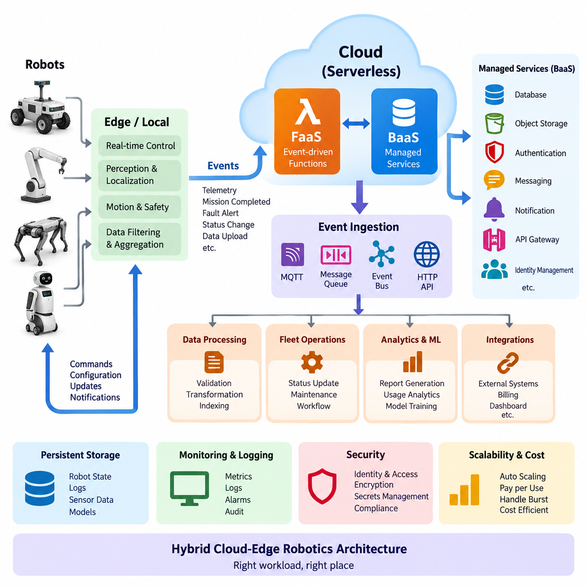
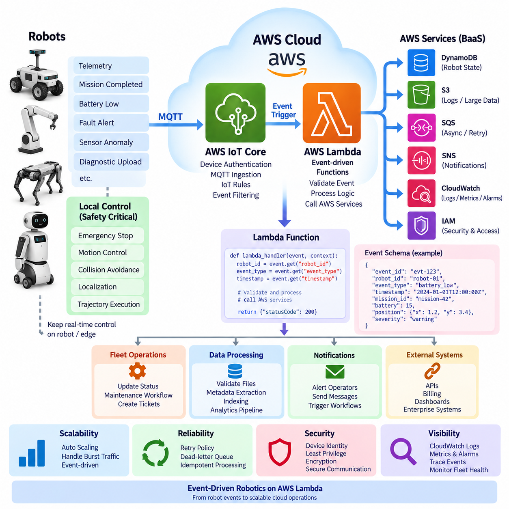
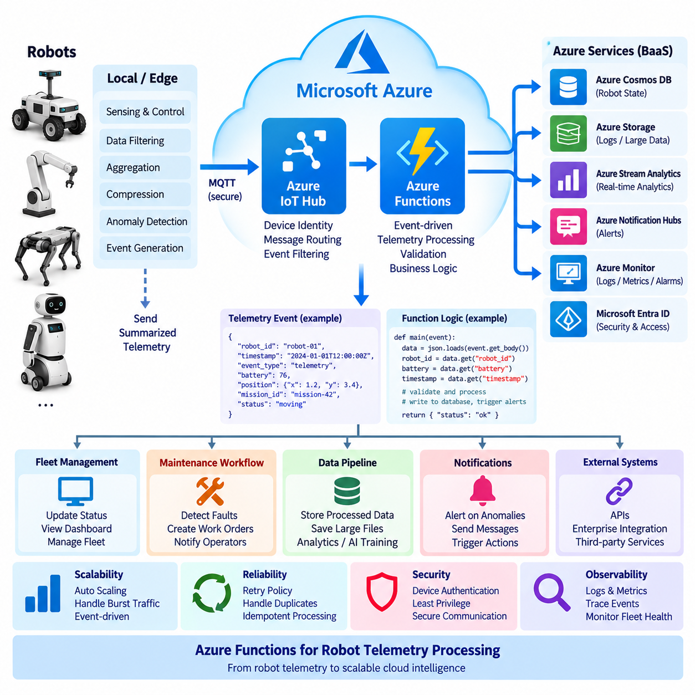
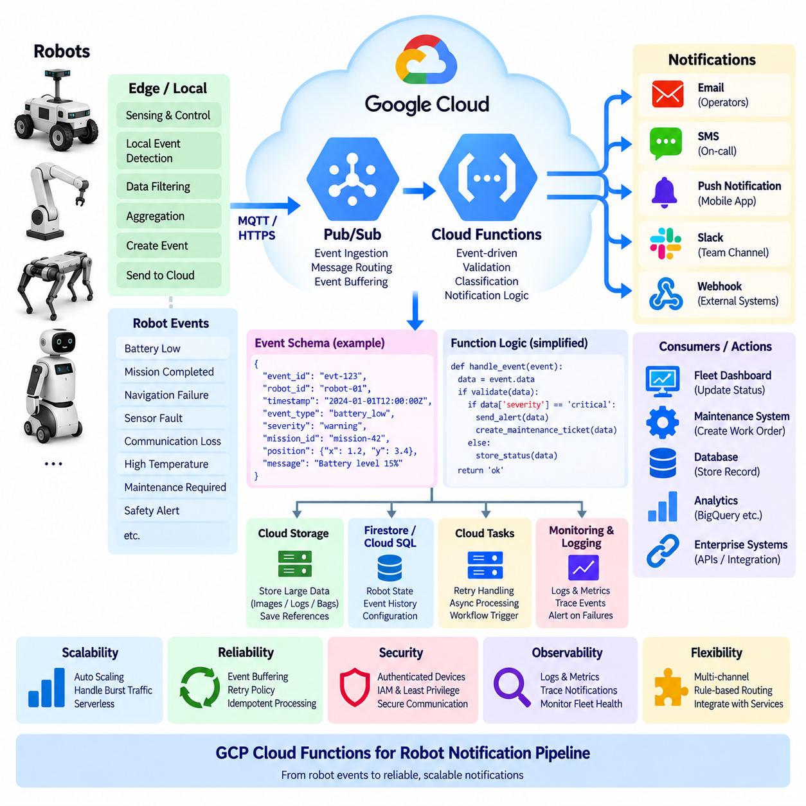
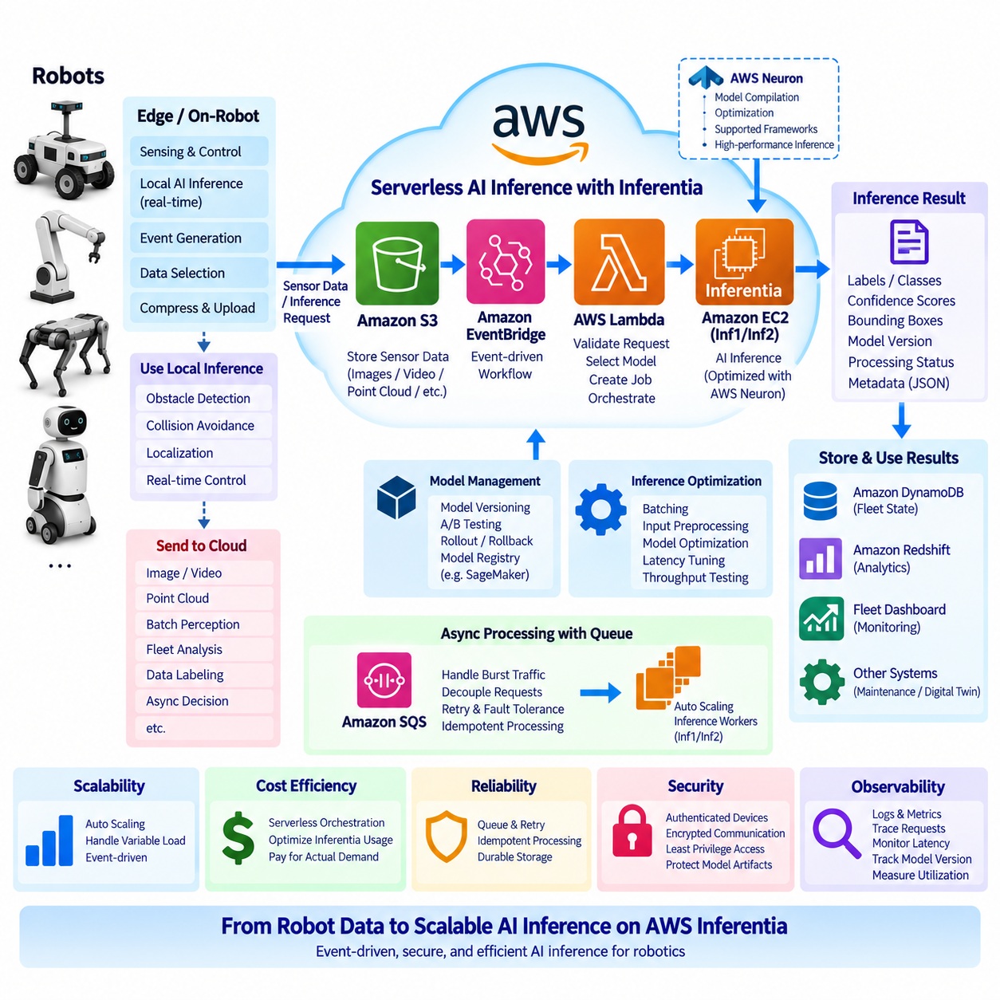
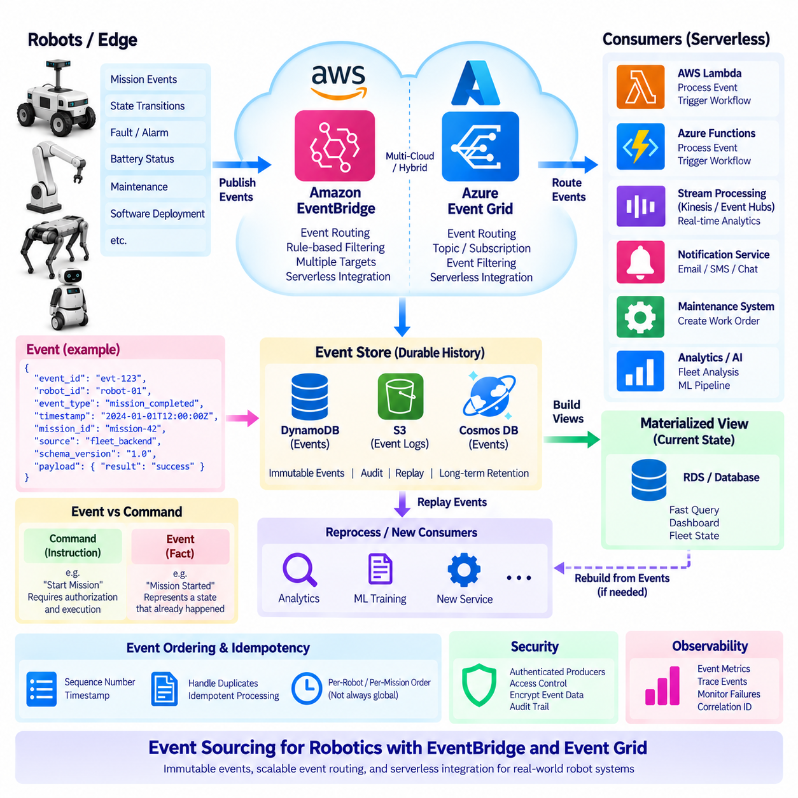
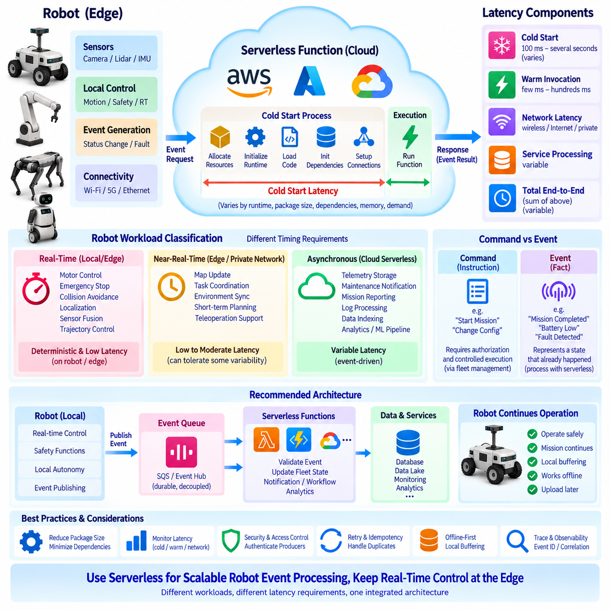
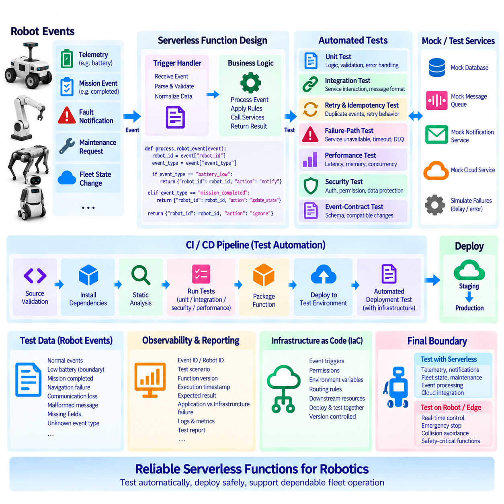
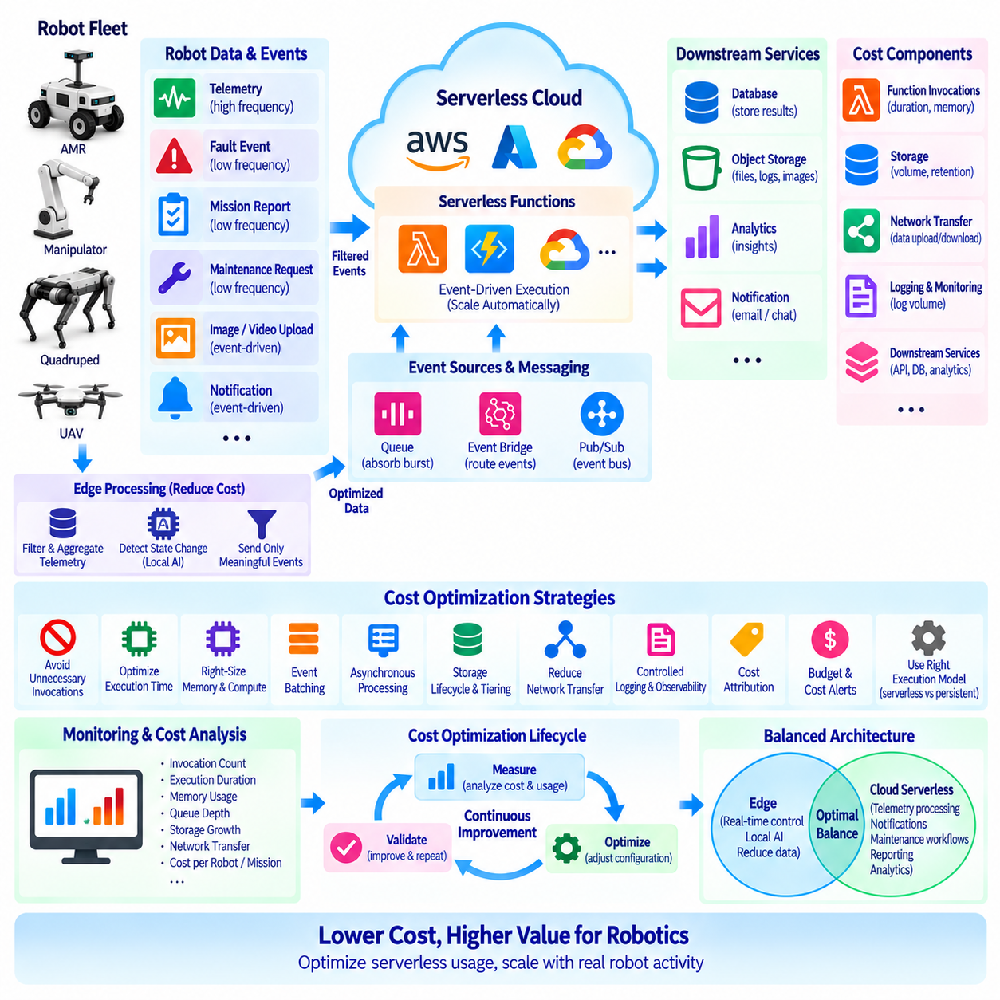
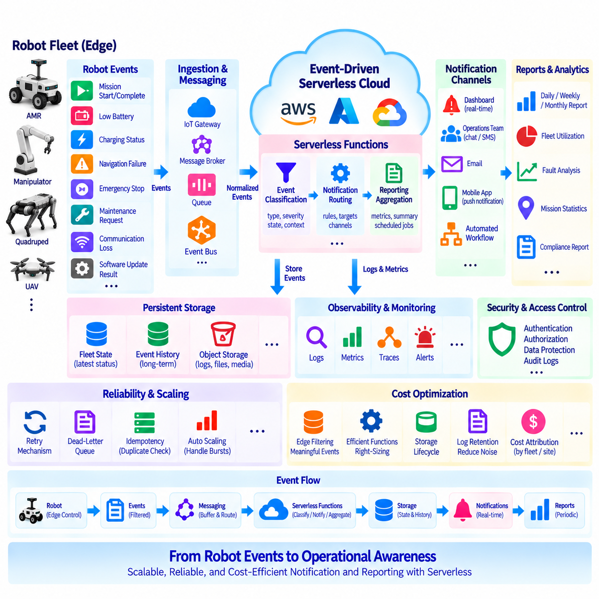

**Volume 09 Cloud and Edge Robotics**


# 10. Serverless for Robotics

##  

## 10.01 Serverless Architecture: FaaS / BaaS for Robotics

{width="7.268055555555556in" height="7.268055555555556in"}

Serverless architecture is a cloud computing model in which developers build and execute application logic without directly provisioning or managing servers. The term does not mean that servers disappear; rather, infrastructure provisioning, operating system maintenance, runtime scaling, and much of the availability management are delegated to a cloud platform. In robotics, this model is useful for backend workloads that are event-driven, intermittent, highly variable, or naturally decomposed into small services.

Function as a Service (FaaS) is the execution-oriented part of serverless architecture. Application logic is packaged as relatively small functions that are invoked when defined events occur. A robot may publish telemetry, report a fault, complete a mission, request configuration data, or upload a diagnostic file. Each event can trigger a function that performs validation, transformation, database updates, notification generation, or another bounded backend operation without requiring a continuously running application server.

Backend as a Service (BaaS) complements FaaS by providing managed backend capabilities that applications can consume through APIs or event interfaces. Typical capabilities include databases, object storage, authentication, messaging, notification, API gateways, and identity management. A robotics system can therefore combine custom functions with managed services rather than implementing every backend component itself. This reduces infrastructure administration while allowing developers to concentrate on robot-specific logic and operational workflows.

A useful robotics serverless architecture separates physical control from cloud-level event processing. Motor control, emergency stopping, localization, obstacle avoidance, trajectory execution, and other deterministic or safety-related functions normally remain on the robot or nearby edge infrastructure. Serverless services instead handle asynchronous activities such as telemetry processing, fleet event handling, report generation, maintenance notifications, data indexing, workflow automation, and integration with external enterprise systems.

This separation is particularly important because serverless execution does not inherently provide deterministic response time. Function invocation may experience platform scheduling delay, network latency, dependency latency, or cold-start overhead when an execution environment must be initialized. Consequently, a robot should not depend on a remote FaaS invocation for control loops that require bounded millisecond-level timing. The robot must retain sufficient local autonomy to continue safe operation when cloud functions are delayed or temporarily unreachable.

Event-driven design provides the architectural bridge between robots and serverless services. Robots or edge gateways publish events through MQTT brokers, message queues, event buses, HTTP endpoints, or cloud IoT services. Events can represent state changes rather than continuous computational requests: battery-low, mission-completed, localization-lost, obstacle-detected, software-update-ready, or sensor-file-uploaded. Functions subscribe to relevant events and independently perform the required backend actions.

This approach introduces loose coupling between robot software and cloud services. The robot does not need detailed knowledge of every downstream application that consumes its information. A single mission-completed event might activate a database update, utilization calculation, customer notification, billing workflow, and operational dashboard refresh. Additional consumers can later be introduced without redesigning the robot-side application, making the backend easier to evolve as fleet requirements expand.

Serverless systems also support elastic fleet operations. A small deployment may generate only a few events per minute, while a large fleet can produce sudden bursts when robots simultaneously reconnect, upload logs, or report operational conditions. FaaS platforms can create multiple execution instances according to demand and reduce them when activity falls. This consumption-driven scaling model can avoid maintaining backend servers sized permanently for occasional peak traffic.

State management requires special attention because functions should generally be treated as stateless execution units. Persistent robot state should therefore reside in external services such as managed databases, object stores, caches, digital-twin repositories, or event stores. A function can read the current state, process an event, and write an updated representation. This design also allows multiple function instances to operate concurrently without relying on local memory that disappears when an execution environment is terminated.

Robotics events frequently arrive more than once, arrive out of order, or are delayed by unstable wireless connectivity. Serverless functions should therefore be designed for idempotency whenever possible. Robot identifiers, event identifiers, timestamps, sequence numbers, and mission identifiers can be used to detect duplicates and preserve ordering semantics. Durable queues and retry mechanisms can prevent temporary backend failures from immediately becoming data loss, while dead-letter handling isolates events that repeatedly fail processing.

FaaS and BaaS can also simplify robot data pipelines. Instead of transmitting every sensor stream directly into a permanently running cloud application, the edge system can filter and aggregate data locally. Significant events or selected files are then transferred to cloud storage, where their arrival triggers functions for metadata extraction, validation, indexing, conversion, or analytics. Large camera, LiDAR, or training datasets remain in appropriate storage systems rather than being passed directly through short-lived function payloads.

Security must remain explicit even when infrastructure management is delegated to the provider. Robots require authenticated identities, encrypted communication, and narrowly scoped authorization. Functions should receive only the permissions required for their tasks, while API gateways and messaging services enforce access policies. Secrets should be stored in managed secret systems rather than embedded in function packages, and audit logs should record sensitive actions such as configuration changes, remote commands, and software deployment requests.

Serverless architecture changes the cost model of robotics backends as well. Conventional servers incur cost while provisioned even when robot traffic is low, whereas serverless platforms commonly charge according to requests, execution duration, allocated resources, and associated managed-service usage. This can be attractive for irregular workloads, but extremely frequent telemetry, long-running computation, large data transfers, or continuously active processing may make containers, virtual machines, edge servers, or Kubernetes-based services more economical.

For this reason, serverless should be treated as one component of a hybrid cloud-edge robotics architecture rather than a universal replacement for conventional computing. Real-time autonomy remains at the robot edge, persistent high-throughput services can run in containers or clusters, GPU-intensive training belongs on suitable accelerated infrastructure, and event-driven backend logic can use serverless functions. This workload-oriented division corresponds naturally with the broader cloud, edge, fleet, and GPU infrastructure structure of the robotics software architecture.

A mature robotics platform can therefore combine FaaS, BaaS, containers, edge computing, and local robot software into a layered execution environment. The central design question is not whether the entire robot system should become serverless, but which workloads benefit from event-triggered execution and managed backend services. When latency, state, safety, connectivity, scalability, security, and cost are evaluated together, serverless architecture becomes a practical mechanism for building scalable fleet services without transferring real-time robotic responsibility away from the physical edge.

서버리스 아키텍처(Serverless Architecture)는 개발자가 서버(Server)를 직접 프로비저닝(Provisioning)하거나 관리하지 않고 애플리케이션 로직(Application Logic)을 구축하고 실행하는 클라우드 컴퓨팅(Cloud Computing) 모델이다. 서버리스(Serverless)라는 용어는 서버가 사라진다는 의미가 아니라, 인프라 프로비저닝(Infrastructure Provisioning), 운영체제 유지관리(OS Maintenance), 런타임 확장(Runtime Scaling), 가용성 관리(Availability Management)의 상당 부분을 클라우드 플랫폼(Cloud Platform)에 위임한다는 의미이다. 로보틱스(Robotics)에서는 이벤트 기반(Event-Driven), 간헐적(Intermittent), 부하 변동이 큰(Highly Variable) 백엔드 워크로드(Backend Workload)에 특히 유용하다.

서비스형 함수(Function as a Service, FaaS)는 서버리스 아키텍처(Serverless Architecture)에서 실행(Execution)을 담당하는 핵심 요소이다. 애플리케이션 로직(Application Logic)은 비교적 작은 함수(Function) 단위로 패키징되며 정의된 이벤트(Event)가 발생하면 호출된다. 로봇은 텔레메트리(Telemetry)를 전송하거나, 고장을 보고하거나, 임무 완료를 알리거나, 설정 데이터를 요청하거나, 진단 파일을 업로드할 수 있다. 각각의 이벤트는 지속적으로 실행되는 애플리케이션 서버(Application Server) 없이 검증, 변환, 데이터베이스 업데이트, 알림 생성 등의 기능을 실행할 수 있다.

서비스형 백엔드(Backend as a Service, BaaS)는 애플리케이션이 API 또는 이벤트 인터페이스(Event Interface)를 통해 사용할 수 있는 관리형 백엔드 기능(Managed Backend Capability)을 제공함으로써 FaaS를 보완한다. 일반적인 기능에는 데이터베이스(Database), 객체 저장소(Object Storage), 인증(Authentication), 메시징(Messaging), 알림(Notification), API 게이트웨이(API Gateway), 신원 관리(Identity Management) 등이 포함된다. 따라서 로봇 시스템은 모든 백엔드 구성요소를 직접 구현하는 대신 사용자 정의 함수(Custom Function)와 관리형 서비스(Managed Service)를 결합할 수 있다.

로보틱스 서버리스 아키텍처(Robotics Serverless Architecture)에서는 물리적 제어(Physical Control)와 클라우드 수준 이벤트 처리(Cloud-Level Event Processing)를 분리하는 것이 중요하다. 모터 제어(Motor Control), 비상 정지(Emergency Stop), 위치추정(Localization), 장애물 회피(Obstacle Avoidance), 궤적 실행(Trajectory Execution)과 같은 결정론적(Deterministic) 또는 안전 관련(Safety-Related) 기능은 일반적으로 로봇이나 인접한 엣지 인프라(Edge Infrastructure)에 유지한다. 서버리스 서비스(Serverless Service)는 텔레메트리 처리, 플릿 이벤트 처리, 보고서 생성, 유지보수 알림 등의 비동기 작업(Asynchronous Task)을 담당한다.

이러한 분리는 서버리스 실행(Serverless Execution)이 본질적으로 결정론적 응답 시간(Deterministic Response Time)을 제공하지 않기 때문에 특히 중요하다. 함수 호출(Function Invocation)은 플랫폼 스케줄링 지연(Platform Scheduling Delay), 네트워크 지연(Network Latency), 종속 서비스 지연(Dependency Latency), 콜드 스타트(Cold Start) 오버헤드의 영향을 받을 수 있다. 따라서 밀리초 수준의 제한된 응답 시간이 필요한 제어 루프(Control Loop)를 원격 FaaS 호출에 의존해서는 안 된다. 클라우드 함수가 지연되거나 일시적으로 연결되지 않더라도 로봇은 안전한 동작을 지속할 수 있는 충분한 로컬 자율성(Local Autonomy)을 유지해야 한다.

이벤트 기반 설계(Event-Driven Design)는 로봇과 서버리스 서비스(Serverless Service)를 연결하는 아키텍처적 가교 역할을 한다. 로봇이나 엣지 게이트웨이(Edge Gateway)는 MQTT 브로커(MQTT Broker), 메시지 큐(Message Queue), 이벤트 버스(Event Bus), HTTP 엔드포인트(HTTP Endpoint), 클라우드 IoT 서비스(Cloud IoT Service)를 통해 이벤트를 발행한다. 이벤트는 배터리 부족(Battery-Low), 임무 완료(Mission-Completed), 위치추정 상실(Localization-Lost), 장애물 감지(Obstacle-Detected), 소프트웨어 업데이트 준비(Software-Update-Ready), 센서 파일 업로드(Sensor-File-Uploaded) 등의 상태 변화를 나타낼 수 있다.

이 방식은 로봇 소프트웨어(Robot Software)와 클라우드 서비스(Cloud Service) 사이의 느슨한 결합(Loose Coupling)을 가능하게 한다. 로봇은 자신의 정보를 사용하는 모든 다운스트림 애플리케이션(Downstream Application)의 세부 구조를 알 필요가 없다. 하나의 임무 완료 이벤트(Mission-Completed Event)가 데이터베이스 업데이트(Database Update), 가동률 계산(Utilization Calculation), 고객 알림(Customer Notification), 과금 워크플로(Billing Workflow), 운영 대시보드 갱신(Operational Dashboard Refresh)을 각각 실행할 수 있다. 이후 새로운 소비자(Consumer)를 추가하더라도 로봇 측 애플리케이션을 재설계할 필요가 없다.

서버리스 시스템(Serverless System)은 탄력적인 플릿 운영(Elastic Fleet Operation)에도 적합하다. 소규모 배치에서는 분당 몇 개의 이벤트만 발생할 수 있지만, 대규모 플릿(Fleet)에서는 여러 로봇이 동시에 재접속하거나 로그를 업로드하거나 운영 상태를 보고하면서 순간적인 이벤트 폭증(Event Burst)이 발생할 수 있다. FaaS 플랫폼은 수요에 따라 여러 실행 인스턴스(Execution Instance)를 생성하고 활동량이 감소하면 이를 축소할 수 있다. 이러한 소비 기반 확장 모델(Consumption-Driven Scaling Model)은 일시적인 최대 트래픽에 맞추어 백엔드 서버를 항상 유지해야 하는 부담을 줄일 수 있다.

함수(Function)는 일반적으로 상태 비저장 실행 단위(Stateless Execution Unit)로 취급해야 하므로 상태 관리(State Management)에 특별한 주의가 필요하다. 지속적으로 유지해야 하는 로봇 상태(Robot State)는 관리형 데이터베이스(Managed Database), 객체 저장소(Object Store), 캐시(Cache), 디지털 트윈 저장소(Digital Twin Repository), 이벤트 저장소(Event Store) 등의 외부 서비스에 보관해야 한다. 함수는 현재 상태를 읽고 이벤트를 처리한 후 갱신된 상태를 기록할 수 있다. 이를 통해 여러 함수 인스턴스가 동시에 동작하더라도 일시적인 로컬 메모리(Local Memory)에 의존하지 않을 수 있다.

로보틱스 이벤트(Robotics Event)는 불안정한 무선 연결(Wireless Connectivity)로 인해 중복 도착하거나, 순서가 바뀌거나, 지연될 수 있다. 따라서 서버리스 함수(Serverless Function)는 가능한 경우 멱등성(Idempotency)을 갖도록 설계해야 한다. 로봇 식별자(Robot Identifier), 이벤트 식별자(Event Identifier), 타임스탬프(Timestamp), 시퀀스 번호(Sequence Number), 임무 식별자(Mission Identifier)를 활용하면 중복 이벤트를 탐지하고 순서 의미(Ordering Semantics)를 유지할 수 있다. 내구성 큐(Durable Queue)와 재시도 메커니즘(Retry Mechanism)은 일시적인 백엔드 장애가 즉각적인 데이터 손실로 이어지는 것을 방지할 수 있다.

FaaS와 BaaS는 로봇 데이터 파이프라인(Robot Data Pipeline)을 단순화하는 데에도 활용할 수 있다. 모든 센서 스트림(Sensor Stream)을 지속적으로 실행되는 클라우드 애플리케이션으로 직접 전송하는 대신, 엣지 시스템(Edge System)이 데이터를 로컬에서 필터링하고 집계할 수 있다. 중요한 이벤트나 선택된 파일만 클라우드 저장소(Cloud Storage)로 전송하고, 파일 도착을 계기로 메타데이터 추출(Metadata Extraction), 검증(Validation), 인덱싱(Indexing), 변환(Conversion), 분석(Analytics) 함수를 실행할 수 있다. 대용량 카메라, LiDAR 또는 학습 데이터셋은 단기 실행 함수의 페이로드(Payload)가 아니라 적절한 저장 시스템에 보관해야 한다.

인프라 관리가 클라우드 공급자(Cloud Provider)에 위임되더라도 보안(Security)은 명시적으로 설계해야 한다. 로봇에는 인증된 신원(Authenticated Identity), 암호화 통신(Encrypted Communication), 최소 범위의 권한(Least-Privilege Authorization)이 필요하다. 함수에는 해당 작업 수행에 필요한 권한만 부여하고, API 게이트웨이와 메시징 서비스는 접근 정책(Access Policy)을 적용해야 한다. 비밀정보(Secret)는 함수 패키지에 포함하지 않고 관리형 시크릿 시스템(Managed Secret System)에 저장하며, 설정 변경이나 원격 명령과 같은 중요 작업은 감사 로그(Audit Log)에 기록해야 한다.

서버리스 아키텍처(Serverless Architecture)는 로보틱스 백엔드(Robotics Backend)의 비용 모델(Cost Model)도 변화시킨다. 기존 서버는 로봇 트래픽이 적더라도 프로비저닝된 동안 비용이 발생하지만, 서버리스 플랫폼은 일반적으로 요청 횟수(Request), 실행 시간(Execution Duration), 할당 자원(Allocated Resource), 관련 관리형 서비스 사용량에 따라 비용을 부과한다. 불규칙한 워크로드에는 유리할 수 있지만, 매우 빈번한 텔레메트리, 장시간 계산, 대용량 데이터 전송, 지속적인 처리에는 컨테이너(Container), 가상 머신(Virtual Machine), 엣지 서버(Edge Server), 쿠버네티스(Kubernetes) 기반 서비스가 더 경제적일 수 있다.

따라서 서버리스(Serverless)는 기존 컴퓨팅을 완전히 대체하는 기술이 아니라 하이브리드 클라우드-엣지 로보틱스 아키텍처(Hybrid Cloud-Edge Robotics Architecture)의 한 구성요소로 이해해야 한다. 실시간 자율주행(Real-Time Autonomy)은 로봇 엣지(Robot Edge)에 유지하고, 지속적인 고처리량 서비스(High-Throughput Service)는 컨테이너나 클러스터에서 실행하며, GPU 집약적인 학습(GPU-Intensive Training)은 적절한 가속 컴퓨팅 인프라에서 수행하고, 이벤트 기반 백엔드 로직(Event-Driven Backend Logic)은 서버리스 함수를 활용할 수 있다.

성숙한 로보틱스 플랫폼(Robotics Platform)은 FaaS, BaaS, 컨테이너(Container), 엣지 컴퓨팅(Edge Computing), 로컬 로봇 소프트웨어(Local Robot Software)를 하나의 계층화된 실행 환경(Layered Execution Environment)으로 결합할 수 있다. 핵심 설계 질문은 전체 로봇 시스템을 서버리스로 전환할 것인가가 아니라 어떤 워크로드가 이벤트 트리거 실행(Event-Triggered Execution)과 관리형 백엔드 서비스의 이점을 얻을 수 있는가이다. 지연시간(Latency), 상태(State), 안전(Safety), 연결성(Connectivity), 확장성(Scalability), 보안(Security), 비용(Cost)을 함께 평가할 때 서버리스 아키텍처는 실시간 로봇 제어의 책임을 물리적 엣지에서 제거하지 않으면서 확장 가능한 플릿 서비스를 구축하는 실용적인 수단이 된다.

##  

## 10.02 AWS Lambda: Robot Event Trigger [w/Code]

{width="7.268055555555556in" height="7.268055555555556in"}

AWS Lambda is a Function as a Service (FaaS) platform that executes application logic in response to events without requiring developers to maintain continuously running servers. In robotics, Lambda can act as an event-processing layer between robots, AWS IoT services, storage, databases, fleet applications, and external systems. A robot generates an operational event, an AWS service receives it, and the event can automatically invoke a Lambda function that performs a specific backend task.

A robot event trigger represents the condition that initiates this serverless execution flow. Events may include battery warnings, mission completion, navigation failures, sensor anomalies, emergency notifications, maintenance conditions, connectivity changes, or diagnostic uploads. Instead of having a permanent backend process continuously poll every robot, the architecture reacts only when relevant events occur. This event-driven approach reduces unnecessary computation and naturally separates robot-side autonomy from cloud-side operational processing.

AWS IoT Core is a common entry point for robot-generated events. A robot or edge gateway can publish telemetry and state messages using MQTT topics, while IoT rules inspect incoming messages and route selected events to Lambda. For example, routine battery telemetry may simply be stored, while a message indicating that battery capacity has crossed a defined threshold can invoke a Lambda function responsible for updating fleet status and initiating a maintenance or charging workflow.

The robot should normally perform safety-critical interpretation locally before relying on a Lambda trigger. Emergency stopping, collision avoidance, motor control, localization recovery, and trajectory execution require predictable response times and must remain within the robot or edge system. Lambda is more appropriate after the local system has determined that an operational event should be reported. The cloud function can then record the event, notify operators, update dashboards, or coordinate non-real-time fleet activities without becoming part of the safety control loop.

A basic Lambda handler receives an event object and execution context. When invoked through AWS IoT Core, the event can contain values such as robot ID, timestamp, event type, battery state, mission ID, position, diagnostic code, and severity. The function validates required fields before performing downstream operations. Keeping a consistent robot event schema is important because the same function may process messages generated by hundreds or thousands of robots running different missions.

\`\`\`python

import json

def lambda_handler(event, context):

robot_id = event.get("robot_id")

event_type = event.get("event_type")

timestamp = event.get("timestamp")

if not robot_id or not event_type:

return {"statusCode": 400, "body": "Invalid robot event"}

print(f"[{timestamp}] {robot_id}: {event_type}")

return {

"statusCode": 200,

"body": json.dumps({"processed": True})

}

\`\`\`

Robot events should be designed as compact messages rather than unrestricted sensor payloads. A Lambda invocation is suitable for metadata and operational events, but continuous camera images, LiDAR point clouds, video streams, or large ROS bag files should normally be handled through dedicated data pipelines or object storage. The robot can upload a large diagnostic file to Amazon S3 and publish only its object location and metadata. An S3 object-created event can subsequently invoke Lambda for validation, indexing, metadata extraction, or workflow initiation.

Lambda can also connect robot events to persistent state. After receiving a mission-completed event, a function may update the robot\'s operational record in Amazon DynamoDB, store summarized information in another database, or generate an entry for downstream analytics. Functions should remain stateless themselves, with durable robot state maintained outside the execution environment. This allows AWS to create multiple function instances when event volume increases without requiring shared local memory between invocations.

Asynchronous invocation is particularly useful for fleet events because the robot usually does not need to wait for the entire cloud workflow to finish. A robot can publish an event and continue operating while Lambda processes it independently. If downstream processing fails, retry policies, queues, or dead-letter destinations can preserve failed events for later investigation. This architecture prevents temporary failures in reporting or analytics services from unnecessarily interrupting the physical robot\'s mission.

Duplicate processing must be considered because distributed event systems can deliver the same logical event more than once. Each robot event can therefore include a unique event ID together with robot ID, timestamp, mission ID, and sequence information. Before performing actions such as creating maintenance tickets or sending notifications, a Lambda function can verify whether the event has already been processed. Idempotent processing prevents repeated delivery from producing duplicated operational actions.

\`\`\`python

event_id = event.get("event_id")

if not event_id:

raise ValueError("event_id is required")

# Check event_id against a persistent event store.

# If already processed, return without repeating the action.

\`\`\`

AWS Lambda automatically scales execution capacity as incoming event volume changes, which is useful for robot fleets with bursty traffic. A warehouse may have little event activity during idle periods but generate many simultaneous messages when shifts begin, network connectivity returns, or a fleet-wide operation occurs. Concurrency must nevertheless be controlled because rapidly scaling functions can overload downstream databases, APIs, or notification systems even when Lambda itself can accept additional invocations.

Cold start is another important architectural consideration. When AWS must initialize a new execution environment, the first invocation can take longer than subsequent warm invocations. For ordinary robot telemetry processing, reporting, maintenance workflows, and notifications, this variation may be acceptable. It is inappropriate for deterministic real-time control. Provisioned concurrency or alternative continuously running services can be considered when predictable backend response time is important, but local control should still protect physical safety independently.

Security begins with robot identity and continues through every event-processing stage. Robots communicating through AWS IoT Core should use authenticated device identities and appropriate authorization policies. Lambda functions execute through IAM roles that should grant only the resources required by each function. A telemetry processor that writes to one DynamoDB table, for example, should not receive unrestricted access to unrelated storage, administrative APIs, or other fleet resources.

Operational visibility is essential because serverless execution is distributed across many independent invocations. Lambda logs can be sent to Amazon CloudWatch, where developers can inspect invocation errors, execution duration, throttling, and application messages. Robot identifiers, event identifiers, and mission identifiers should be included in structured logs so that a cloud event can be traced back to the physical robot and operational context that produced it. Metrics and alarms can then detect abnormal processing behavior.

A complete robot event pipeline may therefore follow a simple pattern: the robot detects a condition locally, publishes a structured MQTT event, AWS IoT Core authenticates and routes the message, an IoT rule invokes Lambda, and the function performs a bounded backend action. Managed databases, object storage, messaging, monitoring, and notification services maintain persistent information and continue downstream workflows. The robot remains responsible for real-time autonomy while the cloud provides scalable operational coordination.

Within a broader robotics cloud architecture, AWS Lambda is most effective when functions are small, event-oriented, stateless, independently scalable, and tolerant of variable execution latency. It should not replace ROS 2 nodes, edge perception pipelines, motion controllers, or other continuously running robot processes. Instead, Lambda provides a serverless bridge between physical robot events and cloud workflows, allowing fleet systems to react automatically to operational changes while preserving the separation between real-time robotic control and asynchronous cloud computing.

AWS 람다(AWS Lambda)는 개발자가 지속적으로 실행되는 서버(Server)를 유지관리하지 않고도 이벤트(Event)에 대응하여 애플리케이션 로직(Application Logic)을 실행할 수 있는 서비스형 함수(Function as a Service, FaaS) 플랫폼이다. 로보틱스(Robotics)에서 람다는 로봇, AWS IoT 서비스, 저장소(Storage), 데이터베이스(Database), 플릿 애플리케이션(Fleet Application), 외부 시스템(External System)을 연결하는 이벤트 처리 계층(Event-Processing Layer)으로 활용할 수 있다. 로봇이 운영 이벤트를 생성하면 AWS 서비스가 이를 수신하고 람다 함수(Lambda Function)를 자동으로 호출하여 특정 백엔드 작업을 수행한다.

로봇 이벤트 트리거(Robot Event Trigger)는 이러한 서버리스 실행 흐름(Serverless Execution Flow)을 시작하는 조건을 의미한다. 이벤트에는 배터리 경고(Battery Warning), 임무 완료(Mission Completion), 내비게이션 실패(Navigation Failure), 센서 이상(Sensor Anomaly), 비상 알림(Emergency Notification), 유지보수 조건(Maintenance Condition), 연결 상태 변화(Connectivity Change), 진단 데이터 업로드(Diagnostic Upload) 등이 포함될 수 있다. 영구적인 백엔드 프로세스가 모든 로봇을 지속적으로 폴링(Polling)하는 대신 관련 이벤트가 발생했을 때만 시스템이 반응한다.

AWS IoT 코어(AWS IoT Core)는 로봇이 생성한 이벤트가 유입되는 일반적인 진입점(Entry Point)이다. 로봇 또는 엣지 게이트웨이(Edge Gateway)는 MQTT 토픽(MQTT Topic)을 사용하여 텔레메트리(Telemetry)와 상태 메시지를 발행할 수 있으며, IoT 규칙(IoT Rule)은 수신 메시지를 검사하고 선택된 이벤트를 람다로 전달한다. 예를 들어 일반적인 배터리 텔레메트리는 저장만 하고, 배터리 용량이 정의된 임계값(Threshold)을 통과했다는 메시지는 플릿 상태를 갱신하고 유지보수 또는 충전 워크플로(Charging Workflow)를 시작하는 람다 함수를 호출할 수 있다.

로봇은 일반적으로 람다 트리거(Lambda Trigger)에 의존하기 전에 안전 필수 해석(Safety-Critical Interpretation)을 로컬에서 수행해야 한다. 비상 정지(Emergency Stop), 충돌 회피(Collision Avoidance), 모터 제어(Motor Control), 위치추정 복구(Localization Recovery), 궤적 실행(Trajectory Execution)은 예측 가능한 응답 시간이 필요하므로 로봇이나 엣지 시스템(Edge System)에 유지되어야 한다. 람다는 로컬 시스템이 운영 이벤트를 보고해야 한다고 판단한 이후에 이를 기록하고 운영자에게 알리거나 대시보드를 갱신하는 등의 비실시간 플릿 작업에 적합하다.

기본적인 람다 핸들러(Lambda Handler)는 이벤트 객체(Event Object)와 실행 컨텍스트(Execution Context)를 전달받는다. AWS IoT 코어를 통해 호출되는 경우 이벤트에는 로봇 식별자(Robot ID), 타임스탬프(Timestamp), 이벤트 유형(Event Type), 배터리 상태(Battery State), 임무 식별자(Mission ID), 위치(Position), 진단 코드(Diagnostic Code), 심각도(Severity) 등의 값이 포함될 수 있다. 함수는 후속 작업을 수행하기 전에 필수 필드(Required Field)를 검증한다. 동일한 함수가 서로 다른 임무를 수행하는 수백 또는 수천 대의 로봇 메시지를 처리할 수 있으므로 일관된 로봇 이벤트 스키마(Robot Event Schema)를 유지하는 것이 중요하다.

\`\`\`python

import json

def lambda_handler(event, context):

robot_id = event.get("robot_id")

event_type = event.get("event_type")

timestamp = event.get("timestamp")

if not robot_id or not event_type:

return {"statusCode": 400, "body": "Invalid robot event"}

print(f"[{timestamp}] {robot_id}: {event_type}")

return {

"statusCode": 200,

"body": json.dumps({"processed": True})

}

\`\`\`

로봇 이벤트(Robot Event)는 제한되지 않은 센서 페이로드(Sensor Payload)가 아니라 간결한 메시지(Compact Message) 형태로 설계해야 한다. 람다 호출(Lambda Invocation)은 메타데이터(Metadata)와 운영 이벤트 처리에는 적합하지만 연속적인 카메라 이미지, LiDAR 포인트 클라우드(LiDAR Point Cloud), 비디오 스트림(Video Stream), 대용량 ROS 백(ROS Bag) 파일은 일반적으로 전용 데이터 파이프라인(Data Pipeline)이나 객체 저장소(Object Storage)를 통해 처리해야 한다. 로봇은 대용량 진단 파일을 Amazon S3에 업로드하고 객체 위치(Object Location)와 메타데이터만 발행할 수 있으며, 이후 S3 객체 생성 이벤트(Object-Created Event)가 람다를 호출하여 검증, 인덱싱(Indexing), 메타데이터 추출 또는 워크플로 시작을 수행할 수 있다.

람다는 로봇 이벤트를 영구 상태(Persistent State)와 연결할 수도 있다. 임무 완료 이벤트를 수신한 후 함수는 Amazon DynamoDB에 저장된 로봇 운영 기록을 갱신하거나, 요약 정보를 다른 데이터베이스에 저장하거나, 후속 분석(Downstream Analytics)을 위한 항목을 생성할 수 있다. 함수 자체는 상태 비저장(Stateless) 상태를 유지하고 지속적인 로봇 상태는 실행 환경 외부에 보관해야 한다. 이를 통해 이벤트 양이 증가할 때 AWS가 여러 함수 인스턴스(Function Instance)를 생성하더라도 호출 간 공유 로컬 메모리(Shared Local Memory)에 의존하지 않을 수 있다.

비동기 호출(Asynchronous Invocation)은 로봇이 전체 클라우드 워크플로가 완료될 때까지 기다릴 필요가 없기 때문에 플릿 이벤트 처리에 특히 유용하다. 로봇은 이벤트를 발행한 후 계속 작동하고 람다는 독립적으로 이벤트를 처리할 수 있다. 후속 처리가 실패하면 재시도 정책(Retry Policy), 큐(Queue), 데드레터 대상(Dead-Letter Destination)을 사용하여 실패한 이벤트를 이후 분석을 위해 보존할 수 있다. 이러한 아키텍처는 보고 또는 분석 서비스의 일시적인 장애가 물리적 로봇의 임무를 불필요하게 중단시키는 것을 방지한다.

분산 이벤트 시스템(Distributed Event System)에서는 동일한 논리적 이벤트가 두 번 이상 전달될 수 있으므로 중복 처리(Duplicate Processing)를 고려해야 한다. 따라서 각 로봇 이벤트에는 로봇 식별자, 타임스탬프, 임무 식별자, 시퀀스 정보(Sequence Information)와 함께 고유 이벤트 식별자(Event ID)를 포함할 수 있다. 유지보수 티켓(Maintenance Ticket)을 생성하거나 알림을 전송하기 전에 람다 함수가 해당 이벤트의 기존 처리 여부를 확인할 수 있다. 멱등 처리(Idempotent Processing)를 적용하면 반복적인 이벤트 전달이 중복 운영 작업으로 이어지는 것을 방지할 수 있다.

\`\`\`python

event_id = event.get("event_id")

if not event_id:

raise ValueError("event_id is required")

# Check event_id against a persistent event store.

# If already processed, return without repeating the action.

\`\`\`

AWS 람다는 수신되는 이벤트 양의 변화에 따라 실행 용량(Execution Capacity)을 자동으로 확장하므로 트래픽 변동이 큰 로봇 플릿(Robot Fleet)에 유용하다. 창고의 유휴 시간에는 이벤트 활동이 거의 없을 수 있지만 교대 근무가 시작되거나, 네트워크 연결이 복구되거나, 플릿 전체 작업이 발생하면 많은 메시지가 동시에 생성될 수 있다. 그러나 람다 자체가 추가 호출을 수용할 수 있더라도 빠르게 증가하는 함수가 후단 데이터베이스, API 또는 알림 시스템에 과도한 부하를 발생시킬 수 있으므로 동시성(Concurrency)을 제어해야 한다.

콜드 스타트(Cold Start) 역시 중요한 아키텍처 고려사항이다. AWS가 새로운 실행 환경(Execution Environment)을 초기화해야 하는 경우 첫 번째 호출은 이후의 웜 호출(Warm Invocation)보다 더 오래 걸릴 수 있다. 일반적인 로봇 텔레메트리 처리, 보고, 유지보수 워크플로, 알림에서는 이러한 변동을 허용할 수 있지만 결정론적 실시간 제어(Deterministic Real-Time Control)에는 적합하지 않다. 백엔드 응답 시간의 예측 가능성이 중요하면 프로비저닝된 동시성(Provisioned Concurrency)이나 지속 실행 서비스(Continuously Running Service)를 고려할 수 있지만 물리적 안전은 여전히 로컬 제어 시스템이 독립적으로 보호해야 한다.

보안(Security)은 로봇 신원(Robot Identity)에서 시작하여 전체 이벤트 처리 단계에 걸쳐 적용되어야 한다. AWS IoT 코어와 통신하는 로봇은 인증된 디바이스 신원(Authenticated Device Identity)과 적절한 권한 부여 정책(Authorization Policy)을 사용해야 한다. 람다 함수는 IAM 역할(IAM Role)을 통해 실행되며 각 함수에 필요한 리소스만 접근할 수 있도록 권한을 제한해야 한다. 예를 들어 하나의 DynamoDB 테이블에 데이터를 기록하는 텔레메트리 처리 함수에는 관련 없는 저장소나 관리 API, 다른 플릿 리소스에 대한 무제한 접근 권한을 제공해서는 안 된다.

서버리스 실행(Serverless Execution)은 다수의 독립적인 호출로 분산되므로 운영 가시성(Operational Visibility)이 필수적이다. 람다 로그(Lambda Log)는 Amazon CloudWatch로 전송할 수 있으며 개발자는 호출 오류(Invocation Error), 실행 시간(Execution Duration), 스로틀링(Throttling), 애플리케이션 메시지를 확인할 수 있다. 구조화 로그(Structured Log)에 로봇 식별자, 이벤트 식별자, 임무 식별자를 포함하면 클라우드 이벤트를 이를 생성한 물리적 로봇 및 운영 상황까지 추적할 수 있다. 메트릭(Metric)과 알람(Alarm)을 이용하여 비정상적인 처리 동작도 탐지할 수 있다.

따라서 완전한 로봇 이벤트 파이프라인(Robot Event Pipeline)은 로봇이 로컬에서 조건을 탐지하고, 구조화된 MQTT 이벤트를 발행하고, AWS IoT 코어가 메시지를 인증하고 라우팅하며, IoT 규칙이 람다를 호출하고, 함수가 제한된 백엔드 작업을 수행하는 형태로 구성할 수 있다. 관리형 데이터베이스(Managed Database), 객체 저장소(Object Storage), 메시징(Messaging), 모니터링(Monitoring), 알림(Notification) 서비스는 영구 정보를 유지하면서 후속 워크플로를 계속 처리한다. 로봇은 실시간 자율성(Real-Time Autonomy)을 담당하고 클라우드는 확장 가능한 운영 조정(Operational Coordination)을 제공한다.

더 넓은 로보틱스 클라우드 아키텍처(Robotics Cloud Architecture)에서 AWS 람다는 함수가 작고, 이벤트 지향적(Event-Oriented)이며, 상태 비저장(Stateless)이고, 독립적으로 확장 가능하며, 실행 지연의 변동을 허용할 수 있을 때 가장 효과적이다. 람다는 ROS 2 노드(ROS 2 Node), 엣지 인식 파이프라인(Edge Perception Pipeline), 모션 컨트롤러(Motion Controller) 또는 지속적으로 실행되는 다른 로봇 프로세스를 대체해서는 안 된다. 대신 람다는 물리적 로봇 이벤트와 클라우드 워크플로를 연결하는 서버리스 브리지(Serverless Bridge)를 제공하여 실시간 로봇 제어와 비동기 클라우드 컴퓨팅을 분리하면서 플릿 시스템이 운영 변화에 자동으로 대응할 수 있도록 한다.

##  

## 10.03 Azure Functions: Robot Telemetry Processing [w/Code]

{width="7.268055555555556in" height="7.268055555555556in"}

Azure Functions is a serverless compute service that executes application logic in response to events without requiring developers to manage continuously running servers. In a robotics system, it can process telemetry generated by robots, edge gateways, or IoT devices and connect that information to cloud databases, storage, monitoring, notification, and fleet-management services. The main architectural purpose is to move asynchronous backend processing away from the robot while keeping real-time control and safety functions on the robot or edge system.

Robot telemetry represents operational information generated during robot operation. Typical data includes robot identity, timestamp, position, battery state, velocity, operating mode, mission status, sensor health, fault codes, and communication status. A robot may publish these values periodically or only when a significant state changes. Azure Functions can receive such messages through services such as Azure IoT Hub or other supported event sources and execute processing logic only when telemetry or an operational event arrives.

A practical telemetry architecture separates high-frequency raw data from meaningful operational information. The robot or edge computer can perform local filtering, aggregation, compression, and anomaly detection before transmitting data to the cloud. For example, instead of continuously sending every sensor measurement, the edge system can calculate battery trends, average velocity, localization quality, or fault conditions and transmit summarized telemetry. Azure Functions can then process these messages and update the corresponding cloud-side robot state.

Azure IoT Hub can provide the device-to-cloud communication layer for a fleet of connected robots. Each robot can have an authenticated device identity and publish telemetry through the IoT communication interface. IoT Hub can route messages according to their content or destination, allowing selected telemetry to reach an Azure Function while other data is directed toward storage or analytics systems. This creates a separation between device communication and application-level telemetry processing.

When a telemetry message reaches an Azure Function, the function should first validate the event structure and required fields. A consistent schema might contain robot_id, timestamp, event_type, battery, position, mission_id, and status information. Validation prevents malformed or incomplete messages from propagating into fleet databases. It also provides a defined interface between robot software and cloud services, allowing different robot models or software versions to communicate with the same backend processing pipeline.

A simple function can extract the robot identity and telemetry values, apply basic processing, and pass the result to another Azure service. The function should remain relatively small and focused on one responsibility. For example, one function can process battery telemetry, another can handle fault events, and another can generate maintenance notifications. Separating these responsibilities makes individual functions easier to test, deploy, monitor, and scale as the robot fleet grows.

\`\`\`python

import json

def main(event):

data = json.loads(event.get_body().decode("utf-8"))

robot_id = data.get("robot_id")

battery = data.get("battery")

timestamp = data.get("timestamp")

if not robot_id or battery is None:

raise ValueError("Invalid robot telemetry")

return {

"robot_id": robot_id,

"battery": battery,

"timestamp": timestamp

}

\`\`\`

Telemetry processing often requires persistent storage because an Azure Function should not depend on its temporary execution environment for robot state. Processed telemetry can be written to an appropriate Azure data service, while large diagnostic files, images, logs, or other objects can be stored separately. A function may therefore transform an incoming message into a compact operational record while a separate storage pipeline retains larger datasets for later analysis, troubleshooting, or AI training.

An important application is fleet-state management. When a robot reports a new battery level, mission state, fault condition, or connectivity status, an Azure Function can update the corresponding fleet record. A fleet-management application can then retrieve this information to display the current status of individual robots. The same event can also initiate additional workflows, such as creating a maintenance task when repeated faults are detected or notifying an operator when a robot enters a predefined abnormal state.

Serverless telemetry processing must account for duplicate messages, delayed messages, and temporary communication failures. Robot networks can disconnect and reconnect, and distributed event systems may deliver an event more than once. Telemetry records should therefore contain identifiers and timestamps that allow the backend to recognize duplicates and determine the appropriate ordering. Processing should be designed to be idempotent where possible, so that receiving the same logical event twice does not create two maintenance tickets or corrupt the robot\'s operational state.

Azure Functions also provides a useful mechanism for event-driven anomaly handling. A function can evaluate telemetry against predefined operational rules, such as an unusually rapid battery decrease, repeated localization failures, excessive motor temperature, or repeated communication loss. The function itself should not directly replace the robot\'s safety controller. Instead, it can classify the reported condition, record the event, update fleet state, and trigger an operator notification or maintenance workflow. Immediate physical protection remains the responsibility of the robot and edge control system.

Scaling is another reason to use Azure Functions for fleet telemetry. A small fleet may generate a modest number of events, while a large fleet can produce significant bursts when many robots start operating, reconnect to the network, or report simultaneous conditions. Serverless execution can increase the number of function instances as demand changes. However, downstream services such as databases and APIs can become bottlenecks, so concurrency, message buffering, retry policies, and resource limits should be considered as part of the complete architecture rather than relying solely on automatic function scaling.

Security must be applied across the complete telemetry path. Each robot should have an authenticated identity, and communication between the robot, IoT service, and cloud backend should be protected. Azure Functions should use managed identities or appropriately scoped credentials when accessing other Azure resources. Permissions should follow the principle of least privilege so that a telemetry-processing function receives only the access required to perform its task. Sensitive credentials should not be embedded directly in robot software or function source code.

Monitoring is essential because telemetry processing is distributed across devices, network connections, event services, functions, databases, and fleet applications. Application logs and metrics can be used to determine whether events are arriving, functions are executing successfully, processing latency is increasing, or failures are being retried. Including robot ID, event ID, mission ID, and timestamps in structured logs makes it possible to trace a cloud-side problem back to the operational context of a particular robot.

The resulting architecture can be understood as a continuous telemetry flow from the physical robot to the cloud. The robot performs real-time sensing, control, localization, and safety processing locally, while selected telemetry is transmitted through the IoT communication layer. Azure Functions receives and processes relevant events, validates the data, updates persistent robot state, and activates downstream workflows such as fleet management, analytics, maintenance, and notification. This division allows cloud computing to scale independently from the physical robot while preserving local autonomy.

Azure Functions is therefore most appropriate for asynchronous and event-driven robotics workloads rather than deterministic robot control. Telemetry transformation, fleet-state updates, fault processing, maintenance workflows, notifications, data indexing, and integration with enterprise systems are suitable examples. Real-time motion control, emergency stopping, collision avoidance, and latency-critical perception should remain on the robot or edge infrastructure. Used in this way, Azure Functions becomes a scalable serverless telemetry-processing layer within a broader hybrid cloud-edge robotics architecture.

Azure Functions(Azure Functions)는 개발자가 지속적으로 실행되는 서버(Server)를 관리하지 않고도 이벤트(Event)에 대응하여 애플리케이션 로직(Application Logic)을 실행할 수 있는 서버리스 컴퓨팅(Serverless Computing) 서비스이다. 로보틱스 시스템(Robotics System)에서는 로봇, 엣지 게이트웨이(Edge Gateway), 또는 IoT 디바이스(IoT Device)가 생성하는 텔레메트리(Telemetry)를 처리하고, 이를 클라우드 데이터베이스(Cloud Database), 저장소(Storage), 모니터링(Monitoring), 알림(Notification), 플릿 관리(Fleet Management) 서비스와 연결하는 데 사용할 수 있다. 주요 아키텍처 목적은 비동기 백엔드 처리(Asynchronous Backend Processing)를 로봇으로부터 분리하면서 실시간 제어(Real-Time Control)와 안전 기능(Safety Function)은 로봇 또는 엣지 시스템(Edge System)에 유지하는 것이다.

로봇 텔레메트리(Robot Telemetry)는 로봇이 동작하는 동안 생성하는 운영 정보(Operational Information)를 의미한다. 일반적인 데이터에는 로봇 식별자(Robot Identity), 타임스탬프(Timestamp), 위치(Position), 배터리 상태(Battery State), 속도(Velocity), 동작 모드(Operating Mode), 임무 상태(Mission Status), 센서 상태(Sensor Health), 고장 코드(Fault Code), 통신 상태(Communication Status) 등이 포함된다. 로봇은 이러한 값을 주기적으로 전송하거나 중요한 상태 변화가 발생했을 때만 전송할 수 있다. Azure Functions는 Azure IoT Hub와 같은 서비스 또는 지원되는 다른 이벤트 소스(Event Source)를 통해 이러한 메시지를 수신하고, 텔레메트리 또는 운영 이벤트(Operational Event)가 도착했을 때만 처리 로직을 실행할 수 있다.

실용적인 텔레메트리 아키텍처(Telemetry Architecture)는 고주파 원시 데이터(High-Frequency Raw Data)와 의미 있는 운영 정보(Operational Information)를 분리한다. 로봇 또는 엣지 컴퓨터(Edge Computer)는 클라우드로 데이터를 전송하기 전에 로컬에서 필터링(Filtering), 집계(Aggregation), 압축(Compression), 이상 탐지(Anomaly Detection)를 수행할 수 있다. 예를 들어 모든 센서 측정값을 지속적으로 전송하는 대신 엣지 시스템은 배터리 추세(Battery Trend), 평균 속도(Average Velocity), 위치추정 품질(Localization Quality), 고장 상태(Fault Condition)를 계산하여 요약 텔레메트리(Summarized Telemetry)를 전송할 수 있다. Azure Functions는 이후 이러한 메시지를 처리하고 해당 클라우드 측 로봇 상태(Cloud-Side Robot State)를 갱신할 수 있다.

Azure IoT Hub(Azure IoT Hub)는 연결된 로봇 플릿(Connected Robot Fleet)을 위한 디바이스-클라우드 통신 계층(Device-to-Cloud Communication Layer)을 제공할 수 있다. 각 로봇은 인증된 디바이스 신원(Authenticated Device Identity)을 가지고 IoT 통신 인터페이스(IoT Communication Interface)를 통해 텔레메트리를 발행할 수 있다. IoT Hub는 메시지의 내용이나 목적지에 따라 메시지를 라우팅(Routing)할 수 있으며, 이를 통해 선택된 텔레메트리는 Azure Function으로 전달되고 다른 데이터는 저장소 또는 분석 시스템으로 전달될 수 있다. 이를 통해 디바이스 통신(Device Communication)과 애플리케이션 수준의 텔레메트리 처리(Application-Level Telemetry Processing)를 분리할 수 있다.

텔레메트리 메시지가 Azure Function에 도착하면 함수는 먼저 이벤트 구조(Event Structure)와 필수 필드(Required Field)를 검증해야 한다. 일관된 스키마(Consistent Schema)는 robot_id, timestamp, event_type, battery, position, mission_id 및 상태 정보(Status Information)를 포함할 수 있다. 검증을 통해 잘못되었거나 불완전한 메시지가 플릿 데이터베이스(Fleet Database)로 전달되는 것을 방지할 수 있다. 또한 로봇 소프트웨어(Robot Software)와 클라우드 서비스(Cloud Service) 사이에 명확한 인터페이스를 제공하므로 서로 다른 로봇 모델이나 소프트웨어 버전도 동일한 백엔드 처리 파이프라인(Backend Processing Pipeline)과 통신할 수 있다.

간단한 함수는 로봇 식별자와 텔레메트리 값을 추출하고 기본적인 처리를 수행한 다음 결과를 다른 Azure 서비스로 전달할 수 있다. 함수는 상대적으로 작고 하나의 책임에 집중하도록 유지해야 한다. 예를 들어 하나의 함수는 배터리 텔레메트리를 처리하고, 다른 함수는 고장 이벤트(Fault Event)를 처리하며, 또 다른 함수는 유지보수 알림(Maintenance Notification)을 생성할 수 있다. 이러한 책임 분리는 개별 함수를 테스트(Test), 배포(Deploy), 모니터링(Monitor), 확장(Scale)하기 쉽게 하며 로봇 플릿이 성장할 때 시스템을 확장하기 용이하게 한다.

\`\`\`python

import json

def main(event):

data = json.loads(event.get_body().decode("utf-8"))

robot_id = data.get("robot_id")

battery = data.get("battery")

timestamp = data.get("timestamp")

if not robot_id or battery is None:

raise ValueError("Invalid robot telemetry")

return {

"robot_id": robot_id,

"battery": battery,

"timestamp": timestamp

}

\`\`\`

텔레메트리 처리(Telemetry Processing)는 Azure Function이 임시 실행 환경(Temporary Execution Environment)에 로봇 상태를 의존해서는 안 되므로 영구 저장소(Persistent Storage)가 필요한 경우가 많다. 처리된 텔레메트리는 적절한 Azure 데이터 서비스(Azure Data Service)에 기록할 수 있으며, 대용량 진단 파일(Diagnostic File), 이미지(Image), 로그(Log) 또는 기타 객체(Object)는 별도로 저장할 수 있다. 따라서 함수는 수신 메시지를 간결한 운영 레코드(Operational Record)로 변환하는 동시에 별도의 저장 파이프라인(Storage Pipeline)은 이후 분석, 문제 해결(Troubleshooting), AI 학습을 위해 더 큰 데이터셋을 보존할 수 있다.

중요한 활용 사례 중 하나는 플릿 상태 관리(Fleet-State Management)이다. 로봇이 새로운 배터리 수준, 임무 상태, 고장 상태 또는 연결 상태를 보고하면 Azure Function은 해당 플릿 레코드(Fleet Record)를 갱신할 수 있다. 플릿 관리 애플리케이션(Fleet Management Application)은 이후 이 정보를 조회하여 개별 로봇의 현재 상태를 표시할 수 있다. 동일한 이벤트는 반복적인 고장이 감지되었을 때 유지보수 작업(Maintenance Task)을 생성하거나 로봇이 사전에 정의된 비정상 상태(Abnormal State)에 진입했을 때 운영자에게 알림을 보내는 등의 추가 워크플로(Workflow)를 시작할 수도 있다.

서버리스 텔레메트리 처리(Serverless Telemetry Processing)는 중복 메시지(Duplicate Message), 지연 메시지(Delayed Message), 일시적인 통신 장애(Temporary Communication Failure)를 고려해야 한다. 로봇 네트워크는 연결이 끊겼다가 다시 연결될 수 있으며 분산 이벤트 시스템(Distributed Event System)은 동일한 이벤트를 두 번 이상 전달할 수 있다. 따라서 텔레메트리 레코드는 중복을 인식하고 적절한 순서를 판단할 수 있도록 식별자(Identifier)와 타임스탬프를 포함해야 한다. 가능한 경우 처리를 멱등성(Idempotency)을 갖도록 설계하여 동일한 논리적 이벤트가 두 번 수신되더라도 두 개의 유지보수 티켓이 생성되거나 로봇의 운영 상태가 손상되지 않도록 해야 한다.

Azure Functions는 이벤트 기반 이상 처리(Event-Driven Anomaly Handling)를 구현하는 데에도 유용하다. 함수는 비정상적으로 빠른 배터리 감소, 반복적인 위치추정 실패, 과도한 모터 온도, 반복적인 통신 손실과 같은 조건을 사전에 정의된 운영 규칙(Operational Rule)과 비교할 수 있다. 함수 자체가 로봇의 안전 제어기(Safety Controller)를 직접 대체해서는 안 된다. 대신 보고된 상태를 분류하고 이벤트를 기록하며 플릿 상태를 갱신하고 운영자 알림 또는 유지보수 워크플로를 실행할 수 있다. 즉각적인 물리적 보호(Physical Protection)는 여전히 로봇과 엣지 제어 시스템(Edge Control System)의 책임이다.

확장성(Scalability)은 플릿 텔레메트리에 Azure Functions를 사용하는 또 다른 이유이다. 소규모 플릿은 적은 수의 이벤트를 생성할 수 있지만 대규모 플릿은 많은 로봇이 동시에 동작을 시작하거나 네트워크에 재연결하거나 동일한 조건을 동시에 보고할 때 상당한 이벤트 폭증(Event Burst)을 발생시킬 수 있다. 서버리스 실행(Serverless Execution)은 수요 변화에 따라 함수 인스턴스(Function Instance)의 수를 증가시킬 수 있다. 그러나 데이터베이스나 API와 같은 후단 서비스(Downstream Service)가 병목(Bottleneck)이 될 수 있으므로 동시성(Concurrency), 메시지 버퍼링(Message Buffering), 재시도 정책(Retry Policy), 자원 제한(Resource Limit)을 전체 아키텍처의 일부로 고려해야 한다.

보안(Security)은 전체 텔레메트리 경로(Telemetry Path)에 적용되어야 한다. 각 로봇은 인증된 신원(Authenticated Identity)을 가져야 하며 로봇, IoT 서비스, 클라우드 백엔드 사이의 통신은 보호되어야 한다. Azure Functions는 다른 Azure 리소스에 접근할 때 관리형 ID(Managed Identity) 또는 적절한 범위로 제한된 자격 증명(Scoped Credential)을 사용할 수 있다. 권한은 최소 권한 원칙(Principle of Least Privilege)을 따라야 하므로 텔레메트리 처리 함수는 해당 작업을 수행하는 데 필요한 접근 권한만 가져야 한다. 민감한 자격 증명(Sensitive Credential)은 로봇 소프트웨어나 함수 소스 코드에 직접 포함해서는 안 된다.

텔레메트리 처리는 디바이스, 네트워크 연결, 이벤트 서비스, 함수, 데이터베이스, 플릿 애플리케이션에 분산되므로 모니터링(Monitoring)이 필수적이다. 애플리케이션 로그(Application Log)와 메트릭(Metric)을 사용하면 이벤트가 정상적으로 도착하는지, 함수가 성공적으로 실행되는지, 처리 지연시간(Processing Latency)이 증가하는지, 오류가 재시도되고 있는지를 확인할 수 있다. 구조화 로그(Structured Log)에 로봇 ID, 이벤트 ID, 임무 ID, 타임스탬프를 포함하면 특정 로봇의 운영 상황까지 클라우드 측 문제를 추적할 수 있다.

이러한 아키텍처는 물리적 로봇에서 클라우드까지 이어지는 지속적인 텔레메트리 흐름(Telemetry Flow)으로 이해할 수 있다. 로봇은 실시간 감지(Real-Time Sensing), 제어(Control), 위치추정(Localization), 안전 처리를 로컬에서 수행하고 선택된 텔레메트리를 IoT 통신 계층을 통해 전송한다. Azure Functions는 관련 이벤트를 수신하고 처리하며 데이터를 검증하고 영구적인 로봇 상태(Persistent Robot State)를 갱신하고 플릿 관리, 분석, 유지보수, 알림과 같은 후속 워크플로를 실행한다. 이러한 분리를 통해 클라우드 컴퓨팅은 물리적 로봇과 독립적으로 확장될 수 있으며 동시에 로봇의 로컬 자율성(Local Autonomy)을 유지할 수 있다.

따라서 Azure Functions는 결정론적인 로봇 제어(Deterministic Robot Control)보다는 비동기(Asynchronous) 및 이벤트 기반(Event-Driven) 로보틱스 워크로드에 가장 적합하다. 텔레메트리 변환(Telemetry Transformation), 플릿 상태 갱신(Fleet-State Update), 고장 처리(Fault Processing), 유지보수 워크플로, 알림, 데이터 인덱싱(Data Indexing), 기업 시스템 통합(Enterprise System Integration) 등이 적합한 사례이다. 실시간 모션 제어(Real-Time Motion Control), 비상 정지(Emergency Stop), 충돌 회피(Collision Avoidance), 지연시간에 민감한 인식(Latency-Critical Perception)은 로봇 또는 엣지 인프라에 유지해야 한다. 이러한 방식으로 Azure Functions는 하이브리드 클라우드-엣지 로보틱스 아키텍처(Hybrid Cloud-Edge Robotics Architecture) 안에서 확장 가능한 서버리스 텔레메트리 처리 계층(Serverless Telemetry Processing Layer)으로 활용될 수 있다.

##  

## 10.04 GCP Cloud Functions: Robot Notification Pipeline [w/Code]

{width="7.268055555555556in" height="7.268055555555556in"}

Google Cloud Functions is a serverless execution service that runs application logic in response to events without requiring developers to maintain continuously running servers. In robotics, it can provide a notification-processing layer between robots, edge gateways, telemetry services, event brokers, databases, and operator applications. A robot or fleet service generates an event, the cloud receives and evaluates it, and a function executes the required notification logic only when the corresponding condition occurs.

A robot notification pipeline begins with meaningful operational events rather than every raw sensor measurement. Typical events include low battery, mission completion, navigation failure, sensor malfunction, communication loss, abnormal temperature, maintenance requirements, or safety-related alerts. The robot or edge computer can determine the local condition and publish a structured event. The cloud function then converts that event into an appropriate notification or downstream workflow without placing cloud execution inside the robot\'s real-time control loop.

Google Cloud Pub/Sub provides a natural event-ingestion mechanism for this architecture. A robot gateway or backend service can publish structured messages to a topic, while subscribers receive only the events relevant to their responsibilities. A Cloud Function can be triggered when a message arrives and can extract the robot identity, event type, severity, timestamp, mission information, and other required metadata. This creates a loosely coupled relationship between robot event generation and notification processing.

The event schema should be standardized across the robot fleet so that different robot models and software versions can use the same notification pipeline. A typical event can contain robot_id, event_id, timestamp, event_type, severity, mission_id, position, and descriptive information. The function should validate these fields before processing the event. Consistent schemas also make downstream logging, analytics, alert filtering, and integration with fleet-management software substantially easier.

A notification function should separate event classification from message delivery. After receiving an event, the function can determine whether the event requires immediate operator attention, routine reporting, maintenance action, or no external notification. A low-priority status update may be stored without generating an alert, while a critical robot fault can activate an operator notification and create a maintenance workflow. This prevents operators from being overwhelmed by high-frequency telemetry that does not require human intervention.

The notification destination can vary according to event severity and operational requirements. A function may forward an event to an application backend, publish another Pub/Sub message, write an operational record to a database, or invoke an external notification service. Different consumers can therefore process the same event independently. For example, the fleet dashboard can update robot status while a maintenance system creates a work order and an operator-facing application displays an alert.

Serverless execution is particularly useful when notification traffic is irregular. A fleet may generate very few alerts during normal operation but experience a sudden increase when many robots reconnect after a network outage or when a common software or hardware problem affects multiple units. The serverless platform can create additional function execution capacity as event volume changes. However, downstream notification systems and databases must still be protected from excessive concurrency and event bursts.

A reliable notification pipeline must also consider duplicate events and retries. Distributed systems may deliver the same logical message more than once, particularly when communication problems or retry mechanisms are involved. Each event should therefore have a unique event_id that can be used to identify previously processed messages. Notification processing should be idempotent where possible so that a repeated event does not generate multiple identical alerts, duplicate maintenance tickets, or inconsistent fleet-state updates.

Temporary cloud or network failures should not cause important robot events to disappear. Pub/Sub-based processing can provide buffering between event production and function execution, allowing the system to absorb temporary differences between event arrival and processing capacity. Retry handling can attempt failed processing again, while messages that repeatedly fail can be isolated for investigation. The robot itself should continue operating according to its local autonomy and safety logic rather than waiting for successful cloud notification delivery.

Notification priority should be based on operational meaning rather than simply on message frequency. A battery warning may require a charging recommendation, while a critical drive-system fault may require immediate operator attention. A mission-completed event may only update a dashboard or operational database. This classification can be implemented inside the function or through event-routing rules so that the same serverless infrastructure supports multiple operational workflows without creating a single monolithic notification service.

Security must be applied to the complete notification path. Robot and gateway identities should be authenticated before events enter the cloud pipeline, and access to Pub/Sub topics and downstream services should be controlled through appropriate identity and authorization mechanisms. A function should receive only the permissions necessary for its task. Credentials and sensitive configuration should not be embedded directly in application code, while logs should avoid exposing unnecessary private or security-sensitive information.

Observability is essential because the notification pipeline spans robots, networks, message brokers, functions, databases, and user-facing applications. Function execution logs and metrics can reveal whether events are arriving, whether processing succeeds, how long execution takes, and whether retries or failures are increasing. Robot IDs and event IDs should be included in structured logs so that an operator or developer can trace a notification from the original robot event through cloud processing to the final operational action.

Large sensor data should normally remain outside the notification message itself. Camera images, LiDAR point clouds, videos, ROS bags, and large diagnostic files can be stored through an appropriate object-storage or data pipeline, while the notification event contains only the relevant metadata and a reference to the stored data. A function can then generate a concise alert such as a sensor fault notification while providing the operator with enough information to locate the corresponding diagnostic dataset.

The overall architecture can therefore be viewed as a flow from robot operation to event-driven cloud notification. The robot and edge system perform sensing, localization, control, safety processing, and local anomaly detection. Selected operational events are published to the cloud event layer, Pub/Sub distributes those events, and Cloud Functions performs validation, classification, notification, persistence, and workflow triggering. The resulting services can update fleet dashboards, notify operators, initiate maintenance, and integrate with external enterprise systems.

Within a broader cloud-edge robotics architecture, Google Cloud Functions is most appropriate for asynchronous notification and workflow processing rather than deterministic robotic control. Its role is to connect meaningful robot events with scalable cloud-side actions while preserving local autonomy at the physical edge. When combined with event buffering, structured event schemas, idempotent processing, controlled concurrency, secure identities, and strong observability, a serverless notification pipeline can support fleet operations from a small deployment to a large population of connected robots.

Google Cloud Functions(Google Cloud Functions)는 개발자가 지속적으로 실행되는 서버(Server)를 유지관리하지 않고도 이벤트(Event)에 대응하여 애플리케이션 로직(Application Logic)을 실행할 수 있는 서버리스 실행 서비스(Serverless Execution Service)이다. 로보틱스(Robotics)에서는 로봇, 엣지 게이트웨이(Edge Gateway), 텔레메트리 서비스(Telemetry Service), 이벤트 브로커(Event Broker), 데이터베이스(Database), 운영자 애플리케이션(Operator Application) 사이에서 알림 처리 계층(Notification-Processing Layer)을 제공할 수 있다. 로봇 또는 플릿 서비스(Fleet Service)가 이벤트를 생성하면 클라우드가 이를 수신하고 평가하며, 해당 조건이 발생했을 때만 함수(Function)가 필요한 알림 로직(Notification Logic)을 실행한다.

로봇 알림 파이프라인(Robot Notification Pipeline)은 모든 원시 센서 측정값(Raw Sensor Measurement)이 아니라 의미 있는 운영 이벤트(Operational Event)에서 시작한다. 일반적인 이벤트에는 배터리 부족(Low Battery), 임무 완료(Mission Completion), 내비게이션 실패(Navigation Failure), 센서 고장(Sensor Malfunction), 통신 손실(Communication Loss), 비정상적인 온도(Abnormal Temperature), 유지보수 필요(Maintenance Requirement), 안전 관련 경보(Safety-Related Alert) 등이 포함된다. 로봇 또는 엣지 컴퓨터(Edge Computer)는 로컬 조건(Local Condition)을 판단하고 구조화된 이벤트(Structured Event)를 발행할 수 있다. 이후 클라우드 함수(Cloud Function)는 해당 이벤트를 적절한 알림 또는 후속 워크플로(Downstream Workflow)로 변환하며, 로봇의 실시간 제어 루프(Real-Time Control Loop)에는 클라우드 실행을 포함시키지 않는다.

Google Cloud Pub/Sub(Google Cloud Pub/Sub)는 이러한 아키텍처에서 자연스러운 이벤트 수집 메커니즘(Event-Ingestion Mechanism)을 제공한다. 로봇 게이트웨이(Robot Gateway) 또는 백엔드 서비스(Backend Service)는 토픽(Topic)에 구조화된 메시지를 발행할 수 있으며, 구독자(Subscriber)는 자신의 역할에 필요한 이벤트만 수신한다. Cloud Function은 메시지가 도착할 때 트리거될 수 있으며, 로봇 식별자(Robot Identity), 이벤트 유형(Event Type), 심각도(Severity), 타임스탬프(Timestamp), 임무 정보(Mission Information) 및 기타 필요한 메타데이터를 추출할 수 있다. 이를 통해 로봇 이벤트 생성과 알림 처리 사이의 느슨한 결합(Loose Coupling)이 가능해진다.

이벤트 스키마(Event Schema)는 로봇 플릿 전체에서 표준화되어야 하므로 서로 다른 로봇 모델과 소프트웨어 버전도 동일한 알림 파이프라인을 사용할 수 있어야 한다. 일반적인 이벤트에는 robot_id, event_id, timestamp, event_type, severity, mission_id, position 및 설명 정보가 포함될 수 있다. 함수는 이벤트를 처리하기 전에 이러한 필드를 검증해야 한다. 일관된 스키마는 후속 로깅(Logging), 분석(Analytics), 알림 필터링(Alert Filtering), 플릿 관리 소프트웨어(Fleet-Management Software)와의 통합을 훨씬 쉽게 만든다.

알림 함수(Notification Function)는 이벤트 분류(Event Classification)와 메시지 전달(Message Delivery)을 분리해야 한다. 이벤트를 수신한 후 함수는 해당 이벤트가 즉각적인 운영자 주의(Immediate Operator Attention), 일반적인 보고(Routine Reporting), 유지보수 작업(Maintenance Action)을 필요로 하는지 또는 외부 알림이 필요하지 않은지를 판단할 수 있다. 낮은 우선순위(Low-Priority)의 상태 업데이트는 알림을 생성하지 않고 저장할 수 있지만, 심각한 로봇 고장(Critical Robot Fault)은 운영자 알림과 유지보수 워크플로를 동시에 활성화할 수 있다. 이를 통해 사람의 개입이 필요하지 않은 고주파 텔레메트리(High-Frequency Telemetry)가 운영자를 과도하게 방해하는 것을 방지할 수 있다.

알림 대상(Notification Destination)은 이벤트의 심각도와 운영 요구사항(Operational Requirement)에 따라 달라질 수 있다. 함수는 이벤트를 애플리케이션 백엔드(Application Backend)로 전달하거나, 또 다른 Pub/Sub 메시지를 발행하거나, 운영 레코드(Operational Record)를 데이터베이스에 기록하거나, 외부 알림 서비스(External Notification Service)를 호출할 수 있다. 따라서 서로 다른 소비자(Consumer)가 동일한 이벤트를 독립적으로 처리할 수 있다. 예를 들어 플릿 대시보드(Fleet Dashboard)는 로봇 상태를 갱신하고, 유지보수 시스템(Maintenance System)은 작업 지시를 생성하며, 운영자 애플리케이션(Operator Application)은 경보를 표시할 수 있다.

서버리스 실행(Serverless Execution)은 알림 트래픽(Notification Traffic)이 불규칙한 경우 특히 유용하다. 정상적인 운영에서는 플릿에서 매우 적은 수의 알림만 발생할 수 있지만, 네트워크 장애 이후 많은 로봇이 동시에 재연결되거나 공통적인 소프트웨어 또는 하드웨어 문제가 여러 장치에 영향을 미치면 알림이 갑자기 증가할 수 있다. 서버리스 플랫폼은 이벤트 양의 변화에 따라 추가적인 함수 실행 용량(Function Execution Capacity)을 생성할 수 있다. 그러나 후단 알림 시스템과 데이터베이스는 여전히 과도한 동시성(Concurrency)과 이벤트 폭증(Event Burst)으로부터 보호되어야 한다.

신뢰성 있는 알림 파이프라인(Reliable Notification Pipeline)은 중복 이벤트(Duplicate Event)와 재시도(Retry)도 고려해야 한다. 분산 시스템(Distributed System)은 통신 문제나 재시도 메커니즘으로 인해 동일한 논리적 메시지를 두 번 이상 전달할 수 있다. 따라서 각 이벤트에는 이전에 처리된 메시지를 식별할 수 있는 고유 event_id가 포함되어야 한다. 가능한 경우 알림 처리를 멱등성(Idempotency)을 갖도록 설계하여 동일한 이벤트가 반복되어도 동일한 알림이나 중복 유지보수 티켓이 생성되지 않도록 해야 한다.

일시적인 클라우드 또는 네트워크 장애(Temporary Cloud or Network Failure)가 중요한 로봇 이벤트를 손실시키지 않도록 해야 한다. Pub/Sub 기반 처리는 이벤트 생성과 함수 실행 사이에 버퍼링(Buffering)을 제공하여 이벤트 도착과 처리 용량 사이의 일시적인 차이를 흡수할 수 있다. 재시도 처리(Retry Handling)는 실패한 처리를 다시 수행할 수 있으며, 반복적으로 실패하는 메시지는 별도로 격리하여 조사할 수 있다. 로봇 자체는 성공적인 클라우드 알림 전달을 기다리는 대신 로컬 자율주행(Local Autonomy)과 안전 로직(Safety Logic)에 따라 계속 동작해야 한다.

알림 우선순위(Notification Priority)는 단순히 메시지 발생 빈도가 아니라 운영적 의미(Operational Meaning)에 따라 결정해야 한다. 배터리 경고(Battery Warning)는 충전 권고(Charging Recommendation)가 필요할 수 있으며, 중요한 주행 시스템 고장(Critical Drive-System Fault)은 즉각적인 운영자 주의가 필요할 수 있다. 임무 완료 이벤트(Mission-Completed Event)는 대시보드나 운영 데이터베이스만 갱신하면 될 수 있다. 이러한 분류는 함수 내부에서 구현하거나 이벤트 라우팅 규칙(Event-Routing Rule)을 통해 구현할 수 있으며, 동일한 서버리스 인프라(Serverless Infrastructure)가 하나의 거대한 모놀리식 알림 서비스(Monolithic Notification Service)를 만들지 않고도 여러 운영 워크플로를 지원할 수 있도록 한다.

보안(Security)은 전체 알림 경로(Notification Path)에 적용되어야 한다. 로봇과 게이트웨이의 신원(Device and Gateway Identity)은 이벤트가 클라우드 파이프라인에 진입하기 전에 인증되어야 하며, Pub/Sub 토픽과 후단 서비스에 대한 접근은 적절한 신원 및 권한 부여 메커니즘(Identity and Authorization Mechanism)을 통해 제어되어야 한다. 함수는 해당 작업에 필요한 권한만 가져야 한다. 자격 증명(Credential)과 민감한 설정(Sensitive Configuration)은 애플리케이션 코드에 직접 포함해서는 안 되며, 로그에는 불필요한 개인정보나 보안 민감 정보가 노출되지 않도록 해야 한다.

관측 가능성(Observability)은 알림 파이프라인이 로봇, 네트워크, 메시지 브로커, 함수, 데이터베이스, 사용자 인터페이스 애플리케이션에 걸쳐 분산되어 있기 때문에 필수적이다. 함수 실행 로그(Function Execution Log)와 메트릭(Metric)을 통해 이벤트가 정상적으로 도착하는지, 처리가 성공하는지, 실행 시간이 얼마나 걸리는지, 재시도 또는 오류가 증가하고 있는지를 확인할 수 있다. 구조화 로그(Structured Log)에 로봇 ID와 이벤트 ID를 포함하면 원래의 로봇 이벤트에서 클라우드 처리 과정을 거쳐 최종 운영 작업에 이르는 알림 흐름을 추적할 수 있다.

대용량 센서 데이터(Large Sensor Data)는 일반적으로 알림 메시지 자체에 포함하지 않는 것이 좋다. 카메라 이미지(Camera Image), LiDAR 포인트 클라우드(LiDAR Point Cloud), 비디오(Video), ROS 백(ROS Bag), 대용량 진단 파일(Large Diagnostic File)은 적절한 객체 저장소(Object Storage) 또는 데이터 파이프라인(Data Pipeline)에 저장할 수 있으며, 알림 이벤트에는 관련 메타데이터와 저장된 데이터에 대한 참조(Reference)만 포함한다. 그러면 함수는 간결한 센서 고장 알림(Sensor Fault Notification)을 생성하면서 운영자가 해당 진단 데이터셋을 찾을 수 있는 충분한 정보를 제공할 수 있다.

전체 아키텍처는 로봇의 동작에서 이벤트 기반 클라우드 알림(Event-Driven Cloud Notification)으로 이어지는 흐름으로 이해할 수 있다. 로봇과 엣지 시스템은 감지(Sensing), 위치추정(Localization), 제어(Control), 안전 처리(Safety Processing), 로컬 이상 탐지(Local Anomaly Detection)를 수행한다. 선택된 운영 이벤트는 클라우드 이벤트 계층(Cloud Event Layer)에 발행되고, Pub/Sub가 해당 이벤트를 분배하며, Cloud Functions가 검증(Validation), 분류(Classification), 알림(Notification), 저장(Persistence), 워크플로 실행(Workflow Triggering)을 수행한다. 결과적으로 플릿 대시보드를 갱신하고, 운영자에게 알림을 보내며, 유지보수를 시작하고, 외부 기업 시스템(Enterprise System)과 통합할 수 있다.

더 넓은 클라우드-엣지 로보틱스 아키텍처(Cloud-Edge Robotics Architecture)에서 Google Cloud Functions는 결정론적인 로봇 제어(Deterministic Robotic Control)보다는 비동기 알림(Asynchronous Notification)과 워크플로 처리(Workflow Processing)에 가장 적합하다. 그 역할은 의미 있는 로봇 이벤트를 확장 가능한 클라우드 측 작업(Scalable Cloud-Side Action)과 연결하면서 물리적 엣지(Physical Edge)의 로컬 자율성을 유지하는 것이다. 이벤트 버퍼링(Event Buffering), 표준화된 이벤트 스키마(Structured Event Schema), 멱등 처리(Idempotent Processing), 제어된 동시성(Controlled Concurrency), 보안 신원(Secure Identity), 강력한 관측 가능성(Observability)을 결합하면 서버리스 알림 파이프라인(Serverless Notification Pipeline)은 소규모 배포에서 대규모 연결 로봇 환경까지 플릿 운영을 지원할 수 있다.

##  

## 10.05 Serverless AI Inference: AWS Inferentia [w/Code]

{width="7.268055555555556in" height="7.268055555555556in"}

AWS Inferentia is a purpose-built AWS accelerator designed to execute deep learning inference workloads with an emphasis on improving inference efficiency. In a robotics cloud architecture, Inferentia can be used when AI models that normally execute on GPUs need to serve many inference requests in a scalable backend environment. The important architectural distinction is that Inferentia is an accelerator rather than a serverless service itself. Serverless AI inference therefore combines an event-driven or managed serving layer with compute infrastructure equipped with Inferentia.

Robot AI inference can be divided according to latency and operational requirements. Immediate perception, obstacle detection, collision avoidance, localization assistance, and other control-related inference should normally remain on the robot or edge computer because network latency and cloud availability cannot provide deterministic behavior. Cloud inference is more appropriate for workloads such as image reprocessing, batch perception, fleet-level analysis, large-model inference, data labeling assistance, and asynchronous decision-support services that do not directly control the robot.

A typical architecture begins when a robot or edge gateway uploads selected sensor data or generates an inference request. Large images, video segments, point clouds, or other files can be stored in Amazon S3, while a lightweight event can contain the robot ID, data location, model version, timestamp, and inference request type. An event-driven service can then initiate the inference workflow. This separation prevents large sensor payloads from being unnecessarily transferred through short-lived function execution environments and allows inference workers to retrieve the required data directly from persistent storage.

AWS Lambda can participate in the orchestration layer, but it should not automatically be interpreted as the execution environment for the Inferentia model itself. Lambda is well suited to validating an inference request, locating an input object, selecting a model version, creating a job, and returning or recording the result. The actual inference can run on an Inferentia-backed service or instance that is designed to provide the required accelerator resources. This distinction is important when designing a realistic serverless architecture because serverless orchestration and accelerated model execution have different resource and lifecycle requirements.

AWS Neuron provides the software stack used to develop and execute machine-learning workloads on AWS Inferentia. A model must be supported by the relevant Neuron framework and execution environment, and model compilation or optimization may be required before deployment. The deployment process therefore includes more than simply replacing a GPU with an Inferentia accelerator. Model architecture, supported operators, numerical precision, batch size, memory behavior, preprocessing, and inference latency all need to be evaluated against the target workload.

For robotics, model selection should begin with the actual inference pattern rather than the accelerator name. A fleet may generate thousands of relatively small image-classification or object-recognition requests, or it may generate fewer but much larger multimodal requests. Inferentia can become attractive when the workload has sufficiently stable model execution characteristics and enough inference demand to benefit from dedicated acceleration. Conversely, a rapidly changing research model, unsupported operator set, or highly irregular workload may require a different compute platform during development.

Serverless orchestration provides an effective way to absorb irregular inference demand. A fleet may generate little cloud inference traffic during normal operation and then produce a burst when robots upload large numbers of images after a field mission. An event-driven system can place inference requests into a queue and increase processing capacity according to demand. This decoupling also prevents temporary inference congestion from blocking the robot itself because the robot can continue its local operation while asynchronous cloud processing proceeds.

Batching can significantly influence inference efficiency. Instead of launching an independent inference execution for every individual image, the backend can collect compatible requests and process them in batches when application latency permits. Batch size, model execution time, memory usage, and queue delay must be considered together. Robotics applications with strict response requirements may prefer smaller batches, while offline inspection, dataset processing, and fleet analytics can tolerate larger batches in exchange for improved accelerator utilization.

Model optimization is another important part of an Inferentia-based architecture. The same neural network can exhibit different performance characteristics depending on input dimensions, numerical precision, preprocessing, and execution configuration. A robotics team should therefore benchmark the complete inference pipeline rather than measuring only raw accelerator throughput. Image decoding, resizing, normalization, data transfer, model execution, post-processing, storage access, and network communication can all contribute to end-to-end latency.

A cloud inference result should normally be returned as structured metadata rather than as another large data payload. For example, an object-detection request can produce detected classes, confidence values, bounding boxes, timestamps, model version, and processing status. The original image or sensor recording can remain in object storage. This approach reduces unnecessary network transfer and makes the inference result easier to store in a fleet database, analytics system, or digital-twin service.

Model version management becomes particularly important when inference is provided to a large robot fleet. Every result should identify the model version used for processing so that changes in AI behavior can be traced later. A deployment system can maintain multiple model versions during validation and gradually move workloads from one version to another. If an updated model produces unexpected results, the service can route subsequent requests back to a previously validated version without changing the robot\'s local control software.

Reliability requires the inference pipeline to tolerate duplicated requests, delayed execution, worker failures, and temporary service interruptions. Each inference request should have a unique request ID, together with robot ID, mission ID, input-data reference, and model version. Processing can then be designed to be idempotent so that retrying a request does not unintentionally create multiple operational records. Queues and durable storage can separate request generation from inference execution and preserve work during temporary capacity shortages.

Security is especially important when robots transmit images or other operational data to cloud inference services. Device identities should be authenticated, communication should be encrypted, and access to stored sensor data should be controlled through narrowly scoped permissions. The inference execution environment should receive only the permissions required to read its input data and write its results. Model artifacts should also be protected because unauthorized modification of an AI model could change the behavior of the inference service without requiring any modification to the robot software.

Observability should measure the complete inference path rather than accelerator utilization alone. Useful measurements include request rate, queue depth, invocation or job latency, model execution time, preprocessing time, post-processing time, failure rate, retry count, accelerator utilization, and result-generation latency. Robot ID, request ID, model version, and timestamps provide the correlation information required to trace an individual inference request from the physical robot through cloud processing to the final result.

Cost optimization requires comparing Inferentia with alternative execution environments according to the actual workload. Serverless functions can be economical for lightweight orchestration because they execute only when triggered, while continuously running accelerated inference workers introduce a different cost structure. If the workload is highly intermittent, queue-based processing can reduce idle accelerator capacity. If demand is consistently high, dedicated Inferentia capacity may provide more predictable economics. The correct architecture therefore depends on request volume, model size, latency requirements, utilization, storage, and data-transfer patterns.

The resulting hybrid architecture places real-time AI inference at the edge and asynchronous or high-volume inference in the cloud. The robot performs latency-sensitive perception and control locally, while selected data is uploaded to cloud storage and converted into inference requests. Serverless components manage event handling and workflow orchestration, while Inferentia-backed compute performs the accelerated model execution. Results return to databases, analytics systems, dashboards, or downstream AI pipelines rather than becoming a direct dependency of the robot\'s safety controller.

AWS Inferentia is therefore best understood as one possible acceleration layer within a broader serverless AI architecture rather than as a replacement for edge AI or as a serverless function platform. Its value in robotics emerges when asynchronous inference workloads can be separated from real-time control, standardized models can be efficiently executed, and cloud-side demand is sufficiently large or variable to justify specialized inference infrastructure. Combined with event-driven orchestration, durable storage, model versioning, security, monitoring, and appropriate workload partitioning, this architecture provides a practical path from individual robot inference requests to scalable fleet-level AI processing.

AWS Inferentia(AWS Inferentia)는 딥러닝 추론 워크로드(Deep Learning Inference Workload)를 실행하기 위해 설계된 AWS 전용 가속기(AWS Accelerator)로, 추론 효율성(Inference Efficiency)을 향상시키는 데 중점을 둔다. 로보틱스 클라우드 아키텍처(Robotics Cloud Architecture)에서는 일반적으로 GPU에서 실행되는 AI 모델을 확장 가능한 백엔드 환경에서 많은 추론 요청(Inference Request)으로 처리해야 하는 경우 Inferentia를 활용할 수 있다. 여기서 중요한 아키텍처적 구분은 Inferentia가 서버리스 서비스(Serverless Service) 자체가 아니라 가속기(Accelerator)라는 점이다. 따라서 서버리스 AI 추론(Serverless AI Inference)은 이벤트 기반 또는 관리형 서빙 계층(Managed Serving Layer)과 Inferentia가 탑재된 컴퓨팅 인프라(Compute Infrastructure)를 결합하여 구성한다.

로봇 AI 추론(Robot AI Inference)은 지연시간(Latency)과 운영 요구사항(Operational Requirement)에 따라 분리할 수 있다. 즉각적인 인식(Immediate Perception), 장애물 감지(Obstacle Detection), 충돌 회피(Collision Avoidance), 위치추정 보조(Localization Assistance), 기타 제어 관련 추론(Control-Related Inference)은 네트워크 지연과 클라우드 가용성이 결정론적 동작(Deterministic Behavior)을 보장할 수 없기 때문에 일반적으로 로봇 또는 엣지 컴퓨터(Edge Computer)에 유지해야 한다. 클라우드 추론(Cloud Inference)은 이미지 재처리(Image Reprocessing), 배치 인식(Batch Perception), 플릿 수준 분석(Fleet-Level Analysis), 대규모 모델 추론(Large-Model Inference), 데이터 라벨링 지원(Data Labeling Assistance), 비동기 의사결정 지원(Asynchronous Decision Support)과 같이 로봇을 직접 제어하지 않는 워크로드에 더 적합하다.

일반적인 아키텍처는 로봇 또는 엣지 게이트웨이(Edge Gateway)가 선택된 센서 데이터를 업로드하거나 추론 요청을 생성하면서 시작된다. 대용량 이미지, 비디오 구간, 포인트 클라우드(Point Cloud) 또는 기타 파일은 Amazon S3에 저장할 수 있으며, 경량 이벤트(Lightweight Event)에는 로봇 ID, 데이터 위치, 모델 버전, 타임스탬프, 추론 요청 유형(Inference Request Type)을 포함할 수 있다. 이후 이벤트 기반 서비스(Event-Driven Service)가 추론 워크플로(Inference Workflow)를 시작할 수 있다. 이러한 분리는 대용량 센서 페이로드(Sensor Payload)가 단기 실행 함수 환경(Short-Lived Function Environment)을 불필요하게 통과하는 것을 방지하고, 추론 워커(Inference Worker)가 영구 저장소(Persistent Storage)에서 필요한 데이터를 직접 가져올 수 있도록 한다.

AWS Lambda(AWS Lambda)는 오케스트레이션 계층(Orchestration Layer)에 참여할 수 있지만 Inferentia 모델 자체의 실행 환경이라고 자동으로 간주해서는 안 된다. Lambda는 추론 요청을 검증하고, 입력 객체(Input Object)를 찾고, 모델 버전(Model Version)을 선택하고, 작업(Job)을 생성하고, 결과를 반환하거나 기록하는 데 적합하다. 실제 추론은 필요한 가속기 자원을 제공하도록 설계된 Inferentia 기반 서비스 또는 인스턴스에서 실행할 수 있다. 이러한 구분은 현실적인 서버리스 아키텍처(Serverless Architecture)를 설계할 때 중요하다. 서버리스 오케스트레이션과 가속 모델 실행(Accelerated Model Execution)은 서로 다른 자원 및 수명주기 요구사항(Resource and Lifecycle Requirement)을 갖기 때문이다.

AWS Neuron(AWS Neuron)은 AWS Inferentia에서 머신러닝 워크로드(Machine Learning Workload)를 개발하고 실행하기 위해 사용되는 소프트웨어 스택(Software Stack)을 제공한다. 모델은 관련 Neuron 프레임워크(Neuron Framework)와 실행 환경(Execution Environment)을 지원해야 하며, 배포 전에 모델 컴파일(Model Compilation)이나 최적화(Optimization)가 필요할 수 있다. 따라서 배포 과정은 단순히 GPU를 Inferentia 가속기로 교체하는 것 이상을 포함한다. 모델 아키텍처(Model Architecture), 지원 연산자(Supported Operator), 수치 정밀도(Numerical Precision), 배치 크기(Batch Size), 메모리 동작(Memory Behavior), 전처리(Preprocessing), 추론 지연시간(Inference Latency)을 대상 워크로드와 비교하여 평가해야 한다.

로보틱스에서 모델 선택(Model Selection)은 가속기의 이름보다 실제 추론 패턴(Inference Pattern)에서 시작해야 한다. 하나의 플릿은 상대적으로 작은 이미지 분류(Image Classification) 또는 객체 인식(Object Recognition) 요청을 수천 건 생성할 수도 있고, 훨씬 크지만 적은 수의 멀티모달 요청(Multimodal Request)을 생성할 수도 있다. 워크로드가 충분히 안정적인 모델 실행 특성을 가지고 있고 전용 가속의 이점을 얻을 만큼 충분한 추론 수요가 있다면 Inferentia가 매력적인 선택이 될 수 있다. 반대로 빠르게 변경되는 연구 모델(Research Model), 지원되지 않는 연산자 집합(Operator Set), 매우 불규칙한 워크로드는 개발 단계에서 다른 컴퓨팅 플랫폼을 필요로 할 수 있다.

서버리스 오케스트레이션(Serverless Orchestration)은 불규칙한 추론 수요(Irregular Inference Demand)를 흡수하는 효과적인 방법을 제공한다. 플릿은 정상 운영 중에는 클라우드 추론 트래픽이 거의 없을 수 있지만, 현장 임무 이후 로봇이 많은 수의 이미지를 업로드하면 갑작스러운 요청 폭증(Request Burst)이 발생할 수 있다. 이벤트 기반 시스템(Event-Driven System)은 추론 요청을 큐(Queue)에 저장하고 수요에 따라 처리 용량(Processing Capacity)을 증가시킬 수 있다. 이러한 분리는 일시적인 추론 혼잡(Inference Congestion)이 로봇 자체를 차단하지 않도록 하며, 로봇은 로컬 동작을 계속 수행하는 동안 비동기 클라우드 처리가 진행될 수 있도록 한다.

배칭(Batching)은 추론 효율성(Inference Efficiency)에 상당한 영향을 줄 수 있다. 개별 이미지마다 독립적인 추론 실행을 시작하는 대신, 백엔드가 호환 가능한 요청을 수집하여 애플리케이션 지연시간이 허용하는 범위에서 배치로 처리할 수 있다. 배치 크기, 모델 실행 시간, 메모리 사용량, 큐 대기시간(Queue Delay)은 함께 고려해야 한다. 엄격한 응답 요구사항을 가진 로보틱스 애플리케이션은 작은 배치를 선호할 수 있지만, 오프라인 검사(Offline Inspection), 데이터셋 처리(Dataset Processing), 플릿 분석(Fleet Analytics)은 더 큰 배치를 허용하여 가속기 활용률(Accelerator Utilization)을 향상시킬 수 있다.

모델 최적화(Model Optimization)는 Inferentia 기반 아키텍처의 또 다른 중요한 부분이다. 동일한 신경망(Neural Network)이라도 입력 크기(Input Dimension), 수치 정밀도(Numerical Precision), 전처리(Preprocessing), 실행 구성(Execution Configuration)에 따라 서로 다른 성능 특성을 나타낼 수 있다. 따라서 로보틱스 팀은 가속기의 순수 처리량(Raw Accelerator Throughput)만 측정하는 것이 아니라 전체 추론 파이프라인(Complete Inference Pipeline)을 벤치마크해야 한다. 이미지 디코딩(Image Decoding), 크기 조정(Resizing), 정규화(Normalization), 데이터 전송(Data Transfer), 모델 실행(Model Execution), 후처리(Post-Processing), 저장소 접근(Storage Access), 네트워크 통신(Network Communication)이 모두 종단 간 지연시간(End-to-End Latency)에 영향을 줄 수 있다.

클라우드 추론 결과(Cloud Inference Result)는 일반적으로 또 다른 대용량 데이터 페이로드가 아니라 구조화된 메타데이터(Structured Metadata) 형태로 반환하는 것이 좋다. 예를 들어 객체 탐지 요청(Object-Detection Request)은 탐지된 클래스, 신뢰도 값(Confidence Value), 바운딩 박스(Bounding Box), 타임스탬프, 모델 버전, 처리 상태(Processing Status)를 생성할 수 있다. 원본 이미지나 센서 기록은 객체 저장소(Object Storage)에 그대로 유지할 수 있다. 이러한 방식은 불필요한 네트워크 전송을 줄이고 추론 결과를 플릿 데이터베이스(Fleet Database), 분석 시스템(Analytics System), 디지털 트윈 서비스(Digital-Twin Service)에 저장하기 쉽게 만든다.

대규모 로봇 플릿에 추론을 제공할 때는 모델 버전 관리(Model Version Management)가 특히 중요하다. 모든 결과에는 이후 AI 동작 변화(AI Behavior Change)를 추적할 수 있도록 처리에 사용된 모델 버전을 기록해야 한다. 배포 시스템(Deployment System)은 검증 단계에서 여러 모델 버전을 유지하고 하나의 버전에서 다른 버전으로 워크로드를 점진적으로 이동할 수 있다. 업데이트된 모델에서 예상하지 못한 결과가 발생하면 서비스는 로봇의 로컬 제어 소프트웨어를 변경하지 않고 이후 요청을 이전에 검증된 모델 버전으로 다시 라우팅할 수 있다.

신뢰성(Reliability)을 확보하려면 추론 파이프라인이 중복 요청(Duplicated Request), 실행 지연(Delayed Execution), 워커 장애(Worker Failure), 일시적인 서비스 중단(Temporary Service Interruption)을 견딜 수 있어야 한다. 각 추론 요청에는 고유 요청 ID(Unique Request ID)와 함께 로봇 ID, 임무 ID, 입력 데이터 참조(Input-Data Reference), 모델 버전을 포함해야 한다. 그러면 처리를 멱등성(Idempotency)을 갖도록 설계하여 요청을 재시도하더라도 의도하지 않게 여러 운영 레코드(Operational Record)가 생성되는 것을 방지할 수 있다. 큐와 내구성 저장소(Durable Storage)는 요청 생성과 추론 실행을 분리하고 일시적인 처리 용량 부족(Capacity Shortage) 상황에서도 작업을 보존할 수 있다.

로봇이 이미지나 기타 운영 데이터를 클라우드 추론 서비스로 전송할 때 보안(Security)은 특히 중요하다. 디바이스 신원(Device Identity)을 인증하고, 통신을 암호화하며, 저장된 센서 데이터에 대한 접근을 최소 권한으로 제어해야 한다. 추론 실행 환경(Inference Execution Environment)은 입력 데이터를 읽고 결과를 기록하는 데 필요한 권한만 받아야 한다. 모델 아티팩트(Model Artifact) 역시 보호해야 한다. AI 모델이 무단으로 수정되면 로봇 소프트웨어를 변경하지 않고도 추론 서비스의 동작이 변경될 수 있기 때문이다.

관측 가능성(Observability)은 가속기 사용률(Accelerator Utilization)만 측정하는 것이 아니라 전체 추론 경로(Complete Inference Path)를 측정해야 한다. 유용한 측정 항목에는 요청률(Request Rate), 큐 깊이(Queue Depth), 호출 또는 작업 지연시간(Invocation or Job Latency), 모델 실행 시간(Model Execution Time), 전처리 시간, 후처리 시간, 실패율(Failure Rate), 재시도 횟수(Retry Count), 가속기 활용률, 결과 생성 지연시간(Result-Generation Latency) 등이 포함된다. 로봇 ID, 요청 ID, 모델 버전, 타임스탬프는 개별 추론 요청을 실제 로봇에서 클라우드 처리를 거쳐 최종 결과까지 추적하는 데 필요한 상관관계 정보(Correlation Information)를 제공한다.

비용 최적화(Cost Optimization)는 실제 워크로드에 따라 Inferentia와 다른 실행 환경을 비교해야 한다. 서버리스 함수(Serverless Function)는 트리거될 때만 실행되므로 경량 오케스트레이션에는 경제적일 수 있지만, 지속적으로 실행되는 가속 추론 워커(Accelerated Inference Worker)는 다른 비용 구조(Cost Structure)를 갖는다. 워크로드가 매우 간헐적이라면 큐 기반 처리(Queue-Based Processing)를 통해 유휴 가속기 용량(Idle Accelerator Capacity)을 줄일 수 있다. 반대로 수요가 지속적으로 높다면 전용 Inferentia 용량(Dedicated Inferentia Capacity)이 보다 예측 가능한 경제성을 제공할 수 있다. 따라서 적절한 아키텍처는 요청량, 모델 크기, 지연시간 요구사항, 활용률, 저장소 사용량, 데이터 전송 패턴에 따라 결정된다.

결과적인 하이브리드 아키텍처(Hybrid Architecture)는 실시간 AI 추론(Real-Time AI Inference)을 엣지에 배치하고 비동기 또는 대규모 추론(Asynchronous or High-Volume Inference)을 클라우드에 배치한다. 로봇은 지연시간에 민감한 인식과 제어를 로컬에서 수행하고 선택된 데이터를 클라우드 저장소로 업로드하여 추론 요청으로 변환한다. 서버리스 구성요소(Serverless Component)는 이벤트 처리와 워크플로 오케스트레이션을 관리하며 Inferentia 기반 컴퓨팅은 가속된 모델 실행을 수행한다. 결과는 데이터베이스, 분석 시스템, 대시보드 또는 후속 AI 파이프라인으로 전달되며 로봇의 안전 제어기(Safety Controller)에 직접적인 의존성을 만들지 않는다.

따라서 AWS Inferentia는 더 넓은 서버리스 AI 아키텍처에서 하나의 가능한 가속 계층(Acceleration Layer)으로 이해하는 것이 적절하며, 엣지 AI의 대체재나 서버리스 함수 플랫폼으로 이해해서는 안 된다. 로보틱스에서 Inferentia의 가치는 비동기 추론 워크로드를 실시간 제어와 분리하고, 표준화된 모델을 효율적으로 실행하며, 클라우드 측 수요가 충분히 크거나 변동성이 커서 특화된 추론 인프라(Specialized Inference Infrastructure)를 활용할 필요가 있을 때 나타난다. 이벤트 기반 오케스트레이션, 내구성 저장소, 모델 버전 관리, 보안, 모니터링, 적절한 워크로드 분할을 결합하면 이러한 아키텍처는 개별 로봇의 추론 요청에서 확장 가능한 플릿 수준 AI 처리(Fleet-Level AI Processing)까지 연결하는 실용적인 경로를 제공한다.

##  

## 10.06 Serverless Event Sourcing: EventBridge / Event Grid [w/Code]

{width="7.268055555555556in" height="7.268055555555556in"}

Event sourcing is an architectural pattern in which changes in system state are represented as a sequence of immutable events rather than being stored only as the latest state. In a robotics platform, events can describe meaningful changes such as mission creation, mission completion, robot connection, battery-state transition, navigation failure, maintenance detection, or software deployment. The event history becomes a durable record of what happened and provides a foundation for reconstructing operational state, auditing actions, and triggering downstream workflows.

A robot fleet can generate a large number of operational events during normal operation, but not every sensor measurement should become a business event. Real-time sensor streams normally remain within the robot or edge processing pipeline, while event sourcing focuses on meaningful state transitions. For example, a battery value changing continuously is telemetry, whereas the transition from normal operation to low-battery status can become an event. This distinction prevents the event store from becoming an unnecessarily high-volume replacement for a telemetry database.

In an event-sourced architecture, an event should describe something that has already happened rather than simply representing a command that someone wants to execute. A structured event can contain an event ID, robot ID, event type, timestamp, mission ID, source, schema version, and relevant payload. Once an event is accepted into the event stream, it should normally be treated as immutable. Later processing can create new events when additional state transitions occur, preserving the historical sequence instead of silently overwriting previous information.

Amazon EventBridge provides an event-driven routing service that can connect events from AWS services, applications, and other sources to downstream targets. In a robotics environment, a fleet backend, IoT integration layer, or application service can publish operational events, while EventBridge rules determine which consumers should receive them. A single robot fault event could therefore be routed to a monitoring workflow, a maintenance service, a notification function, and an analytics pipeline without requiring the robot itself to know the implementation details of each downstream system.

Microsoft Azure provides a comparable event-routing capability through Azure Event Grid. Event Grid is designed to distribute events between event publishers and subscribers using event-driven integration patterns. For robotics, this can connect device or application events with Azure Functions, storage workflows, monitoring systems, databases, and other services. The architectural concept remains the same across cloud providers: producers publish meaningful events, an event-routing layer distributes them, and independent consumers perform their own processing.

EventBridge and Event Grid should not be confused with a complete event-sourcing database. Their primary architectural role is event distribution and routing, whereas durable event history may require an appropriate event store, database, object storage system, or streaming platform. A robotics architecture can therefore use an event bus to distribute an event immediately while separately persisting the event for historical analysis and state reconstruction. This separation allows operational routing and long-term event retention to evolve independently.

A useful robotics pattern is to combine event sourcing with a materialized view of current fleet state. When a robot reports a mission-completed event, the event is retained as historical evidence while a consumer updates a current-status database. The dashboard can then read the materialized view for fast access, while analysts can return to the event history when they need to understand how the robot reached that state. If the materialized view must be rebuilt, the stored event sequence can be replayed to reconstruct the required state.

Event replay is one of the most important capabilities of event sourcing. A new service can consume historical events and construct its own representation without requiring the original robot to resend all information. For example, a fleet analytics service introduced after deployment could replay mission, fault, charging, and maintenance events to calculate historical utilization. This makes the architecture extensible because new consumers can derive new views from existing operational history rather than requiring changes to every event producer.

Event ordering and consistency require careful treatment in distributed robotics systems. Multiple robots can generate events simultaneously, and network conditions can cause messages to arrive at different times. A globally ordered event stream may not be necessary for the entire fleet; ordering can instead be defined within an appropriate scope such as a robot, mission, or device. Sequence numbers, timestamps, event IDs, and version information can help consumers determine whether an event is duplicated, delayed, or inconsistent with the state they have already processed.

Idempotency is essential when events can be retried or delivered more than once. A consumer should be able to recognize an event that it has already processed and avoid repeating an irreversible operation. For example, receiving the same maintenance-required event twice should not create two maintenance tickets. Persistent event IDs and processing records provide a practical mechanism for duplicate detection. This principle is especially important when serverless functions consume events because automatic retries can occur after temporary execution failures.

Event-driven robotics systems should also distinguish between commands and events. A command such as "start mission" represents an instruction that requires authorization and execution, while an event such as "mission started" represents a fact about the resulting system state. This distinction improves traceability and makes the architecture easier to reason about. Commands may pass through an appropriate control or fleet-management service, while resulting state transitions are published as events that can be consumed by monitoring, analytics, notification, and audit services.

Security must be applied at the event boundary as well as inside downstream services. Robot and application identities should be authenticated before events enter the event infrastructure, and permissions should restrict which producers can publish to particular event channels and which consumers can subscribe to them. Event payloads should contain only the information required by downstream processing, while sensitive data should be protected through appropriate encryption and access controls. Audit records should make it possible to determine which system generated an event and which services subsequently acted upon it.

Observability becomes more important as the number of event producers and consumers increases. Event IDs, robot IDs, mission IDs, timestamps, schema versions, and correlation identifiers should be propagated through the processing chain. Monitoring can then determine whether events are being published, routed, consumed, retried, delayed, or rejected. When a fleet dashboard shows an unexpected robot state, engineers can trace the corresponding event history rather than inspecting isolated logs from individual services. This provides a stronger operational foundation for distributed fleet systems.

Within a serverless robotics architecture, event sourcing, EventBridge, and Event Grid provide complementary capabilities rather than a single replacement technology. Event sourcing establishes a durable history of meaningful state changes, while EventBridge or Event Grid distributes those events to independent consumers. Serverless functions can transform events and trigger workflows, databases can maintain current materialized state, and analytics systems can consume historical streams. The robot remains responsible for real-time autonomy and safety, while cloud event infrastructure provides scalable coordination, traceability, and integration across the fleet.

이벤트 소싱(Event Sourcing)은 시스템 상태(System State)의 변경을 단순히 최신 상태로만 저장하는 대신, 변경 사항을 불변 이벤트(Immutable Event)의 연속으로 표현하는 아키텍처 패턴(Architectural Pattern)이다. 로보틱스 플랫폼(Robotics Platform)에서는 임무 생성(Mission Creation), 임무 완료(Mission Completion), 로봇 연결(Robot Connection), 배터리 상태 전환(Battery-State Transition), 내비게이션 실패(Navigation Failure), 유지보수 감지(Maintenance Detection), 소프트웨어 배포(Software Deployment)와 같은 의미 있는 변경을 이벤트로 표현할 수 있다. 이벤트 이력(Event History)은 실제로 어떤 일이 발생했는지를 보여주는 지속적인 기록(Durable Record)이 되며, 운영 상태 재구성(State Reconstruction), 작업 감사(Auditing), 후속 워크플로(Downstream Workflow) 실행을 위한 기반을 제공한다.

로봇 플릿(Robot Fleet)은 정상적인 운영 과정에서도 많은 운영 이벤트(Operational Event)를 생성할 수 있지만, 모든 센서 측정값(Sensor Measurement)이 비즈니스 이벤트(Business Event)가 되어서는 안 된다. 실시간 센서 스트림(Real-Time Sensor Stream)은 일반적으로 로봇 또는 엣지 처리 파이프라인(Edge Processing Pipeline) 내부에 유지하고, 이벤트 소싱은 의미 있는 상태 전환(State Transition)에 집중한다. 예를 들어 배터리 값이 지속적으로 변화하는 것은 텔레메트리(Telemetry)이지만, 정상 운전에서 저배터리 상태(Low-Battery State)로 전환되는 것은 이벤트가 될 수 있다. 이러한 구분은 이벤트 저장소(Event Store)가 불필요하게 높은 처리량을 가진 텔레메트리 데이터베이스(Telemetry Database)를 대체하는 것을 방지한다.

이벤트 소싱 아키텍처(Event-Sourced Architecture)에서 이벤트(Event)는 누군가 실행하기를 원하는 명령(Command)이 아니라 이미 발생한 사실을 설명해야 한다. 구조화된 이벤트(Structured Event)는 이벤트 ID(Event ID), 로봇 ID(Robot ID), 이벤트 유형(Event Type), 타임스탬프(Timestamp), 임무 ID(Mission ID), 소스(Source), 스키마 버전(Schema Version), 관련 페이로드(Payload)를 포함할 수 있다. 이벤트 스트림(Event Stream)에 이벤트가 수용된 이후에는 일반적으로 불변(Immutable)으로 취급해야 한다. 이후 처리 과정에서는 추가적인 상태 전환이 발생할 때 새로운 이벤트를 생성할 수 있으며, 과거 정보를 조용히 덮어쓰는 대신 과거의 순서를 보존할 수 있다.

Amazon EventBridge(Amazon EventBridge)는 AWS 서비스, 애플리케이션, 기타 소스에서 발생한 이벤트를 후속 대상(Downstream Target)과 연결할 수 있는 이벤트 기반 라우팅 서비스(Event-Driven Routing Service)를 제공한다. 로보틱스 환경에서는 플릿 백엔드(Fleet Backend), IoT 통합 계층(IoT Integration Layer), 애플리케이션 서비스(Application Service)가 운영 이벤트를 발행할 수 있으며, EventBridge 규칙(EventBridge Rule)은 어떤 소비자(Consumer)가 해당 이벤트를 수신할지 결정한다. 하나의 로봇 고장 이벤트(Robot Fault Event)를 모니터링 워크플로(Monitoring Workflow), 유지보수 서비스(Maintenance Service), 알림 함수(Notification Function), 분석 파이프라인(Analytics Pipeline)으로 각각 전달할 수 있으므로 로봇 자체가 각 후속 시스템의 구현 세부사항을 알 필요가 없다.

Microsoft Azure(Microsoft Azure)는 Azure Event Grid(Azure Event Grid)를 통해 이에 상응하는 이벤트 라우팅 기능(Event-Routing Capability)을 제공한다. Event Grid는 이벤트 발행자(Event Publisher)와 구독자(Subscriber) 사이에서 이벤트 기반 통합 패턴(Event-Driven Integration Pattern)을 사용하여 이벤트를 전달하도록 설계되었다. 로보틱스에서는 이를 통해 디바이스 또는 애플리케이션 이벤트(Device or Application Event)를 Azure Functions, 저장소 워크플로(Storage Workflow), 모니터링 시스템(Monitoring System), 데이터베이스(Database) 및 기타 서비스와 연결할 수 있다. 클라우드 공급자(Cloud Provider)가 달라져도 아키텍처의 핵심 개념은 동일하다. 생산자(Producer)가 의미 있는 이벤트를 발행하고, 이벤트 라우팅 계층(Event-Routing Layer)이 이를 분배하며, 독립적인 소비자가 자체 처리를 수행한다.

EventBridge와 Event Grid를 완전한 이벤트 소싱 데이터베이스(Event-Sourcing Database)로 혼동해서는 안 된다. 이들의 주요 아키텍처 역할은 이벤트 배포(Event Distribution)와 라우팅(Routing)이며, 지속적인 이벤트 이력(Durable Event History)은 적절한 이벤트 저장소(Event Store), 데이터베이스, 객체 저장소(Object Storage), 스트리밍 플랫폼(Streaming Platform) 등이 필요할 수 있다. 따라서 로보틱스 아키텍처에서는 이벤트 버스(Event Bus)를 사용하여 이벤트를 즉시 배포하는 동시에 해당 이벤트를 별도로 저장하여 장기적인 분석과 상태 재구성에 활용할 수 있다. 이러한 분리를 통해 운영 라우팅(Operational Routing)과 장기 이벤트 보존(Long-Term Event Retention)을 독립적으로 발전시킬 수 있다.

로보틱스에서 유용한 패턴은 이벤트 소싱과 현재 플릿 상태의 구체화된 뷰(Materialized View)를 결합하는 것이다. 로봇이 임무 완료 이벤트를 보고하면 해당 이벤트는 과거 기록(Historical Evidence)으로 보존되는 동시에 소비자가 현재 상태 데이터베이스(Current-State Database)를 갱신할 수 있다. 대시보드(Dashboard)는 빠른 접근을 위해 구체화된 뷰를 조회할 수 있고, 분석가는 로봇이 해당 상태에 도달하게 된 과정을 이해하기 위해 이벤트 이력으로 돌아갈 수 있다. 구체화된 뷰를 다시 구축해야 하는 경우 저장된 이벤트 시퀀스를 재생하여 필요한 상태를 재구성할 수 있다.

이벤트 재생(Event Replay)은 이벤트 소싱의 가장 중요한 기능 중 하나이다. 새로운 서비스(New Service)는 원래의 로봇이 모든 정보를 다시 전송하도록 요구하지 않고도 과거 이벤트를 소비하여 자체적인 표현(Representation)을 구축할 수 있다. 예를 들어 배포 이후 새롭게 추가된 플릿 분석 서비스(Fleet Analytics Service)는 임무, 고장, 충전, 유지보수 이벤트를 재생하여 과거 가동률(Utilization)을 계산할 수 있다. 이는 기존 운영 이력에서 새로운 뷰(View)를 도출할 수 있도록 하므로 아키텍처의 확장성을 높이며, 모든 이벤트 생산자를 변경할 필요성을 줄인다.

분산 로보틱스 시스템(Distributed Robotics System)에서는 이벤트 순서(Event Ordering)와 일관성(Consistency)을 신중하게 다루어야 한다. 여러 로봇이 동시에 이벤트를 생성할 수 있으며 네트워크 상태에 따라 메시지가 서로 다른 시간에 도착할 수 있다. 전체 플릿에 대해 전역적으로 정렬된 이벤트 스트림(Global Ordered Event Stream)이 반드시 필요한 것은 아니며, 로봇, 임무 또는 디바이스와 같은 적절한 범위(Scope) 안에서 순서를 정의할 수 있다. 시퀀스 번호(Sequence Number), 타임스탬프, 이벤트 ID, 버전 정보는 소비자가 이벤트의 중복, 지연 또는 이미 처리한 상태와의 불일치를 판단하는 데 도움을 줄 수 있다.

이벤트가 재시도되거나 두 번 이상 전달될 수 있으므로 멱등성(Idempotency)은 필수적이다. 소비자는 이미 처리한 이벤트를 인식하고 되돌릴 수 없는 작업(Irreversible Operation)을 반복하지 않아야 한다. 예를 들어 동일한 유지보수 필요 이벤트가 두 번 수신되더라도 두 개의 유지보수 티켓이 생성되어서는 안 된다. 영구 이벤트 ID(Persistent Event ID)와 처리 기록(Processing Record)은 중복 감지를 위한 실용적인 방법을 제공한다. 자동 재시도는 일시적인 실행 오류 이후 발생할 수 있으므로 이러한 원칙은 특히 서버리스 함수(Serverless Function)가 이벤트를 소비할 때 중요하다.

이벤트 기반 로보틱스 시스템(Event-Driven Robotics System)은 명령(Command)과 이벤트(Event)도 구분해야 한다. "임무 시작(Start Mission)"이라는 명령은 인증과 실행이 필요한 지시(Instruction)를 의미하는 반면, "임무 시작됨(Mission Started)"이라는 이벤트는 시스템 상태에서 발생한 사실(Fact)을 의미한다. 이러한 구분은 추적성(Traceability)을 향상시키고 아키텍처를 더욱 쉽게 이해하고 관리할 수 있도록 한다. 명령은 적절한 제어 또는 플릿 관리 서비스(Control or Fleet-Management Service)를 통과할 수 있으며, 그 결과로 발생한 상태 전환(State Transition)은 이벤트로 발행되어 모니터링, 분석, 알림, 감사 서비스가 소비할 수 있다.

보안(Security)은 이벤트 경계(Event Boundary)뿐만 아니라 후속 서비스 내부에도 적용되어야 한다. 이벤트가 이벤트 인프라(Event Infrastructure)에 진입하기 전에 로봇 및 애플리케이션 신원(Application Identity)을 인증해야 하며, 특정 이벤트 채널(Event Channel)에 게시할 수 있는 생산자와 이를 구독할 수 있는 소비자의 권한을 제한해야 한다. 이벤트 페이로드에는 후속 처리에 필요한 정보만 포함해야 하며, 민감한 데이터(Sensitive Data)는 적절한 암호화(Encryption)와 접근 제어(Access Control)를 통해 보호해야 한다. 감사 기록(Audit Record)을 통해 어떤 시스템이 이벤트를 생성했고 이후 어떤 서비스가 해당 이벤트에 대응했는지를 확인할 수 있어야 한다.

이벤트 생산자(Event Producer)와 소비자의 수가 증가할수록 관측 가능성(Observability)은 더욱 중요해진다. 이벤트 ID, 로봇 ID, 임무 ID, 타임스탬프, 스키마 버전, 상관관계 식별자(Correlation Identifier)를 전체 처리 체인(Processing Chain)에 전달해야 한다. 모니터링을 통해 이벤트가 발행되고 있는지, 라우팅되고 있는지, 소비되고 있는지, 재시도되고 있는지, 지연되고 있는지 또는 거부되고 있는지를 확인할 수 있다. 플릿 대시보드에 예상하지 못한 로봇 상태가 표시될 경우 엔지니어는 개별 서비스의 고립된 로그를 확인하는 대신 관련 이벤트 이력을 추적할 수 있다. 이는 분산 플릿 시스템(Distributed Fleet System)을 위한 더욱 강력한 운영 기반을 제공한다.

서버리스 로보틱스 아키텍처(Serverless Robotics Architecture)에서 이벤트 소싱, EventBridge, Event Grid는 하나의 대체 기술이 아니라 서로 보완적인 기능을 제공한다. 이벤트 소싱은 의미 있는 상태 변경의 지속적인 이력(Durable History)을 구축하고, EventBridge 또는 Event Grid는 이러한 이벤트를 독립적인 소비자에게 분배한다. 서버리스 함수는 이벤트를 변환하고 워크플로를 실행할 수 있으며, 데이터베이스는 현재 상태를 구체화된 형태로 유지하고, 분석 시스템은 과거 이벤트 스트림을 소비할 수 있다. 로봇은 실시간 자율주행(Real-Time Autonomy)과 안전을 계속 담당하고, 클라우드 이벤트 인프라(Cloud Event Infrastructure)는 플릿 전체에서 확장 가능한 조정(Scalable Coordination), 추적성(Traceability), 시스템 통합(Integration)을 제공한다.

##  

## 10.07 Serverless Cold Start vs Robot Real-Time Requirements

{width="7.268055555555556in" height="7.268055555555556in"}

Serverless computing introduces a different latency model from conventional continuously running services. A serverless function is invoked only when an event arrives, and the platform may need to allocate an execution environment before the function can begin processing. This initialization delay is commonly described as a cold start. For robotics, the architectural question is therefore not simply whether serverless execution is fast, but whether its latency characteristics match the timing requirements of the workload. Real-time robot control and serverless event processing must be treated as fundamentally different execution domains.

A cold start occurs when a suitable execution environment is not already available for a function invocation. The platform may need to allocate resources, initialize the runtime, load application code, initialize libraries, and establish required connections before executing the requested logic. Subsequent invocations may reuse a warm environment and therefore avoid much of this initialization work. The resulting latency can vary depending on runtime, package size, dependencies, memory configuration, platform behavior, and current demand. Consequently, average latency alone is insufficient when evaluating serverless services for robotics.

Robot workloads have widely different timing requirements. Motor control, emergency stopping, collision avoidance, actuator commands, localization updates, sensor fusion, and trajectory control can require highly predictable execution. Other workloads, such as telemetry storage, maintenance notification, mission reporting, log processing, data indexing, and cloud analytics, can tolerate variable latency. The correct architecture therefore begins by classifying each workload according to its timing requirement rather than treating all robot software as a single latency class.

The most important boundary is between deterministic local control and asynchronous cloud processing. A robot should retain sufficient local capability to detect hazards, stop safely, continue a mission when appropriate, and recover from temporary network loss. A cloud function should not become a hidden dependency inside a safety-critical control loop. If a robot must wait for a remote function to determine whether an obstacle should be avoided or whether a motor should stop, the architecture has transferred a real-time responsibility to a component whose execution latency is not inherently deterministic.

Serverless functions are instead well suited to event-driven robot operations. A robot can publish a battery warning, mission-completed event, fault notification, diagnostic upload event, or maintenance condition. The cloud platform can invoke a function that validates the event, updates fleet state, creates a notification, records an operational history, or initiates another workflow. The robot does not need to wait for completion of these cloud operations. This separation allows serverless computing to provide scalable backend processing without compromising the local execution path responsible for physical robot behavior.

Network latency must also be considered separately from cold-start latency. Even when a function is already warm, a robot communicating with a remote cloud service experiences wireless transmission, routing, Internet or private-network transport, service processing, and response delays. A cloud architecture may therefore have several variable latency components before the result reaches the robot. For non-critical reporting this may be acceptable, but for time-sensitive control the combined network and cloud latency can make remote execution unsuitable even when the function itself executes quickly.

A useful design principle is to classify robot operations into real-time, near-real-time, and asynchronous categories. Real-time functions remain on the robot or local edge computer. Near-real-time functions may use a nearby edge service or carefully designed private-network architecture when their timing requirements permit some variability. Asynchronous functions can be sent to cloud serverless infrastructure, where event queues and managed services absorb bursts and allow processing to occur independently of the robot\'s control cycle. This classification creates a clear workload boundary between physical autonomy and cloud automation.

Cold-start sensitivity can be reduced through appropriate platform and application design, but it should not be treated as a reason to move safety functions into the cloud. Smaller deployment packages, reduced dependencies, efficient initialization, appropriate runtime selection, and connection reuse can reduce initialization overhead. Some cloud platforms also provide mechanisms for maintaining pre-initialized execution capacity when predictable startup behavior is important. These techniques can improve serverless responsiveness, but they do not transform a cloud function into a deterministic robot controller.

Event queues provide another important mechanism for separating timing domains. Instead of requiring a robot to synchronously call a cloud function and wait for a response, the robot can publish an event to a durable messaging service. The event is retained while the backend processes it according to available capacity. This approach absorbs traffic bursts, supports retries, and prevents temporary cloud congestion from directly affecting robot operation. The robot can continue executing its local mission while the cloud processes telemetry, maintenance, reporting, and other asynchronous workloads.

The distinction between command and event is particularly important in this architecture. A remote command such as a mission request or configuration change may require authorization and controlled execution, while an event such as mission-completed or battery-low represents a fact that has already occurred. Serverless functions are especially effective at processing these resulting events. For commands that can affect physical motion or safety, an appropriate fleet-control and authorization layer should remain between the external request and the robot\'s local control system.

Observability should measure latency distributions rather than relying only on average execution time. A robotics serverless deployment should distinguish cold-start latency, warm invocation latency, network latency, queue delay, downstream service latency, and total end-to-end processing time. Robot ID, event ID, mission ID, timestamps, and correlation identifiers allow an individual operation to be traced from the robot through the cloud pipeline. This makes it possible to determine whether a delay originated in the robot, network, function initialization, downstream service, or event queue.

Reliability also requires the robot to operate correctly when cloud execution is delayed or unavailable. Offline-first behavior, local buffering, retry mechanisms, durable event queues, and idempotent processing can prevent temporary cloud failures from becoming physical-system failures. A robot may continue its mission, store important telemetry locally, and upload the information when connectivity returns. When the cloud becomes available again, serverless functions can process the accumulated events without requiring the robot to reconstruct its entire operational history.

Within the serverless architecture defined for robotics, cold start should therefore be understood as an architectural constraint rather than merely a performance defect. Serverless functions provide strong advantages for event-driven, intermittent, and scalable backend workloads, while robots require predictable local execution for physical control and safety. The appropriate solution is a hybrid boundary: keep deterministic and latency-critical functions at the robot or edge, and use serverless services for asynchronous telemetry, notifications, event processing, reporting, maintenance, and cloud workflows. This separation allows the strengths of serverless computing to be used without confusing elastic cloud execution with real-time robotic control.

서버리스 컴퓨팅(Serverless Computing)은 기존의 지속 실행 서비스(Continuously Running Service)와는 다른 지연시간 모델(Latency Model)을 갖는다. 서버리스 함수(Serverless Function)는 이벤트(Event)가 도착할 때만 호출되며, 플랫폼은 함수가 처리를 시작하기 전에 실행 환경(Execution Environment)을 할당해야 할 수 있다. 이러한 초기화 지연(Initialization Delay)은 일반적으로 콜드 스타트(Cold Start)라고 한다. 로보틱스(Robotics)에서는 서버리스 실행(Serverless Execution)이 단순히 빠른가를 판단하는 것이 아니라, 해당 지연시간 특성이 워크로드(Workload)의 시간 요구사항(Timing Requirement)에 적합한지를 판단하는 것이 중요하다. 실시간 로봇 제어(Real-Time Robot Control)와 서버리스 이벤트 처리(Serverless Event Processing)는 근본적으로 서로 다른 실행 영역(Execution Domain)으로 다루어야 한다.

콜드 스타트(Cold Start)는 적합한 실행 환경이 함수 호출 시점에 이미 준비되어 있지 않을 때 발생한다. 플랫폼은 자원을 할당하고, 런타임(Runtime)을 초기화하고, 애플리케이션 코드를 로드하고, 라이브러리를 초기화하고, 필요한 연결을 설정한 후 요청된 로직을 실행해야 할 수 있다. 이후 호출에서는 웜 환경(Warm Environment)을 재사용할 수 있으므로 이러한 초기화 작업의 상당 부분을 피할 수 있다. 결과적으로 발생하는 지연시간은 런타임, 패키지 크기, 종속성(Dependency), 메모리 구성, 플랫폼 동작, 현재 수요 등에 따라 달라질 수 있다. 따라서 서버리스 서비스를 로보틱스에 적용할 때는 평균 지연시간만으로 평가해서는 충분하지 않다.

로봇 워크로드는 서로 매우 다른 시간 요구사항(Timing Requirement)을 갖는다. 모터 제어(Motor Control), 비상 정지(Emergency Stop), 충돌 회피(Collision Avoidance), 액추에이터 명령(Actuator Command), 위치추정(Localization) 업데이트, 센서 융합(Sensor Fusion), 궤적 제어(Trajectory Control)는 높은 수준의 예측 가능한 실행이 필요할 수 있다. 반면 텔레메트리 저장(Telemetry Storage), 유지보수 알림(Maintenance Notification), 임무 보고(Mission Reporting), 로그 처리(Log Processing), 데이터 인덱싱(Data Indexing), 클라우드 분석(Cloud Analytics)은 가변적인 지연시간을 허용할 수 있다. 따라서 전체 로봇 소프트웨어를 하나의 지연시간 등급으로 취급하기보다는 각 워크로드의 시간 요구사항에 따라 분류하는 것이 적절한 아키텍처의 출발점이다.

가장 중요한 경계는 결정론적 로컬 제어(Deterministic Local Control)와 비동기 클라우드 처리(Asynchronous Cloud Processing) 사이에 설정해야 한다. 로봇은 위험을 로컬에서 감지하고, 안전하게 정지하고, 필요한 경우 임무를 계속 수행하며, 일시적인 네트워크 장애에서 복구할 수 있는 충분한 능력을 유지해야 한다. 클라우드 함수(Cloud Function)가 안전 필수 제어 루프(Safety-Critical Control Loop)의 숨겨진 의존성이 되어서는 안 된다. 로봇이 원격 함수의 응답을 기다린 후 장애물을 회피하거나 모터를 정지해야 한다면, 실행 지연시간이 본질적으로 결정론적이지 않은 구성요소에 실시간 책임을 이전하게 된다.

서버리스 함수(Serverless Function)는 대신 이벤트 기반 로봇 운영(Event-Driven Robot Operation)에 적합하다. 로봇은 배터리 경고(Battery Warning), 임무 완료 이벤트(Mission-Completed Event), 고장 알림(Fault Notification), 진단 데이터 업로드 이벤트(Diagnostic Upload Event), 유지보수 조건(Maintenance Condition)을 발행할 수 있다. 클라우드 플랫폼은 이러한 이벤트에 대응하여 함수를 호출하고 이벤트를 검증하거나 플릿 상태(Fleet State)를 갱신하거나 알림(Notification)을 생성하거나 운영 이력(Operational History)을 기록하거나 다른 워크플로(Workflow)를 시작할 수 있다. 로봇은 이러한 클라우드 작업이 완료될 때까지 기다릴 필요가 없다. 이러한 분리를 통해 서버리스 컴퓨팅은 물리적 로봇의 동작을 담당하는 로컬 실행 경로를 손상시키지 않으면서 확장 가능한 백엔드 처리를 제공할 수 있다.

네트워크 지연시간(Network Latency)은 콜드 스타트 지연시간(Cold-Start Latency)과 별도로 고려해야 한다. 함수가 이미 웜 상태에 있더라도 클라우드 원격 서비스와 통신하는 로봇은 무선 전송(Wireless Transmission), 라우팅(Routing), 인터넷 또는 프라이빗 네트워크 전송(Private-Network Transport), 서비스 처리(Service Processing), 응답 전달 과정에서 지연을 경험한다. 따라서 클라우드 아키텍처에는 결과가 로봇에 도착하기 전까지 여러 가지 가변적인 지연시간 요소가 존재할 수 있다. 비핵심 보고(Non-Critical Reporting)에는 이러한 지연이 허용될 수 있지만, 시간 민감형 제어(Time-Sensitive Control)에서는 함수 자체가 빠르게 실행되더라도 전체 네트워크 및 클라우드 지연 때문에 원격 실행이 적합하지 않을 수 있다.

유용한 설계 원칙은 로봇 작업을 실시간(Real-Time), 준실시간(Near-Real-Time), 비동기(Asynchronous) 범주로 분류하는 것이다. 실시간 기능(Real-Time Function)은 로봇 또는 로컬 엣지 컴퓨터(Local Edge Computer)에 유지한다. 준실시간 기능(Near-Real-Time Function)은 일정 수준의 지연 변동을 허용할 수 있는 경우 인접한 엣지 서비스(Edge Service) 또는 신중하게 설계된 프라이빗 네트워크 아키텍처(Private-Network Architecture)를 사용할 수 있다. 비동기 기능(Asynchronous Function)은 클라우드 서버리스 인프라(Cloud Serverless Infrastructure)로 전송하여 이벤트 큐(Event Queue)와 관리형 서비스(Managed Service)가 트래픽 폭증을 흡수하고 로봇의 제어 주기와 독립적으로 처리를 수행하도록 할 수 있다. 이러한 분류는 물리적 자율성(Physical Autonomy)과 클라우드 자동화(Cloud Automation) 사이에 명확한 워크로드 경계를 만든다.

적절한 플랫폼과 애플리케이션 설계를 통해 콜드 스타트 민감도(Cold-Start Sensitivity)를 줄일 수 있지만, 이를 클라우드로 안전 기능을 이동시키는 이유로 사용해서는 안 된다. 더 작은 배포 패키지(Smaller Deployment Package), 종속성 감소(Reduced Dependencies), 효율적인 초기화(Efficient Initialization), 적절한 런타임 선택(Runtime Selection), 연결 재사용(Connection Reuse)은 초기화 오버헤드(Initialization Overhead)를 줄일 수 있다. 일부 클라우드 플랫폼은 예측 가능한 시작 동작이 중요한 경우 사전에 초기화된 실행 용량(Pre-Initialized Execution Capacity)을 유지하는 기능도 제공한다. 이러한 기술은 서버리스 응답성(Serverless Responsiveness)을 향상시킬 수 있지만 클라우드 함수를 결정론적인 로봇 컨트롤러(Deterministic Robot Controller)로 변환하지는 않는다.

이벤트 큐(Event Queue)는 시간 영역(Timing Domain)을 분리하는 또 하나의 중요한 메커니즘이다. 로봇이 클라우드 함수를 동기적으로 호출하고 응답을 기다리도록 요구하는 대신, 로봇은 이벤트를 내구성 있는 메시징 서비스(Durable Messaging Service)에 발행할 수 있다. 이벤트는 백엔드가 가용한 처리 용량(Processing Capacity)에 따라 처리하는 동안 보존된다. 이러한 방식은 트래픽 폭증을 흡수하고 재시도(Retry)를 지원하며 일시적인 클라우드 혼잡(Cloud Congestion)이 로봇 운영에 직접적인 영향을 주는 것을 방지한다. 로봇은 로컬 임무를 계속 수행하는 동안 클라우드에서는 텔레메트리, 유지보수, 보고 및 기타 비동기 워크로드를 처리할 수 있다.

이 아키텍처에서는 명령(Command)과 이벤트(Event)의 구분이 특히 중요하다. 임무 요청이나 설정 변경과 같은 원격 명령(Remote Command)은 인증 및 통제된 실행(Controlled Execution)이 필요할 수 있지만, 임무 완료(Mission-Completed)나 배터리 부족(Battery-Low)과 같은 이벤트는 이미 발생한 사실(Fact)을 나타낸다. 서버리스 함수는 이러한 결과 이벤트를 처리하는 데 특히 효과적이다. 물리적 움직임이나 안전에 영향을 미칠 수 있는 명령은 적절한 플릿 제어 및 권한 부여 계층(Fleet-Control and Authorization Layer)을 거친 후 로봇의 로컬 제어 시스템으로 전달하는 것이 적절하다.

관측 가능성(Observability)은 평균 실행 시간만 측정하는 것이 아니라 지연시간 분포(Latency Distribution)를 측정해야 한다. 로보틱스 서버리스 배포 환경에서는 콜드 스타트 지연시간, 웜 호출 지연시간(Warm Invocation Latency), 네트워크 지연시간, 큐 대기시간(Queue Delay), 후단 서비스 지연시간(Downstream Service Latency), 전체 종단 간 처리시간(End-to-End Processing Time)을 구분해야 한다. 로봇 ID, 이벤트 ID, 임무 ID, 타임스탬프, 상관관계 식별자(Correlation Identifier)를 사용하면 개별 작업을 로봇에서 클라우드 파이프라인까지 추적할 수 있다. 이를 통해 지연이 로봇, 네트워크, 함수 초기화, 후단 서비스 또는 이벤트 큐 중 어디에서 발생했는지를 확인할 수 있다.

신뢰성(Reliability)을 확보하려면 클라우드 실행이 지연되거나 사용할 수 없는 상황에서도 로봇이 정상적으로 동작해야 한다. 오프라인 우선 동작(Offline-First Behavior), 로컬 버퍼링(Local Buffering), 재시도 메커니즘(Retry Mechanism), 내구성 이벤트 큐(Durable Event Queue), 멱등 처리(Idempotent Processing)는 일시적인 클라우드 장애가 물리적 시스템 장애로 이어지는 것을 방지할 수 있다. 로봇은 임무를 계속 수행하고 중요한 텔레메트리를 로컬에 저장한 후 연결이 복구되면 데이터를 업로드할 수 있다. 이후 클라우드가 다시 사용 가능해지면 서버리스 함수는 누적된 이벤트를 처리하며 로봇이 전체 운영 이력을 다시 구성할 필요가 없도록 할 수 있다.

로보틱스를 위해 정의된 서버리스 아키텍처에서 콜드 스타트(Cold Start)는 단순한 성능 결함(Performance Defect)이 아니라 아키텍처 제약사항(Architectural Constraint)으로 이해해야 한다. 서버리스 함수는 이벤트 기반, 간헐적(Intermittent), 확장 가능한 백엔드 워크로드에 강점을 제공하는 반면, 로봇은 물리적 제어와 안전을 위해 예측 가능한 로컬 실행이 필요하다. 따라서 적절한 해결책은 하이브리드 경계(Hybrid Boundary)를 설정하는 것이다. 결정론적 기능과 지연시간에 민감한 기능은 로봇 또는 엣지에 유지하고, 비동기 텔레메트리, 알림, 이벤트 처리, 보고, 유지보수, 클라우드 워크플로에는 서버리스 서비스를 사용한다. 이러한 분리를 통해 탄력적인 클라우드 실행(Elastic Cloud Execution)을 실시간 로봇 제어와 혼동하지 않으면서 서버리스 컴퓨팅의 장점을 활용할 수 있다.

##  

## 10.08 Serverless Function Test Automation [w/Code]

{width="7.268055555555556in" height="7.268055555555556in"}

Serverless functions are short-lived, event-driven components, so automated testing is essential for verifying their behavior before deployment. In a robotics cloud system, a function may process robot telemetry, mission events, fault notifications, maintenance requests, or fleet-state changes. Testing should verify not only whether the function executes successfully, but also whether it handles valid, invalid, duplicated, delayed, and unexpected events correctly. Automated tests provide a repeatable way to validate these behaviors whenever function code or its surrounding infrastructure changes.

The first layer is unit testing, where the function\'s business logic is tested independently from the cloud platform. Event parsing, field validation, threshold evaluation, state transformation, notification selection, and error handling can be tested using predefined input events. External services should normally be replaced with mocks or test doubles so that the test does not depend on an actual database, message broker, notification service, or robot device. This makes unit tests fast and suitable for execution on every code change.

A serverless robotics function should be designed so that its core logic can be separated from the platform-specific trigger handler. The handler receives an event and converts it into a normalized application object, while a separate function performs the actual business operation. This structure makes testing easier because the business logic can be called directly with controlled test data. It also reduces the amount of cloud-specific code that must be exercised during every unit-test execution.

\`\`\`python

def process_robot_event(event):

robot_id = event["robot_id"]

event_type = event["event_type"]

if event_type == "battery_low":

return {"robot_id": robot_id, "action": "notify"}

if event_type == "mission_completed":

return {"robot_id": robot_id, "action": "update_state"}

return {"robot_id": robot_id, "action": "ignore"}

\`\`\`

Test data should represent realistic robot events rather than only ideal inputs. A test suite can include normal battery reports, low-battery transitions, mission completion, navigation failures, communication loss, malformed messages, missing robot identifiers, invalid timestamps, and unknown event types. Boundary conditions are particularly important because robot systems often trigger workflows based on thresholds. For example, a battery value exactly at the configured threshold should be tested separately from values just above and below that boundary.

Integration testing verifies that the function communicates correctly with the services surrounding it. A function that receives a message from an event broker and writes the processed result to a database has dependencies that cannot be completely represented by unit tests. Integration tests can therefore use a controlled test environment to verify message formats, authentication, database access, response handling, retries, and failure behavior. The purpose is to confirm that individually correct components also work correctly when connected together.

Event-driven systems require specific testing for retries and duplicate delivery. A cloud platform may invoke a function again when processing fails, and distributed messaging systems may deliver an event more than once. Automated tests should submit the same event repeatedly and verify that the function remains idempotent. For example, processing the same maintenance-required event twice should not create two maintenance records or send two unintended operator notifications. Unique event IDs and persistent processing records can be incorporated into these tests.

Failure-path testing is equally important because cloud services and networks are not permanently available. A test environment should simulate unavailable databases, delayed message delivery, rejected authentication, malformed payloads, timeout conditions, and temporary downstream failures. The expected behavior should be explicitly defined for each condition. Some errors should trigger a retry, some should be sent to a dead-letter mechanism, and some should be rejected immediately. Automated testing makes these failure policies repeatable instead of depending on manual experiments.

Performance testing should focus on the characteristics that matter to the serverless workload. Function execution time, initialization overhead, memory consumption, concurrent invocation behavior, queue delay, and downstream service latency can be measured under representative loads. For robotics, this testing should be connected to the distinction between asynchronous cloud processing and real-time robot control. A function used for telemetry processing may tolerate variable execution latency, while a function placed directly inside a safety-critical control path would create an inappropriate architectural dependency.

Security testing should verify that the function accepts events only from authorized sources and accesses downstream resources using the intended permissions. Automated tests can verify authentication failures, insufficient permissions, malformed credentials, unauthorized event sources, and attempts to access resources outside the function\'s intended scope. Secrets should be supplied through appropriate configuration or secret-management mechanisms rather than embedded in the test source code. Security tests should also verify that logs do not unintentionally expose sensitive robot or operational information.

A continuous integration pipeline can execute the serverless test suite automatically whenever function code changes. A typical sequence is source validation, dependency installation, static analysis, unit testing, integration testing, security checks, packaging, and deployment to a controlled environment. Only after the automated checks pass should the function be promoted to a staging or production environment. This approach is particularly useful for robotics because cloud functions may be changed frequently while the physical robot fleet continues operating with previously deployed software.

Infrastructure should also be included in automated validation where practical. A function can be correct while its event trigger, permissions, environment variables, routing rules, or downstream resource configuration is incorrect. Infrastructure-as-Code allows these resources to be represented as version-controlled configuration and recreated in a controlled test environment. Automated deployment tests can then verify that the function and the infrastructure surrounding it form a consistent operational unit rather than testing application code in isolation.

Test observability should provide enough information to diagnose failures quickly. Each automated test can include an event ID, robot ID, test scenario, function version, execution timestamp, and expected result. Logs and test reports should distinguish between application failures and infrastructure failures. For example, a test that fails because a database endpoint is unavailable should not be interpreted as a defect in the function\'s event-processing logic. Clear test metadata makes these distinctions easier to identify in continuous integration systems.

A mature serverless testing strategy should therefore combine unit tests, integration tests, event-contract tests, retry and idempotency tests, failure-path tests, security tests, performance tests, and deployment validation. The objective is not simply to prove that a function can execute, but to demonstrate that it behaves predictably across the distributed conditions encountered by a robot fleet. Tests should be repeatable, automated, version-controlled, and executed as part of the development lifecycle.

For robotics, the final boundary remains important: serverless function testing validates cloud-side asynchronous behavior, not the deterministic safety behavior of the robot itself. Real-time motion control, emergency stopping, collision avoidance, and other safety-critical functions require their own robot- and edge-level validation. Serverless test automation should instead ensure that telemetry, notifications, fleet-state updates, maintenance workflows, event processing, and cloud integrations remain reliable as the software evolves. This creates a continuous verification layer between serverless development and dependable fleet operation.

서버리스 함수(Serverless Function)는 단기간 실행되는 이벤트 기반 구성요소(Event-Driven Component)이므로 배포 전에 동작을 검증하기 위한 자동화 테스트(Automated Testing)가 필수적이다. 로보틱스 클라우드 시스템(Robotics Cloud System)에서 함수는 로봇 텔레메트리(Robot Telemetry), 임무 이벤트(Mission Event), 고장 알림(Fault Notification), 유지보수 요청(Maintenance Request), 플릿 상태 변경(Fleet-State Change)을 처리할 수 있다. 테스트에서는 함수가 성공적으로 실행되는지만 확인하는 것이 아니라 정상, 비정상, 중복, 지연, 예상하지 못한 이벤트를 올바르게 처리하는지도 검증해야 한다. 자동화 테스트는 함수 코드나 주변 인프라가 변경될 때마다 이러한 동작을 반복적으로 검증할 수 있는 방법을 제공한다.

첫 번째 계층은 단위 테스트(Unit Testing)이며, 함수의 비즈니스 로직(Business Logic)을 클라우드 플랫폼과 독립적으로 테스트한다. 이벤트 파싱(Event Parsing), 필드 검증(Field Validation), 임계값 평가(Threshold Evaluation), 상태 변환(State Transformation), 알림 선택(Notification Selection), 오류 처리(Error Handling)를 사전에 정의된 입력 이벤트를 사용하여 테스트할 수 있다. 외부 서비스는 일반적으로 목(Mock) 또는 테스트 대역(Test Double)으로 대체하여 실제 데이터베이스, 메시지 브로커(Message Broker), 알림 서비스(Notification Service), 로봇 디바이스에 테스트가 의존하지 않도록 해야 한다. 이를 통해 단위 테스트를 빠르게 수행할 수 있으며 모든 코드 변경 시 실행하기에 적합해진다.

서버리스 로보틱스 함수(Serverless Robotics Function)는 핵심 로직(Core Logic)을 플랫폼별 트리거 핸들러(Platform-Specific Trigger Handler)와 분리할 수 있도록 설계해야 한다. 핸들러는 이벤트를 수신하여 정규화된 애플리케이션 객체(Normalized Application Object)로 변환하고, 별도의 함수가 실제 비즈니스 작업(Business Operation)을 수행한다. 이러한 구조에서는 제어된 테스트 데이터를 사용하여 비즈니스 로직을 직접 호출할 수 있으므로 테스트가 쉬워진다. 또한 모든 단위 테스트 실행 과정에서 검증해야 하는 클라우드 종속 코드(Cloud-Specific Code)의 양을 줄일 수 있다.

\`\`\`python id="69jpyp"

def process_robot_event(event):

robot_id = event["robot_id"]

event_type = event["event_type"]

if event_type == "battery_low":

return {"robot_id": robot_id, "action": "notify"}

if event_type == "mission_completed":

return {"robot_id": robot_id, "action": "update_state"}

return {"robot_id": robot_id, "action": "ignore"}

\`\`\`

테스트 데이터(Test Data)는 이상적인 입력만 사용하는 것이 아니라 실제적인 로봇 이벤트(Realistic Robot Event)를 표현해야 한다. 테스트 스위트(Test Suite)에는 정상 배터리 보고, 저배터리 상태 전환(Low-Battery Transition), 임무 완료, 내비게이션 실패(Navigation Failure), 통신 손실(Communication Loss), 잘못된 메시지(Malformed Message), 누락된 로봇 식별자, 유효하지 않은 타임스탬프, 알려지지 않은 이벤트 유형 등을 포함할 수 있다. 로봇 시스템은 임계값(Threshold)을 기준으로 워크플로를 실행하는 경우가 많으므로 경계 조건(Boundary Condition)이 특히 중요하다. 예를 들어 설정된 임계값과 정확히 동일한 배터리 값은 임계값보다 약간 높거나 낮은 값과 별도로 테스트해야 한다.

통합 테스트(Integration Testing)는 함수가 주변 서비스와 올바르게 통신하는지를 검증한다. 이벤트 브로커에서 메시지를 수신하고 처리된 결과를 데이터베이스에 기록하는 함수는 단위 테스트만으로 완전히 표현할 수 없는 종속성(Dependency)을 갖는다. 따라서 통합 테스트에서는 제어된 테스트 환경(Controlled Test Environment)을 사용하여 메시지 형식(Message Format), 인증(Authentication), 데이터베이스 접근(Database Access), 응답 처리(Response Handling), 재시도(Retry), 실패 동작(Failure Behavior)을 검증할 수 있다. 목적은 개별적으로 올바른 구성요소들이 서로 연결되었을 때도 정상적으로 동작하는지를 확인하는 것이다.

이벤트 기반 시스템(Event-Driven System)에서는 재시도(Retry)와 중복 전달(Duplicate Delivery)에 대한 별도의 테스트가 필요하다. 클라우드 플랫폼은 처리 실패 시 함수를 다시 호출할 수 있으며, 분산 메시징 시스템(Distributed Messaging System)은 하나의 이벤트를 두 번 이상 전달할 수 있다. 자동화 테스트는 동일한 이벤트를 반복적으로 전달하고 함수가 멱등성(Idempotency)을 유지하는지를 검증해야 한다. 예를 들어 동일한 유지보수 필요 이벤트(Maintenance-Required Event)를 두 번 처리하더라도 두 개의 유지보수 기록이나 의도하지 않은 두 개의 운영자 알림이 생성되어서는 안 된다. 고유 이벤트 ID(Unique Event ID)와 영구 처리 기록(Persistent Processing Record)을 이러한 테스트에 포함할 수 있다.

클라우드 서비스와 네트워크를 항상 사용할 수 있는 것은 아니므로 실패 경로 테스트(Failure-Path Testing) 역시 중요하다. 테스트 환경에서는 데이터베이스 사용 불가, 메시지 전달 지연(Delayed Message Delivery), 인증 거부(Rejected Authentication), 잘못된 페이로드(Malformed Payload), 타임아웃(Timeout), 일시적인 후단 서비스 장애(Temporary Downstream Failure)를 시뮬레이션해야 한다. 각 조건에 대해 예상되는 동작(Expected Behavior)을 명확하게 정의해야 한다. 일부 오류는 재시도를 실행해야 하고, 일부는 데드레터 메커니즘(Dead-Letter Mechanism)으로 전달해야 하며, 일부는 즉시 거부해야 한다. 자동화 테스트를 통해 이러한 실패 정책(Failure Policy)을 수동 실험에 의존하지 않고 반복적으로 검증할 수 있다.

성능 테스트(Performance Testing)는 서버리스 워크로드(Serverless Workload)에 중요한 특성에 집중해야 한다. 함수 실행 시간(Function Execution Time), 초기화 오버헤드(Initialization Overhead), 메모리 사용량(Memory Consumption), 동시 호출 동작(Concurrent Invocation Behavior), 큐 지연(Queue Delay), 후단 서비스 지연시간(Downstream Service Latency)을 대표적인 부하 조건에서 측정할 수 있다. 로보틱스에서는 이러한 테스트를 비동기 클라우드 처리(Asynchronous Cloud Processing)와 실시간 로봇 제어(Real-Time Robot Control)의 차이와 연결하여 평가해야 한다. 텔레메트리 처리에 사용되는 함수는 가변적인 실행 지연을 허용할 수 있지만 안전 필수 제어 경로(Safety-Critical Control Path)에 직접 배치된 함수는 부적절한 아키텍처 의존성을 만들 수 있다.

보안 테스트(Security Testing)는 함수가 인증된 소스(Authorized Source)의 이벤트만 수용하고 의도된 권한을 사용하여 후단 리소스(Downstream Resource)에 접근하는지를 검증해야 한다. 자동화 테스트에서는 인증 실패(Authentication Failure), 불충분한 권한(Insufficient Permission), 잘못된 자격 증명(Malformed Credential), 승인되지 않은 이벤트 소스(Unauthorized Event Source), 함수의 의도된 범위를 벗어난 리소스 접근 시도를 검증할 수 있다. 비밀정보(Secret)는 테스트 소스 코드에 직접 포함하지 않고 적절한 설정(Configuration) 또는 비밀정보 관리 메커니즘(Secret-Management Mechanism)을 통해 제공해야 한다. 또한 로그에 민감한 로봇 정보나 운영 정보가 의도하지 않게 노출되지 않는지도 검증해야 한다.

지속적 통합 파이프라인(Continuous Integration Pipeline)은 함수 코드가 변경될 때마다 서버리스 테스트 스위트(Serverless Test Suite)를 자동으로 실행할 수 있다. 일반적인 과정은 소스 검증(Source Validation), 종속성 설치(Dependency Installation), 정적 분석(Static Analysis), 단위 테스트, 통합 테스트, 보안 검사(Security Check), 패키징(Packaging), 제어된 환경으로의 배포(Deployment) 순서로 구성할 수 있다. 자동화 검사를 통과한 이후에만 함수를 스테이징(Staging) 또는 프로덕션 환경(Production Environment)으로 승격해야 한다. 이러한 방식은 물리적 로봇 플릿이 기존에 배포된 소프트웨어로 계속 운영되는 동안 클라우드 함수가 빈번하게 변경될 수 있는 로보틱스 환경에서 특히 유용하다.

가능한 경우 인프라(Infrastructure)도 자동화 검증에 포함해야 한다. 함수 자체는 올바르더라도 이벤트 트리거(Event Trigger), 권한(Permission), 환경 변수(Environment Variable), 라우팅 규칙(Routing Rule), 후단 리소스 설정(Downstream Resource Configuration)이 잘못될 수 있다. 코드형 인프라(Infrastructure as Code, IaC)를 사용하면 이러한 리소스를 버전 관리되는 설정(Version-Controlled Configuration)으로 표현하고 제어된 테스트 환경에서 다시 생성할 수 있다. 이후 자동화된 배포 테스트(Automated Deployment Test)를 통해 애플리케이션 코드만 독립적으로 테스트하는 대신 함수와 주변 인프라가 일관된 운영 단위(Operational Unit)를 구성하는지를 검증할 수 있다.

테스트 관측 가능성(Test Observability)은 실패 원인을 빠르게 진단할 수 있을 만큼 충분한 정보를 제공해야 한다. 각 자동화 테스트에는 이벤트 ID, 로봇 ID, 테스트 시나리오(Test Scenario), 함수 버전(Function Version), 실행 타임스탬프(Execution Timestamp), 예상 결과(Expected Result)를 포함할 수 있다. 로그와 테스트 보고서(Test Report)는 애플리케이션 장애(Application Failure)와 인프라 장애(Infrastructure Failure)를 구분해야 한다. 예를 들어 데이터베이스 엔드포인트(Database Endpoint)를 사용할 수 없어 테스트가 실패한 경우 이를 함수의 이벤트 처리 로직 결함으로 해석해서는 안 된다. 명확한 테스트 메타데이터(Test Metadata)는 지속적 통합 시스템에서 이러한 차이를 쉽게 식별할 수 있도록 한다.

성숙한 서버리스 테스트 전략(Serverless Testing Strategy)은 단위 테스트, 통합 테스트, 이벤트 계약 테스트(Event-Contract Test), 재시도 및 멱등성 테스트(Retry and Idempotency Test), 실패 경로 테스트, 보안 테스트, 성능 테스트, 배포 검증(Deployment Validation)을 결합해야 한다. 목적은 단순히 함수가 실행될 수 있음을 증명하는 것이 아니라 로봇 플릿에서 발생하는 분산 환경 조건(Distributed Condition)에서도 함수가 예측 가능하게 동작함을 입증하는 것이다. 테스트는 반복 가능(Repeatable)하고 자동화되어야 하며 버전 관리(Version Control)되고 개발 수명주기(Development Lifecycle)의 일부로 실행되어야 한다.

로보틱스에서 최종적인 경계는 여전히 중요하다. 서버리스 함수 테스트(Serverless Function Testing)는 클라우드 측 비동기 동작(Cloud-Side Asynchronous Behavior)을 검증하는 것이며 로봇 자체의 결정론적 안전 동작(Deterministic Safety Behavior)을 검증하는 것은 아니다. 실시간 모션 제어(Real-Time Motion Control), 비상 정지(Emergency Stop), 충돌 회피(Collision Avoidance), 기타 안전 필수 기능(Safety-Critical Function)은 별도의 로봇 및 엣지 수준 검증(Robot- and Edge-Level Validation)이 필요하다. 서버리스 테스트 자동화는 텔레메트리, 알림, 플릿 상태 갱신, 유지보수 워크플로, 이벤트 처리, 클라우드 통합이 소프트웨어 발전 과정에서도 안정적으로 유지되도록 검증해야 한다. 이를 통해 서버리스 개발(Serverless Development)과 신뢰할 수 있는 플릿 운영(Dependable Fleet Operation) 사이에 지속적인 검증 계층(Continuous Verification Layer)을 구축할 수 있다.

##  

## 10.09 Serverless Cost Optimization Strategy

{width="7.268055555555556in" height="7.268055555555556in"}

Serverless computing changes the cost model of a robotics cloud platform from continuously provisioned infrastructure toward consumption-based execution. Instead of maintaining servers for peak demand, functions and managed services can allocate resources when robot events arrive and reduce capacity when activity falls. This model can lower idle infrastructure cost, but it does not automatically guarantee a low-cost system. Cost optimization requires understanding invocation frequency, execution duration, memory allocation, storage, messaging, network transfer, logging, and downstream services as one complete architecture.

Robotics workloads are particularly suitable for selective serverless optimization because cloud activity often varies over time. Robots may generate continuous telemetry while producing fault events, mission reports, maintenance requests, image uploads, and notifications only occasionally. Treating every workload identically can create unnecessary cost. High-frequency data paths should therefore be separated from low-frequency operational events so that serverless functions are invoked only when computation or workflow execution is actually required.

The first optimization principle is to avoid unnecessary function invocations. Raw sensor streams can generate enormous numbers of messages if every camera frame, LiDAR measurement, motor status value, or localization update is sent directly into serverless processing. Edge filtering and aggregation can reduce this traffic before it reaches the cloud. A robot can summarize telemetry over an interval, detect meaningful state changes locally, and publish events only when operationally relevant conditions occur. This reduces function execution, message processing, database writes, storage growth, and network traffic simultaneously.

Function execution duration is another major optimization target. Serverless applications should avoid performing unnecessary initialization, repeated configuration loading, inefficient serialization, or redundant downstream calls during every invocation. Frequently reused clients and connections can be initialized efficiently where the execution environment permits reuse. Business logic should remain focused, while large or long-running processing tasks can be delegated to services better suited to their resource requirements. Reducing execution time can improve both responsiveness and cost efficiency.

Memory and compute configuration should be tuned according to measured workload behavior rather than selected arbitrarily. Allocating too many resources can increase the cost of simple event-processing functions, while allocating too few can increase execution time and potentially create a different cost or performance problem. Representative telemetry, notification, and fleet-management workloads should therefore be benchmarked across suitable configurations. Optimization should consider total execution cost and latency together rather than minimizing memory allocation in isolation.

Event batching can reduce the overhead associated with processing high-volume robot telemetry. Instead of invoking a function separately for every small event, compatible messages can be collected and processed together when latency requirements permit. Batch processing reduces repeated initialization and downstream connection overhead and can improve database-write efficiency. However, excessively large batches increase processing latency and failure scope. Batch size should therefore reflect the operational importance and acceptable delay of the robot workload.

Asynchronous processing is an important cost-control mechanism because it decouples robot event generation from backend execution capacity. A queue or event broker can absorb bursts when many robots reconnect, finish missions, or upload accumulated telemetry simultaneously. Backend workers can process these events at a controlled rate instead of scaling every downstream component immediately to peak traffic. This approach can reduce overprovisioning while protecting databases, APIs, and analytics systems from sudden concurrency spikes.

Storage cost should be optimized separately from compute cost. Robot fleets can accumulate large volumes of telemetry, diagnostic logs, images, video, point clouds, maps, and AI inference artifacts. Not all data requires the same retention period or storage performance. Recent operational data may require fast access, while older logs and sensor recordings can move to lower-cost archival tiers or be deleted according to retention policies. Metadata and large binary objects should also be separated so that databases are not used as expensive storage for files better suited to object storage.

Network data transfer can become a significant part of robotics cloud cost because robots generate data in the physical world and frequently transmit it to centralized services. Uploading every raw sensor stream is rarely economical or operationally necessary. Edge compression, filtering, event extraction, selective image upload, and local AI inference can reduce transferred data. Cloud architecture should also minimize unnecessary movement of the same dataset between regions, services, and external systems, since repeated transfers can increase both cost and processing latency.

Logging and observability require their own cost strategy. Serverless functions can generate large quantities of execution logs, especially when every invocation records verbose debugging information. Production environments should use structured logging with appropriate severity levels and retention policies. High-value identifiers such as robot ID, event ID, mission ID, function version, and error information should be retained, while repetitive low-value messages can be reduced. Metrics and sampled traces can often provide operational visibility without storing every detailed execution record indefinitely.

Cost attribution becomes increasingly important as a robot fleet grows. Cloud spending should be traceable to meaningful dimensions such as fleet, robot group, application, environment, function, data pipeline, or customer deployment. Resource tags, account or project separation, naming conventions, and billing reports can provide this visibility. Without cost attribution, a rapidly growing telemetry pipeline may appear only as a general cloud-cost increase, making it difficult to identify which robot service or workload is responsible.

Budgets and automated cost alerts provide a governance layer around technical optimization. Development, staging, simulation, and production environments should have defined spending expectations, and unexpected increases should generate notifications before they become large monthly charges. Cost anomalies can indicate software defects as well as business growth. A retry loop, duplicated event source, excessive logging configuration, or incorrectly configured telemetry frequency can rapidly increase serverless consumption even when the number of physical robots has not changed.

The lowest-cost architecture is not necessarily the architecture that uses serverless functions for every backend task. Stable workloads with continuously high utilization may be more economical on persistent compute, containers, reserved capacity, or specialized accelerators. Serverless execution is strongest when demand is intermittent, event-driven, bursty, or operationally difficult to predict. Cost optimization therefore requires comparing execution models according to actual utilization rather than assuming that either serverless or continuously running infrastructure is universally cheaper.

A hybrid robotics architecture provides additional optimization opportunities by deciding where computation should occur. Real-time control and latency-sensitive AI remain on the robot or edge system for operational reasons, while edge processing can also reduce cloud cost by filtering data before transmission. Serverless cloud services can then handle telemetry transformation, notifications, maintenance workflows, event routing, reporting, and asynchronous analytics. The goal is not simply to minimize cloud usage, but to place each workload where performance, reliability, and cost are balanced appropriately.

Continuous measurement is required because serverless economics change as the fleet scales. An architecture that is efficient for ten robots may behave differently when hundreds or thousands of robots generate events simultaneously. Teams should monitor invocation count, execution duration, memory use, queue depth, storage growth, network transfer, database operations, logging volume, and cost per robot or mission. These measurements connect technical behavior with financial impact and provide evidence for future architecture changes.

Serverless cost optimization for robotics is therefore a lifecycle process rather than a one-time configuration exercise. Effective optimization combines edge filtering, event-driven execution, right-sized functions, batching, asynchronous queues, storage lifecycle policies, network reduction, controlled observability, cost attribution, budgets, and continuous measurement. Serverless services should be applied where elasticity creates operational and economic value, while persistent infrastructure should remain an option for predictable high-utilization workloads. This balanced strategy allows cloud cost to scale more closely with useful robot activity instead of simply scaling with the amount of raw data produced by the fleet.

서버리스 컴퓨팅(Serverless Computing)은 로보틱스 클라우드 플랫폼(Robotics Cloud Platform)의 비용 모델(Cost Model)을 지속적으로 프로비저닝된 인프라(Continuously Provisioned Infrastructure)에서 사용량 기반 실행(Consumption-Based Execution) 방식으로 전환한다. 최대 수요에 맞추어 서버를 지속적으로 유지하는 대신, 함수(Function)와 관리형 서비스(Managed Service)는 로봇 이벤트가 도착할 때 자원을 할당하고 활동이 감소하면 용량을 줄일 수 있다. 이러한 모델은 유휴 인프라 비용(Idle Infrastructure Cost)을 낮출 수 있지만 자동으로 저비용 시스템을 보장하지는 않는다. 비용 최적화(Cost Optimization)를 위해서는 호출 빈도(Invocation Frequency), 실행 시간(Execution Duration), 메모리 할당(Memory Allocation), 저장소(Storage), 메시징(Messaging), 네트워크 전송(Network Transfer), 로깅(Logging), 후단 서비스(Downstream Service)를 하나의 완전한 아키텍처로 이해해야 한다.

로보틱스 워크로드(Robotics Workload)는 클라우드 활동이 시간에 따라 변화하는 경우가 많기 때문에 선택적인 서버리스 최적화(Serverless Optimization)에 특히 적합하다. 로봇은 지속적인 텔레메트리(Telemetry)를 생성하는 반면, 고장 이벤트(Fault Event), 임무 보고(Mission Report), 유지보수 요청(Maintenance Request), 이미지 업로드(Image Upload), 알림(Notification)은 간헐적으로만 발생할 수 있다. 모든 워크로드를 동일하게 처리하면 불필요한 비용이 발생할 수 있다. 따라서 고빈도 데이터 경로(High-Frequency Data Path)와 저빈도 운영 이벤트(Low-Frequency Operational Event)를 분리하여 실제 연산이나 워크플로 실행이 필요한 경우에만 서버리스 함수가 호출되도록 해야 한다.

첫 번째 최적화 원칙은 불필요한 함수 호출(Unnecessary Function Invocation)을 방지하는 것이다. 모든 카메라 프레임(Camera Frame), LiDAR 측정값(LiDAR Measurement), 모터 상태 값(Motor Status Value), 위치추정 업데이트(Localization Update)를 서버리스 처리로 직접 전송하면 원시 센서 스트림(Raw Sensor Stream)이 막대한 수의 메시지를 생성할 수 있다. 엣지 필터링(Edge Filtering)과 집계(Aggregation)를 사용하면 이러한 트래픽이 클라우드에 도달하기 전에 줄일 수 있다. 로봇은 일정 구간 동안 텔레메트리를 요약하고 의미 있는 상태 변화를 로컬에서 감지하여 운영적으로 중요한 조건이 발생할 때만 이벤트를 발행할 수 있다. 이를 통해 함수 실행, 메시지 처리, 데이터베이스 쓰기(Database Write), 저장소 증가(Storage Growth), 네트워크 트래픽을 동시에 줄일 수 있다.

함수 실행 시간(Function Execution Duration)은 또 다른 주요 최적화 대상이다. 서버리스 애플리케이션(Serverless Application)은 모든 호출에서 불필요한 초기화(Initialization), 반복적인 설정 로딩(Configuration Loading), 비효율적인 직렬화(Serialization), 중복된 후단 서비스 호출을 수행하지 않도록 해야 한다. 자주 재사용되는 클라이언트(Client)와 연결(Connection)은 실행 환경이 재사용을 허용하는 경우 효율적으로 초기화할 수 있다. 비즈니스 로직(Business Logic)은 핵심 작업에 집중하도록 유지하고, 대규모 또는 장시간 실행되는 처리 작업은 해당 자원 요구사항에 더 적합한 서비스로 위임할 수 있다. 실행 시간을 줄이면 응답성과 비용 효율성(Cost Efficiency)을 함께 향상시킬 수 있다.

메모리 및 컴퓨팅 구성(Memory and Compute Configuration)은 임의로 선택하는 것이 아니라 측정된 워크로드 동작에 따라 조정해야 한다. 단순한 이벤트 처리 함수에 지나치게 많은 자원을 할당하면 비용이 증가할 수 있으며, 반대로 너무 적은 자원을 할당하면 실행 시간이 증가하여 또 다른 비용 또는 성능 문제가 발생할 수 있다. 따라서 대표적인 텔레메트리, 알림, 플릿 관리(Fleet Management) 워크로드를 적절한 구성에서 벤치마크(Benchmark)해야 한다. 최적화는 메모리 할당만 개별적으로 최소화하는 것이 아니라 전체 실행 비용(Total Execution Cost)과 지연시간(Latency)을 함께 고려해야 한다.

이벤트 배칭(Event Batching)은 대량의 로봇 텔레메트리를 처리하는 데 필요한 오버헤드(Overhead)를 줄일 수 있다. 각각의 작은 이벤트마다 함수를 별도로 호출하는 대신, 지연시간 요구사항이 허용하는 경우 호환 가능한 메시지를 수집하여 함께 처리할 수 있다. 배치 처리(Batch Processing)는 반복적인 초기화와 후단 연결 오버헤드를 줄이고 데이터베이스 쓰기 효율성을 향상시킬 수 있다. 그러나 지나치게 큰 배치는 처리 지연시간과 장애 범위(Failure Scope)를 증가시킨다. 따라서 배치 크기(Batch Size)는 로봇 워크로드의 운영 중요도와 허용 가능한 지연시간을 반영하여 결정해야 한다.

비동기 처리(Asynchronous Processing)는 로봇 이벤트 생성과 백엔드 실행 용량(Backend Execution Capacity)을 분리하기 때문에 중요한 비용 제어 메커니즘(Cost-Control Mechanism)이다. 많은 로봇이 동시에 재연결하거나 임무를 완료하거나 누적된 텔레메트리를 업로드할 때 큐(Queue) 또는 이벤트 브로커(Event Broker)가 트래픽 폭증을 흡수할 수 있다. 백엔드 워커(Backend Worker)는 모든 후단 구성요소를 즉시 최대 트래픽 수준까지 확장하는 대신 제어된 속도로 이러한 이벤트를 처리할 수 있다. 이러한 접근 방식은 데이터베이스, API, 분석 시스템(Analytics System)을 갑작스러운 동시성 증가(Concurrency Spike)로부터 보호하면서 과도한 프로비저닝(Overprovisioning)을 줄일 수 있다.

저장소 비용(Storage Cost)은 컴퓨팅 비용(Compute Cost)과 별도로 최적화해야 한다. 로봇 플릿(Robot Fleet)은 대량의 텔레메트리, 진단 로그(Diagnostic Log), 이미지, 비디오, 포인트 클라우드(Point Cloud), 지도(Map), AI 추론 결과물(AI Inference Artifact)을 축적할 수 있다. 모든 데이터가 동일한 보존 기간(Retention Period)이나 저장 성능(Storage Performance)을 요구하는 것은 아니다. 최근 운영 데이터는 빠른 접근이 필요할 수 있지만 오래된 로그와 센서 기록은 저비용 아카이브 계층(Archival Tier)으로 이동하거나 보존 정책(Retention Policy)에 따라 삭제할 수 있다. 또한 메타데이터(Metadata)와 대용량 바이너리 객체(Binary Object)를 분리하여 객체 저장소(Object Storage)에 더 적합한 파일을 고비용 데이터베이스에 저장하지 않도록 해야 한다.

로봇은 물리적 환경에서 데이터를 생성하고 이를 중앙 서비스로 빈번하게 전송하므로 네트워크 데이터 전송(Network Data Transfer)이 로보틱스 클라우드 비용의 상당한 부분을 차지할 수 있다. 모든 원시 센서 스트림을 업로드하는 것은 경제적이지 않으며 운영상 반드시 필요한 것도 아니다. 엣지 압축(Edge Compression), 필터링, 이벤트 추출(Event Extraction), 선택적 이미지 업로드(Selective Image Upload), 로컬 AI 추론(Local AI Inference)을 통해 전송 데이터량을 줄일 수 있다. 또한 동일한 데이터셋이 리전(Region), 서비스, 외부 시스템 사이에서 불필요하게 반복 이동하지 않도록 해야 한다. 반복적인 데이터 전송은 비용뿐만 아니라 처리 지연시간도 증가시킬 수 있기 때문이다.

로깅(Logging)과 관측 가능성(Observability)에도 별도의 비용 전략이 필요하다. 서버리스 함수는 특히 모든 호출에서 상세한 디버깅 정보(Debugging Information)를 기록하는 경우 대량의 실행 로그(Execution Log)를 생성할 수 있다. 프로덕션 환경(Production Environment)에서는 적절한 심각도 수준(Severity Level)과 보존 정책을 적용한 구조화 로깅(Structured Logging)을 사용해야 한다. 로봇 ID, 이벤트 ID, 임무 ID, 함수 버전(Function Version), 오류 정보와 같은 가치가 높은 식별 정보는 유지하면서 반복적이고 가치가 낮은 메시지는 줄일 수 있다. 메트릭(Metric)과 샘플링된 추적(Sampled Trace)을 사용하면 모든 상세 실행 기록을 무기한 저장하지 않고도 운영 가시성(Operational Visibility)을 확보할 수 있다.

로봇 플릿의 규모가 증가할수록 비용 귀속(Cost Attribution)이 더욱 중요해진다. 클라우드 지출(Cloud Spending)은 플릿, 로봇 그룹(Robot Group), 애플리케이션, 환경(Environment), 함수, 데이터 파이프라인(Data Pipeline), 고객 배포(Customer Deployment)와 같은 의미 있는 기준으로 추적할 수 있어야 한다. 리소스 태그(Resource Tag), 계정 또는 프로젝트 분리(Account or Project Separation), 명명 규칙(Naming Convention), 청구 보고서(Billing Report)를 통해 이러한 가시성을 확보할 수 있다. 비용 귀속 체계가 없으면 빠르게 증가하는 텔레메트리 파이프라인 비용이 단순한 전체 클라우드 비용 증가로만 나타나 어떤 로봇 서비스나 워크로드가 원인인지 파악하기 어려워진다.

예산(Budget)과 자동화된 비용 알림(Automated Cost Alert)은 기술적 최적화를 보완하는 거버넌스 계층(Governance Layer)을 제공한다. 개발(Development), 스테이징(Staging), 시뮬레이션(Simulation), 프로덕션 환경에는 예상 지출 범위가 정의되어야 하며, 예상하지 못한 비용 증가가 큰 월별 청구로 이어지기 전에 알림을 생성해야 한다. 비용 이상(Cost Anomaly)은 비즈니스 성장뿐만 아니라 소프트웨어 결함(Software Defect)을 의미할 수도 있다. 재시도 루프(Retry Loop), 중복 이벤트 소스(Duplicated Event Source), 과도한 로깅 설정, 잘못 설정된 텔레메트리 주기는 물리적 로봇 수가 증가하지 않더라도 서버리스 사용량을 빠르게 증가시킬 수 있다.

가장 저렴한 아키텍처가 반드시 모든 백엔드 작업에 서버리스 함수를 사용하는 아키텍처인 것은 아니다. 지속적으로 높은 활용률(Utilization)을 가진 안정적인 워크로드는 상시 실행 컴퓨팅(Persistent Compute), 컨테이너(Container), 예약 용량(Reserved Capacity), 특수 가속기(Specialized Accelerator)를 사용하는 것이 더 경제적일 수 있다. 서버리스 실행은 수요가 간헐적이고 이벤트 기반이며, 폭발적으로 증가하거나 운영상 예측하기 어려운 경우에 가장 강점을 가진다. 따라서 비용 최적화에서는 서버리스 또는 상시 실행 인프라 중 어느 하나가 항상 저렴하다고 가정하지 않고 실제 활용률에 따라 실행 모델(Execution Model)을 비교해야 한다.

하이브리드 로보틱스 아키텍처(Hybrid Robotics Architecture)는 연산이 어디에서 수행되어야 하는지를 결정함으로써 추가적인 최적화 기회를 제공한다. 실시간 제어(Real-Time Control)와 지연시간에 민감한 AI는 운영상의 이유로 로봇 또는 엣지 시스템에 유지하고, 엣지 처리를 통해 전송 전에 데이터를 필터링하여 클라우드 비용을 추가로 줄일 수 있다. 이후 서버리스 클라우드 서비스(Serverless Cloud Service)는 텔레메트리 변환(Telemetry Transformation), 알림, 유지보수 워크플로(Maintenance Workflow), 이벤트 라우팅(Event Routing), 보고(Reporting), 비동기 분석(Asynchronous Analytics)을 처리할 수 있다. 목표는 단순히 클라우드 사용량을 최소화하는 것이 아니라 성능, 신뢰성(Reliability), 비용이 적절하게 균형을 이루는 위치에 각각의 워크로드를 배치하는 것이다.

서버리스 경제성(Serverless Economics)은 플릿 규모에 따라 변화하므로 지속적인 측정(Continuous Measurement)이 필요하다. 10대의 로봇에서는 효율적인 아키텍처가 수백 또는 수천 대의 로봇이 동시에 이벤트를 생성하는 환경에서는 다르게 동작할 수 있다. 팀은 호출 횟수(Invocation Count), 실행 시간, 메모리 사용량, 큐 깊이(Queue Depth), 저장소 증가량, 네트워크 전송량, 데이터베이스 작업(Database Operation), 로깅 용량, 로봇 또는 임무당 비용(Cost per Robot or Mission)을 모니터링해야 한다. 이러한 측정은 기술적 동작과 재무적 영향(Financial Impact)을 연결하고 향후 아키텍처 변경을 위한 근거를 제공한다.

따라서 로보틱스를 위한 서버리스 비용 최적화(Serverless Cost Optimization)는 일회성 설정 작업이 아니라 전체 수명주기(Lifecycle)에 걸쳐 수행되는 과정이다. 효과적인 최적화는 엣지 필터링, 이벤트 기반 실행(Event-Driven Execution), 적정 크기의 함수(Right-Sized Function), 배칭, 비동기 큐(Asynchronous Queue), 저장소 수명주기 정책(Storage Lifecycle Policy), 네트워크 전송 감소, 통제된 관측 가능성(Controlled Observability), 비용 귀속, 예산, 지속적인 측정을 결합한다. 서버리스 서비스는 탄력성(Elasticity)이 운영적·경제적 가치를 제공하는 영역에 적용하고, 예측 가능한 고활용률 워크로드에는 상시 실행 인프라(Persistent Infrastructure)를 선택할 수 있어야 한다. 이러한 균형 잡힌 전략을 통해 클라우드 비용은 플릿이 생성하는 원시 데이터의 양에 단순히 비례하는 것이 아니라 실제로 가치 있는 로봇 활동(Useful Robot Activity)에 보다 밀접하게 비례하여 확장될 수 있다.

##  

## 10.10 Robot Fleet Notification / Reporting Serverless Case

{width="7.268055555555556in" height="7.268055555555556in"}

A robot fleet generates operational events continuously across missions, charging cycles, maintenance activities, connectivity changes, and autonomous navigation. A serverless notification and reporting architecture converts these distributed events into useful information without requiring continuously running application servers. Functions execute when meaningful events arrive, update fleet state, classify operational significance, generate notifications, and prepare reporting data. This model is particularly suitable for fleets whose event volume changes with robot activity.

The architecture begins at the robot and edge layer. Each robot maintains real-time control locally while publishing selected operational information to the cloud. Typical events include mission start and completion, low battery, charging status, localization failure, navigation interruption, emergency stop, sensor degradation, communication loss, maintenance requests, and software-update results. High-frequency raw sensor data should normally be filtered or summarized at the edge so that the notification pipeline receives meaningful events rather than every sensor measurement.

Events can enter the cloud through an IoT gateway, message broker, event bus, or managed messaging service. A normalized event schema allows different robot models and software versions to use the same backend processing pipeline. An event can contain fields such as robot ID, fleet ID, event ID, timestamp, event type, severity, mission ID, location, software version, and diagnostic information. Schema versioning is important because a fleet may contain robots operating different software releases during staged deployments.

The ingestion layer should decouple robot communication from notification processing. A queue or event bus can buffer events when many robots report simultaneously, such as after network recovery or a facility-wide charging period. Serverless functions consume these events independently of the robot connection and can scale according to workload. This prevents temporary backend congestion from directly blocking robot operation and allows events to be retried when downstream notification or database services are temporarily unavailable.

The first processing stage classifies the operational meaning of each event. A mission-completed event may require only a fleet-state update, while repeated localization failures may require an operator notification. A critical battery condition, emergency event, or persistent communication failure may require immediate escalation. Classification rules should therefore consider event type, severity, robot state, recent event history, mission context, and operational policy rather than simply sending a notification for every incoming message.

Notification routing determines who or what should receive the processed event. Different event classes may be delivered to a fleet operator dashboard, maintenance team, customer application, messaging platform, email service, mobile notification system, or automated workflow. Routing rules can also depend on facility, customer, robot group, time period, or severity. Separating classification from delivery allows notification channels to change without modifying the robot-side software or the fundamental event-processing logic.

Notification suppression is necessary because a robot can repeatedly report the same condition. Sending an alert every few seconds for one persistent fault can overwhelm operators and hide more important events. Serverless functions can use event IDs, robot state, time windows, and persistent records to detect duplicates and suppress repeated notifications. Related events can also be grouped into a single incident, while escalation logic can generate a new notification if the fault remains unresolved beyond a defined operational period.

Fleet state should be stored independently from the short-lived serverless function. A persistent database can maintain the latest known state of each robot, including availability, mission status, battery condition, connectivity, software version, fault state, and maintenance status. Each incoming event updates the appropriate state while the original event may also be preserved in an event store or historical database. This separation supports both current fleet dashboards and longer-term operational analysis.

Reporting requires a different processing pattern from immediate notification. Notifications answer questions such as what requires attention now, while reports summarize what happened over a longer period. Serverless functions can aggregate mission completion counts, robot utilization, charging activity, fault frequency, communication availability, maintenance events, and other operational indicators. Reports can be generated on event completion or scheduled periodically for daily, weekly, monthly, customer-specific, or facility-specific analysis.

A reporting pipeline should avoid repeatedly scanning all raw events whenever a report is requested. Event-processing functions can incrementally update aggregation records as events arrive, creating summaries by robot, fleet, site, mission, or time period. Scheduled serverless jobs can then transform these aggregates into operational reports. Large historical datasets can remain in object storage or analytical systems, while frequently accessed fleet summaries are maintained in databases optimized for rapid dashboard and reporting access.

Reliability is essential because notification systems often communicate abnormal robot conditions. Event processing should therefore support retries, dead-letter handling, idempotency, and durable storage where appropriate. If a notification provider is unavailable, the original event should not simply disappear. A failed delivery can be retried or stored for later investigation. Unique event identifiers prevent retry processing from creating duplicate incidents, duplicate database updates, or repeated external notifications.

Observability should trace an event from the robot to its final destination. Logs and metrics can record event ID, robot ID, ingestion time, processing function, classification result, notification destination, delivery result, retry count, and total processing latency. Fleet-level monitoring can additionally track queue depth, failed events, notification volume, function errors, and processing delays. These measurements help distinguish robot communication problems from serverless processing failures or external notification-service failures.

Security must be enforced across the entire pipeline. Robots should authenticate before publishing events, and each cloud component should receive only the permissions required for its role. Notification functions should not automatically gain unrestricted access to fleet databases or unrelated cloud resources. Sensitive customer, location, or diagnostic information should be protected during transmission and storage. Audit records should also identify which automated process generated a notification or changed fleet operational state.

Serverless scaling becomes especially valuable when fleet behavior creates burst traffic. Hundreds of robots may reconnect after a network outage and upload queued events within a short period. Functions can scale horizontally to process the backlog, while queues protect downstream databases and notification providers from excessive concurrency. Concurrency limits and controlled consumption rates can prevent automatic scaling at one layer from overwhelming another service that has lower throughput capacity.

Cost efficiency depends on controlling which events enter the serverless workflow. Edge aggregation, meaningful-event detection, notification suppression, incremental reporting, storage lifecycle management, and appropriate log retention reduce unnecessary execution and data growth. Cost can also be attributed by fleet, customer, site, or function so that expanding robot deployments can be connected to their actual cloud consumption. Serverless architecture is most valuable when resource usage follows useful fleet activity rather than raw sensor production.

A complete case architecture therefore follows a clear information path: robots perform real-time control locally, edge software extracts operational events, messaging infrastructure buffers and routes them, serverless functions classify and process them, persistent services maintain fleet state and history, notification channels deliver actionable information, and reporting services summarize long-term operation. The result is a loosely coupled cloud layer that can evolve independently from individual robot software while supporting fleets of different sizes.

The central design principle is to transform robot events into operational awareness rather than simply moving telemetry to the cloud. Immediate notifications, persistent fleet state, historical event records, and periodic reports serve different purposes but can share the same event-driven foundation. By combining edge filtering, managed messaging, serverless processing, durable state, controlled notification routing, and incremental reporting, a robot fleet can support scalable monitoring and reporting without placing cloud dependencies inside its real-time control loop.

로봇 플릿(Robot Fleet)은 임무(Mission), 충전 주기(Charging Cycle), 유지보수 활동(Maintenance Activity), 연결 상태 변화(Connectivity Change), 자율주행(Autonomous Navigation) 과정에서 지속적으로 운영 이벤트(Operational Event)를 생성한다. 서버리스 알림 및 보고 아키텍처(Serverless Notification and Reporting Architecture)는 지속적으로 실행되는 애플리케이션 서버(Application Server)를 유지하지 않고도 이러한 분산 이벤트를 유용한 정보로 변환한다. 의미 있는 이벤트가 도착하면 함수(Function)가 실행되어 플릿 상태(Fleet State)를 갱신하고 운영 중요도를 분류하며 알림을 생성하고 보고 데이터를 준비한다. 이러한 모델은 로봇 활동에 따라 이벤트 발생량이 변화하는 플릿에 특히 적합하다.

아키텍처는 로봇 및 엣지 계층(Robot and Edge Layer)에서 시작한다. 각 로봇은 실시간 제어(Real-Time Control)를 로컬에서 유지하면서 선택된 운영 정보를 클라우드로 전송한다. 일반적인 이벤트에는 임무 시작 및 완료, 배터리 부족(Low Battery), 충전 상태(Charging Status), 위치추정 실패(Localization Failure), 내비게이션 중단(Navigation Interruption), 비상 정지(Emergency Stop), 센서 성능 저하(Sensor Degradation), 통신 손실(Communication Loss), 유지보수 요청(Maintenance Request), 소프트웨어 업데이트 결과(Software-Update Result)가 포함된다. 고빈도 원시 센서 데이터(High-Frequency Raw Sensor Data)는 일반적으로 엣지에서 필터링하거나 요약하여 알림 파이프라인(Notification Pipeline)이 모든 센서 측정값이 아니라 의미 있는 이벤트를 수신하도록 해야 한다.

이벤트는 사물인터넷 게이트웨이(IoT Gateway), 메시지 브로커(Message Broker), 이벤트 버스(Event Bus), 관리형 메시징 서비스(Managed Messaging Service)를 통해 클라우드로 진입할 수 있다. 정규화된 이벤트 스키마(Normalized Event Schema)를 사용하면 서로 다른 로봇 모델과 소프트웨어 버전이 동일한 백엔드 처리 파이프라인(Backend Processing Pipeline)을 사용할 수 있다. 이벤트에는 로봇 ID, 플릿 ID, 이벤트 ID, 타임스탬프(Timestamp), 이벤트 유형(Event Type), 심각도(Severity), 임무 ID, 위치(Location), 소프트웨어 버전, 진단 정보(Diagnostic Information) 등의 필드를 포함할 수 있다. 단계적 배포(Staged Deployment) 중에는 서로 다른 소프트웨어 릴리스(Software Release)를 실행하는 로봇이 하나의 플릿에 존재할 수 있으므로 스키마 버전 관리(Schema Versioning)가 중요하다.

수집 계층(Ingestion Layer)은 로봇 통신과 알림 처리를 분리해야 한다. 네트워크 복구 이후 또는 시설 전체의 충전 시간 이후처럼 많은 로봇이 동시에 상태를 보고하는 경우 큐(Queue) 또는 이벤트 버스가 이벤트를 버퍼링(Buffering)할 수 있다. 서버리스 함수(Serverless Function)는 로봇 연결과 독립적으로 이러한 이벤트를 소비하고 워크로드에 따라 확장할 수 있다. 이를 통해 일시적인 백엔드 혼잡(Backend Congestion)이 로봇 운영을 직접 차단하는 것을 방지하고, 후단 알림 서비스나 데이터베이스를 일시적으로 사용할 수 없는 경우 이벤트를 재시도(Retry)할 수 있다.

첫 번째 처리 단계에서는 각 이벤트의 운영적 의미(Operational Meaning)를 분류한다. 임무 완료 이벤트는 단순한 플릿 상태 갱신만 필요할 수 있지만 반복적인 위치추정 실패는 운영자 알림(Operator Notification)이 필요할 수 있다. 심각한 배터리 상태, 비상 이벤트(Emergency Event), 지속적인 통신 장애(Persistent Communication Failure)는 즉각적인 에스컬레이션(Escalation)이 필요할 수 있다. 따라서 분류 규칙(Classification Rule)은 모든 수신 메시지에 단순히 알림을 전송하는 것이 아니라 이벤트 유형, 심각도, 로봇 상태, 최근 이벤트 이력(Event History), 임무 상황(Mission Context), 운영 정책(Operational Policy)을 함께 고려해야 한다.

알림 라우팅(Notification Routing)은 처리된 이벤트를 누가 또는 어떤 시스템이 수신해야 하는지를 결정한다. 서로 다른 이벤트 등급(Event Class)은 플릿 운영자 대시보드(Fleet Operator Dashboard), 유지보수 팀(Maintenance Team), 고객 애플리케이션(Customer Application), 메시징 플랫폼(Messaging Platform), 이메일 서비스(Email Service), 모바일 알림 시스템(Mobile Notification System), 자동화 워크플로(Automated Workflow)로 전달될 수 있다. 라우팅 규칙은 시설(Facility), 고객(Customer), 로봇 그룹(Robot Group), 시간대(Time Period), 심각도에 따라 달라질 수도 있다. 분류와 전달을 분리하면 로봇 측 소프트웨어나 기본 이벤트 처리 로직을 변경하지 않고도 알림 채널(Notification Channel)을 변경할 수 있다.

하나의 로봇이 동일한 상태를 반복적으로 보고할 수 있으므로 알림 억제(Notification Suppression)가 필요하다. 하나의 지속적인 고장(Persistent Fault)에 대해 몇 초마다 경고를 전송하면 운영자에게 과도한 알림이 전달되어 더 중요한 이벤트를 식별하기 어려워질 수 있다. 서버리스 함수는 이벤트 ID, 로봇 상태, 시간 구간(Time Window), 영구 기록(Persistent Record)을 사용하여 중복 이벤트를 탐지하고 반복 알림을 억제할 수 있다. 서로 관련된 이벤트를 하나의 인시던트(Incident)로 그룹화할 수도 있으며, 정의된 운영 시간 이상 고장이 해결되지 않는 경우 에스컬레이션 로직(Escalation Logic)을 통해 새로운 알림을 생성할 수 있다.

플릿 상태는 수명이 짧은 서버리스 함수와 독립적으로 저장해야 한다. 영구 데이터베이스(Persistent Database)는 가용성(Availability), 임무 상태(Mission Status), 배터리 상태(Battery Condition), 연결 상태(Connectivity), 소프트웨어 버전, 고장 상태(Fault State), 유지보수 상태(Maintenance Status)를 포함하여 각 로봇의 가장 최근 상태를 유지할 수 있다. 각각의 수신 이벤트는 해당 상태를 갱신하며, 원본 이벤트는 이벤트 저장소(Event Store) 또는 이력 데이터베이스(Historical Database)에 별도로 보존할 수 있다. 이러한 분리는 현재 플릿 대시보드(Current Fleet Dashboard)와 장기적인 운영 분석(Long-Term Operational Analysis)을 모두 지원한다.

보고(Reporting)는 즉각적인 알림과 다른 처리 패턴을 필요로 한다. 알림은 현재 무엇에 주의해야 하는가에 대한 정보를 제공하는 반면, 보고서는 더 긴 기간 동안 어떤 일이 발생했는지를 요약한다. 서버리스 함수는 임무 완료 횟수(Mission Completion Count), 로봇 활용률(Robot Utilization), 충전 활동(Charging Activity), 고장 빈도(Fault Frequency), 통신 가용성(Communication Availability), 유지보수 이벤트 및 기타 운영 지표(Operational Indicator)를 집계할 수 있다. 보고서는 이벤트 완료 시 생성하거나 일별, 주별, 월별, 고객별, 시설별 분석을 위해 주기적으로 예약 실행(Scheduled Execution)할 수 있다.

보고 파이프라인(Reporting Pipeline)은 보고서가 요청될 때마다 모든 원시 이벤트를 반복적으로 검색하지 않도록 설계해야 한다. 이벤트 처리 함수는 이벤트가 도착할 때 로봇, 플릿, 사이트(Site), 임무, 시간 구간별 집계 기록(Aggregation Record)을 점진적으로 갱신할 수 있다. 이후 예약된 서버리스 작업(Scheduled Serverless Job)이 이러한 집계 데이터를 운영 보고서(Operational Report)로 변환할 수 있다. 대규모 이력 데이터셋(Historical Dataset)은 객체 저장소(Object Storage) 또는 분석 시스템(Analytical System)에 유지하고, 자주 접근하는 플릿 요약(Fleet Summary)은 빠른 대시보드 및 보고 접근에 최적화된 데이터베이스에 유지할 수 있다.

알림 시스템은 비정상적인 로봇 상태를 전달하는 경우가 많으므로 신뢰성(Reliability)이 필수적이다. 따라서 이벤트 처리는 필요에 따라 재시도, 데드레터 처리(Dead-Letter Handling), 멱등성(Idempotency), 내구성 있는 저장(Durable Storage)을 지원해야 한다. 알림 제공자(Notification Provider)를 사용할 수 없더라도 원본 이벤트가 단순히 사라져서는 안 된다. 실패한 전달은 다시 시도하거나 이후 조사를 위해 저장할 수 있다. 고유 이벤트 식별자(Unique Event Identifier)는 재시도 처리로 인해 중복 인시던트, 중복 데이터베이스 갱신 또는 반복적인 외부 알림이 생성되는 것을 방지한다.

관측 가능성(Observability)은 로봇에서 최종 목적지까지 이벤트를 추적할 수 있어야 한다. 로그와 메트릭(Metric)은 이벤트 ID, 로봇 ID, 수집 시간(Ingestion Time), 처리 함수, 분류 결과(Classification Result), 알림 목적지(Notification Destination), 전달 결과(Delivery Result), 재시도 횟수(Retry Count), 전체 처리 지연시간(Total Processing Latency)을 기록할 수 있다. 플릿 수준 모니터링(Fleet-Level Monitoring)은 추가적으로 큐 깊이(Queue Depth), 실패 이벤트(Failed Event), 알림 발생량(Notification Volume), 함수 오류(Function Error), 처리 지연(Processing Delay)을 추적할 수 있다. 이러한 측정은 로봇 통신 문제와 서버리스 처리 장애 또는 외부 알림 서비스 장애를 구분하는 데 도움을 준다.

보안(Security)은 전체 파이프라인에 걸쳐 적용되어야 한다. 로봇은 이벤트를 발행하기 전에 인증(Authentication)되어야 하며 각 클라우드 구성요소에는 해당 역할을 수행하는 데 필요한 최소한의 권한만 부여해야 한다. 알림 함수가 플릿 데이터베이스 또는 관련 없는 클라우드 리소스에 무제한으로 접근할 수 있도록 해서는 안 된다. 민감한 고객 정보, 위치 정보, 진단 정보는 전송 및 저장 과정에서 보호해야 한다. 또한 감사 기록(Audit Record)을 통해 어떤 자동화 프로세스가 알림을 생성했거나 플릿 운영 상태를 변경했는지를 식별할 수 있어야 한다.

플릿 동작으로 인해 트래픽이 급증하는 경우 서버리스 확장(Serverless Scaling)의 가치가 특히 높아진다. 네트워크 장애 이후 수백 대의 로봇이 다시 연결되어 짧은 시간 동안 대기 중이던 이벤트를 업로드할 수 있다. 함수는 백로그(Backlog)를 처리하기 위해 수평 확장(Horizontal Scaling)될 수 있으며, 큐는 후단 데이터베이스와 알림 제공자를 과도한 동시성(Concurrency)으로부터 보호한다. 동시성 제한(Concurrency Limit)과 제어된 소비 속도(Controlled Consumption Rate)를 사용하면 한 계층의 자동 확장이 처리 용량이 더 낮은 다른 서비스를 압도하는 것을 방지할 수 있다.

비용 효율성(Cost Efficiency)은 어떤 이벤트를 서버리스 워크플로(Serverless Workflow)에 진입시키는지를 제어하는 것에 달려 있다. 엣지 집계(Edge Aggregation), 의미 있는 이벤트 탐지(Meaningful-Event Detection), 알림 억제, 점진적 보고(Incremental Reporting), 저장소 수명주기 관리(Storage Lifecycle Management), 적절한 로그 보존(Log Retention)을 통해 불필요한 실행과 데이터 증가를 줄일 수 있다. 비용은 플릿, 고객, 사이트 또는 함수별로 귀속할 수도 있으므로 확장되는 로봇 배포를 실제 클라우드 사용량과 연결할 수 있다. 서버리스 아키텍처는 자원 사용량이 원시 센서 데이터 생성량이 아니라 유용한 플릿 활동(Useful Fleet Activity)에 따라 변화할 때 가장 큰 가치를 제공한다.

따라서 완전한 사례 아키텍처(Case Architecture)는 명확한 정보 흐름(Information Path)을 따른다. 로봇은 실시간 제어를 로컬에서 수행하고, 엣지 소프트웨어(Edge Software)는 운영 이벤트를 추출하며, 메시징 인프라(Messaging Infrastructure)는 이를 버퍼링하고 라우팅한다. 서버리스 함수는 이벤트를 분류하고 처리하며, 영구 서비스(Persistent Service)는 플릿 상태와 이력을 유지하고, 알림 채널은 실행 가능한 정보(Actionable Information)를 전달하며, 보고 서비스(Reporting Service)는 장기간의 운영 결과를 요약한다. 그 결과 개별 로봇 소프트웨어와 독립적으로 발전하면서 다양한 규모의 플릿을 지원할 수 있는 느슨하게 결합된 클라우드 계층(Loosely Coupled Cloud Layer)을 구축할 수 있다.

핵심 설계 원칙(Central Design Principle)은 단순히 텔레메트리를 클라우드로 이동하는 것이 아니라 로봇 이벤트를 운영 인식(Operational Awareness)으로 변환하는 것이다. 즉각적인 알림(Immediate Notification), 영구적인 플릿 상태(Persistent Fleet State), 과거 이벤트 기록(Historical Event Record), 주기적 보고서(Periodic Report)는 서로 다른 목적을 가지지만 동일한 이벤트 기반 기반구조(Event-Driven Foundation)를 공유할 수 있다. 엣지 필터링, 관리형 메시징(Managed Messaging), 서버리스 처리(Serverless Processing), 영구 상태(Durable State), 제어된 알림 라우팅, 점진적 보고를 결합하면 로봇 플릿은 실시간 제어 루프(Real-Time Control Loop)에 클라우드 의존성을 추가하지 않으면서 확장 가능한 모니터링(Scalable Monitoring)과 보고 기능을 구축할 수 있다.
