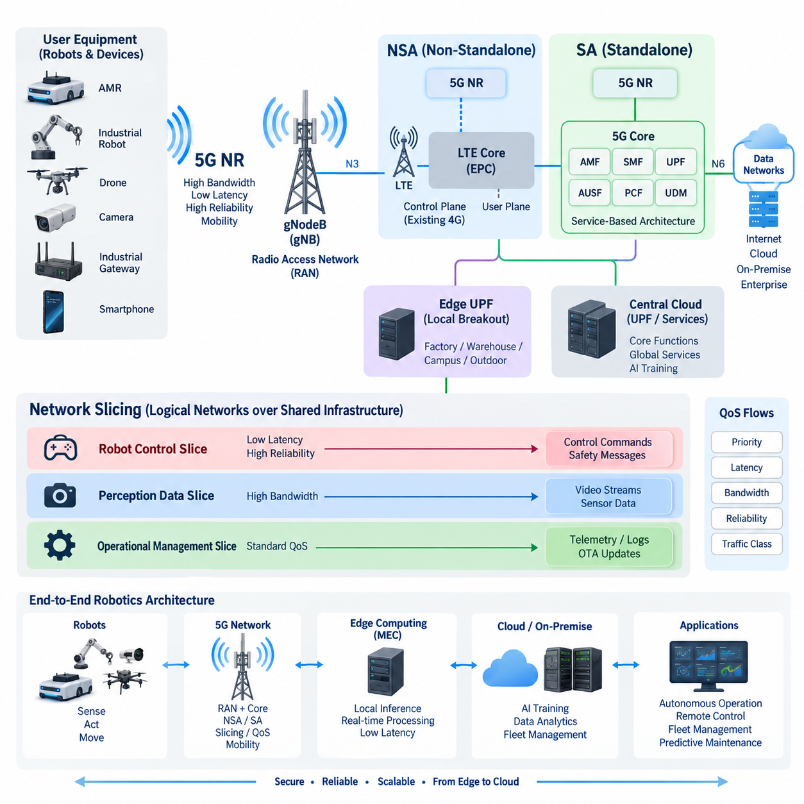
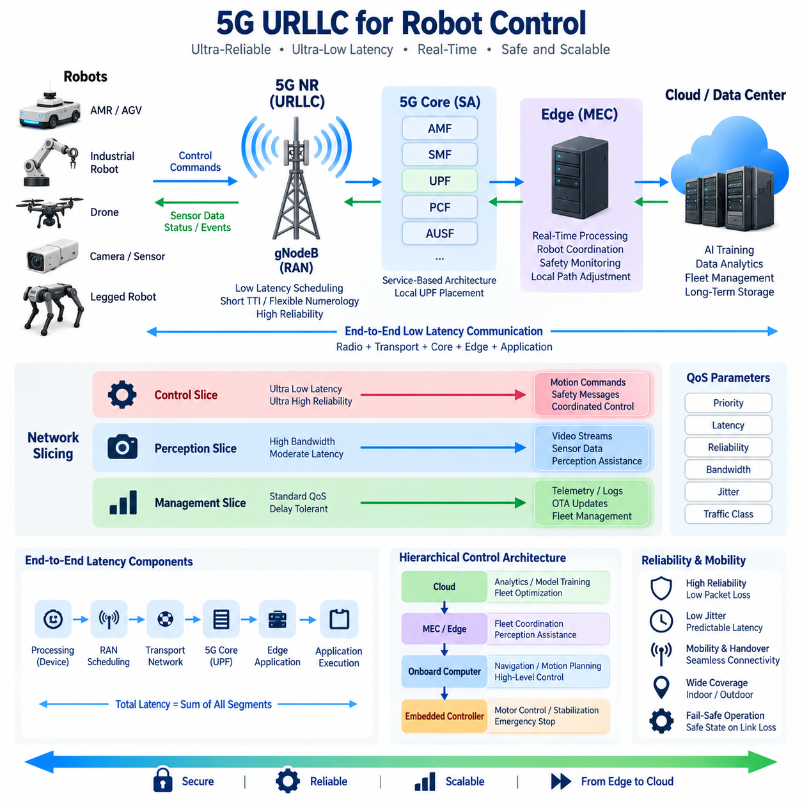
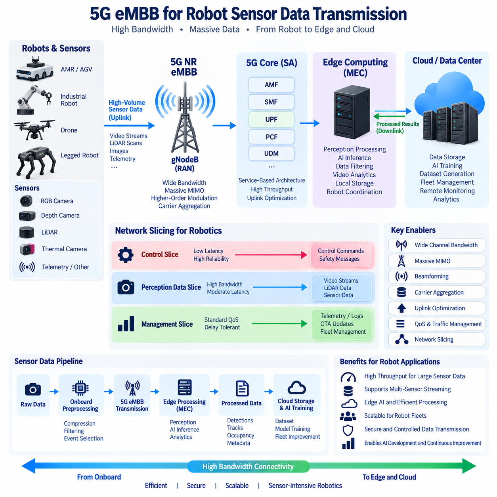
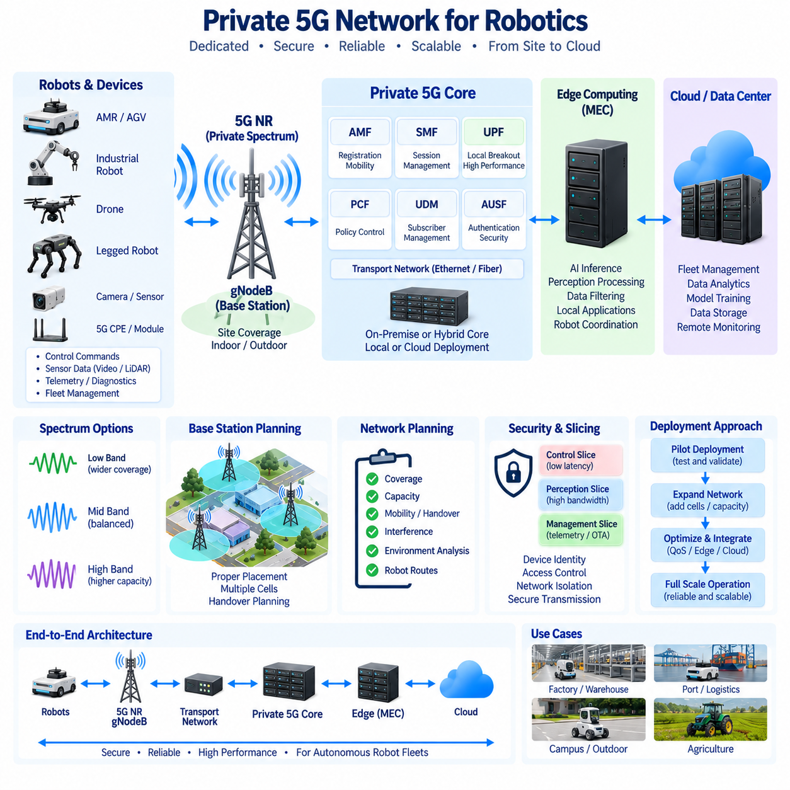
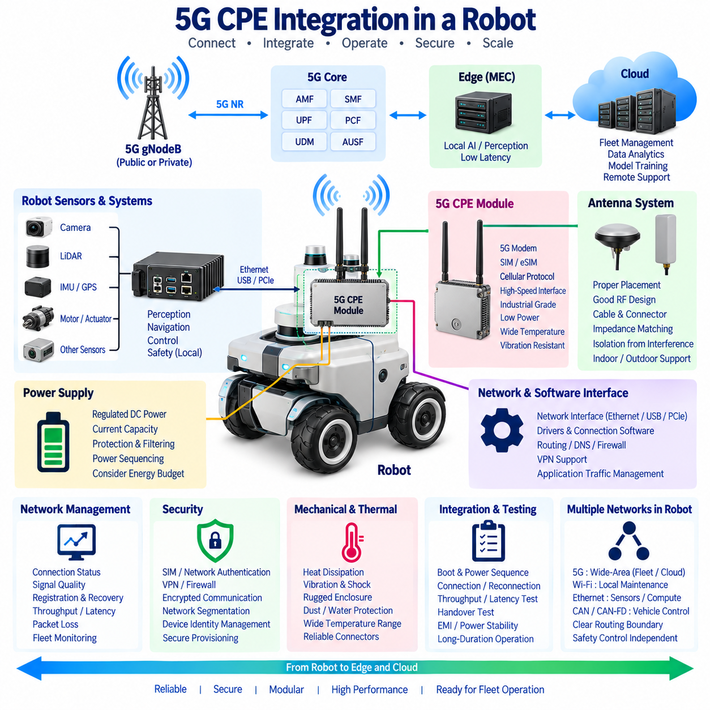
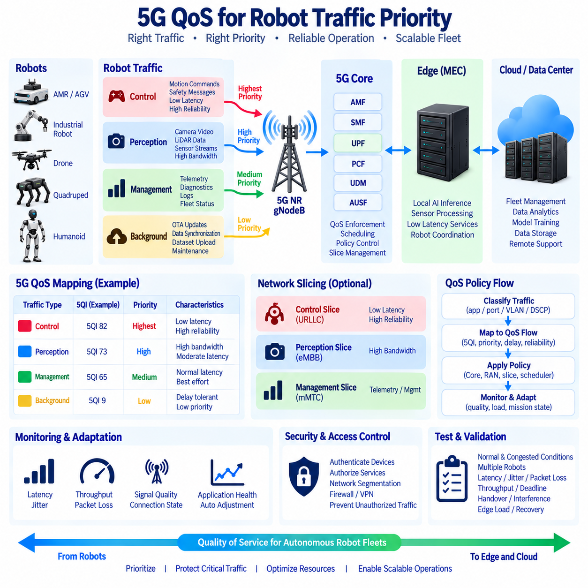
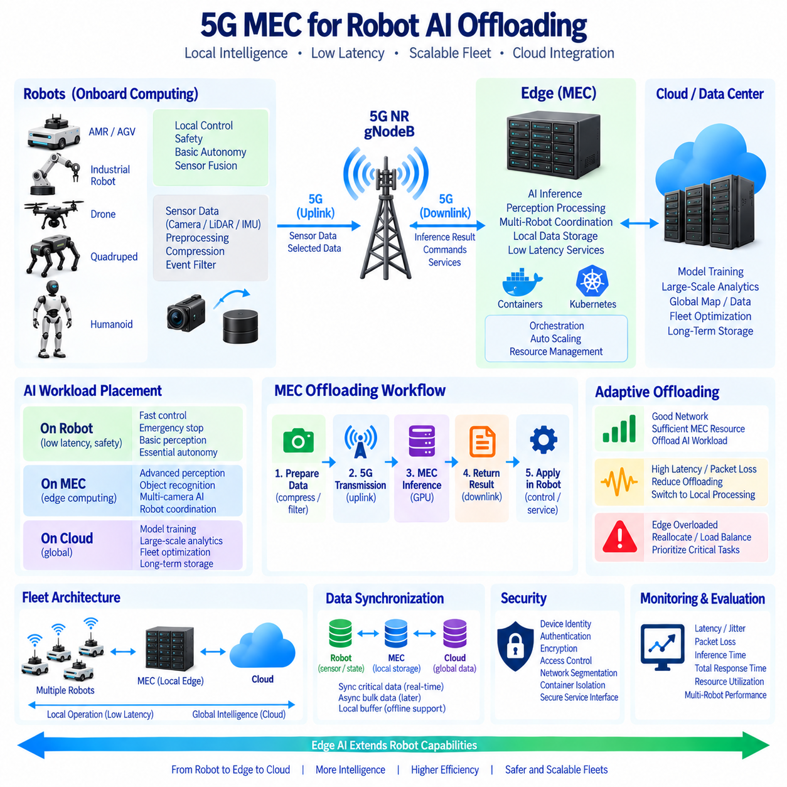
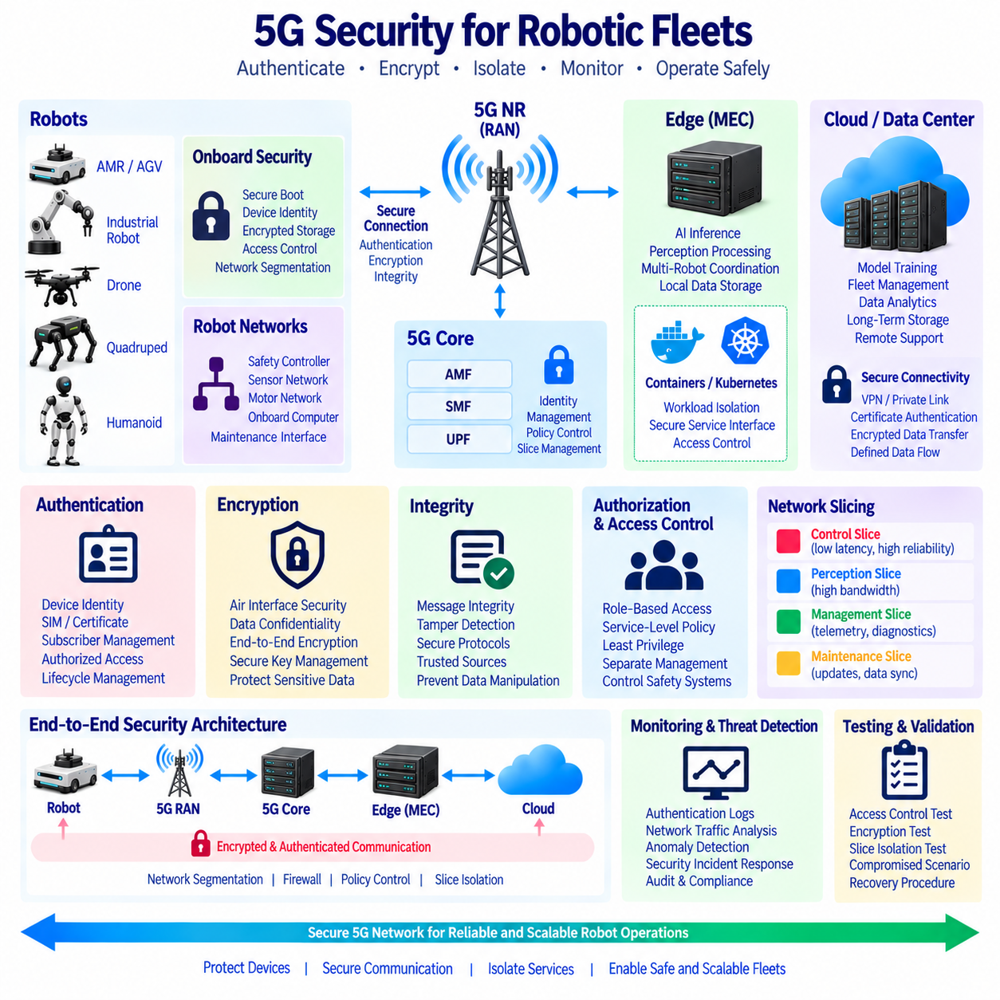
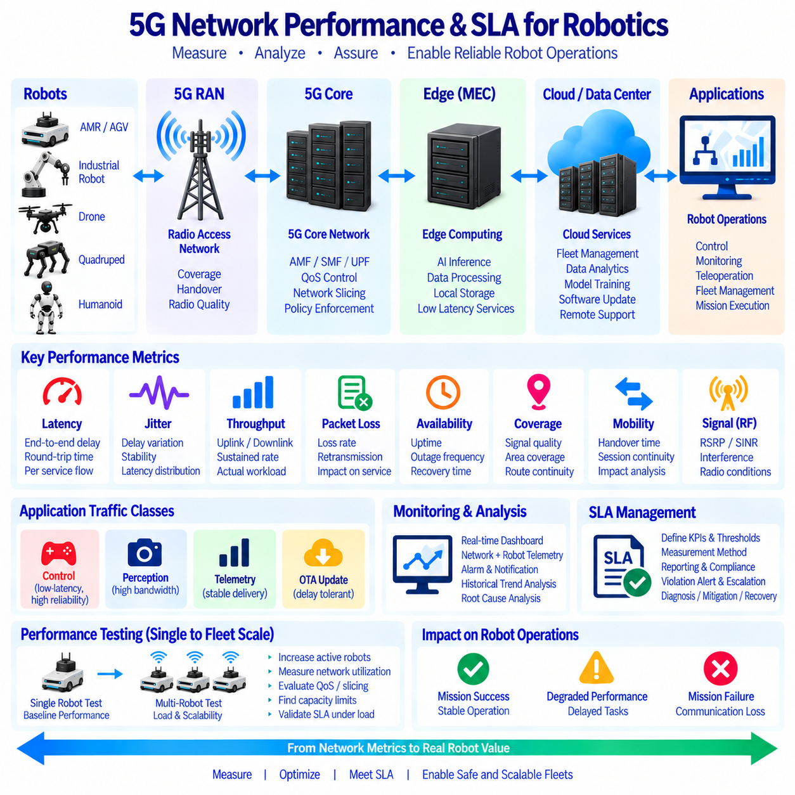
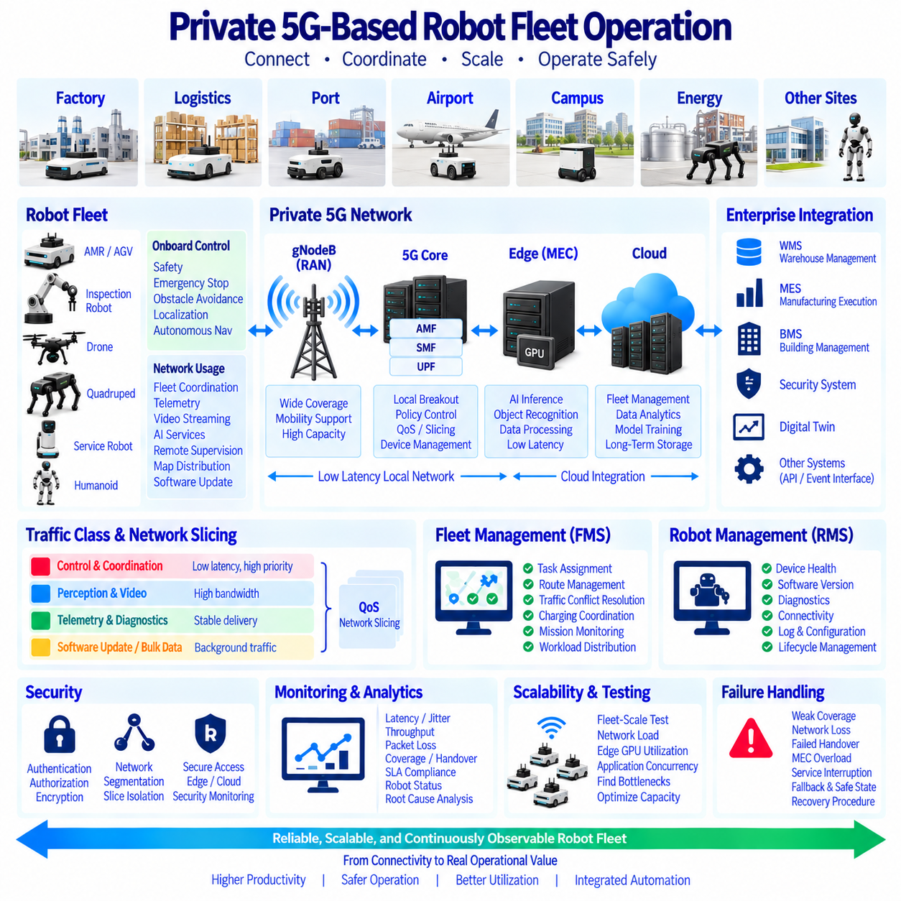

**Volume 09 Cloud and Edge Robotics**

# 11. 5G and Private Network

## 11.01 5G NR Architecture: NSA, SA Mode, Slicing

{width="7.268055555555556in" height="7.268055555555556in"}

5세대 이동통신(5G)의 무선 접속 기술인 5G 뉴 라디오(5G New Radio)는 무선 접속망(Radio Access Network), 전송 인프라(Transport Infrastructure), 코어 네트워크(Core Network)를 분리하여 각 계층이 독립적으로 발전하면서도 통합된 통신 서비스를 제공하도록 설계된다. 로보틱스(Robotics)에서는 이러한 분리가 중요하며, 무선 연결을 단순한 와이파이(Wi-Fi)나 이더넷(Ethernet)의 대체 수단으로 보는 것이 아니라 지연시간(Latency), 신뢰성(Reliability), 이동성(Mobility), 대역폭(Bandwidth), 보안(Security) 요구사항을 중심으로 설계할 수 있게 한다.

5G 시스템(5G System)은 스마트폰, 산업용 게이트웨이(Industrial Gateway), 자율이동로봇(Autonomous Mobile Robot), 카메라(Camera), 임베디드 5G 모뎀(Embedded 5G Modem)과 같은 사용자 장비(User Equipment)를 5G NR 무선 인터페이스(Air Interface)를 통해 무선 접속망에 연결한다. 핵심 무선 노드는 지노드비(gNodeB, gNB)이며 무선 자원, 스케줄링(Scheduling), 이동성 절차, 장치와 코어 네트워크 사이의 통신을 관리한다. 따라서 로봇 시스템에서는 원격측정(Telemetry), 명령(Command), 영상(Video), 지도(Map), 운영 데이터(Operational Data)가 엣지-클라우드(Edge-Cloud) 인프라로 전달되는 무선 접속 지점 역할을 수행한다.

5G 구축 방식은 크게 비단독모드(Non-Standalone, NSA)와 단독모드(Standalone, SA) 아키텍처(Architecture)로 구분할 수 있다. NSA는 기존 LTE 인프라의 상당 부분을 계속 활용하면서 5G NR을 도입할 수 있도록 설계된 점진적 전환 방식이다. 일반적인 NSA 구축에서는 LTE가 중요한 제어 평면(Control Plane) 기능을 담당하고 NR이 고용량 무선 자원을 추가한다. 따라서 기존 LTE 네트워크, 주파수 자원(Spectrum Asset), 운영 시스템, 코어 인프라를 활용하면서 완전한 5G로 점진적으로 전환할 수 있다.

NSA는 조직이 전체 이동통신 네트워크 아키텍처를 즉시 교체하지 않고 무선 처리량(Throughput)을 증가시키려는 경우 특히 유용하다. 로봇은 NR을 통해 더 높은 데이터 전송률(Data Rate)을 확보하면서 기존 LTE 인프라를 연결 관리에 계속 활용할 수 있다. 그러나 NSA는 4G 아키텍처의 일부 구성요소에 의존하기 때문에 네이티브 5G 코어(Native 5G Core)가 제공하는 전체 아키텍처 기능을 활용하는 데 한계가 있다. 이러한 차이는 네트워크 슬라이싱(Network Slicing), 지역화된 엣지 서비스(Localized Edge Service), 세분화된 트래픽 정책(Traffic Policy)과 같은 산업용 서비스를 고려할 때 중요해진다.

단독모드(Standalone, SA) 아키텍처는 이러한 의존성을 제거하고 5G NR을 5G 코어(5G Core)에 직접 연결한다. 이 시스템은 단순히 LTE 아키텍처를 확장하는 것이 아니라 서비스 기반 네트워크 기능(Service-Based Network Function)을 중심으로 설계된다. 주요 5G 코어 기능에는 접속 및 이동성 관리 기능(Access and Mobility Management Function), 세션 관리 기능(Session Management Function), 사용자 평면 기능(User Plane Function), 인증 기능(Authentication Function), 정책 제어(Policy Control), 네트워크 저장소 서비스(Network Repository Service) 등이 포함된다. 이들은 장치 등록, 이동성, 세션, 트래픽 전달, 인증, 정책 적용 및 데이터 네트워크 접근을 관리한다.

제어 평면(Control Plane)과 사용자 평면(User Plane)의 분리는 분산형 로봇 시스템(Distributed Robot System)에서 특히 중요하다. 사용자 평면 기능(User Plane Function)은 공장, 창고, 물류센터 또는 실외 로봇 운영 지역 가까이에 배치하고 상위 수준의 제어 기능은 다른 위치에 유지할 수 있다. 따라서 로봇 트래픽을 멀리 떨어진 중앙 클라우드(Central Cloud)를 불필요하게 경유시키지 않고 인접한 엣지 애플리케이션(Edge Application)으로 전달할 수 있다. 이러한 로컬 브레이크아웃(Local Breakout) 구조는 전송 거리를 줄이고 지연시간의 일관성을 개선하면서 외부로 전송해야 하는 운영 데이터의 양도 제한할 수 있다.

SA 아키텍처는 프라이빗 5G 네트워크(Private 5G Network)를 구축하기 위한 보다 강력한 기반도 제공한다. 제조 현장은 운영 요구사항에 따라 전용 무선 인프라, 코어 네트워크 기능, 가입자 관리(Subscriber Management), 보안 정책(Security Policy), 엣지 컴퓨팅(Edge Computing) 자원을 구축할 수 있다. 이에 따라 로봇은 범용 사용자와 모든 네트워크 동작을 공유하는 대신 산업용 트래픽에 특화된 인프라를 통해 통신할 수 있다. 이러한 구축이 자동으로 결정론적 로봇 제어(Deterministic Robot Control)를 보장하는 것은 아니지만, 트래픽 등급과 운영 정책을 보다 체계적으로 설계할 수 있는 메커니즘을 제공한다.

5G 아키텍처가 제공하는 주요 개념 가운데 하나는 네트워크 슬라이싱(Network Slicing)이다. 네트워크 슬라이스(Network Slice)는 공유된 물리적 인프라 위에 생성되는 논리적 네트워크 환경(Logical Network Environment)을 의미한다. 서로 다른 슬라이스는 각기 다른 서비스 특성, 정책, 자원 동작 및 논리적 네트워크 기능을 갖도록 구성할 수 있다. 이는 단순히 또 하나의 가상 근거리 통신망(Virtual LAN)을 만드는 개념이 아니다. 슬라이싱은 이동통신 네트워크 기능 전반으로 확장되며 특정 장치, 세션(Session), 서비스를 논리적으로 차별화된 네트워크 동작과 연결할 수 있다.

로봇 플릿(Robot Fleet)은 이러한 기능이 중요한 이유를 잘 보여준다. 안전 관련 운영 메시지, 플릿 관리 명령(Fleet Management Command), 고해상도 카메라 스트림(High-Resolution Camera Stream), 진단 로그(Diagnostic Log), 소프트웨어 업데이트(Software Update), 백그라운드 원격측정(Background Telemetry)은 서로 다른 통신 특성을 가진다. 제어 트래픽(Control Traffic)은 낮은 지연시간과 높은 신뢰성을 요구할 수 있지만 카메라 스트림은 높은 대역폭을 요구한다. 무선 업데이트(Over-the-Air, OTA) 패키지는 대용량 데이터를 전송하지만 일정 수준의 스케줄링 지연을 허용할 수 있다. 모든 워크로드(Workload)를 동일한 통신 경로에서 처리하면 자원 경합(Resource Contention)이 발생하고 서비스 동작을 제어하기 어려워질 수 있다.

네트워크 슬라이싱(Network Slicing)을 이용하면 이러한 워크로드를 논리적으로 분리할 수 있다. 로봇 제어 슬라이스(Robot-Control Slice)는 지연시간과 신뢰성을 중시하고, 인지 데이터 슬라이스(Perception-Data Slice)는 처리량을 중시하며, 운영 관리 슬라이스(Operational-Management Slice)는 원격측정, 진단, 유지보수 트래픽을 담당하도록 구성할 수 있다. 슬라이스 선택(Slice Selection)은 서비스 품질(Quality of Service, QoS) 정책과 결합할 수 있으므로 애플리케이션 요구사항에 따라 트래픽 처리 방식을 결정할 수 있다. 물리적 무선 및 전송 인프라는 공유하더라도 논리적 서비스 아키텍처를 통해 운영 우선순위에 맞게 정책과 자원을 분리할 수 있다.

서비스 품질 흐름(QoS Flow)은 5G 세션 내부에서 더욱 세밀한 수준의 트래픽 차별화를 제공한다. 로봇과 관련된 모든 패킷(Packet)을 동일하게 처리하는 대신 우선순위(Priority), 지연시간 요구사항, 패킷 처리 특성 등에 따라 트래픽을 분류할 수 있다. 따라서 하나의 로봇이 동작 관련 명령 통신을 유지하면서 동시에 영상, 상태 정보, 애플리케이션 로그(Application Log)를 전송할 수 있다. 적절한 QoS 설계는 대용량 트래픽이 지연시간에 민감한 운영 트래픽과 동일한 방식으로 처리되는 것을 방지한다.

클라우드 및 엣지 로보틱스(Cloud and Edge Robotics)에서 SA, 슬라이싱(Slicing), QoS, 로컬 사용자 평면 배치(Local User-Plane Placement)의 결합은 로봇과 컴퓨팅 인프라 사이의 중요한 아키텍처 연결 계층을 형성한다. 인지 워크로드(Perception Workload)는 로봇 내부, 인접한 멀티액세스 엣지 컴퓨팅(Multi-access Edge Computing, MEC) 플랫폼, 온프레미스 GPU 클러스터(On-Premise GPU Cluster), 또는 클라우드 환경에서 실행될 수 있다. 네트워크 아키텍처는 이러한 컴퓨팅 영역을 어떻게 연결하고 어떤 트래픽을 로컬에 유지할 것인지 결정한다. 따라서 통신 아키텍처는 독립적인 네트워크 문제가 아니라 워크로드 배치(Workload Placement) 설계의 일부가 된다.

이동성(Mobility)은 자율 시스템을 위한 셀룰러 아키텍처(Cellular Architecture)의 또 다른 중요한 장점이다. 자율이동로봇(AMR), 실외 로봇(Outdoor Robot), 검사 플랫폼(Inspection Platform), 이동형 장비는 애플리케이션 세션을 유지하면서 지속적으로 물리적 위치를 변경한다. 무선 접속망과 코어 네트워크는 이동성을 조정하여 장치가 애플리케이션 연결을 처음부터 다시 설정하지 않고 서로 다른 서비스 영역 사이를 이동할 수 있도록 한다. 그러나 핸드오버(Handover), 간섭(Interference), 신호 차단(Signal Blockage), 안테나 배치(Antenna Placement), 음영 지역(Coverage Gap)은 로봇 통신 품질에 직접 영향을 줄 수 있으므로 실제 구축에서는 세밀한 무선 설계가 필요하다.

따라서 NSA와 SA는 단순히 두 가지 무선 모드(Radio Mode)가 아니라 서로 다른 아키텍처 단계로 이해해야 한다. NSA는 5G NR과 기존 LTE 및 진화형 패킷 코어(Evolved Packet Core) 인프라를 결합하므로 점진적인 마이그레이션(Migration)과 높은 무선 용량의 신속한 도입에 적합하다. 반면 SA는 NR과 5G 코어를 결합하며 고급 슬라이싱(Advanced Slicing), 유연한 사용자 평면 배치(Flexible User-Plane Placement), 정교한 서비스 차별화(Service Differentiation)와 같은 기능을 구현하기 위한 네이티브 5G 아키텍처 기반을 제공한다.

산업용 로보틱스(Industrial Robotics)에서 NSA, 공용 SA(Public SA), 프라이빗 SA(Private SA)의 선택은 궁극적으로 시스템 요구사항에 따라 결정되어야 한다. 클라우드 원격측정이나 대용량 데이터 전송이 중심인 애플리케이션은 모든 네이티브 5G 기능을 활용하지 않아도 효과적으로 운영될 수 있다. 반면 대규모 로봇 플릿, 지역 엣지 컴퓨팅(Local Edge Computing), 차별화된 QoS, 보안 분리(Security Segmentation), 엄격하게 관리되는 운영 트래픽을 요구하는 애플리케이션은 SA와 프라이빗 네트워크 아키텍처를 더욱 적극적으로 활용할 수 있다. 올바른 설계는 로봇의 워크로드와 서비스 요구사항에서 시작하여 이를 무선, 코어, 엣지 및 클라우드 자원에 매핑(Mapping)해야 한다.

따라서 클라우드 및 엣지 로보틱스 아키텍처에서 5G NR은 단순히 더 빠른 무선 링크(Wireless Link)가 아니라 프로그래밍 가능한 통신 인프라(Programmable Communication Infrastructure)로 이해해야 한다. NSA는 LTE에서 5G 무선 기능으로 전환하기 위한 현실적인 경로를 제공하고, SA는 유연한 트래픽 엔지니어링(Traffic Engineering)과 네트워크 슬라이싱을 지원하는 종단 간 5G 아키텍처(End-to-End 5G Architecture)를 구축한다. 이러한 기술을 엣지 컴퓨팅 및 로봇 플릿 서비스와 결합하면 확장 가능한 산업용 로봇 및 피지컬 AI(Physical AI) 시스템을 위한 통신 기반을 형성할 수 있다.

## 11.02 5G URLLC: Ultra-Low Latency for Robot Control

{width="7.268055555555556in" height="7.268055555555556in"}

초고신뢰·저지연 통신(Ultra-Reliable Low-Latency Communication, URLLC)은 통신 지연과 전송 신뢰성이 운영상 중요한 애플리케이션을 위해 설계된 5G 서비스 기능이다. 로보틱스(Robotics)에서 URLLC는 제어 명령(Control Command), 안전 이벤트(Safety Event), 협조 동작(Coordinated Motion), 기타 시간 민감형 통신(Time-Sensitive Communication)에 중요하다. 패킷(Packet)의 지연이나 손실이 로봇의 동작에 직접적인 영향을 줄 수 있기 때문에, URLLC의 목적은 단순히 무선 데이터 처리량(Throughput)을 최대화하는 것과는 다르다.

로봇 통신 지연시간(Robot Communication Latency)은 5G 무선 링크(Radio Link)의 전송시간만이 아니라 종단 간 특성(End-to-End Property)으로 고려해야 한다. 제어 메시지는 로봇 제어기(Robot Controller)에서 무선 접속망(Radio Access Network), 전송망(Transport Network), 5G 코어(5G Core), 사용자 평면 기능(User Plane Function), 엣지 애플리케이션(Edge Application)을 거쳐 전달되고 응답이 다시 돌아올 수 있다. 처리(Processing), 대기열(Queueing), 스케줄링(Scheduling), 라우팅(Routing), 애플리케이션 실행(Application Execution) 모두 전체 지연에 영향을 주므로 낮은 무선 지연시간만으로 낮은 제어 루프 지연(Control-Loop Latency)을 보장할 수 없다.

5G 뉴 라디오(5G New Radio, 5G NR)는 데이터를 스케줄링하고 전송하는 데 필요한 시간을 줄이는 여러 메커니즘을 통해 저지연 동작(Low-Latency Operation)을 지원한다. 짧은 전송 간격(Transmission Interval), 유연한 뉴머롤로지(Flexible Numerology), 신속한 스케줄링(Rapid Scheduling), 적절하게 구성된 무선 자원(Radio Resource)은 패킷이 전송되기 전의 대기시간을 감소시킬 수 있다. 이러한 기능은 고해상도 영상처럼 대용량 데이터를 연속적으로 전송하는 경우보다 상대적으로 작은 제어 패킷을 빈번하게 전달해야 하는 환경에서 특히 유용하다.

신뢰성(Reliability) 역시 중요하다. 통신 속도가 아무리 빨라도 패킷이 자주 손실되거나 예측하기 어려운 재전송(Retransmission)이 발생한다면 실시간 제어에서의 가치는 제한된다. 따라서 URLLC는 지연시간 목표와 높은 전송 신뢰성을 함께 고려한다. 무선 설정(Radio Configuration), 간섭 관리(Interference Management), 패킷 복제(Packet Duplication), 재전송 전략, 다이버시티(Diversity), 커버리지 설계(Coverage Planning), 자원 예약(Resource Reservation) 등이 안정적인 통신에 기여할 수 있다. 실제 엔지니어링의 목표는 통신 지연과 요구된 전달 마감시간을 놓칠 확률을 함께 최소화하는 것이다.

로봇 제어(Robot Control)에서는 평균 지연시간(Average Latency)보다 지연시간 분포(Latency Distribution)와 최악 조건에서의 동작(Worst-Case Behavior)이 더 중요한 경우가 많다. 일반적으로 패킷을 빠르게 전달하지만 간헐적으로 큰 지연이 발생하는 시스템은 불안정하거나 안전하지 않은 운용 조건을 만들 수 있다. 따라서 패킷 지연시간의 변동을 의미하는 지터(Jitter)가 중요한 설계 변수가 된다. 제어 아키텍처(Control Architecture)는 단순한 평균 왕복시간(Round-Trip Time)뿐 아니라 백분위 지연시간(Percentile Latency), 패킷 손실(Packet Loss), 마감시간 위반(Deadline Violation), 통신 가용성(Communication Availability)을 함께 평가해야 한다.

단독모드 5G(Standalone 5G, SA) 아키텍처는 5G 코어가 유연한 트래픽 관리(Traffic Management)와 사용자 평면 배치(User-Plane Placement)를 지원하기 때문에 URLLC 중심의 로봇 시스템을 위한 유용한 기반을 제공한다. 사용자 평면 기능(User Plane Function, UPF)을 로봇 운영 환경 가까이에 배치하면 제어 트래픽이 멀리 떨어진 중앙 클라우드(Centralized Cloud)를 거치지 않고 로컬 애플리케이션(Local Application)에 도달할 수 있다. 이러한 로컬 브레이크아웃(Local Breakout) 구조를 활용하면 통신 경로를 단축하고 광역 네트워크(Wide-Area Network) 상태에 대한 의존성을 줄일 수 있다.

멀티액세스 엣지 컴퓨팅(Multi-access Edge Computing, MEC)은 컴퓨팅 자원을 무선 네트워크 가까이에 배치하여 이러한 원리를 확장한다. 모든 센서 이벤트(Sensor Event)나 제어 요청(Control Request)을 원격 클라우드 영역(Remote Cloud Region)으로 보내는 대신 지연시간에 민감한 기능을 인접한 엣지 서버(Edge Server)에서 실행할 수 있다. 로봇 협조(Robot Coordination), 로컬 경로 조정(Local Path Adjustment), 안전 모니터링(Safety Monitoring), 인지 지원(Perception Assistance), 플릿 수준 교통 관리(Fleet-Level Traffic Management) 등이 컴퓨팅 및 통신 요구조건에 따라 엣지 실행의 이점을 얻을 수 있는 대표적인 워크로드(Workload)이다.

서비스 품질(Quality of Service, QoS)은 하나의 로봇이 여러 종류의 트래픽을 동시에 생성하기 때문에 중요하다. 동작 명령(Motion Command), 비상 메시지(Emergency Message), 위치추정 정보(Localization Information), 카메라 스트림(Camera Stream), 원격측정(Telemetry), 진단 로그(Diagnostic Log), 무선 업데이트(Over-the-Air, OTA) 패키지는 동일한 네트워크 처리를 받을 필요가 없다. QoS 메커니즘을 통해 지연시간에 민감한 트래픽을 우선 처리하면서 대역폭 중심 또는 지연 허용형 워크로드에는 서로 다른 서비스 특성을 적용할 수 있으며, 이를 통해 백그라운드 데이터 전송이 운영 제어 메시지를 방해할 위험을 줄일 수 있다.

네트워크 슬라이싱(Network Slicing)은 로봇 통신 서비스를 분리하기 위한 또 다른 논리 계층(Logical Layer)을 제공할 수 있다. 제어 중심 슬라이스(Control-Oriented Slice)는 지연시간과 신뢰성 요구사항을 중심으로 설계하고, 인지 데이터 슬라이스(Perception-Data Slice)는 대역폭을 중시하며, 운영 관리 슬라이스(Operational-Management Slice)는 원격측정, 로그, 유지보수 트래픽을 처리하도록 구성할 수 있다. 슬라이싱이 충분한 물리적 네트워크 용량, 무선 커버리지 또는 QoS 엔지니어링의 필요성을 제거하는 것은 아니지만 서로 다른 로봇 워크로드를 차별화된 네트워크 동작과 연결하는 구조를 제공한다.

로봇 자체 역시 무선 통신만이 안전한 동작을 보장하는 유일한 수단이 되지 않도록 설계해야 한다. 고주파 모터 전류 제어(High-Frequency Motor Current Control), 액추에이터 안정화(Actuator Stabilization), 비상 정지 로직(Emergency Stopping Logic)과 같이 엄격하게 제한된 응답시간을 요구하는 기능은 적절한 경우 로컬 제어기(Local Controller)에 유지하는 것이 일반적이다. 5G는 상위 제어 명령(Supervisory Command), 협조 동작, 원격 지원(Remote Assistance), 플릿 상호작용(Fleet Interaction), 일부 분산 제어 기능(Distributed Control Function)을 지원하고, 통신이 저하되더라도 로컬 안전 메커니즘(Local Safety Mechanism)은 계속 동작하도록 설계해야 한다.

이러한 구분은 계층적 제어 아키텍처(Hierarchical Control Architecture)를 형성한다. 빠른 내부 제어 루프(Inner Control Loop)는 로봇 내부의 임베디드 제어기(Embedded Controller)에서 실행하고, 상위 수준의 모션(Motion) 및 내비게이션(Navigation) 기능은 온보드 컴퓨터(Onboard Computer)에서 실행할 수 있다. 플릿 협조(Fleet Coordination) 또는 계산량이 많은 서비스는 MEC나 로컬 데이터센터(Local Data Center)에서 실행할 수 있으며, 클라우드 시스템은 분석(Analytics), 모델 학습(Model Training), 이력 데이터 저장(Historical Storage), 장기 최적화(Long-Term Optimization) 등을 담당할 수 있다. 즉각적인 물리 제어에서 멀어질수록 통신에 요구되는 실시간성은 상대적으로 완화될 수 있다.

이동성(Mobility)은 자율 로봇이 변화하는 무선 환경을 이동하기 때문에 또 다른 과제를 만든다. 신호 강도(Signal Strength), 간섭(Interference), 장애물(Obstacle), 반사(Reflection), 핸드오버(Handover), 셀 부하(Cell Loading)는 로봇 운용 중 통신 성능을 변화시킬 수 있다. 따라서 URLLC 중심의 구축에서는 실제 로봇 이동 경로와 운용 조건을 고려한 무선 설계(Radio Planning)가 필요하다. 네트워크 성능은 고정된 시험 위치에서만 평가하는 것이 아니라 로봇이 대표적인 운용 영역을 실제로 이동하는 조건에서도 측정해야 한다.

프라이빗 5G(Private 5G)는 조직이 무선 자원, 네트워크 구성, 장치 접근, 트래픽 정책, 엣지 인프라에 대한 높은 수준의 제어를 필요로 하는 경우 유용할 수 있다. 공장이나 물류 현장은 로봇 운용 구역을 중심으로 커버리지를 설계하고 프라이빗 코어(Private Core)를 로컬 MEC 자원과 연결할 수 있다. 이는 범용 공용 네트워크(General-Purpose Public Network)에 전적으로 의존하는 것보다 더 높은 아키텍처 제어 능력을 제공하지만, 실제 성능은 주파수 환경(Spectrum Condition), 구축 밀도(Deployment Density), 구성(Configuration), 하드웨어(Hardware), 애플리케이션 설계에 따라 달라진다.

네트워크가 높은 신뢰성을 목표로 설계되었더라도 로봇 애플리케이션은 통신 장애(Communication Failure)를 고려하여 설계해야 한다. 로봇은 링크 품질(Link Quality), 지연시간, 패킷 손실, 세션 상태(Session State)를 모니터링하고 통신 품질이 정의된 임계값(Threshold) 아래로 떨어질 경우 운용 모드(Operating Mode)를 변경할 수 있다. 애플리케이션에 따라 이러한 성능 저하는 속도 감소, 추종 거리 증가, 원격 운용 중단, 로컬에 저장된 임무(Local Mission) 수행 또는 제어된 안전 상태(Controlled Safe State)로의 전환을 유발하도록 설계할 수 있다.

따라서 로보틱스를 위한 URLLC 시험에서는 단순히 네트워크 처리량만 측정해서는 충분하지 않다. 엔지니어는 단방향 및 왕복 지연시간(One-Way and Round-Trip Latency), 지터, 패킷 전달 신뢰성(Packet Delivery Reliability), 마감시간 위반율(Deadline Violation Rate), 핸드오버 중단(Handover Interruption), 커버리지 일관성(Coverage Consistency), 혼잡 또는 부분 장애 상황의 복구 동작(Recovery Behavior)을 평가해야 한다. 또한 이러한 측정값을 궤적 편차(Trajectory Deviation), 명령 응답(Command Response), 정지 동작(Stopping Behavior), 임무 완료(Mission Completion), 플릿 협조 성능과 같은 로봇 수준의 영향과 연계해야 한다.

가장 효과적인 아키텍처는 URLLC를 종단 간 실시간 시스템(End-to-End Real-Time System)의 하나의 구성요소로 다룬다. 무선 기술(Radio Technology), 5G 코어 구성, QoS, 네트워크 슬라이싱, 로컬 UPF 배치(Local UPF Placement), MEC 컴퓨팅, 로봇 소프트웨어(Robot Software), 제어 루프 설계(Control-Loop Design), 고장 안전 동작(Fail-Safe Behavior)이 함께 작동해야 한다. 무선 인터페이스만 최적화해서는 과도한 애플리케이션 처리시간, 과부하된 엣지 서버, 비효율적인 라우팅 또는 잘못 설계된 로봇 제어 소프트웨어로 인한 지연 문제를 해결할 수 없다.

따라서 클라우드 및 엣지 로보틱스(Cloud and Edge Robotics)에서 URLLC는 온보드 자율성(Onboard Autonomy)을 대체하는 것이 아니라 선택된 시간 민감형 상호작용(Time-Sensitive Interaction)을 지원하는 통신 기반을 제공한다. 로봇은 안정성과 안전성을 유지할 수 있는 충분한 로컬 지능(Local Intelligence)을 보유해야 하며, 5G는 인접한 컴퓨팅 및 협조 서비스와의 저지연 데이터 교환을 지원해야 한다. 단독모드 5G(Standalone 5G), QoS, 슬라이싱, MEC, 복원력 있는 로봇 제어(Resilient Robot Control)를 결합하면 물리적 기계와 분산 컴퓨팅 자원이 엄격하게 관리되는 통신 성능을 기반으로 협력하는 확장 가능한 아키텍처를 구현할 수 있다.

## 11.03 5G eMBB: High BW for Sensor Data Transmission

{width="7.268055555555556in" height="7.268055555555556in"}

5G 향상된 모바일 브로드밴드(enhanced Mobile Broadband, eMBB)는 이전 세대의 이동통신 시스템보다 훨씬 높은 데이터 처리량(Data Throughput)과 더 큰 네트워크 용량(Network Capacity)을 제공하도록 설계된 서비스 기능이다. 로보틱스(Robotics)에서는 낮은 대역폭의 무선 링크를 통해 효율적으로 전송하기 어려운 대량의 센서 데이터를 로봇이 생성할 때 eMBB가 특히 중요하다. 따라서 고해상도 카메라 스트림(High-Resolution Camera Stream), LiDAR 데이터, 열화상 이미지(Thermal Image) 및 기타 인지 정보(Perception Information)는 로봇, 엣지 시스템(Edge System), 클라우드 인프라(Cloud Infrastructure) 사이에서 5G 기반으로 전송할 중요한 데이터가 될 수 있다.

하나의 로봇이 여러 센서 스트림(Sensor Stream)을 동시에 생성할 수 있으며, 센서의 해상도, 프레임 속도(Frame Rate), 센서 개수가 증가하면 필요한 대역폭도 빠르게 증가할 수 있다. 인지를 위해 여러 RGB 카메라, 깊이 카메라(Depth Camera), 열화상 카메라, LiDAR 센서가 동시에 동작할 수 있다. 모든 원시 데이터(Raw Data)를 지속적으로 전송하는 것은 일반적으로 불필요하지만, 원격 인지(Remote Perception), 기록(Recording), 데이터셋 생성(Dataset Generation), 진단(Diagnostics), AI 처리(AI Processing)를 위해 선택된 데이터를 전송해야 할 수 있다. eMBB는 이러한 대용량 통신 패턴을 처리하는 데 필요한 네트워크 용량을 제공한다.

eMBB의 핵심적인 특성은 극도로 낮은 지연시간보다는 높은 데이터 처리량이다. 이러한 차이는 로봇 통신 아키텍처를 설계할 때 중요하다. 대역폭이 높은 카메라 스트림은 비상 정지 명령(Emergency Stop Command)보다 훨씬 더 긴 지연시간을 허용할 수 있지만, 지속적인 전송을 위해서는 안정적인 처리량이 필요할 수 있다. 따라서 eMBB 트래픽은 적절한 서비스 품질(Quality of Service, QoS) 정책, 트래픽 분류(Traffic Classification), 네트워크 슬라이싱(Network Slicing)을 통해 일반적으로 지연시간에 민감한 제어 트래픽(Control Traffic)과 분리해야 한다.

5G NR은 더 넓은 채널 대역폭(Channel Bandwidth), 첨단 안테나 기술(Advanced Antenna Technology), 고차 변조(High-Order Modulation), 반송파 집성(Carrier Aggregation), 효율적인 무선 자원 활용을 통해 높은 처리량을 달성한다. 대규모 다중입출력(Massive Multiple-Input Multiple-Output, Massive MIMO)과 빔포밍(Beamforming)은 적절한 구축 환경에서 주파수 효율(Spectral Efficiency)과 링크 성능(Link Performance)을 향상시킬 수 있다. 그러나 로봇이 실제로 사용할 수 있는 처리량은 5G 표준의 이론적인 최대 속도만으로 결정되지 않으며, 주파수 자원(Spectrum), 신호 품질(Signal Quality), 네트워크 구성, 셀 부하(Cell Loading), 단말 성능(Device Capability), 무선 환경(Radio Environment)에 따라 달라진다.

이동형 로봇에서는 특히 업링크(Uplink) 성능이 중요할 수 있다. 많은 로봇 애플리케이션은 소비하는 데이터보다 로봇에서 생성하는 데이터가 더 많기 때문이다. 로봇은 여러 카메라 스트림, LiDAR 스캔, 열화상 이미지, 운영 원격측정(Operational Telemetry)을 수집하고 선택된 정보를 엣지 서버로 전송할 수 있다. 이는 다운링크 트래픽이 우세할 수 있는 일반적인 스마트폰 사용 패턴과 다르다. 따라서 로봇을 위한 네트워크 계획에서는 광고된 다운로드 성능만 평가하는 것이 아니라 업링크 용량, 업링크 스케줄링, 커버리지, 지속적인 처리량을 함께 검토해야 한다.

그러나 원시 센서 데이터의 전송은 신중하게 다루어야 한다. 모든 센서 샘플을 지속적으로 전송하면 상당한 네트워크 자원을 소비할 수 있기 때문이다. 로봇은 차량 내부에서 사전처리(Preprocessing)를 수행하고 압축된 데이터, 필터링된 데이터 또는 이벤트에 의해 선택된 정보를 대신 전송할 수 있다. 예를 들어 카메라 이미지는 적절한 비디오 스트림으로 인코딩하고, LiDAR 데이터는 관련 영역으로 필터링하며, 원격측정 데이터는 전송 전에 집계할 수 있다. 이러한 방식은 온보드 컴퓨팅(Onboard Computing)이 불필요한 네트워크 트래픽을 줄이고 eMBB가 실제로 로봇 외부로 전송해야 하는 정보에 충분한 용량을 제공하는 하이브리드 아키텍처(Hybrid Architecture)를 형성한다.

eMBB는 로보틱스 시스템이 계산량이 많은 인지 또는 AI 추론(AI Inference)을 위해 엣지 컴퓨팅을 사용할 때 특히 유용하다. 모든 로봇에 최대 수준의 컴퓨팅 능력을 탑재하는 대신 선택된 워크로드(Workload)를 인접한 멀티액세스 엣지 컴퓨팅(Multi-access Edge Computing, MEC) 플랫폼으로 전달할 수 있다. 카메라 또는 센서 데이터는 5G 네트워크를 통해 전송되고 엣지에서 처리된 후 인지 결과, 분류 결과, 객체 추적(Object Tracking) 또는 기타 압축된 출력 정보로 로봇에 반환될 수 있다. 이러한 구조의 이점은 무선 전송, 엣지 처리, 응답시간을 종합적으로 고려해야 한다.

네트워크 슬라이싱(Network Slicing)과 QoS는 eMBB 트래픽을 다른 로봇 서비스와 통합하는 데 도움을 줄 수 있다. 인지 데이터 슬라이스(Perception-Data Slice)는 높은 대역폭을 중심으로 구성하고, 제어 슬라이스(Control Slice)는 낮은 지연시간과 높은 신뢰성을 중시하며, 관리 슬라이스(Management Slice)는 원격측정, 로그, 소프트웨어 업데이트를 전달하도록 구성할 수 있다. 이러한 논리적 서비스 범주를 통해 하나의 물리적 5G 인프라가 서로 다른 통신 특성을 가진 워크로드를 지원할 수 있다. 그러나 슬라이싱이 무한한 네트워크 용량을 제공하는 것은 아니므로 예상되는 전체 트래픽을 처리할 수 있는 충분한 무선 및 전송 자원이 여전히 필요하다.

로봇 플릿(Robot Fleet)은 또 다른 확장성 문제를 만든다. 동시에 활성화된 로봇의 수가 증가하면 전체 대역폭 요구량도 증가하기 때문이다. 모든 로봇이 여러 개의 고해상도 스트림을 지속적으로 전송한다면 전체 업링크 요구량은 개별 로봇의 요구량보다 훨씬 커질 수 있다. 따라서 플릿 아키텍처는 어떤 데이터를 지속적으로 전송하고, 어떤 데이터를 주기적으로 전송하며, 어떤 데이터를 이벤트에 의해 전송하고, 어떤 데이터를 로봇 내부에 로컬 저장할 것인지 정의해야 한다. 엣지 필터링(Edge Filtering), 적응형 압축(Adaptive Compression), 선택적 업로드(Selective Upload)는 전체 플릿에 필요한 네트워크 용량을 크게 변화시킬 수 있다.

실외 자율 로봇(Outdoor Autonomous Robot)은 로봇이 이동하면서 무선 환경이 변화하기 때문에 추가적인 변동성을 가진다. 건물, 식생, 지형, 차량, 구조물 및 기타 장애물은 신호 세기와 처리량에 영향을 줄 수 있다. 셀 전환(Cell Transition)과 일시적인 간섭(Interference) 역시 사용 가능한 대역폭을 변화시킬 수 있다. 따라서 eMBB 성능은 하나의 고정된 측정 지점에서만 평가하기보다 실제 로봇 운용 경로를 따라 평가해야 한다. 로봇 운용에서는 짧은 시간 동안의 최대 처리량보다 지속적인 처리량과 커버리지 연속성(Coverage Continuity)이 더 의미 있는 경우가 많다.

프라이빗 5G(Private 5G)는 조직이 로봇에 사용되는 통신 환경을 더욱 세밀하게 제어할 수 있도록 한다. 공장, 창고, 캠퍼스 또는 산업 현장에서는 로봇 운용 영역을 중심으로 네트워크를 설계하고 로컬 엣지 인프라(Local Edge Infrastructure)에 직접 연결할 수 있다. 이러한 아키텍처는 대용량 센서 스트림을 현장 내부에 유지하면서 필요할 경우 클라우드 서비스에 대한 통제된 접근을 제공할 수 있다. 결과적으로 로컬 데이터 처리, 플릿 관리, 원격 모니터링, 선택적인 클라우드 동기화를 지원할 수 있다.

대량의 센서 정보가 무선 네트워크를 통해 전송될 때는 보안(Security)과 데이터 거버넌스(Data Governance)도 중요하다. 카메라 이미지, 환경 관측 정보, 지도, 운영 데이터는 애플리케이션에 따라 민감한 정보를 포함할 수 있다. 따라서 인증(Authentication), 암호화(Encryption), 접근 제어(Access Control), 장치 신원 관리(Device Identity Management), 네트워크 분리(Network Segmentation), 적절한 데이터 보존 정책(Data-Retention Policy)을 대역폭 계획과 함께 고려해야 한다. 고속 통신은 전송되는 데이터를 안전하게 처리하고 시스템의 운영 요구사항에 따라 관리할 수 있을 때 비로소 유용하다.

아키텍처는 원시 센서 데이터(Raw Sensor Data), 처리된 인지 데이터(Processed Perception Data), 운영 메타데이터(Operational Metadata)를 구분해야 한다. 원시 카메라 또는 LiDAR 데이터는 상당한 대역폭을 요구할 수 있지만, 탐지된 객체(Detected Object), 객체 추적 정보(Track), 점유 정보(Occupancy Information), 의미론적 관측 정보(Semantic Observation)는 훨씬 작을 수 있다. 따라서 로봇은 AI 개발이나 기록을 위해 선택적으로 원시 데이터를 전송하면서 정상 운용 중에는 압축된 인지 결과를 전송할 수 있다. 이러한 분리는 eMBB 용량을 실제 운영 가치가 가장 큰 영역에 할당할 수 있도록 한다.

AI 개발과 플릿 개선을 위해 eMBB는 운용 중인 로봇에서 데이터를 수집하는 것도 지원할 수 있다. 선택된 센서 시퀀스(Sensor Sequence)를 엣지 또는 클라우드 저장소에 업로드하고 이후 어노테이션(Annotation), 데이터셋 구축(Dataset Construction), 모델 학습(Model Training), 평가(Evaluation) 파이프라인에 활용할 수 있다. 그러나 네트워크 아키텍처는 수집된 모든 프레임을 동일한 가치로 취급해서는 안 된다. 이벤트 기반 기록(Event-Driven Recording), 대표 샘플링(Representative Sampling), 압축(Compression), 로컬 버퍼링(Local Buffering)을 활용하면 불필요한 전송을 줄이면서 인지 모델과 피지컬 AI(Physical AI) 모델 개선에 필요한 데이터는 보존할 수 있다.

효과적인 로봇 통신 아키텍처는 따라서 eMBB를 로컬 컴퓨팅 및 차별화된 트래픽 관리(Differentiated Traffic Management)와 결합한다. 대용량 인지 데이터는 eMBB 자원을 사용하고, 지연시간에 민감한 명령은 적절한 저지연 QoS 처리를 사용하며, 지연 허용형 로그나 소프트웨어 패키지는 별도로 스케줄링할 수 있다. 로봇은 사용 가능한 대역폭, 애플리케이션 우선순위(Application Priority), 네트워크 상태(Network Condition), 임무 상태(Mission State)에 따라 전송 방식을 지속적으로 조정할 수 있다. 이를 통해 통신 시스템은 독립적인 연결 기능이 아니라 전체 로봇 자원 관리 아키텍처(Robot Resource Management Architecture)의 일부가 된다.

클라우드 및 엣지 로보틱스(Cloud and Edge Robotics)에서 5G eMBB는 선택된 센서 및 인지 워크로드를 위한 고용량 전송 계층(High-Capacity Transport Layer)으로 이해해야 한다. eMBB의 가치는 단순히 무선 인터페이스의 이론적인 최대 대역폭에 있는 것이 아니라, 대량의 데이터를 관리하면서 이동형 로봇을 인접한 엣지 컴퓨팅, 플릿 인프라, 클라우드 서비스와 연결할 수 있다는 데 있다. 온보드 사전처리, MEC, QoS, 네트워크 슬라이싱, 적응형 데이터 전송(Adaptive Data Transmission), 적절한 보안 제어를 결합하면 eMBB는 센서 집약적인 로봇 플릿(Sensor-Intensive Robot Fleet)과 분산형 피지컬 AI 시스템(Distributed Physical AI System)을 위한 실용적인 통신 기반을 제공한다.

## 11.04 Private 5G Network Deployment: Spectrum / Base Station

{width="7.268055555555556in" height="7.268055555555556in"}

프라이빗 5G(Private 5G)는 산업 시설(Industrial Facility), 캠퍼스(Campus), 창고(Warehouse), 항만(Port), 공장(Factory), 실외 로봇 운용 영역(Outdoor Robot Operating Area)에 전용 무선 연결을 제공하도록 설계된 로컬 관리형 셀룰러 네트워크(Locally Managed Cellular Network)이다. 일반적인 공용 이동통신망(Public Mobile Network)과 달리 프라이빗 네트워크는 특정 물리적 현장, 장치 집단, 트래픽 프로파일(Traffic Profile), 보안 정책(Security Policy), 엣지 컴퓨팅 아키텍처(Edge Computing Architecture)를 중심으로 설계할 수 있다. 로보틱스(Robotics)에서는 다수의 이동 로봇이 제어 명령(Control), 원격측정(Telemetry), 센서 데이터(Sensor Data), 영상(Video), 플릿 관리 정보(Fleet Management Information)를 교환하면서 통제된 연결성을 유지해야 할 때 프라이빗 5G가 유용하다.

프라이빗 5G 구축은 일반적으로 5G 뉴 라디오(5G New Radio, 5G NR) 무선 접속망(Radio Access Network), 기지국(Base Station), 전송망(Transport Network), 5G 코어(5G Core), 가입자 및 장치 관리(Subscriber and Device Management), 보안 기능(Security Function), 엣지 또는 클라우드 컴퓨팅 자원(Edge or Cloud Computing Resource) 등 여러 상호 연결된 영역으로 구성된다. 기지국은 무선 커버리지를 제공하고, 코어 네트워크는 등록(Registration), 세션(Session), 이동성(Mobility), 인증(Authentication), 사용자 평면 트래픽(User-Plane Traffic), 정책(Policy)을 관리한다. 따라서 아키텍처는 통합된 시스템으로 설계해야 하며, 무선 커버리지만으로는 자율 로봇에 필요한 지연시간(Latency), 신뢰성(Reliability), 보안(Security), 애플리케이션 성능(Application Performance)을 보장할 수 없다.

주파수 자원(Spectrum)은 프라이빗 5G 네트워크를 설계할 때 가장 먼저 고려해야 할 요소 가운데 하나이다. 사용 가능한 주파수 대역(Frequency Range)은 커버리지(Coverage), 전파 특성(Propagation), 채널 대역폭(Channel Bandwidth), 장애물 투과성(Penetration), 안테나 요구사항(Antenna Requirement), 달성 가능한 용량(Capacity)과 같은 중요한 특성을 결정한다. 낮은 주파수 대역은 더 넓은 커버리지와 장애물을 통과하는 데 유리한 전파 특성을 제공할 수 있는 반면, 높은 주파수 대역은 더 넓은 채널과 높은 용량을 제공할 수 있지만 일반적으로 더 조밀한 인프라가 필요하다. 따라서 적절한 주파수 자원은 물리적 환경, 요구되는 커버리지 영역, 로봇 밀도, 트래픽 규모, 규제 조건(Regulatory Condition)에 따라 결정해야 한다.

주파수 계획(Spectrum Planning)은 이론적인 전파 특성만이 아니라 실제 운용 환경도 고려해야 한다. 건물, 기계, 금속 구조물, 벽, 식생, 지형, 차량은 감쇠(Attenuation), 반사(Reflection), 음영(Shadowing), 간섭(Interference)을 발생시킬 수 있다. 실내 공장은 실외 물류 야드(Logistics Yard)나 대규모 농업 현장과는 다른 무선 설계가 필요할 수 있다. 따라서 로봇이 실제로 이동하는 영역에서 커버리지와 통신 품질을 평가할 수 있도록 로봇의 이동 경로를 계획 과정에 포함해야 한다.

기지국(Base Station), 즉 지노드비(gNodeB)는 로봇과 기타 5G 장치를 네트워크에 연결하는 핵심 무선 인프라이다. 기지국의 위치는 커버리지, 용량, 핸드오버(Handover) 동작, 무선 품질(Radio Quality)을 결정한다. 하나의 강력한 기지국이 반드시 최적의 해결책인 것은 아니다. 송신 전력을 증가시키는 것만으로 물리적 장애물이나 용량의 한계를 제거할 수 없기 때문이다. 복잡한 구조물이나 넓은 운용 영역이 존재하는 경우에는 여러 개의 셀(Cell)을 적절한 위치에 배치하는 것이 이동 로봇에 더욱 일관된 커버리지와 안정적인 통신을 제공할 수 있다.

로봇의 수가 증가하면 용량 계획(Capacity Planning)이 더욱 중요해진다. 각각의 로봇은 제어 트래픽, 원격측정, 카메라 스트림(Camera Stream), LiDAR 정보, 진단(Diagnostics) 및 기타 데이터를 동시에 생성할 수 있다. 따라서 프라이빗 5G 시스템은 연결된 장치의 수와 각 장치가 생성하는 트래픽을 모두 고려해야 한다. 정상 운용 조건뿐만 아니라 최대 트래픽(Peak Traffic) 조건도 평가해야 한다. 소규모 파일럿 플릿(Pilot Fleet)에서는 충분했던 네트워크가 플릿 규모가 증가하면 추가적인 무선 또는 전송 자원을 필요로 할 수 있기 때문이다.

이동성(Mobility)과 핸드오버는 기지국 계획 단계부터 고려해야 한다. 자율 로봇은 서로 다른 무선 커버리지 영역 사이를 지속적으로 이동할 수 있으며, 셀 전환 과정에서 통신 성능이 일시적으로 변화할 수 있다. 부적절하게 배치된 셀은 약한 커버리지 영역(Weak-Coverage Zone), 불필요한 핸드오버, 불안정한 무선 상태를 로봇 이동 경로에 발생시킬 수 있다. 따라서 실제 구축에서는 이동 테스트(Drive Test) 또는 로봇 기반 측정을 통해 실제 운용 조건에서 수신 신호 품질(Received Signal Quality), 처리량(Throughput), 지연시간(Latency), 패킷 손실(Packet Loss), 핸드오버 동작을 평가해야 한다.

프라이빗 5G 코어(Private 5G Core)는 애플리케이션의 지연시간, 가용성(Availability), 보안, 연결성 요구사항에 따라 배치해야 한다. 로컬 코어(Local Core)는 중요한 네트워크 기능을 시설 내부에 유지할 수 있으며, 로컬 사용자 평면 기능(User Plane Function, UPF)과 결합하여 로컬 트래픽 브레이크아웃(Local Traffic Breakout)을 구현할 수 있다. 이러한 아키텍처는 로봇 트래픽이 외부 네트워크를 불필요하게 통과하지 않고 로컬 애플리케이션이나 멀티액세스 엣지 컴퓨팅(Multi-access Edge Computing, MEC) 자원에 도달해야 하는 경우 특히 유용하다. 동시에 플릿 관리, 분석(Analytics), 모델 학습(Model Training), 저장(Storage) 및 기타 상위 수준의 서비스를 위해 클라우드 연결도 제공할 수 있다.

프라이빗 5G는 현장의 유선 네트워크(Wired Network) 및 엣지 컴퓨팅 인프라와 함께 설계해야 한다. 기지국은 코어 네트워크와 안정적인 전송 연결을 필요로 하며, 엣지 서버는 코어 및 로컬 애플리케이션과 고속으로 연결되어야 할 수 있다. 하나의 로봇은 5G를 통해 센서 정보를 엣지 GPU 서버로 전송하고, 처리된 인지 결과(Perception Result)를 다시 수신하면서 동시에 클라우드 서비스와 플릿 관리 정보를 교환할 수 있다. 따라서 네트워크 아키텍처는 무선, 이더넷(Ethernet), 라우팅(Routing), 스위칭(Switching), 엣지 컴퓨팅, 클라우드 연결을 하나의 종단 간 시스템(End-to-End System)으로 고려해야 한다.

보안(Security)은 프라이빗 5G 구축에서 또 하나의 핵심적인 고려사항이다. 로봇 장치는 관리되는 신원(Managed Identity)을 가져야 하며 네트워크 자원에 대한 접근도 통제되어야 한다. 또한 네트워크 기능과 애플리케이션은 각각의 보안 요구사항에 따라 분리해야 한다. 제어 트래픽, 센서 데이터, 관리 인터페이스(Management Interface), 외부 클라우드 연결은 적절한 네트워크 정책(Network Policy), QoS 메커니즘, 그리고 필요한 경우 네트워크 슬라이싱(Network Slicing)을 이용하여 논리적으로 격리할 수 있다. 목적은 특정 서비스나 장치 그룹에서 발생한 문제가 다른 로봇 운용에 불필요하게 영향을 미치는 것을 방지하는 것이다.

프라이빗 5G 네트워크는 완전한 생산용 네트워크를 최초의 실험 대상으로 취급하기보다는 단계적으로 구축하는 것이 바람직하다. 파일럿 구축(Pilot Deployment)을 통해 주파수 사용 가능성, 기지국 위치, 로봇 장치 호환성(Device Compatibility), 커버리지, 처리량, 지연시간, 핸드오버, 코어 연결성, 엣지 통합(Edge Integration)을 검증할 수 있다. 대표적인 로봇과 워크로드를 실제로 테스트한 이후 셀을 추가하고, 용량을 증가시키며, QoS 정책을 조정하고, 추가적인 엣지 또는 클라우드 서비스를 통합할 수 있다. 이러한 방식은 대규모 구축 이전에 네트워크 설계 가정을 실제 로봇 동작과 비교하여 검증할 수 있도록 한다.

자율 로봇 플릿(Autonomous Robot Fleet)을 위한 최종 목표는 단순히 프라이빗 셀룰러 네트워크(Private Cellular Network)를 구축하는 것이 아니라 로봇 운용을 위한 통제된 통신 인프라(Controlled Communication Infrastructure)를 구축하는 것이다. 주파수 계획은 사용 가능한 무선 자원을 결정하고, 기지국 배치는 커버리지와 이동성 동작을 결정하며, 5G 코어는 연결성과 정책을 관리하고, MEC 또는 클라우드 시스템은 로봇을 넘어서는 컴퓨팅 서비스를 제공한다. 이러한 구성요소를 함께 설계하면 프라이빗 5G는 실내 및 실외 로봇 플릿, 대용량 센서 전송, 저지연 서비스, 플릿 협조(Fleet Coordination), 분산형 피지컬 AI 워크로드(Distributed Physical AI Workload)를 위한 확장 가능한 기반을 제공할 수 있다.

## 11.05 5G CPE Module Integration: Robot HW Interface

{width="7.268055555555556in" height="7.268055555555556in"}

5G CPE(Customer Premises Equipment) 모듈은 로봇과 5G 네트워크 사이의 물리적 통신 인터페이스(Physical Communication Interface)를 제공한다. 로봇 시스템에서 CPE는 일반적인 네트워크 어댑터(Network Adapter) 이상의 의미를 가지는데, 전력(Power), 공간(Space), 열 환경(Thermal Condition), 진동(Vibration), 안테나 배치(Antenna Placement), 시스템 신뢰성(System Reliability)에 대한 엄격한 제약을 가진 이동형 기계의 일부로 동작해야 하기 때문이다. 따라서 통합 설계에서는 5G 모뎀(5G Modem), 로봇 컴퓨터(Robot Computer), 전원 시스템(Power System), 네트워크 소프트웨어(Network Software), 안테나(Antenna), 기계적 인클로저(Mechanical Enclosure)를 함께 고려해야 한다.

CPE 모듈은 일반적으로 5G 모뎀, 셀룰러 프로토콜 처리(Cellular Protocol Processing), SIM 또는 eSIM 지원, 로봇의 컴퓨팅 플랫폼과 연결하기 위한 인터페이스를 포함한다. 구현 방식에 따라 CPE와 로봇 컴퓨터 사이의 연결에는 이더넷(Ethernet), USB, PCIe 또는 지원되는 다른 고속 인터페이스(High-Speed Interface)를 사용할 수 있다. CPE가 독립적인 네트워크 장치(Network Device)로 동작하는 경우 이더넷이 특히 편리하며, 모뎀을 온보드 컴퓨팅 플랫폼에 보다 직접적으로 통합하는 경우에는 USB 또는 PCIe가 적합할 수 있다.

인터페이스 아키텍처(Interface Architecture)는 먼저 어떤 통신 기능이 5G를 필요로 하고 어떤 기능이 로봇 내부에 유지되어야 하는지를 구분하는 것에서 시작해야 한다. 제어 소프트웨어(Control Software), 인지 파이프라인(Perception Pipeline), 내비게이션(Navigation), 모터 제어(Motor Control), 안전 기능(Safety Function)은 일반적으로 로봇의 온보드 컴퓨팅 시스템(Onboard Computing System) 또는 임베디드 제어기(Embedded Controller)에서 실행된다. CPE는 플릿 관리(Fleet Management), 원격 모니터링(Remote Monitoring), 클라우드 애플리케이션(Cloud Application), 엣지 컴퓨팅(Edge Computing), 선택적인 센서 데이터 전송, 원격 지원(Remote Assistance)과 같은 외부 서비스에 대한 연결을 제공한다. 이러한 분리를 통해 기본적인 로봇 운용이 무선 모듈에 불필요하게 의존하는 것을 방지할 수 있다.

전원 설계(Power Design)는 CPE가 로봇이 활성화되어 있는 동안 지속적으로 동작하기 때문에 중요한 통합 요소이다. CPE는 규정된 DC 전원(Regulated DC Power)을 필요로 할 수 있으며, 무선 활동(Radio Activity), 송신 전력(Transmit Power), 네트워크 상태(Network Condition), 데이터 처리량(Data Throughput)에 따라 전력 소비가 변화할 수 있다. 따라서 로봇 전원 아키텍처는 적절한 전압 조정(Voltage Regulation), 전류 용량(Current Capacity), 보호 회로(Protection), 필터링(Filtering), 전원 시퀀싱(Power Sequencing)을 제공해야 한다. 또한 지속적인 무선 통신이 배터리 사용시간에 영향을 줄 수 있으므로 CPE를 로봇 전체의 에너지 예산(Energy Budget)에 포함해야 한다.

안테나 통합(Antenna Integration) 역시 중요하다. 5G 모듈의 성능은 안테나 주변의 무선 주파수 환경(Radio-Frequency Environment)에 크게 영향을 받기 때문이다. 로봇 인클로저에는 금속 구조물, 배터리, 모터, 케이블, 컴퓨터 및 기타 전자 부품이 포함될 수 있으며, 이들은 안테나 성능에 영향을 줄 수 있다. 따라서 안테나는 CPE 제조업체의 요구사항에 따라 적절한 위치와 방향으로 배치하면서 주요 간섭원(Interference Source)과도 적절한 거리를 유지해야 한다. 케이블 길이, 커넥터 품질(Connector Quality), 임피던스 정합(Impedance Matching), 안테나 이득(Antenna Gain), 외부 환경 노출(Environmental Exposure)도 전체 RF 설계의 일부로 고려해야 한다.

CPE는 로봇의 운영체제(Operating System) 및 소프트웨어 스택(Software Stack)에 적합한 네트워크 인터페이스를 제공해야 한다. 이더넷 기반 CPE를 사용하는 경우 로봇은 5G 연결을 하나의 네트워크 인터페이스(Network Interface)로 취급하고 운영체제를 통해 라우팅(Routing), DNS, 방화벽 규칙(Firewall Rule), VPN 연결, 애플리케이션 트래픽(Application Traffic)을 관리할 수 있다. 직접 통합된 모뎀(Integrated Modem)은 모뎀 관리 인터페이스(Modem Management Interface)를 제공할 수 있으며 적절한 드라이버(Driver)와 셀룰러 연결 소프트웨어(Cellular Connection Software)가 필요할 수 있다. 이러한 선택은 설치 복잡성, 소프트웨어 유지보수, 문제 해결(Troubleshooting), 통신 모듈을 주 컴퓨터와 독립적으로 교체할 수 있는 능력에 영향을 준다.

로봇 플릿(Robot Fleet)의 경우 네트워크 관리는 CPE 통합 이후에 추가하는 기능이 아니라 CPE와 함께 설계해야 한다. 시스템은 활성 셀룰러 연결(Active Cellular Connection)을 식별하고, 신호 품질(Signal Quality)을 모니터링하며, 네트워크 등록 실패(Network Registration Failure)를 감지하고, 연결 손실(Connection Loss) 이후 복구하며, 통신 상태(Communication Status)를 플릿 관리 시스템에 보고해야 할 수 있다. 유용한 운영 정보에는 연결 상태(Connection State), 신호 지표(Signal Indicator), 할당된 네트워크 정보, 처리량, 패킷 손실(Packet Loss), 지연시간(Latency), 모뎀 상태(Modem Health)가 포함될 수 있다. 이러한 측정값은 플릿 플랫폼이 애플리케이션 오류와 무선 연결 문제를 구분할 수 있도록 한다.

CPE는 로봇의 보안 아키텍처(Security Architecture)에도 통합해야 한다. 셀룰러 인증(Cellular Authentication)은 장치와 이동통신 네트워크 사이의 관계를 설정할 수 있지만, 로봇 애플리케이션과 운영 데이터를 보호하기 위해서는 추가적인 보안 메커니즘이 필요하다. 시스템 아키텍처에 따라 VPN 터널(VPN Tunnel), 방화벽 정책(Firewall Policy), 인증서 기반 인증(Certificate-Based Authentication), 암호화된 애플리케이션 프로토콜(Encrypted Application Protocol), 네트워크 분리(Network Segmentation)를 사용할 수 있다. 장치 신원(Device Identity)은 로봇 프로비저닝(Robot Provisioning)의 일부로 관리해야 하며, 이를 통해 CPE를 교체하거나 로봇을 다른 플릿으로 이동할 때 통제되지 않은 네트워크 접근이 발생하지 않도록 해야 한다.

열 및 기계 설계(Thermal and Mechanical Design)는 CPE가 비교적 밀폐된 인클로저 내부에서 지속적으로 동작할 수 있기 때문에 특히 중요하다. 모뎀에서 발생하는 열은 주변 구조물이나 냉각 시스템(Cooling System)으로 전달되어야 하며 다른 민감한 부품 주변의 온도가 과도하게 상승하지 않도록 해야 한다. 또한 모듈과 커넥터는 로봇 운용 중 발생하는 진동과 충격을 견딜 수 있어야 한다. 실외 로봇의 경우 먼지, 수분, 온도 변화, 기계적 오염(Mechanical Contamination)에 대한 보호가 추가로 필요할 수 있다. 따라서 기계적 통합(Mechanical Integration)은 전기적 설계 및 RF 설계와 함께 고려해야 한다.

모듈형 하드웨어 아키텍처(Modular Hardware Architecture)는 유지보수와 플릿의 발전을 단순화할 수 있다. CPE를 표준화된 전원, 이더넷, 안테나, 관리 인터페이스를 가진 교체 가능한 통신 서브시스템(Replaceable Communication Subsystem)으로 설계할 수 있다. 이를 통해 전체 온보드 컴퓨터를 다시 설계하지 않고도 로봇 플랫폼에 서로 다른 이동통신 사업자, 지역별 네트워크 요구사항 또는 향후 세대의 모뎀을 적용할 수 있다. 이러한 모듈화는 여러 국가나 환경에 배치되는 플릿에서 특히 유용하며, 해당 환경에 따라 사용 가능한 주파수, SIM 프로비저닝, 프라이빗 5G 인프라가 달라질 수 있기 때문이다.

통신 아키텍처는 5G 데이터 트래픽과 로봇 내부의 다른 네트워크를 구분해야 한다. 하나의 로봇에는 차량 및 액추에이터 제어를 위한 CAN 또는 CAN-FD, 센서 및 온보드 컴퓨팅을 위한 이더넷, 로컬 유지보수를 위한 Wi-Fi, 광역 연결을 위한 5G가 함께 존재할 수 있다. 이러한 네트워크는 명확하게 정의된 역할과 라우팅 경계(Routing Boundary)를 가져야 한다. 안전 필수 액추에이터 통신(Safety-Critical Actuator Communication)은 5G CPE에 의존해서는 안 되며, 선택된 상위 제어(Supervisory), 플릿, 원격측정, 센서, 엣지 컴퓨팅 트래픽은 애플리케이션 요구사항에 따라 셀룰러 인터페이스를 통해 라우팅할 수 있다.

CPE 통합 시험(Integration Testing)은 모뎀이 5G 네트워크에 연결되는지만 확인하는 것이 아니라 전체 로봇을 대상으로 수행해야 한다. 엔지니어는 부팅 및 전원 시퀀싱(Boot and Power Sequencing), 연결 설정(Connection Establishment), 네트워크 손실 이후 재연결(Reconnection), 안테나 성능, 처리량, 지연시간, 패킷 손실, 핸드오버 동작(Handover Behavior), 열 조건(Thermal Condition), 진동, 장시간 운용(Long-Duration Operation)을 평가해야 한다. 또한 로봇의 카메라, LiDAR, GPU 컴퓨터, 모터 및 기타 전자 시스템이 동시에 동작하는 조건에서도 시험해야 한다. 전자기 간섭(Electromagnetic Interference)이나 전원 변동(Power Fluctuation)은 독립적인 모뎀 시험에서는 나타나지 않는 문제를 발생시킬 수 있기 때문이다.

프라이빗 5G 환경에서 CPE는 현장 네트워크 아키텍처의 중요한 엔드포인트(Endpoint)가 된다. 로봇은 gNodeB를 통해 프라이빗 5G 코어(Private 5G Core)에 연결한 다음 로컬 MEC 서비스, 플릿 관리 애플리케이션 또는 기타 기업 시스템에 접근할 수 있다. 따라서 CPE 구성은 선택된 주파수, 네트워크 인증, 주소 지정 방식(Addressing Model), QoS 정책, 보안 아키텍처와 호환되어야 한다. 네트워크 슬라이싱(Network Slicing)을 사용하는 경우에는 프라이빗 네트워크 설계에 따라 로봇의 트래픽을 적절한 서비스 또는 정책과 연결해야 할 수도 있다.

자율 로봇 플릿(Autonomous Robot Fleet)에서 5G CPE는 궁극적으로 단순한 모뎀이 아니라 관리되는 통신 서브시스템(Managed Communication Subsystem)으로 취급해야 한다. 하드웨어 인터페이스(Hardware Interface), 전력 소비, 안테나 시스템, 열적 특성(Thermal Behavior), 운영체제 통합, 보안 신원(Security Identity), 네트워크 관리, 애플리케이션 라우팅은 모두 전체 로봇의 신뢰성에 영향을 준다. 잘 설계된 통합 구조는 로봇이 플릿 연결, 원격 모니터링, 엣지 컴퓨팅, 대용량 센서 전송 및 기타 분산 서비스를 위해 5G를 활용하면서도 무선 통신을 사용할 수 없는 상황에서는 로컬 자율성(Local Autonomy)과 안전성을 유지할 수 있도록 한다.

## 11.06 5G QoS Configuration: Robot Traffic Priority [w/Code]

{width="7.268055555555556in" height="7.268055555555556in"}

5G 로봇 네트워크에서 서비스 품질(Quality of Service, QoS)은 서로 다른 트래픽 흐름(Traffic Flow)을 운영상의 중요도에 따라 어떻게 처리할 것인지를 정의한다. 로봇은 일반적으로 한 가지 종류의 데이터만 전달하지 않는다. 제어 명령(Control Command), 비상 메시지(Emergency Message), 센서 스트림(Sensor Stream), 원격측정(Telemetry), 진단(Diagnostics), 영상(Video), 소프트웨어 업데이트(Software Update)가 하나의 셀룰러 연결을 공유할 수 있다. QoS는 이러한 흐름을 구분하여 네트워크 자원이 제한될 때 지연시간에 민감하거나 운영상 중요한 트래픽에 적절한 처리를 제공하기 위한 프레임워크를 제공한다.

따라서 로봇 트래픽은 단순히 패킷 크기(Packet Size)나 송신 장치(Source Device)에 따라 분류하기보다는 애플리케이션 요구사항(Application Requirement)에 따라 분류해야 한다. 모션 관련 명령(Motion-Related Command)과 안전 메시지(Safety Message)는 낮은 지연시간과 높은 신뢰성을 요구할 수 있으며, 카메라와 LiDAR 스트림은 주로 지속적인 대역폭을 필요로 한다. 원격측정과 진단은 일반적으로 더 큰 지연을 허용할 수 있고, OTA(Over-the-Air) 소프트웨어 패키지는 일반적으로 지연에 대한 허용 범위가 크다. 이러한 트래픽 클래스를 정의하는 것이 우선순위를 할당하고 대용량 백그라운드 트래픽이 중요한 로봇 통신에 불필요한 영향을 미치는 것을 방지하기 위한 기반이 된다.

5G에서 QoS는 PDU 세션(PDU Session)과 QoS 흐름(QoS Flow)에 연결되며, 이를 통해 네트워크 내부에서 트래픽에 차별화된 처리를 적용할 수 있다. 각 흐름은 QoS 식별자(QoS Identifier), 우선순위 수준(Priority Level), 패킷 지연시간 요구사항(Packet Delay Requirement), 패킷 오류 요구사항(Packet Error Expectation)과 같은 특성과 연결될 수 있다. 구체적인 구성은 5G 코어(5G Core), 무선 네트워크(Radio Network), 장치 성능(Device Capability), 서비스 아키텍처(Service Architecture)에 따라 달라진다. 로보틱스에서 중요한 원칙은 애플리케이션 요구사항을 제어(Control), 인지(Perception), 관리(Management), 백그라운드(Background) 워크로드를 일관되게 구분할 수 있는 네트워크 정책(Network Policy)으로 변환하는 것이다.

실제 로봇 플릿(Robot Fleet)은 여러 개의 논리적인 트래픽 클래스를 정의할 수 있다. 제어 트래픽(Control Traffic)에는 속도 명령(Velocity Command), 내비게이션 명령(Navigation Command), 협조 메시지(Coordination Message), 안전 관련 정보가 포함될 수 있다. 인지 트래픽(Perception Traffic)에는 압축된 카메라 스트림, LiDAR 데이터, 깊이 정보(Depth Information), 선택된 센서 기록이 포함될 수 있다. 관리 트래픽(Management Traffic)에는 원격측정, 상태 정보(Health Information), 진단, 로그, 플릿 상태가 포함될 수 있다. 백그라운드 트래픽(Background Traffic)에는 OTA 패키지, 대용량 데이터 동기화(Bulk Data Synchronization), 데이터셋 업로드(Dataset Upload), 유지보수 전송(Maintenance Transfer)이 포함될 수 있다. 이러한 클래스는 모든 패킷을 동일하게 처리하는 대신 운영상의 영향에 따라 트래픽 우선순위를 지정할 수 있도록 한다.

네트워크 용량이 일시적으로 감소하는 상황에서는 우선순위(Priority)가 특히 중요해진다. 정상적인 운용 환경에서는 하나의 로봇이 제어, 영상, 원격측정, 유지보수 트래픽에 필요한 충분한 대역폭을 동시에 확보할 수 있다. 그러나 혼잡 상황에서는 네트워크가 어떤 트래픽에 자원을 계속 제공할 것인지 결정해야 한다. 중요한 제어 트래픽은 불필요한 혼잡으로부터 보호해야 하며, 필요할 경우 영상 품질이나 백그라운드 전송 속도를 낮출 수 있다. 이러한 원칙을 적용하면 통신 환경이 정상적인 용량으로 동작하지 않는 상황에서도 로봇의 필수 기능을 유지할 수 있다.

대역폭을 많이 사용하는 인지 트래픽(Bandwidth-Intensive Perception Traffic)은 제어 트래픽과 다른 QoS 전략이 필요하다. 고해상도 카메라 스트림과 LiDAR 데이터는 특히 여러 로봇이 동시에 운용될 때 상당한 업링크 용량(Uplink Capacity)을 사용할 수 있다. 모든 센서 스트림에 가장 높은 우선순위를 부여하는 대신 적절한 대역폭 할당과 애플리케이션 수준의 압축(Compression), 필터링(Filtering), 이벤트 선택(Event Selection), 적응형 전송(Adaptive Transmission)을 결합할 수 있다. 목적은 유용한 인지 정보를 유지하면서 센서 트래픽이 더 시간에 민감한 운영 서비스에 필요한 자원을 소비하지 않도록 하는 것이다.

지연시간에 민감한 제어 트래픽은 무선 계층(Radio-Level) 측정값만이 아니라 종단 간 동작(End-to-End Behavior)을 기준으로 평가해야 한다. 하나의 패킷은 로봇 컴퓨터, 무선 스케줄러(Wireless Scheduler), 전송망, 5G 코어, 엣지 애플리케이션(Edge Application), 반환 경로(Return Path)에서 지연을 경험할 수 있다. QoS는 네트워크 처리 방식을 제어할 수 있지만 비효율적인 애플리케이션 처리나 불필요하게 긴 네트워크 경로를 보상할 수는 없다. 따라서 로봇 QoS 설계는 로컬 사용자 평면 기능(Local User Plane Function, UPF) 배치, 엣지 컴퓨팅, 애플리케이션 아키텍처, 로봇의 제어 루프 요구사항(Control-Loop Requirement)과 함께 고려해야 한다.

네트워크 슬라이싱(Network Slicing)은 프라이빗 5G 네트워크가 여러 종류의 로봇 서비스를 지원할 때 추가적인 논리적 분리 계층(Logical Separation Layer)을 제공할 수 있다. 제어 중심 슬라이스(Control-Oriented Slice)는 낮은 지연시간과 높은 신뢰성 요구사항에 연결할 수 있고, 인지 중심 슬라이스(Perception-Oriented Slice)는 대역폭을 중시하며, 관리 슬라이스(Management Slice)는 원격측정과 유지보수 트래픽을 전달할 수 있다. 슬라이싱과 QoS는 서로 관련되어 있지만 동일한 목적을 가지는 것은 아니다. QoS는 트래픽 처리 방식을 차별화하고, 슬라이싱은 자체 정책과 네트워크 기능(Network Function)을 가진 논리적으로 분리된 서비스 환경(Service Environment)을 구축할 수 있다.

QoS 구성은 플릿 규모에서의 동작도 고려해야 한다. 하나의 로봇이 많은 양의 영상 데이터를 전송하는 경우 영향이 제한적일 수 있다. 그러나 수백 대의 로봇이 동시에 여러 개의 고해상도 스트림을 전송한다면 전체 트래픽이 상당한 무선, 전송망, 엣지 용량을 소비할 수 있다. 따라서 플릿 수준 정책(Fleet-Level Policy)은 로봇 그룹 전체에 대해 트래픽 한도(Traffic Limit), 우선순위, 접속 허용 정책(Admission Behavior), 전송 전략을 정의해야 한다. 플릿 관리 시스템(Fleet Management System)은 임무 상태(Mission State)와 현재 네트워크 상태(Network Condition)에 따라 데이터 전송률을 조정하거나 비필수 업로드를 중단할 수도 있다.

견고한 QoS 아키텍처(Robust QoS Architecture)는 정적인 구성에만 의존하지 않고 모니터링과 피드백(Feedback)을 포함해야 한다. 로봇과 플릿 플랫폼은 지연시간, 패킷 손실, 처리량, 신호 품질, 연결 상태, 애플리케이션 수준의 통신 상태(Application-Level Communication Health)를 모니터링할 수 있다. 성능이 변화하면 시스템은 영상 품질을 조정하고, 비필수 업로드를 줄이며, 대용량 전송을 연기하거나, 운용 방식을 변경할 수 있다. 이를 통해 네트워크 상태와 로봇 동작 사이에 관계가 형성되며, 통신 자원이 전체 플릿 관리 전략의 일부가 된다.

보안(Security)과 QoS도 함께 고려해야 한다. 트래픽 분류(Traffic Classification)가 네트워크 접근 권한을 통제되지 않은 방식으로 부여하는 메커니즘이 되어서는 안 되기 때문이다. 장치는 승인된 서비스를 제공받기 전에 인증(Authentication)을 받아야 하며, 네트워크 정책은 허용된 트래픽을 알려진 로봇 신원(Robot Identity), 애플리케이션 또는 서비스 그룹과 연결해야 한다. 제어 인터페이스(Control Interface), 관리 서비스(Management Service), 센서 스트림, 외부 클라우드 연결은 적절한 라우팅, 방화벽(Firewall), 접근 제어(Access Control), 네트워크 분리(Network Segmentation) 정책을 통해 분리할 수 있다. 이러한 방식은 승인되지 않은 트래픽이 정상적인 로봇 운용 트래픽과 동일한 수준의 처리를 받는 것을 방지하는 데 도움을 준다.

시험(Test)은 정상적인 조건과 혼잡 조건 모두에서 QoS를 검증해야 한다. 엔지니어는 대표적인 제어, 인지, 원격측정, 진단, 백그라운드 트래픽을 생성하고 각 트래픽 클래스에 대한 지연시간, 지터(Jitter), 패킷 손실, 처리량, 마감시간 위반(Deadline Violation)을 측정해야 한다. 또한 여러 대의 로봇이 동시에 동작하는 조건도 평가해야 한다. 하나의 로봇에서 정상적으로 동작하는 구성이 여러 장치가 공유된 무선 및 전송 자원을 동시에 사용하는 상황에서는 다르게 동작할 수 있기 때문이다. 핸드오버(Handover), 일시적인 간섭(Temporary Interference), 엣지 서버 부하(Edge-Server Load), 네트워크 복구(Network Recovery)도 현실적인 검증 시나리오에 포함해야 한다.

클라우드 및 엣지 로봇 플릿(Cloud-and-Edge Robot Fleet)에서 5G QoS는 궁극적으로 애플리케이션의 중요도와 통신 자원을 연결하는 운영 정책(Operational Policy)으로 다루어야 한다. 필요한 경우 로컬 안전 기능(Local Safety Function)과 고속 액추에이터 제어(Fast Actuator Control)는 셀룰러 네트워크와 독립적으로 유지해야 하며, 상위 제어 명령(Supervisory Command), 플릿 협조, 인지 데이터, 원격측정, 클라우드 서비스에는 차별화된 네트워크 처리를 적용할 수 있다. 잘 설계된 QoS 아키텍처는 트래픽 분류, 우선순위, 대역폭 관리(Bandwidth Management), 네트워크 슬라이싱, 엣지 배치(Edge Placement), 모니터링, 적응형 동작(Adaptive Behavior)을 결합하여 제한된 통신 자원이 로봇 플릿의 운영 요구사항에 따라 일관되게 할당되도록 한다.

## 11.07 5G MEC (Mobile Edge Computing): Robot AI Offloading

{width="7.268055555555556in" height="7.268055555555556in"}

멀티액세스 엣지 컴퓨팅(Multi-access Edge Computing, MEC)은 컴퓨팅 자원을 이동통신 접속망 가까이에 배치하여 로봇에서 생성되는 데이터를 항상 원격 클라우드로 전송하지 않고 처리할 수 있도록 한다. 5G 로보틱스 아키텍처(5G Robotics Architecture)에서 MEC는 로봇과 중앙 클라우드 인프라(Centralized Cloud Infrastructure) 사이의 중간 컴퓨팅 계층(Intermediate Computing Layer)을 제공한다. 이를 통해 선택적인 AI 추론(AI Inference), 인지 처리(Perception Processing), 플릿 협조(Fleet Coordination), 데이터 서비스(Data Service)를 로봇 가까이에서 실행하면서 즉각적이고 결정론적인 응답이 필요한 기능은 온보드 컴퓨팅(Onboard Computing)에서 계속 처리할 수 있다.

로봇의 AI 워크로드(AI Workload)는 지연시간(Latency), 컴퓨팅 요구량(Computational Requirement), 대역폭(Bandwidth), 신뢰성(Reliability) 요구사항에 따라 분류할 수 있다. 고속 액추에이터 제어(Fast Actuator Control), 비상 정지(Emergency Stop), 기본 장애물 회피(Basic Obstacle Avoidance), 필수 센서 융합(Essential Sensor Fusion)은 일반적으로 로봇 내부에서 수행한다. 반면 고급 객체 인식(Advanced Object Recognition), 다중 카메라 인지(Multi-Camera Perception), 장면 이해(Scene Understanding), 선택적인 AI 추론과 같이 계산량이 많은 워크로드는 통신 경로와 컴퓨팅 자원이 충분한 경우 MEC 서버로 이동할 수 있다. 장기적인 모델 학습(Long-Term Model Training), 전역 분석(Global Analytics), 대규모 모델 최적화는 클라우드에 유지할 수 있다.

AI 오프로딩(AI Offloading)은 로봇의 일부 컴퓨팅 워크로드를 온보드 컴퓨터에서 외부 컴퓨팅 자원으로 이전하는 것을 의미한다. 이러한 결정을 단순히 엣지 서버의 GPU가 더 빠른지를 기준으로 내려서는 안 된다. 로봇에서의 센서 데이터 준비(Sensor-Data Preparation), 5G 전송, 네트워크 처리, MEC 추론, 결과 전송, 애플리케이션 수준 처리(Application-Level Processing)를 포함한 전체 처리 경로를 고려해야 한다. 통신과 엣지 처리에 필요한 전체 시간이 허용 가능한 수준이고 온보드 컴퓨팅 부하 감소가 시스템에 실질적인 이점을 제공할 때 오프로딩이 유용해진다.

가장 실용적인 아키텍처는 완전히 중앙 집중화된 구조가 아니라 계층적 구조(Hierarchical Architecture)이다. 로봇은 시간에 민감한 제어와 필수 자율성(Essential Autonomy)을 로컬에서 수행하고, MEC 계층은 네트워크 상호작용을 허용할 수 있는 워크로드에 추가적인 컴퓨팅 능력을 제공한다. 클라우드는 대규모 저장소(Large-Scale Storage), 모델 학습, 이력 분석(Historical Analytics), 플릿 전체 최적화(Fleet-Wide Optimization) 및 즉각적인 물리적 상호작용이 필요하지 않은 기타 서비스를 제공한다. 이러한 분리를 통해 모든 워크로드를 하나의 위치에서 처리하지 않고 각 컴퓨팅 계층이 자신의 지연시간과 자원 특성에 맞는 기능을 수행할 수 있다.

5G는 높은 대역폭, 제어된 서비스 품질(Quality of Service, QoS), 저지연 연결(Low-Latency Connectivity)을 제공할 수 있기 때문에 MEC 기반 오프로딩을 위한 중요한 통신 기반을 제공한다. 대용량 카메라 또는 LiDAR 데이터 스트림은 엣지 서버로 전송되고 GPU 또는 기타 가속기(Accelerator)를 통해 처리된 다음 압축된 인지 결과(Perception Result)로 반환될 수 있다. 그러나 네트워크가 모든 원시 센서 프레임을 자동으로 전송해서는 안 된다. 압축(Compression), 필터링(Filtering), 관심 영역 선택(Region Selection), 이벤트 기반 전송(Event-Triggered Transmission), 로컬 사전처리(Local Preprocessing)를 통해 무선 링크를 통과해야 하는 데이터의 양을 줄일 수 있다.

워크로드 배치(Workload Placement)는 로봇의 현재 운용 상태에도 대응해야 한다. 5G 연결이 안정적이고 MEC 서버가 충분한 용량을 보유하고 있다면 선택된 AI 워크로드를 원격으로 실행할 수 있다. 지연시간이 증가하거나 패킷 손실(Packet Loss)이 발생하거나 커버리지가 불안정해지거나 엣지 서버가 과부하되면 시스템은 오프로딩되는 워크로드를 줄이거나 다른 로컬 처리 파이프라인(Local Processing Pipeline)을 실행해야 할 수 있다. 따라서 워크로드 배치는 로봇의 컴퓨팅 능력, 네트워크 상태, MEC 가용성(Availability), 애플리케이션 요구사항이 함께 고려되는 동적 자원 관리 문제(Dynamic Resource Management Problem)가 된다.

MEC는 하나의 엣지 인프라가 동일한 운용 영역에 있는 여러 로봇을 지원할 수 있기 때문에 로봇 플릿(Robot Fleet)에 특히 유용하다. 모든 로봇에 최대 수준의 컴퓨팅 하드웨어를 탑재하는 대신 계산량이 많은 워크로드를 로컬 엣지 자원을 통해 공유할 수 있다. 플릿 플랫폼은 로봇의 수요, 사용 가능한 GPU 용량, 네트워크 상태, 서비스 우선순위(Service Priority)에 따라 워크로드 분배를 관리할 수 있다. 이러한 구조는 확장 가능한 인지 및 AI 서비스를 지원하면서 모든 로봇에 고가의 컴퓨팅 자원을 중복해서 탑재해야 하는 필요성을 줄일 수 있다.

컨테이너 기반 배포(Containerized Deployment)는 MEC 워크로드 관리를 더욱 단순화할 수 있다. AI 추론 서비스, 인지 구성요소(Perception Component), 데이터 처리 파이프라인(Data-Processing Pipeline), 지원 애플리케이션을 컨테이너로 패키징하고 엣지 서버에 배포할 수 있다. 오케스트레이션 계층(Orchestration Layer)은 서비스 배치, 장애가 발생한 워크로드의 재시작, 자원 할당(Resource Allocation), 수요 증가에 따른 수평적 확장(Horizontal Scaling)을 관리할 수 있다. 이러한 접근 방식은 컨테이너, Kubernetes, 마이크로서비스(Microservices), 중앙 집중식 관측성(Observability)을 사용하는 클라우드 네이티브 로보틱스(Cloud-Native Robotics) 아키텍처와 일치하면서도 엣지 환경의 자원 및 연결성 제약에 대응할 수 있다.

MEC는 로봇 관리 시스템(Robot Management System, RMS)과 플릿 관리 시스템(Fleet Management System, FMS)에도 통합해야 한다. RMS는 로봇 상태, 소프트웨어 상태, 진단, 통신 상태, 수명주기 정보(Lifecycle Information)를 모니터링할 수 있으며, FMS는 임무, 작업 할당(Task Allocation), 경로, 교통, 충전, 다중 로봇 운용(Multi-Robot Operation)을 조정한다. MEC 서비스는 로컬 센서 정보를 처리하거나 운용 영역 내 로봇을 협조시키거나 저지연 AI 서비스를 제공함으로써 이러한 시스템에 컴퓨팅 지원을 제공할 수 있다. 이를 통해 로봇, 엣지, 클라우드 관리 계층을 연결하는 통합 아키텍처가 형성된다.

데이터 동기화(Data Synchronization)도 중요한 고려사항이다. 센서 데이터, 인지 결과, 지도(Map), 로봇 상태, AI 모델, 구성 파일(Configuration File), 로그, 운영 이벤트가 로봇, MEC 서버, 클라우드 시스템에 동시에 존재할 수 있다. 따라서 아키텍처는 즉각적인 동기화가 필요한 데이터와 비동기적으로 전송할 수 있는 데이터를 구분해야 한다. 로컬 엣지 저장소(Local Edge Storage)는 클라우드 연결이 불가능할 때 정보를 일시적으로 버퍼링(Buffering)할 수 있으며, 선택된 결과는 이후 동기화할 수 있다. 이를 통해 지속적인 광역 연결에 대한 의존성을 줄이고 더욱 복원력 있는 운용(Resilient Operation)을 지원할 수 있다.

오프로딩의 전체 경로에서는 보안(Security)을 유지해야 한다. 로봇이 센서 데이터를 MEC 서버로 전송하면 장치, 5G 네트워크, 엣지 인프라, 애플리케이션 사이에 통신 및 처리 관계가 형성된다. 따라서 장치 신원(Device Identity), 인증(Authentication), 암호화(Encryption), 접근 제어(Access Control), 네트워크 분리(Network Segmentation), 컨테이너 격리(Container Isolation), 보안 서비스 인터페이스(Secure Service Interface)를 함께 고려해야 한다. 민감한 센서 정보는 이를 처리할 권한이 있는 서비스에만 노출되어야 하며, 엣지 워크로드가 로봇 내부의 제어 네트워크에 제한 없이 접근하도록 해서는 안 된다.

성능 평가는 AI 모델의 추론 시간만 측정하는 것이 아니라 전체 오프로딩 워크플로(Offloading Workflow)를 측정해야 한다. 주요 측정 항목에는 센서 사전처리 시간, 무선 업링크 지연시간(Wireless Uplink Latency), 패킷 손실, 네트워크 지터(Network Jitter), MEC 대기열 시간(MEC Queueing Time), 추론 시간, 다운링크 지연시간(Downlink Latency), 전체 응답시간(Total Response Time), 자원 사용률(Resource Utilization)이 포함된다. 또한 여러 로봇이 동시에 동작하는 조건도 평가해야 한다. 무선, CPU, GPU, 메모리, 저장소 자원의 경쟁(Competition)이 발생하면 성능이 크게 달라질 수 있기 때문이다. 이러한 측정값은 어떤 워크로드를 로봇 내부에 유지하고 어떤 워크로드를 엣지에서 실행할 것인지 결정하는 근거가 된다.

피지컬 AI(Physical AI)와 자율 로봇 플릿(Autonomous Robot Fleet)에서 MEC는 로봇의 자율성을 대체하지 않으면서 로봇의 능력을 확장하는 분산 컴퓨팅 계층(Distributed Computing Layer)으로 볼 수 있다. 로봇은 즉각적인 물리적 상호작용과 안전을 담당하고, MEC는 선택된 AI 및 협조 워크로드를 위한 인접 컴퓨팅 자원을 제공하며, 클라우드는 전역 지능(Global Intelligence)과 장기적인 데이터 서비스를 제공한다. 5G, QoS, 워크로드 오케스트레이션(Workload Orchestration), 적응형 오프로딩(Adaptive Offloading), 로컬 버퍼링, 보안 데이터 관리를 결합하면 확장 가능한 엣지 AI(Edge AI)와 클라우드-엣지 로보틱스(Cloud-Edge Robotics)를 위한 실용적인 기반을 구축할 수 있다.

## 11.08 5G Security: Auth, Encryption, Slice Isolation

{width="7.268055555555556in" height="7.268055555555556in"}

5G 로봇 네트워크의 보안(Security)은 로봇 장치에서 무선 접속망(Radio Access Network), 5G 코어(5G Core), 엣지 인프라(Edge Infrastructure), 클라우드 서비스(Cloud Service)에 이르는 전체 통신 경로를 보호해야 한다. 자율 로봇은 제어 정보(Control Information), 원격측정(Telemetry), 센서 데이터(Sensor Data), 영상(Video), 진단(Diagnostics), 관리 명령(Management Command)을 지속적으로 교환하므로 통신 보안은 로봇 안전성과 운영 신뢰성(Operational Reliability)의 핵심 요소가 된다. 따라서 보안 아키텍처(Security Architecture)는 장치 신원(Device Identity), 인증(Authentication), 기밀성(Confidentiality), 무결성(Integrity), 권한 부여(Authorization), 네트워크 분리(Network Segmentation), 안전한 수명주기 관리(Secure Lifecycle Management)를 상호 연결된 기능으로 다루어야 한다.

인증(Authentication)은 로봇 또는 네트워크 장치가 5G 시스템에 참여할 권한이 있는지를 확인하는 과정이다. 5G는 가입자 신원(Subscriber Identity)과 인증 메커니즘(Authentication Mechanism)을 사용하여 장치와 이동통신 네트워크 사이에 신뢰 관계를 설정한다. 프라이빗 5G(Private 5G) 환경에서는 등록된 로봇만 네트워크에 접근할 수 있도록 장치 프로비저닝(Device Provisioning)과 가입자 관리(Subscriber Management)를 연계해야 한다. 로봇의 신원은 플릿 기록(Fleet Record), 인증서(Certificate), 자격 증명(Credential), 구성 정보(Configuration Information)와 연결되어야 하며, 이를 통해 장치 교체나 재할당 과정에서 통제되지 않은 접근이 발생하지 않도록 해야 한다.

암호화(Encryption)는 정보가 무선 및 네트워크 인프라를 통해 이동하는 동안 데이터를 보호한다. 5G는 통신의 기밀성과 무결성을 보호하도록 설계된 보안 메커니즘을 포함하지만, 애플리케이션에는 셀룰러 계층(Cellular Layer)보다 상위 수준의 추가적인 종단 간 암호화(End-to-End Encryption)가 필요할 수 있다. 로봇 원격측정, 카메라 스트림(Camera Stream), 지도(Map), 진단 정보, 관리 메시지에는 운영상 민감한 정보가 포함될 수 있으므로 셀룰러 연결만으로 충분한 보호가 제공된다고 가정하지 않고 데이터의 민감성과 전체 애플리케이션 아키텍처에 따라 암호화 방식을 선택해야 한다.

자율 로봇에서는 무결성(Integrity)이 기밀성만큼 중요하다. 공격자가 정상적인 명령을 변조하는 행위는 단순히 통신 내용을 관찰하는 것과는 다른 운영 위험을 발생시킬 수 있기 때문이다. 따라서 보안 프로토콜(Secure Protocol)은 메시지나 데이터의 승인되지 않은 변경을 탐지할 수 있는 메커니즘을 제공해야 한다. 애플리케이션 계층 인증(Application-Layer Authentication), 메시지 무결성 보호(Message Integrity Protection), 인증서, 안전한 세션 설정(Secure Session Establishment), 통제된 키 관리(Key Management)는 5G 보안 메커니즘을 보완할 수 있다. 목적은 명령, 원격측정, 구성 데이터, 소프트웨어 관련 정보가 승인된 출처에서 생성되었으며 전송 과정에서 변경되지 않았음을 보장하는 것이다.

접근 제어(Access Control)는 인증된 로봇, 사용자, 서비스 또는 애플리케이션이 어떤 자원에 접근할 수 있는지를 결정한다. 프라이빗 5G 네트워크에 연결할 권한을 가진 로봇이라고 해서 모든 기업 서비스(Enterprise Service)에 제한 없이 접근할 수 있어서는 안 된다. 네트워크 정책(Network Policy)은 로봇 신원, 역할(Role), 애플리케이션, 서비스 그룹(Service Group), 위치 또는 기타 운영 속성(Operational Attribute)에 따라 접근을 제한할 수 있다. 관리 인터페이스(Management Interface)는 운영 트래픽(Operational Traffic)과 분리해야 하며, 안전 관련 시스템에 대한 접근은 일반적인 모니터링 또는 보고 서비스보다 더욱 엄격하게 통제해야 한다.

네트워크 분리(Network Segmentation)는 서로 다른 통신 영역을 분리하여 추가적인 보호 계층을 제공한다. 하나의 로봇에는 안전 제어기(Safety Controller), 모터 네트워크(Motor Network), 센서 네트워크(Sensor Network), 온보드 컴퓨팅(Onboard Computing), 유지보수 인터페이스(Maintenance Interface), 외부 5G 연결이 함께 존재할 수 있다. 이러한 영역들이 자동으로 제한 없는 네트워크 접근을 공유해서는 안 된다. VLAN, 방화벽(Firewall), 라우팅 정책(Routing Policy), 프라이빗 네트워크 기능(Private Network Function) 및 기타 분리 메커니즘을 통해 통제된 경계를 구축할 수 있다. 따라서 5G 연결은 로봇 내부의 모든 네트워크를 직접 확장하는 수단이 아니라 정의된 서비스 환경(Defined Service Environment)으로 연결하는 게이트웨이(Gateway)로 취급해야 한다.

네트워크 슬라이싱(Network Slicing)은 논리적인 분리(Logical Separation)를 5G 인프라까지 확장할 수 있다. 서로 다른 로봇 서비스는 운영 요구사항에 따라 서로 다른 논리적 네트워크 환경(Logical Network Environment)에 연결할 수 있다. 제어 중심 서비스(Control-Oriented Service)는 엄격한 지연시간 및 신뢰성 정책을 요구할 수 있으며, 인지 데이터(Perception Data), 원격측정, 진단, 소프트웨어 업데이트는 서로 다른 요구사항을 가질 수 있다. 슬라이스 격리(Slice Isolation)는 서비스 클래스(Service Class) 사이의 의도하지 않은 상호 영향을 줄일 수 있지만 그 자체만으로 완전한 보안 경계(Security Boundary)로 간주해서는 안 된다. 인증, 권한 부여, 암호화, 방화벽, 애플리케이션 수준 보안(Application-Level Security)이 여전히 필요하다.

프라이빗 5G는 네트워크 인프라 자체에 대한 안전한 관리도 필요하다. 기지국(Base Station), 5G 코어 기능(5G Core Function), 관리 서버(Management Server), 엣지 플랫폼(Edge Platform), 네트워크 제어기(Network Controller)는 모두 잠재적인 보안 공격 대상이 될 수 있다. 관리 접근(Administrative Access)에는 강력한 인증과 통제된 권한(Controlled Privilege)을 적용해야 하며, 관리 인터페이스는 일반적인 로봇 트래픽과 분리해야 한다. 구성 변경(Configuration Change), 네트워크 정책, 가입자 기록(Subscriber Record), 보안 자격 증명(Security Credential)은 보호되고 기록되어야 하며, 이를 통해 승인되지 않은 변경을 탐지하고 조사할 수 있어야 한다.

엣지 컴퓨팅 계층(Edge Computing Layer)은 로봇 데이터가 물리적인 로봇 외부에서 처리될 수 있기 때문에 추가적인 보안 고려사항을 발생시킨다. MEC 서버는 카메라 데이터, LiDAR 정보, 원격측정 또는 기타 센서 정보를 수신하고 AI 추론(AI Inference)이나 협조 서비스(Coordination Service)를 실행할 수 있다. 따라서 엣지 플랫폼은 데이터를 수신하거나 서비스를 제공하기 전에 연결된 로봇과 애플리케이션의 신원을 검증해야 한다. 컨테이너(Container)와 워크로드(Workload)도 신뢰 관계(Trust Relationship)에 따라 격리해야 하며, 엣지 서비스가 로봇 제어 네트워크 또는 민감한 관리 인터페이스에 불필요하게 접근할 수 있도록 해서는 안 된다.

클라우드 연결(Cloud Connectivity)은 프라이빗 운영 환경과 외부 인프라 사이에 또 다른 보안 경계를 형성한다. 플릿 관리(Fleet Management), 분석(Analytics), 모델 학습(Model Training), 저장(Storage), 원격 지원(Remote Support) 및 기타 클라우드 서비스에서는 데이터가 로컬 네트워크 외부로 이동해야 할 수 있다. 보안 API(Secure API), VPN 또는 프라이빗 연결(Private Connectivity), 인증서 기반 인증(Certificate-Based Authentication), 암호화, 접근 제어, 명확하게 정의된 데이터 흐름(Data Flow)을 통해 노출 범위를 제한할 수 있다. 아키텍처는 프라이빗 환경 내부에 유지해야 하는 정보와 클라우드 시스템에 동기화할 수 있는 정보를 구분해야 한다.

보안은 로봇의 전체 수명주기(Robot Lifecycle) 동안 지속되어야 한다. 초기 프로비저닝(Initial Provisioning), 자격 증명 설치(Credential Installation), 소프트웨어 배포(Software Deployment), 구성 변경, 유지보수, 교체, 폐기(Decommissioning), 자격 증명 폐기(Credential Revocation)는 통제된 프로세스로 관리해야 한다. 로봇이 플릿에서 제거된 이후에도 해당 로봇의 네트워크 자격 증명과 서비스 권한이 무기한 활성 상태로 남아 있어서는 안 된다. 마찬가지로 교체된 CPE 모듈, 컴퓨터 또는 기타 통신 구성요소에는 이전 장비의 문서화되지 않은 자격 증명을 그대로 사용하는 대신 통제된 신원(Controlled Identity)을 새롭게 프로비저닝해야 한다.

보안 모니터링(Security Monitoring)은 비정상적인 네트워크 및 장치 동작을 확인할 수 있는 가시성(Visibility)을 제공해야 한다. 유용한 보안 이벤트에는 반복적인 인증 실패(Authentication Failure), 예상하지 못한 장치 등록(Device Registration), 비정상적인 트래픽 패턴(Traffic Pattern), 승인되지 않은 구성 변경, 비정상적인 서비스 접근, 예상하지 못한 엔드포인트(Endpoint)와의 통신 등이 포함될 수 있다. 필요한 경우 로봇, 5G 인프라, 엣지 서버, 클라우드 서비스의 로그를 상호 연계하여 전체 통신 경로에 걸쳐 사고를 분석할 수 있어야 한다. 모니터링은 단순히 과거 기록을 저장하는 것이 아니라 탐지(Detection)와 대응(Response)을 지원해야 한다.

로봇 플릿에서는 실제 운용 조건을 기반으로 보안 제어(Security Control)를 시험해야 한다. 시험에서는 인증 실패, 자격 증명 변경, 승인되지 않은 접근 시도, 네트워크 분리, 암호화 통신, 슬라이스 격리, 방화벽 정책, 침해된 서비스 시나리오(Compromised Service Scenario), 복구 절차(Recovery Procedure)를 검증할 수 있다. 플릿 규모의 운용에서는 공유 인프라와 관리 종속성(Management Dependency)이 발생하므로 여러 로봇을 포함한 보안 시험도 수행해야 한다. 목표는 하나의 장치나 서비스에서 발생한 문제가 다른 로봇이나 중요한 운영 기능으로 불필요하게 확산되지 않는지를 검증하는 것이다.

따라서 안전한 5G 로보틱스 아키텍처(Secure 5G Robotics Architecture)는 인증, 암호화, 무결성 보호(Integrity Protection), 권한 부여, 네트워크 분리, 슬라이스 격리, 안전한 엣지 컴퓨팅(Secure Edge Computing), 통제된 클라우드 연결, 수명주기 관리, 지속적인 모니터링(Continuous Monitoring)을 결합한다. 어떠한 개별 메커니즘도 전체 시스템을 보호하기 위한 충분한 수단으로 간주해서는 안 된다. 로봇은 로컬 안전성(Local Safety)과 자율성(Local Autonomy)을 유지하고, 5G 네트워크는 승인된 서비스에 대한 통제된 연결성을 제공해야 한다. 이러한 보안 메커니즘을 로봇, 네트워크, 엣지, 클라우드 계층 전체에 통합하면 프라이빗 5G는 신뢰성 있고 확장 가능한 자율 로봇 플릿을 위한 관리형 통신 기반(Managed Communication Foundation)이 될 수 있다.

## 11.09 5G Network Performance Measurement: SLA Management [w/Code]

{width="7.268055555555556in" height="7.268055555555556in"}

로봇 시스템을 위한 5G 네트워크 성능 측정(5G Network Performance Measurement)은 통신 인프라가 자율 기계(Autonomous Machine)의 운영 요구사항을 지속적으로 지원할 수 있는지를 판단하는 과정이다. 로봇은 예측 가능한 지연시간(Latency), 처리량(Throughput), 신뢰성(Reliability), 패킷 전달(Packet Delivery), 이동성 성능(Mobility Performance)에 의존하므로 단순한 연결성(Connectivity)만으로는 충분하지 않다. 따라서 성능 관리(Performance Management)는 네트워크 수준 지표(Network-Level Indicator)와 애플리케이션 수준 동작(Application-Level Behavior)을 지속적으로 측정하고, 통신 품질을 로봇 운영 및 서비스 요구사항과 직접 연결해야 한다.

서비스 수준 협약(Service Level Agreement, SLA)은 네트워크 제공자(Network Provider)와 로봇 애플리케이션 환경 사이의 통신 서비스에 대해 측정 가능한 기대 수준을 정의한다. 프라이빗 5G(Private 5G) 구축 환경에서는 SLA가 네트워크, 엣지(Edge), 클라우드(Cloud), 로보틱스(Robotics) 팀 사이의 내부 엔지니어링 협약(Engineering Agreement)으로도 활용될 수 있다. SLA는 서비스 품질을 단순한 가용성(Availability)으로만 설명하기보다 지연시간, 처리량, 패킷 손실(Packet Loss), 지터(Jitter), 가용성, 커버리지(Coverage), 복구 시간(Recovery Time) 및 로봇 워크로드(Robot Workload)와 관련된 기타 지표와 같이 측정 가능한 매개변수를 정의해야 한다.

지연시간 측정(Latency Measurement)은 무선 인터페이스(Radio Interface)만이 아니라 전체 통신 경로(Communication Path)를 고려해야 한다. 로봇 명령이나 센서 메시지는 온보드 컴퓨터(Onboard Computer), 무선 접속망(Radio Access Network), 전송망(Transport Network), 5G 코어(5G Core), MEC 플랫폼(MEC Platform), 애플리케이션 서버(Application Server), 반환 경로(Return Path)를 통과하면서 지연될 수 있다. 왕복 시간(Round-Trip Time)은 유용한 일반 지표를 제공하지만 개별 애플리케이션 흐름(Application Flow)에는 더욱 상세한 측정이 필요할 수 있다. 제어 트래픽(Control Traffic), 인지 오프로딩(Perception Offloading), 원격측정(Telemetry), 원격 모니터링(Remote Monitoring)은 각각 허용 가능한 지연 특성이 다르므로 개별적으로 평가해야 한다.

지터(Jitter)는 패킷 지연시간의 변동을 나타내며 평균 지연시간이 허용 가능한 수준으로 보이는 경우에도 중요할 수 있다. 제어 또는 협조 애플리케이션(Control or Coordination Application)은 평균값이 더 낮지만 예측하기 어려운 지연보다 일정한 통신 지연을 더 안정적으로 처리할 수 있다. 과도한 지터는 스트리밍(Streaming), 원격 운용(Remote Operation), 동기화된 로봇 협조(Synchronized Robot Coordination), 분산 처리(Distributed Processing)를 방해할 수 있다. 따라서 성능 모니터링(Performance Monitoring)은 일시적이지만 운영상 중요한 성능 저하를 숨길 수 있는 단일 평균값만 보고하지 않고 지연시간 분포(Latency Distribution)와 변동을 함께 측정해야 한다.

처리량 측정(Throughput Measurement)은 정의된 시간 동안 네트워크를 통해 얼마나 많은 유효 데이터를 전송할 수 있는지를 나타낸다. 로봇 애플리케이션은 카메라, LiDAR, 깊이 센서(Depth Sensor), 진단 정보, 데이터셋 수집(Dataset Collection)을 통해 상당한 업링크 트래픽(Uplink Traffic)을 생성할 수 있다. 다운링크 트래픽(Downlink Traffic)에는 명령, 지도, AI 모델, 구성 데이터(Configuration Data), 소프트웨어 업데이트가 포함될 수 있다. 로봇 트래픽은 업링크 중심인 경우가 많으므로 네트워크 평가는 업링크와 다운링크 성능을 독립적으로 측정해야 하며, 짧은 순간의 최대 속도(Peak Speed)에만 의존하지 않고 지속 처리량(Sustained Throughput)을 고려해야 한다.

패킷 손실(Packet Loss)과 통신 신뢰성(Communication Reliability)은 자율 시스템에서 특히 중요하다. 패킷이 손실되면 영상 품질이 저하되고 센서 데이터 전달이 중단되며 애플리케이션 트랜잭션(Application Transaction)이 지연되거나 재전송(Retransmission)이 필요할 수 있다. 운영상의 영향은 프로토콜(Protocol)과 애플리케이션에 따라 달라지므로 패킷 손실 측정 결과를 로봇 동작과 연계해야 한다. 일부 압축 영상 스트림(Compressed Video Stream)에서는 소량의 패킷 손실이 허용될 수 있지만, 적시에 완전한 메시지 전달을 요구하는 다른 서비스에서는 동일한 네트워크 상태가 허용되지 않을 수 있다.

가용성(Availability)은 로봇이 필요로 할 때 요구되는 통신 서비스를 사용할 수 있는지를 측정한다. 네트워크가 전체적으로 높은 가용성을 나타내더라도 짧은 통신 장애(Outage)가 반복되면 로봇 임무(Robot Mission)가 중단될 수 있다. 따라서 SLA 관리(SLA Management)는 장애 발생 빈도(Outage Frequency), 장애 지속시간(Outage Duration), 복구 시간, 장애 발생 위치를 함께 고려해야 한다. 이동 로봇(Mobile Robot)의 경우에는 하나의 고정된 위치에서 네트워크를 정적인 서비스로 측정하기보다 실제 운용 경로(Operating Route)를 따라 커버리지 연속성(Coverage Continuity)을 평가해야 한다.

이동성 성능(Mobility Performance)은 로봇이 서로 다른 무선 환경과 잠재적으로 여러 셀(Cell) 사이를 지속적으로 이동하기 때문에 별도의 측정이 필요하다. 핸드오버(Handover)는 일시적으로 지연시간, 처리량, 패킷 전달 또는 애플리케이션 세션(Application Session)에 영향을 줄 수 있다. 측정 시스템은 핸드오버가 발생하는 위치, 전환에 필요한 시간, 애플리케이션 트래픽의 중단 여부를 확인해야 한다. 이러한 결과를 로봇 이동 경로와 매핑(Mapping)하면 엔지니어는 약한 커버리지 영역(Weak Coverage Zone), 불안정한 셀 경계(Unstable Cell Boundary), 네트워크 동작이 임무 수행에 영향을 줄 수 있는 위치를 파악할 수 있다.

신호 측정(Signal Measurement)은 서비스 성능을 해석하기 위한 중요한 배경 정보를 제공한다. 무선 지표(Radio Indicator)는 특정 위치에서 처리량이나 지연시간이 변화하는 이유를 설명하는 데 도움이 될 수 있지만 신호 강도(Signal Strength)만으로 전체 사용자 경험(User Experience)을 나타낼 수는 없다. 무선 수신 상태가 양호하더라도 간섭(Interference), 혼잡(Congestion), 스케줄링(Scheduling), 전송망 상태, 엣지 서버 부하(Edge-Server Load), 애플리케이션 처리(Application Processing)가 성능에 영향을 줄 수 있다. 따라서 네트워크 모니터링은 RF 측정(RF Measurement)을 종단 간 서비스 지표(End-to-End Service Metric) 및 애플리케이션 관측(Application Observation)과 결합해야 한다.

로봇 서비스마다 요구사항이 다르기 때문에 성능 측정은 로봇 트래픽 클래스(Robot Traffic Class)를 구분해야 한다. 제어 및 협조 트래픽은 지연시간, 지터, 신뢰성을 중요하게 고려할 수 있으며, 인지 트래픽(Perception Traffic)은 지속적인 대역폭(Sustained Bandwidth)을 중요하게 고려한다. 원격측정은 중간 수준의 대역폭에서 안정적인 전달을 우선할 수 있으며, OTA 업데이트(Over-the-Air Update)는 일반적으로 일정 수준의 지연을 허용할 수 있다. 이후 서비스 품질(Quality of Service, QoS)과 네트워크 슬라이싱(Network Slicing) 정책을 이러한 트래픽 클래스와 비교하여 설정된 우선순위가 실제 부하 상황에서 의도한 운영 동작을 만들어내는지 평가할 수 있다.

플릿 규모 시험(Fleet-Scale Testing)은 여러 로봇이 동시에 작동할 때 네트워크 성능이 크게 달라질 수 있기 때문에 필요하다. 한 대의 로봇에서는 양호하게 작동하는 네트워크도 수십 대 또는 수백 대의 장치가 카메라 스트림, 원격측정, 진단 정보, AI 데이터를 동시에 전송하면 혼잡해질 수 있다. 따라서 시험에서는 활성 로봇 또는 대표 트래픽 생성기(Traffic Generator)의 수를 증가시키면서 무선 자원 사용률(Radio Utilization), 처리량, 지연시간, 패킷 손실, 엣지 부하(Edge Load), 애플리케이션 응답(Application Response)을 측정해야 한다. 이를 통해 실제 운영 장애로 이어지기 전에 시스템의 용량 한계(Capacity Limit)를 확인할 수 있다.

모니터링 시스템(Monitoring System)은 성능 데이터를 지속적으로 수집하고 엔지니어링 분석(Engineering Analysis)과 운영(Operation)을 모두 지원할 수 있는 형태로 제공해야 한다. 대시보드(Dashboard)는 네트워크 지표를 로봇 식별자(Robot Identifier), 임무 상태(Mission State), 위치, 애플리케이션 상태, MEC 자원 사용률(MEC Resource Utilization)과 결합할 수 있다. 이력 데이터(Historical Data)를 통해 반복적으로 발생하는 성능 저하 패턴을 확인할 수 있으며, 경보(Alert)를 통해 SLA 위반(SLA Violation)을 거의 실시간으로 식별할 수 있다. 로봇과 네트워크 원격측정을 상호 연계하면 문제의 원인이 무선 연결, 컴퓨팅 자원, 소프트웨어 또는 로봇 자체에 있는지를 운영자가 판단할 수 있기 때문에 특히 유용하다.

SLA 관리(SLA Management)에는 명확하게 정의된 임계값(Threshold), 측정 주기(Measurement Interval), 보고 방법(Reporting Method), 에스컬레이션 절차(Escalation Procedure)가 필요하다. 합의된 측정 방법이 없는 지표는 팀이나 공급업체 사이에서 서로 다른 해석을 만들 수 있다. 따라서 아키텍처는 측정값을 어디에서 수집하는지, 타임스탬프(Timestamp)를 어떻게 동기화하는지, 사용할 수 없는 샘플(Unavailable Sample)을 어떻게 처리하는지, SLA 준수 여부(Compliance)를 어떻게 계산하는지를 정의해야 한다. SLA 위반이 발생하면 운영 절차는 문제가 발생한 서브시스템(Subsystem)을 식별하고 진단(Diagnosis), 완화(Mitigation), 복구(Recovery)를 위한 구조화된 절차를 제공해야 한다.

자율 로봇 플릿(Autonomous Robot Fleet)을 위한 5G 성능 관리(5G Performance Management)는 궁극적으로 통신 지표를 임무 수준 결과(Mission-Level Outcome)와 연결해야 한다. 지연시간, 지터, 처리량, 패킷 손실, 가용성, 커버리지, 핸드오버 통계(Handover Statistics)는 지연된 명령(Delayed Command), 중단된 AI 오프로딩(Interrupted AI Offloading), 저하된 인지 스트림(Degraded Perception Stream), 업로드 실패(Failed Upload), 임무 중단(Mission Interruption)과 연계할 때 가장 유용하다. 지속적인 측정(Continuous Measurement), 플릿 규모 시험, SLA 모니터링, 경보, 이력 분석(Historical Analysis)을 적용하면 5G 네트워크를 단순히 정상적으로 동작한다고 가정하는 통신 서비스가 아니라 측정하고 관리할 수 있는 운영 자원(Measurable Operational Resource)으로 전환할 수 있다.

## 11.10 Private 5G-Based Robot Fleet Operation Case

{width="7.268055555555556in" height="7.268055555555556in"}

프라이빗 5G 기반 로봇 플릿(Private 5G-Based Robot Fleet)은 자율 이동 로봇(Autonomous Mobile Robot), 전용 무선 인프라(Dedicated Wireless Infrastructure), 엣지 컴퓨팅(Edge Computing), 플릿 관리(Fleet Management), 클라우드 서비스(Cloud Service)를 하나의 운영 환경으로 통합한다. 무선 연결을 단순한 범용 네트워크 기능으로 취급하는 로봇 구축 방식과 달리, 이 아키텍처는 로봇 임무(Robot Mission)를 중심으로 통신을 설계한다. 따라서 커버리지(Coverage), 이동성(Mobility), 지연시간(Latency), 대역폭(Bandwidth), 보안(Security), 서비스 가용성(Service Availability)은 플릿 성능에 직접적인 영향을 주는 운영 자원(Operational Resource)으로 관리된다.

대표적인 구축 환경은 공장(Factory), 물류센터(Logistics Center), 항만(Port), 공항(Airport), 캠퍼스(Campus), 에너지 시설(Energy Facility) 또는 기타 대규모 산업 현장이 될 수 있다. 여러 대의 자율 이동 로봇(AMR), 검사 로봇(Inspection Robot), 사족보행 로봇(Quadruped), 서비스 로봇(Service Robot) 또는 특수 목적 자율 플랫폼(Specialized Autonomous Platform)이 동일한 프라이빗 5G 인프라를 공유할 수 있다. 각 로봇은 온보드 제어(Onboard Control)와 안전 기능(Safety Function)을 유지하면서 플릿 협조(Fleet Coordination), 원격측정(Telemetry), 영상(Video), AI 서비스, 원격 감독(Remote Supervision), 지도 배포(Map Distribution), 소프트웨어 관리(Software Management), 운영 데이터 교환(Operational Data Exchange)에 네트워크를 활용한다.

프라이빗 5G가 높은 신뢰성의 연결성을 제공하더라도 로봇은 즉각적인 물리적 안전(Physical Safety)을 자체적으로 책임져야 한다. 모터 제어(Motor Control), 비상 정지(Emergency Stop), 기본 장애물 회피(Basic Obstacle Avoidance), 필수 위치추정(Essential Localization), 최소 수준의 자율주행(Minimum Autonomous Navigation)은 원격 서버에 의존하지 않고 계속 수행되어야 한다. 네트워크 서비스는 이러한 기능을 대체하는 것이 아니라 확장한다. 이러한 분리를 통해 통신이 일시적으로 불가능해지더라도 로봇은 통신 성능 저하 모드(Degraded Communication Mode)로 전환하여 안전 동작을 완료하거나 안전하게 정지하거나 제한된 운용을 계속할 수 있다.

프라이빗 5G는 전체 운영 현장에 걸쳐 통제된 무선 환경(Controlled Radio Environment)을 제공한다. gNodeB는 로봇 이동 경로(Robot Route), 장애물, 건물 구조, 실외 전파 환경(Outdoor Propagation Condition), 트래픽 밀도(Traffic Density), 요구 용량(Required Capacity)을 고려하여 배치한다. 커버리지 엔지니어링(Coverage Engineering)은 하역장(Loading Dock), 엘리베이터(Elevator), 복도(Corridor), 생산 구역(Production Area), 저장 구역(Storage Zone), 실외 도로, 연결 상태가 빠르게 변화할 수 있는 셀 경계(Cell Boundary)를 검토해야 한다. 로봇은 애플리케이션 세션과 운영 통신을 유지하면서 지속적으로 이동하므로 핸드오버(Handover) 동작이 특히 중요하다.

5G 코어(5G Core)는 장치 등록(Device Registration), 세션 관리(Session Management), 사용자 평면 연결(User-Plane Connectivity), 정책 적용(Policy Enforcement), 서비스 차별화(Service Differentiation)를 위한 기능을 통해 통신을 중앙에서 제어한다. 로컬 사용자 평면 기능(Local User Plane Function, UPF)을 사용하면 모든 패킷을 원격 외부 네트워크로 전송하지 않고 로봇 트래픽을 시설 내부에 유지할 수 있다. 로컬 브레이크아웃(Local Breakout)은 불필요한 전송 거리를 줄이고 로봇 애플리케이션이 MEC 서버, 로봇 관리 시스템(Robot Management System, RMS), 플릿 관리 시스템(Fleet Management System, FMS), 로컬 데이터베이스(Local Database), 기타 운영 시스템과 효율적으로 통신할 수 있도록 한다.

트래픽은 하나의 구분되지 않은 데이터 스트림(Data Stream)으로 처리하는 대신 애플리케이션 요구사항에 따라 분리한다. 임무 명령(Mission Command)과 협조 메시지(Coordination Message)는 높은 우선순위와 예측 가능한 처리를 적용할 수 있으며, 카메라 스트림과 인지 데이터(Perception Data)는 더 큰 대역폭을 요구한다. 원격측정과 진단(Diagnostics)은 안정적인 전달이 필요하지만 일반적으로 상대적으로 적은 용량을 사용하며, 소프트웨어 업데이트와 대용량 데이터 동기화(Bulk Data Synchronization)는 사용 가능한 백그라운드 자원(Background Resource)을 활용할 수 있다. 서비스 품질(Quality of Service, QoS) 정책과 네트워크 슬라이싱(Network Slicing)은 이러한 서로 다른 서비스 특성을 지원할 수 있다.

멀티액세스 엣지 컴퓨팅(Multi-access Edge Computing, MEC)은 프라이빗 5G 네트워크 가까이에 위치한 공유 컴퓨팅 자원(Shared Computing Resource)을 통해 플릿의 기능을 확장한다. 로봇은 고급 객체 인식(Advanced Object Recognition), 다중 카메라 처리(Multi-Camera Processing), AI 추론(AI Inference), 장면 이해(Scene Understanding) 또는 기타 계산 집약적 워크로드(Computationally Intensive Workload)를 엣지 GPU로 선택적으로 오프로딩할 수 있다. 오프로딩 결정(Offloading Decision)은 네트워크 품질, 엣지 자원 가용성(Edge Resource Availability), 애플리케이션 지연시간 요구사항, 온보드 컴퓨팅 부하(Onboard Computing Load)를 기반으로 해야 한다. 엣지 서비스를 사용할 수 없더라도 필수 로봇 기능은 로컬 처리(Local Processing)와 정의된 폴백 동작(Fallback Behavior)을 통해 계속 수행되어야 한다.

플릿 관리 시스템(Fleet Management System, FMS)은 여러 로봇에 걸친 임무 수준 운용(Mission-Level Operation)을 조정한다. 작업 할당(Task Assignment), 경로 관리(Route Management), 교통 충돌 해결(Traffic Conflict Resolution), 충전 조정(Charging Coordination), 임무 진행 상태 모니터링(Mission Progress Monitoring), 로봇 가용성에 따른 작업 분배를 수행할 수 있다. 로봇 관리 시스템(Robot Management System, RMS)은 하드웨어 상태(Hardware Health), 소프트웨어 버전, 진단, 연결 상태, 로그(Log), 구성(Configuration), 수명주기 상태(Lifecycle Status)를 모니터링함으로써 이러한 역할을 보완한다. 프라이빗 5G는 운영 영역 전체에서 이러한 관리 계층과 이동 로봇을 연결하는 통신 기반(Communication Fabric)을 제공한다.

실제 플릿 운용 사례에서는 기업 및 현장 시스템(Enterprise and Site System)과의 통합도 필요하다. 로봇은 창고 관리 시스템(Warehouse Management System, WMS), 제조 실행 시스템(Manufacturing Execution System, MES), 건물 관리 시스템(Building Management System, BMS), 보안 시스템(Security System), 디지털 트윈(Digital Twin) 또는 기타 운영 플랫폼과 정보를 교환할 수 있다. API와 이벤트 인터페이스(Event Interface)를 통해 로봇 임무를 비즈니스 프로세스(Business Process)와 연결하면 자재 요청(Material Request), 검사 이벤트(Inspection Event), 생산 조건(Production Condition), 안전 사고(Safety Incident) 등이 적절한 로봇 작업을 자동으로 생성하도록 할 수 있다. 이를 통해 로봇 플릿은 독립된 서브시스템이 아니라 전체 자동화 아키텍처(Automation Architecture)의 일부가 된다.

보안(Security)은 로봇, 네트워크, 엣지, 클라우드 계층 전체에 적용된다. 각 로봇에는 통제된 신원(Controlled Identity)과 인증된 네트워크 접근(Authenticated Network Access)이 부여되어야 하며, 권한 부여 정책(Authorization Policy)을 통해 로봇이 접근할 수 있는 서비스를 제한해야 한다. 암호화(Encryption)는 민감한 통신을 보호하고, 네트워크 분리(Network Segmentation)는 운영 영역을 구분하며, 슬라이스 격리(Slice Isolation)는 서로 다른 트래픽 클래스 사이의 상호 영향을 줄일 수 있다. 엣지 워크로드, 관리 인터페이스, 원격 접근(Remote Access), 소프트웨어 배포, 클라우드 동기화에도 각각 접근 제어(Access Control)와 보안 모니터링(Security Monitoring)이 필요하다.

플릿 운용에서는 로봇과 통신 인프라를 모두 지속적으로 모니터링해야 한다. 네트워크 대시보드(Network Dashboard)는 지연시간, 지터(Jitter), 처리량(Throughput), 패킷 손실(Packet Loss), 무선 품질(Radio Quality), 커버리지, 핸드오버, 가용성, SLA 준수(SLA Compliance)를 추적할 수 있으며, 로봇 시스템은 위치, 임무 상태, 배터리 수준, 고장(Fault), 컴퓨팅 자원 사용률(Compute Utilization), 애플리케이션 상태를 보고한다. 이러한 데이터셋을 상호 연계하면 운영자는 성능 저하의 원인이 로봇, 무선 네트워크, 5G 코어, MEC 플랫폼, 애플리케이션 서비스 또는 외부 시스템 가운데 어디에서 발생했는지를 판단할 수 있다.

소규모 파일럿(Pilot)에서 대규모 플릿으로 확장하려면 단순히 로봇 수를 증가시키는 것이 아니라 용량 시험(Capacity Testing)이 필요하다. 로봇 수가 증가하면 업링크 수요(Uplink Demand), 무선 스케줄링(Radio Scheduling), 엣지 GPU 사용률, 애플리케이션 동시 실행(Application Concurrency), 데이터베이스 트래픽, 관리 워크로드가 변화한다. 플릿 규모 시험(Fleet-Scale Test)은 동시 영상 전송, 원격측정, 임무 트래픽, AI 오프로딩, 핸드오버, 소프트웨어 작업을 재현해야 한다. 이러한 측정 결과를 통해 병목현상(Bottleneck)을 발견하고 셀 용량(Cell Capacity), QoS 정책, 엣지 자원, 애플리케이션 아키텍처를 조정할 수 있다.

장애 시나리오(Failure Scenario)는 일반적인 플릿 설계에 포함되어야 한다. 로봇은 약한 커버리지(Weak Coverage), 일시적인 네트워크 손실(Network Loss), 핸드오버 실패(Failed Handover), MEC 서버 과부하(Overloaded MEC Server), 플릿 서비스 중단, 클라우드 연결 단절에 대응하기 위한 명확한 동작을 가져야 한다. 로컬 자율성(Local Autonomy), 캐시된 지도(Cached Map), 로컬 임무 정보(Local Mission Information), 엣지 버퍼링(Edge Buffering), 재시도 정책(Retry Policy), 이중화 서비스(Redundant Service), 안전 상태 동작(Safe-State Behavior)을 통해 통신 문제가 즉각적인 물리적 운영 장애로 전환되는 것을 방지할 수 있다. 영향을 받은 서비스가 복구되면 복구 절차(Recovery Procedure)를 통해 동기화된 플릿 운용을 다시 확립해야 한다.

프라이빗 5G 로봇 플릿은 궁극적으로 네트워크 성능만이 아니라 운영 결과(Operational Outcome)를 기준으로 평가해야 한다. 유용한 지표에는 임무 완료(Mission Completion), 작업 지연(Task Delay), 로봇 활용률(Robot Utilization), 통신 관련 중단(Communication-Related Interruption), AI 서비스 응답(AI Service Response), 복구 시간(Recovery Time), 플릿 처리량(Fleet Throughput), 서비스 가용성이 포함된다. 프라이빗 5G, 온보드 자율성(Onboard Autonomy), QoS, MEC, RMS, FMS, 보안, 모니터링, 클라우드 통합(Cloud Integration)을 하나의 시스템으로 설계하면 네트워크는 신뢰성 있고 확장 가능하며 지속적으로 관측 가능한 다중 로봇 운용(Multi-Robot Operation)을 위한 관리형 기반(Managed Foundation)이 될 수 있다.
