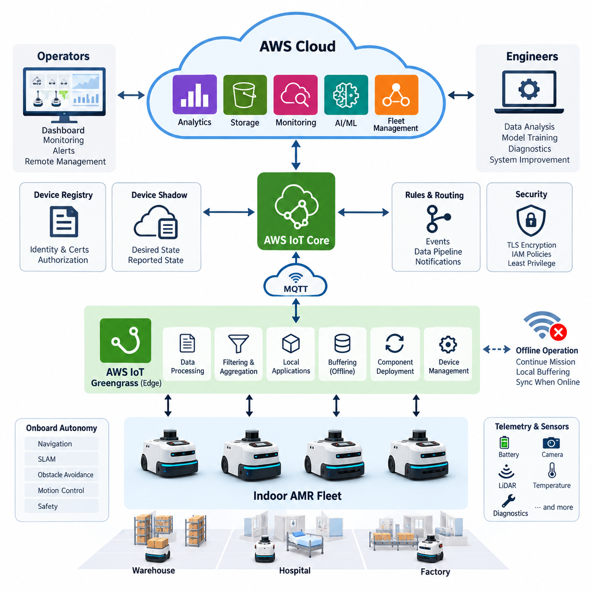
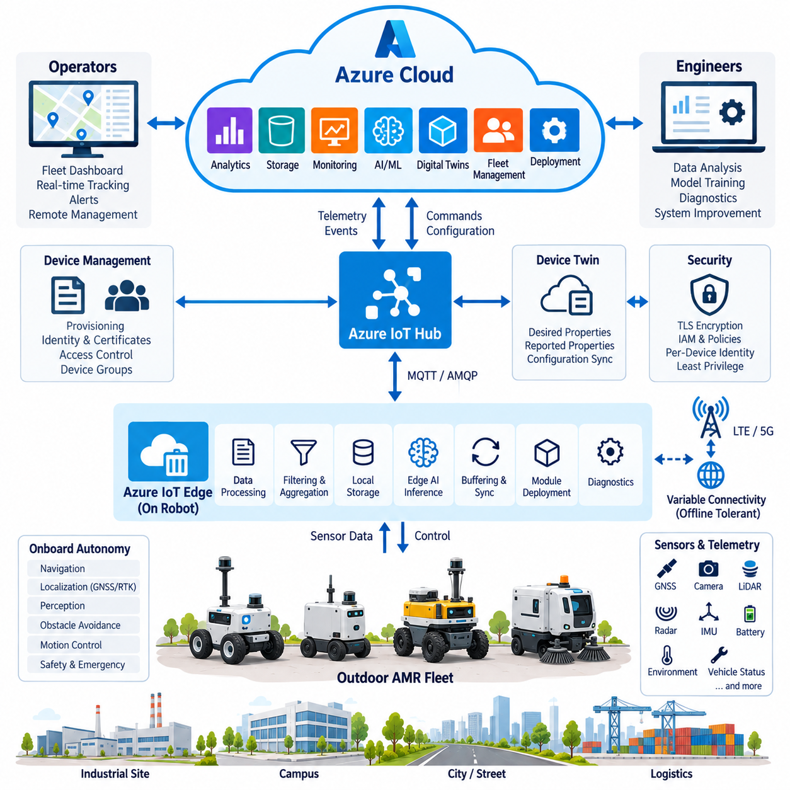
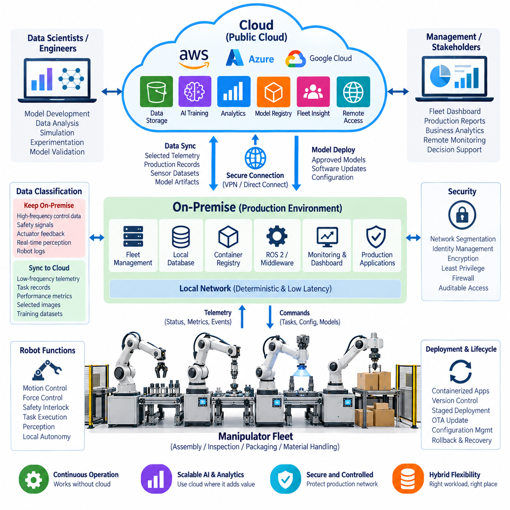
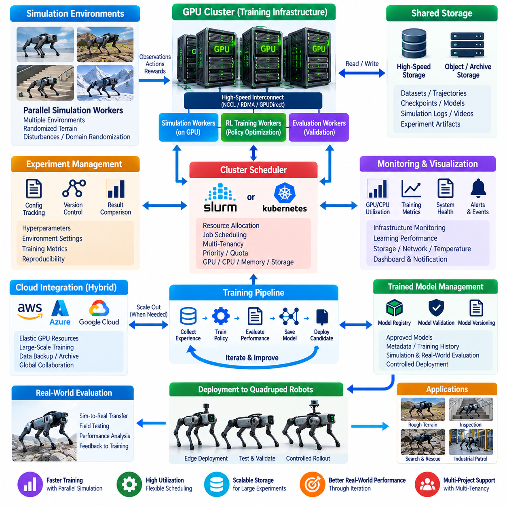
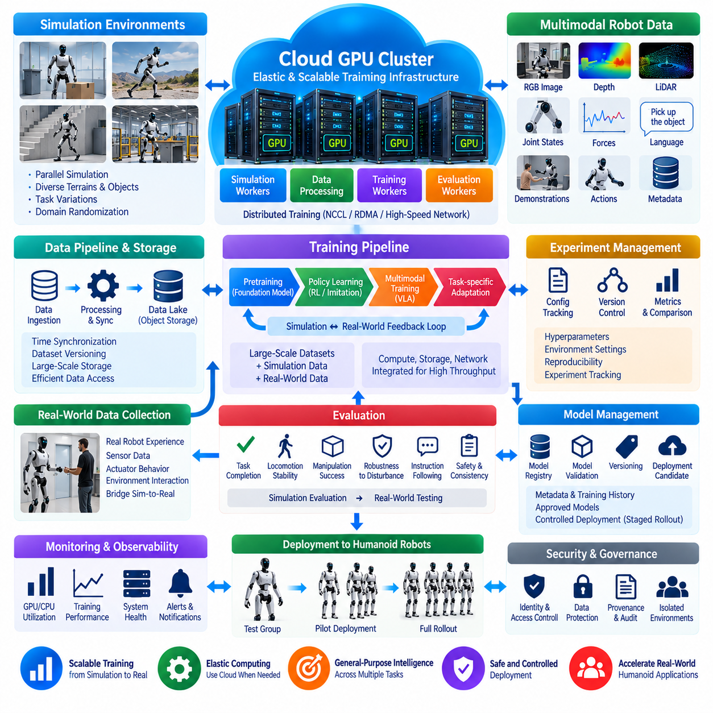
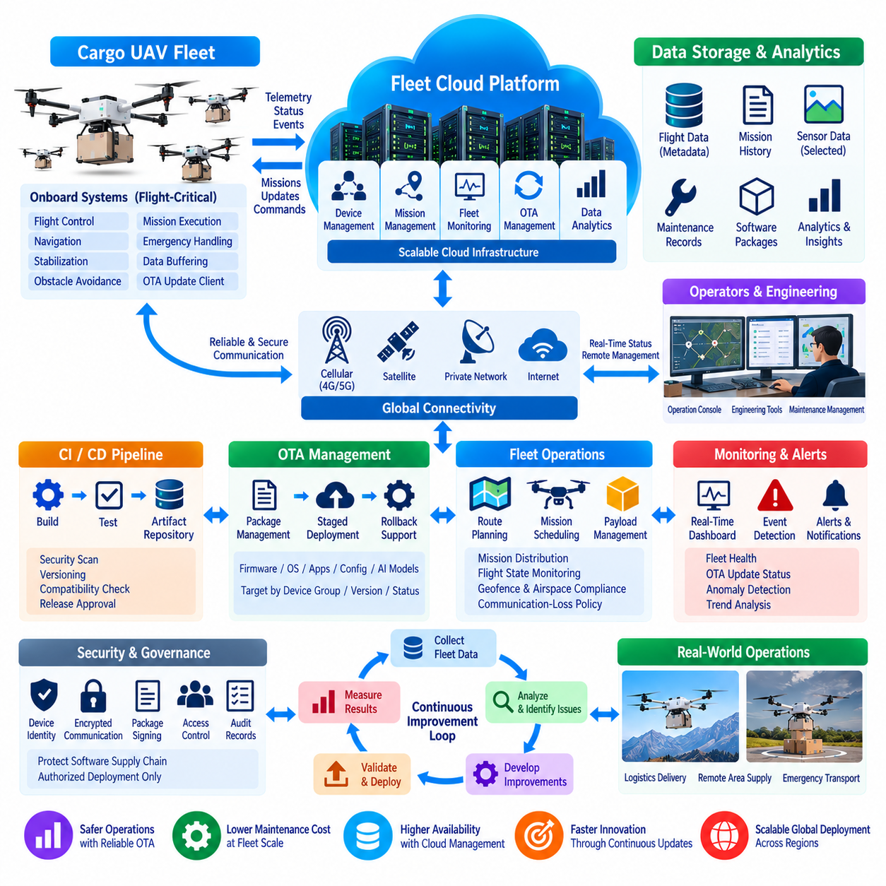
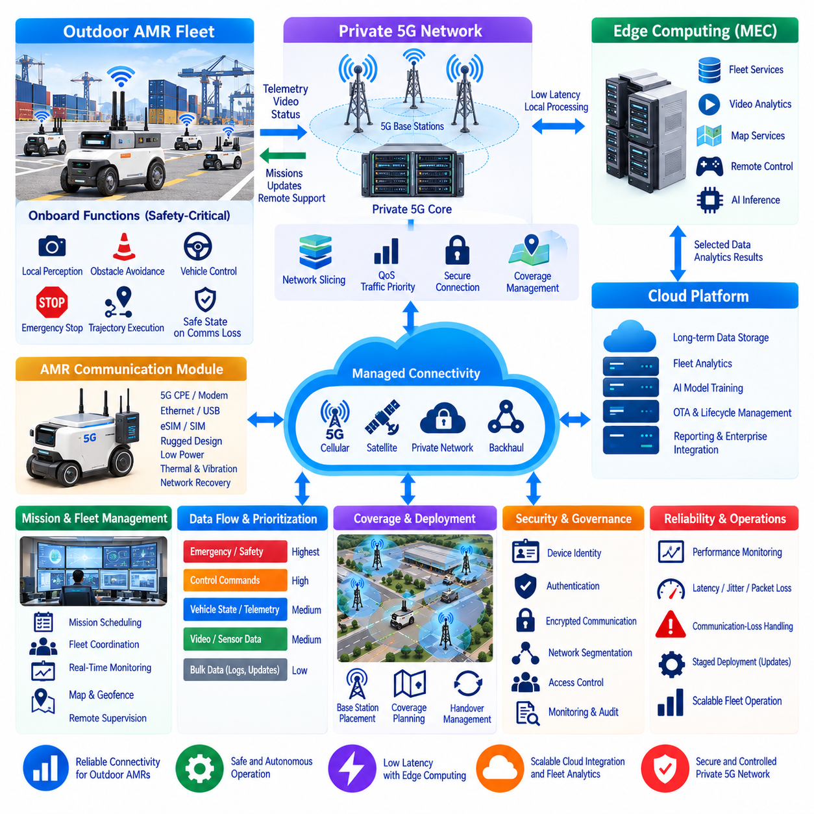
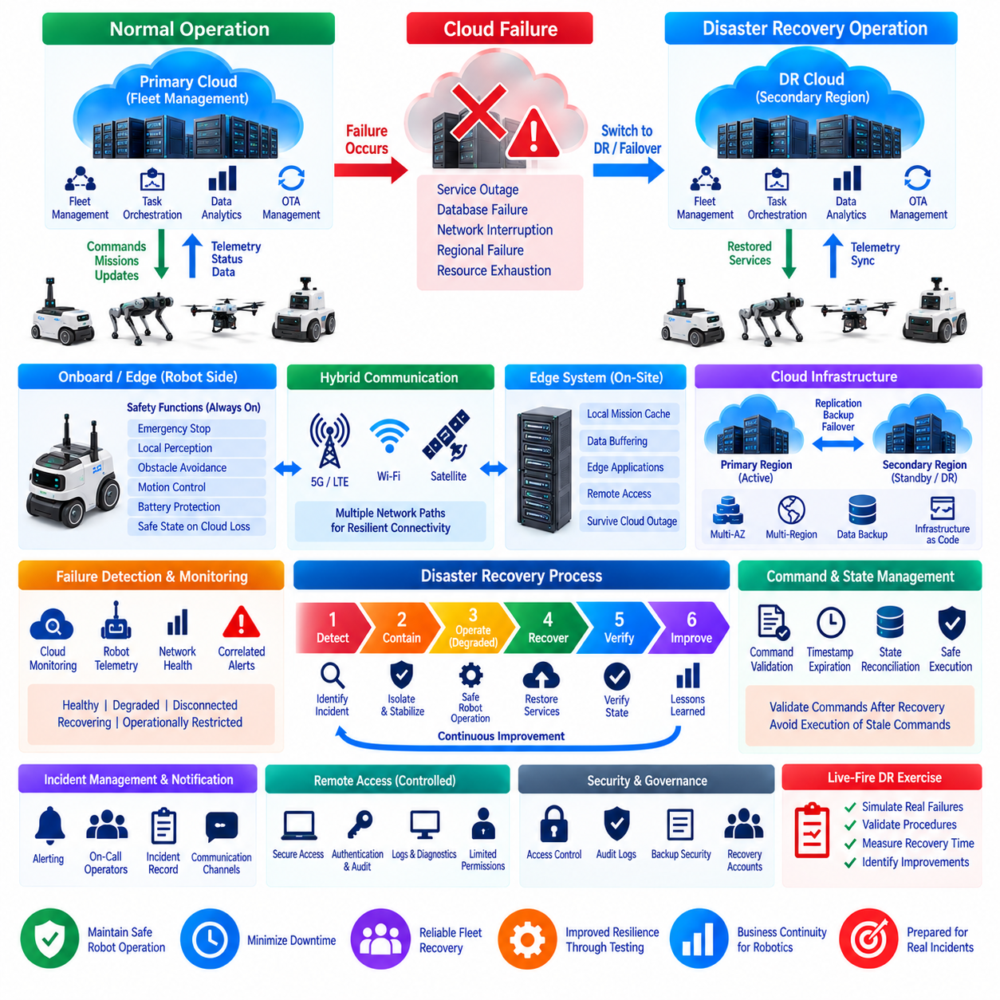
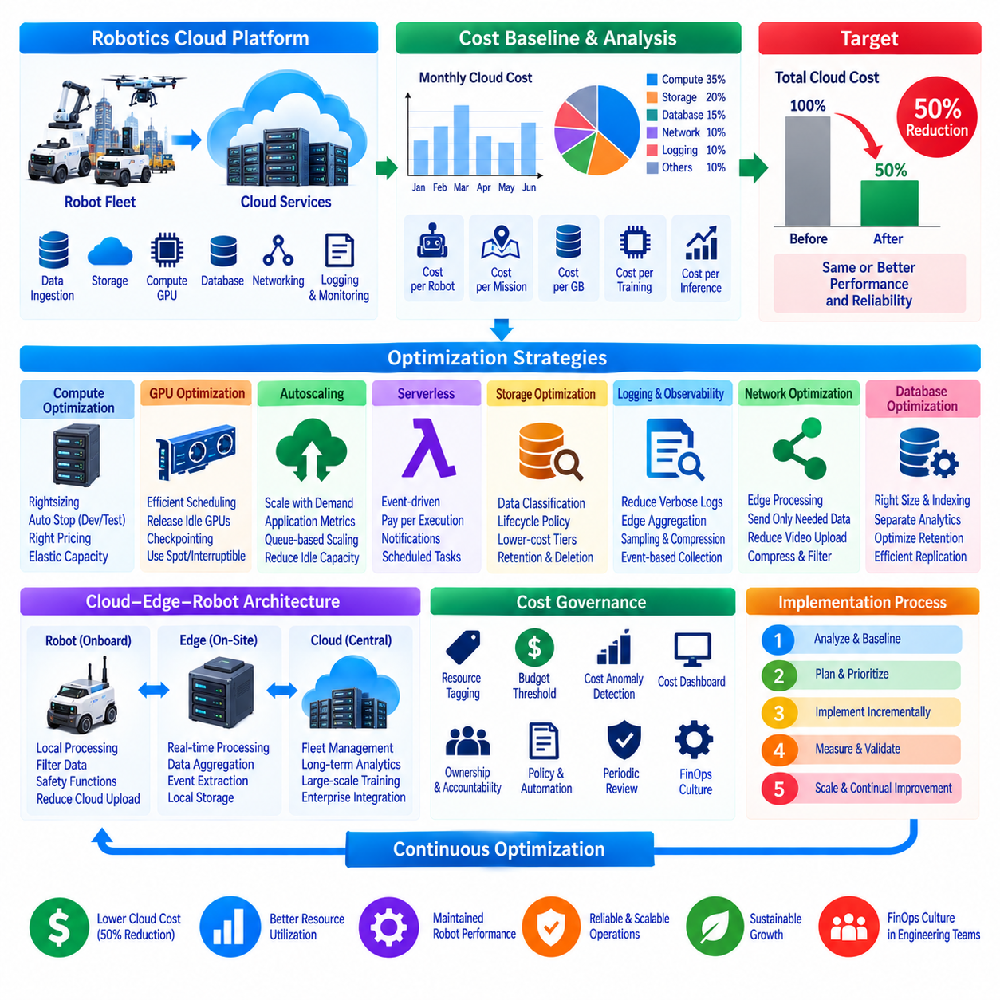
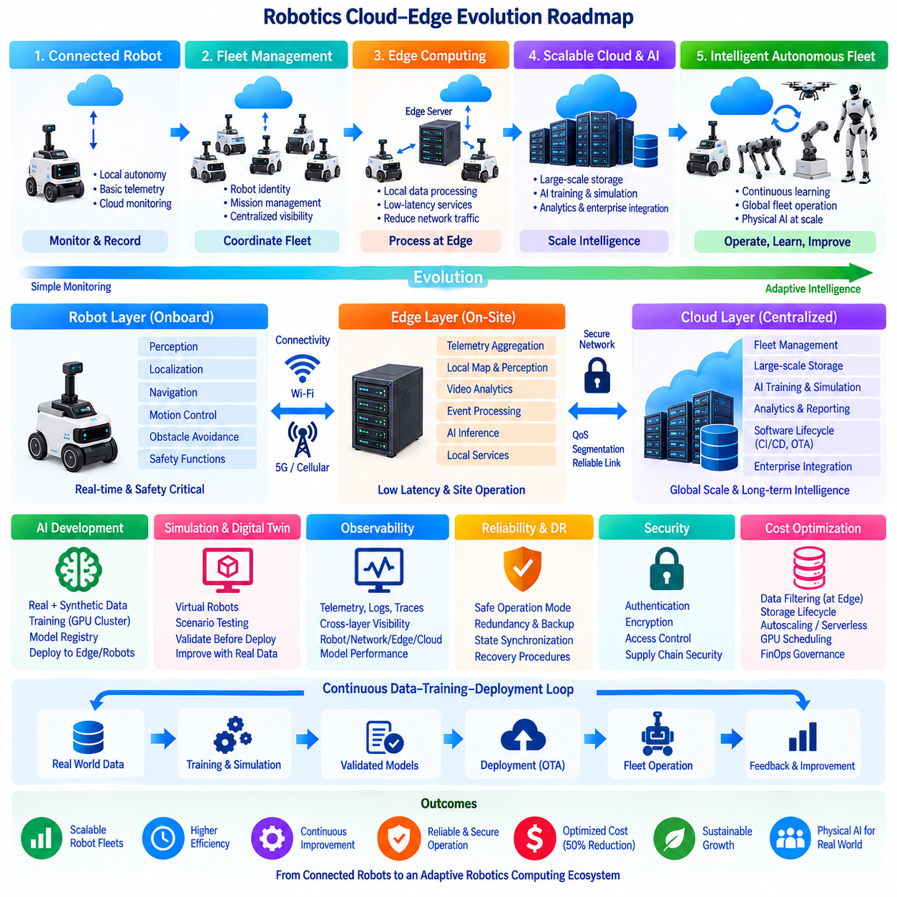

**Volume 09 Cloud and Edge Robotics**

# 12. Cloud Case Studies

## 12.01 Indoor AMR: AWS IoT Core / Greengrass Operation Case

{width="7.268055555555556in" height="7.268055555555556in"}

실내 자율이동로봇(Indoor Autonomous Mobile Robot, Indoor AMR) 군집을 창고, 병원 또는 생산 시설에서 운영하려면 로봇의 자율성이 지속적인 네트워크 연결에 의존하지 않으면서도 중앙집중식 가시성(Centralized Visibility)을 제공할 수 있는 클라우드 아키텍처(Cloud Architecture)가 필요하다. AWS 기반 배포 환경에서 각 AMR은 내비게이션(Navigation), 장애물 회피(Obstacle Avoidance), 위치추정(Localization), 모션 제어(Motion Control), 안전 처리(Safety Processing)를 로컬(Local)에서 수행하며, AWS 서비스는 군집 수준의 통신, 모니터링, 구성, 데이터 수집 및 수명주기 관리(Lifecycle Management)를 담당한다. 이러한 역할 분리는 엣지(Edge)의 실시간 동작을 유지하면서 확장 가능한 군집 운영을 가능하게 한다.

AWS IoT 코어(AWS IoT Core)는 실내 AMR과 클라우드 애플리케이션(Cloud Application) 사이의 주요 통신 계층(Communication Layer)으로 사용할 수 있다. 각 로봇은 고유한 아이덴티티(Identity)와 자격증명(Credential)을 가진 개별 IoT 디바이스(IoT Device)로 등록되며, 이를 통해 인증된 연결에서 MQTT 기반 텔레메트리(Telemetry)와 명령을 교환할 수 있다. 동작 모드, 위치, 배터리 수준, 임무 진행 상태, 고장 코드, 온도 및 연결 상태 등의 로봇 정보는 구조화된 토픽(Topic)을 통해 발행할 수 있다. 클라우드 애플리케이션은 모니터링, 분석 또는 군집 조정에 필요한 정보만 구독한다.

AWS IoT 그린그래스(AWS IoT Greengrass)는 이러한 아키텍처를 클라우드에서 로봇 또는 인접한 산업용 엣지 컴퓨터(Industrial Edge Computer)까지 확장한다. 그린그래스 런타임(Greengrass Runtime)은 로컬에 배포된 소프트웨어 컴포넌트(Software Component)를 실행하여 모든 트랜잭션(Transaction)을 인터넷으로 전송하지 않고도 텔레메트리 처리, 필터링, 애플리케이션 로직 실행, 통신 관리 및 로봇 소프트웨어와의 상호작용을 수행할 수 있다. 이를 통해 AMR 제어 스택(Control Stack)과 AWS 클라우드 서비스 사이에 실용적인 엣지 실행 계층(Edge Execution Layer)이 형성된다.

로컬 기능(Local Function)과 클라우드 기능(Cloud Function) 사이의 운영 경계는 실내 AMR에서 특히 중요하다. 위치추정, 동시적 위치추정 및 지도작성(SLAM), 충돌 회피, 비상 동작, 궤적 생성(Trajectory Generation), 저수준 제어(Low-Level Control)는 지연시간과 가용성 요구사항 때문에 원격 인프라에 의존할 수 없으므로 로봇 내부에 유지된다. 그린그래스는 텔레메트리 전처리, 이벤트 분류, 로컬 버퍼링(Local Buffering), 구성 동기화 및 통신 어댑터와 같이 시간 민감도가 상대적으로 낮은 로컬 서비스를 처리하고, IoT 코어는 군집 수준 클라우드 애플리케이션으로 연결되는 통제된 인터페이스(Controlled Interface)가 된다.

정상 운영 과정에서 원시 로봇 정보(Raw Robot Information)는 내비게이션, 인지(Perception), 배터리 관리, 모터 컨트롤러 및 애플리케이션 소프트웨어에서 먼저 생성된다. 모든 메시지를 클라우드로 직접 전송하는 대신 그린그래스 컴포넌트(Greengrass Component)가 고주파 내부 데이터(High-Frequency Internal Data)를 운영 이벤트와 요약된 텔레메트리로 변환할 수 있다. 예를 들어 위치추정 데이터는 주기적인 군집 위치 업데이트로 축소할 수 있지만, 비정상적인 위치추정 손실은 즉시 높은 우선순위의 이벤트를 생성할 수 있다. 이러한 접근방식은 대역폭 소비를 감소시키고 불필요한 로봇 수준 데이터로 클라우드 백엔드(Cloud Backend)가 과부하되는 것을 방지한다.

MQTT 토픽 계층구조(MQTT Topic Hierarchy)는 군집 구조와 운영 목적을 모두 표현해야 한다. 배포 시스템에서는 사이트(Site), 군집(Fleet), 로봇(Robot)을 식별하면서 텔레메트리, 상태, 이벤트, 명령, 구성 및 진단 정보를 분리할 수 있다. 이를 통해 클라우드 측 권한 정책(Authorization Policy)과 처리 규칙은 일반적인 배터리 보고와 고장 알림 또는 원격 운영 명령을 구분할 수 있다. 체계적으로 설계된 토픽 구조는 군집 규모가 증가하더라도 전체 통신 인터페이스를 다시 설계하지 않고 새로운 로봇이나 시설을 추가하기 쉽게 만든다.

디바이스 섀도(Device Shadow) 기능은 일시적인 연결 손실과 독립적으로 선택된 목표 상태(Desired State)와 보고 상태(Reported State)를 표현할 수 있다. 클라우드 애플리케이션이 목표 구성을 정의하면 로봇은 재연결한 이후 변경 사항을 검증하고 실제 적용된 구성을 보고할 수 있다. 이 메커니즘은 보고 주기, 애플리케이션 모드, 기능 플래그(Feature Flag), 비안전 운영 설정 등의 파라미터에 유용하다. 그러나 안전이 중요한 모션 명령(Motion Command)은 재연결 후 지연 실행될 경우 바람직하지 않은 로봇 동작을 유발할 수 있으므로 이러한 비동기 패턴(Asynchronous Pattern)에서 제외해야 한다.

네트워크 단절(Network Interruption)은 예외적인 클라우드 장애가 아니라 정상적으로 발생할 수 있는 운영 조건으로 취급해야 한다. 와이파이(Wi-Fi) 연결이 끊어지더라도 AMR은 온보드 자율주행(Onboard Autonomy)과 현장 안전 규칙에 따라 로컬에서 승인된 임무를 계속 수행한다. 그린그래스 컴포넌트는 필요한 텔레메트리와 이벤트를 로컬에 버퍼링하고 로컬 애플리케이션 기능을 유지하며, 연결이 복구되면 클라우드 동기화를 다시 수행할 수 있다. 따라서 이 아키텍처는 클라우드 접속 손실이 중앙집중식 가시성을 감소시키지만 기본적인 자율 기능을 자동으로 중단시키지는 않는 오프라인 허용 운영 원칙(Offline-Tolerant Operating Principle)을 따른다.

군집 모니터링(Fleet Monitoring)은 텔레메트리를 통제되지 않은 데이터 스트림으로 저장하는 대신 운영 정보(Operational Information)로 변환할 때 더욱 유용해진다. IoT 코어 규칙(IoT Core Rules) 또는 후속 AWS 처리 서비스는 선택된 메시지를 모니터링, 저장, 분석 또는 경보 파이프라인(Alert Pipeline)으로 전달할 수 있다. 일반적인 상태 정보는 대시보드와 이력 분석을 지원하고, 반복적인 위치추정 실패, 비정상적인 배터리 동작, 컴포넌트 고장 또는 예상하지 못한 임무 종료 등의 중요 이벤트는 더욱 신속한 알림 경로를 사용할 수 있다. 결과적으로 클라우드 계층은 원격 로봇 컨트롤러가 아니라 운영 관측성 시스템(Operational Observability System)이 된다.

그린그래스 컴포넌트는 여러 로봇에 엣지 애플리케이션을 배포하고 업데이트하기 위한 통제된 메커니즘도 제공한다. 컴포넌트에는 텔레메트리 어댑터, 진단 수집기, 전처리 로직, 프로토콜 게이트웨이(Protocol Gateway) 또는 기타 지원 소프트웨어를 버전 정보 및 의존성(Dependency)과 함께 패키징할 수 있다. 이를 통해 기술자가 모든 AMR을 수동으로 수정하지 않고도 특정 로봇 그룹을 대상으로 배포할 수 있다. 실제 운영 환경에서는 새로운 컴포넌트를 전체 군집에 배포하기 전에 소수의 로봇에서 검증하는 단계적 배포 정책(Staged Deployment Policy)을 적용해야 한다.

보안(Security)은 전체 군집이 하나의 자격증명을 공유하는 대신 각 로봇에 고유한 아이덴티티를 부여하는 것에서 시작한다. 인증서 기반 인증(Certificate-Based Authentication), 제한적인 IoT 정책, 암호화 통신(Encrypted Communication), 통제된 클라우드 권한을 사용하면 하나의 디바이스가 침해되었을 때 발생할 수 있는 영향을 줄일 수 있다. 각 로봇에는 지정된 토픽과 서비스를 사용하는 데 필요한 최소한의 권한만 부여해야 한다. 엣지 컴포넌트 역시 제한된 권한으로 동작해야 하며, 민감한 자격증명을 애플리케이션 코드나 시스템 간에 복사될 수 있는 컨테이너 이미지(Container Image)에 직접 포함해서는 안 된다.

실내 AMR 배포에서는 운영 텔레메트리(Operational Telemetry)와 대규모 센서 데이터셋(Large Sensor Dataset)을 분리하는 것도 중요하다. 연속적인 카메라, 라이다(LiDAR), 깊이(Depth) 또는 진단 기록은 일반적인 군집 모니터링에 필요한 데이터보다 훨씬 많은 양을 생성할 수 있다. 따라서 로봇 또는 엣지 계층에서 어떤 정보를 요약하고, 로컬에 보존하며, 이벤트 발생 이후 업로드하거나, 엔지니어링 분석을 위해 클라우드 스토리지(Cloud Storage)로 전송할 것인지 결정해야 한다. 이벤트 기반 수집(Event-Driven Collection)을 사용하면 전체 인지 데이터 스트림을 지속적으로 업로드하지 않으면서도 내비게이션 장애 전후의 상세 센서 데이터를 보존할 수 있다.

여러 구역에 수십 대의 AMR을 운영하는 창고를 생각해 볼 수 있다. 각 로봇은 독립적으로 내비게이션과 장애물 회피를 수행하며, 그린그래스는 애플리케이션 상태를 수집하여 내부 로봇 메시지를 표준화된 군집 텔레메트리로 변환한다. IoT 코어는 인증된 MQTT 메시지를 수신하고 이를 클라우드 측 모니터링 및 데이터 서비스로 전달한다. 운영자는 실시간 모션 제어 루프(Real-Time Motion-Control Loop)에 클라우드를 개입시키지 않으면서 중앙집중식 인터페이스를 통해 배터리 상태, 로봇 가용성, 임무 진행 상황, 고장 및 통신 상태를 확인할 수 있다.

특정 로봇이 반복적인 위치추정 성능 저하를 보고하기 시작하면 엣지 소프트웨어는 해당 상태를 분류하고 로봇 식별자, 타임스탬프(Timestamp), 지도 컨텍스트(Map Context), 소프트웨어 버전 및 관련 상태 지표를 포함하는 진단 이벤트(Diagnostic Event)를 발행할 수 있다. 클라우드 백엔드는 해당 이벤트를 기록하고 다른 로봇에서 발생한 유사 장애와 연계할 수 있다. 엔지니어는 이를 통해 개별 하드웨어 문제인지 사이트 전체의 지도 또는 환경 문제인지 구분할 수 있다. 즉각적인 안전 대응은 AMR 내부에서 수행하면서 클라우드 연결은 군집 전체의 상관분석(Correlation Analysis)과 이력 가시성을 제공한다.

동일한 아키텍처는 시험 운영 군집(Pilot Fleet)에서 여러 시설로 운영 규모를 확장하는 것도 지원할 수 있다. 사이트 및 군집 식별자를 통해 통신을 분할하고, 그린그래스 배포를 정의된 디바이스 그룹(Device Group)에 적용하며, 클라우드 측 서비스는 로봇, 구역, 시설 또는 기업 수준에서 정보를 통합할 수 있다. 따라서 이 아키텍처는 계산 규모보다 논리적 구조를 먼저 확장한다. 일관된 아이덴티티, 메시지 스키마(Message Schema), 배포 그룹, 관측성 규칙 및 보안 정책은 개별적인 로봇-클라우드 통합을 만들지 않고 수백 또는 수천 대의 디바이스를 추가하기 위한 기반이 된다.

운영 신뢰성(Operational Reliability)은 엣지 계층과 클라우드 계층 모두에서 측정해야 한다. 유용한 지표에는 로봇-클라우드 연결 가용성, 메시지 전달 실패, 로컬 큐(Local Queue) 증가량, 텔레메트리 지연시간, 그린그래스 컴포넌트 상태, 배포 성공률, 인증서 상태 및 장애 이후 동기화를 복구하는 데 필요한 시간 등이 포함된다. 이러한 측정값을 사용하면 문제가 로봇 소프트웨어, 무선 네트워크, 엣지 런타임, 인증, 메시지 라우팅 또는 후속 클라우드 처리 과정 중 어디에서 발생했는지를 식별할 수 있어 군집 운영 과정의 진단 불확실성을 줄일 수 있다.

비용 관리(Cost Control)는 데이터 아키텍처(Data Architecture)와 밀접하게 관련된다. 지나치게 높은 주기의 텔레메트리를 발행하면 메시징, 처리, 저장 및 분석 워크로드가 증가하지만 운영 측면에서 추가적인 가치를 거의 제공하지 못할 수도 있다. 따라서 엣지 집계(Edge Aggregation)를 통해 반복적인 정보를 줄이고 엔지니어링 또는 사고 분석에 필요한 경우에만 상세 데이터를 보존해야 한다. 보고 주기도 로봇 상태에 따라 변경할 수 있다. 동작 중인 AMR은 높은 빈도로 데이터를 발행하고, 대기 또는 충전 중인 로봇은 비정상 상태가 발생하지 않는 한 낮은 빈도의 보고 주기를 사용할 수 있다.

성숙한 배포 아키텍처에서는 AWS IoT 코어와 그린그래스를 로봇 자율성을 대체하는 기술이 아니라 상호 보완적인 계층(Complementary Layer)으로 취급한다. IoT 코어는 안전한 클라우드 연결과 군집 규모 메시징을 제공하고, 그린그래스는 관리 가능한 애플리케이션 로직을 물리 시스템 가까이에 배치한다. AMR 자체는 결정론적 내비게이션(Deterministic Navigation)과 안전 관련 책임을 유지한다. 이러한 로봇 제어(Robot Control), 엣지 운영(Edge Operation), 클라우드 군집 서비스(Cloud Fleet Service)의 3단계 분리는 각 컴퓨팅 계층이 지연시간, 가용성, 대역폭 및 관리 특성에 적합한 작업을 수행하도록 하는 복원력 있는 아키텍처(Resilient Architecture)를 형성한다.

이 운영 사례의 핵심 교훈은 성공적인 클라우드 로보틱스(Cloud Robotics)가 로봇 컨트롤러를 클라우드로 이동시키는 것을 의미하지 않는다는 점이다. 핵심은 자율 로봇(Autonomous Robot), 로컬 엣지 소프트웨어(Local Edge Software), 확장 가능한 클라우드 서비스(Scalable Cloud Service) 사이에 책임을 체계적으로 분산하는 것이다. 실내 AMR에서 AWS IoT 코어와 그린그래스는 네트워크 단절 중에도 로컬 운영을 유지하면서 안전한 연결, 엣지 처리, 군집 관측성, 원격 컴포넌트 관리 및 데이터 통합을 제공할 수 있다. 이러한 아키텍처는 점차 규모가 커지고 지능화되는 로봇 군집을 구축하기 위한 실용적인 기반이 된다.

## 12.02 Outdoor AMR: Azure IoT Edge Deployment Case

{width="7.268055555555556in" height="7.268055555555556in"}

실외 자율이동로봇(Outdoor Autonomous Mobile Robot, Outdoor AMR)은 실내 AMR보다 훨씬 예측하기 어려운 조건에서 동작한다. 불규칙한 지형, 변화하는 조명, 기상 조건, 위성항법시스템(GNSS) 가용성, 보행자, 차량, 가변적인 셀룰러 연결(Cellular Connectivity) 때문에 지속적인 클라우드 의존은 현실적이지 않다. 따라서 애저(Azure) 기반 실외 AMR 아키텍처는 안전 중요 자율 기능(Safety-Critical Autonomy)과 클라우드 서비스를 분리한다. 내비게이션(Navigation), 인지(Perception), 장애물 회피(Obstacle Avoidance), 위치추정(Localization), 모션 제어(Motion Control), 비상 대응은 온보드(Onboard)에 유지하고, Azure는 군집 연결, 모니터링, 데이터 관리, 배포 및 대규모 운영 지능(Operational Intelligence)을 제공한다.

애저 IoT 허브(Azure IoT Hub)는 실외 AMR 군집을 위한 주요 클라우드 통신 인터페이스(Cloud Communication Interface)를 제공할 수 있다. 각 로봇에는 개별 디바이스 아이덴티티(Device Identity)와 인증된 연결이 부여되며, 이를 통해 텔레메트리(Telemetry), 이벤트, 구성 정보 및 클라우드-디바이스 메시지(Cloud-to-Device Message)를 통제된 채널을 통해 교환할 수 있다. 일반적인 텔레메트리에는 GNSS 위치, 속도, 임무 상태, 배터리 충전 상태(State of Charge), 위치추정 품질, 네트워크 상태, 센서 상태, 고장 코드 및 환경 정보가 포함된다. 디바이스별 아이덴티티를 사용하면 수백 대의 로봇이 동일한 백엔드(Backend)를 공유하더라도 접근 정책과 운영 이력을 개별적으로 분리할 수 있다.

애저 IoT 엣지(Azure IoT Edge)는 클라우드에서 관리되는 기능을 로봇 내부에 설치된 컴퓨팅 플랫폼(Computing Platform)까지 확장한다. 엣지 모듈(Edge Module)은 텔레메트리 처리, 프로토콜 변환, 이벤트 감지, 로컬 저장, 진단 및 선택적인 인공지능 추론(AI Inference)을 위한 컨테이너화 애플리케이션(Containerized Application)을 실행할 수 있다. 이러한 모듈은 로봇 자율주행 스택(Autonomy Stack)의 실시간 제어 기능을 대체하지 않고 함께 동작한다. 결과적으로 차량 제어 시스템은 물리적 동작을 관리하고, IoT Edge는 관리 가능한 엣지 서비스를 제공하며, Azure 클라우드 자원은 군집 규모의 조정, 저장, 분석 및 수명주기 관리(Lifecycle Management)를 제공하는 계층형 아키텍처가 형성된다.

실외 운영에서는 네트워크에 의존할 수 있는 기능과 독립적으로 유지되어야 하는 기능 사이에 엄격한 경계가 필요하다. 조향(Steering), 제동(Braking), 장애물 회피, 궤적 추종(Trajectory Tracking), 비상 정지(Emergency Stopping), 즉각적인 인지 판단은 클라우드 응답을 기다릴 수 없다. 이러한 기능은 온보드 제어 및 인지 시스템 내부에 유지된다. 반면 클라우드 서비스는 군집 모니터링, 임무 분배, 이력 분석, 구성 관리, 소프트웨어 배포, 보고 및 장기 최적화처럼 추가적인 통신 지연이 차량 안전을 직접적으로 저해하지 않는 작업을 처리한다.

실외 AMR이 건물, 도로, 산업 시설, 터널, 식생 지역 및 기타 무선 환경 사이를 이동하면 연결 상태는 지속적으로 변화한다. LTE 또는 5G 서비스가 일시적으로 저하되거나 완전히 끊어질 수 있으므로 로봇은 오프라인 우선 원칙(Offline-First Principle)에 따라 동작해야 한다. IoT Edge 모듈은 통신을 사용할 수 없는 동안 중요한 텔레메트리와 이벤트를 로컬 스토리지(Local Storage)에 보관할 수 있다. 연결이 복구되면 로봇을 단순히 정지시키는 대신 버퍼링된 정보(Buffered Information)를 우선순위와 보존 정책(Retention Policy)에 따라 클라우드와 동기화할 수 있다.

네트워크 대역폭(Network Bandwidth)이 가변적인 환경에서는 데이터 우선순위화(Data Prioritization)가 필수적이다. 위치, 배터리 수준, 임무 상태, 안전 이벤트 및 고장 알림과 같은 저용량 운영 정보는 대규모 카메라 또는 라이다(LiDAR) 데이터셋보다 높은 전송 우선순위를 가질 수 있다. 고대역폭 센서 기록은 적절한 연결 환경이 확보될 때까지 온보드에 유지하거나 엔지니어링 이벤트에 대한 조사가 필요한 경우에만 업로드할 수 있다. 따라서 엣지 전처리(Edge Preprocessing)는 연속적인 센서 스트림을 압축된 운영 정보로 변환하면서 진단, AI 개발 또는 사고 재구성(Incident Reconstruction)에 필요한 일부 원시 데이터를 보존한다.

실외 로봇은 일반적으로 GNSS RTK, 관성측정장치(IMU), LiDAR, 카메라, 레이더(Radar), 초음파 센서(Ultrasonic Sensor) 및 차량 상태 정보를 결합한다. 이러한 센서는 서로 다른 주기와 데이터량으로 정보를 생성하기 때문에 모든 측정값을 Azure로 전송하는 것은 비효율적이다. 엣지 애플리케이션은 위치추정 신뢰도, 장애물 통계, 환경 관측 정보 및 센서 상태 지표를 구조화된 텔레메트리로 집계할 수 있다. GNSS 성능 저하, 반복적인 위치추정 초기화, 예상하지 못한 장애물, 과도한 모터 온도 또는 비상 정지와 같은 중요한 상태는 즉시 운영 중요도가 높은 이벤트 메시지를 생성할 수 있다.

디바이스 트윈(Device Twin)은 선택된 로봇 속성과 목표 구성 상태(Desired Configuration State)를 클라우드 측에서 표현한다. 운영자는 이를 사용하여 텔레메트리 전송 주기, 진단 모드, 기능 활성화 또는 애플리케이션 구성과 같은 비실시간 파라미터를 관리할 수 있다. 로봇은 적절한 변경 사항을 검증하고 적용한 다음 결과 상태를 보고한다. 지연된 실행이 물리적 안전에 영향을 줄 수 있는 명령은 일반적인 비동기 구성 업데이트(Asynchronous Configuration Update)로 처리해서는 안 된다. 따라서 실외 로보틱스에서는 구성 동기화(Configuration Synchronization)와 즉각적인 차량 제어를 명확하게 분리해야 한다.

IoT Edge 모듈은 지리적으로 분산된 로봇에 소프트웨어를 통제된 방식으로 배포하는 기능도 지원한다. 진단 수집기(Diagnostic Collector), 텔레메트리 어댑터, 데이터 필터, AI 추론 서비스 또는 통신 게이트웨이(Communication Gateway)를 독립적으로 관리되는 모듈로 패키징할 수 있다. 전체 운영 군집에 배포하기 전에 시험 그룹(Test Group)을 대상으로 먼저 배포하여 모든 로봇에 동시에 결함이 도입될 위험을 줄일 수 있다. 소프트웨어 상태를 현장 장애 및 성능 변화와 연계할 수 있도록 버전 정보와 배포 상태는 군집 운영자에게 지속적으로 표시되어야 한다.

보안(Security)은 실외 로봇이 공장 네트워크보다 물리적으로 통제하기 어려운 네트워크를 통해 통신하기 때문에 특히 중요하다. 모든 로봇은 군집 전체가 공유하는 자격증명 대신 고유한 아이덴티티와 인증된 통신을 사용해야 한다. 전송 암호화(Transport Encryption), 제한된 접근 정책, 안전한 자격증명 저장(Secure Credential Storage), 통제된 모듈 권한 및 감사 가능한 클라우드 접근(Auditable Cloud Access)을 통해 보안 노출을 줄일 수 있다. 한 대의 로봇이 침해되더라도 다른 로봇, 군집 관리 기능 또는 관련 없는 클라우드 자원으로 자동 접근할 수 없어야 한다. 따라서 보안 아키텍처도 운영 아키텍처와 동일하게 디바이스 수준 격리(Device-Level Isolation) 원칙을 따른다.

대규모 산업 단지를 순찰하는 실외 순찰 AMR(Outdoor Patrol AMR)을 예로 들 수 있다. 로봇은 위치추정, 경로 계획(Path Planning), 보행자 감지, 장애물 회피 및 차량 제어를 로컬에서 수행한다. IoT Edge는 운영 텔레메트리를 처리하고 선택된 정보를 IoT Hub를 통해 발행한다. 군집 서비스는 위치, 배터리 상태, 임무 진행 상황, 네트워크 품질 및 진단 이벤트를 수신하여 운영자가 로봇을 원격으로 감독할 수 있도록 한다. 대규모 센서 기록은 이벤트, 예약된 업로드 또는 엔지니어링 요청에 의해 전송이 필요한 경우를 제외하면 로컬에 유지된다.

로봇이 셀룰러 통신을 사용할 수 없는 지역에 진입했다고 가정할 수 있다. 온보드 자율 기능은 현재 임무와 안전 정책에 따라 계속 동작하고, 엣지 서비스는 클라우드로 전송해야 할 텔레메트리를 버퍼링한다. 운영 규칙이 자율적인 임무 지속을 허용한다면 로봇은 클라우드 연결을 기다리지 않고 계속 주행한다. 반대로 특정 경계를 넘어가기 위해 원격 승인이 필요한 임무라면 로봇은 미리 정의된 안전 상태(Safe State)로 전환할 수 있다. 따라서 연결 단절에 대한 적절한 대응은 클라우드의 가용성이 아니라 임무 정책(Mission Policy)과 로컬 안전 로직(Local Safety Logic)에 의해 결정된다.

통신이 복구되었을 때 누적된 모든 정보를 동시에 업로드해서는 안 된다. 중요 이벤트, 고장 기록 및 임무 요약을 먼저 전송하고, 이후 일반 텔레메트리와 선택된 진단 데이터를 전송할 수 있다. 대규모 센서 파일은 대역폭 상태가 적절할 때까지 전송을 지연할 수 있다. 이러한 우선순위 기반 복구(Priority-Based Recovery)는 재연결 과정에서 갑작스러운 대역폭 급증이 발생하는 것을 방지하고 운영자가 가장 중요한 정보를 먼저 받을 수 있도록 한다. 따라서 엣지 버퍼링(Edge Buffering)은 복원력(Resilience)뿐만 아니라 네트워크 자원 관리의 일부가 된다.

클라우드 측 모니터링(Cloud-Side Monitoring)은 여러 실외 로봇과 운영 사이트의 정보를 상호 연계할 수 있다. 동일한 지리적 영역에서 반복적으로 GNSS 성능이 저하된다면 개별 로봇의 고장이 아니라 환경적 문제일 가능성을 확인할 수 있다. 여러 차량에서 유사한 열 경고(Thermal Warning)가 발생하면 작업 부하, 날씨 또는 하드웨어 문제와 연관성을 분석할 수 있다. 중앙집중식 이력 데이터(Centralized Historical Data)를 통해 엔지니어는 로봇 버전, 운영 환경, 임무 유형 및 장애 패턴을 비교할 수 있다. 따라서 Azure는 개별 로봇에서는 얻기 어려운 군집 전체의 가시성과 분석을 통해 주요 가치를 제공한다.

군집 확장성(Fleet Scalability)은 표준화된 아이덴티티, 메시지 스키마(Message Schema), 모듈 버전, 배포 그룹 및 운영 정책에 의존한다. 몇 대의 실외 AMR로 구성된 시험 시스템은 수동 절차로 관리할 수 있지만 규모가 커지면 자동 프로비저닝(Automated Provisioning)과 구성 관리가 필요하다. 로봇은 사이트, 하드웨어 세대, 소프트웨어 릴리스, 애플리케이션 유형 또는 운영 역할에 따라 그룹화할 수 있다. 클라우드 및 엣지 관리 시스템은 디바이스 수준 추적성(Device-Level Traceability)을 유지하면서 이러한 논리적 그룹을 대상으로 관리 작업을 수행할 수 있으므로 모든 로봇을 개별적인 통합 프로젝트로 취급하지 않고도 아키텍처를 확장할 수 있다.

운영 관측성(Operational Observability)은 로봇에서 클라우드까지 이어지는 전체 경로를 포함해야 한다. 중요한 측정 지표에는 셀룰러 연결 품질, 메시지 지연시간, 동기화 백로그(Synchronization Backlog), 로컬 스토리지 사용량, IoT Edge 모듈 상태, 디바이스 인증 상태, 소프트웨어 배포 결과, GNSS 품질, 임무 완료 상태 및 고장 발생 빈도가 포함된다. 통신 정보와 로봇 상태 정보를 결합하면 네트워크 문제와 자율주행 기능의 장애를 구분할 수 있다. 실외 환경에서는 로봇 자체가 정상적으로 동작하는 동안에도 일시적인 통신 품질 저하가 발생할 수 있으므로 이러한 구분이 특히 중요하다.

클라우드 비용과 네트워크 비용은 어떤 정보가 실제로 중앙집중식 처리를 필요로 하는지 결정함으로써 제어할 수 있다. 고주파 원시 센서 스트림(High-Frequency Raw Sensor Stream)은 일반적으로 지속적인 클라우드 전송에 적합하지 않은 반면, 요약된 상태 지표와 운영 이벤트는 훨씬 적은 대역폭으로 높은 가치를 제공한다. 엣지 필터링(Edge Filtering), 적응형 텔레메트리 전송률(Adaptive Telemetry Rate), 이벤트 트리거 기록(Event-Triggered Recording), 압축 및 지연 대용량 업로드(Delayed Bulk Upload)를 사용하면 통신 및 저장 요구량을 줄일 수 있다. 로봇은 비정상 동작 중에는 더 많은 정보를 발행하고 안정적인 동작 또는 대기 상태에서는 보고 주기를 낮출 수 있다.

따라서 실질적인 배포 모델은 자율 차량 기능(Autonomous Vehicle Function), Azure IoT Edge 서비스 및 Azure 클라우드 서비스로 구성된 3계층 시스템(Three-Layer System)이다. 온보드 자율 계층(Onboard Autonomy Layer)은 물리적 로봇을 제어하고 즉각적인 안전을 유지한다. 엣지 계층(Edge Layer)은 데이터를 처리하고 통신을 버퍼링하며 관리 가능한 애플리케이션을 실행하고 로봇 소프트웨어와 클라우드 전용 인터페이스를 분리한다. 클라우드 계층(Cloud Layer)은 군집 가시성, 이력 데이터, 배포, 분석 및 기업 시스템 통합(Enterprise Integration)을 관리한다. 각 계층은 지연시간, 대역폭, 가용성 및 안전 요구사항에 따라 적절한 책임을 담당한다.

이 실외 AMR 사례는 클라우드-엣지 로보틱스(Cloud-Edge Robotics)가 영구적인 연결을 전제로 하는 것이 아니라 점진적 성능 저하(Graceful Degradation)를 중심으로 설계되어야 함을 보여준다. Azure IoT Hub와 IoT Edge는 안전한 통신, 원격 관리, 텔레메트리 처리, 소프트웨어 배포 및 군집 규모 데이터 통합을 제공하면서 네트워크 단절 중에도 로봇이 로컬 자율성을 유지하도록 할 수 있다. 온보드 지능(Onboard Intelligence), 엣지 복원력(Edge Resilience), 중앙집중식 클라우드 가시성(Centralized Cloud Visibility)을 결합하면 변화하는 네트워크 및 환경 조건에서도 계속 동작하면서 확장 가능한 클라우드 관리의 이점을 활용하는 실외 로봇 군집 아키텍처를 구축할 수 있다.

## 12.03 Manipulator Fleet: On-Premise / Cloud Hybrid Case

{width="7.268055555555556in" height="7.268055555555556in"}

제조 또는 연구 환경에서 사용되는 매니퓰레이터 군집(Manipulator Fleet)은 모바일 로봇과는 다른 클라우드 전략을 필요로 하는 경우가 많다. 로봇 동작, 힘 제어(Force Control), 안전 인터록(Safety Interlock), 생산 공정이 지연시간과 네트워크 가용성에 매우 민감할 수 있기 때문이다. 따라서 실용적인 하이브리드 아키텍처(Hybrid Architecture)는 실시간 매니퓰레이션과 안전 기능을 온프레미스 인프라(On-Premise Infrastructure)에 유지하면서, 장기 데이터 분석, 모델 개발, 군집 수준 보고 및 확장 가능한 저장소와 같은 선택적인 작업에는 클라우드 자원을 사용한다. 이러한 접근 방식은 로컬의 결정론적 동작(Deterministic Operation)과 클라우드의 확장성을 결합한다.

온프레미스 환경은 매니퓰레이터 군집을 위한 주요 운영 플랫폼(Operational Platform)을 제공할 수 있다. 로봇 컨트롤러, ROS 2 서비스, 인지 파이프라인(Perception Pipeline), 모션 계획(Motion Planning), 힘 제어 인터페이스 및 생산 애플리케이션을 통제된 로컬 네트워크에서 실행할 수 있다. 로컬 서버는 데이터베이스, 컨테이너 레지스트리(Container Registry), 모니터링 서비스 및 선택적인 AI 워크로드를 호스팅할 수 있다. 이러한 자원이 로봇과 물리적으로 가까운 곳에 유지되므로 외부 클라우드 연결이 불가능한 경우에도 생산 작업을 계속할 수 있다. 따라서 온프레미스 계층은 하이브리드 시스템의 운영 핵심(Operational Core)이 된다.

클라우드 자원은 탄력적인 컴퓨팅과 중앙집중식 접근성(Centralized Accessibility)의 이점을 얻을 수 있는 워크로드에 사용된다. 과거 로봇 텔레메트리, 생산 기록, 선택된 센서 데이터셋, 실험 결과 및 모델 학습 데이터를 온프레미스 환경에서 클라우드 스토리지(Cloud Storage)로 전송할 수 있다. 로컬 GPU 용량이 부족한 경우 클라우드 GPU 자원을 사용하여 계산량이 많은 AI 학습이나 대규모 실험을 수행할 수도 있다. 하이브리드 설계는 모든 워크로드를 로컬 인프라 또는 클라우드 중 한쪽으로 강제하지 않고, 각각의 기술적 요구사항에 따라 적절한 위치에 워크로드를 배치한다.

첫 번째 아키텍처 결정은 데이터 분류(Data Classification)이다. 고주파 제어 데이터, 안전 신호, 액추에이터 피드백(Actuator Feedback) 및 짧은 지연시간이 필요한 인지 정보는 일반적으로 로컬 환경에 유지해야 한다. 이러한 데이터 스트림은 매우 높은 빈도로 생성될 수 있으므로 지속적인 클라우드 전송이 비효율적이거나 불필요할 수 있다. 반면 저주기 텔레메트리, 완료된 작업 기록, 요약된 성능 지표, 선택된 이미지 및 학습 데이터셋은 클라우드 스토리지와 동기화할 수 있다. 이러한 분류는 네트워크 트래픽을 줄이면서 분석과 AI 개발에 필요한 정보를 보존한다.

군집 관리 계층(Fleet Management Layer)은 개별 매니퓰레이터와 온프레미스 인프라를 연결할 수 있다. 각 로봇은 로봇 상태, 관절 상태, 컨트롤러 상태, 작업 진행 상황, 사이클 타임(Cycle Time), 고장 코드 및 생산 통계와 같은 표준화된 정보를 발행할 수 있다. 로컬 서비스는 이러한 메시지를 집계하여 운영자와 엔지니어를 위한 대시보드를 제공할 수 있다. 동일한 정보 중 필요한 부분은 장기 분석을 위해 클라우드로 전달할 수 있다. 이를 통해 모든 로봇이 외부 클라우드 서비스와 개별적으로 통신하지 않으면서도 일관된 운영 데이터 모델(Operational Data Model)을 구축할 수 있다.

컨테이너화(Containerization)는 매니퓰레이터 군집 전체에서 일관성을 유지하는 데 유용하다. 로봇 애플리케이션, 인지 서비스, 진단 서비스, 데이터 수집기 및 지원 미들웨어(Supporting Middleware)를 버전이 관리되는 컨테이너로 패키징하고 온프레미스 컨테이너 레지스트리에 저장할 수 있다. 이를 통해 소프트웨어 버전을 개별 로봇 또는 로봇 그룹과 연결할 수 있다. 생산 과정에서 문제가 발생하면 엔지니어는 소프트웨어 버전, 구성 상태 및 운영 이력을 비교할 수 있다. 이후 클라우드 기반 개발 환경은 동기화된 데이터를 사용하여 생산 로봇에 직접 영향을 주지 않으면서 문제를 재현하거나 조사할 수 있다.

하이브리드 아키텍처는 통제된 AI 개발 사이클(AI Development Cycle)도 지원한다. 매니퓰레이터는 생산 과정에서 운영 데이터를 생성하며, 선택된 데이터셋을 클라우드 또는 전용 학습 인프라로 전송할 수 있다. 엔지니어는 이러한 데이터를 사용하여 인지, 그리핑(Grasping), 이상 탐지(Anomaly Detection) 또는 예지 정비(Predictive Maintenance) 모델을 학습할 수 있다. 검증이 완료된 모델은 패키징하여 온프레미스 환경으로 다시 전송하고 통제된 방식으로 배포할 수 있다. 이러한 구조는 생산 데이터가 모델 개선을 지원하면서도 실제 생산 추론(Inference)은 물리적 로봇과 가까운 위치에서 수행되는 폐쇄 루프(Closed Loop)를 형성한다.

네트워크 단절(Network Disconnection)은 예외적인 장애가 아니라 정상적인 운영 모델의 일부로 고려해야 한다. 외부 클라우드를 사용할 수 없게 되더라도 온프레미스 로봇 환경은 생산에 필요한 서비스를 계속 제공할 수 있어야 한다. 로컬 데이터베이스는 텔레메트리를 임시로 보존할 수 있고, 동기화 서비스는 클라우드로 전송을 기다리는 정보의 큐(Queue)를 유지할 수 있다. 연결이 복구되면 동기화 프로세스는 우선순위에 따라 다시 시작할 수 있다. 일반적으로 중요한 생산 기록과 고장 이벤트는 대규모 과거 데이터셋보다 먼저 동기화하는 것이 적절하다.

보안(Security)은 생산 네트워크와 외부 클라우드 서비스 사이에 명확한 경계를 필요로 한다. 로봇에 클라우드 자원에 대한 무제한 접근 권한을 부여해서는 안 되며, 클라우드 애플리케이션 역시 통제된 인증 없이 안전이 중요한 로봇 인터페이스에 직접 접근해서는 안 된다. 방화벽, 아이덴티티 관리(Identity Management), 암호화 통신, 네트워크 분할(Network Segmentation), 최소 권한(Least Privilege) 및 감사 가능한 접근 정책(Auditable Access Policy)을 적용하면 공격 표면(Attack Surface)을 줄일 수 있다. 하이브리드 아키텍처는 유용한 데이터가 경계를 넘어갈 수 있도록 하면서도 로봇 제어 환경이 불필요하게 노출되는 것을 방지해야 한다.

대표적인 배포 환경에는 조립, 검사, 포장 또는 자재 취급 작업을 수행하는 여러 대의 매니퓰레이터가 포함될 수 있다. 각 로봇은 자체적으로 모션과 작업 로직을 실행하고, 온프레미스 군집 서비스는 운영 정보를 수집한다. 엔지니어는 로컬 대시보드에서 사이클 타임, 작업 완료율, 고장 및 장비 상태를 모니터링할 수 있다. 일정한 주기로 선택된 정보를 클라우드 스토리지로 전송하여 과거 데이터를 분석할 수 있다. 특정 작업에서 비정상적인 결과가 발생하기 시작하면 시스템은 관련 센서 및 실행 데이터를 보존하여 이후 조사를 수행할 수 있다.

클라우드와 온프레미스 컴퓨팅은 계산 규모에 따라서도 분리할 수 있다. 예측 가능한 지연시간이 필요한 일반적인 추론과 생산 워크로드는 로컬 GPU 또는 CPU 자원에서 실행할 수 있다. 대규모 모델 학습, 하이퍼파라미터 실험(Hyperparameter Experimentation), 데이터셋 처리 또는 일시적으로 많은 계산 자원이 필요한 작업은 탄력적인 클라우드 GPU 인프라로 이동할 수 있다. 이러한 분배를 통해 전체 생산 환경을 클라우드에 의존시키지 않고 필요한 경우에만 고성능 자원을 사용할 수 있다. 따라서 워크로드 배치는 지연시간, 데이터 민감도, 계산 요구사항 및 비용을 기반으로 결정하는 엔지니어링 의사결정이 될 수 있다.

운영 관측성(Operational Observability)은 하이브리드 경계의 양쪽을 모두 포함해야 한다. 로컬 모니터링은 로봇 컨트롤러 상태, CPU 및 GPU 사용률, 네트워크 상태, ROS 2 노드 상태, 스토리지 용량, 관절 및 액추에이터 상태, 생산 성능을 추적해야 한다. 클라우드 모니터링은 동기화 상태, 데이터 전송 실패, 학습 작업, 스토리지 사용량 및 모델 관리 활동을 추적해야 한다. 이러한 측정값을 서로 연계하면 문제가 로봇, 로컬 인프라, 동기화 계층 또는 클라우드 워크로드 중 어디에서 발생했는지 판단할 수 있다.

백업과 복구(Backup and Recovery) 역시 중요하다. 하이브리드 아키텍처는 여러 종류의 운영 데이터를 생성하기 때문이다. 생산에 중요한 정보는 로컬 백업과 적절한 보조 복사본(Secondary Copy)을 가져야 하며, 클라우드 데이터셋은 추가적인 복구 소스로 활용할 수 있다. 복구 절차에는 어떤 서비스를 먼저 복구해야 하는지와 지원 인프라를 복구하는 동안 로봇이 어떻게 동작해야 하는지가 정의되어야 한다. 로봇이 안전한 운영 상태로 진입하기 위해 사용할 수 없는 클라우드 서비스에 의존해서는 안 된다. 따라서 로컬 복구 능력(Local Recovery Capability)은 시스템 가용성의 중요한 요소가 된다.

결과적으로 형성되는 아키텍처는 매니퓰레이터, 온프레미스 인프라 및 클라우드 자원 사이의 통제된 연속체(Controlled Continuum)로 이해할 수 있다. 로봇은 물리적 상호작용, 모션, 안전 및 즉각적인 인지를 담당한다. 온프레미스 계층은 결정론적인 생산 서비스, 군집 관리, 로컬 데이터 처리, 모니터링 및 운영 저장소를 제공한다. 클라우드 계층은 탄력적인 컴퓨팅, 장기 저장, 대규모 분석, AI 학습 및 조직 전체의 접근성을 제공한다. 데이터와 소프트웨어는 제한 없는 연결이 아니라 명시적으로 통제된 인터페이스를 통해 이러한 계층 사이를 이동한다.

이 매니퓰레이터 군집 사례는 완전히 로컬 방식이나 완전히 클라우드 기반 방식을 선택하는 것보다 하이브리드 클라우드 아키텍처가 더 실용적인 경우가 많은 이유를 보여준다. 실시간 매니퓰레이션은 로봇 가까이에 유지되고, 생산 시스템은 통제된 로컬 환경에서 계속 운영되며, 확장성 또는 계산 능력이 실질적인 가치를 제공하는 영역에는 클라우드 자원을 사용할 수 있다. 지연시간, 가용성, 보안, 대역폭 및 계산 요구사항에 따라 워크로드와 데이터를 분류함으로써 매니퓰레이터 군집은 물리적 로봇의 동작을 외부 인프라에 의존시키지 않으면서도 클라우드 규모의 기능을 확보할 수 있다.

## 12.04 Quadruped GPU Cluster RL Training Infra Case

{width="7.268055555555556in" height="7.268055555555556in"}

사족보행 로봇(Quadruped Robot)의 강화학습 시스템(Reinforcement Learning System)은 기존의 일반적인 로봇 소프트웨어 개발 환경보다 훨씬 더 큰 컴퓨팅 능력을 필요로 한다. 강화학습은 로봇 정책(Robot Policy)과 다수의 시뮬레이션 환경 사이의 반복적인 상호작용에 의존하기 때문이다. GPU 클러스터(GPU Cluster)는 이러한 환경을 병렬로 실행하고, 관측값과 보상을 수집하며, 정책 네트워크(Policy Network)를 업데이트하고, 새로운 학습 데이터를 지속적으로 생성할 수 있다. 이 볼륨에서 정의한 클라우드 로보틱스 아키텍처(Cloud Robotics Architecture)에서 GPU 클러스터는 시뮬레이션, 강화학습, 실험 관리, 모델 저장 및 최종 로봇 배포를 연결하는 확장 가능한 학습 인프라(Training Infrastructure)가 된다.

학습 시스템은 시뮬레이션 워커(Simulation Worker), GPU 학습 워커(GPU Training Worker), 공유 스토리지(Shared Storage), 실험 관리(Experiment Management), 모니터링(Monitoring)으로 구성된 여러 기능 계층으로 조직할 수 있다. 시뮬레이션 워커는 여러 사족보행 로봇 환경에 대한 물리적 상호작용을 생성하고, 학습 워커는 궤적(Trajectory)을 처리하여 강화학습 정책을 업데이트한다. 공유 스토리지는 데이터셋, 체크포인트(Checkpoint), 구성 파일 및 실험 결과를 유지한다. 이러한 분리를 통해 시뮬레이션과 학습 용량을 독립적으로 확장할 수 있으며, 전체 학습 시스템을 다시 설계하지 않고도 병렬 환경의 수를 증가시킬 수 있다.

병렬 시뮬레이션(Parallel Simulation)은 사족보행 강화학습 인프라의 가장 중요한 특징 중 하나이다. 하나의 로봇 인스턴스를 통해 정책을 학습하는 대신 여러 개의 시뮬레이션 사족보행 로봇이 서로 다른 지형, 외란(Disturbance), 초기 상태 및 작업 조건에서 동시에 상호작용할 수 있다. 각각의 환경은 관측값(Observation), 행동(Action), 보상(Reward) 및 종료 정보(Termination Information)를 생성한다. 이러한 병렬 경험을 배치(Batch) 단위로 수집하여 학습 알고리즘에 공급하면 각 학습 반복에서 사용할 수 있는 경험의 양을 크게 증가시킬 수 있다.

GPU 자원은 시뮬레이션과 신경망 계산 모두 상당한 병렬 처리를 필요로 할 수 있기 때문에 특히 중요하다. 클러스터는 현재 수요에 따라 GPU 자원을 시뮬레이션 워커, 정책 학습, 평가 작업 또는 데이터 처리 워크로드에 할당할 수 있다. 모든 GPU가 항상 동일한 기능을 수행하도록 고정할 필요는 없다. 유연한 스케줄링(Flexible Scheduling)을 사용하면 현재 학습 처리량(Training Throughput)을 제한하는 워크로드에 가용 자원을 할당할 수 있어 전체 자원 활용률을 높이고 여러 로보틱스 프로젝트에서 클러스터 자원을 더욱 효율적으로 사용할 수 있다.

클러스터 스케줄러(Cluster Scheduler)는 이러한 GPU 워크로드를 관리하기 위한 메커니즘을 제공한다. 인프라에 따라 SLURM과 같은 HPC 중심 스케줄러(HPC-Oriented Scheduler)를 사용하거나 NVIDIA GPU 스케줄링 컴포넌트를 포함하는 Kubernetes를 사용할 수 있다. 스케줄러는 학습 또는 시뮬레이션 작업이 실행될 위치를 결정하고 자원 할당을 관리한다. GPU 메모리, CPU 용량, 시스템 메모리, 스토리지 접근성 및 작업 우선순위를 함께 고려해야 한다. 강화학습 처리량은 GPU 연산 능력 하나만으로 결정되는 것이 아니라 시뮬레이션, 데이터 이동 및 신경망 학습 사이의 상호작용에 의해 제한되는 경우가 많기 때문이다.

분산 강화학습(Distributed Reinforcement Learning)은 추가적인 통신 요구사항을 발생시킨다. 여러 워커가 경험을 생성하는 동시에 하나 이상의 학습기(Learner)가 정책을 업데이트할 수 있다. 따라서 모델 파라미터, 그래디언트(Gradient), 관측값 및 학습 배치는 여러 프로세스 또는 여러 시스템 사이에서 이동해야 한다. 통신 오버헤드(Communication Overhead)가 확장성을 제한하기 시작하면 NCCL, RDMA 또는 GPUDirect와 같은 기술이 중요해질 수 있다. 목표는 단순히 더 많은 GPU를 연결하는 것이 아니라 계산과 데이터 이동 사이의 효율적인 비율을 유지하여 추가 하드웨어가 실제 학습 처리량 증가로 이어지도록 하는 것이다.

실용적인 학습 루프(Training Loop)는 초기 정책과 정의된 시뮬레이션 환경에서 시작한다. 시뮬레이션 워커는 정책을 실행하고, 그 결과로 발생하는 로봇 상태를 관측하며, 보상을 계산하고, 궤적을 수집한다. 학습기는 이러한 경험을 받아 적절한 강화학습 알고리즘을 사용하여 정책 최적화(Policy Optimization)를 수행한다. 업데이트된 정책 파라미터는 다시 시뮬레이션 워커에 배포된다. 이 사이클은 지속적으로 반복된다. 많은 반복을 거치면서 정책은 안정적인 보행, 속도 추종, 회전, 외란 회복 및 지형 적응과 같은 행동을 점진적으로 학습한다.

시뮬레이션 환경은 학습된 정책이 하나의 이상적인 조건에 특화되는 것을 방지할 수 있도록 충분한 변화를 제공해야 한다. 지형 높이, 마찰, 경사, 외부 외란, 로봇 질량 특성, 센서 노이즈 및 명령 조건을 학습 과정에서 변화시킬 수 있다. 랜덤화(Randomization)는 체계적으로 적용하여 정책이 동일한 환경을 반복적으로 경험하는 것이 아니라 다양한 상황의 분포를 경험하도록 만들 수 있다. 이는 최종 목표가 시뮬레이션에서 실제 사족보행 로봇으로의 전이(Simulation-to-Real Transfer)인 경우 특히 중요하다.

학습 데이터와 실험 산출물(Experiment Artifact)은 대규모 정보를 처리할 수 있는 스토리지 아키텍처를 필요로 한다. 체크포인트, 구성 파일, 평가 결과, 선택된 궤적, 시뮬레이션 기록 및 모델 메타데이터(Model Metadata)는 나중에 실험을 재현할 수 있도록 구성되어야 한다. 고속 공유 스토리지(High-Speed Shared Storage)는 학습 워커가 자주 사용하는 데이터셋에 접근할 수 있도록 하고, 장기 스토리지(Long-Term Storage) 또는 객체 스토리지(Object Storage)는 완료된 실험을 보존할 수 있다. 따라서 GPU 클러스터는 계산 자원뿐만 아니라 적절한 속도로 데이터를 공급할 수 있는 스토리지 시스템에도 의존한다.

실험 관리(Experiment Management)는 수백 개의 구성 변수가 서로 다른 강화학습 실험을 관리하기 때문에 필수적이다. 환경 파라미터, 보상 가중치, 네트워크 구조, 학습률, 배치 크기, 랜덤 시드(Random Seed), 시뮬레이션 설정 및 커리큘럼 스케줄(Curriculum Schedule)은 모두 결과에 영향을 줄 수 있다. 따라서 각 실험은 해당 구성과 함께 체크포인트 및 평가 결과를 보존해야 한다. 이를 통해 학습된 모델과 모델이 생성된 정확한 조건 사이의 추적성(Traceability)을 확보할 수 있으며, 학습 이력을 재구성할 수 없는 모델을 선택할 위험을 줄일 수 있다.

모니터링(Monitoring)은 시스템 수준과 학습 수준의 동작을 모두 다루어야 한다. GPU 사용률, GPU 메모리 사용량, CPU 사용률, 시스템 메모리, 네트워크 트래픽, 스토리지 처리량 및 온도는 인프라가 효율적으로 사용되고 있는지를 보여준다. 동시에 보상, 에피소드 길이(Episode Length), 정책 손실(Policy Loss), 가치 손실(Value Loss), 성공률 및 평가 성능과 같은 학습 지표는 학습 과정이 제대로 진행되고 있는지를 나타낸다. 따라서 클러스터가 높은 자원 사용률을 보이더라도 학습 결과가 좋지 않을 수 있으므로 인프라 모니터링과 강화학습 평가는 서로 대체할 수 없는 상호 보완적인 기능이다.

동일한 GPU 클러스터가 여러 로보틱스 프로젝트 또는 여러 연구팀을 지원하는 경우 멀티테넌시(Multi-Tenancy)가 중요해진다. 자원 할당량(Resource Quota)과 워크로드 격리(Workload Isolation)는 하나의 대규모 실험이 사용 가능한 모든 GPU나 스토리지 대역폭을 소비하는 것을 방지한다. 프로젝트 요구사항에 따라 작업에 우선순위 또는 자원 제한을 지정할 수 있다. Kubernetes 네임스페이스(Namespace) 또는 이에 상응하는 격리 메커니즘으로 워크로드를 분리하고, 스케줄러 정책을 통해 GPU 할당을 제어할 수 있다. 이러한 메커니즘을 사용하면 GPU 서버의 단순한 집합을 개별 워크스테이션의 모음이 아니라 공유 로보틱스 학습 플랫폼(Shared Robotics Training Platform)으로 발전시킬 수 있다.

사족보행 학습 팜(Quadruped Training Farm)은 시뮬레이션과 실제 로봇 개발을 연결할 수도 있다. 시뮬레이션은 대량의 학습 경험을 생성하고, 실제 로봇은 시뮬레이션과 현실 사이의 차이를 드러낼 수 있는 실제 환경 평가 데이터를 제공한다. 따라서 선택된 정책은 시뮬레이션 학습에서 통제된 실제 로봇 시험으로 이동할 수 있으며, 이 과정에서 보행 안정성, 액추에이터 동작, 센서 특성 및 지형 상호작용을 평가할 수 있다. 관찰된 차이는 이후 추가적인 시뮬레이션 조건이나 학습 데이터에 반영될 수 있으며, 이를 통해 반복적인 시뮬레이션-현실 전이 개발 사이클(Simulation-to-Real Development Cycle)을 구축할 수 있다.

모델 배포(Model Deployment)는 제한 없이 수행되는 학습 작업과 분리되어야 한다. 후보 정책이 사전에 정의된 평가 기준에 도달하면 해당 모델을 버전, 구성, 학습 이력 및 평가 결과와 함께 저장할 수 있다. 이후 배포 시스템은 승인된 모델을 로봇의 엣지 컴퓨터(Edge Computer)로 전달하여 통제된 시험을 수행할 수 있다. 이러한 분리를 통해 실험용 체크포인트가 실제 로봇에 실수로 배포되는 것을 방지하고 연구용 모델과 검증된 배포 산출물(Validated Deployment Artifact)을 명확하게 구분할 수 있다.

동일한 인프라는 정책이 향상됨에 따라 시뮬레이션 환경의 난이도를 변화시키는 커리큘럼 기반 강화학습(Curriculum-Based Reinforcement Learning)도 지원할 수 있다. 초기 학습에서는 기본적인 균형과 보행에 중점을 둘 수 있으며, 이후 단계에서는 경사, 불규칙한 지형, 외란, 속도 명령 및 더욱 복잡한 환경 조건을 도입할 수 있다. 클러스터를 사용하면 여러 커리큘럼 단계 또는 파라미터 조합을 병렬로 평가할 수 있다. 따라서 이러한 인프라는 단순히 학습을 빠르게 만드는 것뿐만 아니라 사족보행 정책이 어떤 조건에서 성공하거나 실패하는지를 체계적으로 탐색할 수 있도록 지원한다.

로컬 GPU 용량이 부족하거나 일시적으로 학습 용량을 증가시켜야 하는 경우 클라우드 자원을 도입할 수 있다. 최대 예상 워크로드를 감당할 수 있는 충분한 하드웨어를 항상 구매하는 대신 온프레미스 GPU 클러스터(On-Premise GPU Cluster)와 탄력적인 클라우드 GPU 자원을 결합할 수 있다. 안정적인 개발과 자주 수행되는 실험은 로컬에서 유지하고, 대규모 학습 캠페인은 일시적으로 클라우드로 확장할 수 있다. 이러한 하이브리드 전략(Hybrid Strategy)은 계산 수요, 데이터 요구사항, 지연시간, 보안 및 비용에 따라 워크로드를 분배한다는 보다 광범위한 원칙을 따른다.

에너지 효율성과 클러스터 활용률(Cluster Utilization) 역시 인프라 설계의 일부로 고려해야 한다. 비활성 실험에 GPU가 계속 할당되어 있으면 자원이 낭비되며, 과도한 동기화로 인해 고가의 하드웨어가 데이터를 기다리는 시간이 증가할 수도 있다. 작업 스케줄링, 적절한 배치 크기, 효율적인 시뮬레이션, 자원 할당량 및 워크로드 통합(Workload Consolidation)을 통해 활용률을 향상시킬 수 있다. 과거 활용률을 모니터링하면 향후 용량 계획(Capacity Planning)을 위한 근거를 확보할 수 있으며, 추가 GPU가 필요한지, 더 빠른 스토리지가 필요한지 또는 네트워크 개선이 실제 병목을 해결할 수 있는지를 판단하는 데 도움이 된다.

따라서 대표적인 사족보행 강화학습 클러스터는 시뮬레이션에서 학습과 평가까지 이어지는 연속적인 파이프라인을 형성한다. 시뮬레이션 워커는 다양한 물리적 경험을 생성하고, GPU 학습기는 정책을 최적화하며, 고속 스토리지는 데이터셋과 체크포인트를 제공하고, 스케줄러는 계산 자원을 분배하며, 모니터링 시스템은 인프라와 학습 동작을 관찰하고, 모델 관리 시스템은 검증된 산출물을 보존한다. 이러한 플랫폼은 여러 로보틱스 워크로드에서 재현성과 자원 통제를 유지하면서 반복적인 실험을 지원할 수 있다.

이 사례의 핵심 교훈은 사족보행 로봇을 위한 강화학습 인프라를 단순히 강력한 GPU를 모아 놓은 시스템으로 설계해서는 안 된다는 것이다. 병렬 시뮬레이션, 분산 학습, 고속 통신, 공유 스토리지, 스케줄링, 실험 관리, 모니터링 및 통제된 모델 배포가 하나의 통합된 시스템으로 함께 동작해야 한다. 적절하게 구성된 GPU 클러스터는 강화학습을 개별 컴퓨터에서 느리게 수행하는 실험에서 확장 가능한 학습 프로세스로 전환할 수 있으며, 이를 통해 대량의 로봇 경험을 체계적으로 생성하고 평가할 수 있다.

## 12.05 Humanoid Physical AI Large-Scale Cloud Training Case

{width="7.268055555555556in" height="7.268055555555556in"}

휴머노이드 피지컬 AI 시스템(Humanoid Physical AI System)은 대규모 시뮬레이션, 멀티모달 로봇 데이터(Multimodal Robot Data), 파운데이션 모델(Foundation Model), 분산 GPU 컴퓨팅(Distributed GPU Computing)을 결합할 수 있는 학습 인프라(Training Infrastructure)를 필요로 한다. 기존의 일반적인 머신러닝 워크로드와 달리 휴머노이드 학습은 인지(Perception), 언어(Language), 신체 상태(Body State), 행동(Action), 접촉 역학(Contact Dynamics), 매니퓰레이션(Manipulation), 보행(Locomotion) 및 복잡한 환경과의 상호작용을 표현해야 한다. 클라우드 기반 아키텍처(Cloud-Based Architecture)는 이러한 워크로드를 위한 탄력적인 컴퓨팅 자원을 제공하면서 시뮬레이션, 데이터 생성, 모델 학습, 평가, 실험 관리 및 통제된 배포를 하나의 연속적인 개발 파이프라인으로 연결한다.

대규모 클라우드 학습은 휴머노이드 로봇과 다양한 운영 조건을 재현하는 병렬 시뮬레이션 환경(Parallel Simulation Environment)에서 시작한다. 수천 개의 시뮬레이션 환경에서 서로 다른 신체 구성, 지형 조건, 물체, 작업, 외란(Disturbance), 카메라 시점 및 상호작용 시나리오를 생성할 수 있다. 각각의 환경은 관측값(Observation), 행동(Action), 보상(Reward), 시연 데이터(Demonstration) 또는 멀티모달 궤적(Multimodal Trajectory)을 생성한다. 병렬 시뮬레이션은 학습 시스템에서 사용할 수 있는 경험의 양을 증가시키며, 동일한 수의 실제 로봇을 사용하지 않고도 하나의 작업에 대한 다양한 조건을 탐색할 수 있도록 한다.

학습 데이터는 피지컬 AI(Physical AI)가 로봇이 무엇을 인지하고 무엇을 수행하는지를 연결해야 하기 때문에 여러 모달리티(Multiple Modality)를 결합해야 한다. 카메라 이미지, 깊이 정보, 라이다(LiDAR) 관측값, 자기수용감각 상태(Proprioceptive State), 관절 위치, 힘, 속도, 언어 명령, 시연 데이터 및 행동 시퀀스를 동기화된 학습 샘플로 구성할 수 있다. 데이터 파이프라인(Data Pipeline)은 멀티모달 관계가 학습 과정에서 유지될 수 있도록 타임스탬프, 로봇 구성, 작업 컨텍스트(Task Context), 환경 정보 및 센서 메타데이터를 보존해야 한다. 이를 통해 모델은 시각적·언어적 컨텍스트와 물리적 상태 및 로봇 행동 사이의 관계를 학습할 수 있다.

확장 가능한 GPU 클러스터(GPU Cluster)는 모델 사전학습(Pretraining), 정책 학습(Policy Learning), 강화학습(Reinforcement Learning), 모방학습(Imitation Learning) 및 멀티모달 학습(Multimodal Training)을 위한 계산 기반을 제공한다. GPU 자원은 시뮬레이션 워커, 데이터 처리 워커, 학습 워커 및 평가 워커 사이에 분배할 수 있다. 대규모 학습 작업은 분산 학습 프레임워크(Distributed Training Framework)와 고속 통신을 통해 여러 GPU 또는 여러 GPU 노드를 사용할 수 있다. 목표는 단순히 GPU의 수를 증가시키는 것이 아니라 실제 학습 처리량(Training Throughput)을 확장하는 것이다. 클러스터 규모가 증가하면 통신, 스토리지, 시뮬레이션 속도 및 동기화가 병목이 될 수 있기 때문이다.

분산 학습(Distributed Training)은 GPU 프로세스 사이에서 모델 파라미터(Model Parameter), 그래디언트(Gradient) 및 학습 배치(Training Batch)를 효율적으로 이동해야 한다. 모델이나 배치 크기가 커지면 고속 GPU 통신 기술(High-Speed GPU Communication Technology)을 사용하여 동기화 오버헤드(Synchronization Overhead)를 줄일 수 있다. 인프라는 GPU 주변에 충분한 CPU, 메모리, 스토리지 및 네트워크 용량도 제공해야 한다. 강력한 가속기를 갖춘 학습 클러스터라도 데이터를 충분히 빠르게 공급하지 못하면 입력 데이터를 기다리는 데 상당한 시간을 소비할 수 있다. 따라서 컴퓨팅, 네트워크 및 스토리지는 하나의 통합된 학습 시스템으로 설계해야 한다.

클라우드는 휴머노이드 피지컬 AI에서 특히 중요한 탄력성(Elasticity)을 제공한다. 개발팀은 일상적인 실험에는 중간 규모의 자원을 필요로 하지만 대규모 사전학습 또는 시뮬레이션 캠페인에서는 훨씬 더 많은 자원이 필요할 수 있다. 클라우드 GPU 자원은 필요한 최대 용량의 하드웨어를 항상 보유하지 않고도 학습 팜(Training Farm)을 일시적으로 확장할 수 있도록 한다. 완료된 실험, 체크포인트, 데이터셋 및 모델 산출물(Model Artifact)은 확장 가능한 스토리지에 보존할 수 있다. 이를 통해 현재 학습 워크로드에 따라 컴퓨팅 용량을 확장할 수 있는 유연한 인프라를 구축할 수 있다.

시뮬레이션 데이터와 실제 환경 데이터는 서로 독립적인 데이터셋이 아니라 피드백 루프(Feedback Loop)를 형성해야 한다. 시뮬레이션은 대량의 통제된 경험을 생성하고, 실제 휴머노이드 로봇은 실제 액추에이터 동작, 접촉 역학, 센서 노이즈, 지연시간 및 환경 불확실성을 관찰할 수 있는 데이터를 제공한다. 시뮬레이션과 실제 동작 사이의 차이를 분석하여 시뮬레이션 파라미터, 랜덤화 전략(Randomization Strategy), 데이터셋 또는 학습 절차를 개선할 수 있다. 이러한 결과적인 시뮬레이션-현실 전이(Simulation-to-Real) 과정은 모든 학습 반복을 실제 하드웨어에서 수행하지 않고도 클라우드 학습이 실제 물리 환경의 정보를 활용할 수 있도록 한다.

파운데이션 모델 학습(Foundation Model Training)은 또 다른 수준의 확장성을 요구한다. 휴머노이드 피지컬 AI 모델은 비전(Vision), 언어(Language), 로봇 상태(Robot State) 및 행동 표현(Action Representation)을 결합하여 하나의 공통 모델이 여러 작업을 수행할 수 있도록 구성할 수 있다. 대규모 데이터셋을 사용하여 사전학습을 수행한 후 특정 작업에 맞게 모델을 조정하거나 정책 최적화(Policy Optimization)를 수행할 수 있다. 따라서 학습 인프라는 대규모 범용 모델과 소규모 특화 정책(Specialized Policy)을 모두 지원해야 한다. 모델 체크포인트, 데이터셋, 토크나이저(Tokenization) 또는 행동 표현, 구성 파라미터 및 평가 결과는 추적 가능하게 유지하여 배포된 모델과 그 학습 이력을 연결할 수 있어야 한다.

비전-언어-행동(Vision-Language-Action, VLA) 접근방식은 고수준 명령(High-Level Instruction)과 물리적 행동을 연결할 수 있다. 시스템은 현재 로봇 상태와 함께 시각적 관측값 및 언어 명령을 입력받고 행동 표현 또는 중간 정책 출력(Intermediate Policy Output)을 생성할 수 있다. 이러한 시스템을 학습하려면 동기화된 멀티모달 데이터와 인지, 추론(Reasoning) 및 행동 학습 구성요소 사이의 신중한 분리가 필요하다. 대규모 클라우드 인프라는 다양한 데이터셋을 처리하고 많은 실험을 실행할 수 있도록 하면서, 서로 다른 휴머노이드 작업에 공통적인 모델 개발 프레임워크를 유지할 수 있도록 한다.

실험 관리(Experiment Management)는 모델, 데이터셋, 환경 및 학습 구성의 수가 증가함에 따라 더욱 중요해진다. 각 학습 실행(Training Run)은 데이터셋 버전, 시뮬레이션 구성, 모델 아키텍처, 하이퍼파라미터(Hyperparameter), 랜덤 시드(Random Seed), 소프트웨어 환경, 체크포인트 및 평가 결과를 보존해야 한다. 이를 통해 재현성(Reproducibility)을 확보하고 의미 있는 비교를 수행할 수 있다. 체계적인 실험 추적이 없다면 휴머노이드 정책의 성능 향상이 특정 데이터셋, 학습 방법, 환경 구성 또는 모델 변경 중 어떤 요인에 의해 발생했는지를 판단하기 어려워진다.

평가는 일반적인 모델 지표를 넘어야 한다. 피지컬 AI는 궁극적으로 물리적인 행동을 생성하기 때문이다. 휴머노이드 모델은 작업 완료율, 보행 안정성, 매니퓰레이션 성공률, 외란으로부터의 회복, 명령 수행 능력, 상호작용 품질, 안전 제약조건 및 다양한 환경에서의 일관성을 통해 평가할 수 있다. 시뮬레이션 평가는 실제 로봇으로 전달하기 전에 많은 후보 모델을 선별할 수 있도록 한다. 이후 실제 환경 시험을 통해 시뮬레이션과 실제 동작 사이의 차이 및 모델의 강건성(Robustness)에 대한 추가적인 정보를 확보할 수 있다.

모델 관리(Model Management)는 실험용 체크포인트에서 배포 후보(Deployment Candidate)까지 이어지는 통제된 경로를 구축해야 한다. 학습 산출물은 데이터셋, 학습 구성, 평가 결과 및 소프트웨어 의존성에 대한 메타데이터와 함께 모델 레지스트리(Model Registry)에 저장할 수 있다. 사전에 정의된 검증 절차를 통과한 모델만 실제 로봇 배포 단계로 이동해야 한다. 배포는 제한된 테스트 그룹에서 먼저 시작한 후 점진적으로 확대할 수 있으며, 이를 통해 엔지니어는 실제 동작을 관찰하고 배포된 모델을 검증된 기준 모델(Validated Reference Model)과 비교할 수 있다.

모니터링(Monitoring)은 인프라와 학습 성능을 모두 포함해야 한다. GPU 사용률, 메모리 사용량, 네트워크 처리량, 스토리지 성능, 작업 상태 및 학습 시간은 클라우드 학습 환경의 상태를 보여준다. 학습 지표, 작업 성공률, 보상 추세(Reward Trend), 검증 결과 및 평가 동작은 모델 자체가 개선되고 있는지를 나타낸다. 이 두 가지 모니터링 계층은 서로 연계되어야 한다. 학습 성능 저하는 학습 알고리즘이 아니라 인프라 병목에서 발생할 수 있으며, 높은 GPU 사용률이 반드시 유용한 모델 성능 향상을 의미하는 것은 아니기 때문이다.

대규모 휴머노이드 데이터셋에 독점적인 로봇 정보, 환경 기록 또는 인간과의 상호작용 데이터가 포함될 경우 보안(Security)과 데이터 거버넌스(Data Governance)가 중요해진다. 데이터셋, 학습 인프라, 모델 레지스트리 및 배포 시스템에 대한 접근은 적절한 아이덴티티와 권한을 통해 통제해야 한다. 데이터는 전송 및 저장 과정에서 보호되어야 하며, 모델 산출물은 버전 정보와 출처(Provenance)를 유지해야 한다. 연구용 워크로드와 배포 인프라를 분리하면 실험용 모델이나 검증되지 않은 구성이 의도하지 않게 실제 로봇에 전달되는 가능성도 줄일 수 있다.

완전한 휴머노이드 피지컬 AI 클라우드 학습 시스템(Humanoid Physical AI Cloud Training System)은 데이터 생성에서 시뮬레이션, 분산 학습, 평가, 모델 관리 및 물리적 배포까지 이어지는 연속적인 파이프라인을 형성한다. 병렬 시뮬레이션은 확장 가능한 경험을 제공하고, 멀티모달 데이터셋은 인지와 행동을 연결하며, GPU 클러스터는 계산 능력을 제공하고, 클라우드 스토리지는 학습 산출물을 보존하며, 실험 관리는 재현성을 제공하고, 통제된 배포는 검증된 지능을 휴머노이드 로봇으로 전달한다. 핵심 원칙은 클라우드 인프라를 단순한 원격 컴퓨팅(Remote Computing)으로 보는 것이 아니라, 시뮬레이션, 데이터, 모델 및 실제 로봇 경험을 하나의 반복적인 학습 시스템으로 연결하는 확장 가능한 피지컬 AI 학습 플랫폼(Scalable Physical AI Training Platform)으로 보는 것이다.

## 12.06 Cargo UAV Fleet Cloud OTA Operation Case

{width="7.268055555555556in" height="7.268055555555556in"}

화물 UAV 군집(Cargo UAV Fleet)은 비행에 중요한 기능을 기체 내부에 유지하면서 클라우드가 군집 관리, 임무 가시성, 데이터 서비스, 소프트웨어 수명주기 관리(Software Lifecycle Management) 및 OTA(Over-the-Air) 운영을 제공하는 클라우드 연결형 운영 시스템으로 설계할 수 있다. 이러한 아키텍처는 실시간 제어와 중앙집중식 서비스를 분리한다는 클라우드-엣지 원칙(Cloud-Edge Principle)을 따른다. 비행 제어, 내비게이션, 자세 안정화, 장애물 회피 및 비상 대응은 기체에서 계속 사용할 수 있어야 하며, 클라우드는 중앙집중식 조정과 군집 규모의 처리가 필요한 기능을 담당한다.

각 화물 UAV는 고유한 아이덴티티(Identity), 소프트웨어 버전, 하드웨어 구성 및 운영 이력을 가진 개별 관리 디바이스(Managed Device)로 등록할 수 있다. 군집 클라우드는 항공기 가용성, 임무 상태, 위치, 배터리 상태, 통신 상태, 비행 시간, 고장 이벤트 및 정비 지표와 같은 정보를 관리한다. 이러한 디바이스 수준 아이덴티티(Device-Level Identity)를 사용하면 개별 항공기를 구분하면서도 군집, 경로, 임무 유형, 하드웨어 세대 또는 소프트웨어 릴리스에 따라 그룹 단위로 관리할 수 있다.

임무 관리(Mission Management)는 직접적인 비행 제어(Flight Control)와 분리해야 한다. 클라우드 기반 군집 서비스는 승인된 임무, 일정, 경로, 화물 정보 및 운영 제약조건을 기체에 전달할 수 있다. 온보드 비행 시스템(Onboard Flight System)은 수신한 임무를 로컬 안전 조건과 비교하여 검증하고 자율적으로 비행을 수행한다. 클라우드 연결이 일시적으로 끊어지더라도 UAV는 원격 명령을 무기한 기다리는 것이 아니라 사전에 정의된 통신 손실 정책(Communication-Loss Policy)에 따라 동작해야 한다. 이러한 분리를 통해 클라우드 지연시간이 즉각적인 비행 안전의 의존 요소가 되는 것을 방지할 수 있다.

화물 UAV 운영에서는 비행 텔레메트리(Flight Telemetry), GNSS 위치, 자세, 속도, 배터리 정보, 추진 시스템 상태, 화물 상태, 센서 측정값, 환경 조건 및 고장 이벤트와 같은 여러 종류의 데이터가 생성될 수 있다. 고주파 비행 제어 데이터(High-Frequency Flight-Control Data)는 일반적으로 기체 또는 로컬 엣지 시스템에 유지하고, 선택된 텔레메트리와 이벤트만 클라우드로 전송할 수 있다. 이러한 분류는 통신 요구량을 줄이면서도 군집 모니터링, 정비, 운영 분석 및 비행 후 조사에 필요한 정보를 보존할 수 있도록 한다.

클라우드 스토리지(Cloud Storage)는 비행 기록, 임무 이력, 정비 정보, 소프트웨어 패키지, 구성 파일 및 선택된 센서 데이터셋을 중앙에서 저장하는 위치를 제공한다. 데이터는 항공기 아이덴티티, 임무 아이덴티티, 타임스탬프(Timestamp), 소프트웨어 버전 및 관련 환경 정보를 포함하도록 구성해야 한다. 이를 통해 엔지니어는 특정 문제가 발생한 정확한 항공기 구성과 소프트웨어 상태를 연계할 수 있다. 또한 과거 군집 데이터를 활용하여 반복적인 추진 시스템 고장, 배터리 열화, 통신 문제 또는 비정상적인 임무 종료와 같은 추세를 분석할 수 있다.

OTA 운영(OTA Operation)은 서로 다른 위치에 많은 항공기가 분산되어 있는 군집에서 특히 중요하다. 모든 UAV에 물리적으로 접근하지 않고도 클라우드에서 승인된 펌웨어(Firmware), 운영체제 구성요소, 엣지 애플리케이션, 구성 패키지 및 AI 모델을 관리할 수 있다. OTA 시스템은 명확한 패키지 버전과 배포 상태를 관리하여 운영자가 각 항공기에서 어떤 소프트웨어가 실행되고 있는지를 확인할 수 있도록 해야 한다. 이를 통해 소프트웨어 유지보수는 개별 항공기 절차에서 통제된 군집 수명주기 관리(Fleet Lifecycle Management) 프로세스로 전환된다.

OTA 패키지는 실제 운영 배포 대상이 되기 전에 검증 절차를 통과해야 한다. 빌드 산출물(Build Artifact)은 CI/CD 파이프라인을 통해 생성하고 통제된 패키지 또는 산출물 저장소(Artifact Repository)에 보관할 수 있다. 보안 관련 메타데이터, 패키지 무결성 정보, 버전 식별자 및 호환성 요구사항을 각 릴리스에 함께 포함해야 한다. 이후 배포 서비스는 모든 항공기에 무차별적으로 패키지를 전송하는 대신 하드웨어 세대, 현재 소프트웨어 버전, 운영 상태 및 기타 정의된 조건에 따라 해당 패키지를 적용할 수 있는 UAV를 식별할 수 있다.

대규모 배포에서는 모든 군집을 동시에 업데이트하는 방식보다 단계적 배포(Staged Rollout)를 사용해야 한다. 먼저 소규모 카나리 그룹(Canary Group)에 새로운 소프트웨어를 배포하고, 검증이 성공하면 더 큰 파일럿 그룹(Pilot Group)으로 확대할 수 있다. 군집 모니터링을 통해 업데이트 성공 여부, 통신 안정성, 임무 완료율, 고장 발생 빈도 및 기타 운영 지표를 업데이트된 항공기와 업데이트되지 않은 항공기 사이에서 비교할 수 있다. 새로운 릴리스가 비정상 동작을 발생시키는 경우 배포를 중단하고, OTA 아키텍처가 롤백(Rollback)을 지원한다면 영향을 받은 항공기를 이전에 검증된 버전으로 되돌릴 수 있다.

OTA 일정(OTA Scheduling)은 임무 가용성(Mission Availability)도 고려해야 한다. 활성 화물 임무 중인 항공기를 업데이트하면 허용하기 어려운 운영 위험이 발생할 수 있으므로 소프트웨어 배포는 정비 시간, 충전 시간 또는 사전에 정의된 비운영 시간에 수행하도록 예약할 수 있다. 군집 시스템은 항공기가 비행 중인지, 임무를 준비 중인지, 정비 중인지 또는 소프트웨어 업데이트가 가능한 상태인지를 인식해야 한다. 이를 통해 OTA 스케줄링은 독립적인 소프트웨어 작업이 아니라 군집 운영의 일부가 된다.

항공기는 OTA 패키지를 설치하기 전에 해당 패키지를 검증하고 신뢰할 수 있는 복구 메커니즘(Recovery Mechanism)을 유지해야 한다. 업데이트가 시작되기 전에 패키지의 진위성, 무결성, 호환성 및 충분한 로컬 스토리지 공간을 확인해야 한다. 안정적인 업데이트 프로세스는 이미 검증된 정상 소프트웨어 상태(Known-Good Software State)를 유지하여 업데이트가 중단되거나 실패하더라도 항공기가 사용 가능한 비행 시스템을 잃지 않도록 해야 한다. 정확한 롤백 방식은 항공기 플랫폼에 따라 달라질 수 있지만 운영 원칙은 동일하다. 소프트웨어 장애가 항공기의 안전한 복구 능력을 제거해서는 안 된다.

클라우드 연결에는 운영 환경과 임무 특성에 따라 셀룰러 네트워크(Cellular Network), 위성 통신(Satellite Communication), 사설 네트워크(Private Network) 또는 기타 통신 기술을 사용할 수 있다. 화물 UAV는 지속적인 지상 네트워크 커버리지 밖에서 운용될 수 있으므로 시스템은 간헐적인 연결(Intermittent Connectivity)을 허용해야 한다. 텔레메트리는 로컬에서 버퍼링하고 연결이 복구된 후 동기화할 수 있으며, 임무와 안전 로직은 기체 내부에서 계속 동작한다. 따라서 군집 플랫폼은 일시적인 통신 손실과 실제 항공기 고장을 구분해야 하며, 모든 연결 중단을 비행 시스템 장애로 처리해서는 안 된다.

군집 모니터링(Fleet Monitoring)은 운영 관점과 정비 관점을 모두 제공해야 한다. 운영자는 항공기 위치, 임무 상태, 배터리 상태, 통신 상태, 화물 상태 및 활성 경보를 확인할 수 있어야 한다. 엔지니어는 소프트웨어 버전, 비행 로그, 고장 이력, 센서 상태, 추진 시스템 동작 및 업데이트 결과와 같은 보다 상세한 정보가 필요하다. 공통 클라우드 백엔드(Common Cloud Backend)는 이러한 두 가지 관점을 모두 지원하면서 역할 기반 접근 제어(Role-Based Access Control)를 적용하여 사용자가 자신의 책임에 필요한 정보와 관리 기능만 사용할 수 있도록 할 수 있다.

대규모 화물 UAV 군집은 자동화된 이벤트 처리(Automated Event Processing)를 통해서도 이점을 얻을 수 있다. OTA 설치 실패, 반복적인 통신 손실, 비정상적인 배터리 동작, 추진 시스템 경고, 내비게이션 성능 저하 또는 예상하지 못한 임무 종료와 같은 중요한 이벤트를 구조화된 경보(Structured Alert)로 변환할 수 있다. 클라우드는 여러 항공기와 위치에서 발생하는 이러한 이벤트를 상관분석(Correlation)하여 반복되는 패턴을 식별할 수 있다. 예를 들어 특정 소프트웨어 릴리스 이후 동일한 고장이 반복적으로 발생한다면 해당 릴리스에 대한 조사가 필요하다는 초기 신호가 될 수 있으며, 특정 지역에 통신 문제가 집중된다면 운영 환경의 문제일 가능성을 나타낼 수 있다.

OTA 관리와 군집 데이터의 결합은 지속적인 운영 피드백 루프(Operational Feedback Loop)를 형성한다. 항공기는 비행 및 상태 정보를 생성하고, 클라우드는 이를 집계하고 분석하며, 엔지니어는 소프트웨어 또는 구성 개선 사항을 식별하고, 검증된 업데이트를 통제된 방식으로 배포한다. 배포 이후에는 동일한 군집 모니터링 시스템이 변화된 동작을 측정한다. 따라서 OTA는 단순한 소프트웨어 배포 메커니즘을 넘어, 운영 데이터를 기반으로 통제된 개선을 수행하는 전체 군집 수명주기의 일부가 된다.

보안(Security)은 전체 소프트웨어 공급망(Software Supply Chain)과 항공기 및 클라우드 서비스 사이의 통신 경로를 모두 포함해야 한다. 개별 디바이스 아이덴티티, 인증된 연결, 암호화 통신, 제한된 관리 권한, 패키지 서명(Package Signing), 무결성 검증(Integrity Verification), 감사 기록(Audit Record) 및 통제된 배포 권한을 적용하면 승인되지 않은 소프트웨어가 군집에 유입될 위험을 줄일 수 있다. 클라우드 스토리지에 패키지가 존재한다는 이유만으로 생산 항공기가 임의의 소프트웨어를 설치할 수 있어서는 안 된다. OTA 서비스는 어떤 패키지가 승인되었으며 어떤 항공기가 이를 수신할 수 있는지를 명확하게 관리해야 한다.

전체 화물 UAV 아키텍처는 온보드 자율 기능(Onboard Autonomy), 통신 서비스, 군집 클라우드 관리(Fleet Cloud Management), 데이터 스토리지, OTA 인프라, 모니터링 및 엔지니어링 워크플로를 하나의 통제된 시스템으로 연결한다. 항공기는 비행에 중요한 운영을 담당하고, 클라우드는 군집 규모의 가시성과 수명주기 관리를 제공한다. OTA는 검증된 소프트웨어와 구성 변경 사항을 개발 단계에서 일부 항공기로, 이후 전체 군집으로 체계적으로 이동할 수 있도록 한다. 이러한 아키텍처는 클라우드가 관리하는 수명주기 기능과 항공기의 실시간 책임을 명확하게 분리하면서 확장 가능한 화물 UAV 운영을 지원한다.

## 12.07 Private 5G-Based Outdoor AMR Control Case

{width="7.268055555555556in" height="7.268055555555556in"}

프라이빗 5G 기반 실외 AMR 제어 시스템(Private 5G-Based Outdoor AMR Control System)은 대규모 산업 현장, 항만, 캠퍼스, 물류 야드 및 기타 실외 영역에서 운용되는 로봇을 위해 관리형 무선 통신 환경(Managed Wireless Communication Environment)을 제공하도록 설계할 수 있다. 기존의 공용 무선 연결(Public Wireless Connection)과 달리 프라이빗 5G 네트워크(Private 5G Network)는 예측 가능한 연결성, 트래픽 우선순위화(Traffic Prioritization), 디바이스 인증(Device Authentication), 커버리지 관리(Coverage Management) 및 엣지 컴퓨팅(Edge Computing)과의 통합을 포함하여 로봇 군집의 운영 요구사항을 중심으로 설계할 수 있다. 따라서 이 아키텍처는 5G를 단순한 인터넷 접속 기술로 취급하는 것이 아니라 실외 AMR 자율주행과 프라이빗 셀룰러 인프라(Private Cellular Infrastructure)를 결합한다.

실외 AMR은 비상 정지(Emergency Stop), 저수준 차량 제어(Low-Level Vehicle Control), 장애물 회피(Obstacle Avoidance), 로컬 인지(Local Perception) 및 즉각적인 궤적 실행(Immediate Trajectory Execution)과 같은 안전 중요 기능(Safety-Critical Function)을 직접 담당해야 한다. 프라이빗 5G는 군집 수준 명령, 텔레메트리(Telemetry), 원격 감독, 임무 정보, 지도 업데이트, 진단 및 선택된 센서 데이터에 대한 통신 경로를 제공한다. 이러한 분리는 무선 통신이 조정과 관측성을 향상시킬 수 있지만 물리적 안전을 위한 단일 장애점(Single Point of Failure)이 되어서는 안 된다는 점에서 중요하다. 통신 품질이 충분하지 않을 경우 로봇은 사전에 정의된 안전 상태(Safe State)로 진입할 수 있어야 한다.

프라이빗 5G 네트워크는 5G 무선 접속 인프라(5G Radio Access Infrastructure), 프라이빗 코어 네트워크(Private Core Network), 엣지 컴퓨팅 자원 및 군집 관리 서비스와의 연결로 구성할 수 있다. 실외 AMR은 통합형 5G CPE 또는 모뎀(Modem)을 네트워크 인터페이스로 사용하고, 네트워크는 운영 애플리케이션에 대한 통제된 접근을 제공한다. 배포 아키텍처에 따라 사용자 평면 트래픽(User-Plane Traffic)을 현장 엣지 환경으로 라우팅하여 모든 통신이 원격 퍼블릭 클라우드(Public Cloud)를 통과하지 않도록 할 수 있다. 이를 통해 통제된 지연시간이 필요한 애플리케이션에 적합한 통신 경로를 구성할 수 있다.

AMR은 서로 다른 운영 중요도를 가진 여러 종류의 정보를 생성하기 때문에 트래픽 분류(Traffic Classification)가 필수적이다. 비상 관련 메시지, 차량 상태, 제어 관련 트래픽, 군집 조정, 텔레메트리, 비디오 및 대용량 데이터가 반드시 동일한 네트워크 처리를 받을 필요는 없다. 서비스 품질(Quality of Service, QoS) 정책은 이러한 트래픽 클래스에 서로 다른 우선순위와 자원 특성을 할당할 수 있다. 목표는 네트워크 사용량이 증가할 때 대역폭을 많이 사용하는 센서 스트림이 제어 및 안전 관련 통신에 필요한 자원을 소비하는 것을 방지하고 운영상 중요한 트래픽을 보호하는 것이다.

5G 네트워크 슬라이싱(Network Slicing)은 선택된 프라이빗 네트워크 아키텍처에서 서로 다른 서비스 클래스 간의 논리적 분리(Logical Separation)를 제공할 수 있다. 로봇 제어 중심 서비스는 대용량 비디오 전송이나 일반 기업 트래픽과 분리할 수 있다. 다만 정확한 성능 특성은 무선 구성, 주파수, 네트워크 구현, 디바이스 성능 및 애플리케이션 설계에 따라 달라지므로 슬라이싱을 특정 지연시간을 자동으로 보장하는 기능으로 간주해서는 안 된다. 실제 군집 및 환경 조건에서 측정하는 것이 여전히 필요하다.

실외 AMR은 변화하는 무선 환경 속에서 넓은 영역을 이동할 수 있기 때문에 커버리지 계획(Coverage Planning)이 특히 중요하다. 건물, 컨테이너, 차량, 식생, 지형 및 기타 구조물은 전파 환경에 영향을 미치고 음영 지역(Shadowed Region)을 만들 수 있다. 따라서 기지국 배치(Base-Station Placement), 안테나 구성, 주파수 선택, 핸드오버 동작(Handover Behavior) 및 커버리지 중첩(Coverage Overlap)을 실제 로봇 경로와 함께 평가해야 한다. 커버리지 맵은 단순한 통신 계획 문서가 아니라 로봇 운영 구역 및 임무 경로와 함께 고려해야 한다.

AMR 통신 모듈(AMR Communication Module)은 로봇 컴퓨팅 시스템과 프라이빗 5G 네트워크 사이의 물리적 인터페이스를 제공한다. 5G CPE 또는 모뎀은 이더넷(Ethernet), USB 또는 적절한 다른 인터페이스를 통해 로봇 컴퓨터에 연결할 수 있으며, 로봇 소프트웨어는 셀룰러 연결을 관리되는 하나의 네트워크 경로로 취급할 수 있다. 통합 설계에서는 전력 소비, 열 환경, 안테나 배치, 진동, 인클로저 요구사항, SIM 또는 eSIM 관리 및 네트워크 손실 이후의 복구를 고려해야 한다. 따라서 네트워크 통합은 통신 설계뿐만 아니라 로봇 하드웨어 통합의 문제이기도 하다.

프라이빗 5G 배포는 로봇과 가까운 위치에 선택된 서비스를 배치하는 모바일 엣지 컴퓨팅(Mobile Edge Computing, MEC)도 지원할 수 있다. 군집 텔레메트리 처리, 비디오 분석, 지도 서비스, 원격 제어 게이트웨이(Remote-Control Gateway) 및 선택적인 AI 추론 워크로드를 원격 클라우드 리전에 보내는 대신 엣지 사이트에 배포할 수 있다. 이를 통해 불필요한 광역 네트워크 트래픽을 줄이고 로봇과 운영 애플리케이션 사이에 보다 직접적인 통신 경로를 제공할 수 있다. 엣지 배치는 로봇과 빈번하게 통신하지만 모든 트랜잭션에서 글로벌 클라우드 접근성이 필요한 것은 아닌 애플리케이션에 특히 유용하다.

클라우드는 중앙집중식 규모의 이점이 필요한 기능에 여전히 유용하다. 장기 텔레메트리 저장, 군집 전체 분석, 모델 학습, 소프트웨어 수명주기 관리(Software Lifecycle Management), 보고, 기업 시스템 통합 및 과거 데이터 처리는 클라우드 인프라에서 수행할 수 있다. 따라서 프라이빗 5G는 클라우드 컴퓨팅을 대체하는 것이 아니라 로봇, 로컬 엣지 시스템 및 클라우드 서비스 사이에 통제된 통신 기반을 제공한다. 결과적인 아키텍처는 실시간 로봇 기능은 온보드에서 유지하고, 운영 서비스는 엣지에서 실행하며, 대규모 데이터 및 관리 기능은 클라우드를 사용하는 연속적인 컴퓨팅 구조를 형성한다.

네트워크 보안(Network Security)은 로봇 아이덴티티(Robot Identity) 및 애플리케이션 보안과 함께 설계해야 한다. 각 AMR은 군집 전체에서 공유되는 자격증명(Credential)에 의존하지 않고 개별적으로 관리되는 네트워크 아이덴티티를 가져야 한다. 인증(Authentication), 암호화 통신(Encrypted Communication), 디바이스 권한 부여(Device Authorization), 네트워크 분할(Network Segmentation), 접근 제어(Access Control) 및 모니터링을 통해 비인가 접근을 제한할 수 있다. 프라이빗 5G는 로봇의 운영체제, ROS 2 또는 기타 미들웨어, 애플리케이션 서비스, OTA 메커니즘 및 클라우드 API를 포함하는 전체 사이버보안 아키텍처와 통합되어야 한다. 네트워크 격리(Network Isolation)만으로는 완전한 로봇 보안을 구축할 수 없다.

대표적인 실외 AMR 배포 환경에서는 물류 또는 산업 현장 전체에 수십 대의 로봇이 운용될 수 있다. 각 로봇은 프라이빗 5G 네트워크를 통해 연결되고 선택된 상태 정보를 엣지 군집 서비스(Edge Fleet Service)에 지속적으로 보고한다. 임무 할당과 운영 업데이트는 통제된 애플리케이션 인터페이스를 통해 반대 방향으로 전달된다. 고대역폭 카메라 스트림은 적절한 트래픽 클래스를 사용할 수 있으며, 로봇 상태와 중요 이벤트에는 더 높은 운영 우선순위를 부여할 수 있다. 이를 통해 군집 관리자는 중앙집중식 가시성을 유지하면서도 로봇이 로컬에서 자율주행을 수행하도록 할 수 있다.

여러 로봇이 동시에 운용될 때는 단일 로봇을 테스트하는 것이 아니라 군집 규모에서 네트워크 동작을 평가해야 한다. 동시 비디오 전송, 텔레메트리 급증(Telemetry Burst), 소프트웨어 업데이트, 원격 세션 및 임무 트래픽은 서로 다른 부하 조건을 만들 수 있다. 따라서 용량 계획(Capacity Planning)은 연결된 디바이스 수, 트래픽 프로파일, 무선 커버리지, 엣지 처리 용량, 백홀 용량(Backhaul Capacity) 및 예상 최대 사용률을 고려해야 한다. 성능 측정에는 단일 네트워크 지표에 의존하지 않고 지연시간, 지터(Jitter), 패킷 손실, 처리량, 핸드오버 동작, 연결 가용성 및 애플리케이션 수준의 메시지 전달을 포함해야 한다.

통신 손실 처리(Communication-Loss Handling)는 AMR 운영 정책에 명시적으로 통합해야 한다. 프라이빗 5G 연결이 일시적으로 저하되면 로봇은 자율운전이 허용된 기능을 계속 수행하면서 필요한 텔레메트리를 로컬에서 버퍼링할 수 있다. 통신이 정의된 운영 조건을 넘어 계속 사용할 수 없는 경우에는 임무에 따라 로봇의 속도를 낮추거나, 정지하거나, 지정된 위치로 복귀하거나, 다른 사전 정의된 안전 상태로 전환할 수 있다. 복구 과정 역시 통제해야 하며, 재연결 직후 대량의 데이터 백로그나 지연된 명령이 예상하지 못한 운영 상태를 만들지 않도록 해야 한다.

프라이빗 5G 네트워크는 군집의 운영 관측성 시스템(Operational Observability System)의 일부가 될 수도 있다. 네트워크 측정값을 로봇 위치, 임무 상태, 배터리 상태, 센서 상태 및 애플리케이션 성능과 연계할 수 있다. 특정 지리적 영역에서 통신 성능 저하가 반복적으로 발생한다면 엔지니어는 네트워크 측정값을 로봇 경로 및 환경 조건과 비교할 수 있다. 이를 통해 무선 커버리지 문제와 로봇 소프트웨어 문제를 구분하고 안테나 배치, 네트워크 구성 또는 운영 경로를 개선하기 위한 근거를 확보할 수 있다.

결과적인 아키텍처는 실외 AMR 자율주행, 프라이빗 5G 연결, QoS 및 트래픽 관리, 엣지 컴퓨팅, 군집 관리 및 클라우드 서비스를 하나의 통제된 운영 시스템으로 연결한다. 로봇은 즉각적인 물리적 동작과 안전을 담당하고, 프라이빗 5G는 군집 통신과 원격 서비스를 위한 관리형 무선 연결을 제공한다. 엣지 인프라는 로봇과 가까운 위치에서 지연시간에 민감한 운영 워크로드를 처리할 수 있으며, 클라우드 인프라는 확장 가능한 저장, 분석, AI 학습 및 수명주기 관리를 제공한다. 이러한 역할 분리는 네트워크 자체에 자율운전을 의존시키지 않으면서도 안정적인 연결성이 필요한 실외 AMR 군집을 위한 실용적인 기반을 제공한다.

## 12.08 Fleet Cloud Failure Response: DR Live Fire Case

{width="7.268055555555556in" height="7.268055555555556in"}

군집 클라우드 장애 대응 시스템(Fleet Cloud Failure-Response System)은 물리적 로봇 군집이 계속 운영되는 상황에서도 클라우드 서비스가 사용할 수 없게 될 수 있다는 가정을 기반으로 설계해야 한다. 따라서 재해 복구(Disaster Recovery, DR)의 목적은 단순히 서버를 복구하는 것이 아니라 안전한 로봇 동작을 유지하고, 운영 가시성을 확보하며, 임무 상태를 보호하고, 군집 관리 서비스를 통제된 순서로 복구하는 것이다. 아키텍처는 로봇의 로컬 안전 기능과 클라우드 의존적인 관리 기능을 분리하여 클라우드 장애가 자동으로 물리적 로봇의 안전 사고로 이어지지 않도록 해야 한다.

첫 번째 원칙은 클라우드 장애가 발생하는 동안에도 어떤 기능이 계속 동작해야 하는지를 정의하는 것이다. 비상 정지(Emergency Stop), 로컬 장애물 회피(Local Obstacle Avoidance), 저수준 모션 제어(Low-Level Motion Control), 배터리 보호 및 기타 안전 중요 기능(Safety-Critical Function)은 로봇 또는 로컬 엣지 시스템(Local Edge System)에서 계속 사용할 수 있어야 한다. 군집 스케줄링, 대시보드, 과거 데이터 분석, 원격 접근 및 필수적이지 않은 클라우드 서비스는 기능이 저하되거나 일시적으로 사용할 수 없을 수 있다. 이러한 기능 분리를 통해 클라우드 연결 없이 운영하도록 명시적으로 허가된 동작만 로봇이 계속 수행할 수 있는 성능 저하 운영 모드(Degraded-Operation Mode)를 명확하게 구축할 수 있다.

장애 감지(Failure Detection)는 인프라 모니터링(Infrastructure Monitoring)과 로봇 측 관측을 결합해야 한다. 클라우드 모니터링은 서비스 중단, 데이터베이스 장애, 네트워크 단절, 과도한 자원 사용 또는 리전 서비스 성능 저하를 식별할 수 있으며, 군집 계층은 텔레메트리 누락, 로봇 연결 해제, 명령 지연 또는 비정상적인 통신 패턴을 감지할 수 있다. 따라서 하나의 경보에만 의존하지 않고 서로 연관된 신호를 통해 사고를 식별해야 한다. 정상(Healthy), 성능 저하(Degraded), 연결 해제(Disconnected), 복구 중(Recovering), 운영 제한(Operationally Restricted)과 같은 명확한 상태를 정의하면 운영자가 현재 군집의 상태를 이해하는 데 도움이 된다.

재해 복구 아키텍처(Disaster-Recovery Architecture)는 명확하게 정의된 복구 우선순위(Recovery Priority)를 유지해야 한다. 안전과 관련된 로봇 기능이 가장 높은 운영 우선순위를 가지며, 그다음으로 로봇의 상태를 파악하는 데 필요한 통신 및 군집 상태 서비스가 중요하다. 이후 임무 오케스트레이션(Mission Orchestration), 운영자 대시보드, 알림 서비스, 데이터베이스, 분석 및 기타 지원 서비스를 운영 의존관계에 따라 복구할 수 있다. 이러한 순서는 엔지니어가 모든 클라우드 구성요소를 동시에 복구하려고 하는 상황을 방지하고 군집을 정상 운영 상태로 복귀시키기 위한 통제된 절차를 제공한다.

고가용성(High Availability)은 중요한 클라우드 서비스를 독립적인 장애 도메인(Failure Domain)에 분산하여 구현할 수 있다. 다중 가용 영역(Multi-Availability-Zone) 배포는 국지적인 인프라 장애의 영향을 줄일 수 있으며, 다중 리전(Multi-Region) 아키텍처는 더 큰 규모의 장애에 대해 추가적인 복구 경로를 제공할 수 있다. 적절한 설계는 서비스 중요도, 복구 요구사항, 데이터 일관성 및 운영 복잡성에 따라 달라진다. 따라서 모든 구성요소를 단순히 중복하는 것이 반드시 필요한 것으로 간주하기보다는 실제 장애 시나리오를 기반으로 이중화(Redundancy)를 설계해야 한다.

클라우드 장애가 발생하는 동안 로봇 상태(Robot State)를 보호해야 한다. 군집 관리는 장애 발생 당시 각 로봇이 무엇을 수행하고 있었는지를 파악할 수 있어야 하기 때문이다. 중요한 상태 정보에는 로봇 아이덴티티(Robot Identity), 운영 모드, 임무 상태, 마지막 확인 위치, 배터리 상태, 소프트웨어 버전, 활성 고장 및 통신 상태가 포함될 수 있다. 로컬 버퍼링(Local Buffering)과 내구성 있는 동기화 메커니즘(Durable Synchronization Mechanism)을 사용하여 장애 중 생성된 정보를 보존할 수 있다. 복구 이후에는 지연된 모든 메시지나 명령을 무조건 재실행하는 대신 버퍼링된 상태를 신중하게 조정해야 한다.

명령 처리(Command Handling)는 복구 과정에서 특히 주의해야 한다. 장애가 발생하기 전에 생성된 명령은 연결이 복구될 시점에는 더 이상 유효하지 않을 수 있다. 따라서 지연된 이동 명령, 임무 할당 또는 구성 변경이 메시지 큐(Message Queue)에 남아 있다는 이유만으로 자동 실행되어서는 안 된다. 명령에는 적절한 타임스탬프(Timestamp), 식별자, 만료 조건(Expiration Condition) 또는 상태 검증 요구사항(State-Validation Requirement)을 포함해야 한다. 군집 서비스는 명령을 운영 계층으로 전달하기 전에 현재 로봇 상태에서도 해당 명령이 여전히 유효한지를 확인해야 한다.

실전형 재해 복구 훈련(Live-Fire Disaster-Recovery Exercise)은 이러한 가정을 실제로 검증하는 실용적인 방법을 제공한다. 복구 절차를 문서상으로만 검토하는 대신 조직은 테스트 환경 또는 적절하게 격리된 운영 시나리오에서 의도적으로 통제된 장애(Controlled Failure)를 발생시킬 수 있다. 예를 들어 군집 관리 서비스를 중단하거나, 데이터베이스 접근을 차단하거나, 네트워크 손실을 시뮬레이션하거나, 리전 서비스 전환을 강제로 수행하거나, 선택된 로봇의 연결을 해제할 수 있다. 목적은 실제 시스템의 동작을 관찰하고 현실적인 운영 조건에서 복구 절차가 제대로 작동하는지를 확인하는 것이다.

이러한 훈련에서는 초기 장애 감지부터 성능 저하 운영, 서비스 복구, 상태 조정(State Reconciliation), 정상적인 군집 운영 복귀까지의 이벤트 순서를 운영자가 기록해야 한다. 어떤 경보가 발생했는지, 운영자가 장애를 얼마나 빠르게 인식했는지, 로봇이 예상된 운영 모드로 전환했는지, 텔레메트리가 보존되었는지, 명령이 안전하게 처리되었는지, 복구 과정에서 예상하지 못한 동작이 발생했는지를 관찰하는 것이 중요하다. 훈련은 아키텍처 문서에 포함된 가정에만 의존하는 것이 아니라 실제 시스템에 대한 객관적인 증거를 생성해야 한다.

알림 및 사고 관리 서비스(Notification and Incident-Management Service)는 장애 발생 중 운영 조정을 위한 계층을 제공한다. 중요한 이벤트는 신뢰할 수 있는 알림 채널을 통해 적절한 운영자에게 전달되어야 하며, 반복적으로 발생하는 이벤트는 상관분석하여 중복 경보가 담당자에게 과도하게 전달되지 않도록 해야 한다. 사고 기록(Incident Record)에는 타임스탬프, 영향을 받은 서비스, 영향을 받은 로봇, 감지된 증상, 복구 작업 및 최종 상태를 보존해야 한다. 이러한 정보는 훈련 이후 반복적인 장애 패턴을 분석하고 재해 복구 절차를 체계적으로 개선하는 데 활용할 수 있다.

원격 접근(Remote Access) 역시 제한 없는 비상 수단이 아니라 통제된 복구 기능(Controlled Recovery Capability)으로 취급해야 한다. 클라우드 서비스에 장애가 발생하면 엔지니어가 엣지 컴퓨터, 로그, 진단 서비스 또는 선택된 로봇 인터페이스에 접근해야 할 수 있다. 이러한 접근에는 명확하게 정의된 권한과 함께 인증되고 감사 가능한 메커니즘(Authenticated and Auditable Mechanism)을 사용해야 한다. 가능하다면 복구 절차가 단일 원격 접근 경로에 의존하지 않도록 해야 한다. 장애를 발생시킨 동일한 네트워크 또는 클라우드 문제가 엔지니어가 영향을 받은 인프라에 접근하는 것까지 차단할 수 있기 때문이다.

복구(Recovery)는 단순한 서비스 재시작이 아니라 검증(Verification)을 포함해야 한다. 클라우드 구성요소를 다시 사용할 수 있게 된 후 시스템은 데이터베이스 일관성, 메시지 큐 상태, 로봇 연결 상태, 임무 상태, 텔레메트리 동기화, 인증 상태 및 서비스 의존관계를 확인해야 한다. 연결이 끊겼던 로봇은 현재 상태에 따라 개별적으로 또는 통제된 그룹 단위로 상태를 조정해야 한다. 복구된 서비스가 실제 물리적 군집의 상태를 신뢰할 수 있게 표현한다는 것이 확인된 이후에 전체 군집 운영을 재개해야 한다.

장애가 인프라 손실이 아니라 소프트웨어 릴리스 또는 구성 변경으로 인해 발생한 경우 복구 아키텍처는 통제된 롤백(Controlled Rollback)도 지원해야 한다. 버전 관리된 애플리케이션 산출물(Versioned Application Artifact), 구성 관리(Configuration Management), 배포 이력 및 단계적 배포(Staged Rollout) 메커니즘을 사용하면 사고 직전에 어떤 변경이 이루어졌는지를 확인할 수 있다. 이전 버전이 정상적인 것으로 검증되어 있다면 영향을 받은 서비스를 통제된 절차를 통해 해당 버전으로 되돌릴 수 있다. OTA 배포가 비정상적인 군집 동작의 원인으로 확인된 경우에도 동일한 원칙을 로봇 측 소프트웨어에 적용할 수 있다.

보안(Security)과 재해 복구는 함께 고려해야 한다. 그렇지 않으면 비상 절차가 통제되지 않은 접근 경로를 생성할 수 있기 때문이다. 복구 계정(Recovery Account), 특권 작업(Privileged Operation), 백업 시스템, 대체 리전 및 비상 원격 접근 메커니즘은 장애 상황에서도 인증되고 감사 가능해야 한다. 백업 데이터 역시 우발적인 변경이나 비인가 접근으로부터 보호해야 한다. 재해가 발생했다고 해서 조직이 정상적인 보안 통제를 포기해서는 안 되며, 대신 비상 절차는 복구 작업을 수행하기 위한 사전에 정의되고 제한적이며 추적 가능한 방법을 제공해야 한다.

성숙한 군집 클라우드 재해 복구 시스템(Fleet Cloud Disaster-Recovery System)은 예방(Prevention), 감지(Detection), 격리(Containment), 성능 저하 운영(Degraded Operation), 복구(Recovery), 검증(Verification), 개선(Improvement)으로 이어지는 지속적인 사이클로 동작한다. 아키텍처는 이중화와 격리를 제공하고, 로봇 소프트웨어는 안전한 로컬 동작을 제공하며, 모니터링은 비정상 상태를 식별하고, 알림 시스템은 대응을 조정하며, 백업과 동기화는 상태를 보존하고, 복구 절차는 정의된 순서에 따라 클라우드 서비스를 복원한다. 이후 실전형 훈련(Live-Fire Exercise)을 통해 이러한 메커니즘이 실제 장애 조건에서도 함께 정상적으로 작동하는지를 검증하고 차기 군집 플랫폼을 개선하기 위한 구체적인 근거를 확보한다.

최종 목표는 장애가 절대 발생하지 않을 것이라고 가정하는 시스템을 만드는 것이 아니라 클라우드 인프라를 사용할 수 없게 되었을 때도 예측 가능한 방식으로 대응할 수 있는 로봇 군집을 구축하는 것이다. 로봇은 허가된 안전 운영 범위(Authorized Safe Operating Envelope) 내에 유지되어야 하며, 운영자는 복구에 관한 판단을 내릴 수 있을 만큼 충분한 가시성을 확보해야 하고, 클라우드 서비스는 통제되고 검증 가능한 프로세스를 통해 복귀해야 한다. 고가용성 아키텍처, 오프라인 대응형 로봇 동작(Offline-Capable Robot Behavior), 상태 동기화, 통제된 명령 복구, 사고 관리 및 반복적인 재해 복구 훈련을 결합함으로써 군집 클라우드 플랫폼은 장애 대응을 즉흥적인 비상 활동이 아니라 체계적으로 설계된 운영 역량(Engineered Operational Capability)으로 전환할 수 있다.

## 12.09 Cloud Cost 50% Reduction Optimization Project

{width="7.268055555555556in" height="7.268055555555556in"}

로보틱스 플랫폼을 위한 클라우드 비용 절감 프로젝트(Cloud Cost Reduction Project)는 비용을 단순한 청구 문제(Billing Problem)가 아니라 아키텍처 지표(Architectural Metric)로 취급하는 것에서 시작해야 한다. 로봇 군집은 컴퓨팅 인스턴스, GPU 학습, 데이터베이스, 객체 스토리지(Object Storage), 텔레메트리 수집(Telemetry Ingestion), 비디오 전송, 로깅, 백업 및 네트워크 트래픽을 통해 비용을 발생시킬 수 있다. 따라서 50% 비용 절감 목표를 달성하려면 자원이 어디에서 소비되고 있는지, 왜 필요한지, 그리고 각 워크로드가 클라우드, 엣지 또는 로봇 중 어디에서 실행되어야 하는지를 체계적으로 분석해야 한다.

첫 번째 단계는 측정 가능한 비용 기준선(Cost Baseline)을 설정하는 것이다. 클라우드 청구 데이터는 적절한 태깅(Tagging) 또는 비용 관리 정보가 제공되는 경우 서비스, 애플리케이션, 환경, 로봇 군집, 프로젝트 및 워크로드별로 분류해야 한다. 군집 규모와 워크로드 양이 변할 수 있으므로 월간 비용만으로는 충분하지 않다. 로봇당 비용(Cost per Robot), 임무당 비용(Cost per Mission), 기가바이트당 비용(Cost per Gigabyte), 학습 실험당 비용(Cost per Training Experiment), 추론 요청당 비용(Cost per Inference Request)과 같은 지표는 효율성을 더욱 유용하게 평가할 수 있게 하며 운영 규모 증가와 비교하여 최적화 결과를 분석할 수 있도록 한다.

컴퓨팅 자원(Compute Resource)은 사용률이 낮은 경우에도 지속적으로 실행되는 인스턴스에서 비용이 누적될 수 있기 때문에 가장 먼저 최적화하는 대상 중 하나이다. 워크로드 크기를 조정하기 전에 CPU, 메모리, GPU 및 네트워크 사용률을 측정해야 한다. 과도하게 프로비저닝된 가상 머신(Overprovisioned Virtual Machine)은 보다 적절한 인스턴스 유형으로 축소할 수 있으며, 개발 환경은 사용하지 않는 시간에 자동으로 중지할 수 있다. 사용량을 예측할 수 있는 워크로드는 적절한 경우 장기 약정형 가격 정책을 사용할 수 있고, 변동성이 큰 워크로드는 최대 수요에 맞춰 영구적으로 자원을 확보하는 대신 탄력적인 용량(Elastic Capacity)을 유지할 수 있다.

GPU 워크로드는 로보틱스 시뮬레이션, 강화학습(Reinforcement Learning), 파운데이션 모델 학습(Foundation-Model Training), 컴퓨터 비전 개발이 고가의 가속기 자원을 소비할 수 있기 때문에 별도로 분석해야 한다. GPU 작업은 실험이 종료되면 가속기가 유휴 인스턴스에 계속 연결되어 있지 않도록 스케줄링해야 한다. 학습 파이프라인은 적절한 경우 체크포인팅(Checkpointing)을 사용하여 중단에 대응할 수 있으며, 배치 실험은 워크로드가 허용하는 경우 저비용 중단 가능 자원(Interruptible Capacity)을 사용할 수 있다. 최적화의 목적은 단순히 GPU 수를 줄이는 것이 아니라 실제로 유용하게 사용되는 GPU 시간(Useful GPU-Hours)을 증가시키는 것이다.

오토스케일링(Autoscaling)은 군집 활동에 따라 수요가 변화하는 서비스의 비용을 절감할 수 있다. 텔레메트리 처리기, API 서비스, 이벤트 소비자(Event Consumer), 대시보드 및 데이터 처리 워커가 항상 고정된 최대 용량을 필요로 하는 것은 아니다. 수평 확장(Horizontal Scaling)을 통해 트래픽이 많은 시간에는 인스턴스 수를 늘리고 사용량이 적은 시간에는 줄일 수 있다. 스케일링 정책은 CPU 사용률뿐만 아니라 애플리케이션 수준의 수요를 기반으로 해야 한다. 메시지 백로그(Message Backlog), 요청 지연시간, 큐 깊이(Queue Depth) 또는 연결된 로봇 수가 프로세서 사용률보다 실제 워크로드 수요를 더 정확하게 나타낼 수 있기 때문이다.

서버리스 아키텍처(Serverless Architecture)는 알림, 이벤트 변환, 예약 보고, 경량 텔레메트리 처리 및 유지보수 자동화와 같이 간헐적으로 발생하는 로보틱스 워크로드에 유용할 수 있다. 전용 서버를 지속적으로 실행하는 대신 이벤트가 발생했을 때 함수를 실행하고 실행되는 동안에만 자원을 소비하도록 구성할 수 있다. 하지만 서버리스 설계가 모든 워크로드에서 자동으로 저렴한 것은 아니며, 특히 지속적이거나 대용량 처리가 필요한 경우에는 그렇지 않을 수 있다. 따라서 후보 서비스는 호출 빈도, 실행 시간, 데이터 전송 및 운영 요구사항에 따라 평가해야 한다.

스토리지 최적화(Storage Optimization)는 데이터의 접근 빈도와 보존 요구사항에 따라 데이터를 분류하는 것에서 시작한다. 로보틱스 시스템에서는 카메라 이미지, 라이다(LiDAR) 기록, 시뮬레이션 출력, 로그, 텔레메트리, 모델 체크포인트 및 학습 데이터셋이 빠르게 축적될 수 있다. 자주 접근하는 운영 데이터는 고성능 스토리지에 유지하고, 오래된 데이터셋은 저비용 스토리지 계층(Lower-Cost Storage Tier)으로 이동할 수 있다. 수명주기 정책(Lifecycle Policy)을 통해 정의된 보존 규칙에 따라 자동으로 데이터를 이동하고 최종적으로 삭제할 수 있으므로, 단순히 검토되지 않았다는 이유로 과거 데이터가 비싼 스토리지에 무기한 남아 있는 것을 방지할 수 있다.

모든 로봇이 고주파 진단 정보를 지속적으로 전송하면 로깅(Logging)과 관측성(Observability)도 상당한 비용 요인이 될 수 있다. 로그는 운영 가치에 따라 분류하고 불필요한 중복이나 프로덕션 환경에서 지나치게 상세한 디버그 출력을 제거해야 한다. 고주파 지표는 클라우드로 전송하기 전에 엣지에서 집계할 수 있으며, 상세 로그는 비정상 이벤트 전후의 일정 기간 동안 선택적으로 보존할 수 있다. 샘플링(Sampling), 보존 정책, 압축 및 이벤트 트리거 기반 수집(Event-Triggered Collection)을 활용하면 진단에 필요한 가치를 유지하면서 데이터 수집 및 저장량을 줄일 수 있다.

네트워크 비용(Network Cost)은 원시 센서 스트림이 일반적인 애플리케이션 트래픽보다 훨씬 클 수 있기 때문에 로보틱스에서 특히 중요하다. 카메라 비디오, 깊이 이미지, 포인트 클라우드(Point Cloud) 또는 기타 고대역폭 데이터를 지속적으로 업로드하면 상당한 데이터 전송 및 저장 요구사항이 발생할 수 있다. 엣지 처리(Edge Processing)를 통해 클라우드 전송 전에 이벤트, 메타데이터, 임베딩(Embedding), 상태 지표 또는 선택된 영상 클립을 추출할 수 있다. 원시 데이터는 사고 분석, 모델 개발 또는 예약된 동기화에 필요한 경우가 아니라면 로컬에 유지할 수 있다. 이를 통해 네트워크 트래픽뿐만 아니라 이후 단계의 클라우드 처리량도 줄일 수 있다.

데이터베이스 최적화(Database Optimization)는 단순히 더 작은 데이터베이스 인스턴스를 선택하는 것이 아니라 워크로드 특성에 초점을 맞춰야 한다. 로봇 텔레메트리, 군집 상태, 임무 이력, 구성 정보 및 분석 데이터는 서로 다른 접근 패턴을 가지므로 동일한 스토리지 기술을 사용할 필요가 없을 수 있다. 데이터 보존 기간, 인덱싱(Indexing), 복제(Replication), 쿼리 빈도 및 프로비저닝된 처리량을 검토해야 한다. 필요한 경우 과거 분석 데이터를 운영 상태 데이터와 분리하여 실시간 군집 데이터베이스가 불필요한 장기 데이터를 보유하지 않도록 할 수 있으며, 이를 통해 용량과 성능 오버헤드를 모두 줄일 수 있다.

개발 및 테스트 환경(Development and Test Environment)은 실험이 종료된 이후에도 자원이 계속 활성화되는 경우가 많아 숨겨진 비용 낭비가 발생하기 쉽다. 임시 클러스터, GPU 인스턴스, 데이터베이스, 테스트 스토리지, 공용 주소, 스냅샷 및 로드 밸런서(Load Balancer)는 명확한 소유자와 만료 정책(Expiration Policy)을 가져야 한다. 코드형 인프라(Infrastructure-as-Code, IaC)를 사용하면 환경을 재현 가능하게 구축할 수 있으므로 엔지니어가 다시 구축하기 어렵다는 이유로 사용하지 않는 인프라를 계속 유지할 필요가 없다. 자동화된 정리 정책(Automated Cleanup Policy)은 사용되지 않는 자원을 제거하면서 보호가 필요한 프로덕션 자산에는 보다 엄격한 수명주기 규칙을 적용할 수 있다.

하이브리드 클라우드-엣지 아키텍처(Hybrid Cloud-Edge Architecture)는 개별 자원의 크기 조정보다 더 큰 비용 절감 효과를 만들 수 있다. 로봇과 즉각적인 상호작용이 필요하거나 대용량 센서 데이터를 지속적으로 처리하는 워크로드는 엣지에서 실행하는 것이 더 효율적일 수 있으며, 중앙집중식 군집 관리, 과거 데이터 분석, 대규모 AI 학습 및 기업 시스템 통합에는 클라우드 인프라가 적합할 수 있다. 적절한 전처리와 필터링을 로봇 가까이로 이동하면 반복적인 네트워크 전송과 클라우드 데이터 수집량을 줄일 수 있다. 따라서 비용 최적화는 자원 가격의 문제일 뿐만 아니라 워크로드 배치(Workload Placement)의 문제이기도 하다.

플랫폼이 성장하면서 절감된 비용이 다시 증가하는 것을 방지하려면 비용 거버넌스(Cost Governance)가 필요하다. 자원 태깅(Resource Tagging), 예산 임계값(Budget Threshold), 이상 비용 탐지(Cost Anomaly Detection), 비용 대시보드, 소유권 정보 및 정기적인 검토를 통해 엔지니어링 팀이 지출을 확인할 수 있도록 해야 한다. 스토리지, 네트워크 전송, GPU 사용 또는 로깅 비용이 갑자기 증가하는 경우 여러 청구 주기 동안 지속되기 전에 이를 감지해야 한다. 엔지니어링 팀은 주요 비용 항목이 발생하는 운영상의 이유를 이해하여 비용을 재무 부서만의 문제가 아니라 일반적인 아키텍처 및 배포 의사결정의 일부로 다루어야 한다.

비용 최적화는 자원의 기능을 충분히 이해하지 않은 상태에서 공격적으로 비용을 줄이면 신뢰성이 저하될 수 있으므로 단계적으로 수행해야 한다. 각각의 변경 사항에 대해 기존 비용, 예상 절감액, 기술적 위험, 관측된 성능 및 적용 이후의 실제 비용을 기록해야 한다. 컴퓨팅 크기 조정(Compute Rightsizing), 스토리지 수명주기 정책, 로깅 감소, 네트워크 필터링, 오토스케일링 및 GPU 스케줄링을 통제된 단계로 도입할 수 있다. 이를 통해 어떤 변경이 실제 비용 절감을 발생시키고 어떤 변경이 단순히 비용을 다른 서비스로 이동시키는지를 확인할 수 있다.

따라서 50% 절감 목표는 하나의 인프라 변경을 통해 달성하는 것이 아니라 여러 최적화 메커니즘의 결합된 결과로 관리해야 한다. 컴퓨팅 크기 최적화는 유휴 용량을 줄이고, 오토스케일링은 자원을 수요에 맞추며, 스토리지 수명주기 관리는 장기 데이터 비용을 줄이고, 엣지 처리는 네트워크 트래픽을 제한하며, GPU 스케줄링은 가속기 활용률을 높이고, 거버넌스는 불필요한 자원이 다시 증가하는 것을 방지한다. 각 메커니즘이 기여하는 정확한 절감 효과는 기존 워크로드 프로파일에 따라 달라지므로 목표는 사전에 가정하는 것이 아니라 실제 청구 및 운영 데이터를 통해 검증해야 한다.

최종 아키텍처는 클라우드 비용, 로봇 성능, 신뢰성 및 확장성을 서로 연결된 엔지니어링 변수(Engineering Variable)로 취급한다. 로봇이 필요한 서비스를 사용할 수 없다면 가장 저렴한 인프라도 의미가 없으며, 반대로 제한 없는 과잉 프로비저닝(Overprovisioning)은 군집 규모가 확대될수록 지속하기 어렵다. 성공적인 최적화 프로젝트는 지속적인 측정 체계를 구축하고, 워크로드를 적절한 클라우드 또는 엣지 자원에 배치하며, 유휴 용량을 제거하고, 데이터 증가를 통제하며, 비용 거버넌스를 자동화한다. 그 결과는 단순한 일회성 50% 비용 절감 프로젝트가 아니라 로보틱스 클라우드 지출을 실제 군집 가치와 지속적으로 정렬하는 반복 가능한 핀옵스(FinOps) 중심 운영 모델이 된다.

## 12.10 Robotics Cloud.Edge Evolution Roadmap

{width="7.268055555555556in" height="7.268055555555556in"}

로보틱스 클라우드-엣지 아키텍처(Robotics Cloud-Edge Architecture)의 진화는 로봇, 로컬 엣지 인프라(Local Edge Infrastructure), 중앙집중식 클라우드 플랫폼(Centralized Cloud Platform) 사이에서 지능이 점진적으로 재분배되는 과정으로 이해할 수 있다. 초기의 연결형 로봇(Connected Robot)은 주로 클라우드를 모니터링과 원격 데이터 저장에 활용했으며 대부분의 자율 기능은 로봇 내부에서 수행했다. 군집 규모가 증가하고 AI 워크로드가 복잡해지면서 각 계층이 지연시간, 대역폭, 신뢰성, 보안 및 연산 요구사항에 가장 적합한 워크로드를 수행하는 협력형 컴퓨팅(Coordinated Computing) 구조로 발전한다.

이러한 진화의 첫 번째 단계는 연결형 로봇(Connected Robot)에서 시작된다. 개별 로봇은 인지(Perception), 위치추정(Localization), 내비게이션(Navigation), 모션 제어(Motion Control), 장애물 회피 및 안전 기능을 로컬에서 수행하면서 기본적인 텔레메트리를 중앙 서버로 전송한다. 클라우드 서비스는 대시보드, 이력 기록, 구성 관리(Configuration Management), 원격 진단(Remote Diagnostics)을 제공한다. 이러한 아키텍처는 비교적 단순하고 로봇의 자율성을 유지하지만, 초기 중앙집중식 서비스가 실시간 군집 동작이나 대규모 AI 운영에 미치는 영향은 제한적이다.

로봇 수가 증가하면 중앙집중식 군집 관리(Centralized Fleet Management)가 필요해진다. 클라우드는 로봇 아이덴티티(Robot Identity), 임무 이력, 소프트웨어 버전, 운영 상태, 경보 및 장기 텔레메트리를 관리하기 시작한다. 군집 관리 시스템(Fleet Management System)은 임무 할당을 조정하고 운영자가 분산된 로봇 전체를 통합적으로 확인할 수 있도록 한다. 이 단계에서 클라우드는 수동적인 모니터링 대상에서 운영 관리 계층(Operational Management Layer)으로 변화하지만, 즉각적인 내비게이션과 안전 관련 판단은 계속 로봇에서 수행된다.

다음 단계에서는 로봇과 중앙집중식 클라우드 서비스 사이에 엣지 컴퓨팅(Edge Computing)이 도입된다. 공장, 창고, 캠퍼스, 항만 또는 물류 시설 내부에 설치된 엣지 서버(Edge Server)는 로봇 군집 가까이에서 데이터를 처리할 수 있다. 고주파 텔레메트리 집계, 로컬 지도 서비스, 비디오 분석, 이벤트 처리 및 선택적인 AI 추론(AI Inference)을 이 계층으로 이동할 수 있다. 이를 통해 불필요한 광역 네트워크 트래픽을 줄이고 모든 상호작용이 원격 클라우드 리전을 거치지 않고도 운영 서비스가 로봇과 통신할 수 있다.

연결성(Connectivity)은 엣지 컴퓨팅과 함께 발전한다. Wi-Fi, 공용 셀룰러 네트워크(Public Cellular Network), 프라이빗 5G(Private 5G) 및 기타 통신 기술을 운영 환경에 따라 로봇 연결에 사용할 수 있다. 군집이 대규모 시설이나 실외 지역으로 확대되면서 관리형 연결성(Managed Connectivity)의 중요성이 증가한다. 서비스 품질(Quality of Service, QoS), 트래픽 우선순위 지정, 커버리지 계획, 네트워크 세분화(Network Segmentation), 통신 단절 대응이 아키텍처의 주요 고려사항이 된다. 따라서 네트워크는 단순한 데이터 전송 수단에서 로봇 군집 운영 인프라(Operational Infrastructure)의 일부로 변화한다.

클라우드는 즉각적인 응답보다 중앙집중식 확장성(Centralized Scale)의 이점을 활용할 수 있는 워크로드에서 더욱 중요해진다. 장기 데이터 저장, 군집 전체 분석, AI 모델 학습, 시뮬레이션, 실험 관리, 보고, 기업 시스템 통합 및 소프트웨어 수명주기 관리(Software Lifecycle Management)에 탄력적인 클라우드 자원을 사용할 수 있다. 대규모 학습이나 시뮬레이션 작업이 발생하면 연산 집약적 워크로드를 일시적으로 확장하고 작업 종료 후 다시 축소할 수 있다. 이를 통해 영구적인 로봇 하드웨어 연산 용량과 AI 개발 과정에서 일시적으로 필요한 훨씬 큰 연산 용량을 분리할 수 있다.

AI 개발은 또 다른 중요한 아키텍처 전환을 촉진한다. 실제 운영에서 수집된 로봇 데이터는 합성 데이터(Synthetic Data) 및 대규모 시뮬레이션과 결합되어 인지 모델, 정책(Policy), 월드 모델(World Model) 또는 멀티모달 피지컬 AI 시스템(Multimodal Physical AI System)을 학습하는 데 사용될 수 있다. GPU 클러스터는 분산 학습(Distributed Training)을 수행하고 클라우드 스토리지는 데이터셋과 체크포인트를 관리할 수 있다. 검증된 모델은 통제된 모델 레지스트리(Model Registry)와 배포 파이프라인을 거쳐 엣지 컴퓨터 또는 로봇으로 다시 전달되면서 지속적인 데이터-학습-배포(Data-to-Training-to-Deployment) 순환 구조를 형성한다.

디지털 트윈(Digital Twin)과 시뮬레이션은 물리적 로봇과 클라우드 인프라 사이의 연결을 더욱 강화한다. 로봇 구성, 환경, 임무, 센서 특성 및 운영 조건을 시뮬레이션에서 표현하여 실제 배포 전에 소프트웨어와 정책을 평가할 수 있다. 다수의 가상 로봇(Virtual Robot)이 시나리오를 병렬로 실행하여 실제 하드웨어만으로 수집하기에는 비용이 많이 들거나 위험한 데이터를 생성할 수 있다. 이후 실제 군집의 관측 데이터를 이용하여 시뮬레이션을 개선함으로써 가상 시스템과 실제 시스템 사이에 반복적인 관계를 형성할 수 있다.

소프트웨어 수명주기 관리(Software Lifecycle Management) 역시 군집 규모의 역량으로 발전한다. 로봇을 개별적으로 업데이트하는 대신 펌웨어, 애플리케이션, AI 모델 및 구성 정보를 지속적 통합 및 배포(CI/CD)와 무선 업데이트(Over-the-Air, OTA) 파이프라인을 통해 관리할 수 있다. 릴리스는 검증, 서명, 버전 관리 과정을 거친 후 제한된 카나리 그룹(Canary Group)에 먼저 배포하고 이후 전체 군집으로 확대할 수 있다. 군집 모니터링은 각 릴리스가 운영에 미치는 영향을 측정하고 롤백(Rollback) 메커니즘은 이전에 검증된 소프트웨어로 복귀할 수 있는 경로를 제공한다. 따라서 클라우드-엣지 아키텍처는 로봇 데브옵스(Robot DevOps) 및 머신러닝 운영(MLOps) 체계와 긴밀하게 통합된다.

관측성(Observability)은 단순한 로봇 로깅에서 로봇, 네트워크, 엣지 시스템, 클라우드 서비스 및 AI 모델을 아우르는 통합된 관점으로 발전한다. 텔레메트리, 로그, 트레이스(Trace), 이벤트, 네트워크 측정값, 하드웨어 상태, 임무 상태 및 모델 성능을 플랫폼 전체에서 상관분석할 수 있다. 운영자는 비정상적인 동작이 로봇, 통신 네트워크, 엣지 서비스, 클라우드 인프라 또는 배포된 AI 모델 중 어디에서 발생했는지를 판단할 수 있다. 이러한 계층 간 가시성(Cross-Layer Visibility)은 시스템 복잡성과 군집 규모가 증가할수록 더욱 중요해진다.

신뢰성 아키텍처(Reliability Architecture)도 동시에 발전해야 한다. 클라우드 또는 네트워크 서비스를 사용할 수 없게 되더라도 로봇은 정의된 안전 운영 범위(Safe Operating Envelope) 내에서 동작해야 한다. 엣지 시스템은 외부 연결 장애가 발생하는 동안 선택된 운영 기능을 유지할 수 있으며, 클라우드 서비스는 이중화(Redundancy), 백업, 상태 동기화(State Synchronization), 재해 복구(Disaster Recovery) 메커니즘을 사용할 수 있다. 복구 절차에서는 단순히 모든 서비스를 다시 연결하는 것이 아니라 로봇 상태를 조정하고 만료된 명령을 거부해야 한다. 따라서 회복탄력성(Resilience)은 전체 로봇-엣지-클라우드 시스템의 속성으로 발전한다.

보안(Security) 역시 개별 로봇 보호에서 상호 연결된 컴퓨팅 플랫폼 전체를 보호하는 방향으로 확장된다. 로봇 아이덴티티, 장치 자격 증명(Device Credential), 네트워크 접근, API, 클라우드 서비스, 데이터셋, 소프트웨어 산출물 및 OTA 패키지에 대한 통합적인 보호가 필요하다. 인증(Authentication), 암호화, 접근 제어, 네트워크 세분화, 패키지 서명(Package Signing), 감사 기록(Audit Record), 소프트웨어 공급망 통제(Software Supply-Chain Control)가 아키텍처의 일부가 된다. 로봇이 공유 인프라에 더욱 의존하게 될수록 사이버보안(Cybersecurity)은 개발 시스템부터 실제 배포된 물리적 로봇까지 전체 경로를 보호해야 한다.

클라우드 사용량이 로봇 수와 데이터 양에 따라 증가하면서 비용 최적화(Cost Optimization)의 중요성도 커진다. 로컬 처리로 유용한 이벤트나 메타데이터를 추출할 수 있다면 원시 센서 스트림을 무조건 업로드해서는 안 된다. 스토리지 수명주기 정책(Storage Lifecycle Policy)을 사용하여 오래된 데이터를 저비용 계층으로 이동할 수 있으며, 오토스케일링(Autoscaling)과 서버리스 서비스(Serverless Service)를 통해 유휴 연산 자원을 줄일 수 있다. GPU 스케줄링은 가속기 활용률을 높이고 핀옵스(FinOps)는 군집, 워크로드, 서비스 또는 프로젝트별 비용을 가시화한다. 따라서 아키텍처 효율성은 경제적 확장성(Economic Scalability)과 직접 연결된다.

성숙한 아키텍처는 클라우드, 엣지, 로봇이라는 세 개의 독립된 컴퓨팅 영역이 아니라 클라우드-엣지-로봇 연속체(Cloud-Edge-Robot Continuum)로 발전한다. 안전 중요 제어(Safety-Critical Control)와 즉각적인 인지는 물리적 장치 가까이에 유지된다. 엣지 인프라는 사이트 수준의 조정, 저지연 처리, 데이터 집계 및 로컬 서비스를 담당한다. 클라우드 인프라는 글로벌 군집 관리, 대규모 스토리지, 분석, 시뮬레이션, AI 학습, 기업 시스템 통합 및 수명주기 관리를 제공한다. 워크로드는 고정적인 클라우드 우선(Cloud-First) 또는 엣지 우선(Edge-First) 규칙이 아니라 실제 운영 특성에 따라 배치할 수 있다.

피지컬 AI(Physical AI)는 실제 환경의 경험과 대규모 학습 인프라 사이의 지속적인 상호작용을 요구함으로써 이러한 연속체를 더욱 발전시킨다. 휴머노이드(Humanoid), 사족보행 로봇(Quadruped), 자율이동로봇(AMR), 매니퓰레이터(Manipulator), 자율주행 차량(Autonomous Vehicle)은 운영 데이터를 공유 학습 파이프라인에 제공하고 개선된 모델을 다시 전달받을 수 있다. 시뮬레이션 팜(Simulation Farm), GPU 클러스터, 멀티모달 데이터셋, 파운데이션 모델(Foundation Model), 강화학습 및 군집 평가(Fleet Evaluation)가 하나의 학습 시스템을 구성하는 연결된 요소가 된다. 로봇 군집 자체가 점차 미래의 로봇 지능을 개선하기 위한 분산형 경험 데이터 소스(Distributed Source of Experience)로 발전한다.

따라서 장기 로드맵(Long-Term Roadmap)은 연결된 개별 로봇에서 지능적이고 지속적으로 개선되는 군집(Intelligent, Continuously Improving Fleet)으로 이동한다. 초기 클라우드 연결은 모니터링을 가능하게 하고, 군집 플랫폼은 중앙집중식 조정을 도입하며, 엣지 컴퓨팅은 지연시간과 대역폭 요구사항을 줄이고, 확장 가능한 클라우드 인프라는 시뮬레이션과 AI 학습을 지원하며, 데브옵스 및 머신러닝 운영 파이프라인(DevOps/MLOps Pipeline)은 소프트웨어와 모델의 진화를 자동화한다. 신뢰성, 사이버보안, 네트워킹, 관측성 및 핀옵스도 배포 이후 추가되는 기능이 아니라 이러한 역량과 함께 성숙해야 한다.

최종 단계는 로봇, 엣지 및 클라우드 자원이 하나의 플랫폼을 구성하는 협력 계층으로 동작하는 적응형 로보틱스 컴퓨팅 생태계(Adaptive Robotics Computing Ecosystem)이다. 지능은 응답시간, 연산 능력, 데이터 접근성, 신뢰성 및 비용의 최적 조합을 제공하는 위치에 배치된다. 실제 로봇은 경험 데이터를 생성하고, 엣지 시스템은 로컬 운영 지능(Local Operational Intelligence)을 유지하며, 클라우드 플랫폼은 군집 규모의 데이터를 개선된 소프트웨어와 AI 모델로 변환한다. 이러한 진화는 점점 더 대규모화되는 로봇 군집에서 지속적으로 운영하고, 학습하고, 업데이트하며, 개선할 수 있는 확장 가능한 피지컬 AI 시스템(Scalable Physical AI System)을 위한 아키텍처 기반을 제공한다.
